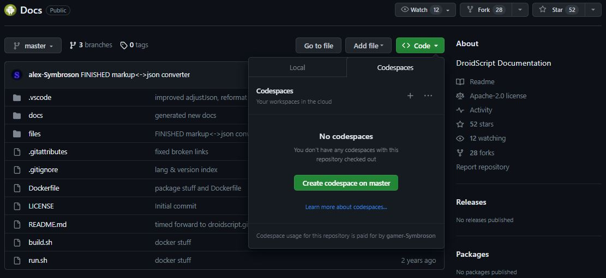
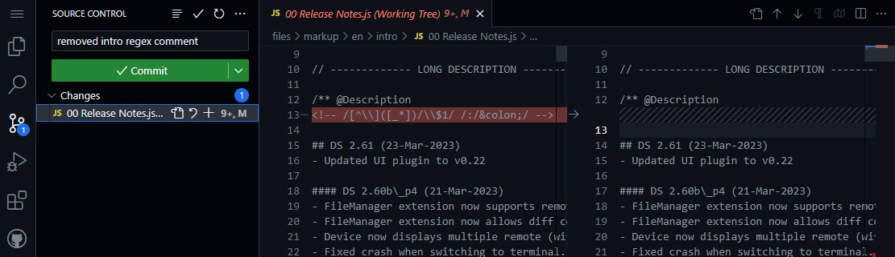
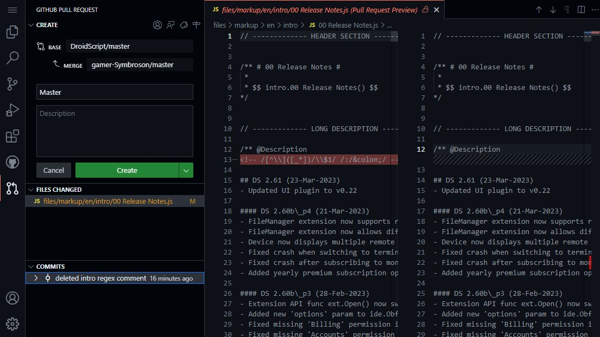

# Docs
## Table of Contents

- [Docs](#docs)
  - [Table of Contents](#table-of-contents)
  - [The Official DroidScript Documentation](#the-official-droidscript-documentation)
  - [Structure](#structure)
  - [For Contributors:](#for-contributors)
    - [Fork the DroidScript Repository](#fork-the-droidscript-repository)
    - [Make Changes](#make-changes)
    - [Commit Changes](#commit-changes)
    - [Create a Pull Request](#create-a-pull-request)
    - [Check on your Pull Request](#check-on-your-pull-request)

## The Official DroidScript Documentation

Preview available at https://droidscript.github.io/Docs

Mobile-sized iframe for desktop browsers: https://droidscript.github.io/Docs/docs

DocsPreview app for downloading the latest docs: https://github.com/SymDSTools/DocsPreview

More DS tools [here](https://github.com/SymDSTools)

## Structure

- **docs:** The latest generated documentation for the Github Pages preview
- **files:** docs source files and generation scripts

The docs sources are written in a custom [markup format](files/markdown/README.md). For legacy reasons those markup files will be converted into an intermediate [JSON Format](files/json/README.md) which will then be converted to the html docs you all know and love.

## For Contributors:

To contribute to the Docs you need to have an active GitHub account. [Sign up](https://github.com/signup?source_repo=DroidScript%2FDocs) if you dont have one.

### Fork the DroidScript Repository
To edit the Docs you need to 'fork' the DroidScript repository. The easiest way is to open up a new Codespace on the DroidScript repository.

### Make Changes
When the Codespace is open navigate to the files/markup/en directory and make changes on any file you want to contribute. DroidScript has multiple scopes each having its own subdirectory with every possible method defined as _markup.js_ file. Inside you can modify the description, subfunctions, parameters and more. Make sure to follow the [markup format](files/markdown/README.md)!

### Commit Changes
When you finished your changes switch to the git tab on the left and descibe briefly what you have changed in the commit message field. The first line should describe what you did in general and each following line should include a more detailed list of your changes.\
After that commit and synchronize your changes to github with the green button below. If you just opened the Codespace on the DroidScript repository it will ask to create a fork.

**Note:** there is an ongoing Codespace bug that prevents you from committing to your fork. If that applies to you, open your workspace terminal and execute `git push --set-upstream origin master`

### Create a Pull Request
When you are satisfied with your changes and want us to review your changes, go on to the github tab on the left and hit the small 'Create Pull Request' Button that appears on the 'Pull Requests' dropdown menu. This will open a new 'Pull Request' tab where you can provide a description of your changes across all commits you made. You can also review all your commits and changed files. After that hit the green 'Create' button. 

### Check on your Pull Request
When a developer is satisfied with the request he will merge them into the DroidScript repository. If not he will leave a comment on [your pull request](https://github.com/DroidScript/Docs/pull/60) so make sure to regulary check on it until it gets approved, and enable notifications.

<b><big>Thank you for your contribution and support of </strong>DroidScript.org</strong>.!</big></b>

