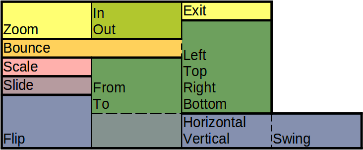

# DroidScript Documentation

## Native

### AddButton

Creates and adds a Button to a Layout.
```
app.AddButton(layout, text, width=-1, height=-1, options?)
```

Parameter | Type
--- | ---
layout | **app object:** [Layout](#CreateLayout)
text | **String**
width=-1 | **Number:** *fraction (0..1)*
height=-1 | **Number:** *fraction (0..1)*
options? | **String:** *comma “,” separated:* “FontAwesome”, “Html”, “Monospace”, “Normal” or “Aluminium” or “Gray” or “Lego”, “SingleLine”, “Custom”, “NoPad”, “FillX/Y”, “NoSound”
Return Value: | **app object:** Button


See [CreateButton](#CreateButton) for full documentation.


### AddCameraView

Creates and adds a CameraView to a Layout.
```
app.AddCameraView(layout, width=-1, height=-1, options?)
```

Parameter | Type
--- | ---
layout | **app object:** [Layout](#CreateLayout)
width=-1 | **Number:** *fraction (0..1)*
height=-1 | **Number:** *fraction (0..1)*
options? | **String:** *comma “,” separated:* “Front”, “UseBitmap”, “UseABGR”, “NoRotate”, “&lt;resolution&gt; *(CIF: 352x288$n$QQVGA: 160x120$n$QVGA: 320x240$n$SVGA: 800x600$n$VGA: 640x480$n$XGA: 1024x768$n$UXGA: 1600x1200)*”
Return Value: | **app object:** CameraView


See [CreateCameraView](#CreateCameraView) for full documentation.


### AddCanvas

Creates and adds a blank white [Image](CreateImage.htm) with the AutoUpdate feature turned off to a Layout.
```
app.AddCanvas(layout, width=-1, height=-1, options='', pxw=-1, pxh=-1)
```

Parameter | Type
--- | ---
layout | **app object:** [Layout](#CreateLayout)
width=-1 | **Number**
height=-1 | **Number**
options='' | **String:** *comma “,” separated:* “fix *(image with fixed resolution)*”, “alias”, “px *(use pixel values for size)*”, “Button *(causes image to depress like a button when touched)*”, “ScaleCenter”, “async *(loads the image asynchronously)*”, “FontAwesome”, “Resize”, “TouchThrough”, “Icon *(allows loading of app icons)*”, “wallpaper”, “NoPlay *(prevent gifs from playing automatically)*”
pxw=-1 | **Number:** *pixel*
pxh=-1 | **Number:** *pixel*
Return Value: | **app object:** [Image](#CreateImage)


See [CreateImage](#CreateImage) for full documentation.


### AddCheckBox

Creates and adds a CheckBox to a Layout.
```
app.AddCheckBox(layout, text, width=-1, height=-1, options?)
```

Parameter | Type
--- | ---
layout | **app object:** [Layout](#CreateLayout)
text | **String**
width=-1 | **Number:** *fraction (0..1)*
height=-1 | **Number:** *fraction (0..1)*
options? | **String:** *comma “,” separated:* “FillX/Y”, “NoSound”
Return Value: | **app object:** CheckBox


See [CreateCheckBox](#CreateCheckBox) for full documentation.


### AddCodeEdit

Creates and adds a CodeEdit to a Layout.
```
app.AddCodeEdit(layout, text, width=-1, height=-1, options?)
```

Parameter | Type
--- | ---
layout | **app object:** [Layout](#CreateLayout)
text | **String**
width=-1 | **Number:** *fraction (0..1)*
height=-1 | **Number:** *fraction (0..1)*
options? | **String:** *comma “,” separated:* “FillX/Y”
Return Value: | **app object:** CodeEdit


<div class='premHint'>**Note: This function is a premium feature. Please consider subscribing to Premium to use this feature and support DroidScript in its further development.**</div>

See [CreateCodeEdit](#CreateCodeEdit) for full documentation.


### AddDrawer

AddDrawer adds layout as drawer on a given side.
```
app.AddDrawer(layout, side, width=-1, grabWidth?)
```

Parameter | Type
--- | ---
layout | **app object:** [Layout](#CreateLayout)
side | **String:** “Left” or “Right”
width=-1 | **Number:** *fraction (0..1)*
grabWidth? | **Number:** *fraction (0..1)*


If the user swipes from this side to the other the layout will slide out.


See Also: [OpenDrawer](#OpenDrawer), [CloseDrawer](#CloseDrawer), [RemoveDrawer](#RemoveDrawer)

<details>
<summary>Example: left</summary>

```js
function OnStart()
{
	lay = app.CreateLayout( "Linear", "FillXY,VCenter" );

	txt1 = app.CreateText( "<-- swipe" );
	txt1.SetTextSize( 30 );
	lay.AddChild( txt1 );

	app.AddLayout( lay );

	layDrawer = app.CreateLayout( "Linear", "FillXY,VCenter" );
	layDrawer.SetBackground( "/Sys/Img/BlueBack.jpg" );

	txt2 = app.CreateText( "Hello" );
	txt2.SetTextSize( 40 );
	layDrawer.AddChild( txt2 );

	app.AddDrawer( layDrawer, "left", 0.8 );
}
```

```py
from native import app

def OnStart():
    lay = app.CreateLayout( "Linear", "FillXY,VCenter" )

    txt1 = app.CreateText( "<-- swipe" )
    txt1.SetTextSize( 30 )
    lay.AddChild( txt1 )

    app.AddLayout( lay )

    layDrawer = app.CreateLayout( "Linear", "FillXY,VCenter" )
    layDrawer.SetBackground( "/Sys/Img/BlueBack.jpg" )

    txt2 = app.CreateText( "Hello" )
    txt2.SetTextSize( 40 )
    layDrawer.AddChild( txt2 )

    app.AddDrawer( layDrawer, "left", 0.8 )
```
</details>


### AddImage

Creates and adds a Image to a Layout.
```
app.AddImage(layout, file, width=-1, height=-1, options='', pxw=-1, pxh=-1)
```

Parameter | Type
--- | ---
layout | **app object:** [Layout](#CreateLayout)
file | **String:** *path to file ( “/absolute/...” or “relative/...” )*
width=-1 | **Number**
height=-1 | **Number**
options='' | **String:** *comma “,” separated:* “fix”, “alias”, “px *(use pixel values for size)*”, “Button *(causes image to depress like a button when touched)*”, “ScaleCenter”, “async *(loads the image asynchronously)*”, “FontAwesome”, “Resize”, “TouchThrough”, “Icon *(allows loading of app icons)*”, “wallpaper”, “NoPlay *(prevent gifs from playing automatically)*”
pxw=-1 | **Number:** *pixel*
pxh=-1 | **Number:** *pixel*
Return Value: | **app object:** Image


See [CreateImage](#CreateImage) for full documentation.


### AddLayout

AddLayout adds a layout to the screen so that it is visible (if not hidden with SetVisibility)

When [CreateLayout](#CreateLayout) arguments are passed it will create the layout just like app.CreateLayout and also add it.
```
app.AddLayout(layout, type?, options?)
```

Parameter | Type
--- | ---
layout | **app object:** [Layout](#CreateLayout)
type? | **String:** “Linear” or “Absolute” or “Frame” or “Card”
options? | **String:** *comma “,” separated:* “TouchThrough *(forwards touch events to underlying children)*”, “TouchSpy *(spies for touch events on all children)*”, “Left” or “Top” or “Right” or “Bottom” or “Center” or “H/VCenter”, “Wrap”, “Horizontal” or “Vertical”, “FillX/Y”
Return Value: | **app object:** Layout


See Also: [RemoveLayout](#RemoveLayout)

<details>
<summary>Example: Vertical</summary>

```js
function OnStart()
{
    lay = app.CreateLayout( "Linear", "FillXY,VCenter" );

    txt = app.CreateText( "Hello" );
    txt.SetTextSize( 50 );
    lay.AddChild( txt );

    app.AddLayout( lay );
}
```

```py
from native import app

def OnStart():
    lay = app.CreateLayout( "Linear", "FillXY,VCenter" )

    txt = app.CreateText( "Hello" )
    txt.SetTextSize( 50 )
    lay.AddChild( txt )

    app.AddLayout( lay )
```
</details>


### AddList

Creates and adds a List to a Layout.
```
app.AddList(layout, list, width=-1, height=-1, options='', delim=',')
```

Parameter | Type
--- | ---
layout | **app object:** [Layout](#CreateLayout)
list | **String:** *separated*
width=-1 | **Number:** *fraction (0..1)*
height=-1 | **Number:** *fraction (0..1)*
options='' | **String:** *comma “,” separated:* “bold *(bold item titles)*” or “Expand *(Expand list to full height inside scrollers)*”, “Menu *(applies various settings to make the list appear like an in-app menu)*”, “Horiz *(makes title and body text flow horizontally)*”, “html”, “FontAwesome”, “monospace”, “Normal”, “WhiteGrad” or “BlackGrad” or “AlumButton” or “GreenButton” or “OrangeButton”, “NoSound”
delim=',' | **String**
Return Value: | **app object:** List


See [CreateList](#CreateList) for full documentation.


### AddScroller

Creates and adds a Scroller to a Layout.
```
app.AddScroller(layout, width=-1, height=-1, options?)
```

Parameter | Type
--- | ---
layout | **app object:** [Layout](#CreateLayout)
width=-1 | **Number:** *fraction (0..1)*
height=-1 | **Number:** *fraction (0..1)*
options? | **String:** *comma “,” separated:* “FillX” or “FillY” or “FillXY”, “Horizontal” or “Vertical”, “NoScrollBar”, “ScrollFade”
Return Value: | **app object:** Scroller


See [CreateScroller](#CreateScroller) for full documentation.


### AddSeekBar

Creates and adds a SeekBar to a Layout.
```
app.AddSeekBar(layout, width=-1, height=-1, options?)
```

Parameter | Type
--- | ---
layout | **app object:** [Layout](#CreateLayout)
width=-1 | **Number:** *fraction (0..1)*
height=-1 | **Number:** *fraction (0..1)*
options? | **String:** *comma “,” separated:* “FillX/Y”
Return Value: | **app object:** SeekBar


See [CreateSeekBar](#CreateSeekBar) for full documentation.


### AddSpinner

Creates and adds a Spinner to a Layout.
```
app.AddSpinner(layout, list, width=-1, height=-1, options?)
```

Parameter | Type
--- | ---
layout | **app object:** [Layout](#CreateLayout)
list | **String:** *comma “,” separated*
width=-1 | **Number:** *fraction (0..1)*
height=-1 | **Number:** *fraction (0..1)*
options? | **String:** *comma “,” separated:* “FillX/Y”, “NoSound”
Return Value: | **app object:** Spinner


See [CreateSpinner](#CreateSpinner) for full documentation.


### AddSwitch

Creates and adds a Switch toggle to a Layout.
```
app.AddSwitch(layout, text, width=-1, height=-1, options?)
```

Parameter | Type
--- | ---
layout | **app object:** [Layout](#CreateLayout)
text | **String**
width=-1 | **Number:** *fraction (0..1)*
height=-1 | **Number:** *fraction (0..1)*
options? | **String:** *comma “,” separated:* “Monospace”, “Custom”, “NoPad”, “FillX/Y”, “NoSound”
Return Value: | **app object:** Switch


See [CreateSwitch](#CreateSwitch) for full documentation.


### AddTabs

Creates and adds a Tabs control to a Layout.
```
app.AddTabs(list, width=-1, height=-1, options?)
```

Parameter | Type
--- | ---
list | **String:** *comma “,” separated*
width=-1 | **Number:** *fraction (0..1)*
height=-1 | **Number:** *fraction (0..1)*
options? | **String:** *comma “,” separated:* “Fade”, “FontAwesome”, “NoMargins”, “VCenter”
Return Value: | **app object:** Tabs


See [CreateTabs](#CreateTabs) for full documentation.


### AddText

Creates and adds a Text to a Layout.
```
app.AddText(layout, text, width=-1, height=-1, options?)
```

Parameter | Type
--- | ---
layout | **app object:** [Layout](#CreateLayout)
text | **String**
width=-1 | **Number:** *fraction (0..1)*
height=-1 | **Number:** *fraction (0..1)*
options? | **String:** *comma “,” separated:* “AutoScale”, “AutoSize”, “Multiline”, “Left” or “Right”, “Html”, “Bold”, “Monospace”, “NoWrap”, “Log”, “FillX/Y”
Return Value: | **app object:** Text


See [CreateText](#CreateText) for full documentation.


### AddTextEdit

Creates and adds a TextEdit to a Layout.
```
app.AddTextEdit(layout, text, width=-1, height=-1, options?)
```

Parameter | Type
--- | ---
layout | **app object:** [Layout](#CreateLayout)
text | **String**
width=-1 | **Number:** *fraction (0..1)*
height=-1 | **Number:** *fraction (0..1)*
options? | **String:** *comma “,” separated:* “AutoSelect *(Select all Text if user enter the Textedit)*”, “AutoSize *(Expand or shrink the control automatically so the text fits in the Textedit)*”, “Bold *(Write bold text)*”, “Extract *(enables full screen keyboard in landscape mode)*”, “Left *(Justify the text to the left)*” or “Center *(Justify the text in the middle)*” or “Right *(Justify the text to the right)*” or “Monospace”, “NoSpell *(Disable the spell-checker)*”, “NoKeyboard *(Shows no Keyboard)*” or “Numbers”, “ReadOnly *(The user cant change the Text)*”, “SingleLine *(Dont break text for long lines and change 'Enter' key to 'Done')*”, “FillX/Y”, “Password *(displays characters as dots)*”
Return Value: | **app object:** TextEdit


See [CreateTextEdit](#CreateTextEdit) for full documentation.


### AddToggle

Creates and adds a Toggle to a Layout.
```
app.AddToggle(layout, text, width=-1, height=-1, options?)
```

Parameter | Type
--- | ---
layout | **app object:** [Layout](#CreateLayout)
text | **String**
width=-1 | **Number:** *fraction (0..1)*
height=-1 | **Number:** *fraction (0..1)*
options? | **String:** *comma “,” separated:* “Monospace”, “Custom”, “NoPad”, “FillX/Y”, “NoSound”
Return Value: | **app object:** Toggle


See [CreateToggle](#CreateToggle) for full documentation.


### AddVideoView

Creates and adds a VideoView to a Layout.
```
app.AddVideoView(layout, width=-1, height=-1, options?)
```

Parameter | Type
--- | ---
layout | **app object:** [Layout](#CreateLayout)
width=-1 | **Number:** *fraction (0..1)*
height=-1 | **Number:** *fraction (0..1)*
options? | **String:** *comma “,” separated*
Return Value: | **app object:** VideoView


See [CreateVideoView](#CreateVideoView) for full documentation.


### AddWebView

Creates and adds a WebView to a Layout.
```
app.AddWebView(layout, width=-1, height=-1, options='', zoom?)
```

Parameter | Type
--- | ---
layout | **app object:** [Layout](#CreateLayout)
width=-1 | **Number:** *fraction (0..1)*
height=-1 | **Number:** *fraction (0..1)*
options='' | **String:** *comma “,” separated:* “AllowZoom *(Allows the user to zoom the page)*”, “AutoZoom”, “Wide *(force page using “wide” viewport)*”, “FillX/Y”, “NoAccel *(for OrangePi support)*”, “NoActionBar *(prevents copy/paste popup)*”, “IgnoreErrors”, “IgnoreSSLErrors”, “NoApp *(prevent app.* calls)*”, “NoCapture *(Disable camera)*”, “NoCors *(attempts to disable CORS and i-frame restrictions)*”, “NoLocate *(Disable location sensor)*”, “NoLongTouch”, “NoPause *(Dont pause WebView when app in background)*”, “NoScrollBars”, “Overview *(Zoom to full width of page)*”, “Progress *(Shows a progress indicator when loading)*”, “ScrollFade”, “UseBasicInput *(makes softkeyboard useful for html code editors)*”, “UseBrowser *(Open links in external browser)*”
zoom? | **Number:** *percent*
Return Value: | **app object:** WebView


See [CreateWebView](#CreateWebView) for full documentation.


### Alert

Alert shows a simple text dialog with a colored title and a 'Ok' button to exit.
```
app.Alert(message, title?, options='', hue?)
```

Parameter | Type
--- | ---
message | **String**
title? | **String**
options='' | **String:** *comma “,” separated:* “NoDim”, “NoFocus”
hue? | **Number:** *integer:* -180..180


If title was not given the dialog looks like a normal alert box.

Without the NoDim option the background behind the dialog will be darkened.


**Note:** If no (or a falsy) title is specified the method will use the standard DOM alert() method, which will block the code's execution until closed.


See Also: [Error](#Error), [ShowTextDialog](#ShowTextDialog), [CreateYesNoDialog](#CreateYesNoDialog).


<details>
<summary>Example: No Title</summary>

```js
function OnStart()
{
	app.Alert( "Hello World!" );
}
```

```py
from native import app

def OnStart():
    app.Alert( "Hello World!" )
```
</details>

<details>
<summary>Example: Yellow Title</summary>

```js
function OnStart()
{
	app.Alert( "This is an alert box", "Hello Yellow World!", "", -100 );
}
```

```py
from native import app

def OnStart():
    app.Alert( "This is an alert box", "Hello Yellow World!", "", -100 )
```
</details>


### Animate

Animate calls a function repeatedly like setInterval() but with the current time (Date.getTime()) and the difference to the last call in milliseconds as parameter.
```
app.Animate(callback?, fps=-1)
```

Parameter | Type
--- | ---
callback? | **function(time,dtime)**<table><tr><th>Parameter</th><th>Type</th></tr><tr><td>time</td><td>**Number:** *milliseconds*</td></tr>,<tr><td>dtime</td><td>**Number:** *milliseconds*</td></tr></table>
fps=-1 | **Number:** *frames per second*


To stop the animation loop you can pass _null_ as first argument.

You can not have multiple animation loops at once.

When using _cfg.NoDom_; you cannot use JavaScripts _setInterval_ but only the _Animate_ function.

<red>Note: The _NoDom_ option is currently not available due to GooglePlays 64bit requirement since August 2019.</red>


##### Comparison

**normal**:

    _setInterval_: about 242 calls per second

    _app.Animate_: about 217 calls per second


**with <docstr>“NoDom”</docstr> option**:

    _setInterval_: error

    _app.Animate_: up to 1000 calls per second


<details>
<summary>Example: Multiple Animation loops</summary>

```js
function OnStart()
{
    lay = app.CreateLayout("Linear");

    txt1 = app.CreateText("0");
    lay.AddChild(txt1);

    txt2 = app.CreateText("0");
    lay.AddChild(txt2);

    app.AddLayout(lay);

    // delay between calls: 1000ms / 10fps = 100 ms
    // for higher precision use higher fps
    app.Animate(loop, 10);
}

var t1 = 0, t2 = 0, n1 = 0, n2 = 0;
function loop(t, dt)
{
    // set txt1 every 500 ms
    if(t - t1 >= 500)
    {
        txt1.SetText(++n1 + "\tdt: " + (t - t1));
        t1 = t;
    }

    // set txt2 every 300 ms
    if(t - t2 >= 300)
    {
        txt2.SetText(++n2 + "\tdt: " + (t - t2));
        t2 = t;
    }
}
```

```py
from native import app

def OnStart():
    global txt1, txt2, n1, n2
    lay = app.CreateLayout("Linear")

    txt1 = app.CreateText("0")
    lay.AddChild(txt1)

    txt2 = app.CreateText("0")
    lay.AddChild(txt2)

    app.AddLayout(lay)

    # delay between calls: 1000ms / 10fps = 100 ms
    # for higher precision use higher fps
    app.Animate(loop, 10)

t1 = 0
t2 = 0
n1 = 0
n2 = 0
def loop(t, dt):
    # set txt1 every 500 ms
    if t - t1 >= 500:
        txt1.SetText(str(++n1) + "\tdt: " + str(t - t1))
        t1 = t

    # set txt2 every 300 ms
    if t - t2 >= 300:
        txt2.SetText(str(++n2) + "\tdt: " + str(t - t2))
        t2 = t
```
</details>

<details>
<summary>Example: Digital Clock</summary>

```js
function OnStart()
{
    app.SetOrientation( "Portrait" );
    app.SetDebugEnabled( false );

    lay = app.CreateLayout( "Linear", "FillXY,VCenter" );

    txt = app.CreateText( "", -1, -1, "multiline" );
    txt.SetTextSize( 30 );
    lay.AddChild( txt );

    app.AddLayout( lay );

    app.Animate( OnAnimate, 30 );
}

function OnAnimate( time, dtime )
{
    txt.SetText( new Date().toLocaleString() + "\n" + time );
}
```

```py
from native import app

def OnStart():
    global txt
    app.SetOrientation("Portrait")
    app.SetDebugEnabled(False)

    lay = app.CreateLayout("Linear", "FillXY,VCenter")

    txt = app.CreateText("", -1, -1, "multiline")
    txt.SetTextSize(30)
    lay.AddChild(txt)

    app.AddLayout(lay)

    app.Animate( OnAnimate, 30 );
    app.Animate(OnAnimate, 30)

def OnAnimate(time, dtime):
    txt.SetText(str(new Date().toLocaleString()) + "\n" + str(time))
```
</details>

<details>
<summary>Example: SpeedTest</summary>

```js
cfg.No_Dom;

var ltime = Date.now(), c = 0;

function OnStart()
{
    lay = app.CreateLayout( "Linear", "FillXY,VCenter" );

    txt = app.CreateText( "", .5, .1, "left" );
    lay.AddChild( txt );

    app.AddLayout( lay );

    app.Animate(OnAnimate, 1000);
}

function OnAnimate( time, dtime )
{
    c++;
    if( time - ltime >= 1000 ) {
        txt.SetText( c + " cps" );
        ltime = time;
        c = 0;
    }
}
```

```py
### cfg.No_Dom

from native import app
import time as Date

ltime = Date.now()
c = 0

def OnStart():
    global txt
    lay = app.CreateLayout("Linear", "FillXY,VCenter")

    txt = app.CreateText("", .5, .1, "left")
    lay.AddChild(txt)

    app.AddLayout(lay)

    app.Animate(OnAnimate, 1000);
    app.Animate(OnAnimate, 1000)

def OnAnimate(time, dtime):
    c += 1
    if time - ltime >= 1000:
        txt.SetText(str(c) + " cps")
        ltime = time
        c = 0
```
</details>


### Broadcast

Broadcast is used for broadcasting messages between DroidScript apps.
```
app.Broadcast(type, message)
```

Parameter | Type
--- | ---
type | **String:** “Exec”
message | **String**


See Also: [SetOnBroadcast](#SetOnBroadcast)


### BroadcastIntent

Send a broadcasting intent with a custom action.
```
app.BroadcastIntent(action, category, data, type, extras, options?)
```

Parameter | Type
--- | ---
action | **String:** “android action”
category | **String**
data | **String**
type | **String**
extras | **String**
options? | **String:** *comma “,” separated*


### Call

Call is used to call the given phone number.
```
app.Call(number)
```

Parameter | Type
--- | ---
number | **String:** “number”


<details>
<summary>Example: Check Voice Messages</summary>

```js
function OnStart()
{
    lay = app.CreateLayout( "linear", "VCenter,FillXY" );

    edtNumber = app.CreateTextEdit( "5500", .8, -1, "singleline,number,center" );
    edtNumber.SetTextSize(20);
    lay.AddChild(edtNumber);

	btnPhone = app.CreateButton( "Call", 0.5, 0.1 );
	btnPhone.SetOnTouch( btnCall_OnTouch );
	lay.AddChild( btnPhone );

	app.AddLayout( lay );
}

function btnCall_OnTouch()
{
	app.Call( edtNumber.GetText() );
}
```

```py
from native import app

def OnStart():
    global edtNumber
    lay = app.CreateLayout( "linear", "VCenter,FillXY" )

    edtNumber = app.CreateTextEdit( "5500", .8, -1, "singleline,number,center" )
    edtNumber.SetTextSize(20)
    lay.AddChild(edtNumber)

    btnPhone = app.CreateButton( "Call", 0.5, 0.1 )
    btnPhone.SetOnTouch( btnCall_OnTouch )
    lay.AddChild( btnPhone )

    app.AddLayout( lay )

def btnCall_OnTouch():
    app.Call( edtNumber.GetText() )
```
</details>


### CancelJob

Cancels a background job started via [ScheduleJob](#ScheduleJob).
```
app.CancelJob()
```


### CheckLicense

Will trigger a standard Google Play license check for the running application (if it is a paid App).
```
app.CheckLicense(key)
```

Parameter | Type
--- | ---
key | **String:** *base64 encoded:* “GPlay license key”


The key can be found under <docstr>“Development Tools > Services and API's”</docstr> in the GooglePlay developer console.

If the App is not licensed it will show a dialog asking them to purchase the App from Google Play and then close the App.


### CheckPermission

CheckPermission checks whether the permission of a particular component has been granted.
```
app.CheckPermission(type)
```

Parameter | Type
--- | ---
type | **String:** “Camera” or “Storage” or “ExtSDcard” or “Network” or “Notify” or “Location” or “SMS” or “Calendar” or “Body” or “Contacts” or “Record” or “Biometric” or “Phone” or “Accounts” or “License” or “android.permission.*”
Return Value: | **List:** [<docstr>“Permissions”</docstr> *(**String:** <docstr>“not granted permissions”</docstr>)* ]


You can also test for individual <docstr>“android.permission.*”</docstr> strings.


See Also: [GetPermission](#GetPermission) [RemovePermission](#RemovePermission) [ListPermissions](#ListPermissions)

<details>
<summary>Example: check and get permissions</summary>

```js
function OnStart()
{
    var check = app.CheckPermission( "Camera,ExtSDcard,Network,Storage" );
    if( check )
    {
        app.GetPermission( check, PermissionResult );
    }
    else alert( "everything ok!" );
}

function PermissionResult( ungranted )
{
    alert( "ungranted: " + ungranted );
}
```

```py
from native import app

def OnStart():
    check = app.CheckPermission( "Camera,ExtSDcard,Network,Storage" )
    if check:
        app.GetPermission( check, PermissionResult )
    else:
        app.Alert( "everything ok!" )

def PermissionResult( ungranted ):
    app.Alert( "ungranted: " + ungranted )
```
</details>


### ChooseAccount

Opens an Android dialog and allows the user to select one of the registered Google/Gmail accounts or add one.
```
app.ChooseAccount(callback)
```

Parameter | Type
--- | ---
callback | **function(account)**<table><tr><th>Parameter</th><th>Type</th></tr><tr><td>account</td><td>**String:** “email”</td></tr></table>


The selected email address is returned as the first argument in the callback function.


See Also: [GetAccounts](#GetAccounts)

<details>
<summary>Example: Choose Account</summary>

```js
function OnStart()
{
    lay = app.CreateLayout( "linear", "VCenter,FillXY" );

	btnChoose = app.CreateButton( "Choose Account", 0.5, 0.1 );
	btnChoose.SetOnTouch( btnChoose_OnTouch );
	lay.AddChild( btnChoose );

	app.AddLayout( lay );
}

function btnChoose_OnTouch()
{
	app.ChooseAccount( OnChoose );
}

function OnChoose( account )
{
    alert( "selected account: " + account );
}
```

```py
from native import app

def OnStart():
    lay = app.CreateLayout( "linear", "VCenter,FillXY" )

    btnChoose = app.CreateButton( "Choose Account", 0.5, 0.1 )
    btnChoose.SetOnTouch( btnChoose_OnTouch )
    lay.AddChild( btnChoose )

    app.AddLayout( lay )

def btnChoose_OnTouch():
    app.ChooseAccount( OnChoose )

def OnChoose( account ):
    app.Alert( "selected account: " + account )
```
</details>


### ChooseContact

ChooseContact opens the Contacts app so that the user can select the name and either the phone number or email address of a user.
```
app.ChooseContact(type, callback)
```

Parameter | Type
--- | ---
type | **String:** “Phone” or “Email”
callback | **function(name,data)**<table><tr><th>Parameter</th><th>Type</th></tr><tr><td>name</td><td>**String**</td></tr>,<tr><td>data</td><td>**String**</td></tr></table>


<details>
<summary>Example: Choose Phone Number</summary>

```js
function OnStart()
{
    lay = app.CreateLayout( "linear", "VCenter,FillXY" );

	btnChoose = app.CreateButton( "Choose Phone", 0.5, 0.1 );
	btnChoose.SetOnTouch( btnChoose_OnTouch );
	lay.AddChild( btnChoose );

	app.AddLayout( lay );
}

function btnChoose_OnTouch()
{
	app.ChooseContact( "phone", OnPhoneChoose );
}

function OnPhoneChoose( name, number )
{
     app.ShowPopup( name + " " + number );
}
```

```py
from native import app

def OnStart():
    lay = app.CreateLayout( "linear", "VCenter,FillXY" )

    btnChoose = app.CreateButton( "Choose Phone", 0.5, 0.1 )
    btnChoose.SetOnTouch( btnChoose_OnTouch )
    lay.AddChild( btnChoose )

    app.AddLayout( lay )

def btnChoose_OnTouch():
    app.ChooseContact( "phone", OnPhoneChoose )

def OnPhoneChoose( name, number ):
    app.ShowPopup( name + " " + number )
```
</details>

<details>
<summary>Example: Choose Email Address</summary>

```js
function OnStart()
{
    lay = app.CreateLayout( "linear", "VCenter,FillXY" );

	btnChoose = app.CreateButton( "Choose Email", 0.5, 0.1 );
	btnChoose.SetOnTouch( btnChoose_OnTouch );
	lay.AddChild( btnChoose );

	app.AddLayout( lay );
}

function btnChoose_OnTouch()
{
	app.ChooseContact( "email", OnEmailChoose );
}

function OnEmailChoose( name, email )
{
     app.ShowPopup( name + " " + email );
}
```

```py
from native import app

def OnStart():
    lay = app.CreateLayout( "linear", "VCenter,FillXY" )

    btnChoose = app.CreateButton( "Choose Email", 0.5, 0.1 )
    btnChoose.SetOnTouch( btnChoose_OnTouch )
    lay.AddChild( btnChoose )

    app.AddLayout( lay )

def btnChoose_OnTouch():
    app.ChooseContact( "email", OnEmailChoose )

def OnEmailChoose( name, email ):
    app.ShowPopup( name + " " + email )
```
</details>


### ChooseFile

ChooseFile opens a file picker for user to select a local file or a file from GoogleDrive, OneDrive or DropBox.
```
app.ChooseFile(message, type, callback, fldr?, options?)
```

Parameter | Type
--- | ---
message | **String**
type | **String:** “file mimetype”
callback | **function(path,name)**<table><tr><th>Parameter</th><th>Type</th></tr><tr><td>path</td><td>**String:** *path to file or folder ( “/absolute/...” or “relative/...” )* **or** **String:** *URI encoded*</td></tr>,<tr><td>name</td><td>**String**</td></tr></table>
fldr? | **String:** *path to file or folder ( “/absolute/...” or “relative/...” )*
options? | **String:** *comma “,” separated:* “persist *(keep file permission after reboot)*”, “nodownload *(prevents file downloads)*”


See Also: [ReadFile](#ReadFile)

<details>
<summary>Example: Choose File by Mimetype</summary>

```js
function OnStart()
{
    lay = app.CreateLayout( "linear", "VCenter,FillXY" );

    var list = "*/*,application/text,application/apk,application/zip," +
        "audio/mpeg,audio/mp4,audio/ogg,image/png,image/jpeg,text/css," +
        "text/html,text/javascript,text/plain,video/mpeg,video/mp4,video/ogg";

    spnMime = app.CreateSpinner(list);
    lay.AddChild(spnMime);

    btnChoose = app.CreateButton( "Choose File", 0.5, 0.1 );
    btnChoose.SetOnTouch( btnChoose_OnTouch );
    lay.AddChild( btnChoose );

    app.AddLayout( lay );
}

function btnChoose_OnTouch()
{
    app.ChooseFile( "Choose a File", spnMime.GetText(), OnChoose );
}

function OnChoose( file )
{
    alert( "file path: " + file );
}
```

```py
from native import app

def OnStart():
    global spnMime
    lay = app.CreateLayout( "linear", "VCenter,FillXY" )

    list = "*/*,application/text,application/apk,application/zip," + \
        "audio/mpeg,audio/mp4,audio/ogg,image/png,image/jpeg,text/css," + \
        "text/html,text/javascript,text/plain,video/mpeg,video/mp4,video/ogg"

    spnMime = app.CreateSpinner(list)
    lay.AddChild(spnMime)

    btnChoose = app.CreateButton( "Choose File", 0.5, 0.1 )
    btnChoose.SetOnTouch( btnChoose_OnTouch )
    lay.AddChild( btnChoose )

    app.AddLayout( lay )

def btnChoose_OnTouch():
    app.ChooseFile( "Choose a File", spnMime.GetText(), OnChoose )

def OnChoose( file ):
    app.Alert( "file path: " + file )
```
</details>


### ChooseImage

ChooseImage opens the photo gallery for user to select an image.
```
app.ChooseImage(options, callback)
```

Parameter | Type
--- | ---
options | **String:** *comma “,” separated:* “” or “internal” or “external”
callback | **function(path)**<table><tr><th>Parameter</th><th>Type</th></tr><tr><td>path</td><td>**String:** *path to file or folder ( “/absolute/...” or “relative/...” )*</td></tr></table>


See Also: [CreateImage](#CreateImage)

<details>
<summary>Example: Choose Image</summary>

```js
function OnStart()
{
    lay = app.CreateLayout( "linear", "VCenter,FillXY" );

    btnChoose = app.CreateButton( "Choose Image", 0.5, 0.1 );
	btnChoose.SetOnTouch( btnChoose_OnTouch );
	lay.AddChild( btnChoose );

	app.AddLayout( lay );
}

function btnChoose_OnTouch()
{
	app.ChooseImage( "internal", OnChoose );
}

function OnChoose( path )
{
    alert( "image path: " + path );
}
```

```py
from native import app

def OnStart():
    lay = app.CreateLayout( "linear", "VCenter,FillXY" )

    btnChoose = app.CreateButton("Choose Image", 0.5, 0.1)
    btnChoose.SetOnTouch(btnChoose_OnTouch)
    lay.AddChild(btnChoose)

    app.AddLayout(lay)

def btnChoose_OnTouch():
    app.ChooseImage("internal", OnChoose)

def OnChoose(path):
    app.Alert("image path: " + path)
```
</details>


### ChooseWifi

ChooseWifi lets the user select a WiFi network in range.
```
app.ChooseWifi(title1, title2, callback, options='', extra?)
```

Parameter | Type
--- | ---
title1 | **String**
title2 | **String**
callback | **function(ssid)**<table><tr><th>Parameter</th><th>Type</th></tr><tr><td>ssid</td><td>**String**</td></tr></table>
options='' | **String:** *comma “,” separated:* “force” or “large”
extra? | **String:** “ssids”


**title1** and **title2** are the titles for the scanning and the selection process. They default to <docstr>“Scanning”</docstr> and <docstr>“Select WiFi”</docstr>.


The **callback** function returns the name and the ssid of the selected network.


You can set the _force_ option so that the dialog cannot be closed until the user has selected an item.


Finally you can add extra items as pipe <docstr>“|”</docstr> separated string - ie. to add a default <docstr>“[None]”</docstr> entry to select no wifi network.


See Also:  [WifiConnect](#WifiConnect)


<details>
<summary>Example: Choose WiFi Network</summary>

```js
function OnStart()
{
    lay = app.CreateLayout( "linear", "VCenter,FillXY" );

	btnChoose = app.CreateButton( "Choose WiFi", 0.5, 0.1 );
	btnChoose.SetOnTouch( btnChoose_OnTouch );
	lay.AddChild( btnChoose );

	app.AddLayout( lay );
}

function btnChoose_OnTouch()
{
	app.ChooseWifi( "", "", OnWifiChoose );
}

function OnWifiChoose( ssid )
{
     app.ShowPopup( "User selected " + ssid );
}
```

```py
from native import app

def OnStart():
    lay = app.CreateLayout( "linear", "VCenter,FillXY" )

    btnChoose = app.CreateButton( "Choose WiFi", 0.5, 0.1 )
    btnChoose.SetOnTouch( btnChoose_OnTouch )
    lay.AddChild( btnChoose )

    app.AddLayout( lay )

def btnChoose_OnTouch():
    app.ChooseWifi( "", "", OnWifiChoose )

def OnWifiChoose( ssid ):
    app.ShowPopup( "User selected " + ssid )
```
</details>


### ClearCookies

ClearCookies clears the saved cookies for webviews or html apps.
```
app.ClearCookies()
```


See Also: [SaveCookies](#SaveCookies)


### ClearData

ClearData deletes variables saved via app.Save*().
```
app.ClearData(file?)
```

Parameter | Type
--- | ---
file? | **String:** *path to file ( “/absolute/...” or “relative/...” )*


The file parameter is optional. If given, the specified file will be used, otherwise it will be located in the apps private Folder.


See Also: [SetData](#SetData),


See Also: [GetData](#GetData)

<details>
<summary>Example: Save, Load and Clear Data</summary>

```js
var file = "demofile";

function OnStart()
{
    lay = app.CreateLayout( "linear", "VCenter,FillXY" );

    var text = getValues();
    txtValues = app.CreateText( text, .5, -1, "multiline,left" );
    lay.AddChild( txtValues );

    btnClear = app.CreateButton( "Clear Data", 0.5, 0.1 );
	btnClear.SetOnTouch( btnClear_OnTouch );
	lay.AddChild( btnClear );

	app.AddLayout( lay );
}

function btnClear_OnTouch()
{
	app.ClearData( file );
    txtValues.SetText( getValues() );
	app.ShowPopup( "Data Cleared." );
}

function getValues()
{
    return (
        "saved Text: " + app.LoadText( "value", "No Value stored.", file ) + "\n" +
        "click count: " + app.LoadNumber( "clicks", 0, file ) + "\n" +
        "first start: " + app.LoadBoolean( "first", true, file ) + "\n");
}
```

```py
from native import app

file = "demofile"

def OnStart():
    global txtValues
    lay = app.CreateLayout( "linear", "VCenter,FillXY" )

    text = getValues()
    txtValues = app.CreateText( text, .5, -1, "multiline,left" )
    lay.AddChild( txtValues )

    btnClear = app.CreateButton( "Clear Data", 0.5, 0.1 )
	btnClear.SetOnTouch( btnClear_OnTouch )
	lay.AddChild( btnClear )

	app.AddLayout( lay )

def btnClear_OnTouch():
	app.ClearData( file )
    txtValues.SetText( getValues() )
	app.ShowPopup( "Data Cleared." )

def getValues():
    return (
        "saved Text: " + app.LoadText( "value", "No Value stored.", file ) + "\n" +
        "click count: " + app.LoadNumber( "clicks", 0, file ) + "\n" +
        "first start: " + app.LoadBoolean( "first", True, file ) + "\n")
```
</details>


### ClearValue

ClearValue deletes a variable saved via app.Save*().
```
app.ClearValue(name, file?)
```

Parameter | Type
--- | ---
name | **String**
file? | **String:** *path to file ( “/absolute/...” or “relative/...” )*


The file parameter is optional. If given, the specified file will be used, otherwise it will be located in the apps private Folder.


See Also: [SaveText](#SaveText), [SaveNumber](#SaveNumber), [SaveBoolean](#SaveBoolean)

<details>
<summary>Example: Save, Load and Clear Data</summary>

```js
var file = "demofile";

function OnStart()
{
    lay = app.CreateLayout( "linear", "VCenter,FillXY" );

    var text = app.LoadText( "value", "My Value", file );
    edtValue = app.CreateTextEdit( text, .5 );
    lay.AddChild( edtValue );

    btnSave = app.CreateButton( "Save Value", 0.5, 0.1 );
	btnSave.SetOnTouch( btnSave_OnTouch );
	lay.AddChild( btnSave );

    btnLoad = app.CreateButton( "Load Value", 0.5, 0.1 );
	btnLoad.SetOnTouch( btnLoad_OnTouch );
	lay.AddChild( btnLoad );

    btnClear = app.CreateButton( "Clear Value", 0.5, 0.1 );
	btnClear.SetOnTouch( btnClear_OnTouch );
	lay.AddChild( btnClear );

	app.AddLayout( lay );
}

function btnSave_OnTouch()
{
	app.SaveText( "value", edtValue.GetText(), file );
	app.ShowPopup( "Value Saved." );
}

function btnLoad_OnTouch()
{
    var value = app.LoadText( "value", "no value stored", file );
	app.ShowPopup( value );
}

function btnClear_OnTouch()
{
	app.ClearData( file );
	app.ShowPopup( "Data Cleared." );
}
```

```py
from native import app

file = "demofile"

def OnStart():
    global edtValue
    lay = app.CreateLayout( "linear", "VCenter,FillXY" )

    text = app.LoadText( "value", "My Value", file )
    edtValue = app.CreateTextEdit( text, .5 )
    lay.AddChild( edtValue )

    btnSave = app.CreateButton( "Save Value", 0.5, 0.1 )
	btnSave.SetOnTouch( btnSave_OnTouch )
	lay.AddChild( btnSave )

    btnLoad = app.CreateButton( "Load Value", 0.5, 0.1 )
	btnLoad.SetOnTouch( btnLoad_OnTouch )
	lay.AddChild( btnLoad )

    btnClear = app.CreateButton( "Clear Value", 0.5, 0.1 )
	btnClear.SetOnTouch( btnClear_OnTouch )
	lay.AddChild( btnClear )

	app.AddLayout( lay )

def btnSave_OnTouch():
	app.SaveText( "value", edtValue.GetText(), file )
	app.ShowPopup( "Value Saved." )

def btnLoad_OnTouch():
    value = app.LoadText( "value", "no value stored", file )
	app.ShowPopup( value )

def btnClear_OnTouch():
	app.ClearData( file )
	app.ShowPopup( "Data Cleared." )
```
</details>


### CloseDrawer

Closes the drawer layout on the given side with slide animation.
```
app.CloseDrawer(side?)
```

Parameter | Type
--- | ---
side? | **String:** “Left” or “Right”


See Also: [OpenDrawer](#OpenDrawer)

<details>
<summary>Example: Open and Close Drawer via Button</summary>

```js
function OnStart()
{
	lay = app.CreateLayout( "Linear", "FillXY,VCenter,Left" );

	btnOpen = app.CreateButton( "»", .1, .3, "gray" );
    btnOpen.SetOnTouch( btnOpen_OnTouch );
    btnOpen.SetTextSize( 20 );
	lay.AddChild( btnOpen );

	app.AddLayout( lay );

	layDrawer = app.CreateLayout( "Linear", "Horizontal,FillXY,VCenter,Right" );
	layDrawer.SetBackground( "/Sys/Img/BlueBack.jpg" );

	txt2 = app.CreateText( "Hello" );
	txt2.SetTextSize( 40 );
	layDrawer.AddChild( txt2 );

	btnClose = app.CreateButton( "«", .1, .3, "gray" );
    btnClose.SetOnTouch( btnClose_OnTouch );
    btnClose.SetTextSize( 20 );
    btnClose.SetMargins( .2 );
	layDrawer.AddChild( btnClose );

	app.AddDrawer( layDrawer, "left", 0.8 );

    app.LockDrawer( "left" );
}

function btnOpen_OnTouch()
{
    app.OpenDrawer( "left" );
}

function btnClose_OnTouch()
{
    app.CloseDrawer( "left" );
}
```

```py
from native import app

def OnStart():
    lay = app.CreateLayout( "Linear", "FillXY,VCenter,Left" )

    btnOpen = app.CreateButton( "»", .1, .3, "gray" )
    btnOpen.SetOnTouch( btnOpen_OnTouch )
    btnOpen.SetTextSize( 20 )
    lay.AddChild( btnOpen )

    app.AddLayout( lay )

    layDrawer = app.CreateLayout( "Linear", "Horizontal,FillXY,VCenter,Right" )
    layDrawer.SetBackground( "/Sys/Img/BlueBack.jpg" )

    txt2 = app.CreateText( "Hello" )
    txt2.SetTextSize( 40 )
    layDrawer.AddChild( txt2 )

    btnClose = app.CreateButton( "«", .1, .3, "gray" )
    btnClose.SetOnTouch( btnClose_OnTouch )
    btnClose.SetTextSize( 20 )
    btnClose.SetMargins( .2 )
    layDrawer.AddChild( btnClose )

    app.AddDrawer( layDrawer, "left", 0.8 )

    app.LockDrawer( "left" )

def btnOpen_OnTouch():
    app.OpenDrawer( "left" )

def btnClose_OnTouch():
    app.CloseDrawer( "left" )
```
</details>


### CopyFile

CopyFile copies a file to a given destination.
```
app.CopyFile(source, destination)
```

Parameter | Type
--- | ---
source | **String:** *path to file or folder ( “/absolute/...” or “relative/...” )*
destination | **String:** *path to file or folder ( “/absolute/...” or “relative/...” )*


The target must locate to the actual target file, not the folder. An existing file will be overridden.


See Also: [RenameFile](#RenameFile), [DeleteFile](#DeleteFile), [FileExists](#FileExists)

<details>
<summary>Example: Copy file</summary>

```js
function OnStart()
{
    app.WriteFile( "myFile.txt", "Hello World from Write\n", "Append" );

    app.CopyFile("myFile.txt", "/sdcard/myFile.txt");

	if(app.FolderExists("/sdcard/myFile.txt"))
	    app.ShowPopup("myFile exists in /sdcard/!");
    else
	    app.ShowPopup("myFile does not exist in /sdcard/!");
}
```

```py
from native import app

def OnStart():
    app.WriteFile( "myFile.txt", "Hello World from Write\n", "Append" )

    app.CopyFile("myFile.txt", "/sdcard/myFile.txt")

    if app.FolderExists("/sdcard/myFile.txt"):
        app.ShowPopup("myFile exists in /sdcard/!")
    else:
        app.ShowPopup("myFile does not exist in /sdcard/!")
```
</details>


### CopyFolder

CopyFolder copies a folder and its contents to a given destination.
```
app.CopyFolder(source, destination, overwrite=false, filter?)
```

Parameter | Type
--- | ---
source | **String:** *path to file or folder ( “/absolute/...” or “relative/...” )*
destination | **String:** *path to file or folder ( “/absolute/...” or “relative/...” )*
overwrite=false | **Boolean**
filter? | **String:** “pattern”


If an item already exists in the destination it will not be overwritten unless overwrite is true.


**Note:** `CopyFolder(fld1, fld2)` will copy the **contents** of _fld1_ to _fld2_.


See Also: [RenameFolder](#RenameFolder), [DeleteFolder](#DeleteFolder), [FolderExists](#FolderExists)


<details>
<summary>Example: 2</summary>

```js
function OnStart()
{
    app.MakeFolder("myFolder");
    app.CopyFolder("myFolder", "/sdcard/myFolder");

	if(app.FolderExists("/sdcard/myFolder"))
	    app.ShowPopup("myFolder exists in /sdcard/!");
    else
	    app.ShowPopup("myFolder does not exist in /sdcard/!");
}
```

```py
from native import app

def OnStart():
    app.MakeFolder("myFolder")
    app.CopyFolder("myFolder", "/sdcard/myFolder")

    if app.FolderExists("/sdcard/myFolder"):
        app.ShowPopup("myFolder exists in /sdcard/!")
    else:
        app.ShowPopup("myFolder does not exist in /sdcard/!")
```
</details>


### CreateAudioRecorder

The AudioRecorder object can be used to listen for sound and record it to a file.
```
rec = app.CreateAudioRecorder()
```

Parameter | Type
--- | ---
Return Value: | **app object:** AudioRecorder


After creation you have to define the recording file with the **SetFile** Method:

`rec.SetFile( "/sdcard/demofile.wav" );`


After that you can **Start** the recording: `rec.Start();`


The recorded audio will then be written to the specified file.


Finally you can also **Stop** the recording: `rec.Stop();`


<details>
<summary>Example: Example</summary>

```js
var file = "/sdcard/demofile.wav";
function OnStart()
{
    rec = app.CreateAudioRecorder();
    rec.SetFile( file );
    rec.Start();

    app.ShowPopup( "Please speak" );
    setTimeout( StopRecording, 5000 );
}

function StopRecording()
{
    rec.Stop();
    app.ShowPopup( "Finished recording. Now playing" );

    ply = app.CreateMediaPlayer();
    ply.SetFile( file );
    ply.SetOnReady( ply.Play );
}
```

```py
from native import app

file = "/sdcard/demofile.wav"

def OnStart():
    global rec
    rec = app.CreateAudioRecorder()
    rec.SetFile( file )
    rec.Start()

    app.ShowPopup( "Please speak" )
    setTimeout( StopRecording, 5000 )

def StopRecording():
    rec.Stop()
    app.ShowPopup( "Finished recording. Now playing" )

    ply = app.CreateMediaPlayer()
    ply.SetFile( file )
    ply.SetOnReady( ply.Play )
```
</details>

#### Properties

The following properties are available on the **AudioRecorder** object:


##### rec.data

An object for saving individual extra properties.

Parameter | Type
--- | ---
Return Value: | **Object:** { key *(**String**)*, value *(**all types**)* }


#### Methods

The following methods are available on the **AudioRecorder** object:


##### rec.Batch( properties )

Batch method calls to be able to set all object's properties at once.

Note that you need to specify each parameter (use “” or `null` to leave some out)

Inherited methods can be called by appending an underscore to the function name (ie. `txt.Batch({ SetBackColor_: [“red”] })`

Parameter | Type
--- | ---
properties | **Object:** { command *(String)*: args *(List)* }

##### rec.GetData()

Returns a list of frequency values. The amount is dependent on the set frequency.

Parameter | Type
--- | ---
Return Value: | **List:** [ frequencies *(**Number:** *integer*)* ]

##### rec.GetPeak()

Returns the PMPO value (Peak music power output).

Parameter | Type
--- | ---
Return Value: | **Number:** *float*

##### rec.GetRMS()

Returns the RMS value (Root Mean Square)

Parameter | Type
--- | ---
Return Value: | **Number:** *float*

##### rec.GetType()

Returns the control class name.

Parameter | Type
--- | ---
Return Value: | **String:** <docstr>“AudioRecorder”</docstr>

##### rec.Pause()

Pauses the recording temporally.

##### rec.SetFile( file )

Define the file where the recorder should record to.

Parameter | Type
--- | ---
file | **String:** *path to file ( “/absolute/...” or “relative/...” )*

##### rec.SetFrequency( frequency )

Set the Recording frequency to one of the possible values.

Parameter | Type
--- | ---
frequency | **Number:** *integer:* 8000 or 11025 or 22050 or 44100 or 48000

##### rec.SetSource( src )

Define the file where the recorder should record to.

Parameter | Type
--- | ---
src | **String:** “Default” or “Camcorder” or “Mic” or “Unprocessed” or “Voicecommunication” or “Voiceperformance” or “Voicerecognition”

##### rec.Start()

Start recording to the specified file.

##### rec.Stop()

Stop the audio recording.

### CreateBluetoothList

CreateBluetoothList shows an Android dialog which allows the user to select a Bluetooth device from paired and discovered devices.
```
btl = app.CreateBluetoothList(filter?)
```

Parameter | Type
--- | ---
filter? | **String**
Return Value: | **app object:** BluetoothList


See Also: [GetPairedBtDevices](#GetPairedBtDevices), [DiscoverBtDevices](#DiscoverBtDevices).

<details>
<summary>Example: Basic</summary>

```js
function OnStart()
{
    lst = app.CreateBluetoothList();
    lst.SetOnTouch( OnBtList );
}

function OnBtList(name, address)
{
    app.Alert("Name: " + name + "\nAddress: " + address, "Result");
}
```

```py
from native import app

def OnStart():
    lst = app.CreateBluetoothList()
    lst.SetOnTouch( OnBtList )

def OnBtList(name, address):
    app.Alert("Name: " + name + "\nAddress: " + address, "Result")
```
</details>

#### Properties

The following properties are available on the **BluetoothList** object:


##### btl.data

An object for saving individual extra properties.

Parameter | Type
--- | ---
Return Value: | **Object:** { key *(**String**)*, value *(**all types**)* }


#### Methods

The following methods are available on the **BluetoothList** object:


##### btl.Batch( properties )

Batch method calls to be able to set all object's properties at once.

Note that you need to specify each parameter (use “” or `null` to leave some out)

Inherited methods can be called by appending an underscore to the function name (ie. `txt.Batch({ SetBackColor_: [“red”] })`

Parameter | Type
--- | ---
properties | **Object:** { command *(String)*: args *(List)* }

##### btl.GetType()

Returns the control class name.

Parameter | Type
--- | ---
Return Value: | **String:** <docstr>“BluetoothList”</docstr>

##### btl.SetOnTouch( callback )

Define a callback function that is called when the user selects an element.

Parameter | Type
--- | ---
callback | **function(name,address)**<table><tr><th>Parameter</th><th>Type</th></tr><tr><td>name</td><td>**String**</td></tr>,<tr><td>address</td><td>**String**</td></tr></table>

### CreateBluetoothSerial

The CreateBluetoothSerial object is used for communicating with other Bluetooth devices.The 'Text' mode is set by default, but **int**eger and **hex**adecimal values can also be sent.
```
bls = app.CreateBluetoothSerial(mode='Text')
```

Parameter | Type
--- | ---
mode='Text' | **String:** “Text” or “Int” or “Hex”
Return Value: | **app object:** BluetoothSerial


<details>
<summary>Example: Connect to Device</summary>

```js
function OnStart()
{
    app.ShowProgress( "Enabling Bluetooth" );
    if( !app.IsBluetoothEnabled() )
        app.SetBluetoothEnabled( true );

    while( !app.IsBluetoothOn() ) app.Wait(.4);
    app.HideProgress();

    bt = app.CreateBluetoothSerial();
    bt.SetOnConnect( bt_OnConnect );
    bt.SetSplitMode( "End", "\n" );
    bt.Listen( true );

    lst = app.CreateBluetoothList();
    lst.SetOnTouch(lst_OnTouch);
}

function lst_OnTouch( name, address )
{
    app.ShowProgress( "Connecting..." );
    bt.Connect( address );
}

function bt_OnConnect( ok, data )
{
    app.HideProgress();

    if( ok ) {
        if( typeof data == "object" )
            app.ShowPopup( "Connected!" );
        else
            alert( "Connected to " + ok + " (" + data + ")" );

        bt.Write("hello from " + app.GetBluetoothName());
    } else
        app.ShowPopup( "Failed to connect!" );
}
```

```py
from native import app

def OnStart():
    global bt
    app.ShowProgress( "Enabling Bluetooth" )
    if not app.IsBluetoothEnabled():
        app.SetBluetoothEnabled( True )

    while not app.IsBluetoothOn():
        app.Wait(.4)
    app.HideProgress()

    bt = app.CreateBluetoothSerial()
    bt.SetOnConnect( bt_OnConnect )
    bt.SetSplitMode( "End", "\n" )
    bt.Listen( True )

    lst = app.CreateBluetoothList()
    lst.SetOnTouch(lst_OnTouch)

def lst_OnTouch( name, address ):
    app.ShowProgress( "Connecting..." )
    bt.Connect( address )

def bt_OnConnect( ok, data ):
    app.HideProgress()

    if ok:
        if typeof data == "object":
            app.ShowPopup( "Connected!" )
        else:
            app.Alert( "Connected to " + ok + " (" + data + ")" )

        bt.Write("hello from " + app.GetBluetoothName())
    else:
        app.ShowPopup( "Failed to connect!" )
```
</details>

#### Properties

The following properties are available on the **BluetoothSerial** object:


##### bls.data

An object for saving individual extra properties.

Parameter | Type
--- | ---
Return Value: | **Object:** { key *(**String**)*, value *(**all types**)* }


#### Methods

The following methods are available on the **BluetoothSerial** object:


##### bls.Batch( properties )

Batch method calls to be able to set all object's properties at once.

Note that you need to specify each parameter (use “” or `null` to leave some out)

Inherited methods can be called by appending an underscore to the function name (ie. `txt.Batch({ SetBackColor_: [“red”] })`

Parameter | Type
--- | ---
properties | **Object:** { command *(String)*: args *(List)* }

##### bls.Clear()

Clears the Bluetooth buffer of the serial connection.

##### bls.Connect( name, channel? )

Connect to a Bluetooth device via its address. The oppenent must have called bt.Listen before.

Parameter | Type
--- | ---
name | **String**
channel? | **String**

##### bls.Disconnect()

Disconnect your device from an eventually existant connection. Calls the OnDisconnect callback function on both devices.

##### bls.GetType()

Returns the control class name.

Parameter | Type
--- | ---
Return Value: | **String:** <docstr>“BluetoothSerial”</docstr>

##### bls.IsBluetoothEnabled()

Checks if Bluetooth is enabled or not.

Parameter | Type
--- | ---
Return Value: | **Boolean**

##### bls.IsConnected()

Checks if a Bluetooth connection exists to another device.

Parameter | Type
--- | ---
Return Value: | **Boolean**

##### bls.IsPaired( name )

Checks if a specific device is paired using its Bt name.

Parameter | Type
--- | ---
name | **String**
Return Value: | **Boolean**

##### bls.Listen( enabled )

Listen to your serial connection for any incoming mesages by passing <i>true</i> as first argument, <s>or stop listening by passing false</s>. It has to be called before an other device can connect with yours via bt.Connect.

Parameter | Type
--- | ---
enabled | **Boolean**

##### bls.Method( name, types?, p1?, p2?, p3?, p4? )

Allows access to other functions defined on the object in Java via reflection.


<div class='premHint'>**Note: This function is a premium feature. Please consider subscribing to Premium to use this feature and support DroidScript in its further development.**</div>

Parameter | Type
--- | ---
name | **String**
types? | **String:** *comma “,” separated:* “boolean”, “char”, “byte”, “short”, “int”, “long”, “float”, “double”, “String”, “CharSequence”, “...”
p1? | **String**
p2? | **String**
p3? | **String**
p4? | **String**
Return Value: | **all types**

##### bls.RequestEnable()

If Bluetooth is disabled, shows an android dialog which asks the user to enable bluetooth connection. If granted, bluetooth will be enabled automatically. No callback fired.

##### bls.SetDataMode( mode )

Enable sending data in several modes.

Parameter | Type
--- | ---
mode | **String:** “Hex *(comma separated text value)*” or “Int *(comma separated byte numbers)*” or “Text *(string of text characters)*” or “&lt;encoding *(UTF-16L/BE)*&gt;”

##### bls.SetOnConnect( callback )

If the device has sent the connection request

    name is of type boolean (true if the connection was established successful)

    and address is your BluetoothSerial object


if the device has received the connection request

    name is a string with the clients bluetooth name

    and address includes the bluetooth address.

Parameter | Type
--- | ---
callback | **function(name,address)**<table><tr><th>Parameter</th><th>Type</th></tr><tr><td>name</td><td>**String**</td></tr>,<tr><td>address</td><td>**String**</td></tr></table>

##### bls.SetOnDisconnect( callback )

SetOnDisconnect will be called on both devices after disconnecting from an existing bluetooth connection.

Parameter | Type
--- | ---
callback | **function(name,address)**<table><tr><th>Parameter</th><th>Type</th></tr><tr><td>name</td><td>**String**</td></tr>,<tr><td>address</td><td>**String**</td></tr></table>

##### bls.SetOnReceive( callback )

The SetOnReceive callback is called automatically after data has been received via the Bluetooth serial connection.

Parameter | Type
--- | ---
callback | **function(data)**<table><tr><th>Parameter</th><th>Type</th></tr><tr><td>data</td><td>**String**</td></tr></table>

##### bls.SetSplitMode( mode, p2, p3? )

Tells the serial listener how to split received data. Splitted data will result in multiple OnReceive calls.

p2 and p3 have different purposes for different modes:

<table><tr><th>mode</th><th>p1</th><th>p2</th></tr><tr><td>Size</td><td>Size of one data package</td><td>-</td></tr><tr><td>End</td><td>Byte indicating end of data</td><td>-</td></tr><tr><td>Start-End</td><td>Byte indicating start of data</td><td>Byte indicating end of data</td></tr></table>

Parameter | Type
--- | ---
mode | **String:** “End” or “Start-End” or “Size” or “Head”
p2 | **String** **or** **Number:** *integer*
p3? | **String** **or** **Number:** *integer*

##### bls.SetTimeout( milliseconds )

Set a timeout after which the connection will canceled when no communication happened

Parameter | Type
--- | ---
milliseconds | **Number:** *milliseconds*

##### bls.Write( data )

Send data over the Bluetooth serial connection to the other device.

Parameter | Type
--- | ---
data | **String**

### CreateButton

Buttons created with the **CreateButton** method are used for interacting with the app.
```
btn = app.CreateButton(text, width=-1, height=-1, options?)
```

Parameter | Type
--- | ---
text | **String**
width=-1 | **Number:** *fraction (0..1)*
height=-1 | **Number:** *fraction (0..1)*
options? | **String:** *comma “,” separated:* “FontAwesome”, “Html”, “Monospace”, “Normal” or “Aluminium” or “Gray” or “Lego”, “SingleLine”, “Custom”, “AutoShrink *(Auto-shrinks text to fit)*”, “AutoSize *(Auto-sizes text to fit)*”, “NoPad”, “FillX/Y”, “NoSound”
Return Value: | **app object:** Button


This is done by calling a callback function after clicking on the button. You can specify such a callback function with the **SetOnTouch** Method:
```js
btn.SetOnTouch( btn_OnTouch );


function btn_OnTouch()

{

    // your OnTouch code goes here

}
```
##### Styling

You can allow the button to auto-size by leaving out the dimensions


<details>
<summary>Example: Default Size</summary>

```js
function OnStart()
{
    lay = app.CreateLayout( "Linear", "VCenter,FillXY" );

	btn = app.CreateButton( "Press Me" );
    btn.SetOnTouch( SayHello );
    lay.AddChild( btn );

    app.AddLayout( lay );
}

function SayHello()
{
    app.ShowPopup("Hello World!");
}
```

```py
from native import app

def OnStart():
    lay = app.CreateLayout( "Linear", "VCenter,FillXY" )

    btn = app.CreateButton( "Press Me" )
    btn.SetOnTouch( SayHello )
    lay.AddChild( btn )

    app.AddLayout( lay )

def SayHello():
    app.ShowPopup("Hello World!")
```
</details>


or you can specify a **width** and **height** as decimal fractions.


<details>
<summary>Example: Fixed Size</summary>

```js
function OnStart()
{
    lay = app.CreateLayout( "Linear", "VCenter,FillXY" );

	btn = app.CreateButton( "Press Me", 0.5, 0.2 );
    btn.SetOnTouch( SayHello );
    lay.AddChild( btn );

    app.AddLayout( lay );
}

function SayHello()
{
    app.ShowPopup("Hello World!");
}
```

```py
from native import app

def OnStart():
    lay = app.CreateLayout( "Linear", "VCenter,FillXY" )

    btn = app.CreateButton( "Press Me", 0.5, 0.2 )
    btn.SetOnTouch( SayHello )
    lay.AddChild( btn )

    app.AddLayout( lay )

def SayHello():
    app.ShowPopup("Hello World!")
```
</details>


Setting the width and height to _-1_ whilst using the <docstr>“FillX”</docstr> option will allow it to fill the layout width.


<details>
<summary>Example: Fill Layout Width</summary>

```js
function OnStart()
{
    lay = app.CreateLayout( "Linear", "VCenter,FillXY" );
    lay.SetPadding( 0.02, 0.02, 0.02, 0.02 );

	btn = app.CreateButton( "Press Me", -1, -1, "FillX" );
    btn.SetOnTouch( SayHello );
    lay.AddChild( btn );

    app.AddLayout( lay );
}

function SayHello()
{
    app.ShowPopup("Hello World!");
}
```

```py
from native import app

def OnStart():
    lay = app.CreateLayout( "Linear", "VCenter,FillXY" )
    lay.SetPadding( 0.02, 0.02, 0.02, 0.02 )

    btn = app.CreateButton( "Press Me", -1, -1, "FillX" )
    btn.SetOnTouch( SayHello )
    lay.AddChild( btn )

    app.AddLayout( lay )

def SayHello():
    app.ShowPopup("Hello World!")
```
</details>


You can customize the visual look in many ways by either using one of the existing style **options** <docstr>“Alum”</docstr> or <docstr>“Gray”</docstr>, or you can use <docstr>“Custom”</docstr> and define a custom style with the **SetStyle** method.


<details>
<summary>Example: Change Style</summary>

```js
function OnStart()
{
    lay = app.CreateLayout( "Linear", "Vertical,FillXY" );
    lay.SetPadding( 0.1, 0.1, 0.1, 0 );

	b1 = app.CreateButton( "Normal", -1, -1, "FillX" );
    lay.AddChild( b1 );

    b2 = app.CreateButton( "Gray", -1, -1, "FillX,Gray" );
    lay.AddChild( b2 );

    b3 = app.CreateButton( "Alum", -1, -1, "FillX,Alum" );
    lay.AddChild( b3 );

    app.AddLayout( lay );
}
```

```py
from native import app

def OnStart():
    lay = app.CreateLayout( "Linear", "Vertical,FillXY" )
    lay.SetPadding( 0.1, 0.1, 0.1, 0 )

    b1 = app.CreateButton( "Normal", -1, -1, "FillX" )
    lay.AddChild( b1 )

    b2 = app.CreateButton( "Gray", -1, -1, "FillX,Gray" )
    lay.AddChild( b2 )

    b3 = app.CreateButton( "Alum", -1, -1, "FillX,Alum" )
    lay.AddChild( b3 )

    app.AddLayout( lay )
```
</details>


#### Properties

The following properties are available on the **Button** object:


##### btn.data

An object for saving individual extra properties.

Parameter | Type
--- | ---
Return Value: | **Object:** { key *(**String**)*, value *(**all types**)* }


#### Methods

The following methods are available on the **Button** object:


##### btn.AdjustColor( hue, saturation?, brightness?, contrast? )

Adjust the visual color effect of the control by setting the Hue (by angle in degrees in a color circle), the saturation, brightness and contrast of the control.

Parameter | Type
--- | ---
hue | **Number:** -180..180
saturation? | **Number:** -100..100
brightness? | **Number:** -100..100
contrast? | **Number:** 0..100

##### btn.Animate( type, callback?, time? )

Animates the control.


There are

    “in”-Animations which are used to show objects from hidden state

    “out”-animations which are used to hide objects in visible state and

    “static”-animations which keep the visible state.

Parameter | Type
--- | ---
type | **String:** “NewsPaper” or “Jelly” or “Flash” or “RubberBand” or “Swing” or “TaDa” or “Bounce” or “Fall” or “FallRotate” or “<br></img>”
callback? | **function(type)**<table><tr><th>Parameter</th><th>Type</th></tr><tr><td>type</td><td>**String**</td></tr></table>
time? | **Number:** *milliseconds*

##### btn.Batch( properties )

Batch method calls to be able to set all object's properties at once.

Note that you need to specify each parameter (use “” or `null` to leave some out)

Inherited methods can be called by appending an underscore to the function name (ie. `txt.Batch({ SetBackColor_: [“red”] })`

Parameter | Type
--- | ---
properties | **Object:** { command *(String)*: args *(List)* }

##### btn.ClearFocus()

Removes the focus of the control so that the user no longer has immediate access to it.

##### btn.Focus()

Set the focus to the control so that the user can interact with it immediately.

##### btn.GetAbsHeight()

Get the absolute height of the control in pixels.

Note that unlike the objects margins its padding does change this value.

Parameter | Type
--- | ---
Return Value: | **Number:** *integer*

##### btn.GetAbsWidth()

Get the absolute width of the control in pixels.

Note that unlike the objects margins its padding does change this value.

Parameter | Type
--- | ---
Return Value: | **Number:** *integer*

##### btn.GetHeight( options )

Get the height of the control as screen height relative float or in pixels with the **px** option.

Note that unlike the objects margins its padding does change this value.

Parameter | Type
--- | ---
options | **String:** “px”
Return Value: | **Number**

##### btn.GetLeft( options )

Get the distance from the control to the left parent border as width relative float or in pixels with the **px** option.

Parameter | Type
--- | ---
options | **String:** “px”
Return Value: | **Number**

##### btn.GetParent()

Returns the parent control object where the object was added to - commonly a layout.

Parameter | Type
--- | ---
Return Value: | **app object**

##### btn.GetPosition( options )

Returns data about the position and size of the control.

If the **screen** option is given the position on the screen will be returned. Otherwise relative to the parent control.

The **px** options turns the relative values into pixels.

Parameter | Type
--- | ---
options | **String:** “screen”, “px”
Return Value: | **Object:** { left *(**Number**)*, top *(**Number**)*, width *(**Number**)*, height *(**Number**)* }

##### btn.GetText()

Returns the current displayed text of the control.

Parameter | Type
--- | ---
Return Value: | **String**

##### btn.GetTextSize( mode )

Returns the current size of the contained text. If the **px** option is given the size will be retured in pixels.

Parameter | Type
--- | ---
mode | **String:** “px”
Return Value: | **Number**

##### btn.GetTop( options )

Get the distance from the control to the upper parent border as height relative float or in pixels with the **px** option.

Parameter | Type
--- | ---
options | **String:** “px”
Return Value: | **Number**

##### btn.GetType()

Returns the control class name.

Parameter | Type
--- | ---
Return Value: | **String:** <docstr>“Button”</docstr>

##### btn.GetVisibility()

Returns the current visibility state of the control. The Values are:

**Show**: visible

**Hide**: invisible but still consuming space

**Gone**: invisible and not consuming space

Parameter | Type
--- | ---
Return Value: | **String:** <docstr>“Show”</docstr> or <docstr>“Hide”</docstr> or <docstr>“Gone”</docstr>

##### btn.GetWidth( options )

Get the width of the control as screen width relative float or in pixels with the **px** option.

Note that unlike the objects margins its padding does change this value.

Parameter | Type
--- | ---
options | **String:** “px”
Return Value: | **Number**

##### btn.Gone()

Hides the control without consuming any more layout space as if it were never there.

##### btn.Hide()

Hide the control but keep the layout space free.

##### btn.IsEnabled()

Returns whether the control is currently useable by the user.

Parameter | Type
--- | ---
Return Value: | **Boolean**

##### btn.IsOverlap( obj, depth? )

Returns whether the control overlaps with another by a given distance.

Parameter | Type
--- | ---
obj | **app object**
depth? | **Number:** *fraction (0..1)*
Return Value: | **Boolean**

##### btn.IsVisible()

Returns whether the control is currently visible to the user, ignoring overlaying controls.

Parameter | Type
--- | ---
Return Value: | **Boolean**

##### btn.Method( name, types?, p1?, p2?, p3?, p4? )

Allows access to other functions defined on the object in Java via reflection.


<div class='premHint'>**Note: This function is a premium feature. Please consider subscribing to Premium to use this feature and support DroidScript in its further development.**</div>

Parameter | Type
--- | ---
name | **String**
types? | **String:** *comma “,” separated:* “boolean”, “char”, “byte”, “short”, “int”, “long”, “float”, “double”, “String”, “CharSequence”, “...”
p1? | **String**
p2? | **String**
p3? | **String**
p4? | **String**
Return Value: | **all types**

##### btn.Resize()

Resize a control after device rotation by keeping the original width/height ratios.

##### btn.SetBackAlpha( alpha )

Set the transparency of the background by an alpha value between **0** (_no transparency_) and **0.99** (_full transparent_) or **1** (_no transparency_) and **256** (_full transparent_)

Parameter | Type
--- | ---
alpha | **Number:** 0..0.99 or 1..256

##### btn.SetBackColor( color )

Changes the background color of the control.

Parameter | Type
--- | ---
color | **String:** *<br>  hexadecimal: “#rrggbb”, “#aarrggbb”<br>  colourName: “red”, “green”, ...*

##### btn.SetBackGradient( color1, color2?, color3?, options? )

Define the background color of the control with a gradient. The default gradient direction is from top to bottom, but you can change it from left to right and the reversed versions of course.

Parameter | Type
--- | ---
color1 | **String:** *<br>  hexadecimal: “#rrggbb”, “#aarrggbb”<br>  colourName: “red”, “green”, ...*
color2? | **String:** *<br>  hexadecimal: “#rrggbb”, “#aarrggbb”<br>  colourName: “red”, “green”, ...*
color3? | **unknown**
options? | **String:** “left-right” or “right-left” or “top-bottom” or “bottom-top” or “bl-tr” or “br-tl” or “tl-br” or “tr-bl”

##### btn.SetBackGradientRadial( x, y, radius?, color1?, color2?, color3?, options? )

Define a radial color gradient for the background of control.

Parameter | Type
--- | ---
x | **Number:** *fraction (0..1)*
y | **Number:** *fraction (0..1)*
radius? | **Number:** *fraction (0..1)*
color1? | **String:** *<br>  hexadecimal: “#rrggbb”, “#aarrggbb”<br>  colourName: “red”, “green”, ...*
color2? | **String:** *<br>  hexadecimal: “#rrggbb”, “#aarrggbb”<br>  colourName: “red”, “green”, ...*
color3? | **unknown**
options? | **String:** *comma “,” separated*

##### btn.SetBackground( file, options? )

Changes the background to an image which can be repeated using the **repeat** option.

An image which is often used with that option is '/res/drawable/pattern_carbon' - try it out!

Parameter | Type
--- | ---
file | **String:** *path to file ( “/absolute/...” or “relative/...” )*
options? | **String:** “repeat”

##### btn.SetColorFilter( color, mode? )

Adjust the visual color effect with a color and a given BlendMode. More information about BlendMode can be found in the [Android Developer page](https://developer.android.com/reference/android/graphics/BlendMode.html).

Parameter | Type
--- | ---
color | **String:** *<br>  hexadecimal: “#rrggbb”, “#aarrggbb”<br>  colourName: “red”, “green”, ...*
mode? | **String:** “Add” or “Multiply” or “clear” or “darken” or “lighten” or “overlay” or “screen” or “xor” or “color” or “color_burn” or “color_dodge” or “difference” or “exclusion” or “hard_light” or “hue” or “luminosity” or “modulate” or “saturation” or “soft_light” or “src” or “dst” or “src_in” or “src_out” or “src_atop” or “src_over” or “dst_in” or “dst_out” or “dst_atop” or “dst_over”

##### btn.SetDescription( desc )

Set a control description for accessibility

Parameter | Type
--- | ---
desc | **String**

##### btn.SetEllipsize( mode )

Will cause the inner text to be broken with ... at the start or the end if it cannot fit in the control.

Parameter | Type
--- | ---
mode | **String:** “start” or “middle” or “end”

##### btn.SetEnabled( enable )

En/Disable the control physically and visually so that the user can/can not access the control. Events like OnTouch will still be fired.

Parameter | Type
--- | ---
enable | **Boolean**

##### btn.SetFontFile( file )

Change the font style by defining a font file.

Parameter | Type
--- | ---
file | **String:** *path to file ( “/absolute/...” or “relative/...” )*

##### btn.SetHtml( str )

Change the current text of the control to html-formatted text.

Parameter | Type
--- | ---
str | **String:** *html code*

##### btn.SetMargins( left=0, top=0, right=0, bottom=0, mode='px' )

Define a distance to other controls on each side of the control.

Parameter | Type
--- | ---
left=0 | **Number:** *fraction (0..1)*
top=0 | **Number:** *fraction (0..1)*
right=0 | **Number:** *fraction (0..1)*
bottom=0 | **Number:** *fraction (0..1)*
mode='px' | **String:** “px” or “sp” or “dip” or “mm” or “pt”

##### btn.SetOnLongTouch( callback )

Define a callback function which is called when the button has been long pressed.

Parameter | Type
--- | ---
callback | **function()**

##### btn.SetOnTouch( callback )

Define a callback function that is called when the user touches the control.

Parameter | Type
--- | ---
callback | **function()**

##### btn.SetPadding( left=0, top=0, right=0, bottom=0, mode='px' )

Define distances that elements within the control are to maintain from the control borders.

Parameter | Type
--- | ---
left=0 | **Number:** *fraction (0..1)*
top=0 | **Number:** *fraction (0..1)*
right=0 | **Number:** *fraction (0..1)*
bottom=0 | **Number:** *fraction (0..1)*
mode='px' | **String:** “px” or “sp” or “dip” or “mm” or “pt”

##### btn.SetPosition( left, top, width?, height?, options? )

Defines the position and size for the control if the parent is an absolute layout.

Parameter | Type
--- | ---
left | **Number**
top | **Number**
width? | **Number**
height? | **Number**
options? | **String:** “px”

##### btn.SetScale( x, y )

Scales the control along with its contents by the factors passed to the function.

Parameter | Type
--- | ---
x | **Number:** *factor*
y | **Number:** *factor*

##### btn.SetSize( width=-1, height=-1, options? )

Change the size of the control in either screen relative values or in pixels if the **px** option was given.

Parameter | Type
--- | ---
width=-1 | **Number**
height=-1 | **Number**
options? | **String:** “px” or “sp” or “dip” or “dp” or “mm” or “pt”

##### btn.SetStyle( color1='sky', color2='sky', radius=0, strokeClr='sky', strokeWidth=0, shadow=0 )

Customize the look of the button.

Parameter | Type
--- | ---
color1='sky' | **String:** *<br>  hexadecimal: “#rrggbb”, “#aarrggbb”<br>  colourName: “red”, “green”, ...*
color2='sky' | **String:** *<br>  hexadecimal: “#rrggbb”, “#aarrggbb”<br>  colourName: “red”, “green”, ...*
radius=0 | **Number:** *pixel*
strokeClr='sky' | **String:** *<br>  hexadecimal: “#rrggbb”, “#aarrggbb”<br>  colourName: “red”, “green”, ...*
strokeWidth=0 | **Number:** *pixel*
shadow=0 | **Number:** *fraction (0..1)*

##### btn.SetText( text )

Change the currently displayed text in the control.

Parameter | Type
--- | ---
text | **String**

##### btn.SetTextColor( color )

Change the text color of the contained text.

Parameter | Type
--- | ---
color | **String:** *<br>  hexadecimal: “#rrggbb”, “#aarrggbb”<br>  colourName: “red”, “green”, ...*

##### btn.SetTextShadow( radius, dx?, dy?, color? )

Define a shadow displayed around the control.

The sun is always shining so there has to be one. Always.

Parameter | Type
--- | ---
radius | **Number:** *integer*
dx? | **Number:** *integer*
dy? | **Number:** *integer*
color? | **String:** *<br>  hexadecimal: “#rrggbb”, “#aarrggbb”<br>  colourName: “red”, “green”, ...*

##### btn.SetTextSize( size, mode? )

Change the size of the contained text.

Parameter | Type
--- | ---
size | **Number**
mode? | **String:** “px” or “dip” or “sp” or “mm” or “pt” or “pl *(scales text in proportion with device resolution)*” or “ps *(scales text in proportion with device resolution)*”

##### btn.SetVisibility( mode )

Change the visibility of the control to one of the available modes:

**Show:** visible

**Hide:** invisible but still consuming space

**Gone:** invisible and not consuming space

Parameter | Type
--- | ---
mode | **String:** “Show” or “Hide” or “Gone”

##### btn.Show()

Set the visibility of the control to “Show”.

##### btn.Tween( target, duration?, type?, repeat?, yoyo?, callback? )

Performs an animation on the control.

The **target** object is for the position, size and rotation that the control has at the end of the animation.


The **type** specifies the behavior and the speed of the animation. Separated by a dot, you must also specify whether you want to apply this behavior to the beginning (In), end (Out), or to both (InOut) times of the animation.


With the amount of **repeat**s you can control how many times you want to play the animation.


If you have **jojo** activated, the animation will alternate between forward and backward playback, so that if the repetition value is odd, the control will be at the start position again at the end of the animation.


Finally the **callback** function will be called after the animation has finished. Well, it's about time!

Parameter | Type
--- | ---
target | **Object:** { x *(Number: fraction (0..1))*, y *(Number: fraction (0..1))*, w *(Number: fraction (0..1))*, h *(Number: fraction (0..1))*, sw *(Number: fraction (0..1): horizontal scale)*, sh *(Number: fraction (0..1): vertical scale)*, rot *(Number: angle in degrees (0..360))* }
duration? | **Number:** *milliseconds*
type? | **String:** “Linear.None” or “Quadratic.In/Out” or “Cubic.In/Out” or “Quartic.In/Out” or “Quintic.In/Out” or “Sinusoidal.In/Out” or “Exponential.In/Out” or “Circular.In/Out” or “Elastic.In/Out” or “Back.In/Out” or “Bounce.In/Out”
repeat? | **Number:** *integer*
yoyo? | **Boolean**
callback? | **function()**

### CreateCameraView

**CameraView**s are used to access the device camera.
```
cam = app.CreateCameraView(width=-1, height=-1, options?)
```

Parameter | Type
--- | ---
width=-1 | **Number:** *fraction (0..1)*
height=-1 | **Number:** *fraction (0..1)*
options? | **String:** *comma “,” separated:* “Front”, “UseBitmap”, “UseABGR”, “NoRotate”, “&lt;id&gt; *(“front”, “back”, “cam0”, “cam1”, “cam2”, “cam3”)*”, “&lt;resolution&gt; *(CIF: 352x288$n$QQVGA: 160x120$n$QVGA: 320x240$n$SVGA: 800x600$n$VGA: 640x480$n$XGA: 1024x768$n$UXGA: 1600x1200)*”
Return Value: | **app object:** CameraView


You can use the <docstr>“Front”</docstr> option to show the front camera instead of the default back camera.


The camera needs some time to initialize first.

You can define a callback function via **SetOnReady** which is called if the camera can be used.

There you have to to call the **StartPreview** function of the CameraView control to start the preview.


<details>
<summary>Example: Show Camera Preview</summary>

```js
function OnStart()
{
    lay = app.CreateLayout( "Linear", "VCenter,FillXY" );

    cam = app.CreateCameraView( 0.8, 0.4 );
    cam.SetOnReady( cam_OnReady );
    lay.AddChild( cam );

    app.AddLayout( lay );
}

function cam_OnReady() {
  cam.StartPreview();
}
```

```py
from native import app

def OnStart():
    global cam
    lay = app.CreateLayout( "Linear", "VCenter,FillXY" )

    cam = app.CreateCameraView( 0.8, 0.4 )
    cam.SetOnReady( cam_OnReady )
    lay.AddChild( cam )

    app.AddLayout( lay )

def cam_OnReady():
    cam.StartPreview()
```
</details>


The basic functionality of the camera control is taking pictures or recording video.


<details>
<summary>Example: Take pictures</summary>

```js
function OnStart()
{
    lay = app.CreateLayout( "Linear", "VCenter,FillXY" );

    cam = app.CreateCameraView( 0.8, 0.4 );
    cam.SetOnReady( cam_OnReady );
    lay.AddChild( cam );

    btn = app.CreateButton( "Snap", 0.3, -1 );
    btn.SetOnTouch( Snap );
    lay.AddChild( btn );

    app.AddLayout( lay );
}

function cam_OnReady() {
    cam.SetPictureSize( 1024, 768 );
    cam.StartPreview();
}

function Snap()
{
    cam.TakePicture( "/sdcard/MyPic.jpg" );
    app.ShowPopup("Picture saved");
}
```

```py
from native import app

def OnStart():
    global cam
    lay = app.CreateLayout( "Linear", "VCenter,FillXY" )

    cam = app.CreateCameraView( 0.8, 0.4 )
    cam.SetOnReady( cam_OnReady )
    lay.AddChild( cam )

    btn = app.CreateButton( "Snap", 0.3, -1 )
    btn.SetOnTouch( Snap )
    lay.AddChild( btn )

    app.AddLayout( lay )

def cam_OnReady():
    cam.SetPictureSize( 1024, 768 )
    cam.StartPreview()

def Snap():
    cam.TakePicture( "/sdcard/MyPic.jpg" )
    app.ShowPopup("Picture saved")
```
</details>


<details>
<summary>Example: Record Video</summary>

```js
function OnStart()
{
    app.SetOrientation("Landscape");

    lay = app.CreateLayout( "Linear", "Horizontal,FillXY,VCenter" );

    cam = app.CreateCameraView( .9, 1 );
    cam.SetOnReady( cam_OnReady );
    lay.AddChild( cam );

    tgl = app.CreateToggle( "Rec", 0.1 );
    tgl.SetOnTouch( Record );
    lay.AddChild( tgl );

    app.AddLayout( lay );

    recFolder = "/sdcard/Videos";
    app.MakeFolder( recFolder );
}

function cam_OnReady()
{
    cam.SetFocusMode( "Video" );
    cam.StartPreview();
}

function Record( start )
{
    if( start )
    {
        cam.Record( recFolder + "/test.mp4" );
        app.ShowPopup("Recording");
    }
    else
    {
        cam.Stop();
        app.ShowPopup("Saved to " + recFolder + "/test.mp4");
    }
}
```

```py
from native import app

def OnStart():
    global cam, recFolder
    app.SetOrientation("Landscape")

    lay = app.CreateLayout( "Linear", "Horizontal,FillXY,VCenter" )

    cam = app.CreateCameraView( .9, 1 )
    cam.SetOnReady( cam_OnReady )
    lay.AddChild( cam )

    tgl = app.CreateToggle( "Rec", 0.1 )
    tgl.SetOnTouch( Record )
    lay.AddChild( tgl )

    app.AddLayout( lay )

    recFolder = "/sdcard/Videos"
    app.MakeFolder( recFolder )

def cam_OnReady():
    cam.SetFocusMode( "Video" )
    cam.StartPreview()

def Record( start ):
    if start:
        cam.Record( recFolder + "/test.mp4" )
        app.ShowPopup("Recording")
    else:
        cam.Stop()
        app.ShowPopup("Saved to " + recFolder + "/test.mp4")
```
</details>


But it provides advanced image processing functions as well. These are color reporting, motion detection and face recognision.


<details>
<summary>Example: Motion Detector</summary>

```js
var sensitivity = 10; // motion threshold
var minPeriod = 500;  // millisecs
var snapFolder = "/sdcard/Snaps";

function OnStart()
{
    app.SetOrientation( "Landscape" );

    lay = app.CreateLayout( "linear", "fillxy,VCenter" );

    layCam = app.CreateLayout( "Frame" );
    lay.AddChild( layCam );

    cam = app.CreateCameraView( 1, 1, "front" );
    cam.SetOnReady( StartDetection );
    layCam.AddChild( cam );

    app.AddLayout( lay );
}

function StartDetection()
{
    var w = cam.GetImageWidth();
    var h = cam.GetImageHeight();

    img = app.CreateImage( null, 1, 1, "Fix", w, h );
    img.SetAlpha( 0.5 );
    layCam.AddChild( img );

    cam.MotionMosaic( 3, 3, sensitivity, minPeriod, img );
    cam.StartPreview();
}
```

```py
from native import app

def OnStart():
    global layCam, cam
    app.SetOrientation( "Landscape" )

    lay = app.CreateLayout( "linear", "fillxy,VCenter" )

    layCam = app.CreateLayout( "Frame" )
    lay.AddChild( layCam )

    cam = app.CreateCameraView( 1, 1, "front" )
    cam.SetOnReady( StartDetection )
    layCam.AddChild( cam )

    app.AddLayout( lay )

def StartDetection():
    w = cam.GetImageWidth()
    h = cam.GetImageHeight()

    img = app.CreateImage( None, 1, 1, "Fix", w, h )
    img.SetAlpha( 0.5 )
    layCam.AddChild( img )

    cam.MotionMosaic( 3, 3, sensitivity, minPeriod, img )
    cam.StartPreview()
```
</details>


More samples can be found in the samples section of DroidScript.


#### Properties

The following properties are available on the **CameraView** object:


##### cam.data

An object for saving individual extra properties.

Parameter | Type
--- | ---
Return Value: | **Object:** { key *(**String**)*, value *(**all types**)* }


#### Methods

The following methods are available on the **CameraView** object:


##### cam.AdjustColor( hue, saturation?, brightness?, contrast? )

Adjust the visual color effect of the control by setting the Hue (by angle in degrees in a color circle), the saturation, brightness and contrast of the control.

Parameter | Type
--- | ---
hue | **Number:** -180..180
saturation? | **Number:** -100..100
brightness? | **Number:** -100..100
contrast? | **Number:** 0..100

##### cam.Animate( type, callback?, time? )

Animates the control.


There are

    “in”-Animations which are used to show objects from hidden state

    “out”-animations which are used to hide objects in visible state and

    “static”-animations which keep the visible state.

Parameter | Type
--- | ---
type | **String:** “NewsPaper” or “Jelly” or “Flash” or “RubberBand” or “Swing” or “TaDa” or “Bounce” or “Fall” or “FallRotate” or “<br></img>”
callback? | **function(type)**<table><tr><th>Parameter</th><th>Type</th></tr><tr><td>type</td><td>**String**</td></tr></table>
time? | **Number:** *milliseconds*

##### cam.AutoCapture( path, fileName, maxCount? )

Automatically takes pictures if a motion was detected by cam.

The first # in the filename is a placeholder for numbers increasing for every taken picture.

Parameter | Type
--- | ---
path | **String:** *path to folder ( “/absolute/...” or “relative/...” )*
fileName | **String:** “File_n#_motion”
maxCount? | **Number:** *integer*

##### cam.Batch( properties )

Batch method calls to be able to set all object's properties at once.

Note that you need to specify each parameter (use “” or `null` to leave some out)

Inherited methods can be called by appending an underscore to the function name (ie. `txt.Batch({ SetBackColor_: [“red”] })`

Parameter | Type
--- | ---
properties | **Object:** { command *(String)*: args *(List)* }

##### cam.ClearFocus()

Removes the focus of the control so that the user no longer has immediate access to it.

##### cam.FindFaces( maxCount? )

Finds faces in the current camera view.

Parameter | Type
--- | ---
maxCount? | **Number:** *integer*
Return Value: | **Object:** { confidence *(**Number:** *fraction (0..1)*)*, eyeDistance *(**Number**)*, midPoint *(**Object:** {x *(Number)*, y *(Number)*})*, pose *(**Number:** *integer*)* }

##### cam.Focus()

Set the focus to the control so that the user can interact with it immediately.

##### cam.GetAbsHeight()

Get the absolute height of the control in pixels.

Note that unlike the objects margins its padding does change this value.

Parameter | Type
--- | ---
Return Value: | **Number:** *integer*

##### cam.GetAbsWidth()

Get the absolute width of the control in pixels.

Note that unlike the objects margins its padding does change this value.

Parameter | Type
--- | ---
Return Value: | **Number:** *integer*

##### cam.GetCameraCount()

Returns the amount of cameras built in to the device.

Parameter | Type
--- | ---
Return Value: | **Number:** *integer*

##### cam.GetColorEffects()

Returns a list of available color effects for the camera.

Parameter | Type
--- | ---
Return Value: | **String:** <docstr>“none”</docstr>, <docstr>“mono”</docstr>, <docstr>“negative”</docstr>, <docstr>“solarize”</docstr>, <docstr>“sepia”</docstr>, <docstr>“posterize”</docstr>, <docstr>“whiteboard”</docstr>, <docstr>“blackboard”</docstr>, <docstr>“aqua”</docstr>, <docstr>“vage-cold”</docstr>, <docstr>“point-blue”</docstr>, <docstr>“point-red-yellow”</docstr>, <docstr>“emboss”</docstr>, <docstr>“sketch”</docstr>, <docstr>“neon”</docstr>

##### cam.GetHeight( options )

Get the height of the control as screen height relative float or in pixels with the **px** option.

Note that unlike the objects margins its padding does change this value.

Parameter | Type
--- | ---
options | **String:** “px”
Return Value: | **Number**

##### cam.GetImageHeight()

Returns the camera capture height in pixels.

Parameter | Type
--- | ---
Return Value: | **Number:** *fraction (0..1)*

##### cam.GetImageWidth()

Returns the camera capture width in pixels.

Parameter | Type
--- | ---
Return Value: | **Number:** *fraction (0..1)*

##### cam.GetLeft( options )

Get the distance from the control to the left parent border as width relative float or in pixels with the **px** option.

Parameter | Type
--- | ---
options | **String:** “px”
Return Value: | **Number**

##### cam.GetMaxZoom()

Returns the hightst possible zoom value.

Parameter | Type
--- | ---
Return Value: | **Number**

##### cam.GetParameters()

Get properties, possible values and settings of the camera as “key=value; pairs.

Parameter | Type
--- | ---
Return Value: | **String:** *semicolon <docstr>“;”</docstr> separated:* <docstr>“key1=value1;key2=value2;...”</docstr>

##### cam.GetParent()

Returns the parent control object where the object was added to - commonly a layout.

Parameter | Type
--- | ---
Return Value: | **app object**

##### cam.GetPictureSizes()

Returns a list of possible picture dimensions.

Parameter | Type
--- | ---
Return Value: | **String:** *comma <docstr>“,”</docstr> separated:* <docstr>“w1 x h1,w2 x h2,...”</docstr>

##### cam.GetPixelData( format, left, top, width, height )

Returns the current camera's raw, png or jpg image datas encoded as base64.

Parameter | Type
--- | ---
format | **String:** “GrayScale *(fastest)*” or “JSON *(slowest: “ARGB,ARGB,...”)*” or “&lt;resolution&gt; *(CIF: 352x288$n$QQVGA: 160x120$n$QVGA: 320x240$n$SVGA: 800x600$n$VGA: 640x480$n$XGA: 1024x768$n$UXGA: 1600x1200)*” or “rawbase64” or “pngbase64” or “jpgbase64”
left | **Number:** *fraction (0..1)*
top | **Number:** *fraction (0..1)*
width | **Number:** *fraction (0..1)*
height | **Number:** *fraction (0..1)*
Return Value: | **String:** *base64 encoded*

##### cam.GetPosition( options )

Returns data about the position and size of the control.

If the **screen** option is given the position on the screen will be returned. Otherwise relative to the parent control.

The **px** options turns the relative values into pixels.

Parameter | Type
--- | ---
options | **String:** “screen”, “px”
Return Value: | **Object:** { left *(**Number**)*, top *(**Number**)*, width *(**Number**)*, height *(**Number**)* }

##### cam.GetTop( options )

Get the distance from the control to the upper parent border as height relative float or in pixels with the **px** option.

Parameter | Type
--- | ---
options | **String:** “px”
Return Value: | **Number**

##### cam.GetType()

Returns the control class name.

Parameter | Type
--- | ---
Return Value: | **String:** <docstr>“CameraView”</docstr>

##### cam.GetVisibility()

Returns the current visibility state of the control. The Values are:

**Show**: visible

**Hide**: invisible but still consuming space

**Gone**: invisible and not consuming space

Parameter | Type
--- | ---
Return Value: | **String:** <docstr>“Show”</docstr> or <docstr>“Hide”</docstr> or <docstr>“Gone”</docstr>

##### cam.GetWidth( options )

Get the width of the control as screen width relative float or in pixels with the **px** option.

Note that unlike the objects margins its padding does change this value.

Parameter | Type
--- | ---
options | **String:** “px”
Return Value: | **Number**

##### cam.GetZoom()

Returns the curent zoom value.

Parameter | Type
--- | ---
Return Value: | **Number**

##### cam.Gone()

Hides the control without consuming any more layout space as if it were never there.

##### cam.HasFlash()

Checks if the currently used camera has a camera flash.

Parameter | Type
--- | ---
Return Value: | **Boolean**

##### cam.Hide()

Hide the control but keep the layout space free.

##### cam.IsEnabled()

Returns whether the control is currently useable by the user.

Parameter | Type
--- | ---
Return Value: | **Boolean**

##### cam.IsOverlap( obj, depth? )

Returns whether the control overlaps with another by a given distance.

Parameter | Type
--- | ---
obj | **app object**
depth? | **Number:** *fraction (0..1)*
Return Value: | **Boolean**

##### cam.IsRecording()

Returns a boolea indicating whether the camera is currently recording a video.

Parameter | Type
--- | ---
Return Value: | **Boolean**

##### cam.IsVisible()

Returns whether the control is currently visible to the user, ignoring overlaying controls.

Parameter | Type
--- | ---
Return Value: | **Boolean**

##### cam.Method( name, types?, p1?, p2?, p3?, p4? )

Allows access to other functions defined on the object in Java via reflection.


<div class='premHint'>**Note: This function is a premium feature. Please consider subscribing to Premium to use this feature and support DroidScript in its further development.**</div>

Parameter | Type
--- | ---
name | **String**
types? | **String:** *comma “,” separated:* “boolean”, “char”, “byte”, “short”, “int”, “long”, “float”, “double”, “String”, “CharSequence”, “...”
p1? | **String**
p2? | **String**
p3? | **String**
p4? | **String**
Return Value: | **all types**

##### cam.MotionMosaic( xtiles, ytiles, sensitivity, minPeriod?, image? )

Defines a raster which is used for motion detection.

Use AutoCapture to take pictures if a motion was detected.

Parameter | Type
--- | ---
xtiles | **Number:** *integer*
ytiles | **Number:** *integer*
sensitivity | **Number:** *pixel*
minPeriod? | **Number:** *milliseconds*
image? | **app object:** [Image](#CreateImage)

##### cam.Record( file, seconds?, quality? )

Record a video to a given file. If seconds is specified, the recording will automatically stop after this time. Otherwise call cam.Stop(). For the quality, you can also pass integers found here https://developer.android.com/reference/android/media/CamcorderProfile

Parameter | Type
--- | ---
file | **String:** *path to file ( “/absolute/...” or “relative/...” )*
seconds? | **Number:** *seconds*
quality? | **String:** “high” or “low” or “480p” or “720p” or “1080p” or “2k” or “4k” or “8k” or “qvga” or “vga” or “cif”

##### cam.ReportColors( list, callback, sampSize?, maxRate? )

Keeps tracks of the average color around a given point.

Parameter | Type
--- | ---
list | **String:** *pipe “|” separated:* “x1 *(Number: fraction (0..1))*,y1 *(Number: fraction (0..1))*|x2 *(Number: fraction (0..1))*,y2 *(Number: fraction (0..1))*|...”
callback | **function(data)**<table><tr><th>Parameter</th><th>Type</th></tr><tr><td>data</td><td>**List:** [[r *(Number)*,g *(Number)*,b *(Number)*]]</td></tr></table>
sampSize? | **Number:** *pixel*
maxRate? | **Number:** *milliseconds*

##### cam.Resize()

Resize a control after device rotation by keeping the original width/height ratios.

##### cam.SetBackAlpha( alpha )

Set the transparency of the background by an alpha value between **0** (_no transparency_) and **0.99** (_full transparent_) or **1** (_no transparency_) and **256** (_full transparent_)

Parameter | Type
--- | ---
alpha | **Number:** 0..0.99 or 1..256

##### cam.SetBackColor( color )

Changes the background color of the control.

Parameter | Type
--- | ---
color | **String:** *<br>  hexadecimal: “#rrggbb”, “#aarrggbb”<br>  colourName: “red”, “green”, ...*

##### cam.SetBackGradient( color1, color2?, color3?, options? )

Define the background color of the control with a gradient. The default gradient direction is from top to bottom, but you can change it from left to right and the reversed versions of course.

Parameter | Type
--- | ---
color1 | **String:** *<br>  hexadecimal: “#rrggbb”, “#aarrggbb”<br>  colourName: “red”, “green”, ...*
color2? | **String:** *<br>  hexadecimal: “#rrggbb”, “#aarrggbb”<br>  colourName: “red”, “green”, ...*
color3? | **unknown**
options? | **String:** “left-right” or “right-left” or “top-bottom” or “bottom-top” or “bl-tr” or “br-tl” or “tl-br” or “tr-bl”

##### cam.SetBackGradientRadial( x, y, radius?, color1?, color2?, color3?, options? )

Define a radial color gradient for the background of control.

Parameter | Type
--- | ---
x | **Number:** *fraction (0..1)*
y | **Number:** *fraction (0..1)*
radius? | **Number:** *fraction (0..1)*
color1? | **String:** *<br>  hexadecimal: “#rrggbb”, “#aarrggbb”<br>  colourName: “red”, “green”, ...*
color2? | **String:** *<br>  hexadecimal: “#rrggbb”, “#aarrggbb”<br>  colourName: “red”, “green”, ...*
color3? | **unknown**
options? | **String:** *comma “,” separated*

##### cam.SetBackground( file, options? )

Changes the background to an image which can be repeated using the **repeat** option.

An image which is often used with that option is '/res/drawable/pattern_carbon' - try it out!

Parameter | Type
--- | ---
file | **String:** *path to file ( “/absolute/...” or “relative/...” )*
options? | **String:** “repeat”

##### cam.SetColorEffect( effect )

Applies a color effect to the camera.

Parameter | Type
--- | ---
effect | **String:** “none” or “mono” or “negative” or “solarize” or “sepia” or “posterize” or “whiteboard” or “blackboard” or “aqua” or “vage-cold” or “point-blue” or “point-red-yellow” or “emboss” or “sketch” or “neon”

##### cam.SetColorFilter( color, mode? )

Adjust the visual color effect with a color and a given BlendMode. More information about BlendMode can be found in the [Android Developer page](https://developer.android.com/reference/android/graphics/BlendMode.html).

Parameter | Type
--- | ---
color | **String:** *<br>  hexadecimal: “#rrggbb”, “#aarrggbb”<br>  colourName: “red”, “green”, ...*
mode? | **String:** “Add” or “Multiply” or “clear” or “darken” or “lighten” or “overlay” or “screen” or “xor” or “color” or “color_burn” or “color_dodge” or “difference” or “exclusion” or “hard_light” or “hue” or “luminosity” or “modulate” or “saturation” or “soft_light” or “src” or “dst” or “src_in” or “src_out” or “src_atop” or “src_over” or “dst_in” or “dst_out” or “dst_atop” or “dst_over”

##### cam.SetDescription( desc )

Set a control description for accessibility

Parameter | Type
--- | ---
desc | **String**

##### cam.SetDuplicateImage( image1, image2 )

Define two [CreateImage](#CreateImage) controls where the camera view is duplicated to. This method may be used for cardboart AR. Have a look at [Daves forum post](https://groups.google.com/d/msg/androidscript/gJI6axNtkqk/Cc22nwVbr0QJ) about that method.

Parameter | Type
--- | ---
image1 | **app object:** [Image](#CreateImage)
image2 | **app object:** [Image](#CreateImage)

##### cam.SetEnabled( enable )

En/Disable the control physically and visually so that the user can/can not access the control. Events like OnTouch will still be fired.

Parameter | Type
--- | ---
enable | **Boolean**

##### cam.SetFlash( onoff )

En- or disables the camera flash if available.

Parameter | Type
--- | ---
onoff | **Boolean**

##### cam.SetFocusMode( mode )

Change the cameras focus mode depending  on the purpose.

Parameter | Type
--- | ---
mode | **String:** “Auto” or “Picture *(for taking pictures)*” or “Video *(for recording videos)*” or “Macro” or “EDOF *(Extended Depth Of Field for continuous digital focusing)*” or “Fixed” or “Infinity”

##### cam.SetMargins( left=0, top=0, right=0, bottom=0, mode='px' )

Define a distance to other controls on each side of the control.

Parameter | Type
--- | ---
left=0 | **Number:** *fraction (0..1)*
top=0 | **Number:** *fraction (0..1)*
right=0 | **Number:** *fraction (0..1)*
bottom=0 | **Number:** *fraction (0..1)*
mode='px' | **String:** “px” or “sp” or “dip” or “mm” or “pt”

##### cam.SetOnFocus( callback )

Define a callback function called when the user focuses the control.

Parameter | Type
--- | ---
callback | **function()**

##### cam.SetOnMotion( callback )

Defines a callback function which is called when cam.MotionMosaic detected a motion.

The callback data parameter contains an array of detection strength. Each value corresponds to a mosaic tile.

Parameter | Type
--- | ---
callback | **function(data)**<table><tr><th>Parameter</th><th>Type</th></tr><tr><td>data</td><td>**List:** *of numbers*</td></tr></table>

##### cam.SetOnPicture( callback )

Defines a callback function which is called if cam.AutoCapture took a picture. The _file_ parameter contains the path to the image file.

Parameter | Type
--- | ---
callback | **function(file)**<table><tr><th>Parameter</th><th>Type</th></tr><tr><td>file</td><td>**String:** *path to file or folder ( “/absolute/...” or “relative/...” )*</td></tr></table>

##### cam.SetOnReady( callback )

Defines a callback function which is called when the camera is ready for use.

Parameter | Type
--- | ---
callback | **function()**

##### cam.SetOrientation( angle )

Rotates the camera view.

Parameter | Type
--- | ---
angle | **Number:** *angle in degrees (0..360):* 0 or 90 or 180 or 270

##### cam.SetPadding( left=0, top=0, right=0, bottom=0, mode='px' )

Define distances that elements within the control are to maintain from the control borders.

Parameter | Type
--- | ---
left=0 | **Number:** *fraction (0..1)*
top=0 | **Number:** *fraction (0..1)*
right=0 | **Number:** *fraction (0..1)*
bottom=0 | **Number:** *fraction (0..1)*
mode='px' | **String:** “px” or “sp” or “dip” or “mm” or “pt”

##### cam.SetParameter( name, value )

Change property values of the camera.

See GetProperties to get a full list of available keys.

Parameter | Type
--- | ---
name | **String**
value | **Number** **or** **String**

##### cam.SetPictureSize( width, height )

Define a custom picture size in pixels.

Parameter | Type
--- | ---
width | **Number:** *pixel*
height | **Number:** *pixel*

##### cam.SetPosition( left, top, width?, height?, options? )

Defines the position and size for the control if the parent is an absolute layout.

Parameter | Type
--- | ---
left | **Number**
top | **Number**
width? | **Number**
height? | **Number**
options? | **String:** “px”

##### cam.SetPostRotation( angle )

Rotates captured image in any desired angle in degrees.

Parameter | Type
--- | ---
angle | **Number:** *angle in degrees (0..360)*

##### cam.SetPreviewImage( image )

Defines an image control which will show the captured picture automatically when taken.

Parameter | Type
--- | ---
image | **app object:** [Image](#CreateImage)

##### cam.SetScale( x, y )

Scales the control along with its contents by the factors passed to the function.

Parameter | Type
--- | ---
x | **Number:** *factor*
y | **Number:** *factor*

##### cam.SetSize( width=-1, height=-1, options? )

Change the size of the control in either screen relative values or in pixels if the **px** option was given.

Parameter | Type
--- | ---
width=-1 | **Number**
height=-1 | **Number**
options? | **String:** “px” or “sp” or “dip” or “dp” or “mm” or “pt”

##### cam.SetSound( enabled )

En-/Disables the camera sound playing when taking pictures.

Parameter | Type
--- | ---
enabled | **Boolean**

##### cam.SetVideoSize( width, height )

Define a custom video recording size in pixels.

Parameter | Type
--- | ---
width | **Number:** *pixel*
height | **Number:** *pixel*

##### cam.SetVisibility( mode )

Change the visibility of the control to one of the available modes:

**Show:** visible

**Hide:** invisible but still consuming space

**Gone:** invisible and not consuming space

Parameter | Type
--- | ---
mode | **String:** “Show” or “Hide” or “Gone”

##### cam.SetZoom( level )

Change the zoom value of the camera.

Parameter | Type
--- | ---
level | **Number**

##### cam.Show()

Set the visibility of the control to “Show”.

##### cam.StartPreview()

Start the camera preview on the display.

##### cam.Stop()

Stop recording a video.

##### cam.StopPreview()

Stop the camera preview on the display.

##### cam.Stream( ip, port?, quality?, fps?, mtu? )

Streams the camera view to a local ip.

Parameter | Type
--- | ---
ip | **String**
port? | **Number:** *integer*
quality? | **Number:** *percent*
fps? | **Number:** *frames per second*
mtu? | **Number:** *maximum transmission unit*

##### cam.TakePicture( file )

Takes a picture of the current view and saves it to a file.

Parameter | Type
--- | ---
file | **String:** *path to file ( “/absolute/...” or “relative/...” )*

##### cam.Tween( target, duration?, type?, repeat?, yoyo?, callback? )

Performs an animation on the control.

The **target** object is for the position, size and rotation that the control has at the end of the animation.


The **type** specifies the behavior and the speed of the animation. Separated by a dot, you must also specify whether you want to apply this behavior to the beginning (In), end (Out), or to both (InOut) times of the animation.


With the amount of **repeat**s you can control how many times you want to play the animation.


If you have **jojo** activated, the animation will alternate between forward and backward playback, so that if the repetition value is odd, the control will be at the start position again at the end of the animation.


Finally the **callback** function will be called after the animation has finished. Well, it's about time!

Parameter | Type
--- | ---
target | **Object:** { x *(Number: fraction (0..1))*, y *(Number: fraction (0..1))*, w *(Number: fraction (0..1))*, h *(Number: fraction (0..1))*, sw *(Number: fraction (0..1): horizontal scale)*, sh *(Number: fraction (0..1): vertical scale)*, rot *(Number: angle in degrees (0..360))* }
duration? | **Number:** *milliseconds*
type? | **String:** “Linear.None” or “Quadratic.In/Out” or “Cubic.In/Out” or “Quartic.In/Out” or “Quintic.In/Out” or “Sinusoidal.In/Out” or “Exponential.In/Out” or “Circular.In/Out” or “Elastic.In/Out” or “Back.In/Out” or “Bounce.In/Out”
repeat? | **Number:** *integer*
yoyo? | **Boolean**
callback? | **function()**

### CreateCanvas

Creates and adds a blank white Image with the Auto-Update feature turned off.
```
app.CreateCanvas(file, width=-1, height=-1, options='', pxw=-1, pxh=-1)
```

Parameter | Type
--- | ---
file | **String:** *file path or content:// uri*
width=-1 | **Number**
height=-1 | **Number**
options='' | **String:** *comma “,” separated:* “fix *(image with fixed resolution)*”, “alias”, “px *(use pixel values for size)*”, “Button *(causes image to depress like a button when touched)*”, “ScaleCenter”, “async *(loads the image asynchronously)*”, “FontAwesome”, “Resize”, “TouchThrough”, “Icon *(allows loading of app icons)*”, “wallpaper”, “NoPlay *(prevent gifs from playing automatically)*”
pxw=-1 | **Number:** *pixel*
pxh=-1 | **Number:** *pixel*
Return Value: | **app object:** [Image](#CreateImage)


See [CreateImage](#CreateImage) for full documentation.


### CreateCheckBox

CheckBoxes can be used to let the user en- or disable specific options in your app.
```
chk = app.CreateCheckBox(text, width=-1, height=-1, options?)
```

Parameter | Type
--- | ---
text | **String**
width=-1 | **Number:** *fraction (0..1)*
height=-1 | **Number:** *fraction (0..1)*
options? | **String:** *comma “,” separated:* “FillX/Y”, “NoSound”
Return Value: | **app object:** CheckBox


They consist of a ticker box on the left and a text label on the right side.


It is disabled by default, but you can enable it with the **SetChecked** method to change its initial state.


Use the SetOnTouch method of the CheckBox object to define a function you want to be called when the CheckBox is touched. There you can read  the 'isChecked' parameter to get the current state of the CheckBox:


<details>
<summary>Example: Example</summary>

```js
function OnStart()
{
    lay = app.CreateLayout( "Linear", "VCenter,FillXY" );

    chk = app.CreateCheckBox( "Enable Stuff" );
    chk.SetOnTouch( ShowState );
    lay.AddChild( chk );

    app.AddLayout( lay );
}

function ShowState( isChecked )
{
    app.ShowPopup( "Checked = " + isChecked, "Short" );
}
```

```py
from native import app

def OnStart():
    lay = app.CreateLayout( "Linear", "VCenter,FillXY" )

    chk = app.CreateCheckBox( "Enable Stuff" )
    chk.SetOnTouch( ShowState )
    lay.AddChild( chk )

    app.AddLayout( lay )

def ShowState( isChecked ):
    app.ShowPopup( "Checked = " + str(isChecked), "Short" )
```
</details>

#### Properties

The following properties are available on the **CheckBox** object:


##### chk.data

An object for saving individual extra properties.

Parameter | Type
--- | ---
Return Value: | **Object:** { key *(**String**)*, value *(**all types**)* }


#### Methods

The following methods are available on the **CheckBox** object:


##### chk.AdjustColor( hue, saturation?, brightness?, contrast? )

Adjust the visual color effect of the control by setting the Hue (by angle in degrees in a color circle), the saturation, brightness and contrast of the control.

Parameter | Type
--- | ---
hue | **Number:** -180..180
saturation? | **Number:** -100..100
brightness? | **Number:** -100..100
contrast? | **Number:** 0..100

##### chk.Animate( type, callback?, time? )

Animates the control.


There are

    “in”-Animations which are used to show objects from hidden state

    “out”-animations which are used to hide objects in visible state and

    “static”-animations which keep the visible state.

Parameter | Type
--- | ---
type | **String:** “NewsPaper” or “Jelly” or “Flash” or “RubberBand” or “Swing” or “TaDa” or “Bounce” or “Fall” or “FallRotate” or “<br></img>”
callback? | **function(type)**<table><tr><th>Parameter</th><th>Type</th></tr><tr><td>type</td><td>**String**</td></tr></table>
time? | **Number:** *milliseconds*

##### chk.Batch( properties )

Batch method calls to be able to set all object's properties at once.

Note that you need to specify each parameter (use “” or `null` to leave some out)

Inherited methods can be called by appending an underscore to the function name (ie. `txt.Batch({ SetBackColor_: [“red”] })`

Parameter | Type
--- | ---
properties | **Object:** { command *(String)*: args *(List)* }

##### chk.ClearFocus()

Removes the focus of the control so that the user no longer has immediate access to it.

##### chk.Focus()

Set the focus to the control so that the user can interact with it immediately.

##### chk.GetAbsHeight()

Get the absolute height of the control in pixels.

Note that unlike the objects margins its padding does change this value.

Parameter | Type
--- | ---
Return Value: | **Number:** *integer*

##### chk.GetAbsWidth()

Get the absolute width of the control in pixels.

Note that unlike the objects margins its padding does change this value.

Parameter | Type
--- | ---
Return Value: | **Number:** *integer*

##### chk.GetChecked()

Checks if the checkbox is currently checked or not.

Parameter | Type
--- | ---
Return Value: | **Boolean**

##### chk.GetHeight( options )

Get the height of the control as screen height relative float or in pixels with the **px** option.

Note that unlike the objects margins its padding does change this value.

Parameter | Type
--- | ---
options | **String:** “px”
Return Value: | **Number**

##### chk.GetLeft( options )

Get the distance from the control to the left parent border as width relative float or in pixels with the **px** option.

Parameter | Type
--- | ---
options | **String:** “px”
Return Value: | **Number**

##### chk.GetParent()

Returns the parent control object where the object was added to - commonly a layout.

Parameter | Type
--- | ---
Return Value: | **app object**

##### chk.GetPosition( options )

Returns data about the position and size of the control.

If the **screen** option is given the position on the screen will be returned. Otherwise relative to the parent control.

The **px** options turns the relative values into pixels.

Parameter | Type
--- | ---
options | **String:** “screen”, “px”
Return Value: | **Object:** { left *(**Number**)*, top *(**Number**)*, width *(**Number**)*, height *(**Number**)* }

##### chk.GetText()

Returns the current displayed text of the control.

Parameter | Type
--- | ---
Return Value: | **String**

##### chk.GetTextSize( mode )

Returns the current size of the contained text. If the **px** option is given the size will be retured in pixels.

Parameter | Type
--- | ---
mode | **String:** “px”
Return Value: | **Number**

##### chk.GetTop( options )

Get the distance from the control to the upper parent border as height relative float or in pixels with the **px** option.

Parameter | Type
--- | ---
options | **String:** “px”
Return Value: | **Number**

##### chk.GetType()

Returns the control class name.

Parameter | Type
--- | ---
Return Value: | **String:** <docstr>“CheckBox”</docstr>

##### chk.GetVisibility()

Returns the current visibility state of the control. The Values are:

**Show**: visible

**Hide**: invisible but still consuming space

**Gone**: invisible and not consuming space

Parameter | Type
--- | ---
Return Value: | **String:** <docstr>“Show”</docstr> or <docstr>“Hide”</docstr> or <docstr>“Gone”</docstr>

##### chk.GetWidth( options )

Get the width of the control as screen width relative float or in pixels with the **px** option.

Note that unlike the objects margins its padding does change this value.

Parameter | Type
--- | ---
options | **String:** “px”
Return Value: | **Number**

##### chk.Gone()

Hides the control without consuming any more layout space as if it were never there.

##### chk.Hide()

Hide the control but keep the layout space free.

##### chk.IsEnabled()

Returns whether the control is currently useable by the user.

Parameter | Type
--- | ---
Return Value: | **Boolean**

##### chk.IsOverlap( obj, depth? )

Returns whether the control overlaps with another by a given distance.

Parameter | Type
--- | ---
obj | **app object**
depth? | **Number:** *fraction (0..1)*
Return Value: | **Boolean**

##### chk.IsVisible()

Returns whether the control is currently visible to the user, ignoring overlaying controls.

Parameter | Type
--- | ---
Return Value: | **Boolean**

##### chk.Method( name, types?, p1?, p2?, p3?, p4? )

Allows access to other functions defined on the object in Java via reflection.


<div class='premHint'>**Note: This function is a premium feature. Please consider subscribing to Premium to use this feature and support DroidScript in its further development.**</div>

Parameter | Type
--- | ---
name | **String**
types? | **String:** *comma “,” separated:* “boolean”, “char”, “byte”, “short”, “int”, “long”, “float”, “double”, “String”, “CharSequence”, “...”
p1? | **String**
p2? | **String**
p3? | **String**
p4? | **String**
Return Value: | **all types**

##### chk.Resize()

Resize a control after device rotation by keeping the original width/height ratios.

##### chk.SetBackAlpha( alpha )

Set the transparency of the background by an alpha value between **0** (_no transparency_) and **0.99** (_full transparent_) or **1** (_no transparency_) and **256** (_full transparent_)

Parameter | Type
--- | ---
alpha | **Number:** 0..0.99 or 1..256

##### chk.SetBackColor( color )

Changes the background color of the control.

Parameter | Type
--- | ---
color | **String:** *<br>  hexadecimal: “#rrggbb”, “#aarrggbb”<br>  colourName: “red”, “green”, ...*

##### chk.SetBackGradient( color1, color2?, color3?, options? )

Define the background color of the control with a gradient. The default gradient direction is from top to bottom, but you can change it from left to right and the reversed versions of course.

Parameter | Type
--- | ---
color1 | **String:** *<br>  hexadecimal: “#rrggbb”, “#aarrggbb”<br>  colourName: “red”, “green”, ...*
color2? | **String:** *<br>  hexadecimal: “#rrggbb”, “#aarrggbb”<br>  colourName: “red”, “green”, ...*
color3? | **unknown**
options? | **String:** “left-right” or “right-left” or “top-bottom” or “bottom-top” or “bl-tr” or “br-tl” or “tl-br” or “tr-bl”

##### chk.SetBackGradientRadial( x, y, radius?, color1?, color2?, color3?, options? )

Define a radial color gradient for the background of control.

Parameter | Type
--- | ---
x | **Number:** *fraction (0..1)*
y | **Number:** *fraction (0..1)*
radius? | **Number:** *fraction (0..1)*
color1? | **String:** *<br>  hexadecimal: “#rrggbb”, “#aarrggbb”<br>  colourName: “red”, “green”, ...*
color2? | **String:** *<br>  hexadecimal: “#rrggbb”, “#aarrggbb”<br>  colourName: “red”, “green”, ...*
color3? | **unknown**
options? | **String:** *comma “,” separated*

##### chk.SetBackground( file, options? )

Changes the background to an image which can be repeated using the **repeat** option.

An image which is often used with that option is '/res/drawable/pattern_carbon' - try it out!

Parameter | Type
--- | ---
file | **String:** *path to file ( “/absolute/...” or “relative/...” )*
options? | **String:** “repeat”

##### chk.SetChecked( checked )

Changes the current checked state of the CheckBox.

Parameter | Type
--- | ---
checked | **Boolean**

##### chk.SetColorFilter( color, mode? )

Adjust the visual color effect with a color and a given BlendMode. More information about BlendMode can be found in the [Android Developer page](https://developer.android.com/reference/android/graphics/BlendMode.html).

Parameter | Type
--- | ---
color | **String:** *<br>  hexadecimal: “#rrggbb”, “#aarrggbb”<br>  colourName: “red”, “green”, ...*
mode? | **String:** “Add” or “Multiply” or “clear” or “darken” or “lighten” or “overlay” or “screen” or “xor” or “color” or “color_burn” or “color_dodge” or “difference” or “exclusion” or “hard_light” or “hue” or “luminosity” or “modulate” or “saturation” or “soft_light” or “src” or “dst” or “src_in” or “src_out” or “src_atop” or “src_over” or “dst_in” or “dst_out” or “dst_atop” or “dst_over”

##### chk.SetDescription( desc )

Set a control description for accessibility

Parameter | Type
--- | ---
desc | **String**

##### chk.SetEnabled( enable )

En/Disable the control physically and visually so that the user can/can not access the control. Events like OnTouch will still be fired.

Parameter | Type
--- | ---
enable | **Boolean**

##### chk.SetMargins( left=0, top=0, right=0, bottom=0, mode='px' )

Define a distance to other controls on each side of the control.

Parameter | Type
--- | ---
left=0 | **Number:** *fraction (0..1)*
top=0 | **Number:** *fraction (0..1)*
right=0 | **Number:** *fraction (0..1)*
bottom=0 | **Number:** *fraction (0..1)*
mode='px' | **String:** “px” or “sp” or “dip” or “mm” or “pt”

##### chk.SetOnTouch( callback )

Define a callback function that is called when the user touches the CheckBox.

Parameter | Type
--- | ---
callback | **function(isChecked)**<table><tr><th>Parameter</th><th>Type</th></tr><tr><td>isChecked</td><td>**Boolean**</td></tr></table>

##### chk.SetPadding( left=0, top=0, right=0, bottom=0, mode='px' )

Define distances that elements within the control are to maintain from the control borders.

Parameter | Type
--- | ---
left=0 | **Number:** *fraction (0..1)*
top=0 | **Number:** *fraction (0..1)*
right=0 | **Number:** *fraction (0..1)*
bottom=0 | **Number:** *fraction (0..1)*
mode='px' | **String:** “px” or “sp” or “dip” or “mm” or “pt”

##### chk.SetPosition( left, top, width?, height?, options? )

Defines the position and size for the control if the parent is an absolute layout.

Parameter | Type
--- | ---
left | **Number**
top | **Number**
width? | **Number**
height? | **Number**
options? | **String:** “px”

##### chk.SetScale( x, y )

Scales the control along with its contents by the factors passed to the function.

Parameter | Type
--- | ---
x | **Number:** *factor*
y | **Number:** *factor*

##### chk.SetSize( width=-1, height=-1, options? )

Change the size of the control in either screen relative values or in pixels if the **px** option was given.

Parameter | Type
--- | ---
width=-1 | **Number**
height=-1 | **Number**
options? | **String:** “px” or “sp” or “dip” or “dp” or “mm” or “pt”

##### chk.SetText( text )

Change the currently displayed text in the control.

Parameter | Type
--- | ---
text | **String**

##### chk.SetTextColor( color )

Change the text color of the contained text.

Parameter | Type
--- | ---
color | **String:** *<br>  hexadecimal: “#rrggbb”, “#aarrggbb”<br>  colourName: “red”, “green”, ...*

##### chk.SetTextSize( size, mode? )

Change the size of the contained text.

Parameter | Type
--- | ---
size | **Number**
mode? | **String:** “px” or “dip” or “sp” or “mm” or “pt” or “pl *(scales text in proportion with device resolution)*” or “ps *(scales text in proportion with device resolution)*”

##### chk.SetVisibility( mode )

Change the visibility of the control to one of the available modes:

**Show:** visible

**Hide:** invisible but still consuming space

**Gone:** invisible and not consuming space

Parameter | Type
--- | ---
mode | **String:** “Show” or “Hide” or “Gone”

##### chk.Show()

Set the visibility of the control to “Show”.

##### chk.Tween( target, duration?, type?, repeat?, yoyo?, callback? )

Performs an animation on the control.

The **target** object is for the position, size and rotation that the control has at the end of the animation.


The **type** specifies the behavior and the speed of the animation. Separated by a dot, you must also specify whether you want to apply this behavior to the beginning (In), end (Out), or to both (InOut) times of the animation.


With the amount of **repeat**s you can control how many times you want to play the animation.


If you have **jojo** activated, the animation will alternate between forward and backward playback, so that if the repetition value is odd, the control will be at the start position again at the end of the animation.


Finally the **callback** function will be called after the animation has finished. Well, it's about time!

Parameter | Type
--- | ---
target | **Object:** { x *(Number: fraction (0..1))*, y *(Number: fraction (0..1))*, w *(Number: fraction (0..1))*, h *(Number: fraction (0..1))*, sw *(Number: fraction (0..1): horizontal scale)*, sh *(Number: fraction (0..1): vertical scale)*, rot *(Number: angle in degrees (0..360))* }
duration? | **Number:** *milliseconds*
type? | **String:** “Linear.None” or “Quadratic.In/Out” or “Cubic.In/Out” or “Quartic.In/Out” or “Quintic.In/Out” or “Sinusoidal.In/Out” or “Exponential.In/Out” or “Circular.In/Out” or “Elastic.In/Out” or “Back.In/Out” or “Bounce.In/Out”
repeat? | **Number:** *integer*
yoyo? | **Boolean**
callback? | **function()**

### CreateCloudStore

The CloudStore component allows you to easily store and retrieve app data (as a simple or complex JSON object) from a cloud.
```
cld = app.CreateCloudStore(apiKey)
```

Parameter | Type
--- | ---
apiKey | **String**
Return Value: | **app object:** CloudStore


This is useful for game high scores, IOT sensor data storage etc. which should be shared across all user devices even if they're not in the same local network.

Also have look at the [CloudStore Dashboard and API documentation](https://droidscript.github.io/CloudStore/#dashboard)


<div class='premHint'>**Note: This function is a premium feature. Please consider subscribing to Premium to use this feature and support DroidScript in its further development.**</div>


CloudStore has the following limitations:-


    - once every 3 seconds max read/write

    - 300 read/writes per day per file

    - 3 files per user

    - 3k max file size.


To sign up for your free CloudStore key, please contact [support@droidscript.org](mailto *(support@droidscript)*.org)

More files/space can be provided for a small fee


**Note:** CloudStore is still in beta, so don't rely on it to store any important data.


#### Building APK


If you decide to share your CloudStore app with someone else it is perfectly possible to build an APK of the app.


However, please be aware that the apiKey is included in plain text unless you **obfuscate

your app**.

For extra security, you can split your key string into 2 or 3 parts (use obscurely

named global variables or functions) and put them in separate parts of your code, then

combine the parts only when making CloudStore API calls.


#### Properties

The following properties are available on the **CloudStore** object:


##### cld.data

An object for saving individual extra properties.

Parameter | Type
--- | ---
Return Value: | **Object:** { key *(**String**)*, value *(**all types**)* }


#### Methods

The following methods are available on the **CloudStore** object:


##### cld.Batch( properties )

Batch method calls to be able to set all object's properties at once.

Note that you need to specify each parameter (use “” or `null` to leave some out)

Inherited methods can be called by appending an underscore to the function name (ie. `txt.Batch({ SetBackColor_: [“red”] })`

Parameter | Type
--- | ---
properties | **Object:** { command *(String)*: args *(List)* }

##### cld.Delete( file, callback )

Deletes a file in the cloud.

Parameter | Type
--- | ---
file | **String:** *path to file ( “/absolute/...” or “relative/...” )*
callback | **function(success,result,status)**<table><tr><th>Parameter</th><th>Type</th></tr><tr><td>success</td><td>**Boolean**</td></tr>,<tr><td>result</td><td>**Object:** {data *(String)*,error *(String)*}</td></tr>,<tr><td>status</td><td>**Number:** *integer*</td></tr></table>

##### cld.GetType()

Returns the control class name.

Parameter | Type
--- | ---
Return Value: | **String:** <docstr>“CloudStore”</docstr>

##### cld.List( filter, callback )

Lists files of the cloud.

Parameter | Type
--- | ---
filter | **String**
callback | **function(error,result,status)**<table><tr><th>Parameter</th><th>Type</th></tr><tr><td>error</td><td>**Boolean**</td></tr>,<tr><td>result</td><td>**Object:** {data *(String: comma “,” separated)*,error *(String)*}</td></tr>,<tr><td>status</td><td>**Number:** *integer*</td></tr></table>

##### cld.Load( file, callback, options? )

Loads data from the cloud.

Parameter | Type
--- | ---
file | **String:** *path to file ( “/absolute/...” or “relative/...” )*
callback | **String**
options? | **function(error,result,status)**<table><tr><th>Parameter</th><th>Type</th></tr><tr><td>error</td><td>**Boolean**</td></tr>,<tr><td>result</td><td>**Object:** {data *(all types)*,error *(String)*}</td></tr>,<tr><td>status</td><td>**Number:** *integer*</td></tr></table>

##### cld.Merge( file, data, callback? )

Merges an object with an already existing in the cloud.

Parameter | Type
--- | ---
file | **String:** *path to file ( “/absolute/...” or “relative/...” )*
data | **Object**
callback? | **function(success,result,status)**<table><tr><th>Parameter</th><th>Type</th></tr><tr><td>success</td><td>**Boolean**</td></tr>,<tr><td>result</td><td>**Object:** {data *(String: “Entry Saved”)*,error *(String)*}</td></tr>,<tr><td>status</td><td>**Number:** *integer*</td></tr></table>

##### cld.Save( file, data, callback?, options? )

Saves data in the cloud.

Parameter | Type
--- | ---
file | **String:** *path to file ( “/absolute/...” or “relative/...” )*
data | **all types**
callback? | **function(success,result,status)**<table><tr><th>Parameter</th><th>Type</th></tr><tr><td>success</td><td>**Boolean**</td></tr>,<tr><td>result</td><td>**Object:** {data *(String)*,error *(String)*}</td></tr>,<tr><td>status</td><td>**Number:** *integer*</td></tr></table>
options? | **String**

##### cld.SetDescription( desc )

Set a control description for accessibility

Parameter | Type
--- | ---
desc | **String**

##### cld.Upload( data, name, type?, callback?, password? )

Upload a file to the cloud.

Parameter | Type
--- | ---
data | **String**
name | **String**
type? | **String:** *mimetype*
callback? | **function(response)**<table><tr><th>Parameter</th><th>Type</th></tr><tr><td>response</td><td>**Object:** {error *(String)*,name *(String)*,folder *(String)*,id *(String)*,mimetype *(String: mimetype)*,size *(Number)*}</td></tr></table>
password? | **String**

### CreateCodeEdit

CreateCodeEdit is a control for premium users which is like a TextEdit but it has advanced methods.
```
cde = app.CreateCodeEdit(text, width=-1, height=-1, options?)
```

Parameter | Type
--- | ---
text | **String**
width=-1 | **Number:** *fraction (0..1)*
height=-1 | **Number:** *fraction (0..1)*
options? | **String:** *comma “,” separated:* “FillX/Y”
Return Value: | **app object:** CodeEdit


<div class='premHint'>**Note: This function is a premium feature. Please consider subscribing to Premium to use this feature and support DroidScript in its further development.**</div>

<details>
<summary>Example: dark scheme</summary>

```js
function OnStart()
{
    lay = app.CreateLayout( "linear", "VCenter,FillXY" );

    cde = app.CreateCodeEdit( "", 1, 1 );
    cde.SetText(app.ReadFile("/assets/templates/js/Simple.js"))
    cde.SetLanguage(".js");
    cde.SetColorScheme( "dark" );
    lay.AddChild( cde );

    app.AddLayout( lay );
}
```

```py
from hybrid import ui
from native import app

def OnStart():
    lay = app.CreateLayout( "Linear", "VCenter,FillXY" )

    cde = ui.CodeEdit("", 1, 1)
    cde.SetText(app.ReadFile("/assets/templates/js/Simple.js"))
    cde.SetLanguage(".js")
    cde.SetColorScheme("dark")
    lay.AddChild(cde)

    app.AddLayout(lay)
```
</details>

#### Properties

The following properties are available on the **CodeEdit** object:


##### cde.data

An object for saving individual extra properties.

Parameter | Type
--- | ---
Return Value: | **Object:** { key *(**String**)*, value *(**all types**)* }


#### Methods

The following methods are available on the **CodeEdit** object:


##### cde.AdjustColor( hue, saturation?, brightness?, contrast? )

Adjust the visual color effect of the control by setting the Hue (by angle in degrees in a color circle), the saturation, brightness and contrast of the control.

Parameter | Type
--- | ---
hue | **Number:** -180..180
saturation? | **Number:** -100..100
brightness? | **Number:** -100..100
contrast? | **Number:** 0..100

##### cde.Animate( type, callback?, time? )

Animates the control.


There are

    “in”-Animations which are used to show objects from hidden state

    “out”-animations which are used to hide objects in visible state and

    “static”-animations which keep the visible state.

Parameter | Type
--- | ---
type | **String:** “NewsPaper” or “Jelly” or “Flash” or “RubberBand” or “Swing” or “TaDa” or “Bounce” or “Fall” or “FallRotate” or “<br></img>”
callback? | **function(type)**<table><tr><th>Parameter</th><th>Type</th></tr><tr><td>type</td><td>**String**</td></tr></table>
time? | **Number:** *milliseconds*

##### cde.Batch( properties )

Batch method calls to be able to set all object's properties at once.

Note that you need to specify each parameter (use “” or `null` to leave some out)

Inherited methods can be called by appending an underscore to the function name (ie. `txt.Batch({ SetBackColor_: [“red”] })`

Parameter | Type
--- | ---
properties | **Object:** { command *(String)*: args *(List)* }

##### cde.ClearFocus()

Removes the focus of the control so that the user no longer has immediate access to it.

##### cde.ClearHistory()

Clears the undo/redo history.

##### cde.Copy()

Copies the selected text to the device clipboard.

##### cde.Cut()

Cut selected text and copies it to the device clipboard.

##### cde.Focus()

Set the focus to the control so that the user can interact with it immediately.

##### cde.GetAbsHeight()

Get the absolute height of the control in pixels.

Note that unlike the objects margins its padding does change this value.

Parameter | Type
--- | ---
Return Value: | **Number:** *integer*

##### cde.GetAbsWidth()

Get the absolute width of the control in pixels.

Note that unlike the objects margins its padding does change this value.

Parameter | Type
--- | ---
Return Value: | **Number:** *integer*

##### cde.GetCursorLine()

Returns the current line index where the cursor is located.

Parameter | Type
--- | ---
Return Value: | **Number:** *integer*

##### cde.GetCursorPos()

Returns the index of the character where the cursor is currently located.

Parameter | Type
--- | ---
Return Value: | **Number:** *integer*

##### cde.GetHeight( options )

Get the height of the control as screen height relative float or in pixels with the **px** option.

Note that unlike the objects margins its padding does change this value.

Parameter | Type
--- | ---
options | **String:** “px”
Return Value: | **Number**

##### cde.GetLeft( options )

Get the distance from the control to the left parent border as width relative float or in pixels with the **px** option.

Parameter | Type
--- | ---
options | **String:** “px”
Return Value: | **Number**

##### cde.GetLineStart( line )

Returns at which character in the text a certain line begins.

Parameter | Type
--- | ---
line | **Number:** *integer*
Return Value: | **Number:** *integer*

##### cde.GetParent()

Returns the parent control object where the object was added to - commonly a layout.

Parameter | Type
--- | ---
Return Value: | **app object**

##### cde.GetPosition( options )

Returns data about the position and size of the control.

If the **screen** option is given the position on the screen will be returned. Otherwise relative to the parent control.

The **px** options turns the relative values into pixels.

Parameter | Type
--- | ---
options | **String:** “screen”, “px”
Return Value: | **Object:** { left *(**Number**)*, top *(**Number**)*, width *(**Number**)*, height *(**Number**)* }

##### cde.GetSelectedText()

Returns the currently selected text.

Parameter | Type
--- | ---
Return Value: | **String**

##### cde.GetSelectionEnd()

Returns the position of where the user selection ends.

Parameter | Type
--- | ---
Return Value: | **Number:** *integer*

##### cde.GetSelectionStart()

Returns the position of where the user selection begins.

Parameter | Type
--- | ---
Return Value: | **Number:** *integer*

##### cde.GetSelectMode()

Checks if there is currently some text selected.

Parameter | Type
--- | ---
Return Value: | **Boolean**

##### cde.GetText()

Returns the current displayed text of the control.

Parameter | Type
--- | ---
Return Value: | **String**

##### cde.GetTop( options )

Get the distance from the control to the upper parent border as height relative float or in pixels with the **px** option.

Parameter | Type
--- | ---
options | **String:** “px”
Return Value: | **Number**

##### cde.GetType()

Returns the control class name.

Parameter | Type
--- | ---
Return Value: | **String:** <docstr>“CodeEdit”</docstr>

##### cde.GetVisibility()

Returns the current visibility state of the control. The Values are:

**Show**: visible

**Hide**: invisible but still consuming space

**Gone**: invisible and not consuming space

Parameter | Type
--- | ---
Return Value: | **String:** <docstr>“Show”</docstr> or <docstr>“Hide”</docstr> or <docstr>“Gone”</docstr>

##### cde.GetWidth( options )

Get the width of the control as screen width relative float or in pixels with the **px** option.

Note that unlike the objects margins its padding does change this value.

Parameter | Type
--- | ---
options | **String:** “px”
Return Value: | **Number**

##### cde.Gone()

Hides the control without consuming any more layout space as if it were never there.

##### cde.Hide()

Hide the control but keep the layout space free.

##### cde.HighlightLine( line )

Highlights a specific line in the text with a thin red underline.

Parameter | Type
--- | ---
line | **Number:** *integer*

##### cde.InsertText( text )

Inserts a string at the current cursor position.

Parameter | Type
--- | ---
text | **String**

##### cde.IsEnabled()

Returns whether the control is currently useable by the user.

Parameter | Type
--- | ---
Return Value: | **Boolean**

##### cde.IsOverlap( obj, depth? )

Returns whether the control overlaps with another by a given distance.

Parameter | Type
--- | ---
obj | **app object**
depth? | **Number:** *fraction (0..1)*
Return Value: | **Boolean**

##### cde.IsVisible()

Returns whether the control is currently visible to the user, ignoring overlaying controls.

Parameter | Type
--- | ---
Return Value: | **Boolean**

##### cde.Method( name, types?, p1?, p2?, p3?, p4? )

Allows access to other functions defined on the object in Java via reflection.


<div class='premHint'>**Note: This function is a premium feature. Please consider subscribing to Premium to use this feature and support DroidScript in its further development.**</div>

Parameter | Type
--- | ---
name | **String**
types? | **String:** *comma “,” separated:* “boolean”, “char”, “byte”, “short”, “int”, “long”, “float”, “double”, “String”, “CharSequence”, “...”
p1? | **String**
p2? | **String**
p3? | **String**
p4? | **String**
Return Value: | **all types**

##### cde.Paste()

Paste text from the clipboard at the current cursor position.

##### cde.Redo()

Redo an undone action.

##### cde.Replace( text )

Replaces the current selection with the passed text.

Parameter | Type
--- | ---
text | **String**

##### cde.ReplaceAll( text, newText, matchCase=false, wholeWord=false )

Replace all occurances of a string in the text.

Parameter | Type
--- | ---
text | **String**
newText | **String**
matchCase=false | **Boolean**
wholeWord=false | **Boolean**

##### cde.ReplaceText( text, start, end )

Replaces a given range in the text with some string.

Parameter | Type
--- | ---
text | **String**
start | **Number:** *integer*
end | **Number:** *integer*

##### cde.Resize()

Resize a control after device rotation by keeping the original width/height ratios.

##### cde.Search( text, direction='Down', matchCase=false, wholeWord=false )

Search for a string in the text in a given direction and selects it.

Parameter | Type
--- | ---
text | **String**
direction='Down' | **String:** “Up” or “Down”
matchCase=false | **Boolean**
wholeWord=false | **Boolean**

##### cde.SelectAll()

Selects the whole text.

##### cde.SetBackAlpha( alpha )

Set the transparency of the background by an alpha value between **0** (_no transparency_) and **0.99** (_full transparent_) or **1** (_no transparency_) and **256** (_full transparent_)

Parameter | Type
--- | ---
alpha | **Number:** 0..0.99 or 1..256

##### cde.SetBackColor( color )

Changes the background color of the control.

Parameter | Type
--- | ---
color | **String:** *<br>  hexadecimal: “#rrggbb”, “#aarrggbb”<br>  colourName: “red”, “green”, ...*

##### cde.SetBackGradient( color1, color2?, color3?, options? )

Define the background color of the control with a gradient. The default gradient direction is from top to bottom, but you can change it from left to right and the reversed versions of course.

Parameter | Type
--- | ---
color1 | **String:** *<br>  hexadecimal: “#rrggbb”, “#aarrggbb”<br>  colourName: “red”, “green”, ...*
color2? | **String:** *<br>  hexadecimal: “#rrggbb”, “#aarrggbb”<br>  colourName: “red”, “green”, ...*
color3? | **unknown**
options? | **String:** “left-right” or “right-left” or “top-bottom” or “bottom-top” or “bl-tr” or “br-tl” or “tl-br” or “tr-bl”

##### cde.SetBackGradientRadial( x, y, radius?, color1?, color2?, color3?, options? )

Define a radial color gradient for the background of control.

Parameter | Type
--- | ---
x | **Number:** *fraction (0..1)*
y | **Number:** *fraction (0..1)*
radius? | **Number:** *fraction (0..1)*
color1? | **String:** *<br>  hexadecimal: “#rrggbb”, “#aarrggbb”<br>  colourName: “red”, “green”, ...*
color2? | **String:** *<br>  hexadecimal: “#rrggbb”, “#aarrggbb”<br>  colourName: “red”, “green”, ...*
color3? | **unknown**
options? | **String:** *comma “,” separated*

##### cde.SetBackground( file, options? )

Changes the background to an image which can be repeated using the **repeat** option.

An image which is often used with that option is '/res/drawable/pattern_carbon' - try it out!

Parameter | Type
--- | ---
file | **String:** *path to file ( “/absolute/...” or “relative/...” )*
options? | **String:** “repeat”

##### cde.SetColorFilter( color, mode? )

Adjust the visual color effect with a color and a given BlendMode. More information about BlendMode can be found in the [Android Developer page](https://developer.android.com/reference/android/graphics/BlendMode.html).

Parameter | Type
--- | ---
color | **String:** *<br>  hexadecimal: “#rrggbb”, “#aarrggbb”<br>  colourName: “red”, “green”, ...*
mode? | **String:** “Add” or “Multiply” or “clear” or “darken” or “lighten” or “overlay” or “screen” or “xor” or “color” or “color_burn” or “color_dodge” or “difference” or “exclusion” or “hard_light” or “hue” or “luminosity” or “modulate” or “saturation” or “soft_light” or “src” or “dst” or “src_in” or “src_out” or “src_atop” or “src_over” or “dst_in” or “dst_out” or “dst_atop” or “dst_over”

##### cde.SetColorScheme( scheme )

Changes the color scheme of the CodeEdit.

Parameter | Type
--- | ---
scheme | **String:** “Dark” or “Light”

##### cde.SetCursorPos( position )

Change the current cursor position.

Parameter | Type
--- | ---
position | **Number:** *integer*

##### cde.SetDescription( desc )

Set a control description for accessibility

Parameter | Type
--- | ---
desc | **String**

##### cde.SetEnabled( enable )

En/Disable the control physically and visually so that the user can/can not access the control. Events like OnTouch will still be fired.

Parameter | Type
--- | ---
enable | **Boolean**

##### cde.SetHtml( str )

Change the current text of the control to html-formatted text.

Parameter | Type
--- | ---
str | **String:** *html code*

##### cde.SetLanguage( ext )

Change the highlighted language syntax.

Parameter | Type
--- | ---
ext | **String:** “.js”, “.java”, “.php”, “.c”, “.cpp”, “.cs”, “.rb”, “.m”, “.py”, “.txt”

##### cde.SetMargins( left=0, top=0, right=0, bottom=0, mode='px' )

Define a distance to other controls on each side of the control.

Parameter | Type
--- | ---
left=0 | **Number:** *fraction (0..1)*
top=0 | **Number:** *fraction (0..1)*
right=0 | **Number:** *fraction (0..1)*
bottom=0 | **Number:** *fraction (0..1)*
mode='px' | **String:** “px” or “sp” or “dip” or “mm” or “pt”

##### cde.SetNavigationMethod( method )

Select between navigating using the Yoyo or standard touch.

Parameter | Type
--- | ---
method | **String:** “Yoyo” or “Touch”

##### cde.SetOnChange( callback )

Called when the containing data has been changed by the user.

Parameter | Type
--- | ---
callback | **function()**

##### cde.SetOnDoubleTap( callback )

Defines a callback function which is called when the user double-taps the Yoyo.

Parameter | Type
--- | ---
callback | **function()**

##### cde.SetOnKey( callback )

Define a callback function which is called when a key event appears.

Parameter | Type
--- | ---
callback | **function(action,keyname,keycode,extra)**<table><tr><th>Parameter</th><th>Type</th></tr><tr><td>action</td><td>**String:** “Down” or “Move” or “Up”</td></tr>,<tr><td>keyname</td><td>**String:** “VOLUME_DOWN” or “VOLUME_UP” or “BACK” or “MENU”</td></tr>,<tr><td>keycode</td><td>**Number:** *integer*</td></tr>,<tr><td>extra</td><td>**String:** “Shift”, “Ctrl”, “Alt”, “Meta”</td></tr></table>

##### cde.SetPadding( left=0, top=0, right=0, bottom=0, mode='px' )

Define distances that elements within the control are to maintain from the control borders.

Parameter | Type
--- | ---
left=0 | **Number:** *fraction (0..1)*
top=0 | **Number:** *fraction (0..1)*
right=0 | **Number:** *fraction (0..1)*
bottom=0 | **Number:** *fraction (0..1)*
mode='px' | **String:** “px” or “sp” or “dip” or “mm” or “pt”

##### cde.SetPosition( left, top, width?, height?, options? )

Defines the position and size for the control if the parent is an absolute layout.

Parameter | Type
--- | ---
left | **Number**
top | **Number**
width? | **Number**
height? | **Number**
options? | **String:** “px”

##### cde.SetScale( x, y )

Scales the control along with its contents by the factors passed to the function.

Parameter | Type
--- | ---
x | **Number:** *factor*
y | **Number:** *factor*

##### cde.SetSelection( start, stop )

Selects part of the text in a given range.

Parameter | Type
--- | ---
start | **Number:** *integer*
stop | **Number:** *integer*

##### cde.SetSelectMode( onOff )

En/Disables the selection mode for the cursor.

Parameter | Type
--- | ---
onOff | **Boolean**

##### cde.SetSize( width=-1, height=-1, options? )

Change the size of the control in either screen relative values or in pixels if the **px** option was given.

Parameter | Type
--- | ---
width=-1 | **Number**
height=-1 | **Number**
options? | **String:** “px” or “sp” or “dip” or “dp” or “mm” or “pt”

##### cde.SetText( text )

Change the currently displayed text in the control.

Parameter | Type
--- | ---
text | **String**

##### cde.SetTextColor( color )

Change the text color of the contained text.

Parameter | Type
--- | ---
color | **String:** *<br>  hexadecimal: “#rrggbb”, “#aarrggbb”<br>  colourName: “red”, “green”, ...*

##### cde.SetTextSize( size, mode? )

Change the size of the contained text.

Parameter | Type
--- | ---
size | **Number**
mode? | **String:** “px” or “dip” or “sp” or “mm” or “pt” or “pl *(scales text in proportion with device resolution)*” or “ps *(scales text in proportion with device resolution)*”

##### cde.SetUseKeyboard( onOff )

En/Disable usage of the device keyboard.

Parameter | Type
--- | ---
onOff | **Boolean**

##### cde.SetVisibility( mode )

Change the visibility of the control to one of the available modes:

**Show:** visible

**Hide:** invisible but still consuming space

**Gone:** invisible and not consuming space

Parameter | Type
--- | ---
mode | **String:** “Show” or “Hide” or “Gone”

##### cde.Show()

Set the visibility of the control to “Show”.

##### cde.Tween( target, duration?, type?, repeat?, yoyo?, callback? )

Performs an animation on the control.

The **target** object is for the position, size and rotation that the control has at the end of the animation.


The **type** specifies the behavior and the speed of the animation. Separated by a dot, you must also specify whether you want to apply this behavior to the beginning (In), end (Out), or to both (InOut) times of the animation.


With the amount of **repeat**s you can control how many times you want to play the animation.


If you have **jojo** activated, the animation will alternate between forward and backward playback, so that if the repetition value is odd, the control will be at the start position again at the end of the animation.


Finally the **callback** function will be called after the animation has finished. Well, it's about time!

Parameter | Type
--- | ---
target | **Object:** { x *(Number: fraction (0..1))*, y *(Number: fraction (0..1))*, w *(Number: fraction (0..1))*, h *(Number: fraction (0..1))*, sw *(Number: fraction (0..1): horizontal scale)*, sh *(Number: fraction (0..1): vertical scale)*, rot *(Number: angle in degrees (0..360))* }
duration? | **Number:** *milliseconds*
type? | **String:** “Linear.None” or “Quadratic.In/Out” or “Cubic.In/Out” or “Quartic.In/Out” or “Quintic.In/Out” or “Sinusoidal.In/Out” or “Exponential.In/Out” or “Circular.In/Out” or “Elastic.In/Out” or “Back.In/Out” or “Bounce.In/Out”
repeat? | **Number:** *integer*
yoyo? | **Boolean**
callback? | **function()**

##### cde.Undo()

Undo an action.

### CreateCrypt

The Crypt component is used to en- or decrypt a string with a given key or to create a hash of it.
```
crp = app.CreateCrypt(options?)
```

Parameter | Type
--- | ---
options? | **String:** *comma “,” separated*
Return Value: | **app object:** Crypt


<details>
<summary>Example: Basic</summary>

```js
function OnStart()
{
    text = "Hello World!";
    crpt = app.CreateCrypt();
    var encr = crpt.Encrypt(text, "key");
    var decr = crpt.Decrypt(encr, "key");
    var hash = crpt.Hash(text);

    app.Alert(
        'text: "' + text + '"\n' +
        'encr: "' + encr + '"\n' +
        'decr: "' + decr + '"\n' +
        'hash: "' + hash + '"\n' ,
        "Data"
    );
}
```

```py
from native import app

def OnStart():
    text = "Hello World!"
    crpt = app.CreateCrypt()
    encr = crpt.Encrypt(text, "key")
    decr = crpt.Decrypt(encr, "key")
    hash = crpt.Hash(text)

    app.Alert(
        'text: "' + text + '"\n' +
        'encr: "' + encr + '"\n' +
        'decr: "' + decr + '"\n' +
        'hash: "' + hash + '"\n' ,
        "Data"
    )
```
</details>

<details>
<summary>Example: Encrypt using device id</summary>

```js
function OnStart()
{
    crp = app.CreateCrypt();
    ShowDialog( "Hello World" );
}

function ShowDialog( data )
{
    app.ShowTextDialog("input text", data, OnText);
}

function OnText( text )
{
    var dlg = app.CreateYesNoDialog( "Choose option", "NoCancel" );
    dlg.SetOnTouch( OnAction );
    dlg.data.text = text;
    dlg.Show();
    dlg.SetButtonText( "Encrypt", "Decrypt" );
}

function OnAction( result )
{
    if( result == "Yes" )
    {
        result = crp.Encrypt( this.data.text, app.GetDeviceId() );
        ShowDialog( result );
    }
    else if( result == "No" )
    {
        result = crp.Decrypt( this.data.text, app.GetDeviceId() );
        ShowDialog( result );
    }
}
```

```py
from native import app

def OnStart():
    global crp
    crp = app.CreateCrypt()
    ShowDialog("Hello World")

def ShowDialog(data):
    app.ShowTextDialog("input text", data, OnText)

def OnText(text):
    global data
    dlg = app.CreateYesNoDialog("Choose option", "NoCancel")
    dlg.SetOnTouch(OnAction)
    dlg.data = {"text": text}
    dlg.Show()
    dlg.SetButtonText("Encrypt", "Decrypt")

def OnAction(result):
    if result == "Yes":
        result = crp.Encrypt(this.data["text"], app.GetDeviceId())
        ShowDialog(result)
    elif result == "No":
        result = crp.Decrypt(this.data["text"], app.GetDeviceId())
        ShowDialog(result)
```
</details>

#### Properties

The following properties are available on the **Crypt** object:


##### crp.data

An object for saving individual extra properties.

Parameter | Type
--- | ---
Return Value: | **Object:** { key *(**String**)*, value *(**all types**)* }


#### Methods

The following methods are available on the **Crypt** object:


##### crp.Batch( properties )

Batch method calls to be able to set all object's properties at once.

Note that you need to specify each parameter (use “” or `null` to leave some out)

Inherited methods can be called by appending an underscore to the function name (ie. `txt.Batch({ SetBackColor_: [“red”] })`

Parameter | Type
--- | ---
properties | **Object:** { command *(String)*: args *(List)* }

##### crp.Decrypt( text, password )

Decrypt text with a key.

Parameter | Type
--- | ---
text | **String**
password | **String**
Return Value: | **String**

##### crp.Encrypt( text, password )

Encrypt text with a key.

Parameter | Type
--- | ---
text | **String**
password | **String**
Return Value: | **String**

##### crp.GetType()

Returns the control class name.

Parameter | Type
--- | ---
Return Value: | **String:** <docstr>“Crypt”</docstr>

##### crp.Hash( text, mode, options? )

Build a hash of a string for one-way encryption.

Parameter | Type
--- | ---
text | **String**
mode | **String:** “MD5” or “SHA” or “SHA-1” or “SHA-224” or “SHA-256” or “SHA-384” or “SHA-512”
options? | **String:** “Wrap”
Return Value: | **String**

##### crp.SetDescription( desc )

Set a control description for accessibility

Parameter | Type
--- | ---
desc | **String**

### CreateCustomTabs

Creates a CustomTab control.
```
app.CreateCustomTabs()
```

Parameter | Type
--- | ---
Return Value: | **Object**


See the [Plugins](#Plugins) page for details


### CreateDebug

CreateDebug is used to show the console as overlay above the app in order to see the debug logs.
```
app.CreateDebug(options?)
```

Parameter | Type
--- | ---
options? | **String:** “dialog *(Show the debug log as black overlay dialog)*” or “clear *(Clear content before showing)*”
Return Value: | **void**


See Also: [SetDebug](#SetDebug), [Debug](#Debug)

<details>
<summary>Example: Demonstration</summary>

```js
function OnStart()
{
    app.CreateDebug();

	app.Debug("Hello World!");
}
```

```py
from native import app

def OnStart():
    app.CreateDebug()

    app.Debug("Hello World!")
```
</details>


### CreateDialog

Custom dialogs appear on top of the app and thus can be used to show temporary information or collect data from the user.
```
dlg = app.CreateDialog(title, options?)
```

Parameter | Type
--- | ---
title | **String**
options? | **String:** *comma “,” separated:* “AutoCancel” or “NoCancel”, “NoTitle”, “NoFocus”, “NoDim”, “NoKeys”, “Fillscreen”, “Fullscreen”, “TouchModal”, “NoTouch”, “Modal”, “Kiosk”, “Old *(apply old list style affecting title style and unrounded corners)*”
Return Value: | **app object:** Dialog


They are also useful for displaying configuration or settings controls.

%c

Dialogs are resizeable and you can also change the look of them so that they fit in with the theme of your application.


A custom dialog needs a layout to add the controls to. Use the [CreateLayout](#CreateLayout) method of the **app** object to add a layout.
```js
layDlg = app.CreateLayout( type, options );

dlg.AddLayout( layDlg );
```
If you have added all your controls to the dialog layout you can use the **Show** method to show the dialog.


Normally the user can cancel the dialog by pressing the _BACK_ button of the device, but you can disable that option by using the <docstr>“NoCancel”</docstr> **option**. In order to close the dialog now, you have to call **Dismiss**.


<details>
<summary>Example: Demo</summary>

```js
function OnStart()
{
    dlg = app.CreateDialog( "Custom Dialog" );

    layDlg = app.CreateLayout( "linear", "VCenter,FillXY" );
    layDlg.SetSize( 0.7, 0.3 );
    dlg.AddLayout( layDlg );

    chk = app.CreateCheckBox( "Check Box" );
    chk.SetMargins( 0, 0.02, 0, 0.02 );
    layDlg.AddChild( chk );

    btnDlg = app.CreateButton( "Close Dialog", 0.6, 0.1 );
    btnDlg.SetOnTouch( btnDlg_OnTouch );
    layDlg.AddChild( btnDlg );

    dlg.Show();
}

function btnDlg_OnTouch()
{
    dlg.Dismiss();
}
```

```py
from native import app

def OnStart():
    global dlg
    dlg = app.CreateDialog( "Custom Dialog" )

    layDlg = app.CreateLayout( "linear", "VCenter,FillXY" )
    layDlg.SetSize( 0.7, 0.3 )
    dlg.AddLayout( layDlg )

    chk = app.CreateCheckBox( "Check Box" )
    chk.SetMargins( 0, 0.02, 0, 0.02 )
    layDlg.AddChild( chk )

    btnDlg = app.CreateButton( "Close Dialog", 0.6, 0.1 )
    btnDlg.SetOnTouch( btnDlg_OnTouch )
    layDlg.AddChild( btnDlg )

    dlg.Show()

def btnDlg_OnTouch():
    dlg.Dismiss()
```
</details>

#### Properties

The following properties are available on the **Dialog** object:


##### dlg.data

An object for saving individual extra properties.

Parameter | Type
--- | ---
Return Value: | **Object:** { key *(**String**)*, value *(**all types**)* }


#### Methods

The following methods are available on the **Dialog** object:


##### dlg.AddLayout( layout )

Add the content layout to the dialog.

Parameter | Type
--- | ---
layout | **app object:** [Layout](#CreateLayout)

##### dlg.AdjustColor( hue, saturation?, brightness?, contrast? )

Adjust the visual color effect of the control by setting the Hue (by angle in degrees in a color circle), the saturation, brightness and contrast of the control.

Parameter | Type
--- | ---
hue | **Number:** -180..180
saturation? | **Number:** -100..100
brightness? | **Number:** -100..100
contrast? | **Number:** 0..100

##### dlg.Batch( properties )

Batch method calls to be able to set all object's properties at once.

Note that you need to specify each parameter (use “” or `null` to leave some out)

Inherited methods can be called by appending an underscore to the function name (ie. `txt.Batch({ SetBackColor_: [“red”] })`

Parameter | Type
--- | ---
properties | **Object:** { command *(String)*: args *(List)* }

##### dlg.ClearFocus()

Removes the focus of the control so that the user no longer has immediate access to it.

##### dlg.Dismiss()

Hide the control and remove it from the screen.

##### dlg.EnableBackKey( enable )

En/Disables the device back key to hide the dialog.

Parameter | Type
--- | ---
enable | **Boolean**

##### dlg.Focus()

Set the focus to the control so that the user can interact with it immediately.

##### dlg.GetAbsHeight()

Get the absolute height of the control in pixels.

Note that unlike the objects margins its padding does change this value.

Parameter | Type
--- | ---
Return Value: | **Number:** *integer*

##### dlg.GetAbsWidth()

Get the absolute width of the control in pixels.

Note that unlike the objects margins its padding does change this value.

Parameter | Type
--- | ---
Return Value: | **Number:** *integer*

##### dlg.GetHeight( options )

Get the height of the control as screen height relative float or in pixels with the **px** option.

Note that unlike the objects margins its padding does change this value.

Parameter | Type
--- | ---
options | **String:** “px”
Return Value: | **Number**

##### dlg.GetLeft( options )

Get the distance from the control to the left parent border as width relative float or in pixels with the **px** option.

Parameter | Type
--- | ---
options | **String:** “px”
Return Value: | **Number**

##### dlg.GetParent()

Returns the parent control object where the object was added to - commonly a layout.

Parameter | Type
--- | ---
Return Value: | **app object**

##### dlg.GetPosition( options )

Returns data about the position and size of the control.

If the **screen** option is given the position on the screen will be returned. Otherwise relative to the parent control.

The **px** options turns the relative values into pixels.

Parameter | Type
--- | ---
options | **String:** “screen”, “px”
Return Value: | **Object:** { left *(**Number**)*, top *(**Number**)*, width *(**Number**)*, height *(**Number**)* }

##### dlg.GetTitleHeight()

Returns the height of the title bar.

Parameter | Type
--- | ---
Return Value: | **Number:** *pixel*

##### dlg.GetTop( options )

Get the distance from the control to the upper parent border as height relative float or in pixels with the **px** option.

Parameter | Type
--- | ---
options | **String:** “px”
Return Value: | **Number**

##### dlg.GetType()

Returns the control class name.

Parameter | Type
--- | ---
Return Value: | **String:** <docstr>“Dialog”</docstr>

##### dlg.GetVisibility()

Returns the current visibility state of the control. The Values are:

**Show**: visible

**Hide**: invisible but still consuming space

**Gone**: invisible and not consuming space

Parameter | Type
--- | ---
Return Value: | **String:** <docstr>“Show”</docstr> or <docstr>“Hide”</docstr> or <docstr>“Gone”</docstr>

##### dlg.GetWidth( options )

Get the width of the control as screen width relative float or in pixels with the **px** option.

Note that unlike the objects margins its padding does change this value.

Parameter | Type
--- | ---
options | **String:** “px”
Return Value: | **Number**

##### dlg.Gone()

Hides the control without consuming any more layout space as if it were never there.

##### dlg.Hide()

Hide the control but keep the layout space free.

##### dlg.IsEnabled()

Returns whether the control is currently useable by the user.

Parameter | Type
--- | ---
Return Value: | **Boolean**

##### dlg.IsOverlap( obj, depth? )

Returns whether the control overlaps with another by a given distance.

Parameter | Type
--- | ---
obj | **app object**
depth? | **Number:** *fraction (0..1)*
Return Value: | **Boolean**

##### dlg.IsVisible()

Returns whether the control is currently visible to the user, ignoring overlaying controls.

Parameter | Type
--- | ---
Return Value: | **Boolean**

##### dlg.Method( name, types?, p1?, p2?, p3?, p4? )

Allows access to other functions defined on the object in Java via reflection.


<div class='premHint'>**Note: This function is a premium feature. Please consider subscribing to Premium to use this feature and support DroidScript in its further development.**</div>

Parameter | Type
--- | ---
name | **String**
types? | **String:** *comma “,” separated:* “boolean”, “char”, “byte”, “short”, “int”, “long”, “float”, “double”, “String”, “CharSequence”, “...”
p1? | **String**
p2? | **String**
p3? | **String**
p4? | **String**
Return Value: | **all types**

##### dlg.RemoveLayout( layout )

Removes a content layout.

Parameter | Type
--- | ---
layout | **app object:** [Layout](#CreateLayout)

##### dlg.Resize()

Resize a control after device rotation by keeping the original width/height ratios.

##### dlg.SetBackAlpha( alpha )

Set the transparency of the background by an alpha value between **0** (_no transparency_) and **0.99** (_full transparent_) or **1** (_no transparency_) and **256** (_full transparent_)

Parameter | Type
--- | ---
alpha | **Number:** 0..0.99 or 1..256

##### dlg.SetBackColor( color, radius )

Changes the background color of the control.

Parameter | Type
--- | ---
color | **String:** *<br>  hexadecimal: “#rrggbb”, “#aarrggbb”<br>  colourName: “red”, “green”, ...*
radius | **Number:** *pixel*

##### dlg.SetBackGradient( color1, color2?, color3?, options? )

Define the background color of the control with a gradient. The default gradient direction is from top to bottom, but you can change it from left to right and the reversed versions of course.

Parameter | Type
--- | ---
color1 | **String:** *<br>  hexadecimal: “#rrggbb”, “#aarrggbb”<br>  colourName: “red”, “green”, ...*
color2? | **String:** *<br>  hexadecimal: “#rrggbb”, “#aarrggbb”<br>  colourName: “red”, “green”, ...*
color3? | **unknown**
options? | **String:** “left-right” or “right-left” or “top-bottom” or “bottom-top” or “bl-tr” or “br-tl” or “tl-br” or “tr-bl”

##### dlg.SetBackGradientRadial( x, y, radius?, color1?, color2?, color3?, options? )

Define a radial color gradient for the background of control.

Parameter | Type
--- | ---
x | **Number:** *fraction (0..1)*
y | **Number:** *fraction (0..1)*
radius? | **Number:** *fraction (0..1)*
color1? | **String:** *<br>  hexadecimal: “#rrggbb”, “#aarrggbb”<br>  colourName: “red”, “green”, ...*
color2? | **String:** *<br>  hexadecimal: “#rrggbb”, “#aarrggbb”<br>  colourName: “red”, “green”, ...*
color3? | **unknown**
options? | **String:** *comma “,” separated*

##### dlg.SetBackground( file, options? )

Changes the background to an image which can be repeated using the **repeat** option.

An image which is often used with that option is '/res/drawable/pattern_carbon' - try it out!

Parameter | Type
--- | ---
file | **String:** *path to file ( “/absolute/...” or “relative/...” )*
options? | **String:** “repeat”

##### dlg.SetColorFilter( color, mode? )

Adjust the visual color effect with a color and a given BlendMode. More information about BlendMode can be found in the [Android Developer page](https://developer.android.com/reference/android/graphics/BlendMode.html).

Parameter | Type
--- | ---
color | **String:** *<br>  hexadecimal: “#rrggbb”, “#aarrggbb”<br>  colourName: “red”, “green”, ...*
mode? | **String:** “Add” or “Multiply” or “clear” or “darken” or “lighten” or “overlay” or “screen” or “xor” or “color” or “color_burn” or “color_dodge” or “difference” or “exclusion” or “hard_light” or “hue” or “luminosity” or “modulate” or “saturation” or “soft_light” or “src” or “dst” or “src_in” or “src_out” or “src_atop” or “src_over” or “dst_in” or “dst_out” or “dst_atop” or “dst_over”

##### dlg.SetDescription( desc )

Set a control description for accessibility

Parameter | Type
--- | ---
desc | **String**

##### dlg.SetEnabled( enable )

En/Disable the control physically and visually so that the user can/can not access the control. Events like OnTouch will still be fired.

Parameter | Type
--- | ---
enable | **Boolean**

##### dlg.SetMargins( left=0, top=0, right=0, bottom=0, mode='px' )

Define a distance to other controls on each side of the control.

Parameter | Type
--- | ---
left=0 | **Number:** *fraction (0..1)*
top=0 | **Number:** *fraction (0..1)*
right=0 | **Number:** *fraction (0..1)*
bottom=0 | **Number:** *fraction (0..1)*
mode='px' | **String:** “px” or “sp” or “dip” or “mm” or “pt”

##### dlg.SetOnBack( callback )

Define a callback function which is called when the device's back button was pressed while the dialog was on front.

Parameter | Type
--- | ---
callback | **function()**

##### dlg.SetOnCancel( callback )

Define a callback function which is called when the dialog is cancelled.

Parameter | Type
--- | ---
callback | **function()**

##### dlg.SetOnTouch( callback )

Define a callback function that is called when the user touches the control. In addition, an **event** object is passed to the callback function to obtain information about the touch **type**, the touch **position(s)**, the **amount** of touches and the **control** that was touched.

Parameter | Type
--- | ---
callback | **function(event)**<table><tr><th>Parameter</th><th>Type</th></tr><tr><td>event</td><td>**Object:** { source *(app object)*, action *(String: “Down” or “Move” or “Up”)*, count *(Number: integer)*, x: [ x1 *(Number: fraction (0..1))*, x2 *(Number: fraction (0..1))*, x3 *(Number: fraction (0..1))* ], y: [ y1 *(Number: fraction (0..1))*, y2 *(Number: fraction (0..1))*, y3 *(Number: fraction (0..1))* ] }</td></tr></table>

##### dlg.SetPadding( left=0, top=0, right=0, bottom=0, mode='px' )

Define distances that elements within the control are to maintain from the control borders.

Parameter | Type
--- | ---
left=0 | **Number:** *fraction (0..1)*
top=0 | **Number:** *fraction (0..1)*
right=0 | **Number:** *fraction (0..1)*
bottom=0 | **Number:** *fraction (0..1)*
mode='px' | **String:** “px” or “sp” or “dip” or “mm” or “pt”

##### dlg.SetPosition( left, top, width?, height?, options? )

Defines the position and size for the control if the parent is an absolute layout.

Parameter | Type
--- | ---
left | **Number**
top | **Number**
width? | **Number**
height? | **Number**
options? | **String:** “px”

##### dlg.SetScale( x, y )

Scales the control along with its contents by the factors passed to the function.

Parameter | Type
--- | ---
x | **Number:** *factor*
y | **Number:** *factor*

##### dlg.SetSize( width=-1, height=-1, options? )

Change the size of the control in either screen relative values or in pixels if the **px** option was given.

Parameter | Type
--- | ---
width=-1 | **Number**
height=-1 | **Number**
options? | **String:** “px” or “sp” or “dip” or “dp” or “mm” or “pt”

##### dlg.SetTitle( title )

Changes the title of the dialog.

Parameter | Type
--- | ---
title | **String**

##### dlg.SetTitleColor( clr )

Changes the color of the dialog title. Only works with "Old" option.

Parameter | Type
--- | ---
clr | **String:** *<br>  hexadecimal: “#rrggbb”, “#aarrggbb”<br>  colourName: “red”, “green”, ...*

##### dlg.SetTitleDividerColor( color )

Changes the title divider color of the dialog. Only works with "Old" option.

Parameter | Type
--- | ---
color | **String:** *<br>  hexadecimal: “#rrggbb”, “#aarrggbb”<br>  colourName: “red”, “green”, ...*

##### dlg.SetTitleDividerHeight( height, options? )

Changes the divider height of the dialog. Only works with "Old" option.

Parameter | Type
--- | ---
height | **Number:** *pixel*
options? | **String:** “px” or “sp” or “dip” or “mm” or “pt”

##### dlg.SetTitleHeight( height, options? )

Changes the height of the title bar. Only works with "Old" option.

Parameter | Type
--- | ---
height | **Number:** *pixel*
options? | **String:** *comma “,” separated:* “px” or “sp” or “dip” or “mm” or “pt”

##### dlg.SetTitleTextSize( size, options? )

Changes the text size of the dialog title. Only works with "Old" option.

Parameter | Type
--- | ---
size | **Number**
options? | **String:** “px” or “sp” or “dip” or “mm” or “pt”

##### dlg.SetVisibility( mode )

Change the visibility of the control to one of the available modes:

**Show:** visible

**Hide:** invisible but still consuming space

**Gone:** invisible and not consuming space

Parameter | Type
--- | ---
mode | **String:** “Show” or “Hide” or “Gone”

##### dlg.Show()

Set the visibility of the control to “Show”.

##### dlg.Tween( target, duration?, type?, repeat?, yoyo?, callback? )

Performs an animation on the control.

The **target** object is for the position, size and rotation that the control has at the end of the animation.


The **type** specifies the behavior and the speed of the animation. Separated by a dot, you must also specify whether you want to apply this behavior to the beginning (In), end (Out), or to both (InOut) times of the animation.


With the amount of **repeat**s you can control how many times you want to play the animation.


If you have **jojo** activated, the animation will alternate between forward and backward playback, so that if the repetition value is odd, the control will be at the start position again at the end of the animation.


Finally the **callback** function will be called after the animation has finished. Well, it's about time!

Parameter | Type
--- | ---
target | **Object:** { x *(Number: fraction (0..1))*, y *(Number: fraction (0..1))*, w *(Number: fraction (0..1))*, h *(Number: fraction (0..1))*, sw *(Number: fraction (0..1): horizontal scale)*, sh *(Number: fraction (0..1): vertical scale)*, rot *(Number: angle in degrees (0..360))* }
duration? | **Number:** *milliseconds*
type? | **String:** “Linear.None” or “Quadratic.In/Out” or “Cubic.In/Out” or “Quartic.In/Out” or “Quintic.In/Out” or “Sinusoidal.In/Out” or “Exponential.In/Out” or “Circular.In/Out” or “Elastic.In/Out” or “Back.In/Out” or “Bounce.In/Out”
repeat? | **Number:** *integer*
yoyo? | **Boolean**
callback? | **function()**

### CreateDownloader

The Downloader component can be used to download a file straight from the internet to your phone or tablet's local storage.
```
dwn = app.CreateDownloader(options?)
```

Parameter | Type
--- | ---
options? | **String:** *comma “,” separated:* “NoDialog” or “Light”
Return Value: | **app object:** Downloader


You can download a file with the **Download** method which accepts a _source url_ and a _target directory_: `dwn.Download( srcFileUrl, targetDir );`


Once the Download method has been called, it show a progress bar with the current download progress. But you can disable this behavior with the <docstr>“NoDialog”</docstr> **option**.


If you want to know when the download process has finished (or failed) you can define a callback functioni with the **SetOnComplete** method: `dload.SetOnComplete( callback );`


<details>
<summary>Example: Example</summary>

```js
function OnStart()
{
    var srcFileUrl = "http://sgarman.net/downloadable.txt";
    var targetDir = "/sdcard";

    dload = app.CreateDownloader();
    dload.SetOnComplete( dload_OnComplete );
    dload.Download( srcFileUrl, targetDir );
}

function dload_OnComplete()
{
    app.ShowPopup("Download complete");
}
```

```py
from native import app

def OnStart():
    srcFileUrl = "http://sgarman.net/downloadable.txt"
    targetDir = "/sdcard"

    dload = app.CreateDownloader()
    dload.SetOnComplete( dload_OnComplete )
    dload.Download( srcFileUrl, targetDir )

def dload_OnComplete():
    app.ShowPopup("Download complete")
```
</details>

#### Properties

The following properties are available on the **Downloader** object:


##### dwn.data

An object for saving individual extra properties.

Parameter | Type
--- | ---
Return Value: | **Object:** { key *(**String**)*, value *(**all types**)* }


#### Methods

The following methods are available on the **Downloader** object:


##### dwn.Batch( properties )

Batch method calls to be able to set all object's properties at once.

Note that you need to specify each parameter (use “” or `null` to leave some out)

Inherited methods can be called by appending an underscore to the function name (ie. `txt.Batch({ SetBackColor_: [“red”] })`

Parameter | Type
--- | ---
properties | **Object:** { command *(String)*: args *(List)* }

##### dwn.Download( url, fldr, name?, headers? )

Start downloading one or multiple files.

Parameter | Type
--- | ---
url | **String:** *url path* **or** **List:** [urls *(String: url path)*]
fldr | **String:** *path to file or folder ( “/absolute/...” or “relative/...” ):* “must not have a trailing slash”
name? | **String**
headers? | **String**

##### dwn.GetProgress()

Returns the current download progress.

Parameter | Type
--- | ---
Return Value: | **Number:** *fraction (0..1)*

##### dwn.GetSize()

Returns the target download size in bytes.

Parameter | Type
--- | ---
Return Value: | **Number:** *bytes*

##### dwn.GetType()

Returns the control class name.

Parameter | Type
--- | ---
Return Value: | **String:** <docstr>“Downloader”</docstr>

##### dwn.IsComplete()

Checks if all downloads are completed.

Parameter | Type
--- | ---
Return Value: | **Boolean**

##### dwn.Method( name, types?, p1?, p2?, p3?, p4? )

Allows access to other functions defined on the object in Java via reflection.


<div class='premHint'>**Note: This function is a premium feature. Please consider subscribing to Premium to use this feature and support DroidScript in its further development.**</div>

Parameter | Type
--- | ---
name | **String**
types? | **String:** *comma “,” separated:* “boolean”, “char”, “byte”, “short”, “int”, “long”, “float”, “double”, “String”, “CharSequence”, “...”
p1? | **String**
p2? | **String**
p3? | **String**
p4? | **String**
Return Value: | **all types**

##### dwn.SetOnCancel( callback )

Define a callback function which is called when download is cancelled.

Parameter | Type
--- | ---
callback | **function(file)**<table><tr><th>Parameter</th><th>Type</th></tr><tr><td>file</td><td>**String:** *path to file or folder ( “/absolute/...” or “relative/...” )*</td></tr></table>

##### dwn.SetOnComplete( callback )

Define a callback function which is called when all downloads are finished.

Parameter | Type
--- | ---
callback | **function()**

##### dwn.SetOnDownload( callback )

Define a callback function which is called when a file is download.

Parameter | Type
--- | ---
callback | **function(path)**<table><tr><th>Parameter</th><th>Type</th></tr><tr><td>path</td><td>**String:** *path to file or folder ( “/absolute/...” or “relative/...” )*</td></tr></table>

##### dwn.SetOnError( callback )

Define a callback function which is called when an error occurred while downloading a file.

Parameter | Type
--- | ---
callback | **function(error)**<table><tr><th>Parameter</th><th>Type</th></tr><tr><td>error</td><td>**String**</td></tr></table>

### CreateEmail

The Email component allows us to send and receive emails without user interaction.
```
mail = app.CreateEmail(account, password)
```

Parameter | Type
--- | ---
account | **String:** “account email”
password | **String:** “account password”
Return Value: | **app object:** Email


<details>
<summary>Example: Example</summary>

```js
function OnStart()
{
    email = app.CreateEmail( "mymail@gmail.com", "MyPass" );
    email.SetSMTP( "smtp.gmail.com", 465 );
    email.SetOnStatus( email_OnStatus );

    app.ShowProgress( "Sending..." );
    email.Send( "My Subjewct", "My Content", "mymail@yahoo.com", "myothermail@gmail.com" );
}

function email_OnStatus( status )
{
    app.HideProgress();
    app.ShowPopup( status );
}
```

```py
from native import app

def OnStart():
    email = app.CreateEmail( "mymail@gmail.com", "MyPass" )
    email.SetSMTP( "smtp.gmail.com", 465 )
    email.SetOnStatus( email_OnStatus )

    app.ShowProgress( "Sending..." )
    email.Send( "My Subjewct", "My Content", "mymail@yahoo.com", "myothermail@gmail.com" )

def email_OnStatus( status ):
    app.HideProgress()
    app.ShowPopup( status )
```
</details>

#### Properties

The following properties are available on the **Email** object:


##### mail.data

An object for saving individual extra properties.

Parameter | Type
--- | ---
Return Value: | **Object:** { key *(**String**)*, value *(**all types**)* }


#### Methods

The following methods are available on the **Email** object:


##### mail.Batch( properties )

Batch method calls to be able to set all object's properties at once.

Note that you need to specify each parameter (use “” or `null` to leave some out)

Inherited methods can be called by appending an underscore to the function name (ie. `txt.Batch({ SetBackColor_: [“red”] })`

Parameter | Type
--- | ---
properties | **Object:** { command *(String)*: args *(List)* }

##### mail.GetType()

Returns the control class name.

Parameter | Type
--- | ---
Return Value: | **String:** <docstr>“Email”</docstr>

##### mail.Receive( folder, maxCount, filter? )

Start receiving emails from a given folder.

Parameter | Type
--- | ---
folder | **String**
maxCount | **Number:** *integer*
filter? | **String**

##### mail.Send( subject, body, sender, recipients, attach? )

Send an email to someone.

Parameter | Type
--- | ---
subject | **String**
body | **String**
sender | **String:** “email address”
recipients | **String:** “email address”
attach? | **String:** *path to file or folder ( “/absolute/...” or “relative/...” )*

##### mail.SetIMAP( server, port? )

Set IMAP or POP3 settings for receiving messages.

Parameter | Type
--- | ---
server | **String:** “imap/pop.gmail.com *(google)*” or “imap/pop.mail.yahoo.com *(yahoo)*” or “imap/pop.gmx.net *(gmx)*”
port? | **Number:** *integer:* 993 *(imap)* or 995 *(pop)*

##### mail.SetOnMessage( callback )

Define a callback function which is called when a message is received.

Parameter | Type
--- | ---
callback | **function(data)**<table><tr><th>Parameter</th><th>Type</th></tr><tr><td>data</td><td>**Object:** { from *(String: comma separated email addresses or names)*, to *(String: comma separated email addresses or names)*, cc *(String: comma separated email addresses or names)*, subject *(String)*, body *(String)* }</td></tr></table>

##### mail.SetOnStatus( callback )

Define a callback function which is called when a status changed.

Parameter | Type
--- | ---
callback | **function(status)**<table><tr><th>Parameter</th><th>Type</th></tr><tr><td>status</td><td>**String:** “Receive complete” or “Failed to receive emails: ...” or “Failed to send email: ...”</td></tr></table>

##### mail.SetSMTP( server, port )

Set SMTP settings for sending messages.

Parameter | Type
--- | ---
server | **String:** “smtp.gmail.com *(google)*”, “smtp.mail.yahoo.com *(yahoo)*”, “mail.gmx.net *(gmx)*”
port | **Number:** *integer:* 465 *(SSL)* or 578 *(TLS (gmail, yahoo))* or 587 *(gmx)*

### CreateFile

Returns a File object.
```
fil = app.CreateFile(file, mode)
```

Parameter | Type
--- | ---
file | **String:** *path to file ( “/absolute/...” or “relative/...” )*
mode | **String:** “r” or “w” or “rw”
Return Value: | **app object:** File


<details>
<summary>Example: Example</summary>

```js
function btn_OnTouch()
{
    var file = app.CreateFile( "/sdcard/test.txt", "rw" );

    file.WriteText( "Hello", "Char" );
    var len = file.GetLength();
    console.log( "file len: " + len );

    file.Seek( len );
    file.WriteNumber( 77, "Byte" );
    file.WriteData( "66,121,101", "Int" );

    file.Seek( 0 );
    var data = file.ReadData( 2 );
    console.log( "first two bytes:" + data[0] + "," + data[1] );

    file.Seek( 0 );
    alert( file.ReadText( "Line" ) );

    file.Close();
}
```

```py
from native import app

def btn_OnTouch():
    file = app.CreateFile( "/sdcard/test.txt", "rw" )

    file.WriteText( "Hello", "Char" )
    len = file.GetLength()
    print( "file len: " + len )

    file.Seek( len )
    file.WriteNumber( 77, "Byte" )
    file.WriteData( "66,121,101", "Int" )

    file.Seek( 0 )
    data = file.ReadData( 2 )
    print( "first two bytes:" + data[0] + "," + data[1] )

    file.Seek( 0 )
    app.Alert( file.ReadText( "Line" ) )

    file.Close()
```
</details>

#### Properties

The following properties are available on the **File** object:


##### fil.data

An object for saving individual extra properties.

Parameter | Type
--- | ---
Return Value: | **Object:** { key *(**String**)*, value *(**all types**)* }


#### Methods

The following methods are available on the **File** object:


##### fil.Batch( properties )

Batch method calls to be able to set all object's properties at once.

Note that you need to specify each parameter (use “” or `null` to leave some out)

Inherited methods can be called by appending an underscore to the function name (ie. `txt.Batch({ SetBackColor_: [“red”] })`

Parameter | Type
--- | ---
properties | **Object:** { command *(String)*: args *(List)* }

##### fil.Close()

Close File

##### fil.GetLength()

Returns the file size in bytes.

Parameter | Type
--- | ---
Return Value: | **Number:** *bytes*

##### fil.GetPointer()

Returns the current pointer position in the file.

Parameter | Type
--- | ---
Return Value: | **Number:** *integer*

##### fil.GetType()

Returns the control class name.

Parameter | Type
--- | ---
Return Value: | **String:** <docstr>“File”</docstr>

##### fil.ReadData( len, mode='Text' )

Reads a amount of bytes from the file.

Parameter | Type
--- | ---
len | **Number:** *integer*
mode='Text' | **String:** “Int” or “Text” or “Hex”

##### fil.ReadNumber( type )

Read numeric data from file.

Parameter | Type
--- | ---
type | **String:** “Byte” or “UByte” or “Bool” or “Float” or “FloatLE” or “Long” or “LongLE” or “Short” or “UShort” or “ShortLE” or “UShortLE” or “Int” or “UInt” or “IntLE”
Return Value: | **Number**

##### fil.ReadText( type )

Read data from the file as text.

Parameter | Type
--- | ---
type | **String:** “UTF *(read UTF-8 string with 2 byte header)*”, “Line *(read one line terminated by \\n, \\r or \\r\\n)*” or “Char *(read big-endian 16-bit character)*”
Return Value: | **String**

##### fil.ReadTextAsync( type, callback )

Asynchronously reads a single character or a line as text.

Parameter | Type
--- | ---
type | **String:** “Line *(read one line terminated by \\n, \\r or \\r\\n)*” or “Char *(read big-endian 16-bit character)*”
callback | **function(data)**<table><tr><th>Parameter</th><th>Type</th></tr><tr><td>data</td><td>**String**</td></tr></table>

##### fil.Seek( offset )

CHange pointer position to a given byte in the file.

Parameter | Type
--- | ---
offset | **Number:** *integer*

##### fil.SetLength( len )

Allocate memory for a file.

Parameter | Type
--- | ---
len | **Number:** *integer*

##### fil.Skip( bytes )

Let the pointer skip a given number of bytes.

Parameter | Type
--- | ---
bytes | **Number:** *integer*

##### fil.WriteData( data, mode='Text' )

Write data to the file.

Parameter | Type
--- | ---
data | **String:** “FA,FB,FC” or “250,251,252” or “abc46 *(low order 8-bit bytes)*”
mode='Text' | **String:** “Hex” or “Int” or “Text”

##### fil.WriteNumber( data, type='Int' )

Writes a number to the file.

Parameter | Type
--- | ---
data | **Number**
type='Int' | **String:** “Byte” or “UByte” or “Bool” or “Float” or “FloatLE” or “Long” or “LongLE” or “Short” or “UShort” or “ShortLE” or “UShortLE” or “Int” or “UInt” or “IntLE”

##### fil.WriteText( data, type='Text' )

writes text to file

Parameter | Type
--- | ---
data | **String** **or** **List:** [ bytes *(Number: integer)* ]
type='Text' | **String:** “UTF *(write UTF-8 encoded text)*”, “Bytes *(8-bit bytes)*” or “Char *(Write big-endian 16-bit characters)*”

### CreateGame

CreateGame automatically turns your app in game mode and adds a [GameView](CreateGameView.htm) control to it which loads the referenced script.
```
gam = app.CreateGame(file, orient?)
```

Parameter | Type
--- | ---
file | **String:** *path to file ( “/absolute/...” or “relative/...” )*
orient? | **String:** “Portrait” or “Landscape”
Return Value: | **Object:** { game *(**app object:** [GameView](#CreateGameView))*, lay *(**app object:** [Layout](#CreateLayout))* }


It also applies various settings to your app such like **orientation**, `ScreenMode(<docstr>“Game”</docstr>)` and `PreventScreenLock(true)`.

You can still access the GameView and the layout where it was added to via gam.game *(**app object:** [GameView](#CreateGameView))* and gam.lay *(**app object:** [Layout](#CreateLayout))*


**Note:** If you want to have more control over the GameView control use [CreateGameView](#CreateGameView) directly.


You can also put the cfg.Game flag at the top level of your script to write the game code immediately in your main script.


<details>
<summary>Example: Game_Bounce.js</summary>

```js
//Configure app for landscape game mode.
cfg.Game, cfg.Portrait

//Called when game starts, so we can load our assets.
function OnLoad()
{
    //Enable physics with gravity of 20.
    gfx.AddPhysics( 20 )

    //Enclose screen with invisible walls.
    gfx.Enclose( -1, "left,right" )

    //Create our sprite images.
    sky = gfx.CreateBackground( "/Sys/Img/Sky.jpg", "stretch" )
    bunny = gfx.CreateSprite( "/Sys/Img/Bunny.png", "bunnies" )
    floor = gfx.CreateRectangle( 1, 0.05, 0x338833, 0,0,1, "floor" )
}

//Called when game assets have loaded.
function OnReady()
{
    //Add background.
    gfx.AddBackground( sky )

    //Add floor.
    gfx.AddGraphic( floor, 0, 0.95 )
	floor.SetPhysics( 2, "fixed", 0.9, 0.8, 0.1 )

    //Add character and set physics properties.
    //(groupId, type, density, bounce, friction)
    gfx.AddSprite( bunny, 0.2, 0.2, 0.05 )
    bunny.SetPhysics( 1, "Dynamic", 0.5, 0.9, 0.1 )
    bunny.SetVelocity( 0.7, 0 )

    //Start game.
    gfx.Play()
}
```

```py
### cfg.Game, cfg.Portrait

### Configure app for landscape game mode.
### Called when game starts, so we can load our assets.
def OnLoad():
    global sky, bunny, floor
    # Enable physics with gravity of 20.
    gfx.AddPhysics(20)

    # Enclose screen with invisible walls.
    gfx.Enclose(-1, "left,right")

    # Create our sprite images.
    sky = gfx.CreateBackground("/Sys/Img/Sky.jpg", "stretch")
    bunny = gfx.CreateSprite("/Sys/Img/Bunny.png", "bunnies")
    floor = gfx.CreateRectangle(1, 0.05, 0x338833, 0, 0, 1, "floor")

### Called when game assets have loaded.
def OnReady():
    # Add background.
    gfx.AddBackground(sky)

    # Add floor.
    gfx.AddGraphic(floor, 0, 0.95)
    floor.SetPhysics(2, "fixed", 0.9, 0.8, 0.1)

    # Add character and set physics properties.
    # (groupId, type, density, bounce, friction)
    gfx.AddSprite(bunny, 0.2, 0.2, 0.05)
    bunny.SetPhysics(1, "Dynamic", 0.5, 0.9, 0.1)
    bunny.SetVelocity(0.7, 0)

    # Start game.
    gfx.Play()
```
</details>

<details>
<summary>Example: Demo</summary>

```js
function OnStart()
{
	app.CopyFile("/assets/samples/Game_Bounce.js", "script.js");
	app.CreateGame("script.js", "landscape");
}
```

```py
from native import app

def OnStart():
    app.CopyFile("/assets/samples/Game_Bounce.js", "script.js")
    app.CreateGame("script.js", "landscape")
```
</details>


### CreateGameView

The GameView is a blindingly fast container for game development with a physics engine and PIXI as underlying sprite container which uses the GPU to render graphics.
```
gmv = app.CreateGameView(width, height, options?)
```

Parameter | Type
--- | ---
width | **Number:** *fraction (0..1)*
height | **Number:** *fraction (0..1)*
options? | **String:** *comma “,” separated*
Return Value: | **app object:** GameView


The GameView runs a standalone script which can communicate with the main app via gfx.Execute or gmv.Execute vice versa.


Starting from DS 2.05 the GameView supports the same options as [CreateGame](#CreateGame).


You can find references of GameView scripting here:

    - official [DS GameView tutorials](https://dsgameview.wixsite.com/gameview) (Start with [lesson 1](https://dsgameview.wixsite.com/gameview/copy-of-lesson-1-anatomy-of-the-gam); [Sample SPK](https://ds.justplayer.de/uploads/41))


##### GameView in web browsers

If you prefer to work on a PC you can even run and debug your GameView code in a regular web-browser. Check out these demos to see how it works: [http://androidscript.org/beta/GameViewWeb](http://androidscript.org/beta/GameViewWeb)


<details>
<summary>Example: Script</summary>

```js
cfg.Landscape;

function OnStart()
{
    app.PreventScreenLock( true );

    app.CopyFile("/assets/samples/Game_Bounce.js", "script.js");

    lay = app.CreateLayout( "Linear", "Vertical,FillXY,VCenter" );

    gam = app.CreateGameView( 1, 1 );
    gam.SetFile( "script.js" );
    gam.SetFrameRate( 40 );
    lay.AddChild( gam );

    app.AddLayout( lay );
}
```

```py
### cfg.Landscape

from native import app

def OnStart():
    app.PreventScreenLock(True)

    app.CopyFile("/assets/samples/Game_Bounce.js", "script.js")

    lay = app.CreateLayout("Linear", "Vertical,FillXY,VCenter")

    gam = app.CreateGameView(1, 1)
    gam.SetFile("script.js")
    gam.SetFrameRate(40)
    lay.AddChild(gam)

    app.AddLayout(lay)
```
</details>

#### Properties

The following properties are available on the **GameView** object:


##### gmv.data

An object for saving individual extra properties.

Parameter | Type
--- | ---
Return Value: | **Object:** { key *(**String**)*, value *(**all types**)* }


#### Methods

The following methods are available on the **GameView** object:


##### gmv.AdjustColor( hue, saturation?, brightness?, contrast? )

Adjust the visual color effect of the control by setting the Hue (by angle in degrees in a color circle), the saturation, brightness and contrast of the control.

Parameter | Type
--- | ---
hue | **Number:** -180..180
saturation? | **Number:** -100..100
brightness? | **Number:** -100..100
contrast? | **Number:** 0..100

##### gmv.Batch( properties )

Batch method calls to be able to set all object's properties at once.

Note that you need to specify each parameter (use “” or `null` to leave some out)

Inherited methods can be called by appending an underscore to the function name (ie. `txt.Batch({ SetBackColor_: [“red”] })`

Parameter | Type
--- | ---
properties | **Object:** { command *(String)*: args *(List)* }

##### gmv.ClearFocus()

Removes the focus of the control so that the user no longer has immediate access to it.

##### gmv.Execute( js )

Execute some code inside the GameView.

Parameter | Type
--- | ---
js | **String:** *javascript code*

##### gmv.Focus()

Set the focus to the control so that the user can interact with it immediately.

##### gmv.GetAbsHeight()

Get the absolute height of the control in pixels.

Note that unlike the objects margins its padding does change this value.

Parameter | Type
--- | ---
Return Value: | **Number:** *integer*

##### gmv.GetAbsWidth()

Get the absolute width of the control in pixels.

Note that unlike the objects margins its padding does change this value.

Parameter | Type
--- | ---
Return Value: | **Number:** *integer*

##### gmv.GetHeight( options )

Get the height of the control as screen height relative float or in pixels with the **px** option.

Note that unlike the objects margins its padding does change this value.

Parameter | Type
--- | ---
options | **String:** “px”
Return Value: | **Number**

##### gmv.GetLeft( options )

Get the distance from the control to the left parent border as width relative float or in pixels with the **px** option.

Parameter | Type
--- | ---
options | **String:** “px”
Return Value: | **Number**

##### gmv.GetParent()

Returns the parent control object where the object was added to - commonly a layout.

Parameter | Type
--- | ---
Return Value: | **app object**

##### gmv.GetPosition( options )

Returns data about the position and size of the control.

If the **screen** option is given the position on the screen will be returned. Otherwise relative to the parent control.

The **px** options turns the relative values into pixels.

Parameter | Type
--- | ---
options | **String:** “screen”, “px”
Return Value: | **Object:** { left *(**Number**)*, top *(**Number**)*, width *(**Number**)*, height *(**Number**)* }

##### gmv.GetTop( options )

Get the distance from the control to the upper parent border as height relative float or in pixels with the **px** option.

Parameter | Type
--- | ---
options | **String:** “px”
Return Value: | **Number**

##### gmv.GetType()

Returns the control class name.

Parameter | Type
--- | ---
Return Value: | **String:** <docstr>“GameView”</docstr>

##### gmv.GetVisibility()

Returns the current visibility state of the control. The Values are:

**Show**: visible

**Hide**: invisible but still consuming space

**Gone**: invisible and not consuming space

Parameter | Type
--- | ---
Return Value: | **String:** <docstr>“Show”</docstr> or <docstr>“Hide”</docstr> or <docstr>“Gone”</docstr>

##### gmv.GetWidth( options )

Get the width of the control as screen width relative float or in pixels with the **px** option.

Note that unlike the objects margins its padding does change this value.

Parameter | Type
--- | ---
options | **String:** “px”
Return Value: | **Number**

##### gmv.Gone()

Hides the control without consuming any more layout space as if it were never there.

##### gmv.Hide()

Hide the control but keep the layout space free.

##### gmv.IsEnabled()

Returns whether the control is currently useable by the user.

Parameter | Type
--- | ---
Return Value: | **Boolean**

##### gmv.IsOverlap( obj, depth? )

Returns whether the control overlaps with another by a given distance.

Parameter | Type
--- | ---
obj | **app object**
depth? | **Number:** *fraction (0..1)*
Return Value: | **Boolean**

##### gmv.IsVisible()

Returns whether the control is currently visible to the user, ignoring overlaying controls.

Parameter | Type
--- | ---
Return Value: | **Boolean**

##### gmv.Method( name, types?, p1?, p2?, p3?, p4? )

Allows access to other functions defined on the object in Java via reflection.


<div class='premHint'>**Note: This function is a premium feature. Please consider subscribing to Premium to use this feature and support DroidScript in its further development.**</div>

Parameter | Type
--- | ---
name | **String**
types? | **String:** *comma “,” separated:* “boolean”, “char”, “byte”, “short”, “int”, “long”, “float”, “double”, “String”, “CharSequence”, “...”
p1? | **String**
p2? | **String**
p3? | **String**
p4? | **String**
Return Value: | **all types**

##### gmv.Resize()

Resize a control after device rotation by keeping the original width/height ratios.

##### gmv.SetBackAlpha( alpha )

Set the transparency of the background by an alpha value between **0** (_no transparency_) and **0.99** (_full transparent_) or **1** (_no transparency_) and **256** (_full transparent_)

Parameter | Type
--- | ---
alpha | **Number:** 0..0.99 or 1..256

##### gmv.SetBackColor( color )

Changes the background color of the control.

Parameter | Type
--- | ---
color | **String:** *<br>  hexadecimal: “#rrggbb”, “#aarrggbb”<br>  colourName: “red”, “green”, ...*

##### gmv.SetBackGradient( color1, color2?, color3?, options? )

Define the background color of the control with a gradient. The default gradient direction is from top to bottom, but you can change it from left to right and the reversed versions of course.

Parameter | Type
--- | ---
color1 | **String:** *<br>  hexadecimal: “#rrggbb”, “#aarrggbb”<br>  colourName: “red”, “green”, ...*
color2? | **String:** *<br>  hexadecimal: “#rrggbb”, “#aarrggbb”<br>  colourName: “red”, “green”, ...*
color3? | **unknown**
options? | **String:** “left-right” or “right-left” or “top-bottom” or “bottom-top” or “bl-tr” or “br-tl” or “tl-br” or “tr-bl”

##### gmv.SetBackGradientRadial( x, y, radius?, color1?, color2?, color3?, options? )

Define a radial color gradient for the background of control.

Parameter | Type
--- | ---
x | **Number:** *fraction (0..1)*
y | **Number:** *fraction (0..1)*
radius? | **Number:** *fraction (0..1)*
color1? | **String:** *<br>  hexadecimal: “#rrggbb”, “#aarrggbb”<br>  colourName: “red”, “green”, ...*
color2? | **String:** *<br>  hexadecimal: “#rrggbb”, “#aarrggbb”<br>  colourName: “red”, “green”, ...*
color3? | **unknown**
options? | **String:** *comma “,” separated*

##### gmv.SetBackground( file, options? )

Changes the background to an image which can be repeated using the **repeat** option.

An image which is often used with that option is '/res/drawable/pattern_carbon' - try it out!

Parameter | Type
--- | ---
file | **String:** *path to file ( “/absolute/...” or “relative/...” )*
options? | **String:** “repeat”

##### gmv.SetColorFilter( color, mode? )

Adjust the visual color effect with a color and a given BlendMode. More information about BlendMode can be found in the [Android Developer page](https://developer.android.com/reference/android/graphics/BlendMode.html).

Parameter | Type
--- | ---
color | **String:** *<br>  hexadecimal: “#rrggbb”, “#aarrggbb”<br>  colourName: “red”, “green”, ...*
mode? | **String:** “Add” or “Multiply” or “clear” or “darken” or “lighten” or “overlay” or “screen” or “xor” or “color” or “color_burn” or “color_dodge” or “difference” or “exclusion” or “hard_light” or “hue” or “luminosity” or “modulate” or “saturation” or “soft_light” or “src” or “dst” or “src_in” or “src_out” or “src_atop” or “src_over” or “dst_in” or “dst_out” or “dst_atop” or “dst_over”

##### gmv.SetDescription( desc )

Set a control description for accessibility

Parameter | Type
--- | ---
desc | **String**

##### gmv.SetEnabled( enable )

En/Disable the control physically and visually so that the user can/can not access the control. Events like OnTouch will still be fired.

Parameter | Type
--- | ---
enable | **Boolean**

##### gmv.SetFile( file )

Loads a GameView script file.

Parameter | Type
--- | ---
file | **String:** *path to file ( “/absolute/...” or “relative/...” )*

##### gmv.SetFrameRate( fps )

Change the targeted framerate.

Parameter | Type
--- | ---
fps | **Number:** *frames per second*

##### gmv.SetMargins( left=0, top=0, right=0, bottom=0, mode='px' )

Define a distance to other controls on each side of the control.

Parameter | Type
--- | ---
left=0 | **Number:** *fraction (0..1)*
top=0 | **Number:** *fraction (0..1)*
right=0 | **Number:** *fraction (0..1)*
bottom=0 | **Number:** *fraction (0..1)*
mode='px' | **String:** “px” or “sp” or “dip” or “mm” or “pt”

##### gmv.SetPadding( left=0, top=0, right=0, bottom=0, mode='px' )

Define distances that elements within the control are to maintain from the control borders.

Parameter | Type
--- | ---
left=0 | **Number:** *fraction (0..1)*
top=0 | **Number:** *fraction (0..1)*
right=0 | **Number:** *fraction (0..1)*
bottom=0 | **Number:** *fraction (0..1)*
mode='px' | **String:** “px” or “sp” or “dip” or “mm” or “pt”

##### gmv.SetPosition( left, top, width?, height?, options? )

Defines the position and size for the control if the parent is an absolute layout.

Parameter | Type
--- | ---
left | **Number**
top | **Number**
width? | **Number**
height? | **Number**
options? | **String:** “px”

##### gmv.SetScale( x, y )

Scales the control along with its contents by the factors passed to the function.

Parameter | Type
--- | ---
x | **Number:** *factor*
y | **Number:** *factor*

##### gmv.SetSize( width=-1, height=-1, options? )

Change the size of the control in either screen relative values or in pixels if the **px** option was given.

Parameter | Type
--- | ---
width=-1 | **Number**
height=-1 | **Number**
options? | **String:** “px” or “sp” or “dip” or “dp” or “mm” or “pt”

##### gmv.SetVisibility( mode )

Change the visibility of the control to one of the available modes:

**Show:** visible

**Hide:** invisible but still consuming space

**Gone:** invisible and not consuming space

Parameter | Type
--- | ---
mode | **String:** “Show” or “Hide” or “Gone”

##### gmv.Show()

Set the visibility of the control to “Show”.

##### gmv.Tween( target, duration?, type?, repeat?, yoyo?, callback? )

Performs an animation on the control.

The **target** object is for the position, size and rotation that the control has at the end of the animation.


The **type** specifies the behavior and the speed of the animation. Separated by a dot, you must also specify whether you want to apply this behavior to the beginning (In), end (Out), or to both (InOut) times of the animation.


With the amount of **repeat**s you can control how many times you want to play the animation.


If you have **jojo** activated, the animation will alternate between forward and backward playback, so that if the repetition value is odd, the control will be at the start position again at the end of the animation.


Finally the **callback** function will be called after the animation has finished. Well, it's about time!

Parameter | Type
--- | ---
target | **Object:** { x *(Number: fraction (0..1))*, y *(Number: fraction (0..1))*, w *(Number: fraction (0..1))*, h *(Number: fraction (0..1))*, sw *(Number: fraction (0..1): horizontal scale)*, sh *(Number: fraction (0..1): vertical scale)*, rot *(Number: angle in degrees (0..360))* }
duration? | **Number:** *milliseconds*
type? | **String:** “Linear.None” or “Quadratic.In/Out” or “Cubic.In/Out” or “Quartic.In/Out” or “Quintic.In/Out” or “Sinusoidal.In/Out” or “Exponential.In/Out” or “Circular.In/Out” or “Elastic.In/Out” or “Back.In/Out” or “Bounce.In/Out”
repeat? | **Number:** *integer*
yoyo? | **Boolean**
callback? | **function()**

### CreateGLView

GLView is a fast 2D canvas suitable for drawing and moving graphics around on the screen quickly, ideal for games.
```
glv = app.CreateGLView(width, height, options?)
```

Parameter | Type
--- | ---
width | **Number:** *fraction (0..1)*
height | **Number:** *fraction (0..1)*
options? | **String:** “fast2d”
Return Value: | **app object:** GLView


The options parameter should be always set to <docstr>“Fast2d”</docstr>.

%c


Use the **CreateImage** method of the GLView object to create an image that can be used with the GLView.

You can specity a **callback** function too which will be called once the image is ready to use.


To draw the sprite on the canvas use the **DrawImage** method.

<red>Note: don't forget to specify all parameters, including angle. Otherwise the image will not be drawn.</red>

You can leave either width or height -1 to scale the other parameter according to the sprite aspect ratio.


Once all drawing has been done, the **Render** method must be called to render all the GLView graphics to the screen.


<details>
<summary>Example: DrawImage</summary>

```js
function OnStart()
{
	lay = app.CreateLayout( "Linear", "FillXY" );

	glview = app.CreateGLView( 1, 1, "Fast2d" );
	lay.AddChild( glview );

	img = glview.CreateImage( "/Sys/Img/Hello.png", DrawFrame );

	app.AddLayout( lay );
}

function DrawFrame()
{
	glview.DrawImage( img, 0.25, 0.3, 0.5, -1, 45 );
	glview.Render();
}
```

```py
from native import app

def OnStart():
	global glview, img
	lay = app.CreateLayout( "Linear", "FillXY" )

	glview = app.CreateGLView(1, 1, "Fast2d")
	lay.AddChild(glview)

	img = glview.CreateImage( "/Sys/Img/Hello.png", DrawFrame )

	app.AddLayout(lay)

def DrawFrame():
	glview.DrawImage( img, 0.25, 0.3, 0.5, -1, 45 )
	glview.Render()
```
</details>


##### Render Loop

To create a rendering loop for a game, use the setInterval JavaScript function to call your drawing function at regular intervals.

The example below draws a continuously rotating image by calling the DrawFrame function 30 times each second, updating the angle each time:


<details>
<summary>Example: Render Loop</summary>

```js
var angle = 0;

function OnStart()
{
	lay = app.CreateLayout( "Linear", "FillXY" );

	glview = app.CreateGLView( 1, 1, "Fast2d" );
	lay.AddChild( glview );

	img = glview.CreateImage( "/Sys/Img/Hello.png", StartRendering );

	app.AddLayout( lay );
}

function StartRendering()
{
	setInterval( DrawFrame, 1000/30 );
}

function DrawFrame()
{
	glview.DrawImage( img, 0.25, 0.3, 0.5, -1, angle );

	angle = angle + 10;
	if( angle == 360 ) angle = 0;

	glview.Render();
}
```

```py
from native import app

angle = 0

def OnStart():
	global glview, img
	lay = app.CreateLayout( "Linear", "FillXY" )

	glview = app.CreateGLView(1, 1, "Fast2d")
	lay.AddChild(glview)

	img = glview.CreateImage("/Sys/Img/Hello.png", StartRendering)

	app.AddLayout(lay)

def StartRendering():
	app.SetInterval(DrawFrame, 1000/30 )

def DrawFrame():
	glview.DrawImage( img, 0.25, 0.3, 0.5, -1, angle )

	angle = angle + 10
	if( angle == 360 ) angle = 0

	glview.Render()
```
</details>


##### Sprite Touch Detection

If you need to want to simulate OnTouch for a GLView Image, you will need to keep track of the position, width and height that it has been drawn with. Then use the GLView OnTouch event to determine if the touch coordinates are within the GLView Image yourself. To prevent touch detect on all sprites on the touch position define a drawing order according to a list.


<details>
<summary>Example: Sprite Touch</summary>

```js
objects = [];

//Called when application is started.
function OnStart() {
	//Create layout
	lay = app.CreateLayout( "linear" );

	//Create GLView
	glv = app.CreateGLView( 1, 1, "Fast2d" );
	glv.SetOnTouchUp( touch );

	//set first image
	img1 = glv.CreateImage( "/Sys/Img/Hello.png" );
	img1.name = "img1";
	img1.X = 0.1; img1.Y = 0.3;
	img1.W = 0.7; img1.H = 0.4;
	objects.push(img1);

	//set second image
	img2 = glv.CreateImage( "/Sys/Img/Droid1.png", startRender );
	img2.name = "img2";
	img2.X = 0.5; img2.Y = 0.5;
	img2.W = 0.5; img2.H = 0.3;
	objects.push(img2);

	lay.AddChild( glv );

	//Add layout to app.
	app.AddLayout( lay );
}

// Draw images
function startRender() {
	for(var i in objects) draw(objects[i]);
	glv.Render();
}

// Check which image was touched
function touch(ev) {
	for(var i = objects.length; i-- > 0; ) {
		if( touched( objects[i], ev ) ) {
			app.ShowPopup( "touched " + objects[i].name );
			break;
		}
	}
}

function draw(img, ev) {
	glv.DrawImage( img, img.X, img.Y, img.W, img.H, 0);
}

function touched(img, ev) {
	return img.X < ev.X && img.X + img.W > ev.X
		&& img.Y < ev.Y && img.Y + img.H > ev.Y;
}
```

```py
from native import app

objects = []

def OnStart():
	global glv, name, X, Y, W, H
	lay = app.CreateLayout( "linear" )

	glv = app.CreateGLView( 1, 1, "Fast2d" )
	glv.SetOnTouchUp( touch )

	img1 = glv.CreateImage( "/Sys/Img/Hello.png" )
	img1.name = "img1"
	img1.X = 0.1; img1.Y = 0.3
	img1.W = 0.7; img1.H = 0.4
	objects.append(img1)

	img2 = glv.CreateImage( "/Sys/Img/Droid1.png", startRender )
	img2.name = "img2"
	img2.X = 0.5; img2.Y = 0.5
	img2.W = 0.5; img2.H = 0.3
	objects.append(img2)

	lay.AddChild( glv )

	app.AddLayout( lay )

def startRender():
	for obj in objects:
		draw(obj)
	glv.Render()

def touch(ev):
	for obj in objects:
		if touched(obj, ev):
			app.ShowPopup( "touched " + obj.name )
			break

def draw(obj):
	glv.DrawImage( obj, obj.X, obj.Y, obj.W, obj.H, 0 )

def touched(obj, ev):
	return obj.X < ev.X and obj.X + obj.W > ev.X \
		and obj.Y < ev.Y and obj.Y + obj.H > ev.Y
```
</details>


##### Sprite Animations

GLView supports the use of Sprite Sheets. The DrawSprite method can be used to draw part of an image to the GLView.

The following example uses a sprite sheet containing 8 stages of a character running. The DrawSprite method is used to draw each of the 8 sections in turn to give the effect of the character continuously running:


<details>
<summary>Example: Sprite Sheet Animation</summary>

```js
var spriteCount = 8;
var srcWidth = 50;
var srcHeight = 60;
var frameCount = 0;

function OnStart()
{
	lay = app.CreateLayout( "Linear", "FillXY" );

	glview = app.CreateGLView( 1, 1, "Fast2d" );
	lay.AddChild( glview );

	img = glview.CreateImage( "/Sys/Img/Sprint.png", StartRendering );

	app.AddLayout( lay );
}

function StartRendering()
{
	setInterval(DrawFrame, 1000/30);
}

function DrawFrame()
{
	var spriteIndex = Math.floor(frameCount / 2) % spriteCount;

	var sx = spriteIndex * srcWidth;
	var sy = 0;

	glview.DrawSprite( img, sx, sy, srcWidth, srcHeight,
				0.3, 0.4, 0.3, -1 );

	glview.Render();
	frameCount++;
}
```

```py
from native import app

spriteCount = 8
srcWidth = 50
srcHeight = 60
frameCount = 0

def OnStart():
	global glview, img
	lay = app.CreateLayout( "Linear", "FillXY" )

	glview = app.CreateGLView(1, 1, "Fast2d")
	lay.AddChild(glview)

	img = glview.CreateImage( "/Sys/Img/Sprint.png", StartRendering )

	app.AddLayout(lay)

def StartRendering():
	app.SetInterval( DrawFrame, 1000/30 )

def DrawFrame():
	spriteIndex = app.MathFloor(frameCount / 2) % spriteCount

	sx = spriteIndex * srcWidth
	sy = 0

	glview.DrawSprite( img, sx, sy, srcWidth, srcHeight,
				0.3, 0.4, 0.3, -1 )

	glview.Render()
	frameCount += 1
```
</details>


#### Properties

The following properties are available on the **GLView** object:


##### glv.aspect

width/height relation

Parameter | Type
--- | ---
Return Value: | **Number:** *float*

##### glv.canvas

[HTMLDivElement]

Parameter | Type
--- | ---
Return Value: | **Object**

##### glv.data

An object for saving individual extra properties.

Parameter | Type
--- | ---
Return Value: | **Object:** { key *(**String**)*, value *(**all types**)* }

##### glv.height

height

Parameter | Type
--- | ---
Return Value: | **Number:** *integer*

##### glv.width

width

Parameter | Type
--- | ---
Return Value: | **Number:** *integer*


#### Methods

The following methods are available on the **GLView** object:


##### glv.Batch( properties )

Batch method calls to be able to set all object's properties at once.

Note that you need to specify each parameter (use “” or `null` to leave some out)

Inherited methods can be called by appending an underscore to the function name (ie. `txt.Batch({ SetBackColor_: [“red”] })`

Parameter | Type
--- | ---
properties | **Object:** { command *(String)*: args *(List)* }

##### glv.ClearFocus()

Removes the focus of the control so that the user no longer has immediate access to it.

##### glv.CreateImage( file, callback? )

Create a sprite object which can be drawn on the GLView

Parameter | Type
--- | ---
file | **String:** *path to file ( “/absolute/...” or “relative/...” )*
callback? | **function()**
Return Value: | **Object:** img

##### glv.CreateImage.img.height

Height of the image

Parameter | Type
--- | ---
Return Value: | **Number:** *integer*

##### glv.CreateImage.img.width

Width of the image

Parameter | Type
--- | ---
Return Value: | **Number:** *integer*

##### glv.DrawImage( image, x, y, w?, h?, angle? )

Draws an image to the canvas

Parameter | Type
--- | ---
image | **Object:** img
x | **Number:** *fraction (0..1)*
y | **Number:** *fraction (0..1)*
w? | **Number:** *fraction (0..1)*
h? | **Number:** *fraction (0..1)*
angle? | **Number:** *angle in degrees (0..360)*

##### glv.DrawSprite( sheet, sx, sy, sw, sh, dx, dy, dw, dh, angle )

Draws a part of an image to the canvas.

Parameter | Type
--- | ---
sheet | **Object:** img
sx | **Number:** *pixel*
sy | **Number:** *pixel*
sw | **Number:** *pixel*
sh | **Number:** *pixel*
dx | **Number:** *fraction (0..1)*
dy | **Number:** *fraction (0..1)*
dw | **Number:** *fraction (0..1)*
dh | **Number:** *fraction (0..1)*
angle | **Number:** *angle in degrees (0..360)*

##### glv.Focus()

Set the focus to the control so that the user can interact with it immediately.

##### glv.GetAbsHeight()

Get the absolute height of the control in pixels.

Note that unlike the objects margins its padding does change this value.

Parameter | Type
--- | ---
Return Value: | **Number:** *integer*

##### glv.GetAbsWidth()

Get the absolute width of the control in pixels.

Note that unlike the objects margins its padding does change this value.

Parameter | Type
--- | ---
Return Value: | **Number:** *integer*

##### glv.GetContext()

Returns the current FastCanvas context

Parameter | Type
--- | ---
Return Value: | **Object:** ctx

##### glv.GetContext.ctx.capture( x, y, w, h, fileName, successCallback?, errorCallback? )

Captures the current cached context to a png image.

The path is relative to /sdcard but requires a leading '/', ie “/Pictures/mycapture.png”

Parameter | Type
--- | ---
x | **Number:** *pixel*
y | **Number:** *pixel*
w | **Number:** *pixel*
h | **Number:** *pixel*
fileName | **String:** *path relative to “/sdcard”*
successCallback? | **Function**
errorCallback? | **Function**

##### glv.GetContext.ctx.clearRect( x, y, width=-1, height=-1 )

<div class='deprHint'>**Note: This function is deprecated. does nothing. ctx is automatically cleared after render()**</div>

Parameter | Type
--- | ---
x | **Number:** *pixel*
y | **Number:** *pixel*
width=-1 | **Number:** *pixel*
height=-1 | **Number:** *pixel*

##### glv.GetContext.ctx.drawImage( image, sx, sy, sw, sh, dx, dy, dw, dh )

Draws a part of a glv image to the glv context, where s are source coordinates and d destination coordinates.

Parameter | Type
--- | ---
image | **Object:** img
sx | **Number:** *pixel*
sy | **Number:** *pixel*
sw | **Number:** *pixel*
sh | **Number:** *pixel*
dx | **Number:** *pixel*
dy | **Number:** *pixel*
dw | **Number:** *pixel*
dh | **Number:** *pixel*

##### glv.GetContext.ctx.render()

render the draw commands to the context

##### glv.GetContext.ctx.resetTransform()

Reset all transformations to default

##### glv.GetContext.ctx.restore()

Restore a previously saved context state

##### glv.GetContext.ctx.rotate( angle )

Rotates the current applied transformation

Parameter | Type
--- | ---
angle | **Number:** *angle in radient (0..2*π)*

##### glv.GetContext.ctx.save()

Saves the current context state

##### glv.GetContext.ctx.scale( a, d )

Scales the current applied transformation matrix

Parameter | Type
--- | ---
a | **Number:** *fraction (0..1)*
d | **Number:** *fraction (0..1)*

##### glv.GetContext.ctx.setTransform( a, b, c, d, tx, ty )

Set the current transformation matrix

Parameter | Type
--- | ---
a | **Number**
b | **Number**
c | **Number**
d | **Number**
tx | **Number**
ty | **Number**

##### glv.GetContext.ctx.transform( a, b, c, d, tx, ty )

Apply an other transformation matrix to the current one

Parameter | Type
--- | ---
a | **Number**
b | **Number**
c | **Number**
d | **Number**
tx | **Number**
ty | **Number**

##### glv.GetContext.ctx.translate( tx, ty )

'Moves' the current applied transformation matrix

Parameter | Type
--- | ---
tx | **Number:** *pixel*
ty | **Number:** *pixel*

##### glv.GetHeight( options )

Get the height of the control as screen height relative float or in pixels with the **px** option.

Note that unlike the objects margins its padding does change this value.

Parameter | Type
--- | ---
options | **String:** “px”
Return Value: | **Number**

##### glv.GetLeft( options )

Get the distance from the control to the left parent border as width relative float or in pixels with the **px** option.

Parameter | Type
--- | ---
options | **String:** “px”
Return Value: | **Number**

##### glv.GetParent()

Returns the parent control object where the object was added to - commonly a layout.

Parameter | Type
--- | ---
Return Value: | **app object**

##### glv.GetPosition( options )

Returns data about the position and size of the control.

If the **screen** option is given the position on the screen will be returned. Otherwise relative to the parent control.

The **px** options turns the relative values into pixels.

Parameter | Type
--- | ---
options | **String:** “screen”, “px”
Return Value: | **Object:** { left *(**Number**)*, top *(**Number**)*, width *(**Number**)*, height *(**Number**)* }

##### glv.GetTop( options )

Get the distance from the control to the upper parent border as height relative float or in pixels with the **px** option.

Parameter | Type
--- | ---
options | **String:** “px”
Return Value: | **Number**

##### glv.GetType()

Returns the control class name.

Parameter | Type
--- | ---
Return Value: | **String:** <docstr>“GLView”</docstr>

##### glv.GetVisibility()

Returns the current visibility state of the control. The Values are:

**Show**: visible

**Hide**: invisible but still consuming space

**Gone**: invisible and not consuming space

Parameter | Type
--- | ---
Return Value: | **String:** <docstr>“Show”</docstr> or <docstr>“Hide”</docstr> or <docstr>“Gone”</docstr>

##### glv.GetWidth( options )

Get the width of the control as screen width relative float or in pixels with the **px** option.

Note that unlike the objects margins its padding does change this value.

Parameter | Type
--- | ---
options | **String:** “px”
Return Value: | **Number**

##### glv.Gone()

Hides the control without consuming any more layout space as if it were never there.

##### glv.Hide()

Hide the control but keep the layout space free.

##### glv.IsEnabled()

Returns whether the control is currently useable by the user.

Parameter | Type
--- | ---
Return Value: | **Boolean**

##### glv.IsOverlap( obj, depth? )

Returns whether the control overlaps with another by a given distance.

Parameter | Type
--- | ---
obj | **app object**
depth? | **Number:** *fraction (0..1)*
Return Value: | **Boolean**

##### glv.IsVisible()

Returns whether the control is currently visible to the user, ignoring overlaying controls.

Parameter | Type
--- | ---
Return Value: | **Boolean**

##### glv.Method( name, types?, p1?, p2?, p3?, p4? )

Allows access to other functions defined on the object in Java via reflection.


<div class='premHint'>**Note: This function is a premium feature. Please consider subscribing to Premium to use this feature and support DroidScript in its further development.**</div>

Parameter | Type
--- | ---
name | **String**
types? | **String:** *comma “,” separated:* “boolean”, “char”, “byte”, “short”, “int”, “long”, “float”, “double”, “String”, “CharSequence”, “...”
p1? | **String**
p2? | **String**
p3? | **String**
p4? | **String**
Return Value: | **all types**

##### glv.Render()

Render all draw commands to the canvas

##### glv.SetBackColor( color )

Changes the background color of the control.

Parameter | Type
--- | ---
color | **String:** *<br>  hexadecimal: “#rrggbb”, “#aarrggbb”<br>  colourName: “red”, “green”, ...*

##### glv.SetBackGradient( color1, color2?, color3?, options? )

Define the background color of the control with a gradient. The default gradient direction is from top to bottom, but you can change it from left to right and the reversed versions of course.

Parameter | Type
--- | ---
color1 | **String:** *<br>  hexadecimal: “#rrggbb”, “#aarrggbb”<br>  colourName: “red”, “green”, ...*
color2? | **String:** *<br>  hexadecimal: “#rrggbb”, “#aarrggbb”<br>  colourName: “red”, “green”, ...*
color3? | **unknown**
options? | **String:** “left-right” or “right-left” or “top-bottom” or “bottom-top” or “bl-tr” or “br-tl” or “tl-br” or “tr-bl”

##### glv.SetBackGradientRadial( x, y, radius?, color1?, color2?, color3?, options? )

Define a radial color gradient for the background of control.

Parameter | Type
--- | ---
x | **Number:** *fraction (0..1)*
y | **Number:** *fraction (0..1)*
radius? | **Number:** *fraction (0..1)*
color1? | **String:** *<br>  hexadecimal: “#rrggbb”, “#aarrggbb”<br>  colourName: “red”, “green”, ...*
color2? | **String:** *<br>  hexadecimal: “#rrggbb”, “#aarrggbb”<br>  colourName: “red”, “green”, ...*
color3? | **unknown**
options? | **String:** *comma “,” separated*

##### glv.SetBackground( file, options? )

Changes the background to an image which can be repeated using the **repeat** option.

An image which is often used with that option is '/res/drawable/pattern_carbon' - try it out!

Parameter | Type
--- | ---
file | **String:** *path to file ( “/absolute/...” or “relative/...” )*
options? | **String:** “repeat”

##### glv.SetDescription( desc )

Set a control description for accessibility

Parameter | Type
--- | ---
desc | **String**

##### glv.SetEnabled( enable )

En/Disable the control physically and visually so that the user can/can not access the control. Events like OnTouch will still be fired.

Parameter | Type
--- | ---
enable | **Boolean**

##### glv.SetMargins( left=0, top=0, right=0, bottom=0, mode='px' )

Define a distance to other controls on each side of the control.

Parameter | Type
--- | ---
left=0 | **Number:** *fraction (0..1)*
top=0 | **Number:** *fraction (0..1)*
right=0 | **Number:** *fraction (0..1)*
bottom=0 | **Number:** *fraction (0..1)*
mode='px' | **String:** “px” or “sp” or “dip” or “mm” or “pt”

##### glv.SetOnTouch( callback )

Define a callback function that is called when the user touches the control. In addition, an **event** object is passed to the callback function to obtain information about the touch **type**, the touch **position(s)**, the **amount** of touches and the **control** that was touched.

Parameter | Type
--- | ---
callback | **function(event)**<table><tr><th>Parameter</th><th>Type</th></tr><tr><td>event</td><td>**Object:** { source *(app object)*, action *(String: “Down” or “Move” or “Up”)*, count *(Number: integer)*, x: [ x1 *(Number: fraction (0..1))*, x2 *(Number: fraction (0..1))*, x3 *(Number: fraction (0..1))* ], y: [ y1 *(Number: fraction (0..1))*, y2 *(Number: fraction (0..1))*, y3 *(Number: fraction (0..1))* ] }</td></tr></table>

##### glv.SetOnTouchDown( callback )

Define a callback function which is called when the user started toching the control.

Parameter | Type
--- | ---
callback | **function(event)**<table><tr><th>Parameter</th><th>Type</th></tr><tr><td>event</td><td>**Object:** { source *(app object)*, action *(String: “Down”)*, count *(Number: integer)*, x: [ x1 *(Number: fraction (0..1))*, x2 *(Number: fraction (0..1))*, x3 *(Number: fraction (0..1))* ], y: [ y1 *(Number: fraction (0..1))*, y2 *(Number: fraction (0..1))*, y3 *(Number: fraction (0..1))* ] }</td></tr></table>

##### glv.SetOnTouchMove( callback )

Define a callback function which is called when the user drags a finger over the screen.

Parameter | Type
--- | ---
callback | **function(event)**<table><tr><th>Parameter</th><th>Type</th></tr><tr><td>event</td><td>**Object:** { source *(app object)*, action *(String: “Move”)*, count *(Number: integer)*, x: [ x1 *(Number: fraction (0..1))*, x2 *(Number: fraction (0..1))*, x3 *(Number: fraction (0..1))* ], y: [ y1 *(Number: fraction (0..1))*, y2 *(Number: fraction (0..1))*, y3 *(Number: fraction (0..1))* ] }</td></tr></table>

##### glv.SetOnTouchUp( callback )

Define a callback function which is called when the users finger leaves the screen.

Parameter | Type
--- | ---
callback | **function(event)**<table><tr><th>Parameter</th><th>Type</th></tr><tr><td>event</td><td>**Object:** { source *(app object)*, action *(String: “Up”)*, count *(Number: integer)*, x: [ x1 *(Number: fraction (0..1))*, x2 *(Number: fraction (0..1))*, x3 *(Number: fraction (0..1))* ], y: [ y1 *(Number: fraction (0..1))*, y2 *(Number: fraction (0..1))*, y3 *(Number: fraction (0..1))* ] }</td></tr></table>

##### glv.SetPadding( left=0, top=0, right=0, bottom=0, mode='px' )

Define distances that elements within the control are to maintain from the control borders.

Parameter | Type
--- | ---
left=0 | **Number:** *fraction (0..1)*
top=0 | **Number:** *fraction (0..1)*
right=0 | **Number:** *fraction (0..1)*
bottom=0 | **Number:** *fraction (0..1)*
mode='px' | **String:** “px” or “sp” or “dip” or “mm” or “pt”

##### glv.SetPosition( left, top, width?, height?, options? )

Defines the position and size for the control if the parent is an absolute layout.

Parameter | Type
--- | ---
left | **Number**
top | **Number**
width? | **Number**
height? | **Number**
options? | **String:** “px”

##### glv.SetScale( x, y )

Scales the control along with its contents by the factors passed to the function.

Parameter | Type
--- | ---
x | **Number:** *factor*
y | **Number:** *factor*

##### glv.SetSize( width=-1, height=-1, options? )

Change the size of the control in either screen relative values or in pixels if the **px** option was given.

Parameter | Type
--- | ---
width=-1 | **Number**
height=-1 | **Number**
options? | **String:** “px” or “sp” or “dip” or “dp” or “mm” or “pt”

##### glv.SetTouchable( touchable )

En/Disables touch events to be fired on the control. Other events like OnChange will still be fired.

Parameter | Type
--- | ---
touchable | **Boolean**

##### glv.SetVisibility( mode )

Change the visibility of the control to one of the available modes:

**Show:** visible

**Hide:** invisible but still consuming space

**Gone:** invisible and not consuming space

Parameter | Type
--- | ---
mode | **String:** “Show” or “Hide” or “Gone”

##### glv.Show()

Set the visibility of the control to “Show”.

##### glv.Tween( target, duration?, type?, repeat?, yoyo?, callback? )

Performs an animation on the control.

The **target** object is for the position, size and rotation that the control has at the end of the animation.


The **type** specifies the behavior and the speed of the animation. Separated by a dot, you must also specify whether you want to apply this behavior to the beginning (In), end (Out), or to both (InOut) times of the animation.


With the amount of **repeat**s you can control how many times you want to play the animation.


If you have **jojo** activated, the animation will alternate between forward and backward playback, so that if the repetition value is odd, the control will be at the start position again at the end of the animation.


Finally the **callback** function will be called after the animation has finished. Well, it's about time!

Parameter | Type
--- | ---
target | **Object:** { x *(Number: fraction (0..1))*, y *(Number: fraction (0..1))*, w *(Number: fraction (0..1))*, h *(Number: fraction (0..1))*, sw *(Number: fraction (0..1): horizontal scale)*, sh *(Number: fraction (0..1): vertical scale)*, rot *(Number: angle in degrees (0..360))* }
duration? | **Number:** *milliseconds*
type? | **String:** “Linear.None” or “Quadratic.In/Out” or “Cubic.In/Out” or “Quartic.In/Out” or “Quintic.In/Out” or “Sinusoidal.In/Out” or “Exponential.In/Out” or “Circular.In/Out” or “Elastic.In/Out” or “Back.In/Out” or “Bounce.In/Out”
repeat? | **Number:** *integer*
yoyo? | **Boolean**
callback? | **function()**

### CreateImage

Image controls can be used to display images such like png, jpg or gif.
```
img = app.CreateImage(file?, width=-1, height=-1, options='', pxw=-1, pxh=-1)
```

Parameter | Type
--- | ---
file? | **String:** *file path or content:// uri*
width=-1 | **Number**
height=-1 | **Number**
options='' | **String:** *comma “,” separated:* “fix *(image with fixed resolution)*”, “alias”, “px *(use pixel values for size)*”, “Button *(causes image to depress like a button when touched)*”, “ScaleCenter”, “async *(loads the image asynchronously)*”, “FontAwesome”, “Resize”, “TouchThrough”, “Icon *(allows loading of app icons)*”, “wallpaper”, “NoPlay *(prevent gifs from playing automatically)*”
pxw=-1 | **Number:** *pixel*
pxh=-1 | **Number:** *pixel*
Return Value: | **app object:** Image


Just pass the file path and you're done.

%c

Without the **width** and **height** dimensions the image will be shown without any scaling.


<details>
<summary>Example: Original Size</summary>

```js
function OnStart()
{
	lay = app.CreateLayout( "Linear", "VCenter,FillXY" );

	img = app.CreateImage( "/Sys/Img/Droid1.png" );
	img.SetOnTouch( img_OnTouch );
	lay.AddChild( img );

	app.AddLayout( lay );
}

function img_OnTouch( ev )
{
	if( ev.action=="Down" )
		app.ShowPopup( "Ouch!" );
}
```

```py
from native import app

def OnStart():
	lay = app.CreateLayout( "Linear", "VCenter,FillXY" )

	img = app.CreateImage( "/Sys/Img/Droid1.png" )
	img.SetOnTouch( img_OnTouch )
	lay.AddChild( img )

	app.AddLayout( lay )

def img_OnTouch( ev ):
	if ev.action=="Down":
		app.ShowPopup( "Ouch!" )
```
</details>


If you specify one of them and leave the other _null_, _-1_ or blank, it will be scaled so that the aspect ratio is kept.


<details>
<summary>Example: Maintain Aspect</summary>

```js
function OnStart()
{
	lay = app.CreateLayout( "Linear", "VCenter,FillXY" );

	img = app.CreateImage( "/Sys/Img/Droid1.png", 0.5, -1 );
	img.SetOnTouch( img_OnTouch );
	lay.AddChild( img );

	app.AddLayout( lay );
}

function img_OnTouch( ev )
{
	if( ev.action=="Down" )
		app.ShowPopup( ev.x[0] + ", " + ev.y[0], "Short" );
}
```

```py
from native import app

def OnStart():
	lay = app.CreateLayout( "Linear", "VCenter,FillXY" )

	img = app.CreateImage( "/Sys/Img/Droid1.png", 0.5, -1 )
	img.SetOnTouch( img_OnTouch )
	lay.AddChild( img )

	app.AddLayout( lay )

def img_OnTouch( ev ):
	if ev.action=="Down":
		app.ShowPopup( ev.x[0] + ", " + ev.y[0], "Short" )
```
</details>


And if you specify both parameters it will be scaled to your wishes.


<details>
<summary>Example: Stretched</summary>

```js
function OnStart()
{
	lay = app.CreateLayout( "Linear", "VCenter,FillXY" );

	img = app.CreateImage( "/Sys/Img/Droid1.png", 0.5, 0.7 );
	img.SetOnTouch( img_OnTouch );
	lay.AddChild( img );

	app.AddLayout( lay );
}

function img_OnTouch( ev )
{
	if( ev.action=="Down" )
		app.ShowPopup( "Aaaargh!" );
}
```

```py
from native import app

def OnStart():
	lay = app.CreateLayout( "Linear", "VCenter,FillXY" )

	img = app.CreateImage( "/Sys/Img/Droid1.png", 0.5, 0.7 )
	img.SetOnTouch( img_OnTouch )
	lay.AddChild( img )

	app.AddLayout( lay )

def img_OnTouch( ev ):
	if ev.action=="Down":
		app.ShowPopup( "Aaaargh!" )
```
</details>


If you want images to depress like buttons if touched you can use the <docstr>“Button”</docstr> **option**.


<details>
<summary>Example: Button</summary>

```js
function OnStart()
{
	lay = app.CreateLayout( "linear", "VCenter,FillXY" );

	btn = app.CreateImage( "/Sys/Img/Hello.png", 0.2, -1, "button" );
	btn.SetOnTouchUp( btn_OnTouch );
	lay.AddChild( btn );

	app.AddLayout( lay );
}

function btn_OnTouch()
{
	app.ShowPopup( "Hello World!" );
	app.Vibrate( "0,100,30,100,50,300" );
}
```

```py
from native import app

def OnStart():
	lay = app.CreateLayout( "linear", "VCenter,FillXY" )

	btn = app.CreateImage( "/Sys/Img/Hello.png", 0.2, -1, "button" )
	btn.SetOnTouchUp( btn_OnTouch )
	lay.AddChild( btn )

	app.AddLayout( lay )

def btn_OnTouch(event):
	app.ShowPopup( "Hello World!" )
	app.Vibrate( "0,100,30,100,50,300" )
```
</details>


##### Drawing on Images

Images are also useful for drawing basic shapes and other images on it and therefore for creating dynamic animations or even basic games. To create an empty image you can pass _null_ as file parameter.


This way you can also specify a fixed pixel size to the image you can use the <docstr>“fix”</docstr> **option** and pass values for the **pxw** and **pxh** parameters.
```js
img = app.CreateImage( null, 0.8, 0.5, "fix", 20, 20 );

img.DrawLine( 0, 0, 1, 1 );
```
If you dislike the anti-alias effect you can apply the <docstr>“alias”</docstr> **option** on a higher resolution image and draw a low-resolution image on it:
```js
img2 = app.CreateImage( null, .8, .5, "alias" );

img2.DrawImage( img, 0, 0, 1, 1, 0 );
```
There are a whole bunch of drawing methods defined here. Some of the were already used above. You can draw lines, rectangles, circles and other images, just to name a few. You can even draw a transformed image using an [transformation matrix](https://docs.rainmeter.net/tips/transformation-matrix-guide). Check out the **Draw*** methods in the method list below to get more details about all drawing functions.


<details>
<summary>Example: Draw Shapes</summary>

```js
function OnStart()
{
	lay = app.CreateLayout( "Linear", "VCenter,FillXY" );

	img = app.CreateImage( null, 0.8, 0.8 );
	lay.AddChild( img );

	img.SetColor( "#8888ff" );
	img.SetPaintColor( "#ff0000" );
	img.DrawCircle( 0.5, 0.5, 0.1 );
	img.DrawRectangle( 0.7, 0.7, 0.1, 0.75 );

	app.AddLayout( lay );
}
```

```py
from native import app

def OnStart():
	lay = app.CreateLayout( "Linear", "VCenter,FillXY" )

	img = app.CreateImage( None, 0.8, 0.8 )
	lay.AddChild( img )

	img.SetColor( "#8888ff" )
	img.SetPaintColor( "#ff0000" )
	img.DrawCircle( 0.5, 0.5, 0.1 )
	img.DrawRectangle( 0.7, 0.7, 0.1, 0.75 )

	app.AddLayout( lay )
```
</details>


##### Drawing on Images _fast_

If you have many draw operations to perform at runtime (ie. for games) you might want to disable the automatic canvas update after each Draw* call using the **SetAutoUpdate** method. To force the rendering now, you have to call **Update**.


Another way to increase the animation speed is using the _NoDom_ configuration. This will disable html and js Dom elements in your app that consume a lot of resources, but app functions can still be used.

For animations you can then use the **Animate** function of the app object which calls a function for a given amount per second. Note that the canvas still needs some time to refresh - so going over 60 fps makes no sense at all.


<details>
<summary>Example: Advanced Clock Animating</summary>

```js
cfg.No_Dom, cfg.Portrait;

var wh;

function OnStart()
{
	lay = app.CreateLayout( "linear", "VCenter,FillXY" );

	// clock pointer
	ptr = app.CreateImage( null, 0.1, 0.1, "fix,alias", 30, 30 );
	ptr.SetTextSize( 4.3 );

	// image aspect ratio for drawing square images
	wh = ptr.GetAbsWidth() / ptr.GetAbsHeight();

	// main canvas
	img = app.CreateImage( null, 1, 1, "alias" );
	img.SetPaintStyle( "line" );
	img.SetAutoUpdate( false );
	img.SetLineWidth( 15 );
	lay.AddChild( img );

	app.AddLayout( lay );

	app.SetDebug( "console" );
	app.Animate( OnAnimate, 40 );
}

function OnAnimate( time, dtime )
{
	time = Date.now();

	// calculate pointer position from current time
	var secs = time / 1000;
	var angle = Math.PI * secs / 2 + Math.abs( Math.sin( Math.PI * secs ));
	var px = 0.5 + 0.5 * Math.cos( angle );
	var py = 0.5 + 0.5 * Math.sin( angle );

	// get current datetime
	var hrs = Math.floor( secs / 3600 ) % 60;
	var min = Math.floor( secs / 60 ) % 60;
	var sec = Math.floor( secs ) % 60;
	var time = min + ":" + sec;

	// measure text dimensions for centering
	var tsize = ptr.MeasureText( time );
	var tx = (1 - tsize.width ) / 2;
	var ty = (1 + tsize.height) / 2;

	// draw pointer and datetime text
	ptr.Clear();
	ptr.SetPaintColor( "red" );
	ptr.DrawLine( .5, .5, px, py );
	ptr.SetPaintColor( "white" );
	ptr.DrawText( time, tx, ty );

	// render
	img.Clear();
	img.DrawCircle( .5, .5, .48 );
	img.DrawImage( ptr, 0, (1 - wh) / 2, 1, wh );
	img.Update();
}
```

```py
### cfg.No_Dom, cfg.Portrait

from native import app
import math
import time as Date

def OnStart():
	global ptr, wh, img
	lay = app.CreateLayout( "linear", "VCenter,FillXY" )

	ptr = app.CreateImage( None, 0.1, 0.1, "fix,alias", 30, 30 )
	ptr.SetTextSize( 4.3 )

	wh = ptr.GetAbsWidth() / ptr.GetAbsHeight()

	img = app.CreateImage( None, 1, 1, "alias" )
	img.SetPaintStyle( "line" )
	img.SetAutoUpdate( False )
	img.SetLineWidth( 15 )
	lay.AddChild( img )

	app.AddLayout( lay )

	app.SetDebug( "console" )
	app.Animate( OnAnimate, 40 )

def OnAnimate( time, dtime ):
	time = Date.now()

	secs = time / 1000
	angle = math.pi * secs / 2 + abs( math.sin( math.pi * secs ))
	px = 0.5 + 0.5 * math.cos( angle )
	py = 0.5 + 0.5 * math.sin( angle )

	hrs = math.floor( secs / 3600 ) % 60
	min = math.floor( secs / 60 ) % 60
	sec = math.floor( secs ) % 60
	time = min + ":" + sec

	tsize = ptr.MeasureText( time )
	tx = (1 - tsize.width ) / 2
	ty = (1 + tsize.height) / 2

	ptr.Clear()
	ptr.SetPaintColor( "red" )
	ptr.DrawLine( .5, .5, px, py )
	ptr.SetPaintColor( "white" )
	ptr.DrawText( time, tx, ty )

	img.Clear()
	img.DrawCircle( .5, .5, .48 )
	img.DrawImage( ptr, 0, (1 - wh) / 2, 1, wh )
	img.Update()
```
</details>


#### Properties

The following properties are available on the **Image** object:


##### img.data

An object for saving individual extra properties.

Parameter | Type
--- | ---
Return Value: | **Object:** { key *(**String**)*, value *(**all types**)* }


#### Methods

The following methods are available on the **Image** object:


##### img.AdjustColor( hue, saturation?, brightness?, contrast? )

Adjust the visual color effect of the control by setting the Hue (by angle in degrees in a color circle), the saturation, brightness and contrast of the control.

Parameter | Type
--- | ---
hue | **Number:** -180..180
saturation? | **Number:** -100..100
brightness? | **Number:** -100..100
contrast? | **Number:** 0..100

##### img.Animate( type, callback?, time? )

Animates the control.


There are

    “in”-Animations which are used to show objects from hidden state

    “out”-animations which are used to hide objects in visible state and

    “static”-animations which keep the visible state.

Parameter | Type
--- | ---
type | **String:** “NewsPaper” or “Jelly” or “Flash” or “RubberBand” or “Swing” or “TaDa” or “Bounce” or “Fall” or “FallRotate” or “<br></img>”
callback? | **function(type)**<table><tr><th>Parameter</th><th>Type</th></tr><tr><td>type</td><td>**String**</td></tr></table>
time? | **Number:** *milliseconds*

##### img.Batch( properties )

Batch method calls to be able to set all object's properties at once.

Note that you need to specify each parameter (use “” or `null` to leave some out)

Inherited methods can be called by appending an underscore to the function name (ie. `txt.Batch({ SetBackColor_: [“red”] })`

Parameter | Type
--- | ---
properties | **Object:** { command *(String)*: args *(List)* }

##### img.Clear()

Clears everything on the image except the background.

##### img.ClearFocus()

Removes the focus of the control so that the user no longer has immediate access to it.

##### img.DrawArc( x1, y1, x2, y2, start, sweep )

Draws an elliptical arc by specifying the corners of the surrounding rectangle and the angle range of the arc to be drawn.

Parameter | Type
--- | ---
x1 | **Number:** *corner 1*
y1 | **Number:** *corner 1*
x2 | **Number:** *corner 2*
y2 | **Number:** *corner 2*
start | **Number:** *angle in degrees (0..360)*
sweep | **Number:** *angle in degrees (0..360)*

##### img.DrawCircle( x, y, radius )

Draws a Circle.

Parameter | Type
--- | ---
x | **Number**
y | **Number**
radius | **Number:** *width relative*

##### img.DrawFrame( ms )

Draws the frame on a given time of a loaded gif file.

Parameter | Type
--- | ---
ms | **Number:** *milliseconds*

##### img.DrawImage( image, x, y, w?, h?, angle?, mode? )

Draws an Image *(app object: CreateImage)*.

See [Android Developers](https://developer.android.com/reference/android/graphics/PorterDuff.Mode#enum-values_1) for 'mode' info

Parameter | Type
--- | ---
image | **app object:** CreateImage
x | **Number**
y | **Number**
w? | **Number**
h? | **Number**
angle? | **Number:** *angle in degrees (0..360)*
mode? | **String:** “ADD” or “CLEAR” or “DARKEN” or “DST” or “DST_ATOP” or “DST_IN” or “DST_OUT” or “DST_OVER” or “LIGHTEN” or “MULTIPLY” or “OVERLAY” or “SCREEN” or “SRC” or “SRC_ATOP” or “SRC_IN” or “SRC_OUT” or “SRC_OVER” or “XOR”

##### img.DrawImageMtx( image, matrix )

Draws an image with a 2d [transformation matrix](https://docs.rainmeter.net/tips/transformation-matrix-guide).

Parameter | Type
--- | ---
image | **app object:** CreateImage
matrix | **List:** [a *(Number)*, b *(Number)*, c *(Number)*, d *(Number)*, tx *(Number)*, ty *(Number)*]

##### img.DrawLine( x1, y1, x2, y2 )

Draws a line.

Parameter | Type
--- | ---
x1 | **Number**
y1 | **Number**
x2 | **Number**
y2 | **Number**

##### img.DrawPoint( x, y )

Draws a single pixel.

Parameter | Type
--- | ---
x | **Number**
y | **Number**

##### img.DrawRectangle( x1, y1, x2, y2 )

Draws a rectangle.

Parameter | Type
--- | ---
x1 | **Number**
y1 | **Number**
x2 | **Number**
y2 | **Number**

##### img.DrawSamples( data, range )

Draws a vertically centered graph in relation to the specified range in both direction.

The sample value _0_ would be vertically centered, _-range_ at the top and _range_ at the bottom.

The sample x positions are evenly distributed over the whole image width.

Parameter | Type
--- | ---
data | **List:** [ data *(Number: integer)* ]
range | **Number**

##### img.DrawText( txt, x, y )

Draws a text.

Parameter | Type
--- | ---
txt | **String**
x | **Number**
y | **Number**

##### img.Flatten()

Applies certain modifications to the image data, such as translate, scale, skew or alpha.

##### img.Focus()

Set the focus to the control so that the user can interact with it immediately.

##### img.GetAbsHeight()

Get the absolute height of the control in pixels.

Note that unlike the objects margins its padding does change this value.

Parameter | Type
--- | ---
Return Value: | **Number:** *integer*

##### img.GetAbsWidth()

Get the absolute width of the control in pixels.

Note that unlike the objects margins its padding does change this value.

Parameter | Type
--- | ---
Return Value: | **Number:** *integer*

##### img.GetHeight( options )

Get the height of the control as screen height relative float or in pixels with the **px** option.

Note that unlike the objects margins its padding does change this value.

Parameter | Type
--- | ---
options | **String:** “px”
Return Value: | **Number**

##### img.GetLeft( options )

Get the distance from the control to the left parent border as width relative float or in pixels with the **px** option.

Parameter | Type
--- | ---
options | **String:** “px”
Return Value: | **Number**

##### img.GetName()

Returns the name set via SetName.

Parameter | Type
--- | ---
Return Value: | **String**

##### img.GetParent()

Returns the parent control object where the object was added to - commonly a layout.

Parameter | Type
--- | ---
Return Value: | **app object**

##### img.GetPixelColor( x, y )

Returns the [r,g,b] values from a pixel on the image.

Parameter | Type
--- | ---
x | **Number**
y | **Number**
Return Value: | **List:** [ red *(**Number:** *0-255*)*, green *(**Number:** *0-255*)*, blue *(**Number:** *0-255*)* ]

##### img.GetPixelData( format, left?, top?, width=-1, height=-1 )

Returns the raw, png or jpg image data encoded as base64.

Parameter | Type
--- | ---
format | **String:** “rawbase64” or “pngbase64” or “jpgbase64”
left? | **Number:** *integer*
top? | **Number:** *integer*
width=-1 | **Number:** *integer*
height=-1 | **Number:** *integer*
Return Value: | **String:** *base64 encoded*

##### img.GetPosition( options )

Returns data about the position and size of the control.

If the **screen** option is given the position on the screen will be returned. Otherwise relative to the parent control.

The **px** options turns the relative values into pixels.

Parameter | Type
--- | ---
options | **String:** “screen”, “px”
Return Value: | **Object:** { left *(**Number**)*, top *(**Number**)*, width *(**Number**)*, height *(**Number**)* }

##### img.GetTop( options )

Get the distance from the control to the upper parent border as height relative float or in pixels with the **px** option.

Parameter | Type
--- | ---
options | **String:** “px”
Return Value: | **Number**

##### img.GetType()

Returns the control class name.

Parameter | Type
--- | ---
Return Value: | **String:** <docstr>“Image”</docstr>

##### img.GetVisibility()

Returns the current visibility state of the control. The Values are:

**Show**: visible

**Hide**: invisible but still consuming space

**Gone**: invisible and not consuming space

Parameter | Type
--- | ---
Return Value: | **String:** <docstr>“Show”</docstr> or <docstr>“Hide”</docstr> or <docstr>“Gone”</docstr>

##### img.GetWidth( options )

Get the width of the control as screen width relative float or in pixels with the **px** option.

Note that unlike the objects margins its padding does change this value.

Parameter | Type
--- | ---
options | **String:** “px”
Return Value: | **Number**

##### img.Gone()

Hides the control without consuming any more layout space as if it were never there.

##### img.Hide()

Hide the control but keep the layout space free.

##### img.IsEnabled()

Returns whether the control is currently useable by the user.

Parameter | Type
--- | ---
Return Value: | **Boolean**

##### img.IsOverlap( obj, depth? )

Returns whether the control overlaps with another by a given distance.

Parameter | Type
--- | ---
obj | **app object**
depth? | **Number:** *fraction (0..1)*
Return Value: | **Boolean**

##### img.IsVisible()

Returns whether the control is currently visible to the user, ignoring overlaying controls.

Parameter | Type
--- | ---
Return Value: | **Boolean**

##### img.MeasureText( txt )

Measure width and height of a given text with the current image settings.

Parameter | Type
--- | ---
txt | **String**
Return Value: | **Object:** { width *(**Number:** *fraction (0..1)*)*, height *(**Number:** *fraction (0..1)*)* }

##### img.Method( name, types?, p1?, p2?, p3?, p4? )

Allows access to other functions defined on the object in Java via reflection.


<div class='premHint'>**Note: This function is a premium feature. Please consider subscribing to Premium to use this feature and support DroidScript in its further development.**</div>

Parameter | Type
--- | ---
name | **String**
types? | **String:** *comma “,” separated:* “boolean”, “char”, “byte”, “short”, “int”, “long”, “float”, “double”, “String”, “CharSequence”, “...”
p1? | **String**
p2? | **String**
p3? | **String**
p4? | **String**
Return Value: | **all types**

##### img.Move( x, y )

Moves the content of the image to the specified position.

Parameter | Type
--- | ---
x | **Number**
y | **Number**

##### img.Reset()

Resets all transformations.

##### img.Resize()

Resize a control after device rotation by keeping the original width/height ratios.

##### img.Rotate( angle, pivotX?, pivotY? )

Rotates the content.

Parameter | Type
--- | ---
angle | **Number:** *angle in degrees (0..360)*
pivotX? | **Number**
pivotY? | **Number**

##### img.Save( fileName, quality? )

Saves the image to a file on the local filesystem.

Parameter | Type
--- | ---
fileName | **String:** *path to file ( “/absolute/...” or “relative/...” )*
quality? | **Number:** *percent:* for jpg files

##### img.Scale( x, y )

Scales the content by the given factors.

Parameter | Type
--- | ---
x | **Number:** *factor*
y | **Number:** *factor*

##### img.SetAlpha( alpha )

Change the image alpha to a value between 0 and 255, where 0 is full transparent.

Parameter | Type
--- | ---
alpha | **Number:** *0-255*

##### img.SetAutoUpdate( onoff )

En/disable updating the view after every drawing or transformation method.

Parameter | Type
--- | ---
onoff | **Boolean**

##### img.SetBackAlpha( alpha )

Set the transparency of the background by an alpha value between **0** (_no transparency_) and **0.99** (_full transparent_) or **1** (_no transparency_) and **256** (_full transparent_)

Parameter | Type
--- | ---
alpha | **Number:** 0..0.99 or 1..256

##### img.SetBackColor( color )

Changes the background color of the control.

Parameter | Type
--- | ---
color | **String:** *<br>  hexadecimal: “#rrggbb”, “#aarrggbb”<br>  colourName: “red”, “green”, ...*

##### img.SetBackGradient( color1, color2?, color3?, options? )

Define the background color of the control with a gradient. The default gradient direction is from top to bottom, but you can change it from left to right and the reversed versions of course.

Parameter | Type
--- | ---
color1 | **String:** *<br>  hexadecimal: “#rrggbb”, “#aarrggbb”<br>  colourName: “red”, “green”, ...*
color2? | **String:** *<br>  hexadecimal: “#rrggbb”, “#aarrggbb”<br>  colourName: “red”, “green”, ...*
color3? | **unknown**
options? | **String:** “left-right” or “right-left” or “top-bottom” or “bottom-top” or “bl-tr” or “br-tl” or “tl-br” or “tr-bl”

##### img.SetBackGradientRadial( x, y, radius?, color1?, color2?, color3?, options? )

Define a radial color gradient for the background of control.

Parameter | Type
--- | ---
x | **Number:** *fraction (0..1)*
y | **Number:** *fraction (0..1)*
radius? | **Number:** *fraction (0..1)*
color1? | **String:** *<br>  hexadecimal: “#rrggbb”, “#aarrggbb”<br>  colourName: “red”, “green”, ...*
color2? | **String:** *<br>  hexadecimal: “#rrggbb”, “#aarrggbb”<br>  colourName: “red”, “green”, ...*
color3? | **unknown**
options? | **String:** *comma “,” separated*

##### img.SetBackground( file, options? )

Changes the background to an image which can be repeated using the **repeat** option.

An image which is often used with that option is '/res/drawable/pattern_carbon' - try it out!

Parameter | Type
--- | ---
file | **String:** *path to file ( “/absolute/...” or “relative/...” )*
options? | **String:** “repeat”

##### img.SetColor( color )

Fills the image with a specific color.

Parameter | Type
--- | ---
color | **String:** *<br>  hexadecimal: “#rrggbb”, “#aarrggbb”<br>  colourName: “red”, “green”, ...*

##### img.SetColorFilter( color, mode? )

Adjust the visual color effect with a color and a given BlendMode. More information about BlendMode can be found in the [Android Developer page](https://developer.android.com/reference/android/graphics/BlendMode.html).

Parameter | Type
--- | ---
color | **String:** *<br>  hexadecimal: “#rrggbb”, “#aarrggbb”<br>  colourName: “red”, “green”, ...*
mode? | **String:** “Add” or “Multiply” or “clear” or “darken” or “lighten” or “overlay” or “screen” or “xor” or “color” or “color_burn” or “color_dodge” or “difference” or “exclusion” or “hard_light” or “hue” or “luminosity” or “modulate” or “saturation” or “soft_light” or “src” or “dst” or “src_in” or “src_out” or “src_atop” or “src_over” or “dst_in” or “dst_out” or “dst_atop” or “dst_over”

##### img.SetDescription( desc )

Set a control description for accessibility

Parameter | Type
--- | ---
desc | **String**

##### img.SetEnabled( enable )

En/Disable the control physically and visually so that the user can/can not access the control. Events like OnTouch will still be fired.

Parameter | Type
--- | ---
enable | **Boolean**

##### img.SetFontFile( file )

Change the font style by defining a font file.

Parameter | Type
--- | ---
file | **String:** *path to file ( “/absolute/...” or “relative/...” )*

##### img.SetImage( image, width=-1, height=-1, options? )

Set the content to an image *(app object: CreateImage)* control or specify a path to an image which will then be loaded.

Parameter | Type
--- | ---
image | **String:** *path to file or folder ( “/absolute/...” or “relative/...” )* **or** **app object:** Image
width=-1 | **Number:** *fraction (0..1)*
height=-1 | **Number:** *fraction (0..1)*
options? | **String:** “rescale”

##### img.SetLineWidth( width )

Set the stroke width to a number in pixels.

Parameter | Type
--- | ---
width | **Number:** *pixel*

##### img.SetMargins( left=0, top=0, right=0, bottom=0, mode='px' )

Define a distance to other controls on each side of the control.

Parameter | Type
--- | ---
left=0 | **Number:** *fraction (0..1)*
top=0 | **Number:** *fraction (0..1)*
right=0 | **Number:** *fraction (0..1)*
bottom=0 | **Number:** *fraction (0..1)*
mode='px' | **String:** “px” or “sp” or “dip” or “mm” or “pt”

##### img.SetMaxRate( milliseconds )

Set a minimum timeout between two touch 'move' actions fired.

Parameter | Type
--- | ---
milliseconds | **Number:** *milliseconds*

##### img.SetName( name )

Change the name of the image.

Parameter | Type
--- | ---
name | **String**

##### img.SetOnLoad( callback )

Define a callback function which is called when the image has loaded in “async” mode.

Parameter | Type
--- | ---
callback | **function(img)**<table><tr><th>Parameter</th><th>Type</th></tr><tr><td>img</td><td>**app object:** CreateImage</td></tr></table>

##### img.SetOnLongTouch( callback )

Define a callback function which is called when the object has been long pressed.

Parameter | Type
--- | ---
callback | **function(src)**<table><tr><th>Parameter</th><th>Type</th></tr><tr><td>src</td><td>**app object**</td></tr></table>

##### img.SetOnTouch( callback )

Define a callback function that is called when the user touches the control. In addition, an **event** object is passed to the callback function to obtain information about the touch **type**, the touch **position(s)**, the **amount** of touches and the **control** that was touched.

Parameter | Type
--- | ---
callback | **function(event)**<table><tr><th>Parameter</th><th>Type</th></tr><tr><td>event</td><td>**Object:** { source *(app object)*, action *(String: “Down” or “Move” or “Up”)*, count *(Number: integer)*, x: [ x1 *(Number: fraction (0..1))*, x2 *(Number: fraction (0..1))*, x3 *(Number: fraction (0..1))* ], y: [ y1 *(Number: fraction (0..1))*, y2 *(Number: fraction (0..1))*, y3 *(Number: fraction (0..1))* ] }</td></tr></table>

##### img.SetOnTouchDown( callback )

Define a callback function which is called when the user started toching the control.

Parameter | Type
--- | ---
callback | **function(event)**<table><tr><th>Parameter</th><th>Type</th></tr><tr><td>event</td><td>**Object:** { source *(app object)*, action *(String: “Down”)*, count *(Number: integer)*, x: [ x1 *(Number: fraction (0..1))*, x2 *(Number: fraction (0..1))*, x3 *(Number: fraction (0..1))* ], y: [ y1 *(Number: fraction (0..1))*, y2 *(Number: fraction (0..1))*, y3 *(Number: fraction (0..1))* ] }</td></tr></table>

##### img.SetOnTouchMove( callback )

Define a callback function which is called when the user drags a finger over the screen.

Parameter | Type
--- | ---
callback | **function(event)**<table><tr><th>Parameter</th><th>Type</th></tr><tr><td>event</td><td>**Object:** { source *(app object)*, action *(String: “Move”)*, count *(Number: integer)*, x: [ x1 *(Number: fraction (0..1))*, x2 *(Number: fraction (0..1))*, x3 *(Number: fraction (0..1))* ], y: [ y1 *(Number: fraction (0..1))*, y2 *(Number: fraction (0..1))*, y3 *(Number: fraction (0..1))* ] }</td></tr></table>

##### img.SetOnTouchUp( callback )

Define a callback function which is called when the users finger leaves the screen.

Parameter | Type
--- | ---
callback | **function(event)**<table><tr><th>Parameter</th><th>Type</th></tr><tr><td>event</td><td>**Object:** { source *(app object)*, action *(String: “Up”)*, count *(Number: integer)*, x: [ x1 *(Number: fraction (0..1))*, x2 *(Number: fraction (0..1))*, x3 *(Number: fraction (0..1))* ], y: [ y1 *(Number: fraction (0..1))*, y2 *(Number: fraction (0..1))*, y3 *(Number: fraction (0..1))* ] }</td></tr></table>

##### img.SetPadding( left=0, top=0, right=0, bottom=0, mode='px' )

Define distances that elements within the control are to maintain from the control borders.

Parameter | Type
--- | ---
left=0 | **Number:** *fraction (0..1)*
top=0 | **Number:** *fraction (0..1)*
right=0 | **Number:** *fraction (0..1)*
bottom=0 | **Number:** *fraction (0..1)*
mode='px' | **String:** “px” or “sp” or “dip” or “mm” or “pt”

##### img.SetPaintColor( color )

Change the current paint color for drawing methods.

Parameter | Type
--- | ---
color | **String:** *<br>  hexadecimal: “#rrggbb”, “#aarrggbb”<br>  colourName: “red”, “green”, ...*

##### img.SetPaintStyle( style )

Change the current paint style for drawing methods.

Parameter | Type
--- | ---
style | **String:** “Fill” or “Line”

##### img.SetPixelData( data, width=-1, height=-1, options? )

Set the image to base64 encoded pixel data.

Parameter | Type
--- | ---
data | **String:** *base64 encoded:* “&lt;rawbase64&gt;” or “data:image/jpg;base64,&lt;jpgbase64&gt;”, “data:image/png;base64,&lt;pngbase64&gt;”
width=-1 | **Number**
height=-1 | **Number**
options? | **String:** *comma “,” separated:* “px”, “icon”, “resize” or “rescale” or “square”, “fix *(set bitmap size)*”

##### img.SetPixelMode( onoff )

En-/Disable pixel mode for the image so that all drawing methods use either control relative or pixel values.

Parameter | Type
--- | ---
onoff | **Boolean**

##### img.SetPosition( left, top, width?, height?, options? )

Defines the position and size for the control if the parent is an absolute layout.

Parameter | Type
--- | ---
left | **Number**
top | **Number**
width? | **Number**
height? | **Number**
options? | **String:** “px”

##### img.SetScale( x, y )

Scales the control along with its contents by the factors passed to the function.

Parameter | Type
--- | ---
x | **Number:** *factor*
y | **Number:** *factor*

##### img.SetSize( width=-1, height=-1, options? )

Change the size of the control in either screen relative values or in pixels if the **px** option was given.

Parameter | Type
--- | ---
width=-1 | **Number**
height=-1 | **Number**
options? | **String:** “px” or “sp” or “dip” or “dp” or “mm” or “pt”

##### img.SetTextSize( size )

Change the size of drawn text.

Parameter | Type
--- | ---
size | **Number**

##### img.SetTouchable( touchable )

En/Disables touch events to be fired on the control. Other events like OnChange will still be fired.

Parameter | Type
--- | ---
touchable | **Boolean**

##### img.SetVisibility( mode )

Change the visibility of the control to one of the available modes:

**Show:** visible

**Hide:** invisible but still consuming space

**Gone:** invisible and not consuming space

Parameter | Type
--- | ---
mode | **String:** “Show” or “Hide” or “Gone”

##### img.Show()

Set the visibility of the control to “Show”.

##### img.Skew( x, y )

Skews the content.

Parameter | Type
--- | ---
x | **Number**
y | **Number**

##### img.Transform( matrix )

Transform the content with a 2d transformation matrix.

Parameter | Type
--- | ---
matrix | **List**

##### img.Tween( target, duration?, type?, repeat?, yoyo?, callback? )

Performs an animation on the control.

The **target** object is for the position, size and rotation that the control has at the end of the animation.


The **type** specifies the behavior and the speed of the animation. Separated by a dot, you must also specify whether you want to apply this behavior to the beginning (In), end (Out), or to both (InOut) times of the animation.


With the amount of **repeat**s you can control how many times you want to play the animation.


If you have **jojo** activated, the animation will alternate between forward and backward playback, so that if the repetition value is odd, the control will be at the start position again at the end of the animation.


Finally the **callback** function will be called after the animation has finished. Well, it's about time!

Parameter | Type
--- | ---
target | **Object:** { x *(Number: fraction (0..1))*, y *(Number: fraction (0..1))*, w *(Number: fraction (0..1))*, h *(Number: fraction (0..1))*, sw *(Number: fraction (0..1): horizontal scale)*, sh *(Number: fraction (0..1): vertical scale)*, rot *(Number: angle in degrees (0..360))* }
duration? | **Number:** *milliseconds*
type? | **String:** “Linear.None” or “Quadratic.In/Out” or “Cubic.In/Out” or “Quartic.In/Out” or “Quintic.In/Out” or “Sinusoidal.In/Out” or “Exponential.In/Out” or “Circular.In/Out” or “Elastic.In/Out” or “Back.In/Out” or “Bounce.In/Out”
repeat? | **Number:** *integer*
yoyo? | **Boolean**
callback? | **function()**

##### img.Update()

Update the view in disabled AutoUpdate mode.

### CreateLayout

Layouts are container objects which are used to visually organize graphical objects (controls), such as text, buttons and images on the screen.
```
lay = app.CreateLayout(type, options?)
```

Parameter | Type
--- | ---
type | **String:** “Linear” or “Absolute” or “Frame” or “Card”
options? | **String:** *comma “,” separated:* “AutoSize *(Resizes itself and child controls after device rotation)*”, “TouchThrough *(forwards touch events to underlying children)*”, “TouchSpy *(spies for touch events on all children)*”, “Left” or “Top” or “Right” or “Bottom” or “Center” or “H/VCenter”, “Wrap”, “Horizontal” or “Vertical”, “FillX/Y”
Return Value: | **app object:** Layout


There are 4 types of layouts: _**<docstr>“Linear”</docstr>**_, _**<docstr>“Absolute”</docstr>**_, _**<docstr>“Frame”</docstr>**_ and _**<docstr>“Card”</docstr>**_.


Layouts are transparent by default but you can set a background image which can be tiled or stretched to fill the layout. You can also set a background color or background gradient.


You can add child objects to the Layout using the AddChild function: `lay.AddChild( object );`

The alignment of chlld objects within a layout can be set by adding the **options** <docstr>“Left”</docstr>, <docstr>“Right”</docstr>, <docstr>“Bottom”</docstr> and <docstr>“VCenter”</docstr>, by default objects will be aligned <docstr>“Top,Center”</docstr>.


##### Linear Layouts

Linear layouts are probably the most useful type and are used to organize controls in either the default <docstr>“Vertical”</docstr> or <docstr>“Horizontal”</docstr> direction on screen.


<details>
<summary>Example: Vertical</summary>

```js
function OnStart()
{
    lay = app.CreateLayout( "Linear", "Vertical" );

    btnA = app.CreateButton( "A", 0.2, 0.1 );
    lay.AddChild( btnA );

    btnB = app.CreateButton( "B", 0.2, 0.1 );
    lay.AddChild( btnB );

    btnC = app.CreateButton( "C", 0.2, 0.1 );
    lay.AddChild( btnC );

    app.AddLayout( lay );
}
```

```py
from native import app

def OnStart():
    lay = app.CreateLayout( "Linear", "Vertical" )

    btnA = app.CreateButton( "A", 0.2, 0.1 )
    lay.AddChild( btnA )

    btnB = app.CreateButton( "B", 0.2, 0.1 )
    lay.AddChild( btnB )

    btnC = app.CreateButton( "C", 0.2, 0.1 )
    lay.AddChild( btnC )

    app.AddLayout( lay )
```
</details>


<details>
<summary>Example: Horizontal</summary>

```js
function OnStart()
{
    lay = app.CreateLayout( "Linear", "Horizontal,FillXY" );

    btnA = app.CreateButton( "A", 0.2, 0.1 );
    lay.AddChild( btnA );

    btnB = app.CreateButton( "B", 0.2, 0.1 );
    lay.AddChild( btnB );

    btnC = app.CreateButton( "C", 0.2, 0.1 );
    lay.AddChild( btnC );

    app.AddLayout( lay );
}
```

```py
from native import app

def OnStart():
    lay = app.CreateLayout( "Linear", "Horizontal,FillXY" )

    btnA = app.CreateButton( "A", 0.2, 0.1 )
    lay.AddChild( btnA )

    btnB = app.CreateButton( "B", 0.2, 0.1 )
    lay.AddChild( btnB )

    btnC = app.CreateButton( "C", 0.2, 0.1 )
    lay.AddChild( btnC )

    app.AddLayout( lay )
```
</details>


By default Layouts will auto-size to wrap their contents but you have 3 more options as to how a layout sizes within it's parent: <docstr>“FillX”</docstr>, <docstr>“FillY”</docstr> and <docstr>“FillXY”</docstr>.


<details>
<summary>Example: Combined</summary>

```js
function OnStart()
{
    layVert = app.CreateLayout( "Linear", "Vertical,FillXY" );

    btnA = app.CreateButton( "A", 0.6, 0.1 );
    layVert.AddChild( btnA );

    layHoriz = app.CreateLayout( "Linear", "Horizontal" );
    layVert.AddChild( layHoriz );

    btnB1 = app.CreateButton( "B1", 0.2, 0.1 );
    layHoriz.AddChild( btnB1 );
    btnB2 = app.CreateButton( "B2", 0.2, 0.1 );
    layHoriz.AddChild( btnB2 );
    btnB3 = app.CreateButton( "B3", 0.2, 0.1 );
    layHoriz.AddChild( btnB3 );

    btnC = app.CreateButton( "C", 0.6, 0.1 );
    layVert.AddChild( btnC );

    app.AddLayout( layVert );
}
```

```py
from native import app

def OnStart():
    layVert = app.CreateLayout( "Linear", "Vertical,FillXY" )

    btnA = app.CreateButton( "A", 0.6, 0.1 )
    layVert.AddChild( btnA )

    layHoriz = app.CreateLayout( "Linear", "Horizontal" )
    layVert.AddChild( layHoriz )

    btnB1 = app.CreateButton( "B1", 0.2, 0.1 )
    layHoriz.AddChild( btnB1 )
    btnB2 = app.CreateButton( "B2", 0.2, 0.1 )
    layHoriz.AddChild( btnB2 )
    btnB3 = app.CreateButton( "B3", 0.2, 0.1 )
    layHoriz.AddChild( btnB3 )

    btnC = app.CreateButton( "C", 0.6, 0.1 )
    layVert.AddChild( btnC )

    app.AddLayout( layVert )
```
</details>


##### Frame Layouts

Frame layouts are used to display objects in front or behind each other. Every time the **AddChild** function is called on a Frame layout, the child object is placed in a new layer in front of the previously added object at the top left of the frame.


Frame Layouts are useful if you wish to do **animated Flips** or **Slides** to reveal layers of objects or use **transparency**.


<details>
<summary>Example: Image Swap</summary>

```js
function OnStart()
{
    lay = app.CreateLayout( "Linear", "VCenter,FillXY" );

    layFrm = app.CreateLayout( "Frame" );
    img1 = app.CreateImage( "/Sys/Img/Droid1.png", 0.5 );
    layFrm.AddChild( img1 );

    img2 = app.CreateImage( "/Sys/Img/Hello.png", 0.5 );
    img2.SetVisibility( "Hide" );
    layFrm.AddChild( img2 );
    lay.AddChild( layFrm );

    btn = app.CreateButton( "Press Me" );
    btn.SetMargins( 0,0.1,0,0 );
    btn.SetOnTouch( btn_OnTouch );
    lay.AddChild( btn );

    app.AddLayout( lay );
}

function btn_OnTouch()
{
    if( img2.GetVisibility() == "Hide" )
        img2.SetVisibility( "Show" );
    else
       img2.SetVisibility( "Hide" );
}
```

```py
from native import app

def OnStart():
    global img2
    lay = app.CreateLayout( "Linear", "VCenter,FillXY" )

    layFrm = app.CreateLayout( "Frame" )
    img1 = app.CreateImage( "/Sys/Img/Droid1.png", 0.5 )
    layFrm.AddChild( img1 )

    img2 = app.CreateImage( "/Sys/Img/Hello.png", 0.5 )
    img2.SetVisibility( "Hide" )
    layFrm.AddChild( img2 )
    lay.AddChild( layFrm )

    btn = app.CreateButton( "Press Me" )
    btn.SetMargins( 0,0.1,0,0 )
    btn.SetOnTouch( btn_OnTouch )
    lay.AddChild( btn )

    app.AddLayout( lay )

def btn_OnTouch():
    if img2.GetVisibility() == "Hide":
        img2.SetVisibility( "Show" )
    else:
        img2.SetVisibility( "Hide" )
```
</details>


##### Absolute Layouts

Absolute layouts ignore all alignment options and allow the absolute positioning of controls by calling the **SetPosition** and **SetSize** functions of each of the child objects. However, you are encouraged use linear layouts for most of your programs, unless it is _absolute_ly necessary.


##### Card Layouts

Card Layouts are just like frame layouts, but with rounded corners and a shadow by default.

They may be used to display offers with an image and optional info text.


#### Properties

The following properties are available on the **Layout** object:


##### lay.data

An object for saving individual extra properties.

Parameter | Type
--- | ---
Return Value: | **Object:** { key *(**String**)*, value *(**all types**)* }


#### Methods

The following methods are available on the **Layout** object:


##### lay.AddChild( child, order? )

Adds a control to the layout.

Parameter | Type
--- | ---
child | **app object**
order? | **Number:** *integer*

##### lay.AdjustColor( hue, saturation?, brightness?, contrast? )

Adjust the visual color effect of the control by setting the Hue (by angle in degrees in a color circle), the saturation, brightness and contrast of the control.

Parameter | Type
--- | ---
hue | **Number:** -180..180
saturation? | **Number:** -100..100
brightness? | **Number:** -100..100
contrast? | **Number:** 0..100

##### lay.Animate( type, callback?, time? )

Animates the control.


There are

    “in”-Animations which are used to show objects from hidden state

    “out”-animations which are used to hide objects in visible state and

    “static”-animations which keep the visible state.

Parameter | Type
--- | ---
type | **String:** “NewsPaper” or “Jelly” or “Flash” or “RubberBand” or “Swing” or “TaDa” or “Bounce” or “Fall” or “FallRotate” or “<br></img>”
callback? | **function(type)**<table><tr><th>Parameter</th><th>Type</th></tr><tr><td>type</td><td>**String**</td></tr></table>
time? | **Number:** *milliseconds*

##### lay.Batch( properties )

Batch method calls to be able to set all object's properties at once.

Note that you need to specify each parameter (use “” or `null` to leave some out)

Inherited methods can be called by appending an underscore to the function name (ie. `txt.Batch({ SetBackColor_: [“red”] })`

Parameter | Type
--- | ---
properties | **Object:** { command *(String)*: args *(List)* }

##### lay.ChildToFront( child )

Moves a child in front of all other children.

Parameter | Type
--- | ---
child | **app object**

##### lay.ClearFocus()

Removes the focus of the control so that the user no longer has immediate access to it.

##### lay.DestroyChild( child )

Destroys and removes a child from the layout.

Parameter | Type
--- | ---
child | **app object**

##### lay.Focus()

Set the focus to the control so that the user can interact with it immediately.

##### lay.GetAbsHeight()

Get the absolute height of the control in pixels.

Note that unlike the objects margins its padding does change this value.

Parameter | Type
--- | ---
Return Value: | **Number:** *integer*

##### lay.GetAbsWidth()

Get the absolute width of the control in pixels.

Note that unlike the objects margins its padding does change this value.

Parameter | Type
--- | ---
Return Value: | **Number:** *integer*

##### lay.GetChildOrder( child )

Returns the z order of a child.

Parameter | Type
--- | ---
child | **app object**
Return Value: | **Number:** *integer*

##### lay.GetHeight( options )

Get the height of the control as screen height relative float or in pixels with the **px** option.

Note that unlike the objects margins its padding does change this value.

Parameter | Type
--- | ---
options | **String:** “px”
Return Value: | **Number**

##### lay.GetLeft( options )

Get the distance from the control to the left parent border as width relative float or in pixels with the **px** option.

Parameter | Type
--- | ---
options | **String:** “px”
Return Value: | **Number**

##### lay.GetParent()

Returns the parent control object where the object was added to - commonly a layout.

Parameter | Type
--- | ---
Return Value: | **app object**

##### lay.GetPosition( options )

Returns data about the position and size of the control.

If the **screen** option is given the position on the screen will be returned. Otherwise relative to the parent control.

The **px** options turns the relative values into pixels.

Parameter | Type
--- | ---
options | **String:** “screen”, “px”
Return Value: | **Object:** { left *(**Number**)*, top *(**Number**)*, width *(**Number**)*, height *(**Number**)* }

##### lay.GetTop( options )

Get the distance from the control to the upper parent border as height relative float or in pixels with the **px** option.

Parameter | Type
--- | ---
options | **String:** “px”
Return Value: | **Number**

##### lay.GetType()

Returns the control class name.

Parameter | Type
--- | ---
Return Value: | **String:** <docstr>“Layout”</docstr>

##### lay.GetVisibility()

Returns the current visibility state of the control. The Values are:

**Show**: visible

**Hide**: invisible but still consuming space

**Gone**: invisible and not consuming space

Parameter | Type
--- | ---
Return Value: | **String:** <docstr>“Show”</docstr> or <docstr>“Hide”</docstr> or <docstr>“Gone”</docstr>

##### lay.GetWidth( options )

Get the width of the control as screen width relative float or in pixels with the **px** option.

Note that unlike the objects margins its padding does change this value.

Parameter | Type
--- | ---
options | **String:** “px”
Return Value: | **Number**

##### lay.Gone()

Hides the control without consuming any more layout space as if it were never there.

##### lay.Hide()

Hide the control but keep the layout space free.

##### lay.IsEnabled()

Returns whether the control is currently useable by the user.

Parameter | Type
--- | ---
Return Value: | **Boolean**

##### lay.IsOverlap( obj, depth? )

Returns whether the control overlaps with another by a given distance.

Parameter | Type
--- | ---
obj | **app object**
depth? | **Number:** *fraction (0..1)*
Return Value: | **Boolean**

##### lay.IsVisible()

Returns whether the control is currently visible to the user, ignoring overlaying controls.

Parameter | Type
--- | ---
Return Value: | **Boolean**

##### lay.Method( name, types?, p1?, p2?, p3?, p4? )

Allows access to other functions defined on the object in Java via reflection.


<div class='premHint'>**Note: This function is a premium feature. Please consider subscribing to Premium to use this feature and support DroidScript in its further development.**</div>

Parameter | Type
--- | ---
name | **String**
types? | **String:** *comma “,” separated:* “boolean”, “char”, “byte”, “short”, “int”, “long”, “float”, “double”, “String”, “CharSequence”, “...”
p1? | **String**
p2? | **String**
p3? | **String**
p4? | **String**
Return Value: | **all types**

##### lay.RemoveChild( child )

Removes a child from the layout.

Parameter | Type
--- | ---
child | **app object**

##### lay.Resize()

Resize a control after device rotation by keeping the original width/height ratios.

##### lay.SetBackAlpha( alpha )

Set the transparency of the background by an alpha value between **0** (_no transparency_) and **0.99** (_full transparent_) or **1** (_no transparency_) and **256** (_full transparent_)

Parameter | Type
--- | ---
alpha | **Number:** 0..0.99 or 1..256

##### lay.SetBackColor( color )

Changes the background color of the control.

Parameter | Type
--- | ---
color | **String:** *<br>  hexadecimal: “#rrggbb”, “#aarrggbb”<br>  colourName: “red”, “green”, ...*

##### lay.SetBackGradient( color1, color2?, color3?, options? )

Define the background color of the control with a gradient. The default gradient direction is from top to bottom, but you can change it from left to right and the reversed versions of course.

Parameter | Type
--- | ---
color1 | **String:** *<br>  hexadecimal: “#rrggbb”, “#aarrggbb”<br>  colourName: “red”, “green”, ...*
color2? | **String:** *<br>  hexadecimal: “#rrggbb”, “#aarrggbb”<br>  colourName: “red”, “green”, ...*
color3? | **unknown**
options? | **String:** “left-right” or “right-left” or “top-bottom” or “bottom-top” or “bl-tr” or “br-tl” or “tl-br” or “tr-bl”

##### lay.SetBackGradientRadial( x, y, radius?, color1?, color2?, color3?, options? )

Define a radial color gradient for the background of control.

Parameter | Type
--- | ---
x | **Number:** *fraction (0..1)*
y | **Number:** *fraction (0..1)*
radius? | **Number:** *fraction (0..1)*
color1? | **String:** *<br>  hexadecimal: “#rrggbb”, “#aarrggbb”<br>  colourName: “red”, “green”, ...*
color2? | **String:** *<br>  hexadecimal: “#rrggbb”, “#aarrggbb”<br>  colourName: “red”, “green”, ...*
color3? | **unknown**
options? | **String:** *comma “,” separated*

##### lay.SetBackground( file, options? )

Changes the background to an image which can be repeated using the **repeat** option.

An image which is often used with that option is '/res/drawable/pattern_carbon' - try it out!

Parameter | Type
--- | ---
file | **String:** *path to file ( “/absolute/...” or “relative/...” )*
options? | **String:** “repeat”

##### lay.SetChildMargins( left=0, top=0, right=0, bottom=0, mode='px' )

Set margins of top-level children.

Parameter | Type
--- | ---
left=0 | **Number**
top=0 | **Number**
right=0 | **Number**
bottom=0 | **Number:** *fraction (0..1)*
mode='px' | **String:** “px” or “sp” or “dip” or “mm” or “pt”

##### lay.SetChildTextSize( size, mode='px' )

Change the text size of top-level children.

Parameter | Type
--- | ---
size | **Number**
mode='px' | **String:** “px” or “dip” or “sp” or “mm” or “pt” or “pl *(scales text in proportion with device resolution)*” or “ps *(scales text in proportion with device resolution)*”

##### lay.SetColorFilter( color, mode? )

Adjust the visual color effect with a color and a given BlendMode. More information about BlendMode can be found in the [Android Developer page](https://developer.android.com/reference/android/graphics/BlendMode.html).

Parameter | Type
--- | ---
color | **String:** *<br>  hexadecimal: “#rrggbb”, “#aarrggbb”<br>  colourName: “red”, “green”, ...*
mode? | **String:** “Add” or “Multiply” or “clear” or “darken” or “lighten” or “overlay” or “screen” or “xor” or “color” or “color_burn” or “color_dodge” or “difference” or “exclusion” or “hard_light” or “hue” or “luminosity” or “modulate” or “saturation” or “soft_light” or “src” or “dst” or “src_in” or “src_out” or “src_atop” or “src_over” or “dst_in” or “dst_out” or “dst_atop” or “dst_over”

##### lay.SetCornerRadius( radius )

Applies a corner radius to card layouts.

Parameter | Type
--- | ---
radius | **Number:** *pixel*

##### lay.SetDescription( desc )

Set a control description for accessibility

Parameter | Type
--- | ---
desc | **String**

##### lay.SetElevation( elevation )

Applies a shadow to card layouts.

Parameter | Type
--- | ---
elevation | **Number:** *pixel*

##### lay.SetEnabled( enable )

En/Disable the control physically and visually so that the user can/can not access the control. Events like OnTouch will still be fired.

Parameter | Type
--- | ---
enable | **Boolean**

##### lay.SetGravity( gravity )

Adjust the placing of contained children.

Parameter | Type
--- | ---
gravity | **String:** “Left”, “Top”, “Right”, “Bottom”, “VCenter”, “HCenter”, “FillX”, “FillY”, “FillXY”

##### lay.SetMargins( left=0, top=0, right=0, bottom=0, mode='px' )

Define a distance to other controls on each side of the control.

Parameter | Type
--- | ---
left=0 | **Number:** *fraction (0..1)*
top=0 | **Number:** *fraction (0..1)*
right=0 | **Number:** *fraction (0..1)*
bottom=0 | **Number:** *fraction (0..1)*
mode='px' | **String:** “px” or “sp” or “dip” or “mm” or “pt”

##### lay.SetOnChildChange( callback )

Defines a callback function which is called when the content of a child control has been changed by the user.

Parameter | Type
--- | ---
callback | **function(src)**<table><tr><th>Parameter</th><th>Type</th></tr><tr><td>src</td><td>**app object**</td></tr></table>

##### lay.SetOnLongTouch( callback )

Define a callback function which is called when the object has been long pressed.

Parameter | Type
--- | ---
callback | **function(src)**<table><tr><th>Parameter</th><th>Type</th></tr><tr><td>src</td><td>**app object**</td></tr></table>

##### lay.SetOnTouch( callback )

Define a callback function that is called when the user touches the control. In addition, an **event** object is passed to the callback function to obtain information about the touch **type**, the touch **position(s)**, the **amount** of touches and the **control** that was touched.

Parameter | Type
--- | ---
callback | **function(event)**<table><tr><th>Parameter</th><th>Type</th></tr><tr><td>event</td><td>**Object:** { source *(app object)*, action *(String: “Down” or “Move” or “Up”)*, count *(Number: integer)*, x: [ x1 *(Number: fraction (0..1))*, x2 *(Number: fraction (0..1))*, x3 *(Number: fraction (0..1))* ], y: [ y1 *(Number: fraction (0..1))*, y2 *(Number: fraction (0..1))*, y3 *(Number: fraction (0..1))* ] }</td></tr></table>

##### lay.SetOnTouchDown( callback )

Define a callback function which is called when the user started toching the control.

Parameter | Type
--- | ---
callback | **function(event)**<table><tr><th>Parameter</th><th>Type</th></tr><tr><td>event</td><td>**Object:** { source *(app object)*, action *(String: “Down”)*, count *(Number: integer)*, x: [ x1 *(Number: fraction (0..1))*, x2 *(Number: fraction (0..1))*, x3 *(Number: fraction (0..1))* ], y: [ y1 *(Number: fraction (0..1))*, y2 *(Number: fraction (0..1))*, y3 *(Number: fraction (0..1))* ] }</td></tr></table>

##### lay.SetOnTouchMove( callback )

Define a callback function which is called when the user drags a finger over the screen.

Parameter | Type
--- | ---
callback | **function(event)**<table><tr><th>Parameter</th><th>Type</th></tr><tr><td>event</td><td>**Object:** { source *(app object)*, action *(String: “Move”)*, count *(Number: integer)*, x: [ x1 *(Number: fraction (0..1))*, x2 *(Number: fraction (0..1))*, x3 *(Number: fraction (0..1))* ], y: [ y1 *(Number: fraction (0..1))*, y2 *(Number: fraction (0..1))*, y3 *(Number: fraction (0..1))* ] }</td></tr></table>

##### lay.SetOnTouchUp( callback )

Define a callback function which is called when the users finger leaves the screen.

Parameter | Type
--- | ---
callback | **function(event)**<table><tr><th>Parameter</th><th>Type</th></tr><tr><td>event</td><td>**Object:** { source *(app object)*, action *(String: “Up”)*, count *(Number: integer)*, x: [ x1 *(Number: fraction (0..1))*, x2 *(Number: fraction (0..1))*, x3 *(Number: fraction (0..1))* ], y: [ y1 *(Number: fraction (0..1))*, y2 *(Number: fraction (0..1))*, y3 *(Number: fraction (0..1))* ] }</td></tr></table>

##### lay.SetOrientation( orient )

Change the children orientation.

Parameter | Type
--- | ---
orient | **String:** “Horizontal” or “Vertical”

##### lay.SetPadding( left=0, top=0, right=0, bottom=0, mode='px' )

Define distances that elements within the control are to maintain from the control borders.

Parameter | Type
--- | ---
left=0 | **Number:** *fraction (0..1)*
top=0 | **Number:** *fraction (0..1)*
right=0 | **Number:** *fraction (0..1)*
bottom=0 | **Number:** *fraction (0..1)*
mode='px' | **String:** “px” or “sp” or “dip” or “mm” or “pt”

##### lay.SetPosition( left, top, width?, height?, options? )

Defines the position and size for the control if the parent is an absolute layout.

Parameter | Type
--- | ---
left | **Number**
top | **Number**
width? | **Number**
height? | **Number**
options? | **String:** “px”

##### lay.SetScale( x, y )

Scales the control along with its contents by the factors passed to the function.

Parameter | Type
--- | ---
x | **Number:** *factor*
y | **Number:** *factor*

##### lay.SetSize( width=-1, height=-1, options? )

Change the size of the control in either screen relative values or in pixels if the **px** option was given.

Parameter | Type
--- | ---
width=-1 | **Number**
height=-1 | **Number**
options? | **String:** “px” or “sp” or “dip” or “dp” or “mm” or “pt”

##### lay.SetTouchable( touchable )

En/Disables touch events to be fired on the control. Other events like OnChange will still be fired.

Parameter | Type
--- | ---
touchable | **Boolean**

##### lay.SetTouchThrough( through )

Define whether the layout should forward OnTouch events to underlying controls.

Parameter | Type
--- | ---
through | **Boolean**

##### lay.SetVisibility( mode )

Change the visibility of the control to one of the available modes:

**Show:** visible

**Hide:** invisible but still consuming space

**Gone:** invisible and not consuming space

Parameter | Type
--- | ---
mode | **String:** “Show” or “Hide” or “Gone”

##### lay.Show()

Set the visibility of the control to “Show”.

##### lay.Tween( target, duration?, type?, repeat?, yoyo?, callback? )

Performs an animation on the control.

The **target** object is for the position, size and rotation that the control has at the end of the animation.


The **type** specifies the behavior and the speed of the animation. Separated by a dot, you must also specify whether you want to apply this behavior to the beginning (In), end (Out), or to both (InOut) times of the animation.


With the amount of **repeat**s you can control how many times you want to play the animation.


If you have **jojo** activated, the animation will alternate between forward and backward playback, so that if the repetition value is odd, the control will be at the start position again at the end of the animation.


Finally the **callback** function will be called after the animation has finished. Well, it's about time!

Parameter | Type
--- | ---
target | **Object:** { x *(Number: fraction (0..1))*, y *(Number: fraction (0..1))*, w *(Number: fraction (0..1))*, h *(Number: fraction (0..1))*, sw *(Number: fraction (0..1): horizontal scale)*, sh *(Number: fraction (0..1): vertical scale)*, rot *(Number: angle in degrees (0..360))* }
duration? | **Number:** *milliseconds*
type? | **String:** “Linear.None” or “Quadratic.In/Out” or “Cubic.In/Out” or “Quartic.In/Out” or “Quintic.In/Out” or “Sinusoidal.In/Out” or “Exponential.In/Out” or “Circular.In/Out” or “Elastic.In/Out” or “Back.In/Out” or “Bounce.In/Out”
repeat? | **Number:** *integer*
yoyo? | **Boolean**
callback? | **function()**

### CreateList

If you want to display many dataset of the same structure you might consider using the **List** object.
```
lst = app.CreateList(list, width=-1, height=-1, options='', delim=',')
```

Parameter | Type
--- | ---
list | **String:** *comma “,” separated*
width=-1 | **Number:** *fraction (0..1)*
height=-1 | **Number:** *fraction (0..1)*
options='' | **String:** *comma “,” separated:* “bold *(bold item titles)*” or “Expand *(Expand list to full height inside scrollers)*”, “Menu *(applies various settings to make the list appear like an in-app menu)*”, “Horiz *(makes title and body text flow horizontally)*”, “html”, “FontAwesome”, “monospace”, “Normal”, “WhiteGrad” or “BlackGrad” or “AlumButton” or “GreenButton” or “OrangeButton”, “NoSound”
delim=',' | **String**
Return Value: | **app object:** List


The List object supports multi-line list items and can show icons. Multi-line items are created by dividing each list item up using the <docstr>“:”</docstr> (colon) character. If you need to use a colon character in your item text then use this character sequence: <docstr>“^c^”</docstr>.

You can have one icon and some body text using the following formats:


<docstr>“title”</docstr>

<docstr>“title:icon”</docstr>

<docstr>“title:body:icon”</docstr>


Alternatively you can use the **AddItem** method which accepts _title_, _body_ and _icon_ as parameters to generically build up your list.


You can specify your own icon file for example <docstr>“Img/MyIcon.png”</docstr>, or one of the special built-in icons using the following key words: <docstr>“audio”</docstr>, <docstr>“photo”</docstr>, <docstr>“video”</docstr>, <docstr>“folder”</docstr>, <docstr>“audiofolder”</docstr>, <docstr>“photofolder”</docstr>, <docstr>“videofolder”</docstr> and <docstr>“playlist”</docstr>.


<details>
<summary>Example: Title + Icon</summary>

```js
function OnStart()
{
	lay = app.CreateLayout( "Linear", "VCenter,FillXY" );

	var data = "Folder:folder,Audio:audio,Photo:photo,Video:video";
	lst = app.CreateList( data, 0.8, 0.4 );
	lst.SetOnTouch( lst_OnTouch );
	lay.AddChild( lst );

	app.AddLayout( lay );
}

function lst_OnTouch( title, body, type, index )
{
	app.ShowPopup( "Touched Item = " + title );
}
```

```py
from native import app

def OnStart():
	lay = app.CreateLayout( "Linear", "VCenter,FillXY" )

	data = "Folder:folder,Audio:audio,Photo:photo,Video:video"
	lst = app.CreateList( data, 0.8, 0.4 )
	lst.SetOnTouch( lst_OnTouch )
	lay.AddChild( lst )

	app.AddLayout( lay )

def lst_OnTouch( title, body, type, index ):
	app.ShowPopup( "Touched Item = " + title )
```
</details>


<details>
<summary>Example: Title + Body</summary>

```js
function OnStart()
{
	lay = app.CreateLayout( "Linear", "VCenter,FillXY" );

	var data = "The Hobbit:Author^c^ J.R.R. Tolkien:null";
	data += ",Watership Down:Author^c^ Richard Adams:null";
	lst = app.CreateList( data, 0.8, 0.4 );
	lst.SetOnTouch( lst_OnTouch );
	lay.AddChild( lst );

	app.AddLayout( lay );
}

function lst_OnTouch( title, body, type, index )
{
	app.ShowPopup( "Touched Item = " + title );
}
```

```py
from native import app

def OnStart():
	lay = app.CreateLayout( "Linear", "VCenter,FillXY" )

	data = "The Hobbit:Author^c^ J.R.R. Tolkien:null"
	data += ",Watership Down:Author^c^ Richard Adams:null"
	lst = app.CreateList( data, 0.8, 0.4 )
	lst.SetOnTouch( lst_OnTouch )
	lay.AddChild( lst )

	app.AddLayout( lay )

def lst_OnTouch( title, body, type, index ):
	app.ShowPopup( "Touched Item = " + title )
```
</details>


You can use the **SetOnTouch** and **SetOnLongTouch** methods to define a function you want to be called when a list item is selected. The selected item title, body, type and index are passed into your OnTouch callback function as parameters.


<details>
<summary>Example: Simple</summary>

```js
function OnStart()
{
	lay = app.CreateLayout( "Linear", "VCenter,FillXY" );

	lst = app.CreateList( "Fred,Bill,Jim", 0.8, 0.4 );
	lst.SetOnTouch( lst_OnTouch );
	lst.SetOnLongTouch( lst_OnLongTouch );
	lay.AddChild( lst );

	app.AddLayout( lay );
}

function lst_OnTouch( title, body, icon, index )
{
	app.ShowPopup( "Item = " + title + ", Index = " + index, "Short" );
}

function lst_OnLongTouch( title, body, icon, index )
{
	app.ShowPopup( "Long Touch Item = " + title + ", Index = " + index, "Short" );
}
```

```py
from native import app

def OnStart():
	lay = app.CreateLayout( "Linear", "VCenter,FillXY" )

	lst = app.CreateList( "Fred,Bill,Jim", 0.8, 0.4 )
	lst.SetOnTouch( lst_OnTouch )
	lst.SetOnLongTouch( lst_OnLongTouch )
	lay.AddChild( lst )

	app.AddLayout( lay )

def lst_OnTouch( title, body, icon, index ):
	app.ShowPopup( "Item = " + title + ", Index = " + str(index), "Short" )

def lst_OnLongTouch( title, body, icon, index ):
	app.ShowPopup( "Long Touch Item = " + title + ", Index = " + str(index), "Short" )
```
</details>


You can change the look of a List using the **SetBackColor** and **SetTextColor** functions on the list object. You can also set a background image/pattern or background gradient for the List using the **SetBackground** and **SetBackGradient** functions.


<details>
<summary>Example: Gray on White</summary>

```js
function OnStart()
{
	lay = app.CreateLayout( "Linear", "VCenter,FillXY" );

	lst = app.CreateList( "Fred,Bill,Jim", 0.8, 0.4  );
	lst.SetTextColor( "#ff666666" );
	lst.SetBackColor( "#ffffffff" );
	lst.SetOnTouch( lst_OnTouch );
	lay.AddChild( lst );

	app.AddLayout( lay );
}

function lst_OnTouch( title, body, type, index )
{
	app.ShowPopup( "Touched Item = " + title );
}
```

```py
from native import app

def OnStart():
	lay = app.CreateLayout( "Linear", "VCenter,FillXY" )

	lst = app.CreateList( "Fred,Bill,Jim", 0.8, 0.4 )
	lst.SetTextColor( "#ff666666" )
	lst.SetBackColor( "#ffffffff" )
	lst.SetOnTouch( lst_OnTouch )
	lay.AddChild( lst )

	app.AddLayout( lay )

def lst_OnTouch( title, body, type, index ):
	app.ShowPopup( "Touched Item = " + title )
```
</details>


You can also create lists items that look like buttons by using one of the following options: <docstr>“AlumButton”</docstr>, <docstr>“GreenButton”</docstr>, <docstr>“OrangeButton”</docstr>.


<details>
<summary>Example: Orange Buttons</summary>

```js
function OnStart()
{
	lay = app.CreateLayout( "Linear", "VCenter,FillXY" );

	var data = "Button 1,Button 2,Button 3,Button 4";
	lst = app.CreateList( data, 0.8, 0.8, "OrangeButton" );
	lst.SetBackColor( "#ffffff" );
	lst.SetPadding( 0.1, 0.1, 0.1, 0.1 );
	lst.SetOnTouch( lst_OnTouch );
	lay.AddChild( lst );

	app.AddLayout( lay );
}

function lst_OnTouch( title, body, type, index )
{
	app.ShowPopup( "Touched Item = " + title );
}
```

```py
from native import app

def OnStart():
	lay = app.CreateLayout( "Linear", "VCenter,FillXY" )

	data = "Button 1,Button 2,Button 3,Button 4"
	lst = app.CreateList( data, 0.8, 0.8, "OrangeButton" )
	lst.SetBackColor( "#ffffff" )
	lst.SetPadding( 0.1, 0.1, 0.1, 0.1 )
	lst.SetOnTouch( lst_OnTouch )
	lay.AddChild( lst )

	app.AddLayout( lay )

def lst_OnTouch( title, body, type, index ):
	app.ShowPopup( "Touched Item = " + title )
```
</details>


Or create lists with Gradient backgrounds like this:


<details>
<summary>Example: Gradient Background</summary>

```js
function OnStart()
{
	lay = app.CreateLayout( "Linear", "VCenter,FillXY" );

	var data = "";
	for( var i = 1; i <= 30; i++ )
	{
		if( i > 1 ) data += ",";
		data += "Item " + i + ":Details for item " + i + ":null";
	}
	lst = app.CreateList( data, 1, 1, "WhiteGrad" );
	lst.SetTextColor1( "#ff555558");
	lst.SetTextColor2( "#ff555558" );
	lst.SetTextMargins( 0.04, 0, 0, 0 );
	lst.SetOnTouch( lst_OnTouch );
	lay.AddChild( lst );

	app.AddLayout( lay );
}

function lst_OnTouch( title, body, type, index )
{
	app.ShowPopup( "Touched Item = " + title );
}
```

```py
from native import app

def OnStart():
	lay = app.CreateLayout( "Linear", "VCenter,FillXY" )

	data = ""
	for i in range(1, 31):
		if i > 1:
			data += ","
		data += "Item " + str(i) + ":Details for item " + str(i) + ":null"
	lst = app.CreateList( data, 1, 1, "WhiteGrad" )
	lst.SetTextColor1( "#ff555558")
	lst.SetTextColor2( "#ff555558" )
	lst.SetTextMargins( 0.04, 0, 0, 0 )
	lst.SetOnTouch( lst_OnTouch )
	lay.AddChild( lst )

	app.AddLayout( lay )

def lst_OnTouch( title, body, type, index ):
	app.ShowPopup( "Touched Item = " + title )
```
</details>


#### Properties

The following properties are available on the **List** object:


##### lst.data

An object for saving individual extra properties.

Parameter | Type
--- | ---
Return Value: | **Object:** { key *(**String**)*, value *(**all types**)* }


#### Methods

The following methods are available on the **List** object:


##### lst.AddItem( title, body?, image? )

Adds an entry to the list.

Parameter | Type
--- | ---
title | **String**
body? | **String**
image? | **String** **or** **String:** *path to file ( “/absolute/...” or “relative/...” )*

##### lst.AdjustColor( hue, saturation?, brightness?, contrast? )

Adjust the visual color effect of the control by setting the Hue (by angle in degrees in a color circle), the saturation, brightness and contrast of the control.

Parameter | Type
--- | ---
hue | **Number:** -180..180
saturation? | **Number:** -100..100
brightness? | **Number:** -100..100
contrast? | **Number:** 0..100

##### lst.Animate( type, callback?, time? )

Animates the control.


There are

    “in”-Animations which are used to show objects from hidden state

    “out”-animations which are used to hide objects in visible state and

    “static”-animations which keep the visible state.

Parameter | Type
--- | ---
type | **String:** “NewsPaper” or “Jelly” or “Flash” or “RubberBand” or “Swing” or “TaDa” or “Bounce” or “Fall” or “FallRotate” or “<br></img>”
callback? | **function(type)**<table><tr><th>Parameter</th><th>Type</th></tr><tr><td>type</td><td>**String**</td></tr></table>
time? | **Number:** *milliseconds*

##### lst.Batch( properties )

Batch method calls to be able to set all object's properties at once.

Note that you need to specify each parameter (use “” or `null` to leave some out)

Inherited methods can be called by appending an underscore to the function name (ie. `txt.Batch({ SetBackColor_: [“red”] })`

Parameter | Type
--- | ---
properties | **Object:** { command *(String)*: args *(List)* }

##### lst.ClearFocus()

Removes the focus of the control so that the user no longer has immediate access to it.

##### lst.Expand()

Expand the list to the full height inside scrollers

##### lst.Focus()

Set the focus to the control so that the user can interact with it immediately.

##### lst.GetAbsHeight()

Get the absolute height of the control in pixels.

Note that unlike the objects margins its padding does change this value.

Parameter | Type
--- | ---
Return Value: | **Number:** *integer*

##### lst.GetAbsWidth()

Get the absolute width of the control in pixels.

Note that unlike the objects margins its padding does change this value.

Parameter | Type
--- | ---
Return Value: | **Number:** *integer*

##### lst.GetHeight( options )

Get the height of the control as screen height relative float or in pixels with the **px** option.

Note that unlike the objects margins its padding does change this value.

Parameter | Type
--- | ---
options | **String:** “px”
Return Value: | **Number**

##### lst.GetItem( title )

Returns item data of an item with a specific title.

Parameter | Type
--- | ---
title | **String**
Return Value: | **Object:** { title *(**String**)*, body *(**String**)*, image *(**String:** *path to file or folder ( <docstr>“/absolute/...”</docstr> or <docstr>“relative/...”</docstr> )*)* }

##### lst.GetItemByIndex( index )

Returns item data of an item on a specific index.

Parameter | Type
--- | ---
index | **Number:** *integer*
Return Value: | **Object:** { title *(**String**)*, body *(**String**)*, image *(**String:** *path to file or folder ( <docstr>“/absolute/...”</docstr> or <docstr>“relative/...”</docstr> )*)* }

##### lst.GetLeft( options )

Get the distance from the control to the left parent border as width relative float or in pixels with the **px** option.

Parameter | Type
--- | ---
options | **String:** “px”
Return Value: | **Number**

##### lst.GetLength()

Returns the amount of items in the lists.

Parameter | Type
--- | ---
Return Value: | **Number:** *integer*

##### lst.GetList( delim )

When passing no argument it returns the full list data as a list of objects. Otherwise it will return a string list instead.

Parameter | Type
--- | ---
delim | **String**
Return Value: | <span style="display:inline-block;vertical-align: middle;">**List:** *of objects:* ,**String:** </span>

##### lst.GetParent()

Returns the parent control object where the object was added to - commonly a layout.

Parameter | Type
--- | ---
Return Value: | **app object**

##### lst.GetPosition( options )

Returns data about the position and size of the control.

If the **screen** option is given the position on the screen will be returned. Otherwise relative to the parent control.

The **px** options turns the relative values into pixels.

Parameter | Type
--- | ---
options | **String:** “screen”, “px”
Return Value: | **Object:** { left *(**Number**)*, top *(**Number**)*, width *(**Number**)*, height *(**Number**)* }

##### lst.GetTextSize( mode )

Returns the current size of the contained text. If the **px** option is given the size will be retured in pixels.

Parameter | Type
--- | ---
mode | **String:** “px”
Return Value: | **Number**

##### lst.GetTop( options )

Get the distance from the control to the upper parent border as height relative float or in pixels with the **px** option.

Parameter | Type
--- | ---
options | **String:** “px”
Return Value: | **Number**

##### lst.GetType()

Returns the control class name.

Parameter | Type
--- | ---
Return Value: | **String:** <docstr>“List”</docstr>

##### lst.GetVisibility()

Returns the current visibility state of the control. The Values are:

**Show**: visible

**Hide**: invisible but still consuming space

**Gone**: invisible and not consuming space

Parameter | Type
--- | ---
Return Value: | **String:** <docstr>“Show”</docstr> or <docstr>“Hide”</docstr> or <docstr>“Gone”</docstr>

##### lst.GetWidth( options )

Get the width of the control as screen width relative float or in pixels with the **px** option.

Note that unlike the objects margins its padding does change this value.

Parameter | Type
--- | ---
options | **String:** “px”
Return Value: | **Number**

##### lst.Gone()

Hides the control without consuming any more layout space as if it were never there.

##### lst.Hide()

Hide the control but keep the layout space free.

##### lst.InsertItem( index, title, body?, image? )

Inserts an item at s specific index in the list.

Parameter | Type
--- | ---
index | **Number:** *integer*
title | **String**
body? | **String**
image? | **String** **or** **String:** *path to file ( “/absolute/...” or “relative/...” )*

##### lst.IsEnabled()

Returns whether the control is currently useable by the user.

Parameter | Type
--- | ---
Return Value: | **Boolean**

##### lst.IsOverlap( obj, depth? )

Returns whether the control overlaps with another by a given distance.

Parameter | Type
--- | ---
obj | **app object**
depth? | **Number:** *fraction (0..1)*
Return Value: | **Boolean**

##### lst.IsVisible()

Returns whether the control is currently visible to the user, ignoring overlaying controls.

Parameter | Type
--- | ---
Return Value: | **Boolean**

##### lst.Method( name, types?, p1?, p2?, p3?, p4? )

Allows access to other functions defined on the object in Java via reflection.


<div class='premHint'>**Note: This function is a premium feature. Please consider subscribing to Premium to use this feature and support DroidScript in its further development.**</div>

Parameter | Type
--- | ---
name | **String**
types? | **String:** *comma “,” separated:* “boolean”, “char”, “byte”, “short”, “int”, “long”, “float”, “double”, “String”, “CharSequence”, “...”
p1? | **String**
p2? | **String**
p3? | **String**
p4? | **String**
Return Value: | **all types**

##### lst.RemoveAll()

Removes all entries of the list.

##### lst.RemoveItem( title )

Removes an item with a specific title from the list.

Parameter | Type
--- | ---
title | **String**

##### lst.RemoveItemByIndex( index )

Removes an item on a specific index from the list

Parameter | Type
--- | ---
index | **Number:** *integer*

##### lst.Resize()

Resize a control after device rotation by keeping the original width/height ratios.

##### lst.ScrollToItem( title, body? )

Scrolls the list to an item with a specific title.

Parameter | Type
--- | ---
title | **String**
body? | **String**

##### lst.ScrollToItemByIndex( index )

Scrolls the list to an item on a specific index.

Parameter | Type
--- | ---
index | **Number:** *integer*

##### lst.SelectItem( title, body?, scroll? )

Highlights an item with a specific title.

Parameter | Type
--- | ---
title | **String**
body? | **String**
scroll? | **Boolean**

##### lst.SelectItemByIndex( index, scroll=false )

Highlights an item on a specific index.

Parameter | Type
--- | ---
index | **Number:** *integer*
scroll=false | **Boolean**

##### lst.SetBackAlpha( alpha )

Set the transparency of the background by an alpha value between **0** (_no transparency_) and **0.99** (_full transparent_) or **1** (_no transparency_) and **256** (_full transparent_)

Parameter | Type
--- | ---
alpha | **Number:** 0..0.99 or 1..256

##### lst.SetBackColor( color )

Changes the background color of the control.

Parameter | Type
--- | ---
color | **String:** *<br>  hexadecimal: “#rrggbb”, “#aarrggbb”<br>  colourName: “red”, “green”, ...*

##### lst.SetBackGradient( color1, color2?, color3?, options? )

Define the background color of the control with a gradient. The default gradient direction is from top to bottom, but you can change it from left to right and the reversed versions of course.

Parameter | Type
--- | ---
color1 | **String:** *<br>  hexadecimal: “#rrggbb”, “#aarrggbb”<br>  colourName: “red”, “green”, ...*
color2? | **String:** *<br>  hexadecimal: “#rrggbb”, “#aarrggbb”<br>  colourName: “red”, “green”, ...*
color3? | **unknown**
options? | **String:** “left-right” or “right-left” or “top-bottom” or “bottom-top” or “bl-tr” or “br-tl” or “tl-br” or “tr-bl”

##### lst.SetBackGradientRadial( x, y, radius?, color1?, color2?, color3?, options? )

Define a radial color gradient for the background of control.

Parameter | Type
--- | ---
x | **Number:** *fraction (0..1)*
y | **Number:** *fraction (0..1)*
radius? | **Number:** *fraction (0..1)*
color1? | **String:** *<br>  hexadecimal: “#rrggbb”, “#aarrggbb”<br>  colourName: “red”, “green”, ...*
color2? | **String:** *<br>  hexadecimal: “#rrggbb”, “#aarrggbb”<br>  colourName: “red”, “green”, ...*
color3? | **unknown**
options? | **String:** *comma “,” separated*

##### lst.SetBackground( file, options? )

Changes the background to an image which can be repeated using the **repeat** option.

An image which is often used with that option is '/res/drawable/pattern_carbon' - try it out!

Parameter | Type
--- | ---
file | **String:** *path to file ( “/absolute/...” or “relative/...” )*
options? | **String:** “repeat”

##### lst.SetColorFilter( color, mode? )

Adjust the visual color effect with a color and a given BlendMode. More information about BlendMode can be found in the [Android Developer page](https://developer.android.com/reference/android/graphics/BlendMode.html).

Parameter | Type
--- | ---
color | **String:** *<br>  hexadecimal: “#rrggbb”, “#aarrggbb”<br>  colourName: “red”, “green”, ...*
mode? | **String:** “Add” or “Multiply” or “clear” or “darken” or “lighten” or “overlay” or “screen” or “xor” or “color” or “color_burn” or “color_dodge” or “difference” or “exclusion” or “hard_light” or “hue” or “luminosity” or “modulate” or “saturation” or “soft_light” or “src” or “dst” or “src_in” or “src_out” or “src_atop” or “src_over” or “dst_in” or “dst_out” or “dst_atop” or “dst_over”

##### lst.SetColumnWidths( icon, title, body?, mode='px' )

Changes the coloumn withs for title, body and icon. Often used with the “Horiz” option.

Parameter | Type
--- | ---
icon | **Number:** *fraction (0..1)*
title | **Number:** *fraction (0..1)*
body? | **Number:** *fraction (0..1)*
mode='px' | **String:** *comma “,” separated:* “px” or “sp” or “dip” or “mm” or “pt”

##### lst.SetDescription( desc )

Set a control description for accessibility

Parameter | Type
--- | ---
desc | **String**

##### lst.SetDivider( height, color? )

Changes the item divider height and color.

Parameter | Type
--- | ---
height | **Number:** *fraction (0..1)*
color? | **String:** *<br>  hexadecimal: “#rrggbb”, “#aarrggbb”<br>  colourName: “red”, “green”, ...*

##### lst.SetEllipsize( mode )

Will cause the inner text to be broken with ... at the start or the end if it cannot fit in the control.

Parameter | Type
--- | ---
mode | **String:** “start” or “middle” or “end”

##### lst.SetEllipsize1( mode )

Will cause the element titles to be broken with ... at the start or the end if it cannot fit in the control.

Parameter | Type
--- | ---
mode | **String:** “start” or “middle” or “end”

##### lst.SetEllipsize2( mode )

Will cause the element bodies to be broken with ... at the start or the end if it cannot fit in the control.

Parameter | Type
--- | ---
mode | **String:** “start” or “middle” or “end”

##### lst.SetEnabled( enable )

En/Disable the control physically and visually so that the user can/can not access the control. Events like OnTouch will still be fired.

Parameter | Type
--- | ---
enable | **Boolean**

##### lst.SetFontFile( file )

Change the font style by defining a font file.

Parameter | Type
--- | ---
file | **String:** *path to file ( “/absolute/...” or “relative/...” )*

##### lst.SetHiTextColor1( color )

Change the highlight color of titles when selected.

Parameter | Type
--- | ---
color | **String:** *<br>  hexadecimal: “#rrggbb”, “#aarrggbb”<br>  colourName: “red”, “green”, ...*

##### lst.SetHiTextColor2( color )

Change the highlight color of bodies when selected.

Parameter | Type
--- | ---
color | **String:** *<br>  hexadecimal: “#rrggbb”, “#aarrggbb”<br>  colourName: “red”, “green”, ...*

##### lst.SetIconMargins( left=0, top=0, right=0, bottom=0, mode='px' )

Change the outer icon border distance.

Parameter | Type
--- | ---
left=0 | **Number:** *fraction (0..1)*
top=0 | **Number:** *fraction (0..1)*
right=0 | **Number:** *fraction (0..1)*
bottom=0 | **Number:** *fraction (0..1)*
mode='px' | **String:** *comma “,” separated:* “px” or “sp” or “dip” or “mm” or “pt”

##### lst.SetIconSize( size, mode='px' )

Changes the icon size.

Parameter | Type
--- | ---
size | **Number**
mode='px' | **String:** *comma “,” separated:* “px” or “sp” or “dip” or “mm” or “pt”

##### lst.SetItem( title, newTitle, newBody?, newImage? )

Change the content of an element with a specific title.

Parameter | Type
--- | ---
title | **String**
newTitle | **String**
newBody? | **String**
newImage? | **String:** *path to file ( “/absolute/...” or “relative/...” )*

##### lst.SetItemByIndex( index, newTitle, newBody?, newImage? )

Change the content of an element on a specific index.

Parameter | Type
--- | ---
index | **Number:** *integer*
newTitle | **String**
newBody? | **String**
newImage? | **String:** *path to file ( “/absolute/...” or “relative/...” )*

##### lst.SetItemColor( name, textClr, backClr? )

Set the color of a list item.

Parameter | Type
--- | ---
name | **String**
textClr | **String:** *<br>  hexadecimal: “#rrggbb”, “#aarrggbb”<br>  colourName: “red”, “green”, ...*
backClr? | **String:** *<br>  hexadecimal: “#rrggbb”, “#aarrggbb”<br>  colourName: “red”, “green”, ...*

##### lst.SetItemColorByIndex( index, textClr, backClr? )

Set the color of a list item by its index.

Parameter | Type
--- | ---
index | **Number:** *integer*
textClr | **String:** *<br>  hexadecimal: “#rrggbb”, “#aarrggbb”<br>  colourName: “red”, “green”, ...*
backClr? | **String:** *<br>  hexadecimal: “#rrggbb”, “#aarrggbb”<br>  colourName: “red”, “green”, ...*

##### lst.SetList( list, delim=',' )

Set the content of the whole list.

Parameter | Type
--- | ---
list | **String:** *separated:* “title” or “title:icon” or “title:body:icon”
delim=',' | **String**

##### lst.SetMargins( left=0, top=0, right=0, bottom=0, mode='px' )

Define a distance to other controls on each side of the control.

Parameter | Type
--- | ---
left=0 | **Number:** *fraction (0..1)*
top=0 | **Number:** *fraction (0..1)*
right=0 | **Number:** *fraction (0..1)*
bottom=0 | **Number:** *fraction (0..1)*
mode='px' | **String:** “px” or “sp” or “dip” or “mm” or “pt”

##### lst.SetOnLongTouch( callback )

Define a callback function that is called when the user touches a list item.

Parameter | Type
--- | ---
callback | **function(title,body?,icon?,index?)**<table><tr><th>Parameter</th><th>Type</th></tr><tr><td>title</td><td>**String**</td></tr>,<tr><td>body?</td><td>**String**</td></tr>,<tr><td>icon?</td><td>**String**</td></tr>,<tr><td>index?</td><td>**Number:** *integer*</td></tr></table>

##### lst.SetOnTouch( callback )

Define a callback function that is called when the user touches a list item.

Parameter | Type
--- | ---
callback | **function(title,body?,icon?,index?)**<table><tr><th>Parameter</th><th>Type</th></tr><tr><td>title</td><td>**String**</td></tr>,<tr><td>body?</td><td>**String**</td></tr>,<tr><td>icon?</td><td>**String**</td></tr>,<tr><td>index?</td><td>**Number:** *integer*</td></tr></table>

##### lst.SetPadding( left=0, top=0, right=0, bottom=0, mode='px' )

Define distances that elements within the control are to maintain from the control borders.

Parameter | Type
--- | ---
left=0 | **Number:** *fraction (0..1)*
top=0 | **Number:** *fraction (0..1)*
right=0 | **Number:** *fraction (0..1)*
bottom=0 | **Number:** *fraction (0..1)*
mode='px' | **String:** “px” or “sp” or “dip” or “mm” or “pt”

##### lst.SetPosition( left, top, width?, height?, options? )

Defines the position and size for the control if the parent is an absolute layout.

Parameter | Type
--- | ---
left | **Number**
top | **Number**
width? | **Number**
height? | **Number**
options? | **String:** “px”

##### lst.SetScale( x, y )

Scales the control along with its contents by the factors passed to the function.

Parameter | Type
--- | ---
x | **Number:** *factor*
y | **Number:** *factor*

##### lst.SetSize( width=-1, height=-1, options? )

Change the size of the control in either screen relative values or in pixels if the **px** option was given.

Parameter | Type
--- | ---
width=-1 | **Number**
height=-1 | **Number**
options? | **String:** “px” or “sp” or “dip” or “dp” or “mm” or “pt”

##### lst.SetTextColor( color )

Change the text color of the contained text.

Parameter | Type
--- | ---
color | **String:** *<br>  hexadecimal: “#rrggbb”, “#aarrggbb”<br>  colourName: “red”, “green”, ...*

##### lst.SetTextColor1( color )

Change the default text color of titles.

Parameter | Type
--- | ---
color | **String:** *<br>  hexadecimal: “#rrggbb”, “#aarrggbb”<br>  colourName: “red”, “green”, ...*

##### lst.SetTextColor2( color )

Change the default text color of bodies.

Parameter | Type
--- | ---
color | **String:** *<br>  hexadecimal: “#rrggbb”, “#aarrggbb”<br>  colourName: “red”, “green”, ...*

##### lst.SetTextMargins( left=0, top=0, right=0, bottom=0, mode='px', options? )

Define a distance to other controls on each side of the control.

Parameter | Type
--- | ---
left=0 | **Number**
top=0 | **Number**
right=0 | **Number**
bottom=0 | **Number:** *fraction (0..1)*
mode='px' | **String:** “px” or “sp” or “dip” or “mm” or “pt”
options? | **String:** “inner *(around each individual title and body)*” or “outer *(around both title and body together)*”

##### lst.SetTextShadow( radius, dx?, dy?, color? )

Define a shadow displayed around the control.

The sun is always shining so there has to be one. Always.

Parameter | Type
--- | ---
radius | **Number:** *integer*
dx? | **Number:** *integer*
dy? | **Number:** *integer*
color? | **String:** *<br>  hexadecimal: “#rrggbb”, “#aarrggbb”<br>  colourName: “red”, “green”, ...*

##### lst.SetTextShadow1( radius, dx=0, dy=0, color='black' )

Apply text shadows to titles.

Parameter | Type
--- | ---
radius | **Number:** *angle in degrees (0..360)*
dx=0 | **Number:** *integer*
dy=0 | **Number:** *integer*
color='black' | **String:** *<br>  hexadecimal: “#rrggbb”, “#aarrggbb”<br>  colourName: “red”, “green”, ...*

##### lst.SetTextShadow2( radius, dx=0, dy=0, color='black' )

Apply text shadows to bodies.

Parameter | Type
--- | ---
radius | **Number:** *angle in degrees (0..360)*
dx=0 | **Number:** *integer*
dy=0 | **Number:** *integer*
color='black' | **String:** *<br>  hexadecimal: “#rrggbb”, “#aarrggbb”<br>  colourName: “red”, “green”, ...*

##### lst.SetTextSize( size, mode? )

Change the size of the contained text.

Parameter | Type
--- | ---
size | **Number**
mode? | **String:** “px” or “dip” or “sp” or “mm” or “pt” or “pl *(scales text in proportion with device resolution)*” or “ps *(scales text in proportion with device resolution)*”

##### lst.SetTextSize1( size, mode='px' )

Change the text size for titles.

Parameter | Type
--- | ---
size | **Number**
mode='px' | **String:** *comma “,” separated:* “px” or “sp” or “dip” or “mm” or “pt”

##### lst.SetTextSize2( size, mode='px' )

Change the text size for bodies.

Parameter | Type
--- | ---
size | **Number**
mode='px' | **String:** *comma “,” separated:* “px” or “sp” or “dip” or “mm” or “pt”

##### lst.SetVisibility( mode )

Change the visibility of the control to one of the available modes:

**Show:** visible

**Hide:** invisible but still consuming space

**Gone:** invisible and not consuming space

Parameter | Type
--- | ---
mode | **String:** “Show” or “Hide” or “Gone”

##### lst.Show()

Set the visibility of the control to “Show”.

##### lst.Tween( target, duration?, type?, repeat?, yoyo?, callback? )

Performs an animation on the control.

The **target** object is for the position, size and rotation that the control has at the end of the animation.


The **type** specifies the behavior and the speed of the animation. Separated by a dot, you must also specify whether you want to apply this behavior to the beginning (In), end (Out), or to both (InOut) times of the animation.


With the amount of **repeat**s you can control how many times you want to play the animation.


If you have **jojo** activated, the animation will alternate between forward and backward playback, so that if the repetition value is odd, the control will be at the start position again at the end of the animation.


Finally the **callback** function will be called after the animation has finished. Well, it's about time!

Parameter | Type
--- | ---
target | **Object:** { x *(Number: fraction (0..1))*, y *(Number: fraction (0..1))*, w *(Number: fraction (0..1))*, h *(Number: fraction (0..1))*, sw *(Number: fraction (0..1): horizontal scale)*, sh *(Number: fraction (0..1): vertical scale)*, rot *(Number: angle in degrees (0..360))* }
duration? | **Number:** *milliseconds*
type? | **String:** “Linear.None” or “Quadratic.In/Out” or “Cubic.In/Out” or “Quartic.In/Out” or “Quintic.In/Out” or “Sinusoidal.In/Out” or “Exponential.In/Out” or “Circular.In/Out” or “Elastic.In/Out” or “Back.In/Out” or “Bounce.In/Out”
repeat? | **Number:** *integer*
yoyo? | **Boolean**
callback? | **function()**

### CreateListDialog

If you want a quick way to let the user select one or even multiple items of a given dataset you can use the ListDialog.
```
ldg = app.CreateListDialog(title, list, options?)
```

Parameter | Type
--- | ---
title | **String**
list | **String**
options? | **String:** “Multi” or “AutoCancel”
Return Value: | **app object:** ListDialog


Use the **SetOnTouch** method of the ListDialog object to set the name of a function you want to be called every times a list item is selected. The selected item is passed that function as parameter.


<details>
<summary>Example: Basic</summary>

```js
function OnStart()
{
    dlg = app.CreateListDialog( "Choices", "Add,Remove,Delete" );
    dlg.SetOnTouch( dlg_OnTouch );
    dlg.Show();
}

function dlg_OnTouch( item )
{
    app.ShowPopup( item );
}
```

```py
from native import app

def OnStart():
    dlg = app.CreateListDialog( "Choices", "Add,Remove,Delete" )
    dlg.SetOnTouch( dlg_OnTouch )
    dlg.Show()

def dlg_OnTouch( item, checked):
    app.ShowPopup( item )
```
</details>


ou can use the <docstr>“Multi”</docstr> **option** to create a ListDialog with check boxes against each item. This allows multiple list items to be selected. An extra parameter isChecked is passed to the OnTouch callback function when a check box is checked or unchecked.

<Example Multi>


<details>
<summary>Example: Multi</summary>

```js
function OnStart()
{
    dlg = app.CreateListDialog( "Days", "Mon,Tues,Wed,Thurs,Fri,Sat,Sun", "Multi" );
    dlg.SetOnTouch( dlg_OnTouch );
    dlg.Show();
}

function dlg_OnTouch( item, isChecked )
{
    app.ShowPopup( item + " isChecked = " + isChecked );
}
```

```py
from native import app

def OnStart():
    dlg = app.CreateListDialog( "Days", "Mon,Tues,Wed,Thurs,Fri,Sat,Sun", "Multi" )
    dlg.SetOnTouch( dlg_OnTouch )
    dlg.Show()

def dlg_OnTouch( item, isChecked ):
    app.ShowPopup( item + " isChecked = " + str(isChecked) )
```
</details>

#### Properties

The following properties are available on the **ListDialog** object:


##### ldg.data

An object for saving individual extra properties.

Parameter | Type
--- | ---
Return Value: | **Object:** { key *(**String**)*, value *(**all types**)* }


#### Methods

The following methods are available on the **ListDialog** object:


##### ldg.AdjustColor( hue, saturation?, brightness?, contrast? )

Adjust the visual color effect of the control by setting the Hue (by angle in degrees in a color circle), the saturation, brightness and contrast of the control.

Parameter | Type
--- | ---
hue | **Number:** -180..180
saturation? | **Number:** -100..100
brightness? | **Number:** -100..100
contrast? | **Number:** 0..100

##### ldg.Batch( properties )

Batch method calls to be able to set all object's properties at once.

Note that you need to specify each parameter (use “” or `null` to leave some out)

Inherited methods can be called by appending an underscore to the function name (ie. `txt.Batch({ SetBackColor_: [“red”] })`

Parameter | Type
--- | ---
properties | **Object:** { command *(String)*: args *(List)* }

##### ldg.Dismiss()

Hide the control and remove it from the screen.

##### ldg.GetType()

Returns the control class name.

Parameter | Type
--- | ---
Return Value: | **String:** <docstr>“ListDialog”</docstr>

##### ldg.Hide()

Hide the control but keep the layout space free.

##### ldg.Method( name, types?, p1?, p2?, p3?, p4? )

Allows access to other functions defined on the object in Java via reflection.


<div class='premHint'>**Note: This function is a premium feature. Please consider subscribing to Premium to use this feature and support DroidScript in its further development.**</div>

Parameter | Type
--- | ---
name | **String**
types? | **String:** *comma “,” separated:* “boolean”, “char”, “byte”, “short”, “int”, “long”, “float”, “double”, “String”, “CharSequence”, “...”
p1? | **String**
p2? | **String**
p3? | **String**
p4? | **String**
Return Value: | **all types**

##### ldg.SetBackColor( color )

Changes the background color of the control.

Parameter | Type
--- | ---
color | **String:** *<br>  hexadecimal: “#rrggbb”, “#aarrggbb”<br>  colourName: “red”, “green”, ...*

##### ldg.SetBackground( file, options? )

Changes the background to an image which can be repeated using the **repeat** option.

An image which is often used with that option is '/res/drawable/pattern_carbon' - try it out!

Parameter | Type
--- | ---
file | **String:** *path to file ( “/absolute/...” or “relative/...” )*
options? | **String:** “repeat”

##### ldg.SetOnTouch( callback )

Define a callback function that is called when the user touches a list item.

Parameter | Type
--- | ---
callback | **function(title,checked?)**<table><tr><th>Parameter</th><th>Type</th></tr><tr><td>title</td><td>**String**</td></tr>,<tr><td>checked?</td><td>**Boolean**</td></tr></table>

##### ldg.SetSize( width=-1, height=-1, options? )

Change the size of the control in either screen relative values or in pixels if the **px** option was given.

Parameter | Type
--- | ---
width=-1 | **Number**
height=-1 | **Number**
options? | **String:** “px” or “sp” or “dip” or “dp” or “mm” or “pt”

##### ldg.SetTextColor( color )

Change the text color of the contained text.

Parameter | Type
--- | ---
color | **String:** *<br>  hexadecimal: “#rrggbb”, “#aarrggbb”<br>  colourName: “red”, “green”, ...*

##### ldg.SetTitle( title )

Change the dialog title.

Parameter | Type
--- | ---
title | **String**

##### ldg.Show()

Set the visibility of the control to “Show”.

### CreateLocator

The Locator component can be used to find your whereabouts on the planet using either your device's GPS or information from your network.
```
loc = app.CreateLocator(type, options?)
```

Parameter | Type
--- | ---
type | **String:** *comma “,” separated:* “GPS”, “Network”
options? | **String:** *comma “,” separated*
Return Value: | **app object:** Locator


The provider specifies where the locator should retreive its information from . <docstr>“Network”</docstr> means get the location from the cell network and wifi, <docstr>“GPS”</docstr> tells the locator to use the device's GPS


To Start the locator use the **Start** method. You can also stop it with **Stop**.

To get regulat updates about your current positino use the **SetOnChange** function.


<details>
<summary>Example: Get Location Updates</summary>

```js
function OnStart()
{
    loc = app.CreateLocator("GPS,Network");
    loc.SetOnChange(loc_OnChange);
    loc.Start();
    app.ShowPopup("Locating");
}

function loc_OnChange(pos)
{
    var msg = pos.latitude + ", " + pos.longitude;
    app.ShowPopup( msg );
}
```

```py
from native import app

def OnStart():
    loc = app.CreateLocator("GPS,Network")
    loc.SetOnChange(loc_OnChange)
    loc.Start()
    app.ShowPopup("Locating")

def loc_OnChange(pos, time):
    msg = str(pos.latitude) + ", " + str(pos.longitude)
    app.ShowPopup(msg)
```
</details>

#### Properties

The following properties are available on the **Locator** object:


##### loc.data

An object for saving individual extra properties.

Parameter | Type
--- | ---
Return Value: | **Object:** { key *(**String**)*, value *(**all types**)* }


#### Methods

The following methods are available on the **Locator** object:


##### loc.Batch( properties )

Batch method calls to be able to set all object's properties at once.

Note that you need to specify each parameter (use “” or `null` to leave some out)

Inherited methods can be called by appending an underscore to the function name (ie. `txt.Batch({ SetBackColor_: [“red”] })`

Parameter | Type
--- | ---
properties | **Object:** { command *(String)*: args *(List)* }

##### loc.GetBearingTo( latitude, longitude )

Returns the approximate initial bearing in degrees East of true North when traveling along the shortest path between this location and the given location.

Parameter | Type
--- | ---
latitude | **Number**
longitude | **Number**
Return Value: | **Number**

##### loc.GetDistanceTo( latitude, longitude )

Returns the approximate distance in meters between this location and the given location.

Parameter | Type
--- | ---
latitude | **Number**
longitude | **Number**
Return Value: | **Number**

##### loc.GetType()

Returns the control class name.

Parameter | Type
--- | ---
Return Value: | **String:** <docstr>“Locator”</docstr>

##### loc.SetOnChange( callback )

Define a function which is called when some of the values changed.

Parameter | Type
--- | ---
callback | **function(data,time)**<table><tr><th>Parameter</th><th>Type</th></tr><tr><td>data</td><td>**Object:** { provider *(String)*, latitude *(Number)*, longitude *(Number)*, speed *(Number)*, bearing *(Number)*, altitude *(Number)*, accuracy *(Number: meters)* }</td></tr>,<tr><td>time</td><td>**Number:** *milliseconds*</td></tr></table>

##### loc.SetRate( rate )

Set Locator update frequency in seconds

Parameter | Type
--- | ---
rate | **Number:** *seconds*

##### loc.Start()

Start the locator.

##### loc.Stop()

Stop the locator.

### CreateMediaPlayer

The MediaPlayer object can be used to play sound files from the phone or tablet.
```
ply = app.CreateMediaPlayer()
```

Parameter | Type
--- | ---
Return Value: | **app object:** MediaPlayer


Use the SetFile method of the MediaPlayer object to set the sound file to play. Supported sound file types include .ogg and .mp3.


When the sound file is ready for playback, the **OnReady** callback function will be called. Then you can start playing using the **Start** method.

If the soundtrack has finished playing, the **OnComplete** callback will be called. All together you code could look like that:


<details>
<summary>Example: Playing Audio</summary>

```js
function OnStart()
{
    player = app.CreateMediaPlayer();
    player.SetOnReady(Play);
    player.SetOnComplete( player_OnComplete );
    player.SetFile( "/Sys/Snd/Poing.ogg" );
}

function Play()
{
    player.Play();
}

function player_OnComplete()
{
    app.ShowPopup( "OnComplete" );
}
```

```py
from native import app

def OnStart():
    global player
    player = app.CreateMediaPlayer()
    player.SetOnReady(Play)
    player.SetOnComplete(player_OnComplete)
    player.SetFile("/Sys/Snd/Poing.ogg")

def Play():
    player.Play()

def player_OnComplete():
    app.ShowPopup("OnComplete")
```
</details>


The SeekTo method can be used to adjust the playback position by passing in the time in seconds. Passing in 0 will set the playback position to the beginning of the sound file: `player.SeekTo( 0 );`


#### Properties

The following properties are available on the **MediaPlayer** object:


##### ply.data

An object for saving individual extra properties.

Parameter | Type
--- | ---
Return Value: | **Object:** { key *(**String**)*, value *(**all types**)* }


#### Methods

The following methods are available on the **MediaPlayer** object:


##### ply.Batch( properties )

Batch method calls to be able to set all object's properties at once.

Note that you need to specify each parameter (use “” or `null` to leave some out)

Inherited methods can be called by appending an underscore to the function name (ie. `txt.Batch({ SetBackColor_: [“red”] })`

Parameter | Type
--- | ---
properties | **Object:** { command *(String)*: args *(List)* }

##### ply.Close()

Close the media player and thus make it unuseable for further use.

##### ply.GetDuration()

Returns the total duration of the currently loaded song in seconds.

Parameter | Type
--- | ---
Return Value: | **Number:** *seconds*

##### ply.GetPosition()

Returns the elapsed playtime in seconds.

Parameter | Type
--- | ---
Return Value: | **Number:** *seconds*

##### ply.GetType()

Returns the control class name.

Parameter | Type
--- | ---
Return Value: | **String:** <docstr>“MediaPlayer”</docstr>

##### ply.IsLooping()

Checks if the media player will replay the song from the begining if it has finished.

Parameter | Type
--- | ---
Return Value: | **Boolean**

##### ply.IsPlaying()

Checks if the media player is currently playing.

Parameter | Type
--- | ---
Return Value: | **Boolean**

##### ply.IsReady()

Checks if the media player is ready for use.

Parameter | Type
--- | ---
Return Value: | **Boolean**

##### ply.Pause()

Pause the current playing song.

##### ply.Play()

Play the current loaded song from the last paused time or from a given start time in in seconds.

##### ply.SeekTo( time )

Seek the player to a given time in seconds.

Parameter | Type
--- | ---
time | **Number:** *float*

##### ply.SetFile( file )

Load a sound file to the media player.

Parameter | Type
--- | ---
file | **String:** *path to file ( “/absolute/...” or “relative/...” )*

##### ply.SetLooping( loop )

Define whether the media player should replay the song when completed.

Parameter | Type
--- | ---
loop | **Boolean**

##### ply.SetOnComplete( callback )

Define a callback function which is called when a sound file has finished playing.

Parameter | Type
--- | ---
callback | **function()**

##### ply.SetOnReady( callback )

Define a callback function which is called when the player is ready for use.

Parameter | Type
--- | ---
callback | **function()**

##### ply.SetOnSeekDone( callback )

Define a callback function which is called when a seeking process is done.

Parameter | Type
--- | ---
callback | **function()**

##### ply.SetPitch( pitch )

Change the pitch of the playing song.

Parameter | Type
--- | ---
pitch | **Number:** *factor*

##### ply.SetSpeed( speed )

Change the speed of the playing song.

Parameter | Type
--- | ---
speed | **Number:** *factor*

##### ply.SetVolume( left, right )

Change the volume of the playing song.

Parameter | Type
--- | ---
left | **Number:** *percent*
right | **Number:** *percent*

##### ply.Stop()

Stop playing a song.

### CreateMediaStore

The MediaStore is used to query audio information from the android provider or from the device in the <docstr>“/sdcard/Music”</docstr> folder.
```
med = app.CreateMediaStore()
```

Parameter | Type
--- | ---
Return Value: | **app object:** MediaStore


<details>
<summary>Example: Query Artists</summary>

```js
function OnStart()
{
    lay = app.CreateLayout( "linear", "VCenter,FillXY" );

    lst = app.CreateList( "", 1, .9 );
    lay.AddChild( lst );

    app.AddLayout( lay );

    app.ShowProgress( "Query Artists" );
    media = app.CreateMediaStore();
    media.SetOnArtistsResult( media_OnArtistsResult );
    media.QueryArtists( "", "artist", "external" );
}

function media_OnArtistsResult( result )
{
    result.forEach( function( m )
    {
        var s = "";
        for( var k in m ) s += k + ": " + m[k] + "\n";
        lst.AddItem( m.artist, s.slice( 0, -4 ), "" );
    } );
    app.HideProgress();
}
```

```py
from native import app

def OnStart():
    global lst
    lay = app.CreateLayout("linear", "VCenter,FillXY")

    lst = app.CreateList("", 1, 0.9)
    lay.AddChild(lst)

    app.AddLayout(lay)

    app.ShowProgress("Query Artists")
    media = app.CreateMediaStore()
    media.SetOnArtistsResult(media_OnArtistsResult)
    media.QueryArtists("", "artist", "external")

def media_OnArtistsResult(result):
    for m in result:
        s = ""
        for k in m:
            s += k + ": " + m[k] + "\n"
        lst.AddItem(m["artist"], s[:-1], "")

    app.HideProgress()
```
</details>

<details>
<summary>Example: Query Albums</summary>

```js
function OnStart()
{
    lay = app.CreateLayout( "linear", "VCenter,FillXY" );

    lst = app.CreateList( "", 1, .9 );
    lst.SetColumnWidths( 0.3 );
    lst.SetIconSize( 0.2 );
    lay.AddChild( lst );

    app.AddLayout( lay );

    app.ShowProgress( "Query Albums" );
    media = app.CreateMediaStore();
    media.SetOnAlbumsResult( media_OnAlbumsResult );
    media.QueryAlbums( "", "album", "external" );
}

function media_OnAlbumsResult( result )
{
    result.forEach( function( m )
    {
        var s = "";
        for( var k in m ) s += k + ": " + m[k] + "\n";
        lst.AddItem( m.album, s.slice( 0, -4 ), m.albumArt == "null" ? "audio" : m.albumArt );
    } );
    app.HideProgress();
}
```

```py
from native import app

def OnStart():
    global lst
    lay = app.CreateLayout("linear", "VCenter,FillXY")

    lst = app.CreateList("", 1, 0.9)
    lst.SetColumnWidths(0.3)
    lst.SetIconSize(0.2)
    lay.AddChild(lst)

    app.AddLayout(lay)

    app.ShowProgress("Query Albums")
    media = app.CreateMediaStore()
    media.SetOnAlbumsResult(media_OnAlbumsResult)
    media.QueryAlbums("", "album", "external")

def media_OnAlbumsResult(result):
    for m in result:
        s = ""
        for k in m:
            s += k + ": " + m[k] + "\n"
        lst.AddItem(m["album"], s[:-1], "audio" if m["albumArt"] == "null" else m["albumArt"])

    app.HideProgress()
```
</details>

<details>
<summary>Example: Query Media</summary>

```js
function OnStart()
{
    lay = app.CreateLayout( "linear", "VCenter,FillXY" );

    lst = app.CreateList( "", 1, .9 );
    lay.AddChild( lst );

    app.AddLayout( lay );

    app.ShowProgress( "Query Media" );
    media = app.CreateMediaStore();
    media.SetOnMediaResult( media_OnMediaResult );
    media.QueryMedia( "", "title", "external" );
}

function media_OnMediaResult( result )
{
    result.forEach( function( m )
    {
        var s = "";
        for( var k in m ) s += k + ": " + m[k] + "\n";
        lst.AddItem( m.title, s.slice( 0, -4 ), "" );
    } );
    app.HideProgress();
}
```

```py
from native import app

def OnStart():
    global lst
    lay = app.CreateLayout("linear", "VCenter,FillXY")

    lst = app.CreateList("", 1, 0.9)
    lay.AddChild(lst)

    app.AddLayout(lay)

    app.ShowProgress("Query Media")
    media = app.CreateMediaStore()
    media.SetOnMediaResult(media_OnMediaResult)
    media.QueryMedia("", "title", "external")

def media_OnMediaResult(result):
    for m in result:
        s = ""
        for k in m:
            s += k + ": " + m[k] + "\n"
        lst.AddItem(m["title"], s[:-1], "")

    app.HideProgress()
```
</details>

#### Properties

The following properties are available on the **MediaStore** object:


##### med.data

An object for saving individual extra properties.

Parameter | Type
--- | ---
Return Value: | **Object:** { key *(**String**)*, value *(**all types**)* }


#### Methods

The following methods are available on the **MediaStore** object:


##### med.Batch( properties )

Batch method calls to be able to set all object's properties at once.

Note that you need to specify each parameter (use “” or `null` to leave some out)

Inherited methods can be called by appending an underscore to the function name (ie. `txt.Batch({ SetBackColor_: [“red”] })`

Parameter | Type
--- | ---
properties | **Object:** { command *(String)*: args *(List)* }

##### med.GetAlbumArt( image, id, options? )

Loads the album image to an existing image *(app object: CreateImage)*.

Parameter | Type
--- | ---
image | **app object:** [Image](#CreateImage)
id | **Number:** *integer*
options? | **String:** “internal” or “external”
Return Value: | **Boolean**

##### med.GetSongArt( image, id, options? )

Loads the song image to an existing image *(app object: CreateImage)*.

Parameter | Type
--- | ---
image | **app object:** [Image](#CreateImage)
id | **Number:** *integer*
options? | **String:** “internal” or “external”
Return Value: | **Boolean**

##### med.GetType()

Returns the control class name.

Parameter | Type
--- | ---
Return Value: | **String:** <docstr>“MediaStore”</docstr>

##### med.QueryAlbums( filter?, sort?, options? )

Search for media albums.

Parameter | Type
--- | ---
filter? | **String:** *sql code*
sort? | **String:** *coloumns:* “album”, “_id”, “albumArt”, “artist”, “numSongs”, “firstYear”, “lastYear”
options? | **String:** “internal” or “external”

##### med.QueryArtists( filter?, sort?, options? )

Search for media artists.

Parameter | Type
--- | ---
filter? | **String:** *sql code*
sort? | **String:** *coloumns:* “_id”, “artist”, “numAlbums”, “numTracks”, “”
options? | **String:** “internal” or “external”

##### med.QueryMedia( filter?, sort?, options? )

Search for media.

Parameter | Type
--- | ---
filter? | **String:** *sql code*
sort? | **String:** “title”, “_id”, “duration”, “size”, “uri”, “album”, “albumID”, “artist”, “artistId”
options? | **String:** “internal” or “external”

##### med.SetOnAlbumsResult( callback )

Define a callback function which is called when an album query has finished.

Parameter | Type
--- | ---
callback | **function(result)**<table><tr><th>Parameter</th><th>Type</th></tr><tr><td>result</td><td>**List:** [{ album *(String)*, id *(Number: integer)*, albumArt *(String: path to file or folder ( “/absolute/...” or “relative/...” ))*, artist *(String)*, numSongs *(Number: integer)*, firstYear *(String)*, lastYear *(String)* }]</td></tr></table>

##### med.SetOnArtistsResult( callback )

Define a callback function which is called when a artist query has finished.

Parameter | Type
--- | ---
callback | **function(result)**<table><tr><th>Parameter</th><th>Type</th></tr><tr><td>result</td><td>**List:** [{ id *(Number: integer)*, artist *(String)*, numAlbums *(Number: integer)*, numTracks *(Number: integer)* }]</td></tr></table>

##### med.SetOnMediaResult( callback )

Define a callback function which is called when a media query has finished.

Parameter | Type
--- | ---
callback | **function(result)**<table><tr><th>Parameter</th><th>Type</th></tr><tr><td>result</td><td>**List:** [{ title *(String)*, id *(Number: integer)*, duration *(Number: milliseconds)*, size *(Number: bytes)*, uri *(String: URI encoded)*, album *(String)*, albumID *(Number: integer)*, artist *(String)*, artistId *(Number: integer)* }]</td></tr></table>

### CreateMusic

Add music to your app.
```
mus = app.CreateMusic()
```

Parameter | Type
--- | ---
Return Value: | **Object**


See the [Music](#Music).html page for more details


### CreateNetClient

NetClients can be used to communicate with servers on the web.
```
net = app.CreateNetClient(type)
```

Parameter | Type
--- | ---
type | **String:** *separated:* “UDP *(fast but does not guarantee data correctness)*” or “TCP *(slow but guarantees data correctness)*”, “Raw *(drop 4 Byte header before every message)*”
Return Value: | **app object:** NetClient


You can choose between two different protocols:

    The connection based _**T**ransmission**C**ontrol**P**rotocol_ which always checks if the data was received correctly and in right order. It is used in most cases because it is very reliable. The downside is that it is relatively slow becaus of the numerous checks.

    The connectionless _**U**ser**D**atagram**P**rotocol_ which sends the data once without any checks so that packages may be corrupt or lost completely during the transmission. Because of that data can be sent as fast as possible and it suits perfectly for games which need a fast update rate between the devices.


Note: A few routers block fast UDP messages by default


<details>
<summary>Example: TCP Basic</summary>

```js
function OnStart()
{
    lay = app.CreateLayout( "linear" );

    web = app.CreateWebView( 1, .5, "ignoreerrors" );
    lay.AddChild( web );

    txt = app.CreateTextEdit( "", 1, .5, "ReadOnly,NoKeyboard" );
    txt.SetTextSize( 12 );
    lay.AddChild( txt );

    app.AddLayout( lay );

    net = app.CreateNetClient( "TCP,Raw" );
    net.SetOnConnect( net_OnConnect );
    net.Connect( "www.randomfunfacts.com", 80 );
}

function net_OnConnect( connected )
{
    if( !connected ) return app.ShowPopup( "Failed to connect!" );

    net.SendText( "GET / HTTP/1.1\r\nHost:www.randomfunfacts.com\r\n\r\n", "UTF-8" );

    var msg = "", s = "";
    do msg += s = net.ReceiveText( "UTF-8" );
    while( s.length > 0 );

    txt.SetText( msg );
    web.LoadHtml( msg );

    net.Disconnect();
}
```

```py
from native import app

def OnStart():
    global web, txt, net
    lay = app.CreateLayout("linear")

    web = app.CreateWebView(1, 0.5, "ignoreerrors")
    lay.AddChild(web)

    txt = app.CreateTextEdit("", 1, 0.5, "ReadOnly,NoKeyboard")
    txt.SetTextSize(12)
    lay.AddChild(txt)

    app.AddLayout(lay)

    net = app.CreateNetClient("TCP,Raw")
    net.SetOnConnect(net_OnConnect)
    net.Connect("www.randomfunfacts.com", 80)

def net_OnConnect(connected):
    if not connected:
        return app.ShowPopup("Failed to connect!")

    net.SendText("GET / HTTP/1.1\r\nHost:www.randomfunfacts.com\r\n\r\n", "UTF-8")

    msg = ""
    s = ""
    while True:
        s = net.ReceiveText("UTF-8")
        msg += s
        if len(s) == 0:
            break

    txt.SetText(msg)
    web.LoadHtml(msg)

    net.Disconnect()
```
</details>

<details>
<summary>Example: TCP AutoReceive</summary>

```js
function OnStart()
{
    lay = app.CreateLayout( "linear" );

    web = app.CreateWebView( 1, .5, "ignoreerrors" );
    lay.AddChild( web );

    txt = app.CreateTextEdit( "", 1, .5, "ReadOnly,NoKeyboard" );
    txt.SetTextSize( 12 );
    lay.AddChild( txt );

    app.AddLayout( lay );

    net = app.CreateNetClient( "TCP,Raw" );
    net.SetOnConnect( net_OnConnect );
    net.SetOnReceive( OnReceive );
    net.AutoReceive( "www.randomfunfacts.com", 80, "UTF-8" );
}

var sent = false;
function net_OnConnect( connected )
{
    if( !connected ) return app.ShowPopup( "Failed to connect!" );

    if( sent ) return sent = msg != "";
    else sent = true;

    net.SendText( "GET / HTTP/1.1\r\nHost:www.randomfunfacts.com\r\n\r\n", "UTF-8" );
}

var msg = "";
function OnReceive( s )
{
    msg += s;

    if(s.endsWith( "\r\n\r\n" ))
    {
        txt.SetText( msg );
        web.LoadHtml( msg );
        msg = "";
    }
}
```

```py
from native import app

def OnStart():
    global net, msg, web, txt
    lay = app.CreateLayout("linear")

    web = app.CreateWebView(1, 0.5, "ignoreerrors")
    lay.AddChild(web)

    txt = app.CreateTextEdit("", 1, 0.5, "ReadOnly,NoKeyboard")
    txt.SetTextSize(12)
    lay.AddChild(txt)

    app.AddLayout(lay)

    net = app.CreateNetClient("TCP,Raw")
    net.SetOnConnect(net_OnConnect)
    net.SetOnReceive(OnReceive)
    net.AutoReceive("www.randomfunfacts.com", 80, "UTF-8")

sent = False
msg = ""
def net_OnConnect(connected):

    if not connected:
        return app.ShowPopup("Failed to connect!")

    if sent:
        return sent and msg != ""
    else:
        sent = True

    net.SendText("GET / HTTP/1.1\r\nHost:www.randomfunfacts.com\r\n\r\n", "UTF-8")

def OnReceive(s):

    msg += s

    if s.endswith("\r\n\r\n"):
        txt.SetText(msg)
        web.LoadHtml(msg)
        msg = ""
```
</details>

<details>
<summary>Example: UDP Messaging</summary>

```js
function OnStart()
{
    lay = app.CreateLayout( "linear", "VCenter,FillXY" );

    btn = app.CreateButton( "Send", 0.3, 0.1 );
    btn.SetMargins( 0, 0.05, 0, 0 );
    lay.AddChild( btn );
    btn.SetOnTouch( btn_OnTouch );

    app.AddLayout( lay );

    net = app.CreateNetClient( "UDP" );

    address = net.GetBroadcastAddress();
    id = app.GetDeviceId();
    port = 19700;

    setInterval( CheckForMsg, 500 );
}

function btn_OnTouch()
{
    var packet = id + "|Hello";
    net.SendDatagram( packet, "UTF-8", address, port );
}

function CheckForMsg()
{
    var packet = net.ReceiveDatagram( "UTF-8", port, 10 );
    if( packet )
    {
        var parts = packet.split( "|" );

        if( parts[0] != id )
            app.ShowPopup( parts[1] );
    }
}
```

```py
from native import app

def OnStart():
    global net, address, id, port
    lay = app.CreateLayout("linear", "VCenter,FillXY")

    btn = app.CreateButton("Send", 0.3, 0.1)
    btn.SetMargins(0, 0.05, 0, 0)
    lay.AddChild(btn)
    btn.SetOnTouch(btn_OnTouch)

    app.AddLayout(lay)

    net = app.CreateNetClient("UDP")

    address = net.GetBroadcastAddress()
    id = app.GetDeviceId()
    port = 19700

    app.SetInterval(CheckForMsg, 500)

def btn_OnTouch():
    packet = id + "|Hello"
    net.SendDatagram(packet, "UTF-8", address, port)

def CheckForMsg():
    packet = net.ReceiveDatagram("UTF-8", port, 10)
    if packet:
        parts = packet.split("|")

        if parts[0] != id:
            app.ShowPopup(parts[1])
```
</details>

#### Properties

The following properties are available on the **NetClient** object:


##### net.data

An object for saving individual extra properties.

Parameter | Type
--- | ---
Return Value: | **Object:** { key *(**String**)*, value *(**all types**)* }


#### Methods

The following methods are available on the **NetClient** object:


##### net.AutoReceive( server, port=80, mode? )

Receive TCP received data automatically by calling the OnReceive callback.

Parameter | Type
--- | ---
server | **String:** *url path*
port=80 | **Number:** *integer*
mode? | **String:** “US-ASCII” or “UTF-8” or “UTF-16LE” or “UTF-16BE” or “UTF-16”

##### net.Batch( properties )

Batch method calls to be able to set all object's properties at once.

Note that you need to specify each parameter (use “” or `null` to leave some out)

Inherited methods can be called by appending an underscore to the function name (ie. `txt.Batch({ SetBackColor_: [“red”] })`

Parameter | Type
--- | ---
properties | **Object:** { command *(String)*: args *(List)* }

##### net.Close()

Closes the NetClient socket.

##### net.Connect( address, port=80 )

Connect the NetClient to a server.

Parameter | Type
--- | ---
address | **String:** *url path*
port=80 | **Number:** *integer*

##### net.Disconnect()

Disconnect the NetClient from the server.

##### net.DownloadFile( file )

Downloads a file via TCP from the server.

Parameter | Type
--- | ---
file | **String:** *url path*

##### net.GetBroadcastAddress()

Returns the broadcast address of UDP connections.

Parameter | Type
--- | ---
Return Value: | **String**

##### net.GetType()

Returns the control class name.

Parameter | Type
--- | ---
Return Value: | **String:** <docstr>“NetClient”</docstr>

##### net.IsConnected()

Checks if the NetClient is connected to a server.

Parameter | Type
--- | ---
Return Value: | **Boolean**

##### net.IsEnabled()

Returns whether the control is currently useable by the user.

Parameter | Type
--- | ---
Return Value: | **Boolean**

##### net.ReceiveBytes( mode )

Receive data as bytes.

Parameter | Type
--- | ---
mode | **String:** “Int” or “Hex”
Return Value: | **List:** [ bytes *(**Number:** *bytes*)* ]

##### net.ReceiveDatagram( mode?, port=80, timeout?, options? )

Receive an UDP Datagram.

Parameter | Type
--- | ---
mode? | **String:** “US-ASCII” or “UTF-8” or “UTF-16LE” or “UTF-16BE” or “UTF-16”
port=80 | **Number:** *integer*
timeout? | **Number**
options? | **String:** *comma “,” separated:* “&lt;BUFSIZ *(“1k”, “2k”, “4k”, “8k”, “16k”, “32k”, “64k”)*&gt;”
Return Value: | **String**

##### net.ReceiveDatagrams( port=80, mode?, options? )

Receive datagrams over UDP and calls the OnReceive callback for each one.

Parameter | Type
--- | ---
port=80 | **Number:** *integer*
mode? | **String:** “US-ASCII” or “UTF-8” or “UTF-16LE” or “UTF-16BE” or “UTF-16”
options? | **String:** *comma “,” separated:* “&lt;BUFSIZ *(“1k”, “2k”, “4k”, “8k”, “16k”, “32k”, “64k”)*&gt;”

##### net.ReceiveFile( file, wait? )

Receive a file via TCP from the server.

Parameter | Type
--- | ---
file | **String**
wait? | **Number**
Return Value: | **String**

##### net.ReceiveText( mode? )

Receive text from TCP connection.

Parameter | Type
--- | ---
mode? | **String:** “US-ASCII” or “UTF-8” or “UTF-16LE” or “UTF-16BE” or “UTF-16”
Return Value: | **String**

##### net.ReceiveVideoStream( port, img )

Receive video from TCP connection.


<div class='premHint'>**Note: This function is a premium feature. Please consider subscribing to Premium to use this feature and support DroidScript in its further development.**</div>

Parameter | Type
--- | ---
port | **Number**
img | **app object:** [Image](#CreateImage)
Return Value: | **String**

##### net.SendBytes( data, mode? )

Send bytes over TCP connection.

Parameter | Type
--- | ---
data | **List:** [ bytes *(Number: bytes)* ] **or** **String:** *comma “,” separated:* “bytes *(hexadecimal 00..FF)*”
mode? | **String:** “Int” or “Hex”

##### net.SendDatagram( data, mode?, address?, port?, options? )

Send an UDP Datagram.

Parameter | Type
--- | ---
data | **String**
mode? | **String:** “US-ASCII” or “UTF-8” or “UTF-16LE” or “UTF-16BE” or “UTF-16”
address? | **String:** *url path*
port? | **Number:** *integer*
options? | **String:** “Text” or “Hex” or “Bytes”

##### net.SendText( text, mode? )

Sends text over TCP connection.

Parameter | Type
--- | ---
text | **String**
mode? | **String:** “US-ASCII” or “UTF-8” or “UTF-16LE” or “UTF-16BE” or “UTF-16”

##### net.SetDataMode( mode? )

Enable sending data in several modes.

Parameter | Type
--- | ---
mode? | **String:** “Hex *(comma separated text value)*” or “Int *(comma separated byte numbers)*” or “Text *(string of text characters)*” or “&lt;encoding *(UTF-16L/BE)*&gt;”

##### net.SetOnConnect( callback )

Define a callback function which is called when a TCP connection could be established or if it failed to connect to the server. The _connected_ state is passed as first argument.

Parameter | Type
--- | ---
callback | **function(connected)**<table><tr><th>Parameter</th><th>Type</th></tr><tr><td>connected</td><td>**Boolean**</td></tr></table>

##### net.SetOnDownload( callback )

Define a callback function which is called when a TCP file download has finished.

Parameter | Type
--- | ---
callback | **function(something)**<table><tr><th>Parameter</th><th>Type</th></tr><tr><td>something</td><td>**Number:** *integer*</td></tr></table>

##### net.SetOnReceive( callback )

Define a callback function which is called when a TCP NetClient received some data when AutoReceive was set.

Parameter | Type
--- | ---
callback | **function(address)**<table><tr><th>Parameter</th><th>Type</th></tr><tr><td>address</td><td>**String**</td></tr></table>

##### net.SetSplitMode( mode, p2?, p3? )

Tells AutoReceive how to split received data. Splitted data will result in multiple OnReceive calls.

p2 and p3 have different purposes for different modes:

<table><tr><th>mode</th><th>p1</th><th>p2</th></tr><tr><td>Size</td><td>Size of one data package</td><td>-</td></tr><tr><td>End</td><td>Byte indicating end of data</td><td>-</td></tr><tr><td>Start-End</td><td>Byte indicating start of data</td><td>Byte indicating end of data</td></tr></table>

Parameter | Type
--- | ---
mode | **String:** “End” or “Start-End” or “Size”
p2? | **String** **or** **Number:** *integer*
p3? | **String** **or** **Number:** *integer*

##### net.SetTimeout( seconds )

Define an interval in which the client should check for new messages.

Parameter | Type
--- | ---
seconds | **Number:** *seconds*

##### net.WakeOnLan( ip, mac? )

Wakes up PC's (and perhaps other devices) when the BIOS/device is configured for it.


<div class='premHint'>**Note: This function is a premium feature. Please consider subscribing to Premium to use this feature and support DroidScript in its further development.**</div>

Parameter | Type
--- | ---
ip | **String**
mac? | **String**

### CreateNode

Creates a NodeJS background process with all the functionality of common node.js.
```
node = app.CreateNode(paths?, options?)
```

Parameter | Type
--- | ---
paths? | **String:** *path to file or folder ( “/absolute/...” or “relative/...” ):* “NODE_PATH env variable”
options? | **String:** *comma “,” separated:* “extended *(allow app methods in default main instance)*”, “legacy *(dont use named pipes for messaging)*”, “nostart *(disable auto start)*”, “esm *(use EcmaScript-Modules)*”
Return Value: | **app object:** Node


Note that to define private functions (functions that are invisible by the main app) you have to declare them as global variable without usign the var keyword.

This is actually a safer way of working as it prevents name clashes and libraries overwriting each other's functions and variables accidentally.  Ideally you should put your code into objects or classes for better protection and avoid using many globals.
```js
var myLocalVariable = "Local Hello";

myGlobalVariable = "Global Hello"


function myLocalFunction() { return "Local Hello"; }

myGlobalFunction = function() { return "Global Hello"; }
```
For more details have a look at the Node docs in the [Plugins](#Plugins) page


<details>
<summary>Example: Basic</summary>

```js
var nodeJs = 'console.log("Hello World");\nconsole.error("Hello Error");\n'

function OnStart()
{
    app.WriteFile("node_script.js", nodeJs);

    lay = app.CreateLayout("linear", "VCenter, FillXY")
    txt = app.AddText(lay, "Debug Log:", 1, 1, "Log");

    node = app.CreateNode();
    node.SetOnOutput((msg) => { txt.Log(msg); });
    node.SetOnError((msg) => { txt.Log(msg, "red"); });
    node.SetOnMessage((msg) => { txt.Log(msg); });
    node.SetOnReady(node_OnReady);

    app.AddLayout(lay);
}

function node_OnReady()
{
    node.Run("node_script.js");
}
```

```py
from native import app

nodeJs = 'print("Hello World");\nconsole.error("Hello Error");\n'

def OnStart():
    global node
    app.WriteFile("node_script.js", nodeJs)

    lay = app.CreateLayout("linear", "VCenter, FillXY")
    txt = app.AddText(lay, "Debug Log:", 1, 1, "Log")

    node = app.CreateNode()

    def onOutput(msg):
        txt.Log(msg)

    def onError(msg):
        txt.Log(msg, "red")

    def onMessage(msg):
        txt.Log(msg)

    node.SetOnOutput(onOutput)
    node.SetOnError(onError)
    node.SetOnMessage(onMessage)
    node.SetOnReady(node_OnReady)

    app.AddLayout(lay)

def node_OnReady():
    node.Run("node_script.js")
```
</details>

#### Methods

The following methods are available on the **Node** object:


##### node.AddModule( name, dir? )

Install a node module from npmjs.org

Parameter | Type
--- | ---
name | **String:** “name” or “name^ver”
dir? | **String:** *optional target directory*

##### node.CloseMsgPipe( isCmd )

Close a message pipe

Parameter | Type
--- | ---
isCmd | **Boolean**

##### node.Execute( js, id? )

Execute a line of code in the node process.

Parameter | Type
--- | ---
js | **String:** *javascript code*
id? | **String:** *Context ID*

##### node.GetEnv( name )

Get a process environment variable.

Parameter | Type
--- | ---
name | **String**
Return Value: | **String**

##### node.GetVersion()

Returns the plugin version

Parameter | Type
--- | ---
Return Value: | **Number**

##### node.IsDone()

Returns if the node process exited

Parameter | Type
--- | ---
Return Value: | **Boolean**

##### node.IsReady()

Returns if the Node component is ready for use

Parameter | Type
--- | ---
Return Value: | **Boolean**

##### node.OpenMsgPipe( isCmd )

Open a message pipe

Parameter | Type
--- | ---
isCmd | **Boolean**

##### node.Run( file, id?, newPaths? )

Run a NodeJS source file. Use id to run in a new context

Parameter | Type
--- | ---
file | **String:** *path to file or folder ( “/absolute/...” or “relative/...” )*
id? | **String:** *Context ID*
newPaths? | **String:** *separated*

##### node.SendMessage( msg )

Send a message to the running node process. Calls cb of parent.SetOnMessage

Parameter | Type
--- | ---
msg | **String**

##### node.SendPipeMsg( msg, isCmd=false )

Send a message over the message pipe

Parameter | Type
--- | ---
msg | **String**
isCmd=false | **Boolean**

##### node.SetEnv( name, val )

Set a process environment variable.

Parameter | Type
--- | ---
name | **String**
val | **String**

##### node.SetOnDone( cb )

Define a callback function which is called when the node process has exited.

Parameter | Type
--- | ---
cb | **function()**

##### node.SetOnError( cb )

Define a callback function which is called when the node process prints to stderr.

Parameter | Type
--- | ---
cb | **function(msg)**<table><tr><th>Parameter</th><th>Type</th></tr><tr><td>msg</td><td>**String:** *newline delimeted*</td></tr></table>

##### node.SetOnMessage( cb )

Define a callback function which is called when a system/pipe message was received from the node process.

Parameter | Type
--- | ---
cb | **function(msg)**<table><tr><th>Parameter</th><th>Type</th></tr><tr><td>msg</td><td>**String**</td></tr></table>

##### node.SetOnOutput( cb )

Define a callback function which is called when the node process prints to stdout.

Parameter | Type
--- | ---
cb | **function(stdout)**<table><tr><th>Parameter</th><th>Type</th></tr><tr><td>stdout</td><td>**String:** *newline delimeted*</td></tr></table>

##### node.SetOnReady( cb )

Define a callback function which is called when the Node component is ready for use.

Parameter | Type
--- | ---
cb | **function()**

##### node.Start( args?, paths? )

Start the main Node process

Parameter | Type
--- | ---
args? | **List:** argument array
paths? | **List**

### CreateNotification

The Notification object can be used to put messages in the notification drawer.
```
ntf = app.CreateNotification(options?)
```

Parameter | Type
--- | ---
options? | **String:** *comma “,” separated:* “Ongoing”, “AutoCancel”, “FullScreen”, “NoVibrate”, “Low *(priority)*”
Return Value: | **app object:** Notification


The <docstr>“AutoCancel”</docstr> **option** will automatically dismiss the notificatin if the user touches it. <docstr>“FullScreen”</docstr> tries to create a larger notification on the screen. And <docstr>“OnGoing”</docstr> makes the Notification closeable by your app only.


Use the SetMessage method to tell the object what to display

`notify.SetMessage( ticker, title, text );`

The Notify method tells it to send the notification:

`notify.Notify( id );`

When the user touches your notification, your app will come to the front, even if it was not running.


If you use more than one notification, **app.GetNotifyId** can be used to check which notification was pressed by the user.


<details>
<summary>Example: Notification</summary>

```js
function OnStart()
{
    app.ShowPopup( "Sending notification" );
    notify = app.CreateNotification();
    notify.SetMessage( "Ticker", "Title", "Text" );
    notify.Notify( "testID" );
    setTimeout( cancel, 5000 );
}

function cancel()
{
    notify.Cancel( "testID" );
    app.ShowPopup( "Notification cancelled" );
}
```

```py
from hybrid import ui
from native import app

def OnStart():
    global notify
    app.ShowPopup("Sending notification")
    notify = ui.Notification()
    notify.SetMessage("Ticker", "Title", "Text")
    notify.Notify("testID")
    app.SetTimeout(cancel, 5000)

def cancel():
    notify.Cancel("testID")
    app.ShowPopup("Notification cancelled")
```
</details>

#### Properties

The following properties are available on the **Notification** object:


##### ntf.data

An object for saving individual extra properties.

Parameter | Type
--- | ---
Return Value: | **Object:** { key *(**String**)*, value *(**all types**)* }


#### Methods

The following methods are available on the **Notification** object:


##### ntf.Batch( properties )

Batch method calls to be able to set all object's properties at once.

Note that you need to specify each parameter (use “” or `null` to leave some out)

Inherited methods can be called by appending an underscore to the function name (ie. `txt.Batch({ SetBackColor_: [“red”] })`

Parameter | Type
--- | ---
properties | **Object:** { command *(String)*: args *(List)* }

##### ntf.Cancel( id? )

Cancel a notification with a specific id.

Parameter | Type
--- | ---
id? | **String:** “id” or “*”

##### ntf.GetType()

Returns the control class name.

Parameter | Type
--- | ---
Return Value: | **String:** <docstr>“Notification”</docstr>

##### ntf.Listen( options? )

Listens for any notification the user gets. Requires notification access by granted by android.settings.ACTION_NOTIFICATION_LISTENER_SETTINGS.

Parameter | Type
--- | ---
options? | **String:** “CheckPerms”

##### ntf.Notify( id? )

Send the notification to the user.

Parameter | Type
--- | ---
id? | **String**

##### ntf.SetLargeImage( image )

Set an image which will be displayed bigger than usual.

Parameter | Type
--- | ---
image | **String:** *path to file ( “/absolute/...” or “relative/...” )*

##### ntf.SetLights( color, onMs?, offMs? )

Activate the device notification LEDs.

Parameter | Type
--- | ---
color | **String:** *<br>  hexadecimal: “#rrggbb”, “#aarrggbb”<br>  colourName: “red”, “green”, ...*
onMs? | **Number:** *milliseconds*
offMs? | **Number:** *milliseconds*

##### ntf.SetMessage( ticker, title?, text?, extra? )

Set notification texts.

Parameter | Type
--- | ---
ticker | **String**
title? | **String**
text? | **String**
extra? | **String:** “Add multiline text in your notification.”

##### ntf.SetOnNotify( callback )

Called when a notification has been intercepted.

Parameter | Type
--- | ---
callback | **function(source,title,message,extra,type)**<table><tr><th>Parameter</th><th>Type</th></tr><tr><td>source</td><td>**String**</td></tr>,<tr><td>title</td><td>**String**</td></tr>,<tr><td>message</td><td>**String**</td></tr>,<tr><td>extra</td><td>**String**</td></tr>,<tr><td>type</td><td>**String:** “Normal”</td></tr></table>

##### ntf.SetSmallImage( image )

Set a small image in your notification.

Parameter | Type
--- | ---
image | **String:** *path to file ( “/absolute/...” or “relative/...” )*

### CreateNxt

The NXT object is used to manage the connection between your Android phone and the Lego Mindstorms NXT brick.
```
nxt = app.CreateNxt()
```

Parameter | Type
--- | ---
Return Value: | **app object:** Nxt


<div class='deprHint'>**Note: This function is deprecated. Please install and visit the NXT-Docs from the Plugins page**</div>

<details>
<summary>Example: Basic</summary>

```js
function OnStart()
{
    nxt = app.CreateNxt();
    nxt.SetOnConnected( OnConnected );
    nxt.ShowDevices();
}

function OnConnected()
{
    nxt.Beep( 100, 500 );
}
```

```py
from hybrid import ui

def OnStart():
    global nxt
    nxt = ui.Nxt()
    nxt.SetOnConnected(OnConnected)
    nxt.ShowDevices()

def OnConnected():
    nxt.Beep(100, 500)
```
</details>

<details>
<summary>Example: Auto Connect</summary>

```js
function OnStart()
{
    nxt = app.CreateNxt();

    var deviceName = "myNXTbrick";
    var paired = nxt.IsPaired( deviceName );
    if (paired)
    {
        app.ShowProgress( "Connecting to " + deviceName + "..." );
            nxt.SetOnConnect( nxt_OnConnect );
            nxt.Connect( deviceName );
    }
}

function nxt_OnConnect( success, nxt )
{
    if( success ) {
        app.ShowPopup( "Connected to: " + nxt.GetBtName() + " : " + nxt.GetBtAddress() );
        nxt.Beep( 2000, 200 );
    }
    else app.Alert( "Failed to connect!" );
    app.HideProgress();
}
```

```py
from native import app

def OnStart():
    global nxt
    nxt = app.CreateNxt()

    deviceName = "myNXTbrick"
    paired = nxt.IsPaired(deviceName)
    if paired:
        app.ShowProgress("Connecting to " + deviceName + "...")
        nxt.SetOnConnect(nxt_OnConnect)
        nxt.Connect(deviceName)

def nxt_OnConnect(success, nxt):
    if success:
        app.ShowPopup("Connected to: " + nxt.GetBtName() + " : " + nxt.GetBtAddress())
        nxt.Beep(2000, 200)
    else:
        app.Alert("Failed to connect!")
    app.HideProgress()
```
</details>

<details>
<summary>Example: Sensors</summary>

```js
function OnStart()
{
    nxt = app.CreateNxt();

    lay = app.CreateLayout( "linear", "FillXY,VCenter" );

    var list = "Color,Distance,Light,Mail,Sound,Touch"
    spnType = app.CreateSpinner( list, .3 );
    spnType.SetOnChange( spnType_OnChange );
    lay.AddChild( spnType );

    spnInput = app.CreateSpinner( "1,2,3,4", .3 );
    lay.AddChild( spnInput );

    btn = app.CreateButton( "Measure", .3, .1 );
    btn.SetOnTouch( ReadSensor );
    lay.AddChild( btn );

    app.AddLayout( lay );
}

function spnType_OnChange()
{
    app.SimulateTouch( spnInput );
}

function ReadSensor()
{
    var res = "invalid", inp = Number(spnInput.GetText());

    switch( spnType.GetText() )
    {
        case "Color": res = nxt.ToColorName( nxt.ReadColorSensor( inp, "ColorDetect" )); break;
        case "Distance": res = nxt.ReadDistanceSensor( inp ) + " cm"; break;
        case "Light": res = nxt.ReadLightSensor( inp, false ); break;
        case "Mail": res = nxt.ReadMail( inp, "Text", false ); break;
        case "Sound": res = nxt.ReadSoundSensor( inp, "dB" ); break;
        case "Touch": res = nxt.ReadTouchSensor( inp ); break;
    }

    if(res) app.ShowPopup( res );
    else app.ShowPopup( "No Value" );
}
```

```py
from native import app

def OnStart():
    global spnInput, nxt, spnType
    nxt = app.CreateNxt()

    lay = app.CreateLayout("linear", "FillXY,VCenter")

    list = "Color,Distance,Light,Mail,Sound,Touch"
    spnType = app.CreateSpinner(list, .3)
    spnType.SetOnChange(spnType_OnChange)
    lay.AddChild(spnType)

    spnInput = app.CreateSpinner("1,2,3,4", .3)
    lay.AddChild(spnInput)

    btn = app.CreateButton("Measure", .3, .1)
    btn.SetOnTouch(ReadSensor)
    lay.AddChild(btn)

    app.AddLayout(lay)

def spnType_OnChange(item, index):
    app.SimulateTouch(spnInput)

def ReadSensor():
    res = "invalid"
    inp = int(spnInput.GetText())

    switch = {
        "Color": lambda: nxt.ToColorName(nxt.ReadColorSensor(inp, "ColorDetect")),
        "Distance": lambda: str(nxt.ReadDistanceSensor(inp)) + " cm",
        "Light": lambda: str(nxt.ReadLightSensor(inp, False)),
        "Mail": lambda: nxt.ReadMail(inp, "Text", False),
        "Sound": lambda: str(nxt.ReadSoundSensor(inp, "dB")),
        "Touch": lambda: str(nxt.ReadTouchSensor(inp)),
    }

    result = switch.get(spnType.GetText())
    if result:
        res = result()

    if res:
        app.ShowPopup(res)
    else:
        app.ShowPopup("No Value")
```
</details>

#### Properties

The following properties are available on the **Nxt** object:


##### nxt.data

An object for saving individual extra properties.

Parameter | Type
--- | ---
Return Value: | **Object:** { key *(**String**)*, value *(**all types**)* }


#### Methods

The following methods are available on the **Nxt** object:


##### nxt.Batch( properties )

Batch method calls to be able to set all object's properties at once.

Note that you need to specify each parameter (use “” or `null` to leave some out)

Inherited methods can be called by appending an underscore to the function name (ie. `txt.Batch({ SetBackColor_: [“red”] })`

Parameter | Type
--- | ---
properties | **Object:** { command *(String)*: args *(List)* }

##### nxt.Beep( frequency, duration? )

Play tone with given frequency for a given time in milliseconds.

Parameter | Type
--- | ---
frequency | **Number:** *hertz*
duration? | **Number:** *milliseconds*

##### nxt.Brake( motors )

Brakes motors by lowering the input power.

Parameter | Type
--- | ---
motors | **String:** “A”, “B”, “C”, “AB”, “AC”, “BC”, “ABC”

##### nxt.CheckConnection()

Check whether phone/tablet is connected to the NXT.

Parameter | Type
--- | ---
Return Value: | **Boolean**

##### nxt.Connect( name )

Connects to the NXT device via Bluetooth.

Parameter | Type
--- | ---
name | **String**

##### nxt.Disconnect()

Disconnect Phone/Tablet from NXT.

##### nxt.Drive( motors, power, rotations?, options? )

commands NXT to drive motors

Parameter | Type
--- | ---
motors | **String:** “A”, “B”, “C”, “AB”, “AC”, “BC”, “ABC”
power | **Number:** *percent*
rotations? | **Number:** *percent:* -100..100
options? | **String**

##### nxt.FileFindFirst( pattern )

Find the first program file of the NXT.

Parameter | Type
--- | ---
pattern | **String**
Return Value: | **String**

##### nxt.FileFindNext( handle )

Find next program file on the NXT.

Parameter | Type
--- | ---
handle | **String**
Return Value: | **String**

##### nxt.GetBtAddress()

Returns Bluetooth address of a connected NXT brick

Parameter | Type
--- | ---
Return Value: | **String**

##### nxt.GetBtName()

Returns Bluetooth name of a connected NXT brick

Parameter | Type
--- | ---
Return Value: | **String**

##### nxt.GetCurrentProgram()

Returns the name of the currently running program.

Parameter | Type
--- | ---
Return Value: | **String**

##### nxt.GetRotationCount( motor )

Returns the wheel encoder value of a motor.

Parameter | Type
--- | ---
motor | **String:** “A”, “B”, “C”, “AB”, “AC”, “BC”, “ABC”
Return Value: | **Number:** *integer*

##### nxt.GetType()

Returns the control class name.

Parameter | Type
--- | ---
Return Value: | **String:** <docstr>“Nxt”</docstr>

##### nxt.IsBluetoothEnabled()

Checks if bluetooth is enabled on the device.

Parameter | Type
--- | ---
Return Value: | **Boolean**

##### nxt.IsConnected()

Checks if the device is connected to a NXT.

Parameter | Type
--- | ---
Return Value: | **Boolean**

##### nxt.IsEnabled()

Checks if bluetooth is enabled on the device. Its the same as nxt.IsBluetoothEnabled.

Parameter | Type
--- | ---
Return Value: | **Boolean**

##### nxt.IsMotorIdle( motor )

Checks if a motor is currently powered

Parameter | Type
--- | ---
motor | **String:** “A”, “B”, “C”, “AB”, “AC”, “BC”, “ABC”
Return Value: | **Boolean**

##### nxt.IsPaired( name )

Checks if a Bluetooth device with a given name is paired with our device.

Parameter | Type
--- | ---
name | **String**
Return Value: | **Boolean**

##### nxt.PlaySoundFile( file, repeat=0 )

Play a sound file a certain amount of times.

Parameter | Type
--- | ---
file | **String:** *path to file ( “/absolute/...” or “relative/...” )*
repeat=0 | **Number:** *integer*

##### nxt.ReadColorSensor( input, mode? )

Read a color sensor value on the input where the sensor is plugged into.


In “ColorDetect” mode this function returns a value between 1 and 6 which represent the colors “black”, “blue”, “green”, “yellow”, “red”, or “white”.

You can use the ToColorName function to convert from these six values to a color name.

All other modes return a value between 0 and 1023.

Parameter | Type
--- | ---
input | **Number:** *integer*
mode? | **String:** “ColorDetect” or “LightSense” or “RedSense” or “GreenSense” or “BlueSense”
Return Value: | **Number:** *integer:* 1..6 or 0..1023

##### nxt.ReadDistanceSensor( input )

Reads the distance measured by the ultrasonic sensor in centimeters.

Parameter | Type
--- | ---
input | **Number:** *integer:* 1..4
Return Value: | **Number:** *float*

##### nxt.ReadLightSensor( input, active? )

Reads the intensity of the light currently being 'seen' by the NXT light sensor. If active is set true an additionall white LED will be turned on while sensing.

Parameter | Type
--- | ---
input | **Number:** *integer:* 1..4
active? | **Boolean**
Return Value: | **Number:** *integer:* 0..100

##### nxt.ReadMail( mailbox, type?, remove? )

Reads a message from the NXT brick's mail box. This message can be written using a normal NXT-G program running on the brick. This allows you to read values from NXT-G programs with your phone or tablet.

Parameter | Type
--- | ---
mailbox | **Number:** *integer:* 1..10
type? | **String:** “Text” or “Number” or “Logic”
remove? | **Boolean**
Return Value: | **String**

##### nxt.ReadSoundSensor( input, mode? )

Reads the sound pressure level of the surrounding.

Parameter | Type
--- | ---
input | **Number:** *integer:* 1..4
mode? | **String:** “DB *(Decibels)*” or “DbA *(A-weighted Decibels)*”
Return Value: | **Number:** *float*

##### nxt.ReadTouchSensor( input )

Returns whether the touch sensor switch is currently pushed.

Parameter | Type
--- | ---
input | **Number:** *integer:* 1..4
Return Value: | **Boolean**

##### nxt.RequestEnable()

Invokes system dialog box which could enable Bluetooth on tablet/phone when Bluetooth is disabled.

##### nxt.Reset( motors )

Reset wheel encoder offset to 0.

Parameter | Type
--- | ---
motors | **String:** “A”, “B”, “C”, “AB”, “AC”, “BC”, “ABC”

##### nxt.SendMail( mailbox, type?, message? )

Sends a message to the NXT brick's mail box.

Parameter | Type
--- | ---
mailbox | **Number:** *integer:* 1..10
type? | **String:** “Text” or “Number” or “Logic”
message? | **String** **or** **Number:** *integer*

##### nxt.SetInvert( invert )

Provides a convenient way to invert the direction of the motor commands.

Parameter | Type
--- | ---
invert | **Boolean**

##### nxt.SetLampColor( input, color )

Changes the color sensor LED to one color of “White”, “Red”, “Green”, “Blue” or “Off”

Parameter | Type
--- | ---
input | **Number:** *integer:* 1..4
color | **String:** *<br>  hexadecimal: “#rrggbb”, “#aarrggbb”<br>  colourName: “red”, “green”, ...:* “White” or “Red” or “Green” or “Blue” or “Off”

##### nxt.SetOnConnect( callback )

Define a callback function which is called when the NXT has been connected via Bluetooth or if it failed to.

Parameter | Type
--- | ---
callback | **function(connected)**<table><tr><th>Parameter</th><th>Type</th></tr><tr><td>connected</td><td>**Boolean**</td></tr></table>

##### nxt.SetOnConnected( callback )

Define a callback function which is called when the NXT has been successfully connected via Bluetooth

Parameter | Type
--- | ---
callback | **function()**

##### nxt.ShowDevices()

Shows the user a dialog box that contains a list of NXT bricks which are paired with the phone. The user can then select the brick to connect to via Bluetooth.

##### nxt.StartProgram( name )

Starts an NXT-G program on the NXT brick if available.

Parameter | Type
--- | ---
name | **String:** *path to file or folder ( “/absolute/...” or “relative/...” )*

##### nxt.Stop( motors )

Stop powering some motors.

Parameter | Type
--- | ---
motors | **String:** “A”, “B”, “C”, “AB”, “AC”, “BC”, “ABC”

##### nxt.StopProgram()

Stops a the currently running NXT-G program.

##### nxt.ToColorName( val )

Converts a color integer received from ReadColorSensor to a meaningful color name.

Parameter | Type
--- | ---
val | **Number:** *integer:* 1..6
Return Value: | **String:** <docstr>“black”</docstr> or <docstr>“blue”</docstr> or <docstr>“green”</docstr> or <docstr>“yellow”</docstr> or <docstr>“red”</docstr> or <docstr>“white”</docstr>

### CreateOverlay

Overlays are displayed above everything on the screen - even on the home screen or above other applications.
```
ovl = app.CreateOverlay(options?)
```

Parameter | Type
--- | ---
options? | **String:** *comma “,” separated:* “ShowWhenLocked”, “TurnScreenOn”, “KeepScreenOn”
Return Value: | **app object:** Overlay


Overlays can be created from services as well which makes them almost perfect for interacting with them.


<div class='premHint'>**Note: This function is a premium feature. Please consider subscribing to Premium to use this feature and support DroidScript in its further development.**</div>

<details>
<summary>Example: Memory Monitor</summary>

```js
cfg.Portrait;

function OnStart()
{
    app.ToBack();
    lay = app.CreateLayout( "Linear" );

    img = app.CreateImage( null, .3, .1 );
    img.SetBackColor( "#66333333" );
    img.SetAutoUpdate( false );
    lay.AddChild( img );

    ovl = app.CreateOverlay();
    ovl.AddLayout( lay, 0.8, app.GetTop() );

    app.Animate( Update, 1 );
}

var lst = new Array(100).fill(1e5);

function Update( time )
{
    var mem = app.GetMemoryInfo();
    lst.push( Math.round( 100 * mem.avail / mem.total ) - 50 );
    lst = lst.slice( -100 );

    img.Clear();
    img.SetPaintColor( "red" );
    img.DrawLine( 0, mem.threshold / mem.total, 1, mem.threshold / mem.total );

    img.SetPaintColor( "white" );
    img.DrawSamples( lst, 50 );
    img.Update();
}
```

```py
### cfg.Portrait

from native import app

def OnStart():
    global img
    app.ToBack()
    lay = app.CreateLayout("Linear")

    img = app.CreateImage(None, 0.3, 0.1)
    img.SetBackColor("#66333333")
    img.SetAutoUpdate(False)
    lay.AddChild(img)

    ovl = app.CreateOverlay()
    ovl.AddLayout(lay, 0.8, app.GetTop())

    app.Animate(Update, 1)

lst = [1e5] * 100

def Update(time, dtime):
    mem = app.GetMemoryInfo()
    lst.append(round(100 * mem.avail / mem.total) - 50)
    lst = lst[-100:]

    img.Clear()
    img.SetPaintColor("red")
    img.DrawLine(0, mem.threshold / mem.total, 1, mem.threshold / mem.total)

    img.SetPaintColor("white")
    img.DrawSamples(lst, 50)
    img.Update()
```
</details>

#### Properties

The following properties are available on the **Overlay** object:


##### ovl.data

An object for saving individual extra properties.

Parameter | Type
--- | ---
Return Value: | **Object:** { key *(**String**)*, value *(**all types**)* }


#### Methods

The following methods are available on the **Overlay** object:


##### ovl.AddLayout( layout, left=0, top=0, options? )

Adds a layout to the overlay.

Parameter | Type
--- | ---
layout | **app object:** [Layout](#CreateLayout)
left=0 | **Number:** *fraction (0..1)*
top=0 | **Number:** *fraction (0..1)*
options? | **String:** “px”

##### ovl.Batch( properties )

Batch method calls to be able to set all object's properties at once.

Note that you need to specify each parameter (use “” or `null` to leave some out)

Inherited methods can be called by appending an underscore to the function name (ie. `txt.Batch({ SetBackColor_: [“red”] })`

Parameter | Type
--- | ---
properties | **Object:** { command *(String)*: args *(List)* }

##### ovl.GetParent()

Returns the parent control object where the object was added to - commonly a layout.

Parameter | Type
--- | ---
Return Value: | **app object**

##### ovl.GetType()

Returns the control class name.

Parameter | Type
--- | ---
Return Value: | **String:** <docstr>“Overlay”</docstr>

##### ovl.RemoveLayout( layout )

Removes a layout from the overlay.

Parameter | Type
--- | ---
layout | **app object:** [Layout](#CreateLayout)

##### ovl.SetPosition( layout, left=0, top=0, options? )

Defines the position of a contained layout.

Parameter | Type
--- | ---
layout | **app object:** [Layout](#CreateLayout)
left=0 | **Number:** *fraction (0..1)*
top=0 | **Number:** *fraction (0..1)*
options? | **String:** “px”

### CreatePhoneState

The PhoneState component is able to detect phone state changes.
```
pst = app.CreatePhoneState(types)
```

Parameter | Type
--- | ---
types | **String:** *separated:* “CellLocation”, “DataConnection”, “DataActivity”, “CallState”, “ServiceState”, “SignalStrength”, “CallForwarding”, “MessageWaiting”
Return Value: | **app object:** PhoneState


The callback data depends on the type:


`<docstr>“CellLocation”</docstr> : **object:** { cellId *(**Number:** *integer*)*, areaCode *(**Number:** *integer*)* }`

`<docstr>“DataConnection”</docstr> : **object:** { state *(**String:** <docstr>“Connected”</docstr> or <docstr>“Disconnected”</docstr>)*, networkType *(**String:** <docstr>“Unknown”</docstr>)* }`

`<docstr>“DataActivity”</docstr> : **unknown**`

`<docstr>“CallState”</docstr> : **object:** { state *(**String:** <docstr>“Idle”</docstr>)*, number *(**String:** *number*)* }`

`<docstr>“ServiceState”</docstr> : **string:** <docstr>“OutOfService”</docstr>`

`<docstr>“SignalStrength”</docstr> : **number:** _float_`

`<docstr>“CallForwarding”</docstr> : **boolean**`

`<docstr>“MessageWaiting”</docstr> : **boolean**`


<details>
<summary>Example: Demo</summary>

```js
function OnStart()
{
    lay = app.CreateLayout( "linear", "VCenter,FillXY" );

    txt = app.CreateText( "", 0.95, 0.95, "multiline,left" );
    txt.SetTextSize( 14 );
    lay.AddChild( txt );

    app.AddLayout( lay );

    var types = "CellLocation,DataConnection,DataActivity,CallState,"
        + "ServiceState,SignalStrength,CallForwarding,MessageWaiting";

    state = app.CreatePhoneState( types );
    state.SetOnChange( state_OnChange );
    state.Start();
}

var log = [];
function state_OnChange( type, data )
{
    log.push( type.bold() + ":<br>\t" + JSON.stringify(data) );
    txt.SetHtml( log.join("<br>") );
}
```

```py
from native import app

def OnStart():
    global txt, log
    lay = app.CreateLayout("linear", "VCenter,FillXY")

    txt = app.CreateText("", 0.95, 0.95, "multiline,left")
    txt.SetTextSize(14)
    lay.AddChild(txt)

    app.AddLayout(lay)

    types = "CellLocation,DataConnection,DataActivity,CallState," + "ServiceState,SignalStrength,CallForwarding,MessageWaiting"

    state = app.CreatePhoneState(types)
    state.SetOnChange(state_OnChange)
    state.Start()

log = []

def state_OnChange(type, data):
    log.append("" + type + ":<br>\t" + str(data))
    txt.SetHtml("<br>".join(log))
```
</details>

#### Properties

The following properties are available on the **PhoneState** object:


##### pst.data

An object for saving individual extra properties.

Parameter | Type
--- | ---
Return Value: | **Object:** { key *(**String**)*, value *(**all types**)* }


#### Methods

The following methods are available on the **PhoneState** object:


##### pst.Batch( properties )

Batch method calls to be able to set all object's properties at once.

Note that you need to specify each parameter (use “” or `null` to leave some out)

Inherited methods can be called by appending an underscore to the function name (ie. `txt.Batch({ SetBackColor_: [“red”] })`

Parameter | Type
--- | ---
properties | **Object:** { command *(String)*: args *(List)* }

##### pst.GetType()

Returns the control class name.

Parameter | Type
--- | ---
Return Value: | **String:** <docstr>“PhoneState”</docstr>

##### pst.SetOnChange( callback )

Define a callback function which is called when a phone state has changed.

Parameter | Type
--- | ---
callback | **function(type,data)**<table><tr><th>Parameter</th><th>Type</th></tr><tr><td>type</td><td>**String:** “CellLocation” or “DataConnection” or “DataActivity” or “CallState” or “ServiceState” or “SignalStrength” or “CallForwarding” or “MessageWaiting”</td></tr>,<tr><td>data</td><td>**all types**</td></tr></table>

##### pst.Start()

Start listening.

##### pst.Stop()

Stop listening.

### CreatePlayStore

Creates a new PlayStore instance for retreiving informations or purchasing items.
```
pls = app.CreatePlayStore()
```

Parameter | Type
--- | ---
Return Value: | **app object:** PlayStore


Notes: If your email address is listed in the 'licence testing' section of the developer console settings page, then using this sample will result in a test subscription with an order id of '1234' which recurs daily (even if configured for monthly) and you will not be charged.

Subscriptions can be cancelled in the Google Play App found on your device (they will stay active for the remains of the period that has been purchased).


#### Properties

The following properties are available on the **PlayStore** object:


##### pls.data

An object for saving individual extra properties.

Parameter | Type
--- | ---
Return Value: | **Object:** { key *(**String**)*, value *(**all types**)* }


#### Methods

The following methods are available on the **PlayStore** object:


##### pls.Batch( properties )

Batch method calls to be able to set all object's properties at once.

Note that you need to specify each parameter (use “” or `null` to leave some out)

Inherited methods can be called by appending an underscore to the function name (ie. `txt.Batch({ SetBackColor_: [“red”] })`

Parameter | Type
--- | ---
properties | **Object:** { command *(String)*: args *(List)* }

##### pls.GetBillingInfo( prodIDs, callback, options? )

Get product info of paid items from Google Play.

Parameter | Type
--- | ---
prodIDs | **String**
callback | **function(items)**<table><tr><th>Parameter</th><th>Type</th></tr><tr><td>items</td><td>**List:** *of objects:* [{ skuDetailsToken *(String)*, productId *(String)*, type *(String)*, price *(String)*, price_amount_micros *(Number: integer)*, price_currency_code *(String)*, title *(String)*, description *(String)* }]</td></tr></table>
options? | **String:** “IAP *(In-App purchases)*” or “SUBS *(subscriptions)*”

##### pls.GetPurchases( callback, options? )

Get product info of purchased items from Google Play.

Parameter | Type
--- | ---
callback | **function(items)**<table><tr><th>Parameter</th><th>Type</th></tr><tr><td>items</td><td>**List:** *of objects:* [{ skuDetailsToken *(String)*, productId *(String)*, type *(String)*, price *(String)*, price_amount_micros *(Number: integer)*, price_currency_code *(String)*, title *(String)*, description *(String)* }]</td></tr></table>
options? | **String:** “SUBS”

##### pls.GetType()

Returns the control class name.

Parameter | Type
--- | ---
Return Value: | **String:** <docstr>“PlayStore”</docstr>

##### pls.Purchase( prodID, token, callback?, options? )

Purchase an item on Google Play.

Parameter | Type
--- | ---
prodID | **String**
token | **String**
callback? | **function(prodId,orderId,purchToken,devToken,packageName)**<table><tr><th>Parameter</th><th>Type</th></tr><tr><td>prodId</td><td>**String**</td></tr>,<tr><td>orderId</td><td>**String**</td></tr>,<tr><td>purchToken</td><td>**String**</td></tr>,<tr><td>devToken</td><td>**String**</td></tr>,<tr><td>packageName</td><td>**String**</td></tr></table>
options? | **String:** “SUBS”

### CreateScroller

If you have much data to display which doesn't fit in the area availabe, you probably want to use a **Scroller**.
```
scr = app.CreateScroller(width=-1, height=-1, options?)
```

Parameter | Type
--- | ---
width=-1 | **Number:** *fraction (0..1)*
height=-1 | **Number:** *fraction (0..1)*
options? | **String:** *comma “,” separated:* “FillX” or “FillY” or “FillXY”, “Horizontal” or “Vertical”, “NoScrollBar”, “ScrollFade”
Return Value: | **app object:** Scroller


The options for the Scroller are the same as the LinearLayout fill options, which set how a Scroller sizes within it's parent:- <docstr>“FillX”</docstr>, <docstr>“FillY”</docstr> and <docstr>“FillXY”</docstr>. By default Scrollers will auto-size to wrap their contents.


To add other controls to your scroller you need to put them in a scroller [layout](CreateLayout.htm) first, which you can then add to the scroller object.


<details>
<summary>Example: Example</summary>

```js
function OnStart()
{
    lay = app.CreateLayout( "Linear", "FillXY" );

    scroll = app.CreateScroller( 1.0, 1.0 );
    lay.AddChild( scroll );

    layScroll = app.CreateLayout( "Linear", "Left" );
    scroll.AddChild( layScroll );

    img = app.CreateImage( "/Sys/Img/Hello.png", 2.0, 2.0 );
    layScroll.AddChild( img );

    app.AddLayout( lay );
}
```

```py
from native import app

def OnStart():
    lay = app.CreateLayout("Linear", "FillXY")

    scroll = app.CreateScroller(1.0, 1.0)
    lay.AddChild(scroll)

    layScroll = app.CreateLayout("Linear", "Left")
    scroll.AddChild(layScroll)

    img = app.CreateImage("/Sys/Img/Hello.png", 2.0, 2.0)
    layScroll.AddChild(img)

    app.AddLayout(lay)
```
</details>

#### Properties

The following properties are available on the **Scroller** object:


##### scr.data

An object for saving individual extra properties.

Parameter | Type
--- | ---
Return Value: | **Object:** { key *(**String**)*, value *(**all types**)* }


#### Methods

The following methods are available on the **Scroller** object:


##### scr.AddChild( layout )

Add a layout to the scroller.

Parameter | Type
--- | ---
layout | **app object:** [Layout](#CreateLayout)

##### scr.AdjustColor( hue, saturation?, brightness?, contrast? )

Adjust the visual color effect of the control by setting the Hue (by angle in degrees in a color circle), the saturation, brightness and contrast of the control.

Parameter | Type
--- | ---
hue | **Number:** -180..180
saturation? | **Number:** -100..100
brightness? | **Number:** -100..100
contrast? | **Number:** 0..100

##### scr.Animate( type, callback?, time? )

Animates the control.


There are

    “in”-Animations which are used to show objects from hidden state

    “out”-animations which are used to hide objects in visible state and

    “static”-animations which keep the visible state.

Parameter | Type
--- | ---
type | **String:** “NewsPaper” or “Jelly” or “Flash” or “RubberBand” or “Swing” or “TaDa” or “Bounce” or “Fall” or “FallRotate” or “<br></img>”
callback? | **function(type)**<table><tr><th>Parameter</th><th>Type</th></tr><tr><td>type</td><td>**String**</td></tr></table>
time? | **Number:** *milliseconds*

##### scr.Batch( properties )

Batch method calls to be able to set all object's properties at once.

Note that you need to specify each parameter (use “” or `null` to leave some out)

Inherited methods can be called by appending an underscore to the function name (ie. `txt.Batch({ SetBackColor_: [“red”] })`

Parameter | Type
--- | ---
properties | **Object:** { command *(String)*: args *(List)* }

##### scr.ClearFocus()

Removes the focus of the control so that the user no longer has immediate access to it.

##### scr.DestroyChild( layout )

Removes and releases a child object.

Parameter | Type
--- | ---
layout | **app object:** [Layout](#CreateLayout)

##### scr.Focus()

Set the focus to the control so that the user can interact with it immediately.

##### scr.GetAbsHeight()

Get the absolute height of the control in pixels.

Note that unlike the objects margins its padding does change this value.

Parameter | Type
--- | ---
Return Value: | **Number:** *integer*

##### scr.GetAbsWidth()

Get the absolute width of the control in pixels.

Note that unlike the objects margins its padding does change this value.

Parameter | Type
--- | ---
Return Value: | **Number:** *integer*

##### scr.GetHeight( options )

Get the height of the control as screen height relative float or in pixels with the **px** option.

Note that unlike the objects margins its padding does change this value.

Parameter | Type
--- | ---
options | **String:** “px”
Return Value: | **Number**

##### scr.GetLeft( options )

Get the distance from the control to the left parent border as width relative float or in pixels with the **px** option.

Parameter | Type
--- | ---
options | **String:** “px”
Return Value: | **Number**

##### scr.GetParent()

Returns the parent control object where the object was added to - commonly a layout.

Parameter | Type
--- | ---
Return Value: | **app object**

##### scr.GetPosition( options )

Returns data about the position and size of the control.

If the **screen** option is given the position on the screen will be returned. Otherwise relative to the parent control.

The **px** options turns the relative values into pixels.

Parameter | Type
--- | ---
options | **String:** “screen”, “px”
Return Value: | **Object:** { left *(**Number**)*, top *(**Number**)*, width *(**Number**)*, height *(**Number**)* }

##### scr.GetScrollX()

Returns the horizontal scroll bar position.

Parameter | Type
--- | ---
Return Value: | **Number:** *fraction (0..1)*

##### scr.GetScrollY()

Returns the vertical scroll bar position.

Parameter | Type
--- | ---
Return Value: | **Number:** *fraction (0..1)*

##### scr.GetTop( options )

Get the distance from the control to the upper parent border as height relative float or in pixels with the **px** option.

Parameter | Type
--- | ---
options | **String:** “px”
Return Value: | **Number**

##### scr.GetType()

Returns the control class name.

Parameter | Type
--- | ---
Return Value: | **String:** <docstr>“Scroller”</docstr>

##### scr.GetVisibility()

Returns the current visibility state of the control. The Values are:

**Show**: visible

**Hide**: invisible but still consuming space

**Gone**: invisible and not consuming space

Parameter | Type
--- | ---
Return Value: | **String:** <docstr>“Show”</docstr> or <docstr>“Hide”</docstr> or <docstr>“Gone”</docstr>

##### scr.GetWidth( options )

Get the width of the control as screen width relative float or in pixels with the **px** option.

Note that unlike the objects margins its padding does change this value.

Parameter | Type
--- | ---
options | **String:** “px”
Return Value: | **Number**

##### scr.Gone()

Hides the control without consuming any more layout space as if it were never there.

##### scr.Hide()

Hide the control but keep the layout space free.

##### scr.IsEnabled()

Returns whether the control is currently useable by the user.

Parameter | Type
--- | ---
Return Value: | **Boolean**

##### scr.IsOverlap( obj, depth? )

Returns whether the control overlaps with another by a given distance.

Parameter | Type
--- | ---
obj | **app object**
depth? | **Number:** *fraction (0..1)*
Return Value: | **Boolean**

##### scr.IsVisible()

Returns whether the control is currently visible to the user, ignoring overlaying controls.

Parameter | Type
--- | ---
Return Value: | **Boolean**

##### scr.Method( name, types?, p1?, p2?, p3?, p4? )

Allows access to other functions defined on the object in Java via reflection.


<div class='premHint'>**Note: This function is a premium feature. Please consider subscribing to Premium to use this feature and support DroidScript in its further development.**</div>

Parameter | Type
--- | ---
name | **String**
types? | **String:** *comma “,” separated:* “boolean”, “char”, “byte”, “short”, “int”, “long”, “float”, “double”, “String”, “CharSequence”, “...”
p1? | **String**
p2? | **String**
p3? | **String**
p4? | **String**
Return Value: | **all types**

##### scr.RemoveChild( child )

Removes a scroller layout from the scroller.

Parameter | Type
--- | ---
child | **app object**

##### scr.Resize()

Resize a control after device rotation by keeping the original width/height ratios.

##### scr.ScrollBy( x, y )

Scrolls relatively to the current scroll bar positions.

Parameter | Type
--- | ---
x | **Number:** *fraction (0..1)*
y | **Number:** *fraction (0..1)*

##### scr.ScrollTo( x, y )

Scrolls to a given fixed position.

Parameter | Type
--- | ---
x | **Number:** *fraction (0..1)*
y | **Number:** *fraction (0..1)*

##### scr.SetBackAlpha( alpha )

Set the transparency of the background by an alpha value between **0** (_no transparency_) and **0.99** (_full transparent_) or **1** (_no transparency_) and **256** (_full transparent_)

Parameter | Type
--- | ---
alpha | **Number:** 0..0.99 or 1..256

##### scr.SetBackColor( color )

Changes the background color of the control.

Parameter | Type
--- | ---
color | **String:** *<br>  hexadecimal: “#rrggbb”, “#aarrggbb”<br>  colourName: “red”, “green”, ...*

##### scr.SetBackGradient( color1, color2?, color3?, options? )

Define the background color of the control with a gradient. The default gradient direction is from top to bottom, but you can change it from left to right and the reversed versions of course.

Parameter | Type
--- | ---
color1 | **String:** *<br>  hexadecimal: “#rrggbb”, “#aarrggbb”<br>  colourName: “red”, “green”, ...*
color2? | **String:** *<br>  hexadecimal: “#rrggbb”, “#aarrggbb”<br>  colourName: “red”, “green”, ...*
color3? | **unknown**
options? | **String:** “left-right” or “right-left” or “top-bottom” or “bottom-top” or “bl-tr” or “br-tl” or “tl-br” or “tr-bl”

##### scr.SetBackGradientRadial( x, y, radius?, color1?, color2?, color3?, options? )

Define a radial color gradient for the background of control.

Parameter | Type
--- | ---
x | **Number:** *fraction (0..1)*
y | **Number:** *fraction (0..1)*
radius? | **Number:** *fraction (0..1)*
color1? | **String:** *<br>  hexadecimal: “#rrggbb”, “#aarrggbb”<br>  colourName: “red”, “green”, ...*
color2? | **String:** *<br>  hexadecimal: “#rrggbb”, “#aarrggbb”<br>  colourName: “red”, “green”, ...*
color3? | **unknown**
options? | **String:** *comma “,” separated*

##### scr.SetBackground( file, options? )

Changes the background to an image which can be repeated using the **repeat** option.

An image which is often used with that option is '/res/drawable/pattern_carbon' - try it out!

Parameter | Type
--- | ---
file | **String:** *path to file ( “/absolute/...” or “relative/...” )*
options? | **String:** “repeat”

##### scr.SetColorFilter( color, mode? )

Adjust the visual color effect with a color and a given BlendMode. More information about BlendMode can be found in the [Android Developer page](https://developer.android.com/reference/android/graphics/BlendMode.html).

Parameter | Type
--- | ---
color | **String:** *<br>  hexadecimal: “#rrggbb”, “#aarrggbb”<br>  colourName: “red”, “green”, ...*
mode? | **String:** “Add” or “Multiply” or “clear” or “darken” or “lighten” or “overlay” or “screen” or “xor” or “color” or “color_burn” or “color_dodge” or “difference” or “exclusion” or “hard_light” or “hue” or “luminosity” or “modulate” or “saturation” or “soft_light” or “src” or “dst” or “src_in” or “src_out” or “src_atop” or “src_over” or “dst_in” or “dst_out” or “dst_atop” or “dst_over”

##### scr.SetDescription( desc )

Set a control description for accessibility

Parameter | Type
--- | ---
desc | **String**

##### scr.SetEnabled( enable )

En/Disable the control physically and visually so that the user can/can not access the control. Events like OnTouch will still be fired.

Parameter | Type
--- | ---
enable | **Boolean**

##### scr.SetMargins( left=0, top=0, right=0, bottom=0, mode='px' )

Define a distance to other controls on each side of the control.

Parameter | Type
--- | ---
left=0 | **Number:** *fraction (0..1)*
top=0 | **Number:** *fraction (0..1)*
right=0 | **Number:** *fraction (0..1)*
bottom=0 | **Number:** *fraction (0..1)*
mode='px' | **String:** “px” or “sp” or “dip” or “mm” or “pt”

##### scr.SetPadding( left=0, top=0, right=0, bottom=0, mode='px' )

Define distances that elements within the control are to maintain from the control borders.

Parameter | Type
--- | ---
left=0 | **Number:** *fraction (0..1)*
top=0 | **Number:** *fraction (0..1)*
right=0 | **Number:** *fraction (0..1)*
bottom=0 | **Number:** *fraction (0..1)*
mode='px' | **String:** “px” or “sp” or “dip” or “mm” or “pt”

##### scr.SetPosition( left, top, width?, height?, options? )

Defines the position and size for the control if the parent is an absolute layout.

Parameter | Type
--- | ---
left | **Number**
top | **Number**
width? | **Number**
height? | **Number**
options? | **String:** “px”

##### scr.SetScale( x, y )

Scales the control along with its contents by the factors passed to the function.

Parameter | Type
--- | ---
x | **Number:** *factor*
y | **Number:** *factor*

##### scr.SetSize( width=-1, height=-1, options? )

Change the size of the control in either screen relative values or in pixels if the **px** option was given.

Parameter | Type
--- | ---
width=-1 | **Number**
height=-1 | **Number**
options? | **String:** “px” or “sp” or “dip” or “dp” or “mm” or “pt”

##### scr.SetVisibility( mode )

Change the visibility of the control to one of the available modes:

**Show:** visible

**Hide:** invisible but still consuming space

**Gone:** invisible and not consuming space

Parameter | Type
--- | ---
mode | **String:** “Show” or “Hide” or “Gone”

##### scr.Show()

Set the visibility of the control to “Show”.

##### scr.Tween( target, duration?, type?, repeat?, yoyo?, callback? )

Performs an animation on the control.

The **target** object is for the position, size and rotation that the control has at the end of the animation.


The **type** specifies the behavior and the speed of the animation. Separated by a dot, you must also specify whether you want to apply this behavior to the beginning (In), end (Out), or to both (InOut) times of the animation.


With the amount of **repeat**s you can control how many times you want to play the animation.


If you have **jojo** activated, the animation will alternate between forward and backward playback, so that if the repetition value is odd, the control will be at the start position again at the end of the animation.


Finally the **callback** function will be called after the animation has finished. Well, it's about time!

Parameter | Type
--- | ---
target | **Object:** { x *(Number: fraction (0..1))*, y *(Number: fraction (0..1))*, w *(Number: fraction (0..1))*, h *(Number: fraction (0..1))*, sw *(Number: fraction (0..1): horizontal scale)*, sh *(Number: fraction (0..1): vertical scale)*, rot *(Number: angle in degrees (0..360))* }
duration? | **Number:** *milliseconds*
type? | **String:** “Linear.None” or “Quadratic.In/Out” or “Cubic.In/Out” or “Quartic.In/Out” or “Quintic.In/Out” or “Sinusoidal.In/Out” or “Exponential.In/Out” or “Circular.In/Out” or “Elastic.In/Out” or “Back.In/Out” or “Bounce.In/Out”
repeat? | **Number:** *integer*
yoyo? | **Boolean**
callback? | **function()**

### CreateSeekBar

SeekBars are bars with a moveable pointer which let the user select a value in a given range.
```
skb = app.CreateSeekBar(width=-1, height=-1, options?)
```

Parameter | Type
--- | ---
width=-1 | **Number:** *fraction (0..1)*
height=-1 | **Number:** *fraction (0..1)*
options? | **String:** *comma “,” separated:* “FillX/Y”
Return Value: | **app object:** SeekBar


The **SetRange** method of the SeekBar object to sets the value range of the SeekBar and the **SetValue** method sets the current value.

Use the SetOnChange method to define a function you want to be called when the SeekBar value has changed. You can read the _value_ parameter in your callback function to get the current SeekBar value.


<details>
<summary>Example: Example</summary>

```js
function OnStart()
{
    lay = app.CreateLayout( "Linear", "VCenter,FillXY" );

    skb = app.CreateSeekBar( 0.8 );
    skb.SetRange( 1.0 );
    skb.SetValue( 0.5 );
    skb.SetOnTouch( skb_OnTouch );
    lay.AddChild( skb );

    app.AddLayout( lay );
}

function skb_OnTouch( value )
{
    app.ShowPopup( "Value = " + value );
}
```

```py
from native import app

def OnStart():
    lay = app.CreateLayout("Linear", "VCenter,FillXY")

    skb = app.CreateSeekBar(0.8)
    skb.SetRange(1.0)
    skb.SetValue(0.5)
    skb.SetOnTouch(skb_OnTouch)
    lay.AddChild(skb)

    app.AddLayout(lay)

def skb_OnTouch(value):
    app.ShowPopup("Value = " + str(value))
```
</details>

#### Properties

The following properties are available on the **SeekBar** object:


##### skb.data

An object for saving individual extra properties.

Parameter | Type
--- | ---
Return Value: | **Object:** { key *(**String**)*, value *(**all types**)* }


#### Methods

The following methods are available on the **SeekBar** object:


##### skb.AdjustColor( hue, saturation?, brightness?, contrast? )

Adjust the visual color effect of the control by setting the Hue (by angle in degrees in a color circle), the saturation, brightness and contrast of the control.

Parameter | Type
--- | ---
hue | **Number:** -180..180
saturation? | **Number:** -100..100
brightness? | **Number:** -100..100
contrast? | **Number:** 0..100

##### skb.Animate( type, callback?, time? )

Animates the control.


There are

    “in”-Animations which are used to show objects from hidden state

    “out”-animations which are used to hide objects in visible state and

    “static”-animations which keep the visible state.

Parameter | Type
--- | ---
type | **String:** “NewsPaper” or “Jelly” or “Flash” or “RubberBand” or “Swing” or “TaDa” or “Bounce” or “Fall” or “FallRotate” or “<br></img>”
callback? | **function(type)**<table><tr><th>Parameter</th><th>Type</th></tr><tr><td>type</td><td>**String**</td></tr></table>
time? | **Number:** *milliseconds*

##### skb.Batch( properties )

Batch method calls to be able to set all object's properties at once.

Note that you need to specify each parameter (use “” or `null` to leave some out)

Inherited methods can be called by appending an underscore to the function name (ie. `txt.Batch({ SetBackColor_: [“red”] })`

Parameter | Type
--- | ---
properties | **Object:** { command *(String)*: args *(List)* }

##### skb.ClearFocus()

Removes the focus of the control so that the user no longer has immediate access to it.

##### skb.Focus()

Set the focus to the control so that the user can interact with it immediately.

##### skb.GetAbsHeight()

Get the absolute height of the control in pixels.

Note that unlike the objects margins its padding does change this value.

Parameter | Type
--- | ---
Return Value: | **Number:** *integer*

##### skb.GetAbsWidth()

Get the absolute width of the control in pixels.

Note that unlike the objects margins its padding does change this value.

Parameter | Type
--- | ---
Return Value: | **Number:** *integer*

##### skb.GetHeight( options )

Get the height of the control as screen height relative float or in pixels with the **px** option.

Note that unlike the objects margins its padding does change this value.

Parameter | Type
--- | ---
options | **String:** “px”
Return Value: | **Number**

##### skb.GetLeft( options )

Get the distance from the control to the left parent border as width relative float or in pixels with the **px** option.

Parameter | Type
--- | ---
options | **String:** “px”
Return Value: | **Number**

##### skb.GetParent()

Returns the parent control object where the object was added to - commonly a layout.

Parameter | Type
--- | ---
Return Value: | **app object**

##### skb.GetPosition( options )

Returns data about the position and size of the control.

If the **screen** option is given the position on the screen will be returned. Otherwise relative to the parent control.

The **px** options turns the relative values into pixels.

Parameter | Type
--- | ---
options | **String:** “screen”, “px”
Return Value: | **Object:** { left *(**Number**)*, top *(**Number**)*, width *(**Number**)*, height *(**Number**)* }

##### skb.GetTop( options )

Get the distance from the control to the upper parent border as height relative float or in pixels with the **px** option.

Parameter | Type
--- | ---
options | **String:** “px”
Return Value: | **Number**

##### skb.GetType()

Returns the control class name.

Parameter | Type
--- | ---
Return Value: | **String:** <docstr>“SeekBar”</docstr>

##### skb.GetValue()

Returns the current value of the seek bar.

Parameter | Type
--- | ---
Return Value: | **Number**

##### skb.GetVisibility()

Returns the current visibility state of the control. The Values are:

**Show**: visible

**Hide**: invisible but still consuming space

**Gone**: invisible and not consuming space

Parameter | Type
--- | ---
Return Value: | **String:** <docstr>“Show”</docstr> or <docstr>“Hide”</docstr> or <docstr>“Gone”</docstr>

##### skb.GetWidth( options )

Get the width of the control as screen width relative float or in pixels with the **px** option.

Note that unlike the objects margins its padding does change this value.

Parameter | Type
--- | ---
options | **String:** “px”
Return Value: | **Number**

##### skb.Gone()

Hides the control without consuming any more layout space as if it were never there.

##### skb.Hide()

Hide the control but keep the layout space free.

##### skb.IsEnabled()

Returns whether the control is currently useable by the user.

Parameter | Type
--- | ---
Return Value: | **Boolean**

##### skb.IsOverlap( obj, depth? )

Returns whether the control overlaps with another by a given distance.

Parameter | Type
--- | ---
obj | **app object**
depth? | **Number:** *fraction (0..1)*
Return Value: | **Boolean**

##### skb.IsVisible()

Returns whether the control is currently visible to the user, ignoring overlaying controls.

Parameter | Type
--- | ---
Return Value: | **Boolean**

##### skb.Method( name, types?, p1?, p2?, p3?, p4? )

Allows access to other functions defined on the object in Java via reflection.


<div class='premHint'>**Note: This function is a premium feature. Please consider subscribing to Premium to use this feature and support DroidScript in its further development.**</div>

Parameter | Type
--- | ---
name | **String**
types? | **String:** *comma “,” separated:* “boolean”, “char”, “byte”, “short”, “int”, “long”, “float”, “double”, “String”, “CharSequence”, “...”
p1? | **String**
p2? | **String**
p3? | **String**
p4? | **String**
Return Value: | **all types**

##### skb.Resize()

Resize a control after device rotation by keeping the original width/height ratios.

##### skb.SetBackAlpha( alpha )

Set the transparency of the background by an alpha value between **0** (_no transparency_) and **0.99** (_full transparent_) or **1** (_no transparency_) and **256** (_full transparent_)

Parameter | Type
--- | ---
alpha | **Number:** 0..0.99 or 1..256

##### skb.SetBackColor( color )

Changes the background color of the control.

Parameter | Type
--- | ---
color | **String:** *<br>  hexadecimal: “#rrggbb”, “#aarrggbb”<br>  colourName: “red”, “green”, ...*

##### skb.SetBackGradient( color1, color2?, color3?, options? )

Define the background color of the control with a gradient. The default gradient direction is from top to bottom, but you can change it from left to right and the reversed versions of course.

Parameter | Type
--- | ---
color1 | **String:** *<br>  hexadecimal: “#rrggbb”, “#aarrggbb”<br>  colourName: “red”, “green”, ...*
color2? | **String:** *<br>  hexadecimal: “#rrggbb”, “#aarrggbb”<br>  colourName: “red”, “green”, ...*
color3? | **unknown**
options? | **String:** “left-right” or “right-left” or “top-bottom” or “bottom-top” or “bl-tr” or “br-tl” or “tl-br” or “tr-bl”

##### skb.SetBackGradientRadial( x, y, radius?, color1?, color2?, color3?, options? )

Define a radial color gradient for the background of control.

Parameter | Type
--- | ---
x | **Number:** *fraction (0..1)*
y | **Number:** *fraction (0..1)*
radius? | **Number:** *fraction (0..1)*
color1? | **String:** *<br>  hexadecimal: “#rrggbb”, “#aarrggbb”<br>  colourName: “red”, “green”, ...*
color2? | **String:** *<br>  hexadecimal: “#rrggbb”, “#aarrggbb”<br>  colourName: “red”, “green”, ...*
color3? | **unknown**
options? | **String:** *comma “,” separated*

##### skb.SetBackground( file, options? )

Changes the background to an image which can be repeated using the **repeat** option.

An image which is often used with that option is '/res/drawable/pattern_carbon' - try it out!

Parameter | Type
--- | ---
file | **String:** *path to file ( “/absolute/...” or “relative/...” )*
options? | **String:** “repeat”

##### skb.SetColorFilter( color, mode?, options? )

Adjust the visual color effect with a color and a given BlendMode. More information about BlendMode can be found in the [Android Developer page](https://developer.android.com/reference/android/graphics/BlendMode.html).

Parameter | Type
--- | ---
color | **String:** *<br>  hexadecimal: “#rrggbb”, “#aarrggbb”<br>  colourName: “red”, “green”, ...*
mode? | **String:** “Add” or “Multiply” or “clear” or “darken” or “lighten” or “overlay” or “screen” or “xor” or “src_in” or “src_out” or “src_atop” or “src_over” or “dst_in” or “dst_out” or “dst_atop” or “dst_over”
options? | **String**

##### skb.SetDescription( desc )

Set a control description for accessibility

Parameter | Type
--- | ---
desc | **String**

##### skb.SetEnabled( enable )

En/Disable the control physically and visually so that the user can/can not access the control. Events like OnTouch will still be fired.

Parameter | Type
--- | ---
enable | **Boolean**

##### skb.SetMargins( left=0, top=0, right=0, bottom=0, mode='px' )

Define a distance to other controls on each side of the control.

Parameter | Type
--- | ---
left=0 | **Number:** *fraction (0..1)*
top=0 | **Number:** *fraction (0..1)*
right=0 | **Number:** *fraction (0..1)*
bottom=0 | **Number:** *fraction (0..1)*
mode='px' | **String:** “px” or “sp” or “dip” or “mm” or “pt”

##### skb.SetMaxRate( rate )

Change the minimum timeout in milliseconds between two OnChange calls.

Parameter | Type
--- | ---
rate | **Number:** *milliseconds*

##### skb.SetOnChange( callback )

Called when the containing data has been changed by the user.

Parameter | Type
--- | ---
callback | **function(value)**<table><tr><th>Parameter</th><th>Type</th></tr><tr><td>value</td><td>**Number**</td></tr></table>

##### skb.SetOnTouch( callback )

Called when the containing data has been changed by the user.

<div class='deprHint'>**Note: This function is deprecated. in favour of SetOnChange**</div>

Parameter | Type
--- | ---
callback | **function(value)**<table><tr><th>Parameter</th><th>Type</th></tr><tr><td>value</td><td>**Number**</td></tr></table>

##### skb.SetPadding( left=0, top=0, right=0, bottom=0, mode='px' )

Define distances that elements within the control are to maintain from the control borders.

Parameter | Type
--- | ---
left=0 | **Number:** *fraction (0..1)*
top=0 | **Number:** *fraction (0..1)*
right=0 | **Number:** *fraction (0..1)*
bottom=0 | **Number:** *fraction (0..1)*
mode='px' | **String:** “px” or “sp” or “dip” or “mm” or “pt”

##### skb.SetPosition( left, top, width?, height?, options? )

Defines the position and size for the control if the parent is an absolute layout.

Parameter | Type
--- | ---
left | **Number**
top | **Number**
width? | **Number**
height? | **Number**
options? | **String:** “px”

##### skb.SetRange( range )

Change the value which represents 100% of the seek bar. Default is 100

Parameter | Type
--- | ---
range | **Number**

##### skb.SetScale( x, y )

Scales the control along with its contents by the factors passed to the function.

Parameter | Type
--- | ---
x | **Number:** *factor*
y | **Number:** *factor*

##### skb.SetSize( width=-1, height=-1, options? )

Change the size of the control in either screen relative values or in pixels if the **px** option was given.

Parameter | Type
--- | ---
width=-1 | **Number**
height=-1 | **Number**
options? | **String:** “px” or “sp” or “dip” or “dp” or “mm” or “pt”

##### skb.SetValue( val )

Change the current seekbar value in the defined range.

Parameter | Type
--- | ---
val | **Number**

##### skb.SetVisibility( mode )

Change the visibility of the control to one of the available modes:

**Show:** visible

**Hide:** invisible but still consuming space

**Gone:** invisible and not consuming space

Parameter | Type
--- | ---
mode | **String:** “Show” or “Hide” or “Gone”

##### skb.Show()

Set the visibility of the control to “Show”.

##### skb.Tween( target, duration?, type?, repeat?, yoyo?, callback? )

Performs an animation on the control.

The **target** object is for the position, size and rotation that the control has at the end of the animation.


The **type** specifies the behavior and the speed of the animation. Separated by a dot, you must also specify whether you want to apply this behavior to the beginning (In), end (Out), or to both (InOut) times of the animation.


With the amount of **repeat**s you can control how many times you want to play the animation.


If you have **jojo** activated, the animation will alternate between forward and backward playback, so that if the repetition value is odd, the control will be at the start position again at the end of the animation.


Finally the **callback** function will be called after the animation has finished. Well, it's about time!

Parameter | Type
--- | ---
target | **Object:** { x *(Number: fraction (0..1))*, y *(Number: fraction (0..1))*, w *(Number: fraction (0..1))*, h *(Number: fraction (0..1))*, sw *(Number: fraction (0..1): horizontal scale)*, sh *(Number: fraction (0..1): vertical scale)*, rot *(Number: angle in degrees (0..360))* }
duration? | **Number:** *milliseconds*
type? | **String:** “Linear.None” or “Quadratic.In/Out” or “Cubic.In/Out” or “Quartic.In/Out” or “Quintic.In/Out” or “Sinusoidal.In/Out” or “Exponential.In/Out” or “Circular.In/Out” or “Elastic.In/Out” or “Back.In/Out” or “Bounce.In/Out”
repeat? | **Number:** *integer*
yoyo? | **Boolean**
callback? | **function()**

### CreateSensor

The sensor object can be used to access numerous sensors of your device.
```
sns = app.CreateSensor(type, options?)
```

Parameter | Type
--- | ---
type | **String:** “Accelerometer” or “MagneticField” or “Orientation” or “Light” or “Proximity” or “Temperature” or “GameRotation” or “GeomagneticRotation” or “Gravity” or “Gyroscope” or “HeartRate” or “Acceleration” or “Pressure” or “Humidity” or “RotationMotion” or “StepCounter” or “StepDetector”
options? | **String:** *comma “,” separated:* “Slow” or “Medium” or “Fast” or “Fastest”
Return Value: | **app object:** Sensor


You can use the **SetOnChange** function of the Sensor to set the name of a function you want to be called when a the changes occur.


Change the rate that a sensor checks for changes by adding one the options <docstr>“Fastest”</docstr>, <docstr>“Fast”</docstr>, <docstr>“Medium”</docstr> or <docstr>“Slow”</docstr>. <docstr>“Slow”</docstr> is the default.


<details>
<summary>Example: GetNames</summary>

```js
function OnStart()
{
    sns = app.CreateSensor();
    var names = sns.GetNames();
    app.Alert(names.replace(/,/g, ",\n"), "Sensor Names");
}
```

```py
from native import app

def OnStart():
    sns = app.CreateSensor()
    names = sns.GetNames()
    app.Alert(names.replace(",", ",\n"), "Sensor Names")
```
</details>

<details>
<summary>Example: Accelerometer</summary>

```js
function OnStart()
{
    lay = app.CreateLayout( "Linear", "VCenter,FillXY" );

    txt = app.CreateText( "", 0.8, 0.3, "Multiline" );
    lay.AddChild( txt );
    app.AddLayout( lay );

    sns = app.CreateSensor( "Accelerometer" );
    sns.SetOnChange( sns_OnChange );
    sns.Start();

}

function sns_OnChange( x, y, z, time )
{
    txt.SetText( "x=" + x + "\n y=" + y + "\n z=" + z );
}
```

```py
from native import app

def OnStart():
    global txt
    lay = app.CreateLayout("Linear", "VCenter,FillXY")

    txt = app.CreateText("", 0.8, 0.3, "Multiline,Left")
    lay.AddChild(txt)
    app.AddLayout(lay)

    sns = app.CreateSensor("Accelerometer")
    sns.SetOnChange(sns_OnChange)
    sns.Start()

def sns_OnChange(x, y, z, time):
    txt.SetText("x=" + str(x) + "\n y=" + str(y) + "\n z=" + str(z))
```
</details>

<details>
<summary>Example: Orientation</summary>

```js
function OnStart()
{
    lay = app.CreateLayout( "Linear", "VCenter,FillXY" );

    txt = app.CreateText( "", 0.8, 0.3, "Multiline" );
    lay.AddChild( txt );
    app.AddLayout( lay );

    sns = app.CreateSensor( "Orientation" );
    sns.SetOnChange( sns_OnChange );
    sns.Start();

}

function sns_OnChange( azimuth, pitch, roll, time )
{
    var msg = " azimuth = " + azimuth.toFixed(1);
    msg += "\n pitch = " + pitch.toFixed(1);
    msg += "\n roll = " + roll.toFixed(1);
    txt.SetText( msg );
}
```

```py
from native import app

def OnStart():
    global txt
    lay = app.CreateLayout("Linear", "VCenter,FillXY")

    txt = app.CreateText("", 0.8, 0.3, "Multiline")
    lay.AddChild(txt)
    app.AddLayout(lay)

    sns = app.CreateSensor("Orientation")
    sns.SetOnChange(sns_OnChange)
    sns.Start()

def sns_OnChange(azimuth, pitch, roll, time):
    msg = " azimuth = " + str(azimuth)
    msg += "\n pitch = " + str(pitch)
    msg += "\n roll = " + str(roll)
    txt.SetText(msg)
```
</details>

<details>
<summary>Example: Light</summary>

```js
function OnStart()
{
    lay = app.CreateLayout( "Linear", "VCenter,FillXY" );

    txt = app.CreateText( "", 0.8, 0.3 );
    lay.AddChild( txt );
    app.AddLayout( lay );

    sns = app.CreateSensor( "Light" );
    sns.SetOnChange( sns_OnChange );
    sns.Start();
}

function sns_OnChange( lux )
{
    txt.SetText( "level = " + lux + " lux" );
}
```

```py
from native import app

def OnStart():
    global txt
    lay = app.CreateLayout("Linear", "VCenter,FillXY")

    txt = app.CreateText("", 0.8, 0.3)
    lay.AddChild(txt)
    app.AddLayout(lay)

    sns = app.CreateSensor("Light")
    sns.SetOnChange(sns_OnChange)
    sns.Start()

def sns_OnChange(lux, second, third, time):
    txt.SetText("level = " + str(lux) + " lux")
```
</details>

#### Properties

The following properties are available on the **Sensor** object:


##### sns.data

An object for saving individual extra properties.

Parameter | Type
--- | ---
Return Value: | **Object:** { key *(**String**)*, value *(**all types**)* }


#### Methods

The following methods are available on the **Sensor** object:


##### sns.Batch( properties )

Batch method calls to be able to set all object's properties at once.

Note that you need to specify each parameter (use “” or `null` to leave some out)

Inherited methods can be called by appending an underscore to the function name (ie. `txt.Batch({ SetBackColor_: [“red”] })`

Parameter | Type
--- | ---
properties | **Object:** { command *(String)*: args *(List)* }

##### sns.GetAzimuth()

Returns the first/x/azimuth value of a sensor.

Parameter | Type
--- | ---
Return Value: | **Number**

##### sns.GetNames()

Returns a list of builtin sensors in your device.

Parameter | Type
--- | ---
Return Value: | **String:** *comma <docstr>“,”</docstr> separated*

##### sns.GetPitch()

Returns the second/y/pitch value of a sensor.

Parameter | Type
--- | ---
Return Value: | **Number**

##### sns.GetRoll()

Returns the third/z/roll value of a sensor.

Parameter | Type
--- | ---
Return Value: | **Number**

##### sns.GetType()

Returns the control class name.

Parameter | Type
--- | ---
Return Value: | **String:** <docstr>“Sensor”</docstr>

##### sns.GetValues()

Returns all values of a sensor.

Parameter | Type
--- | ---
Return Value: | **List:** [ time *(**Number:** *milliseconds*)*, first *(**Number**)*, second *(**Number**)*, third *(**Number**)* ]

##### sns.Method( name, types?, p1?, p2?, p3?, p4? )

Allows access to other functions defined on the object in Java via reflection.


<div class='premHint'>**Note: This function is a premium feature. Please consider subscribing to Premium to use this feature and support DroidScript in its further development.**</div>

Parameter | Type
--- | ---
name | **String**
types? | **String:** *comma “,” separated:* “boolean”, “char”, “byte”, “short”, “int”, “long”, “float”, “double”, “String”, “CharSequence”, “...”
p1? | **String**
p2? | **String**
p3? | **String**
p4? | **String**
Return Value: | **all types**

##### sns.SetMaxRate( rate )

Define a minimum timeout between two OnChage calls.

Parameter | Type
--- | ---
rate | **Number:** *milliseconds*

##### sns.SetMinChange( min )

Define a minimum threshold value which triggers a OnChange call.

Parameter | Type
--- | ---
min | **Number**

##### sns.SetOnChange( callback )

Define a callback function which is called when a sensor value has changed.

Parameter | Type
--- | ---
callback | **function(first,second,third,time)**<table><tr><th>Parameter</th><th>Type</th></tr><tr><td>first</td><td>**Number**</td></tr>,<tr><td>second</td><td>**Number**</td></tr>,<tr><td>third</td><td>**Number**</td></tr>,<tr><td>time</td><td>**Number:** *milliseconds*</td></tr></table>

##### sns.Start()

Start reading from the sensor.

##### sns.Stop()

Stop reading from the sensor.

### CreateService

Services run in the background and can be used to monitor online databases, local communication ports or changes in data on the file system.
```
srv = app.CreateService(packageName, className, callback?, options?)
```

Parameter | Type
--- | ---
packageName | **String:** “this” or “&lt;package&gt;”
className | **String:** “this” or “&lt;class&gt;”
callback? | **function()**
options? | **String:** *comma “,” separated:* “Persist *(attempts to force restart if service killed)*”
Return Value: | **app object:** Service


They can also trigger notifications to the user and launch apps when changes or timeouts occur.


DroidScript Services run in a separate process and can take advantage of multi-CPU devices, this allows CPU intensive calculations or slow procedures to be done in the background without slowing down or interfering with the main application.


Any file in your project with the filename <docstr>“Service.js”</docstr> will run as a hidden background service.


A service can be created and started using the **CreateService** method of the app object in your main application file:

%c

Use <docstr>“this”</docstr> for the _packageName_ and _className_ parameters.


Your service will start running when it's created and a foreground app must exist to manage the service and this foreground app must be run at least one time by the user.


You can set the service to start automatically when the device is booted if required; with the **SetAutoBoot** method of the **app** object.

`app.SetAutoBoot( "Service" );`


Stop a service using the Stop method.

`svc.Stop();`


Messages can be sent from your app to the service using the SendMessage method on the service object:

`svc.SendMessage( msg );`


You will need to provide a message handler to receive and process the messages (see example below).


Send messages from the service to the main app by using the SendMessage method of the app object:

`app.SendMessage( msg );`


This will also need a message handler on the application (see example below).


Adding services to your application is best done working with the WiFi editor (browser IDE) because you will need to edit more than one file and also see debug message from the service. Debug and error messages are shown in gray on the debug tab of the WiFi editor. Pressing the stop button in this IDE will stop both the service and the app, but pressing the back button on your device will stop the app but leave the service running.


<details>
<summary>Example: Services</summary>

```js
//our Service.js code.
//In regular usage move this code to a separate Service.js file
var servicejs = `
//Init variables.
var count = 0;
var diff = 1;

//Called when service is started.
function OnStart()
{
    app.ShowPopup( "Hello from Service!" );

    //Start a timer to do some regular work.
    setInterval( DoWork, 500 );
}

//Called when we get a message from main app.
function OnMessage( msg )
{
    app.Debug( msg );

    //Handle commands from main App.
    if( msg == "change" ) diff = (diff > 0 ? -1 : 1);
}

//This is where we do some regular background task
//(here we just modify a counter and send it back to the app, if its running).
function DoWork()
{
    count += diff;
    app.SendMessage( count );
}`

function OnStart()
{
    //Create the Service.js file
    //(In regular usage create the file yourself)
    app.WriteFile("Service.js", servicejs );

    //Create a layout.
    lay = app.CreateLayout( "linear", "VCenter,FillXY" );

    //Create text control to display data from the service.
    txt = app.CreateText( "", 0.4 );
    txt.SetTextSize( 22 );
    lay.AddChild( txt );

    //Create an 'Send Message' button.
    btn = app.CreateButton( "Send Message to Service", 0.6, 0.1 );
    lay.AddChild( btn );
    btn.SetOnTouch( function(){ svc.SendMessage("change"); } );

    //Create a 'Stop Service' button.
    btn = app.CreateButton( "Stop Service", 0.6, 0.1 );
    lay.AddChild( btn );
    btn.SetOnTouch( function(){ svc.Stop(); } );

    //Add layout to app.
    app.AddLayout( lay );

    //Start/connect to our service.
    svc = app.CreateService( "this", "this", OnServiceReady );
    svc.SetOnMessage( OnServiceMessage );

    //This will cause your service to start at boot.
    //(Set it to "none" if you need to stop it starting)
    //app.SetAutoBoot( "Service" );
}

//Called after our service has started.
function OnServiceReady()
{
    app.Debug( "Service Ready" );
}

//Called when messages comes from our service.
function OnServiceMessage( msg )
{
    txt.SetText( "Count: " + msg );
}
```

```py
from native import app

###our Service.js code.
###In regular usage move this code to a separate Service.js file
servicejs = """
###Init variables.
count = 0
diff = 1

###Called when service is started.
def OnStart():
    app.ShowPopup( "Hello from Service!" )

    #Start a timer to do some regular work.
    setInterval( DoWork, 500 )

###Called when we get a message from main app.
def OnMessage( msg ):
    global diff
    app.Debug( msg )

    #Handle commands from main App.
    if msg == "change":
        diff = (diff > 0 ? -1 : 1)

###This is where we do some regular background task
###(here we just modify a counter and send it back to the app, if its running).
def DoWork():
    count += diff
    app.SendMessage( count )
"""

def OnStart():
    global txt
    #Create the Service.js file
    #(In regular usage create the file yourself)
    app.WriteFile("Service.js", servicejs )

    #Create a layout.
    lay = app.CreateLayout( "linear", "VCenter,FillXY" )

    #Create text control to display data from the service.
    txt = app.CreateText( "", 0.4 )
    txt.SetTextSize( 22 )
    lay.AddChild( txt )

    #Create an 'Send Message' button.
    btn = app.CreateButton( "Send Message to Service", 0.6, 0.1 )
    lay.AddChild( btn )
    btn.SetOnTouch( lambda: svc.SendMessage("change") )

    #Create a 'Stop Service' button.
    btn = app.CreateButton( "Stop Service", 0.6, 0.1 )
    lay.AddChild( btn )
    btn.SetOnTouch( lambda: svc.Stop() )

    #Add layout to app.
    app.AddLayout( lay )

    #Start/connect to our service.
    svc = app.CreateService( "this", "this", OnServiceReady )
    svc.SetOnMessage( OnServiceMessage )

    #This will cause your service to start at boot.
    #(Set it to "none" if you need to stop it starting)
    #app.SetAutoBoot( "Service" );

###Called after our service has started.
def OnServiceReady():
    app.Debug( "Service Ready" )

###Called when messages comes from our service.
def OnServiceMessage( msg ):
    txt.SetText( "Count: " + msg )
```
</details>


Inspect the debug console and see the log messages from the service in gray.


#### Properties

The following properties are available on the **Service** object:


##### srv.data

An object for saving individual extra properties.

Parameter | Type
--- | ---
Return Value: | **Object:** { key *(**String**)*, value *(**all types**)* }


#### Methods

The following methods are available on the **Service** object:


##### srv.Batch( properties )

Batch method calls to be able to set all object's properties at once.

Note that you need to specify each parameter (use “” or `null` to leave some out)

Inherited methods can be called by appending an underscore to the function name (ie. `txt.Batch({ SetBackColor_: [“red”] })`

Parameter | Type
--- | ---
properties | **Object:** { command *(String)*: args *(List)* }

##### srv.GetType()

Returns the control class name.

Parameter | Type
--- | ---
Return Value: | **String:** <docstr>“Service”</docstr>

##### srv.SendMessage( message )

Sends a message to the service.

Parameter | Type
--- | ---
message | **String**

##### srv.SetInBackground()

Run service in background.

##### srv.SetInForeground( title, text?, largeIcon?, smallIcon?, importance? )

Run service in foreground.

Parameter | Type
--- | ---
title | **String**
text? | **String**
largeIcon? | **String:** *path to file ( “/absolute/...” or “relative/...” )*
smallIcon? | **String:** *path to file ( “/absolute/...” or “relative/...” )*
importance? | **String:** “none” or “min” or “low” or “high”

##### srv.SetOnMessage( callback )

Define a callback function which is called when a message arrived from the service.

Parameter | Type
--- | ---
callback | **function(message)**<table><tr><th>Parameter</th><th>Type</th></tr><tr><td>message</td><td>**String**</td></tr></table>

##### srv.Stop()

Stop the service.

### CreateShortcut

This method creates a shortcut of an app on your home screen - referencing to a js file runnable with DS.
```
app.CreateShortcut(name, iconFile, file, options?)
```

Parameter | Type
--- | ---
name | **String**
iconFile | **String:** *path to file ( “/absolute/...” or “relative/...” )*
file | **String:** *path to file ( “/absolute/...” or “relative/...” )*
options? | **String:** *comma “,” separated:* “Portrait” or “Landscape”, “Transparent”, “Debug *(start app in debug mode)*”, “Game *(runs in GameView mode)*” or “remote”
Return Value: | **void**


Note: since Android 9 this method prompts a system dialog


See also: [GetShortcuts](#GetShortcuts)

<details>
<summary>Example: Demo</summary>

```js
function OnStart()
{
    var file = app.GetAppPath() + "/" + app.GetAppName() + ".js";
	app.CreateShortcut( "Demo", "/Sys/Img/Icon.png", file );
    app.ShowPopup( "Add Shortcut" );
}
```

```py
def OnStart():
    file = app.GetAppPath() + "/" + app.GetAppName() + ".js"
	app.CreateShortcut( "Demo", "/Sys/Img/Icon.png", file )
    app.ShowPopup( "Add Shortcut" )
```
</details>


### CreateSMS

Returns a new SMS object to send and retreive SMS messages.
```
sms = app.CreateSMS()
```

Parameter | Type
--- | ---
Return Value: | **app object:** SMS


<div class='xfeatHint'>**ATTENTION: This function is available in the DS X-Versions only as it doesn't meet the GooglePlay security requirements. APKs built with X-Versions are for private use only.**</div>

#### Properties

The following properties are available on the **SMS** object:


##### sms.data

An object for saving individual extra properties.

Parameter | Type
--- | ---
Return Value: | **Object:** { key *(**String**)*, value *(**all types**)* }


#### Methods

The following methods are available on the **SMS** object:


##### sms.Batch( properties )

Batch method calls to be able to set all object's properties at once.

Note that you need to specify each parameter (use “” or `null` to leave some out)

Inherited methods can be called by appending an underscore to the function name (ie. `txt.Batch({ SetBackColor_: [“red”] })`

Parameter | Type
--- | ---
properties | **Object:** { command *(String)*: args *(List)* }

##### sms.GetType()

Returns the control class name.

Parameter | Type
--- | ---
Return Value: | **String:** <docstr>“SMS”</docstr>

##### sms.Send( number, message, options? )

Send SMS message.

Parameter | Type
--- | ---
number | **String**
message | **String**
options? | **String:** “MultiPart *(multi-part SMS messaging)*”

##### sms.SetOnMessage( callback )

Define a callback function which is called when the user received a SMS

Parameter | Type
--- | ---
callback | **function(message)**<table><tr><th>Parameter</th><th>Type</th></tr><tr><td>message</td><td>**String**</td></tr></table>

##### sms.SetOnStatus( callback )

Define a callback function which is called when a status has changed.

Parameter | Type
--- | ---
callback | **function(status)**<table><tr><th>Parameter</th><th>Type</th></tr><tr><td>status</td><td>**String**</td></tr></table>

### CreateSpeechRec

The **SpeechRec** object can be used to listen for and recognize speech.
```
spr = app.CreateSpeechRec(options?)
```

Parameter | Type
--- | ---
options? | **String:** *comma “,” separated:* “NoBeep”, “Partial”
Return Value: | **app object:** SpeechRec


Use the **Recognize** method of the SpeechRec object to tell it to start listening:

`speech.Recognize();`


When the SpeechRec object has started listening, the **OnReady** callback function will be called. Use the **SetOnReady** method to set the name of your OnReady callback function.


If the SpeechRec object recognizes speech, the **OnResult** callback function will be called. The results are passed to the OnResult callback function as an array, with the most probable result at the front. Use the **SetOnResult** method to set the name of your OnResult callback function.


If the SpeechRec object does not recognize anything, the **OnError** callback function will be called. Use the **SetOnError** method to set the name of your OnError callback function.


<details>
<summary>Example: Example</summary>

```js
function OnStart()
{
    lay = app.CreateLayout( "linear", "VCenter,FillXY" );

    btn = app.CreateButton( "Talk To Me", 0.3, 0.1 );
    btn.SetOnTouch( btn_OnTouch );
    lay.AddChild( btn );

    app.AddLayout( lay );

	speech = app.CreateSpeechRec();
    speech.SetOnReady( speech_OnReady );
    speech.SetOnResult( speech_OnResult );
    speech.SetOnError( speech_OnError );
}

function btn_OnTouch()
{
    speech.Recognize();
}

function speech_OnReady()
{
    app.ShowPopup( "Listening...", "Short" );
}

function speech_OnResult( results )
{
    app.ShowPopup( results[0] );
}

function speech_OnError()
{
    app.ShowPopup( "Please speak more clearly!" );
}
```

```py
def OnStart():
    lay = app.CreateLayout( "linear", "VCenter,FillXY" )

    btn = app.CreateButton( "Talk To Me", 0.3, 0.1 )
    btn.SetOnTouch( btn_OnTouch )
    lay.AddChild( btn )

    app.AddLayout( lay )

	speech = app.CreateSpeechRec()
    speech.SetOnReady( speech_OnReady )
    speech.SetOnResult( speech_OnResult )
    speech.SetOnError( speech_OnError )


def btn_OnTouch():
    speech.Recognize()

def speech_OnReady():
    app.ShowPopup( "Listening...", "Short" )

def speech_OnResult( results ):
    app.ShowPopup( results[0] )

def speech_OnError():
    app.ShowPopup( "Please speak more clearly!" )
```
</details>

#### Properties

The following properties are available on the **SpeechRec** object:


##### spr.data

An object for saving individual extra properties.

Parameter | Type
--- | ---
Return Value: | **Object:** { key *(**String**)*, value *(**all types**)* }


#### Methods

The following methods are available on the **SpeechRec** object:


##### spr.Batch( properties )

Batch method calls to be able to set all object's properties at once.

Note that you need to specify each parameter (use “” or `null` to leave some out)

Inherited methods can be called by appending an underscore to the function name (ie. `txt.Batch({ SetBackColor_: [“red”] })`

Parameter | Type
--- | ---
properties | **Object:** { command *(String)*: args *(List)* }

##### spr.Cancel()

Stop recognizing speech and break other processes.

##### spr.GetRMS()

Returns the RMS value (Root Mean Square) from the audio recorder.

Parameter | Type
--- | ---
Return Value: | **Number:** *float*

##### spr.GetType()

Returns the control class name.

Parameter | Type
--- | ---
Return Value: | **String:** <docstr>“SpeechRec”</docstr>

##### spr.IsListening()

Check whether SpeechRec is currently listening.

Parameter | Type
--- | ---
Return Value: | **Boolean**

##### spr.Method( name, types?, p1?, p2?, p3?, p4? )

Allows access to other functions defined on the object in Java via reflection.


<div class='premHint'>**Note: This function is a premium feature. Please consider subscribing to Premium to use this feature and support DroidScript in its further development.**</div>

Parameter | Type
--- | ---
name | **String**
types? | **String:** *comma “,” separated:* “boolean”, “char”, “byte”, “short”, “int”, “long”, “float”, “double”, “String”, “CharSequence”, “...”
p1? | **String**
p2? | **String**
p3? | **String**
p4? | **String**
Return Value: | **all types**

##### spr.Recognize()

Start recognizing speech.

##### spr.SetOnError( callback )

Define a callback function which is called when an error occured.

Parameter | Type
--- | ---
callback | **function(error)**<table><tr><th>Parameter</th><th>Type</th></tr><tr><td>error</td><td>**String**</td></tr></table>

##### spr.SetOnReady( callback )

Define a callback function which is called when the SpeechRec object is ready for use.

Parameter | Type
--- | ---
callback | **function()**

##### spr.SetOnResult( callback )

Define a callback function which is called when a text was successfully recognized

Parameter | Type
--- | ---
callback | **function(result)**<table><tr><th>Parameter</th><th>Type</th></tr><tr><td>result</td><td>**String**</td></tr></table>

##### spr.Stop()

Stop speech recording and start recognizing.

### CreateSpinner

Create Spinners using the CreateSpinner method of the app object.
```
spn = app.CreateSpinner(list, width=-1, height=-1, options?)
```

Parameter | Type
--- | ---
list | **String:** *comma “,” separated*
width=-1 | **Number:** *fraction (0..1)*
height=-1 | **Number:** *fraction (0..1)*
options? | **String:** *comma “,” separated:* “FillX/Y”, “NoSound”
Return Value: | **app object:** Spinner


You can allow the Spinner to auto-size by leaving out the dimensions or you can specify a **width** and/or **height** as decimal fractions of the screen's width and height.


Use the **SetOnChange** method of your spinner to set the name of a function you want to be called when the user selects an item.


You can get the current selection of the Spinner button at any time using the **GetText** method and replace the option list at any time by using the **SetList** method.


Use the **SelectItem** method to select a particular item in code.


<details>
<summary>Example: Example</summary>

```js
function OnStart()
{
    lay = app.CreateLayout( "Linear", "VCenter,FillXY" );

	spin = app.CreateSpinner( "Bilbo,Frodo,Gandalf", 0.4 );
    spin.SetOnChange( ShowSelection );
    spin.SelectItem( "Frodo" );
    lay.AddChild( spin );

	app.AddLayout( lay );
}

function ShowSelection( item )
{
    app.ShowPopup( "Selected = " + item );
}
```

```py
from native import app

def OnStart():
    lay = app.CreateLayout("Linear", "VCenter,FillXY")

    spin = app.CreateSpinner("Bilbo,Frodo,Gandalf", 0.4)
    spin.SetOnChange(ShowSelection)
    spin.SelectItem("Frodo")
    lay.AddChild(spin)

    app.AddLayout(lay)

def ShowSelection(item, index):
    app.ShowPopup("Selected = " + item)
```
</details>

#### Properties

The following properties are available on the **Spinner** object:


##### spn.data

An object for saving individual extra properties.

Parameter | Type
--- | ---
Return Value: | **Object:** { key *(**String**)*, value *(**all types**)* }


#### Methods

The following methods are available on the **Spinner** object:


##### spn.AdjustColor( hue, saturation?, brightness?, contrast? )

Adjust the visual color effect of the control by setting the Hue (by angle in degrees in a color circle), the saturation, brightness and contrast of the control.

Parameter | Type
--- | ---
hue | **Number:** -180..180
saturation? | **Number:** -100..100
brightness? | **Number:** -100..100
contrast? | **Number:** 0..100

##### spn.Animate( type, callback?, time? )

Animates the control.


There are

    “in”-Animations which are used to show objects from hidden state

    “out”-animations which are used to hide objects in visible state and

    “static”-animations which keep the visible state.

Parameter | Type
--- | ---
type | **String:** “NewsPaper” or “Jelly” or “Flash” or “RubberBand” or “Swing” or “TaDa” or “Bounce” or “Fall” or “FallRotate” or “<br></img>”
callback? | **function(type)**<table><tr><th>Parameter</th><th>Type</th></tr><tr><td>type</td><td>**String**</td></tr></table>
time? | **Number:** *milliseconds*

##### spn.Batch( properties )

Batch method calls to be able to set all object's properties at once.

Note that you need to specify each parameter (use “” or `null` to leave some out)

Inherited methods can be called by appending an underscore to the function name (ie. `txt.Batch({ SetBackColor_: [“red”] })`

Parameter | Type
--- | ---
properties | **Object:** { command *(String)*: args *(List)* }

##### spn.ClearFocus()

Removes the focus of the control so that the user no longer has immediate access to it.

##### spn.Focus()

Set the focus to the control so that the user can interact with it immediately.

##### spn.GetAbsHeight()

Get the absolute height of the control in pixels.

Note that unlike the objects margins its padding does change this value.

Parameter | Type
--- | ---
Return Value: | **Number:** *integer*

##### spn.GetAbsWidth()

Get the absolute width of the control in pixels.

Note that unlike the objects margins its padding does change this value.

Parameter | Type
--- | ---
Return Value: | **Number:** *integer*

##### spn.GetHeight( options )

Get the height of the control as screen height relative float or in pixels with the **px** option.

Note that unlike the objects margins its padding does change this value.

Parameter | Type
--- | ---
options | **String:** “px”
Return Value: | **Number**

##### spn.GetLeft( options )

Get the distance from the control to the left parent border as width relative float or in pixels with the **px** option.

Parameter | Type
--- | ---
options | **String:** “px”
Return Value: | **Number**

##### spn.GetParent()

Returns the parent control object where the object was added to - commonly a layout.

Parameter | Type
--- | ---
Return Value: | **app object**

##### spn.GetPosition( options )

Returns data about the position and size of the control.

If the **screen** option is given the position on the screen will be returned. Otherwise relative to the parent control.

The **px** options turns the relative values into pixels.

Parameter | Type
--- | ---
options | **String:** “screen”, “px”
Return Value: | **Object:** { left *(**Number**)*, top *(**Number**)*, width *(**Number**)*, height *(**Number**)* }

##### spn.GetText()

Returns the current displayed text of the control.

Parameter | Type
--- | ---
Return Value: | **String**

##### spn.GetTextSize( mode )

Returns the current size of the contained text. If the **px** option is given the size will be retured in pixels.

Parameter | Type
--- | ---
mode | **String:** “px”
Return Value: | **Number**

##### spn.GetTop( options )

Get the distance from the control to the upper parent border as height relative float or in pixels with the **px** option.

Parameter | Type
--- | ---
options | **String:** “px”
Return Value: | **Number**

##### spn.GetType()

Returns the control class name.

Parameter | Type
--- | ---
Return Value: | **String:** <docstr>“Spinner”</docstr>

##### spn.GetVisibility()

Returns the current visibility state of the control. The Values are:

**Show**: visible

**Hide**: invisible but still consuming space

**Gone**: invisible and not consuming space

Parameter | Type
--- | ---
Return Value: | **String:** <docstr>“Show”</docstr> or <docstr>“Hide”</docstr> or <docstr>“Gone”</docstr>

##### spn.GetWidth( options )

Get the width of the control as screen width relative float or in pixels with the **px** option.

Note that unlike the objects margins its padding does change this value.

Parameter | Type
--- | ---
options | **String:** “px”
Return Value: | **Number**

##### spn.Gone()

Hides the control without consuming any more layout space as if it were never there.

##### spn.Hide()

Hide the control but keep the layout space free.

##### spn.IsEnabled()

Returns whether the control is currently useable by the user.

Parameter | Type
--- | ---
Return Value: | **Boolean**

##### spn.IsOverlap( obj, depth? )

Returns whether the control overlaps with another by a given distance.

Parameter | Type
--- | ---
obj | **app object**
depth? | **Number:** *fraction (0..1)*
Return Value: | **Boolean**

##### spn.IsVisible()

Returns whether the control is currently visible to the user, ignoring overlaying controls.

Parameter | Type
--- | ---
Return Value: | **Boolean**

##### spn.Method( name, types?, p1?, p2?, p3?, p4? )

Allows access to other functions defined on the object in Java via reflection.


<div class='premHint'>**Note: This function is a premium feature. Please consider subscribing to Premium to use this feature and support DroidScript in its further development.**</div>

Parameter | Type
--- | ---
name | **String**
types? | **String:** *comma “,” separated:* “boolean”, “char”, “byte”, “short”, “int”, “long”, “float”, “double”, “String”, “CharSequence”, “...”
p1? | **String**
p2? | **String**
p3? | **String**
p4? | **String**
Return Value: | **all types**

##### spn.Resize()

Resize a control after device rotation by keeping the original width/height ratios.

##### spn.SelectItem( item )

Change the current shown item

<div class='deprHint'>**Note: This function is deprecated. Use SetText instead**</div>

Parameter | Type
--- | ---
item | **String**

##### spn.SetBackAlpha( alpha )

Set the transparency of the background by an alpha value between **0** (_no transparency_) and **0.99** (_full transparent_) or **1** (_no transparency_) and **256** (_full transparent_)

Parameter | Type
--- | ---
alpha | **Number:** 0..0.99 or 1..256

##### spn.SetBackColor( color )

Changes the background color of the control.

Parameter | Type
--- | ---
color | **String:** *<br>  hexadecimal: “#rrggbb”, “#aarrggbb”<br>  colourName: “red”, “green”, ...*

##### spn.SetBackGradient( color1, color2?, color3?, options? )

Define the background color of the control with a gradient. The default gradient direction is from top to bottom, but you can change it from left to right and the reversed versions of course.

Parameter | Type
--- | ---
color1 | **String:** *<br>  hexadecimal: “#rrggbb”, “#aarrggbb”<br>  colourName: “red”, “green”, ...*
color2? | **String:** *<br>  hexadecimal: “#rrggbb”, “#aarrggbb”<br>  colourName: “red”, “green”, ...*
color3? | **unknown**
options? | **String:** “left-right” or “right-left” or “top-bottom” or “bottom-top” or “bl-tr” or “br-tl” or “tl-br” or “tr-bl”

##### spn.SetBackGradientRadial( x, y, radius?, color1?, color2?, color3?, options? )

Define a radial color gradient for the background of control.

Parameter | Type
--- | ---
x | **Number:** *fraction (0..1)*
y | **Number:** *fraction (0..1)*
radius? | **Number:** *fraction (0..1)*
color1? | **String:** *<br>  hexadecimal: “#rrggbb”, “#aarrggbb”<br>  colourName: “red”, “green”, ...*
color2? | **String:** *<br>  hexadecimal: “#rrggbb”, “#aarrggbb”<br>  colourName: “red”, “green”, ...*
color3? | **unknown**
options? | **String:** *comma “,” separated*

##### spn.SetBackground( file, options? )

Changes the background to an image which can be repeated using the **repeat** option.

An image which is often used with that option is '/res/drawable/pattern_carbon' - try it out!

Parameter | Type
--- | ---
file | **String:** *path to file ( “/absolute/...” or “relative/...” )*
options? | **String:** “repeat”

##### spn.SetColorFilter( color, mode? )

Adjust the visual color effect with a color and a given BlendMode. More information about BlendMode can be found in the [Android Developer page](https://developer.android.com/reference/android/graphics/BlendMode.html).

Parameter | Type
--- | ---
color | **String:** *<br>  hexadecimal: “#rrggbb”, “#aarrggbb”<br>  colourName: “red”, “green”, ...*
mode? | **String:** “Add” or “Multiply” or “clear” or “darken” or “lighten” or “overlay” or “screen” or “xor” or “color” or “color_burn” or “color_dodge” or “difference” or “exclusion” or “hard_light” or “hue” or “luminosity” or “modulate” or “saturation” or “soft_light” or “src” or “dst” or “src_in” or “src_out” or “src_atop” or “src_over” or “dst_in” or “dst_out” or “dst_atop” or “dst_over”

##### spn.SetDescription( desc )

Set a control description for accessibility

Parameter | Type
--- | ---
desc | **String**

##### spn.SetEnabled( enable )

En/Disable the control physically and visually so that the user can/can not access the control. Events like OnTouch will still be fired.

Parameter | Type
--- | ---
enable | **Boolean**

##### spn.SetList( list, delim=',' )

Change the item list of the spinner.

Parameter | Type
--- | ---
list | **String:** *comma “,” separated*
delim=',' | **String**

##### spn.SetMargins( left=0, top=0, right=0, bottom=0, mode='px' )

Define a distance to other controls on each side of the control.

Parameter | Type
--- | ---
left=0 | **Number:** *fraction (0..1)*
top=0 | **Number:** *fraction (0..1)*
right=0 | **Number:** *fraction (0..1)*
bottom=0 | **Number:** *fraction (0..1)*
mode='px' | **String:** “px” or “sp” or “dip” or “mm” or “pt”

##### spn.SetOnChange( callback )

Called when the spinner value has been changed by the user.

Parameter | Type
--- | ---
callback | **function(item,index)**<table><tr><th>Parameter</th><th>Type</th></tr><tr><td>item</td><td>**String**</td></tr>,<tr><td>index</td><td>**Number:** *integer*</td></tr></table>

##### spn.SetOnTouch( callback )

Define a callback function that is called when the user touches the control.

<div class='deprHint'>**Note: This function is deprecated. Use SetOnChange instead**</div>

Parameter | Type
--- | ---
callback | **function()**

##### spn.SetPadding( left=0, top=0, right=0, bottom=0, mode='px' )

Define distances that elements within the control are to maintain from the control borders.

Parameter | Type
--- | ---
left=0 | **Number:** *fraction (0..1)*
top=0 | **Number:** *fraction (0..1)*
right=0 | **Number:** *fraction (0..1)*
bottom=0 | **Number:** *fraction (0..1)*
mode='px' | **String:** “px” or “sp” or “dip” or “mm” or “pt”

##### spn.SetPosition( left, top, width?, height?, options? )

Defines the position and size for the control if the parent is an absolute layout.

Parameter | Type
--- | ---
left | **Number**
top | **Number**
width? | **Number**
height? | **Number**
options? | **String:** “px”

##### spn.SetScale( x, y )

Scales the control along with its contents by the factors passed to the function.

Parameter | Type
--- | ---
x | **Number:** *factor*
y | **Number:** *factor*

##### spn.SetSize( width=-1, height=-1, options? )

Change the size of the control in either screen relative values or in pixels if the **px** option was given.

Parameter | Type
--- | ---
width=-1 | **Number**
height=-1 | **Number**
options? | **String:** “px” or “sp” or “dip” or “dp” or “mm” or “pt”

##### spn.SetText( item )

Change the current shown item

Parameter | Type
--- | ---
item | **String**

##### spn.SetTextColor( color )

Change the text color of the contained text.

Parameter | Type
--- | ---
color | **String:** *<br>  hexadecimal: “#rrggbb”, “#aarrggbb”<br>  colourName: “red”, “green”, ...*

##### spn.SetTextSize( size, mode? )

Change the size of the contained text.

Parameter | Type
--- | ---
size | **Number**
mode? | **String:** “px” or “dip” or “sp” or “mm” or “pt” or “pl *(scales text in proportion with device resolution)*” or “ps *(scales text in proportion with device resolution)*”

##### spn.SetVisibility( mode )

Change the visibility of the control to one of the available modes:

**Show:** visible

**Hide:** invisible but still consuming space

**Gone:** invisible and not consuming space

Parameter | Type
--- | ---
mode | **String:** “Show” or “Hide” or “Gone”

##### spn.Show()

Set the visibility of the control to “Show”.

##### spn.Tween( target, duration?, type?, repeat?, yoyo?, callback? )

Performs an animation on the control.

The **target** object is for the position, size and rotation that the control has at the end of the animation.


The **type** specifies the behavior and the speed of the animation. Separated by a dot, you must also specify whether you want to apply this behavior to the beginning (In), end (Out), or to both (InOut) times of the animation.


With the amount of **repeat**s you can control how many times you want to play the animation.


If you have **jojo** activated, the animation will alternate between forward and backward playback, so that if the repetition value is odd, the control will be at the start position again at the end of the animation.


Finally the **callback** function will be called after the animation has finished. Well, it's about time!

Parameter | Type
--- | ---
target | **Object:** { x *(Number: fraction (0..1))*, y *(Number: fraction (0..1))*, w *(Number: fraction (0..1))*, h *(Number: fraction (0..1))*, sw *(Number: fraction (0..1): horizontal scale)*, sh *(Number: fraction (0..1): vertical scale)*, rot *(Number: angle in degrees (0..360))* }
duration? | **Number:** *milliseconds*
type? | **String:** “Linear.None” or “Quadratic.In/Out” or “Cubic.In/Out” or “Quartic.In/Out” or “Quintic.In/Out” or “Sinusoidal.In/Out” or “Exponential.In/Out” or “Circular.In/Out” or “Elastic.In/Out” or “Back.In/Out” or “Bounce.In/Out”
repeat? | **Number:** *integer*
yoyo? | **Boolean**
callback? | **function()**

### CreateSwitch

Switches are a variant of [toggle buttons](CreateToggle.htm) with another look.
```
swi = app.CreateSwitch(text, width=-1, height=-1, options?)
```

Parameter | Type
--- | ---
text | **String**
width=-1 | **Number:** *fraction (0..1)*
height=-1 | **Number:** *fraction (0..1)*
options? | **String:** *comma “,” separated:* “Monospace”, “Custom”, “NoPad”, “FillX/Y”, “NoSound”
Return Value: | **app object:** Switch


%c

Use the **SetOnTouch** method of the switch object to set the name of a function you want to be called when the switch is touched.


You can get the state of the switch at any time using the **GetChecked** method. The switch state is also passed into your OnTouch callback function as a parameter every time the switch is touched.


#### Properties

The following properties are available on the **Switch** object:


##### swi.data

An object for saving individual extra properties.

Parameter | Type
--- | ---
Return Value: | **Object:** { key *(**String**)*, value *(**all types**)* }


#### Methods

The following methods are available on the **Switch** object:


##### swi.AdjustColor( hue, saturation?, brightness?, contrast? )

Adjust the visual color effect of the control by setting the Hue (by angle in degrees in a color circle), the saturation, brightness and contrast of the control.

Parameter | Type
--- | ---
hue | **Number:** -180..180
saturation? | **Number:** -100..100
brightness? | **Number:** -100..100
contrast? | **Number:** 0..100

##### swi.Animate( type, callback?, time? )

Animates the control.


There are

    “in”-Animations which are used to show objects from hidden state

    “out”-animations which are used to hide objects in visible state and

    “static”-animations which keep the visible state.

Parameter | Type
--- | ---
type | **String:** “NewsPaper” or “Jelly” or “Flash” or “RubberBand” or “Swing” or “TaDa” or “Bounce” or “Fall” or “FallRotate” or “<br></img>”
callback? | **function(type)**<table><tr><th>Parameter</th><th>Type</th></tr><tr><td>type</td><td>**String**</td></tr></table>
time? | **Number:** *milliseconds*

##### swi.Batch( properties )

Batch method calls to be able to set all object's properties at once.

Note that you need to specify each parameter (use “” or `null` to leave some out)

Inherited methods can be called by appending an underscore to the function name (ie. `txt.Batch({ SetBackColor_: [“red”] })`

Parameter | Type
--- | ---
properties | **Object:** { command *(String)*: args *(List)* }

##### swi.ClearFocus()

Removes the focus of the control so that the user no longer has immediate access to it.

##### swi.Focus()

Set the focus to the control so that the user can interact with it immediately.

##### swi.GetAbsHeight()

Get the absolute height of the control in pixels.

Note that unlike the objects margins its padding does change this value.

Parameter | Type
--- | ---
Return Value: | **Number:** *integer*

##### swi.GetAbsWidth()

Get the absolute width of the control in pixels.

Note that unlike the objects margins its padding does change this value.

Parameter | Type
--- | ---
Return Value: | **Number:** *integer*

##### swi.GetChecked()

Returns whether the switch is currently activated

Parameter | Type
--- | ---
Return Value: | **Boolean**

##### swi.GetHeight( options )

Get the height of the control as screen height relative float or in pixels with the **px** option.

Note that unlike the objects margins its padding does change this value.

Parameter | Type
--- | ---
options | **String:** “px”
Return Value: | **Number**

##### swi.GetLeft( options )

Get the distance from the control to the left parent border as width relative float or in pixels with the **px** option.

Parameter | Type
--- | ---
options | **String:** “px”
Return Value: | **Number**

##### swi.GetParent()

Returns the parent control object where the object was added to - commonly a layout.

Parameter | Type
--- | ---
Return Value: | **app object**

##### swi.GetPosition( options )

Returns data about the position and size of the control.

If the **screen** option is given the position on the screen will be returned. Otherwise relative to the parent control.

The **px** options turns the relative values into pixels.

Parameter | Type
--- | ---
options | **String:** “screen”, “px”
Return Value: | **Object:** { left *(**Number**)*, top *(**Number**)*, width *(**Number**)*, height *(**Number**)* }

##### swi.GetText()

Returns the current displayed text of the control.

Parameter | Type
--- | ---
Return Value: | **String**

##### swi.GetTextSize( mode )

Returns the current size of the contained text. If the **px** option is given the size will be retured in pixels.

Parameter | Type
--- | ---
mode | **String:** “px”
Return Value: | **Number**

##### swi.GetTop( options )

Get the distance from the control to the upper parent border as height relative float or in pixels with the **px** option.

Parameter | Type
--- | ---
options | **String:** “px”
Return Value: | **Number**

##### swi.GetType()

Returns the control class name.

Parameter | Type
--- | ---
Return Value: | **String:** <docstr>“Switch”</docstr>

##### swi.GetVisibility()

Returns the current visibility state of the control. The Values are:

**Show**: visible

**Hide**: invisible but still consuming space

**Gone**: invisible and not consuming space

Parameter | Type
--- | ---
Return Value: | **String:** <docstr>“Show”</docstr> or <docstr>“Hide”</docstr> or <docstr>“Gone”</docstr>

##### swi.GetWidth( options )

Get the width of the control as screen width relative float or in pixels with the **px** option.

Note that unlike the objects margins its padding does change this value.

Parameter | Type
--- | ---
options | **String:** “px”
Return Value: | **Number**

##### swi.Gone()

Hides the control without consuming any more layout space as if it were never there.

##### swi.Hide()

Hide the control but keep the layout space free.

##### swi.IsEnabled()

Returns whether the control is currently useable by the user.

Parameter | Type
--- | ---
Return Value: | **Boolean**

##### swi.IsOverlap( obj, depth? )

Returns whether the control overlaps with another by a given distance.

Parameter | Type
--- | ---
obj | **app object**
depth? | **Number:** *fraction (0..1)*
Return Value: | **Boolean**

##### swi.IsVisible()

Returns whether the control is currently visible to the user, ignoring overlaying controls.

Parameter | Type
--- | ---
Return Value: | **Boolean**

##### swi.Method( name, types?, p1?, p2?, p3?, p4? )

Allows access to other functions defined on the object in Java via reflection.


<div class='premHint'>**Note: This function is a premium feature. Please consider subscribing to Premium to use this feature and support DroidScript in its further development.**</div>

Parameter | Type
--- | ---
name | **String**
types? | **String:** *comma “,” separated:* “boolean”, “char”, “byte”, “short”, “int”, “long”, “float”, “double”, “String”, “CharSequence”, “...”
p1? | **String**
p2? | **String**
p3? | **String**
p4? | **String**
Return Value: | **all types**

##### swi.Resize()

Resize a control after device rotation by keeping the original width/height ratios.

##### swi.SetBackAlpha( alpha )

Set the transparency of the background by an alpha value between **0** (_no transparency_) and **0.99** (_full transparent_) or **1** (_no transparency_) and **256** (_full transparent_)

Parameter | Type
--- | ---
alpha | **Number:** 0..0.99 or 1..256

##### swi.SetBackColor( color )

Changes the background color of the control.

Parameter | Type
--- | ---
color | **String:** *<br>  hexadecimal: “#rrggbb”, “#aarrggbb”<br>  colourName: “red”, “green”, ...*

##### swi.SetBackGradient( color1, color2?, color3?, options? )

Define the background color of the control with a gradient. The default gradient direction is from top to bottom, but you can change it from left to right and the reversed versions of course.

Parameter | Type
--- | ---
color1 | **String:** *<br>  hexadecimal: “#rrggbb”, “#aarrggbb”<br>  colourName: “red”, “green”, ...*
color2? | **String:** *<br>  hexadecimal: “#rrggbb”, “#aarrggbb”<br>  colourName: “red”, “green”, ...*
color3? | **unknown**
options? | **String:** “left-right” or “right-left” or “top-bottom” or “bottom-top” or “bl-tr” or “br-tl” or “tl-br” or “tr-bl”

##### swi.SetBackGradientRadial( x, y, radius?, color1?, color2?, color3?, options? )

Define a radial color gradient for the background of control.

Parameter | Type
--- | ---
x | **Number:** *fraction (0..1)*
y | **Number:** *fraction (0..1)*
radius? | **Number:** *fraction (0..1)*
color1? | **String:** *<br>  hexadecimal: “#rrggbb”, “#aarrggbb”<br>  colourName: “red”, “green”, ...*
color2? | **String:** *<br>  hexadecimal: “#rrggbb”, “#aarrggbb”<br>  colourName: “red”, “green”, ...*
color3? | **unknown**
options? | **String:** *comma “,” separated*

##### swi.SetBackground( file, options? )

Changes the background to an image which can be repeated using the **repeat** option.

An image which is often used with that option is '/res/drawable/pattern_carbon' - try it out!

Parameter | Type
--- | ---
file | **String:** *path to file ( “/absolute/...” or “relative/...” )*
options? | **String:** “repeat”

##### swi.SetChecked( checked )

Change the current checked state of the switch.

Parameter | Type
--- | ---
checked | **Boolean**

##### swi.SetColorFilter( color, mode? )

Adjust the visual color effect with a color and a given BlendMode. More information about BlendMode can be found in the [Android Developer page](https://developer.android.com/reference/android/graphics/BlendMode.html).

Parameter | Type
--- | ---
color | **String:** *<br>  hexadecimal: “#rrggbb”, “#aarrggbb”<br>  colourName: “red”, “green”, ...*
mode? | **String:** “Add” or “Multiply” or “clear” or “darken” or “lighten” or “overlay” or “screen” or “xor” or “color” or “color_burn” or “color_dodge” or “difference” or “exclusion” or “hard_light” or “hue” or “luminosity” or “modulate” or “saturation” or “soft_light” or “src” or “dst” or “src_in” or “src_out” or “src_atop” or “src_over” or “dst_in” or “dst_out” or “dst_atop” or “dst_over”

##### swi.SetDescription( desc )

Set a control description for accessibility

Parameter | Type
--- | ---
desc | **String**

##### swi.SetEnabled( enable )

En/Disable the control physically and visually so that the user can/can not access the control. Events like OnTouch will still be fired.

Parameter | Type
--- | ---
enable | **Boolean**

##### swi.SetMargins( left=0, top=0, right=0, bottom=0, mode='px' )

Define a distance to other controls on each side of the control.

Parameter | Type
--- | ---
left=0 | **Number:** *fraction (0..1)*
top=0 | **Number:** *fraction (0..1)*
right=0 | **Number:** *fraction (0..1)*
bottom=0 | **Number:** *fraction (0..1)*
mode='px' | **String:** “px” or “sp” or “dip” or “mm” or “pt”

##### swi.SetOnTouch( callback )

Called when the control has been clicked by the user.

Parameter | Type
--- | ---
callback | **function(value)**<table><tr><th>Parameter</th><th>Type</th></tr><tr><td>value</td><td>**Boolean**</td></tr></table>

##### swi.SetPadding( left=0, top=0, right=0, bottom=0, mode='px' )

Define distances that elements within the control are to maintain from the control borders.

Parameter | Type
--- | ---
left=0 | **Number:** *fraction (0..1)*
top=0 | **Number:** *fraction (0..1)*
right=0 | **Number:** *fraction (0..1)*
bottom=0 | **Number:** *fraction (0..1)*
mode='px' | **String:** “px” or “sp” or “dip” or “mm” or “pt”

##### swi.SetPosition( left, top, width?, height?, options? )

Defines the position and size for the control if the parent is an absolute layout.

Parameter | Type
--- | ---
left | **Number**
top | **Number**
width? | **Number**
height? | **Number**
options? | **String:** “px”

##### swi.SetScale( x, y )

Scales the control along with its contents by the factors passed to the function.

Parameter | Type
--- | ---
x | **Number:** *factor*
y | **Number:** *factor*

##### swi.SetSize( width=-1, height=-1, options? )

Change the size of the control in either screen relative values or in pixels if the **px** option was given.

Parameter | Type
--- | ---
width=-1 | **Number**
height=-1 | **Number**
options? | **String:** “px” or “sp” or “dip” or “dp” or “mm” or “pt”

##### swi.SetStyle( color1='sky', color2='sky', radius=0, strokeClr='sky', strokeWidth=0, shadow=0 )

Customize the look of the toggle.

Parameter | Type
--- | ---
color1='sky' | **String:** *<br>  hexadecimal: “#rrggbb”, “#aarrggbb”<br>  colourName: “red”, “green”, ...*
color2='sky' | **String:** *<br>  hexadecimal: “#rrggbb”, “#aarrggbb”<br>  colourName: “red”, “green”, ...*
radius=0 | **Number:** *pixel*
strokeClr='sky' | **String:** *<br>  hexadecimal: “#rrggbb”, “#aarrggbb”<br>  colourName: “red”, “green”, ...*
strokeWidth=0 | **Number:** *pixel*
shadow=0 | **Number:** *fraction (0..1)*

##### swi.SetText( text )

Change the currently displayed text in the control.

Parameter | Type
--- | ---
text | **String**

##### swi.SetTextColor( color )

Change the text color of the contained text.

Parameter | Type
--- | ---
color | **String:** *<br>  hexadecimal: “#rrggbb”, “#aarrggbb”<br>  colourName: “red”, “green”, ...*

##### swi.SetTextSize( size, mode? )

Change the size of the contained text.

Parameter | Type
--- | ---
size | **Number**
mode? | **String:** “px” or “dip” or “sp” or “mm” or “pt” or “pl *(scales text in proportion with device resolution)*” or “ps *(scales text in proportion with device resolution)*”

##### swi.SetVisibility( mode )

Change the visibility of the control to one of the available modes:

**Show:** visible

**Hide:** invisible but still consuming space

**Gone:** invisible and not consuming space

Parameter | Type
--- | ---
mode | **String:** “Show” or “Hide” or “Gone”

##### swi.Show()

Set the visibility of the control to “Show”.

##### swi.Tween( target, duration?, type?, repeat?, yoyo?, callback? )

Performs an animation on the control.

The **target** object is for the position, size and rotation that the control has at the end of the animation.


The **type** specifies the behavior and the speed of the animation. Separated by a dot, you must also specify whether you want to apply this behavior to the beginning (In), end (Out), or to both (InOut) times of the animation.


With the amount of **repeat**s you can control how many times you want to play the animation.


If you have **jojo** activated, the animation will alternate between forward and backward playback, so that if the repetition value is odd, the control will be at the start position again at the end of the animation.


Finally the **callback** function will be called after the animation has finished. Well, it's about time!

Parameter | Type
--- | ---
target | **Object:** { x *(Number: fraction (0..1))*, y *(Number: fraction (0..1))*, w *(Number: fraction (0..1))*, h *(Number: fraction (0..1))*, sw *(Number: fraction (0..1): horizontal scale)*, sh *(Number: fraction (0..1): vertical scale)*, rot *(Number: angle in degrees (0..360))* }
duration? | **Number:** *milliseconds*
type? | **String:** “Linear.None” or “Quadratic.In/Out” or “Cubic.In/Out” or “Quartic.In/Out” or “Quintic.In/Out” or “Sinusoidal.In/Out” or “Exponential.In/Out” or “Circular.In/Out” or “Elastic.In/Out” or “Back.In/Out” or “Bounce.In/Out”
repeat? | **Number:** *integer*
yoyo? | **Boolean**
callback? | **function()**

### CreateSynth

Returns a Synth object which can produces a variety of sounds, sound effects and music.
```
syn = app.CreateSynth(type='Signal')
```

Parameter | Type
--- | ---
type='Signal' | **String:** *comma “,” separated:* “Signal”, “VCA” or “VCF”
Return Value: | **app object:** Synth


%c


##### Some descriptions

**note length:** default is 2.56 seconds.

**midi note:** like n'th key on a keyboard between 0 and ~125. 12 keys are one octave. Ie. the 4'th octave:

    C *(60)*,C# *(61)*,D *(62)*,D# *(63)*,E *(64)*,F *(65)*,F# *(66)*,G *(67)*,G# *(68)*,A *(69)*,A# *(70)*,B *(71)*.

**duration:** powers of two indicating whole, half, quarter etc. up to thirty second notes.

**frequency:** A4 equals 440 Hz. Each note frequency is 12&radic;2 (~1.06) times higher than the previous.

    Humans can hear a range from 10 to about 20,000 Hz. My phone's range is from 0 to about 11025 Hz


**Phaser:** a sound filter which creates a series of peaks and troughs in the frequency spectrum

**VoltageControlledAmplifier:** (Variable-Gain Amplifier) electronic amplifier that varies its gain

**Voltage-Controlled Filter:** electronic amplifier that varies the frequency


<details>
<summary>Example: Tetris Theme</summary>

```js
function OnStart()
{
    syn = app.CreateSynth();
    syn.SetWaveShape( "Saw" );
    syn.SetVcaSustain( 0.5 );
    syn.SetVolume( 1, 1 );
    syn.SetNoteLength( 2 );

    syn.PlayMidiTune(
        "76:4,71:8,72:8,74:4,72:8,71:8,69:4,69:8,72:8,76:4," +
        "74:8,72:8,71:4,71:8,72:8,74:4,76:4,72:4,69:4,69:8," +
        "69:8,71:8,72:8,74:8,74:4,77:8,81:4,79:8,77:8,76:8,76:4,72:8,76:4," +
        "74:8,72:8,71:4,71:8,72:8,74:4,76:4,72:4,69:4,69:4"
    );
}
```

```py
from native import app

def OnStart():
    syn = app.CreateSynth()
    syn.SetWaveShape("Saw")
    syn.SetVcaSustain(0.5)
    syn.SetVolume(1, 1)
    syn.SetNoteLength(2)

    syn.PlayMidiTune(
        "76:4,71:8,72:8,74:4,72:8,71:8,69:4,69:8,72:8,76:4," +
        "74:8,72:8,71:4,71:8,72:8,74:4,76:4,72:4,69:4,69:8," +
        "69:8,71:8,72:8,74:8,74:4,77:8,81:4,79:8,77:8,76:8,76:4,72:8,76:4," +
        "74:8,72:8,71:4,71:8,72:8,74:4,76:4,72:4,69:4,69:4"
    )
```
</details>

<details>
<summary>Example: Multiple Synths Song</summary>

```js
function OnStart()
{
    synth1 = app.CreateSynth();
    synth1.SetWaveShape( "Saw" );
    synth1.SetVcaSustain( 0.5 );
    synth1.SetVcaDecay( 500 );
    synth1.SetVolume( 1, 1 );

    synth2 = app.CreateSynth();
    synth2.SetWaveShape( "Saw" );
    synth2.SetVcaDecay( 300 );
    synth2.SetVolume( 1, 1 );

    setTimeout('synth1.PlayMidiTune("35:4,35:4,35:4,35:4,31:4,31:4,30:4,30:4")', 0*5120);
    setTimeout('synth1.PlayMidiTune("35:4,35:4,35:4,35:4,31:4,31:4,30:4,30:4")', 1*5120);
    setTimeout('synth1.PlayMidiTune("35:4,35:4,35:4,35:4,31:4,31:4,30:4,30:4")', 2*5120);
    setTimeout('synth1.PlayMidiTune("35:4,35:4,35:4,35:4,31:4,31:4,30:4,30:4")', 3*5120);
    setTimeout('synth1.PlayMidiTune("35:4,35:4,35:4,35:4,31:4,31:4,30:4,30:4")', 4*5120);
    setTimeout('synth1.PlayMidiTune("35:4,35:4,35:4,35:4,31:4,31:4,30:4,30:4")', 5*5120);

    setTimeout('synth2.PlayMidiTune("59:4,59:8,59:8,62:8,59:4,57:8,55:2,54:2")', 2*5120);
    setTimeout('synth2.PlayMidiTune("59:8,59:4,59:8,62:8,59:4,57:8,55:8,57:4,55:8,54:2")', 3*5120);
    setTimeout('synth2.PlayMidiTune("59:4,59:8,59:8,62:8,59:4,57:8,55:2,54:2")', 4*5120);
    setTimeout('synth2.PlayMidiTune("59:8,59:4,59:8,62:8,59:4,57:8,55:8,57:4,55:8,54:2")', 5*5120);
}
```

```py
from native import app

def OnStart():
    synth1 = app.CreateSynth()
    synth1.SetWaveShape("Saw")
    synth1.SetVcaSustain(0.5)
    synth1.SetVcaDecay(500)
    synth1.SetVolume(1, 1)

    synth2 = app.CreateSynth()
    synth2.SetWaveShape("Saw")
    synth2.SetVcaDecay(300)
    synth2.SetVolume(1, 1)

    def playSynth1():
        synth1.PlayMidiTune("35:4,35:4,35:4,35:4,31:4,31:4,30:4,30:4")

    def playSynth2():
        synth2.PlayMidiTune("59:4,59:8,59:8,62:8,59:4,57:8,55:2,54:2")

    setTimeout(playSynth1, 0*5120)
    setTimeout(playSynth1, 1*5120)
    setTimeout(playSynth1, 2*5120)
    setTimeout(playSynth1, 3*5120)
    setTimeout(playSynth1, 4*5120)
    setTimeout(playSynth1, 5*5120)

    setTimeout(playSynth2, 2*5120)
    setTimeout(playSynth2, 3*5120)
    setTimeout(playSynth2, 4*5120)
    setTimeout(playSynth2, 5*5120)
```
</details>

#### Properties

The following properties are available on the **Synth** object:


##### syn.data

An object for saving individual extra properties.

Parameter | Type
--- | ---
Return Value: | **Object:** { key *(**String**)*, value *(**all types**)* }


#### Methods

The following methods are available on the **Synth** object:


##### syn.Batch( properties )

Batch method calls to be able to set all object's properties at once.

Note that you need to specify each parameter (use “” or `null` to leave some out)

Inherited methods can be called by appending an underscore to the function name (ie. `txt.Batch({ SetBackColor_: [“red”] })`

Parameter | Type
--- | ---
properties | **Object:** { command *(String)*: args *(List)* }

##### syn.GetType()

Returns the control class name.

Parameter | Type
--- | ---
Return Value: | **String:** <docstr>“Synth”</docstr>

##### syn.PlayMidiTune( tune )

Play a comma-separated sequence of “midi_note:duration” pairs.

Parameter | Type
--- | ---
tune | **String:** *comma “,” separated:* “note1:duration1,note2:duration2,...”

##### syn.PlayNote( note )

Plays a single note

Parameter | Type
--- | ---
note | **Number:** *integer:* 0..125

##### syn.PlayTone( frequency, duration )

Plays a frequency tone.

Parameter | Type
--- | ---
frequency | **Number:** *frequency*
duration | **Number:** *milliseconds*

##### syn.SetDelay( milliseconds )

Change the delay effect difference

Parameter | Type
--- | ---
milliseconds | **Number:** *milliseconds*

##### syn.SetDelayEnabled( enable )

Enables the delay effect (plays every note a second time after a given delay)

Parameter | Type
--- | ---
enable | **Boolean**

##### syn.SetFeedback( feedback )

Adds a feedback effect when delay is enabled

Parameter | Type
--- | ---
feedback | **Number:** *fraction (0..1)*

##### syn.SetFrequency( frequency )

Set the current played frequency

Parameter | Type
--- | ---
frequency | **Number**

##### syn.SetNoteLength( duration )

Set the length of a whole note in seconds. Defaults to 2.56

Parameter | Type
--- | ---
duration | **Number:** *seconds*

##### syn.SetPhaser( drywet, rate, range, feedback )

Initializes the phaser effect

Parameter | Type
--- | ---
drywet | **Number:** *fraction (0..1)*
rate | **Number**
range | **Number**
feedback | **Number:** *fraction (0..1)*

##### syn.SetPhaserDryWet( drywet )

Control producing of unprocessed (0) and delayed (1) signals (whatever this means)

Parameter | Type
--- | ---
drywet | **Number:** *fraction (0..1)*

##### syn.SetPhaserEnabled( enable )

En/Disables phaser effect

Parameter | Type
--- | ---
enable | **Boolean**

##### syn.SetPhaserFeedback( feedback )

Enables phaser feedback

Parameter | Type
--- | ---
feedback | **Number:** *fraction (0..1)*

##### syn.SetPhaserRange( range )

Set sweep range

Parameter | Type
--- | ---
range | **Number**

##### syn.SetPhaserRate( rate )

Set sweeps per second

Parameter | Type
--- | ---
rate | **Number**

##### syn.SetVca( attack, decay, sustain, release )

Initializes the VCA

Parameter | Type
--- | ---
attack | **Number:** *milliseconds*
decay | **Number:** *milliseconds*
sustain | **Number:** *fraction (0..1)*
release | **Number:** *milliseconds*

##### syn.SetVcaAttack( attack )

Set a time where the volume should reach a maximum

Parameter | Type
--- | ---
attack | **Number:** *milliseconds*

##### syn.SetVcaDecay( decay )

Controls time in which the volume is lowered to the sustain value

Parameter | Type
--- | ---
decay | **Number:** *milliseconds*

##### syn.SetVcaEnabled( enable )

En/Disables VCA effect

Parameter | Type
--- | ---
enable | **Boolean**

##### syn.SetVcaRelease( release )

Set a time where the volume should reach a minimum

Parameter | Type
--- | ---
release | **Number:** *mls*

##### syn.SetVcaSustain( sustain )

Set a basis volume

Parameter | Type
--- | ---
sustain | **Number:** *fraction (0..1)*

##### syn.SetVcf( attack, decay, sustain, release, cuttoff, resonance, depth? )

Initialize the VCF effect

Parameter | Type
--- | ---
attack | **Number:** *milliseconds*
decay | **Number:** *milliseconds*
sustain | **Number:** *fraction (0..1)*
release | **Number:** *milliseconds*
cuttoff | **Number:** *frequency*
resonance | **Number:** *fraction (0..1)*
depth? | **Number:** *fraction (0..1)*

##### syn.SetVcfAttack( attack )

Set a time where the frequencies should reach a maximum

Parameter | Type
--- | ---
attack | **Number:** *milliseconds*

##### syn.SetVcfCutoff( cuttoff )

Set a maximum frequency which will never be exceeded

Parameter | Type
--- | ---
cuttoff | **Number:** *frequency*

##### syn.SetVcfDecay( decay )

Controls time in which the frequency is lowered to the sustain value.

Parameter | Type
--- | ---
decay | **Number:** *milliseconds*

##### syn.SetVcfDepth( depth )

Set the strength of the Vcf filter

Parameter | Type
--- | ---
depth | **Number:** *fraction (0..1)*

##### syn.SetVcfEnabled( enable )

En/Disables VCF effect

Parameter | Type
--- | ---
enable | **Boolean**

##### syn.SetVcfRelease( release )

Set a time where the volume should reach a minimum

Parameter | Type
--- | ---
release | **Number:** *milliseconds*

##### syn.SetVcfResonance( resonance )

Adds a resonance tone

Parameter | Type
--- | ---
resonance | **Number:** *fraction (0..1)*

##### syn.SetVcfSustain( sustain )

Set a basis frequency

Parameter | Type
--- | ---
sustain | **Number:** *fraction (0..1)*

##### syn.SetVolume( left, right )

Set the overall synthesizer volume

Parameter | Type
--- | ---
left | **Number:** *fraction (0..1)*
right | **Number:** *fraction (0..1)*

##### syn.SetWaveShape( shape )

Set the wave shape of the synthesizer

Parameter | Type
--- | ---
shape | **String:** “Sin”, “Saw”, “Square”, “White”

##### syn.Start()

Start playing

##### syn.Stop()

Stop playing

### CreateSysProc

Creates a shell SystemProcess (ie. <docstr>“sh”</docstr>, <docstr>“su”</docstr> if <red>root</red> or <docstr>“busybox”</docstr> if <blue>installed</blue>) which can be reused throughout the program.
```
sys = app.CreateSysProc(cmd, env?, dir?, options?)
```

Parameter | Type
--- | ---
cmd | **String:** *program name:* “sh” or “su” or “busybox”
env? | **String**
dir? | **String:** *path to folder ( “/absolute/...” or “relative/...” )*
options? | **String:** *comma “,” separated:* “combine *(combines stdout and stderr)*” or “builder *(force use of proc builder)*”
Return Value: | **app object:** SysProc


If env or dir are not provided HOME and TMDDIR are set by the component.

<details>
<summary>Example: Basic</summary>

```js
function OnStart()
{
    lay = app.CreateLayout( "linear" );

    txt = app.CreateText( "", 1, 1, "Log,Monospace,autoscale" );
    lay.AddChild( txt );

    app.AddLayout( lay );

    sys = app.CreateSysProc( "sh" );
    sys.Out( "netstat\n" );
    sys.SetOnInput( sys_OnInput );
    sys.SetOnError( sys_OnError );
    sys.Out( "netstoat\n" );
}

function sys_OnInput( msg )
{
    txt.Log( msg );
}

function sys_OnError( msg )
{
    txt.Log( msg );
}
```

```py
from native import app

def OnStart():
    global txt
    lay = app.CreateLayout( "linear" )

    txt = app.CreateText( "", 1, 1, "Log,Monospace,autoscale" )
    lay.AddChild( txt )

    app.AddLayout( lay )

    sys = app.CreateSysProc( "sh" )
    sys.Out( "netstat\n" )
    sys.SetOnInput( sys_OnInput )
    sys.SetOnError( sys_OnError )
    sys.Out( "netstoat\n" )

def sys_OnInput( msg ):
    txt.Log( msg )

def sys_OnError( msg ):
    txt.Log( msg )
```
</details>

<details>
<summary>Example: Colored</summary>

```js
function OnStart()
{
    lay = app.CreateLayout( "linear" );

    scr = app.CreateScroller( 1, 1, "horizontal" );
    lay.AddChild( scr );

    txt = app.CreateText( "", 1, -1, "monospace,log" );
    txt.SetTextSize( 8 );
    txt.SetLog( 1000 );
    scr.AddChild( txt );

    app.AddLayout( lay );

    sys = app.CreateSysProc( "sh" );
    sys.SetOnInput( sys_OnInput );
    sys.SetOnError( sys_OnError );

    Exec( "netstat\n" );

    // filter files containing 'D' in /sdcard/ and forward to stderr
    Exec( "ls -al /sdcard/ | grep D >&2\n" );

}

function Exec( cmd )
{
    sys.Out( cmd );
    txt.Log( cmd, "green" );
    scr.ScrollTo( 0, txt.GetHeight() );
}

function sys_OnInput( msg )
{
    txt.Log( msg );
    scr.ScrollTo( 0, txt.GetHeight() );
}

function sys_OnError( msg )
{
    txt.Log( msg, "red" );
    scr.ScrollTo( 0, txt.GetHeight() );
}
```

```py
from native import app

def OnStart():
    global scr, txt, sys
    lay = app.CreateLayout( "linear" )

    scr = app.CreateScroller( 1, 1, "horizontal" )
    lay.AddChild( scr )

    txt = app.CreateText( "", 1, -1, "monospace,log" )
    txt.SetTextSize( 8 )
    txt.SetLog( 1000 )
    scr.AddChild( txt )

    app.AddLayout( lay )

    sys = app.CreateSysProc( "sh" )
    sys.SetOnInput( sys_OnInput )
    sys.SetOnError( sys_OnError )

    Exec( "netstat\n" )

    # filter files containing 'D' in /sdcard/ and forward to stderr
    Exec( "ls -al /sdcard/ | grep D >&2\n" )

def Exec( cmd ):
    sys.Out( cmd )
    txt.Log( cmd, "green" )
    scr.ScrollTo( 0, txt.GetHeight() )

def sys_OnInput( msg ):
    txt.Log( msg )
    scr.ScrollTo( 0, txt.GetHeight() )

def sys_OnError( msg ):
    txt.Log( msg, "red" )
    scr.ScrollTo( 0, txt.GetHeight() )
```
</details>

#### Properties

The following properties are available on the **SysProc** object:


##### sys.data

An object for saving individual extra properties.

Parameter | Type
--- | ---
Return Value: | **Object:** { key *(**String**)*, value *(**all types**)* }


#### Methods

The following methods are available on the **SysProc** object:


##### sys.Batch( properties )

Batch method calls to be able to set all object's properties at once.

Note that you need to specify each parameter (use “” or `null` to leave some out)

Inherited methods can be called by appending an underscore to the function name (ie. `txt.Batch({ SetBackColor_: [“red”] })`

Parameter | Type
--- | ---
properties | **Object:** { command *(String)*: args *(List)* }

##### sys.Err( maxLines, options? )

Read data from stderr

Parameter | Type
--- | ---
maxLines | **Number:** *integer*
options? | **String:** *comma “,” separated:* “nowait *(dont wait for input)*”

##### sys.GetType()

Returns the control class name.

Parameter | Type
--- | ---
Return Value: | **String:** <docstr>“SysProc”</docstr>

##### sys.In( maxLines, options? )

Read data from stdin

Parameter | Type
--- | ---
maxLines | **Number:** *integer*
options? | **String:** *comma “,” separated:* “nowait *(dont wait for input)*”

##### sys.Method( name, types?, p1?, p2?, p3?, p4? )

Allows access to other functions defined on the object in Java via reflection.


<div class='premHint'>**Note: This function is a premium feature. Please consider subscribing to Premium to use this feature and support DroidScript in its further development.**</div>

Parameter | Type
--- | ---
name | **String**
types? | **String:** *comma “,” separated:* “boolean”, “char”, “byte”, “short”, “int”, “long”, “float”, “double”, “String”, “CharSequence”, “...”
p1? | **String**
p2? | **String**
p3? | **String**
p4? | **String**
Return Value: | **all types**

##### sys.Out( command )

Writes a command to stdout. A trailing linebreak will execute it.

Parameter | Type
--- | ---
command | **String**

##### sys.ReadFileAsByte( file )

Returns the first byte of a file.

Parameter | Type
--- | ---
file | **String:** *path to file ( “/absolute/...” or “relative/...” )*
Return Value: | **Number:** *bytes*

##### sys.SetOnError( callback )

Define a callback function which is called when something was written to stderr

Parameter | Type
--- | ---
callback | **function(data)**<table><tr><th>Parameter</th><th>Type</th></tr><tr><td>data</td><td>**String**</td></tr></table>

##### sys.SetOnInput( callback )

Define a callback function which is called when something was written to stdout

Parameter | Type
--- | ---
callback | **function(data)**<table><tr><th>Parameter</th><th>Type</th></tr><tr><td>data</td><td>**String**</td></tr></table>

##### sys.WriteToFile( file, data )

Write a binary string to a file.

Parameter | Type
--- | ---
file | **String:** *path to file ( “/absolute/...” or “relative/...” )*
data | **String**

### CreateTabs

Tabs are useful if you have multiple subsections in your app.
```
tab = app.CreateTabs(list, width=-1, height=-1, options?)
```

Parameter | Type
--- | ---
list | **String:** *comma “,” separated*
width=-1 | **Number:** *fraction (0..1)*
height=-1 | **Number:** *fraction (0..1)*
options? | **String:** *comma “,” separated:* “Fade”, “FontAwesome”, “NoMargins”, “VCenter”
Return Value: | **app object:** Tabs


The user can then press the title of a tab and the control will automatically switch to the corresponding layout.

%c

To add children to a tab layout you have to retreive it first (because they were already created by the control):

`var layTab1 = tab.GetLayout( "TabName1" );`

Then you canuse it as every normal layout *(**app object:** [Layout](#CreateLayout))* control


<details>
<summary>Example: Basic</summary>

```js
function OnStart()
{
    lay = app.CreateLayout( "linear", "VCenter,FillXY" );

    var tabs = app.CreateTabs( "Tab 1,Tab 2,Tab 3", 0.8, 0.8, "VCenter" );
    lay.AddChild( tabs );

    tab1 = tabs.GetLayout( "Tab 1" );
    tab1.SetBackGradient( "red", "green", "", "left-right" );

    tab1 = tabs.GetLayout( "Tab 2" );
    tab1.SetBackGradient( "green", "blue", "", "left-right" );

    tab1 = tabs.GetLayout( "Tab 3" );
    tab1.SetBackGradient( "blue", "red", "", "left-right" );

    app.AddLayout( lay );
}
```

```py
def OnStart():
    lay = app.CreateLayout( "linear", "VCenter,FillXY" )

    tabs = app.CreateTabs( "Tab 1,Tab 2,Tab 3", 0.8, 0.8, "VCenter" )
    lay.AddChild( tabs )

    tab1 = tabs.GetLayout( "Tab 1" )
    tab1.SetBackGradient( "red", "green", "", "left-right" )

    tab1 = tabs.GetLayout( "Tab 2" )
    tab1.SetBackGradient( "green", "blue", "", "left-right" )

    tab1 = tabs.GetLayout( "Tab 3" )
    tab1.SetBackGradient( "blue", "red", "", "left-right" )

    app.AddLayout( lay )
```
</details>

#### Properties

The following properties are available on the **Tabs** object:


##### tab.data

An object for saving individual extra properties.

Parameter | Type
--- | ---
Return Value: | **Object:** { key *(**String**)*, value *(**all types**)* }


#### Methods

The following methods are available on the **Tabs** object:


##### tab.AdjustColor( hue, saturation?, brightness?, contrast? )

Adjust the visual color effect of the control by setting the Hue (by angle in degrees in a color circle), the saturation, brightness and contrast of the control.

Parameter | Type
--- | ---
hue | **Number:** -180..180
saturation? | **Number:** -100..100
brightness? | **Number:** -100..100
contrast? | **Number:** 0..100

##### tab.Animate( type, callback?, time? )

Animates the control.


There are

    “in”-Animations which are used to show objects from hidden state

    “out”-animations which are used to hide objects in visible state and

    “static”-animations which keep the visible state.

Parameter | Type
--- | ---
type | **String:** “NewsPaper” or “Jelly” or “Flash” or “RubberBand” or “Swing” or “TaDa” or “Bounce” or “Fall” or “FallRotate” or “<br></img>”
callback? | **function(type)**<table><tr><th>Parameter</th><th>Type</th></tr><tr><td>type</td><td>**String**</td></tr></table>
time? | **Number:** *milliseconds*

##### tab.Batch( properties )

Batch method calls to be able to set all object's properties at once.

Note that you need to specify each parameter (use “” or `null` to leave some out)

Inherited methods can be called by appending an underscore to the function name (ie. `txt.Batch({ SetBackColor_: [“red”] })`

Parameter | Type
--- | ---
properties | **Object:** { command *(String)*: args *(List)* }

##### tab.ClearFocus()

Removes the focus of the control so that the user no longer has immediate access to it.

##### tab.Focus()

Set the focus to the control so that the user can interact with it immediately.

##### tab.GetAbsHeight()

Get the absolute height of the control in pixels.

Note that unlike the objects margins its padding does change this value.

Parameter | Type
--- | ---
Return Value: | **Number:** *integer*

##### tab.GetAbsWidth()

Get the absolute width of the control in pixels.

Note that unlike the objects margins its padding does change this value.

Parameter | Type
--- | ---
Return Value: | **Number:** *integer*

##### tab.GetCurrentTabName()

Returns the currently displayed tab name

Parameter | Type
--- | ---
Return Value: | **String**

##### tab.GetHeight( options )

Get the height of the control as screen height relative float or in pixels with the **px** option.

Note that unlike the objects margins its padding does change this value.

Parameter | Type
--- | ---
options | **String:** “px”
Return Value: | **Number**

##### tab.GetLayout( name )

Returns the content layout of a given tab.

Parameter | Type
--- | ---
name | **String**
Return Value: | **app object:** [Layout](#CreateLayout)

##### tab.GetLeft( options )

Get the distance from the control to the left parent border as width relative float or in pixels with the **px** option.

Parameter | Type
--- | ---
options | **String:** “px”
Return Value: | **Number**

##### tab.GetParent()

Returns the parent control object where the object was added to - commonly a layout.

Parameter | Type
--- | ---
Return Value: | **app object**

##### tab.GetPosition( options )

Returns data about the position and size of the control.

If the **screen** option is given the position on the screen will be returned. Otherwise relative to the parent control.

The **px** options turns the relative values into pixels.

Parameter | Type
--- | ---
options | **String:** “screen”, “px”
Return Value: | **Object:** { left *(**Number**)*, top *(**Number**)*, width *(**Number**)*, height *(**Number**)* }

##### tab.GetTop( options )

Get the distance from the control to the upper parent border as height relative float or in pixels with the **px** option.

Parameter | Type
--- | ---
options | **String:** “px”
Return Value: | **Number**

##### tab.GetType()

Returns the control class name.

Parameter | Type
--- | ---
Return Value: | **String:** <docstr>“Tabs”</docstr>

##### tab.GetVisibility()

Returns the current visibility state of the control. The Values are:

**Show**: visible

**Hide**: invisible but still consuming space

**Gone**: invisible and not consuming space

Parameter | Type
--- | ---
Return Value: | **String:** <docstr>“Show”</docstr> or <docstr>“Hide”</docstr> or <docstr>“Gone”</docstr>

##### tab.GetWidth( options )

Get the width of the control as screen width relative float or in pixels with the **px** option.

Note that unlike the objects margins its padding does change this value.

Parameter | Type
--- | ---
options | **String:** “px”
Return Value: | **Number**

##### tab.Gone()

Hides the control without consuming any more layout space as if it were never there.

##### tab.Hide()

Hide the control but keep the layout space free.

##### tab.IsEnabled()

Returns whether the control is currently useable by the user.

Parameter | Type
--- | ---
Return Value: | **Boolean**

##### tab.IsOverlap( obj, depth? )

Returns whether the control overlaps with another by a given distance.

Parameter | Type
--- | ---
obj | **app object**
depth? | **Number:** *fraction (0..1)*
Return Value: | **Boolean**

##### tab.IsVisible()

Returns whether the control is currently visible to the user, ignoring overlaying controls.

Parameter | Type
--- | ---
Return Value: | **Boolean**

##### tab.Method( name, types?, p1?, p2?, p3?, p4? )

Allows access to other functions defined on the object in Java via reflection.


<div class='premHint'>**Note: This function is a premium feature. Please consider subscribing to Premium to use this feature and support DroidScript in its further development.**</div>

Parameter | Type
--- | ---
name | **String**
types? | **String:** *comma “,” separated:* “boolean”, “char”, “byte”, “short”, “int”, “long”, “float”, “double”, “String”, “CharSequence”, “...”
p1? | **String**
p2? | **String**
p3? | **String**
p4? | **String**
Return Value: | **all types**

##### tab.parent.AddTab( name )

Adds a new tab to the tabs control.

Parameter | Type
--- | ---
name | **String**

##### tab.Resize()

Resize a control after device rotation by keeping the original width/height ratios.

##### tab.SetBackAlpha( alpha )

Set the transparency of the background by an alpha value between **0** (_no transparency_) and **0.99** (_full transparent_) or **1** (_no transparency_) and **256** (_full transparent_)

Parameter | Type
--- | ---
alpha | **Number:** 0..0.99 or 1..256

##### tab.SetBackColor( color )

Changes the background color of the control.

Parameter | Type
--- | ---
color | **String:** *<br>  hexadecimal: “#rrggbb”, “#aarrggbb”<br>  colourName: “red”, “green”, ...*

##### tab.SetBackGradient( color1, color2?, color3?, options? )

Define the background color of the control with a gradient. The default gradient direction is from top to bottom, but you can change it from left to right and the reversed versions of course.

Parameter | Type
--- | ---
color1 | **String:** *<br>  hexadecimal: “#rrggbb”, “#aarrggbb”<br>  colourName: “red”, “green”, ...*
color2? | **String:** *<br>  hexadecimal: “#rrggbb”, “#aarrggbb”<br>  colourName: “red”, “green”, ...*
color3? | **unknown**
options? | **String:** “left-right” or “right-left” or “top-bottom” or “bottom-top” or “bl-tr” or “br-tl” or “tl-br” or “tr-bl”

##### tab.SetBackGradientRadial( x, y, radius?, color1?, color2?, color3?, options? )

Define a radial color gradient for the background of control.

Parameter | Type
--- | ---
x | **Number:** *fraction (0..1)*
y | **Number:** *fraction (0..1)*
radius? | **Number:** *fraction (0..1)*
color1? | **String:** *<br>  hexadecimal: “#rrggbb”, “#aarrggbb”<br>  colourName: “red”, “green”, ...*
color2? | **String:** *<br>  hexadecimal: “#rrggbb”, “#aarrggbb”<br>  colourName: “red”, “green”, ...*
color3? | **unknown**
options? | **String:** *comma “,” separated*

##### tab.SetBackground( file, options? )

Changes the background to an image which can be repeated using the **repeat** option.

An image which is often used with that option is '/res/drawable/pattern_carbon' - try it out!

Parameter | Type
--- | ---
file | **String:** *path to file ( “/absolute/...” or “relative/...” )*
options? | **String:** “repeat”

##### tab.SetColorFilter( color, mode? )

Adjust the visual color effect with a color and a given BlendMode. More information about BlendMode can be found in the [Android Developer page](https://developer.android.com/reference/android/graphics/BlendMode.html).

Parameter | Type
--- | ---
color | **String:** *<br>  hexadecimal: “#rrggbb”, “#aarrggbb”<br>  colourName: “red”, “green”, ...*
mode? | **String:** “Add” or “Multiply” or “clear” or “darken” or “lighten” or “overlay” or “screen” or “xor” or “color” or “color_burn” or “color_dodge” or “difference” or “exclusion” or “hard_light” or “hue” or “luminosity” or “modulate” or “saturation” or “soft_light” or “src” or “dst” or “src_in” or “src_out” or “src_atop” or “src_over” or “dst_in” or “dst_out” or “dst_atop” or “dst_over”

##### tab.SetCornerRadius( radius )

Applies a corner radius to card layouts.

Parameter | Type
--- | ---
radius | **Number:** *pixel*

##### tab.SetDescription( desc )

Set a control description for accessibility

Parameter | Type
--- | ---
desc | **String**

##### tab.SetEnabled( enable )

En/Disable the control physically and visually so that the user can/can not access the control. Events like OnTouch will still be fired.

Parameter | Type
--- | ---
enable | **Boolean**

##### tab.SetMargins( left=0, top=0, right=0, bottom=0, mode='px' )

Define a distance to other controls on each side of the control.

Parameter | Type
--- | ---
left=0 | **Number:** *fraction (0..1)*
top=0 | **Number:** *fraction (0..1)*
right=0 | **Number:** *fraction (0..1)*
bottom=0 | **Number:** *fraction (0..1)*
mode='px' | **String:** “px” or “sp” or “dip” or “mm” or “pt”

##### tab.SetOnChange( callback )

Define a callback function which is called when the tab has been changed by the user.

Parameter | Type
--- | ---
callback | **function(name)**<table><tr><th>Parameter</th><th>Type</th></tr><tr><td>name</td><td>**String**</td></tr></table>

##### tab.SetOnChildChange( callback )

Defines a callback function which is called when the content of a child control has been changed by the user.

Parameter | Type
--- | ---
callback | **function(src)**<table><tr><th>Parameter</th><th>Type</th></tr><tr><td>src</td><td>**app object**</td></tr></table>

##### tab.SetOnLongTouch( callback )

Define a callback function which is called when the object has been long pressed.

Parameter | Type
--- | ---
callback | **function(src)**<table><tr><th>Parameter</th><th>Type</th></tr><tr><td>src</td><td>**app object**</td></tr></table>

##### tab.SetOnTouch( callback )

Define a callback function that is called when the user touches the control. In addition, an **event** object is passed to the callback function to obtain information about the touch **type**, the touch **position(s)**, the **amount** of touches and the **control** that was touched.

Parameter | Type
--- | ---
callback | **function(event)**<table><tr><th>Parameter</th><th>Type</th></tr><tr><td>event</td><td>**Object:** { source *(app object)*, action *(String: “Down” or “Move” or “Up”)*, count *(Number: integer)*, x: [ x1 *(Number: fraction (0..1))*, x2 *(Number: fraction (0..1))*, x3 *(Number: fraction (0..1))* ], y: [ y1 *(Number: fraction (0..1))*, y2 *(Number: fraction (0..1))*, y3 *(Number: fraction (0..1))* ] }</td></tr></table>

##### tab.SetPadding( left=0, top=0, right=0, bottom=0, mode='px' )

Define distances that elements within the control are to maintain from the control borders.

Parameter | Type
--- | ---
left=0 | **Number:** *fraction (0..1)*
top=0 | **Number:** *fraction (0..1)*
right=0 | **Number:** *fraction (0..1)*
bottom=0 | **Number:** *fraction (0..1)*
mode='px' | **String:** “px” or “sp” or “dip” or “mm” or “pt”

##### tab.SetPosition( left, top, width?, height?, options? )

Defines the position and size for the control if the parent is an absolute layout.

Parameter | Type
--- | ---
left | **Number**
top | **Number**
width? | **Number**
height? | **Number**
options? | **String:** “px”

##### tab.SetScale( x, y )

Scales the control along with its contents by the factors passed to the function.

Parameter | Type
--- | ---
x | **Number:** *factor*
y | **Number:** *factor*

##### tab.SetSize( width=-1, height=-1, options? )

Change the size of the control in either screen relative values or in pixels if the **px** option was given.

Parameter | Type
--- | ---
width=-1 | **Number**
height=-1 | **Number**
options? | **String:** “px” or “sp” or “dip” or “dp” or “mm” or “pt”

##### tab.SetTextSize( size, mode='px' )

Set text size

Parameter | Type
--- | ---
size | **Number**
mode='px' | **String:** “px” or “sp” or “dip” or “mm” or “pt”

##### tab.SetTouchable( touchable )

En/Disables touch events to be fired on the control. Other events like OnChange will still be fired.

Parameter | Type
--- | ---
touchable | **Boolean**

##### tab.SetTouchThrough( through )

Define whether the layout should forward OnTouch events to underlying controls.

Parameter | Type
--- | ---
through | **Boolean**

##### tab.SetVisibility( mode )

Change the visibility of the control to one of the available modes:

**Show:** visible

**Hide:** invisible but still consuming space

**Gone:** invisible and not consuming space

Parameter | Type
--- | ---
mode | **String:** “Show” or “Hide” or “Gone”

##### tab.Show()

Set the visibility of the control to “Show”.

##### tab.ShowTab( name )

Switch to a given tab name

Parameter | Type
--- | ---
name | **String**

##### tab.Tween( target, duration?, type?, repeat?, yoyo?, callback? )

Performs an animation on the control.

The **target** object is for the position, size and rotation that the control has at the end of the animation.


The **type** specifies the behavior and the speed of the animation. Separated by a dot, you must also specify whether you want to apply this behavior to the beginning (In), end (Out), or to both (InOut) times of the animation.


With the amount of **repeat**s you can control how many times you want to play the animation.


If you have **jojo** activated, the animation will alternate between forward and backward playback, so that if the repetition value is odd, the control will be at the start position again at the end of the animation.


Finally the **callback** function will be called after the animation has finished. Well, it's about time!

Parameter | Type
--- | ---
target | **Object:** { x *(Number: fraction (0..1))*, y *(Number: fraction (0..1))*, w *(Number: fraction (0..1))*, h *(Number: fraction (0..1))*, sw *(Number: fraction (0..1): horizontal scale)*, sh *(Number: fraction (0..1): vertical scale)*, rot *(Number: angle in degrees (0..360))* }
duration? | **Number:** *milliseconds*
type? | **String:** “Linear.None” or “Quadratic.In/Out” or “Cubic.In/Out” or “Quartic.In/Out” or “Quintic.In/Out” or “Sinusoidal.In/Out” or “Exponential.In/Out” or “Circular.In/Out” or “Elastic.In/Out” or “Back.In/Out” or “Bounce.In/Out”
repeat? | **Number:** *integer*
yoyo? | **Boolean**
callback? | **function()**

### CreateText

If you want to display text in your app you can use the Text object.
```
txt = app.CreateText(text, width=-1, height=-1, options?)
```

Parameter | Type
--- | ---
text | **String**
width=-1 | **Number:** *fraction (0..1)*
height=-1 | **Number:** *fraction (0..1)*
options? | **String:** *comma “,” separated:* “AutoScale”, “AutoSize”, “Multiline”, “Left” or “Right” or “Bottom” or “VCenter”, “Html”, “Bold”, “Monospace”, “AutoShrink *(Auto-shrinks text to fit)*”, “NoWrap”, “Log”, “FillX/Y”
Return Value: | **app object:** Text


You can use the <docstr>“Multiline”</docstr> **option** to allow multi-line text and the <docstr>“Left”</docstr> or <docstr>“Right”</docstr> options to align the text. The default is single line centered text.

Other options you will see used in the samples include <docstr>“AutoScale”</docstr>, <docstr>“Bold”</docstr>, <docstr>“Html”</docstr> and <docstr>“FontAwesome”</docstr>.

Use the **SetText** and **GetText** functions of the Text object to set and get it's text.


<details>
<summary>Example: Single line</summary>

```js
function OnStart()
{
    lay = app.CreateLayout( "Linear", "VCenter,FillXY" );

    txt = app.CreateText( "Hello" );
    txt.SetTextSize( 22 );
    lay.AddChild( txt );

    app.AddLayout( lay );
}
```

```py
from native import app

def OnStart():
    lay = app.CreateLayout( "Linear", "VCenter,FillXY" )

    txt = app.CreateText( "Hello" )
    txt.SetTextSize( 22 )
    lay.AddChild( txt )

    app.AddLayout( lay )
```
</details>


You can change the look of a Text using the **SetBackColor** and **SetTextColor** functions on the Text object.


<details>
<summary>Example: Multi line</summary>

```js
function OnStart()
{
    lay = app.CreateLayout( "Linear", "VCenter,FillXY" );

    txt = app.CreateText( "Hello\nWorld", 0.8, 0.2, "Multiline"  );
    txt.SetTextSize( 12 );
    txt.SetTextColor( "#ff6666ff" );
    txt.SetBackColor( "#ffffffff" );
    lay.AddChild( txt );

    app.AddLayout( lay );
}
```

```py
from native import app

def OnStart():
    lay = app.CreateLayout( "Linear", "VCenter,FillXY" )

    txt = app.CreateText( "Hello\nWorld", 0.8, 0.2, "Multiline"  )
    txt.SetTextSize( 12 )
    txt.SetTextColor( "#ff6666ff" )
    txt.SetBackColor( "#ffffffff" )
    lay.AddChild( txt )

    app.AddLayout( lay )
```
</details>


Text can be shortened using ellipsis (...) when the size of the control is too small to show all the text. Use the **SetEllipsize** to control where the ellipsis is placed. Available modes are <docstr>“start”</docstr>, <docstr>“middle”</docstr>, <docstr>“end”</docstr> and <docstr>“marq”</docstr>.


<details>
<summary>Example: Ellipsize</summary>

```js
function OnStart()
{
    lay = app.CreateLayout( "Linear", "VCenter,FillXY" );

    txt = app.CreateText( "The quick brown fox jumps over the lazy dog", 0.75 );
    txt.SetTextSize( 28 );
    txt.SetEllipsize( "end" );
    lay.AddChild( txt );

    app.AddLayout( lay );
}
```

```py
from native import app

def OnStart():
    lay = app.CreateLayout( "Linear", "VCenter,FillXY" )

    txt = app.CreateText( "The quick brown fox jumps over the lazy dog", 0.75 )
    txt.SetTextSize( 28 )
    txt.SetEllipsize( "end" )
    lay.AddChild( txt )

    app.AddLayout( lay )
```
</details>


You can also set a background image/pattern or background gradient for the Text using the **SetBackground** and **SetBackGradient** functions. See [Layouts](CreateLayout.htm) for examples of how to use these functions.


#### Properties

The following properties are available on the **Text** object:


##### txt.data

An object for saving individual extra properties.

Parameter | Type
--- | ---
Return Value: | **Object:** { key *(**String**)*, value *(**all types**)* }


#### Methods

The following methods are available on the **Text** object:


##### txt.AdjustColor( hue, saturation?, brightness?, contrast? )

Adjust the visual color effect of the control by setting the Hue (by angle in degrees in a color circle), the saturation, brightness and contrast of the control.

Parameter | Type
--- | ---
hue | **Number:** -180..180
saturation? | **Number:** -100..100
brightness? | **Number:** -100..100
contrast? | **Number:** 0..100

##### txt.Animate( type, callback?, time? )

Animates the control.


There are

    “in”-Animations which are used to show objects from hidden state

    “out”-animations which are used to hide objects in visible state and

    “static”-animations which keep the visible state.

Parameter | Type
--- | ---
type | **String:** “NewsPaper” or “Jelly” or “Flash” or “RubberBand” or “Swing” or “TaDa” or “Bounce” or “Fall” or “FallRotate” or “<br></img>”
callback? | **function(type)**<table><tr><th>Parameter</th><th>Type</th></tr><tr><td>type</td><td>**String**</td></tr></table>
time? | **Number:** *milliseconds*

##### txt.Batch( properties )

Batch method calls to be able to set all object's properties at once.

Note that you need to specify each parameter (use “” or `null` to leave some out)

Inherited methods can be called by appending an underscore to the function name (ie. `txt.Batch({ SetBackColor_: [“red”] })`

Parameter | Type
--- | ---
properties | **Object:** { command *(String)*: args *(List)* }

##### txt.ClearFocus()

Removes the focus of the control so that the user no longer has immediate access to it.

##### txt.Focus()

Set the focus to the control so that the user can interact with it immediately.

##### txt.GetAbsHeight()

Get the absolute height of the control in pixels.

Note that unlike the objects margins its padding does change this value.

Parameter | Type
--- | ---
Return Value: | **Number:** *integer*

##### txt.GetAbsWidth()

Get the absolute width of the control in pixels.

Note that unlike the objects margins its padding does change this value.

Parameter | Type
--- | ---
Return Value: | **Number:** *integer*

##### txt.GetHeight( options )

Get the height of the control as screen height relative float or in pixels with the **px** option.

Note that unlike the objects margins its padding does change this value.

Parameter | Type
--- | ---
options | **String:** “px”
Return Value: | **Number**

##### txt.GetHtml()

Returns the html formatted content.

Parameter | Type
--- | ---
Return Value: | **String:** *html code*

##### txt.GetLeft( options )

Get the distance from the control to the left parent border as width relative float or in pixels with the **px** option.

Parameter | Type
--- | ---
options | **String:** “px”
Return Value: | **Number**

##### txt.GetLineCount()

Returns the amount of lines in the text even with html formatting

Parameter | Type
--- | ---
Return Value: | **Number:** *integer*

##### txt.GetLineStart( line )

Returns at which character in the text a certain line begins.

Parameter | Type
--- | ---
line | **Number:** *integer*
Return Value: | **Number:** *integer*

##### txt.GetLineTop( line )

Returns the top position of a given line on the screen.

Parameter | Type
--- | ---
line | **Number:** *integer*
Return Value: | **Number:** *fraction (0..1)*

##### txt.GetMaxLines()

Returns the maximum amount of lines the control can hold with the current control and font height

Parameter | Type
--- | ---
Return Value: | **Number:** *integer*

##### txt.GetParent()

Returns the parent control object where the object was added to - commonly a layout.

Parameter | Type
--- | ---
Return Value: | **app object**

##### txt.GetPosition( options )

Returns data about the position and size of the control.

If the **screen** option is given the position on the screen will be returned. Otherwise relative to the parent control.

The **px** options turns the relative values into pixels.

Parameter | Type
--- | ---
options | **String:** “screen”, “px”
Return Value: | **Object:** { left *(**Number**)*, top *(**Number**)*, width *(**Number**)*, height *(**Number**)* }

##### txt.GetText()

Returns the current displayed text of the control.

Parameter | Type
--- | ---
Return Value: | **String**

##### txt.GetTextSize( mode )

Returns the current size of the contained text. If the **px** option is given the size will be retured in pixels.

Parameter | Type
--- | ---
mode | **String:** “px”
Return Value: | **Number**

##### txt.GetTop( options )

Get the distance from the control to the upper parent border as height relative float or in pixels with the **px** option.

Parameter | Type
--- | ---
options | **String:** “px”
Return Value: | **Number**

##### txt.GetType()

Returns the control class name.

Parameter | Type
--- | ---
Return Value: | **String:** <docstr>“Text”</docstr>

##### txt.GetVisibility()

Returns the current visibility state of the control. The Values are:

**Show**: visible

**Hide**: invisible but still consuming space

**Gone**: invisible and not consuming space

Parameter | Type
--- | ---
Return Value: | **String:** <docstr>“Show”</docstr> or <docstr>“Hide”</docstr> or <docstr>“Gone”</docstr>

##### txt.GetWidth( options )

Get the width of the control as screen width relative float or in pixels with the **px** option.

Note that unlike the objects margins its padding does change this value.

Parameter | Type
--- | ---
options | **String:** “px”
Return Value: | **Number**

##### txt.Gone()

Hides the control without consuming any more layout space as if it were never there.

##### txt.Hide()

Hide the control but keep the layout space free.

##### txt.IsEnabled()

Returns whether the control is currently useable by the user.

Parameter | Type
--- | ---
Return Value: | **Boolean**

##### txt.IsOverlap( obj, depth? )

Returns whether the control overlaps with another by a given distance.

Parameter | Type
--- | ---
obj | **app object**
depth? | **Number:** *fraction (0..1)*
Return Value: | **Boolean**

##### txt.IsVisible()

Returns whether the control is currently visible to the user, ignoring overlaying controls.

Parameter | Type
--- | ---
Return Value: | **Boolean**

##### txt.Log( message, options? )

Append a string to the text separated with a line break

Parameter | Type
--- | ---
message | **String**
options? | **String:** *comma “,” separated:* “Clear *(Clears the log before writing)*”, “Red” or “Green” or “Blue”

##### txt.Method( name, types?, p1?, p2?, p3?, p4? )

Allows access to other functions defined on the object in Java via reflection.


<div class='premHint'>**Note: This function is a premium feature. Please consider subscribing to Premium to use this feature and support DroidScript in its further development.**</div>

Parameter | Type
--- | ---
name | **String**
types? | **String:** *comma “,” separated:* “boolean”, “char”, “byte”, “short”, “int”, “long”, “float”, “double”, “String”, “CharSequence”, “...”
p1? | **String**
p2? | **String**
p3? | **String**
p4? | **String**
Return Value: | **all types**

##### txt.Resize()

Resize a control after device rotation by keeping the original width/height ratios.

##### txt.SetBackAlpha( alpha )

Set the transparency of the background by an alpha value between **0** (_no transparency_) and **0.99** (_full transparent_) or **1** (_no transparency_) and **256** (_full transparent_)

Parameter | Type
--- | ---
alpha | **Number:** 0..0.99 or 1..256

##### txt.SetBackColor( color )

Changes the background color of the control.

Parameter | Type
--- | ---
color | **String:** *<br>  hexadecimal: “#rrggbb”, “#aarrggbb”<br>  colourName: “red”, “green”, ...*

##### txt.SetBackGradient( color1, color2?, color3?, options? )

Define the background color of the control with a gradient. The default gradient direction is from top to bottom, but you can change it from left to right and the reversed versions of course.

Parameter | Type
--- | ---
color1 | **String:** *<br>  hexadecimal: “#rrggbb”, “#aarrggbb”<br>  colourName: “red”, “green”, ...*
color2? | **String:** *<br>  hexadecimal: “#rrggbb”, “#aarrggbb”<br>  colourName: “red”, “green”, ...*
color3? | **unknown**
options? | **String:** “left-right” or “right-left” or “top-bottom” or “bottom-top” or “bl-tr” or “br-tl” or “tl-br” or “tr-bl”

##### txt.SetBackGradientRadial( x, y, radius?, color1?, color2?, color3?, options? )

Define a radial color gradient for the background of control.

Parameter | Type
--- | ---
x | **Number:** *fraction (0..1)*
y | **Number:** *fraction (0..1)*
radius? | **Number:** *fraction (0..1)*
color1? | **String:** *<br>  hexadecimal: “#rrggbb”, “#aarrggbb”<br>  colourName: “red”, “green”, ...*
color2? | **String:** *<br>  hexadecimal: “#rrggbb”, “#aarrggbb”<br>  colourName: “red”, “green”, ...*
color3? | **unknown**
options? | **String:** *comma “,” separated*

##### txt.SetBackground( file, options? )

Changes the background to an image which can be repeated using the **repeat** option.

An image which is often used with that option is '/res/drawable/pattern_carbon' - try it out!

Parameter | Type
--- | ---
file | **String:** *path to file ( “/absolute/...” or “relative/...” )*
options? | **String:** “repeat”

##### txt.SetColorFilter( color, mode? )

Adjust the visual color effect with a color and a given BlendMode. More information about BlendMode can be found in the [Android Developer page](https://developer.android.com/reference/android/graphics/BlendMode.html).

Parameter | Type
--- | ---
color | **String:** *<br>  hexadecimal: “#rrggbb”, “#aarrggbb”<br>  colourName: “red”, “green”, ...*
mode? | **String:** “Add” or “Multiply” or “clear” or “darken” or “lighten” or “overlay” or “screen” or “xor” or “color” or “color_burn” or “color_dodge” or “difference” or “exclusion” or “hard_light” or “hue” or “luminosity” or “modulate” or “saturation” or “soft_light” or “src” or “dst” or “src_in” or “src_out” or “src_atop” or “src_over” or “dst_in” or “dst_out” or “dst_atop” or “dst_over”

##### txt.SetDescription( desc )

Set a control description for accessibility

Parameter | Type
--- | ---
desc | **String**

##### txt.SetEllipsize( mode )

Will cause the inner text to be broken with ... at the start or the end if it cannot fit in the control.

Parameter | Type
--- | ---
mode | **String:** “start” or “middle” or “end”

##### txt.SetEnabled( enable )

En/Disable the control physically and visually so that the user can/can not access the control. Events like OnTouch will still be fired.

Parameter | Type
--- | ---
enable | **Boolean**

##### txt.SetFontFile( file )

Change the font style by defining a font file.

Parameter | Type
--- | ---
file | **String:** *path to file ( “/absolute/...” or “relative/...” )*

##### txt.SetHtml( str )

Change the current text of the control to html-formatted text.

Parameter | Type
--- | ---
str | **String:** *html code*

##### txt.SetLog( maxLines )

Define a maximum amount of log lines

Parameter | Type
--- | ---
maxLines | **Number:** *integer*

##### txt.SetMargins( left=0, top=0, right=0, bottom=0, mode='px' )

Define a distance to other controls on each side of the control.

Parameter | Type
--- | ---
left=0 | **Number:** *fraction (0..1)*
top=0 | **Number:** *fraction (0..1)*
right=0 | **Number:** *fraction (0..1)*
bottom=0 | **Number:** *fraction (0..1)*
mode='px' | **String:** “px” or “sp” or “dip” or “mm” or “pt”

##### txt.SetOnLongTouch( callback )

Define a callback function which is called when the object has been long pressed.

Parameter | Type
--- | ---
callback | **function(src)**<table><tr><th>Parameter</th><th>Type</th></tr><tr><td>src</td><td>**app object**</td></tr></table>

##### txt.SetOnTouch( callback )

Define a callback function that is called when the user touches the control. In addition, an **event** object is passed to the callback function to obtain information about the touch **type**, the touch **position(s)**, the **amount** of touches and the **control** that was touched.

Parameter | Type
--- | ---
callback | **function(event)**<table><tr><th>Parameter</th><th>Type</th></tr><tr><td>event</td><td>**Object:** { source *(app object)*, action *(String: “Down” or “Move” or “Up”)*, count *(Number: integer)*, x: [ x1 *(Number: fraction (0..1))*, x2 *(Number: fraction (0..1))*, x3 *(Number: fraction (0..1))* ], y: [ y1 *(Number: fraction (0..1))*, y2 *(Number: fraction (0..1))*, y3 *(Number: fraction (0..1))* ] }</td></tr></table>

##### txt.SetOnTouchDown( callback )

Define a callback function which is called when the user started toching the control.

Parameter | Type
--- | ---
callback | **function(event)**<table><tr><th>Parameter</th><th>Type</th></tr><tr><td>event</td><td>**Object:** { source *(app object)*, action *(String: “Down”)*, count *(Number: integer)*, x: [ x1 *(Number: fraction (0..1))*, x2 *(Number: fraction (0..1))*, x3 *(Number: fraction (0..1))* ], y: [ y1 *(Number: fraction (0..1))*, y2 *(Number: fraction (0..1))*, y3 *(Number: fraction (0..1))* ] }</td></tr></table>

##### txt.SetOnTouchMove( callback )

Define a callback function which is called when the user drags a finger over the screen.

Parameter | Type
--- | ---
callback | **function(event)**<table><tr><th>Parameter</th><th>Type</th></tr><tr><td>event</td><td>**Object:** { source *(app object)*, action *(String: “Move”)*, count *(Number: integer)*, x: [ x1 *(Number: fraction (0..1))*, x2 *(Number: fraction (0..1))*, x3 *(Number: fraction (0..1))* ], y: [ y1 *(Number: fraction (0..1))*, y2 *(Number: fraction (0..1))*, y3 *(Number: fraction (0..1))* ] }</td></tr></table>

##### txt.SetOnTouchUp( callback )

Define a callback function which is called when the users finger leaves the screen.

Parameter | Type
--- | ---
callback | **function(event)**<table><tr><th>Parameter</th><th>Type</th></tr><tr><td>event</td><td>**Object:** { source *(app object)*, action *(String: “Up”)*, count *(Number: integer)*, x: [ x1 *(Number: fraction (0..1))*, x2 *(Number: fraction (0..1))*, x3 *(Number: fraction (0..1))* ], y: [ y1 *(Number: fraction (0..1))*, y2 *(Number: fraction (0..1))*, y3 *(Number: fraction (0..1))* ] }</td></tr></table>

##### txt.SetPadding( left=0, top=0, right=0, bottom=0, mode='px' )

Define distances that elements within the control are to maintain from the control borders.

Parameter | Type
--- | ---
left=0 | **Number:** *fraction (0..1)*
top=0 | **Number:** *fraction (0..1)*
right=0 | **Number:** *fraction (0..1)*
bottom=0 | **Number:** *fraction (0..1)*
mode='px' | **String:** “px” or “sp” or “dip” or “mm” or “pt”

##### txt.SetPosition( left, top, width?, height?, options? )

Defines the position and size for the control if the parent is an absolute layout.

Parameter | Type
--- | ---
left | **Number**
top | **Number**
width? | **Number**
height? | **Number**
options? | **String:** “px”

##### txt.SetScale( x, y )

Scales the control along with its contents by the factors passed to the function.

Parameter | Type
--- | ---
x | **Number:** *factor*
y | **Number:** *factor*

##### txt.SetSize( width=-1, height=-1, options? )

Change the size of the control in either screen relative values or in pixels if the **px** option was given.

Parameter | Type
--- | ---
width=-1 | **Number**
height=-1 | **Number**
options? | **String:** “px” or “sp” or “dip” or “dp” or “mm” or “pt”

##### txt.SetText( text )

Change the currently displayed text in the control.

Parameter | Type
--- | ---
text | **String**

##### txt.SetTextColor( color )

Change the text color of the contained text.

Parameter | Type
--- | ---
color | **String:** *<br>  hexadecimal: “#rrggbb”, “#aarrggbb”<br>  colourName: “red”, “green”, ...*

##### txt.SetTextShadow( radius, dx?, dy?, color? )

Define a shadow displayed around the control.

The sun is always shining so there has to be one. Always.

Parameter | Type
--- | ---
radius | **Number:** *integer*
dx? | **Number:** *integer*
dy? | **Number:** *integer*
color? | **String:** *<br>  hexadecimal: “#rrggbb”, “#aarrggbb”<br>  colourName: “red”, “green”, ...*

##### txt.SetTextSize( size, mode? )

Change the size of the contained text.

Parameter | Type
--- | ---
size | **Number**
mode? | **String:** “px” or “dip” or “sp” or “mm” or “pt” or “pl *(scales text in proportion with device resolution)*” or “ps *(scales text in proportion with device resolution)*”

##### txt.SetTouchable( touchable )

En/Disables touch events to be fired on the control. Other events like OnChange will still be fired.

Parameter | Type
--- | ---
touchable | **Boolean**

##### txt.SetVisibility( mode )

Change the visibility of the control to one of the available modes:

**Show:** visible

**Hide:** invisible but still consuming space

**Gone:** invisible and not consuming space

Parameter | Type
--- | ---
mode | **String:** “Show” or “Hide” or “Gone”

##### txt.Show()

Set the visibility of the control to “Show”.

##### txt.Tween( target, duration?, type?, repeat?, yoyo?, callback? )

Performs an animation on the control.

The **target** object is for the position, size and rotation that the control has at the end of the animation.


The **type** specifies the behavior and the speed of the animation. Separated by a dot, you must also specify whether you want to apply this behavior to the beginning (In), end (Out), or to both (InOut) times of the animation.


With the amount of **repeat**s you can control how many times you want to play the animation.


If you have **jojo** activated, the animation will alternate between forward and backward playback, so that if the repetition value is odd, the control will be at the start position again at the end of the animation.


Finally the **callback** function will be called after the animation has finished. Well, it's about time!

Parameter | Type
--- | ---
target | **Object:** { x *(Number: fraction (0..1))*, y *(Number: fraction (0..1))*, w *(Number: fraction (0..1))*, h *(Number: fraction (0..1))*, sw *(Number: fraction (0..1): horizontal scale)*, sh *(Number: fraction (0..1): vertical scale)*, rot *(Number: angle in degrees (0..360))* }
duration? | **Number:** *milliseconds*
type? | **String:** “Linear.None” or “Quadratic.In/Out” or “Cubic.In/Out” or “Quartic.In/Out” or “Quintic.In/Out” or “Sinusoidal.In/Out” or “Exponential.In/Out” or “Circular.In/Out” or “Elastic.In/Out” or “Back.In/Out” or “Bounce.In/Out”
repeat? | **Number:** *integer*
yoyo? | **Boolean**
callback? | **function()**

### CreateTextEdit

If you want the user to enter custom data you probably need the **TextEdit** control.
```
edt = app.CreateTextEdit(text, width=-1, height=-1, options?)
```

Parameter | Type
--- | ---
text | **String**
width=-1 | **Number:** *fraction (0..1)*
height=-1 | **Number:** *fraction (0..1)*
options? | **String:** *comma “,” separated:* “AutoSelect *(Select all Text if user enter the Textedit)*”, “AutoSize *(Expand or shrink the control automatically so the text fits in the Textedit)*”, “Bold *(Write bold text)*”, “Extract *(enables full screen keyboard in landscape mode)*”, “Left *(Justify the text to the left)*” or “Center *(Justify the text in the middle)*” or “Right *(Justify the text to the right)*” or “Monospace”, “NoSpell *(Disable the spell-checker)*”, “NoKeyboard *(Shows no Keyboard)*” or “Numbers”, “ReadOnly *(The user cant change the Text)*”, “SingleLine *(Dont break text for long lines and change 'Enter' key to 'Done')*”, “FillX/Y”, “Password *(displays characters as dots)*”
Return Value: | **app object:** TextEdit


For number input only you can apply the <docstr>“numbers”</docstr> **option**.


You can use the **SetOnChange** method of the TextEdit to set the name of a function you want to be called when a the text is changed.


Use the **SetText** and **GetText** functions to set and get the text in the TextEdit.


<details>
<summary>Example: Using OnChange</summary>

```js
function OnStart()
{
    lay = app.CreateLayout( "Linear", "VCenter,FillXY" );

    edt = app.CreateTextEdit( "Edit me", 0.8, 0.3 );
    edt.SetOnChange( edt_OnChange );
    lay.AddChild( edt );

    txt = app.CreateText( "", 0.8, 0.3 );
    txt.SetMargins( 0, 0.02, 0, 0 );
    lay.AddChild( txt );

    app.AddLayout( lay );
}

function edt_OnChange()
{
    txt.SetText( edt.GetText() );
}
```

```py
from native import app

def OnStart():
    global edt, txt
    lay = app.CreateLayout( "Linear", "VCenter,FillXY" )

    edt = app.CreateTextEdit( "Edit me", 0.8, 0.3 )
    edt.SetOnChange( edt_OnChange )
    lay.AddChild( edt )

    txt = app.CreateText( "", 0.8, 0.3 )
    txt.SetMargins( 0, 0.02, 0, 0 )
    lay.AddChild( txt )

    app.AddLayout( lay )

def edt_OnChange():
    txt.SetText( edt.GetText() )
```
</details>


You can change the look of a TextEdit using the **SetBackColor** and **SetTextColor** functions on the TextEdit object.


<details>
<summary>Example: Blue on White</summary>

```js
function OnStart()
{
    lay = app.CreateLayout( "Linear", "VCenter,FillXY" );

    edt = app.CreateTextEdit( "Hello", 0.8, 0.4  );
    edt.SetTextColor( "#ff6666ff" );
    edt.SetBackColor( "#ffffffff" );
    lay.AddChild( edt );

    app.AddLayout( lay );
}
```

```py
from native import app

def OnStart():
    lay = app.CreateLayout( "Linear", "VCenter,FillXY" )

    edt = app.CreateTextEdit( "Hello", 0.8, 0.4  )
    edt.SetTextColor( "#ff6666ff" )
    edt.SetBackColor( "#ffffffff" )
    lay.AddChild( edt )

    app.AddLayout( lay )
```
</details>


You can also set a background image/pattern or background gradient for the List using the **SetBackground** and **SetBackGradient** functions. See [Layouts](CreateLayout.htm) for examples of how to use these functions.


<details>
<summary>Example: Password</summary>

```js
function OnStart()
{
    lay = app.CreateLayout( "Linear", "VCenter,FillXY" );

    edt = app.CreateTextEdit( "", 0.8, 0.4, "Password,Singleline"  );
    edt.SetHint( "Password" );
    edt.SetOnEnter( edt_OnEnter );
    lay.AddChild( edt );

    app.AddLayout( lay );
}

function edt_OnEnter()
{
    var password = edt.GetText();
    app.ShowPopup( password );
}
```

```py
from native import app

def OnStart():
    global edt
    lay = app.CreateLayout( "Linear", "VCenter,FillXY" )

    edt = app.CreateTextEdit( "", 0.8, 0.4, "Password,Singleline"  )
    edt.SetHint( "Password" )
    edt.SetOnEnter( edt_OnEnter )
    lay.AddChild( edt )

    app.AddLayout( lay )

def edt_OnEnter():
    password = edt.GetText()
    app.ShowPopup( password )
```
</details>

#### Properties

The following properties are available on the **TextEdit** object:


##### edt.data

An object for saving individual extra properties.

Parameter | Type
--- | ---
Return Value: | **Object:** { key *(**String**)*, value *(**all types**)* }


#### Methods

The following methods are available on the **TextEdit** object:


##### edt.AdjustColor( hue, saturation?, brightness?, contrast? )

Adjust the visual color effect of the control by setting the Hue (by angle in degrees in a color circle), the saturation, brightness and contrast of the control.

Parameter | Type
--- | ---
hue | **Number:** -180..180
saturation? | **Number:** -100..100
brightness? | **Number:** -100..100
contrast? | **Number:** 0..100

##### edt.Animate( type, callback?, time? )

Animates the control.


There are

    “in”-Animations which are used to show objects from hidden state

    “out”-animations which are used to hide objects in visible state and

    “static”-animations which keep the visible state.

Parameter | Type
--- | ---
type | **String:** “NewsPaper” or “Jelly” or “Flash” or “RubberBand” or “Swing” or “TaDa” or “Bounce” or “Fall” or “FallRotate” or “<br></img>”
callback? | **function(type)**<table><tr><th>Parameter</th><th>Type</th></tr><tr><td>type</td><td>**String**</td></tr></table>
time? | **Number:** *milliseconds*

##### edt.Batch( properties )

Batch method calls to be able to set all object's properties at once.

Note that you need to specify each parameter (use “” or `null` to leave some out)

Inherited methods can be called by appending an underscore to the function name (ie. `txt.Batch({ SetBackColor_: [“red”] })`

Parameter | Type
--- | ---
properties | **Object:** { command *(String)*: args *(List)* }

##### edt.ClearFocus()

Removes the focus of the control so that the user no longer has immediate access to it.

##### edt.ClearHistory()

Clears the undo/redo history.

##### edt.Focus()

Set the focus to the control so that the user can interact with it immediately.

##### edt.GetAbsHeight()

Get the absolute height of the control in pixels.

Note that unlike the objects margins its padding does change this value.

Parameter | Type
--- | ---
Return Value: | **Number:** *integer*

##### edt.GetAbsWidth()

Get the absolute width of the control in pixels.

Note that unlike the objects margins its padding does change this value.

Parameter | Type
--- | ---
Return Value: | **Number:** *integer*

##### edt.GetCursorLine()

Returns the current line index where the cursor is located.

Parameter | Type
--- | ---
Return Value: | **Number:** *integer*

##### edt.GetCursorPos()

Returns the index of the character where the cursor is currently located.

Parameter | Type
--- | ---
Return Value: | **Number:** *integer*

##### edt.GetHeight( options )

Get the height of the control as screen height relative float or in pixels with the **px** option.

Note that unlike the objects margins its padding does change this value.

Parameter | Type
--- | ---
options | **String:** “px”
Return Value: | **Number**

##### edt.GetHtml()

Returns the html formatted content.

Parameter | Type
--- | ---
Return Value: | **String:** *html code*

##### edt.GetLeft( options )

Get the distance from the control to the left parent border as width relative float or in pixels with the **px** option.

Parameter | Type
--- | ---
options | **String:** “px”
Return Value: | **Number**

##### edt.GetLineCount()

Returns the amount of lines in the text even with html formatting

Parameter | Type
--- | ---
Return Value: | **Number:** *integer*

##### edt.GetLineStart( line )

Returns at which character in the text a certain line begins.

Parameter | Type
--- | ---
line | **Number:** *integer*
Return Value: | **Number:** *integer*

##### edt.GetLineTop( line )

Returns the top position of a given line on the screen.

Parameter | Type
--- | ---
line | **Number:** *integer*
Return Value: | **Number:** *fraction (0..1)*

##### edt.GetMaxLines()

Returns the maximum amount of lines the control can hold with the current control and font height

Parameter | Type
--- | ---
Return Value: | **Number:** *integer*

##### edt.GetParent()

Returns the parent control object where the object was added to - commonly a layout.

Parameter | Type
--- | ---
Return Value: | **app object**

##### edt.GetPosition( options )

Returns data about the position and size of the control.

If the **screen** option is given the position on the screen will be returned. Otherwise relative to the parent control.

The **px** options turns the relative values into pixels.

Parameter | Type
--- | ---
options | **String:** “screen”, “px”
Return Value: | **Object:** { left *(**Number**)*, top *(**Number**)*, width *(**Number**)*, height *(**Number**)* }

##### edt.GetSelectedText()

Returns the currently selected text.

Parameter | Type
--- | ---
Return Value: | **String**

##### edt.GetSelectionEnd()

Returns the position of where the user selection ends.

Parameter | Type
--- | ---
Return Value: | **Number:** *integer*

##### edt.GetSelectionStart()

Returns the position of where the user selection begins.

Parameter | Type
--- | ---
Return Value: | **Number:** *integer*

##### edt.GetText()

Returns the current displayed text of the control.

Parameter | Type
--- | ---
Return Value: | **String**

##### edt.GetTextSize( mode )

Returns the current size of the contained text. If the **px** option is given the size will be retured in pixels.

Parameter | Type
--- | ---
mode | **String:** “px”
Return Value: | **Number**

##### edt.GetTop( options )

Get the distance from the control to the upper parent border as height relative float or in pixels with the **px** option.

Parameter | Type
--- | ---
options | **String:** “px”
Return Value: | **Number**

##### edt.GetType()

Returns the control class name.

Parameter | Type
--- | ---
Return Value: | **String:** <docstr>“TextEdit”</docstr>

##### edt.GetVisibility()

Returns the current visibility state of the control. The Values are:

**Show**: visible

**Hide**: invisible but still consuming space

**Gone**: invisible and not consuming space

Parameter | Type
--- | ---
Return Value: | **String:** <docstr>“Show”</docstr> or <docstr>“Hide”</docstr> or <docstr>“Gone”</docstr>

##### edt.GetWidth( options )

Get the width of the control as screen width relative float or in pixels with the **px** option.

Note that unlike the objects margins its padding does change this value.

Parameter | Type
--- | ---
options | **String:** “px”
Return Value: | **Number**

##### edt.Gone()

Hides the control without consuming any more layout space as if it were never there.

##### edt.Hide()

Hide the control but keep the layout space free.

##### edt.InsertText( text, start )

Inserts a string at a given position.

Parameter | Type
--- | ---
text | **String**
start | **Number:** *integer*

##### edt.IsEnabled()

Returns whether the control is currently useable by the user.

Parameter | Type
--- | ---
Return Value: | **Boolean**

##### edt.IsOverlap( obj, depth? )

Returns whether the control overlaps with another by a given distance.

Parameter | Type
--- | ---
obj | **app object**
depth? | **Number:** *fraction (0..1)*
Return Value: | **Boolean**

##### edt.IsVisible()

Returns whether the control is currently visible to the user, ignoring overlaying controls.

Parameter | Type
--- | ---
Return Value: | **Boolean**

##### edt.Method( name, types?, p1?, p2?, p3?, p4? )

Allows access to other functions defined on the object in Java via reflection.


<div class='premHint'>**Note: This function is a premium feature. Please consider subscribing to Premium to use this feature and support DroidScript in its further development.**</div>

Parameter | Type
--- | ---
name | **String**
types? | **String:** *comma “,” separated:* “boolean”, “char”, “byte”, “short”, “int”, “long”, “float”, “double”, “String”, “CharSequence”, “...”
p1? | **String**
p2? | **String**
p3? | **String**
p4? | **String**
Return Value: | **all types**

##### edt.Redo()

Redo an undone action.

##### edt.ReplaceText( text, start, end )

Replaces a given range in the text with some string.

Parameter | Type
--- | ---
text | **String**
start | **Number:** *integer*
end | **Number:** *integer*

##### edt.Resize()

Resize a control after device rotation by keeping the original width/height ratios.

##### edt.SetBackAlpha( alpha )

Set the transparency of the background by an alpha value between **0** (_no transparency_) and **0.99** (_full transparent_) or **1** (_no transparency_) and **256** (_full transparent_)

Parameter | Type
--- | ---
alpha | **Number:** 0..0.99 or 1..256

##### edt.SetBackColor( color )

Changes the background color of the control.

Parameter | Type
--- | ---
color | **String:** *<br>  hexadecimal: “#rrggbb”, “#aarrggbb”<br>  colourName: “red”, “green”, ...*

##### edt.SetBackGradient( color1, color2?, color3?, options? )

Define the background color of the control with a gradient. The default gradient direction is from top to bottom, but you can change it from left to right and the reversed versions of course.

Parameter | Type
--- | ---
color1 | **String:** *<br>  hexadecimal: “#rrggbb”, “#aarrggbb”<br>  colourName: “red”, “green”, ...*
color2? | **String:** *<br>  hexadecimal: “#rrggbb”, “#aarrggbb”<br>  colourName: “red”, “green”, ...*
color3? | **unknown**
options? | **String:** “left-right” or “right-left” or “top-bottom” or “bottom-top” or “bl-tr” or “br-tl” or “tl-br” or “tr-bl”

##### edt.SetBackGradientRadial( x, y, radius?, color1?, color2?, color3?, options? )

Define a radial color gradient for the background of control.

Parameter | Type
--- | ---
x | **Number:** *fraction (0..1)*
y | **Number:** *fraction (0..1)*
radius? | **Number:** *fraction (0..1)*
color1? | **String:** *<br>  hexadecimal: “#rrggbb”, “#aarrggbb”<br>  colourName: “red”, “green”, ...*
color2? | **String:** *<br>  hexadecimal: “#rrggbb”, “#aarrggbb”<br>  colourName: “red”, “green”, ...*
color3? | **unknown**
options? | **String:** *comma “,” separated*

##### edt.SetBackground( file, options? )

Changes the background to an image which can be repeated using the **repeat** option.

An image which is often used with that option is '/res/drawable/pattern_carbon' - try it out!

Parameter | Type
--- | ---
file | **String:** *path to file ( “/absolute/...” or “relative/...” )*
options? | **String:** “repeat”

##### edt.SetColorFilter( color, mode? )

Adjust the visual color effect with a color and a given BlendMode. More information about BlendMode can be found in the [Android Developer page](https://developer.android.com/reference/android/graphics/BlendMode.html).

Parameter | Type
--- | ---
color | **String:** *<br>  hexadecimal: “#rrggbb”, “#aarrggbb”<br>  colourName: “red”, “green”, ...*
mode? | **String:** “Add” or “Multiply” or “clear” or “darken” or “lighten” or “overlay” or “screen” or “xor” or “color” or “color_burn” or “color_dodge” or “difference” or “exclusion” or “hard_light” or “hue” or “luminosity” or “modulate” or “saturation” or “soft_light” or “src” or “dst” or “src_in” or “src_out” or “src_atop” or “src_over” or “dst_in” or “dst_out” or “dst_atop” or “dst_over”

##### edt.SetCursorColor( color )

Changes the cursor color.

Parameter | Type
--- | ---
color | **String:** *<br>  hexadecimal: “#rrggbb”, “#aarrggbb”<br>  colourName: “red”, “green”, ...*

##### edt.SetCursorPos( position )

Change the current cursor position.

Parameter | Type
--- | ---
position | **Number:** *integer*

##### edt.SetDescription( desc )

Set a control description for accessibility

Parameter | Type
--- | ---
desc | **String**

##### edt.SetEnabled( enable )

En/Disable the control physically and visually so that the user can/can not access the control. Events like OnTouch will still be fired.

Parameter | Type
--- | ---
enable | **Boolean**

##### edt.SetHint( text )

Set a grey default which is shown when the edit is empty

Parameter | Type
--- | ---
text | **String**

##### edt.SetHtml( str )

Change the current text of the control to html-formatted text.

Parameter | Type
--- | ---
str | **String:** *html code*

##### edt.SetMargins( left=0, top=0, right=0, bottom=0, mode='px' )

Define a distance to other controls on each side of the control.

Parameter | Type
--- | ---
left=0 | **Number:** *fraction (0..1)*
top=0 | **Number:** *fraction (0..1)*
right=0 | **Number:** *fraction (0..1)*
bottom=0 | **Number:** *fraction (0..1)*
mode='px' | **String:** “px” or “sp” or “dip” or “mm” or “pt”

##### edt.SetOnChange( callback )

Called when the containing data has been changed by the user.

Parameter | Type
--- | ---
callback | **function()**

##### edt.SetOnEnter( callback )

Define a callback function which is called when the user pressed 'Done' or 'Enter' on the keyboard (line can still be inserted via Shift+Enter)

Along with the “SingleLine” option it changes the keyboards _'Enter'_ key to _'Done'_ or _'Ok'_

Parameter | Type
--- | ---
callback | **function()**

##### edt.SetOnFocus( callback )

Define a callback function called when the user focuses the control.

Parameter | Type
--- | ---
callback | **function()**

##### edt.SetSelectColor( col )

Set the background color for selected text.

Parameter | Type
--- | ---
col | **String:** *<br>  hexadecimal: “#rrggbb”, “#aarrggbb”<br>  colourName: “red”, “green”, ...*

##### edt.SetSelection( start, stop )

Selects part of the text in a given range.

Parameter | Type
--- | ---
start | **Number:** *integer*
stop | **Number:** *integer*

##### edt.SetSize( width=-1, height=-1, options? )

Change the size of the control in either screen relative values or in pixels if the **px** option was given.

Parameter | Type
--- | ---
width=-1 | **Number**
height=-1 | **Number**
options? | **String:** “px” or “sp” or “dip” or “dp” or “mm” or “pt”

##### edt.SetText( text )

Change the currently displayed text in the control.

Parameter | Type
--- | ---
text | **String**

##### edt.SetTextColor( color )

Change the text color of the contained text.

Parameter | Type
--- | ---
color | **String:** *<br>  hexadecimal: “#rrggbb”, “#aarrggbb”<br>  colourName: “red”, “green”, ...*

##### edt.SetTextSize( size, mode? )

Change the size of the contained text.

Parameter | Type
--- | ---
size | **Number**
mode? | **String:** “px” or “dip” or “sp” or “mm” or “pt” or “pl *(scales text in proportion with device resolution)*” or “ps *(scales text in proportion with device resolution)*”

##### edt.SetVisibility( mode )

Change the visibility of the control to one of the available modes:

**Show:** visible

**Hide:** invisible but still consuming space

**Gone:** invisible and not consuming space

Parameter | Type
--- | ---
mode | **String:** “Show” or “Hide” or “Gone”

##### edt.Show()

Set the visibility of the control to “Show”.

##### edt.Tween( target, duration?, type?, repeat?, yoyo?, callback? )

Performs an animation on the control.

The **target** object is for the position, size and rotation that the control has at the end of the animation.


The **type** specifies the behavior and the speed of the animation. Separated by a dot, you must also specify whether you want to apply this behavior to the beginning (In), end (Out), or to both (InOut) times of the animation.


With the amount of **repeat**s you can control how many times you want to play the animation.


If you have **jojo** activated, the animation will alternate between forward and backward playback, so that if the repetition value is odd, the control will be at the start position again at the end of the animation.


Finally the **callback** function will be called after the animation has finished. Well, it's about time!

Parameter | Type
--- | ---
target | **Object:** { x *(Number: fraction (0..1))*, y *(Number: fraction (0..1))*, w *(Number: fraction (0..1))*, h *(Number: fraction (0..1))*, sw *(Number: fraction (0..1): horizontal scale)*, sh *(Number: fraction (0..1): vertical scale)*, rot *(Number: angle in degrees (0..360))* }
duration? | **Number:** *milliseconds*
type? | **String:** “Linear.None” or “Quadratic.In/Out” or “Cubic.In/Out” or “Quartic.In/Out” or “Quintic.In/Out” or “Sinusoidal.In/Out” or “Exponential.In/Out” or “Circular.In/Out” or “Elastic.In/Out” or “Back.In/Out” or “Bounce.In/Out”
repeat? | **Number:** *integer*
yoyo? | **Boolean**
callback? | **function()**

##### edt.Undo()

Undo an action.

### CreateTheme

Returns a Theme object.
```
thm = app.CreateTheme(baseTheme)
```

Parameter | Type
--- | ---
baseTheme | **String:** “Dark” or “Light” or “Default”
Return Value: | **app object:** Theme


<div class='premHint'>**Note: This function is a premium feature. Please consider subscribing to Premium to use this feature and support DroidScript in its further development.**</div>

<details>
<summary>Example: Hackers Theme</summary>

```js
function OnStart()
{
    SetHackerTheme();

    lay = app.CreateLayout( "Linear", "VCenter,FillXY" );

    skb = app.CreateSeekBar( .8 );
    skb.SetValue( 50 );
    lay.AddChild( skb );

    spn = app.CreateSpinner( "FRED,BILL,MARK", .4, .1 );
    spn.SetMargins( 0, .05, 0, .05 );
    lay.AddChild( spn );

    tgl = app.CreateToggle( "Toggle", .3, .1 );
    lay.AddChild( tgl );

    edt = app.CreateTextEdit( "Hello World", .8 );
    edt.SetMargins( 0, .05, 0, .05 );
    lay.AddChild( edt );

    chk = app.CreateCheckBox( "Check me", .3 );
    lay.AddChild( chk );

    app.AddLayout( lay );

    app.Alert( "My Text", "Custom theme" );
}

function SetHackerTheme()
{
    var theme = app.CreateTheme("dark");
    theme.SetBtnTextColor( "green" );
    theme.SetTitleColor( "green" );
    theme.SetDialogBtnTxtColor( "green" );
    theme.SetTextColor( "green" );
    theme.AdjustColor( -76 );
    app.SetTheme( theme );
}
```

```py
from native import app

def OnStart():
    SetHackerTheme()

    lay = app.CreateLayout( "Linear", "VCenter,FillXY" )

    skb = app.CreateSeekBar( .8 )
    skb.SetValue( 50 )
    lay.AddChild( skb )

    spn = app.CreateSpinner( "FRED,BILL,MARK", .4, .1 )
    spn.SetMargins( 0, .05, 0, .05 )
    lay.AddChild( spn )

    tgl = app.CreateToggle( "Toggle", .3, .1 )
    lay.AddChild( tgl )

    edt = app.CreateTextEdit( "Hello World", .8 )
    edt.SetMargins( 0, .05, 0, .05 )
    lay.AddChild( edt )

    chk = app.CreateCheckBox( "Check me", .3 )
    lay.AddChild( chk )

    app.AddLayout( lay )

    app.Alert( "My Text", "Custom theme" )

def SetHackerTheme():
    theme = app.CreateTheme("dark")
    theme.SetBtnTextColor( "green" )
    theme.SetTitleColor( "green" )
    theme.SetDialogBtnTxtColor( "green" )
    theme.SetTextColor( "green" )
    theme.AdjustColor( -76 )
    app.SetTheme( theme )
```
</details>

#### Properties

The following properties are available on the **Theme** object:


##### thm.data

An object for saving individual extra properties.

Parameter | Type
--- | ---
Return Value: | **Object:** { key *(**String**)*, value *(**all types**)* }


#### Methods

The following methods are available on the **Theme** object:


##### thm.AdjustColor( hue, saturation?, brightness?, contrast? )

Adjust the visual color effect of the control by setting the Hue (by angle in degrees in a color circle), the saturation, brightness and contrast of the control.

Parameter | Type
--- | ---
hue | **Number:** -180..180
saturation? | **Number:** -100..100
brightness? | **Number:** -100..100
contrast? | **Number:** 0..100

##### thm.Batch( properties )

Batch method calls to be able to set all object's properties at once.

Note that you need to specify each parameter (use “” or `null` to leave some out)

Inherited methods can be called by appending an underscore to the function name (ie. `txt.Batch({ SetBackColor_: [“red”] })`

Parameter | Type
--- | ---
properties | **Object:** { command *(String)*: args *(List)* }

##### thm.GetType()

Returns the control class name.

Parameter | Type
--- | ---
Return Value: | **String:** <docstr>“Theme”</docstr>

##### thm.Method( name, types?, p1?, p2?, p3?, p4? )

Allows access to other functions defined on the object in Java via reflection.


<div class='premHint'>**Note: This function is a premium feature. Please consider subscribing to Premium to use this feature and support DroidScript in its further development.**</div>

Parameter | Type
--- | ---
name | **String**
types? | **String:** *comma “,” separated:* “boolean”, “char”, “byte”, “short”, “int”, “long”, “float”, “double”, “String”, “CharSequence”, “...”
p1? | **String**
p2? | **String**
p3? | **String**
p4? | **String**
Return Value: | **all types**

##### thm.SetBackColor( color )

Changes the background color of the control.

Parameter | Type
--- | ---
color | **String:** *<br>  hexadecimal: “#rrggbb”, “#aarrggbb”<br>  colourName: “red”, “green”, ...*

##### thm.SetBackground( file, options? )

Changes the background to an image which can be repeated using the **repeat** option.

An image which is often used with that option is '/res/drawable/pattern_carbon' - try it out!

Parameter | Type
--- | ---
file | **String:** *path to file ( “/absolute/...” or “relative/...” )*
options? | **String:** “repeat”

##### thm.SetBtnTextColor( color )

Define the standard text color of [buttons](CreateButton.htm) and [toggles](CreateToggle.htm).

Parameter | Type
--- | ---
color | **String:** *<br>  hexadecimal: “#rrggbb”, “#aarrggbb”<br>  colourName: “red”, “green”, ...*

##### thm.SetButtonOptions( options? )

Define standard options of [buttons](CreateButton.htm) and [toggles](CreateToggle.htm).

Parameter | Type
--- | ---
options? | **String:** *comma “,” separated:* “FontAwesome”, “Html”, “Monospace”, “SingleLine”, “Custom”, “NoPad”, “FillX/Y”, “Normal” or “Aluminium” or “Gray” or “Lego”

##### thm.SetButtonPadding( left=0, top=0, right=0, bottom=0, mode='px' )

Define distances that elements within the control are to maintain from the control borders.

Parameter | Type
--- | ---
left=0 | **Number**
top=0 | **Number**
right=0 | **Number**
bottom=0 | **Number:** *fraction (0..1)*
mode='px' | **String:** “px” or “sp” or “dip” or “mm” or “pt”

##### thm.SetButtonStyle( color1='sky', color2='sky', radius=0, strokeClr='sky', strokeWidth=0, shadow=0, checkClr? )

Define standard style of [buttons](CreateButton.htm) and [toggles](CreateToggle.htm).

Parameter | Type
--- | ---
color1='sky' | **String:** *<br>  hexadecimal: “#rrggbb”, “#aarrggbb”<br>  colourName: “red”, “green”, ...*
color2='sky' | **String:** *<br>  hexadecimal: “#rrggbb”, “#aarrggbb”<br>  colourName: “red”, “green”, ...*
radius=0 | **Number:** *pixel*
strokeClr='sky' | **String:** *<br>  hexadecimal: “#rrggbb”, “#aarrggbb”<br>  colourName: “red”, “green”, ...*
strokeWidth=0 | **Number:** *pixel*
shadow=0 | **Number:** *fraction (0..1)*
checkClr? | **String:** *<br>  hexadecimal: “#rrggbb”, “#aarrggbb”<br>  colourName: “red”, “green”, ...*

##### thm.SetCheckBoxOptions( options? )

Define standard options of [check boxes](CreateCheckBox.htm).

Parameter | Type
--- | ---
options? | **String:** *comma “,” separated:* “FillX/Y”

##### thm.SetDialogBtnColor( color )

Define standard button colors of [dialogs](CreateDialog.htm).

Parameter | Type
--- | ---
color | **String:** *<br>  hexadecimal: “#rrggbb”, “#aarrggbb”<br>  colourName: “red”, “green”, ...*

##### thm.SetDialogBtnTxtColor( color )

Define standard button text colors of [dialogs](CreateDialog.htm).

Parameter | Type
--- | ---
color | **String:** *<br>  hexadecimal: “#rrggbb”, “#aarrggbb”<br>  colourName: “red”, “green”, ...*

##### thm.SetDialogColor( color )

Define standard background colors of [dialogs](CreateDialog.htm).

Parameter | Type
--- | ---
color | **String:** *<br>  hexadecimal: “#rrggbb”, “#aarrggbb”<br>  colourName: “red”, “green”, ...*

##### thm.SetDialogCornerRadius( radius )

Define standard corder radius of [dialogs](CreateDialog.htm).

Parameter | Type
--- | ---
radius | **Number:** *pixel*

##### thm.SetDimBehind( dim )

En/Disables standard dimming of [dialogs](CreateDialog.htm).

Parameter | Type
--- | ---
dim | **Boolean**

##### thm.SetHighlightColor( color )

Define standard highlight colors.

Parameter | Type
--- | ---
color | **String:** *<br>  hexadecimal: “#rrggbb”, “#aarrggbb”<br>  colourName: “red”, “green”, ...*

##### thm.SetListDividerColor( color )

Define standard divider colors of [lists](CreateList.htm).

Parameter | Type
--- | ---
color | **String:** *<br>  hexadecimal: “#rrggbb”, “#aarrggbb”<br>  colourName: “red”, “green”, ...*

##### thm.SetProgressBackColor( color )

Define standard background progress color of [progress indicators](ShowProgress.htm).

Parameter | Type
--- | ---
color | **String:** *<br>  hexadecimal: “#rrggbb”, “#aarrggbb”<br>  colourName: “red”, “green”, ...*

##### thm.SetProgressBarOptions( options? )

Define standard options of [progress bars](ShowProgressBar.htm).

Parameter | Type
--- | ---
options? | **String:** “Light”

##### thm.SetProgressOptions( options? )

Define standard options of [progress indicators](ShowProgress.htm).

Parameter | Type
--- | ---
options? | **String:** *comma “,” separated:* “NoDim”, “NonModal”, “Solid”

##### thm.SetProgressTextColor( color )

Define standard text color of [progress indicators](ShowProgress.htm).

Parameter | Type
--- | ---
color | **String:** *<br>  hexadecimal: “#rrggbb”, “#aarrggbb”<br>  colourName: “red”, “green”, ...*

##### thm.SetTextColor( color1, color2? )

Define standard text color of controls.

Parameter | Type
--- | ---
color1 | **String:** *<br>  hexadecimal: “#rrggbb”, “#aarrggbb”<br>  colourName: “red”, “green”, ...*
color2? | **String:** *<br>  hexadecimal: “#rrggbb”, “#aarrggbb”<br>  colourName: “red”, “green”, ...*

##### thm.SetTextEditOptions( options? )

Define standard options of [text edits](CreateTextEdit.htm).

Parameter | Type
--- | ---
options? | **String:** “underline”

##### thm.SetTitleColor( color )

Define standard title text color of [dialogs](CreateDialog.htm).

Parameter | Type
--- | ---
color | **String:** *<br>  hexadecimal: “#rrggbb”, “#aarrggbb”<br>  colourName: “red”, “green”, ...*

##### thm.SetTitleDividerColor( color )

Define standard title divider color of [dialogs](CreateDialog.htm).

Parameter | Type
--- | ---
color | **String:** *<br>  hexadecimal: “#rrggbb”, “#aarrggbb”<br>  colourName: “red”, “green”, ...*

##### thm.SetTitleDividerHeight( height=-1 )

Define standard title divider height of [dialogs](CreateDialog.htm).

Parameter | Type
--- | ---
height=-1 | **Number:** *pixel*

##### thm.SetTitleHeight( height=-1, options? )

Define standard height of [dialogs](CreateDialog.htm).

Parameter | Type
--- | ---
height=-1 | **Number:** *pixel*
options? | **String:** *comma “,” separated:* “px” or “dip” or “sp” or “mm” or “pt” or “pl” or “ps”

##### thm.SetTitleTextSize( size, options? )

Define standard title text size of [dialogs](CreateDialog.htm).

Parameter | Type
--- | ---
size | **Number**
options? | **String:** *comma “,” separated:* “px” or “dip” or “sp” or “mm” or “pt” or “pl” or “ps”

### CreateToggle

Toggle buttons are basically [Buttons](CreateButton.htm) with an additional light bar indicating if it is activated or not.
```
tgl = app.CreateToggle(text, width=-1, height=-1, options?)
```

Parameter | Type
--- | ---
text | **String**
width=-1 | **Number:** *fraction (0..1)*
height=-1 | **Number:** *fraction (0..1)*
options? | **String:** *comma “,” separated:* “Monospace”, “Custom”, “NoPad”, “FillX/Y”, “NoSound”
Return Value: | **app object:** Toggle


The user can toggle this state by pressing on it.

%c

You can allow the toggle button to auto-size by leaving out the dimensions or you can specify a **width** and **height** as decimal fractions of the screen's width and height.


Use the **SetOnTouch** method of your button object to set the name of a function you want to be called when the button is touched.


You can get the state of the toggle button at any time using the **GetChecked** method. The button state is also passed into your OnTouch callback function as a parameter every time the button is touched.


<details>
<summary>Example: Basic</summary>

```js
function OnStart()
{
    lay = app.CreateLayout( "Linear", "VCenter,FillXY" );

    tgl = app.CreateToggle( "Toggle Me" );
    tgl.SetOnTouch( ShowState );
    lay.AddChild( tgl );

    app.AddLayout( lay );
}

function ShowState( isChecked )
{
    app.ShowPopup( "Checked = " + isChecked, "Short" );
}
```

```py
def OnStart():
    lay = app.CreateLayout( "Linear", "VCenter,FillXY" )

    tgl = app.CreateToggle( "Toggle Me" )
    tgl.SetOnTouch( ShowState )
    lay.AddChild( tgl )

    app.AddLayout( lay )

def ShowState( isChecked ):
    app.ShowPopup( "Checked = " + isChecked, "Short" )
```
</details>

#### Properties

The following properties are available on the **Toggle** object:


##### tgl.data

An object for saving individual extra properties.

Parameter | Type
--- | ---
Return Value: | **Object:** { key *(**String**)*, value *(**all types**)* }


#### Methods

The following methods are available on the **Toggle** object:


##### tgl.AdjustColor( hue, saturation?, brightness?, contrast? )

Adjust the visual color effect of the control by setting the Hue (by angle in degrees in a color circle), the saturation, brightness and contrast of the control.

Parameter | Type
--- | ---
hue | **Number:** -180..180
saturation? | **Number:** -100..100
brightness? | **Number:** -100..100
contrast? | **Number:** 0..100

##### tgl.Animate( type, callback?, time? )

Animates the control.


There are

    “in”-Animations which are used to show objects from hidden state

    “out”-animations which are used to hide objects in visible state and

    “static”-animations which keep the visible state.

Parameter | Type
--- | ---
type | **String:** “NewsPaper” or “Jelly” or “Flash” or “RubberBand” or “Swing” or “TaDa” or “Bounce” or “Fall” or “FallRotate” or “<br></img>”
callback? | **function(type)**<table><tr><th>Parameter</th><th>Type</th></tr><tr><td>type</td><td>**String**</td></tr></table>
time? | **Number:** *milliseconds*

##### tgl.Batch( properties )

Batch method calls to be able to set all object's properties at once.

Note that you need to specify each parameter (use “” or `null` to leave some out)

Inherited methods can be called by appending an underscore to the function name (ie. `txt.Batch({ SetBackColor_: [“red”] })`

Parameter | Type
--- | ---
properties | **Object:** { command *(String)*: args *(List)* }

##### tgl.ClearFocus()

Removes the focus of the control so that the user no longer has immediate access to it.

##### tgl.Focus()

Set the focus to the control so that the user can interact with it immediately.

##### tgl.GetAbsHeight()

Get the absolute height of the control in pixels.

Note that unlike the objects margins its padding does change this value.

Parameter | Type
--- | ---
Return Value: | **Number:** *integer*

##### tgl.GetAbsWidth()

Get the absolute width of the control in pixels.

Note that unlike the objects margins its padding does change this value.

Parameter | Type
--- | ---
Return Value: | **Number:** *integer*

##### tgl.GetChecked()

Returns whether the toggle is currently activated

Parameter | Type
--- | ---
Return Value: | **Boolean**

##### tgl.GetHeight( options )

Get the height of the control as screen height relative float or in pixels with the **px** option.

Note that unlike the objects margins its padding does change this value.

Parameter | Type
--- | ---
options | **String:** “px”
Return Value: | **Number**

##### tgl.GetLeft( options )

Get the distance from the control to the left parent border as width relative float or in pixels with the **px** option.

Parameter | Type
--- | ---
options | **String:** “px”
Return Value: | **Number**

##### tgl.GetParent()

Returns the parent control object where the object was added to - commonly a layout.

Parameter | Type
--- | ---
Return Value: | **app object**

##### tgl.GetPosition( options )

Returns data about the position and size of the control.

If the **screen** option is given the position on the screen will be returned. Otherwise relative to the parent control.

The **px** options turns the relative values into pixels.

Parameter | Type
--- | ---
options | **String:** “screen”, “px”
Return Value: | **Object:** { left *(**Number**)*, top *(**Number**)*, width *(**Number**)*, height *(**Number**)* }

##### tgl.GetText()

Returns the current displayed text of the control.

Parameter | Type
--- | ---
Return Value: | **String**

##### tgl.GetTextSize( mode )

Returns the current size of the contained text. If the **px** option is given the size will be retured in pixels.

Parameter | Type
--- | ---
mode | **String:** “px”
Return Value: | **Number**

##### tgl.GetTop( options )

Get the distance from the control to the upper parent border as height relative float or in pixels with the **px** option.

Parameter | Type
--- | ---
options | **String:** “px”
Return Value: | **Number**

##### tgl.GetType()

Returns the control class name.

Parameter | Type
--- | ---
Return Value: | **String:** <docstr>“Toggle”</docstr>

##### tgl.GetVisibility()

Returns the current visibility state of the control. The Values are:

**Show**: visible

**Hide**: invisible but still consuming space

**Gone**: invisible and not consuming space

Parameter | Type
--- | ---
Return Value: | **String:** <docstr>“Show”</docstr> or <docstr>“Hide”</docstr> or <docstr>“Gone”</docstr>

##### tgl.GetWidth( options )

Get the width of the control as screen width relative float or in pixels with the **px** option.

Note that unlike the objects margins its padding does change this value.

Parameter | Type
--- | ---
options | **String:** “px”
Return Value: | **Number**

##### tgl.Gone()

Hides the control without consuming any more layout space as if it were never there.

##### tgl.Hide()

Hide the control but keep the layout space free.

##### tgl.IsEnabled()

Returns whether the control is currently useable by the user.

Parameter | Type
--- | ---
Return Value: | **Boolean**

##### tgl.IsOverlap( obj, depth? )

Returns whether the control overlaps with another by a given distance.

Parameter | Type
--- | ---
obj | **app object**
depth? | **Number:** *fraction (0..1)*
Return Value: | **Boolean**

##### tgl.IsVisible()

Returns whether the control is currently visible to the user, ignoring overlaying controls.

Parameter | Type
--- | ---
Return Value: | **Boolean**

##### tgl.Method( name, types?, p1?, p2?, p3?, p4? )

Allows access to other functions defined on the object in Java via reflection.


<div class='premHint'>**Note: This function is a premium feature. Please consider subscribing to Premium to use this feature and support DroidScript in its further development.**</div>

Parameter | Type
--- | ---
name | **String**
types? | **String:** *comma “,” separated:* “boolean”, “char”, “byte”, “short”, “int”, “long”, “float”, “double”, “String”, “CharSequence”, “...”
p1? | **String**
p2? | **String**
p3? | **String**
p4? | **String**
Return Value: | **all types**

##### tgl.Resize()

Resize a control after device rotation by keeping the original width/height ratios.

##### tgl.SetBackAlpha( alpha )

Set the transparency of the background by an alpha value between **0** (_no transparency_) and **0.99** (_full transparent_) or **1** (_no transparency_) and **256** (_full transparent_)

Parameter | Type
--- | ---
alpha | **Number:** 0..0.99 or 1..256

##### tgl.SetBackColor( color )

Changes the background color of the control.

Parameter | Type
--- | ---
color | **String:** *<br>  hexadecimal: “#rrggbb”, “#aarrggbb”<br>  colourName: “red”, “green”, ...*

##### tgl.SetBackGradient( color1, color2?, color3?, options? )

Define the background color of the control with a gradient. The default gradient direction is from top to bottom, but you can change it from left to right and the reversed versions of course.

Parameter | Type
--- | ---
color1 | **String:** *<br>  hexadecimal: “#rrggbb”, “#aarrggbb”<br>  colourName: “red”, “green”, ...*
color2? | **String:** *<br>  hexadecimal: “#rrggbb”, “#aarrggbb”<br>  colourName: “red”, “green”, ...*
color3? | **unknown**
options? | **String:** “left-right” or “right-left” or “top-bottom” or “bottom-top” or “bl-tr” or “br-tl” or “tl-br” or “tr-bl”

##### tgl.SetBackGradientRadial( x, y, radius?, color1?, color2?, color3?, options? )

Define a radial color gradient for the background of control.

Parameter | Type
--- | ---
x | **Number:** *fraction (0..1)*
y | **Number:** *fraction (0..1)*
radius? | **Number:** *fraction (0..1)*
color1? | **String:** *<br>  hexadecimal: “#rrggbb”, “#aarrggbb”<br>  colourName: “red”, “green”, ...*
color2? | **String:** *<br>  hexadecimal: “#rrggbb”, “#aarrggbb”<br>  colourName: “red”, “green”, ...*
color3? | **unknown**
options? | **String:** *comma “,” separated*

##### tgl.SetBackground( file, options? )

Changes the background to an image which can be repeated using the **repeat** option.

An image which is often used with that option is '/res/drawable/pattern_carbon' - try it out!

Parameter | Type
--- | ---
file | **String:** *path to file ( “/absolute/...” or “relative/...” )*
options? | **String:** “repeat”

##### tgl.SetChecked( checked )

Change the current checked state of the toggle.

Parameter | Type
--- | ---
checked | **Boolean**

##### tgl.SetColorFilter( color, mode? )

Adjust the visual color effect with a color and a given BlendMode. More information about BlendMode can be found in the [Android Developer page](https://developer.android.com/reference/android/graphics/BlendMode.html).

Parameter | Type
--- | ---
color | **String:** *<br>  hexadecimal: “#rrggbb”, “#aarrggbb”<br>  colourName: “red”, “green”, ...*
mode? | **String:** “Add” or “Multiply” or “clear” or “darken” or “lighten” or “overlay” or “screen” or “xor” or “color” or “color_burn” or “color_dodge” or “difference” or “exclusion” or “hard_light” or “hue” or “luminosity” or “modulate” or “saturation” or “soft_light” or “src” or “dst” or “src_in” or “src_out” or “src_atop” or “src_over” or “dst_in” or “dst_out” or “dst_atop” or “dst_over”

##### tgl.SetDescription( desc )

Set a control description for accessibility

Parameter | Type
--- | ---
desc | **String**

##### tgl.SetEnabled( enable )

En/Disable the control physically and visually so that the user can/can not access the control. Events like OnTouch will still be fired.

Parameter | Type
--- | ---
enable | **Boolean**

##### tgl.SetMargins( left=0, top=0, right=0, bottom=0, mode='px' )

Define a distance to other controls on each side of the control.

Parameter | Type
--- | ---
left=0 | **Number:** *fraction (0..1)*
top=0 | **Number:** *fraction (0..1)*
right=0 | **Number:** *fraction (0..1)*
bottom=0 | **Number:** *fraction (0..1)*
mode='px' | **String:** “px” or “sp” or “dip” or “mm” or “pt”

##### tgl.SetOnTouch( callback )

Called when the control has been clicked by the user.

Parameter | Type
--- | ---
callback | **function(value)**<table><tr><th>Parameter</th><th>Type</th></tr><tr><td>value</td><td>**Boolean**</td></tr></table>

##### tgl.SetPadding( left=0, top=0, right=0, bottom=0, mode='px' )

Define distances that elements within the control are to maintain from the control borders.

Parameter | Type
--- | ---
left=0 | **Number:** *fraction (0..1)*
top=0 | **Number:** *fraction (0..1)*
right=0 | **Number:** *fraction (0..1)*
bottom=0 | **Number:** *fraction (0..1)*
mode='px' | **String:** “px” or “sp” or “dip” or “mm” or “pt”

##### tgl.SetPosition( left, top, width?, height?, options? )

Defines the position and size for the control if the parent is an absolute layout.

Parameter | Type
--- | ---
left | **Number**
top | **Number**
width? | **Number**
height? | **Number**
options? | **String:** “px”

##### tgl.SetScale( x, y )

Scales the control along with its contents by the factors passed to the function.

Parameter | Type
--- | ---
x | **Number:** *factor*
y | **Number:** *factor*

##### tgl.SetSize( width=-1, height=-1, options? )

Change the size of the control in either screen relative values or in pixels if the **px** option was given.

Parameter | Type
--- | ---
width=-1 | **Number**
height=-1 | **Number**
options? | **String:** “px” or “sp” or “dip” or “dp” or “mm” or “pt”

##### tgl.SetStyle( color1='sky', color2='sky', radius=0, strokeClr='sky', strokeWidth=0, shadow=0, checkClr? )

Costomize the look of the toggle.

Parameter | Type
--- | ---
color1='sky' | **String:** *<br>  hexadecimal: “#rrggbb”, “#aarrggbb”<br>  colourName: “red”, “green”, ...*
color2='sky' | **String:** *<br>  hexadecimal: “#rrggbb”, “#aarrggbb”<br>  colourName: “red”, “green”, ...*
radius=0 | **Number:** *pixel*
strokeClr='sky' | **String:** *<br>  hexadecimal: “#rrggbb”, “#aarrggbb”<br>  colourName: “red”, “green”, ...*
strokeWidth=0 | **Number:** *pixel*
shadow=0 | **Number:** *fraction (0..1)*
checkClr? | **String:** *<br>  hexadecimal: “#rrggbb”, “#aarrggbb”<br>  colourName: “red”, “green”, ...*

##### tgl.SetText( text )

Change the currently displayed text in the control.

Parameter | Type
--- | ---
text | **String**

##### tgl.SetTextColor( color )

Change the text color of the contained text.

Parameter | Type
--- | ---
color | **String:** *<br>  hexadecimal: “#rrggbb”, “#aarrggbb”<br>  colourName: “red”, “green”, ...*

##### tgl.SetTextSize( size, mode? )

Change the size of the contained text.

Parameter | Type
--- | ---
size | **Number**
mode? | **String:** “px” or “dip” or “sp” or “mm” or “pt” or “pl *(scales text in proportion with device resolution)*” or “ps *(scales text in proportion with device resolution)*”

##### tgl.SetVisibility( mode )

Change the visibility of the control to one of the available modes:

**Show:** visible

**Hide:** invisible but still consuming space

**Gone:** invisible and not consuming space

Parameter | Type
--- | ---
mode | **String:** “Show” or “Hide” or “Gone”

##### tgl.Show()

Set the visibility of the control to “Show”.

##### tgl.Tween( target, duration?, type?, repeat?, yoyo?, callback? )

Performs an animation on the control.

The **target** object is for the position, size and rotation that the control has at the end of the animation.


The **type** specifies the behavior and the speed of the animation. Separated by a dot, you must also specify whether you want to apply this behavior to the beginning (In), end (Out), or to both (InOut) times of the animation.


With the amount of **repeat**s you can control how many times you want to play the animation.


If you have **jojo** activated, the animation will alternate between forward and backward playback, so that if the repetition value is odd, the control will be at the start position again at the end of the animation.


Finally the **callback** function will be called after the animation has finished. Well, it's about time!

Parameter | Type
--- | ---
target | **Object:** { x *(Number: fraction (0..1))*, y *(Number: fraction (0..1))*, w *(Number: fraction (0..1))*, h *(Number: fraction (0..1))*, sw *(Number: fraction (0..1): horizontal scale)*, sh *(Number: fraction (0..1): vertical scale)*, rot *(Number: angle in degrees (0..360))* }
duration? | **Number:** *milliseconds*
type? | **String:** “Linear.None” or “Quadratic.In/Out” or “Cubic.In/Out” or “Quartic.In/Out” or “Quintic.In/Out” or “Sinusoidal.In/Out” or “Exponential.In/Out” or “Circular.In/Out” or “Elastic.In/Out” or “Back.In/Out” or “Bounce.In/Out”
repeat? | **Number:** *integer*
yoyo? | **Boolean**
callback? | **function()**

### CreateUSBSerial

The USBSerial component can be used to communicate with other USB devices connected to yours.
```
usb = app.CreateUSBSerial(baudRate=9600, dataBits=8, stopBits=1, parity=0, device?)
```

Parameter | Type
--- | ---
baudRate=9600 | **Number:** *integer:* 300 or 600 or 1200 or 2400 or 4800 or 9600 or 19200 or 38400 or 57600 or 115200 or 230400 or 460800 or 921600
dataBits=8 | **Number:** *integer:* 5 or 6 or 7 or 8
stopBits=1 | **Number:** *integer:* 1 or 2 or 15
parity=0 | **Number:** *integer:* 0 *(none)* or 1 *(odd)* or 2 *(even)* or 3 *(mark)* or 4 *(space)*
device? | **Number:** Product ID from Device Magager > Hardware IDs
Return Value: | **app object:** USBSerial


The default constructor values are:

    baudrate: 9600

    dataBits: 8

    stopBits: 1

    parity: 0

    To find out more about RTD and DTR or USB serial at all visit [Wikipedia: RS-232](https://en.wikipedia.org/wiki/RS-232#Data_and_control_signals)


<red>Note: this application only works on devices that support OTG and allow access to external serial devices.</red>

**Known to work:** Nexus7, GalaxyS3/S4, ExperiaZUltra, TescoHudl

**Dont work:** Nexus4, GalaxyS1, AsusMemo


#### Properties

The following properties are available on the **USBSerial** object:


##### usb.data

An object for saving individual extra properties.

Parameter | Type
--- | ---
Return Value: | **Object:** { key *(**String**)*, value *(**all types**)* }


#### Methods

The following methods are available on the **USBSerial** object:


##### usb.Batch( properties )

Batch method calls to be able to set all object's properties at once.

Note that you need to specify each parameter (use “” or `null` to leave some out)

Inherited methods can be called by appending an underscore to the function name (ie. `txt.Batch({ SetBackColor_: [“red”] })`

Parameter | Type
--- | ---
properties | **Object:** { command *(String)*: args *(List)* }

##### usb.GetCD()

Raises the **C**arrier **D**etect bit from the unterlying UART protocol. It can usually be used to detect if a serial device is connected or has been terminated.

Parameter | Type
--- | ---
Return Value: | **Boolean**

##### usb.GetDTR()

Get the **D**ata **T**erminal **R**eady state which indicates the terminal is ready for communications and may initiate a communication channel.

Parameter | Type
--- | ---
Return Value: | **Boolean**

##### usb.GetRTS()

Get the **R**equest **T**o **S**end state that indicates that you may send data to the target device.

Parameter | Type
--- | ---
Return Value: | **Boolean**

##### usb.GetType()

Returns the control class name.

Parameter | Type
--- | ---
Return Value: | **String:** <docstr>“USBSerial”</docstr>

##### usb.IsConnected()

Returns whether a USB serial device is connected by actively checking the presence of a device.

Parameter | Type
--- | ---
Return Value: | **Boolean**

##### usb.Method( name, types?, p1?, p2?, p3?, p4? )

Allows access to other functions defined on the object in Java via reflection.


<div class='premHint'>**Note: This function is a premium feature. Please consider subscribing to Premium to use this feature and support DroidScript in its further development.**</div>

Parameter | Type
--- | ---
name | **String**
types? | **String:** *comma “,” separated:* “boolean”, “char”, “byte”, “short”, “int”, “long”, “float”, “double”, “String”, “CharSequence”, “...”
p1? | **String**
p2? | **String**
p3? | **String**
p4? | **String**
Return Value: | **all types**

##### usb.SetDataMode( mode )

Enable sending data in several modes.

Parameter | Type
--- | ---
mode | **String:** “Hex *(comma separated text value)*” or “Int *(comma separated byte numbers)*” or “Text *(string of text characters)*” or “&lt;encoding *(UTF-16L/BE)*&gt;”

##### usb.SetDTR( onOff )

Raises the **D**ata **T**erminal **R**eady state to indicate that you may now receive data from the target device.

Parameter | Type
--- | ---
onOff | **Boolean**

##### usb.SetMaxRead( bytes )

Define the maximum amount of bytes you want to receive at once.

Parameter | Type
--- | ---
bytes | **Number:** *integer*

##### usb.SetMaxWrite( bytes )

Define maximum amount of bytes to send at once.

Parameter | Type
--- | ---
bytes | **Number:** *integer*

##### usb.SetOnReceive( callback )

The SetOnReceive callback is called automatically after data has been received via the USB serial connection.

Parameter | Type
--- | ---
callback | **function(data)**<table><tr><th>Parameter</th><th>Type</th></tr><tr><td>data</td><td>**String**</td></tr></table>

##### usb.SetRTS( onOff )

Raises the **R**equest **T**o **S**end state to indicate that you want to send data to the target device.

Parameter | Type
--- | ---
onOff | **Boolean**

##### usb.SetSplitMode( mode, p2?, p3? )

Tells the serial listener how to split received data. Splitted data will result in multiple OnReceive calls.

p2 and p3 have different purposes for different modes:

<table><tr><th>mode</th><th>p1</th><th>p2</th></tr><tr><td>Size</td><td>Size of one data package</td><td>-</td></tr><tr><td>End</td><td>Byte indicating end of data</td><td>-</td></tr><tr><td>Start-End</td><td>Byte indicating start of data</td><td>Byte indicating end of data</td></tr></table>

Parameter | Type
--- | ---
mode | **String:** “End” or “Start-End” or “Size”
p2? | **String** **or** **Number:** *integer*
p3? | **String** **or** **Number:** *integer*

##### usb.SetTimeout( ms )

Set timeout

Parameter | Type
--- | ---
ms | **Number:** *milliseconds*

##### usb.Start()

Start listening to the USB serial connection.

##### usb.Stop()

Stop listening on USB serial connection

##### usb.Write( text, encoding? )

Send data over the USB serial connection to the other device.

Parameter | Type
--- | ---
text | **String**
encoding? | **String:** “US-ASCII” or “UTF16L/BE”

### CreateVideoView

The **VideoView** can be used to play local video files from the filesystem or video streams from remote sources.
```
vid = app.CreateVideoView(width=-1, height=-1, options?)
```

Parameter | Type
--- | ---
width=-1 | **Number:** *fraction (0..1)*
height=-1 | **Number:** *fraction (0..1)*
options? | **String:** *comma “,” separated*
Return Value: | **app object:** VideoView


Use **SetFile** to set the video file or video stream address.

`player.SetFile( "https://file-examples.com/wp-content/uploads/2017/04/file_example_MP4_640_3MG.mp4" );`

When the video is ready to play, the **OnReady** callback function will be called, you can then use **Play** to start playing the video.


If the video cannot be played, the OnError callback function will be called. Use **SetOnReady** and **SetOnError** to set the names of your **OnReady** and OnError callback functions.


<details>
<summary>Example: Video Stream</summary>

```js
function OnStart()
{
    lay = app.CreateLayout( "Linear", "FillXY,VCenter" );

    app.ShowProgress( "Buffering..." );

    player = app.CreateVideoView( 0.9, 0.4 );
    player.SetOnReady( playerOnReady );
    player.SetOnError( player_OnError );
    lay.AddChild( player );

    player.SetFile( "https://file-examples.com/wp-content/uploads/2017/04/file_example_MP4_640_3MG.mp4" );

    app.AddLayout( lay );
}

function playerOnReady()
{
    app.HideProgress();
    app.ShowPopup( "Ready" );
    player.Play();
}

function player_OnError(e)
{
    app.HideProgress();
    app.ShowPopup( "Error" );
}
```

```py
from native import app

def OnStart():
    global player
    lay = app.CreateLayout("Linear", "FillXY,VCenter")

    app.ShowProgress("Buffering...")

    player = app.CreateVideoView(0.9, 0.4)
    player.SetOnReady(playerOnReady)
    player.SetOnError(player_OnError)
    lay.AddChild(player)

    player.SetFile("https://file-examples.com/wp-content/uploads/2017/04/file_example_MP4_640_3MG.mp4")

    app.AddLayout(lay)

def playerOnReady():
    app.HideProgress()
    app.ShowPopup("Ready")
    player.Play()

def player_OnError(e):
    app.HideProgress()
    app.ShowPopup("Error")
```
</details>

#### Properties

The following properties are available on the **VideoView** object:


##### vid.data

An object for saving individual extra properties.

Parameter | Type
--- | ---
Return Value: | **Object:** { key *(**String**)*, value *(**all types**)* }


#### Methods

The following methods are available on the **VideoView** object:


##### vid.AdjustColor( hue, saturation?, brightness?, contrast? )

Adjust the visual color effect of the control by setting the Hue (by angle in degrees in a color circle), the saturation, brightness and contrast of the control.

Parameter | Type
--- | ---
hue | **Number:** -180..180
saturation? | **Number:** -100..100
brightness? | **Number:** -100..100
contrast? | **Number:** 0..100

##### vid.Batch( properties )

Batch method calls to be able to set all object's properties at once.

Note that you need to specify each parameter (use “” or `null` to leave some out)

Inherited methods can be called by appending an underscore to the function name (ie. `txt.Batch({ SetBackColor_: [“red”] })`

Parameter | Type
--- | ---
properties | **Object:** { command *(String)*: args *(List)* }

##### vid.ClearFocus()

Removes the focus of the control so that the user no longer has immediate access to it.

##### vid.Focus()

Set the focus to the control so that the user can interact with it immediately.

##### vid.GetAbsHeight()

Get the absolute height of the control in pixels.

Note that unlike the objects margins its padding does change this value.

Parameter | Type
--- | ---
Return Value: | **Number:** *integer*

##### vid.GetAbsWidth()

Get the absolute width of the control in pixels.

Note that unlike the objects margins its padding does change this value.

Parameter | Type
--- | ---
Return Value: | **Number:** *integer*

##### vid.GetDuration()

Retunrs the video duration in seconds.

Parameter | Type
--- | ---
Return Value: | **Number:** *float*

##### vid.GetHeight( options )

Get the height of the control as screen height relative float or in pixels with the **px** option.

Note that unlike the objects margins its padding does change this value.

Parameter | Type
--- | ---
options | **String:** “px”
Return Value: | **Number**

##### vid.GetLeft( options )

Get the distance from the control to the left parent border as width relative float or in pixels with the **px** option.

Parameter | Type
--- | ---
options | **String:** “px”
Return Value: | **Number**

##### vid.GetParent()

Returns the parent control object where the object was added to - commonly a layout.

Parameter | Type
--- | ---
Return Value: | **app object**

##### vid.GetPosition( options )

Returns data about the position and size of the control.

If the **screen** option is given the position on the screen will be returned. Otherwise relative to the parent control.

The **px** options turns the relative values into pixels.

Parameter | Type
--- | ---
options | **String:** “screen”, “px”
Return Value: | **Object:** { left *(**Number**)*, top *(**Number**)*, width *(**Number**)*, height *(**Number**)* }

##### vid.GetTop( options )

Get the distance from the control to the upper parent border as height relative float or in pixels with the **px** option.

Parameter | Type
--- | ---
options | **String:** “px”
Return Value: | **Number**

##### vid.GetType()

Returns the control class name.

Parameter | Type
--- | ---
Return Value: | **String:** <docstr>“VideoView”</docstr>

##### vid.GetVisibility()

Returns the current visibility state of the control. The Values are:

**Show**: visible

**Hide**: invisible but still consuming space

**Gone**: invisible and not consuming space

Parameter | Type
--- | ---
Return Value: | **String:** <docstr>“Show”</docstr> or <docstr>“Hide”</docstr> or <docstr>“Gone”</docstr>

##### vid.GetWidth( options )

Get the width of the control as screen width relative float or in pixels with the **px** option.

Note that unlike the objects margins its padding does change this value.

Parameter | Type
--- | ---
options | **String:** “px”
Return Value: | **Number**

##### vid.Gone()

Hides the control without consuming any more layout space as if it were never there.

##### vid.Hide()

Hide the control but keep the layout space free.

##### vid.IsEnabled()

Returns whether the control is currently useable by the user.

Parameter | Type
--- | ---
Return Value: | **Boolean**

##### vid.IsOverlap( obj, depth? )

Returns whether the control overlaps with another by a given distance.

Parameter | Type
--- | ---
obj | **app object**
depth? | **Number:** *fraction (0..1)*
Return Value: | **Boolean**

##### vid.IsPlaying()

Returns whether the VideoView is currently playing a video

Parameter | Type
--- | ---
Return Value: | **Boolean**

##### vid.IsReady()

Returns whether the video is ready for playing.

Parameter | Type
--- | ---
Return Value: | **Boolean**

##### vid.IsVisible()

Returns whether the control is currently visible to the user, ignoring overlaying controls.

Parameter | Type
--- | ---
Return Value: | **Boolean**

##### vid.Method( name, types?, p1?, p2?, p3?, p4? )

Allows access to other functions defined on the object in Java via reflection.


<div class='premHint'>**Note: This function is a premium feature. Please consider subscribing to Premium to use this feature and support DroidScript in its further development.**</div>

Parameter | Type
--- | ---
name | **String**
types? | **String:** *comma “,” separated:* “boolean”, “char”, “byte”, “short”, “int”, “long”, “float”, “double”, “String”, “CharSequence”, “...”
p1? | **String**
p2? | **String**
p3? | **String**
p4? | **String**
Return Value: | **all types**

##### vid.Pause()

Pauses the video.

##### vid.Play()

Plays the video.

##### vid.Resize()

Resize a control after device rotation by keeping the original width/height ratios.

##### vid.SeekTo( seconds )

Seek the video to given time in seconds.

Parameter | Type
--- | ---
seconds | **Number:** *integer*

##### vid.SetBackAlpha( alpha )

Set the transparency of the background by an alpha value between **0** (_no transparency_) and **0.99** (_full transparent_) or **1** (_no transparency_) and **256** (_full transparent_)

Parameter | Type
--- | ---
alpha | **Number:** 0..0.99 or 1..256

##### vid.SetBackColor( color )

Changes the background color of the control.

Parameter | Type
--- | ---
color | **String:** *<br>  hexadecimal: “#rrggbb”, “#aarrggbb”<br>  colourName: “red”, “green”, ...*

##### vid.SetBackGradient( color1, color2?, color3?, options? )

Define the background color of the control with a gradient. The default gradient direction is from top to bottom, but you can change it from left to right and the reversed versions of course.

Parameter | Type
--- | ---
color1 | **String:** *<br>  hexadecimal: “#rrggbb”, “#aarrggbb”<br>  colourName: “red”, “green”, ...*
color2? | **String:** *<br>  hexadecimal: “#rrggbb”, “#aarrggbb”<br>  colourName: “red”, “green”, ...*
color3? | **unknown**
options? | **String:** “left-right” or “right-left” or “top-bottom” or “bottom-top” or “bl-tr” or “br-tl” or “tl-br” or “tr-bl”

##### vid.SetBackGradientRadial( x, y, radius?, color1?, color2?, color3?, options? )

Define a radial color gradient for the background of control.

Parameter | Type
--- | ---
x | **Number:** *fraction (0..1)*
y | **Number:** *fraction (0..1)*
radius? | **Number:** *fraction (0..1)*
color1? | **String:** *<br>  hexadecimal: “#rrggbb”, “#aarrggbb”<br>  colourName: “red”, “green”, ...*
color2? | **String:** *<br>  hexadecimal: “#rrggbb”, “#aarrggbb”<br>  colourName: “red”, “green”, ...*
color3? | **unknown**
options? | **String:** *comma “,” separated*

##### vid.SetBackground( file, options? )

Changes the background to an image which can be repeated using the **repeat** option.

An image which is often used with that option is '/res/drawable/pattern_carbon' - try it out!

Parameter | Type
--- | ---
file | **String:** *path to file ( “/absolute/...” or “relative/...” )*
options? | **String:** “repeat”

##### vid.SetColorFilter( color, mode? )

Adjust the visual color effect with a color and a given BlendMode. More information about BlendMode can be found in the [Android Developer page](https://developer.android.com/reference/android/graphics/BlendMode.html).

Parameter | Type
--- | ---
color | **String:** *<br>  hexadecimal: “#rrggbb”, “#aarrggbb”<br>  colourName: “red”, “green”, ...*
mode? | **String:** “Add” or “Multiply” or “clear” or “darken” or “lighten” or “overlay” or “screen” or “xor” or “color” or “color_burn” or “color_dodge” or “difference” or “exclusion” or “hard_light” or “hue” or “luminosity” or “modulate” or “saturation” or “soft_light” or “src” or “dst” or “src_in” or “src_out” or “src_atop” or “src_over” or “dst_in” or “dst_out” or “dst_atop” or “dst_over”

##### vid.SetDescription( desc )

Set a control description for accessibility

Parameter | Type
--- | ---
desc | **String**

##### vid.SetEnabled( enable )

En/Disable the control physically and visually so that the user can/can not access the control. Events like OnTouch will still be fired.

Parameter | Type
--- | ---
enable | **Boolean**

##### vid.SetFile( file )

Set the video file path or url

Parameter | Type
--- | ---
file | **String:** *path to file or folder ( “/absolute/...” or “relative/...” )* **or** **String:** *url path:* “http(s)://url”

##### vid.SetMargins( left=0, top=0, right=0, bottom=0, mode='px' )

Define a distance to other controls on each side of the control.

Parameter | Type
--- | ---
left=0 | **Number:** *fraction (0..1)*
top=0 | **Number:** *fraction (0..1)*
right=0 | **Number:** *fraction (0..1)*
bottom=0 | **Number:** *fraction (0..1)*
mode='px' | **String:** “px” or “sp” or “dip” or “mm” or “pt”

##### vid.SetOnComplete( callback )

Define a callback function which is called when the playback has finished playing

Parameter | Type
--- | ---
callback | **function()**

##### vid.SetOnError( callback )

Define a callback function which is called when an error occured.

Parameter | Type
--- | ---
callback | **function()**

##### vid.SetOnReady( callback )

Define a callback function which is called when the video is ready for playback.

Parameter | Type
--- | ---
callback | **function()**

##### vid.SetOnSubtitle( callback )

Define a callback function which is called when the subtitle text changed.

Parameter | Type
--- | ---
callback | **function()**

##### vid.SetPadding( left=0, top=0, right=0, bottom=0, mode='px' )

Define distances that elements within the control are to maintain from the control borders.

Parameter | Type
--- | ---
left=0 | **Number:** *fraction (0..1)*
top=0 | **Number:** *fraction (0..1)*
right=0 | **Number:** *fraction (0..1)*
bottom=0 | **Number:** *fraction (0..1)*
mode='px' | **String:** “px” or “sp” or “dip” or “mm” or “pt”

##### vid.SetPosition( left, top, width?, height?, options? )

Defines the position and size for the control if the parent is an absolute layout.

Parameter | Type
--- | ---
left | **Number**
top | **Number**
width? | **Number**
height? | **Number**
options? | **String:** “px”

##### vid.SetScale( x, y )

Scales the control along with its contents by the factors passed to the function.

Parameter | Type
--- | ---
x | **Number:** *factor*
y | **Number:** *factor*

##### vid.SetSize( width=-1, height=-1, options? )

Change the size of the control in either screen relative values or in pixels if the **px** option was given.

Parameter | Type
--- | ---
width=-1 | **Number**
height=-1 | **Number**
options? | **String:** “px” or “sp” or “dip” or “dp” or “mm” or “pt”

##### vid.SetSubtitles( file )

Set a subtitle file where to retreive the video subtitles from.

Parameter | Type
--- | ---
file | **String:** *path to file ( “/absolute/...” or “relative/...” )*

##### vid.SetVisibility( mode )

Change the visibility of the control to one of the available modes:

**Show:** visible

**Hide:** invisible but still consuming space

**Gone:** invisible and not consuming space

Parameter | Type
--- | ---
mode | **String:** “Show” or “Hide” or “Gone”

##### vid.SetVolume( left, right )

Change the video player volume

Parameter | Type
--- | ---
left | **Number:** *percent*
right | **Number:** *percent*

##### vid.Show()

Set the visibility of the control to “Show”.

##### vid.Stop()

Stop the video playback.

##### vid.Tween( target, duration?, type?, repeat?, yoyo?, callback? )

Performs an animation on the control.

The **target** object is for the position, size and rotation that the control has at the end of the animation.


The **type** specifies the behavior and the speed of the animation. Separated by a dot, you must also specify whether you want to apply this behavior to the beginning (In), end (Out), or to both (InOut) times of the animation.


With the amount of **repeat**s you can control how many times you want to play the animation.


If you have **jojo** activated, the animation will alternate between forward and backward playback, so that if the repetition value is odd, the control will be at the start position again at the end of the animation.


Finally the **callback** function will be called after the animation has finished. Well, it's about time!

Parameter | Type
--- | ---
target | **Object:** { x *(Number: fraction (0..1))*, y *(Number: fraction (0..1))*, w *(Number: fraction (0..1))*, h *(Number: fraction (0..1))*, sw *(Number: fraction (0..1): horizontal scale)*, sh *(Number: fraction (0..1): vertical scale)*, rot *(Number: angle in degrees (0..360))* }
duration? | **Number:** *milliseconds*
type? | **String:** “Linear.None” or “Quadratic.In/Out” or “Cubic.In/Out” or “Quartic.In/Out” or “Quintic.In/Out” or “Sinusoidal.In/Out” or “Exponential.In/Out” or “Circular.In/Out” or “Elastic.In/Out” or “Back.In/Out” or “Bounce.In/Out”
repeat? | **Number:** *integer*
yoyo? | **Boolean**
callback? | **function()**

### CreateWebServer

Web servers form the foundation of the web, especially the Internet of Things (IoT).
```
sock = app.CreateWebServer(port, options?)
```

Parameter | Type
--- | ---
port | **Number:** *integer*
options? | **String:** *comma “,” separated:* “ListDir *(Show files in folder)*” or “Upload *(Allow file uploads)*” or “NoWelcome *(Ignore index.html)*” or “Reflect *(Reflect web socket messages back to all clients)*”, “&lt;BUFSIZE&gt; *(“ws_64k”, “ ws_128k”, “ ws_512k”, “ ws_1M”, “ ws_5M”, “ ws_10M”)*”
Return Value: | **app object:** WebServer


Turning your phone or tablet into a web server or creating a network of interconnected devices is very simple with DroidScript. Set a document root for the server using the SetFolder method of the WebServer object. This is the folder location on your device that your web pages will be served from.

`wbs.SetFolder( path );`


Start the server using the Start method.

`wbs.Start();`


And stop it using the Stop method.

`wbs.Stop();`


The following example shows how to create a basic webserver for serving pages over WiFi from your device. It will serve a built in demo page.


For simplicity some of the features in the demo page will not work in this first example. Try them and you will see how the server presents errors. The next example shows how to handle all the features of the demo page.


<details>
<summary>Example: Basic</summary>

```js
function OnStart()
{
    var ip = app.GetIPAddress();
    app.Alert( ip +":8080", "Type the following address into your browser" );

    serv = app.CreateWebServer( 8080 );
    serv.SetFolder( "/sdcard/DroidScript" );
    serv.Start();
}
```

```py
from native import app

def OnStart():
    ip = app.GetIPAddress()
    app.Alert( ip +":8080", "Type the following address into your browser" )

    serv = app.CreateWebServer( 8080 )
    serv.SetFolder( "/sdcard/DroidScript" )
    serv.Start()
```
</details>


The second example shows how to accept file upload and permit directory listings by including permissions in the options parameter of the app.CreateWebServer method.


It also adds a servlet to respond to messsages from the web client. A servelet can be used to process data supplied by a user via form elements or it can handle requests made from the client application.


To get a better understanding of how client - server messaging works you can view the source of the served demo page and the network view in the developer tools of your favorite browser to see how the simple GET request is sent from the client browser to the servlet for processing by the OnServlet function when the Send Message button is clicked.


<details>
<summary>Example: Servlets</summary>

```js
function OnStart()
{
    var ip = app.GetIPAddress();
    app.Alert( ip +":8080", "Type the following address into your browser" );

    serv = app.CreateWebServer( 8080, "Upload,ListDir" );
    serv.SetFolder( "/sdcard/DroidScript" );
    serv.AddServlet( "/message", OnServlet );
    serv.Start();
}

function OnServlet( request, info )
{
    serv.SetResponse( "Got it!" );
    app.ShowPopup(  info.remoteAddress + " says: " + request.msg );
}
```

```py
from native import app

def OnStart():
    global serv
    ip = app.GetIPAddress()
    app.Alert( ip +":8080", "Type the following address into your browser" )

    serv = app.CreateWebServer( 8080, "Upload,ListDir" )
    serv.SetFolder( "/sdcard/DroidScript" )
    serv.AddServlet( "/message", OnServlet )
    serv.Start()

def OnServlet( request, info ):
    serv.SetResponse( "Got it!" )
    app.ShowPopup(  info.remoteAddress + " says: " + request.msg )
```
</details>


Web sockets are faster than servlets and can be used for both client - server applications or peer-to-peer systems where each connected node is both a client and a server without a centralized server.


This makes web sockets very useful for datasharing in multiplayer games.


All requests sent to the same servlet will queue up behind each other and are processed in order. The server application is said to be blocking all other requests whilst a servlet completes each task synchronously.


Web sockets recieve the request and then start a process to handle the request. When the task is complete any data or messages to be returned will be sent back to the relevant connected clients. In this case the server application is said to be non-blocking or asynchronous.

See Also: [CreateWebSocket](#CreateWebSocket)


Web sockets can be used for broadcast purposes, for example sending the same message to all connected clients. They can also be used to send different direct messages to a specific one device using the IP address.


The following example demonstrates web sockets being used to receive messages from and broadcasting messages to connected devices.


<details>
<summary>Example: Send and Receive messages</summary>

```js
var indexhtml = `
<html>
<head>
    <title>WebSockets Demo</title>

    <script>
        var count = 0;

        function Connect()
        {
            // Open web socket to phone.
            ws = new WebSocket( "ws://" + window.location.host );
            ws.onopen = ws_onopen;
            ws.onmessage = ws_onmessage;
            ws.onclose = ws_onclose;
            ws.onerror = ws_onerror;
        }

        function Send() {
            ws.send( "Hello " + count++ );
        }

        function ws_onopen() {
            id_info.innerHTML = "Socket Open";
        }

        function ws_onmessage( msg ) {
            id_info.innerHTML = msg.data;
        }

        function ws_onclose() {
            id_info.innerHTML = "Socket Closed";
        }

        function ws_onerror(e) {
            id_info.innerHTML = "Socket Error: " + e.data;
        }
    </script>
</head>

<body>
    <h2>DroidScript WebSockets Demo</h2>
    <div id="id_info">Ready</div>
    <button onclick="Connect()">Connect</button>
    <button onclick="Send()">Send Message</button>
</body>
</html>`;

var count = 0;

function OnStart()
{
    // Create the Index.html file
    // note: in regular use move the html to a separate file
    app.WriteFile( "Index.html", indexhtml );

    ip = app.GetIPAddress();
    app.Alert( ip +":8080", "Type the following address into your browser" );

    app.PreventWifiSleep();

    lay = app.CreateLayout( "linear", "VCenter,FillXY" );

    txt = app.CreateText( "No connected clients.", 0.8, 0.3, "AutoScale,MultiLine" );
    txt.SetTextSize( 22 );
    lay.AddChild( txt );

    txtMsg = app.CreateText( "", 0.8, 0.3, "AutoScale,MultiLine" );
    txtMsg.SetTextSize( 22 );
    lay.AddChild( txtMsg );

    btn = app.CreateButton( "Send Message", 0.4, 0.1);
    btn.SetMargins( 0, 0.05, 0, 0 );
    btn.SetOnTouch( SendMessage );
    lay.AddChild( btn );

    app.AddLayout( lay );

    serv = app.CreateWebServer( 8080 );
    serv.SetFolder( app.GetAppPath() );
    serv.SetOnReceive( serv_OnReceive );
    serv.Start();

    setInterval( ShowConnections, 3000 );
}

function ShowConnections()
{
    var clients = serv.GetWebSockClients();
    var list = [];
    for( var i = 0; i < clients.length; i++ )
        list.push(clients[i].remoteAddress);

    if(list.length) txt.SetText( list.join("\n") );
}

function SendMessage() {
    serv.SendText( "Hello " + count++ )
}

function serv_OnReceive( msg, ip ) {
    txtMsg.SetText( ip + ": " + msg );
}
```

```py
from native import app

indexhtml = """
<html>
<head>
    <title>WebSockets Demo</title>

        count = 0;

        function Connect()
        {
            // Open web socket to phone.
            ws = new WebSocket( "ws://" + window.location.host );
            ws.onopen = ws_onopen;
            ws.onmessage = ws_onmessage;
            ws.onclose = ws_onclose;
            ws.onerror = ws_onerror;
        }

        function Send() {
            ws.send( "Hello " + count++ );
        }

        function ws_onopen() {
            id_info.innerHTML = "Socket Open";
        }

        function ws_onmessage( msg ) {
            id_info.innerHTML = msg.data;
        }

        function ws_onclose() {
            id_info.innerHTML = "Socket Closed";
        }

        function ws_onerror(e) {
            id_info.innerHTML = "Socket Error: " + e.data;
        }

</head>

<body>
    <h2>DroidScript WebSockets Demo</h2>
    <div id="id_info">Ready</div>
    <button onclick="Connect()">Connect</button>
    <button onclick="Send()">Send Message</button>
</body>
</html>
"""

count = 0

def OnStart():
    global txt, serv, ip, txtMsg
    # Create the Index.html file
    # note: in regular use move the html to a separate file
    app.WriteFile( "Index.html", indexhtml )

    ip = app.GetIPAddress()
    app.Alert( ip +":8080", "Type the following address into your browser" )

    app.PreventWifiSleep()

    lay = app.CreateLayout( "linear", "VCenter,FillXY" )

    txt = app.CreateText( "No connected clients.", 0.8, 0.3, "AutoScale,MultiLine" )
    txt.SetTextSize( 22 )
    lay.AddChild( txt )

    txtMsg = app.CreateText( "", 0.8, 0.3, "AutoScale,MultiLine" )
    txtMsg.SetTextSize( 22 )
    lay.AddChild( txtMsg )

    btn = app.CreateButton( "Send Message", 0.4, 0.1)
    btn.SetMargins( 0, 0.05, 0, 0 )
    btn.SetOnTouch( SendMessage )
    lay.AddChild( btn )

    app.AddLayout( lay )

    serv = app.CreateWebServer( 8080 )
    serv.SetFolder( app.GetAppPath() )
    serv.SetOnReceive( serv_OnReceive )
    serv.Start()

    setInterval( ShowConnections, 3000 )

def ShowConnections():
    clients = serv.GetWebSockClients()
    list = []
    for client in clients:
        list.append(client.remoteAddress)

    if list:
        txt.SetText( "\n".join(list) )

def SendMessage():
    serv.SendText( "Hello " + str(count) )
    count += 1

def serv_OnReceive( msg, ip, id):
    txtMsg.SetText( ip + ": " + msg )
```
</details>


#### Properties

The following properties are available on the **WebServer** object:


##### sock.data

An object for saving individual extra properties.

Parameter | Type
--- | ---
Return Value: | **Object:** { key *(**String**)*, value *(**all types**)* }


#### Methods

The following methods are available on the **WebServer** object:


##### sock.AddRedirect( pattern, location )

Redirects a url pattern (with * wildcards) to a target location

Parameter | Type
--- | ---
pattern | **String:** *url path*
location | **String:** *url path*

##### sock.AddServlet( path, callback )

Define a callback function which is called when a HTTP GET request on a given servlet name was recieved.

Parameter | Type
--- | ---
path | **String:** *url path:* “/endpoint name”
callback | **function(args,info)**<table><tr><th>Parameter</th><th>Type</th></tr><tr><td>args</td><td>**Object:** { parameter *(String)*: argument *(String)* }</td></tr>,<tr><td>info</td><td>**Object:** { remoteAddress *(String)* }</td></tr></table>

##### sock.Batch( properties )

Batch method calls to be able to set all object's properties at once.

Note that you need to specify each parameter (use “” or `null` to leave some out)

Inherited methods can be called by appending an underscore to the function name (ie. `txt.Batch({ SetBackColor_: [“red”] })`

Parameter | Type
--- | ---
properties | **Object:** { command *(String)*: args *(List)* }

##### sock.Disconnect( ip, id? )

Disconnects a client from the WebServer.

Parameter | Type
--- | ---
ip | **String**
id? | **Number:** *integer*

##### sock.GetType()

Returns the control class name.

Parameter | Type
--- | ---
Return Value: | **String:** <docstr>“WebServer”</docstr>

##### sock.GetWebSockClients()

Returns a list of connected client [WebSockets](CreateWebSocket.htm).

Parameter | Type
--- | ---
Return Value: | **List:** *of objects:* [{ remoteAddress *(**String**)*, id *(**Number:** *integer*)* }]

##### sock.Method( name, types?, p1?, p2?, p3?, p4? )

Allows access to other functions defined on the object in Java via reflection.


<div class='premHint'>**Note: This function is a premium feature. Please consider subscribing to Premium to use this feature and support DroidScript in its further development.**</div>

Parameter | Type
--- | ---
name | **String**
types? | **String:** *comma “,” separated:* “boolean”, “char”, “byte”, “short”, “int”, “long”, “float”, “double”, “String”, “CharSequence”, “...”
p1? | **String**
p2? | **String**
p3? | **String**
p4? | **String**
Return Value: | **all types**

##### sock.SendText( txt, ip, id )

Sends a message to a specific client.

If no id is given, all clients of the specified ip are notified.

If neither ip nor id is given, the message will be sent to all connected clients.

Parameter | Type
--- | ---
txt | **String**
ip | **String**
id | **Number:** *integer*

##### sock.SetFolder( folder )

Specifies the root folder of the server.

Parameter | Type
--- | ---
folder | **String:** *path to folder ( “/absolute/...” or “relative/...” )*

##### sock.SetOnReceive( callback )

Define a callback function which is called when the server received a message from a client.

Parameter | Type
--- | ---
callback | **function(msg,ip,id)**<table><tr><th>Parameter</th><th>Type</th></tr><tr><td>msg</td><td>**String**</td></tr>,<tr><td>ip</td><td>**String**</td></tr>,<tr><td>id</td><td>**Number:** *integer*</td></tr></table>

##### sock.SetOnUpload( callback )

Define a callback function which is called when a file was uploaded to the server.

Parameter | Type
--- | ---
callback | **function(filename,ip)**<table><tr><th>Parameter</th><th>Type</th></tr><tr><td>filename</td><td>**String**</td></tr>,<tr><td>ip</td><td>**String**</td></tr></table>

##### sock.SetResponse( text )

Responds to an incoming HTTP request

Parameter | Type
--- | ---
text | **String**

##### sock.SetUploadFolder( folder )

Set a folder where uploaded files are to be placed.

Parameter | Type
--- | ---
folder | **String:** *path to folder ( “/absolute/...” or “relative/...” )*

##### sock.Start()

Start the server.

##### sock.Stop()

Stop server

### CreateWebSocket

WebSocket are useful when constantly comminicating with a server and when a fast reaction time is required.
```
wbs = app.CreateWebSocket(ip, id?, retry?, options?)
```

Parameter | Type
--- | ---
ip | **String**
id? | **String**
retry? | **Number:** *integer*
options? | **String**
Return Value: | **app object:** WebSocket


A web socket will automatically open after creating it. Once after finished loading, the **OnOpen** callback is called.


In order to receive messages from the server you have to specify a **OnMessage** callback.


See Also: [CreateWebServer](#CreateWebServer)


<details>
<summary>Example: Basic</summary>

```js
function OnStart()
{
    ip = app.GetIPAddress();

    lay = app.CreateLayout( "linear", "VCenter,FillXY" );

    txt = app.CreateText( "No connected clients.", 0.8, 0.3, "AutoScale,log" );
    txt.SetTextSize( 22 );
    lay.AddChild( txt );

    app.AddLayout( lay );

    serv = app.CreateWebServer( 8080 );
    serv.SetFolder( app.GetAppPath() );
    serv.SetOnReceive( serv_OnReceive );
    serv.Start();

    var sock = app.CreateWebSocket( "sock1", ip, 8080 );
    sock.SetOnOpen( OnSockOpen );
    sock.SetOnClose( OnSockClose );
}

function OnSockOpen()
{
    app.ShowPopup( "Connected" );
    var clients = serv.GetWebSockClients();
    for(var i in clients)
        txt.Log( clients[i].id + ": " + clients[i].remoteAddress );
}

function OnSockClose()
{
    app.ShowPopup( "Disconnected" );
}
```

```py
from native import app

def OnStart():
    global txt, serv
    ip = app.GetIPAddress()

    lay = app.CreateLayout("linear", "VCenter,FillXY")

    txt = app.CreateText("No connected clients.", 0.8, 0.3, "AutoScale,log")
    txt.SetTextSize(22)
    lay.AddChild(txt)

    app.AddLayout(lay)

    serv = app.CreateWebServer(8080)
    serv.SetFolder(app.GetAppPath())
    serv.SetOnReceive(serv_OnReceive)
    serv.Start()

    sock = app.CreateWebSocket("sock1", ip, 8080)
    sock.SetOnOpen(OnSockOpen)
    sock.SetOnClose(OnSockClose)

def OnSockOpen():
    app.ShowPopup("Connected")
    clients = serv.GetWebSockClients()
    for i in clients:
        txt.Log(clients[i].id + ": " + clients[i].remoteAddress)

def OnSockClose():
    app.ShowPopup("Disconnected")
```
</details>

#### Properties

The following properties are available on the **WebSocket** object:


##### wbs.data

An object for saving individual extra properties.

Parameter | Type
--- | ---
Return Value: | **Object:** { key *(**String**)*, value *(**all types**)* }


#### Methods

The following methods are available on the **WebSocket** object:


##### wbs.Batch( properties )

Batch method calls to be able to set all object's properties at once.

Note that you need to specify each parameter (use “” or `null` to leave some out)

Inherited methods can be called by appending an underscore to the function name (ie. `txt.Batch({ SetBackColor_: [“red”] })`

Parameter | Type
--- | ---
properties | **Object:** { command *(String)*: args *(List)* }

##### wbs.Close()

Close the web socket.

##### wbs.GetSocket()

Returns the js Socket instance

Parameter | Type
--- | ---
Return Value: | **JavaScript object:** WebSocket

##### wbs.IsOpen()

Check whether WebSocket is open

Parameter | Type
--- | ---
Return Value: | **Boolean**

##### wbs.Send( message )

Send a message to the server

Parameter | Type
--- | ---
message | **String**

##### wbs.SetOnClose( callback )

Define a callback function which is called when the WebSocket has been closed.

Parameter | Type
--- | ---
callback | **function()**

##### wbs.SetOnMessage( callback )

Define a callback function which is called when the WebSocket recived a message from the server.

Parameter | Type
--- | ---
callback | **function(message)**<table><tr><th>Parameter</th><th>Type</th></tr><tr><td>message</td><td>**String**</td></tr></table>

##### wbs.SetOnOpen( callback )

Define a callback function which is called when the WebSocket has been opened.

Parameter | Type
--- | ---
callback | **function()**

### CreateWebView

You can create a control to display local or remote web pages in your App using the **CreateWebView** method.
```
web = app.CreateWebView(width=-1, height=-1, options='', zoom?)
```

Parameter | Type
--- | ---
width=-1 | **Number:** *fraction (0..1)*
height=-1 | **Number:** *fraction (0..1)*
options='' | **String:** *comma “,” separated:* “AllowZoom *(Allows the user to zoom the page)*”, “AutoZoom”, “ClearCookies *(Clear all webview cookies at startup)*”, “FillX/Y”, “Local *(loads URLs starting with / from /Storage/[AppName]/ instead)*”, “NoAccel *(for OrangePi support)*”, “NoActionBar *(prevents copy/paste popup)*”, “IgnoreErrors”, “IgnoreSSLErrors”, “NoApp *(prevent app.* calls)*”, “NoCapture *(Disable camera)*”, “NoCors *(attempts to disable CORS and i-frame restrictions)*”, “NoLocate *(Disable location sensor)*”, “NoLongTouch”, “NoPause *(Dont pause WebView when app in background)*”, “NoScrollBars”, “Overview *(Zoom to full width of page)*”, “Persist *(keeps file cache, history and form data between re-loads/startups)*”, “Progress *(Shows a progress indicator when loading)*”, “ScrollFade”, “UseBasicInput *(makes softkeyboard useful for html code editors)*”, “UseBrowser *(Open links in external browser)*”, “Wide *(force page using “wide” viewport)*”
zoom? | **Number:** *percent*
Return Value: | **app object:** WebView


If you are loading remote web pages, then you might want to use the **SetOnProgress** method to set the name of a callback function that you want called to report the progress of loading the page.


You can use the **LoadUrl** method to load an internal or external web page or the **LoadHtml** method to load text directly from within your App.

`web.LoadUrl( url, options );`

`web.LoadHtml( html, baseFolder, options );`


If you need to, you can use the **Execute** method to execute JavaScript code within the WebView.

`web.Execute( text );`


<details>
<summary>Example: Remote</summary>

```js
function OnStart()
{
    lay = app.CreateLayout( "linear", "VCenter,FillXY" );

     web = app.CreateWebView( 1, 1, "Progress" );
     web.SetOnProgress( web_OnProgess );
     lay.AddChild( web );

     app.AddLayout( lay );

     web.LoadUrl( "http:///www.google.com" );
}

function web_OnProgess( progress )
{
     app.Debug( "progress = " + progress );
}
```

```py
from native import app

def OnStart():
    lay = app.CreateLayout( "linear", "VCenter,FillXY" )

    web = app.CreateWebView( 1, 1, "Progress" )
    web.SetOnProgress( web_OnProgess )
    lay.AddChild( web )

    app.AddLayout( lay )

    web.LoadUrl( "http:///www.google.com" )

def web_OnProgess( progress ):
    app.Debug( "progress = " + progress )
```
</details>

<details>
<summary>Example: Local File</summary>

```js
function OnStart()
{
    lay = app.CreateLayout( "linear", "VCenter,FillXY" );

     web = app.CreateWebView( 0.8, 0.8 );
     web.SetBackColor( "#00000000" );
     lay.AddChild( web );

     app.AddLayout( lay );

     web.LoadUrl( "file:///Sys/Html/Page.htm" );
}
```

```py
from native import app

def OnStart():
    lay = app.CreateLayout( "linear", "VCenter,FillXY" )

    web = app.CreateWebView( 0.8, 0.8 )
    web.SetBackColor( "#00000000" )
    lay.AddChild( web )

    app.AddLayout( lay )

    web.LoadUrl( "file:///Sys/Html/Page.htm" )
```
</details>

<details>
<summary>Example: Direct Html</summary>

```js
function OnStart()
{
    lay = app.CreateLayout( "linear", "VCenter,FillXY" );

    web = app.CreateWebView( 0.8, 0.8 );
    web.SetBackColor( "#00000000" );
    lay.AddChild( web );

    app.AddLayout( lay );

    html = "<html><body><center>" +
        "    " +
        "    <div style='color:white; font-size:30;'>" +
        "    Hello World!</div><br>" +
        "</center></body></html>";

    web.LoadHtml( html, "file:///Sys/" );
}
```

```py
from native import app

def OnStart():
    lay = app.CreateLayout( "linear", "VCenter,FillXY" )

    web = app.CreateWebView( 0.8, 0.8 )
    web.SetBackColor( "#00000000" )
    lay.AddChild( web )

    app.AddLayout( lay )

    html = "<html><body><center>" + \
        "    " + \
        "    <div style='color:white; font-size:30;'>" + \
        "    Hello World!</div><br>" + \
        "</center></body></html>"

    web.LoadHtml( html, "file:///Sys/" )
```
</details>

#### Properties

The following properties are available on the **WebView** object:


##### web.data

An object for saving individual extra properties.

Parameter | Type
--- | ---
Return Value: | **Object:** { key *(**String**)*, value *(**all types**)* }


#### Methods

The following methods are available on the **WebView** object:


##### web.AdjustColor( hue, saturation?, brightness?, contrast? )

Adjust the visual color effect of the control by setting the Hue (by angle in degrees in a color circle), the saturation, brightness and contrast of the control.

Parameter | Type
--- | ---
hue | **Number:** -180..180
saturation? | **Number:** -100..100
brightness? | **Number:** -100..100
contrast? | **Number:** 0..100

##### web.Animate( type, callback?, time? )

Animates the control.


There are

    “in”-Animations which are used to show objects from hidden state

    “out”-animations which are used to hide objects in visible state and

    “static”-animations which keep the visible state.

Parameter | Type
--- | ---
type | **String:** “NewsPaper” or “Jelly” or “Flash” or “RubberBand” or “Swing” or “TaDa” or “Bounce” or “Fall” or “FallRotate” or “<br></img>”
callback? | **function(type)**<table><tr><th>Parameter</th><th>Type</th></tr><tr><td>type</td><td>**String**</td></tr></table>
time? | **Number:** *milliseconds*

##### web.Back()

Loads the previous page from history.

##### web.Batch( properties )

Batch method calls to be able to set all object's properties at once.

Note that you need to specify each parameter (use “” or `null` to leave some out)

Inherited methods can be called by appending an underscore to the function name (ie. `txt.Batch({ SetBackColor_: [“red”] })`

Parameter | Type
--- | ---
properties | **Object:** { command *(String)*: args *(List)* }

##### web.CanGoBack()

Check whether the user can travel back in history.

Parameter | Type
--- | ---
Return Value: | **Boolean**

##### web.CanGoForward()

Check whether the user can travel forward in history.

Parameter | Type
--- | ---
Return Value: | **Boolean**

##### web.Capture( file )

Captures the visible area of the web view to a file.

Parameter | Type
--- | ---
file | **String:** *path to file ( “/absolute/...” or “relative/...” )*

##### web.ClearCookies()

Clears all cookies that are currently defined within that webview instance.

##### web.ClearFocus()

Removes the focus of the control so that the user no longer has immediate access to it.

##### web.ClearHistory()

Clears the page history for Back() and Forward()

##### web.Execute( code, callback? )

Executes JavaScript code inside the WebView and passes the result to the callback

Parameter | Type
--- | ---
code | **String:** *javascript code*
callback? | **function(result)**<table><tr><th>Parameter</th><th>Type</th></tr><tr><td>result</td><td>**all types**</td></tr></table>

##### web.Focus()

Set the focus to the control so that the user can interact with it immediately.

##### web.Forward()

Loads the following page from history.

##### web.Func( name, ...args )

Call functions defined inside a webview

Parameter | Type
--- | ---
name | **String**
...args | **all types**

##### web.GetAbsHeight()

Get the absolute height of the control in pixels.

Note that unlike the objects margins its padding does change this value.

Parameter | Type
--- | ---
Return Value: | **Number:** *integer*

##### web.GetAbsWidth()

Get the absolute width of the control in pixels.

Note that unlike the objects margins its padding does change this value.

Parameter | Type
--- | ---
Return Value: | **Number:** *integer*

##### web.GetHeight( options )

Get the height of the control as screen height relative float or in pixels with the **px** option.

Note that unlike the objects margins its padding does change this value.

Parameter | Type
--- | ---
options | **String:** “px”
Return Value: | **Number**

##### web.GetHomeUrl()

Returns the starting website url.

Parameter | Type
--- | ---
Return Value: | **String:** *url path*

##### web.GetLeft( options )

Get the distance from the control to the left parent border as width relative float or in pixels with the **px** option.

Parameter | Type
--- | ---
options | **String:** “px”
Return Value: | **Number**

##### web.GetParent()

Returns the parent control object where the object was added to - commonly a layout.

Parameter | Type
--- | ---
Return Value: | **app object**

##### web.GetPosition( options )

Returns data about the position and size of the control.

If the **screen** option is given the position on the screen will be returned. Otherwise relative to the parent control.

The **px** options turns the relative values into pixels.

Parameter | Type
--- | ---
options | **String:** “screen”, “px”
Return Value: | **Object:** { left *(**Number**)*, top *(**Number**)*, width *(**Number**)*, height *(**Number**)* }

##### web.GetTop( options )

Get the distance from the control to the upper parent border as height relative float or in pixels with the **px** option.

Parameter | Type
--- | ---
options | **String:** “px”
Return Value: | **Number**

##### web.GetType()

Returns the control class name.

Parameter | Type
--- | ---
Return Value: | **String:** <docstr>“WebView”</docstr>

##### web.GetUrl()

Returns the current website url.

Parameter | Type
--- | ---
Return Value: | **String:** *url path*

##### web.GetVisibility()

Returns the current visibility state of the control. The Values are:

**Show**: visible

**Hide**: invisible but still consuming space

**Gone**: invisible and not consuming space

Parameter | Type
--- | ---
Return Value: | **String:** <docstr>“Show”</docstr> or <docstr>“Hide”</docstr> or <docstr>“Gone”</docstr>

##### web.GetWidth( options )

Get the width of the control as screen width relative float or in pixels with the **px** option.

Note that unlike the objects margins its padding does change this value.

Parameter | Type
--- | ---
options | **String:** “px”
Return Value: | **Number**

##### web.Gone()

Hides the control without consuming any more layout space as if it were never there.

##### web.Hide()

Hide the control but keep the layout space free.

##### web.IsEnabled()

Returns whether the control is currently useable by the user.

Parameter | Type
--- | ---
Return Value: | **Boolean**

##### web.IsOverlap( obj, depth? )

Returns whether the control overlaps with another by a given distance.

Parameter | Type
--- | ---
obj | **app object**
depth? | **Number:** *fraction (0..1)*
Return Value: | **Boolean**

##### web.IsVisible()

Returns whether the control is currently visible to the user, ignoring overlaying controls.

Parameter | Type
--- | ---
Return Value: | **Boolean**

##### web.LoadFailed()

Returns if the currently loaded page had a loading error.

Parameter | Type
--- | ---
Return Value: | **Boolean**

##### web.LoadHtml( html, baseFolder?, options? )

Loads html code to the WebView.

Parameter | Type
--- | ---
html | **String:** *html code*
baseFolder? | **String:** *path to folder ( “/absolute/...” or “relative/...” )*
options? | **String:** *comma “,” separated:* “AllowZoom *(Allows the user to zoom the page)*”, “AutoZoom”, “Wide *(force page using “wide” viewport)*”, “FillX/Y”, “NoActionBar *(prevents copy/paste popup)*”, “IgnoreErrors”, “IgnoreSSLErrors”, “NoApp *(prevent app.* calls)*”, “NoCapture *(Disable camera)*”, “NoLocate *(Disable location sensor)*”, “NoLongTouch”, “NoPause *(Dont pause WebView when app in background)*”, “NoRedirect *(blocks assert redirect)*”, “NoScrollBars”, “Overview *(Zoom to full width of page)*”, “Progress *(Shows a progress indicator when loading)*”, “ScrollFade”, “UseBasicInput *(makes softkeyboard useful for html code editors)*”, “UseBrowser *(Open links in external browser)*”

##### web.LoadUrl( url, options? )

Loads an url to the WebView

Parameter | Type
--- | ---
url | **String:** *url path*
options? | **String:** *comma “,” separated:* “AllowZoom *(Allows the user to zoom the page)*”, “AutoZoom”, “Wide *(force page using “wide” viewport)*”, “FillX/Y”, “NoActionBar *(prevents copy/paste popup)*”, “IgnoreErrors”, “IgnoreSSLErrors”, “NoApp *(prevent app.* calls)*”, “NoCapture *(Disable camera)*”, “NoLocate *(Disable location sensor)*”, “NoLongTouch”, “NoPause *(Dont pause WebView when app in background)*”, “NoRedirect *(blocks assert redirect)*”, “NoScrollBars”, “Overview *(Zoom to full width of page)*”, “Progress *(Shows a progress indicator when loading)*”, “ScrollFade”, “UseBasicInput *(makes softkeyboard useful for html code editors)*”, “UseBrowser *(Open links in external browser)*”

##### web.Method( name, types?, p1?, p2?, p3?, p4? )

Allows access to other functions defined on the object in Java via reflection.


<div class='premHint'>**Note: This function is a premium feature. Please consider subscribing to Premium to use this feature and support DroidScript in its further development.**</div>

Parameter | Type
--- | ---
name | **String**
types? | **String:** *comma “,” separated:* “boolean”, “char”, “byte”, “short”, “int”, “long”, “float”, “double”, “String”, “CharSequence”, “...”
p1? | **String**
p2? | **String**
p3? | **String**
p4? | **String**
Return Value: | **all types**

##### web.Print()

Print current page via the builtin android printer dialog.


Note: Available since Android 4.4 KitKat

##### web.Reload()

Reloads the current page

##### web.Resize()

Resize a control after device rotation by keeping the original width/height ratios.

##### web.SetBackAlpha( alpha )

Set the transparency of the background by an alpha value between **0** (_no transparency_) and **0.99** (_full transparent_) or **1** (_no transparency_) and **256** (_full transparent_)

Parameter | Type
--- | ---
alpha | **Number:** 0..0.99 or 1..256

##### web.SetBackColor( color )

Changes the background color of the control.

Parameter | Type
--- | ---
color | **String:** *<br>  hexadecimal: “#rrggbb”, “#aarrggbb”<br>  colourName: “red”, “green”, ...*

##### web.SetBackGradient( color1, color2?, color3?, options? )

Define the background color of the control with a gradient. The default gradient direction is from top to bottom, but you can change it from left to right and the reversed versions of course.

Parameter | Type
--- | ---
color1 | **String:** *<br>  hexadecimal: “#rrggbb”, “#aarrggbb”<br>  colourName: “red”, “green”, ...*
color2? | **String:** *<br>  hexadecimal: “#rrggbb”, “#aarrggbb”<br>  colourName: “red”, “green”, ...*
color3? | **unknown**
options? | **String:** “left-right” or “right-left” or “top-bottom” or “bottom-top” or “bl-tr” or “br-tl” or “tl-br” or “tr-bl”

##### web.SetBackGradientRadial( x, y, radius?, color1?, color2?, color3?, options? )

Define a radial color gradient for the background of control.

Parameter | Type
--- | ---
x | **Number:** *fraction (0..1)*
y | **Number:** *fraction (0..1)*
radius? | **Number:** *fraction (0..1)*
color1? | **String:** *<br>  hexadecimal: “#rrggbb”, “#aarrggbb”<br>  colourName: “red”, “green”, ...*
color2? | **String:** *<br>  hexadecimal: “#rrggbb”, “#aarrggbb”<br>  colourName: “red”, “green”, ...*
color3? | **unknown**
options? | **String:** *comma “,” separated*

##### web.SetBackground( file, options? )

Changes the background to an image which can be repeated using the **repeat** option.

An image which is often used with that option is '/res/drawable/pattern_carbon' - try it out!

Parameter | Type
--- | ---
file | **String:** *path to file ( “/absolute/...” or “relative/...” )*
options? | **String:** “repeat”

##### web.SetBlockedUrls( urls )

Define a list of urls that are blocked for loading.

Parameter | Type
--- | ---
urls | **List:** [ urls *(String)* ] **or** **String:** “urls”

##### web.SetColorFilter( color, mode? )

Adjust the visual color effect with a color and a given BlendMode. More information about BlendMode can be found in the [Android Developer page](https://developer.android.com/reference/android/graphics/BlendMode.html).

Parameter | Type
--- | ---
color | **String:** *<br>  hexadecimal: “#rrggbb”, “#aarrggbb”<br>  colourName: “red”, “green”, ...*
mode? | **String:** “Add” or “Multiply” or “clear” or “darken” or “lighten” or “overlay” or “screen” or “xor” or “color” or “color_burn” or “color_dodge” or “difference” or “exclusion” or “hard_light” or “hue” or “luminosity” or “modulate” or “saturation” or “soft_light” or “src” or “dst” or “src_in” or “src_out” or “src_atop” or “src_over” or “dst_in” or “dst_out” or “dst_atop” or “dst_over”

##### web.SetContextMenus( links?, images? )

Define which context menus are available for SetOnContextMenu.

Parameter | Type
--- | ---
links? | **String:** “Copy URL,Open URL”
images? | **String:** “Download Image”

##### web.SetDescription( desc )

Set a control description for accessibility

Parameter | Type
--- | ---
desc | **String**

##### web.SetEnabled( enable )

En/Disable the control physically and visually so that the user can/can not access the control. Events like OnTouch will still be fired.

Parameter | Type
--- | ---
enable | **Boolean**

##### web.SetErrorPage( url )

Define a url loaded when an error occured.

Parameter | Type
--- | ---
url | **String:** *url path*

##### web.SetInject( file )

Define a javscript file that is immediately executed after a page was loaded inside the webview.

This is useful for modifying elements on a webpage.

Parameter | Type
--- | ---
file | **String:** *path to file or folder ( “/absolute/...” or “relative/...” )*

##### web.SetMargins( left=0, top=0, right=0, bottom=0, mode='px' )

Define a distance to other controls on each side of the control.

Parameter | Type
--- | ---
left=0 | **Number:** *fraction (0..1)*
top=0 | **Number:** *fraction (0..1)*
right=0 | **Number:** *fraction (0..1)*
bottom=0 | **Number:** *fraction (0..1)*
mode='px' | **String:** “px” or “sp” or “dip” or “mm” or “pt”

##### web.SetOnConsole( callback )

Define a callback function which is called when a message was logged to the console.

Parameter | Type
--- | ---
callback | **function(msg)**<table><tr><th>Parameter</th><th>Type</th></tr><tr><td>msg</td><td>**String**</td></tr></table>

##### web.SetOnContextMenu( callback )

Define a callback function which is called when a context menu defined by SetContextMenus was used.

Parameter | Type
--- | ---
callback | **function(item,url,img,type)**<table><tr><th>Parameter</th><th>Type</th></tr><tr><td>item</td><td>**String**</td></tr>,<tr><td>url</td><td>**String**</td></tr>,<tr><td>img</td><td>**String**</td></tr>,<tr><td>type</td><td>**String**</td></tr></table>

##### web.SetOnError( callback )

Define a callback function which is called when an error occured.

Parameter | Type
--- | ---
callback | **function(error)**<table><tr><th>Parameter</th><th>Type</th></tr><tr><td>error</td><td>**String**</td></tr></table>

##### web.SetOnProgress( callback )

Define a callback function which is called when the webpage loading progress changed

Parameter | Type
--- | ---
callback | **function(progress)**<table><tr><th>Parameter</th><th>Type</th></tr><tr><td>progress</td><td>**Number:** *percent*</td></tr></table>

##### web.SetOnRequest( callback )

Called when a HTTP Request was made in the webview.

Parameter | Type
--- | ---
callback | **function(url,method,isMain,isRedirect)**<table><tr><th>Parameter</th><th>Type</th></tr><tr><td>url</td><td>**String**</td></tr>,<tr><td>method</td><td>**String**</td></tr>,<tr><td>isMain</td><td>**Boolean**</td></tr>,<tr><td>isRedirect</td><td>**Boolean**</td></tr></table>

##### web.SetOnTouch( callback )

Define a callback function that is called when the user touches the control. In addition, an **event** object is passed to the callback function to obtain information about the touch **type**, the touch **position(s)**, the **amount** of touches and the **control** that was touched.

Parameter | Type
--- | ---
callback | **function(event)**<table><tr><th>Parameter</th><th>Type</th></tr><tr><td>event</td><td>**Object:** { source *(app object)*, action *(String: “Down” or “Move” or “Up”)*, count *(Number: integer)*, x: [ x1 *(Number: fraction (0..1))*, x2 *(Number: fraction (0..1))*, x3 *(Number: fraction (0..1))* ], y: [ y1 *(Number: fraction (0..1))*, y2 *(Number: fraction (0..1))*, y3 *(Number: fraction (0..1))* ] }</td></tr></table>

##### web.SetOnUrl( callback )

Define a callback function which is called when the user clicked a link.

Parameter | Type
--- | ---
callback | **function(url)**<table><tr><th>Parameter</th><th>Type</th></tr><tr><td>url</td><td>**String:** *url path*</td></tr></table>

##### web.SetPadding( left=0, top=0, right=0, bottom=0, mode='px' )

Define distances that elements within the control are to maintain from the control borders.

Parameter | Type
--- | ---
left=0 | **Number:** *fraction (0..1)*
top=0 | **Number:** *fraction (0..1)*
right=0 | **Number:** *fraction (0..1)*
bottom=0 | **Number:** *fraction (0..1)*
mode='px' | **String:** “px” or “sp” or “dip” or “mm” or “pt”

##### web.SetPosition( left, top, width?, height?, options? )

Defines the position and size for the control if the parent is an absolute layout.

Parameter | Type
--- | ---
left | **Number**
top | **Number**
width? | **Number**
height? | **Number**
options? | **String:** “px”

##### web.SetRedirect( urlFrom, urlTo )

Add a url redirection rule.

Parameter | Type
--- | ---
urlFrom | **String:** *url path*
urlTo | **String:** *url path*

##### web.SetScale( x, y )

Scales the control along with its contents by the factors passed to the function.

Parameter | Type
--- | ---
x | **Number:** *factor*
y | **Number:** *factor*

##### web.SetSize( width=-1, height=-1, options? )

Change the size of the control in either screen relative values or in pixels if the **px** option was given.

Parameter | Type
--- | ---
width=-1 | **Number**
height=-1 | **Number**
options? | **String:** “px” or “sp” or “dip” or “dp” or “mm” or “pt”

##### web.SetTextZoom( zoom )

Scales the html text by a given factor.

Parameter | Type
--- | ---
zoom | **Number:** *fraction (0..1)*

##### web.SetTouchMode( mode )

Set the control in touch mode.

Parameter | Type
--- | ---
mode | **Boolean**

##### web.SetUseBrowser( urlFilter )

Gives control over which URLs open a browser when clicked by the user.

Parameter | Type
--- | ---
urlFilter | **String**

##### web.SetUserAgent( agent, options? )

Defines a custom user agent or add to the default one

Parameter | Type
--- | ---
agent | **String**
options? | **String:** “Add-appends to default user agent”

##### web.SetUserCreds( name, password )

Set login data for websites that require authentication.

Parameter | Type
--- | ---
name | **String**
password | **String**

##### web.SetVisibility( mode )

Change the visibility of the control to one of the available modes:

**Show:** visible

**Hide:** invisible but still consuming space

**Gone:** invisible and not consuming space

Parameter | Type
--- | ---
mode | **String:** “Show” or “Hide” or “Gone”

##### web.Show()

Set the visibility of the control to “Show”.

##### web.SimulateKey( keyName, modifiers?, pause? )

Simulates a key event on an app object.


You can find the complete list of key names on the [Android Developer Page](https://developer.android.com/reference/android/view/KeyEvent#KEYCODE_0).

Parameter | Type
--- | ---
keyName | **String**
modifiers? | **String:** “META_META_ON”, “META_RIGHT_ON”, “NUM_LOCK_ON”, “SCROLL_LOCK_ON”, “SHIFT_LEFT_ON”, “SHIFT_MASK”, “SHIFT_ON”, “SHIFT_RIGHT_ON”, “SYM_ON”
pause? | **Number**

##### web.Stop()

Stops any web loading.

##### web.Tween( target, duration?, type?, repeat?, yoyo?, callback? )

Performs an animation on the control.

The **target** object is for the position, size and rotation that the control has at the end of the animation.


The **type** specifies the behavior and the speed of the animation. Separated by a dot, you must also specify whether you want to apply this behavior to the beginning (In), end (Out), or to both (InOut) times of the animation.


With the amount of **repeat**s you can control how many times you want to play the animation.


If you have **jojo** activated, the animation will alternate between forward and backward playback, so that if the repetition value is odd, the control will be at the start position again at the end of the animation.


Finally the **callback** function will be called after the animation has finished. Well, it's about time!

Parameter | Type
--- | ---
target | **Object:** { x *(Number: fraction (0..1))*, y *(Number: fraction (0..1))*, w *(Number: fraction (0..1))*, h *(Number: fraction (0..1))*, sw *(Number: fraction (0..1): horizontal scale)*, sh *(Number: fraction (0..1): vertical scale)*, rot *(Number: angle in degrees (0..360))* }
duration? | **Number:** *milliseconds*
type? | **String:** “Linear.None” or “Quadratic.In/Out” or “Cubic.In/Out” or “Quartic.In/Out” or “Quintic.In/Out” or “Sinusoidal.In/Out” or “Exponential.In/Out” or “Circular.In/Out” or “Elastic.In/Out” or “Back.In/Out” or “Bounce.In/Out”
repeat? | **Number:** *integer*
yoyo? | **Boolean**
callback? | **function()**

### CreateWizard

The wizard is supposed to simplify a configuration progress which requires several inputs and decisions by the user.
```
wiz = app.CreateWizard(title, width=-1, height=-1, callback?, options?)
```

Parameter | Type
--- | ---
title | **String**
width=-1 | **Number:** *fraction (0..1)*
height=-1 | **Number:** *fraction (0..1)*
callback? | **function(layout,page)**<table><tr><th>Parameter</th><th>Type</th></tr><tr><td>layout</td><td>**app object:** [Layout](#CreateLayout)</td></tr>,<tr><td>page</td><td>**Number:** *integer*</td></tr></table>
options? | **String:** *comma “,” separated:* “AutoCancel” or “NoCancel”, “NoTitle”, “NoFocus”, “NoDim”, “NoKeys”, “TouchModal”, “NoTouch”
Return Value: | **app object:** Wizard


These can be settings and usage terms on first startup or an installation process as you might know from desktop applications.

%c

The callback function will be called each time the user changes the wizard page.

The functions gets the current wizard layout and the page index (starting from 1) to identify the current progress.

<div class='premHint'>**Note: This function is a premium feature. Please consider subscribing to Premium to use this feature and support DroidScript in its further development.**</div>


##### Page Initialisation

On the very first call the page index is **0** which means 'initialisation'.

Then you have to create and add all wizard pages to the passed (frame) layout.


In case the user cancels the wizard the index is **-1**.


<details>
<summary>Example: Demo</summary>

```js
function OnStart()
{
    var theme = app.CreateTheme( "light" );
    app.SetTheme( theme );

    wiz = app.CreateWizard( "My Wizard", 0.7, 0.7, OnWizard  );
    wiz.Show();
}

function OnWizard( lay, page )
{
    switch( page ) {
    case 0:
        wizTxt = app.CreateText( "", -1, -1, "MultiLine" );
        wizTxt.SetTextSize( 19 );
        lay.AddChild( wizTxt );

        wizFlag = app.CreateText( "[fa-flag-checkered]", -1, -1, "FontAwesome" );
        wizFlag.SetMargins( 0, 0.05, 0, 0 );
        wizFlag.SetTextSize( 64 );
        wizFlag.Gone();
        lay.AddChild( wizFlag );
    break;

    case 1:
        var msg = "This is the first page of your wizard";
        wizTxt.SetText( msg );
    break;

    case 2:
        var msg = "You can put any controls you like here, including"
            + " a webview and have as many  pages as you like";
        wizTxt.SetText( msg );
        wizFlag.Gone();
    break;

    case 3:
        wizTxt.SetText( "Wizard complete!" );
        wizFlag.Show();
        wiz.Finish();
    break;

    case 4:
        wiz.Dismiss();
        app.ShowPopup( "Wizard finished" );
    break;

    case -1:
        app.ShowPopup( "Wizard cancelled" );
    }
}
```

```py
from native import app

def OnStart():
    global wiz
    theme = app.CreateTheme("light")
    app.SetTheme(theme)

    wiz = app.CreateWizard("My Wizard", 0.7, 0.7, OnWizard)
    wiz.Show()

def OnWizard(lay, page):

    if page == 0:
        wizTxt = app.CreateText("", -1, -1, "MultiLine")
        wizTxt.SetTextSize(19)
        lay.AddChild(wizTxt)

        wizFlag = app.CreateText("[fa-flag-checkered]", -1, -1, "FontAwesome")
        wizFlag.SetMargins(0, 0.05, 0, 0)
        wizFlag.SetTextSize(64)
        wizFlag.Gone()
        lay.AddChild(wizFlag)

    elif page == 1:
        msg = "This is the first page of your wizard"
        wizTxt.SetText(msg)

    elif page == 2:
        msg = "You can put any controls you like here, including a webview and have as many pages as you like"
        wizTxt.SetText(msg)
        wizFlag.Gone()

    elif page == 3:
        wizTxt.SetText("Wizard complete!")
        wizFlag.Show()
        wiz.Finish()

    elif page == 4:
        wiz.Dismiss()
        app.ShowPopup("Wizard finished")

    elif page == -1:
        app.ShowPopup("Wizard cancelled")
```
</details>

#### Properties

The following properties are available on the **Wizard** object:


##### wiz.data

An object for saving individual extra properties.

Parameter | Type
--- | ---
Return Value: | **Object:** { key *(**String**)*, value *(**all types**)* }


#### Methods

The following methods are available on the **Wizard** object:


##### wiz.Batch( properties )

Batch method calls to be able to set all object's properties at once.

Note that you need to specify each parameter (use “” or `null` to leave some out)

Inherited methods can be called by appending an underscore to the function name (ie. `txt.Batch({ SetBackColor_: [“red”] })`

Parameter | Type
--- | ---
properties | **Object:** { command *(String)*: args *(List)* }

##### wiz.Dismiss()

Hide the control and remove it from the screen.

##### wiz.Finish()

Indicate that the Wizard is going to finish on the next page.

##### wiz.GetButtons()

Returns the list of the three control buttons at the bottom of the wizard.

Parameter | Type
--- | ---
Return Value: | **List:** *of objects:* [ btnCancel *(**app object:** [Button](#CreateButton))*, btnPrev *(**app object:** [Button](#CreateButton))*, btnNext *(**app object:** [Button](#CreateButton))* ]

##### wiz.GetDialog()

Returns the dialog *(app object: CreateDialog)* object of the wizard.

Parameter | Type
--- | ---
Return Value: | **app object:** [Dialog](#CreateDialog)

##### wiz.GetLayout()

Return s the content layout *(app object: CreateLayout)* object of the wizard.

Parameter | Type
--- | ---
Return Value: | **app object:** [Layout](#CreateLayout)

##### wiz.GetType()

Returns the control class name.

Parameter | Type
--- | ---
Return Value: | **String:** <docstr>“Wizard”</docstr>

##### wiz.Hide()

Hide the control but keep the layout space free.

##### wiz.IsVisible()

Returns whether the control is currently visible to the user, ignoring overlaying controls.

Parameter | Type
--- | ---
Return Value: | **Boolean**

##### wiz.Show()

Set the visibility of the control to “Show”.

### CreateYesNoDialog

The YesNo dialog can be used to let the user confirm a specific action.
```
ynd = app.CreateYesNoDialog(message, options?)
```

Parameter | Type
--- | ---
message | **String**
options? | **String:** *comma “,” separated:* “NoDim”, “NoFocus”, “TouchModal”
Return Value: | **app object:** YesNoDialog


Its the equivalent to the js confirm function, but it is more customizable. <grey>(and doesn't crash when aborting</grey>

<details>
<summary>Example: Basic</summary>

```js
function OnStart()
{
    ynd = app.CreateYesNoDialog( "Choose an answer" );
    ynd.SetOnTouch( Ynd_OnTouch );
    ynd.Show();
}

function Ynd_OnTouch( result )
{
    app.Alert( result, "Result" );
}
```

```py
from native import app

def OnStart():
    ynd = app.CreateYesNoDialog("Choose an answer")
    ynd.SetOnTouch(Ynd_OnTouch)
    ynd.Show()

def Ynd_OnTouch(result):
    app.Alert(result, "Result")
```
</details>

#### Properties

The following properties are available on the **YesNoDialog** object:


##### ynd.data

An object for saving individual extra properties.

Parameter | Type
--- | ---
Return Value: | **Object:** { key *(**String**)*, value *(**all types**)* }


#### Methods

The following methods are available on the **YesNoDialog** object:


##### ynd.AdjustColor( hue, saturation?, brightness?, contrast? )

Adjust the visual color effect of the control by setting the Hue (by angle in degrees in a color circle), the saturation, brightness and contrast of the control.

Parameter | Type
--- | ---
hue | **Number:** -180..180
saturation? | **Number:** -100..100
brightness? | **Number:** -100..100
contrast? | **Number:** 0..100

##### ynd.Batch( properties )

Batch method calls to be able to set all object's properties at once.

Note that you need to specify each parameter (use “” or `null` to leave some out)

Inherited methods can be called by appending an underscore to the function name (ie. `txt.Batch({ SetBackColor_: [“red”] })`

Parameter | Type
--- | ---
properties | **Object:** { command *(String)*: args *(List)* }

##### ynd.Dismiss()

Hide the control and remove it from the screen.

##### ynd.GetType()

Returns the control class name.

Parameter | Type
--- | ---
Return Value: | **String:** <docstr>“YesNoDialog”</docstr>

##### ynd.Hide()

Hide the control but keep the layout space free.

##### ynd.Method( name, types?, p1?, p2?, p3?, p4? )

Allows access to other functions defined on the object in Java via reflection.


<div class='premHint'>**Note: This function is a premium feature. Please consider subscribing to Premium to use this feature and support DroidScript in its further development.**</div>

Parameter | Type
--- | ---
name | **String**
types? | **String:** *comma “,” separated:* “boolean”, “char”, “byte”, “short”, “int”, “long”, “float”, “double”, “String”, “CharSequence”, “...”
p1? | **String**
p2? | **String**
p3? | **String**
p4? | **String**
Return Value: | **all types**

##### ynd.SetBackColor( color, radius? )

Changes the background color of the control.

Parameter | Type
--- | ---
color | **String:** *<br>  hexadecimal: “#rrggbb”, “#aarrggbb”<br>  colourName: “red”, “green”, ...*
radius? | **Number:** *pixel*

##### ynd.SetBackground( file, options? )

Changes the background to an image which can be repeated using the **repeat** option.

An image which is often used with that option is '/res/drawable/pattern_carbon' - try it out!

Parameter | Type
--- | ---
file | **String:** *path to file ( “/absolute/...” or “relative/...” )*
options? | **String:** “repeat”

##### ynd.SetButtonText( yes, no )

Changes the texts of the two Yes/No buttons.

Parameter | Type
--- | ---
yes | **String**
no | **String**

##### ynd.SetOnTouch( callback )

Define a callback function which is called when the user touches one of the buttons, passing either “Yes” or “No” to the callback function

Parameter | Type
--- | ---
callback | **function(result)**<table><tr><th>Parameter</th><th>Type</th></tr><tr><td>result</td><td>**String:** “Yes” or “No”</td></tr></table>

##### ynd.SetSize( width=-1, height=-1, options? )

Change the size of the control in either screen relative values or in pixels if the **px** option was given.

Parameter | Type
--- | ---
width=-1 | **Number**
height=-1 | **Number**
options? | **String:** “px” or “sp” or “dip” or “dp” or “mm” or “pt”

##### ynd.Show()

Set the visibility of the control to “Show”.

### CreateZipUtil

The ZipUtil is handy for creating, editing and extracting zip files.
```
zip = app.CreateZipUtil(mode)
```

Parameter | Type
--- | ---
mode | **String**
Return Value: | **app object:** ZipUtil


You can even add files or texts to existing zip files, list their contents and extract single files from them.

<details>
<summary>Example: List Contents</summary>

```js
function OnStart()
{
	var name = app.GetAppName();
	var file = "/sdcard/" + name + ".zip";

	var zip = app.CreateZipUtil();
	zip.Open( file );
	var list = zip.List("").split(",");
	app.Alert(list.join(",\n"));
	zip.Close();
}
```

```py
from native import app

def OnStart():
	name = app.GetAppName()
	file = "/sdcard/" + name + ".zip"

	zip = app.CreateZipUtil()
	zip.Open(file)
	list = zip.List("").split(",")
	app.Alert("\n".join(list))
	zip.Close()
```
</details>

<details>
<summary>Example: Compress</summary>

```js
function OnStart()
{
	var name = app.GetAppName();
	var fldr = app.GetPath() + "/" + name;
	var file = "/sdcard/" + name + ".zip";
	app.ShowProgress();

	var zip = app.CreateZipUtil();
	zip.Create( file );
	AddFolder( zip, name, fldr );
	zip.Close();

	app.HideProgress();
	app.ShowPopup( "saved to " + file );
}

function AddFolder( zip, name, fldr )
{
	var list = app.ListFolder( fldr,"");
	for( var i = 0; i < list.length; i++ )
	{
		var title = list[i];
		if( !app.IsFolder( fldr + "/" + title ) )
			zip.AddFile( name + "/" + title, fldr + "/" + title );
		else
			AddFolder( zip, name + "/" + title, fldr + "/"+title );
	}
}
```

```py
from native import app

def OnStart():
	global name, fldr, zip
	name = app.GetAppName()
	fldr = app.GetPath() + "/" + name
	file = "/sdcard/" + name + ".zip"
	app.ShowProgress()

	zip = app.CreateZipUtil()
	zip.Create(file)
	AddFolder(zip, name, fldr)
	zip.Close()

	app.HideProgress()
	app.ShowPopup("saved to " + file)

def AddFolder(zip, name, fldr):
	list = app.ListFolder(fldr, "")
	for i in range(len(list)):
		title = list[i]
		if not app.IsFolder(fldr + "/" + title):
			zip.AddFile(name + "/" + title, fldr + "/" + title)
		else:
			AddFolder(zip, name + "/" + title, fldr + "/" + title)
```
</details>

#### Properties

The following properties are available on the **ZipUtil** object:


##### zip.data

An object for saving individual extra properties.

Parameter | Type
--- | ---
Return Value: | **Object:** { key *(**String**)*, value *(**all types**)* }


#### Methods

The following methods are available on the **ZipUtil** object:


##### zip.AddFile( name, file )

Adds a file to the zip relative to the zip root.

Parameter | Type
--- | ---
name | **String:** *zip path*
file | **String:** *path to file ( “/absolute/...” or “relative/...” )*

##### zip.AddText( name, text )

Adds some text to the zip relative to the zip root.

Parameter | Type
--- | ---
name | **String:** *zip path*
text | **String**

##### zip.Batch( properties )

Batch method calls to be able to set all object's properties at once.

Note that you need to specify each parameter (use “” or `null` to leave some out)

Inherited methods can be called by appending an underscore to the function name (ie. `txt.Batch({ SetBackColor_: [“red”] })`

Parameter | Type
--- | ---
properties | **Object:** { command *(String)*: args *(List)* }

##### zip.Close()

Closes the zip util.

##### zip.Create( file )

Creates a new zip file.

Parameter | Type
--- | ---
file | **String:** *path to file ( “/absolute/...” or “relative/...” )*
Return Value: | **void**

##### zip.CreateDebugKey( file )

Creates a Debuk keystore file

Parameter | Type
--- | ---
file | **String:** *path to file ( “/absolute/...” or “relative/...” ):* “debug.keystore”
Return Value: | **void**

##### zip.CreateKey( file, password, name, organization )

Creates a user keystore file

Parameter | Type
--- | ---
file | **String:** *path to file ( “/absolute/...” or “relative/...” ):* “user.keystore”
password | **String**
name | **String**
organization | **String**
Return Value: | **void**

##### zip.Extract( name, file )

Extract a single file from the zip to a gived destination.

Parameter | Type
--- | ---
name | **String:** *zip path*
file | **String:** *path to file ( “/absolute/...” or “relative/...” )*

##### zip.GetType()

Returns the control class name.

Parameter | Type
--- | ---
Return Value: | **String:** <docstr>“ZipUtil”</docstr>

##### zip.List( path )

Returns a list of the files contained in the zip.

Parameter | Type
--- | ---
path | **String:** *path to file or folder ( “/absolute/...” or “relative/...” )*
Return Value: | **String:** *comma <docstr>“,”</docstr> separated*

##### zip.Open( file )

Opens an already existing zip file.

Parameter | Type
--- | ---
file | **String:** *path to file ( “/absolute/...” or “relative/...” )*

##### zip.Sign( fileIn, fileOut, keyStore, password )

Signs and checks the zip against the keystore file and returns if it is ok.

Parameter | Type
--- | ---
fileIn | **String:** *path to file ( “/absolute/...” or “relative/...” )*
fileOut | **String:** *path to file ( “/absolute/...” or “relative/...” )*
keyStore | **String:** *path to file or folder ( “/absolute/...” or “relative/...” )*
password | **String**
Return Value: | **Boolean**

##### zip.UpdateManifest( fileIn, fileOut, packageName, appName, permissions?, options? )

Updates the zip manifest

Parameter | Type
--- | ---
fileIn | **String:** *path to file ( “/absolute/...” or “relative/...” )*
fileOut | **String:** *path to file ( “/absolute/...” or “relative/...” )*
packageName | **String**
appName | **String**
permissions? | **String:** *comma “,” separated*
options? | **String:** *comma “,” separated:* “Launch”, “Debug”

### Debug

This function is an app equivalent to console.log(msg) which writes text into a console visible in debug mode <docstr>“true”</docstr> or <docstr>“console”</docstr>.
```
app.Debug(message)
```

Parameter | Type
--- | ---
message | **String**


See Also: [SetDebug](#SetDebug)

<details>
<summary>Example: Demonstration</summary>

```js
function OnStart()
{
    app.CreateDebug();
    app.ShowDebug(true);

	app.Debug("\n\t\tHello World!");
}
```

```py
from native import app

def OnStart():
    app.CreateDebug()
    app.ShowDebug(True)

    app.Debug("\n\t\tHello World!")
```
</details>


### DeleteDatabase

DeleteDatabase removes a specific database


See Also: [OpenDatabase](#OpenDatabase).
```
app.DeleteDatabase(name)
```

Parameter | Type
--- | ---
name | **String**


### DeleteFile

DeleteFile deletes a given file from the filesystem.
```
app.DeleteFile(file)
```

Parameter | Type
--- | ---
file | **String:** *path to file ( “/absolute/...” or “relative/...” )*


This makes it hard to restore it!


See Also: [WriteFile](#WriteFile), [RenameFile](#RenameFile), [FileExists](#FileExists)

<details>
<summary>Example: Delete created file</summary>

```js
function OnStart()
{
    app.WriteFile( "myFile.txt", "Bye World!\n", "Append" );

    app.DeleteFile("myFile.txt");

	if(app.FileExists("myFile.txt"))
	    app.ShowPopup("myFile was not deleted!");
    else
	    app.ShowPopup("myFile was deleted!");
}
```

```py
def OnStart():
    app.WriteFile( "myFile.txt", "Bye World!\n", "Append" )

    app.DeleteFile("myFile.txt")

	if app.FileExists("myFile.txt"):
	    app.ShowPopup("myFile was not deleted!")
    else:
	    app.ShowPopup("myFile was deleted!")
```
</details>


### DeleteFolder

DeleteFolder does the same as DeleteFile but with folders.
```
app.DeleteFolder(folder)
```

Parameter | Type
--- | ---
folder | **String:** *path to folder ( “/absolute/...” or “relative/...” )*


It recursively removes all files and folders of the given folder and finally deletes it.


See Also: [MakeFolder](#MakeFolder), [RenameFolder](#RenameFolder), [FolderExists](#FolderExists)

<details>
<summary>Example: Delete created folder</summary>

```js
function OnStart()
{
    app.MakeFolder("myFolder");

    app.DeleteFolder("myFolder");

	if(app.FolderExists("myFolder"))
	    app.ShowPopup("myFolder was not deleted!");
    else
	    app.ShowPopup("myFolder was deleted!");
}
```

```py
from native import app

def OnStart():
    app.MakeFolder("myFolder")

    app.DeleteFolder("myFolder")

    if app.FolderExists("myFolder"):
        app.ShowPopup("myFolder was not deleted!")
    else:
        app.ShowPopup("myFolder was deleted!")
```
</details>


### DestroyLayout

DestroyLayout destroys a layout and all its contents so it can't be used any more.
```
app.DestroyLayout(layout)
```

Parameter | Type
--- | ---
layout | **app object:** [Layout](#CreateLayout)


As a result, all memory occupied by these objects will be released.


See Also: [CreateLayout](#CreateLayout), [AddLayout](#AddLayout)

<details>
<summary>Example: Destroy layout and check if deleted</summary>

```js
//Called when application is started.
function OnStart()
{
	lay = app.CreateLayout( "linear", "VCenter,FillXY" );

	btn = app.CreateButton( "Don't Press Me", 0.3, 0.1 );
	btn.SetOnTouch( btn_OnTouch );
	lay.AddChild( btn );

	app.AddLayout( lay );
}

function btn_OnTouch()
{
    app.DestroyLayout(lay);

    var text = this.GetText() || "nothing in here!";
	app.ShowPopup(text);
}
```

```py
from native import app

def OnStart():
    global lay
    lay = app.CreateLayout( "linear", "VCenter,FillXY" )

    btn = app.CreateButton( "Don't Press Me", 0.3, 0.1 )
    btn.SetOnTouch( btn_OnTouch )
    lay.AddChild( btn )

    app.AddLayout( lay )

def btn_OnTouch():
    app.DestroyLayout(lay)

    text = this.GetText() or "nothing in here!"
    app.ShowPopup(text)
```
</details>


### DisableKeys

DisableKeys prevents the default behavior of several hard, soft or keyboard keys.
```
app.DisableKeys(keyList)
```

Parameter | Type
--- | ---
keyList | **String:** *comma “,” separated:* “VOLUME_DOWN”, “VOLUME_UP”, “FORWARD”, “BACK”, “MENU”, “ENTER”, “...”


This way you can apply a custom action for them using [SetOnKey](#SetOnKey).


You can find the complete list of keycodes on the [Android Developer Page](https://developer.android.com/reference/android/view/KeyEvent#summary)


<details>
<summary>Example: Surprise</summary>

```js
var prev;

function OnStart()
{
    app.DisableKeys( "VOLUME_DOWN,VOLUME_UP" );

    lay = app.CreateLayout( "Linear", "FillX" );
    lay.SetPadding( 0, .85 );
    lay.Hide();

    img = app.CreateImage( "/Sys/Img/Hello.png", -1, .3 );
    lay.AddChild( img );

    app.AddLayout( lay );

    app.ShowPopup( "Press the volume keys!" );
    app.SetOnKey( OnKey );
}

function OnKey(action, name, code, extra)
{
    if( action != prev ) {
        if( action == "Down" ) lay.Animate( "SlideFromBottom", null, 300 );
        if( action ==   "Up" ) lay.Animate( "SlideToBottom"  , null, 300 );
    }
    prev = action;
}
```

```py
from native import app

prev

def OnStart():
    global lay
    app.DisableKeys( "VOLUME_DOWN,VOLUME_UP" )

    lay = app.CreateLayout( "Linear", "FillX" )
    lay.SetPadding( 0, .85 )
    lay.Hide()

    img = app.CreateImage( "/Sys/Img/Hello.png", -1, .3 )
    lay.AddChild( img )

    app.AddLayout( lay )

    app.ShowPopup( "Press the volume keys!" )
    app.SetOnKey( OnKey )

def OnKey(action, name, code, extra):
    if action != prev:
        if action == "Down":
            lay.Animate( "SlideFromBottom", None, 300 )
        if action == "Up":
            lay.Animate( "SlideToBottom"  , None, 300 )
    prev = action
```
</details>


### DisableTouch

Use this method to prevent any user interaction with the app.
```
app.DisableTouch(disable)
```

Parameter | Type
--- | ---
disable | **Boolean**


You could use this for a safe mode for a slideshow.

<details>
<summary>Example: Demo</summary>

```js
function OnStart()
{
	lay = app.CreateLayout( "linear", "VCenter,FillXY,touchspy" );

	btn = app.CreateButton( "Disable", 0.3, 0.1 );
	btn.SetOnTouch( btn_OnTouch );
	lay.AddChild( btn );

	app.AddLayout( lay );
}

function btn_OnTouch()
{
	app.DisableTouch( true );
	app.ShowPopup( "Touch Disabled." );
}
```

```py
from native import app

<!--[CDATA[
def OnStart():
    lay = app.CreateLayout( "linear", "VCenter,FillXY,touchspy" )

    btn = app.CreateButton( "Disable", 0.3, 0.1 )
    btn.SetOnTouch( btn_OnTouch )
    lay.AddChild( btn )

    app.AddLayout( lay )

def btn_OnTouch():
    app.DisableTouch( True )
    app.ShowPopup( "Touch Disabled." )
]]>
```
</details>


### DiscoverBtDevices

Use DiscoverBtDevices to search for other bluetooth devices which are not paired with the current device.
```
app.DiscoverBtDevices(filter, onFound?, onComplete?)
```

Parameter | Type
--- | ---
filter | **String**
onFound? | **function(name,address)**<table><tr><th>Parameter</th><th>Type</th></tr><tr><td>name</td><td>**String**</td></tr>,<tr><td>address</td><td>**String**</td></tr></table>
onComplete? | **function()**


If any was found it will be forwarded directly to the **onFound** callback. If the search has finished **onComplete** function will be called.


See Also: [CreateBluetoothSerial](#CreateBluetoothSerial), [PairBtDevice](#PairBtDevice), [IsBtDevicePaired](#IsBtDevicePaired)


<details>
<summary>Example: Discover Bluetooth Devices</summary>

```js
function OnStart()
{
    app.SetBluetoothEnabled(true);
    lay = app.CreateLayout( "linear", "VCenter,FillXY" );

    lst = app.CreateList( "", 0.8, 0.4 );
    lst.SetBackColor("#11ffffff");
    lay.AddChild( lst );

    app.AddLayout( lay );

    app.ShowProgress();

    app.DiscoverBtDevices( "", OnFound, OnComplete );
}

function OnFound( name, address)
{
    lst.AddItem( name, address );
}

function OnComplete()
{
    app.HideProgress();
}
```

```py
def OnStart():
    app.SetBluetoothEnabled(true)
    lay = app.CreateLayout( "linear", "VCenter,FillXY" )

    lst = app.CreateList( "", 0.8, 0.4 )
    lst.SetBackColor("#11ffffff")
    lay.AddChild( lst )

    app.AddLayout( lay )

    app.ShowProgress()

    app.DiscoverBtDevices( "", OnFound, OnComplete )

def OnFound( name, address):
    lst.AddItem( name, address )

def OnComplete():
    app.HideProgress()
```
</details>


### DownloadFile

Downloads a file using the Android's built-in download manager which creates a notification with the current download status and a custom title and description.
```
app.DownloadFile(source, destination, title?, description?, options?)
```

Parameter | Type
--- | ---
source | **String**
destination | **String:** *path to file or folder ( “/absolute/...” or “relative/...” )*
title? | **String**
description? | **String**
options? | **String:** “NoDialog”


In some cases there seems to appear a dialog - you can prevent that using the _NoDialog_ option.


With this methof you won't be able to get a OnComplete callback - if you need that check out [CreateDownloader](#CreateDownloader).


<details>
<summary>Example: Downloading the DroidScript logo</summary>

```js
function OnStart()
{
    var src = "http://www.androidscript.org/droidscriptwp/wp-content/uploads/2015/10/droidscript_logo_64x64.png";
    var dst = "/sdcard/Downloads/logo.png";
    app.DownloadFile(src, dst, "MyTitle", "My Description", "NoDialog");
}
```

```py
def OnStart():
    src = "http:# www.androidscript.org/droidscriptwp/wp-content/uploads/2015/10/droidscript_logo_64x64.png"
    dst = "/sdcard/Downloads/logo.png"
    app.DownloadFile(src, dst, "MyTitle", "My Description", "NoDialog")
```
</details>

<details>
<summary>Example: Download to external storage</summary>

```js
function OnStart()
{
    var src = "http://www.androidscript.org/droidscriptwp/wp-content/uploads/2015/10/droidscript_logo_64x64.png";
    var dst = app.GetExternalFolder() + "/Downloads/logo.png";
    app.DownloadFile(src, dst, "MyTitle", "My Description", "NoDialog");
}
```

```py
def OnStart():
    src = "http:# www.androidscript.org/droidscriptwp/wp-content/uploads/2015/10/droidscript_logo_64x64.png"
    dst = app.GetExternalFolder() + "/Downloads/logo.png"
    app.DownloadFile(src, dst, "MyTitle", "My Description", "NoDialog")
```
</details>


### EnableBackKey

Allows to en- or disable the devices back key.
```
app.EnableBackKey(enable)
```

Parameter | Type
--- | ---
enable | **Boolean**


When it is disabled the global _OnBack_ app event will called when the user presses the back button - otherwise the app exits.


You can use this method to create a custom _BACK_ command that allows you to navigate between your layouts.


<details>
<summary>Example: Example</summary>

```js
function OnStart()
{
	app.EnableBackKey( false );
}

function OnBack()
{
	var yesNo = app.CreateYesNoDialog( "Exit App?" );
	yesNo.SetOnTouch( yesNo_OnTouch );
	yesNo.Show();
}

function yesNo_OnTouch( result )
{
	if( result=="Yes" ) app.Exit();
}
```

```py
def OnStart():
	app.EnableBackKey( false )

def OnBack():
	yesNo = app.CreateYesNoDialog( "Exit App?" )
	yesNo.SetOnTouch( yesNo_OnTouch )
	yesNo.Show()

def yesNo_OnTouch( result ):
	if  result=="Yes" : app.Exit()
```
</details>


### Error

Shows a detailed error message with message, file and line in an asynchroneous dialog.
```
app.Error(message, line, file, quit=false)
```

Parameter | Type
--- | ---
message | **String**
line | **Number:** *integer*
file | **String:** *path to file ( “/absolute/...” or “relative/...” )*
quit=false | **Boolean**


You can also set it to quit the app after the user dismisses the dialog.


See Also: [Alert](#Alert)

<details>
<summary>Example: Show error and exit</summary>

```js
function OnStart()
{
    var msg = "How dare you running that sample.\nI will close immediately!";
    app.Error( msg, 4, "demo.js", true );
}
```

```py
def OnStart():
    msg = "How dare you running that sample.\nI will close immediately!"
    app.Error( msg, 4, "demo.js", true )
```
</details>


### Execute

Executes a piece of code asynchroneously to your program.
```
app.Execute(js)
```

Parameter | Type
--- | ---
js | **String:** *javascript code*


It is designed for interacting with your main app from within a [WebView](CreateWebView.htm).

<details>
<summary>Example: Execute code from WebView</summary>

```js
var html = `
<html>
<head>
    <script src='file:///android_asset/app.js'></script>
</head>

<script>
    var source = "html";
    function btn_OnTouch()
    {
        app.Execute( "app.Alert( 'source: " + source + "\\\\ntarget: ' + source );" );
    }
</script>

<body style="text-align: center;">
    <input type="button" onclick="btn_OnTouch()" value="Click me!"></button>
</body>
</html>`;

var source = "app";

function OnStart()
{
    lay = app.CreateLayout( "linear", "fillxy,vcenter" );

    web = app.CreateWebView( .5, .2 );
    web.LoadHtml( html );
    lay.AddChild( web );

    btn = app.CreateButton("call myFunction", .4, .1);
    btn.SetOnTouch(btn_OnTouch);
    lay.AddChild(btn);

    app.AddLayout( lay );
}

function btn_OnTouch()
{
    app.Execute( "app.Alert( 'source: " + source + "\\ntarget: ' + source );" );
}
```

```py
html = `
<html>
<head>
    <script src='file:# /android_asset/app.js'></script>
</head>

<script>
    source = "html"
    def btn_OnTouch():
        app.Execute( "app.Alert( 'source: " + source + "\\\\ntarget: ' + source );" )
</script>

<body style="text-align: center;">
    <input type="button" onclick="btn_OnTouch()" value="Click me!"></button>
</body>
</html>`

source = "app"

def OnStart():
    lay = app.CreateLayout( "linear", "fillxy,vcenter" )

    web = app.CreateWebView( .5, .2 )
    web.LoadHtml( html )
    lay.AddChild( web )

    btn = app.CreateButton("call myFunction", .4, .1)
    btn.SetOnTouch(btn_OnTouch)
    lay.AddChild(btn)

    app.AddLayout( lay )

def btn_OnTouch():
    app.Execute( "app.Alert( 'source: " + source + "\\ntarget: ' + source );" )
```
</details>


### Exit

With Exit you can cancel and completely stop the app.
```
app.Exit(kill?)
```

Parameter | Type
--- | ---
kill? | **Boolean**


You can also forcefully **kill** the app by passing true as first argument.

<details>
<summary>Example: Exit dialog</summary>

```js
function OnStart()
{
    app.EnableBackKey( false );
    app.ShowPopup( "Press the back key" );
}

function OnBack()
{
    var yesNo = app.CreateYesNoDialog( "Exit App?" );
    yesNo.SetOnTouch( yesNo_OnTouch );
}

function yesNo_OnTouch( result )
{
    if( result == "Yes" ) app.Exit();
}
```

```py
from native import app

def OnStart():
    app.EnableBackKey(False)
    app.ShowPopup("Press the back key")

def OnBack():
    yesNo = app
```
</details>


### ExtExec

ExtExec allows you to execute Linux shell commands in the powerful Linux environment provided by the free app called Termux.
```
app.ExtExec(name, file, args?, options?)
```

Parameter | Type
--- | ---
name | **String:** “termux”
file | **String:** *path to file ( “/absolute/...” or “relative/...” )*
args? | **String**
options? | **String:** “hide”


<div class='premHint'>**Note: This function is a premium feature. Please consider subscribing to Premium to use this feature and support DroidScript in its further development.**</div>


The Termux app runs as a service and there's almost no limit to what you can achieve with a full blown Linux machine running on your Android device!


How about installing git, or nodejs or using ssh or gzip.

Try typing 'busybox' at the terminal prompt to see what built-in commands are already available to you.


##### Enable Termux

To **enable termux** support you have to install [Termux](https://play.google.com/store/apps/details?id=com.termux) and the [Tasker](https://play.google.com/store/apps/details?id=com.termux.tasker) Plugin from PlayStore first.


Then give termux **sdcard permissions** in the Android settings under apps/termux.


After that create a symbolic link from the tasker plugin folder to your home directory:
```bash
mkdir -p .termux /sdcard/termux/scripts

ln -s /sdcard/termux/scripts .termux/tasker
```
Finally you can run a termux shell script from inside DroidScript:


<details>
<summary>Example: Open Termux and pass arguments</summary>

```js
function OnStart()
{
    app.WriteFile( "/sdcard/termux/scripts/hello.sh", "echo Hello $1 and $2" );
    var err = app.ExtExec( "termux", "hello.sh", 'World "' + app.GetUser() + '"', "" );
    if( err ) app.Alert( "Termux Error:" + err );
}
```

```py
from native import app

def OnStart():
    app.WriteFile("/sdcard/termux/scripts/hello.sh", "echo Hello $1 and $2")
    err = app.ExtExec("termux", "hello.sh", 'World "' + app.GetUser() + '"', "")
    if err:
        app.Alert("Termux Error:" + err)
```
</details>

<details>
<summary>Example: Execute in Background and retreive output</summary>

```js
var itv, lock = "/sdcard/.termuxlock";
var script = `
{  # this is a comment
    echo This is a message  # prints to stdout
    sleep 1  # waits 1 second
    echo This is an error  1>&2  # prints to stderr
} 1>/sdcard/out.txt 2>/sdcard/err.txt; # forward stdout and stderr to files
rm ` + lock; // remove script lock file

function OnStart()
{
    app.WriteFile( "/sdcard/termux/scripts/hello.sh", script );
    app.WriteFile( lock, "" );

    app.ShowProgress( "Script is running" );
    var err = app.ExtExec( "termux", "hello.sh", "", "hide" );
    if(err) app.Alert(err);


    lay = app.CreateLayout( "linear", "VCenter,FillXY" );

    txt = app.CreateText( "", .8, .8, "monospace,multiline,left" );
    lay.AddChild( txt );

    app.AddLayout( lay );

    itv = setInterval( CheckReady, 100 );
}

function CheckReady()
{
    if( !app.FileExists( lock ))
    {
        app.HideProgress();
        clearInterval(itv);

        var stdout = app.ReadFile( "/sdcard/out.txt" );
        var stderr = app.ReadFile( "/sdcard/err.txt" );

        var text =
            "stdout:\n" + stdout + "\n\n" +
            "stderr:\n" + stderr;

        txt.SetText( text );
    }
}
```

```py
itv, lock = "/sdcard/.termuxlock"
script = `# this is a comment
    echo This is a message  # prints to stdout
    sleep 1  # waits 1 second
    echo This is an error  1>&2  # prints to stderr1>/sdcard/out.txt 2>/sdcard/err.txt; # forward stdout and stderr to files
rm ` + lock; #  remove script lock file

def OnStart():
    app.WriteFile( "/sdcard/termux/scripts/hello.sh", script )
    app.WriteFile( lock, "" )

    app.ShowProgress( "Script is running" )
    err = app.ExtExec( "termux", "hello.sh", "", "hide" )
    if err: app.Alert(err)


    lay = app.CreateLayout( "linear", "VCenter,FillXY" )

    txt = app.CreateText( "", .8, .8, "monospace,multiline,left" )
    lay.AddChild( txt )

    app.AddLayout( lay )

    itv = setInterval( CheckReady, 100 )

def CheckReady():
    if  !app.FileExists( lock ):
        app.HideProgress()
        clearInterval(itv)

        stdout = app.ReadFile( "/sdcard/out.txt" )
        stderr = app.ReadFile( "/sdcard/err.txt" )

        text =
            "stdout:\n" + stdout + "\n\n" +
            "stderr:\n" + stderr

        txt.SetText( text )
```
</details>


### ExtractAssets

ExtractAssets allows to extract folders and files from your compiled APK to the local storage.
```
app.ExtractAssets(source, destination, overwrite=false, options?)
```

Parameter | Type
--- | ---
source | **String:** *path to file or folder ( “/absolute/...” or “relative/...” )*
destination | **String:** *path to file or folder ( “/absolute/...” or “relative/...” )*
overwrite=false | **Boolean**
options? | **String:** *comma “,” separated:* “DoEvents *(extract in background)*”, “shallow *(extract top level)*”


But it works for local DroidScript projects as well. When override is false, already existant files will be kept and not overridden.

<details>
<summary>Example: Extract File</summary>

```js
function OnStart()
{
    app.WriteFile( "myData.txt", "main: " + app.GetAppName() );
    app.ExtractAssets( "myData.txt", "/sdcard/myData.txt" );
    app.Alert(app.ReadFile("/sdcard/myData.txt"));
}
```

```py
from native import app

def OnStart():
    app.WriteFile("myData.txt", "main: " + app.GetAppName())
    app.ExtractAssets("myData.txt", "/sdcard/myData.txt")
    app.Alert(app.ReadFile("/sdcard/myData.txt"))
```
</details>

<details>
<summary>Example: Extract Folder</summary>

```js
function OnStart()
{
    app.MakeFolder( app.GetAppPath() + "/myFolder" );
    app.WriteFile( app.GetAppPath() + "/myFolder/myData.txt", "main: " + app.GetAppName() );
    app.ExtractAssets( "myFolder", "/sdcard/myFolder" );
    app.Alert(app.ReadFile("/sdcard/myFolder/myData.txt"));
}
```

```py
from native import app

def OnStart():
    app.MakeFolder(app.GetAppPath() + "/myFolder")
    app.WriteFile(app.GetAppPath() + "/myFolder/myData.txt", "main: " + app.GetAppName())
    app.ExtractAssets("myFolder", "/sdcard/myFolder")
    app.Alert(app.ReadFile("/sdcard/myFolder/myData.txt"))
```
</details>


### ExtractPlugins

ExtractPlugins overrides old plugin versions in the app's private folder with newer versions shipped with the APK.
```
app.ExtractPlugins()
```


This function is for debug purposes to forcefully update the plugins of an app even if the APK version did not change.


### FileExists

FileExists Checks if a given file exists in your filesystem or not.
```
app.FileExists(file)
```

Parameter | Type
--- | ---
file | **String:** *path to file ( “/absolute/...” or “relative/...” )*
Return Value: | **Boolean**


See Also: [WriteFile](#WriteFile), [CopyFile](#CopyFile), [RenameFile](#RenameFile)

<details>
<summary>Example: Example</summary>

```js
function OnStart()
{
    if(app.FileExists("myFile.txt")) {
        app.ShowPopup("myFile exists!");
    } else {
        app.ShowPopup("myFile does not exist!");
    }
}
```

```py
from native import app

def OnStart():
    if app.FileExists("myFile.txt"):
        app.ShowPopup("myFile exists!")
    else:
        app.ShowPopup("myFile does not exist!")
```
</details>


### FolderExists

Checks if a given folder exits or not.
```
app.FolderExists(folder)
```

Parameter | Type
--- | ---
folder | **String:** *path to folder ( “/absolute/...” or “relative/...” )*
Return Value: | **Boolean**


See Also: [MakeFolder](#MakeFolder), [CopyFolder](#CopyFolder), [RenameFolder](#RenameFolder)

<details>
<summary>Example: Example</summary>

```js
function OnStart()
{
	if(app.FolderExists("myFolder"))
	    app.ShowPopup("myFolder exists!");
    else
	    app.ShowPopup("myFolder does not exist!");
}
```

```py
from native import app

def OnStart():
    if app.FolderExists("myFolder"):
        app.ShowPopup("myFolder exists!")
    else:
        app.ShowPopup("myFolder does not exist!")
```
</details>


### Func

Call main app functions from inside a webview.
```
app.Func(name, ...args)
```

Parameter | Type
--- | ---
name | **String**
...args | **all types**


<details>
<summary>Example: WebView Greeter</summary>

```js
var html = `
<html>
<head>
    <meta name="viewport" content="width=device-width">
    <script src='file:///android_asset/app.js'></script>
</head>

<script>
function greetWeb(name) {
    app.ShowPopup("Hello " + name + ", I'm the WebView");
}
function greetApp() {
    app.Func("greetApp", "WebView");
}
function OnRequest(err, s) {
    alert(s.split("\\n").join("\\n"))
}
</script>

<input type="button" onclick="greetApp()" value="Greet App"/>
</html>
`

function OnStart()
{
    var lay = app.CreateLayout("linear", "FillXY,VCenter");

    web = app.AddWebView(lay, 1, 0.5);
    web.LoadHtml(html);

    var btn = app.AddButton(lay, "Greet WebView");
    btn.SetOnTouch(greetWeb);

    app.AddLayout(lay);
}

function greetApp(name) {
    app.ShowPopup("Hello " + name + ", I'm the App");
}
function greetWeb() {
    web.Func("greetWeb", "App");
}
```

```py
from native import app

html = """
<html>
<head>
    <meta name="viewport" content="width=device-width">
    <script src='file:///android_asset/app.js'>
</head>

def greetWeb(name):
    app.ShowPopup("Hello " + name + ", I'm the WebView")

def greetApp():
    app.Func("greetApp", "WebView")

def OnRequest(err, s):
    app.Alert(s.split("\\n").join("\\n"))

<input type="button" onclick="greetApp()" value="Greet App"/>
</html>
"""

def OnStart():
    global web
    lay = app.CreateLayout("linear", "FillXY,VCenter")

    web = app.AddWebView(lay, 1, 0.5)
    web.LoadHtml(html)

    btn = app.AddButton(lay, "Greet WebView")
    btn.SetOnTouch(greetWeb)

    app.AddLayout(lay)

def greetApp(name):
    app.ShowPopup("Hello " + name + ", I'm the App")

def greetWeb():
    web.Func("greetWeb", "App")
```
</details>


### GA

With **G**oogle **A**nalytics implemented via analytics.js you can track the use of your apps in real-time and watch as people are using it all over the planet and see what city they are in.
```
app.GA(command, fields, options?)
```

Parameter | Type
--- | ---
command | **String:** “create” or “send” or “set” or “require” or “provide” or “remove”
fields | **String:** *comma “,” separated*
options? | **Object**


You can get lots of usage statistics including what version of your app they are using, what version of Android, the time of day they are using your app, what device they are using and even which parts of the app people are using the most.


You can find more informations on the [Google Developers page](https://developers.google.com/analytics/devguides/collection/analyticsjs/command-queue-reference).


<div class='premHint'>**Note: This function is a premium feature. Please consider subscribing to Premium to use this feature and support DroidScript in its further development.**</div>


### GetAccessibility

Returns information about the availability of several accesibility features on the device.
```
app.GetAccessibility()
```

Parameter | Type
--- | ---
Return Value: | **Object:** { enabled *(**Boolean**)*, exploreByTouch *(**Boolean**)*, screenReader *(**Boolean**)* }


### GetAccounts

Returns a string of all known account names on the device separated with comma ','.
```
app.GetAccounts()
```

Parameter | Type
--- | ---
Return Value: | **String:** *comma <docstr>“,”</docstr> separated*


See Also: [ChooseAccount](#ChooseAccount)

<details>
<summary>Example: Get Accounts</summary>

```js
function OnStart()
{
    var accounts = app.GetAccounts();
	dlg = app.CreateListDialog( "Select an account:", accounts );
    dlg.SetOnTouch( dlg_OnTouch );
	dlg.Show();
}

function dlg_OnTouch( account )
{
	app.ShowPopup( "Selected Account: " + account );
}
```

```py
from native import app

def OnStart():
    accounts = app.GetAccounts()
    dlg = app.CreateListDialog( "Select an account:", accounts )
    dlg.SetOnTouch( dlg_OnTouch )
    dlg.Show()

def dlg_OnTouch( account, checked):
    app.ShowPopup( "Selected Account: " + account )
```
</details>


### GetActivities

GetActivities returns a list of object of currently running activities.
```
app.GetActivities()
```

Parameter | Type
--- | ---
Return Value: | **List:** [{ label *(**String**)*, packageName *(**String**)*, className *(**String**)* }]


<div class='deprHint'>**Note: This function is deprecated. Filters are applied since Android 11. Full functionality can be accessed in the X-Version of DS.**</div> \

See [Android Package Visibility](https://developer.android.com/training/package-visibility) for more information.


See Also: [GetRunningApps](#GetRunningApps), [GetRunningServices](#GetRunningServices)


<details>
<summary>Example: Show Activities</summary>

```js
function OnStart()
{
    app.ShowProgress();

    var lay = app.CreateLayout( "linear" );

    var list = app.GetActivities();

    lst = app.CreateList( "", 1, 1 );
    lay.AddChild( lst )

    app.AddLayout(lay);

    for(var i in list) {
        var a = list[i];
        lst.AddItem(a.label, a.packageName);
    }

    app.HideProgress();
}
```

```py
from native import app

def OnStart():
    app.ShowProgress()

    lay = app.CreateLayout( "linear" )

    list = app.GetActivities()

    lst = app.CreateList( "", 1, 1 )
    lay.AddChild( lst )

    app.AddLayout(lay)

    for i in range(len(list)):
        a = list[i]
        lst.AddItem(a.label, a.packageName)

    app.HideProgress()
```
</details>


### GetAppLangCode

Convert the user language name to it's 2 character long language code.
```
app.GetAppLangCode(name)
```

Parameter | Type
--- | ---
name | **String**
Return Value: | **String**


If no argument is passed, the current language code is returned.


See Also: [GetLanguage](#GetLanguage)


### GetAppLanguages

Returns the available translation languages specified in your lang.json file.
```
app.GetAppLanguages()
```

Parameter | Type
--- | ---
Return Value: | **List:** [code *(**String**)*]


See Also: [SetAppLanguage](#SetAppLanguage)


### GetAppName

Returns the name of the current app.
```
app.GetAppName()
```

Parameter | Type
--- | ---
Return Value: | **String**


<details>
<summary>Example: Show app name</summary>

```js
function OnStart()
{
    var name = app.GetAppName();
    app.Alert( name );
}
```

```py
from native import app

def OnStart():
    name = app.GetAppName()
    app.Alert( name )
```
</details>


### GetAppPath

Returns the path to the app assets folder.
```
app.GetAppPath()
```

Parameter | Type
--- | ---
Return Value: | **String:** *path to file or folder ( <docstr>“/absolute/...”</docstr> or <docstr>“relative/...”</docstr> )*


In a DroidScript project the path should be <docstr>“/sdcard/DroidScript/APPNAME”</docstr>

In an apk it instead returns the absolute path to the <docstr>“/Assets”</docstr> folder


See Also: [GetPath](#GetPath), [GetPrivateFolder](#GetPrivateFolder)

<details>
<summary>Example: Show app path</summary>

```js
function OnStart()
{
    var path = app.GetAppPath();
    app.Alert( path );
}
```

```py
from native import app

def OnStart():
    path = app.GetAppPath()
    app.Alert( path )
```
</details>


### GetBatteryLevel

Returns the current battery level of the device in percent.
```
app.GetBatteryLevel()
```

Parameter | Type
--- | ---
Return Value: | **Number:** *percent*


See Also: [GetChargeType](#GetChargeType), [IsCharging](#IsCharging)

<details>
<summary>Example: Show Battery Level</summary>

```js
function OnStart()
{
    var lvl = app.GetBatteryLevel();
    app.Alert( lvl );
}
```

```py
from native import app

def OnStart():
    lvl = app.GetBatteryLevel()
    app.Alert( lvl )
```
</details>


### GetBluetoothAddress

Returns the hexadecimal Bluetooth address of the device, following the pattern <docstr>“00:00:00:00:00:00”</docstr>.
```
app.GetBluetoothAddress()
```

Parameter | Type
--- | ---
Return Value: | **String**


See Also: [CreateBluetoothSerial](#CreateBluetoothSerial)

<details>
<summary>Example: Show Bluetooth Address</summary>

```js
function OnStart()
{
    var addr = app.GetBluetoothAddress();
    app.Alert( addr );
}
```

```py
from native import app

def OnStart():
    addr = app.GetBluetoothAddress()
    app.Alert( addr )
```
</details>


### GetBluetoothName

Returns the Bluetooth name of the device.
```
app.GetBluetoothName()
```

Parameter | Type
--- | ---
Return Value: | **String**


See Also: [CreateBluetoothSerial](#CreateBluetoothSerial)

<details>
<summary>Example: Show Bluetooth Name</summary>

```js
function OnStart()
{
    var name = app.GetBluetoothName();
    app.Alert( name );
}
```

```py
from native import app

def OnStart():
    name = app.GetBluetoothName()
    app.Alert( name )
```
</details>


### GetBtProfileState

Returns the Bluetooth State of a given Bt connection type.
```
app.GetBtProfileState(type)
```

Parameter | Type
--- | ---
type | **String:** “a2dp” or “headset” or “gatt” or “health”
Return Value: | **String:** <docstr>“Connected”</docstr> or <docstr>“Disconnected”</docstr>


See Also: [CreateBluetoothSerial](#CreateBluetoothSerial)

<details>
<summary>Example: Show Bluetooth Profile State</summary>

```js
function OnStart()
{
    var states = "a2dp|headset|gatt|health".split( "|" );
    var lst = [];

    for( var i in states )
    {
        var state = app.GetBtProfileState( states[i] );
        lst.push( states[i] +  + ": " + state);
    }

    app.Alert( lst.join( "\n" ) );
}
```

```py
from native import app

def OnStart():
    states = ["a2dp", "headset", "gatt", "health"]
    lst = []

    for state in states:
        state_value = app.GetBtProfileState(state)
        lst.append(state + ": " + str(state_value))

    app.Alert('\n'.join(lst))
```
</details>


### GetBuildNum

GetBuildNum returns the build number of an APK.
```
app.GetBuildNum()
```

Parameter | Type
--- | ---
Return Value: | **Number:** *integer*


<details>
<summary>Example: Show build number</summary>

```js
function OnStart()
{
    var num = app.GetBuildNum();
    app.Alert( num );
}
```

```py
from native import app

def OnStart():
    num = app.GetBuildNum()
    app.Alert(num)
```
</details>


### GetChargeType

Returns the current charge type.
```
app.GetChargeType()
```

Parameter | Type
--- | ---
Return Value: | **String:** <docstr>“AC”</docstr> or <docstr>“USB”</docstr> or <docstr>“Wireless”</docstr> or <docstr>“None”</docstr>


If the device isn't charging the result is <docstr>“None”</docstr>.


See Also: [GetBatteryLevel](#GetBatteryLevel), [IsCharging](#IsCharging)

<details>
<summary>Example: Show Charge Type</summary>

```js
function OnStart()
{
    var type = app.GetChargeType();
    app.Alert( type );
}
```

```py
from native import app

def OnStart():
    type = app.GetChargeType()
    app.Alert(type)
```
</details>


### GetClipboardText

GetClipboardText returns text that was last copied to the clipboard.
```
app.GetClipboardText()
```

Parameter | Type
--- | ---
Return Value: | **String**


See Also: [SetClipboardText](#SetClipboardText)

<details>
<summary>Example: show latest clipboard text</summary>

```js
function OnStart()
{
    var text = app.GetClipboardText();
    app.Alert( text );
}
```

```py
from native import app

def OnStart():
    text = app.GetClipboardText()
    app.Alert(text)
```
</details>


### GetCountry

Returns the name of the device country (ie.
```
app.GetCountry()
```

Parameter | Type
--- | ---
Return Value: | **String**


<docstr>“United Kingdom”</docstr> or <docstr>“Deutschland”</docstr>)


See Also: [GetCountryCode](#GetCountryCode),


See Also: [GetLanguage](#GetLanguage)

<details>
<summary>Example: Show Country</summary>

```js
function OnStart()
{
    var name = app.GetCountry();
    app.Alert( name );
}
```

```py
from native import app

def OnStart():
    name = app.GetCountry()
    app.Alert(name)
```
</details>


### GetCountryCode

Returns the code of the device country (ie.
```
app.GetCountryCode()
```

Parameter | Type
--- | ---
Return Value: | **String**


<docstr>“GB”</docstr> or <docstr>“DE”</docstr>)


See Also: [GetCountry](#GetCountry), GetLanguageCode

<details>
<summary>Example: Show Country Code</summary>

```js
function OnStart()
{
    var code = app.GetCountryCode();
    app.Alert( code );
}
```

```py
from native import app

def OnStart():
    code = app.GetCountryCode()
    app.Alert(code)
```
</details>


### GetData

Returns data stored via app.SetData(key, value).
```
app.GetData(name)
```

Parameter | Type
--- | ---
name | **String**
Return Value: | **String**


All data will be lost when the app is closed.


See Also: [SetData](#SetData)

<details>
<summary>Example: Get Saved Data</summary>

```js
function OnStart()
{
    app.SetData( "myvar", "Hello World!" );
    var data = app.GetData("myvar");
    app.Alert( data, "Saved Data:" );
}
```

```py
from native import app

def OnStart():
    app.SetData("myvar", "Hello World!")
    data = app.GetData("myvar")
    app.Alert(data, "Saved Data:")
```
</details>

<details>
<summary>Example: Random Value</summary>

```js
function OnStart()
{
	lay = app.CreateLayout( "linear", "VCenter,FillXY" );

	btn = app.AddButton( lay, "Press Me", 0.3, 0.1 );
	btn.SetOnTouch( btn_OnTouch );

	app.AddLayout( lay );
}

function btn_OnTouch()
{
	app.SetData( "number", 100 * Math.random() | 0 );

    var data = app.GetData( "number" );
	app.ShowPopup( "Data: " + data);
}
```

```py
from native import app
import math
import random

def OnStart():
    lay = app.CreateLayout("linear", "VCenter,FillXY")

    btn = app.AddButton(lay, "Press Me", 0.3, 0.1)
    btn.SetOnTouch(btn_OnTouch)

    app.AddLayout(lay)

def btn_OnTouch():
    app.SetData("number", str(int(100 * random.random())))
    data = app.GetData("number")
    app.ShowPopup("Data: " + data)
```
</details>


### GetDatabaseFolder

Returns the path to the database folder of the app.
```
app.GetDatabaseFolder()
```

Parameter | Type
--- | ---
Return Value: | **String:** *path to file or folder ( <docstr>“/absolute/...”</docstr> or <docstr>“relative/...”</docstr> )*


An example pattern is <docstr>“/data/data/packageName/databases”</docstr>.


See Also: [OpenDatabase](#OpenDatabase)

<details>
<summary>Example: Show</summary>

```js
function OnStart()
{
    var dir = app.GetDatabaseFolder();
    app.Alert( dir );
}
```

```py
from native import app

def OnStart():
    dir = app.GetDatabaseFolder()
    app.Alert(dir)
```
</details>


### GetDebug

.
```
app.GetDebug()
```

Parameter | Type
--- | ---
Return Value: | **String:** *comma <docstr>“,”</docstr> separated:* <docstr>“console”</docstr>, <docstr>“ds”</docstr>, <docstr>“adb”</docstr>, <docstr>“all”</docstr>


The available modes are:

    <docstr>“console”</docstr>: allows console.log messages

    <docstr>“ds”</docstr>: allows app.Debug messages

    <docstr>“adb”</docstr>: allows adb debug messages (ie at apk startup)

    `true`: enable all debug messages

    `false` or <docstr>“”</docstr> : disable all debug messages


See Also: [Debug](#Debug), [SetDebug](#SetDebug), [IsDebugging](#IsDebugging)

.

<details>
<summary>Example: 2</summary>

```js
function OnStart()
{
	app.SetDebug("adb");
	var switches = app.GetDebug();
	app.Alert(switches);
}
```

```py
from native import app

def OnStart():
    app.SetDebug("adb")
    switches = app.GetDebug()
    app.Alert(switches)
```
</details>


### GetDefaultOrientation

Returns the default Orientation of the device.
```
app.GetDefaultOrientation()
```

Parameter | Type
--- | ---
Return Value: | **String:** <docstr>“Portrait”</docstr> or <docstr>“Landscape”</docstr>


The result modes can be <docstr>“Portrait”</docstr> if the device width is smaller than the device height, or <docstr>“Landscape”</docstr> vice versa.


See Also: [SetOrientation](#SetOrientation), [GetOrientation](#GetOrientation)

<details>
<summary>Example: Show Default Orientation</summary>

```js
function OnStart()
{
    var orient = app.GetDefaultOrientation();
    app.Alert( orient );
}
```

```py
def OnStart():
    orient = app.GetDefaultOrientation()
    app.Alert( orient )
```
</details>


### GetDeviceId

Returns the alphanumeric ID of the device which is different for each device.
```
app.GetDeviceId()
```

Parameter | Type
--- | ---
Return Value: | **String**


<details>
<summary>Example: Show Devide ID</summary>

```js
function OnStart()
{
    var id = app.GetDeviceId();
    app.Alert( id );
}
```

```py
def OnStart():
    id = app.GetDeviceId()
    app.Alert( id )
```
</details>


### GetDisplayHeight

Get the display height of the app in pixels.
```
app.GetDisplayHeight()
```

Parameter | Type
--- | ---
Return Value: | **Number:** *pixel*


Therefore the android status bar and virtual buttons won't be included to the value.


See Also: [GetDisplayWidth](#GetDisplayWidth), [GetScreenHeight](#GetScreenHeight)

<details>
<summary>Example: Show display height</summary>

```js
function OnStart()
{
    var height = app.GetDisplayHeight();
    app.Alert( height );
}
```

```py
def OnStart():
    height = app.GetDisplayHeight()
    app.Alert( height )
```
</details>


### GetDisplayWidth

Get the display width of the app in pixels.
```
app.GetDisplayWidth()
```

Parameter | Type
--- | ---
Return Value: | **Number:** *pixel*


Therefore virtual buttons won't be included to the value.


See Also: [GetDisplayHeight](#GetDisplayHeight), [GetScreenWidth](#GetScreenWidth)

<details>
<summary>Example: Show display width</summary>

```js
function OnStart()
{
    var width = app.GetDisplayWidth();
    app.Alert( width );
}
```

```py
def OnStart():
    width = app.GetDisplayWidth()
    app.Alert( width )
```
</details>


### GetDrawerState

Returns the current drawer state of a drawer on a given side.
```
app.GetDrawerState(side)
```

Parameter | Type
--- | ---
side | **String:** “left” or “right”
Return Value: | **String:** <docstr>“Open”</docstr> or <docstr>“Closed”</docstr>


See Also: [OpenDrawer](#OpenDrawer), [CloseDrawer](#CloseDrawer), [AddDrawer](#AddDrawer)

<details>
<summary>Example: 2</summary>

```js
function OnStart()
{
	lay = app.CreateLayout( "Linear", "FillXY,VCenter,Left" );

	btnOpen = app.CreateButton( "»", .1, .3, "gray" );
    btnOpen.SetOnTouch( btn_OnTouch );
    btnOpen.SetTextSize( 20 );
	lay.AddChild( btnOpen );

	app.AddLayout( lay );

	layDrawer = app.CreateLayout( "Linear", "Horizontal,FillXY,VCenter,Right" );
	layDrawer.SetBackground( "/Sys/Img/BlueBack.jpg" );

	txt2 = app.CreateText( "Hello" );
	txt2.SetTextSize( 40 );
	layDrawer.AddChild( txt2 );

	btnClose = app.CreateButton( "«", .1, .3, "gray" );
    btnClose.SetOnTouch( btn_OnTouch );
    btnClose.SetTextSize( 20 );
    btnClose.SetMargins( .2 );
	layDrawer.AddChild( btnClose );

	app.AddDrawer( layDrawer, "left", 0.8 );

    app.LockDrawer( "left" );
}

function btn_OnTouch()
{
    if(app.GetDrawerState("left") == "Closed")
        app.OpenDrawer( "left" );
    else // "Open"
        app.CloseDrawer( "left" );
}
```

```py
from native import app

def OnStart():
    lay = app.CreateLayout("linear", "FillXY,VCenter,Left")

    btnOpen = app.CreateButton("»", .1, .3, "gray")
    btnOpen.SetOnTouch(btn_OnTouch)
    btnOpen.SetTextSize(20)
    lay.AddChild(btnOpen)

    app.AddLayout(lay)

    layDrawer = app.CreateLayout("linear", "Horizontal,FillXY,VCenter,Right")
    layDrawer.SetBackground("/Sys/Img/BlueBack.jpg")

    txt2 = app.CreateText("Hello")
    txt2.SetTextSize(40)
    layDrawer.AddChild(txt2)

    btnClose = app.CreateButton("«", .1, .3, "gray")
    btnClose.SetOnTouch(btn_OnTouch)
    btnClose.SetTextSize(20)
    btnClose.SetMargins(.2)
    layDrawer.AddChild(btnClose)

    app.AddDrawer(layDrawer, "left", 0.8)

    app.LockDrawer("left")

def btn_OnTouch():
    if app.GetDrawerState("left") == "Closed":
        app.OpenDrawer("left")
    else:
        app.CloseDrawer("left")
```
</details>


### GetDSVersion

Returns the current DroidScript version number in the format 0.00.
```
app.GetDSVersion()
```

Parameter | Type
--- | ---
Return Value: | **Number:** *float*


<details>
<summary>Example: Show DroidScript Version</summary>

```js
function OnStart()
{
    var ver = app.GetDSVersion();
    app.Alert( ver );
}
```

```py
from native import app

def OnStart():
    ver = app.GetDSVersion()
    app.Alert(ver)
```
</details>


### GetEnv

Returns the value of an environment variable defined on the device.
```
app.GetEnv(name)
```

Parameter | Type
--- | ---
name | **String:** “PATH” or “...”
Return Value: | **String**


<details>
<summary>Example: Show PATH environment variable</summary>

```js
function OnStart()
{
    var envPath = app.GetEnv("PATH");
    app.Alert( envPath );
}
```

```py
from native import app

def OnStart():
    envPath = app.GetEnv("PATH")
    app.Alert(envPath)
```
</details>


### GetExternalFolder

GetExternalFolder returns the path to the external micro sdcard of the device.
```
app.GetExternalFolder()
```

Parameter | Type
--- | ---
Return Value: | **String:** *path to file or folder ( <docstr>“/absolute/...”</docstr> or <docstr>“relative/...”</docstr> )*


Normally it is something like <docstr>“/storage/extsd”</docstr> or <docstr>“/storage/extSdCard”</docstr>


See Also: [GetInternalFolder](#GetInternalFolder)

<details>
<summary>Example: Show External Folder</summary>

```js
function OnStart()
{
    var dir = app.GetExternalFolder();
    app.Alert( dir );
}
```

```py
from native import app

def OnStart():
    dir = app.GetExternalFolder()
    app.Alert(dir)
```
</details>


### GetFileDate

GetFileDate returns a Date object containing the last modified date of a file or folder.
```
app.GetFileDate(file)
```

Parameter | Type
--- | ---
file | **String:** *path to file ( “/absolute/...” or “relative/...” )*
Return Value: | **JavaScript object:** Date


<details>
<summary>Example: Show /sdcard/ last modifies date</summary>

```js
function OnStart()
{
    var date = app.GetFileDate("/sdcard/");
    app.Alert( date.toLocaleString() );
}
```

```py
from native import app

def OnStart():
    date = app.GetFileDate("/sdcard/")
    app.Alert(date.toLocaleString())
```
</details>


### GetFileSize

GetFileSize returns the size of a file or folder in bytes.
```
app.GetFileSize(file)
```

Parameter | Type
--- | ---
file | **String:** *path to file ( “/absolute/...” or “relative/...” )*
Return Value: | **Number:** *float*


<details>
<summary>Example: Show /sdcard/ folder size</summary>

```js
function OnStart()
{
    var size = app.GetFileSize( "/sdcard/" );
    app.Alert( size / 1024 + " kB" );
}
```

```py
from native import app

def OnStart():
    size = app.GetFileSize("/sdcard/")
    app.Alert(size / 1024 + " kB")
```
</details>


### GetFreeSpace

Returns the free space of the internal or external storage in GigaBytes.
```
app.GetFreeSpace(mode)
```

Parameter | Type
--- | ---
mode | **String:** “internal” or “external”
Return Value: | **Number:** *gigabytes*


<details>
<summary>Example: Show remaining internal and external storage</summary>

```js
function OnStart()
{
    var intSize = Math.round(app.GetFreeSpace("internal") * 1024);
    var extSize = Math.round(app.GetFreeSpace("external") * 1024);

    var text =
        "internal: " + intSize + " MB\n" +
        "external: " + extSize + " MB";

    app.Alert( text );
}
```

```py
from native import app

def OnStart():
    intSize = int(app.GetFreeSpace("internal") * 1024)
    extSize = int(app.GetFreeSpace("external") * 1024)

    text = "internal: " + str(intSize) + " MB\n" + "external: " + str(extSize) + " MB"

    app.Alert(text)
```
</details>


### GetInstalledApps

Returns a list of objects containing informations about installed apps.
```
app.GetInstalledApps()
```

Parameter | Type
--- | ---
Return Value: | **List:** [{ packageName *(**String**)*, className *(**String**)*, uid *(**Number:** *integer*)*, targetSdkVersion *(**Number:** *integer*)*, dataDir *(**String:** *path to file or folder ( <docstr>“/absolute/...”</docstr> or <docstr>“relative/...”</docstr> )*)*, sourceDir *(**String:** *path to file or folder ( <docstr>“/absolute/...”</docstr> or <docstr>“relative/...”</docstr> )*)*, publicSourceDir *(**String:** *path to file or folder ( <docstr>“/absolute/...”</docstr> or <docstr>“relative/...”</docstr> )*)*, nativeLibraryDir *(**String:** *path to file or folder ( <docstr>“/absolute/...”</docstr> or <docstr>“relative/...”</docstr> )*)* }]


<div class='deprHint'>**Note: This function is deprecated. Filters are applied since Android 11. Full functionality can be accessed in the X-Version of DS.**</div> \

See [Android Package Visibility](https://developer.android.com/training/package-visibility) for more information.


See Also: [GetRunningApps](#GetRunningApps), [GetRunningServices](#GetRunningServices)


<details>
<summary>Example: Show installed apps</summary>

```js
function OnStart()
{
    app.ShowProgress();

    var lay = app.CreateLayout( "linear" );

    var list = app.GetInstalledApps();

	lst = app.CreateList( "", 1, 1 );
	lay.AddChild( lst );

    for(var i in list) {
        var a = list[i];
        lst.AddItem(a.packageName);
    }

	app.AddLayout(lay);

    app.HideProgress();
}
```

```py
from native import app

def OnStart():
    app.ShowProgress()

    lay = app.CreateLayout("linear")

    list = app.GetInstalledApps()

    lst = app.CreateList("", 1, 1)
    lay.AddChild(lst)

    for i in range(len(list)):
        a = list[i]
        lst.AddItem(a.packageName)

    app.AddLayout(lay)

    app.HideProgress()
```
</details>


### GetIntent

Returns an intent object sent to the app.
```
app.GetIntent()
```

Parameter | Type
--- | ---
Return Value: | **Object:** { action *(**String**)*, type *(**String**)*, data *(**String**)*, flags *(**Number:** *integer*)*, extras: { app_intent *(**String**)*, app_file *(**String:** *path to file or folder ( <docstr>“/absolute/...”</docstr> or <docstr>“relative/...”</docstr> )*)*, app_options *(**String**)* } }


See Also: [SendIntent](#SendIntent)

<details>
<summary>Example: Get received intent data</summary>

```js
function OnStart()
{
    var int = app.GetIntent();
    app.Alert( JSON.stringify( int ));
}
```

```py
from native import app

def OnStart():
    int = app.GetIntent()
    app.Alert( JSON.stringify( int ))
```
</details>


### GetInternalFolder

Get devices internal <docstr>“/sdcard/”</docstr> path.
```
app.GetInternalFolder()
```

Parameter | Type
--- | ---
Return Value: | **String:** *path to file or folder ( <docstr>“/absolute/...”</docstr> or <docstr>“relative/...”</docstr> )*


Normally it should be <docstr>“/storage/emulated/legacy”</docstr>.


See Also: [GetExternalFolder](#GetExternalFolder)

<details>
<summary>Example: Show Internal Storage Path</summary>

```js
function OnStart()
{
    var dir = app.GetInternalFolder();
    app.Alert( dir );
}
```

```py
from native import app

def OnStart():
    dir = app.GetInternalFolder()
    app.Alert( dir )
```
</details>


### GetIPAddress

GetIPAddress returns the current network ip address.
```
app.GetIPAddress()
```

Parameter | Type
--- | ---
Return Value: | **String**


It should look like <docstr>“0.0.0.0”</docstr> which is the default value for disabled internet connection. The individual numbers can have values between 0 and 255.

<details>
<summary>Example: Show Device IP</summary>

```js
function OnStart()
{
    var ip = app.GetIPAddress();
    app.Alert( ip );
}
```

```py
def OnStart():
    ip = app.GetIPAddress()
    app.Alert( ip )
```
</details>


### GetJoystickName

Returns the name of a conected joystick.
```
app.GetJoystickName(id)
```

Parameter | Type
--- | ---
id | **Number:** *integer*
Return Value: | **String**


See Also: [GetJoystickState](#GetJoystickState)

<details>
<summary>Example: Show Joystick name on id 0</summary>

```js
function OnStart()
{
	name = app.GetJoystickName( 0 );
	app.Alert( name );
}
```

```py
from native import app

def OnStart():
    name = app.GetJoystickName(0)
    app.Alert(name)
```
</details>


### GetJoystickState

Returns the state of a connected joystick.
```
app.GetJoystickState(id, key)
```

Parameter | Type
--- | ---
id | **Number:** *integer*
key | **String:** “A” or “B” or “C” or “X” or “Y” or “Z” or “R1” or “L1” or “Left” or “Right” or “Up” or “Down” or “Start” or “ThumbLeft” or “ThumbRight” or “axis-0..9” or “btn-1..12”
Return Value: | **Number**


The key can have many values depending on the used controller. The axis-n keys are for different joystick x/y/z axes or the D-Pad - you will best try which key stands for which button with the attached example.


See Also: [GetJoystickName](#GetJoystickName)


<details>
<summary>Example: Show States</summary>

```js
function OnStart()
{
	lay = app.CreateLayout( "linear" );

    txt = app.CreateText( "", 1, 1, "monospace,left,multiline" );
	lay.AddChild( txt );

	app.AddLayout( lay );

    app.SetDebug( "console" );
	app.Animate( ShowStates, 10 );
}

function ShowStates()
{
    var keys = "A|B|C|X|Y|Z|R1|L1|Up|Down|Left|Right|Start|ThumbLeft|ThumbRight|" +
        "axis-0|axis-1|axis-2|axis-3|axis-4|axis-5|axis-6|axis-7|axis-8|axis-9";

    keys = keys.split("|");

    var lst = [];
    for(var i in keys)
    {
        var state = app.GetJoystickState(0, keys[i]);
        lst.push(keys[i] + ": " + state);
    }

    txt.SetText( lst.join( "\n" ) );
}
```

```py
from native import app

def OnStart():
    global txt
    lay = app.CreateLayout("linear")

    txt = app.CreateText("", 1, 1, "monospace,left,multiline")
    lay.AddChild(txt)

    app.AddLayout(lay)

    app.SetDebug("console")
    app.Animate(ShowStates, 10)

def ShowStates(time, dtime):
    keys = "A|B|C|X|Y|Z|R1|L1|Up|Down|Left|Right|Start|ThumbLeft|ThumbRight|" \
           "axis-0|axis-1|axis-2|axis-3|axis-4|axis-5|axis-6|axis-7|axis-8|axis-9"

    keys = keys.split("|")

    lst = []
    for i in keys:
        state = app.GetJoystickState(0, i)
        lst.append(i + ": " + str(state))

    txt.SetText("\n".join(lst))
```
</details>


### GetJoystickStates

Returns an object with all keystates.
```
app.GetJoystickStates(id)
```

Parameter | Type
--- | ---
id | **Number:** *integer*
Return Value: | **Object:** { key *(**String**)*: value *(**Number**)* }


See Also: [GetJoystickState](#GetJoystickState)


### GetKeyboardHeight

Returns the height of the device keyboard in pixels.
```
app.GetKeyboardHeight()
```

Parameter | Type
--- | ---
Return Value: | **Number:** *pixel*


Returns _0_ if the keyboard is hidden.


See Also: [ShowKeyboard](#ShowKeyboard)

<details>
<summary>Example: Show Keyboard Height</summary>

```js
function OnStart()
{
	lay = app.CreateLayout( "linear" );

    txt = app.CreateText( "Keyboard Height: ", .8, -1, "left" );
	lay.AddChild( txt );

    edt = app.CreateTextEdit( "Hello World", .8, .4 );
	lay.AddChild( edt );

	app.SetOnShowKeyboard( OnKeyboardShow );

	app.AddLayout( lay );
}

function OnKeyboardShow()
{
    var height = app.GetKeyboardHeight();
    txt.SetText( "Keyboard Height: " + height + "px" );
}
```

```py
from native import app

def OnStart():
    global txt
    lay = app.CreateLayout("linear")

    txt = app.CreateText("Keyboard Height: ", .8, -1, "left")
    lay.AddChild(txt)

    edt = app.CreateTextEdit("Hello World", .8, .4)
    lay.AddChild(edt)

    app.SetOnShowKeyboard(OnKeyboardShow)

    app.AddLayout(lay)

def OnKeyboardShow(shown):
    height = app.GetKeyboardHeight()
    txt.SetText("Keyboard Height: " + str(height) + "px")
```
</details>


### GetLanguage

GetLanguage returns the name of the devices language (ie.
```
app.GetLanguage()
```

Parameter | Type
--- | ---
Return Value: | **String**


<docstr>“English”</docstr> or <docstr>“Deutsch”</docstr>).

%c


See Also: [GetLanguageCode](#GetLanguageCode), [GetCountry](#GetCountry)

<details>
<summary>Example: Show User Language</summary>

```js
function OnStart()
{
    var lang = app.GetLanguage();
    app.Alert( lang );
}
```

```py
def OnStart():
    lang = app.GetLanguage()
    app.Alert( lang )
```
</details>


### GetLanguageCode

GetLanguageCode returns the user language code (ie. <docstr>“en”</docstr> or <docstr>“de”</docstr>).
```
app.GetLanguageCode()
```

Parameter | Type
--- | ---
Return Value: | **String**


See Also: [GetLanguage](#GetLanguage), [GetCountryCode](#GetCountryCode)

<details>
<summary>Example: Show User Language Code</summary>

```js
function OnStart()
{
    var code = app.GetLanguageCode();
    app.Alert( code );
}
```

```py
from native import app

def OnStart():
    code = app.GetLanguageCode()
    app.Alert(code)
```
</details>


### GetMacAddress

Returns the alphanumeric **M**edia-**A**ccess-**C**ontrol address of the device.
```
app.GetMacAddress()
```

Parameter | Type
--- | ---
Return Value: | **String**


Style should be <docstr>“00:00:00:00:00:00”</docstr>. The individual numbers can have hexadecimal values between 00 and FF.

<details>
<summary>Example: Show MAC Address</summary>

```js
function OnStart()
{
    var mac = app.GetMacAddress();
    app.ShowPopup( mac );
}
```

```py
from native import app

def OnStart():
        mac = app.GetMacAddress()
        app.ShowPopup(mac)
```
</details>


### GetMediaFile

Returns a file path to a unique media file matching the format <docstr>“/storage/emulated/0/Pictures/[**folder**]/**YYYYMMDD**_**hhmmSSsss**[**ext**]”</docstr>.
```
app.GetMediaFile(folder, ext)
```

Parameter | Type
--- | ---
folder | **String:** *app name*
ext | **String**
Return Value: | **String:** *path to file or folder ( <docstr>“/absolute/...”</docstr> or <docstr>“relative/...”</docstr> )*


The folder for this file will be created automatically.


See Also: [CreateImage](#CreateImage), [CreateCameraView](#CreateCameraView)

<details>
<summary>Example: Get Media File</summary>

```js
function OnStart()
{
    var path = app.GetMediaFile("Hello World", ".png");
    app.Alert( path );
}
```

```py
from native import app

def OnStart():
        path = app.GetMediaFile("Hello World", ".png")
        app.Alert(path)
```
</details>


### GetMemoryInfo

Returns an object containing informations about the RAM memory.
```
app.GetMemoryInfo()
```

Parameter | Type
--- | ---
Return Value: | **Object:** { avail *(**Number:** *bytes*)*, low *(**Boolean**)*, threshold *(**Number:** *bytes*)*, total *(**Number:** *bytes*)* }


<details>
<summary>Example: Basic</summary>

```js
function OnStart()
{
    var mem = app.GetMemoryInfo();
    var s = JSON.stringify( mem );
    app.Alert( s.replace( /,/g, ",\n ") );
}
```

```py
from native import app

def OnStart():
    mem = app.GetMemoryInfo()
    s = str(mem).replace(",", ",\n")
    app.Alert(s)
```
</details>

<details>
<summary>Example: Show Memory</summary>

```js
function OnStart()
{
    lay = app.CreateLayout( "linear", "fillxy,vcenter" );

    txt = app.CreateText( "", .8, -1, "monospace,multiline" );
    txt.SetTextSize( 25 );
    lay.AddChild( txt );

    app.AddLayout( lay );

    app.Animate( ShowMemory, 2 );
}

function ShowMemory() {

    var mem = app.GetMemoryInfo();

    text =
        Math.round( mem.avail / 1024 ** 2 ) + "/" +
        Math.round( mem.total / 1024 ** 2 ) + " MB<br><br>" +
        Math.round( 100 * mem.avail / mem.total ) + "%";

    if( mem.low ) color = "red";
    else color = "white";

    txt.SetHtml( text.fontcolor( color ));
}
```

```py
from native import app

def OnStart():
    global txt
    lay = app.CreateLayout("linear", "fillxy,vcenter")

    txt = app.CreateText("", .8, -1, "monospace,multiline")
    txt.SetTextSize(25)
    lay.AddChild(txt)

    app.AddLayout(lay)

    app.Animate(ShowMemory, 2)

def ShowMemory(time, dtime):
    mem = app.GetMemoryInfo()

    text = str(round(mem.avail / 1024 ** 2)) + "/" + str(round(mem.total / 1024 ** 2)) + " MB<br><br>" + str(
        round(100 * mem.avail / mem.total)) + "%"

    if mem.low:
        color = "red"
    else:
        color = "white"

    txt.SetHtml(text.fontcolor(color))
```
</details>


### GetMetadata

Returns a string list of metadata values contained in an audio file.
```
app.GetMetadata(file, keys?)
```

Parameter | Type
--- | ---
file | **String:** *path to file ( “/absolute/...” or “relative/...” )*
keys? | **String:** *comma “,” separated:* “album”, “artist”, “genre”, “title”, “composer”, “author”, “duration”, “bitrate”, “width”, “height”
Return Value: | **String:** *comma <docstr>“,”</docstr> separated*


See Also: [CreateMediaPlayer](#CreateMediaPlayer)

<details>
<summary>Example: Retreive all Metadata</summary>

```js
function OnStart()
{
    app.ChooseFile( "Choose an audio file", "audio/mpeg", OnChoose );
}

function OnChoose( path )
{
    var keys = (
        "album,artist,genre,title,composer," +
        "author,duration"
        ).split(",");

    var data = app.GetMetadata( path, keys )
    data = data.slice(1).split(",");

    var lst = [];
    for(var i in keys) lst.push(keys[i] + ": " + data[i]);

    app.Alert( lst.join( "\n" ), path );
}
```

```py
from native import app

def OnStart():
    app.ChooseFile("Choose an audio file", "audio/mpeg", OnChoose)

def OnChoose(path):
    keys = (
        "album,artist,genre,title,composer," +
        "author,duration"
    ).split(",")

    data = app.GetMetadata(path, keys)
    data = data.slice(1).split(",")

    lst = []
    for i in range(len(keys)):
        lst.append(keys[i] + ": " + data[i])

    app.Alert("\n".join(lst), path)
```
</details>


### GetModel

Returns the model name of the device.
```
app.GetModel()
```

Parameter | Type
--- | ---
Return Value: | **String**


<details>
<summary>Example: Get Device Model</summary>

```js
function OnStart()
{
	model = app.GetModel();
	app.ShowPopup( model );
}
```

```py
def OnStart():
	model = app.GetModel()
	app.ShowPopup( model )
```
</details>


### GetName

Returns the name of the APK application.
```
app.GetName()
```

Parameter | Type
--- | ---
Return Value: | **String**


meaning if your app runs in DroidScript, the name will be <docstr>“DroidScript”</docstr> as well.

<details>
<summary>Example: Get app Name</summary>

```js
function OnStart()
{
	name = app.GetName();
	app.Alert( name );
}
```

```py
from native import app

def OnStart():
    name = app.GetName()
    app.Alert(name)
```
</details>


### GetNotifyId

If the app was started by a notification, this function will return the id of that notification.
```
app.GetNotifyId()
```

Parameter | Type
--- | ---
Return Value: | **String**


See Also: [CreateNotification](#CreateNotification)

<details>
<summary>Example: Example</summary>

```js
function OnStart()
{
    var id = app.GetNotifyId();

	if( id ) app.Alert( id, "Notification ID" );
	else
	{
        not = app.CreateNotification();
        not.SetMessage(
            "You have an urgent notification",
            "Press me!", "Do as the title says."
        );
        not.Notify( 1234 );
        setTimeout( app.Exit,  2000 );
	}
}
```

```py
from native import app

def OnStart():
    id = app.GetNotifyId()

    if id:
        app.Alert(id, "Notification ID")
    else:
        not = app.CreateNotification()
        not.SetMessage(
            "You have an urgent notification",
            "Press me!", "Do as the title says."
        )
        not.Notify(1234)
        app.SetTimeout(app.Exit, 2000)
```
</details>


### GetObjects

Returns a map of DroidScript control objects with their id as key.
```
app.GetObjects()
```

Parameter | Type
--- | ---
Return Value: | **List:** [ id *(**String:** *object id <docstr>“#id”</docstr>*)*: control *(**app object**)* ]


<details>
<summary>Example: Show Types of all Objects</summary>

```js
function OnStart()
{
	lay = app.CreateLayout( "linear", "VCenter,FillXY" );

	img = app.CreateImage( "/Sys/Img/Hello.png", 0.2, -1 );
	lay.AddChild( img );

	btn = app.CreateButton( "Get Objects", 0.3, 0.1 );
	btn.SetMargins( 0, 0.05, 0, 0 );
	btn.SetOnTouch( btn_OnTouch );
	lay.AddChild( btn );

	app.AddLayout( lay );
}

function btn_OnTouch()
{
	var objs = app.GetObjects();

    var lst = [];
    for(var i in objs)
        lst.push( i + ": " + objs[i].GetType() );

    app.Alert( lst.join( "\n" ));
}
```

```py
from native import app

def OnStart():
    lay = app.CreateLayout( "linear", "VCenter,FillXY" )

    img = app.CreateImage( "/Sys/Img/Hello.png", 0.2, -1 )
    lay.AddChild( img )

    btn = app.CreateButton( "Get Objects", 0.3, 0.1 )
    btn.SetMargins( 0, 0.05, 0, 0 )
    btn.SetOnTouch( btn_OnTouch )
    lay.AddChild( btn )

    app.AddLayout( lay )

def btn_OnTouch():
    objs = app.GetObjects()

    lst = []
    for i in objs:
        lst.append( i + ": " + objs[i].GetType() )

    app.Alert( "\n".join(lst) )
```
</details>


### GetOptions

Returns all current app settings.
```
app.GetOptions()
```

Parameter | Type
--- | ---
Return Value: | **String:** *comma <docstr>“,”</docstr> separated:* <docstr>“portrait”</docstr>, <docstr>“landscape”</docstr>, <docstr>“dark”</docstr>, <docstr>“light”</docstr>, <docstr>“holo”</docstr>, <docstr>“node”</docstr>, <docstr>“hybrid”</docstr>, <docstr>“mui”</docstr>, <docstr>“transparent”</docstr>, <docstr>“debug”</docstr>, <docstr>“remote”</docstr>, <docstr>“noswapify”</docstr>


If ran from inside DroidScript, <docstr>“debug,remote,holo”</docstr> is the default value.


See Also: [SetOptions](#SetOptions)

<details>
<summary>Example: Show App Options</summary>

```js
cfg.No_Dom, cfg.Portrait;

function OnStart()
{
	var opt = app.GetOptions();
	app.Alert( opt );
}
```

```py
cfg.No_Dom, cfg.Portrait

def OnStart():
	opt = app.GetOptions()
	app.Alert( opt )
```
</details>


### GetOrientation

Returns the current device orientation.
```
app.GetOrientation()
```

Parameter | Type
--- | ---
Return Value: | **String:** <docstr>“Portrait”</docstr> or <docstr>“Landscape”</docstr>


The result modes can be <docstr>“Portrait”</docstr> if the device width is smaller than the device height, or <docstr>“Landscape”</docstr> vice versa.


See Also: [SetOrientation](#SetOrientation), [GetDefaultOrientation](#GetDefaultOrientation), [GetRotation](#GetRotation)

<details>
<summary>Example: Example</summary>

```js
function OnStart()
{
	orient = app.GetOrientation();
	app.Alert( orient );
}
```

```py
from native import app

def OnStart():
    orient = app.GetOrientation()
    app.Alert(orient)
```
</details>


### GetOSVersion

GetOSVersion returns the API target level  of the android version.
```
app.GetOSVersion()
```

Parameter | Type
--- | ---
Return Value: | **Number:** *integer*


<details>
<summary>Example: Show Android API Level</summary>

```js
function OnStart()
{
	version = app.GetOSVersion();
	app.Alert( version );
}
```

```py
from native import app

def OnStart():
    version = app.GetOSVersion()
    app.Alert(version)
```
</details>


### GetPackageName

Returns the package name of the APK.
```
app.GetPackageName()
```

Parameter | Type
--- | ---
Return Value: | **String**


<details>
<summary>Example: Show Package Name</summary>

```js
function OnStart()
{
    var pkg = app.GetPackageName();
    app.Alert( pkg );
}
```

```py
from native import app

def OnStart():
    pkg = app.GetPackageName()
    app.Alert( pkg )
```
</details>


### GetPairedBtDevices

Returns a list of objects containing the name and bluetooth address of paired devices.
```
app.GetPairedBtDevices()
```

Parameter | Type
--- | ---
Return Value: | **List:** *of objects:* [{ name *(**String**)*, address *(**String**)* }]


Note that Bluetooth must be turned on to receive this information.


See Also: [UnpairBtDevice](#UnpairBtDevice), [CreateBluetoothSerial](#CreateBluetoothSerial), [DiscoverBtDevices](#DiscoverBtDevices)

<details>
<summary>Example: Show</summary>

```js
var itv;

function OnStart()
{
    lay = app.CreateLayout( "linear", "fillxy,vcenter" );

    lst = app.CreateList( "", .8, .8 );
    lay.AddChild( lst );

    app.AddLayout( lay );


    if( !app.IsBluetoothEnabled() )
        app.SetBluetoothEnabled( true );

    itv = setInterval( checkBtOn, 200 );
}

function checkBtOn()
{
    if( app.IsBluetoothOn() )
    {
        app.HideProgress();
        clearInterval( itv );

        var devices = app.GetPairedBtDevices();

        for( var i in devices )
            lst.AddItem( devices[i].name, devices[i].address );
    }
}
```

```py
itv

def OnStart():
    lay = app.CreateLayout( "linear", "fillxy,vcenter" )

    lst = app.CreateList( "", .8, .8 )
    lay.AddChild( lst )

    app.AddLayout( lay )


    if  !app.IsBluetoothEnabled() :
        app.SetBluetoothEnabled( true )

    itv = setInterval( checkBtOn, 200 )

def checkBtOn():
    if  app.IsBluetoothOn() :
        app.HideProgress()
        clearInterval( itv )

        devices = app.GetPairedBtDevices()

        for  i in devices :
            lst.AddItem( devices[i].name, devices[i].address )
```
</details>


### GetPath

Returns the path to the local storage folder of the APK.
```
app.GetPath()
```

Parameter | Type
--- | ---
Return Value: | **String:** *path to file or folder ( <docstr>“/absolute/...”</docstr> or <docstr>“relative/...”</docstr> )*


See Also: [GetAppPath](#GetAppPath), [GetPrivateFolder](#GetPrivateFolder)

<details>
<summary>Example: Show App Path</summary>

```js
function OnStart()
{
    var path = app.GetPath();
    app.Alert( path );
}
```

```py
from native import app

def OnStart():
    path = app.GetPath()
    app.Alert(path)
```
</details>


### GetPermission

GetPermission accepts a list of 'dangerus' classified permissions and returns a list of ungranted permissions in the **callback** function, or in case of only <docstr>“ExtSDCard”</docstr> the path URI of the user-selected folder.
```
app.GetPermission(type, callback)
```

Parameter | Type
--- | ---
type | **String:** *comma “,” separated:* “Camera” or “ExtSDcard” or “External” or “Internal” or “Network” or “Notify” or “Storage” or “Overlay” or “SMS” or “Location” or “Calendar” or “Body” or “Contacts” or “Record” or “Phone” or “Biometric” or “Accounts” or “License” or “android.permission.*” or “usb:<pid *(Number)*>”
callback | **function(ungranted)**<table><tr><th>Parameter</th><th>Type</th></tr><tr><td>ungranted</td><td>**String:** *comma “,” separated* **or** **String:** *URI encoded*</td></tr></table>


You can also test for individual <docstr>“android.permission.*”</docstr> strings.


See Also: [CheckPermission](#CheckPermission) [RemovePermission](#RemovePermission) [ListPermissions](#ListPermissions)


<details>
<summary>Example: Get ExtSDCard Permission and User-Selected Path</summary>

```js
function OnStart()
{
    var path = app.GetPermission( "extsdcard", OnPermission );
}

function OnPermission( pathURI )
{
    app.Alert( pathURI );
}
```

```py
from native import app

def OnStart():
    path = app.GetPermission("extsdcard", OnPermission)

def OnPermission(pathURI):
    app.Alert(pathURI)
```
</details>


### GetPrivateFolder

Returns the path to a folder located in the apps private space which is normally not accessible by other apps or the user himself.
```
app.GetPrivateFolder(name, options?)
```

Parameter | Type
--- | ---
name | **String**
options? | **String:** “external”
Return Value: | **String:** *path to file or folder ( <docstr>“/absolute/...”</docstr> or <docstr>“relative/...”</docstr> )*


See Also: [GetAppPath](#GetAppPath), [GetPath](#GetPath)

<details>
<summary>Example: Show</summary>

```js
function OnStart()
{
    var path = app.GetPrivateFolder( "temp" );
    app.Alert( path );
}
```

```py
from native import app

def OnStart():
    path = app.GetPrivateFolder( "temp" )
    app.Alert( path )
```
</details>


### GetResourceId

Returns the id of a resource.
```
app.GetResourceId(name, options?)
```

Parameter | Type
--- | ---
name | **String**
options? | **String:** “android”
Return Value: | **String**


See Also: [LoadPlugin](#LoadPlugin)


### GetRingerMode

Returns the current ringer mode of the device which can be <docstr>“Normal”</docstr>, <docstr>“Vibrate”</docstr> or <docstr>“Silent”</docstr>.
```
app.GetRingerMode()
```

Parameter | Type
--- | ---
Return Value: | **String:** <docstr>“Normal”</docstr> or <docstr>“Vibrate”</docstr> or <docstr>“Silent”</docstr>


See Also: [SetRingerMode](#SetRingerMode)

<details>
<summary>Example: Show Current Ringer Mode</summary>

```js
function OnStart()
{
    var mode = app.GetRingerMode();
    app.Alert( mode )
}
```

```py
def OnStart():
    mode = app.GetRingerMode()
    app.Alert( mode )
```
</details>


### GetRotation

Returns the current rotation of the device around it's Z-Axis in 90 degree steps.
```
app.GetRotation()
```

Parameter | Type
--- | ---
Return Value: | **Number:** *angle in degrees (0..360):* 0 or 90 or 180 or 270


The values are relative to the initial orientation of the device on startup.


See Also: [GetOrientation](#GetOrientation)

<details>
<summary>Example: Repeatedly Show Rotation</summary>

```js
function OnStart()
{
    app.Animate( ShowRotation, 2 );
}

function ShowRotation()
{
    var mode = app.GetRotation();
    app.ShowPopup( mode );
}
```

```py
from native import app

def OnStart():
    app.Animate(ShowRotation, 2)

def ShowRotation(time, dtime):
    mode = app.GetRotation()
    app.ShowPopup(mode)
```
</details>

<details>
<summary>Example: Show Rotation and switch Orientation</summary>

```js
cfg.Portrait;

function OnStart()
{
    app.Animate( ShowRotation, 2 );
    setTimeout( 'app.SetOrientation("landscape")', 5000 );
}

function ShowRotation()
{
    var mode = app.GetRotation();
    app.ShowPopup( mode );
}
```

```py
### cfg.Portrait

from native import app

def OnStart():
    app.Animate(ShowRotation, 2)
    app.SetTimeout('app.SetOrientation("landscape")', 5000)

def ShowRotation(time, dtime):
    mode = app.GetRotation()
    app.ShowPopup(mode)
```
</details>


### GetRouterAddress

Returns the routers ip address.
```
app.GetRouterAddress()
```

Parameter | Type
--- | ---
Return Value: | **String:** *ip address*


(Its typically your own IP but ending with a .1, ie. 192.168.178.1)

<details>
<summary>Example: Get Router Address</summary>

```js
function OnStart()
{
    var ip = app.GetRouterAddress();
    app.Alert(ip);
}
```

```py
from native import app

def OnStart():
    ip = app.GetRouterAddress()
    app.Alert(ip)
```
</details>


### GetRSSI

Returns the current _**R**eceived **S**ignal **S**trength **I**ndication_ which is a measurement of the power present in a received WiFi signal in dBm (decibel milliwatt).
```
app.GetRSSI()
```

Parameter | Type
--- | ---
Return Value: | **Number:** *integer:* -127..-30


##### Understanding RSSI

<table>

    <thead align='left'>

        <tr>

            <th width="15%">Signal Strength</th>

            <th width="10%">TL;DR</th>

            <th width="20%">Required for</th>

        </tr>

    </thead>

    <tbody>

        <tr>

            <td>-30 dBm</td>

            <td>Amazing</td>

            <td>N/A</td>

        </tr>

        <tr>

            <td>-67 dBm</td>

            <td>Very Good</td>

            <td>VoIP/VoWiFi, streaming video</td>

        </tr>

        <tr>

            <td>-70 dBm</td>

            <td>Okay</td>

            <td>Email, web</td>

        </tr>

        <tr>

            <td>-80 dBm</td>

            <td>Not Good</td>

            <td>N/A</td>

        </tr>

        <tr>

            <td>-90 dBm</td>

            <td>Unusable</td>

            <td>N/A</td>

        </tr>

        <tr>

            <td>-127 dBm</td>

            <td>Disabled</td>

            <td>N/A</td>

        </tr>

    </tbody>

</table>

source: [metageek.com](https://www.metageek.com/training/resources/understanding-rssi.html)


See Also: [SetWifiEnabled](#SetWifiEnabled), [IsWifiEnabled](#IsWifiEnabled)


<details>
<summary>Example: Show RSSI</summary>

```js
function OnStart()
{
    app.Animate( ShowRSSI, 1);
}

function ShowRSSI()
{
    var rssi = app.GetRSSI();
    app.ShowPopup( rssi );
}
```

```py
from native import app

def OnStart():
    app.Animate(ShowRSSI, 1)

def ShowRSSI(time, dtime):
    rssi = app.GetRSSI()
    app.ShowPopup(str(rssi))
```
</details>


### GetRunningApps

Returns a list of objects containing info about all currently running apps in the fore- or background.
```
app.GetRunningApps()
```

Parameter | Type
--- | ---
Return Value: | **List:** *of objects:* [{ user *(**Number:** *integer*)*, pid *(**Number:** *integer*)*, name *(**String**)*, foreground *(**Boolean**)* }]


<div class='deprHint'>**Note: This function is deprecated. Filters are applied since Android 11. Full functionality can be accessed in the X-Version of DS.**</div> \

See [Android Package Visibility](https://developer.android.com/training/package-visibility) for more information.


See Also: [GetRunningServices](#GetRunningServices), [GetInstalledApps](#GetInstalledApps)


<details>
<summary>Example: Show Running Apps</summary>

```js
function OnStart()
{
    app.ShowProgress();

    var lay = app.CreateLayout( "linear", "fillxy,vcenter" );

    lst = app.CreateList( "", .9, .9 );
    lst.SetTextSize1( 15 );
    lay.AddChild( lst );

    var list = app.GetRunningApps();

    for( var i in list )
    {
        var a = list[i];
        var body =
            "user: " + a.user +
            "\npid: " + a.pid +
            "\nforeground: " + a.foreground;
        lst.AddItem( a.name, body );
    }

    app.AddLayout( lay );

    app.HideProgress();
}
```

```py
from native import app

def OnStart():
    app.ShowProgress()

    lay = app.CreateLayout( "linear", "fillxy,vcenter" )

    lst = app.CreateList( "", .9, .9 )
    lst.SetTextSize1( 15 )
    lay.AddChild( lst )

    list = app.GetRunningApps()

    for a in list:
        body = f"user: {a.user}\npid: {a.pid}\nforeground: {a.foreground}"
        lst.AddItem(a.name, body)

    app.AddLayout( lay )

    app.HideProgress()
```
</details>

<details>
<summary>Example: Is In Foreground</summary>

```js
function OnStart()
{
    app.Animate(CheckForeground, 0.2);
}

function CheckForeground()
{
    var apps = app.GetRunningApps();
    var name = app.GetPackageName();
    if(!app.IsAPK()) name += ":NewActivityProcess";

    for(var i in apps)
    {
        if(apps[i].name == name)
            app.ShowPopup("In Foreground: " + apps[i].foreground);
    }
}
```

```py
from native import app

def OnStart():
    app.Animate(CheckForeground, 0.2)

def CheckForeground(time, dtime):
    apps = app.GetRunningApps()
    name = app.GetPackageName()
    if not app.IsAPK():
        name += ":NewActivityProcess"

    for a in apps:
        if a.name == name:
            app.ShowPopup("In Foreground: " + str(a.foreground))
```
</details>


### GetRunningServices

Returns a list of objects containing info about all currently running services in the background.
```
app.GetRunningServices()
```

Parameter | Type
--- | ---
Return Value: | **List:** *of objects:* [{ user *(**Number:** *integer*)*, pid *(**Number:** *integer*)*, name *(**String**)* }]


<div class='deprHint'>**Note: This function is deprecated. Filters are applied since Android 11. Full functionality can be accessed in the X-Version of DS.**</div> \

See [Android Package Visibility](https://developer.android.com/training/package-visibility) for more information.


See Also: [GetRunningApps](#GetRunningApps), [GetInstalledApps](#GetInstalledApps)


<details>
<summary>Example: Show Running Services</summary>

```js
function OnStart()
{
    app.ShowProgress();

    var lay = app.CreateLayout( "linear", "fillxy,vcenter" );

    lst = app.CreateList( "", .9, .9 );
    lst.SetTextSize1( 15 );
    lay.AddChild( lst );

    var list = app.GetRunningServices();

    for( var i in list )
    {
        var a = list[i];
        var body =
            "user: " + a.user +
            "\npid: " + a.pid;
        lst.AddItem( a.name, body );
    }

    app.AddLayout( lay );

    app.HideProgress();
}
```

```py
from native import app

def OnStart():
    app.ShowProgress()

    lay = app.CreateLayout("linear", "fillxy,vcenter")

    lst = app.CreateList("", .9, .9)
    lst.SetTextSize1(15)
    lay.AddChild(lst)

    list = app.GetRunningServices()

    for a in list:
        body = "user: " + a.user + "\npid: " + str(a.pid)
        lst.AddItem(a.name, body)

    app.AddLayout(lay)

    app.HideProgress()
```
</details>


### GetScreenDensity

Returns the density of the device's screen.
```
app.GetScreenDensity()
```

Parameter | Type
--- | ---
Return Value: | **Number:** *integer*


See Also: [GetScreenWidth](#GetScreenWidth), [GetScreenHeight](#GetScreenHeight), [SetDensity](#SetDensity)

<details>
<summary>Example: Show Screen Density</summary>

```js
function OnStart()
{
    var dens = app.GetScreenDensity();
    app.Alert( dens );
}
```

```py
from native import app

def OnStart():
    dens = app.GetScreenDensity()
    app.Alert(dens)
```
</details>


### GetScreenHeight

Returns the total screen height of the device in pixels.
```
app.GetScreenHeight(options?)
```

Parameter | Type
--- | ---
options? | **String:** “Real”
Return Value: | **Number:** *pixel*


With the 'Real' **option** softkeys will be included in the value.


See Also: [GetScreenWidth](#GetScreenWidth), [GetScreenDensity](#GetScreenDensity)

<details>
<summary>Example: Show Screen Height</summary>

```js
function OnStart()
{
    var height = app.GetScreenHeight();
    app.Alert( height );
}
```

```py
from native import app

def OnStart():
    height = app.GetScreenHeight()
    app.Alert(str(height))
```
</details>


### GetScreenWidth

Returns the total screen width of the device in pixels.
```
app.GetScreenWidth(options?)
```

Parameter | Type
--- | ---
options? | **String:** “Real”
Return Value: | **Number:** *pixel*


With the 'Real' **option** softkeys will be included in the value.


See Also: [GetScreenHeight](#GetScreenHeight), [GetScreenDensity](#GetScreenDensity)

<details>
<summary>Example: Show Screen Width</summary>

```js
function OnStart()
{
    var width = app.GetScreenWidth();
    app.Alert( width );
}
```

```py
def OnStart():
    width = app.GetScreenWidth()
    app.Alert( width )
```
</details>


### GetSharedFiles

Returns a path list of files shared with the app.
```
app.GetSharedFiles()
```

Parameter | Type
--- | ---
Return Value: | **List:** [ path *(**String:** *path to file or folder ( <docstr>“/absolute/...”</docstr> or <docstr>“relative/...”</docstr> )*)* ]


If the results were retreived they can't be read an other time, unless they will be shared again.


See Also: [GetSharedText](#GetSharedText), [SendFile](#SendFile), [SendText](#SendText)

<details>
<summary>Example: Show Shared Files</summary>

```js
function OnStart()
{
	var files = app.GetSharedFiles();

	if( files ) app.Alert( files.join( "\n" ) );
	else app.ShowPopup( "No shared files received." );
}
```

```py
from native import app

def OnStart():
    files = app.GetSharedFiles()

    if files:
        app.Alert("\n".join(files))
    else:
        app.ShowPopup("No shared files received.")
```
</details>


### GetSharedText

Returns the value of a shared text.
```
app.GetSharedText()
```

Parameter | Type
--- | ---
Return Value: | **String**


If the result is returned, it cannot be read another time unless it is shared again.


See Also: [GetSharedFiles](#GetSharedFiles), [SendFile](#SendFile), [SendText](#SendText)

<details>
<summary>Example: Show Shared Text</summary>

```js
function OnStart()
{
	var text = app.GetSharedText();

	if( text ) app.Alert( text );
	else app.ShowPopup( "No shared text received." );
}
```

```py
from native import app

def OnStart():
    text = app.GetSharedText()

    if text:
        app.Alert(text)
    else:
        app.ShowPopup("No shared text received.")
```
</details>


### GetShortcuts

Returns list of shortcuts associated with current app.
```
app.GetShortcuts()
```

Parameter | Type
--- | ---
Return Value: | **List**


Might return null when the feature is not supported.


See also: [CreateShortcut](#CreateShortcut)

<details>
<summary>Example: Show Shortcuts</summary>

```js
function OnStart()
{
    var list = app.GetShortcuts();
    if (list == null) app.Alert( "Unsupported" );
    else app.Alert( list, "" );
}
```

```py
from native import app

def OnStart():
    list = app.GetShortcuts()
    if list == null: app.Alert( "Unsupported" )
    else: app.Alert( list, "" )
```
</details>


### GetSpeakerPhone

Checks if the speaker is enabled for phone calls.
```
app.GetSpeakerPhone()
```

Parameter | Type
--- | ---
Return Value: | **Boolean**


Returns false if no call is active.


See also: [SetSpeakerPhone](#SetSpeakerPhone).

<details>
<summary>Example: Show if Speaker is Enabled</summary>

```js
function OnStart()
{
    var speaker = app.GetSpeakerPhone();
    app.Alert( speaker );
}
```

```py
from native import app

def OnStart():
    speaker = app.GetSpeakerPhone()
    app.Alert(str(speaker))
```
</details>


### GetSpecialFolder

Returns the full path to a special folder commonly used for images, videos, music etc.
```
app.GetSpecialFolder(name)
```

Parameter | Type
--- | ---
name | **String:** “DCIM” or “Pictures” or “Movies” or “Downloads” or “Documents” or “Music”
Return Value: | **String:** *path to file or folder ( <docstr>“/absolute/...”</docstr> or <docstr>“relative/...”</docstr> )*


See Also: [GetPath](#GetPath), [GetAppPath](#GetAppPath), [WriteFile](#WriteFile)

<details>
<summary>Example: Get Pictures folder</summary>

```js
function OnStart()
{
    var fld = app.GetSpecialFolder( "Pictures" );
    app.Alert( fld );
}
```

```py
def OnStart():
    fld = app.GetSpecialFolder( "Pictures" )
    app.Alert( fld )
```
</details>


### GetSpeechEngines

Returns a list of installed tts engines.
```
app.GetSpeechEngines()
```

Parameter | Type
--- | ---
Return Value: | **List:** [ engines *(**String**)* ]


See Also: [TextToSpeech](#TextToSpeech)


### GetSSID

Returns the name (SSID) of the current network the user is connected with.
```
app.GetSSID()
```

Parameter | Type
--- | ---
Return Value: | **String**


If WiFi is disabled <docstr>“<unknown ssid>”</docstr> is returned.


See Also: [IsWifiEnabled](#IsWifiEnabled), [SetWifiEnabled](#SetWifiEnabled), [WifiConnect](#WifiConnect)

<details>
<summary>Example: Show SSID</summary>

```js
function OnStart()
{
    var ssid = app.GetSSID();
    app.Alert( ssid );
}
```

```py
from native import app

def OnStart():
    ssid = app.GetSSID()
    app.Alert(ssid)
```
</details>


### GetTextBounds

Calculates text dimensions based on a specific control or with default settings.
```
app.GetTextBounds(txt, size?, width?, obj?)
```

Parameter | Type
--- | ---
txt | **String**
size? | **Number**
width? | **Number:** *fraction (0..1)*
obj? | **app object**
Return Value: | **Object:** { width *(**Number:** *fraction (0..1)*)*, height *(**Number:** *fraction (0..1)*)* }


### GetThemeInfo

Returns the configuration of the current theme.
```
app.GetThemeInfo()
```

Parameter | Type
--- | ---
Return Value: | **Object:** { baseTheme *(**String**)*, holo *(**Boolean**)*, dark *(**Boolean**)*, titleHeight *(**Number:** *fraction (0..1)*)*, backColor *(**String:** *<br>  hexadecimal: <docstr>“#rrggbb”</docstr>, <docstr>“#aarrggbb”</docstr><br>  colourName: <docstr>“red”</docstr>, <docstr>“green”</docstr>, ...*)*, dialogColor *(**String:** *<br>  hexadecimal: <docstr>“#rrggbb”</docstr>, <docstr>“#aarrggbb”</docstr><br>  colourName: <docstr>“red”</docstr>, <docstr>“green”</docstr>, ...*)*, btnColor *(**String:** *<br>  hexadecimal: <docstr>“#rrggbb”</docstr>, <docstr>“#aarrggbb”</docstr><br>  colourName: <docstr>“red”</docstr>, <docstr>“green”</docstr>, ...*)*, dialogBtnColor *(**String:** *<br>  hexadecimal: <docstr>“#rrggbb”</docstr>, <docstr>“#aarrggbb”</docstr><br>  colourName: <docstr>“red”</docstr>, <docstr>“green”</docstr>, ...*)*, textColor1 *(**String:** *<br>  hexadecimal: <docstr>“#rrggbb”</docstr>, <docstr>“#aarrggbb”</docstr><br>  colourName: <docstr>“red”</docstr>, <docstr>“green”</docstr>, ...*)*, textColor2 *(**String:** *<br>  hexadecimal: <docstr>“#rrggbb”</docstr>, <docstr>“#aarrggbb”</docstr><br>  colourName: <docstr>“red”</docstr>, <docstr>“green”</docstr>, ...*)*,btnTextColor *(**String:** *<br>  hexadecimal: <docstr>“#rrggbb”</docstr>, <docstr>“#aarrggbb”</docstr><br>  colourName: <docstr>“red”</docstr>, <docstr>“green”</docstr>, ...*)*, highlightColor *(**String:** *<br>  hexadecimal: <docstr>“#rrggbb”</docstr>, <docstr>“#aarrggbb”</docstr><br>  colourName: <docstr>“red”</docstr>, <docstr>“green”</docstr>, ...*)* }


### GetThumbnail

Creates a downscaled copy of an existing image.
```
app.GetThumbnail(source, destination, width=-1, height=-1)
```

Parameter | Type
--- | ---
source | **String:** *path to file or folder ( “/absolute/...” or “relative/...” )*
destination | **String:** *path to file or folder ( “/absolute/...” or “relative/...” )*
width=-1 | **Number:** *pixel*
height=-1 | **Number:** *pixel*
Return Value: | **void**


Pass -1 as width or height to keep the aspect ratio.


See Also: [CreateImage](#CreateImage)

<details>
<summary>Example: Create Thumbnail</summary>

```js
function OnStart()
{
    lay = app.CreateLayout( "absolute" );

    img = app.CreateImage( "/Sys/Img/Hello.png" );
    lay.AddChild( img );

    app.GetThumbnail( "/Sys/Img/Hello.png", "/sdcard/Hello_thmb.png", 100, -1 );
    thmb = app.CreateImage( "/sdcard/Hello_thmb.png" );
    lay.AddChild( thmb );

    app.AddLayout( lay );
}
```

```py
from native import app

def OnStart():
    lay = app.CreateLayout( "absolute" )

    img = app.CreateImage( "/Sys/Img/Hello.png" )
    lay.AddChild( img )

    app.GetThumbnail( "/Sys/Img/Hello.png", "/sdcard/Hello_thmb.png", 100, -1 )
    thmb = app.CreateImage( "/sdcard/Hello_thmb.png" )
    lay.AddChild( thmb )

    app.AddLayout( lay )
```
</details>


### GetTop

Returns the upper border distance from the app display to the device screen as height relative float or in pixels with the **px** option.
```
app.GetTop(options?)
```

Parameter | Type
--- | ---
options? | **String:** “px”
Return Value: | **Number:** *fraction (0..1)*


<details>
<summary>Example: GetTop</summary>

```js
function OnStart()
{
    var top = app.GetTop();
    app.Alert(top, "Top");
}
```

```py
from native import app

def OnStart():
    top = app.GetTop()
    app.Alert(top, "Top")
```
</details>


### GetType

Returns the object class name.
```
app.GetType()
```

Parameter | Type
--- | ---
Return Value: | **String:** <docstr>“App”</docstr>


<details>
<summary>Example: GetType</summary>

```js
function OnStart()
{
    var type = app.GetType();
    app.Alert( type, "Type" );
}
```

```py
def OnStart():
    type = app.GetType()
    app.Alert( type, "Type" )
```
</details>


### GetUser

Returns the email-address of the currently active user account.
```
app.GetUser()
```

Parameter | Type
--- | ---
Return Value: | **String:** *account Email*


See Also: [GetAccounts](#GetAccounts)

<details>
<summary>Example: Show App Path</summary>

```js
function OnStart()
{
    var usr = app.GetPath();
    app.Alert( usr, "Active User:" );
}
```

```py
from native import app

def OnStart():
    usr = app.GetPath()
    app.Alert(usr, "Active User:")
```
</details>


### GetVersion

Returns the app version number of the currently running apk.
```
app.GetVersion()
```

Parameter | Type
--- | ---
Return Value: | **Number**


<details>
<summary>Example: Show App Version</summary>

```js
function OnStart()
{
    var version = app.GetVersion();
    app.Alert( version, "App Version:" );
}
```

```py
from native import app

def OnStart():
    version = app.GetVersion()
    app.Alert( version, "App Version:" )
```
</details>


### GetVolume

Returns the volume level of a given audio type as a number between 0 and 1.
```
app.GetVolume(stream)
```

Parameter | Type
--- | ---
stream | **String:** “alarm” or “dtmf” or “music” or “notification” or “ring” or “system” or “voicecall”
Return Value: | **Number:** *fraction (0..1)*


By default the <docstr>“System”</docstr> volume is returned.


See Also: [SetVolume](#SetVolume)

<details>
<summary>Example: Get System Volume</summary>

```js
function OnStart()
{
    var vol = app.GetVolume();
    app.Alert( vol, "System Volume:" );
}
```

```py
from native import app

def OnStart():
    vol = app.GetVolume()
    app.Alert(vol, "System Volume:")
```
</details>


### GoToSleep

Forces the screen to turn off and puts the device to sleep.
```
app.GoToSleep()
```


(This has the same effect as pressing the power button)


See Also: [WakeUp](#WakeUp)

<details>
<summary>Example: Sleep and Wake</summary>

```js
function OnStart()
{
    app.GoToSleep();
    setTimeout("app.WakeUp()", 5000)
}
```

```py
def OnStart():
    app.GoToSleep()
    setTimeout("app.WakeUp()", 5000)
```
</details>


### HasSoftNav

Checks if the device has a soft navigation bar on the screen.
```
app.HasSoftNav()
```

Parameter | Type
--- | ---
Return Value: | **Boolean**


<details>
<summary>Example: Check Softkeys</summary>

```js
function OnStart()
{
    var hasSoftNav = app.HasSoftNav();
    app.Alert( hasSoftNav, "Has Soft Keys:" );
}
```

```py
from native import app

def OnStart():
    hasSoftNav = app.HasSoftNav()
    app.Alert(hasSoftNav, "Has Soft Keys:")
```
</details>


### Hide

Hides the main app layout in order to save performance when (re)creating controls.
```
app.Hide()
```


See Also: [Show](#Show)


### HideKeyboard

Hides the device keyboard if it is currently shown.
```
app.HideKeyboard()
```


See Also: [ShowKeyboard](#ShowKeyboard), [SetOnShowKeyboard](#SetOnShowKeyboard)

<details>
<summary>Example: Toggle Keyboard</summary>

```js
function OnStart()
{
	lay = app.CreateLayout( "linear", "VCenter,FillXY" );

	tgl = app.CreateToggle( "Keyboard", 0.3, 0.1 );
	tgl.SetOnTouch( tgl_OnTouch );
	lay.AddChild( tgl );

	edt = app.CreateTextEdit( "Text", .8, .1 );
    edt.Focus();
	lay.AddChild(edt);

	app.AddLayout( lay );
}

function tgl_OnTouch( show )
{
	if( show ) app.ShowKeyboard( edt );
	else app.HideKeyboard();
}
```

```py
from native import app

def OnStart():
    global edt
    lay = app.CreateLayout( "linear", "VCenter,FillXY" )

    tgl = app.CreateToggle( "Keyboard", 0.3, 0.1 )
    tgl.SetOnTouch( tgl_OnTouch )
    lay.AddChild( tgl )

    edt = app.CreateTextEdit( "Text", .8, .1 )
    edt.Focus()
    lay.AddChild(edt)

    app.AddLayout( lay )

def tgl_OnTouch( show ):
    if show:
        app.ShowKeyboard( edt )
    else:
        app.HideKeyboard()
```
</details>


### HideProgress

Hides a previously shown progress indicator.
```
app.HideProgress()
```


See also [ShowProgress](#ShowProgress).

<details>
<summary>Example: Show and Hide Progress</summary>

```js
function OnStart()
{
	app.ShowProgress( "Loading..." );
	setTimeout( "app.HideProgress()", 3000 );
}
```

```py
from native import app

def OnStart():
    app.ShowProgress("Loading...")
    app.SetTimeout("app.HideProgress()", 3000)
```
</details>


### HideProgressBar

Hides a previously shown progress bar dialog.
```
app.HideProgressBar()
```


See also [ShowProgressBar](#ShowProgressBar), [UpdateProgressBar](#UpdateProgressBar).

<details>
<summary>Example: Progress Bar</summary>

```js
function OnStart()
{
	app.ShowProgressBar( "Loading..." );

	for( prog = 0; prog < 100; prog++ )
	    app.UpdateProgressBar( prog );

	app.HideProgressBar();
}
```

```py
def OnStart():
	app.ShowProgressBar( "Loading..." )

	for  prog = 0; prog < 100; prog++ :
	    app.UpdateProgressBar( prog )

	app.HideProgressBar()
```
</details>


### HttpRequest

HttpRequest sends a request to a server.
```
app.HttpRequest(type, baseUrl, path?, params?, callback?, headers?)
```

Parameter | Type
--- | ---
type | **String:** “GET *(retrieve data)*” or “POST *(submit data)*” or “JSON *(post json data)*” or “PUT *(replace target resource)*” or “DELETE *(deletes the resource)*” or “HEAD *(omit body)*”
baseUrl | **String:** *url path*
path? | **String**
params? | **String**
callback? | **function(error,reply,status)**<table><tr><th>Parameter</th><th>Type</th></tr><tr><td>error</td><td>**Boolean**</td></tr>,<tr><td>reply</td><td>**String**</td></tr>,<tr><td>status</td><td>**Number:** *integer*</td></tr></table>
headers? | **String**


baseUrl and path will just be added to one string to get the address.

Multiple parameters are available using pipes:

<docstr>“param1=value1|param2=value2”</docstr>

<details>
<summary>Example: Get Funfact</summary>

```js
var address = "http://www.randomfunfacts.com";

app.HttpRequest( "GET", address, null, null, handleReply );

function handleReply( error, reply )
{
	if( error ) alert( reply );
	else
	{
		var funfact = reply.slice( reply.indexOf("<i>") + 3, reply.indexOf("</i>") );
		alert( funfact );
	}
}
```

```py
from native import app

address = "http://www.randomfunfacts.com"

app.HttpRequest("GET", address, None, None, handleReply)

def handleReply(error, reply):
    if error:
        app.Alert(reply)
    else:
        funfact = reply[reply.index("<i>") + 3: reply.index("</i>")]
        app.Alert(funfact)
```
</details>


### InIDE

In ide.
```
app.InIDE()
```

Parameter | Type
--- | ---
Return Value: | **Boolean**


<details>
<summary>Example: Check IDE</summary>

```js
function OnStart()
{
    var inIDE = app.InIDE();
    app.Alert( inIDE, "Is in IDE:" );
}
```

```py
from native import app

def OnStart():
    inIDE = app.InIDE()
    app.Alert( inIDE, "Is in IDE:" )
```
</details>


### InstallApp

Starts the installation process of an apk file from your local drive.
```
app.InstallApp(apkFile, callback?, options?)
```

Parameter | Type
--- | ---
apkFile | **String:** *path to file ( “/absolute/...” or “relative/...” )*
callback? | **function(packageName,status)**<table><tr><th>Parameter</th><th>Type</th></tr><tr><td>packageName</td><td>**String**</td></tr>,<tr><td>status</td><td>**String**</td></tr></table>
options? | **String**
Return Value: | **Boolean**


### IsAPK

Returns whether current app is an APK or not (case not it's a DroidScript Project).
```
app.IsAPK()
```

Parameter | Type
--- | ---
Return Value: | **Boolean**


<details>
<summary>Example: Check APK</summary>

```js
function OnStart()
{
    var isAPK = app.IsAPK();
    app.Alert( isAPK, "is APK:" );
}
```

```py
from native import app

def OnStart():
    isAPK = app.IsAPK()
    app.Alert(isAPK, "is APK:")
```
</details>


### IsAppInstalled

Checks if an app given by a package name is installed.
```
app.IsAppInstalled(packageName)
```

Parameter | Type
--- | ---
packageName | **String**
Return Value: | **Boolean**


See also: [GetPackageName](#GetPackageName), [GetInstalledApps](#GetInstalledApps)

<details>
<summary>Example: Check App Installed</summary>

```js
function OnStart()
{
    var pkg = app.GetPackageName();
    var isInstalled = app.IsAppInstalled( pkg );
    app.Alert( isInstalled, pkg + " installed:" );
}
```

```py
from native import app

def OnStart():
    pkg = app.GetPackageName()
    isInstalled = app.IsAppInstalled(pkg)
    app.Alert(isInstalled, pkg + " installed:")
```
</details>


### IsBluetoothEnabled

Return whether bluetooth was enabled.
```
app.IsBluetoothEnabled()
```

Parameter | Type
--- | ---
Return Value: | **Boolean**


See Also: [SetBluetoothEnabled](#SetBluetoothEnabled)

<details>
<summary>Example: Check Bluetooth Status</summary>

```js
function OnStart()
{
    var status = app.IsBluetoothEnabled()
    var state = app.IsBluetoothOn();

    app.ShowPopup(
        "Bluetooth is " +
        (status ? "enabled" : "disabled") +
        (status == state ? " and " : " but ") +
        (state ? "on" : "off")
    );
}
```

```py
def OnStart():
    status = app.IsBluetoothEnabled()
    state = app.IsBluetoothOn()

    app.ShowPopup(
        "Bluetooth is " +
        (status ? "enabled" : "disabled") +
        (status == state ? " and " : " but ") +
        (state ? "on" : "off")
    )
```
</details>


### IsBluetoothOn

Checks if bluetooth is enabled and on.
```
app.IsBluetoothOn()
```

Parameter | Type
--- | ---
Return Value: | **Boolean**


See Also: [CreateBluetoothSerial](#CreateBluetoothSerial), [DiscoverBtDevices](#DiscoverBtDevices)

<details>
<summary>Example: Check Bluetooth Status</summary>

```js
function OnStart()
{
    var status = app.IsBluetoothEnabled()
    var state = app.IsBluetoothOn();

    app.ShowPopup(
        "Bluetooth is " +
        (status ? "enabled" : "disabled") +
        (status == state ? " and " : " but ") +
        (state ? "on" : "off")
    );
}
```

```py
from native import app

def OnStart():
    status = app.IsBluetoothEnabled()
    state = app.IsBluetoothOn()

    app.ShowPopup(
        "Bluetooth is " +
        ("enabled" if status else "disabled") +
        (" and " if status == state else " but ") +
        ("on" if state else "off")
    )
```
</details>


### IsBtDevicePaired

Checks if a given bluetooth device was paired with the user device.
```
app.IsBtDevicePaired(name)
```

Parameter | Type
--- | ---
name | **String**
Return Value: | **Boolean**


See Also: [GetPairedBtDevices](#GetPairedBtDevices), [UnpairBtDevice](#UnpairBtDevice)

<details>
<summary>Example: Check Paired</summary>

```js
function OnStart()
{
    app.ShowProgress( "enabling Bluetooth" );
    app.SetBluetoothEnabled( true );
    while( !app.IsBluetoothOn() ) app.Wait( 0.2 );
    app.HideProgress();

    if( devices.length )
    {
        paired =  app.IsBtDevicePaired( devices[0].name );
        app.Alert( paired, devices[0].name + " paired" );
    } else
        app.ShowPopup( "No Paired devices found" );
}
```

```py
from native import app

def OnStart():
    app.ShowProgress("enabling Bluetooth")
    app.SetBluetoothEnabled(True)
    while not app.IsBluetoothOn():
        app.Wait(0.2)
    app.HideProgress()

    if devices:
        paired = app.IsBtDevicePaired(devices[0].name)
        app.Alert(paired, devices[0].name + " paired")
    else:
        app.ShowPopup("No Paired devices found")
```
</details>

<details>
<summary>Example: Check Paired from Available</summary>

```js
function OnStart()
{
    app.ShowProgress( "enabling Bluetooth" );
    app.SetBluetoothEnabled( true );
    while( !app.IsBluetoothOn() ) app.Wait( 0.2 );
    app.HideProgress();

    app.DiscoverBtDevices( "", bt_OnFound, bt_OnComplete );
    app.ShowProgress( "Discovering bt devices" );
}

function bt_OnFound( name, address )
{
    var paired = app.IsBtDevicePaired( name );
    app.ShowPopup( name + ": paired: " + paired );
}

function bt_OnComplete() {
    app.HideProgress();
}
```

```py
from native import app

def OnStart():
    app.ShowProgress("enabling Bluetooth")
    app.SetBluetoothEnabled(True)
    while not app.IsBluetoothOn():
        app.Wait(0.2)
    app.HideProgress()

    app.DiscoverBtDevices("", bt_OnFound, bt_OnComplete)
    app.ShowProgress("Discovering bt devices")

def bt_OnFound(name, address):
    paired = app.IsBtDevicePaired(name)
    app.ShowPopup(name + ": paired: " + str(paired))

def bt_OnComplete():
    app.HideProgress()
```
</details>

<details>
<summary>Example: Pairing and Unpairing bluetooth devices</summary>

```js
function OnStart()
{
    app.ShowProgress( "enabling Bluetooth" );
    app.SetBluetoothEnabled( true );
    while( !app.IsBluetoothOn() ) app.Wait( 0.2 );
    app.HideProgress();

    app.DiscoverBtDevices( "", bt_OnFound, bt_OnComplete );
    app.ShowProgress( "Discovering bt devices" );

    lay = app.CreateLayout( "linear" );

    lst = app.CreateList( "", 1, 1, "fontawesome" );
    lst.SetOnTouch( pair );
    lay.AddChild( lst );

    app.AddLayout( lay );
}

function bt_OnFound( name, address )
{
    var image = "";
    if( app.IsBtDevicePaired( name )) image = "[fa-bluetooth]";
    lst.AddItem( name, address, image );
}

function bt_OnComplete() {
    app.HideProgress();
}

function pair( name, address )
{
    if(!app.IsBtDevicePaired( name ))
    {
        app.ShowProgress( "Pairing " + name );
        app.PairBtDevice( address, OnPair );
        lst.SetItem( name, name, address, "");
    }
    else
    {
        app.ShowProgress( "Unpairing " + name );
        app.UnpairBtDevice( address, OnUnpair );
        lst.SetItem( name, name, address, "");
    }
}

function OnPair( name, address ) {
    app.Alert( name + "  " + address, "Pairing successful!" );
}

function OnUnpair() {
    app.Alert( name + "  " + address, "Unpairing successful!" );
}
```

```py
from native import app

def OnStart():
    global lst
    app.ShowProgress("enabling Bluetooth")
    app.SetBluetoothEnabled(True)
    while not app.IsBluetoothOn():
        app.Wait(0.2)
    app.HideProgress()

    app.DiscoverBtDevices("", bt_OnFound, bt_OnComplete)
    app.ShowProgress("Discovering bt devices")

    lay = app.CreateLayout("linear")

    lst = app.CreateList("", 1, 1, "fontawesome")
    lst.SetOnTouch(pair)
    lay.AddChild(lst)

    app.AddLayout(lay)

def bt_OnFound(name, address):
    image = ""
    if app.IsBtDevicePaired(name):
        image = "[fa-bluetooth]"
    lst.AddItem(name, address, image)

def bt_OnComplete():
    app.HideProgress()

def pair(name, address, icon, index):
    if not app.IsBtDevicePaired(name):
        app.ShowProgress("Pairing " + name)
        app.PairBtDevice(address, OnPair)
        lst.SetItem(name, name, address, "")
    else:
        app.ShowProgress("Unpairing " + name)
        app.UnpairBtDevice(address, OnUnpair)
        lst.SetItem(name, name, address, "")

def OnPair(name, address):
    app.Alert(name + "  " + address, "Pairing successful!")

def OnUnpair():
    app.Alert(name + "  " + address, "Unpairing successful!")
```
</details>


### IsCharging

Checks if phone is currently charging or not.
```
app.IsCharging()
```

Parameter | Type
--- | ---
Return Value: | **Boolean**


See Also: [GetBatteryLevel](#GetBatteryLevel), [GetChargeType](#GetChargeType)

<details>
<summary>Example: Check Charging State</summary>

```js
function OnStart()
{
    var charging = app.IsCharging();
    app.Alert( charging, "is charging:" );
}
```

```py
from native import app

def OnStart():
    charging = app.IsCharging()
    app.Alert(charging, "is charging:")
```
</details>


### IsChrome

Checks if the device is running on ChromeOS.
```
app.IsChrome()
```

Parameter | Type
--- | ---
Return Value: | **Boolean**


See Also: [IsTablet](#IsTablet)

<details>
<summary>Example: Check APK</summary>

```js
function OnStart()
{
    var isChrome = app.IsChrome();
    app.Alert( isChrome, "is Chrome:" );
}
```

```py
from native import app

def OnStart():
    isChrome = app.IsChrome()
    app.Alert(isChrome, "is Chrome:")
```
</details>


### IsConnected

Checks if the device is connected to any network.
```
app.IsConnected()
```

Parameter | Type
--- | ---
Return Value: | **Boolean**


See Also: [SetWifiEnabled](#SetWifiEnabled), [WifiConnect](#WifiConnect), [SetOnWifiChange](#SetOnWifiChange)

<details>
<summary>Example: Check Connected</summary>

```js
function OnStart()
{
    var isConnected = app.IsConnected();
    app.Alert( isConnected, "is Connected:" );
}
```

```py
from native import app

def OnStart():
    isConnected = app.IsConnected()
    app.Alert(isConnected, "is Connected:")
```
</details>


### IsDebugging

Checks if the app is currently debugging.
```
app.IsDebugging()
```

Parameter | Type
--- | ---
Return Value: | **Boolean**


See also [SetDebug](#SetDebug), [Debug](#Debug)

<details>
<summary>Example: Check Debugging</summary>

```js
function OnStart()
{
    var isDbg = app.IsDebugging();
    app.Alert( isDbg, "now debugging:" );
}
```

```py
from native import app

def OnStart():
    isDbg = app.IsDebugging()
    app.Alert( isDbg, "now debugging:" )
```
</details>


### IsDebugVisible

Returns if the debug view is currently visible to the user.
```
app.IsDebugVisible()
```

Parameter | Type
--- | ---
Return Value: | **Boolean**


See Also: [Debug](#Debug), [ShowDebug](#ShowDebug)

<details>
<summary>Example: Toggle Debug</summary>

```js
function OnStart()
{
    app.CreateDebug();

	lay = app.CreateLayout( "linear", "VCenter,FillXY" );

	tgl = app.CreateToggle( "WiFi Access Point", -1, 0.1 );
	tgl.SetOnTouch( ShowDebug );
	tgl.SetChecked( true );
	lay.AddChild( tgl );

	app.AddLayout( lay );
}

function ShowDebug( show )
{
	app.ShowDebug( show );
	var vis = app.IsDebugVisible();
    app.ShowPopup( vis );
}
```

```py
from native import app

def OnStart():
    app.CreateDebug()

    lay = app.CreateLayout("linear", "VCenter,FillXY")

    tgl = app.CreateToggle("WiFi Access Point", -1, 0.1)
    tgl.SetOnTouch(ShowDebug)
    tgl.SetChecked(True)
    lay.AddChild(tgl)

    app.AddLayout(lay)

def ShowDebug(show):
    app.ShowDebug(show)
    vis = app.IsDebugVisible()
    app.ShowPopup(vis)
```
</details>


### IsFolder

Checks if the passed fs path leads to a folder.
```
app.IsFolder(folder)
```

Parameter | Type
--- | ---
folder | **String:** *path to folder ( “/absolute/...” or “relative/...” )*
Return Value: | **Boolean**


See Also: [FolderExists](#FolderExists), [FileExists](#FileExists)

<details>
<summary>Example: Check /sdcard/ available</summary>

```js
function OnStart()
{
    var isFolder = app.IsFolder("/sdcard/");
    app.Alert( isFolder, "/sdcard/ is Folder:" );
}
```

```py
from native import app

def OnStart():
    isFolder = app.IsFolder("/sdcard/")
    app.Alert(isFolder, "/sdcard/ is Folder:")
```
</details>


### IsKeyboardShown

Checks if the device keyboard is currently visible or not.
```
app.IsKeyboardShown()
```

Parameter | Type
--- | ---
Return Value: | **Boolean**


See Also: [ShowKeyboard](#ShowKeyboard), [HideKeyboard](#HideKeyboard)

<details>
<summary>Example: Is Keyboard Shown</summary>

```js
function OnStart()
{
    var kbShown = app.IsKeyboardShown();
    app.Alert( kbShown, "Is Keyboard Shown:" );
}
```

```py
from native import app

def OnStart():
    kbShown = app.IsKeyboardShown()
    app.Alert(kbShown, "Is Keyboard Shown:")
```
</details>


### IsLocationEnabled

Checks if a specific location mode was enabled.
```
app.IsLocationEnabled(mode)
```

Parameter | Type
--- | ---
mode | **String:** “GPS” or “Network”
Return Value: | **Boolean**


See Also: [CreateLocator](#CreateLocator)

<details>
<summary>Example: Check Locatoin Enabled</summary>

```js
function OnStart()
{
    var locEnabled = app.IsLocationEnabled();
    app.Alert( locEnabled, "Location Enabled:" );
}
```

```py
from native import app

def OnStart():
    locEnabled = app.IsLocationEnabled()
    app.Alert(locEnabled, "Location Enabled:")
```
</details>


### IsNavBarOnRight

Checks if the Navigation Bar is on the righthand side of the display.
```
app.IsNavBarOnRight()
```

Parameter | Type
--- | ---
Return Value: | **Boolean**


<details>
<summary>Example: Check NavBar is on the Dark Side</summary>

```js
function OnStart()
{
    var navOnRight = app.IsNavBarOnRight();
    app.Alert( navOnRight, "NavBar on right" );
}
```

```py
from native import app

def OnStart():
    navOnRight = app.IsNavBarOnRight()
    app.Alert( navOnRight, "NavBar on right" )
```
</details>


### IsNewVersion

Checks if the apk version number increased compared to the last time started.
```
app.IsNewVersion()
```

Parameter | Type
--- | ---
Return Value: | **Boolean**


<details>
<summary>Example: Check Version Number increased</summary>

```js
function OnStart()
{
    var newVersion = app.IsNewVersion();
    app.Alert( newVersion, "Is new version:" );
}
```

```py
def OnStart():
    newVersion = app.IsNewVersion()
    app.Alert( newVersion, "Is new version:" )
```
</details>


### IsPortrait

Checks if the device is in portrait mode.
```
app.IsPortrait()
```

Parameter | Type
--- | ---
Return Value: | **Boolean**


<details>
<summary>Example: Check Portrait</summary>

```js
function OnStart()
{
    var isPortrait = app.IsPortrait();
    app.Alert( isPortrait, "is Portrait:" );
}
```

```py
from native import app

def OnStart():
    isPortrait = app.IsPortrait()
    app.Alert(isPortrait, "is Portrait:")
```
</details>


### IsPremium

Checks if the user has a DroidScript premium subscription inside the IDE.
```
app.IsPremium()
```

Parameter | Type
--- | ---
Return Value: | **Boolean**


<details>
<summary>Example: Check Premium subscription</summary>

```js
function OnStart()
{
    var premium = app.IsPremium();
    app.Alert( premium, "IsPremium" );
}
```

```py
from native import app

def OnStart():
    premium = app.IsPremium()
    app.Alert(premium, "IsPremium")
```
</details>


### IsScoped

Indicates 'scoped storage' on Android 10+.
```
app.IsScoped()
```

Parameter | Type
--- | ---
Return Value: | **Boolean**


### IsScreenOn

Checks if the device screen is currently on.
```
app.IsScreenOn()
```

Parameter | Type
--- | ---
Return Value: | **Boolean**


<details>
<summary>Example: Check Screen On</summary>

```js
function OnStart()
{
    app.ShowPopup( "You may now disable your screen." )
    setTimeout( checkScreenOn, 5000 );
}

function checkScreenOn()
{
    screenOn = app.IsScreenOn();
    app.ShowPopup( screenOn, "Screen On:" );
}
```

```py
from native import app

def OnStart():
    app.ShowPopup("You may now disable your screen.")
    app.SetScreenBrightness(-1)  # Disable screen timeout
    app.SetScreenOrientation("portrait")  # Set screen orientation to portrait
    app.SetScreenOn()  # Keep screen on
    app.SetOnScreenOff(checkScreenOn)

def checkScreenOn():
    screenOn = app.IsScreenOn()
    app.ShowPopup(screenOn, "Screen On:")
```
</details>


### IsService

Checks if the currently running app instance is a service.
```
app.IsService()
```

Parameter | Type
--- | ---
Return Value: | **Boolean**


<details>
<summary>Example: Check if App is Service</summary>

```js
function OnStart()
{
    var isSvc = app.IsService();
    app.Alert( isSvc, "IsService" );
}
```

```py
def OnStart():
    isSvc = app.IsService()
    app.Alert( isSvc, "IsService" )
```
</details>


### IsStarted

Checks if the app has finished loading.
```
app.IsStarted()
```

Parameter | Type
--- | ---
Return Value: | **Boolean**


It will return true after OnStart has returned.

<details>
<summary>Example: Check Started</summary>

```js
setTimeout('app.Alert( app.IsStarted(), "Started in global:" );');

function OnStart()
{
    var started = app.IsStarted();
    app.Alert( started, "Started in OnStart:" );
}
```

```py
from native import app

setTimeout('app.Alert( app.IsStarted(), "Started in global:" );')

def OnStart():
    started = app.IsStarted()
    app.Alert( started, "Started in OnStart:" )
```
</details>


### IsTablet

Checks if the user device is a tablet.
```
app.IsTablet()
```

Parameter | Type
--- | ---
Return Value: | **Boolean**


See Also: [IsChrome](#IsChrome)

<details>
<summary>Example: Check Tablet</summary>

```js
function OnStart()
{
	tablet = app.IsTablet();
	app.ShowPopup( tablet, "Is Tablet:" );
}
```

```py
from native import app

def OnStart():
    tablet = app.IsTablet()
    app.ShowPopup(str(tablet), "Is Tablet:")
```
</details>


### IsTV

Checks if the OS is AndroidThings.
```
app.IsTV()
```

Parameter | Type
--- | ---
Return Value: | **Boolean**


See Also: [IsTablet](#IsTablet), [IsChrome](#IsChrome)


### IsWifiApEnabled

Checks if the mobile Wifi Access Point is enabled on the user device.
```
app.IsWifiApEnabled()
```

Parameter | Type
--- | ---
Return Value: | **Boolean**


See Also: [SetWifiApEnabled](#SetWifiApEnabled)

<details>
<summary>Example: Check WifiAccessPoint Enabled</summary>

```js
function OnStart()
{
    var wapEnabled = app.IsWifiApEnabled();
    app.Alert( wapEnabled, "Wifi Access Point Enabled:" );
}
```

```py
from native import app

def OnStart():
    wapEnabled = app.IsWifiApEnabled()
    app.Alert(wapEnabled, "Wifi Access Point Enabled:")
```
</details>


### IsWifiEnabled

Checks if Wifi is enabled on the user device.
```
app.IsWifiEnabled()
```

Parameter | Type
--- | ---
Return Value: | **Boolean**


See Also: [SetWifiEnabled](#SetWifiEnabled), [SetOnWifiChange](#SetOnWifiChange), [IsWifiApEnabled](#IsWifiApEnabled)

<details>
<summary>Example: Check Wifi Enabled</summary>

```js
function OnStart()
{
    var wifiEnabled = app.IsWifiEnabled();
    app.Alert( wifiEnabled, "Wifi Enabled:" );
}
```

```py
def OnStart():
    wifiEnabled = app.IsWifiEnabled()
    app.Alert( wifiEnabled, "Wifi Enabled:" )
```
</details>


### KillApp

Kills a running app by its process ID.
```
app.KillApp(pid)
```

Parameter | Type
--- | ---
pid | **Number:** *integer*


You can retreive a list of all running apps with their pids using the [GetRunningApps](#GetRunningApps) function of the **app** object.

<details>
<summary>Example: Demo</summary>

```js
function OnStart()
{
	var apps = app.GetRunningApps();
	var curApps = apps.filter( function(v) { return v.foreground; });
    var pid = curApps[0].pid;

    alert( "Kill app " + curApps[0].name );
    app.KillApp( pid );
    app.ShowPopup( "Done" ); // not shown
}
```

```py
from native import app

def OnStart():
    apps = app.GetRunningApps()
    curApps = list(filter(lambda v: v.foreground, apps))
    pid = curApps[0].pid

    app.Alert( "Kill app " + curApps[0].name )
    app.KillApp( pid )
    app.ShowPopup( "Done" ) # not shown
```
</details>


### LaunchApp

Launches an app if installed or search for it on GooglePlay otherwise.
```
app.LaunchApp(packageName, noPlay?)
```

Parameter | Type
--- | ---
packageName | **String**
noPlay? | **Boolean:** *dont search*


### ListFolder

The ListFolder method returns a list of all files and folders in a given folder.
```
app.ListFolder(path, filter?, limit?, options?)
```

Parameter | Type
--- | ---
path | **String:** *path to file or folder ( “/absolute/...” or “relative/...” ):* “must not have a trailing slash”
filter? | **String**
limit? | **Number:** *integer*
options? | **String:** *comma “,” separated:* “Alphasort *(sorts the paths in alphabetical order)*”, “FullPath *(returns absolute paths to the listed items)*”, “RegEx *(accepts regexp patterns)*”, “Folders *(list folders only)*”, “Files *(list files only)*”, “NoEmpty *(hide empty folders)*”, “project *(Shows DS project folders only)*”
Return Value: | **List:** [ paths *(**String:** *path to file or folder ( <docstr>“/absolute/...”</docstr> or <docstr>“relative/...”</docstr> )*)* ]


The _filter_ **parameter** is an can be used to specify a filter pattern. For example to find only mp3 files, you would specify <docstr>“.mp3”</docstr> as a filter


The You can also **option**ally sort the list in alphabetica order with the <docstr>“alphasort”</docstr> option.


See Also: [WalkFolder](#WalkFolder), [IsFolder](#IsFolder), [CreateList](#CreateList)


<details>
<summary>Example: List home directory</summary>

```js
function OnStart()
{
	var list = app.ListFolder( "/sdcard/" );

	ldg = app.CreateListDialog( "/sdcard/*", list );
	ldg.Show();
}
```

```py
from native import app

def OnStart():
    list = app.ListFolder("/sdcard/")

    ldg = app.CreateListDialog("/sdcard/*", list)
    ldg.Show()
```
</details>

<details>
<summary>Example: List .jpg assets</summary>

```js
function OnStart()
{
	var list = app.ListFolder( "/Sys/Img", ".jpg" );

	ldg = app.CreateListDialog( "/Sys/Img/*.jpg", list );
	ldg.Show();
}
```

```py
from native import app

def OnStart():
    list = app.ListFolder("/Sys/Img", ".jpg")

    ldg = app.CreateListDialog("/Sys/Img/*.jpg", list)
    ldg.Show()
```
</details>


### ListPermissions

Returns a list of granted permissions


See Also: [GetPermission](#GetPermission) [CheckPermission](#CheckPermission) [RemovePermission](#RemovePermission).
```
app.ListPermissions(type)
```

Parameter | Type
--- | ---
type | **String:** “Camera” or “Storage” or “ExtSDcard” or “Network” or “Notify” or “Location” or “SMS” or “Calendar” or “Body” or “Contacts” or “Record” or “Biometric” or “Phone” or “Accounts” or “License”
Return Value: | **List:** [perm *(**String:** *URI encoded*)*]


<details>
<summary>Example: List Permissions</summary>

```js
function OnStart(perms)
{
    var perms = app.ListPermissions("storage");
    app.Alert(perms, "Permissions:");
}
```

```py
from native import app

def OnStart():
    perms = app.ListPermissions("storage")
    app.Alert(perms, "Permissions:")
```
</details>


### LoadBoolean

Load a saved boolean value to remember varibale values between multiple app starts.
```
app.LoadBoolean(name, default?, file?)
```

Parameter | Type
--- | ---
name | **String**
default? | **Boolean**
file? | **String:** *path to file ( “/absolute/...” or “relative/...” )*
Return Value: | **Boolean**


See also: [SaveBoolean](#SaveBoolean).

<details>
<summary>Example: Detect First Start</summary>

```js
var file = "demofile";

function OnStart()
{
	var first = app.LoadBoolean( "first", true, file );

	if(first)
        app.ShowPopup( "You ran this demo for the first time!" );
    else
        app.ShowPopup( "This is not the first time you have run this demo." );

	app.SaveBoolean( "first", false, file );
}
```

```py
file = "demofile"

def OnStart():
	first = app.LoadBoolean( "first", true, file )

	if first:
        app.ShowPopup( "You ran this demo for the first time!" )
    else:
        app.ShowPopup( "This is not the first time you have run this demo." )

	app.SaveBoolean( "first", false, file )
```
</details>


### LoadJson

Load a saved json object to remember varibale values between multiple app starts.
```
app.LoadJson(name, default?, file?)
```

Parameter | Type
--- | ---
name | **String**
default? | **Object**
file? | **String:** *path to file ( “/absolute/...” or “relative/...” )*
Return Value: | **Object**


See also: [SaveNumber](#SaveNumber).


### LoadNumber

Load a saved number value to remember varibale values between multiple app starts.
```
app.LoadNumber(name, default?, file?)
```

Parameter | Type
--- | ---
name | **String**
default? | **Number**
file? | **String:** *path to file ( “/absolute/...” or “relative/...” )*
Return Value: | **Number**


See also: [SaveNumber](#SaveNumber).

<details>
<summary>Example: Click Counter</summary>

```js
var clicks = 0, file = "demofile";

function OnStart()
{
    lay = app.CreateLayout( "linear", "VCenter,FillXY" );

    clicks = app.LoadNumber( "clicks", 0, file );

    btn = app.CreateButton( "Click Me", 0.5, 0.1 );
	btn.SetOnTouch( btn_OnTouch );
	lay.AddChild( btn );

	app.AddLayout( lay );
}

function btn_OnTouch()
{
	app.SaveNumber( "clicks", ++clicks, file );
	app.ShowPopup( "Clicks: " + clicks );
}
```

```py
from native import app

clicks = 0
file = "demofile"

def OnStart():
    global clicks
    lay = app.CreateLayout( "linear", "VCenter,FillXY" )

    clicks = app.LoadNumber("clicks", 0, file)

    btn = app.CreateButton("Click Me", 0.5, 0.1)
    btn.SetOnTouch(btn_OnTouch)
    lay.AddChild(btn)

    app.AddLayout(lay)

def btn_OnTouch():
    clicks += 1
    app.SaveNumber("clicks", clicks, file)
    app.ShowPopup("Clicks: " + str(clicks))
```
</details>


### LoadPlugin

Import an installed plugin to your app.
```
app.LoadPlugin(url)
```

Parameter | Type
--- | ---
url | **String:** *url path*


You can download plugins from [DroidScript's plugin page](http://droidscript.org/plugins/), [Google Playstore](https://play.google.com/store/search?q=DroidScript+Plugin) or you can create self-written plugins.


You can find instructions on how to create plugins on DroidScript.org) or on my [BlogSpot page](https://symbroson.blogspot.com/search/label/Plugins).


### LoadScript

Loads a local JavaScript file asynchronously to your app to make its functionality available in your app.
```
app.LoadScript(path, callback?)
```

Parameter | Type
--- | ---
path | **String:** *path to file or folder ( “/absolute/...” or “relative/...” )*
callback? | **function(info)**<table><tr><th>Parameter</th><th>Type</th></tr><tr><td>info</td><td>**Object:** { isTrusted *(Boolean)* }</td></tr></table>


See Also: [Script](#Script)

<details>
<summary>Example: Compute the Answer to the Ultimate Question of Life, the Universe, and Everything</summary>

```js
var scriptJS = `
var num = 7;
function computeNum() { return 6 * num; }
`;

function OnStart() {
    app.WriteFile( "script.js", scriptJS )
    app.LoadScript( "script.js", OnLoad );
}

function OnLoad() {
    app.ShowPopup( "script.js loaded." );
    app.Alert( computeNum(), "computed number: " );
}
```

```py
from native import app

scriptPJ = """
num = 7
def computeNum():
    return 6 * num
"""

def OnStart():
    app.WriteFile( "script.js", scriptPJ )
    app.LoadScript( "script.js", OnLoad )

def OnLoad():
    app.ShowPopup( "script.js loaded." )
    app.Alert( computeNum(), "computed number: " )
```
</details>


### LoadText

Load saved text value to remember varibale values between multiple app starts.
```
app.LoadText(name, default?, file?)
```

Parameter | Type
--- | ---
name | **String**
default? | **String**
file? | **String:** *path to file ( “/absolute/...” or “relative/...” )*
Return Value: | **String**


See also: [SaveText](#SaveText).

<details>
<summary>Example: Load Saved Text</summary>

```js
var file = "demofile";

function OnStart()
{
    lay = app.CreateLayout( "linear", "VCenter,FillXY" );

    var text = app.LoadText( "value", "My Value", file );
    edtValue = app.CreateTextEdit( text, .5 );
    lay.AddChild( edtValue );

    btnSave = app.CreateButton( "Save Value", 0.5, 0.1 );
	btnSave.SetOnTouch( btnSave_OnTouch );
	lay.AddChild( btnSave );

    btnLoad = app.CreateButton( "Load Value", 0.5, 0.1 );
	btnLoad.SetOnTouch( btnLoad_OnTouch );
	lay.AddChild( btnLoad );

	app.AddLayout( lay );
}

function btnSave_OnTouch()
{
	app.SaveText( "value", edtValue.GetText(), file );
	app.ShowPopup( "Value Saved." );
}

function btnLoad_OnTouch()
{
    var value = app.LoadText( "value", "no value stored", file );
	app.ShowPopup( value );
}
```

```py
from native import app

file = "demofile"

def OnStart():
    global edtValue
    lay = app.CreateLayout("linear", "VCenter,FillXY")

    text = app.LoadText("value", "My Value", file)
    edtValue = app.CreateTextEdit(text, 0.5)
    lay.AddChild(edtValue)

    btnSave = app.CreateButton("Save Value", 0.5, 0.1)
    btnSave.SetOnTouch(btnSave_OnTouch)
    lay.AddChild(btnSave)

    btnLoad = app.CreateButton("Load Value", 0.5, 0.1)
    btnLoad.SetOnTouch(btnLoad_OnTouch)
    lay.AddChild(btnLoad)

    app.AddLayout(lay)

def btnSave_OnTouch():
    app.SaveText("value", edtValue.GetText(), file)
    app.ShowPopup("Value Saved.")

def btnLoad_OnTouch():
    value = app.LoadText("value", "no value stored", file)
    app.ShowPopup(value)
```
</details>


### Lock

Locks the device.
```
app.Lock()
```


<red>**Requires Root**</red>


See Also: [Unlock](#Unlock)

<details>
<summary>Example: Demo</summary>

```js
function OnStart()
{
	lay = app.CreateLayout( "linear", "VCenter,FillXY,touchspy" );

	btn = app.CreateButton( "Disable", 0.3, 0.1 );
	btn.SetOnTouch( btn_OnTouch );
	lay.AddChild( btn );

	app.AddLayout( lay );
}

function btn_OnTouch()
{
	app.Lock();
	app.ShowPopup( "Locked" );
}
```

```py
from native import app

def OnStart():
    lay = app.CreateLayout("linear", "VCenter,FillXY,touchspy")

    btn = app.CreateButton("Disable", 0.3, 0.1)
    btn.SetOnTouch(btn_OnTouch)
    lay.AddChild(btn)

    app.AddLayout(lay)

def btn_OnTouch():
    app.Lock()
    app.ShowPopup("Locked")
```
</details>


### LockDrawer

Make drawer on a specific side unaccessible for the app and the user, hiding it if necessary.
```
app.LockDrawer(side)
```

Parameter | Type
--- | ---
side | **String:** “left” or “right”


You can only unlock it using the [UnlockDrawer](#UnlockDrawer) method.


See Also: [AddDrawer](#AddDrawer)

<details>
<summary>Example: Basic</summary>

```js
function OnStart()
{
	lay = app.CreateLayout( "Linear", "FillXY,VCenter" );

	tgl = app.CreateToggle( "Locked", -1, -1, "fontawesome" );
	tgl.SetPadding( .1, .05, .1, .05 );
	tgl.SetOnTouch( OnLockChange );
	tgl.SetTextSize( 30 );
	lay.AddChild( tgl );

	app.AddLayout( lay );

	layDrawer = app.CreateLayout( "Linear", "FillXY,VCenter" );
	layDrawer.SetBackground( "/Sys/Img/BlueBack.jpg" );

	app.AddDrawer( layDrawer, "left", 0.8 );
}

function OnLockChange( lock )
{
    if( lock ) app.LockDrawer( "left" );
    else app.UnlockDrawer( "left" );
}
```

```py
from native import app

def OnStart():
    lay = app.CreateLayout("Linear", "FillXY,VCenter")

    tgl = app.CreateToggle("Locked", -1, -1, "fontawesome")
    tgl.SetPadding(.1, .05, .1, .05)
    tgl.SetOnTouch(OnLockChange)
    tgl.SetTextSize(30)
    lay.AddChild(tgl)

    app.AddLayout(lay)

    layDrawer = app.CreateLayout("Linear", "FillXY,VCenter")
    layDrawer.SetBackground("/Sys/Img/BlueBack.jpg")

    app.AddDrawer(layDrawer, "left", 0.8)

def OnLockChange(lock):
    if lock:
        app.LockDrawer("left")
    else:
        app.UnlockDrawer("left")
```
</details>

<details>
<summary>Example: Open and Close Drawer via Button</summary>

```js
function OnStart()
{
	lay = app.CreateLayout( "Linear", "FillXY,VCenter,Left" );

	btnOpen = app.CreateButton( "»", .1, .3, "gray" );
    btnOpen.SetOnTouch( btn_OnTouch );
    btnOpen.SetTextSize( 20 );
	lay.AddChild( btnOpen );

	app.AddLayout( lay );

	layDrawer = app.CreateLayout( "Linear", "Horizontal,FillXY,VCenter,Right" );
	layDrawer.SetBackground( "/Sys/Img/BlueBack.jpg" );

	txt2 = app.CreateText( "Hello" );
	txt2.SetTextSize( 40 );
	layDrawer.AddChild( txt2 );

	btnClose = app.CreateButton( "«", .1, .3, "gray" );
    btnClose.SetOnTouch( btn_OnTouch );
    btnClose.SetTextSize( 20 );
    btnClose.SetMargins( .2 );
	layDrawer.AddChild( btnClose );

	app.AddDrawer( layDrawer, "left", 0.8 );

    app.LockDrawer( "left" );
}

function btn_OnTouch()
{
    if(app.GetDrawerState("left") == "Closed")
        app.OpenDrawer( "left" );
    else // "Open"
        app.CloseDrawer( "left" );
}
```

```py
from native import app

def OnStart():
    lay = app.CreateLayout("Linear", "FillXY,VCenter,Left")

    btnOpen = app.CreateButton("»", .1, .3, "gray")
    btnOpen.SetOnTouch(btn_OnTouch)
    btnOpen.SetTextSize(20)
    lay.AddChild(btnOpen)

    app.AddLayout(lay)

    layDrawer = app.CreateLayout("Linear", "Horizontal,FillXY,VCenter,Right")
    layDrawer.SetBackground("/Sys/Img/BlueBack.jpg")

    txt2 = app.CreateText("Hello")
    txt2.SetTextSize(40)
    layDrawer.AddChild(txt2)

    btnClose = app.CreateButton("«", .1, .3, "gray")
    btnClose.SetOnTouch(btn_OnTouch)
    btnClose.SetTextSize(20)
    btnClose.SetMargins(.2)
    layDrawer.AddChild(btnClose)

    app.AddDrawer(layDrawer, "left", 0.8)

    app.LockDrawer("left")

def btn_OnTouch():
    if app.GetDrawerState("left") == "Closed":
        app.OpenDrawer("left")
    else:
        app.CloseDrawer("left")
```
</details>


### MakeFolder

Creates a new folder in the local filesystem recursively.
```
app.MakeFolder(folder)
```

Parameter | Type
--- | ---
folder | **String:** *path to folder ( “/absolute/...” or “relative/...” )*


See Also: [FolderExists](#FolderExists)

<details>
<summary>Example: Create folder</summary>

```js
function OnStart()
{
    app.MakeFolder("myFolder");

	if(app.FolderExists("myFolder"))
	    app.ShowPopup("myFolder exists!");
    else
	    app.ShowPopup("myFolder does not exist!");
}
```

```py
from native import app

def OnStart():
    app.MakeFolder("myFolder")

    if app.FolderExists("myFolder"):
        app.ShowPopup("myFolder exists!")
    else:
        app.ShowPopup("myFolder does not exist!")
```
</details>


### OpenDatabase

OpenDatabase creates or opens a local database in which large amounts of data can be stored that can still be queried in a reasonable amount of time.
```
db = app.OpenDatabase(name)
```

Parameter | Type
--- | ---
name | **String**
Return Value: | **app object:** Database


#### Properties

The following properties are available on the **Database** object:


##### db.name

The database name

<div class='deprHint'>**Note: This function is deprecated. use GetName instead**</div>

Parameter | Type
--- | ---
Return Value: | **String**


#### Methods

The following methods are available on the **Database** object:


##### db.addTransaction( transaction )

addTransaction

<div class='deprHint'>**Note: This function is deprecated. Use ExecuteSQL instead**</div>

Parameter | Type
--- | ---
transaction | **Object:** *JS SQLitePluginTransaction*

##### db.close( success?, error? )

Close the database

<div class='deprHint'>**Note: This function is deprecated. Use Close instead**</div>

Parameter | Type
--- | ---
success? | **function(msg)**<table><tr><th>Parameter</th><th>Type</th></tr><tr><td>msg</td><td>**String**</td></tr></table>
error? | **function(msg)**<table><tr><th>Parameter</th><th>Type</th></tr><tr><td>msg</td><td>**String**</td></tr></table>

##### db.Close()

Close the database

##### db.Delete()

Delete the database

##### db.executeSql( statement, params?, success?, error? )

Executes a SQL query

<div class='deprHint'>**Note: This function is deprecated. Use ExecuteSql instead**</div>

Parameter | Type
--- | ---
statement | **String:** *sql code*
params? | **List**
success? | **function(tx,res)**<table><tr><th>Parameter</th><th>Type</th></tr><tr><td>tx</td><td>**Object:** { db: { openargs: { name *(String)*, dblocation *(String)* }, dbname *(String)*, name *(String)* }, txlock *(Boolean)*, readOnly *(Boolean)*, executes: [{ success *(String)*, qid *(Number: integer)*, sql *(String: sql code)*, params *(List)* }] }</td></tr>,<tr><td>res</td><td>**Object:** { rows: { item(i): { id *(Number)*, data *(all types)*, data_num *(Number)* } } }</td></tr></table>
error? | **function(t,err)**<table><tr><th>Parameter</th><th>Type</th></tr><tr><td>t</td><td>**unknown**</td></tr>,<tr><td>err</td><td>**Object:** { message *(String)* }</td></tr></table>

##### db.ExecuteSql( sql, params?, success?, error? )

Executes a SQL query

Parameter | Type
--- | ---
sql | **String:** *sql code*
params? | **List**
success? | **function(res)**<table><tr><th>Parameter</th><th>Type</th></tr><tr><td>res</td><td>**Object:** { length *(Number: integer)*, rowsAffected *(Number: integer)*, rows: { item(i): { id *(Number)*, data *(all types)*, data_num *(Number)* } } }</td></tr></table>
error? | **function(err)**<table><tr><th>Parameter</th><th>Type</th></tr><tr><td>err</td><td>**String**</td></tr></table>

##### db.GetName()

Returns the database name

Parameter | Type
--- | ---
Return Value: | **String**

##### db.GetType()

Returns the component class name.

Parameter | Type
--- | ---
Return Value: | **String:** <docstr>“Database”</docstr>

##### db.open( success?, error? )

Opens the database

<div class='deprHint'>**Note: This function is deprecated.**</div>

Parameter | Type
--- | ---
success? | **function()**
error? | **function(msg)**<table><tr><th>Parameter</th><th>Type</th></tr><tr><td>msg</td><td>**String**</td></tr></table>

##### db.readTransaction( fn, error?, success? )

readTransaction

<div class='deprHint'>**Note: This function is deprecated. Use ExecuteSql instead**</div>

Parameter | Type
--- | ---
fn | **function(tx)**<table><tr><th>Parameter</th><th>Type</th></tr><tr><td>tx</td><td>**Object:** { db: { openargs: { name *(String)*, dblocation *(String)* }, dbname *(String)*, name *(String)* }, txlock *(Boolean)*, readOnly *(Boolean)*, executes: [{ success *(String)*, qid *(Number: integer)*, sql *(String: sql code)*, params *(List)* }] }</td></tr></table>
error? | **function(err)**<table><tr><th>Parameter</th><th>Type</th></tr><tr><td>err</td><td>**String**</td></tr></table>
success? | **function(tx,res)**<table><tr><th>Parameter</th><th>Type</th></tr><tr><td>tx</td><td>**Object:** { db: { openargs: { name *(String)*, dblocation *(String)* }, dbname *(String)*, name *(String)* }, txlock *(Boolean)*, readOnly *(Boolean)*, executes: [{ success *(String)*, qid *(Number: integer)*, sql *(String: sql code)*, params *(List)* }] }</td></tr>,<tr><td>res</td><td>**Object:** { rows: { item(i): { id *(Number)*, data *(all types)*, data_num *(Number)* } } }</td></tr></table>

##### db.startNextTransaction()

startNextTransaction

<div class='deprHint'>**Note: This function is deprecated. Use ExecuteSql instead**</div>

##### db.transaction( fn, error?, success? )

transaction

<div class='deprHint'>**Note: This function is deprecated. Use ExecuteSql instead**</div>

Parameter | Type
--- | ---
fn | **function(tx)**<table><tr><th>Parameter</th><th>Type</th></tr><tr><td>tx</td><td>**Object:** { db: { openargs: { name *(String)*, dblocation *(String)* }, dbname *(String)*, name *(String)* }, txlock *(Boolean)*, readOnly *(Boolean)*, executes: [{ success *(String)*, qid *(Number: integer)*, sql *(String: sql code)*, params *(List)* }] }</td></tr></table>
error? | **function(err)**<table><tr><th>Parameter</th><th>Type</th></tr><tr><td>err</td><td>**String**</td></tr></table>
success? | **function(fnc,res)**<table><tr><th>Parameter</th><th>Type</th></tr><tr><td>fnc</td><td>**function(tx)**<table><tr><th>Parameter</th><th>Type</th></tr><tr><td>tx</td><td>**Object:** { db: { openargs: { name *(String)*, dblocation *(String)* }, dbname *(String)*, name *(String)* }, txlock *(Boolean)*, readOnly *(Boolean)*, executes: [{ success *(String)*, qid *(Number: integer)*, sql *(String: sql code)*, params *(List)* }] }</td></tr></table></td></tr>,<tr><td>res</td><td>**Object:** { length *(Number: integer)*, rowsAffected *(Number: integer)*, rows: { item(i): { id *(Number)*, data *(all types)*, data_num *(Number)* } } }</td></tr></table>

### OpenDrawer

Opens the drawer layout on the given side with slide animation.
```
app.OpenDrawer(side?)
```

Parameter | Type
--- | ---
side? | **String:** “Left” or “Right”


See Also: [AddDrawer](#AddDrawer)

<details>
<summary>Example: Open and Close Drawer via Button</summary>

```js
function OnStart()
{
	lay = app.CreateLayout( "Linear", "FillXY,VCenter,Left" );

	btnOpen = app.CreateButton( "»", .1, .3, "gray" );
    btnOpen.SetOnTouch( btn_OnTouch );
    btnOpen.SetTextSize( 20 );
	lay.AddChild( btnOpen );

	app.AddLayout( lay );

	layDrawer = app.CreateLayout( "Linear", "Horizontal,FillXY,VCenter,Right" );
	layDrawer.SetBackground( "/Sys/Img/BlueBack.jpg" );

	txt2 = app.CreateText( "Hello" );
	txt2.SetTextSize( 40 );
	layDrawer.AddChild( txt2 );

	btnClose = app.CreateButton( "«", .1, .3, "gray" );
    btnClose.SetOnTouch( btn_OnTouch );
    btnClose.SetTextSize( 20 );
    btnClose.SetMargins( .2 );
	layDrawer.AddChild( btnClose );

	app.AddDrawer( layDrawer, "left", 0.8 );

    app.LockDrawer( "left" );
}

function btn_OnTouch()
{
    if(app.GetDrawerState("left") == "Closed")
        app.OpenDrawer( "left" );
    else // "Open"
        app.CloseDrawer( "left" );
}
```

```py
from native import app

def OnStart():
	lay = app.CreateLayout( "Linear", "FillXY,VCenter,Left" )

	btnOpen = app.CreateButton( "»", .1, .3, "gray" )
	btnOpen.SetOnTouch( btn_OnTouch )
	btnOpen.SetTextSize( 20 )
	lay.AddChild( btnOpen )

	app.AddLayout( lay )

	layDrawer = app.CreateLayout( "Linear", "Horizontal,FillXY,VCenter,Right" )
	layDrawer.SetBackground( "/Sys/Img/BlueBack.jpg" )

	txt2 = app.CreateText( "Hello" )
	txt2.SetTextSize( 40 )
	layDrawer.AddChild( txt2 )

	btnClose = app.CreateButton( "«", .1, .3, "gray" )
	btnClose.SetOnTouch( btn_OnTouch )
	btnClose.SetTextSize( 20 )
	btnClose.SetMargins( .2 )
	layDrawer.AddChild( btnClose )

	app.AddDrawer( layDrawer, "left", 0.8 )

	app.LockDrawer( "left" )

def btn_OnTouch():
	if app.GetDrawerState("left") == "Closed":
		app.OpenDrawer( "left" )
	else: # "Open"
		app.CloseDrawer( "left" )
```
</details>


### OpenFile

Allows the user to open a file with an external application on the device.
```
app.OpenFile(file, type?, choose?)
```

Parameter | Type
--- | ---
file | **String:** *path to file ( “/absolute/...” or “relative/...” )*
type? | **String:** *mimetype*
choose? | **String**


The **choose** parameter shows the user a custom message in the choose dialog.


See also: [SendFile](#SendFile).

<details>
<summary>Example: Example</summary>

```js
function OnStart()
{
	 app.WriteFile( "/sdcard/test.txt", "Hello" );
	 app.OpenFile( "/sdcard/test.txt", "text/plain", "Choose Editor" );
}
```

```py
from native import app

def OnStart():
    app.WriteFile("/sdcard/test.txt", "Hello")
    app.OpenFile("/sdcard/test.txt", "text/plain", "Choose Editor")
```
</details>


### OpenUrl

Allows the user to open an url with an external application on the device.
```
app.OpenUrl(url, type?, choose?)
```

Parameter | Type
--- | ---
url | **String:** *url path*
type? | **String:** *mimetype*
choose? | **String**


The **choose** parameter shows the user a custom message in the choose dialog.


See Also: [CreateWebView](#CreateWebView), [OpenFile](#OpenFile)

<details>
<summary>Example: Example</summary>

```js
function OnStart()
{
	 app.OpenUrl( "http://droidscript.org" );
}
```

```py
from native import app

def OnStart():
    app.OpenUrl("http://droidscript.org")
```
</details>


### PairBtDevice

Pairs a bluetooth device with yours.
```
app.PairBtDevice(address, callback?)
```

Parameter | Type
--- | ---
address | **String**
callback? | **function()**


See Also: [GetPairedBtDevices](#GetPairedBtDevices), [IsBtDevicePaired](#IsBtDevicePaired), [DiscoverBtDevices](#DiscoverBtDevices)

<details>
<summary>Example: Pairing and Unpairing bluetooth devices</summary>

```js
function OnStart()
{
    app.ShowProgress( "enabling Bluetooth" );
    app.SetBluetoothEnabled( true );
    while( !app.IsBluetoothOn() ) app.Wait( 0.2 );
    app.HideProgress();

    app.DiscoverBtDevices( "", bt_OnFound, bt_OnComplete );
    app.ShowProgress( "Discovering bt devices" );

    lay = app.CreateLayout( "linear" );

    lst = app.CreateList( "", 1, 1, "fontawesome" );
    lst.SetOnTouch( pair );
    lay.AddChild( lst );

    app.AddLayout( lay );
}

function bt_OnFound( name, address )
{
    var image = "";
    if( app.IsBtDevicePaired( name )) image = "[fa-bluetooth]";
    lst.AddItem( name, address, image );
}

function bt_OnComplete() {
    app.HideProgress();
}

function pair( name, address )
{
    if(!app.IsBtDevicePaired( name ))
    {
        app.ShowProgress( "Pairing " + name );
        app.PairBtDevice( address, OnPair );
        lst.SetItem( name, name, address, "");
    }
    else
    {
        app.ShowProgress( "Unpairing " + name );
        app.UnpairBtDevice( address, OnUnpair );
        lst.SetItem( name, name, address, "");
    }
}

function OnPair( name, address ) {
    app.Alert( name + "  " + address, "Pairing successful!" );
}

function OnUnpair() {
    app.Alert( name + "  " + address, "Unpairing successful!" );
}
```

```py
from native import app

def OnStart():
    global lst
    app.ShowProgress("enabling Bluetooth")
    app.SetBluetoothEnabled(True)
    while not app.IsBluetoothOn():
        app.Wait(0.2)
    app.HideProgress()

    app.DiscoverBtDevices("", bt_OnFound, bt_OnComplete)
    app.ShowProgress("Discovering bt devices")

    lay = app.CreateLayout("linear")

    lst = app.CreateList("", 1, 1, "fontawesome")
    lst.SetOnTouch(pair)
    lay.AddChild(lst)

    app.AddLayout(lay)

def bt_OnFound(name, address):
    image = ""
    if app.IsBtDevicePaired(name):
        image = "[fa-bluetooth]"
    lst.AddItem(name, address, image)

def bt_OnComplete():
    app.HideProgress()

def pair(name, address, icon, index):
    if not app.IsBtDevicePaired(name):
        app.ShowProgress("Pairing " + name)
        app.PairBtDevice(address, OnPair)
        lst.SetItem(name, name, address, "")
    else:
        app.ShowProgress("Unpairing " + name)
        app.UnpairBtDevice(address, OnUnpair)
        lst.SetItem(name, name, address, "")

def OnPair(name, address):
    app.Alert(name + "  " + address, "Pairing successful!")

def OnUnpair(name, address):
    app.Alert(name + "  " + address, "Unpairing successful!")
```
</details>


### Path2Uri

Returns a content:// path for images and videos.
```
app.Path2Uri(path)
```

Parameter | Type
--- | ---
path | **String:** *path to file or folder ( “/absolute/...” or “relative/...” )*
Return Value: | **String:** *file path or content:// uri:* <docstr>“content://[uri]”</docstr>


### PinScreen

Pins the app on the screen.
```
app.PinScreen(enable)
```

Parameter | Type
--- | ---
enable | **Boolean**


### PlayRingtone

Play a specific ringtone type based on the users device settings for ringtones.
```
app.PlayRingtone(type)
```

Parameter | Type
--- | ---
type | **String:** “Alarm” or “Notification” or “Ringtone”


_Type_ can be <docstr>“Alarm”</docstr>, <docstr>“Notification”</docstr> or <docstr>“Ringtone”</docstr>.

<details>
<summary>Example: Play Notification Sound</summary>

```js
function OnStart()
{
	lay = app.CreateLayout( "linear", "VCenter,FillXY" );

	btn = app.CreateButton( "Press Me", 0.3, 0.1 );
	btn.SetOnTouch( btn_OnTouch );
	lay.AddChild( btn );

	app.AddLayout( lay );
}

function btn_OnTouch()
{
    app.PlayRingtone("Notification");
}
```

```py
from native import app

def OnStart():
    lay = app.CreateLayout("linear", "VCenter,FillXY")

    btn = app.CreateButton("Press Me", 0.3, 0.1)
    btn.SetOnTouch(btn_OnTouch)
    lay.AddChild(btn)

    app.AddLayout(lay)

def btn_OnTouch():
    app.PlayRingtone("Notification")
```
</details>


### PlaySound

Plays a sound file stored remotely or on the local filesystem.
```
app.PlaySound(file)
```

Parameter | Type
--- | ---
file | **String:** *path to file ( “/absolute/...” or “relative/...” )* **or** **String:** *url path*


See Also: [CreateMediaPlayer](#CreateMediaPlayer)

<details>
<summary>Example: Play Local Sound File</summary>

```js
function OnStart(){
	lay = app.CreateLayout( "linear", "VCenter,FillXY" );

	btn = app.CreateButton( "Press Me", 0.3, 0.1 );
	btn.SetOnTouch( btn_OnTouch );
	lay.AddChild( btn );

	app.AddLayout( lay );
}

function btn_OnTouch()
{
    app.PlaySound( "/Sys/Snd/Trill.ogg" );
}
```

```py
from native import app

def OnStart():
    lay = app.CreateLayout("linear", "VCenter,FillXY")

    btn = app.CreateButton("Press Me", 0.3, 0.1)
    btn.SetOnTouch(btn_OnTouch)
    lay.AddChild(btn)

    app.AddLayout(lay)

def btn_OnTouch():
    app.PlaySound("/Sys/Snd/Trill.ogg")
```
</details>

<details>
<summary>Example: Play Remote Sound File</summary>

```js
function OnStart(){
	lay = app.CreateLayout( "linear", "VCenter,FillXY" );

	btn = app.CreateButton( "Press Me", 0.3, 0.1 );
	btn.SetOnTouch( btn_OnTouch );
	lay.AddChild( btn );

	app.AddLayout( lay );
}

function btn_OnTouch()
{
    app.PlaySound( "https://sgarman.net/silly.mp3" );
}
```

```py
from native import app

def OnStart():
    lay = app.CreateLayout("linear", "VCenter,FillXY")

    btn = app.CreateButton("Press Me", 0.3, 0.1)
    btn.SetOnTouch(btn_OnTouch)
    lay.AddChild(btn)

    app.AddLayout(lay)

def btn_OnTouch():
    app.PlaySound("https://sgarman.net/silly.mp3")
```
</details>


### PreventScreenLock

The _PreventScreenLock_ method prevents the device screen from dimming and locking while your app is in the foreground.
```
app.PreventScreenLock(mode)
```

Parameter | Type
--- | ---
mode | **Boolean** **or** **String:** “Full *(Device can sleep,Screen and Keyboard on)*” or “Partial *(CPU always on,Screen and Keyboard off)*”


<details>
<summary>Example: Example</summary>

```js
function OnStart()
{
	app.PreventScreenLock( true );
}
```

```py
from native import app

def OnStart():
    app.PreventScreenLock( True )
```
</details>


### PreventWifiSleep

Prevent the device WiFi from powering down.
```
app.PreventWifiSleep()
```


See Also: [SetWifiEnabled](#SetWifiEnabled), [IsWifiEnabled](#IsWifiEnabled)

<details>
<summary>Example: Example</summary>

```js
function OnStart()
{
	app.PreventWifiSleep();
}
```

```py
from native import app

def OnStart():
    app.PreventWifiSleep()
```
</details>


### QueryContent

Queries content from the android content model.
```
app.QueryContent(uri, columns, select?, args?, sort?)
```

Parameter | Type
--- | ---
uri | **String:** *URI encoded*
columns | **String:** *comma “,” separated*
select? | **String:** *sql code*
args? | **String:** *separated*
sort? | **String:** “coloumn *(a coloumn specified in 'coloumns')*”
Return Value: | **List:** [any]


The **uri** typically have the syntax <docstr>“content://authority/path/id”</docstr>. You can find more infos about it on the [Android Developer page](https://developer.android.com/reference/android/content/ContentUris).


The **coloumns** are specific for the database you are accessing. You can get this information from the respective content provider.


**select** is a optional sql command to filter the results.


**args** is an optional parameter for arguments you want to include to the sql command. The placeholder for these arguments are '?' signs in the sql command.


<div class='premHint'>**Note: This function is a premium feature. Please consider subscribing to Premium to use this feature and support DroidScript in its further development.**</div>


<details>
<summary>Example: Show Contacts</summary>

```js
function OnStart()
{
	lay = app.CreateLayout( "linear", "VCenter,FillXY" );
	lst = app.CreateList( "", 1, 1 );
	lay.AddChild( lst );
	app.AddLayout( lay );

    var uri = "content://com.android.contacts/data";
    var columns = "display_name,data1";
    var select = "mimetype='vnd.android.cursor.item/phone_v2'";
    var rows = app.QueryContent( uri, columns, select, null, "display_name" );

    var list = [];
    for(var i in rows)
        list.push( rows[i].display_name + ":" + rows[i].data1 + ": " );

    lst.SetList( list );
}
```

```py
from native import app

def OnStart():
    lay = app.CreateLayout("linear", "VCenter,FillXY")
    lst = app.CreateList("", 1, 1)
    lay.AddChild(lst)
    app.AddLayout(lay)

    uri = "content://com.android.contacts/data"
    columns = "display_name,data1"
    select = "mimetype='vnd.android.cursor.item/phone_v2'"
    rows = app.QueryContent(uri, columns, select, None, "display_name")

    contact_list = []
    for row in rows:
        contact_list.append(row.display_name + ":" + row.data1 + ": ")

    lst.SetList(contact_list)
```
</details>


### Quit

Quits the app with showing an [Alert](#Alert) dialog box before exiting.
```
app.Quit(msg, title?, options?)
```

Parameter | Type
--- | ---
msg | **String**
title? | **String**
options? | **String:** *comma “,” separated:* “NoDim”, “NoFocus”


The function will pause the program and exit before any further commands can be executed.

<details>
<summary>Example: Quit</summary>

```js
function OnStart()
{
    app.ShowPopup( "Exciting" );
    app.Quit( "App will now exit anyway.", "No error detected." );
    app.ShowPopup( "Exited" ); // not shown
}
```

```py
from native import app

def OnStart():
    app.ShowPopup("Exciting")
    app.Quit("App will now exit anyway.", "No error detected.")
    app.ShowPopup("Exited") # not shown
```
</details>


### ReadFile

Reads a file from the local filesystem and returns its contents.
```
app.ReadFile(file, encoding?)
```

Parameter | Type
--- | ---
file | **String:** *file path or content:// uri*
encoding? | **String:** “US-ASCII” or “UTF-8” or “UTF-16” or “UTF-16BE” or “UTF-16LE” or “windows-1252” or “ISO-8859-1 *(Latin-1)*” or “base64”
Return Value: | **String**


See also: [WriteFile](#WriteFile)

<details>
<summary>Example: Append file and get line count</summary>

```js
function OnStart()
{
    app.WriteFile( "myFile.txt", "Hello World from Copy\n", "Append" );

    var txt = app.ReadFile("myFile.txt");
    var length = txt.split("\n").length;
    app.ShowPopup("myFile contains " + length + " lines");
}
```

```py
from native import app

def OnStart():
    app.WriteFile("myFile.txt", "Hello World from Copy\n", "Append")

    txt = app.ReadFile("myFile.txt")
    length = len(txt.split("\n"))
    app.ShowPopup("myFile contains " + str(length) + " lines")
```
</details>


### ReadFileData

Reads file data from the local filesystem and returns its contents.
```
app.ReadFileData(file, mode?)
```

Parameter | Type
--- | ---
file | **String:** *“/absolute/...” path to a file*
mode? | **String:** “base64” or “hex” or “int” or “ascii”
Return Value: | **List**


See also: [WriteFile](#WriteFile)


### RealPath

Converts short file paths to full paths.
```
app.RealPath(path)
```

Parameter | Type
--- | ---
path | **String:** *path to file or folder ( “/absolute/...” or “relative/...” )*


### RedirectAssets

Reads the assets folders <docstr>“Img”</docstr>,<docstr>“Snd”</docstr>,<docstr>“Html”</docstr> and <docstr>“Misc”</docstr> from an external folder outside the apk.
```
app.RedirectAssets(dir)
```

Parameter | Type
--- | ---
dir | **String:** *path to folder ( “/absolute/...” or “relative/...” )*


<details>
<summary>Example: Redirect Assets</summary>

```js
function OnStart()
{
    app.RedirectAssets("/sdcard/DroidScript/Hello World/");

    lay = app.CreateLayout( "Linear", "VCenter,FillXY" );

    img = app.CreateImage( "Img/Hello World.png" );
    lay.AddChild( img );

    app.AddLayout( lay );
}
```

```py
from native import app

def OnStart():
    app.RedirectAssets("/sdcard/DroidScript/Hello World/")

    lay = app.CreateLayout("Linear", "VCenter,FillXY")

    img = app.CreateImage("Img/Hello World.png")
    lay.AddChild(img)

    app.AddLayout(lay)
```
</details>


### RemoveDrawer

Removes a drawer layout from a given side.
```
app.RemoveDrawer(side)
```

Parameter | Type
--- | ---
side | **String:** “left” or “right”


See also: [AddDrawer](#AddDrawer)

<details>
<summary>Example: left</summary>

```js
function OnStart()
{
	lay = app.CreateLayout( "Linear", "FillXY,VCenter" );

	txt1 = app.CreateText( "<-- swipe" );
	txt1.SetTextSize( 30 );
	lay.AddChild( txt1 );

	app.AddLayout( lay );

	layDrawer = app.CreateLayout( "Linear", "FillXY,VCenter" );
	layDrawer.SetBackground( "/Sys/Img/BlueBack.jpg" );

	btn = app.CreateButton( "Remove" );
	btn.SetOnTouch( RemoveDrawer );
	layDrawer.AddChild( btn );

	app.AddDrawer( layDrawer, "left", 0.8 );
}

function RemoveDrawer() {
    app.RemoveDrawer( "left" );
}
```

```py
from native import app

def OnStart():
    lay = app.CreateLayout("Linear", "FillXY,VCenter")

    txt1 = app.CreateText("<-- swipe")
    txt1.SetTextSize(30)
    lay.AddChild(txt1)

    app.AddLayout(lay)

    layDrawer = app.CreateLayout("Linear", "FillXY,VCenter")
    layDrawer.SetBackground("/Sys/Img/BlueBack.jpg")

    btn = app.CreateButton("Remove")
    btn.SetOnTouch(RemoveDrawer)
    layDrawer.AddChild(btn)

    app.AddDrawer(layDrawer, "left", 0.8)

def RemoveDrawer():
    app.RemoveDrawer("left")
```
</details>


### RemoveLayout

Removes a layout added to the app.
```
app.RemoveLayout(layout)
```

Parameter | Type
--- | ---
layout | **app object:** [Layout](#CreateLayout)


See also: [AddLayout](#AddLayout)

<details>
<summary>Example: Vertical</summary>

```js
function OnStart()
{
	lay = app.CreateLayout( "Linear", "FillXY,VCenter" );

	txt = app.CreateText( "Hello" );
	txt.SetTextSize( 50 );
	lay.AddChild( txt );

	btn = app.CreateButton( "Remove" );
	btn.SetOnTouch( RemoveDrawer );
	lay.AddChild( btn );

	app.AddLayout( lay );
}

function RemoveDrawer() {
    app.RemoveLayout( lay );
}
```

```py
from native import app

def OnStart():
    global lay
    lay = app.CreateLayout( "Linear", "FillXY,VCenter" )

    txt = app.CreateText( "Hello" )
    txt.SetTextSize( 50 )
    lay.AddChild( txt )

    btn = app.CreateButton( "Remove" )
    btn.SetOnTouch( RemoveDrawer )
    lay.AddChild( btn )

    app.AddLayout( lay )

def RemoveDrawer():
    app.RemoveLayout( lay )
```
</details>


### RemovePermission

Removes a granted permission


See Also: [GetPermission](#GetPermission) [CheckPermission](#CheckPermission) [ListPermissions](#ListPermissions).
```
app.RemovePermission(uri)
```

Parameter | Type
--- | ---
uri | **String:** *URI encoded*


<details>
<summary>Example: 2</summary>

```js
function OnStart()
{
	var lay = app.CreateLayout( "linear", "VCenter,FillXY" )

	spn = app.AddSpinner(lay, app.ListPermissions(), .5);
	btn = app.AddButton( lay, "Remove", 0.3 )
	btn.SetOnTouch( btn_OnTouch )

	app.AddLayout( lay )
}

function btn_OnTouch()
{
    var perm = spn.GetText();
    if(perm) {
        app.RemovePermission(perm);
        app.ShowPopup("Removed " + perm);
    }
}
```

```py
from native import app

def OnStart():
    global spn
    lay = app.CreateLayout( "linear", "VCenter,FillXY" )

    spn = app.AddSpinner(lay, app.ListPermissions(), .5)
    btn = app.AddButton( lay, "Remove", 0.3 )
    btn.SetOnTouch( btn_OnTouch )

    app.AddLayout( lay )

def btn_OnTouch():
    perm = spn.GetText()
    if perm:
        app.RemovePermission(perm)
        app.ShowPopup("Removed " + perm)
```
</details>


### RenameFile

Renames a file on the local filesystem.
```
app.RenameFile(source, destination)
```

Parameter | Type
--- | ---
source | **String:** *path to file or folder ( “/absolute/...” or “relative/...” )*
destination | **String:** *path to file or folder ( “/absolute/...” or “relative/...” )*


This method can also be used to move a file to a whole other destination.


See Also: [WriteFile](#WriteFile), [CopyFile](#CopyFile), [DeleteFile](#DeleteFile)

<details>
<summary>Example: Example</summary>

```js
function OnStart()
{
	var oldfile = "test.txt";
    var newfile = "test2.txt";
	app.WriteFile( oldfile, "Created: " + new Date() );
	app.RenameFile( oldfile, newfile );
}
```

```py
from native import app

def OnStart():
    oldfile = "test.txt"
    newfile = "test2.txt"
    app.WriteFile(oldfile, "Created: " + str(app.Date()))
    app.RenameFile(oldfile, newfile)
```
</details>


### RenameFolder

Renames a folder on the local filesystem.
```
app.RenameFolder(source, destination)
```

Parameter | Type
--- | ---
source | **String:** *path to file or folder ( “/absolute/...” or “relative/...” )*
destination | **String:** *path to file or folder ( “/absolute/...” or “relative/...” )*


This method can also be used to move a folder to a whole other destination.


See Also: [MakeFolder](#MakeFolder), [CopyFolder](#CopyFolder), [DeleteFolder](#DeleteFolder)

<details>
<summary>Example: Rename</summary>

```js
function OnStart()
{
	app.RenameFolder( "/sdcard/MyFolder", "/sdcard/YourFolder" );
}
```

```py
from native import app

def OnStart():
    app.RenameFolder("/sdcard/MyFolder", "/sdcard/YourFolder")
```
</details>

<details>
<summary>Example: Move</summary>

```js
function OnStart()
{
	app.RenameFolder( "/sdcard/MyFolder", "/sdcard/DroidScript/MyFolder" );
}
```

```py
from native import app

def OnStart():
    app.RenameFolder("/sdcard/MyFolder", "/sdcard/DroidScript/MyFolder")
```
</details>


### ReplaceInFile

Replaces all occurances of some text or a regex pattern in a local file with some other text.
```
app.ReplaceInFile(file, txt, rep, options?)
```

Parameter | Type
--- | ---
file | **String:** *path to file ( “/absolute/...” or “relative/...” )*
txt | **String**
rep | **String**
options? | **String:** *comma “,” separated*


<details>
<summary>Example: Replace Text in File</summary>

```js
function OnStart()
{
    app.WriteFile( "file.txt", "Hello world, exciting world." );
	app.ReplaceInFile( "file.txt", "world", "user" );
    app.Alert( app.ReadFile( "file.txt" ), "Result" );
}
```

```py
from native import app

def OnStart():
    app.WriteFile("file.txt", "Hello world, exciting world.")
    app.ReplaceInFile("file.txt", "world", "user")
    app.Alert(app.ReadFile("file.txt"), "Result")
```
</details>

<details>
<summary>Example: Replace Regular Expression</summary>

```js
function OnStart()
{
    app.WriteFile( "file.txt", "Hello world, exciting world." );
	app.ReplaceInFile( "file.txt", "(\\w+)o (\\w+)", "$2 is $1" );
    app.Alert( app.ReadFile( "file.txt" ), "Result" );
}
```

```py
from native import app

def OnStart():
    app.WriteFile("file.txt", "Hello world, exciting world.")
    app.ReplaceInFile("file.txt", "(\\w+)o (\\w+)", "$2 is $1")
    app.Alert(app.ReadFile("file.txt"), "Result")
```
</details>


### SaveBoolean

Save a boolean value to remember varibale values between multiple app starts.
```
app.SaveBoolean(name, value, file?)
```

Parameter | Type
--- | ---
name | **String**
value | **Boolean**
file? | **String:** *path to file ( “/absolute/...” or “relative/...” )*


See also: [LoadBoolean](#LoadBoolean).

<details>
<summary>Example: Detect First Start</summary>

```js
var file = "demofile";

function OnStart()
{
	var first = app.LoadBoolean( "first", true, file );

	if(first)
        app.ShowPopup( "You ran this demo for the first time!" );
    else
        app.ShowPopup( "This is not the first time you have run this demo." );

	app.SaveBoolean( "first", false, file );
}
```

```py
from native import app

file = "demofile"

def OnStart():
    first = app.LoadBoolean( "first", True, file )

    if first:
        app.ShowPopup( "You ran this demo for the first time!" )
    else:
        app.ShowPopup( "This is not the first time you have run this demo." )

    app.SaveBoolean( "first", False, file )
```
</details>


### SaveCookies

Saves cookies for webviews or html apps.
```
app.SaveCookies()
```


See also: [ClearCookies](#ClearCookies)


### SaveJson

Save a json object to remember varibale values between multiple app starts and updates.
```
app.SaveJson(name, value, file?)
```

Parameter | Type
--- | ---
name | **String**
value | **Object**
file? | **String:** *path to file ( “/absolute/...” or “relative/...” )*


See also: [LoadNumber](#LoadNumber).


### SaveNumber

Save a number value to remember varibale values between multiple app starts and updates.
```
app.SaveNumber(name, value, file?)
```

Parameter | Type
--- | ---
name | **String**
value | **Number**
file? | **String:** *path to file ( “/absolute/...” or “relative/...” )*


See also: [LoadNumber](#LoadNumber).

<details>
<summary>Example: Click Counter</summary>

```js
var clicks = 0, file = "demofile";

function OnStart()
{
    lay = app.CreateLayout( "linear", "VCenter,FillXY" );

    clicks = app.LoadNumber( "clicks", 0, file );

    btn = app.CreateButton( "Click Me", 0.5, 0.1 );
	btn.SetOnTouch( btn_OnTouch );
	lay.AddChild( btn );

	app.AddLayout( lay );
}

function btn_OnTouch()
{
	app.SaveNumber( "clicks", ++clicks, file );
	app.ShowPopup( "Clicks: " + clicks );
}
```

```py
from native import app

clicks = 0
file = "demofile"

def OnStart():
    global clicks
    lay = app.CreateLayout( "linear", "VCenter,FillXY" )

    clicks = app.LoadNumber("clicks", 0, file)

    btn = app.CreateButton("Click Me", 0.5, 0.1)
    btn.SetOnTouch(btn_OnTouch)
    lay.AddChild(btn)

    app.AddLayout(lay)

def btn_OnTouch():
    clicks += 1
    app.SaveNumber("clicks", clicks, file)
    app.ShowPopup("Clicks: " + str(clicks))
```
</details>


### SaveText

Save a text value to remember varibale values between multiple app starts and updates.
```
app.SaveText(name, value, file?)
```

Parameter | Type
--- | ---
name | **String**
value | **String**
file? | **String:** *path to file ( “/absolute/...” or “relative/...” )*


See also: [LoadText](#LoadText).

<details>
<summary>Example: Load Saved Text</summary>

```js
var file = "demofile";

function OnStart()
{
    lay = app.CreateLayout( "linear", "VCenter,FillXY" );

    var text = app.LoadText( "value", "My Value", file );
    edtValue = app.CreateTextEdit( text, .5 );
    lay.AddChild( edtValue );

    btnSave = app.CreateButton( "Save Value", 0.5, 0.1 );
	btnSave.SetOnTouch( btnSave_OnTouch );
	lay.AddChild( btnSave );

    btnLoad = app.CreateButton( "Load Value", 0.5, 0.1 );
	btnLoad.SetOnTouch( btnLoad_OnTouch );
	lay.AddChild( btnLoad );

	app.AddLayout( lay );
}

function btnSave_OnTouch()
{
	app.SaveText( "value", edtValue.GetText(), file );
	app.ShowPopup( "Value Saved." );
}

function btnLoad_OnTouch()
{
    var value = app.LoadText( "value", "no value stored", file );
	app.ShowPopup( value );
}
```

```py
from native import app

file = "demofile"

def OnStart():
    global edtValue
    lay = app.CreateLayout("linear", "VCenter,FillXY")

    text = app.LoadText("value", "My Value", file)
    edtValue = app.CreateTextEdit(text, .5)
    lay.AddChild(edtValue)

    btnSave = app.CreateButton("Save Value", 0.5, 0.1)
    btnSave.SetOnTouch(btnSave_OnTouch)
    lay.AddChild(btnSave)

    btnLoad = app.CreateButton("Load Value", 0.5, 0.1)
    btnLoad.SetOnTouch(btnLoad_OnTouch)
    lay.AddChild(btnLoad)

    app.AddLayout(lay)

def btnSave_OnTouch():
    app.SaveText("value", edtValue.GetText(), file)
    app.ShowPopup("Value Saved.")

def btnLoad_OnTouch():
    value = app.LoadText("value", "no value stored", file)
    app.ShowPopup(value)
```
</details>


### ScanFile

Forces android to scan an image file to appear in the phone's gallery.
```
app.ScanFile(file)
```

Parameter | Type
--- | ---
file | **String:** *path to file ( “/absolute/...” or “relative/...” )*


See also: [CreateImage](#CreateImage), [CreateCameraView](#CreateCameraView), [ScreenShot](#ScreenShot).

<details>
<summary>Example: Add Image to Gallery</summary>

```js
function OnStart()
{
    img = app.CreateImage( null, 1, 1 );
    img.SetPaintColor( "green" );
    img.DrawCircle( 0.5, 0.5, 0.3 );
    img.Save( app.GetAppPath() + "/circle.jpg" );

    app.ScanFile( "circle.jpg" );
    app.ChooseImage();
}
```

```py
from native import app

def OnStart():
    img = app.CreateImage( None, 1, 1 )
    img.SetPaintColor( "green" )
    img.DrawCircle( 0.5, 0.5, 0.3 )
    img.Save( app.GetAppPath() + "/circle.jpg" )

    app.ScanFile( "circle.jpg" )
    app.ChooseImage()
```
</details>


### ScheduleJob

Schedules background jobs defined in a Job.js file


See Also: [CancelJob](#CancelJob).
```
app.ScheduleJob(delay, options?)
```

Parameter | Type
--- | ---
delay | **Number:** *milliseconds*
options? | **String**


### ScreenShot

Takes a screen shot of your app and saves it to the specified path.
```
app.ScreenShot(fileName, quality?)
```

Parameter | Type
--- | ---
fileName | **String:** *path to file ( “/absolute/...” or “relative/...” )*
quality? | **Number:** *percent*


Quality is an **option**al percentage value for jpg files defaulting to 95.


See also: [GetMediaFile](#GetMediaFile)

<details>
<summary>Example: Take Screenshot</summary>

```js
function OnStart()
{
    lay = app.CreateLayout( "linear" );
    img = app.CreateImage( null, 1, 1 );
    img.SetPaintColor( "green" );
    img.DrawCircle( 0.5, 0.5, 0.3 );
    lay.AddChild( img );
    app.AddLayout( lay );

    app.ScreenShot( "/sdcard/file.jpg" );
    img.SetImage( "/sdcard/file.jpg" );
}
```

```py
from native import app

def OnStart():
    lay = app.CreateLayout("linear")
    img = app.CreateImage(None, 1, 1)
    img.SetPaintColor("green")
    img.DrawCircle(0.5, 0.5, 0.3)
    lay.AddChild(img)
    app.AddLayout(lay)

    app.ScreenShot("/sdcard/file.jpg")
    img.SetImage("/sdcard/file.jpg")
```
</details>


### Script

Loads a local JavaScript file to your app to make its functionality available in your app.
```
app.Script(file, noDefer=false)
```

Parameter | Type
--- | ---
file | **String:** *path to file ( “/absolute/...” or “relative/...” )*
noDefer=false | **Boolean:** *load script inline*


By default it is loaded just before OnStart is being called unless you set <docstr>“NoDefer”</docstr> to `true` which forces inline loading.

This is to ensure errors are highlighted correctly in external source files.


See Also: [LoadScript](#LoadScript)


<details>
<summary>Example: Deferred Loading (recommended)</summary>

```js
app.WriteFile( "script.js", "var num = 7;\nfunction computeNum() { return 6 * num; }" );
app.Script( "script.js" );

function OnStart() {
    app.ShowPopup( "script.js loaded." );
    app.Alert( computeNum(), "computed number: " );
}
```

```py
from native import app

app.WriteFile( "script.js", "num = 7;\nfunction computeNum() { return 6 * num; }" )
app.LoadScript( "script.js" )

def OnStart():
    app.ShowPopup( "script.js loaded." )
    app.Alert( computeNum(), "computed number: " )
```
</details>

<details>
<summary>Example: Inline Loading</summary>

```js
app.WriteFile( "script.js", "var num = 7;\nfunction computeNum() { return 6 * num; }" );

function OnStart() {
    app.Script( "script.js", true );

    // without noDefer true computeNum won't be defined
    app.ShowPopup( "script.js loaded." );
    app.Alert( computeNum(), "computed number: " );
}
```

```py
from native import app

app.WriteFile( "script.js", "num = 7;\nfunction computeNum() { return 6 * num; }" )

def OnStart():
    app.LoadScript( "script.js", True )

    # without noDefer True computeNum won't be defined
    app.ShowPopup( "script.js loaded." )
    app.Alert( computeNum(), "computed number: " )
```
</details>


### SendFile

Send a file to a remote target, ie. via Email.
```
app.SendFile(file, subject?, text?, choose?)
```

Parameter | Type
--- | ---
file | **String:** *“/absolute/...” path to a file*
subject? | **String**
text? | **String**
choose? | **String**


 The **subject** and **text** arguments will be auto filled and the **choose** text will be displayed when the user selects the target app. Default may be something like _'Complete action using'_.


See Also: [SendImage](#SendImage), [SendText](#SendText), [SendMail](#SendMail)


<details>
<summary>Example: Send File</summary>

```js
function OnStart()
{
    app.WriteFile( "file.txt", "Hello World" );
	app.SendFile( app.GetAppPath() + "/file.txt", "Shared File", app.GetUser() + " shared file.txt with you" );
}
```

```py
from native import app

def OnStart():
    app.WriteFile( "file.txt", "Hello World" )
    app.SendFile( app.GetAppPath() + "/file.txt", "Shared File", app.GetUser() + " shared file.txt with you" )
```
</details>


### SendImage

Send an image to a remote target, ie.
```
app.SendImage(file, choose?)
```

Parameter | Type
--- | ---
file | **String:** *“/absolute/...” path to a file*
choose? | **String**


via Email or a messenger. The **choose** text will be displayed when the user selects the target app. Default may be something like _'Complete action using'_.


See Also: [SendFile](#SendFile), [SendText](#SendText), [SendMail](#SendMail)


### SendIntent

Intens can be used to perform an operation between different applications or activities.
```
app.SendIntent(packageName?, className?, action?, category?, uri?, type?, extras?, options='', callback?)
```

Parameter | Type
--- | ---
packageName? | **String**
className? | **String**
action? | **String:** “android.intent.action.*”
category? | **String:** “android.intent.category.*”
uri? | **String:** *URI encoded*
type? | **String:** *mimetype*
extras? | **String** **or** **List:** *of objects:* [{ name *(String)*, type *(String: “string” or “float” or “int” or “long” or “bool” or “list” or “file” or “uri” or “keydown” or “keyup”)*, value *(String)* }]
options='' | **String:** *comma “,” separated:* “Result *(expect a result to be passed to the callback function)*”, “ClearTask”
callback? | **function(resultCode,data?)**<table><tr><th>Parameter</th><th>Type</th></tr><tr><td>resultCode</td><td>**Number:** *integer:* -1 or 0 or 1</td></tr>,<tr><td>data?</td><td>**Object:** { action *(String)*, type *(String)*, data *(String)*, flags *(Number: integer)*, extras *(Object)* }</td></tr></table>


_It is basically a passive data structure holding an abstract description of an action to be performed_.


**package name** and **class name** can specify the intent target, but you can also leave them null and define a **category** instead to let the user choose an application of that categoy.


If you expect a **callback** you have to pass the <docstr>“result”</docstr> **option**. The **result code** can be

    -1: _operation succeeded_

    1: _user-defined activity results_

    0: _operation canceled_


Many common usage examples are shown in [AppIntents](#AppIntents).


For more information visit the [Android Developer Page](https://developer.android.com/reference/android/content/Intent.html). There you can find informations about the [activity](https://developer.android.com/reference/android/content/Intent.html#standard-activity-actions), [category](https://developer.android.com/reference/android/content/Intent.html#standard-categories) and [extra](https://developer.android.com/reference/android/content/Intent.html#standard-extra-data).


See Also: [GetIntent](#GetIntent)


### SendMail

Send an EMail to someone using the default mail application.
```
app.SendMail(address, subject?, body?, attach?, type?, options?)
```

Parameter | Type
--- | ---
address | **String**
subject? | **String**
body? | **String**
attach? | **String:** *path to file or folder ( “/absolute/...” or “relative/...” )*
type? | **String:** *mimetype*
options? | **String:** “SendTo”


The passed argumets will be auto-filled.

%c


GMail will not work due to privacy restrictions. Read more about this in [this post by DaveSmart](https://groups.google.com/d/msg/androidscript/o0863h9A-pE/9RfbaZ9uBQAJ):


##### Using Gmail


_”Even though Gmail is the fastest way to get started with sending emails, it is by no means a preferable solution unless you are using OAuth2 authentication. Gmail expects the user to be an actual user not a robot so it runs a lot of heuristics for every login attempt and blocks anything that looks suspicious to defend the user from account hijacking attempts. For example you might run into trouble if your server is in another geographical location – everything works in your dev machine but messages are blocked in production.


Additionally Gmail has came up with the concept of 'less secure' apps which is basically anyone who uses plain password to login to Gmail, so you might end up in a situation where one username can send (support for 'less secure' apps is enabled) but other is blocked (support for '[less secure](https://support.google.com/accounts/answer/6010255?hl=en)' apps is disabled). When using this method make sure to enable the required functionality by completing the <docstr>“[captcha enable](https://accounts.google.com/b/0/displayunlockcaptcha)”</docstr>. Without this, less secure connections won't work.

<red>**Note: These changes are not recommended to make to your main email account!**</red>


To prevent having login issues you should either use XOAUTH2 (see details [here](https://nodemailer.com/smtp/#authentication)) or use another provider and preferably a dedicated one like [Mailgun](https://www.mailgun.com/) or [SendGrid](https://sendgrid.com) or any other. Usually these providers have free plans available that are comparable to the daily sending limits of Gmail. Gmail has a limit of 500 recipients a day (a message with one To and one Cc address counts as two messages since it has two recipients) for @gmail.com addresses and 2000 for Google Apps customers, larger SMTP providers usually offer about 200-300 recipients a day for free.“_


See Also: [SendSMS](#SendSMS), [SendFile](#SendFile)


<details>
<summary>Example: Example</summary>

```js
function OnStart()
{
    app.CopyFile( "/Sys/Img/Hello.png", "/sdcard/Hello.png" );
    app.SendMail( "myfriend@gmail.com", "MySubject", "Hello", "/sdcard/Hello.png" );
}
```

```py
from native import app

def OnStart():
    app.CopyFile("/Sys/Img/Hello.png", "/sdcard/Hello.png")
    app.SendMail("myfriend@gmail.com", "MySubject", "Hello", "/sdcard/Hello.png")
```
</details>


### SendMessage

Send a message from a Service to the main app.
```
app.SendMessage(message)
```

Parameter | Type
--- | ---
message | **String**


<details>
<summary>Example: Services</summary>

```js
//our Service.js code.
//In regular usage move this code to a separate Service.js file
var servicejs = `
//Init variables.
var count = 0;
var diff = 1;

//Called when service is started.
function OnStart()
{
    app.ShowPopup( "Hello from Service!" );

    //Start a timer to do some regular work.
    setInterval( DoWork, 500 );
}

//Called when we get a message from main app.
function OnMessage( msg )
{
    app.Debug( msg );

    //Handle commands from main App.
    if( msg == "change" ) diff = (diff > 0 ? -1 : 1);
}

//This is where we do some regular background task
//(here we just modify a counter and send it back to the app, if its running).
function DoWork()
{
    count += diff;
    app.SendMessage( count );
}`

function OnStart()
{
    //Create the Service.js file
    //(In regular usage create the file yourself)
    app.WriteFile("Service.js", servicejs );

    //Create a layout.
    lay = app.CreateLayout( "linear", "VCenter,FillXY" );

    //Create text control to display data from the service.
    txt = app.CreateText( "", 0.4 );
    txt.SetTextSize( 22 );
    lay.AddChild( txt );

    //Create an 'Send Message' button.
    btn = app.CreateButton( "Send Message to Service", 0.6, 0.1 );
    lay.AddChild( btn );
    btn.SetOnTouch( function(){ svc.SendMessage("change"); } );

    //Create a 'Stop Service' button.
    btn = app.CreateButton( "Stop Service", 0.6, 0.1 );
    lay.AddChild( btn );
    btn.SetOnTouch( function(){ svc.Stop(); } );

    //Add layout to app.
    app.AddLayout( lay );

    //Start/connect to our service.
    svc = app.CreateService( "this", "this", OnServiceReady );
    svc.SetOnMessage( OnServiceMessage );

    //This will cause your service to start at boot.
    //(Set it to "none" if you need to stop it starting)
    //app.SetAutoBoot( "Service" );
}

//Called after our service has started.
function OnServiceReady()
{
    app.Debug( "Service Ready" );
}

//Called when messages comes from our service.
function OnServiceMessage( msg )
{
    txt.SetText( "Count: " + msg );
}
```

```py
from native import app

servicejs = """
###Init variables.
count = 0
diff = 1

###Called when service is started.
def OnStart():
    app.ShowPopup( "Hello from Service!" )

    #Start a timer to do some regular work.
    setInterval( DoWork, 500 )

###Called when we get a message from main app.
def OnMessage( msg ):
    global diff
    app.Debug( msg )

    #Handle commands from main App.
    if msg == "change":
        diff = -1 if diff > 0 else 1

###This is where we do some regular background task
###(here we just modify a counter and send it back to the app, if its running).
def DoWork():
    count += diff
    app.SendMessage( count )
"""

def OnStart():
    global txt
    #Create the Service.js file
    #(In regular usage create the file yourself)
    app.WriteFile("Service.js", servicejs )

    #Create a layout.
    lay = app.CreateLayout( "linear", "VCenter,FillXY" )

    #Create text control to display data from the service.
    txt = app.CreateText( "", 0.4 )
    txt.SetTextSize( 22 )
    lay.AddChild( txt )

    #Create an 'Send Message' button.
    btn = app.CreateButton( "Send Message to Service", 0.6, 0.1 )
    lay.AddChild( btn )
    btn.SetOnTouch( lambda: svc.SendMessage("change") )

    #Create a 'Stop Service' button.
    btn = app.CreateButton( "Stop Service", 0.6, 0.1 )
    lay.AddChild( btn )
    btn.SetOnTouch( lambda: svc.Stop() )

    #Add layout to app.
    app.AddLayout( lay )

    #Start/connect to our service.
    svc = app.CreateService( "this", "this", OnServiceReady )
    svc.SetOnMessage( OnServiceMessage )

    #This will cause your service to start at boot.
    #(Set it to "none" if you need to stop it starting)
    #app.SetAutoBoot( "Service" )

###Called after our service has started.
def OnServiceReady():
    app.Debug( "Service Ready" )

###Called when messages comes from our service.
def OnServiceMessage( msg ):
    txt.SetText( "Count: " + msg )
```
</details>


### SendSMS

Send an SMS to someone using the default SMS application. The passed argumets will be auto-filled or requested by the SMS app otherwise.
```
app.SendSMS(msg?, number?)
```

Parameter | Type
--- | ---
msg? | **String**
number? | **String:** *number*


See Also: [SendMail](#SendMail), [SendText](#SendText), [SendFile](#SendFile)

<details>
<summary>Example: Send SMS</summary>

```js
function OnStart()
{
    app.SendSMS( "Hello World!", "0123456789" );
}
```

```py
from native import app

def OnStart():
    app.SendSMS( "Hello World!", "0123456789" )
```
</details>


### SendText

This Method is used for sharing text between apps.
```
app.SendText(text, subject?, choose?)
```

Parameter | Type
--- | ---
text | **String**
subject? | **String**
choose? | **String**


If choose is defined, an android dialog will appear with the **choose** value as info text.

Otherwise the dialog will appear if the user did not specify an app which should be always opened for this type of data.


The **subject** parameter seems to be obsolete these times and is just kept for backwards compatibility.


See Also: [SendFile](#SendFile)


<details>
<summary>Example: Demo</summary>

```js
function OnStart()
{
    app.SendText("Hello World", "My Subject", "Choose an app");
}
```

```py
from native import app

def OnStart():
    app.SendText("Hello World", "My Subject", "Choose an app")
```
</details>


### SetAlarm

Set a time when you want your app to start automatically if it is not already opened.
```
app.SetAlarm(type, id?, callback?, time?, interval?, options?)
```

Parameter | Type
--- | ---
type | **String:** “Set” or “Repeat” or “Cancel”
id? | **String** **or** **Number:** *integer*
callback? | **function(id)**<table><tr><th>Parameter</th><th>Type</th></tr><tr><td>id</td><td>**String** **or** **Number:** *integer*</td></tr></table>
time? | **Number:** *datetime in milliseconds (from JS Date object)*
interval? | **Number:** *milliseconds*
options? | **String:** *comma “,” separated:* “ExactIdle” or “Exact *(only works for single shot alarms)*”, “App *(Opens main app if called from a service)*”


When the alarm is fired, the global _OnAlarm_ event will be fired.

<details>
<summary>Example: Set Alarm</summary>

```js
function OnStart()
{
    var now = Date.now();
    app.SetAlarm( "Set", 1234, OnAlarm, Date.now() + 3000 );
    // app.ToBack();
    // app.Exit();
}

function OnAlarm( id )
{
    app.ShowPopup( "Got Alarm: id = " + id );
}
```

```py
from native import app
import time as Date

def OnStart():
    now = Date.now()
    app.SetAlarm("Set", 1234, OnAlarm, Date.now() + 3000)
    # app.ToBack()
    # app.Exit()

def OnAlarm(id):
    app.ShowPopup("Got Alarm: id = " + str(id))
```
</details>


### SetAppLanguage

Loads the current language code from the lang.json file in your project root folder.
```
app.SetAppLanguage(name)
```

Parameter | Type
--- | ---
name | **String**


Make sure you use the [standard 2 letter language codes](http://www.loc.gov/standards/iso639-2/php/code_list.php).


See Also: [GetAppLanguages](#GetAppLanguages)

<details>
<summary>Example: Switch Language</summary>

```js
var langJson = `
{
    "langs": [ "English", "Español" ],
    "codes": { "english":"en", "español":"es" },
    "trans" : {
        "SelectLang" : {
            "en":"Please select your prefered language from the 'Settings' menu",
            "es":"Selecciona tu idioma preferido en el menú 'Configuración'"
        }
    }
}`;

function OnStart()
{
    app.WriteFile( "lang.json", langJson );
    app.SetAppLanguage( "English" );

    lay = app.CreateLayout( "linear", "VCenter,FillXY" );

    spinLang = app.CreateSpinner( "English,Español", 0.4 );
    spinLang.SetOnChange( spinLang_OnChange );
    lay.AddChild( spinLang );

    app.AddLayout( lay );

    app.ShowPopup(T( "SelectLang" ));
}

function spinLang_OnChange()
{
    language = spinLang.GetText();
    app.SetAppLanguage( language );

    app.DestroyLayout( lay );
    OnStart();
}
```

```py
from native import app

langJson = """
{
    "langs": [ "English", "Español" ],
    "codes": { "english":"en", "español":"es" },
    "trans" : {
        "SelectLang" : {
            "en":"Please select your preferred language from the 'Settings' menu",
            "es":"Selecciona tu idioma preferido en el menú 'Configuración'"
        }
    }
}
"""

def OnStart():
    global lay, spinLang
    app.WriteFile("lang.json", langJson)
    app.SetAppLanguage("English")

    lay = app.CreateLayout("linear", "VCenter,FillXY")

    spinLang = app.CreateSpinner("English,Español", 0.4)
    spinLang.SetOnChange(spinLang_OnChange)
    lay.AddChild(spinLang)

    app.AddLayout(lay)

    app.ShowPopup(T("SelectLang"))

def spinLang_OnChange(item, index):
    language = spinLang.GetText()
    app.SetAppLanguage(language)

    app.DestroyLayout(lay)
    OnStart()
```
</details>


### SetAutoBoot

Causes the current running APK or its Service to be started automatically when your device boots.
```
app.SetAutoBoot(auto)
```

Parameter | Type
--- | ---
auto | **String:** “App” or “Service” or “None”


See Also: [SetAutoStart](#SetAutoStart)

<details>
<summary>Example: Set Auto Boot</summary>

```js
function OnStart()
{
    app.SetAutoBoot( true );
    app.ShowPopup( "You may reboot your phone now." );
}
```

```py
from native import app

def OnStart():
    app.SetAutoBoot( True )
    app.ShowPopup( "You may reboot your phone now." )
```
</details>

<details>
<summary>Example: Unset Auto Boot</summary>

```js
function OnStart()
{
    app.SetAutoBoot( false );
    app.ShowPopup( "AutoBoot Disabled." );
}
```

```py
from native import app

def OnStart():
    app.SetAutoBoot( False )
    app.ShowPopup( "AutoBoot Disabled." )
```
</details>


### SetAutoStart

Set a DroidScript project name which will be launched automatically when DroidScript starts.
```
app.SetAutoStart(appName)
```

Parameter | Type
--- | ---
appName | **String**


<div class='deprHint'>**Note: This function is deprecated. in favour of ide.AutoStart**</div>


See Also: [SetSharedApp](#SetSharedApp), [SetAutoBoot](#SetAutoBoot)

<details>
<summary>Example: Auto Start 'Hello World'</summary>

```js
function OnStart()
{
    app.SetAutoStart( "Hello World" );
    app.ShowPopup( "You may now restart DroidScript." );
}
```

```py
from native import app

def OnStart():
    app.SetAutoStart( "Hello World" )
    app.ShowPopup( "You may now restart DroidScript." )
```
</details>

<details>
<summary>Example: Unset Autostart</summary>

```js
function OnStart()
{
    app.SetAutoStart( "" );
    app.ShowPopup( "Autostart unset." );
}
```

```py
from native import app

def OnStart():
    app.SetAutoStart( "" )
    app.ShowPopup( "Autostart unset." )
```
</details>


### SetAutoWifi

Automatically enables the use of the WiFi editor.
```
app.SetAutoWifi(auto)
```

Parameter | Type
--- | ---
auto | **Boolean**


This method is mainly useful for headless devices like AndroidTV which don't have a DroidScript UI.


<div class='deprHint'>**Note: This function is deprecated. in favour of ide.AutoWifi**</div>

<details>
<summary>Example: Auto Enable WiFi</summary>

```js
function OnStart()
{
	app.SetAutoWifi( true );
}
```

```py
from native import app

def OnStart():
    app.SetAutoWifi(True)
```
</details>


### SetBackColor

Changes the background color of the app.
```
app.SetBackColor(color)
```

Parameter | Type
--- | ---
color | **String:** *<br>  hexadecimal: “#rrggbb”, “#aarrggbb”<br>  colourName: “red”, “green”, ...*


<details>
<summary>Example: Blue Background</summary>

```js
function OnStart()
{
    app.SetBackColor( "blue" );
}
```

```py
from native import app

def OnStart():
    app.SetBackColor("blue")
```
</details>


### SetBluetoothEnabled

Enables Bluetooth on the device.
```
app.SetBluetoothEnabled(enable)
```

Parameter | Type
--- | ---
enable | **Boolean**


See Also: [IsBluetoothEnabled](#IsBluetoothEnabled), [IsBluetoothOn](#IsBluetoothOn), [CreateBluetoothSerial](#CreateBluetoothSerial)

<details>
<summary>Example: Enabling Bluetooth</summary>

```js
function OnStart()
{
    app.ShowProgress( "Enabling Bluetooth" );
    if( !app.IsBluetoothEnabled() )
        app.SetBluetoothEnabled( true );

    var cnt = 0;
    while( !app.IsBluetoothOn() && ++cnt < 10 ) app.Wait( 0.3 );
    app.HideProgress();
}
```

```py
from native import app

def OnStart():
    app.ShowProgress( "Enabling Bluetooth" )
    if not app.IsBluetoothEnabled():
        app.SetBluetoothEnabled( True )

    cnt = 0
    while not app.IsBluetoothOn() and cnt < 10:
        app.Wait( 0.3 )
        cnt += 1
    app.HideProgress()
```
</details>

<details>
<summary>Example: En/Disable Bluetooth</summary>

```js
var itv = 0;

function OnStart()
{
    lay = app.CreateLayout( "linear", "VCenter,FillXY" );

    btnSave = app.CreateButton( "Enable", 0.5, 0.1 );
	btnSave.SetOnTouch( btn_OnTouch );
	lay.AddChild( btnSave );

    btnLoad = app.CreateButton( "Disable", 0.5, 0.1 );
	btnLoad.SetOnTouch( btn_OnTouch );
	lay.AddChild( btnLoad );

	app.AddLayout( lay );
}

function btn_OnTouch()
{
    if( itv ) return;
    var op = this.GetText();

	if( op == "Enable" )
	{
	    app.ShowProgress( "Enabling Bluetooth" );

        if( !app.IsBluetoothEnabled() )
            app.SetBluetoothEnabled( true );

        itv = setInterval( checkBtOn, 200 );
	}
	else
	{
	    app.ShowProgress( "Disabling Bluetooth" );

        if( app.IsBluetoothEnabled() )
	        app.SetBluetoothEnabled( false );

        itv = setInterval( checkBtOff, 200 );
	}
}

function checkBtOn()
{
    if( app.IsBluetoothOn() )
    {
        app.HideProgress();
        app.ShowPopup( "Bluetooth is on" );
        clearInterval( itv );
        itv = 0;
    }
}


function checkBtOff()
{
    if( !app.IsBluetoothOn() )
    {
        app.HideProgress();
        app.ShowPopup( "Bluetooth is off" );
        clearInterval( itv );
        itv = 0;
    }
}
```

```py
from native import app

itv = 0

def OnStart():
    lay = app.CreateLayout( "linear", "VCenter,FillXY" )

    btnSave = app.CreateButton( "Enable", 0.5, 0.1 )
    btnSave.SetOnTouch( btn_OnTouch )
    lay.AddChild( btnSave )

    btnLoad = app.CreateButton( "Disable", 0.5, 0.1 )
    btnLoad.SetOnTouch( btn_OnTouch )
    lay.AddChild( btnLoad )

    app.AddLayout( lay )

def btn_OnTouch():
    if itv:
        return
    op = this.GetText()

    if op == "Enable":
        app.ShowProgress( "Enabling Bluetooth" )

        if not app.IsBluetoothEnabled():
            app.SetBluetoothEnabled( True )

        itv = app.SetInterval( checkBtOn, 200 )
    else:
        app.ShowProgress( "Disabling Bluetooth" )

        if app.IsBluetoothEnabled():
            app.SetBluetoothEnabled( False )

        itv = app.SetInterval( checkBtOff, 200 )

def checkBtOn():
    if app.IsBluetoothOn():
        app.HideProgress()
        app.ShowPopup( "Bluetooth is on" )
        app.ClearInterval( itv )
        itv = 0

def checkBtOff():
    if not app.IsBluetoothOn():
        app.HideProgress()
        app.ShowPopup( "Bluetooth is off" )
        app.ClearInterval( itv )
        itv = 0
```
</details>


### SetClipboardText

The SetClipboardText method puts text data on the device clip board.
```
app.SetClipboardText(text)
```

Parameter | Type
--- | ---
text | **String**


This allows you to copy and paste text between different applications.


See Also: [GetClipboardText](#GetClipboardText)

<details>
<summary>Example: Example</summary>

```js
function OnStart()
{
	app.SetClipboardText( "Sample Text" );
}
```

```py
from native import app

def OnStart():
    app.SetClipboardText("Sample Text")
```
</details>


### SetData

Saves variables until the app closes. All saved data will be lost afterwards.
```
app.SetData(name, value)
```

Parameter | Type
--- | ---
name | **String**
value | **String**


See Also: [GetData](#GetData), [ClearData](#ClearData)

<details>
<summary>Example: Basic</summary>

```js
function OnStart()
{
    app.SetData( "myvar", "Hello World!" );
    var data = app.GetData("myvar");
    app.Alert( data, "Saved Data:" );
}
```

```py
from native import app

def OnStart():
    app.SetData( "myvar", "Hello World!" )
    data = app.GetData("myvar")
    app.Alert( data, "Saved Data:" )
```
</details>

<details>
<summary>Example: Random Value</summary>

```js
function OnStart()
{
	lay = app.CreateLayout( "linear", "VCenter,FillXY" );

	btn = app.AddButton( lay, "Press Me", 0.3, 0.1 );
	btn.SetOnTouch( btn_OnTouch );

	app.AddLayout( lay );
}

function btn_OnTouch()
{
    var data = 100 * Math.random() | 0;
	app.SetData( "number", data );

	app.ShowPopup( "Data: " + app.GetData( "number" ));
}
```

```py
from native import app

def OnStart():
    lay = app.CreateLayout( "linear", "VCenter,FillXY" )

    btn = app.AddButton( lay, "Press Me", 0.3, 0.1 )
    btn.SetOnTouch( btn_OnTouch )

    app.AddLayout( lay )

def btn_OnTouch():
    data = str(int(100 * (random.random())))
    app.SetData( "number", data )

    app.ShowPopup( "Data: " + app.GetData( "number" ))
```
</details>


### SetDebug

SetDebug lets you control the debugging level.
```
app.SetDebug(switches)
```

Parameter | Type
--- | ---
switches | **String:** *comma “,” separated:* “console”, “ds”, “adb”, “all”


The available modes are:

    <docstr>“console”</docstr>: allows console.log messages

    <docstr>“ds”</docstr>: allows app.Debug messages

    <docstr>“adb”</docstr>: allows adb debug messages (ie at apk startup)

    `true`: enable all debug messages

    `false` or <docstr>“”</docstr> : disable all debug messages


Note that debugging is disabled in apk release mode by default. Otherwise it is always enabled at start.


See Also: [Debug](#Debug), [GetDebug](#GetDebug), [IsDebugging](#IsDebugging)


<details>
<summary>Example: Demonstration</summary>

```js
function OnStart()
{
    app.CreateDebug();

	app.Debug("default 1");   // default on
	console.log("default 2"); // default on

	app.SetDebug("adb");
	app.Debug("adb 3");       // off
	console.log("adb 4");     // off

	app.SetDebug("console");
	app.Debug("console 5");   // off
	console.log("console 6"); // on

	app.SetDebug("ds");
	app.Debug("ds 7");        // on
	console.log("ds 8");      // off

	app.SetDebug("");
	app.Debug("null 9");      // off
	console.log("null 10");   // off

	app.SetDebug("true");
	app.Debug("true 11");     // on
	console.log("true 12");   // on

	app.SetDebug("false");
	app.Debug("hello 13");    // off
	console.log("hello 14");  // off
}
```

```py
from native import app

def OnStart():
    app.CreateDebug()

    app.Debug("default 1")   # default on
    print("default 2") # default on

    app.SetDebug("adb")
    app.Debug("adb 3")       # off
    print("adb 4")     # off

    app.SetDebug("console")
    app.Debug("console 5")   # off
    print("console 6") # on

    app.SetDebug("ds")
    app.Debug("ds 7")        # on
    print("ds 8")      # off

    app.SetDebug("")
    app.Debug("null 9")      # off
    print("null 10")   # off

    app.SetDebug("true")
    app.Debug("true 11")     # on
    print("true 12")   # on

    app.SetDebug("false")
    app.Debug("hello 13")    # off
    print("hello 14")  # off
```
</details>


### SetDebugEnabled

<div class='deprHint'>**Note: This function is deprecated.
```
app.SetDebugEnabled(onoff)
```

Parameter | Type
--- | ---
onoff | **Boolean**


in favour of [SetDebug](#SetDebug)**</div>.


### SetDensity

Changes the dpi value (dots per inch) that affects the content of any control created afterwards.
```
app.SetDensity(dpi)
```

Parameter | Type
--- | ---
dpi | **Number:** *integer*


The smaller the value, the smaller the scaling.


See Also: [GetScreenDensity](#GetScreenDensity)

<details>
<summary>Example: Demonstration</summary>

```js
function OnStart() {
	var dens = app.GetScreenDensity();

	lay = app.CreateLayout( "linear", "VCenter,FillXY" );

	app.SetDensity(dens / 2);
	btn = app.CreateButton( "Press Me", -1, .1 );
	lay.AddChild( btn );

	app.SetDensity(dens);
	btn = app.CreateButton( "Press Me", -1, .1 );
	lay.AddChild( btn );

	app.SetDensity(dens * 2);
	btn = app.CreateButton( "Press Me", -1, .1 );
	lay.AddChild( btn );

	app.AddLayout( lay );
}
```

```py
from native import app

def OnStart():
    dens = app.GetScreenDensity()

    lay = app.CreateLayout("linear", "VCenter,FillXY")

    app.SetDensity(dens / 2)
    btn = app.CreateButton("Press Me", -1, .1)
    lay.AddChild(btn)

    app.SetDensity(dens)
    btn = app.CreateButton("Press Me", -1, .1)
    lay.AddChild(btn)

    app.SetDensity(dens * 2)
    btn = app.CreateButton("Press Me", -1, .1)
    lay.AddChild(btn)

    app.AddLayout(lay)
```
</details>


### SetErrorFilter

Allow filtering out certain errors for nodejs apps.
```
app.SetErrorFilter(regex)
```

Parameter | Type
--- | ---
regex | **String:** “regex pattern”


<details>
<summary>Example: Filter Errors</summary>

```js
function OnStart()
{
    app.SetErrorFilter( "Uncaught Error: My Custom Error.*" );
    throw Error( "My Custom Error" );
    app.Alert( "Error was ignored" );
}
```

```py
from native import app

def OnStart():
    app.SetErrorFilter( "Uncaught Error: My Custom Error.*" )
    raise Error( "My Custom Error" )
    app.Alert( "Error was ignored" )
```
</details>


### SetInBackground

Set the current service to run in the background.
```
app.SetInBackground()
```


See Also: [StartService](#StartService), [SetInForeground](#SetInForeground).

<details>
<summary>Example: 2</summary>

```js
var serviceJS = `
function OnStart()
{
    var i = 0;
    setInterval( function() { app.ShowPopup(i++); }, 2000 );
}

function OnMessage( msg)
{
    if( msg == "fg" ) app.SetInForeground( "My Service", "Service is running", "/Sys/Img/Hello.png", "/Sys/Img/Icon.png", "low");
    else if( msg == "bg" ) app.SetInBackground();
}`;

function OnStart()
{
    app.WriteFile( "Service.js", serviceJS );

	lay = app.CreateLayout( "linear", "VCenter,FillXY" );

	tgl = app.CreateToggle( "Foreground", 0.3, 0.1 );
	tgl.SetOnTouch( tgl_OnTouch );
	lay.AddChild( tgl );

	app.AddLayout( lay );

	svc = app.CreateService( "this", "this", OnSvcStart );
}

function tgl_OnTouch( fg )
{
    if( fg ) svc.SendMessage( "fg" );
    else svc.SendMessage( "bg" );
}
```

```py
from native import app

serviceJS = """
def OnStart():
    i = 0
    def show_popup():
        nonlocal i
        app.ShowPopup(i)
        i += 1
    app.SetInterval(show_popup, 2000)

def OnMessage(msg):
    if msg == "fg":
        app.SetInForeground("My Service", "Service is running", "/Sys/Img/Hello.png", "/Sys/Img/Icon.png", "low")
    elif msg == "bg":
        app.SetInBackground()
"""

def OnStart():
    app.WriteFile("Service.js", serviceJS)

    lay = app.CreateLayout("linear", "VCenter,FillXY")

    tgl = app.CreateToggle("Foreground", 0.3, 0.1)

    def tgl_OnTouch(fg):
        if fg:
            svc.SendMessage("fg")
        else:
            svc.SendMessage("bg")

    tgl.SetOnTouch(tgl_OnTouch)
    lay.AddChild(tgl)

    app.AddLayout(lay)

    svc = app.CreateService("this", "this", OnSvcStart)
```
</details>


### SetInForeground

Set the current service to run in the foreground.
```
app.SetInForeground(title?, text?, largeIcon?, smallIcon?, importance?)
```

Parameter | Type
--- | ---
title? | **String**
text? | **String**
largeIcon? | **String:** *path to file ( “/absolute/...” or “relative/...” )*
smallIcon? | **String:** *path to file ( “/absolute/...” or “relative/...” )*
importance? | **String:** “min” or “low” or “default” or “high” or “none”


See Also: [StartService](#StartService), [SetInBackground](#SetInBackground)

<details>
<summary>Example: 2</summary>

```js
var serviceJS = `
function OnStart()
{
    var i = 0;
    setInterval( function() { app.ShowPopup(i++); }, 2000 );
}

function OnMessage( msg)
{
    if( msg == "fg" ) app.SetInForeground( "My Service", "Service is running", "/Sys/Img/Hello.png", "/Sys/Img/Icon.png", "low");
    else if( msg == "bg" ) app.SetInBackground();
}`;

function OnStart()
{
    app.WriteFile( "Service.js", serviceJS );

	lay = app.CreateLayout( "linear", "VCenter,FillXY" );

	tgl = app.CreateToggle( "Foreground", 0.3, 0.1 );
	tgl.SetOnTouch( tgl_OnTouch );
	lay.AddChild( tgl );

	app.AddLayout( lay );

	svc = app.CreateService( "this", "this", OnSvcStart );
}

function tgl_OnTouch( fg )
{
    if( fg ) svc.SendMessage( "fg" );
    else svc.SendMessage( "bg" );
}
```

```py
from native import app

serviceJS = """
def OnStart():
    i = 0
    while True:
        app.ShowPopup(i)
        i += 1
        app.Sleep(2000)

def OnMessage(msg):
    if msg == "fg":
        app.SetInForeground("My Service", "Service is running", "/Sys/Img/Hello.png", "/Sys/Img/Icon.png", "low")
    elif msg == "bg":
        app.SetInBackground()
"""

def OnStart():
    global svc
    app.WriteFile("Service.js", serviceJS)

    lay = app.CreateLayout("linear", "VCenter,FillXY")

    tgl = app.CreateToggle("Foreground", 0.3, 0.1)
    tgl.SetOnTouch(tgl_OnTouch)
    lay.AddChild(tgl)

    app.AddLayout(lay)

    svc = app.CreateService("this", "this", OnSvcStart)

def tgl_OnTouch(fg):
    if fg:
        svc.SendMessage("fg")
    else:
        svc.SendMessage("bg")
```
</details>


### SetJoystickOptions

Set options for the connected joystick.
```
app.SetJoystickOptions(options?)
```

Parameter | Type
--- | ---
options? | **String:** *comma “,” separated:* “ForwardKeys *(allows the joystick key presses to pass onto the child controls of the main activity)*”


The <docstr>“forwardkeys”</docstr> **option** allows the joystick key presses to pass onto the child controls of the main activity. (They are normally prevented from reaching child controls).


See Also: [GetJoystickName](#GetJoystickName), [GetJoystickState](#GetJoystickState)


<details>
<summary>Example: ForwardKeys</summary>

```js
function OnStart()
{
    app.SetJoystickOptions( "ForwardKeys" );
}
```

```py
from native import app

def OnStart():
    app.SetJoystickOptions( "ForwardKeys" )
```
</details>


### SetKioskMode

Blocks android functionality to keep the rest of your phone safe while others may use your app.
```
app.SetKioskMode(mode, enable?, options='', packages?)
```

Parameter | Type
--- | ---
mode | **String:** *comma “,” separated:* “Power”, “Status”, “Nav”, “NavRight”, “LockTask *(COSU kiosk)*”, “Pin *(task un-/pinning)*”
enable? | **Boolean**
options='' | **String:** *comma “,” separated:* “Black”, “Tasks *(prevents recent tasks button working)*”
packages? | **String**


<div class='premHint'>**Note: This function is a premium feature. Please consider subscribing to Premium to use this feature and support DroidScript in its further development.**</div>

<div class='xfeatHint'>**ATTENTION: This function is available in the DS X-Versions only as it doesn't meet the GooglePlay security requirements. APKs built with X-Versions are for private use only.**</div>

<details>
<summary>Example: Demo</summary>

```js
function OnStart()
{
    app.SetKioskMode( "Status,Nav", true, "Black" );
}
```

```py
from native import app

def OnStart():
    app.SetKioskMode( "Status,Nav", True, "Black" )
```
</details>


### SetMargins

Set the default margins settings for controls.
```
app.SetMargins(left=0, top=0, right=0, bottom=0, mode='px')
```

Parameter | Type
--- | ---
left=0 | **Number**
top=0 | **Number**
right=0 | **Number**
bottom=0 | **Number:** *fraction (0..1)*
mode='px' | **String:** “px” or “sp” or “dip” or “mm” or “pt”


### SetMenu

Set the app menu fields.
```
app.SetMenu(list, iconPath?)
```

Parameter | Type
--- | ---
list | **String:** *comma “,” separated*
iconPath? | **String:** *path to file ( “/absolute/...” or “relative/...” )*


When a menu entry is touched, the global _OnMenu_ event will be called.


See Also: [ShowMenu](#ShowMenu)

<details>
<summary>Example: Example</summary>

```js
function OnStart()
{
	app.SetMenu( "Start,Stop,Pause" );

    lay = app.CreateLayout( "linear", "" );

    btn = app.CreateButton( "[fa-gear]", -1, -1, "fontawesome" );
    btn.SetOnTouch( app.ShowMenu );
    lay.AddChild( btn );

    app.AddLayout( lay );
}

function OnMenu( item )
{
	app.ShowPopup( item, "Short" );
}
```

```py
from native import app

def OnStart():
    app.SetMenu("Start,Stop,Pause")

    lay = app.CreateLayout("linear", "")

    btn = app.CreateButton("[fa-gear]", -1, -1, "fontawesome")
    btn.SetOnTouch(app.ShowMenu)
    lay.AddChild(btn)

    app.AddLayout(lay)

def OnMenu(item):
    app.ShowPopup(item, "Short")
```
</details>

<details>
<summary>Example: Menu Icons</summary>

```js
function OnStart()
{
    menus = "Files:folder,Music:list,Images:picture";
	app.SetMenu( menus );
    app.ShowMenu();
}

function OnMenu( item )
{
    app.ShowPopup( item, "Short" );
}
```

```py
from native import app

def OnStart():
    menus = "Files:folder,Music:list,Images:picture"
    app.SetMenu(menus)
    app.ShowMenu()

def OnMenu(item):
    app.ShowPopup(item, "Short")
```
</details>


### SetMockLocation

Emulates a GPS location on the device.
```
app.SetMockLocation(lat, lng, accuracy?)
```

Parameter | Type
--- | ---
lat | **Number**
lng | **Number**
accuracy? | **Number**


<div class='premHint'>**Note: This function is a premium feature. Please consider subscribing to Premium to use this feature and support DroidScript in its further development.**</div>


### SetNavBarColor

Change the android NavBar color.
```
app.SetNavBarColor(color)
```

Parameter | Type
--- | ---
color | **String:** *<br>  hexadecimal: “#rrggbb”, “#aarrggbb”<br>  colourName: “red”, “green”, ...*


<div class='premHint'>**Note: This function is a premium feature. Please consider subscribing to Premium to use this feature and support DroidScript in its further development.**</div>

<details>
<summary>Example: Change NavBar Color</summary>

```js
function OnStart() {
    app.SetNavBarColor("green");
}
```

```py
from native import app

def OnStart():
    app.SetNavBarColor("green")
```
</details>


### SetOnBroadcast

Define a callback function for incoming Broadcast messages.
```
app.SetOnBroadcast(callback, action)
```

Parameter | Type
--- | ---
callback | **function(type,msg)**<table><tr><th>Parameter</th><th>Type</th></tr><tr><td>type</td><td>**String**</td></tr>,<tr><td>msg</td><td>**String**</td></tr></table>
action | **String**


Check out [Broadcasts](#Broadcasts) for commonly used examples.

You can find [a list of broadcasts available for android SDK ver. 28 here](https://chromium.googlesource.com/android_tools/+/refs/heads/master/sdk/platforms/android-28/data/broadcast_actions.txt)


See also: [Broadcast](#Broadcast)


### SetOnDebug

Define a callback function for debug messages.
```
app.SetOnDebug(callback)
```

Parameter | Type
--- | ---
callback | **function()**


See also: [Debug](#Debug), [SetDebug](#SetDebug)

<details>
<summary>Example: OnDebug</summary>

```js
function OnStart()
{
    app.SetOnDebug( OnDebug );
    app.Debug( "app started" );
}

function OnDebug(msg)
{
    app.SetDebug();
    app.Alert( msg, "Received debug message:" );
    app.SetDebug( true );
}
```

```py
from native import app

def OnStart():
    app.SetOnDebug( OnDebug )
    app.Debug( "app started" )

def OnDebug(msg):
    app.SetDebug()
    app.Alert( msg, "Received debug message:" )
    app.SetDebug( True )
```
</details>


### SetOnError

Define a callback function to catch thrown errors messages.
```
app.SetOnError(callback)
```

Parameter | Type
--- | ---
callback | **function(error)**<table><tr><th>Parameter</th><th>Type</th></tr><tr><td>error</td><td>**String**</td></tr></table>


See also: [Error](#Error)

<details>
<summary>Example: Catch JS Errors</summary>

```js
function OnStart()
{
    app.SetOnError( OnError );
    throw "My thrown error";
}

function OnError( msg, line, file )
{
    var text =
        'Message: "' + msg + '"\n' +
        'Line: ' + line + '\n' +
        'File: "' + app.Uri2Path(file) + '"';

    app.Alert( text, "Received error message:" );
}
```

```py
from native import app

def OnStart():
    app.SetOnError(OnError)
    raise Exception("My thrown error")

def OnError(msg):
    text = 'Message: "' + msg + '"\n' +
           'Line: ' + str(line) + '\n' +
           'File: "' + app.Uri2Path(file) + '"'

    app.Alert(text, "Received error message:")
```
</details>


### SetOnKey

You can use SetOnKey for receiving and handling all key events fired in the application.
```
app.SetOnKey(callback)
```

Parameter | Type
--- | ---
callback | **function(action,name,keycode,extrakeys)**<table><tr><th>Parameter</th><th>Type</th></tr><tr><td>action</td><td>**String:** “DOWN” or “UP”</td></tr>,<tr><td>name</td><td>**String:** “ENTER”, “VOLUME_DOWN”, “VOLUME_UP”, “BACK”, “MENU”, “...”</td></tr>,<tr><td>keycode</td><td>**Number:** *integer*</td></tr>,<tr><td>extrakeys</td><td>**String:** “Shift”, “Ctrl”, “Alt”, “Meta”</td></tr></table>


You may want to use it with **DisableKeys** - i.e. for defining a custom _ENTER_ command for automatic control focussing.


You can find the complete list of keys and their codes on the [Android Developer Page](https://developer.android.com/reference/android/view/KeyEvent#summary).


See Also: [SimulateKey](#SimulateKey)


<details>
<summary>Example: Demonstration</summary>

```js
app.DisableKeys( 'VOLUME_DOWN,VOLUME_UP,BACK' );

function OnStart()
{
    lay = app.CreateLayout( "linear", "VCenter,FillXY" );

    txt = app.CreateText( "", -1, -1, "multiline,left,monospace" );
    lay.AddChild( txt );

    edt = app.CreateTextEdit( "", .8, .1 );
    lay.AddChild( edt );

    app.AddLayout( lay );

    app.SetOnKey( OnKey );

    edt.Focus();
    app.ShowKeyboard( edt )
    edt.Gone();
}

function OnKey(action, name, code, extra) {
    var text =
        "action:" + action +
        "\nname  :" + name +
        "\ncode  :" + code +
        "\nextra :" + extra;

    txt.SetText( text );
}
```

```py
from native import app

app.DisableKeys( "VOLUME_DOWN,VOLUME_UP,BACK" )

def OnStart():
    global txt
    lay = app.CreateLayout( "linear", "VCenter,FillXY" )

    txt = app.CreateText( "", -1, -1, "multiline,left,monospace" )
    lay.AddChild( txt )

    edt = app.CreateTextEdit( "", .8, .1 )
    lay.AddChild( edt )

    app.AddLayout( lay )

    app.SetOnKey( OnKey )

    edt.Focus()
    app.ShowKeyboard( edt )
    edt.Gone()

def OnKey(action, name, code, extra):
    text = "action:" + action + "\nname  :" + name + "\ncode  :" + code + "\nextra :" + extra
    txt.SetText( text )
```
</details>

<details>
<summary>Example: Surprise</summary>

```js
var prev;

function OnStart()
{
    app.DisableKeys( "VOLUME_DOWN,VOLUME_UP" );
    app.ShowPopup( "Press the volume keys!" );

    lay = app.CreateLayout( "Linear", "FillX" );
    lay.SetPadding( 0, .85 );
    lay.Hide();

    img = app.CreateImage( "/Sys/Img/Hello.png", -1, .3 );
    lay.AddChild( img );

    app.AddLayout( lay );

    app.SetOnKey( OnKey );
}

function OnKey(action, name, code, extra)
{
    if( action != prev ) {
        if( action == "Down" ) lay.Animate( "SlideFromBottom", null, 300 );
        if( action ==   "Up" ) lay.Animate( "SlideToBottom"  , null, 300 );
    }
    prev = action;
}
```

```py
from native import app

prev

def OnStart():
    global lay
    app.DisableKeys( "VOLUME_DOWN,VOLUME_UP" )
    app.ShowPopup( "Press the volume keys!" )

    lay = app.CreateLayout( "Linear", "FillX" )
    lay.SetPadding( 0, .85 )
    lay.Hide()

    img = app.CreateImage( "/Sys/Img/Hello.png", -1, .3 )
    lay.AddChild( img )

    app.AddLayout( lay )

    app.SetOnKey( OnKey )

def OnKey(action, name, code, extra):
    if action != prev:
        if action == "Down":
            lay.Animate( "SlideFromBottom", None, 300 )
        if action == "Up":
            lay.Animate( "SlideToBottom", None, 300 )
    prev = action
```
</details>


### SetOnShowKeyboard

Define a callback function to detect when keyboard visible state has changed.
```
app.SetOnShowKeyboard(callback)
```

Parameter | Type
--- | ---
callback | **function(shown)**<table><tr><th>Parameter</th><th>Type</th></tr><tr><td>shown</td><td>**Boolean**</td></tr></table>


See Also: [ShowKeyboard](#ShowKeyboard), [HideKeyboard](#HideKeyboard)

<details>
<summary>Example: Toggle Keyboard</summary>

```js
function OnStart()
{
	lay = app.CreateLayout( "linear", "VCenter,FillXY" );

	tgl = app.CreateToggle( "Keyboard", 0.3, 0.1 );
	tgl.SetOnTouch( tgl_OnTouch );
	lay.AddChild( tgl );

	edt = app.CreateTextEdit( "Text", .8, .1 );
    edt.Focus();
	lay.AddChild(edt);

	app.AddLayout( lay );

	app.SetOnShowKeyboard( OnKeyboardShown );
}

function tgl_OnTouch( show )
{
	if( show ) app.ShowKeyboard( edt );
	else app.HideKeyboard();
}

function OnKeyboard( shown )
{
    app.ShowPopup( "Keyboard shown: " + shown );
}
```

```py
from native import app

def OnStart():
    global edt
    lay = app.CreateLayout( "linear", "VCenter,FillXY" )

    tgl = app.CreateToggle( "Keyboard", 0.3, 0.1 )
    tgl.SetOnTouch( tgl_OnTouch )
    lay.AddChild( tgl )

    edt = app.CreateTextEdit( "Text", .8, .1 )
    edt.Focus()
    lay.AddChild(edt)

    app.AddLayout( lay )

    app.SetOnShowKeyboard( OnKeyboardShown )

def tgl_OnTouch( show ):
    if show:
        app.ShowKeyboard( edt )
    else:
        app.HideKeyboard()

def OnKeyboard( shown ):
    app.ShowPopup( "Keyboard shown: " + shown )
```
</details>


### SetOnWifiChange

Define a callback function to detect when the WiFi connected state has changed.
```
app.SetOnWifiChange(callback)
```

Parameter | Type
--- | ---
callback | **function(state,ssid)**<table><tr><th>Parameter</th><th>Type</th></tr><tr><td>state</td><td>**String:** “CONNECTING” or “CONNECTED” or “DISCONNECTED”</td></tr>,<tr><td>ssid</td><td>**String**</td></tr></table>


The **state** parameter can be <docstr>“CONNECTING”</docstr>, <docstr>“CONNECTED”</docstr>, or <docstr>“DISCONNECTED”</docstr>. The WiFi ssid is passed on <docstr>“CONNECTED”</docstr> only.


See Also: [WifiConnect](#WifiConnect), [WifiScan](#WifiScan)

<details>
<summary>Example: Detect WiFi Changes</summary>

```js
function OnStart()
{
    app.SetOnWifiChange( OnWifiChange );
}

function OnWifiChange( state, ssid )
{
    if( state.EndsWith( "ED" ))
    {
        app.ShowPopup( state + "\n" + ssid );
        app.HideProgress();
    }
    else app.ShowProgress( state )
}
```

```py
from native import app

def OnStart():
    app.SetOnWifiChange(OnWifiChange)

def OnWifiChange(state, ssid):
    if state.endswith("ED"):
        app.ShowPopup(state + "\n" + ssid)
        app.HideProgress()
    else:
        app.ShowProgress(state)
```
</details>


### SetOptions

Define some global options for the app.
```
app.SetOptions(options?)
```

Parameter | Type
--- | ---
options? | **String:** *comma “,” separated:* “UseBrowser”, “NoKeys” or “ShowKeys”, “NoPause *(dont pause when not in foreground)*”, “NoThemeAlerts”, “IgnoreSslErrors”, “TouchModal”, “NoCors”, “NoTouch”, “NoFocus”, “Secure”, “ShowLocked”, “WakeScreen”, “ScreenOn”


See Also: [GetOptions](#GetOptions)


### SetOrientation

Set the display orientation to a fixed value.
```
app.SetOrientation(orient, callback?)
```

Parameter | Type
--- | ---
orient | **String:** “Default” or “Landscape” or “ReverseLandscape” or “Portrait” or “ReversePortrait”
callback? | **function()**


You can unlock it again passing <docstr>“Default”</docstr> as **orientation**.


See Also: [GetOrientation](#GetOrientation)

<details>
<summary>Example: Change Orientation</summary>

```js
function OnStart()
{
	lay = app.CreateLayout( "linear", "VCenter,FillXY" );

	spn = app.CreateSpinner( "Default,Landscape,ReverseLandscape,Portrait,ReversePortrait", 0.3, 0.1 );
	spn.SetOnChange( SetOrientation );
	lay.AddChild( spn );

	app.AddLayout( lay );
}

function SetOrientation( orient )
{
    app.SetOrientation( orient )
}
```

```py
from native import app

def OnStart():
    lay = app.CreateLayout( "linear", "VCenter,FillXY" )

    spn = app.CreateSpinner( "Default,Landscape,ReverseLandscape,Portrait,ReversePortrait", 0.3, 0.1 )
    spn.SetOnChange( SetOrientation )
    lay.AddChild( spn )

    app.AddLayout( lay )

def SetOrientation( orient, index):
    app.SetOrientation( orient )
```
</details>


### SetPosition

Change the main app's position and size.
```
app.SetPosition(left, top, width=-1, height=-1, options?)
```

Parameter | Type
--- | ---
left | **Number:** *fraction (0..1)*
top | **Number:** *fraction (0..1)*
width=-1 | **Number:** *fraction (0..1)*
height=-1 | **Number:** *fraction (0..1)*
options? | **String:** “px”


Mostly used for transparent apps.

<details>
<summary>Example: SetPosition</summary>

```js
function OnStart()
{
	app.SetPosition( 0.2, 0.2, .6, .6 );

	lay = app.CreateLayout( "linear", "VCenter,fillxy" );
	lay.SetBackColor("blue")

	btn = app.CreateButton( "Hello World", 0.3, 0.1 ); // 1, 1 will overflow
	lay.AddChild( btn );

	app.AddLayout( lay );
}
```

```py
from native import app

def OnStart():
    app.SetPosition(0.2, 0.2, .6, .6)

    lay = app.CreateLayout("linear", "VCenter,fillxy")
    lay.SetBackColor("blue")

    btn = app.CreateButton("Hello World", 0.3, 0.1)
    lay.AddChild(btn)

    app.AddLayout(lay)
```
</details>


### SetPriority

Changes the GUI thread priority.
```
app.SetPriority(level)
```

Parameter | Type
--- | ---
level | **String:** “Low” or “Medium” or “High”


### SetRingerMode

Change the current ringer mode of the device which can be <docstr>“Normal”</docstr>, <docstr>“Vibrate”</docstr> or <docstr>“Silent”</docstr>.
```
app.SetRingerMode(mode)
```

Parameter | Type
--- | ---
mode | **String:** “Normal” or “Vibrate” or “Silent”


See Also: [GetRingerMode](#GetRingerMode)

<details>
<summary>Example: SetRingerMode Demo</summary>

```js
function OnStart()
{
	lay = app.CreateLayout( "linear", "VCenter,FillXY" );

    spn = app.CreateSpinner( "Normal,Vibrate,Silent" );
    spn.SetOnChange( SetRingerMode );
    lay.AddChild( spn );

	btn = app.CreateButton( "Press Me", 0.3, 0.1 );
	btn.SetOnTouch( Notify );
	lay.AddChild( btn );

	app.AddLayout( lay );
}

function SetRingerMode( mode )
{
    app.SetRingerMode( mode );
}

function Notify()
{
    var ntf = app.CreateNotification();
    ntf.SetMessage( "RingerMode Demo", "RingerMode Demo notifies:", "Helo World" );
    ntf.Notify();
}
```

```py
from native import app

def OnStart():
    lay = app.CreateLayout( "linear", "VCenter,FillXY" )

    spn = app.CreateSpinner( "Normal,Vibrate,Silent" )
    spn.SetOnChange( SetRingerMode )
    lay.AddChild( spn )

    btn = app.CreateButton( "Press Me", 0.3, 0.1 )
    btn.SetOnTouch( Notify )
    lay.AddChild( btn )

    app.AddLayout( lay )

def SetRingerMode( mode, index):
    app.SetRingerMode( mode )

def Notify():
    ntf = app.CreateNotification()
    ntf.SetMessage( "RingerMode Demo", "RingerMode Demo notifies:", "Hello World" )
    ntf.Notify()
```
</details>


### SetScreenBrightness

Change the screen brightness to a value between 0 and 1, where 0 is the lowest and 1 the highest possible brightness value.
```
app.SetScreenBrightness(level)
```

Parameter | Type
--- | ---
level | **Number:** *fraction (0..1)*


<details>
<summary>Example: SetScreenBrightness Demo</summary>

```js
function OnStart()
{
	lay = app.CreateLayout( "linear", "VCenter,FillXY" );
    lay.SetBackColor( "white" );

    spn = app.CreateSeekBar( 1 );
    spn.SetOnChange( SetScreenBrightness );
    spn.SetRange( 1 );
    lay.AddChild( spn );

	app.AddLayout( lay );
}

function SetScreenBrightness( level )
{
    app.SetScreenBrightness( level );
}
```

```py
from native import app

def OnStart():
    lay = app.CreateLayout( "linear", "VCenter,FillXY" )
    lay.SetBackColor( "white" )

    spn = app.CreateSeekBar( 1 )
    spn.SetOnChange( SetScreenBrightness )
    spn.SetRange( 1 )
    lay.AddChild( spn )

    app.AddLayout( lay )

def SetScreenBrightness( level ):
    app.SetScreenBrightness( level )
```
</details>


### SetScreenMode

Changes the screen mode of your application.
```
app.SetScreenMode(mode)
```

Parameter | Type
--- | ---
mode | **String:** “Default” or “Normal” or “Full” or “Game”


If null is passed, the [app menu](SetMenu.htm) will be dismissed. When called, the global OnConfig function will be called (if defined).

<details>
<summary>Example: SetScreenMode Demo</summary>

```js
function OnStart()
{
	lay = app.CreateLayout( "Linear", "Vertical,VCenter,FillXY" );

	spn = app.CreateSpinner( "Default,Normal,Full,Game" );
	spn.SetOnChange( SetScreenMode );
	lay.AddChild( spn );

	app.AddLayout( lay );
}

function SetScreenMode( mode )
{
    app.SetScreenMode( mode );
}
```

```py
from native import app

def OnStart():
    lay = app.CreateLayout("Linear", "Vertical,VCenter,FillXY")

    spn = app.CreateSpinner("Default,Normal,Full,Game")
    spn.SetOnChange(SetScreenMode)
    lay.AddChild(spn)

    app.AddLayout(lay)

def SetScreenMode(mode, index):
    app.SetScreenMode(mode)
```
</details>


### SetSharedApp

Define a DroidScript Project which will be automatically started when DS received shared data.
```
app.SetSharedApp(name)
```

Parameter | Type
--- | ---
name | **String:** “AppName”


Check out the 'Shared Data' sample in the DS samples section.


See Also: [SetAutoStart](#SetAutoStart)

<details>
<summary>Example: Example</summary>

```js
function OnStart()
{
    app.SetSharedApp( "Hello World" );
}
```

```py
from native import app

def OnStart():
    app.SetSharedApp("Hello World")
```
</details>


### SetSpeakerPhone

En/Disables the speaker for phone calls.
```
app.SetSpeakerPhone(on)
```

Parameter | Type
--- | ---
on | **Boolean**


See also: [GetSpeakerPhone](#GetSpeakerPhone).


### SetStatusBarColor

Change the android status bar color.
```
app.SetStatusBarColor(color)
```

Parameter | Type
--- | ---
color | **String:** *<br>  hexadecimal: “#rrggbb”, “#aarrggbb”<br>  colourName: “red”, “green”, ...*


<div class='premHint'>**Note: This function is a premium feature. Please consider subscribing to Premium to use this feature and support DroidScript in its further development.**</div>

<details>
<summary>Example: Set StatusBar Color</summary>

```js
function OnStart() {
    app.SetStatusBarColor("green");
}
```

```py
from native import app

def OnStart():
    app.SetStatusBarColor("green")
```
</details>


### SetTextSize

Set the default text size setting for controls.
```
app.SetTextSize(size, mode='px')
```

Parameter | Type
--- | ---
size | **Number**
mode='px' | **String:** “px” or “dip” or “sp” or “mm” or “pt” or “pl *(scales text in proportion with device resolution)*” or “ps *(scales text in proportion with device resolution)*”


### SetTheme

Change the theme of your app to any created [Theme Object](CreateTheme.htm).
```
app.SetTheme(theme)
```

Parameter | Type
--- | ---
theme | **app object:** [Theme](#CreateTheme)


The theme will only apply to objects created after the theme was set. You typically need to recreate all your controls or restart the app to apply the new theme.


<div class='premHint'>**Note: This function is a premium feature. Please consider subscribing to Premium to use this feature and support DroidScript in its further development.**</div>

<details>
<summary>Example: Themes Demo</summary>

```js
var lay = null;
var themeName = "Default";

function OnStart()
{
    CreateLayout();
}

function CreateLayout()
{
    if( lay ) app.DestroyLayout( lay );

    lay = app.CreateLayout( "linear", "VCenter,FillXY" );

    txt = app.CreateText( "Theme" );
    txt.SetTextSize( 30 );
    lay.AddChild( txt );

    spin = app.CreateSpinner( "Default,Dark,Light", 0.4, 0.1 );
    spin.SetMargins( 0, 0.05, 0, 0.05 );
    spin.SetOnTouch( spin_OnChange );
    spin.SetText( themeName );
    lay.AddChild( spin );

    tgl = app.CreateButton( "Button", .3, .1 );
    lay.AddChild( tgl );

    app.AddLayout( lay );
}

function spin_OnChange( item )
{
    themeName = item;
    var theme = app.CreateTheme( themeName );
    app.SetTheme( theme );
    CreateLayout();
}
```

```py
from native import app

lay = None
themeName = "Default"

def OnStart():
    CreateLayout()

def CreateLayout():

    if lay:
        app.DestroyLayout(lay)

    lay = app.CreateLayout("linear", "VCenter,FillXY")

    txt = app.CreateText("Theme")
    txt.SetTextSize(30)
    lay.AddChild(txt)

    spin = app.CreateSpinner("Default,Dark,Light", 0.4, 0.1)
    spin.SetMargins(0, 0.05, 0, 0.05)
    spin.SetOnTouch(spin_OnChange)
    spin.SetText(themeName)
    lay.AddChild(spin)

    tgl = app.CreateButton("Button", .3, .1)
    lay.AddChild(tgl)

    app.AddLayout(lay)

def spin_OnChange(item):

    themeName = item
    theme = app.CreateTheme(themeName)
    app.SetTheme(theme)
    CreateLayout()
```
</details>


### SetUserAgent

Change the user agent for html apps.
```
app.SetUserAgent(agent, options?)
```

Parameter | Type
--- | ---
agent | **String**
options? | **String:** “Add-appends to default user agent”


For more details [ask Wikipedia](https://en.wikipedia.org/wiki/User_agent).

<details>
<summary>Example: Example</summary>

```js
var defaultUserAgent = navigator.userAgent;
var myUserAgent = defaultUserAgent;

function OnStart()
{
    app.SetUserAgent( myUserAgent );
}
```

```py
from native import app

defaultUserAgent = navigator.userAgent
myUserAgent = defaultUserAgent

def OnStart():
    app.SetUserAgent(myUserAgent)
```
</details>


### SetUserCreds

Set user credentials in an html app for websites that require user login.
```
app.SetUserCreds(name, password)
```

Parameter | Type
--- | ---
name | **String**
password | **String**


### SetVolume

Set the volume of a given volume type as a number between 0 and 1.
```
app.SetVolume(stream, level, options?)
```

Parameter | Type
--- | ---
stream | **String:** “Alarm” or “DTMF *(Dual Tone Multi-Frequency)*” or “Music” or “Notification” or “Ring” or “System” or “Voicecall”
level | **Number:** *fraction (0..1)*
options? | **String:** “ShowUI”


See Also: [GetVolume](#GetVolume)

<details>
<summary>Example: Set Volume</summary>

```js
function OnStart()
{
	lay = app.CreateLayout( "linear", "VCenter,FillXY" );

	skb = app.CreateSeekBar( 1 );
	skb.SetRange( 1 );
	skb.SetOnChange( SetVolume );
	lay.AddChild( skb );

	app.AddLayout( lay );
}

function SetVolume( value )
{
    app.SetVolume( "Music", value );
    app.PlaySound( "/Sys/Snd/Poing.ogg" );
}
```

```py
from native import app

def OnStart():
    lay = app.CreateLayout("linear", "VCenter,FillXY")

    skb = app.CreateSeekBar(1)
    skb.SetRange(1)
    skb.SetOnChange(SetVolume)
    lay.AddChild(skb)

    app.AddLayout(lay)

def SetVolume(value):
    app.SetVolume("Music", value)
    app.PlaySound("/Sys/Snd/Poing.ogg")
```
</details>


### SetWifiApEnabled

En/Disable the mobile Wifi Access Point of the device.
```
app.SetWifiApEnabled(enable, ssid?, key?)
```

Parameter | Type
--- | ---
enable | **Boolean**
ssid? | **String**
key? | **String**


You can define a custom WiFi AP name and a password as credentials for other people.

It automatically disabled WiFi if it was enabled.


<red>**This method is available for Android 6 or older only!**</red>


See Also: [IsWifiApEnabled](#IsWifiApEnabled), [IsWifiEnabled](#IsWifiEnabled)


<details>
<summary>Example: WiFi Access Point</summary>

```js
function OnStart()
{
	lay = app.CreateLayout( "linear", "VCenter,FillXY" );

	tgl = app.CreateToggle( "WiFi Access Point", -1, 0.1 );
	tgl.SetOnTouch( tgl_OnTouch );
	lay.AddChild( tgl );

	app.AddLayout( lay );
}

function tgl_OnTouch( enable )
{
    if( enable ) app.SetWifiApEnabled( true, "DS Wifi AP", "mypass" );
    else app.SetWifiApEnabled( false );
}
```

```py
from native import app

def OnStart():
    lay = app.CreateLayout( "linear", "VCenter,FillXY" )

    tgl = app.CreateToggle( "WiFi Access Point", -1, 0.1 )
    tgl.SetOnTouch( tgl_OnTouch )
    lay.AddChild( tgl )

    app.AddLayout( lay )

def tgl_OnTouch( enable ):
    if enable:
        app.SetWifiApEnabled( True, "DS Wifi AP", "mypass" )
    else:
        app.SetWifiApEnabled( False )
```
</details>


### SetWifiEnabled

En/Disable Wifi on the device.
```
app.SetWifiEnabled(enable)
```

Parameter | Type
--- | ---
enable | **Boolean**


See Also: [SetWifiEnabled](#SetWifiEnabled), [IsWifiApEnabled](#IsWifiApEnabled), [WifiScan](#WifiScan)

<details>
<summary>Example: Toggle WiFi</summary>

```js
function OnStart()
{
	lay = app.CreateLayout( "linear", "VCenter,FillXY" );

	tgl = app.CreateToggle( "WiFi", -1, 0.1 );
	tgl.SetOnTouch( tgl_OnTouch );
	lay.AddChild( tgl );

	app.AddLayout( lay );
}

function tgl_OnTouch( enable )
{
    app.SetWifiEnabled( enable );
}
```

```py
from native import app

def OnStart():
    lay = app.CreateLayout( "linear", "VCenter,FillXY" )

    tgl = app.CreateToggle( "WiFi", -1, 0.1 )
    tgl.SetOnTouch( tgl_OnTouch )
    lay.AddChild( tgl )

    app.AddLayout( lay )

def tgl_OnTouch( enable ):
    app.SetWifiEnabled( enable )
```
</details>


### Show

Shows the main app layout.
```
app.Show()
```


See Also: [Hide](#Hide)


### ShowCheckList

The check list provides a similar functionality to the <docstr>“Multi”</docstr> [ListDiaog](CreateListDialog.htm), although you can adjust its initial check states with an object structure.
```
ckl = app.ShowCheckList(title, list, callback?, width=-1, height=-1, options?)
```

Parameter | Type
--- | ---
title | **String**
list | **String:** “title *(String)*:checked *(Boolean)*” **or** **List:** *of objects:* [{ title *(String)*, check *(Boolean)* }]
callback? | **function(data)**<table><tr><th>Parameter</th><th>Type</th></tr><tr><td>data</td><td>**Object:** { title *(String)*, checked *(Boolean)* }</td></tr></table>
width=-1 | **Number:** *fraction (0..1)*
height=-1 | **Number:** *fraction (0..1)*
options? | **String:** “sun-moon *(shows sun and moon icons instead of default check boxes)*”
Return Value: | **app object:** CheckList


<details>
<summary>Example: 2</summary>

```js
function OnStart()
{
	app.ShowCheckList( "Select Animals", "Sheep:true,Cows:false,Pigs:false", OnFinish, 0.8, 0.5 );
}

function OnFinish( data )
{
	if( data )
		app.ShowPopup( JSON.stringify(data) );
	else
	    app.ShowPopup( "Cancelled" );
}
```

```py
from native import app

def OnStart():
    app.ShowCheckList( "Select Animals", "Sheep:true,Cows:false,Pigs:false", OnFinish, 0.8, 0.5 )

def OnFinish(data):
    if data:
        app.ShowPopup( JSON.stringify(data) )
    else:
        app.ShowPopup( "Cancelled" )
```
</details>

#### Methods

The following methods are available on the **CheckList** object:


##### ckl.SetList( data )

Set list

Parameter | Type
--- | ---
data | **String:** “title *(String)*:checked *(Boolean)*” **or** **List:** *of objects:* { title *(String)*, check *(Boolean)* }

##### ckl.Show()

Show the check list

### ShowDebug

Show/Hide the debug console as black overlay in your app.
```
app.ShowDebug(show, options?)
```

Parameter | Type
--- | ---
show | **Boolean**
options? | **String:** “dialog *(Show the debug log as black overlay dialog)*” or “clear *(Clear content before showing)*”


See Also: [Debug](#Debug), [IsDebugVisible](#IsDebugVisible)

<details>
<summary>Example: Debug Overlay</summary>

```js
function OnStart()
{
	lay = app.CreateLayout( "linear", "VCenter,FillXY" );

	tgl = app.AddToggle( lay, "Toggle Debug", -1, 0.1 );
	tgl.SetOnTouch( ShowDebug );

	app.AddLayout( lay );
}

function ShowDebug( show )
{
    app.ShowDebug( show );
}
```

```py
from native import app

def OnStart():
    lay = app.CreateLayout("linear", "VCenter,FillXY")

    tgl = app.AddToggle(lay, "Toggle Debug", -1, 0.1)
    tgl.SetOnTouch(ShowDebug)

    app.AddLayout(lay)

def ShowDebug(show):
    app.ShowDebug(show)
```
</details>

<details>
<summary>Example: Debug Dialog</summary>

```js
function OnStart()
{
	lay = app.CreateLayout( "linear", "VCenter,FillXY" );

	tgl = app.AddButton( lay, "Show Debug Dialog", -1, 0.1 );
	tgl.SetOnTouch( ShowDebug );

    app.EnableBackKey( false );
	app.AddLayout( lay );
}

function ShowDebug()
{
    app.ShowDebug( true, "dialog" );
    app.ShowPopup( "Press [BACK] to close." );
}

function OnBack()
{
	if( app.IsDebugVisible() ) {
	    app.ShowDebug( false );
	}
}
```

```py
from native import app

def OnStart():
    lay = app.CreateLayout("linear", "VCenter,FillXY")

    tgl = app.AddButton(lay, "Show Debug Dialog", -1, 0.1)
    tgl.SetOnTouch(ShowDebug)

    app.EnableBackKey(False)
    app.AddLayout(lay)

def ShowDebug():
    app.ShowDebug(True, "dialog")
    app.ShowPopup("Press [BACK] to close.")

def OnBack():
    if app.IsDebugVisible():
        app.ShowDebug(False)
    else:
        app.Exit()
```
</details>


### ShowKeyboard

Shows the keyboard on a focussed control.
```
app.ShowKeyboard(obj)
```

Parameter | Type
--- | ---
obj | **app object**
Return Value: | **Boolean**


See Also: [HideKeyboard](#HideKeyboard)

<details>
<summary>Example: Basic</summary>

```js
function OnStart()
{
	lay = app.CreateLayout( "linear", "VCenter,FillXY" );

	edt = app.CreateTextEdit( "Hell World" );
    edt.Focus();
	lay.AddChild( edt );

	app.AddLayout( lay );

	app.ShowKeyboard( edt );
}
```

```py
from native import app

def OnStart():
    lay = app.CreateLayout("linear", "VCenter,FillXY")

    edt = app.CreateTextEdit("Hello World")
    edt.Focus()
    lay.AddChild(edt)

    app.AddLayout(lay)

    app.ShowKeyboard(edt)
```
</details>

<details>
<summary>Example: Toggle Keyboard</summary>

```js
function OnStart()
{
	lay = app.CreateLayout( "linear", "VCenter,FillXY" );

	tgl = app.CreateToggle( "Keyboard", 0.3, 0.1 );
	tgl.SetOnTouch( tgl_OnTouch );
	lay.AddChild( tgl );

	edt = app.CreateTextEdit( "Text", .8, .1 );
    edt.Focus();
	lay.AddChild(edt);

	app.AddLayout( lay );
}

function tgl_OnTouch( show )
{
	if( show ) app.ShowKeyboard( edt );
	else app.HideKeyboard();
}
```

```py
from native import app

def OnStart():
    global edt
    lay = app.CreateLayout("linear", "VCenter,FillXY")

    tgl = app.CreateToggle("Keyboard", 0.3, 0.1)
    tgl.SetOnTouch(tgl_OnTouch)
    lay.AddChild(tgl)

    edt = app.CreateTextEdit("Text", .8, .1)
    edt.Focus()
    lay.AddChild(edt)

    app.AddLayout(lay)

def tgl_OnTouch(show):
    if show:
        app.ShowKeyboard(edt)
    else:
        app.HideKeyboard()
```
</details>


### ShowMenu

Show the in-app menu.
```
app.ShowMenu()
```


When a menu entry is touched, the _OnMenu_ event will be called.


See Also: [SetMenu](#SetMenu)

<details>
<summary>Example: Basic</summary>

```js
function OnStart()
{
	app.SetMenu( "Option 1,Option 2,Option 3" );
	app.ShowMenu();
}
```

```py
from native import app

def OnStart():
    app.SetMenu("Option 1,Option 2,Option 3")
    app.ShowMenu()
```
</details>


### ShowPopup

Shows a simple popup message on the screen.
```
app.ShowPopup(message, options?)
```

Parameter | Type
--- | ---
message | **String**
options? | **String:** *comma “,” separated:* “Bottom”, “Short” or “Long”


It automatically disappears after about 5 secods or after an even shorter time if you pass the <docstr>“Short”</docstr> **option**, or when the user touches the screen.

<details>
<summary>Example: Top</summary>

```js
function OnStart()
{
	app.ShowPopup( "Hello World!" );
}
```

```py
from native import app

def OnStart():
    app.ShowPopup("Hello World!")
```
</details>

<details>
<summary>Example: Bottom</summary>

```js
function OnStart()
{
	app.ShowPopup( "Hello World!", "Bottom,Short" );
}
```

```py
from native import app

def OnStart():
    app.ShowPopup("Hello World!", "Bottom,Short")
```
</details>


### ShowProgress

Shows a rotating progress circle indicating that something happens and that the user should keep his extremities with him until the process completed.
```
app.ShowProgress(message?, options?)
```

Parameter | Type
--- | ---
message? | **String**
options? | **String:** *comma “,” separated:* “NoDim *(Don't darken background)*”, “NonModal *(allow background touch)*”, “Solid *(shows solid background behind spinner)*”


<details>
<summary>Example: Show and Hide Progress</summary>

```js
function OnStart()
{
	app.ShowProgress( "Loading..." );
	setTimeout( "app.HideProgress()", 3000 );
}
```

```py
from native import app

def OnStart():
    app.ShowProgress( "Loading..." )
    setTimeout( hideProgress, 3000 )

def hideProgress():
    app.HideProgress()
```
</details>


### ShowProgressBar

Shows a dialog with a bar indicating the current progress of a certain thing.
```
app.ShowProgressBar(title, percent?, options?)
```

Parameter | Type
--- | ---
title | **String**
percent? | **Number:** *percent*
options? | **String:** “Light”


See Also: [UpdateProgressBar](#UpdateProgressBar), [HideProgressBar](#HideProgressBar)

<details>
<summary>Example: Progress Bar</summary>

```js
function OnStart()
{
	app.ShowProgressBar( "Loading..." );

	for( prog = 0; prog < 100; prog++ )
	    app.UpdateProgressBar( prog );

	app.HideProgressBar();
}
```

```py
from native import app

def OnStart():
    app.ShowProgressBar( "Loading..." )

    for prog in range(100):
        app.UpdateProgressBar( prog )

    app.HideProgressBar()
```
</details>


### ShowTextDialog

Shows a text input dialog with a title to allow the user to input some text.
```
app.ShowTextDialog(title, default?, callback?)
```

Parameter | Type
--- | ---
title | **String**
default? | **String**
callback? | **function(text)**<table><tr><th>Parameter</th><th>Type</th></tr><tr><td>text</td><td>**String**</td></tr></table>


<details>
<summary>Example: Input Name</summary>

```js
function OnStart()
{
	app.ShowTextDialog( "Type your Name:", "", OnInputName );
}

function OnInputName( name )
{
    app.ShowPopup( "Your name is " + name );
}
```

```py
from native import app

def OnStart():
    app.ShowTextDialog("Type your Name:", "", OnInputName)

def OnInputName(name):
    app.ShowPopup("Your name is " + name)
```
</details>


### ShowTip

Shows a tooltip message on the screen.
```
app.ShowTip(message, left?, top?, timeOut?, options?)
```

Parameter | Type
--- | ---
message | **String**
left? | **Number:** *fraction (0..1)*
top? | **Number:** *fraction (0..1)*
timeOut? | **Number:** *milliseconds*
options? | **String:** “Down”


<details>
<summary>Example: Show Tool-Tip</summary>

```js
function OnStart()
{
	lay = app.CreateLayout( "linear", "VCenter,FillXY" );

    edt = app.CreateTextEdit( "", 0.5 );
	lay.AddChild( edt );

	app.AddLayout( lay );

    var pos = edt.GetPosition( "screen" );
    app.ShowTip( "Type some text here", pos.left, pos.top, 3000, "Down" );
}
```

```py
from native import app

def OnStart():
    lay = app.CreateLayout( "linear", "VCenter,FillXY" )

    edt = app.CreateTextEdit( "", 0.5 )
    lay.AddChild( edt )

    app.AddLayout( lay )

    pos = edt.GetPosition( "screen" )
    app.ShowTip( "Type some text here", pos.left, pos.top, 3000, "Down" )
```
</details>


### SimulateDrag

Simulates a drag event on an app object in a scrollable container.
```
app.SimulateDrag(obj, x1, y1, x2, y2, step?, pause?)
```

Parameter | Type
--- | ---
obj | **app object**
x1 | **Number:** *fraction (0..1)*
y1 | **Number:** *fraction (0..1)*
x2 | **Number:** *fraction (0..1)*
y2 | **Number:** *fraction (0..1)*
step? | **Number**
pause? | **Number**


### SimulateKey

Simulates a key event on an app object.
```
app.SimulateKey(obj, keyName, modifiers?, pause?)
```

Parameter | Type
--- | ---
obj | **app object**
keyName | **String**
modifiers? | **String:** “META_META_ON”, “META_RIGHT_ON”, “NUM_LOCK_ON”, “SCROLL_LOCK_ON”, “SHIFT_LEFT_ON”, “SHIFT_MASK”, “SHIFT_ON”, “SHIFT_RIGHT_ON”, “SYM_ON”
pause? | **Number**


You can find the complete list of key names on the [Android Developer Page](https://developer.android.com/reference/android/view/KeyEvent#KEYCODE_0)

<details>
<summary>Example: Infinite Monkey</summary>

```js
function OnStart()
{
	lay = app.CreateLayout( "linear", "VCenter,FillXY" );
	edt = app.CreateTextEdit( "", 0.8, 0.3, "nokeyboard" );
	lay.AddChild( edt );
	app.AddLayout( lay );

	app.Animate( SimulateKey, 2 );
}

function SimulateKey()
{
    var ran = 65 + Math.floor(Math.random() * 26);
    var char = String.fromCharCode( ran );
    app.SimulateKey( edt, char );
}
```

```py
from native import app
import math
import random

def OnStart():
	global edt
	lay = app.CreateLayout( "linear", "VCenter,FillXY" )
	edt = app.CreateTextEdit( "", 0.8, 0.3, "nokeyboard" )
	lay.AddChild( edt )
	app.AddLayout( lay )

	app.Animate( SimulateKey, 2 )

def SimulateKey(time, dtime):
    ran = 65 + math.floor(random.random() * 26)
    char = chr( ran )
    app.SimulateKey( edt, char )
```
</details>


### SimulateScroll

Simulates a scroll event on a scrollable app object.
```
app.SimulateScroll(obj, x, y, dx, dy, count?, fling?)
```

Parameter | Type
--- | ---
obj | **app object**
x | **Number:** *fraction (0..1)*
y | **Number:** *fraction (0..1)*
dx | **Number:** *fraction (0..1)*
dy | **Number:** *fraction (0..1)*
count? | **Number**
fling? | **Number**


### SimulateTouch

Simulates a touch event on a reachable control.
```
app.SimulateTouch(obj, x, y, dir)
```

Parameter | Type
--- | ---
obj | **app object**
x | **Number:** *fraction (0..1)*
y | **Number:** *fraction (0..1)*
dir | **String:** “Down” or “Move” or “Up”


<details>
<summary>Example: Pressing Buttons</summary>

```js
function OnStart()
{
	lay = app.CreateLayout( "linear", "VCenter,FillXY" );

	btn = app.CreateButton( "Press Me", 0.3, 0.1 );
	btn.SetOnTouch( btn_OnTouch );
	lay.AddChild( btn );

	app.AddLayout( lay );

	app.Animate( SimulateTouch, 1/2 );
}

function SimulateTouch()
{
    app.SimulateTouch( btn, 0.5, 0.5, "down" );
}

var i = 1;
function btn_OnTouch()
{
	app.ShowPopup( "Hello World " + i++ );
}
```

```py
from native import app

def OnStart():
    global btn
    lay = app.CreateLayout( "linear", "VCenter,FillXY" )

    btn = app.CreateButton( "Press Me", 0.3, 0.1 )
    btn.SetOnTouch( btn_OnTouch )
    lay.AddChild( btn )

    app.AddLayout( lay )

    app.Animate( SimulateTouch, 1/2 )

def SimulateTouch(time, dtime):
    global i
    app.SimulateTouch( btn, 0.5, 0.5, "down" )

i = 1
def btn_OnTouch():
    app.ShowPopup( "Hello World " + str(i) )
    i += 1
```
</details>


### Start

Starts your DS app in an html project.
```
app.Start()
```


Call it in the document.onload function in order to initialize DroidScript and execute your OnStart() function.

<details>
<summary>Example: Html App</summary>

```js
<html>
<head>
    <meta name="viewport" content="width=device-width">
    <script src='file:///android_asset/app.js'></script>
</head>

<script>
    function OnStart()
    {
        app.ShowPopup( "HTML Rocks!" );
    }
</script>

<body onload="app.Start()" style="background-color: #ffffff;">
</body>
</html>
```

```py
from native import app

<html>
<head>
    <meta name="viewport" content="width=device-width">
    <script src='file:///android_asset/app.js'>
</head>

    def OnStart():
        app.ShowPopup( "HTML Rocks!" );

<body onload="app.Start()" style="background-color: #ffffff;">
</body>
</html>
```
</details>


### StartApp

Starts an app in a new window.
```
app.StartApp(file, options='', intent?)
```

Parameter | Type
--- | ---
file | **String:** *path to file ( “/absolute/...” or “relative/...” )*
options='' | **String:** *comma “,” separated:* “Portrait” or “Landscape”, “Transparent”, “Debug *(start app in debug mode)*”, “Game *(runs in GameView mode)*” or “remote”
intent? | **String:** “{ action *(String)*, type *(String)*, data *(Object)*, extras *(Object)* }”


**Note:** This function does only work in APKs because in the IDE your app is already running.


See Also: [StopApp](#StopApp)

<details>
<summary>Example: Example</summary>

```js
function OnStart()
{
    app.StartApp( "/sdcard/DroidScript/Hello World/Hello World.js" );
}
```

```py
from native import app

def OnStart():
    app.StartApp( "/sdcard/DroidScript/Hello World/Hello World.js" )
```
</details>


### StartDebugServer

Starts a debug server which can be used to debug your app on headless devices.
```
app.StartDebugServer()
```


See Also: [StopDebugServer](#StopDebugServer)


### StartService

Starts a service which runs parallel to your app.
```
app.StartService(packageName, className)
```

Parameter | Type
--- | ---
packageName | **String**
className | **String**


See Also: [StopService](#StopService).


### StopApp

Stops an app started via [StartApp](#StartApp).
```
app.StopApp(name)
```

Parameter | Type
--- | ---
name | **String:** *path to file or folder ( “/absolute/...” or “relative/...” )*


### StopDebugServer

Stops a running debug server.
```
app.StopDebugServer()
```


See Also: [StartDebugServer](#StartDebugServer)


### StopService

Stops a service started via [StartService](#StartService).
```
app.StopService()
```


### SysExec

Executes a shell command on the android shell.
```
app.SysExec(command, options='', maxRead?, timeout?)
```

Parameter | Type
--- | ---
command | **String**
options='' | **String:** “log *(logs output to console)*”, “noread *(dont read result (just execute))*”, “sh” or “su”
maxRead? | **Number**
timeout? | **Number:** *seconds*
Return Value: | **String**


**NOTE:** You have to add a '`exit`' command at the end of your script because the shell does not terminate automatically after finishing.


See Also: [ExtExec](#ExtExec)

<details>
<summary>Example: ListDir SH</summary>

```js
function OnStart()
{
    var delim = "\0";
    var list = app.SysExec( 'ls -ap /sdcard/;exit', "sh,log" );
    list = list.split( "\n" ).join( delim );

	lay = app.CreateLayout( "linear", "VCenter,FillXY" );

	lst = app.CreateList( list, 1, 1, "", delim );
	lay.AddChild( lst );

	app.AddLayout( lay );
}
```

```py
from native import app

def OnStart():
    delim = "\0"
    list = app.SysExec('ls -ap /sdcard/;exit', "sh,log")
    list = list.split("\n").join(delim)

    lay = app.CreateLayout("linear", "VCenter,FillXY")

    lst = app.CreateList(list, 1, 1, "", delim)
    lay.AddChild(lst)

    app.AddLayout(lay)
```
</details>


### TextToSpeech

Uses the android TextToSpeech engine to play text acoustically.
```
app.TextToSpeech(text, pitch?, rate?, callback?, stream?, locale?, engine?)
```

Parameter | Type
--- | ---
text | **String**
pitch? | **Number**
rate? | **Number**
callback? | **function()**
stream? | **String:** “music”
locale? | **String**
engine? | **String**


You can use different locales depending on the user language. A list of languages and their locales (LCID string) can be found on [www.science.co.il](https://www.science.co.il/language/Locale-codes.php).


<details>
<summary>Example: Example</summary>

```js
function OnStart()
{
	app.TextToSpeech( "DroidScript is awesome!", 1.0, 1.0 );
}
```

```py
from native import app

def OnStart():
    app.TextToSpeech("DroidScript is awesome!", 1.0, 1.0)
```
</details>


### ToBack

Hides the app but continue running it in the background.
```
app.ToBack()
```


If called, the global _OnPause_ event will be fired and if reshown, _OnResume_ is fired.


See Also: [ToFront](#ToFront)

<details>
<summary>Example: App to Background</summary>

```js
function OnStart()
{
    alert( "App will now go to back." );
    app.ToBack();
}

function OnPause()
{
    app.ShowPopup( "OnPause" );
}

function OnResume()
{
    app.ShowPopup( "OnResume" );
}
```

```py
from native import app

def OnStart():
    app.Alert("App will now go to back.")
    app.ToBack()

def OnPause():
    app.ShowPopup("OnPause")

def OnResume():
    app.ShowPopup("OnResume")
```
</details>


### ToFront

Brings the app back to the foreground.
```
app.ToFront()
```


See Also: [ToBack](#ToBack).

<details>
<summary>Example: Hide and Peek</summary>

```js
function OnStart()
{
    app.ToBack();
    setTimeout("app.ToFront()", 5000);
}

function OnPause()
{
    app.ShowPopup( "OnPause" );
}

function OnResume()
{
    app.ShowPopup( "OnResume" );
}
```

```py
from native import app

def OnStart():
    app.ToBack()
    app.SetTimeout("app.ToFront()", 5000)

def OnPause():
    app.ShowPopup( "OnPause" )

def OnResume():
    app.ShowPopup( "OnResume" )
```
</details>


### Translate

Translates <docstr>“Ok”</docstr> and <docstr>“Cancel”</docstr> buttons created after this method to the passed strings.
```
app.Translate(Ok, Cancel)
```

Parameter | Type
--- | ---
Ok | **String**
Cancel | **String**


<details>
<summary>Example: Translate Buttons</summary>

```js
function OnStart()
{
    app.Translate("new cancel", "new ok");
    app.Alert("my message");
    app.ShowTextDialog("Type some text", "");
}
```

```py
from native import app

def OnStart():
    app.Translate("new cancel", "new ok")
    app.Alert("my message")
    app.ShowTextDialog("Type some text", "")
```
</details>


### Unlock

Unlocks the device.
```
app.Unlock()
```


<red>**Requires Root**</red>


See Also: [Lock](#Lock)

<details>
<summary>Example: Demo</summary>

```js
function OnStart()
{
	lay = app.CreateLayout( "linear", "VCenter,FillXY,touchspy" );

	btn = app.CreateButton( "Disable", 0.3, 0.1 );
	btn.SetOnTouch( btn_OnTouch );
	lay.AddChild( btn );

	app.AddLayout( lay );
}

function btn_OnTouch()
{
	app.Lock();
	app.ShowPopup( "Locked. Wait 5 secs" );

	setTimeout(app.Unlock, 5000);
}
```

```py
from native import app

def OnStart():
    lay = app.CreateLayout("linear", "VCenter,FillXY,touchspy")

    btn = app.CreateButton("Disable", 0.3, 0.1)
    btn.SetOnTouch(btn_OnTouch)
    lay.AddChild(btn)

    app.AddLayout(lay)

def btn_OnTouch():
    app.Lock()
    app.ShowPopup("Locked. Wait 5 secs")

    app.SetTimeout(app.Unlock, 5000)
```
</details>


### UnlockDrawer

Unlocks a locked drawer.
```
app.UnlockDrawer(side)
```

Parameter | Type
--- | ---
side | **String:** “left” or “right”


See Also [LockDrawer](#LockDrawer), [AddDrawer](#AddDrawer)

<details>
<summary>Example: Basic</summary>

```js
function OnStart()
{
	lay = app.CreateLayout( "Linear", "FillXY,VCenter" );

	tgl = app.CreateToggle( "Locked", -1, -1, "fontawesome" );
	tgl.SetPadding( .1, .05, .1, .05 );
	tgl.SetOnTouch( OnLockChange );
	tgl.SetTextSize( 30 );
	lay.AddChild( tgl );

	app.AddLayout( lay );

	layDrawer = app.CreateLayout( "Linear", "FillXY,VCenter" );
	layDrawer.SetBackground( "/Sys/Img/BlueBack.jpg" );

	app.AddDrawer( layDrawer, "left", 0.8 );
}

function OnLockChange( lock )
{
    if( lock ) app.LockDrawer( "left" );
    else app.UnlockDrawer( "left" );
}
```

```py
from native import app

def OnStart():
    lay = app.CreateLayout("Linear", "FillXY,VCenter")

    tgl = app.CreateToggle("Locked", -1, -1, "fontawesome")
    tgl.SetPadding(.1, .05, .1, .05)
    tgl.SetOnTouch(OnLockChange)
    tgl.SetTextSize(30)
    lay.AddChild(tgl)

    app.AddLayout(lay)

    layDrawer = app.CreateLayout("Linear", "FillXY,VCenter")
    layDrawer.SetBackground("/Sys/Img/BlueBack.jpg")

    app.AddDrawer(layDrawer, "left", 0.8)

def OnLockChange(lock):
    if lock:
        app.LockDrawer("left")
    else:
        app.UnlockDrawer("left")
```
</details>


### UnpairBtDevice

Unpairs a paired Bluetooth device by its bt address.
```
app.UnpairBtDevice(address, callback?)
```

Parameter | Type
--- | ---
address | **String**
callback? | **function()**


The _callback_ argument is called when the device was successfully unpaired.


See Also: [PairBtDevice](#PairBtDevice), [GetPairedBtDevices](#GetPairedBtDevices), [DiscoverBtDevices](#DiscoverBtDevices), [CreateBluetoothSerial](#CreateBluetoothSerial)

<details>
<summary>Example: Pairing and Unpairing bluetooth devices</summary>

```js
function OnStart()
{
    app.ShowProgress( "enabling Bluetooth" );
    app.SetBluetoothEnabled( true );
    while( !app.IsBluetoothOn() ) app.Wait( 0.2 );
    app.HideProgress();

    app.DiscoverBtDevices( "", bt_OnFound, bt_OnComplete );
    app.ShowProgress( "Discovering bt devices" );

    lay = app.CreateLayout( "linear" );

    lst = app.CreateList( "", 1, 1, "fontawesome" );
    lst.SetOnTouch( pair );
    lay.AddChild( lst );

    app.AddLayout( lay );
}

function bt_OnFound( name, address )
{
    var image = "";
    if( app.IsBtDevicePaired( name )) image = "[fa-bluetooth]";
    lst.AddItem( name, address, image );
}

function bt_OnComplete() {
    app.HideProgress();
}

function pair( name, address )
{
    if(!app.IsBtDevicePaired( name ))
    {
        app.ShowProgress( "Pairing " + name );
        app.PairBtDevice( address, OnPair );
        lst.SetItem( name, name, address, "");
    }
    else
    {
        app.ShowProgress( "Unpairing " + name );
        app.UnpairBtDevice( address, OnUnpair );
        lst.SetItem( name, name, address, "");
    }
}

function OnPair( name, address ) {
    app.Alert( name + "  " + address, "Pairing successful!" );
}

function OnUnpair() {
    app.Alert( name + "  " + address, "Unpairing successful!" );
}
```

```py
from native import app

def OnStart():
    global lst
    app.ShowProgress("enabling Bluetooth")
    app.SetBluetoothEnabled(True)
    while not app.IsBluetoothOn():
        app.Wait(0.2)
    app.HideProgress()

    app.DiscoverBtDevices("", bt_OnFound, bt_OnComplete)
    app.ShowProgress("Discovering bt devices")

    lay = app.CreateLayout("linear")

    lst = app.CreateList("", 1, 1, "fontawesome")
    lst.SetOnTouch(pair)
    lay.AddChild(lst)

    app.AddLayout(lay)

def bt_OnFound(name, address):
    image = ""
    if app.IsBtDevicePaired(name):
        image = "[fa-bluetooth]"
    lst.AddItem(name, address, image)

def bt_OnComplete():
    app.HideProgress()

def pair(name, address, icon, index):
    if not app.IsBtDevicePaired(name):
        app.ShowProgress("Pairing " + name)
        app.PairBtDevice(address, OnPair)
        lst.SetItem(name, name, address, "")
    else:
        app.ShowProgress("Unpairing " + name)
        app.UnpairBtDevice(address, OnUnpair)
        lst.SetItem(name, name, address, "")

def OnPair(name, address):
    app.Alert(name + "  " + address, "Pairing successful!")

def OnUnpair(name, address):
    app.Alert(name + "  " + address, "Unpairing successful!")
```
</details>


### UnzipFile

Extracts the contents of a zip file to a given target folder.
```
app.UnzipFile(source, destination, options?)
```

Parameter | Type
--- | ---
source | **String:** *path to file or folder ( “/absolute/...” or “relative/...” )*
destination | **String:** *path to file or folder ( “/absolute/...” or “relative/...” )*
options? | **String:** “spk *(Extract SPK as DS project folder)*”


See Also: [ZipFolder](#ZipFolder), [ZipFile](#ZipFile)

<details>
<summary>Example: Unzip File</summary>

```js
function OnStart()
{
	app.UnzipFile( "yourfile.zip", "/sdcard/Extracted" );
}
```

```py
from native import app

def OnStart():
    app.UnzipFile( "yourfile.zip", "/sdcard/Extracted" )
```
</details>


### UpdateProgressBar

Updates the progress percentage of a ProgressBar.
```
app.UpdateProgressBar(percent, options?)
```

Parameter | Type
--- | ---
percent | **Number:** *percent*
options? | **String:** “doevents *(force v8 UI update)*”


See Also: [ShowProgressBar](#ShowProgressBar), [HideProgressBar](#HideProgressBar).

<details>
<summary>Example: Progress Bar</summary>

```js
function OnStart()
{
	app.ShowProgressBar( "Loading..." );

	for( prog = 0; prog < 100; prog++ )
	    app.UpdateProgressBar( prog );

	app.HideProgressBar();
}
```

```py
from native import app

def OnStart():
    app.ShowProgressBar("Loading...")

    for prog in range(100):
        app.UpdateProgressBar(prog)

    app.HideProgressBar()
```
</details>


### UpdateUI

Force an UI refresh during a very time consuming calculation.
```
app.UpdateUI(ms)
```

Parameter | Type
--- | ---
ms | **Number:** *milliseconds:* Update Rate


### UploadFile

Uploads a file to a server.
```
app.UploadFile(url, file, name, callback?)
```

Parameter | Type
--- | ---
url | **String:** *url path*
file | **String:** *path to file ( “/absolute/...” or “relative/...” )*
name | **String**
callback? | **function()**


<details>
<summary>Example: Upload File</summary>

```js
function OnStart()
{
    var name = app.GetAppName() + ".js";
    var file = app.GetAppPath() + "/" + name;
	app.UploadFile( "https://yourwebsite.com/upload", file, name, OnUpload );
}

function OnUpload( error, file, result )
{
    if(error) app.Alert( "Upload Failed!" )
    else app.ShowPopup( "Response:\n" + result, "Upload Successful!" );
}
```

```py
from native import app

def OnStart():
    global file
    name = app.GetAppName() + ".js"
    file = app.GetAppPath() + "/" + name
    app.UploadFile("https://yourwebsite.com/upload", file, name, OnUpload)

def OnUpload(error, file, result):
    if error:
        app.Alert("Upload Failed!")
    else:
        app.ShowPopup("Response:\n" + result, "Upload Successful!")
```
</details>


### Uri2Path

Decodes a URI encoded string.
```
app.Uri2Path(uri, options?)
```

Parameter | Type
--- | ---
uri | **String:** *URI encoded*
options? | **String:** *pretty:* “returns DS style paths”
Return Value: | **String**


<div class='deprHint'>**Note: This function is deprecated. In recent versions of Android (10), its no longer possible to query the content database for the _data column (for security reasons) which makes it impossible to work out the original file path.**</div>


See Also: [SetOnError](#SetOnError)


### Vibrate

Makes the device vibrate in a specified pattern in millisecond values:

<docstr>“pause *(**Number:** *milliseconds*)*,play *(**Number:** *milliseconds*)*,pause *(**Number:** *milliseconds*)*,play *(**Number:** *milliseconds*)*,...”</docstr>.
```
app.Vibrate(pattern)
```

Parameter | Type
--- | ---
pattern | **String:** *comma “,” separated*


<details>
<summary>Example: Example</summary>

```js
function OnStart()
{
	app.Vibrate( "0,100,30,100,50,300" );
}
```

```py
from native import app

def OnStart():
    app.Vibrate( "0,100,30,100,50,300" )
```
</details>


### Wait

Performs a **synchronous** delay in your program which effectively pauses it.
```
app.Wait(seconds, doEvents=false)
```

Parameter | Type
--- | ---
seconds | **Number:** *seconds*
doEvents=false | **Boolean**


You can enable processing (input) events by setting doEvents to `true`.


Its main use is for making brief pauses when communicating with external devices so that they get a chance to do work while your app executes.


Be careful when using this method without doevents in your code as Android quickly thinks that your app does not respond if used for over about 30 seconds.


<details>
<summary>Example: Synchronous delay</summary>

```js
function OnStart()
{
    alert( "Press Ok to start the delay." )
    app.Wait( 5 );
    app.ShowPopup( "Done." );
}
```

```py
from native import app

def OnStart():
    app.Alert("Press Ok to start the delay.")
    app.Wait(5)
    app.ShowPopup("Done.")
```
</details>


### WakeUp

Forces the screen to turn on the screen.
```
app.WakeUp()
```


(This has the same effect as pressing the power button in sleep mode)


See Also: [GoToSleep](#GoToSleep)

<details>
<summary>Example: Sleep and Wake</summary>

```js
function OnStart()
{
    app.GoToSleep();
    setTimeout("app.WakeUp()", 5000)
}
```

```py
from native import app

def OnStart():
    app.GoToSleep()
    app.SetTimeout("app.WakeUp()", 5000)
```
</details>


### WalkFolder

Lists a directory recursively similar to app.[ListFolder](#ListFolder).
```
app.WalkFolder(path, filter?, limit?, options?)
```

Parameter | Type
--- | ---
path | **String:** *path to file or folder ( “/absolute/...” or “relative/...” )*
filter? | **String**
limit? | **Number:** *integer*
options? | **String:** *comma “,” separated:* “Alphasort *(sorts the paths in alphabetical order)*”, “FullPath *(returns absolute paths to the listed items)*”, “RegEx *(accepts regexp patterns)*”, “Folders *(list folders only)*”, “Files *(list files only)*”, “NoEmpty *(hide empty folders)*”, “project *(Shows DS project folders only)*”
Return Value: | **List:** [ paths *(**String:** *path to file or folder ( <docstr>“/absolute/...”</docstr> or <docstr>“relative/...”</docstr> )*)* ]


### WifiConnect

Connect to a WiFi network by specifying the ssid and a password.
```
app.WifiConnect(ssid, key)
```

Parameter | Type
--- | ---
ssid | **String**
key | **String**


See Also: [WifiScan](#WifiScan), [SetOnWifiChange](#SetOnWifiChange), [SetWifiApEnabled](#SetWifiApEnabled)

<details>
<summary>Example: Conect to DS WiFi AP</summary>

```js
function OnStart()
{
	app.WifiConnect( "DS WiFi AP", "mypass" );
	app.SetOnWifiChange( OnWifiChange );
}

function OnWifiChange( state, ssid )
{
    app.ShowPopup( ssid + " " + state );
}
```

```py
from native import app

def OnStart():
    app.WifiConnect("DS WiFi AP", "mypass")
    app.SetOnWifiChange(OnWifiChange)

def OnWifiChange(state, ssid):
    app.ShowPopup(ssid + " " + state)
```
</details>


### WifiScan

Scans the surroundings for any available Wifi networks.
```
app.WifiScan(callback, options?)
```

Parameter | Type
--- | ---
callback | **function(ssids)**<table><tr><th>Parameter</th><th>Type</th></tr><tr><td>ssids</td><td>**String:** *pipe “|” separated* **or** **List**</td></tr></table>
options? | **String:** “detail”


<details>
<summary>Example: Conect to DS WiFi AP</summary>

```js
function OnStart()
{
	lay = app.CreateLayout( "linear", "VCenter,FillXY" );
	lst = app.CreateList( "", 1, 1 );
	lay.AddChild( lst );
	app.AddLayout( lay );

	app.ShowProgress();
	app.WifiScan( OnWifi );
}

function OnWifi( ssid )
{
    lst.SetList( ssid, "\\|" )
    app.HideProgress();
}
```

```py
from native import app

def OnStart():
    global lst
    lay = app.CreateLayout("linear", "VCenter,FillXY")
    lst = app.CreateList("", 1, 1)
    lay.AddChild(lst)
    app.AddLayout(lay)

    app.ShowProgress()
    app.WifiScan(OnWifi)

def OnWifi(ssid):
    lst.SetList(ssid, "\\|")
    app.HideProgress()
```
</details>


### WriteFile

Writes text to a local file.
```
app.WriteFile(file, text, mode?, encoding?)
```

Parameter | Type
--- | ---
file | **String:** *path to file ( “/absolute/...” or “relative/...” )*
text | **String**
mode? | **String:** “Append” or “ASCII” or “Base64”
encoding? | **String:** “US-ASCII” or “UTF-8” or “UTF-16” or “UTF-16BE” or “UTF-16LE” or “windows-1252” or “ISO-8859-1 *(Latin-1)*”


See Also: [ReadFile](#ReadFile).

<details>
<summary>Example: Append file and get line count</summary>

```js
function OnStart()
{
    app.WriteFile( "myFile.txt", "Hello World from Write\n", "Append" );

    var txt = app.ReadFile("myFile.txt");
    var length = txt.split("\n").length;
    app.ShowPopup("myFile contains " + length + " lines");
}
```

```py
from native import app

def OnStart():
    app.WriteFile("myFile.txt", "Hello World from Write\n", "Append")

    txt = app.ReadFile("myFile.txt")
    length = len(txt.split("\n"))
    app.ShowPopup("myFile contains " + str(length) + " lines")
```
</details>


### ZipFile

Compresses a local file to a zip file.
```
app.ZipFile(source, destination, options?)
```

Parameter | Type
--- | ---
source | **String:** *path to file or folder ( “/absolute/...” or “relative/...” )*
destination | **String:** *path to file or folder ( “/absolute/...” or “relative/...” )*
options? | **String:** “spk *(Create SPK from File)*”


See Also: [ZipFolder](#ZipFolder)

<details>
<summary>Example: Zip File</summary>

```js
function OnStart()
{
    var file = "/sdcard/DroidScript/Hello World/Hello World.js";
	app.ZipFile( file, file + ".zip" );
	app.ShowPopup( "Compressed to " + file + ".zip" )
}
```

```py
from native import app

def OnStart():
    file = "/sdcard/DroidScript/Hello World/Hello World.js"
    app.ZipFile( file, file + ".zip" )
    app.ShowPopup( "Compressed to " + file + ".zip" )
```
</details>


### ZipFolder

Recursively compresses a local folder to a zip file.
```
app.ZipFolder(source, destination, options?)
```

Parameter | Type
--- | ---
source | **String:** *path to file or folder ( “/absolute/...” or “relative/...” )*
destination | **String:** *path to file or folder ( “/absolute/...” or “relative/...” )*
options? | **String:** “spk *(Create SPK from DS project folder)*”


See Also: [ZipFile](#ZipFile), [UnzipFile](#UnzipFile)

<details>
<summary>Example: Zip Folder</summary>

```js
function OnStart()
{
    var folder = "/sdcard/DroidScript/Hello World";
	app.ZipFolder( folder, folder + ".zip" );
	app.ShowPopup( "Compressed to " + folder + ".zip" );
}
```

```py
def OnStart():
    folder = "/sdcard/DroidScript/Hello World"
	app.ZipFolder( folder, folder + ".zip" )
	app.ShowPopup( "Compressed to " + folder + ".zip" )
```
</details>


## Game Engine

### AddBackground

Adds a static background to your game.
```
gfx.AddBackground(obj)
```

Parameter | Type
--- | ---
obj | **game object:** [Background](#CreateBackground)


<details>
<summary>Example: Basic</summary>

```js
cfg.Game;

function OnLoad()
{
    sky = gfx.CreateBackground( "/Sys/Img/Sky.jpg", "stretch" );
}

function OnReady()
{
    gfx.AddBackground( sky );
	gfx.Play();
}
```

```py
### cfg.Game

def OnLoad():
    global sky
    sky = gfx.CreateBackground("/Sys/Img/Sky.jpg", "stretch")

def OnReady():
    gfx.AddBackground(sky)
    gfx.Play()
```
</details>


### AddGraphic

Adds a basic shape object to the game.
```
gfx.AddGraphic(obj, x, y, w?, h?, angle?, alpha?)
```

Parameter | Type
--- | ---
obj | **Object**
x | **Number:** *fraction (0..1)*
y | **Number:** *fraction (0..1)*
w? | **Number:** *fraction (0..1)*
h? | **Number:** *fraction (0..1)*
angle? | **Number:** *angle in radient (0..2*π)*
alpha? | **Number:** *fraction (0..1)*


See Also: [CreateCircle](#CreateCircle), [CreateEllipse](#CreateEllipse), [CreateRectangle](#CreateRectangle), [CreatePolygon](#CreatePolygon)

<details>
<summary>Example: Basic</summary>

```js
cfg.Game;

function OnLoad()
{
    rect = gfx.CreateRectangle( 0.8, 0.1, 0xff, 3, 0x5555ff, 1, "floor" );
}

function OnReady()
{
    gfx.AddGraphic( rect, .1, 0.4 );
	gfx.Play();
}
```

```py
### cfg.Game

def OnLoad():
    global rect
    rect = gfx.CreateRectangle(0.8, 0.1, 0xff, 3, 0x5555ff, 1, "floor")

def OnReady():
    gfx.AddGraphic(rect, .1, 0.4)
    gfx.Play()
```
</details>


### AddPhysics

Adds the Box2D physics engine to your game.
```
phs = gfx.AddPhysics(gravity?, accuracy?, sleep?)
```

Parameter | Type
--- | ---
gravity? | **Number**
accuracy? | **Number**
sleep? | **Number**
Return Value: | **game object:** Physics


<details>
<summary>Example: Billiard</summary>

```js
cfg.Game;

function OnLoad()
{
    gfx.AddPhysics(0);
    gfx.Enclose( -1, "left,top,right,bottom", 1, 0.9, 0 );

    ball1 = gfx.CreateSprite( "/Sys/Img/Forward.png" );
    ball2 = gfx.CreateSprite( "/Sys/Img/Forward.png" );
}

function OnReady()
{
    gfx.AddSprite( ball1, 0.2, 0.6, 0.16 );
    ball1.SetPhysics( 1, "Dynamic", 0.5, 0.8, 0.01 );
    ball1.SetVelocity( 2, -2.3 );
    ball1.SetShape( "round" );

    gfx.AddSprite( ball2, 0.5, 0.6, 0.24 );
    ball2.SetPhysics( 1, "Dynamic", 0.5, 0.8, 0.01 );
    ball2.SetVelocity( 2, 2.3 );
    ball2.SetShape( "round" );

    gfx.Play();
}
```

```py
### cfg.Game

def OnLoad():
    global ball1, ball2
    gfx.AddPhysics(0)
    gfx.Enclose(-1, "left,top,right,bottom", 1, 0.9, 0)

    ball1 = gfx.CreateSprite("/Sys/Img/Forward.png")
    ball2 = gfx.CreateSprite("/Sys/Img/Forward.png")

def OnReady():
    gfx.AddSprite(ball1, 0.2, 0.6, 0.16)
    ball1.SetPhysics(1, "Dynamic", 0.5, 0.8, 0.01)
    ball1.SetVelocity(2, -2.3)
    ball1.SetShape("round")

    gfx.AddSprite(ball2, 0.5, 0.6, 0.24)
    ball2.SetPhysics(1, "Dynamic", 0.5, 0.8, 0.01)
    ball2.SetVelocity(2, 2.3)
    ball2.SetShape("round")

    gfx.Play()
```
</details>


<details>
<summary>Example: Collision</summary>

```js
cfg.Game;

function OnLoad()
{
    gfx.AddPhysics( 20 );
    gfx.Enclose( -1, "left,top,right,bottom", 1, 0.9, 0.01 );

    bunny = gfx.CreateSprite( "/Sys/Img/Bunny.png", "bunnies" );
    squeak = gfx.CreateSound( "/Sys/Snd/Squeak.mp3" );
}

function OnReady()
{
    gfx.AddSprite( bunny, 0.2, 0.6, 0.05 );
    bunny.SetPhysics( 1, "Dynamic", 0.5, 0.9, 0.1 );
    bunny.SetVelocity( 2, -2.3 );

    gfx.Play();
}


function OnCollide( a, b )
{
    if( a.group == "bunnies" )
        squeak.Play( false, 0, 0 );
}
```

```py
### cfg.Game

def OnLoad():
    global bunny, squeak
    gfx.AddPhysics(20)
    gfx.Enclose(-1, "left,top,right,bottom", 1, 0.9, 0.01)

    bunny = gfx.CreateSprite("/Sys/Img/Bunny.png", "bunnies")
    squeak = gfx.CreateSound("/Sys/Snd/Squeak.mp3")

def OnReady():
    gfx.AddSprite(bunny, 0.2, 0.6, 0.05)
    bunny.SetPhysics(1, "Dynamic", 0.5, 0.9, 0.1)
    bunny.SetVelocity(2, -2.3)

    gfx.Play()

def OnCollide(a, b):
    if a.group == "bunnies":
        squeak.Play(False, 0, 0)
```
</details>


_The method list below shows the __functions which are added to game objects__ when using physics._

#### Methods

The following methods are available on the **Physics** object:


##### phs.AddShape( type, points )

Adds linear and angular velocity to the object

Parameter | Type
--- | ---
type | **String:** “Polygon”
points | **List:** [ [x *(Number: fraction (0..1))*, y *(Number: fraction (0..1))*] ]

##### phs.AddVelocity( x, y, angular?, bodyRelative? )

Adds linear and angular velocity to the object

Parameter | Type
--- | ---
x | **Number**
y | **Number**
angular? | **Number**
bodyRelative? | **Boolean**

##### phs.ApplyImpulse( x, y, offsetX=0, offsetY=0 )

Applies an impulse (impulse=velocity*mass) to the object

Parameter | Type
--- | ---
x | **Number**
y | **Number**
offsetX=0 | **Number:** -1..1
offsetY=0 | **Number:** -1..1

##### phs.Contains( x, y )

Checks if a given point is in the hitbox

Parameter | Type
--- | ---
x | **Number:** *fraction (0..1)*
y | **Number:** *fraction (0..1)*
Return Value: | **Boolean**

##### phs.EnablePhysics( enable )

Temporally En/Disables physics for the game object.

Parameter | Type
--- | ---
enable | **Boolean**

##### phs.GetVelocity( component )

Returns the current total linear velocity or the “x”, “y” or “angular” component.

Parameter | Type
--- | ---
component | **String:** “x” or “y” or “angular”
Return Value: | **Number**

##### phs.RemovePhysics()

Removes physics from the game oblect.

##### phs.SetMatrix( mtx )

Applies a 2D transformation matrix to the game object.

Parameter | Type
--- | ---
mtx | **Object:** Matrix

##### phs.SetPhysics( groupId, type, density?, bounce?, friction?, linearDamp?, angularDamp? )

Set the physics properties for the game object.

Parameter | Type
--- | ---
groupId | **String** **or** **Number**
type | **String:** “moveable” or “fixed” or “dynamic”
density? | **Number**
bounce? | **Number**
friction? | **Number**
linearDamp? | **Number**
angularDamp? | **Number**

##### phs.SetShape( shape, width?, height? )

Defines the shape for collision detection of the object.

Parameter | Type
--- | ---
shape | **String:** “rect” or “round”
width? | **Number:** *fraction (0..1)*
height? | **Number:** *fraction (0..1)*

##### phs.SetVelocity( x, y, angular?, bodyRelative? )

Set the velocity of the game object.

Parameter | Type
--- | ---
x | **Number**
y | **Number**
angular? | **Number**
bodyRelative? | **Boolean**

##### phs.UpdatePhysics()

Updates the internal position and size properties

### AddSprite

Adds a [sprite](CreateSprite.htm) object to the game.
```
gfx.AddSprite(sprite, x?, y?, w?, h?, angle?, alpha?)
```

Parameter | Type
--- | ---
sprite | **game object:** [Sprite](#CreateSprite)
x? | **Number:** *fraction (0..1)*
y? | **Number:** *fraction (0..1)*
w? | **Number:** *fraction (0..1)*
h? | **Number:** *fraction (0..1)*
angle? | **Number:** *fraction (0..1)*
alpha? | **Number:** *fraction (0..1)*


<details>
<summary>Example: 2</summary>

```js
cfg.Game;

function OnLoad()
{
    droid = gfx.CreateSprite( "/Sys/Img/Hello.png" );
}

function OnReady()
{
    gfx.AddSprite( droid, 0.2, 0.4, 0.5 );
    gfx.Play();
}
```

```py
### cfg.Game

def OnLoad():
    global droid
    droid = gfx.CreateSprite( "/Sys/Img/Hello.png" )

def OnReady():
    gfx.AddSprite( droid, 0.2, 0.4, 0.5 )
    gfx.Play()
```
</details>


### AddText

Adds a [text](CreateText.htm) object to the game.
```
gfx.AddText(obj, x, y, angle, alpha)
```

Parameter | Type
--- | ---
obj | **game object:** [Text](#CreateText)
x | **Number:** *fraction (0..1)*
y | **Number:** *fraction (0..1)*
angle | **Number:** *fraction (0..1)*
alpha | **Number:** *fraction (0..1)*


<details>
<summary>Example: 2</summary>

```js
cfg.Game;

function OnLoad()
{
    text = gfx.CreateText( "Hello World", 40, "/Sys/Img/Desyrel.xml" );
}

function OnReady()
{
    gfx.AddText( text, 0.2, 0.4, 0.2 );
    gfx.Play();
}
```

```py
### cfg.Game

def OnLoad():
    global text
    text = gfx.CreateText("Hello World", 40, "/Sys/Img/Desyrel.xml")

def OnReady():
    gfx.AddText(text, 0.2, 0.4, 0.2)
    gfx.Play()
```
</details>


### AppExec

Executes some code in the main app.
```
gfx.AppExec(js)
```

Parameter | Type
--- | ---
js | **String:** *javascript code*


<details>
<summary>Example: 2</summary>

```js
cfg.Game;

function OnLoad()
{
    gfx.AppExec( "app.ShowPopup('Hello from Game')");
}

function OnReady() {}
```

```py
### cfg.Game

from native import app

def OnLoad():
    gfx.AppExec( "app.ShowPopup('Hello from Game')" )

def OnReady():
    pass
```
</details>


### aspect

The aspect ratio of the gfx container (display).
```
gfx.aspect
```

Parameter | Type
--- | ---
Return Value: | **Number**


<details>
<summary>Example: Square</summary>

```js
cfg.Game;

function OnLoad()
{
    square = gfx.CreateRectangle( 0.4, 0.4*gfx.aspect, 0x2255ff )
}

function OnReady()
{
    gfx.AddGraphic( square, 0.3, 0.2 );
    gfx.Play();
}
```

```py
### cfg.Game

def OnLoad():
    global square
    .get_gfx()
    square = gfx.CreateRectangle(0.4, 0.4*gfx.aspect, 0x2255ff)

def OnReady():
    .get_gfx()
    gfx.AddGraphic(square, 0.3, 0.2)
    gfx.Play()
```
</details>


### CreateBackground

Creates a background.
```
bck = gfx.CreateBackground(file, options)
```

Parameter | Type
--- | ---
file | **String:** *path to file ( “/absolute/...” or “relative/...” )*
options | **String:** *comma “,” separated:* “stretch”
Return Value: | **game object:** Background


<details>
<summary>Example: Scroll</summary>

```js
cfg.Game;

function OnLoad()
{
    sky = gfx.CreateBackground( "/Sys/Img/Sky.jpg", "stretch" );
}

function OnReady()
{
    gfx.AddBackground( sky );
	gfx.Play();
}

function OnAnimate(t,dt)
{
    sky.Scroll(-dt/1000, 0);
}
```

```py
### cfg.Game

def OnLoad():
    global sky
    sky = gfx.CreateBackground("/Sys/Img/Sky.jpg", "stretch")

def OnReady():
    gfx.AddBackground(sky)
    gfx.Play()

def OnAnimate(t, dt):
    sky.Scroll(-dt/1000, 0)
```
</details>

#### Properties

The following properties are available on the **Background** object:


##### bck.loaded

Indicates if the background is ready for use

Parameter | Type
--- | ---
Return Value: | **Boolean**


#### Methods

The following methods are available on the **Background** object:


##### bck.Scroll( x, y )

Scrolls the background by a given value

Parameter | Type
--- | ---
x | **Number**
y | **Number**

### CreateCircle

Creates a circular game object.
```
cir = gfx.CreateCircle(width, color, lineWidth, lineColor, lineAlpha, group)
```

Parameter | Type
--- | ---
width | **Number:** *fraction (0..1)*
color | **Number:** *hexadecimal 0xrrggbb*
lineWidth | **Number:** *pixel*
lineColor | **Number:** *hexadecimal 0xrrggbb*
lineAlpha | **Number:** *fraction (0..1)*
group | **String**
Return Value: | **game object:** Circle


<details>
<summary>Example: 2</summary>

```js
cfg.Game;

function OnLoad()
{
    circle = gfx.CreateCircle( 0.4, 0xff1133, 6, 0x7799ff );
}

function OnReady()
{
    gfx.AddGraphic( circle, 0.3, 0.2 );
    gfx.Play();
}
```

```py
### cfg.Game

def OnLoad():
    global circle
    circle = gfx.CreateCircle( 0.4, 0xff1133, 6, 0x7799ff )

def OnReady():
    gfx.AddGraphic( circle, 0.3, 0.2 )
    gfx.Play()
```
</details>

#### Properties

The following properties are available on the **Circle** object:


##### cir.alpha

The objects alpha value

Parameter | Type
--- | ---
Return Value: | **Number:** *fraction (0..1)*

##### cir.angle

The rotation fraction of the object

Parameter | Type
--- | ---
Return Value: | **Number:** *fraction (0..1)*

##### cir.data

An object for saving individual extra properties.

Parameter | Type
--- | ---
Return Value: | **Object:** { key *(**String**)*, value *(**all types**)* }

##### cir.graphic

the PIXI graphic

Parameter | Type
--- | ---
Return Value: | **Object**

##### cir.group

The objects group identifier

Parameter | Type
--- | ---
Return Value: | **String**

##### cir.height

The height of the object

Parameter | Type
--- | ---
Return Value: | **Number:** *fraction (0..1)*

##### cir.pivotX

The x pivot for rotations

Parameter | Type
--- | ---
Return Value: | **Number:** *fraction (0..1)*

##### cir.pivotY

The y pivot for rotations

Parameter | Type
--- | ---
Return Value: | **Number:** *fraction (0..1)*

##### cir.scaleX

The horizontal scaling

Parameter | Type
--- | ---
Return Value: | **Number:** *factor*

##### cir.scaleY

The vertical scaling

Parameter | Type
--- | ---
Return Value: | **Number:** *factor*

##### cir.visible

Indicates the objects visibility state

Parameter | Type
--- | ---
Return Value: | **Boolean**

##### cir.width

The obects width

Parameter | Type
--- | ---
Return Value: | **Number**


#### Methods

The following methods are available on the **Circle** object:


##### cir.Contains( x, y )

Checks if a point is contained in the sprite

Parameter | Type
--- | ---
x | **Number:** *fraction (0..1)*
y | **Number:** *fraction (0..1)*
Return Value: | **Boolean**

##### cir.SetMatrix( mtx )

Set the individual 2d transformation

Parameter | Type
--- | ---
mtx | **Object:** Matrix

##### cir.Update()

Updates internal properties

### CreateEllipse

Creates a elliptical game object.
```
elp = gfx.CreateEllipse(width, height, color, lineWidth?, lineColor?, lineAlpha?, group?)
```

Parameter | Type
--- | ---
width | **Number:** *fraction (0..1)*
height | **Number:** *fraction (0..1)*
color | **Number:** *hexadecimal 0xrrggbb*
lineWidth? | **Number:** *pixel*
lineColor? | **Number:** *hexadecimal 0xrrggbb*
lineAlpha? | **Number:** *fraction (0..1)*
group? | **String**
Return Value: | **game object:** Ellipse


<details>
<summary>Example: 2</summary>

```js
cfg.Game;

function OnLoad()
{
    ellipse = gfx.CreateEllipse( 0.7, 0.4*gfx.aspect, 0xcccc00, 10, 0xbb00ff );
}

function OnReady()
{
    gfx.AddGraphic( ellipse, 0.1, 0.2 );
    gfx.Play();
}
```

```py
### cfg.Game

def OnLoad():
    global ellipse
    ellipse = gfx.CreateEllipse(0.7, 0.4*gfx.aspect, 0xcccc00, 10, 0xbb00ff)

def OnReady():
    gfx.AddGraphic(ellipse, 0.1, 0.2)
    gfx.Play()
```
</details>

#### Properties

The following properties are available on the **Ellipse** object:


##### elp.alpha

The objects alpha value

Parameter | Type
--- | ---
Return Value: | **Number:** *fraction (0..1)*

##### elp.angle

The rotation fraction of the object

Parameter | Type
--- | ---
Return Value: | **Number:** *fraction (0..1)*

##### elp.data

An object for saving individual extra properties.

Parameter | Type
--- | ---
Return Value: | **Object:** { key *(**String**)*, value *(**all types**)* }

##### elp.graphic

the PIXI graphic

Parameter | Type
--- | ---
Return Value: | **Object**

##### elp.group

The objects group identifier

Parameter | Type
--- | ---
Return Value: | **String**

##### elp.height

The height of the object

Parameter | Type
--- | ---
Return Value: | **Number:** *fraction (0..1)*

##### elp.pivotX

The x pivot for rotations

Parameter | Type
--- | ---
Return Value: | **Number:** *fraction (0..1)*

##### elp.pivotY

The y pivot for rotations

Parameter | Type
--- | ---
Return Value: | **Number:** *fraction (0..1)*

##### elp.scaleX

The horizontal scaling

Parameter | Type
--- | ---
Return Value: | **Number:** *factor*

##### elp.scaleY

The vertical scaling

Parameter | Type
--- | ---
Return Value: | **Number:** *factor*

##### elp.visible

Indicates the objects visibility state

Parameter | Type
--- | ---
Return Value: | **Boolean**

##### elp.width

The obects width

Parameter | Type
--- | ---
Return Value: | **Number**


#### Methods

The following methods are available on the **Ellipse** object:


##### elp.Contains( x, y )

Checks if a point is contained in the sprite

Parameter | Type
--- | ---
x | **Number:** *fraction (0..1)*
y | **Number:** *fraction (0..1)*
Return Value: | **Boolean**

##### elp.SetMatrix( mtx )

Set the individual 2d transformation

Parameter | Type
--- | ---
mtx | **Object:** Matrix

##### elp.Update()

Updates internal properties

### CreatePolygon

Creates a polygonal game object.
```
pol = gfx.CreatePolygon(points, pivotX, pivotY, color, lineWidth?, lineColor?, lineAlpha?, group?)
```

Parameter | Type
--- | ---
points | **List:** [ point_x_y *(Number: fraction (0..1))* ]
pivotX | **Number:** *fraction (0..1)*
pivotY | **Number:** *fraction (0..1)*
color | **Number:** *hexadecimal 0xrrggbb*
lineWidth? | **Number:** *pixel*
lineColor? | **Number:** *hexadecimal 0xrrggbb*
lineAlpha? | **Number:** *fraction (0..1)*
group? | **String**
Return Value: | **game object:** Polygon


<details>
<summary>Example: 2</summary>

```js
cfg.Game;

function OnLoad()
{
    polygon = gfx.CreatePolygon( [0.2,0.6, 0.8,0.6, 0.5,0.2, 0.2,0.6], 0, 0, 0x33ff55, 6, 0xcc1122 );
}

function OnReady()
{
    gfx.AddGraphic( polygon, 0.2, 0.7 );
    gfx.Play();
}
```

```py
### cfg.Game

def OnLoad():
    global polygon
    polygon = gfx.CreatePolygon([0.2,0.6, 0.8,0.6, 0.5,0.2, 0.2,0.6], 0, 0, 0x33ff55, 6, 0xcc1122 )

def OnReady():
    gfx.AddGraphic(polygon, 0.2, 0.7 )
    gfx.Play()
```
</details>

#### Properties

The following properties are available on the **Polygon** object:


##### pol.alpha

The objects alpha value

Parameter | Type
--- | ---
Return Value: | **Number:** *fraction (0..1)*

##### pol.angle

The rotation fraction of the object

Parameter | Type
--- | ---
Return Value: | **Number:** *fraction (0..1)*

##### pol.data

An object for saving individual extra properties.

Parameter | Type
--- | ---
Return Value: | **Object:** { key *(**String**)*, value *(**all types**)* }

##### pol.graphic

the PIXI graphic

Parameter | Type
--- | ---
Return Value: | **Object**

##### pol.group

The objects group identifier

Parameter | Type
--- | ---
Return Value: | **String**

##### pol.height

The height of the object

Parameter | Type
--- | ---
Return Value: | **Number:** *fraction (0..1)*

##### pol.pivotX

The x pivot for rotations

Parameter | Type
--- | ---
Return Value: | **Number:** *fraction (0..1)*

##### pol.pivotY

The y pivot for rotations

Parameter | Type
--- | ---
Return Value: | **Number:** *fraction (0..1)*

##### pol.scaleX

The horizontal scaling

Parameter | Type
--- | ---
Return Value: | **Number:** *factor*

##### pol.scaleY

The vertical scaling

Parameter | Type
--- | ---
Return Value: | **Number:** *factor*

##### pol.visible

Indicates the objects visibility state

Parameter | Type
--- | ---
Return Value: | **Boolean**

##### pol.width

The obects width

Parameter | Type
--- | ---
Return Value: | **Number**


#### Methods

The following methods are available on the **Polygon** object:


##### pol.Contains( x, y )

Checks if a point is contained in the sprite

Parameter | Type
--- | ---
x | **Number:** *fraction (0..1)*
y | **Number:** *fraction (0..1)*
Return Value: | **Boolean**

##### pol.SetMatrix( mtx )

Set the individual 2d transformation

Parameter | Type
--- | ---
mtx | **Object:** Matrix

##### pol.Update()

Updates internal properties

### CreateRectangle

Creates a rectangular game object.
```
rct = gfx.CreateRectangle(width, height, color, lineWidth?, lineColor?, lineAlpha?, group?)
```

Parameter | Type
--- | ---
width | **Number:** *fraction (0..1)*
height | **Number:** *fraction (0..1)*
color | **Number:** *hexadecimal 0xrrggbb*
lineWidth? | **Number:** *pixel*
lineColor? | **Number:** *hexadecimal 0xrrggbb*
lineAlpha? | **Number:** *fraction (0..1)*
group? | **String**
Return Value: | **game object:** Rectangle


<details>
<summary>Example: 2</summary>

```js
cfg.Game;

function OnLoad()
{
    rect = gfx.CreateRectangle( 0.4, 0.4, 0x00ffff, 6, 0xee3355 );
}

function OnReady()
{
    gfx.AddGraphic( rect, 0.3, 0.2 );
    gfx.Play();
}
```

```py
### cfg.Game

def OnLoad():
    global rect
    rect = gfx.CreateRectangle(0.4, 0.4, 0x00ffff, 6, 0xee3355)

def OnReady():
    gfx.AddGraphic(rect, 0.3, 0.2)
    gfx.Play()
```
</details>

#### Properties

The following properties are available on the **Rectangle** object:


##### rct.alpha

The objects alpha value

Parameter | Type
--- | ---
Return Value: | **Number:** *fraction (0..1)*

##### rct.angle

The rotation fraction of the object

Parameter | Type
--- | ---
Return Value: | **Number:** *fraction (0..1)*

##### rct.data

An object for saving individual extra properties.

Parameter | Type
--- | ---
Return Value: | **Object:** { key *(**String**)*, value *(**all types**)* }

##### rct.graphic

the PIXI graphic

Parameter | Type
--- | ---
Return Value: | **Object**

##### rct.group

The objects group identifier

Parameter | Type
--- | ---
Return Value: | **String**

##### rct.height

The height of the object

Parameter | Type
--- | ---
Return Value: | **Number:** *fraction (0..1)*

##### rct.pivotX

The x pivot for rotations

Parameter | Type
--- | ---
Return Value: | **Number:** *fraction (0..1)*

##### rct.pivotY

The y pivot for rotations

Parameter | Type
--- | ---
Return Value: | **Number:** *fraction (0..1)*

##### rct.scaleX

The horizontal scaling

Parameter | Type
--- | ---
Return Value: | **Number:** *factor*

##### rct.scaleY

The vertical scaling

Parameter | Type
--- | ---
Return Value: | **Number:** *factor*

##### rct.visible

Indicates the objects visibility state

Parameter | Type
--- | ---
Return Value: | **Boolean**

##### rct.width

The obects width

Parameter | Type
--- | ---
Return Value: | **Number**


#### Methods

The following methods are available on the **Rectangle** object:


##### rct.Contains( x, y )

Checks if a point is contained in the sprite

Parameter | Type
--- | ---
x | **Number:** *fraction (0..1)*
y | **Number:** *fraction (0..1)*
Return Value: | **Boolean**

##### rct.SetMatrix( mtx )

Set the individual 2d transformation

Parameter | Type
--- | ---
mtx | **Object:** Matrix

##### rct.Update()

Updates internal properties

### CreateSound

Creates a sound object which can play audio files.
```
snd = gfx.CreateSound(file)
```

Parameter | Type
--- | ---
file | **String:** *path to file ( “/absolute/...” or “relative/...” )*
Return Value: | **game object:** Sound


#### Properties

The following properties are available on the **Sound** object:


##### snd.file

Contains the url of the loaded file.

Parameter | Type
--- | ---
Return Value: | **String**


#### Methods

The following methods are available on the **Sound** object:


##### snd.Pause()

Pause the playback if the sound is currently palaying.

##### snd.Play( loop, delay, gap )

Start the playback of the current loaded audio file.

Parameter | Type
--- | ---
loop | **Boolean**
delay | **Number:** *milliseconds:* delay before playback start
gap | **Number:** *milliseconds:* time gap between two loops

### CreateSprite

Creates a sprite object based on an image file containing a sprite or a spritesheet.
```
spr = gfx.CreateSprite(file, group?, callback?)
```

Parameter | Type
--- | ---
file | **String:** *path to file ( “/absolute/...” or “relative/...” )*
group? | **String**
callback? | **function()**
Return Value: | **game object:** CreateSprite


To create a new Sprite just pass the image name as first parameter:


`gfx.CreateSprite( "/Sys/Img/Bunny.png", "bunnies" );`


**Spritesheets** can be loaded in two ways:


The simple one is a specific file pattern

<docstr>“Img/Sheetname_**WIDTH *(Number)***x**HEIGHT *(Number)***x**SPRITE_SX *(Number)***x**SPRITE_SY *(Number)***”</docstr> or

<docstr>“Img/Sheetname_strip**TOTAL *(Number)***_**WIDTH *(Number)***x**HEIGHT *(Number)***x**SPRITE_SX *(Number)***x**SPRITE_SY *(Number)***”</docstr>

if you have a different amount of sprites than the rectangle of _spritesx * spritesy_ sprites.


Example from the downloadable demo [Grannies and Zombies](https://ds.justplayer.de/uploads/grannies-and-zombies):
```js
granny = gfx.CreateSprite( "Img/Granny_1600x1000x8x5", "granny" );

zombie = gfx.CreateSprite( "Img/Zombie_strip35_1400x1000x7x5", "zombie" );
```
The second way is to create a SpriteSheet using the [CreateSpriteSheet](#CreateSpriteSheet) method which might come handy if a single sprite has multiple animations or if a sprite is reused but using a different sprite sheet.


#### Properties

The following properties are available on the **Sprite** object:


##### spr.added

Indicates if the sprite has been added to the game

Parameter | Type
--- | ---
Return Value: | **Boolean**

##### spr.alpha

The objects alpha value

Parameter | Type
--- | ---
Return Value: | **Number:** *fraction (0..1)*

##### spr.angle

The rotation fraction of the object

Parameter | Type
--- | ---
Return Value: | **Number:** *fraction (0..1)*

##### spr.aspect

The aspect ratio of the sprite

Parameter | Type
--- | ---
Return Value: | **Number**

##### spr.data

An object for saving individual extra properties.

Parameter | Type
--- | ---
Return Value: | **Object:** { key *(**String**)*, value *(**all types**)* }

##### spr.group

The objects group identifier

Parameter | Type
--- | ---
Return Value: | **String**

##### spr.height

The height of the object

Parameter | Type
--- | ---
Return Value: | **Number:** *fraction (0..1)*

##### spr.pivotX

The x pivot for rotations

Parameter | Type
--- | ---
Return Value: | **Number:** *fraction (0..1)*

##### spr.pivotY

The y pivot for rotations

Parameter | Type
--- | ---
Return Value: | **Number:** *fraction (0..1)*

##### spr.scaleX

The horizontal scaling

Parameter | Type
--- | ---
Return Value: | **Number:** *factor*

##### spr.scaleY

The vertical scaling

Parameter | Type
--- | ---
Return Value: | **Number:** *factor*

##### spr.visible

Indicates the objects visibility state

Parameter | Type
--- | ---
Return Value: | **Boolean**

##### spr.width

The obects width

Parameter | Type
--- | ---
Return Value: | **Number**

##### spr.x

X-position on the screen.

Parameter | Type
--- | ---
Return Value: | **Number:** *fraction (0..1)*

##### spr.y

Y-position on the screen.

Parameter | Type
--- | ---
Return Value: | **Number:** *fraction (0..1)*


#### Methods

The following methods are available on the **Sprite** object:


##### spr.Contains( x, y )

Checks if a point is contained in the sprite

Parameter | Type
--- | ---
x | **Number:** *fraction (0..1)*
y | **Number:** *fraction (0..1)*
Return Value: | **Boolean**

##### spr.Flip( horiz, vert )

Flips the sprite on the horizontal and/or the vertical axis.

Parameter | Type
--- | ---
horiz | **Boolean**
vert | **Boolean**

##### spr.GetFrame()

Returns the current frame

Parameter | Type
--- | ---
Return Value: | **Number:** *integer*

##### spr.Goto( frame )

Displays a specific frame of an animation

Parameter | Type
--- | ---
frame | **Number:** *integer*

##### spr.PauseTween()

Pause tweening.

##### spr.Play( startFrame, speed, loop )

Start playing the sprite animation

Parameter | Type
--- | ---
startFrame | **Number:** *integer*
speed | **Number:** *integer*
loop | **Boolean**

##### spr.PlayRange( firstFrame, lastFrame, speed, loop )

Start playing the sprite animation in a given frame range

Parameter | Type
--- | ---
firstFrame | **Number:** *integer*
lastFrame | **Number:** *integer*
speed | **Number**
loop | **Boolean**

##### spr.PlayTo( frame )

Play the animation until a specific frame is reached

Parameter | Type
--- | ---
frame | **Number:** *integer*

##### spr.PlayTween()

Resume tweening.

##### spr.SetLoop( loop )

Define if the animation should loop or stop at the end

Parameter | Type
--- | ---
loop | **Boolean**

##### spr.SetMatrix( mtx )

Set the individual 2d transformation

Parameter | Type
--- | ---
mtx | **Object:** Matrix

##### spr.SetPlaySpeed( speed )

Define at which speed the animation will play. 1 equals to 60 fps

Parameter | Type
--- | ---
speed | **Number**

##### spr.SetRange( firstFrame, lastFrame, loop, play, speed )

Define the frame range the animation should show.

Parameter | Type
--- | ---
firstFrame | **Number:** *integer*
lastFrame | **Number:** *integer*
loop | **Boolean**
play | **Boolean**
speed | **Number**

##### spr.SetSize( w, h )

Set the sprite size on the screen

Parameter | Type
--- | ---
w | **Number:** *fraction (0..1)*
h | **Number:** *fraction (0..1)*

##### spr.SetSpriteSheet( sheet )

Change the animation to another.

Parameter | Type
--- | ---
sheet | **game object:** [SpriteSheet](#CreateSpriteSheet)

##### spr.SetTexture( tx )

Change the sprite texture to another.

Parameter | Type
--- | ---
tx | **game object:** [Texture](#CreateTexture)

##### spr.SetTween( target, duration, type, repeat, yoyo, callback )

Sets up tween methods and properties without playing it.

Parameter | Type
--- | ---
target | **Object:** { x *(Number: fraction (0..1))*, y *(Number: fraction (0..1))*, w *(Number: fraction (0..1))*, h *(Number: fraction (0..1))*, sw *(Number: fraction (0..1): horizontal scale)*, sh *(Number: fraction (0..1): vertical scale)*, rot *(Number: angle in degrees (0..360))* }
duration | **Number:** *milliseconds*
type | **String:** “Linear.None” or “Quadratic.In/Out” or “Cubic.In/Out” or “Quartic.In/Out” or “Quintic.In/Out” or “Sinusoidal.In/Out” or “Exponential.In/Out” or “Circular.In/Out” or “Elastic.In/Out” or “Back.In/Out” or “Bounce.In/Out”
repeat | **Number:** *integer*
yoyo | **Boolean**
callback | **function()**

##### spr.StartTween()

Start tweening automatically on every rendered frame.

##### spr.StepTween()

Updates a tween to the current time (if not paused).

##### spr.Stop()

Stop playin the animation.

##### spr.StopAt( frame )

Causes the animation to stop playing at a specific frame

Parameter | Type
--- | ---
frame | **Number:** *integer*

##### spr.Tween( target, duration, type, repeat, yoyo, callback )

Performs an animation on the control.

The **target** object is for the position, size and rotation that the control has at the end of the animation.


The **type** specifies the behavior and the speed of the animation. Separated by a dot, you must also specify whether you want to apply this behavior to the beginning (In), end (Out), or to both (InOut) times of the animation.


With the amount of **repeat**s you can control how many times you want to play the animation.


If you have **jojo** activated, the animation will alternate between forward and backward playback, so that if the repetition value is odd, the control will be at the start position again at the end of the animation.


Finally the **callback** function will be called after the animation has finished. Well, it's about time!

Parameter | Type
--- | ---
target | **Object:** { x *(Number: fraction (0..1))*, y *(Number: fraction (0..1))*, w *(Number: fraction (0..1))*, h *(Number: fraction (0..1))*, sw *(Number: fraction (0..1): horizontal scale)*, sh *(Number: fraction (0..1): vertical scale)*, rot *(Number: angle in degrees (0..360))* }
duration | **Number:** *milliseconds*
type | **String:** “Linear.None” or “Quadratic.In/Out” or “Cubic.In/Out” or “Quartic.In/Out” or “Quintic.In/Out” or “Sinusoidal.In/Out” or “Exponential.In/Out” or “Circular.In/Out” or “Elastic.In/Out” or “Back.In/Out” or “Bounce.In/Out”
repeat | **Number:** *integer*
yoyo | **Boolean**
callback | **function()**

##### spr.Update()

Updates internal properties

### CreateSpriteSheet

Creates a SpriteSheet for an animation for instance.
```
sht = gfx.CreateSpriteSheet(file, callback)
```

Parameter | Type
--- | ---
file | **String:** *path to file ( “/absolute/...” or “relative/...” )*
callback | **function()**
Return Value: | **game object:** SpriteSheet


See Also: [CreateSprite](#CreateSprite)

#### Properties

The following properties are available on the **SpriteSheet** object:


##### sht.data

An object for saving individual extra properties.

Parameter | Type
--- | ---
Return Value: | **Object:** { key *(**String**)*, value *(**all types**)* }

##### sht.loaded

indicates if the sheet is already loaded.

Parameter | Type
--- | ---
Return Value: | **Boolean**

### CreateText

Creates a text label which is used to display texts in your game.
```
txt = gfx.CreateText(text, fontSize, fontFile, align, callback)
```

Parameter | Type
--- | ---
text | **String**
fontSize | **Number**
fontFile | **String:** *path to file ( “/absolute/...” or “relative/...” )*
align | **String:** “left” or “center” or “right”
callback | **function()**
Return Value: | **game object:** Text


#### Properties

The following properties are available on the **Text** object:


##### txt.align

Alignment for multiline text. does not affect single line text.

Parameter | Type
--- | ---
Return Value: | **String:** <docstr>“left”</docstr> or <docstr>“center”</docstr> or <docstr>“right”</docstr>

##### txt.alpha

The objects alpha value

Parameter | Type
--- | ---
Return Value: | **Number:** *fraction (0..1)*

##### txt.angle

The rotation fraction of the object

Parameter | Type
--- | ---
Return Value: | **Number:** *fraction (0..1)*

##### txt.file

Path to the source file.

Parameter | Type
--- | ---
Return Value: | **String:** *path to file or folder ( <docstr>“/absolute/...”</docstr> or <docstr>“relative/...”</docstr> )*

##### txt.fontSize

text font size in pixels

Parameter | Type
--- | ---
Return Value: | **Number:** *pixel*

##### txt.height

The height of the object

Parameter | Type
--- | ---
Return Value: | **Number:** *fraction (0..1)*

##### txt.pivotX

The x pivot for rotations

Parameter | Type
--- | ---
Return Value: | **Number:** *fraction (0..1)*

##### txt.pivotY

The y pivot for rotations

Parameter | Type
--- | ---
Return Value: | **Number:** *fraction (0..1)*

##### txt.scaleX

The horizontal scaling

Parameter | Type
--- | ---
Return Value: | **Number:** *factor*

##### txt.scaleY

The vertical scaling

Parameter | Type
--- | ---
Return Value: | **Number:** *factor*

##### txt.visible

Indicates the objects visibility state

Parameter | Type
--- | ---
Return Value: | **Boolean**

##### txt.width

The obects width

Parameter | Type
--- | ---
Return Value: | **Number**


#### Methods

The following methods are available on the **Text** object:


##### txt.Contains( x, y )

Checks if a point is contained in the sprite

Parameter | Type
--- | ---
x | **Number:** *fraction (0..1)*
y | **Number:** *fraction (0..1)*
Return Value: | **Boolean**

##### txt.SetMatrix( mtx )

Set the individual 2d transformation

Parameter | Type
--- | ---
mtx | **Object:** Matrix

##### txt.Update()

Updates internal properties

### CreateTexture

Creates a base texture for Sprites.
```
gfx.CreateTexture(file)
```

Parameter | Type
--- | ---
file | **String:** *path to file or folder ( “/absolute/...” or “relative/...” )*
Return Value: | **game object:** Texture


Using textures is recommended if mand sprites use the same texture and is supposed to be faster because the texture needs to be loaded only once and is then shared across the sprites.


### data

GameView custom data.
```
gfx.data
```

Parameter | Type
--- | ---
Return Value: | **Object:** { key *(**String**)*, value *(**all types**)* }


### EnablePhysics

En/Disables the added Box2D physics engine in your game.
```
gfx.EnablePhysics(enabled)
```

Parameter | Type
--- | ---
enabled | **Boolean**


The methods added to your GameView objects are described in [AddPhysics](#AddPhysics).


### Enclose

Enclose an area with a physics fence.
```
gfx.Enclose(groupId, options, density?, bounce?, friction?, offset?)
```

Parameter | Type
--- | ---
groupId | **String**
options | **String:** *comma “,” separated:* “left” or “top” or “right” or “bottom”
density? | **Number**
bounce? | **Number**
friction? | **Number**
offset? | **Number**


### GetJoystick

Gets object containing joystick states.
```
gfx.GetJoystick(id)
```

Parameter | Type
--- | ---
id | **String**
Return Value: | **Object**


### GetOrder

Returns the order index of a specific GameView object.
```
gfx.GetOrder(object)
```

Parameter | Type
--- | ---
object | **game object**
Return Value: | **Number:** *integer*


### GetTime

Returns the time since the last gfx.[Pause](#Pause) or gfx.[Play](#Play) call.
```
gfx.GetTime()
```

Parameter | Type
--- | ---
Return Value: | **JavaScript object:** Date


### height

Display height in pixels.
```
gfx.height
```

Parameter | Type
--- | ---
Return Value: | **Number:** *pixel*


### IsOverlap

Tests if two GameView objects are overlapping.
```
gfx.IsOverlap(obj1, obj2, depth)
```

Parameter | Type
--- | ---
obj1 | **game object**
obj2 | **game object**
depth | **Number**
Return Value: | **Boolean**


### IsPaused

Returns whether the game is currently paused.
```
gfx.IsPaused()
```

Parameter | Type
--- | ---
Return Value: | **Boolean**


### isReady

Indicates if the game is ready.
```
gfx.isReady
```

Parameter | Type
--- | ---
Return Value: | **Boolean**


This is set to true after OnReady was called.


### keyDown

Currently pressed key.
```
gfx.keyDown
```

Parameter | Type
--- | ---
Return Value: | **String**


### keyState

Current pressed key state.
```
gfx.keyState
```

Parameter | Type
--- | ---
Return Value: | **String:** <docstr>“Down”</docstr> or <docstr>“Up”</docstr>


### Matrix

Wrapper class for PIXI.js matrix.
```
mtx = new Matrix()
```

Parameter | Type
--- | ---
Return Value: | **Object:** Matrix


Construct with `new Matrix()`

#### Properties

The following properties are available on the **Matrix** object:


##### mtx.mtx

The PIXI.js Matrix

Parameter | Type
--- | ---
Return Value: | **Object:** Pixi Matrix


#### Methods

The following methods are available on the **Matrix** object:


##### mtx.Rotate( angle )

Rotate by a given angle around the axes origin (0,0)

Parameter | Type
--- | ---
angle | **Number**

##### mtx.Scale( sx, sy )

Scale by a given amount on both axes

Parameter | Type
--- | ---
sx | **Number**
sy | **Number**

##### mtx.Set( a, b, c, d, tx, ty )

Set the matrix elements to specific values

Parameter | Type
--- | ---
a | **Number**
b | **Number**
c | **Number**
d | **Number**
tx | **Number**
ty | **Number**

##### mtx.Skew( skewX, skewY )

Skew / Distort the object on both axes

Parameter | Type
--- | ---
skewX | **Number**
skewY | **Number**

##### mtx.Transform( tx, ty, pivotX, pivotY, scaleX, scaleY, rotation, skewX, skewY )

Shortcut to app.[Vibrate](#Vibrate))

Parameter | Type
--- | ---
tx | **Number**
ty | **Number**
pivotX | **Number**
pivotY | **Number**
scaleX | **Number**
scaleY | **Number**
rotation | **Number**
skewX | **Number**
skewY | **Number**

##### mtx.Translate( tx, ty )

Move by a given amount on both axes

Parameter | Type
--- | ---
tx | **Number**
ty | **Number**

### multiTouch

Enables multiple touch inputs.
```
gfx.multiTouch
```

Parameter | Type
--- | ---
Return Value: | **Boolean**


### objects

List of all active GameView objects.
```
gfx.objects
```

Parameter | Type
--- | ---
Return Value: | **List:** *of objects*


### Pause

Pauses the game.
```
gfx.Pause()
```


### Play

Start or resume the game.
```
gfx.Play()
```


### Reload

Restarts the game from scratch.
```
gfx.Reload()
```


### RemoveBackground

Removes the background from the game.
```
gfx.RemoveBackground(obj)
```

Parameter | Type
--- | ---
obj | **game object:** [Background](#CreateBackground)


### RemoveGraphic

Removes a graphic from the game.
```
gfx.RemoveGraphic(obj)
```

Parameter | Type
--- | ---
obj | **game object:** [Graphic](#AddGraphic)


### RemoveSprite

Removes a sprite from the game.
```
gfx.RemoveSprite(sprite)
```

Parameter | Type
--- | ---
sprite | **game object:** [Sprite](#CreateSprite)


### RemoveText

Removes the text from the game.
```
gfx.RemoveText(obj)
```

Parameter | Type
--- | ---
obj | **game object:** [Text](#CreateText)


### Script

Loads a local JavaScript file asynchronously to your app to make its functionality available in your game.
```
gfx.Script(uri, callback)
```

Parameter | Type
--- | ---
uri | **String:** *URI encoded*
callback | **function()**


### SetBackColor

Sets a solid background color for your game.
```
gfx.SetBackColor(col)
```

Parameter | Type
--- | ---
col | **String:** *<br>  hexadecimal: “#rrggbb”, “#aarrggbb”<br>  colourName: “red”, “green”, ...* **or** **Number**


### SetOnCollide

Define a callback which is called when two [Physics objects](AddPhysics.htm) collide.
```
gfx.SetOnCollide(callback)
```

Parameter | Type
--- | ---
callback | **function(a,b)**<table><tr><th>Parameter</th><th>Type</th></tr><tr><td>a</td><td>**game object**</td></tr>,<tr><td>b</td><td>**game object**</td></tr></table>


### SetOnKeyDown

Define a callback function which is called when the user started pressing a key.
```
gfx.SetOnKeyDown(callback)
```

Parameter | Type
--- | ---
callback | **function(key)**<table><tr><th>Parameter</th><th>Type</th></tr><tr><td>key</td><td>**String:** “LETTER” or “Shift” or “Ctrl” or “Alt” or “Meta” or “...”</td></tr></table>


### SetOnKeyUp

Define a callback function which is called when the user released a key.
```
gfx.SetOnKeyUp(callback)
```

Parameter | Type
--- | ---
callback | **function(key)**<table><tr><th>Parameter</th><th>Type</th></tr><tr><td>key</td><td>**String:** “LETTER” or “Shift” or “Ctrl” or “Alt” or “Meta” or “...”</td></tr></table>


### SetOnTouchDown

Define a callback which is called when the user touches the screen.
```
gfx.SetOnTouchDown(callback)
```

Parameter | Type
--- | ---
callback | **function(x,y)**<table><tr><th>Parameter</th><th>Type</th></tr><tr><td>x</td><td>**Number:** *fraction (0..1)* **or** **List:** *of numbers*</td></tr>,<tr><td>y</td><td>**Number:** *fraction (0..1)* **or** **List:** *of numbers*</td></tr></table>


### SetOnTouchMove

Define a callback which is called when the user drags te finger over the screen.
```
gfx.SetOnTouchMove(callback)
```

Parameter | Type
--- | ---
callback | **function(x,y)**<table><tr><th>Parameter</th><th>Type</th></tr><tr><td>x</td><td>**Number:** *fraction (0..1)* **or** **List:** *of numbers*</td></tr>,<tr><td>y</td><td>**Number:** *fraction (0..1)* **or** **List:** *of numbers*</td></tr></table>


### SetOnTouchUp

Define a callback which is called when the user releases the finger the screen.
```
gfx.SetOnTouchUp(callback)
```

Parameter | Type
--- | ---
callback | **function(x,y)**<table><tr><th>Parameter</th><th>Type</th></tr><tr><td>x</td><td>**Number:** *fraction (0..1)* **or** **List:** *of numbers*</td></tr>,<tr><td>y</td><td>**Number:** *fraction (0..1)* **or** **List:** *of numbers*</td></tr></table>


### SetOrder

Change the drawing order of an object.
```
gfx.SetOrder(object, order)
```

Parameter | Type
--- | ---
object | **Object**
order | **Number**


### SwapOrder

Swap the drawing order of two GameView objects.
```
gfx.SwapOrder(object1, object2)
```

Parameter | Type
--- | ---
object1 | **game object**
object2 | **game object**


### version

The gfx version number starting from 1.1 in DS182b2.
```
gfx.version
```

Parameter | Type
--- | ---
Return Value: | **String:** <docstr>“1.1”</docstr>


### Vibrate

Shortcut to app.[Vibrate](#Vibrate)).
```
gfx.Vibrate(pattern)
```

Parameter | Type
--- | ---
pattern | **String**


### width

Display width.
```
gfx.width
```

Parameter | Type
--- | ---
Return Value: | **Number:** *pixel*


## Hybrid UI

### addAccordion

Adds an accordion or expansion panel into your app.
```
acc = ui.addAccordion(parent, titles, options?, width?, height?)
```

Parameter | Type
--- | ---
parent | **Object:** The parent layout where to add the text.
titles | **Object:** An array of accordion titles.
options? | **String:** *comma “,” separated:* “one or a combination of the following: `Square`

 `Layout type `Linear` or `Absolute`”
width? | **Number:** Fraction of the screen width: [0-1]
height? | **Number:** Fraction of the screen height. [0-1]
Return Value: | **ui object:** Accordion


This is very useful to display controls that are grouped together.

<details>
<summary>Example: Complete accordion implementation</summary>

```js
class Main extends App
{
    onStart()
    {
        // Creates a fullscreen main layout.
        this.main = ui.addLayout( "main", "Linear", "VCenter", 1, 1 )

        this.accords = [ "Accordion 1", "Accordion 2", "Accordion 3" ]

        // Adds an accordion to the main layout
        this.acc = ui.addAccordion( this.main, this.accords, "", 0.9 )

        // Secondary text to display
        var secTxt = [
            "This is the secondary text 1",
            "This is the secondary text 2",
            "This is the secondary text 3"
        ]

        // sets the secondary text
        this.acc.setSecondaryText( secTxt )

        // Add ontouch event handler to the accordion
        this.acc.setOnTouch( this.onTouch )

        // Add controls to the first accordion layout
        this.lay1 = this.acc.getLayout( 0 )
        this.txt = ui.addText(this.lay1, "This is a text in the first layout.")

        // Add controls to the second layout
        this.lay2 = this.acc.getLayout( 1 )
        this.btn = ui.addButton(this.lay2, "Button", "Primary")

        // Add controls to the third layout
        this.lay3 = this.acc.getLayout( 2 )
        this.tfd = ui.addTextField(this.lay3, "", "Outlined", 0.3)
        this.tfd.label = "Enter some text"
    }

    onTouch(index, expand)
    {
        var msg = `${this.accords[index]} is ${expand ? "open" : "close"}`
        ui.showPopup( msg )
    }
}
```

```py
from hybrid import ui

def OnStart():
    global accords
    # Creates a fullscreen main layout.
    main = ui.addLayout("main", "Linear", "VCenter", 1, 1)

    accords = ["Accordion 1", "Accordion 2", "Accordion 3"]

    # Adds an accordion to the main layout
    acc = ui.addAccordion(main, accords, "", 0.9)

    # Secondary text to display
    secTxt = [
        "This is the secondary text 1",
        "This is the secondary text 2",
        "This is the secondary text 3"
    ]

    # sets the secondary text
    acc.setSecondaryText(secTxt)

    # Add ontouch event handler to the accordion
    acc.setOnTouch(onTouch)

    # Add controls to the first accordion layout
    lay1 = acc.getLayout(0)
    txt = ui.addText(lay1, "This is a text in the first layout.")

    # Add controls to the second layout
    lay2 = acc.getLayout(1)
    btn = ui.addButton(lay2, "Button", "Primary")

    # Add controls to the third layout
    lay3 = acc.getLayout(2)
    tfd = ui.addTextField(lay3, "", "Outlined", 0.3)
    tfd.label = "Enter some text"

def onTouch(index, expand):
    msg = f"{accords[index]} is {'open' if expand else 'close'}"
    ui.showPopup(msg)
```
</details>

<details>
<summary>Example: Items manipulation</summary>

```js
class Main extends App
{
    onStart()
    {
        this.count = 1;

        // Creates a fullscreen main layout.
        this.main = ui.addLayout( "main", "Linear", "VCenter", 1, 1 )
        this.main.setChildMargins(0, 0.01, 0, 0.01)

        var accords = [ "Accordion 1", "Accordion 2", "Accordion 3" ]

        // Adds an accordion to the main layout
        this.acc = ui.addAccordion( this.main, accords, "", 0.9 )

        this.lay = ui.addLayout(this.main, "Linear", "Horizontal", 0.9)
        this.lay.childSpacing = "evenly"

        // add a button controls to add or remove accordion item
        this.btn1 = ui.addButton( this.lay, "Append Item" )
        this.btn1.setOnTouch( this.btn1_onTouch )

        this.btn2 = ui.addButton( this.lay, "Add Item in index 1" )
        this.btn2.setOnTouch( this.btn2_onTouch )

        this.btn3 = ui.addButton( this.lay, "Remove Item" )
        this.btn3.setOnTouch(  this.btn3_onTouch )
    }

    btn1_onTouch()
    {
        // add an item at the bottom of the accordion
        this.acc.addItem( "New Bottom Title", "New secondary text" )
    }

    btn2_onTouch()
    {
        var title = "New Title " + this.count++
        // insert item in the second index
        this.acc.addItem( title, "New secondary text", 1 )
    }

    btn3_onTouch()
    {
        this.acc.removeItemByIndex( 2 )
        ui.showPopup( "Second item is removed" )
    }
}
```

```py
from hybrid import ui

def OnStart():
    global acc, count
    count = 1

    # Creates a fullscreen main layout.
    main = ui.addLayout("main", "Linear", "VCenter", 1, 1)
    main.setChildMargins(0, 0.01, 0, 0.01)

    accords = ["Accordion 1", "Accordion 2", "Accordion 3"]

    # Adds an accordion to the main layout
    acc = ui.addAccordion(main, accords, "", 0.9)

    lay = ui.addLayout(main, "Linear", "Horizontal", 0.9)
    lay.childSpacing = "evenly"

    # add a button controls to add or remove accordion item
    btn1 = ui.addButton(lay, "Append Item")
    btn1.setOnTouch(btn1_onTouch)

    btn2 = ui.addButton(lay, "Add Item in index 1")
    btn2.setOnTouch(btn2_onTouch)

    btn3 = ui.addButton(lay, "Remove Item")
    btn3.setOnTouch(btn3_onTouch)

def btn1_onTouch(event):
    # add an item at the bottom of the accordion
    acc.addItem("New Bottom Title", "New secondary text")

def btn2_onTouch(event):
    title = "New Title " + str(count)
    # insert item in the second index
    acc.addItem(title, "New secondary text", 1)
    count += 1

def btn3_onTouch(event):
    acc.removeItemByIndex(2)
    ui.showPopup("Second item is removed")
```
</details>

<details>
<summary>Example: Custom styles</summary>

```js
class Main extends App
{
    onStart()
    {
        // Creates a fullscreen main layout.
        this.main = ui.addLayout("main", "Linear", "VCenter")

        var items = ["Accordion 1", "Accordion 2", "Accordion 3"]
        var texts = ["Description for item 1", "Description for item 2", "Description for item 3"];

        // Adds an accordion to the main layout
        this.acc = ui.addAccordion(this.main, items, "", 0.9)
        this.acc.setSecondaryText( texts )

        // Sets the background color
        this.acc.backColor = "#b2dfdb"

        // Sets the text-sizes
        this.acc.textSize1 = 18
        this.acc.textSize2 = 14

        // Sets the text colors
        this.acc.textColor1 = "#00695c"
        this.acc.textColor2 = "#009688"

        // Sets the corner radius
        this.acc.cornerRadius = 14

        // Sets the expand icon
        this.acc.expandIcon = "favorite"
    }
}
```

```py
from hybrid import ui

def OnStart():
    # Creates a fullscreen main layout.
    main = ui.addLayout("main", "Linear", "VCenter")

    items = ["Accordion 1", "Accordion 2", "Accordion 3"]
    texts = ["Description for item 1", "Description for item 2", "Description for item 3"]

    # Adds an accordion to the main layout
    acc = ui.addAccordion(main, items, "", 0.9)
    acc.setSecondaryText(texts)

    # Sets the background color
    acc.backColor = "#b2dfdb"

    # Sets the text-sizes
    acc.textSize1 = 18
    acc.textSize2 = 14

    # Sets the text colors
    acc.textColor1 = "#00695c"
    acc.textColor2 = "#009688"

    # Sets the corner radius
    acc.cornerRadius = 14

    # Sets the expand icon
    acc.expandIcon = "favorite"
```
</details>

#### Properties

The following properties are available on the **Accordion** object:


##### acc.absHeight

Returns the absolute height of the control in pixels.

Parameter | Type
--- | ---
Return Value: | **Number:** *pixel*

##### acc.absLeft

Returns the absolute distance of the control from the left in pixels.

Parameter | Type
--- | ---
Return Value: | **Number:** *pixel*

##### acc.absTop

Returns the absolute distance of the control from the top in pixels.

Parameter | Type
--- | ---
Return Value: | **Number:** *pixel*

##### acc.absWidth

Returns the absolute width of the control in pixels.

Parameter | Type
--- | ---
Return Value: | **Number:** *pixel*

##### acc.backColor

A hexadecimal color of the form `#rrggbb`

Parameter | Type
--- | ---
Return Value: | **String:** *<br>  hexadecimal: <docstr>“#rrggbb”</docstr>, <docstr>“#aarrggbb”</docstr><br>  colourName: <docstr>“red”</docstr>, <docstr>“green”</docstr>, ...*

##### acc.backImage

The path to your image file.

Parameter | Type
--- | ---
Return Value: | **String:** *path to file or folder ( <docstr>“/absolute/...”</docstr> or <docstr>“relative/...”</docstr> )*

##### acc.border

Sets or returns the border thickness in pixels.

Parameter | Type
--- | ---
Return Value: | **Number**

##### acc.borderColor

Sets or returns the border color. Color is in hexadecimal form `#rrggbb`

Parameter | Type
--- | ---
Return Value: | **String:** *<br>  hexadecimal: <docstr>“#rrggbb”</docstr>, <docstr>“#aarrggbb”</docstr><br>  colourName: <docstr>“red”</docstr>, <docstr>“green”</docstr>, ...*

##### acc.borderStyle

Sets or returns the border style. Values can be `dotted`, `dashed`, `solid`, `double`, `groove`, `ridge`, `inset` and `outset`. Default is `solid`.

Parameter | Type
--- | ---
Return Value: | **String**

##### acc.cornerRadius

Sets or returns the corner radius of the accordion panel. You can also pass an array of the form `[tl, tr, bl, br]`. See also `setCornerRadius` method.

Parameter | Type
--- | ---
Return Value: | **Number**

##### acc.disabled

Sets or returns whether the accordion is disabled or not. `True` only if all accordion is disable, otherwise `false`.

Parameter | Type
--- | ---
Return Value: | **Boolean**

##### acc.expandIcon

Sets or returns the material icon font for the expand icon.

Parameter | Type
--- | ---
Return Value: | **String**

##### acc.fontFile

Sets or returns the `relative` path to the font-family use.

Parameter | Type
--- | ---
Return Value: | **String**

##### acc.height

Sets or returns the height of the control as a fraction of the parent control.

Parameter | Type
--- | ---
Return Value: | **Number**

##### acc.isVisible

Returns whether the control is visible or not.

Parameter | Type
--- | ---
Return Value: | **Boolean**

##### acc.itemPadding

Sets or returns the padding of each accordion item. See also `setItemPadding` method.

Parameter | Type
--- | ---
Return Value: | **List**

##### acc.left

Returns the distance of the control from the left.

Parameter | Type
--- | ---
Return Value: | **Number**

##### acc.margins

Sets or returns the margin of the control. Works on controls with `Linear` parent only. You can also pass a number to set equal margins for all sides.

Parameter | Type
--- | ---
Return Value: | <span style="display:inline-block;vertical-align: middle;">**Number**,**List:** *of numbers*</span>

##### acc.opacity

Sets or returns the opacity of the control.

Parameter | Type
--- | ---
Return Value: | **Number**

##### acc.options

Sets or returns the `options` of the control.

Parameter | Type
--- | ---
Return Value: | **String**

##### acc.padding

Sets or returns the padding of the control. You can also pass a number to set equal padding for all sides.

Parameter | Type
--- | ---
Return Value: | <span style="display:inline-block;vertical-align: middle;">**Number**,**List:** *of numbers*</span>

##### acc.parent

Returns the parent layout control.

Parameter | Type
--- | ---
Return Value: | **ui object:** [Layout](#addLayout)

##### acc.position

Returns the position of the control. The returned object has `left` `top` `right` and `bottom` props.

Parameter | Type
--- | ---
Return Value: | **Object:** { left *(**Number**)*, top *(**Number**)*, right *(**Number**)*, bottom *(**Number**)* }

##### acc.rotation

Sets or returns the angle of rotation in degrees.

Parameter | Type
--- | ---
Return Value: | **Number:** *angle in degrees (0..360)*

##### acc.rounded

Sets or returns whether the accordion is rounded or not.

Parameter | Type
--- | ---
Return Value: | **Boolean**

##### acc.secondaryText

Sets or returns the secondary text of the accordion items. See also `setSecondaryText` method.

Parameter | Type
--- | ---
Return Value: | **List**

##### acc.textColor

Sets or returns the color of the text.

Parameter | Type
--- | ---
Return Value: | **String**

##### acc.textColor1

Sets or returns the title text color in hexadecimal format `#rrggbb`

Parameter | Type
--- | ---
Return Value: | **String**

##### acc.textColor2

Sets or returns the secondary text color in hexadecimal format `#rrggbb`

Parameter | Type
--- | ---
Return Value: | **String**

##### acc.textSize

Sets or returns the size of the text within the control.

Parameter | Type
--- | ---
Return Value: | **Number**

##### acc.textSize1

Sets or returns the accordion title text size.

Parameter | Type
--- | ---
Return Value: | **Number**

##### acc.textSize2

Sets or returns the accordion secondary text size.

Parameter | Type
--- | ---
Return Value: | **Number**

##### acc.titles

Sets or returns the list of titles for the accordion panel. Each element of the titles array is a string.

Parameter | Type
--- | ---
Return Value: | **List**

##### acc.titleWidth

Sets and returns the width of the title as fraction. Useful when you have a long title.

Parameter | Type
--- | ---
Return Value: | **Number**

##### acc.toggle

Collapse or shrink a corresponding accordion by its index.

Parameter | Type
--- | ---
Return Value: | **Number**

##### acc.top

Returns the distance of the control from the top.

Parameter | Type
--- | ---
Return Value: | **Number**

##### acc.type

Returns the type of the control.

Parameter | Type
--- | ---
Return Value: | **String**

##### acc.visibility

Sets or returns the visibility of the control.

Parameter | Type
--- | ---
Return Value: | **String**

##### acc.width

Sets or returns the width of the control as a fraction of the parent control.

Parameter | Type
--- | ---
Return Value: | **Number**


#### Methods

The following methods are available on the **Accordion** object:


##### acc.addItem( title, secondaryText, index )

Adds an item to the accordion

Parameter | Type
--- | ---
title | **String:** “Accordion title”
secondaryText | **String:** “Accordion secondary text”
index | **Number:** The index at which the accordion item will be added. If `null`,  the item will be added at the bottom of the accordion.

##### acc.animate( anim, duration? )

Animate the component

Parameter | Type
--- | ---
anim | **String:** “The type of animation. Here are the available values

 `bounce` `flash` `pulse` `rubberBand` `shakeX` `shakeY` `headShake` `swing` `tada` `wobble` `jello` `heartBeat`

 `Back Entrances `backInDown` `backInLeft` `backInRight` `backInUp`

 `Back Exits `backOutDown` `backOutLeft` `backOutRight` `backOutUp`

 `Bouncing Entrances `bounceIn` `bounceInDown` `bounceInLeft` `bounceInRight` `bounceInUp`

 `Bouncing exits `bounceOut` `bounceOutDown` `bounceOutLeft` `bounceOutRight` `bounceOutUp`

 `Fading entrances `fadeIn` `fadeInDown` `fadeInDownBig` `fadeInLeft` `fadeInLeftBig` `fadeInRight` `fadeInRightBig` `fadeInUp` `fadeInUpBig` `fadeInTopLeft` `fadeInTopRight` `fadeInBottomLeft` `fadeInBottomRight`

 `Fading exits `fadeOut` `fadeOutDown` `fadeOutDownBig` `fadeOutLeft` `fadeOutLeftBig` `fadeOutRight` `fadeOutRightBig` `fadeOutUp` `fadeOutUpBig` `fadeOutTopLeft` `fadeOutTopRight` `fadeOutBottomRight` `fadeOutBottomLeft`

 `Flippers `flip` `flipInX` `flipInY` `flipOutX` `flipOutY`

 `Lightspeed `lightSpeedInRight` `lightSpeedInLeft` `lightSpeedOutRight` `lightSpeedOutLeft`

 `Rotating Entrances `rotateIn` `rotateInDownLeft` `rotateInDownRight` `rotateInUpLeft` `rotateInUpRight`

 `Rotating Exits `rotateOut` `rotateOutDownLeft` `rotateOutDownRight` `rotateOutUpLeft` `rotateOutUpRight`

 `Specials `hinge` `jackInTheBox` `rollIn` `rollOut`

 `Zooming Entrances `zoomIn` `zoomInDown` `zoomInLeft` `zoomInRight` `zoomInUp`

 `Zooming Exits `zoomOut` `zoomOutDown` `zoomOutLeft` `zoomOutRight` `zoomOutUp`

 `Sliding Entrances `slideInDown` `slideInLeft` `slideInRight` `slideInUp`

 `Sliding Exits `slideOutDown` `slideOutLeft` `slideOutRight` `slideOutUp`.”
duration? | **Number:** The time in milliseconds.

##### acc.bringForward( zIndex )

Bring this component forward by a given z-index

Parameter | Type
--- | ---
zIndex | **Number:** The z-index. A negative value behaves like `sendBackward` method.

##### acc.destroy()

Destroy the component

##### acc.getEnabled( index )

Get the enabled state of an accordion item by its index

Parameter | Type
--- | ---
index | **Number:** The index of the accordion item.
Return Value: | **Boolean**

##### acc.getEnabledByName( name )

Get the enabled state of an accordion item by its name

Parameter | Type
--- | ---
name | **String:** “The title of the accordion.”
Return Value: | **Boolean**

##### acc.getLayout( index )

Get the layout of the corresponding accordion item. This is very useful when you add a control or component that will be displayed when the accordion collapse

Parameter | Type
--- | ---
index | **Number:** The index of the accordion. You can also pass accordion title.
Return Value: | **ui object:** [Layout](#addLayout)

##### acc.getLayoutIndex( layout )

Get the index of the corresponding layout

Parameter | Type
--- | ---
layout | **Object:** The layout to check.
Return Value: | **Number**

##### acc.getPosition( options? )

Returns the position of the component. The return object is of the form `{ left, top, right, bottom

Parameter | Type
--- | ---
options? | **String:** “The mode of the measurements. Values can be `px` or `%`”
Return Value: | **Object**

##### acc.gone()

Destroy the component

##### acc.hide()

Hide the component

##### acc.popItem()

Removes the last accordion item

##### acc.removeItemByIndex( index )

Removes accordion item by its index

Parameter | Type
--- | ---
index | **Number:** The index of the corresponding accordion to remove.

##### acc.removeItemByName( title )

Removes accordion item by its title name

Parameter | Type
--- | ---
title | **String:** “The title of the corresponding accordion to remove.”

##### acc.sendBackward( zIndex )

Bring this component backward by a given z-index

Parameter | Type
--- | ---
zIndex | **Number:** The z-index. A positve value behaves like `bringForward` method.

##### acc.setBorder( width?, clr?, style='solid' )

Sets the border line for the component container

Parameter | Type
--- | ---
width? | **Number:** Border-left thickness in pixels.
clr? | **String:** “Border color in hexadecimal form `#rrggbb`”
style='solid' | **String:** “Border-styles. Values can be `dotted` `dashed` `solid` `double` `groove` `ridge` `inset` and `outset`.”

##### acc.setCornerRadius( tl?, tr?, bl?, br?, mode='px' )

Sets the corner radius of the top and bottom accordion panels

Parameter | Type
--- | ---
tl? | **Number:** Top-left corner radius.
tr? | **Number:** Top-right corner radius.
bl? | **Number:** Bottom-left corner radius.
br? | **Number:** Bottom-right corner radius.
mode='px' | **String:** “Unit. Values are `px` `rem` or `%`.”

##### acc.setEnabled( index, value )

Enable or disable the accordion component or an item in the accordion component

Parameter | Type
--- | ---
index | **Number:** The index of the corresponding accordion.
value | **Boolean:** Values can be `true` or `false`.

##### acc.setEnabledByName( name, value )

Enable or disable an accordion item by its name

Parameter | Type
--- | ---
name | **String:** “The title of the accordion”
value | **Boolean:** Values can be `true` or `false`.

##### acc.setExpandIcon( icon )

Sets the expand icon at the right of the accordion

Parameter | Type
--- | ---
icon | **String:** “A material icon”

##### acc.setMargins( left?, top?, right?, bottom?, mode='px' )

Sets the margin of the component

Parameter | Type
--- | ---
left? | **Number:** Fraction of the parent width.
top? | **Number:** Fraction of the parent height.
right? | **Number:** Fraction of the parent width.
bottom? | **Number:** Fraction of the parent height.
mode='px' | **String:** “`px` or `%`”

##### acc.setOnContextMenu( callback )

Adds a callback function on right click

Parameter | Type
--- | ---
callback | **function(title,index,event)**<table><tr><th>Parameter</th><th>Type</th></tr><tr><td>title</td><td>**String:** “The accordion title text.”</td></tr>,<tr><td>index</td><td>**Number:** The index of the corresponding accordion item.</td></tr>,<tr><td>event</td><td>**Object:** The pointer event object.</td></tr></table>

##### acc.setOnTouch( callback )

Sets a callback function when the accordion is touch

Parameter | Type
--- | ---
callback | **function(index,expand)**<table><tr><th>Parameter</th><th>Type</th></tr><tr><td>index</td><td>**Number:** The index of the corresponding accordion item.</td></tr>,<tr><td>expand</td><td>**Boolean:** The expanded state of the accordion.</td></tr></table>

##### acc.setPadding( left?, top?, right?, bottom?, mode='px' )

Sets the padding component container

Parameter | Type
--- | ---
left? | **Number:** Fraction of the component width.
top? | **Number:** Fraction of the component height. [0-1]
right? | **Number:** Fraction of the component width. [0-1]
bottom? | **Number:** Fraction of the component height. [0-1]
mode='px' | **String:** “The size thickness mode. Can be `px`”

##### acc.setPosition( left?, top?, mode='px' )

Sets the position of the component relative to its parent dimensions

Parameter | Type
--- | ---
left? | **Number:** Fraction of the parent width. [0-1]
top? | **Number:** Fraction of the screen height. [0-1]
mode='px' | **String:** “Unit of measurement. Can be `px` or `%` or any css unit of measurement.”

##### acc.setScale( x, y )

Sets the x and y scaling of the component

Parameter | Type
--- | ---
x | **Number:** The x-scale of the component.Values less than `0` is smaller than the normal. While values greater than `1` is greater than the normal.
y | **Number:** The y-scale of the component. Values less than `1` is smaller than the normal. While vaues greater than `1` is greater than the normal.

##### acc.setSecondaryText( text, index )

Adds a secondary text on the accordion

Parameter | Type
--- | ---
text | **Object:** The secondary text to display. You can pass arguments as string or array by following the format below.

 String: `"Secodary text 1,Secondary text 2,Secondary text 3"`

 `Array`: `[ "Secondary text 1", "Secondary text 2", "Secondary text 3" ]`
index | **Number:** If `index` is provided,  the corresponding index will be updated with the new text.

##### acc.setSize( width, height )

Sets the size of the component

Parameter | Type
--- | ---
width | **Number:** Fraction of the parent width. [0-1]
height | **Number:** Fraction of the parent height. [0-1]

##### acc.setTextColor( color1, color2? )

Sets the color of the title and the secondary text respectively

Parameter | Type
--- | ---
color1 | **String:** “Color of the title text in hexadecimal format `#rrggbb`”
color2? | **String:** “Color of the secondary text in hexadecimal format `#rrggbb`”

##### acc.setTitleText( index, title )

Update the accordion title by passing its corresponding index

Parameter | Type
--- | ---
index | **Number:** The index of the corresponding title to updates.
title | **String:** “The new title text.”

##### acc.shiftItem()

Removes the first accordion item

##### acc.show()

Show the component

### addAppBar

Adds an AppBar on your app.
```
apb = ui.addAppBar(parent, title, options?, width?, height?)
```

Parameter | Type
--- | ---
parent | **Object:** The parent layout where to add the AppBar
title | **String:** “The title text of the appbar”
options? | **String:** *comma “,” separated:* “one or a combination of the following:

 `Menu` : Adds a menu icon on the left

 `Primary` `Secondary` `Transparent` `Inherit` `Default` : Adds a color

 `Absolute` `Static` `Fixed` `Relative` : Adds a positioning”
width? | **Number:** Fraction of the screen width. [0-1]
height? | **Number:** Fraction of the screen height. [0-1]
Return Value: | **ui object:** AppBar


<details>
<summary>Example: Basic AppBar</summary>

```js
class Main extends App
{
    onStart()
    {
        // Creates a fullscreen linear layout with objects align Top and Center
        this.main = ui.addLayout("main", "Linear", "Top,Center", 1, 1)

        // Adds an appbar to the layout
        this.apb = ui.addAppBar(this.main, "My App", "", 1)

        // Adds a button control with margins 1/10 of the parent width.
        this.btn = ui.addButton(this.main, "Button")
        this.btn.margins = 0.1
    }
}
```

```py
from hybrid import ui

def OnStart():
    # Creates a fullscreen linear layout with objects align Top and Center
    main = ui.addLayout("main", "Linear", "Top,Center", 1, 1)

    # Adds an appbar to the layout
    apb = ui.addAppBar(main, "My App", "", 1)

    # Adds a button control with margins 1/10 of the parent width.
    btn = ui.addButton(main, "Button")
    btn.margins = 0.1
```
</details>

<details>
<summary>Example: Fixed appbar with drawer</summary>

```js
class Main extends App
{
    onStart()
    {
        // Creates a fullscreen linear layout with objects vertically centered
        this.main = ui.addLayout("main", "Linear", "VCenter", 1, 1)

        // Add an appbar to the layout
        this.apb = ui.addAppBar(this.main, "My app", "Menu,Fixed", 1)

        // Add a callback handler to show the drawer onMenu event
        this.apb.setOnMenu( this.showDrawer )

        // Add a drawer layout
        this.drawLay = ui.addLayout(null, "Linear", "Top")

        // Add a drawer to the app and pass the drawer layout
        this.drawer = ui.addDrawer(this.drawLay, "left")

        // Add a list to the drawer layout. See `List` component for customization.
        let lst = [
            ["folder", "Folders"],
            ["music_note", "Audios"],
            ["photo", "Photos"]
        ]
        this.lstMenu = ui.addList(this.drawLay, lst, "Icon", 1 )
        this.lstMenu.label = "Main navigation"

        // Add a callback handler to the list onTouch event
        this.lstMenu.setOnTouch( this.onTouch )
    }

    showDrawer()
    {
        this.drawer.show()
    }

    onTouch( title )
    {
        // Set the appbar text with the selected list item
        this.apb.text = title

        // Close the drawer
        this.drawer.hide()
    }
}
```

```py
from hybrid import ui

def OnStart():
    global drawer, apb
    # Creates a fullscreen linear layout with objects vertically centered
    main = ui.addLayout("main", "Linear", "VCenter", 1, 1)

    # Add an appbar to the layout
    apb = ui.addAppBar(main, "My app", "Menu,Fixed", 1)

    # Add a callback handler to show the drawer onMenu event
    apb.setOnMenu( showDrawer )

    # Add a drawer layout
    drawLay = ui.addLayout(None, "Linear", "Top")

    # Add a drawer to the app and pass the drawer layout
    drawer = ui.addDrawer(drawLay, "left")

    # Add a list to the drawer layout. See `List` component for customization.
    lst = [
        ["folder", "Folders"],
        ["music_note", "Audios"],
        ["photo", "Photos"]
    ]
    lstMenu = ui.addList(drawLay, lst, "Icon", 1 )
    lstMenu.label = "Main navigation"

    # Add a callback handler to the list onTouch event
    lstMenu.setOnTouch( onTouch )

def showDrawer():
    drawer.show()

def onTouch(title, body, icon, index, event):
    # Set the appbar text with the selected list item
    apb.text = title

    # Close the drawer
    drawer.hide()
```
</details>

<details>
<summary>Example: Appbar with actions</summary>

```js
class Main extends App
{
    onStart()
    {
        // Creates a fullscreen layout with objects vertically centered
        this.main = ui.addLayout("main", "Linear", "Top,Center", 1, 1)

        this.apb = ui.addAppBar(this.main, "My App", "Menu,Primary")
        this.apb.setOnMenu( this.showDrawer )

        // Add an icon buttons to the appbar with onTouch callbacks
        this.btn1 = ui.addButton(this.apb.layout, "mail", "icon")
        this.btn1.setOnTouch(() => { ui.showPopup("Messages", "Bottom") })

        this.btn2 = ui.addButton(this.apb.layout, "person", "icon")
        this.btn2.setOnTouch(() => { ui.showPopup("Account", "Bottom") })

        this.btn3 = ui.addButton(this.apb.layout, "more_vert", "icon")
        this.btn3.setOnTouch(() => { ui.showPopup("More options", "Bottom") })

        // Adds a drawer layout
        this.drawLay = ui.addLayout(null, "Linear", "Top")

        // Adds a drawer to the app and pass the drawer layout
        this.drawer = ui.addDrawer(this.drawLay, "left")

        // Adds a list to the drawer layout. See `List` component for customization.
        let lst = [
            ["folder", "Folders"],
            ["music_note", "Audios"],
            ["photo", "Photos"]
        ]
        this.lstMenu = ui.addList(this.drawLay, lst, "Icon", 1 )
        this.lstMenu.label = "Main navigation"

        // Add a callback handler to the list onTouch event
        this.lstMenu.setOnTouch( this.onTouch )
    }

    showDrawer()
    {
        this.drawer.show()
    }

    onTouch( title )
    {
        // Set the appbar text with the selected list item
        this.apb.text = title

        // Close the drawer
        this.drawer.hide()
    }
}
```

```py
from hybrid import ui

def OnStart():
    global drawer, apb
    # Creates a fullscreen layout with objects vertically centered
    main = ui.addLayout("main", "Linear", "Top,Center", 1, 1)

    apb = ui.addAppBar(main, "My App", "Menu,Primary")
    apb.setOnMenu( showDrawer )

    # Add an icon buttons to the appbar with onTouch callbacks
    btn1 = ui.addButton(apb.layout, "mail", "icon")
    btn1.setOnTouch(lambda event: ui.showPopup("Messages", "Bottom"))

    btn2 = ui.addButton(apb.layout, "person", "icon")
    btn2.setOnTouch(lambda event: ui.showPopup("Account", "Bottom"))

    btn3 = ui.addButton(apb.layout, "more_vert", "icon")
    btn3.setOnTouch(lambda event: ui.showPopup("More options", "Bottom"))

    # Adds a drawer layout
    drawLay = ui.addLayout(None, "Linear", "Top")

    # Adds a drawer to the app and pass the drawer layout
    drawer = ui.addDrawer(drawLay, "left")

    # Adds a list to the drawer layout. See `List` component for customization.
    lst = [
        ["folder", "Folders"],
        ["music_note", "Audios"],
        ["photo", "Photos"]
    ]
    lstMenu = ui.addList(drawLay, lst, "Icon", 1 )
    lstMenu.label = "Main navigation"

    # Add a callback handler to the list onTouch event
    lstMenu.setOnTouch( onTouch )

def showDrawer():
    drawer.show()

def onTouch(title, body, icon, index, event):
    # Set the appbar text with the selected list item
    apb.text = title

    # Close the drawer
    drawer.hide()
```
</details>

<details>
<summary>Example: Appbar with search field</summary>

```js
class Main extends App
{
    onStart()
    {
        // Creates a fullscreen layout with objects vertically centered.
        this.main = ui.addLayout( "main", "Linear", "Top", 1, 1 )

        // Add an appbar to the main layout
        this.apb = ui.addAppBar( this.main, "My app", "Default" )

        // Adds a textfield to the appbar
        this.tfd = ui.addTextField(this.apb.layout, "", "Search,Outlined,Small")
        this.tfd.placeholder = "Search"
        this.tfd.hide()

        // Add a search icon button to the appbar
        this.searchBtn = ui.addButton(this.apb.layout, "search", "icon")

        // Add a callback handler when the button is click
        this.searchBtn.setOnTouch( this.showSearchField )
    }

    showSearchField()
    {
        if(this.searchBtn.text == "search")
        {
            this.tfd.show()
            this.searchBtn.text = "close"
        }
        else
        {
            this.tfd.hide()
            this.searchBtn.text = "search"
        }
    }
}
```

```py
from hybrid import ui

def OnStart():
    global tfd, searchBtn
    # Creates a fullscreen layout with objects vertically centered.
    main = ui.addLayout("main", "Linear", "Top", 1, 1)

    # Add an appbar to the main layout
    apb = ui.addAppBar(main, "My app", "Default")

    # Adds a textfield to the appbar
    tfd = ui.addTextField(apb.layout, "", "Search,Outlined,Small")
    tfd.placeholder = "Search"
    tfd.hide()

    # Add a search icon button to the appbar
    searchBtn = ui.addButton(apb.layout, "search", "icon")

    # Add a callback handler when the button is click
    searchBtn.setOnTouch( showSearchField )

def showSearchField(event):
    if searchBtn.text == "search":
        tfd.show()
        searchBtn.text = "close"
    else:
        tfd.hide()
        searchBtn.text = "search"
```
</details>

#### Properties

The following properties are available on the **AppBar** object:


##### apb.absHeight

Returns the absolute height of the control in pixels.

Parameter | Type
--- | ---
Return Value: | **Number:** *pixel*

##### apb.absLeft

Returns the absolute distance of the control from the left in pixels.

Parameter | Type
--- | ---
Return Value: | **Number:** *pixel*

##### apb.absTop

Returns the absolute distance of the control from the top in pixels.

Parameter | Type
--- | ---
Return Value: | **Number:** *pixel*

##### apb.absWidth

Returns the absolute width of the control in pixels.

Parameter | Type
--- | ---
Return Value: | **Number:** *pixel*

##### apb.backColor

A hexadecimal color of the form `#rrggbb`

Parameter | Type
--- | ---
Return Value: | **String:** *<br>  hexadecimal: <docstr>“#rrggbb”</docstr>, <docstr>“#aarrggbb”</docstr><br>  colourName: <docstr>“red”</docstr>, <docstr>“green”</docstr>, ...*

##### apb.backImage

The path to your image file.

Parameter | Type
--- | ---
Return Value: | **String:** *path to file or folder ( <docstr>“/absolute/...”</docstr> or <docstr>“relative/...”</docstr> )*

##### apb.border

Sets or returns the border thickness in pixels.

Parameter | Type
--- | ---
Return Value: | **Number**

##### apb.borderColor

Sets or returns the border color. Color is in hexadecimal form `#rrggbb`

Parameter | Type
--- | ---
Return Value: | **String:** *<br>  hexadecimal: <docstr>“#rrggbb”</docstr>, <docstr>“#aarrggbb”</docstr><br>  colourName: <docstr>“red”</docstr>, <docstr>“green”</docstr>, ...*

##### apb.borderStyle

Sets or returns the border style. Values can be `dotted`, `dashed`, `solid`, `double`, `groove`, `ridge`, `inset` and `outset`. Default is `solid`.

Parameter | Type
--- | ---
Return Value: | **String**

##### apb.color

Sets or returns the theme color of the AppBar. Values can be `Default` `Primary` `Secondary` `Transparent` `Inherit`

Parameter | Type
--- | ---
Return Value: | **String**

##### apb.cornerRadius

Sets or returns the corner radius of the accordion panel. You can also pass an array of the form `[tl, tr, bl, br]`. See `setCornerRadius` for customization.

Parameter | Type
--- | ---
Return Value: | **Number**

##### apb.disabled

Sets or returns the `disabled` state of the control.

Parameter | Type
--- | ---
Return Value: | **Boolean**

##### apb.fontFile

Sets or returns the `relative` path to the font-family use.

Parameter | Type
--- | ---
Return Value: | **String**

##### apb.height

Sets or returns the height of the control as a fraction of the parent control.

Parameter | Type
--- | ---
Return Value: | **Number**

##### apb.icon

Sets or returns the icon of the menu button.

Parameter | Type
--- | ---
Return Value: | **String**

##### apb.isVisible

Returns whether the control is visible or not.

Parameter | Type
--- | ---
Return Value: | **Boolean**

##### apb.layout

Returns the right layout of the appbar where you can add controls.

Parameter | Type
--- | ---
Return Value: | **ui object:** [Layout](#addLayout)

##### apb.left

Returns the distance of the control from the left.

Parameter | Type
--- | ---
Return Value: | **Number**

##### apb.margins

Sets or returns the margin of the control. Works on controls with `Linear` parent only. You can also pass a number to set equal margins for all sides.

Parameter | Type
--- | ---
Return Value: | <span style="display:inline-block;vertical-align: middle;">**Number**,**List:** *of numbers*</span>

##### apb.menu

Sets or returns whether the appbar has menu button.

Parameter | Type
--- | ---
Return Value: | **Boolean**

##### apb.opacity

Sets or returns the opacity of the control.

Parameter | Type
--- | ---
Return Value: | **Number**

##### apb.options

Sets or returns the `options` of the control.

Parameter | Type
--- | ---
Return Value: | **String**

##### apb.padding

Sets or returns the padding of the control. You can also pass a number to set equal padding for all sides.

Parameter | Type
--- | ---
Return Value: | <span style="display:inline-block;vertical-align: middle;">**Number**,**List:** *of numbers*</span>

##### apb.parent

Returns the parent layout control.

Parameter | Type
--- | ---
Return Value: | **ui object:** [Layout](#addLayout)

##### apb.position

Returns the position of the control. The returned object has `left` `top` `right` and `bottom` props.

Parameter | Type
--- | ---
Return Value: | **Object:** { left *(**Number**)*, top *(**Number**)*, right *(**Number**)*, bottom *(**Number**)* }

##### apb.rotation

Sets or returns the angle of rotation in degrees.

Parameter | Type
--- | ---
Return Value: | **Number:** *angle in degrees (0..360)*

##### apb.text

Sets or return the AppBar title text

Parameter | Type
--- | ---
Return Value: | **String**

##### apb.textColor

Sets or returns the hexadecimal color of the appbar title.

Parameter | Type
--- | ---
Return Value: | **String**

##### apb.textSize

Sets or returns the font size of the title text.

Parameter | Type
--- | ---
Return Value: | **Number**

##### apb.textVariant

Sets or returns the variant of the title text. Values can be `h1` `h2` `h3` `h4` `h5` or `h6`

Parameter | Type
--- | ---
Return Value: | **String**

##### apb.top

Returns the distance of the control from the top.

Parameter | Type
--- | ---
Return Value: | **Number**

##### apb.type

Returns the type of the control.

Parameter | Type
--- | ---
Return Value: | **String**

##### apb.visibility

Sets or returns the visibility of the control.

Parameter | Type
--- | ---
Return Value: | **String**

##### apb.width

Sets or returns the width of the control as a fraction of the parent control.

Parameter | Type
--- | ---
Return Value: | **Number**


#### Methods

The following methods are available on the **AppBar** object:


##### apb.addLayout( lay )

Adds a layout for additional controls at the right of the appbar

Parameter | Type
--- | ---
lay | **Object:** The layout where to add controls

##### apb.animate( anim, duration? )

Animate the component

Parameter | Type
--- | ---
anim | **String:** “The type of animation. Here are the available values

 `bounce` `flash` `pulse` `rubberBand` `shakeX` `shakeY` `headShake` `swing` `tada` `wobble` `jello` `heartBeat`

 `Back Entrances `backInDown` `backInLeft` `backInRight` `backInUp`

 `Back Exits `backOutDown` `backOutLeft` `backOutRight` `backOutUp`

 `Bouncing Entrances `bounceIn` `bounceInDown` `bounceInLeft` `bounceInRight` `bounceInUp`

 `Bouncing exits `bounceOut` `bounceOutDown` `bounceOutLeft` `bounceOutRight` `bounceOutUp`

 `Fading entrances `fadeIn` `fadeInDown` `fadeInDownBig` `fadeInLeft` `fadeInLeftBig` `fadeInRight` `fadeInRightBig` `fadeInUp` `fadeInUpBig` `fadeInTopLeft` `fadeInTopRight` `fadeInBottomLeft` `fadeInBottomRight`

 `Fading exits `fadeOut` `fadeOutDown` `fadeOutDownBig` `fadeOutLeft` `fadeOutLeftBig` `fadeOutRight` `fadeOutRightBig` `fadeOutUp` `fadeOutUpBig` `fadeOutTopLeft` `fadeOutTopRight` `fadeOutBottomRight` `fadeOutBottomLeft`

 `Flippers `flip` `flipInX` `flipInY` `flipOutX` `flipOutY`

 `Lightspeed `lightSpeedInRight` `lightSpeedInLeft` `lightSpeedOutRight` `lightSpeedOutLeft`

 `Rotating Entrances `rotateIn` `rotateInDownLeft` `rotateInDownRight` `rotateInUpLeft` `rotateInUpRight`

 `Rotating Exits `rotateOut` `rotateOutDownLeft` `rotateOutDownRight` `rotateOutUpLeft` `rotateOutUpRight`

 `Specials `hinge` `jackInTheBox` `rollIn` `rollOut`

 `Zooming Entrances `zoomIn` `zoomInDown` `zoomInLeft` `zoomInRight` `zoomInUp`

 `Zooming Exits `zoomOut` `zoomOutDown` `zoomOutLeft` `zoomOutRight` `zoomOutUp`

 `Sliding Entrances `slideInDown` `slideInLeft` `slideInRight` `slideInUp`

 `Sliding Exits `slideOutDown` `slideOutLeft` `slideOutRight` `slideOutUp`.”
duration? | **Number:** The time in milliseconds.

##### apb.bringForward( zIndex )

Bring this component forward by a given z-index

Parameter | Type
--- | ---
zIndex | **Number:** The z-index. A negative value behaves like `sendBackward` method.

##### apb.destroy()

Destroy the component

##### apb.getPosition( options? )

Returns the position of the component. The return object is of the form `{ left, top, right, bottom

Parameter | Type
--- | ---
options? | **String:** “The mode of the measurements. Values can be `px` or `%`”
Return Value: | **Object**

##### apb.gone()

Destroy the component

##### apb.hide()

Hide the component

##### apb.sendBackward( zIndex )

Bring this component backward by a given z-index

Parameter | Type
--- | ---
zIndex | **Number:** The z-index. A positve value behaves like `bringForward` method.

##### apb.setBorder( width?, clr?, style='solid' )

Sets the border line for the component container

Parameter | Type
--- | ---
width? | **Number:** Border-left thickness in pixels.
clr? | **String:** “Border color in hexadecimal form `#rrggbb`”
style='solid' | **String:** “Border-styles. Values can be `dotted` `dashed` `solid` `double` `groove` `ridge` `inset` and `outset`.”

##### apb.setCornerRadius( tl?, tr?, bl?, br?, mode='px' )

Sets the corner radius of the appbar

Parameter | Type
--- | ---
tl? | **Number:** Top-left corner radius.
tr? | **Number:** Top-right corner radius.
bl? | **Number:** Bottom-left corner radius.
br? | **Number:** Bottom-right corner radius.
mode='px' | **String:** “Unit. Values are `px` `rem` or `%`.”

##### apb.setMargins( left?, top?, right?, bottom?, mode='px' )

Sets the margin of the component

Parameter | Type
--- | ---
left? | **Number:** Fraction of the parent width.
top? | **Number:** Fraction of the parent height.
right? | **Number:** Fraction of the parent width.
bottom? | **Number:** Fraction of the parent height.
mode='px' | **String:** “`px` or `%`”

##### apb.setOnContextMenu( callback )

Adds a callback function on right click

Parameter | Type
--- | ---
callback | **function(event)**<table><tr><th>Parameter</th><th>Type</th></tr><tr><td>event</td><td>**Object:** The pointer event object.</td></tr></table>

##### apb.setOnMenu( callback )

Sets a function to be called when the user clicks the menu

Parameter | Type
--- | ---
callback | **function()**

##### apb.setOnTouch( callback )

Adds a callback handler when the component is touch

Parameter | Type
--- | ---
callback | **function(event)**<table><tr><th>Parameter</th><th>Type</th></tr><tr><td>event</td><td>**Object:** The click event object.</td></tr></table>

##### apb.setPadding( left?, top?, right?, bottom?, mode='px' )

Sets the padding component container

Parameter | Type
--- | ---
left? | **Number:** Fraction of the component width.
top? | **Number:** Fraction of the component height. [0-1]
right? | **Number:** Fraction of the component width. [0-1]
bottom? | **Number:** Fraction of the component height. [0-1]
mode='px' | **String:** “The size thickness mode. Can be `px`”

##### apb.setPosition( left?, top?, mode='px' )

Sets the position of the component relative to its parent dimensions

Parameter | Type
--- | ---
left? | **Number:** Fraction of the parent width. [0-1]
top? | **Number:** Fraction of the screen height. [0-1]
mode='px' | **String:** “Unit of measurement. Can be `px` or `%` or any css unit of measurement.”

##### apb.setScale( x, y )

Sets the x and y scaling of the component

Parameter | Type
--- | ---
x | **Number:** The x-scale of the component.Values less than `0` is smaller than the normal. While values greater than `1` is greater than the normal.
y | **Number:** The y-scale of the component. Values less than `1` is smaller than the normal. While vaues greater than `1` is greater than the normal.

##### apb.setSize( width, height )

Sets the size of the component

Parameter | Type
--- | ---
width | **Number:** Fraction of the parent width. [0-1]
height | **Number:** Fraction of the parent height. [0-1]

##### apb.show()

Show the component

### addBottomNavbar

Adds a bottom navigation bar to your app.
```
bmn = ui.addBottomNavbar(parent, navs, options?, width?, height?)
```

Parameter | Type
--- | ---
parent | **Object:** The parent layout where to add the BottomNavbar
navs | **List:** An array whose elements are of the form `[ "Title", "Icon" ]`
options? | **String:** *comma “,” separated:* “one or a combination of the following: `Hidelabels`”
width? | **Number:** Fraction of the screen width. [0-1]
height? | **Number:** Fraction of the screen height. [0-1]
Return Value: | **ui object:** BottomNavbar


An example of a navs array.
```js
var navs = [

    [ "Favorites", "favorites" ],

    [ "Groups", "person" ],

    [ "Folder", "folder" ]

]
```
##### Properties

These are the setter and getter properties for the addBottomNavbar Component.

/** ### absHeight ###

 * [prop](#prop)

 * Returns the absolute height of the control in pixels.

 * [returns](#returns) num


<details>
<summary>Example: Sample navs array.</summary>

```js
var navs = [
        [ "Favorites", "favorites" ],
        [ "Groups", "person" ],
        [ "Folder", "folder" ]
    ]
```

```py
from native import cfg

navs = [
    ["Favorites", "favorites"],
    ["Groups", "person"],
    ["Folder", "folder"]
]
```
</details>

<details>
<summary>Example: Basic</summary>

```js
class Main extends App
{
    onStart()
    {
        // Creates a layout with objects verticaly centered.
        this.main = ui.addLayout( "main", "Linear", "VCenter", 1, 1 )
        this.main.setChildMargins( 0.01, 0.01, 0.01, 0.01 )

        var navs = [
            [ "Favorites", "favorites" ],
            [ "Groups", "person" ],
            [ "Folder", "folder" ]
        ]

        // Creates a BottomNavbar control
        this.bmn = ui.addBottomNavbar(this.main, navs, "", 1)

        // Add a callback handler for `onChange` event
        this.bmn.setOnChange( this.onChange )
    }

    onChange(text, index)
    {
        ui.showPopup( text )
    }
}
```

```py
from hybrid import ui

def OnStart():
    # Creates a layout with objects vertically centered
    main = ui.addLayout("main", "Linear", "VCenter", 1, 1)
    main.setChildMargins(0.01, 0.01, 0.01, 0.01)

    navs = [
        ["Favorites", "favorites"],
        ["Groups", "person"],
        ["Folder", "folder"]
    ]

    # Creates a BottomNavbar control
    bmn = ui.addBottomNavbar(main, navs, "", 1)

    # Add a callback handler for `onChange` event
    bmn.setOnChange(onChange)

def onChange(text, index):
    ui.showPopup(text)
```
</details>

<details>
<summary>Example: Hide or show labels</summary>

```js
class Main extends App
{
    onStart()
    {
        // Creates a layout with objects verticaly centered.
        this.main = ui.addLayout( "main", "Linear", "VCenter", 1, 1 )
        this.main.setChildMargins( 0.01, 0.01, 0.01, 0.01 )

        var navs = [
            [ "Favorites", "favorites" ],
            [ "Groups", "person" ],
            [ "Folder", "folder" ]
        ]

        // Creates a BottomNavbar control
        this.bmn = ui.addBottomNavbar(this.main, navs, "", 1)

        // Add a callback handler for `onChange` event
        this.bmn.setOnChange( this.onChange )

        // Button to show the labels
        this.btn = ui.addButton(this.main, "Show Labels")
        this.btn.setOnTouch( this.showLabels )

        // Button to hide the labels
        this.btn1 = ui.addButton(this.main, "Hide Labels")
        this.btn1.setOnTouch( this.hideLabels )
    }

    showLabels( )
    {
        this.bmn.showLabels()
    }

    hideLabels()
    {
        this.bmn.hideLabels()
    }

    onChange(text, index)
    {
        ui.showPopup( text )
    }
}
```

```py
from hybrid import ui

def OnStart():
    global bmn
    # Creates a layout with objects vertically centered
    main = ui.addLayout("main", "Linear", "VCenter", 1, 1)
    main.setChildMargins(0.01, 0.01, 0.01, 0.01)

    navs = [
        ["Favorites", "favorites"],
        ["Groups", "person"],
        ["Folder", "folder"]
    ]

    # Creates a BottomNavbar control
    bmn = ui.addBottomNavbar(main, navs, "", 1)

    # Add a callback handler for `onChange` event
    bmn.setOnChange(onChange)

    # Button to show the labels
    btn = ui.addButton(main, "Show Labels")
    btn.setOnTouch(showLabels)

    # Button to hide the labels
    btn1 = ui.addButton(main, "Hide Labels")
    btn1.setOnTouch(hideLabels)

def showLabels(event):
    bmn.showLabels()

def hideLabels(event):
    bmn.hideLabels()

def onChange(text, index):
    ui.showPopup(text)
```
</details>

<details>
<summary>Example: Custom styles</summary>

```js
class Main extends App
{
    onStart()
    {
        // Creates a layout with objects verticaly centered.
        this.main = ui.addLayout("main", "Linear", "VCenter", 1, 1)

        var navs = [
            [ "Favorites", "favorites" ],
            [ "Groups", "person" ],
            [ "Folder", "folder" ]
        ]

        // Creates a BottomNavbar control
        this.bmn = ui.addBottomNavbar(this.main, navs, "", 1)

        // Hide the labels when not active
        this.bmn.labels = false

        // Set the color of the text and icons
        this.bmn.textColor = "#673ab7"
        this.bmn.iconColor = "#673ab7"

        // Set the icon size
        this.bmn.iconSize = "2rem"
    }
}
```

```py
from hybrid import ui

def OnStart():
    # Creates a layout with objects vertically centered
    main = ui.addLayout("main", "Linear", "VCenter", 1, 1)

    navs = [
        ["Favorites", "favorites"],
        ["Groups", "person"],
        ["Folder", "folder"]
    ]

    # Creates a BottomNavbar control
    bmn = ui.addBottomNavbar(main, navs, "", 1)

    # Hide the labels when not active
    bmn.labels = False

    # Set the color of the text and icons
    bmn.textColor = "#673ab7"
    bmn.iconColor = "#673ab7"

    # Set the icon size
    bmn.iconSize = "2rem"
```
</details>

#### Properties

The following properties are available on the **BottomNavbar** object:


##### bmn.absLeft

Returns the absolute distance of the control from the left in pixels.

Parameter | Type
--- | ---
Return Value: | **Number:** *pixel*

##### bmn.absTop

Returns the absolute distance of the control from the top in pixels.

Parameter | Type
--- | ---
Return Value: | **Number:** *pixel*

##### bmn.absWidth

Returns the absolute width of the control in pixels.

Parameter | Type
--- | ---
Return Value: | **Number:** *pixel*

##### bmn.backColor

A hexadecimal color of the form `#rrggbb`

Parameter | Type
--- | ---
Return Value: | **String:** *<br>  hexadecimal: <docstr>“#rrggbb”</docstr>, <docstr>“#aarrggbb”</docstr><br>  colourName: <docstr>“red”</docstr>, <docstr>“green”</docstr>, ...*

##### bmn.backImage

The path to your image file.

Parameter | Type
--- | ---
Return Value: | **String:** *path to file or folder ( <docstr>“/absolute/...”</docstr> or <docstr>“relative/...”</docstr> )*

##### bmn.border

Sets or returns the border thickness in pixels.

Parameter | Type
--- | ---
Return Value: | **Number**

##### bmn.borderColor

Sets or returns the border color. Color is in hexadecimal form `#rrggbb`

Parameter | Type
--- | ---
Return Value: | **String:** *<br>  hexadecimal: <docstr>“#rrggbb”</docstr>, <docstr>“#aarrggbb”</docstr><br>  colourName: <docstr>“red”</docstr>, <docstr>“green”</docstr>, ...*

##### bmn.borderStyle

Sets or returns the border style. Values can be `dotted`, `dashed`, `solid`, `double`, `groove`, `ridge`, `inset` and `outset`. Default is `solid`.

Parameter | Type
--- | ---
Return Value: | **String**

##### bmn.cornerRadius

Sets or returns the corner radius in pixels.

Parameter | Type
--- | ---
Return Value: | **Number**

##### bmn.disabled

Sets or returns whether the bottom navigation is disabled or enabled. All navigation actions must be disabled to return `true`. Otherwise, it will return `false`.

Parameter | Type
--- | ---
Return Value: | **Boolean**

##### bmn.fontFile

Sets or returns the `relative` path to the font-family use.

Parameter | Type
--- | ---
Return Value: | **String**

##### bmn.height

Sets or returns the height of the control as a fraction of the parent control.

Parameter | Type
--- | ---
Return Value: | **Number**

##### bmn.iconColor

Sets or returns the icon color. You can pass color in a hexadecimal format or rgb format.

Parameter | Type
--- | ---
Return Value: | **String**

##### bmn.iconSize

Sets or returns the icon font-size. You can also pass string values such as `1.2rem` or `18px`.

Parameter | Type
--- | ---
Return Value: | **Number**

##### bmn.isVisible

Returns whether the control is visible or not.

Parameter | Type
--- | ---
Return Value: | **Boolean**

##### bmn.labels

Sets or returns a boolean whether the labels are shown or hidden on active state.

Parameter | Type
--- | ---
Return Value: | **Boolean**

##### bmn.left

Returns the distance of the control from the left.

Parameter | Type
--- | ---
Return Value: | **Number**

##### bmn.list

Sets or returns the navigation actions array. See `navs` params above for format.

Parameter | Type
--- | ---
Return Value: | **List**

##### bmn.margins

Sets or returns the margin of the control. Works on controls with `Linear` parent only. You can also pass a number to set equal margins for all sides.

Parameter | Type
--- | ---
Return Value: | <span style="display:inline-block;vertical-align: middle;">**Number**,**List:** *of numbers*</span>

##### bmn.opacity

Sets or returns the opacity of the control.

Parameter | Type
--- | ---
Return Value: | **Number**

##### bmn.options

Sets or returns the `options` of the control.

Parameter | Type
--- | ---
Return Value: | **String**

##### bmn.padding

Sets or returns the padding of the control. You can also pass a number to set equal padding for all sides.

Parameter | Type
--- | ---
Return Value: | <span style="display:inline-block;vertical-align: middle;">**Number**,**List:** *of numbers*</span>

##### bmn.parent

Returns the parent layout control.

Parameter | Type
--- | ---
Return Value: | **ui object:** [Layout](#addLayout)

##### bmn.position

Returns the position of the control. The returned object has `left` `top` `right` and `bottom` props.

Parameter | Type
--- | ---
Return Value: | **Object:** { left *(**Number**)*, top *(**Number**)*, right *(**Number**)*, bottom *(**Number**)* }

##### bmn.rotation

Sets or returns the angle of rotation in degrees.

Parameter | Type
--- | ---
Return Value: | **Number:** *angle in degrees (0..360)*

##### bmn.textColor

Sets or returns the color of the text.

Parameter | Type
--- | ---
Return Value: | **String**

##### bmn.textSize

Sets or returns the size of the text within the control.

Parameter | Type
--- | ---
Return Value: | **Number**

##### bmn.top

Returns the distance of the control from the top.

Parameter | Type
--- | ---
Return Value: | **Number**

##### bmn.type

Returns the type of the control.

Parameter | Type
--- | ---
Return Value: | **String**

##### bmn.value

Sets or returns the current value of the BottomNavbar. This is the index of the corresponding selected action.

Parameter | Type
--- | ---
Return Value: | **Number**

##### bmn.visibility

Sets or returns the visibility of the control.

Parameter | Type
--- | ---
Return Value: | **String**

##### bmn.width

Sets or returns the width of the control as a fraction of the parent control.

Parameter | Type
--- | ---
Return Value: | **Number**


#### Methods

The following methods are available on the **BottomNavbar** object:


##### bmn.addItem( name, icon, index )

Adds a navigation action

Parameter | Type
--- | ---
name | **String:** “The name of the navigation action”
icon | **String:** “Material icon”
index | **Number:** The index in which to add the action.

##### bmn.animate( anim, duration? )

Animate the component

Parameter | Type
--- | ---
anim | **String:** “The type of animation. Here are the available values

 `bounce` `flash` `pulse` `rubberBand` `shakeX` `shakeY` `headShake` `swing` `tada` `wobble` `jello` `heartBeat`

 `Back Entrances `backInDown` `backInLeft` `backInRight` `backInUp`

 `Back Exits `backOutDown` `backOutLeft` `backOutRight` `backOutUp`

 `Bouncing Entrances `bounceIn` `bounceInDown` `bounceInLeft` `bounceInRight` `bounceInUp`

 `Bouncing exits `bounceOut` `bounceOutDown` `bounceOutLeft` `bounceOutRight` `bounceOutUp`

 `Fading entrances `fadeIn` `fadeInDown` `fadeInDownBig` `fadeInLeft` `fadeInLeftBig` `fadeInRight` `fadeInRightBig` `fadeInUp` `fadeInUpBig` `fadeInTopLeft` `fadeInTopRight` `fadeInBottomLeft` `fadeInBottomRight`

 `Fading exits `fadeOut` `fadeOutDown` `fadeOutDownBig` `fadeOutLeft` `fadeOutLeftBig` `fadeOutRight` `fadeOutRightBig` `fadeOutUp` `fadeOutUpBig` `fadeOutTopLeft` `fadeOutTopRight` `fadeOutBottomRight` `fadeOutBottomLeft`

 `Flippers `flip` `flipInX` `flipInY` `flipOutX` `flipOutY`

 `Lightspeed `lightSpeedInRight` `lightSpeedInLeft` `lightSpeedOutRight` `lightSpeedOutLeft`

 `Rotating Entrances `rotateIn` `rotateInDownLeft` `rotateInDownRight` `rotateInUpLeft` `rotateInUpRight`

 `Rotating Exits `rotateOut` `rotateOutDownLeft` `rotateOutDownRight` `rotateOutUpLeft` `rotateOutUpRight`

 `Specials `hinge` `jackInTheBox` `rollIn` `rollOut`

 `Zooming Entrances `zoomIn` `zoomInDown` `zoomInLeft` `zoomInRight` `zoomInUp`

 `Zooming Exits `zoomOut` `zoomOutDown` `zoomOutLeft` `zoomOutRight` `zoomOutUp`

 `Sliding Entrances `slideInDown` `slideInLeft` `slideInRight` `slideInUp`

 `Sliding Exits `slideOutDown` `slideOutLeft` `slideOutRight` `slideOutUp`.”
duration? | **Number:** The time in milliseconds.

##### bmn.bringForward( zIndex )

Bring this component forward by a given z-index

Parameter | Type
--- | ---
zIndex | **Number:** The z-index. A negative value behaves like `sendBackward` method.

##### bmn.clearSelection()

Clears the selected navigation action

##### bmn.destroy()

Destroy the component

##### bmn.getEnabled( index )

Get the enabled state of a navigation action

Parameter | Type
--- | ---
index | **Number:** The index of the navigation action.
Return Value: | **Boolean**

##### bmn.getEnabledByName( name )

Get the enabled state of the bottom navigation action by its name

Parameter | Type
--- | ---
name | **String:** “The name of the bottom navigation action.”
Return Value: | **Boolean**

##### bmn.getList()

Returns the navigation actions list

Parameter | Type
--- | ---
Return Value: | **List**

##### bmn.getPosition( options? )

Returns the position of the component. The return object is of the form `{ left, top, right, bottom

Parameter | Type
--- | ---
options? | **String:** “The mode of the measurements. Values can be `px` or `%`”
Return Value: | **Object**

##### bmn.gone()

Destroy the component

##### bmn.hide()

Hide the component

##### bmn.hideLabels()

Hides the text label of the bottom navigation action

##### bmn.popItem()

Removes the last navigation action

##### bmn.removeItemByIndex( index )

Removes a navigation action by its given index

Parameter | Type
--- | ---
index | **Number:** The index of the navigation action to be remove

##### bmn.removeItemByName( name )

Removes a navigation action by its given name

Parameter | Type
--- | ---
name | **String:** “The name of the navigation action to be remove.”

##### bmn.selectItem( name )

Sets navigation action to active by its name. If you are providing a wrong name, no action will be active

Parameter | Type
--- | ---
name | **String:** “The name to be set to active”

##### bmn.selectItemByIndex( index )

Sets a botttom navigation action to active by its index

Parameter | Type
--- | ---
index | **Number:** The index of the bottom navigation action to be selected

##### bmn.sendBackward( zIndex )

Bring this component backward by a given z-index

Parameter | Type
--- | ---
zIndex | **Number:** The z-index. A positve value behaves like `bringForward` method.

##### bmn.setBorder( width?, clr?, style='solid' )

Sets the border line for the component container

Parameter | Type
--- | ---
width? | **Number:** Border-left thickness in pixels.
clr? | **String:** “Border color in hexadecimal form `#rrggbb`”
style='solid' | **String:** “Border-styles. Values can be `dotted` `dashed` `solid` `double` `groove` `ridge` `inset` and `outset`.”

##### bmn.setCornerRadius( tl?, tr?, bl?, br?, mode='px' )

Sets the corner radius of the component

Parameter | Type
--- | ---
tl? | **Number:** Top-Left border radius in pixels.
tr? | **Number:** Top-Right border radius in pixels.
bl? | **Number:** Bottom-Left border radius in pixels.
br? | **Number:** Bottom-Right border radius in pixels.
mode='px' | **String:** “Unit. Values are `px` `rem` or `%`.”

##### bmn.setEnabled( index, value )

Enable or disable a bottom navigation action. If you want to disable the component, use the `disable` property instead

Parameter | Type
--- | ---
index | **Number:** The index of the navigation action.
value | **Boolean:** Values can be `true` or `false`.

##### bmn.setEnabledByName( name, value )

Enabled or disable a bottom navigation action by its name

Parameter | Type
--- | ---
name | **String:** “The name of the bottom navigation action.”
value | **Boolean:** Values can be `true` or `false`

##### bmn.setIcon( index, newIcon )

Updates the icon of the given index

Parameter | Type
--- | ---
index | **Number:** The index of the navigation action to update
newIcon | **String:** “Material icon”

##### bmn.setItemByIndex( index, newName, newIcon )

Updates a navigation action by its index

Parameter | Type
--- | ---
index | **Number:** The index to update
newName | **String:** “The name of the navigation action”
newIcon | **String:** “Material icon”

##### bmn.setList( navs )

Sets the navigation actions list

Parameter | Type
--- | ---
navs | **List:** The navigation actions array. See `navs` param above for format.

##### bmn.setMargins( left?, top?, right?, bottom?, mode='px' )

Sets the margin of the component

Parameter | Type
--- | ---
left? | **Number:** Fraction of the parent width.
top? | **Number:** Fraction of the parent height.
right? | **Number:** Fraction of the parent width.
bottom? | **Number:** Fraction of the parent height.
mode='px' | **String:** “`px` or `%`”

##### bmn.setOnChange( callback )

Sets a callback function to execute when bottom navbar value changes

Parameter | Type
--- | ---
callback | **function(text,index)**<table><tr><th>Parameter</th><th>Type</th></tr><tr><td>text</td><td>**String:** “Bottom navigation action text.”</td></tr>,<tr><td>index</td><td>**Number:** Bottom navigation action index.</td></tr></table>

##### bmn.setOnContextMenu( callback )

Adds a callback function on right click

Parameter | Type
--- | ---
callback | **function(text,index,event)**<table><tr><th>Parameter</th><th>Type</th></tr><tr><td>text</td><td>**String:** “Bottom navigation action text.”</td></tr>,<tr><td>index</td><td>**Number:** Bottom navigation action index.</td></tr>,<tr><td>event</td><td>**Object:** The pointer event object.</td></tr></table>

##### bmn.setOnTouch( callback )

Adds a callback handler when the component is touch

Parameter | Type
--- | ---
callback | **function(event)**<table><tr><th>Parameter</th><th>Type</th></tr><tr><td>event</td><td>**Object:** The click event object.</td></tr></table>

##### bmn.setPadding( left?, top?, right?, bottom?, mode='px' )

Sets the padding component container

Parameter | Type
--- | ---
left? | **Number:** Fraction of the component width.
top? | **Number:** Fraction of the component height. [0-1]
right? | **Number:** Fraction of the component width. [0-1]
bottom? | **Number:** Fraction of the component height. [0-1]
mode='px' | **String:** “The size thickness mode. Can be `px`”

##### bmn.setPosition( left?, top?, mode='px' )

Sets the position of the component relative to its parent dimensions

Parameter | Type
--- | ---
left? | **Number:** Fraction of the parent width. [0-1]
top? | **Number:** Fraction of the screen height. [0-1]
mode='px' | **String:** “Unit of measurement. Can be `px` or `%` or any css unit of measurement.”

##### bmn.setScale( x, y )

Sets the x and y scaling of the component

Parameter | Type
--- | ---
x | **Number:** The x-scale of the component.Values less than `0` is smaller than the normal. While values greater than `1` is greater than the normal.
y | **Number:** The y-scale of the component. Values less than `1` is smaller than the normal. While vaues greater than `1` is greater than the normal.

##### bmn.setSize( width, height )

Sets the size of the component

Parameter | Type
--- | ---
width | **Number:** Fraction of the parent width. [0-1]
height | **Number:** Fraction of the parent height. [0-1]

##### bmn.shiftItem()

Removes the first navigation action

##### bmn.show()

Show the component

##### bmn.showLabels()

Shows the text label of the bottom navigation action

### addButton

Adds a button control into your app.
```
btn = ui.addButton(parent, text, options?, width?, height?)
```

Parameter | Type
--- | ---
parent | **Object:** The layout where to add the button.
text | **String:** “The button text or the material icon text.”
options? | **String:** *comma “,” separated:* “one or a combination of the following:

 Variant: `Contained` `Outlined` `Text` `Default`

 `Color`: `Primary` `Secondary` `Default`

 `Size`: `Small` `Medium` `Large`

 `Util`: `Icon` `NoRipple` `Upload`

 `In case of upload”, “ you can specify `Multiple` to accept multiple files.”
width? | **Number:** Fraction of the parent width. [0-1]
height? | **Number:** Fraction of the parent height. [0-1]
Return Value: | **ui object:** Button


In case of `Upload`, you can specify `Multiple` to accept multiple files.

<details>
<summary>Example: Button variants</summary>

```js
class Main extends App
{
    onStart()
    {
        // Creates a fullscreen layout with objects vertically centered
        this.main = ui.addLayout( "main", "Linear", "VCenter", 1, 1 )
        this.main.setChildMargins( 0.01, 0.01, 0.01, 0.01 )

        // Contained
        this.btn1 = ui.addButton( this.main, "Button", "Contained" )

        // Add a callback handler for onTouch event
        this.btn1.setOnTouch( this.onTouch )

        // Outlined
        this.btn2 = ui.addButton( this.main, "Button", "Outlined" )
        this.btn2.setOnTouch( this.onTouch )

        // Text
        this.btn3 = ui.addButton( this.main, "Button", "Text" )
        this.btn3.setOnTouch( this.onTouch )
    }

    onTouch()
    {
        ui.showPopup( "Button is touch!" )
    }
}
```

```py
from hybrid import ui

def OnStart():
    main = ui.addLayout( "main", "Linear", "VCenter", 1, 1 )
    main.setChildMargins( 0.01, 0.01, 0.01, 0.01 )

    btn1 = ui.addButton( main, "Button", "Contained" )
    btn1.setOnTouch( onTouch )

    btn2 = ui.addButton( main, "Button", "Outlined" )
    btn2.setOnTouch( onTouch )

    btn3 = ui.addButton( main, "Button", "Text" )
    btn3.setOnTouch( onTouch )

def onTouch(event):
    ui.showPopup( "Button is touch!" )
```
</details>

<details>
<summary>Example: Button theme colors</summary>

```js
class Main extends App
{
    onStart()
    {
        // Creates a fullscreen layout with objects vertically centered
        this.main = ui.addLayout("main", "Linear", "VCenter", 1, 1)
        this.main.setChildMargins(0.01, 0.01, 0.01, 0.01)

        // Add primary button to the main layout
        this.btn1 = ui.addButton(this.main, "Primary", "Contained,Primary")

        // Add a callback handler for onTouch event
        this.btn1.setOnTouch( this.onTouch )

        // Add secondary button to the main layout
        this.btn2 = ui.addButton(this.main, "Secondary", "Outlined,Secondary")
        this.btn2.setOnTouch( this.onTouch )

        // Add default button to the main layout
        this.btn3 = ui.addButton(this.main, "Default", "Text,Default")
        this.btn3.setOnTouch( this.onTouch )
    }

    onTouch()
    {
        ui.showPopup( "Button is touch!" )
    }
}
```

```py
from hybrid import ui

def OnStart():
    main = ui.addLayout("main", "Linear", "VCenter", 1, 1)
    main.setChildMargins(0.01, 0.01, 0.01, 0.01)

    btn1 = ui.addButton(main, "Primary", "Contained,Primary")
    btn1.setOnTouch( onTouch )

    btn2 = ui.addButton(main, "Secondary", "Outlined,Secondary")
    btn2.setOnTouch( onTouch )

    btn3 = ui.addButton(main, "Default", "Text,Default")
    btn3.setOnTouch( onTouch )

def onTouch(event):
    ui.showPopup( "Button is touch!" )
```
</details>

<details>
<summary>Example: Button sizes</summary>

```js
class Main extends App
{
    onStart()
    {
        // Creates a fullscreen layout with objects vertically centered
        this.main = ui.addLayout("main", "Linear", "VCenter", 1, 1)
        this.main.setChildMargins(0.01, 0.01, 0.01, 0.01)

        // Add a small size button to the main layout
        this.btn1 = ui.addButton(this.main, "Small", "Contained,Primary,Small")

        // Add a callback handler for onTouch event
        this.btn1.setOnTouch( this.onTouch )

        // Add a medium/default size button to the main layout
        this.btn2 = ui.addButton(this.main, "Medium", "Contained,Primary,Medium")

        // Add a large size button to the main layout
        this.btn3 = ui.addButton(this.main, "Large", "Contained,Primary,Large")
    }

    onTouch()
    {
        ui.showPopup( "Button is touch!" )
    }
}
```

```py
from hybrid import ui

def OnStart():
    main = ui.addLayout("main", "Linear", "VCenter", 1, 1)
    main.setChildMargins(0.01, 0.01, 0.01, 0.01)

    btn1 = ui.addButton(main, "Small", "Contained,Primary,Small")
    btn1.setOnTouch( onTouch )

    btn2 = ui.addButton(main, "Medium", "Contained,Primary,Medium")

    btn3 = ui.addButton(main, "Large", "Contained,Primary,Large")

def onTouch(event):
    ui.showPopup( "Button is touch!" )
```
</details>

<details>
<summary>Example: Button tooltips</summary>

```js
class Main extends App
{
    onStart()
    {
        // Creates a fullscreen layout with objects vertically centered
        this.main = ui.addLayout("main", "Linear", "VCenter", 1, 1)
        this.main.setChildMargins(0, 0.05, 0, 0.05)

        // Add a button to the main layout
        // and add a tooltip to the left of the button
        this.btn1 = ui.addButton(this.main, "Left", "Contained,Primary")
        this.btn1.setToolTip("Tooltip on the left", "left")

        // Add a button to the main layout
        // and add a tooltip to the top of the button
        this.btn2 = ui.addButton(this.main, "Top", "Contained,Primary")
        this.btn2.setToolTip("Tooltip on the top", "top")

        // // Add a button to the main layout
        // and add a tooltip to the right of the button
        this.btn3 = ui.addButton(this.main, "Right", "Contained,Primary")
        this.btn3.setToolTip("Tooltip on the right", "right")

        // // Add a button to the main layout
        // and add a tooltip to the bottom of the button
        this.btn4 = ui.addButton(this.main, "Bottom", "Contained,Primary")
        this.btn4.setToolTip("Tooltip on the bottom", "bottom")
    }
}
```

```py
from hybrid import ui

def OnStart():
    main = ui.addLayout("main", "Linear", "VCenter", 1, 1)
    main.setChildMargins(0, 0.05, 0, 0.05)

    btn1 = ui.addButton(main, "Left", "Contained,Primary")
    btn1.setToolTip("Tooltip on the left", "left")

    btn2 = ui.addButton(main, "Top", "Contained,Primary")
    btn2.setToolTip("Tooltip on the top", "top")

    btn3 = ui.addButton(main, "Right", "Contained,Primary")
    btn3.setToolTip("Tooltip on the right", "right")

    btn4 = ui.addButton(main, "Bottom", "Contained,Primary")
    btn4.setToolTip("Tooltip on the bottom", "bottom")
```
</details>

<details>
<summary>Example: Button with icons</summary>

```js
class Main extends App
{
    onStart()
    {
        // Creates a layout with objects verticaly centered.
        this.main = ui.addLayout( "main", "Linear", "VCenter", 1, 1 )
        this.main.setChildMargins("12px", "12px", "12px", "12px")

        // Add a primary contained button and
        // set its leading icon to `send`
        this.btn1 = ui.addButton(this.main, "Send", "Primary")
        this.btn1.icon = "send"

        // Add a secondary contained button and
        // set its leading icon to `shopping_cart`
        this.btn2 = ui.addButton(this.main, "Add to cart", "Secondary")
        this.btn2.icon = "shopping_cart"

        // Add an `android` primary icon button to the main layout
        this.btn3 = ui.addButton(this.main, "android", "Primary,Icon")

        // Add a `settings` secondary icon button to the main layout
        this.btn4 = ui.addButton(this.main, "settings", "Secondary,Icon")
    }
}
```

```py
from hybrid import ui

def OnStart():
    main = ui.addLayout( "main", "Linear", "VCenter", 1, 1 )
    main.setChildMargins("12px", "12px", "12px", "12px")

    btn1 = ui.addButton(main, "Send", "Primary")
    btn1.icon = "send"

    btn2 = ui.addButton(main, "Add to cart", "Secondary")
    btn2.icon = "shopping_cart"

    btn3 = ui.addButton(main, "android", "Primary,Icon")

    btn4 = ui.addButton(main, "settings", "Secondary,Icon")
```
</details>

<details>
<summary>Example: Buttons with badges</summary>

```js
class Main extends App
{
    onStart()
    {
        // Creates a fullscreen layout with objects vertically centered
        this.main = ui.addLayout("main", "Linear", "VCenter", 1, 1)
        this.main.setChildMargins(0.01, 0.01, 0.01, 0.01)

        // Add an android icon button to the main layout
        this.btn1 = ui.addButton(this.main, "android", "Primary,Icon")

        // Add a setting icon button to the main layout and
        // set the badge to `5`
        this.btn2 = ui.addButton(this.main, "settings", "Primary,Icon")
        this.btn2.setBadge( 5 )

        // Add a contained button to the main layout and
        // set the badge to `New` with a `Primary` background color
        this.btn3 = ui.addButton(this.main, "With Badge", "Secondary,Outlined")
        this.btn3.setBadge("New", "Primary")
    }
}
```

```py
from hybrid import ui

def OnStart():
    main = ui.addLayout("main", "Linear", "VCenter", 1, 1)
    main.setChildMargins(0.01, 0.01, 0.01, 0.01)

    btn1 = ui.addButton(main, "android", "Primary,Icon")

    btn2 = ui.addButton(main, "settings", "Primary,Icon")
    btn2.setBadge( 5 )

    btn3 = ui.addButton(main, "With Badge", "Secondary,Outlined")
    btn3.setBadge("New", "Primary")
```
</details>

<details>
<summary>Example: Upload button</summary>

```js
class Main extends App
{
    onStart()
    {
        // Creates a fullscreen layout with objects vertically centered
        this.main = ui.addLayout("main", "Linear", "VCenter", 1, 1)

        // Add a primary upload button with upload icon
        this.btn = ui.addButton(this.main, "Upload File", "Primary,Upload")
        this.btn.icon = "backup"

        // Add a callback handler for `onFileSelect` event
        this.btn.setOnFileSelect( this.onFileSelect )
    }

    onFileSelect( files )
    {
        // Get the first file and display its file name
        const file = files[ 0 ]
        ui.showPopup( `${file.name} is selected.` )
    }
}
```

```py
from hybrid import ui

def OnStart():
    main = ui.addLayout("main", "Linear", "VCenter", 1, 1)

    btn = ui.addButton(main, "Upload File", "Primary,Upload")
    btn.icon = "backup"

def onFileSelect(files):
    file = files[0]
    ui.showPopup( f"{file.name} is selected." )
```
</details>

#### Properties

The following properties are available on the **Button** object:


##### btn.absHeight

Returns the absolute height of the control in pixels.

Parameter | Type
--- | ---
Return Value: | **Number:** *pixel*

##### btn.absLeft

Returns the absolute distance of the control from the left in pixels.

Parameter | Type
--- | ---
Return Value: | **Number:** *pixel*

##### btn.absTop

Returns the absolute distance of the control from the top in pixels.

Parameter | Type
--- | ---
Return Value: | **Number:** *pixel*

##### btn.absWidth

Returns the absolute width of the control in pixels.

Parameter | Type
--- | ---
Return Value: | **Number:** *pixel*

##### btn.acceptedFiles

Sets or returns the accepted files for an upload button.

Parameter | Type
--- | ---
Return Value: | **String**

##### btn.backColor

A hexadecimal color of the form `#rrggbb`

Parameter | Type
--- | ---
Return Value: | **String:** *<br>  hexadecimal: <docstr>“#rrggbb”</docstr>, <docstr>“#aarrggbb”</docstr><br>  colourName: <docstr>“red”</docstr>, <docstr>“green”</docstr>, ...*

##### btn.backImage

The path to your image file.

Parameter | Type
--- | ---
Return Value: | **String:** *path to file or folder ( <docstr>“/absolute/...”</docstr> or <docstr>“relative/...”</docstr> )*

##### btn.badge

Sets or returns the badge content. You can pass a `string`

Parameter | Type
--- | ---
Return Value: | **Number**

##### btn.badgeColor

Sets or returns the color of the badge. Values can be `Primary` or `Secondary`

Parameter | Type
--- | ---
Return Value: | **String**

##### btn.border

Sets or returns the border thickness in pixels.

Parameter | Type
--- | ---
Return Value: | **Number**

##### btn.borderColor

Sets or returns the border color. Color is in hexadecimal form `#rrggbb`

Parameter | Type
--- | ---
Return Value: | **String:** *<br>  hexadecimal: <docstr>“#rrggbb”</docstr>, <docstr>“#aarrggbb”</docstr><br>  colourName: <docstr>“red”</docstr>, <docstr>“green”</docstr>, ...*

##### btn.borderStyle

Sets or returns the border style. Values can be `dotted`, `dashed`, `solid`, `double`, `groove`, `ridge`, `inset` and `outset`. Default is `solid`.

Parameter | Type
--- | ---
Return Value: | **String**

##### btn.color

Sets or returns the theme color of the button. Values can be `Default` `Primary` `Secondary` `Inherit`

Parameter | Type
--- | ---
Return Value: | **String**

##### btn.cornerRadius

Sets or returns the corner radius of the button.

Parameter | Type
--- | ---
Return Value: | **Number**

##### btn.disabled

Sets or returns the `disabled` state of the control.

Parameter | Type
--- | ---
Return Value: | **Boolean**

##### btn.fontFile

Sets or returns the `relative` path to the font-family use.

Parameter | Type
--- | ---
Return Value: | **String**

##### btn.height

Sets or returns the height of the control as a fraction of the parent control.

Parameter | Type
--- | ---
Return Value: | **Number**

##### btn.icon

Sets or returns the material icon font use for the leading icon.

Parameter | Type
--- | ---
Return Value: | **String**

##### btn.isVisible

Returns whether the control is visible or not.

Parameter | Type
--- | ---
Return Value: | **Boolean**

##### btn.left

Returns the distance of the control from the left.

Parameter | Type
--- | ---
Return Value: | **Number**

##### btn.margins

Sets or returns the margin of the control. Works on controls with `Linear` parent only. You can also pass a number to set equal margins for all sides.

Parameter | Type
--- | ---
Return Value: | <span style="display:inline-block;vertical-align: middle;">**Number**,**List:** *of numbers*</span>

##### btn.opacity

Sets or returns the opacity of the control.

Parameter | Type
--- | ---
Return Value: | **Number**

##### btn.options

Sets or returns the `options` of the control.

Parameter | Type
--- | ---
Return Value: | **String**

##### btn.padding

Sets or returns the padding of the control. You can also pass a number to set equal padding for all sides.

Parameter | Type
--- | ---
Return Value: | <span style="display:inline-block;vertical-align: middle;">**Number**,**List:** *of numbers*</span>

##### btn.parent

Returns the parent layout control.

Parameter | Type
--- | ---
Return Value: | **ui object:** [Layout](#addLayout)

##### btn.position

Returns the position of the control. The returned object has `left` `top` `right` and `bottom` props.

Parameter | Type
--- | ---
Return Value: | **Object:** { left *(**Number**)*, top *(**Number**)*, right *(**Number**)*, bottom *(**Number**)* }

##### btn.rotation

Sets or returns the angle of rotation in degrees.

Parameter | Type
--- | ---
Return Value: | **Number:** *angle in degrees (0..360)*

##### btn.sizeVariant

Sets or returns the size variant of the button. Values can be `small` `medium` or `large`

Parameter | Type
--- | ---
Return Value: | **String**

##### btn.text

Sets or returns the button text.

Parameter | Type
--- | ---
Return Value: | **String**

##### btn.textColor

Sets or returns the text color in hexadecimal format.

Parameter | Type
--- | ---
Return Value: | **String:** *<br>  hexadecimal: <docstr>“#rrggbb”</docstr>, <docstr>“#aarrggbb”</docstr><br>  colourName: <docstr>“red”</docstr>, <docstr>“green”</docstr>, ...*

##### btn.textSize

Sets or returns the size of the text within the control.

Parameter | Type
--- | ---
Return Value: | **Number**

##### btn.toolTip

Sets or returns the tooltip text.

Parameter | Type
--- | ---
Return Value: | **String**

##### btn.toolTipPosition

Sets or returns the tooltip position. Values can be `left` `top` `right` or `bottom`

Parameter | Type
--- | ---
Return Value: | **String**

##### btn.top

Returns the distance of the control from the top.

Parameter | Type
--- | ---
Return Value: | **Number**

##### btn.type

Returns the type of the control.

Parameter | Type
--- | ---
Return Value: | **String**

##### btn.variant

Sets or returns the variant of the button. Values can be `Contained` `Outlined` or `Text`

Parameter | Type
--- | ---
Return Value: | **String**

##### btn.visibility

Sets or returns the visibility of the control.

Parameter | Type
--- | ---
Return Value: | **String**

##### btn.width

Sets or returns the width of the control as a fraction of the parent control.

Parameter | Type
--- | ---
Return Value: | **Number**


#### Methods

The following methods are available on the **Button** object:


##### btn.animate( anim, duration? )

Animate the component

Parameter | Type
--- | ---
anim | **String:** “The type of animation. Here are the available values

 `bounce` `flash` `pulse` `rubberBand` `shakeX` `shakeY` `headShake` `swing` `tada` `wobble` `jello` `heartBeat`

 `Back Entrances `backInDown` `backInLeft` `backInRight` `backInUp`

 `Back Exits `backOutDown` `backOutLeft` `backOutRight` `backOutUp`

 `Bouncing Entrances `bounceIn` `bounceInDown` `bounceInLeft` `bounceInRight` `bounceInUp`

 `Bouncing exits `bounceOut` `bounceOutDown` `bounceOutLeft` `bounceOutRight` `bounceOutUp`

 `Fading entrances `fadeIn` `fadeInDown` `fadeInDownBig` `fadeInLeft` `fadeInLeftBig` `fadeInRight` `fadeInRightBig` `fadeInUp` `fadeInUpBig` `fadeInTopLeft` `fadeInTopRight` `fadeInBottomLeft` `fadeInBottomRight`

 `Fading exits `fadeOut` `fadeOutDown` `fadeOutDownBig` `fadeOutLeft` `fadeOutLeftBig` `fadeOutRight` `fadeOutRightBig` `fadeOutUp` `fadeOutUpBig` `fadeOutTopLeft` `fadeOutTopRight` `fadeOutBottomRight` `fadeOutBottomLeft`

 `Flippers `flip` `flipInX` `flipInY` `flipOutX` `flipOutY`

 `Lightspeed `lightSpeedInRight` `lightSpeedInLeft` `lightSpeedOutRight` `lightSpeedOutLeft`

 `Rotating Entrances `rotateIn` `rotateInDownLeft` `rotateInDownRight` `rotateInUpLeft` `rotateInUpRight`

 `Rotating Exits `rotateOut` `rotateOutDownLeft` `rotateOutDownRight` `rotateOutUpLeft` `rotateOutUpRight`

 `Specials `hinge` `jackInTheBox` `rollIn` `rollOut`

 `Zooming Entrances `zoomIn` `zoomInDown` `zoomInLeft` `zoomInRight` `zoomInUp`

 `Zooming Exits `zoomOut` `zoomOutDown` `zoomOutLeft` `zoomOutRight` `zoomOutUp`

 `Sliding Entrances `slideInDown` `slideInLeft` `slideInRight` `slideInUp`

 `Sliding Exits `slideOutDown` `slideOutLeft` `slideOutRight` `slideOutUp`.”
duration? | **Number:** The time in milliseconds.

##### btn.bringForward( zIndex )

Bring this component forward by a given z-index

Parameter | Type
--- | ---
zIndex | **Number:** The z-index. A negative value behaves like `sendBackward` method.

##### btn.destroy()

Destroy the component

##### btn.getPosition( options? )

Returns the position of the component. The return object is of the form `{ left, top, right, bottom

Parameter | Type
--- | ---
options? | **String:** “The mode of the measurements. Values can be `px` or `%`”
Return Value: | **Object**

##### btn.gone()

Destroy the component

##### btn.hide()

Hide the component

##### btn.sendBackward( zIndex )

Bring this component backward by a given z-index

Parameter | Type
--- | ---
zIndex | **Number:** The z-index. A positve value behaves like `bringForward` method.

##### btn.setBorder( width?, clr?, style='solid' )

Sets the border line for the component container

Parameter | Type
--- | ---
width? | **Number:** Border-left thickness in pixels.
clr? | **String:** “Border color in hexadecimal form `#rrggbb`”
style='solid' | **String:** “Border-styles. Values can be `dotted` `dashed` `solid` `double` `groove` `ridge` `inset` and `outset`.”

##### btn.setCornerRadius( tl?, tr?, bl?, br?, mode='px' )

Sets the corner radius of the button

Parameter | Type
--- | ---
tl? | **Number:** Top-left corner radius.
tr? | **Number:** Top-right corner radius.
bl? | **Number:** Bottom-left corner radius.
br? | **Number:** Bottom-right corner radius.
mode='px' | **String:** “Unit. Values are `px` `rem` or `%`.”

##### btn.setMargins( left?, top?, right?, bottom?, mode='px' )

Sets the margin of the component

Parameter | Type
--- | ---
left? | **Number:** Fraction of the parent width.
top? | **Number:** Fraction of the parent height.
right? | **Number:** Fraction of the parent width.
bottom? | **Number:** Fraction of the parent height.
mode='px' | **String:** “`px` or `%`”

##### btn.setOnContextMenu( callback )

Adds a callback function on right click

Parameter | Type
--- | ---
callback | **function(event)**<table><tr><th>Parameter</th><th>Type</th></tr><tr><td>event</td><td>**Object:** The pointer event object.</td></tr></table>

##### btn.setOnFileSelect( callback )

Sets a callback on file select

Parameter | Type
--- | ---
callback | **function(files)**<table><tr><th>Parameter</th><th>Type</th></tr><tr><td>files</td><td>**List:** An array of file objects selected.</td></tr></table>

##### btn.setOnTouch( callback )

Adds a callback handler when the component is touch

Parameter | Type
--- | ---
callback | **function(event)**<table><tr><th>Parameter</th><th>Type</th></tr><tr><td>event</td><td>**Object:** The click event object.</td></tr></table>

##### btn.setPadding( left?, top?, right?, bottom?, mode='px' )

Sets the padding of the button

Parameter | Type
--- | ---
left? | **Number:** The left padding in pixel.
top? | **Number:** The top padding in pixels,
right? | **Number:** The right padding in pixels.
bottom? | **Number:** The bottom padding in pixels.
mode='px' | **String:** “`px` `%`”

##### btn.setPosition( left?, top?, mode='px' )

Sets the position of the component relative to its parent dimensions

Parameter | Type
--- | ---
left? | **Number:** Fraction of the parent width. [0-1]
top? | **Number:** Fraction of the screen height. [0-1]
mode='px' | **String:** “Unit of measurement. Can be `px` or `%` or any css unit of measurement.”

##### btn.setScale( x, y )

Sets the x and y scaling of the component

Parameter | Type
--- | ---
x | **Number:** The x-scale of the component.Values less than `0` is smaller than the normal. While values greater than `1` is greater than the normal.
y | **Number:** The y-scale of the component. Values less than `1` is smaller than the normal. While vaues greater than `1` is greater than the normal.

##### btn.setSize( width, height )

Sets the size of the component

Parameter | Type
--- | ---
width | **Number:** Fraction of the parent width. [0-1]
height | **Number:** Fraction of the parent height. [0-1]

##### btn.setTextShadow( radius, dx, dy, color )

Sets a text-shadow to the button text

Parameter | Type
--- | ---
radius | **Number:** The radius in pixels
dx | **Number:** The x-offset in pixels
dy | **Number:** The y-offset in pixels
color | **String:** “The color in hexadecimal `#rrggbb`”

##### btn.setToolTip( title, pos='top' )

Sets a tooltip when the button is hovered

Parameter | Type
--- | ---
title | **String:** “The text of the tooltip”
pos='top' | **String:** “Position of the tooltip.

 Positions : `top` `left` `right` `bottom` `bottom-end` `bottom-start` `left-end` `left-start` `right-end` `right-start` `top-end` `top-start`”

##### btn.show()

Show the component

### addButtonGroup

Adds a button group into your app.
```
btg = ui.addButtonGroup(parent, list?, options?, width?, height?)
```

Parameter | Type
--- | ---
parent | **Object:** The parent layout where to add the ButtonGroup
list? | **List:** The item to be displayed on the buttn group.
options? | **String:** *comma “,” separated:* “one or a combination of the following:

 Variant: `Contained` `Outlined` `Text` `Default`

 `Color`: `Primary` `Secondary` `Default`

 `Size`: `Small` `Medium` `Large`

 `Orientation`: `Horizontal` `Vertical`

 `Util`: `Icon` `NoElevation`”
width? | **Number:** Fraction of the parent width. [0-1]
height? | **Number:** Fraction of the parent height. [0-1]
Return Value: | **ui object:** ButtonGroup


<details>
<summary>Example: Basic ButtonGroup</summary>

```js
class Main extends App
{
    onStart()
    {
        // Creates a fullscreen layout with object vertically centered.
        this.main = ui.addLayout("main", "Linear", "VCenter", 1, 1)

        // Initialize button items
        var buttons = ["Button 1", "Button 2", "Button 3"]

        // Add a ButtonGroup control to the main layout
        this.btg = ui.addButtonGroup(this.main, buttons, "", 0.9)

        // Add a callback handler for `onTouch` event
        this.btg.setOnTouch( this.onTouch )
    }

    onTouch(text, index)
    {
        // Display the touched button text
        ui.showPopup( text )
    }
}
```

```py
from hybrid import ui

def OnStart():
    # Creates a fullscreen layout with object vertically centered.
    main = ui.addLayout("main", "Linear", "VCenter", 1, 1)

    # Initialize button items
    buttons = ["Button 1", "Button 2", "Button 3"]

    # Add a ButtonGroup control to the main layout
    btg = ui.addButtonGroup(main, buttons, "", 0.9)

    # Add a callback handler for `onTouch` event
    btg.setOnTouch(onTouch)

def onTouch(text, index, event):
    # Display the touched button text
    ui.showPopup(text)
```
</details>

<details>
<summary>Example: ButtonGroup variants</summary>

```js
class Main extends App
{
    onStart()
    {
        // Creates a fullscreen layout with object vertically centered.
        this.main = ui.addLayout("main", "Linear", "VCenter", 1, 1)
        this.main.setChildMargins(0, 0.05, 0, 0.05)

        var buttons = ["Button 1", "Button 2", "Button 3"]

        // Add a contained ButtonGroup to the main layout
        this.btg1 = ui.addButtonGroup(this.main, buttons, "Contained,Primary", 0.9)
        this.btg1.setOnTouch( this.onTouch )

        // Add an outlined ButtonGroup to the main layout
        this.btg2 = ui.addButtonGroup(this.main, buttons, "Outlined,Primary", 0.9)
        this.btg2.setOnTouch( this.onTouch )

        // Add a text ButtonGroup to the main layout
        this.btg3 = ui.addButtonGroup(this.main, buttons, "Text,Primary", 0.9)
        this.btg3.setOnTouch( this.onTouch )
    }

    onTouch(text, index)
    {
        // Display the touched button text
        ui.showPopup( text )
    }
}
```

```py
from hybrid import ui

def OnStart():
    # Creates a fullscreen layout with object vertically centered.
    main = ui.addLayout("main", "Linear", "VCenter", 1, 1)
    main.setChildMargins(0, 0.05, 0, 0.05)

    buttons = ["Button 1", "Button 2", "Button 3"]

    # Add a contained ButtonGroup to the main layout
    btg1 = ui.addButtonGroup(main, buttons, "Contained,Primary", 0.9)
    btg1.setOnTouch(onTouch)

    # Add an outlined ButtonGroup to the main layout
    btg2 = ui.addButtonGroup(main, buttons, "Outlined,Primary", 0.9)
    btg2.setOnTouch(onTouch)

    # Add a text ButtonGroup to the main layout
    btg3 = ui.addButtonGroup(main, buttons, "Text,Primary", 0.9)
    btg3.setOnTouch(onTouch)

def onTouch(text, index, event):
    # Display the touched button text
    ui.showPopup(text)
```
</details>

<details>
<summary>Example: ButtonGroup colors</summary>

```js
class Main extends App
{
    onStart()
    {
        // Creates a fullscreen layout with object vertically centered.
        this.main = ui.addLayout("main", "Linear", "VCenter", 1, 1)
        this.main.setChildMargins(0, 0.05, 0, 0.05)

        // Initialize button items
        var buttons = ["Button 1", "Button 2", "Button 3"]

        // Add defualt ButtonGroup to the main layout
        this.btg1 = ui.addButtonGroup(this.main, buttons, "Default", 0.9)
        this.btg1.setOnTouch( this.onTouch )

        // Add primary ButtonGroup to the main layout
        this.btg2 = ui.addButtonGroup(this.main, buttons, "Primary", 0.9)
        this.btg2.setOnTouch( this.onTouch )

        // Add secondary ButtonGroup to the main layout
        this.btg3 = ui.addButtonGroup(this.main, buttons, "Secondary", 0.9)
        this.btg3.setOnTouch( this.onTouch )
    }

    onTouch(text, index)
    {
        // Display the touched button text
        ui.showPopup( text )
    }
}
```

```py
from hybrid import ui

def OnStart():
    # Creates a fullscreen layout with object vertically centered.
    main = ui.addLayout("main", "Linear", "VCenter", 1, 1)
    main.setChildMargins(0, 0.05, 0, 0.05)

    # Initialize button items
    buttons = ["Button 1", "Button 2", "Button 3"]

    # Add defualt ButtonGroup to the main layout
    btg1 = ui.addButtonGroup(main, buttons, "Default", 0.9)
    btg1.setOnTouch(onTouch)

    # Add primary ButtonGroup to the main layout
    btg2 = ui.addButtonGroup(main, buttons, "Primary", 0.9)
    btg2.setOnTouch(onTouch)

    # Add secondary ButtonGroup to the main layout
    btg3 = ui.addButtonGroup(main, buttons, "Secondary", 0.9)
    btg3.setOnTouch(onTouch)

def onTouch(text, index, event):
    # Display the touched button text
    ui.showPopup(text)
```
</details>

<details>
<summary>Example: ButtonGroup sizes</summary>

```js
class Main extends App
{
    onStart()
    {
        // Creates a fullscreen layout with object vertically centered
        this.main = ui.addLayout("main", "Linear", "VCenter", 1, 1)
        this.main.setChildMargins(0, 0.05, 0, 0.05)

        // Initialize button items
        var buttons = ["Button 1", "Button 2", "Button 3"]

        // Add small size ButtonGroup to the main layout
        this.btg1 = ui.addButtonGroup(this.main, buttons, "Contained,Primary,Small", 0.9)
        this.btg1.setOnTouch( this.onTouch )

        // Add medium/default size ButtonGroup to the main layout
        this.btg2 = ui.addButtonGroup(this.main, buttons, "Contained,Primary,Medium", 0.9)
        this.btg2.setOnTouch( this.onTouch )

        // Add large size ButtonGroup to the main layout
        this.btg3 = ui.addButtonGroup(this.main, buttons, "Contained,Primary,Large", 0.9)
        this.btg3.setOnTouch( this.onTouch )
    }

    onTouch(text, index)
    {
        // Display the touched button text
        ui.showPopup( text )
    }
}
```

```py
from hybrid import ui

def OnStart():
    # Creates a fullscreen layout with object vertically centered
    main = ui.addLayout("main", "Linear", "VCenter", 1, 1)
    main.setChildMargins(0, 0.05, 0, 0.05)

    # Initialize button items
    buttons = ["Button 1", "Button 2", "Button 3"]

    # Add small size ButtonGroup to the main layout
    btg1 = ui.addButtonGroup(main, buttons, "Contained,Primary,Small", 0.9)
    btg1.setOnTouch(onTouch)

    # Add medium/default size ButtonGroup to the main layout
    btg2 = ui.addButtonGroup(main, buttons, "Contained,Primary,Medium", 0.9)
    btg2.setOnTouch(onTouch)

    # Add large size ButtonGroup to the main layout
    btg3 = ui.addButtonGroup(main, buttons, "Contained,Primary,Large", 0.9)
    btg3.setOnTouch(onTouch)

def onTouch(text, index, event):
    # Display the touched button text
    ui.showPopup(text)
```
</details>

<details>
<summary>Example: ButtonGroup icons</summary>

```js
class Main extends App
{
    onStart()
    {
        // Creates a fullscreen layout with object vertically centered.
        this.main = ui.addLayout("main", "Linear", "VCenter", 1, 1)
        this.main.setChildMargins(0, 0.05, 0, 0.05)

        // Initialize button items
        var buttons = ["delete", "shopping_cart", "dashboard"]

        // Add small and primary contained ButtonGroup icons to the main layout
        this.btg1 = ui.addButtonGroup(this.main, buttons, "Contained,Primary,Small,Icon")
        this.btg1.setOnTouch( this.onTouch )

        // Add a medium and secondary outlined ButtonGroup icons to the main layout
        this.btg2 = ui.addButtonGroup(this.main, buttons, "Outlined,Secondary,Medium,Icon")
        this.btg2.setOnTouch( this.onTouch )

        // Add a large and default text ButtonGroup icons to the main layout
        this.btg3 = ui.addButtonGroup(this.main, buttons, "Text,Large,Icon")
        this.btg3.setOnTouch( this.onTouch )
    }

    onTouch(text, index)
    {
        // Display the touched button text
        ui.showPopup( text )
    }
}
```

```py
from hybrid import ui

def OnStart():
    # Creates a fullscreen layout with object vertically centered.
    main = ui.addLayout("main", "Linear", "VCenter", 1, 1)
    main.setChildMargins(0, 0.05, 0, 0.05)

    # Initialize button items
    buttons = ["delete", "shopping_cart", "dashboard"]

    # Add small and primary contained ButtonGroup icons to the main layout
    btg1 = ui.addButtonGroup(main, buttons, "Contained,Primary,Small,Icon")
    btg1.setOnTouch(onTouch)

    # Add a medium and secondary outlined ButtonGroup icons to the main layout
    btg2 = ui.addButtonGroup(main, buttons, "Outlined,Secondary,Medium,Icon")
    btg2.setOnTouch(onTouch)

    # Add a large and default text ButtonGroup icons to the main layout
    btg3 = ui.addButtonGroup(main, buttons, "Text,Large,Icon")
    btg3.setOnTouch(onTouch)

def onTouch(text, index, event):
    # Display the touched button text
    ui.showPopup(text)
```
</details>

#### Properties

The following properties are available on the **ButtonGroup** object:


##### btg.absHeight

Returns the absolute height of the control in pixels.

Parameter | Type
--- | ---
Return Value: | **Number:** *pixel*

##### btg.absLeft

Returns the absolute distance of the control from the left in pixels.

Parameter | Type
--- | ---
Return Value: | **Number:** *pixel*

##### btg.absTop

Returns the absolute distance of the control from the top in pixels.

Parameter | Type
--- | ---
Return Value: | **Number:** *pixel*

##### btg.absWidth

Returns the absolute width of the control in pixels.

Parameter | Type
--- | ---
Return Value: | **Number:** *pixel*

##### btg.backColor

A hexadecimal color of the form `#rrggbb`

Parameter | Type
--- | ---
Return Value: | **String:** *<br>  hexadecimal: <docstr>“#rrggbb”</docstr>, <docstr>“#aarrggbb”</docstr><br>  colourName: <docstr>“red”</docstr>, <docstr>“green”</docstr>, ...*

##### btg.backImage

The path to your image file.

Parameter | Type
--- | ---
Return Value: | **String:** *path to file or folder ( <docstr>“/absolute/...”</docstr> or <docstr>“relative/...”</docstr> )*

##### btg.border

Sets or returns the border thickness in pixels.

Parameter | Type
--- | ---
Return Value: | **Number**

##### btg.borderColor

Sets or returns the border color. Color is in hexadecimal form `#rrggbb`

Parameter | Type
--- | ---
Return Value: | **String:** *<br>  hexadecimal: <docstr>“#rrggbb”</docstr>, <docstr>“#aarrggbb”</docstr><br>  colourName: <docstr>“red”</docstr>, <docstr>“green”</docstr>, ...*

##### btg.borderStyle

Sets or returns the border style. Values can be `dotted`, `dashed`, `solid`, `double`, `groove`, `ridge`, `inset` and `outset`. Default is `solid`.

Parameter | Type
--- | ---
Return Value: | **String**

##### btg.color

Sets or returns the theme color of the button. Values can be `Default` `Primary` or `Secondary`

Parameter | Type
--- | ---
Return Value: | **String**

##### btg.cornerRadius

Sets or returns the corner radius in pixels.

Parameter | Type
--- | ---
Return Value: | **Number**

##### btg.disabled

Sets or returns the `disabled` state of the control.

Parameter | Type
--- | ---
Return Value: | **Boolean**

##### btg.fontFile

Sets or returns the `relative` path to the font-family use.

Parameter | Type
--- | ---
Return Value: | **String**

##### btg.height

Sets or returns the height of the control as a fraction of the parent control.

Parameter | Type
--- | ---
Return Value: | **Number**

##### btg.isVisible

Returns whether the control is visible or not.

Parameter | Type
--- | ---
Return Value: | **Boolean**

##### btg.left

Returns the distance of the control from the left.

Parameter | Type
--- | ---
Return Value: | **Number**

##### btg.list

Sets or returns the list items of the button group.

Parameter | Type
--- | ---
Return Value: | **List**

##### btg.margins

Sets or returns the margin of the control. Works on controls with `Linear` parent only. You can also pass a number to set equal margins for all sides.

Parameter | Type
--- | ---
Return Value: | <span style="display:inline-block;vertical-align: middle;">**Number**,**List:** *of numbers*</span>

##### btg.opacity

Sets or returns the opacity of the control.

Parameter | Type
--- | ---
Return Value: | **Number**

##### btg.options

Sets or returns the `options` of the control.

Parameter | Type
--- | ---
Return Value: | **String**

##### btg.orientation

Sets or returns the orientation of the button group. Can be `horizontal` or `vertical`

Parameter | Type
--- | ---
Return Value: | **String**

##### btg.padding

Sets or returns the padding of the control. You can also pass a number to set equal padding for all sides.

Parameter | Type
--- | ---
Return Value: | <span style="display:inline-block;vertical-align: middle;">**Number**,**List:** *of numbers*</span>

##### btg.parent

Returns the parent layout control.

Parameter | Type
--- | ---
Return Value: | **ui object:** [Layout](#addLayout)

##### btg.position

Returns the position of the control. The returned object has `left` `top` `right` and `bottom` props.

Parameter | Type
--- | ---
Return Value: | **Object:** { left *(**Number**)*, top *(**Number**)*, right *(**Number**)*, bottom *(**Number**)* }

##### btg.rotation

Sets or returns the angle of rotation in degrees.

Parameter | Type
--- | ---
Return Value: | **Number:** *angle in degrees (0..360)*

##### btg.sizeVariant

Sets or returns the size variant. Values can be `small` `medium` or `large`

Parameter | Type
--- | ---
Return Value: | **String**

##### btg.textColor

Sets or returns the color of the button text.

Parameter | Type
--- | ---
Return Value: | **String**

##### btg.textSize

Sets or returns the font size of the button text.

Parameter | Type
--- | ---
Return Value: | **Number**

##### btg.toolTipPosition

Sets or returns the position of the tooltip. Values can be `left` `top` `right` or `bottom`

Parameter | Type
--- | ---
Return Value: | **String**

##### btg.toolTips

Sets or returns the list of tooltip titles.

Parameter | Type
--- | ---
Return Value: | **List**

##### btg.top

Returns the distance of the control from the top.

Parameter | Type
--- | ---
Return Value: | **Number**

##### btg.type

Returns the type of the control.

Parameter | Type
--- | ---
Return Value: | **String**

##### btg.variant

Sets or returns the variant. Values can be `Contained` `Outlined` or `Text`

Parameter | Type
--- | ---
Return Value: | **String**

##### btg.visibility

Sets or returns the visibility of the control.

Parameter | Type
--- | ---
Return Value: | **String**

##### btg.width

Sets or returns the width of the control as a fraction of the parent control.

Parameter | Type
--- | ---
Return Value: | **Number**


#### Methods

The following methods are available on the **ButtonGroup** object:


##### btg.addItem( item )

Adds an additional item in the button group

Parameter | Type
--- | ---
item | **String:** “The additional item.”

##### btg.animate( anim, duration? )

Animate the component

Parameter | Type
--- | ---
anim | **String:** “The type of animation. Here are the available values

 `bounce` `flash` `pulse` `rubberBand` `shakeX` `shakeY` `headShake` `swing` `tada` `wobble` `jello` `heartBeat`

 `Back Entrances `backInDown` `backInLeft` `backInRight` `backInUp`

 `Back Exits `backOutDown` `backOutLeft` `backOutRight` `backOutUp`

 `Bouncing Entrances `bounceIn` `bounceInDown` `bounceInLeft` `bounceInRight` `bounceInUp`

 `Bouncing exits `bounceOut` `bounceOutDown` `bounceOutLeft` `bounceOutRight` `bounceOutUp`

 `Fading entrances `fadeIn` `fadeInDown` `fadeInDownBig` `fadeInLeft` `fadeInLeftBig` `fadeInRight` `fadeInRightBig` `fadeInUp` `fadeInUpBig` `fadeInTopLeft` `fadeInTopRight` `fadeInBottomLeft` `fadeInBottomRight`

 `Fading exits `fadeOut` `fadeOutDown` `fadeOutDownBig` `fadeOutLeft` `fadeOutLeftBig` `fadeOutRight` `fadeOutRightBig` `fadeOutUp` `fadeOutUpBig` `fadeOutTopLeft` `fadeOutTopRight` `fadeOutBottomRight` `fadeOutBottomLeft`

 `Flippers `flip` `flipInX` `flipInY` `flipOutX` `flipOutY`

 `Lightspeed `lightSpeedInRight` `lightSpeedInLeft` `lightSpeedOutRight` `lightSpeedOutLeft`

 `Rotating Entrances `rotateIn` `rotateInDownLeft` `rotateInDownRight` `rotateInUpLeft` `rotateInUpRight`

 `Rotating Exits `rotateOut` `rotateOutDownLeft` `rotateOutDownRight` `rotateOutUpLeft` `rotateOutUpRight`

 `Specials `hinge` `jackInTheBox` `rollIn` `rollOut`

 `Zooming Entrances `zoomIn` `zoomInDown` `zoomInLeft` `zoomInRight` `zoomInUp`

 `Zooming Exits `zoomOut` `zoomOutDown` `zoomOutLeft` `zoomOutRight` `zoomOutUp`

 `Sliding Entrances `slideInDown` `slideInLeft` `slideInRight` `slideInUp`

 `Sliding Exits `slideOutDown` `slideOutLeft` `slideOutRight` `slideOutUp`.”
duration? | **Number:** The time in milliseconds.

##### btg.bringForward( zIndex )

Bring this component forward by a given z-index

Parameter | Type
--- | ---
zIndex | **Number:** The z-index. A negative value behaves like `sendBackward` method.

##### btg.destroy()

Destroy the component

##### btg.enableElevation( enable )

Enable of disable the elevation of the button group

Parameter | Type
--- | ---
enable | **Boolean:** `true` or `false`

##### btg.getEnabled( index )

Get the enabled state of the button item in the button group

Parameter | Type
--- | ---
index | **Number:** The index of the button item in the button group.
Return Value: | **Boolean**

##### btg.getEnabledByName( name )

Get the enabled state of button item in the button group

Parameter | Type
--- | ---
name | **String:** “The button text.”
Return Value: | **Boolean**

##### btg.getPosition( options? )

Returns the position of the component. The return object is of the form `{ left, top, right, bottom

Parameter | Type
--- | ---
options? | **String:** “The mode of the measurements. Values can be `px` or `%`”
Return Value: | **Object**

##### btg.gone()

Destroy the component

##### btg.hide()

Hide the component

##### btg.popItem()

Removes the last item of the button group

##### btg.removeItemByName( name )

Removes an item in the button group by its name

Parameter | Type
--- | ---
name | **String:** “The name of the item to be remove.”

##### btg.removeItemIndex( index )

Removes an item in the button group by its index

Parameter | Type
--- | ---
index | **Number:** The index of the item to be remove.

##### btg.sendBackward( zIndex )

Bring this component backward by a given z-index

Parameter | Type
--- | ---
zIndex | **Number:** The z-index. A positve value behaves like `bringForward` method.

##### btg.setBorder( width?, clr?, style='solid' )

Sets the border line for the component container

Parameter | Type
--- | ---
width? | **Number:** Border-left thickness in pixels.
clr? | **String:** “Border color in hexadecimal form `#rrggbb`”
style='solid' | **String:** “Border-styles. Values can be `dotted` `dashed` `solid` `double` `groove` `ridge` `inset` and `outset`.”

##### btg.setCornerRadius( tl?, tr?, bl?, br?, mode='px' )

Sets the corner radius of the component

Parameter | Type
--- | ---
tl? | **Number:** Top-Left border radius in pixels.
tr? | **Number:** Top-Right border radius in pixels.
bl? | **Number:** Bottom-Left border radius in pixels.
br? | **Number:** Bottom-Right border radius in pixels.
mode='px' | **String:** “Unit. Values are `px` `rem` or `%`.”

##### btg.setEnabled( index, value )

Enable or disable a button item in the button group

Parameter | Type
--- | ---
index | **Number:** The index of the button item.
value | **Boolean:** Values can be `true` or `false`.

##### btg.setEnabledByName( name, value )

Enable or disable a button item by its name

Parameter | Type
--- | ---
name | **String:** “The button text.”
value | **Boolean:** Values can be `true` or `false`.

##### btg.setItemByIndex( item, index )

Sets a new text for the item in the button group

Parameter | Type
--- | ---
item | **String:** “The new text”
index | **Number:** The index of the item.

##### btg.setList( items )

Sets the new list of the button group

Parameter | Type
--- | ---
items | **String:** “A comma separated list or an array”

##### btg.setMargins( left?, top?, right?, bottom?, mode='px' )

Sets the margin of the component

Parameter | Type
--- | ---
left? | **Number:** Fraction of the parent width.
top? | **Number:** Fraction of the parent height.
right? | **Number:** Fraction of the parent width.
bottom? | **Number:** Fraction of the parent height.
mode='px' | **String:** “`px` or `%`”

##### btg.setOnContextMenu( callback )

Adds a callback function on right click

Parameter | Type
--- | ---
callback | **function(text,index,event)**<table><tr><th>Parameter</th><th>Type</th></tr><tr><td>text</td><td>**String:** “Button text.”</td></tr>,<tr><td>index</td><td>**Number:** The index of the corresponding button.</td></tr>,<tr><td>event</td><td>**Object:** The pointer event object.</td></tr></table>

##### btg.setOnTouch( callback )

Adds a callback handler when the button is touch

Parameter | Type
--- | ---
callback | **function(text,index,event)**<table><tr><th>Parameter</th><th>Type</th></tr><tr><td>text</td><td>**String:** “The button text.”</td></tr>,<tr><td>index</td><td>**Number:** The index of the correspoding button.</td></tr>,<tr><td>event</td><td>**Object:** The pointer click event object.</td></tr></table>

##### btg.setPadding( left?, top?, right?, bottom?, mode='px' )

Sets the padding component container

Parameter | Type
--- | ---
left? | **Number:** Fraction of the component width.
top? | **Number:** Fraction of the component height. [0-1]
right? | **Number:** Fraction of the component width. [0-1]
bottom? | **Number:** Fraction of the component height. [0-1]
mode='px' | **String:** “The size thickness mode. Can be `px`”

##### btg.setPosition( left?, top?, mode='px' )

Sets the position of the component relative to its parent dimensions

Parameter | Type
--- | ---
left? | **Number:** Fraction of the parent width. [0-1]
top? | **Number:** Fraction of the screen height. [0-1]
mode='px' | **String:** “Unit of measurement. Can be `px` or `%` or any css unit of measurement.”

##### btg.setScale( x, y )

Sets the x and y scaling of the component

Parameter | Type
--- | ---
x | **Number:** The x-scale of the component.Values less than `0` is smaller than the normal. While values greater than `1` is greater than the normal.
y | **Number:** The y-scale of the component. Values less than `1` is smaller than the normal. While vaues greater than `1` is greater than the normal.

##### btg.setSize( width, height )

Sets the size of the component

Parameter | Type
--- | ---
width | **Number:** Fraction of the parent width. [0-1]
height | **Number:** Fraction of the parent height. [0-1]

##### btg.setToolTip( titles, pos='top' )

Adds a tooltip to the ButtonGroup items

Parameter | Type
--- | ---
titles | **List:** The titles for each item in the ButtonGroup.
pos='top' | **String:** “The positio of the tooltip.

 Can be `top` `left` `right` `bottom` `bottom-end` `bottom-start` `left-end` `left-start` `right-end` `right-start` `top-end` `top-start`”

##### btg.shiftItem()

Removes the first item in the button group

##### btg.show()

Show the component

### addCheckbox

Adds a checkbox control to the given layout.
```
ckb = ui.addCheckbox(parent, text, options?, width?, height?)
```

Parameter | Type
--- | ---
parent | **Object:** The layout where to add the checkbox
text | **String:** “The label for the checkbox”
options? | **String:** *comma “,” separated:* “Colors: `Primary` `Secondary` `Medium` `Small`

 `Position`: `Left` `Top` `Right` `Bottom`

 `Variant`: `Indeterminate` `Determinate`”
width? | **Number:** Fraction of the parent width. [0-1]
height? | **Number:** Fraction of the parent height. [0-1]
Return Value: | **ui object:** Checkbox


<details>
<summary>Example: Basic</summary>

```js
class Main extends App
{
    onStart()
    {
        // Creates a fullscreen layout with objects vertically centered.
        this.main = ui.addLayout("main", "Linear", "VCenter", 1, 1)

        // Add a checkbox control to the main layout
        this.ckb = ui.addCheckbox(this.main, "This is checkbox label")

        // Add a callback handler for `onTouch` event
        this.ckb.setOnTouch( this.onTouch )
    }

    onTouch( value )
    {
        ui.showPopup( `Value is ${ value }` )
    }
}
```

```py
from hybrid import ui

def OnStart():
    # Creates a fullscreen layout with objects vertically centered.
    main = ui.addLayout("main", "Linear", "VCenter", 1, 1)

    # Add a checkbox control to the main layout
    ckb = ui.addCheckbox(main, "This is checkbox label")

    # Add a callback handler for `onTouch` event
    ckb.setOnTouch(onTouch)

def onTouch(value):
    ui.showPopup(f"Value is {value}")
```
</details>

<details>
<summary>Example: Colors</summary>

```js
class Main extends App
{
    onStart()
    {
        // Creates a fullscreen layout with objects vertically centered.
        this.main = ui.addLayout("main", "Linear", "VCenter", 1, 1)
        this.main.setChildMargins(0, 0.05, 0, 0.05)

        // Add a default checkbox control to the main layout
        this.ckb1 = ui.addCheckbox(this.main, "This is checkbox label")
        this.ckb1.setOnTouch( this.onTouch )

        // Add a primary checkbox control to the main layout
        this.ckb2 = ui.addCheckbox(this.main, "This is checkbox label", "Primary")
        this.ckb2.setOnTouch( this.onTouch )

        // Add a secondary checkbox control to the main layout
        // and set its value to `true`
        this.ckb3 = ui.addCheckbox(this.main, "This is checkbox label", "Secondary")
        this.ckb3.value = true
        this.ckb3.setOnTouch( this.onTouch )
    }

    onTouch( value )
    {
        ui.showPopup( `Value is ${ value }` )
    }
}
```

```py
from hybrid import ui

def OnStart():
    global value
    # Creates a fullscreen layout with objects vertically centered.
    main = ui.addLayout("main", "Linear", "VCenter", 1, 1)
    main.setChildMargins(0, 0.05, 0, 0.05)

    # Add a default checkbox control to the main layout
    ckb1 = ui.addCheckbox(main, "This is checkbox label")
    ckb1.setOnTouch(onTouch)

    # Add a primary checkbox control to the main layout
    ckb2 = ui.addCheckbox(main, "This is checkbox label", "Primary")
    ckb2.setOnTouch(onTouch)

    # Add a secondary checkbox control to the main layout
    # and set its value to `True`
    ckb3 = ui.addCheckbox(main, "This is checkbox label", "Secondary")
    ckb3.value = True
    ckb3.setOnTouch(onTouch)

def onTouch(value):
    ui.showPopup(f"Value is {value}")
```
</details>

<details>
<summary>Example: Text positions</summary>

```js
class Main extends App
{
    onStart()
    {
        // Creates a fullscreen layout with objects vertically centered.
        this.main = ui.addLayout("main", "Linear", "VCenter", 1, 1)
        this.main.setChildMargins(0, 0.05, 0, 0.05)

        // Add a checkbox with label on the right.
        this.ckb1 = ui.addCheckbox(this.main, "Checkbox on the left", "Left")
        this.ckb1.setOnTouch( this.onTouch )

        // Add a checkbox with label on the bottom.
        this.ckb2 = ui.addCheckbox(this.main, "Checkbox on the top", "Primary,Top")
        this.ckb2.setOnTouch( this.onTouch )

        // Add a checkbox with label on the left.
        this.ckb3 = ui.addCheckbox(this.main, "Checkbox on the right", "Secondary,Right")
        this.ckb3.setOnTouch( this.onTouch )

        // Add a checkbox with label on top.
        this.ckb4 = ui.addCheckbox(this.main, "Checkbox on the bottom", "Secondary,Bottom")
        this.ckb4.setOnTouch( this.onTouch )
    }

    onTouch( value )
    {
        ui.showPopup( `Value is ${ value }` )
    }
}
```

```py
from hybrid import ui

def OnStart():
    # Creates a fullscreen layout with objects vertically centered.
    main = ui.addLayout("main", "Linear", "VCenter", 1, 1)
    main.setChildMargins(0, 0.05, 0, 0.05)

    # Add a checkbox with label on the right.
    ckb1 = ui.addCheckbox(main, "Checkbox on the left", "Left")
    ckb1.setOnTouch(onTouch)

    # Add a checkbox with label on the bottom.
    ckb2 = ui.addCheckbox(main, "Checkbox on the top", "Primary,Top")
    ckb2.setOnTouch(onTouch)

    # Add a checkbox with label on the left.
    ckb3 = ui.addCheckbox(main, "Checkbox on the right", "Secondary,Right")
    ckb3.setOnTouch(onTouch)

    # Add a checkbox with label on top.
    ckb4 = ui.addCheckbox(main, "Checkbox on the bottom", "Secondary,Bottom")
    ckb4.setOnTouch(onTouch)

def onTouch(value):
    ui.showPopup(f"Value is {value}")
```
</details>

<details>
<summary>Example: Adding custom checkbox icon</summary>

```js
class Main extends App
{
    onStart()
    {
        // Creates a fullscreen layout with objects vertically centered.
        this.main = ui.addLayout("main", "Linear", "VCenter", 1, 1)

        // Adds checkbox control to the main layout
        this.ckb = ui.addCheckbox(this.main, "This is checkbox label", "Left,Secondary")

        // Set the checked icon to `favorite`
        // and uncheck icon to `person`
        this.ckb.setIcon("favorite", "person")

        // Add a callback handler for `onTouch` event
        this.ckb.setOnTouch( this.onTouch )
    }

    onTouch( value )
    {
        ui.showPopup( `Value is ${ value }` )
    }
}
```

```py
from hybrid import ui

def OnStart():
    # Creates a fullscreen layout with objects vertically centered.
    main = ui.addLayout("main", "Linear", "VCenter", 1, 1)

    # Adds checkbox control to the main layout
    ckb = ui.addCheckbox(main, "This is checkbox label", "Left,Secondary")

    # Set the checked icon to `favorite`
    # and uncheck icon to `person`
    ckb.setIcon("favorite", "person")

    # Add a callback handler for `onTouch` event
    ckb.setOnTouch(onTouch)

def onTouch(value):
    ui.showPopup(f"Value is {value}")
```
</details>

#### Properties

The following properties are available on the **Checkbox** object:


##### ckb.absHeight

Returns the absolute height of the control in pixels.

Parameter | Type
--- | ---
Return Value: | **Number:** *pixel*

##### ckb.absLeft

Returns the absolute distance of the control from the left in pixels.

Parameter | Type
--- | ---
Return Value: | **Number:** *pixel*

##### ckb.absTop

Returns the absolute distance of the control from the top in pixels.

Parameter | Type
--- | ---
Return Value: | **Number:** *pixel*

##### ckb.absWidth

Returns the absolute width of the control in pixels.

Parameter | Type
--- | ---
Return Value: | **Number:** *pixel*

##### ckb.backColor

A hexadecimal color of the form `#rrggbb`

Parameter | Type
--- | ---
Return Value: | **String:** *<br>  hexadecimal: <docstr>“#rrggbb”</docstr>, <docstr>“#aarrggbb”</docstr><br>  colourName: <docstr>“red”</docstr>, <docstr>“green”</docstr>, ...*

##### ckb.backImage

The path to your image file.

Parameter | Type
--- | ---
Return Value: | **String:** *path to file or folder ( <docstr>“/absolute/...”</docstr> or <docstr>“relative/...”</docstr> )*

##### ckb.border

Sets or returns the border thickness in pixels.

Parameter | Type
--- | ---
Return Value: | **Number**

##### ckb.borderColor

Sets or returns the border color. Color is in hexadecimal form `#rrggbb`

Parameter | Type
--- | ---
Return Value: | **String:** *<br>  hexadecimal: <docstr>“#rrggbb”</docstr>, <docstr>“#aarrggbb”</docstr><br>  colourName: <docstr>“red”</docstr>, <docstr>“green”</docstr>, ...*

##### ckb.borderStyle

Sets or returns the border style. Values can be `dotted`, `dashed`, `solid`, `double`, `groove`, `ridge`, `inset` and `outset`. Default is `solid`.

Parameter | Type
--- | ---
Return Value: | **String**

##### ckb.checkIcon

Sets or returns the material icon font for check stated.

Parameter | Type
--- | ---
Return Value: | **String**

##### ckb.color

Sets or returns the theme color of the checkbox when checked. Values can be `Default` `Primary` or `Secondary`

Parameter | Type
--- | ---
Return Value: | **String**

##### ckb.cornerRadius

Sets or returns the corner radius in pixels.

Parameter | Type
--- | ---
Return Value: | **Number**

##### ckb.disable

Enabled or disable the checkbox component.

Parameter | Type
--- | ---
Return Value: | **Boolean**

##### ckb.disabled

Sets or returns the `disabled` state of the control.

Parameter | Type
--- | ---
Return Value: | **Boolean**

##### ckb.enabled

Returns whether the Checkbox is enabled or disabled.

Parameter | Type
--- | ---
Return Value: | **Boolean**

##### ckb.fontFile

Sets or returns the `relative` path to the font-family use.

Parameter | Type
--- | ---
Return Value: | **String**

##### ckb.height

Sets or returns the height of the control as a fraction of the parent control.

Parameter | Type
--- | ---
Return Value: | **Number**

##### ckb.iconColor

Sets or returns the color of the checkbox icon.

Parameter | Type
--- | ---
Return Value: | **String**

##### ckb.iconSize

Sets or returns the size of the icon.

Parameter | Type
--- | ---
Return Value: | **Number**

##### ckb.isVisible

Returns whether the control is visible or not.

Parameter | Type
--- | ---
Return Value: | **Boolean**

##### ckb.left

Returns the distance of the control from the left.

Parameter | Type
--- | ---
Return Value: | **Number**

##### ckb.margins

Sets or returns the margin of the control. Works on controls with `Linear` parent only. You can also pass a number to set equal margins for all sides.

Parameter | Type
--- | ---
Return Value: | <span style="display:inline-block;vertical-align: middle;">**Number**,**List:** *of numbers*</span>

##### ckb.opacity

Sets or returns the opacity of the control.

Parameter | Type
--- | ---
Return Value: | **Number**

##### ckb.options

Sets or returns the `options` of the control.

Parameter | Type
--- | ---
Return Value: | **String**

##### ckb.padding

Sets or returns the padding of the control. You can also pass a number to set equal padding for all sides.

Parameter | Type
--- | ---
Return Value: | <span style="display:inline-block;vertical-align: middle;">**Number**,**List:** *of numbers*</span>

##### ckb.parent

Returns the parent layout control.

Parameter | Type
--- | ---
Return Value: | **ui object:** [Layout](#addLayout)

##### ckb.position

Returns the position of the control. The returned object has `left` `top` `right` and `bottom` props.

Parameter | Type
--- | ---
Return Value: | **Object:** { left *(**Number**)*, top *(**Number**)*, right *(**Number**)*, bottom *(**Number**)* }

##### ckb.rotation

Sets or returns the angle of rotation in degrees.

Parameter | Type
--- | ---
Return Value: | **Number:** *angle in degrees (0..360)*

##### ckb.spaceBetween

Sets or returns the space between the checkbox icon and the label text.

Parameter | Type
--- | ---
Return Value: | **Number**

##### ckb.text

Sets or returns the checkbox text.

Parameter | Type
--- | ---
Return Value: | **String**

##### ckb.textColor

Sets or returns the color of the text.

Parameter | Type
--- | ---
Return Value: | **String**

##### ckb.textPosition

Sets or returns the text position. Values can be `left` `top` `right` `bottom`

Parameter | Type
--- | ---
Return Value: | **String**

##### ckb.textSize

Sets or returns the size of the text within the control.

Parameter | Type
--- | ---
Return Value: | **Number**

##### ckb.top

Returns the distance of the control from the top.

Parameter | Type
--- | ---
Return Value: | **Number**

##### ckb.type

Returns the type of the control.

Parameter | Type
--- | ---
Return Value: | **String**

##### ckb.uncheckIcon

Sets or returns the material icon font for uncheck state.

Parameter | Type
--- | ---
Return Value: | **String**

##### ckb.value

Sets or returns the checked state of the checkbox.

Parameter | Type
--- | ---
Return Value: | **Boolean**

##### ckb.visibility

Sets or returns the visibility of the control.

Parameter | Type
--- | ---
Return Value: | **String**

##### ckb.width

Sets or returns the width of the control as a fraction of the parent control.

Parameter | Type
--- | ---
Return Value: | **Number**


#### Methods

The following methods are available on the **Checkbox** object:


##### ckb.animate( anim, duration? )

Animate the component

Parameter | Type
--- | ---
anim | **String:** “The type of animation. Here are the available values

 `bounce` `flash` `pulse` `rubberBand` `shakeX` `shakeY` `headShake` `swing` `tada` `wobble` `jello` `heartBeat`

 `Back Entrances `backInDown` `backInLeft` `backInRight` `backInUp`

 `Back Exits `backOutDown` `backOutLeft` `backOutRight` `backOutUp`

 `Bouncing Entrances `bounceIn` `bounceInDown` `bounceInLeft` `bounceInRight` `bounceInUp`

 `Bouncing exits `bounceOut` `bounceOutDown` `bounceOutLeft` `bounceOutRight` `bounceOutUp`

 `Fading entrances `fadeIn` `fadeInDown` `fadeInDownBig` `fadeInLeft` `fadeInLeftBig` `fadeInRight` `fadeInRightBig` `fadeInUp` `fadeInUpBig` `fadeInTopLeft` `fadeInTopRight` `fadeInBottomLeft` `fadeInBottomRight`

 `Fading exits `fadeOut` `fadeOutDown` `fadeOutDownBig` `fadeOutLeft` `fadeOutLeftBig` `fadeOutRight` `fadeOutRightBig` `fadeOutUp` `fadeOutUpBig` `fadeOutTopLeft` `fadeOutTopRight` `fadeOutBottomRight` `fadeOutBottomLeft`

 `Flippers `flip` `flipInX` `flipInY` `flipOutX` `flipOutY`

 `Lightspeed `lightSpeedInRight` `lightSpeedInLeft` `lightSpeedOutRight` `lightSpeedOutLeft`

 `Rotating Entrances `rotateIn` `rotateInDownLeft` `rotateInDownRight` `rotateInUpLeft` `rotateInUpRight`

 `Rotating Exits `rotateOut` `rotateOutDownLeft` `rotateOutDownRight` `rotateOutUpLeft` `rotateOutUpRight`

 `Specials `hinge` `jackInTheBox` `rollIn` `rollOut`

 `Zooming Entrances `zoomIn` `zoomInDown` `zoomInLeft` `zoomInRight` `zoomInUp`

 `Zooming Exits `zoomOut` `zoomOutDown` `zoomOutLeft` `zoomOutRight` `zoomOutUp`

 `Sliding Entrances `slideInDown` `slideInLeft` `slideInRight` `slideInUp`

 `Sliding Exits `slideOutDown` `slideOutLeft` `slideOutRight` `slideOutUp`.”
duration? | **Number:** The time in milliseconds.

##### ckb.bringForward( zIndex )

Bring this component forward by a given z-index

Parameter | Type
--- | ---
zIndex | **Number:** The z-index. A negative value behaves like `sendBackward` method.

##### ckb.destroy()

Destroy the component

##### ckb.getIcon()

Returns the icons of the form { checkIcon, uncheckedIcon

Parameter | Type
--- | ---
Return Value: | **Object**

##### ckb.getPosition( options? )

Returns the position of the component. The return object is of the form `{ left, top, right, bottom

Parameter | Type
--- | ---
options? | **String:** “The mode of the measurements. Values can be `px` or `%`”
Return Value: | **Object**

##### ckb.gone()

Destroy the component

##### ckb.hide()

Hide the component

##### ckb.sendBackward( zIndex )

Bring this component backward by a given z-index

Parameter | Type
--- | ---
zIndex | **Number:** The z-index. A positve value behaves like `bringForward` method.

##### ckb.setBorder( width?, clr?, style='solid' )

Sets the border line for the component container

Parameter | Type
--- | ---
width? | **Number:** Border-left thickness in pixels.
clr? | **String:** “Border color in hexadecimal form `#rrggbb`”
style='solid' | **String:** “Border-styles. Values can be `dotted` `dashed` `solid` `double` `groove` `ridge` `inset` and `outset`.”

##### ckb.setCornerRadius( tl?, tr?, bl?, br?, mode='px' )

Sets the corner radius of the component

Parameter | Type
--- | ---
tl? | **Number:** Top-Left border radius in pixels.
tr? | **Number:** Top-Right border radius in pixels.
bl? | **Number:** Bottom-Left border radius in pixels.
br? | **Number:** Bottom-Right border radius in pixels.
mode='px' | **String:** “Unit. Values are `px` `rem` or `%`.”

##### ckb.setIcon( checked, unchecked )

Sets a custom icon for the checkbox

Parameter | Type
--- | ---
checked | **String:** “Material icon for checked state”
unchecked | **String:** “Material icon for unchecked state”

##### ckb.setMargins( left?, top?, right?, bottom?, mode='px' )

Sets the margin of the component

Parameter | Type
--- | ---
left? | **Number:** Fraction of the parent width.
top? | **Number:** Fraction of the parent height.
right? | **Number:** Fraction of the parent width.
bottom? | **Number:** Fraction of the parent height.
mode='px' | **String:** “`px` or `%`”

##### ckb.setOnContextMenu( callback )

Adds a callback function on right click

Parameter | Type
--- | ---
callback | **function(event)**<table><tr><th>Parameter</th><th>Type</th></tr><tr><td>event</td><td>**Object:** The pointer event object.</td></tr></table>

##### ckb.setOnTouch( callback )

Adds an event handler when the checkbox is touch

Parameter | Type
--- | ---
callback | **function(check)**<table><tr><th>Parameter</th><th>Type</th></tr><tr><td>check</td><td>**Boolean:** The checked state of the checkbox.</td></tr></table>

##### ckb.setPadding( left?, top?, right?, bottom?, mode='px' )

Sets the padding component container

Parameter | Type
--- | ---
left? | **Number:** Fraction of the component width.
top? | **Number:** Fraction of the component height. [0-1]
right? | **Number:** Fraction of the component width. [0-1]
bottom? | **Number:** Fraction of the component height. [0-1]
mode='px' | **String:** “The size thickness mode. Can be `px`”

##### ckb.setPosition( left?, top?, mode='px' )

Sets the position of the component relative to its parent dimensions

Parameter | Type
--- | ---
left? | **Number:** Fraction of the parent width. [0-1]
top? | **Number:** Fraction of the screen height. [0-1]
mode='px' | **String:** “Unit of measurement. Can be `px` or `%` or any css unit of measurement.”

##### ckb.setScale( x, y )

Sets the x and y scaling of the component

Parameter | Type
--- | ---
x | **Number:** The x-scale of the component.Values less than `0` is smaller than the normal. While values greater than `1` is greater than the normal.
y | **Number:** The y-scale of the component. Values less than `1` is smaller than the normal. While vaues greater than `1` is greater than the normal.

##### ckb.setSize( width, height )

Sets the size of the component

Parameter | Type
--- | ---
width | **Number:** Fraction of the parent width. [0-1]
height | **Number:** Fraction of the parent height. [0-1]

##### ckb.show()

Show the component

### addCheckboxGroup

Adds a CheckboxGroup to a given layout.
```
ckb = ui.addCheckboxGroup(parent, list?, options?, width?, height?)
```

Parameter | Type
--- | ---
parent | **Object:** The parent layout where to add the CheckboxGroup.
list? | **List:** The items to be displayed.
options? | **String:** *comma “,” separated:* “Colors: `Default` `Primary` `Secondary`

 `Sizes`: `Small` `Medium`

 `Icon Position: `Left` or `Right`

 `Container`: `Elevated` or `Outlined`

 `Corners : `Square`”
width? | **Number:** Fraction of the screen width.
height? | **Number:** Fraction of the screen height.
Return Value: | **ui object:** CheckboxGroup


<details>
<summary>Example: Basic</summary>

```js
class Main extends App
{
    onStart()
    {
        // Creates a fullscreen layout with objects vertically centered.
        this.main = ui.addLayout("main", "Linear", "VCenter,FillXY")

        // Initialize checkbox items
        this.items = [
            "Checkbox item 1",
            "Checkbox item 2",
            "Checkbox item 3"
        ]

        // Add a checkbox group to the main layout.
        this.ckg = ui.addCheckboxGroup(this.main, this.items)

        // Add a callback handler for `onTouch` event
        this.ckg.setOnTouch( this.onTouch )
    }

    onTouch(value, item, index)
    {
        ui.showPopup( `Value of ${ item } is ${ value }` )
    }
}
```

```py
from hybrid import ui

def OnStart():
    # Creates a fullscreen layout with objects vertically centered.
    main = ui.addLayout("main", "Linear", "VCenter,FillXY")

    # Initialize checkbox items
    items = [
        "Checkbox item 1",
        "Checkbox item 2",
        "Checkbox item 3"
    ]

    # Add a checkbox group to the main layout.
    ckg = ui.addCheckboxGroup(main, items)

    # Add a callback handler for `onTouch` event
    ckg.setOnTouch(onTouch)

def onTouch(value, item, index, event):
    ui.showPopup(f"Value of {item} is {value}")
```
</details>

<details>
<summary>Example: Colors</summary>

```js
class Main extends App
{
    onStart()
    {
        // Creates a fullscreen layout with objects vertically centered.
        this.main = ui.addLayout("main", "Linear", "VCenter,FillXY")
        this.main.childSpacing = "evenly"

        // Initialize the checkbox items
        var list = [
            "Checkbox item 1",
            "Checkbox item 2",
            "Checkbox item 3"
        ]

        // Add a default CheckboxGroup to the main layout
        this.ckg1 = ui.addCheckboxGroup(this.main, list)
        this.ckg1.setOnTouch( this.onTouch )

        // Add a primary CheckboxGroup to the main layout
        this.ckg2 = ui.addCheckboxGroup(this.main, list, "Primary")
        this.ckg2.setOnTouch( this.onTouch )

        // Add a secondary CheckboxGroup to the main layout
        this.ckg3 = ui.addCheckboxGroup(this.main, list, "Secondary")
        this.ckg3.setOnTouch( this.onTouch )
    }

    onTouch(value, item, index)
    {
        ui.showPopup( `Value of ${ item } is ${ value }` )
    }
}
```

```py
from hybrid import ui

def OnStart():
    # Creates a fullscreen layout with objects vertically centered.
    main = ui.addLayout("main", "Linear", "VCenter,FillXY")
    main.childSpacing = "evenly"

    # Initialize the checkbox items
    list = [
        "Checkbox item 1",
        "Checkbox item 2",
        "Checkbox item 3"
    ]

    # Add a default CheckboxGroup to the main layout
    ckg1 = ui.addCheckboxGroup(main, list)
    ckg1.setOnTouch(onTouch)

    # Add a primary CheckboxGroup to the main layout
    ckg2 = ui.addCheckboxGroup(main, list, "Primary")
    ckg2.setOnTouch(onTouch)

    # Add a secondary CheckboxGroup to the main layout
    ckg3 = ui.addCheckboxGroup(main, list, "Secondary")
    ckg3.setOnTouch(onTouch)

def onTouch(value, item, index, event):
    ui.showPopup(f"Value of {item} is {value}")
```
</details>

<details>
<summary>Example: Elevated</summary>

```js
class Main extends App
{
    onStart()
    {
        // Creates a fullscreen layout with objects vertically centered.
        this.main = ui.addLayout("main", "Linear", "VCenter,FillXY")

        // Initialize the checkbox list items
        var list = [
            "Checkbox item 1",
            "Checkbox item 2",
            "Checkbox item 3"
        ]

        // Add an elevated checkbox group to the main layout.
        this.ckg = ui.addCheckboxGroup( this.main, list, "Elevated,Secondary", 0.6)

        // Set the label of the CheckboxGroup
        this.ckg.label = "Select as many as you can"

        // Set the elevation of the CheckboxGroup container
        this.ckg.elevation = 4

        // Add a callback handler for `onTouch` event
        this.ckg.setOnTouch( this.onTouch )
    }

    onTouch(value, item, index)
    {
        ui.showPopup( `Value of ${ item } is ${ value }` )
    }
}
```

```py
from hybrid import ui

def OnStart():
    # Creates a fullscreen layout with objects vertically centered.
    main = ui.addLayout("main", "Linear", "VCenter,FillXY")

    # Initialize the checkbox list items
    list = [
        "Checkbox item 1",
        "Checkbox item 2",
        "Checkbox item 3"
    ]

    # Add an elevated checkbox group to the main layout.
    ckg = ui.addCheckboxGroup(main, list, "Elevated,Secondary", 0.6)

    # Set the label of the CheckboxGroup
    ckg.label = "Select as many as you can"

    # Set the elevation of the CheckboxGroup container
    ckg.elevation = 4

    # Add a callback handler for `onTouch` event
    ckg.setOnTouch(onTouch)

def onTouch(value, item, index, event):
    ui.showPopup(f"Value of {item} is {value}")
```
</details>

<details>
<summary>Example: Outlined</summary>

```js
class Main extends App
{
    onStart()
    {
        // Creates a fullscreen layout with objects vertically centered.
        this.main = ui.addLayout("main", "Linear", "VCenter,FillXY")

        // Initialize the checkbox items
        var list = [
            "Checkbox item 1",
            "Checkbox item 2",
            "Checkbox item 3"
        ]

        // Add an outlined checkbox group to the main layout.
        this.ckg = ui.addCheckboxGroup( this.main, list, "Outlined,Secondary", 0.9 )
        this.ckg.setOnTouch( this.onTouch )

        // Set the label of the CheckboxGroup items
        this.ckg.label = "Select as many as you can"

        // Set the cornerRadius to `20`
        this.ckg.cornerRadius = 20
    }

    onTouch(value, item, index)
    {
        ui.showPopup( `Value of ${ item } is ${ value }` )
    }
}
```

```py
from hybrid import ui

def OnStart():
    # Creates a fullscreen layout with objects vertically centered.
    main = ui.addLayout("main", "Linear", "VCenter,FillXY")

    # Initialize the checkbox items
    list = [
        "Checkbox item 1",
        "Checkbox item 2",
        "Checkbox item 3"
    ]

    # Add an outlined checkbox group to the main layout.
    ckg = ui.addCheckboxGroup(main, list, "Outlined,Secondary", 0.9)
    ckg.setOnTouch(onTouch)

    # Set the label of the CheckboxGroup items
    ckg.label = "Select as many as you can"

    # Set the cornerRadius to `20`
    ckg.cornerRadius = 20

def onTouch(value, item, index, event):
    ui.showPopup(f"Value of {item} is {value}")
```
</details>

#### Properties

The following properties are available on the **CheckboxGroup** object:


##### ckb.absHeight

Returns the absolute height of the control in pixels.

Parameter | Type
--- | ---
Return Value: | **Number:** *pixel*

##### ckb.absLeft

Returns the absolute distance of the control from the left in pixels.

Parameter | Type
--- | ---
Return Value: | **Number:** *pixel*

##### ckb.absTop

Returns the absolute distance of the control from the top in pixels.

Parameter | Type
--- | ---
Return Value: | **Number:** *pixel*

##### ckb.absWidth

Returns the absolute width of the control in pixels.

Parameter | Type
--- | ---
Return Value: | **Number:** *pixel*

##### ckb.backColor

A hexadecimal color of the form `#rrggbb`

Parameter | Type
--- | ---
Return Value: | **String:** *<br>  hexadecimal: <docstr>“#rrggbb”</docstr>, <docstr>“#aarrggbb”</docstr><br>  colourName: <docstr>“red”</docstr>, <docstr>“green”</docstr>, ...*

##### ckb.backImage

The path to your image file.

Parameter | Type
--- | ---
Return Value: | **String:** *path to file or folder ( <docstr>“/absolute/...”</docstr> or <docstr>“relative/...”</docstr> )*

##### ckb.border

Sets or returns the border thickness in pixels.

Parameter | Type
--- | ---
Return Value: | **Number**

##### ckb.borderColor

Sets or returns the border color. Color is in hexadecimal form `#rrggbb`

Parameter | Type
--- | ---
Return Value: | **String:** *<br>  hexadecimal: <docstr>“#rrggbb”</docstr>, <docstr>“#aarrggbb”</docstr><br>  colourName: <docstr>“red”</docstr>, <docstr>“green”</docstr>, ...*

##### ckb.borderStyle

Sets or returns the border style. Values can be `dotted`, `dashed`, `solid`, `double`, `groove`, `ridge`, `inset` and `outset`. Default is `solid`.

Parameter | Type
--- | ---
Return Value: | **String**

##### ckb.checkIcon

Sets or returns the material icon font for check stated.

Parameter | Type
--- | ---
Return Value: | **String**

##### ckb.color

Sets or returns the theme color use for the checkbox. Values can be `Default` `Primary` or `Secondary`.

Parameter | Type
--- | ---
Return Value: | **String**

##### ckb.cornerRadius

Sets or returns the corner radius in pixels.

Parameter | Type
--- | ---
Return Value: | **Number**

##### ckb.disabled

Sets or returns the `disabled` state of the control.

Parameter | Type
--- | ---
Return Value: | **Boolean**

##### ckb.elevation

Sets or returns the depth of the container.

Parameter | Type
--- | ---
Return Value: | **String**

##### ckb.fontFile

Sets or returns the `relative` path to the font-family use.

Parameter | Type
--- | ---
Return Value: | **String**

##### ckb.height

Sets or returns the height of the control as a fraction of the parent control.

Parameter | Type
--- | ---
Return Value: | **Number**

##### ckb.iconColor

Sets or returns the color of the checkbox icon.

Parameter | Type
--- | ---
Return Value: | **String**

##### ckb.iconSize

Sets or returns the size of the checkbox icon.

Parameter | Type
--- | ---
Return Value: | **Number**

##### ckb.isVisible

Returns whether the control is visible or not.

Parameter | Type
--- | ---
Return Value: | **Boolean**

##### ckb.itemPadding

Sets or returns the padding of each list item. See also `setItemPadding` method.

Parameter | Type
--- | ---
Return Value: | **List**

##### ckb.label

Sets or returns the label text.

Parameter | Type
--- | ---
Return Value: | **String**

##### ckb.left

Returns the distance of the control from the left.

Parameter | Type
--- | ---
Return Value: | **Number**

##### ckb.list

Sets or returns the list items.

Parameter | Type
--- | ---
Return Value: | **List**

##### ckb.margins

Sets or returns the margin of the control. Works on controls with `Linear` parent only. You can also pass a number to set equal margins for all sides.

Parameter | Type
--- | ---
Return Value: | <span style="display:inline-block;vertical-align: middle;">**Number**,**List:** *of numbers*</span>

##### ckb.opacity

Sets or returns the opacity of the control.

Parameter | Type
--- | ---
Return Value: | **Number**

##### ckb.options

Sets or returns the `options` of the control.

Parameter | Type
--- | ---
Return Value: | **String**

##### ckb.outlined

Sets or returns whether the container is outlined or elevated.

Parameter | Type
--- | ---
Return Value: | **Boolean**

##### ckb.padding

Sets or returns the padding of the control. You can also pass a number to set equal padding for all sides.

Parameter | Type
--- | ---
Return Value: | <span style="display:inline-block;vertical-align: middle;">**Number**,**List:** *of numbers*</span>

##### ckb.parent

Returns the parent layout control.

Parameter | Type
--- | ---
Return Value: | **ui object:** [Layout](#addLayout)

##### ckb.position

Returns the position of the control. The returned object has `left` `top` `right` and `bottom` props.

Parameter | Type
--- | ---
Return Value: | **Object:** { left *(**Number**)*, top *(**Number**)*, right *(**Number**)*, bottom *(**Number**)* }

##### ckb.rotation

Sets or returns the angle of rotation in degrees.

Parameter | Type
--- | ---
Return Value: | **Number:** *angle in degrees (0..360)*

##### ckb.sizeVariant

Sets or returns the size variant of the Checkbox. Values can be `small` or `medium`.

Parameter | Type
--- | ---
Return Value: | **String**

##### ckb.spaceBetween

Sets or returns the space between the checkbox icon and the text.

Parameter | Type
--- | ---
Return Value: | **Number**

##### ckb.textColor

Sets or returns the text color in hexadecimal format.

Parameter | Type
--- | ---
Return Value: | **String:** *<br>  hexadecimal: <docstr>“#rrggbb”</docstr>, <docstr>“#aarrggbb”</docstr><br>  colourName: <docstr>“red”</docstr>, <docstr>“green”</docstr>, ...*

##### ckb.textSize

Sets or returns the size of the checkbox icon. This will also affect the checkbox icon.

Parameter | Type
--- | ---
Return Value: | **Number**

##### ckb.top

Returns the distance of the control from the top.

Parameter | Type
--- | ---
Return Value: | **Number**

##### ckb.type

Returns the type of the control.

Parameter | Type
--- | ---
Return Value: | **String**

##### ckb.uncheckIcon

Sets or returns the material icon font for uncheck state.

Parameter | Type
--- | ---
Return Value: | **String**

##### ckb.visibility

Sets or returns the visibility of the control.

Parameter | Type
--- | ---
Return Value: | **String**

##### ckb.width

Sets or returns the width of the control as a fraction of the parent control.

Parameter | Type
--- | ---
Return Value: | **Number**


#### Methods

The following methods are available on the **CheckboxGroup** object:


##### ckb.addItem( text, index )

Add or insert an item in the checkbox group

Parameter | Type
--- | ---
text | **String:** “The text label for the checkbox.”
index | **Number:** The index in which to insert the item.

##### ckb.animate( anim, duration? )

Animate the component

Parameter | Type
--- | ---
anim | **String:** “The type of animation. Here are the available values

 `bounce` `flash` `pulse` `rubberBand` `shakeX` `shakeY` `headShake` `swing` `tada` `wobble` `jello` `heartBeat`

 `Back Entrances `backInDown` `backInLeft` `backInRight` `backInUp`

 `Back Exits `backOutDown` `backOutLeft` `backOutRight` `backOutUp`

 `Bouncing Entrances `bounceIn` `bounceInDown` `bounceInLeft` `bounceInRight` `bounceInUp`

 `Bouncing exits `bounceOut` `bounceOutDown` `bounceOutLeft` `bounceOutRight` `bounceOutUp`

 `Fading entrances `fadeIn` `fadeInDown` `fadeInDownBig` `fadeInLeft` `fadeInLeftBig` `fadeInRight` `fadeInRightBig` `fadeInUp` `fadeInUpBig` `fadeInTopLeft` `fadeInTopRight` `fadeInBottomLeft` `fadeInBottomRight`

 `Fading exits `fadeOut` `fadeOutDown` `fadeOutDownBig` `fadeOutLeft` `fadeOutLeftBig` `fadeOutRight` `fadeOutRightBig` `fadeOutUp` `fadeOutUpBig` `fadeOutTopLeft` `fadeOutTopRight` `fadeOutBottomRight` `fadeOutBottomLeft`

 `Flippers `flip` `flipInX` `flipInY` `flipOutX` `flipOutY`

 `Lightspeed `lightSpeedInRight` `lightSpeedInLeft` `lightSpeedOutRight` `lightSpeedOutLeft`

 `Rotating Entrances `rotateIn` `rotateInDownLeft` `rotateInDownRight` `rotateInUpLeft` `rotateInUpRight`

 `Rotating Exits `rotateOut` `rotateOutDownLeft` `rotateOutDownRight` `rotateOutUpLeft` `rotateOutUpRight`

 `Specials `hinge` `jackInTheBox` `rollIn` `rollOut`

 `Zooming Entrances `zoomIn` `zoomInDown` `zoomInLeft` `zoomInRight` `zoomInUp`

 `Zooming Exits `zoomOut` `zoomOutDown` `zoomOutLeft` `zoomOutRight` `zoomOutUp`

 `Sliding Entrances `slideInDown` `slideInLeft` `slideInRight` `slideInUp`

 `Sliding Exits `slideOutDown` `slideOutLeft` `slideOutRight` `slideOutUp`.”
duration? | **Number:** The time in milliseconds.

##### ckb.bringForward( zIndex )

Bring this component forward by a given z-index

Parameter | Type
--- | ---
zIndex | **Number:** The z-index. A negative value behaves like `sendBackward` method.

##### ckb.destroy()

Destroy the component

##### ckb.getCheckedByIndex( index )

Get the current value of the item in the list

Parameter | Type
--- | ---
index | **Number:** The index of the corresponding item.
Return Value: | **Boolean**

##### ckb.getCheckedByName( name )

Get the current value of the item in the list

Parameter | Type
--- | ---
name | **String:** “The index of the corresponding item.”
Return Value: | **Boolean**

##### ckb.getCheckedItems()

Get the list of all checked items

Parameter | Type
--- | ---
Return Value: | **String**

##### ckb.getEnabled( index )

Get the enabled state of a checkbox item

Parameter | Type
--- | ---
index | **Number:** The index of the checkbox item.
Return Value: | **Boolean**

##### ckb.getEnabledByName( name )

Get the enabled state of a checkbox item by its name

Parameter | Type
--- | ---
name | **String:** “The checkbox item.”
Return Value: | **Boolean**

##### ckb.getIcon()

Get the checked and unchecked icon of the checkbox group

Parameter | Type
--- | ---
Return Value: | **Object**

##### ckb.getPosition( options? )

Returns the position of the component. The return object is of the form `{ left, top, right, bottom

Parameter | Type
--- | ---
options? | **String:** “The mode of the measurements. Values can be `px` or `%`”
Return Value: | **Object**

##### ckb.getText( index )

Get the text of the item in a given index

Parameter | Type
--- | ---
index | **Number:** The index of the list
Return Value: | **String**

##### ckb.gone()

Destroy the component

##### ckb.hide()

Hide the component

##### ckb.popItem()

Removes the last item in the checkbox group

##### ckb.removeItemByIndex( index )

Removes an item in the checkbox group by its corresponding index

Parameter | Type
--- | ---
index | **Number:** The index of the corresponding item to remove.

##### ckb.removeItemByName( title )

Removes an item in the checkbox group by its title name

Parameter | Type
--- | ---
title | **String:** “The title text of the corresponding checkbox item.”

##### ckb.sendBackward( zIndex )

Bring this component backward by a given z-index

Parameter | Type
--- | ---
zIndex | **Number:** The z-index. A positve value behaves like `bringForward` method.

##### ckb.setBorder( width?, clr?, style='solid' )

Sets the border line for the component container

Parameter | Type
--- | ---
width? | **Number:** Border-left thickness in pixels.
clr? | **String:** “Border color in hexadecimal form `#rrggbb`”
style='solid' | **String:** “Border-styles. Values can be `dotted` `dashed` `solid` `double` `groove` `ridge` `inset` and `outset`.”

##### ckb.setCheckedByIndex( item, bool )

Checked or unchecked a given item by its index

Parameter | Type
--- | ---
item | **Number:** The item or index of the item.
bool | **Boolean:** The item value. Can be `true` or `false`.

##### ckb.setCheckedByName( name, bool )

Checked or unchecked a given item by its name

Parameter | Type
--- | ---
name | **String:** “The item or index of the item.”
bool | **Boolean:** The item value. Can be `true` or `false`.

##### ckb.setCornerRadius( tl?, tr?, bl?, br?, mode='px' )

Sets the corner radius of the checkbox group

Parameter | Type
--- | ---
tl? | **Number:** Top-left corner radius.
tr? | **Number:** Top-right corner radius.
bl? | **Number:** Bottom-left corner radius.
br? | **Number:** Bottom-right corner radius.
mode='px' | **String:** “Unit. Values are `px` `rem` or `%`.”

##### ckb.setEnabled( index, value )

Enable or disable an item in the checkbox group

Parameter | Type
--- | ---
index | **Number:** The index of the checkbox item.
value | **Boolean:** Values can be `true` or `false`.

##### ckb.setEnabledByName( name, value )

Enable or disable a checkbox item by its name

Parameter | Type
--- | ---
name | **String:** “The name of the checkbox item.”
value | **Boolean:** Values can be `true` or `false`

##### ckb.setIcon( checked, unchecked )

Sets the checked icon and unchecked icon

Parameter | Type
--- | ---
checked | **String:** “Material icon font”
unchecked | **String:** “Material icon font”

##### ckb.setList( list )

Sets a new list of item in the checkbox group

Parameter | Type
--- | ---
list | **Object:** The new list items for the checkbox group.

##### ckb.setMargins( left?, top?, right?, bottom?, mode='px' )

Sets the margin of the component

Parameter | Type
--- | ---
left? | **Number:** Fraction of the parent width.
top? | **Number:** Fraction of the parent height.
right? | **Number:** Fraction of the parent width.
bottom? | **Number:** Fraction of the parent height.
mode='px' | **String:** “`px` or `%`”

##### ckb.setOnChange( callback )

Adds a callback function to be called whent there is a change of value

Parameter | Type
--- | ---
callback | **function(values)**<table><tr><th>Parameter</th><th>Type</th></tr><tr><td>values</td><td>**List:** An array of indexes corresponding to the checked checkbox items.</td></tr></table>

##### ckb.setOnContextMenu( callback )

Adds a callback function on right click

Parameter | Type
--- | ---
callback | **function(label,index,event)**<table><tr><th>Parameter</th><th>Type</th></tr><tr><td>label</td><td>**String:** “The checkbox item label text.”</td></tr>,<tr><td>index</td><td>**Number:** The index of the corresponding item.</td></tr>,<tr><td>event</td><td>**Object:** The pointer event object.</td></tr></table>

##### ckb.setOnTouch( callback )

Sets a callback function when the checkbox item is touch

Parameter | Type
--- | ---
callback | **function(value,text,index,event)**<table><tr><th>Parameter</th><th>Type</th></tr><tr><td>value</td><td>**Boolean:** The checked state of the checkbox item.</td></tr>,<tr><td>text</td><td>**String:** “The checkbox label text.”</td></tr>,<tr><td>index</td><td>**Number:** The index of the corresponding checkbox.</td></tr>,<tr><td>event</td><td>**Object:** The click event.</td></tr></table>

##### ckb.setPadding( left?, top?, right?, bottom?, mode='px' )

Sets the padding component container

Parameter | Type
--- | ---
left? | **Number:** Fraction of the component width.
top? | **Number:** Fraction of the component height. [0-1]
right? | **Number:** Fraction of the component width. [0-1]
bottom? | **Number:** Fraction of the component height. [0-1]
mode='px' | **String:** “The size thickness mode. Can be `px`”

##### ckb.setPosition( left?, top?, mode='px' )

Sets the position of the component relative to its parent dimensions

Parameter | Type
--- | ---
left? | **Number:** Fraction of the parent width. [0-1]
top? | **Number:** Fraction of the screen height. [0-1]
mode='px' | **String:** “Unit of measurement. Can be `px` or `%` or any css unit of measurement.”

##### ckb.setScale( x, y )

Sets the x and y scaling of the component

Parameter | Type
--- | ---
x | **Number:** The x-scale of the component.Values less than `0` is smaller than the normal. While values greater than `1` is greater than the normal.
y | **Number:** The y-scale of the component. Values less than `1` is smaller than the normal. While vaues greater than `1` is greater than the normal.

##### ckb.setSize( width, height )

Sets the size of the component

Parameter | Type
--- | ---
width | **Number:** Fraction of the parent width. [0-1]
height | **Number:** Fraction of the parent height. [0-1]

##### ckb.setTextByIndex( index, val )

Sets a new text to a given item by its index

Parameter | Type
--- | ---
index | **Number:** The index of the item.
val | **String:** “The new text to replace.”

##### ckb.setTextByName( name, val )

Sets a new text to a given item by its name

Parameter | Type
--- | ---
name | **String:** “The name of the item”
val | **String:** “The new text to replace”

##### ckb.shiftItem()

Removes the first item in the checkbox group

##### ckb.show()

Show the component

### addChip

Adds a chip into your app.
```
chp = ui.addChip(parent, text, options?, width?, height?)
```

Parameter | Type
--- | ---
parent | **Object:** The parent layout where to add the Chip.
text | **String:** “The text on the chip.”
options? | **String:** *comma “,” separated:* “Color: `Primary` `Secondary` `Default`

 `Size`: `Small` `Medium`

 `Variant`: `Outlined` `Default`

 `Util`: `Touchable`”
width? | **Number:** Fraction of the screen width. [0-1]
height? | **Number:** Fraction of the screen height. [0-1]
Return Value: | **ui object:** Chip


If you want to change the height of the Chip later on after initializing, pass the `height` argument.

<details>
<summary>Example: Chips</summary>

```js
class Main extends App
{
    onStart()
    {
        // Creates a fullscreen layout with objects vertically centered.
        this.main = ui.addLayout("main", "Linear", "VCenter,FillXY")
        this.main.setChildMargins(0, 0.025, 0, 0.025)

        // Add a default chip to the main layout
        this.chip1 = ui.addChip(this.main, "Basic Chip")

        // Add a callback handler for `onTouch` event.
        this.chip1.setOnTouch( this.onTouch )

        // Add a small primary chip
        this.chip2 = ui.addChip(this.main, "Small Primary Chip", "Primary,Small")
        this.chip2.setOnTouch( this.onTouch )

        // Add a touchable secondary chip
        this.chip3 = ui.addChip(this.main, "Secondary Chip", "Secondary,Touchable")
        this.chip2.setOnTouch( this.onTouch )
    }

    onTouch()
    {
        ui.showPopup( "You touched the chip!" )
    }
}
```

```py
from hybrid import ui

def OnStart():
    # Creates a fullscreen layout with objects vertically centered.
    main = ui.addLayout("main", "Linear", "VCenter,FillXY")
    main.setChildMargins(0, 0.025, 0, 0.025)

    # Add a default chip to the main layout
    chip1 = ui.addChip(main, "Basic Chip")

    # Add a callback handler for `onTouch` event.
    chip1.setOnTouch(onTouch)

    # Add a small primary chip
    chip2 = ui.addChip(main, "Small Primary Chip", "Primary,Small")
    chip2.setOnTouch(onTouch)

    # Add a touchable secondary chip
    chip3 = ui.addChip(main, "Secondary Chip", "Secondary,Touchable")
    chip3.setOnTouch(onTouch)

def onTouch(event):
    ui.showPopup("You touched the chip!")

sample = Main()
sample.start()
```
</details>

<details>
<summary>Example: Deletable chip</summary>

```js
class Main extends App
{
    onStart()
    {
        // Creates a fullscreen layout with objects vertically centered.
        this.main = ui.addLayout("main", "Linear", "VCenter,FillXY")

        // Add a touchable and deletable chip
        this.chip = ui.addChip(this.main, 'Deletable', 'Secondary,Touchable')

        // Add callback hanlder for `onDelete` event.
        // This will also add a delete icon to the chip.
        this.chip.setOnDelete( this.onDelete )
    }

    onDelete()
    {
        ui.showPopup( "Chip is deleted!" )
    }
}
```

```py
from hybrid import ui

def OnStart():
    # Creates a fullscreen layout with objects vertically centered.
    main = ui.addLayout("main", "Linear", "VCenter,FillXY")

    # Add a touchable and deletable chip
    chip = ui.addChip(main, 'Deletable', 'Secondary,Touchable')

    # Add callback hanlder for `onDelete` event.
    # This will also add a delete icon to the chip.
    chip.setOnDelete(onDelete)

def onDelete():
    ui.showPopup("Chip is deleted!")

sample = Main()
sample.start()
```
</details>

<details>
<summary>Example: Custom styles</summary>

```js
class Main extends App
{
    onStart()
    {
        // Creates a fullscreen layout with objects vertically centered.
        this.main = ui.addLayout("main", "Linear", "VCenter,FillXY")

        // Add a chip control to the main layout
        this.chip = ui.addChip(this.main, "Shopping Cart")

        // Add a leading icon to the chip control
        this.chip.icon = "shopping_cart"

        // Sets the icon color of the chip control
        this.chip.iconColor = "#673ab7"

        // Sets the text size of the chip control
        this.chip.textSize = 14
    }
}
```

```py
from hybrid import ui

def OnStart():
    # Creates a fullscreen layout with objects vertically centered.
    main = ui.addLayout("main", "Linear", "VCenter,FillXY")

    # Add a chip control to the main layout
    chip = ui.addChip(main, "Shopping Cart")

    # Add a leading icon to the chip control
    chip.icon = "shopping_cart"

    # Sets the icon color of the chip control
    chip.iconColor = "#673ab7"

    # Sets the text size of the chip control
    chip.textSize = 14

sample = Main()
sample.start()
```
</details>

<details>
<summary>Example: Avatar</summary>

```js
class Main extends App
{
    onStart()
    {
        // Creates a fullscreen layout with objects vertically centered.
        this.main = ui.addLayout("main", "Linear", "VCenter,FillXY")

        // Add a chip control to the main layout
        this.chip = ui.addChip(this.main, "Character Avatar")

        // Set the avatar property of the main layout
        this.chip.avatar = "https://upload.wikimedia.org/wikipedia/commons/thumb/9/90/Hapus_Mango.jpg/220px-Hapus_Mango.jpg"
    }
}
```

```py
from hybrid import ui

def OnStart():
    # Creates a fullscreen layout with objects vertically centered.
    main = ui.addLayout("main", "Linear", "VCenter,FillXY")

    # Add a chip control to the main layout
    chip = ui.addChip(main, "Character Avatar")

    # Set the avatar property of the main layout
    chip.avatar = "https://upload.wikimedia.org/wikipedia/commons/thumb/9/90/Hapus_Mango.jpg/220px-Hapus_Mango.jpg"

sample = Main()
sample.start()
```
</details>

#### Properties

The following properties are available on the **Chip** object:


##### chp.absHeight

Returns the absolute height of the control in pixels.

Parameter | Type
--- | ---
Return Value: | **Number:** *pixel*

##### chp.absLeft

Returns the absolute distance of the control from the left in pixels.

Parameter | Type
--- | ---
Return Value: | **Number:** *pixel*

##### chp.absTop

Returns the absolute distance of the control from the top in pixels.

Parameter | Type
--- | ---
Return Value: | **Number:** *pixel*

##### chp.absWidth

Returns the absolute width of the control in pixels.

Parameter | Type
--- | ---
Return Value: | **Number:** *pixel*

##### chp.avatar

Sets or returns the avatar. Can be image or a single character.

Parameter | Type
--- | ---
Return Value: | **String**

##### chp.backColor

A hexadecimal color of the form `#rrggbb`

Parameter | Type
--- | ---
Return Value: | **String:** *<br>  hexadecimal: <docstr>“#rrggbb”</docstr>, <docstr>“#aarrggbb”</docstr><br>  colourName: <docstr>“red”</docstr>, <docstr>“green”</docstr>, ...*

##### chp.backImage

The path to your image file.

Parameter | Type
--- | ---
Return Value: | **String:** *path to file or folder ( <docstr>“/absolute/...”</docstr> or <docstr>“relative/...”</docstr> )*

##### chp.border

Sets or returns the border thickness in pixels.

Parameter | Type
--- | ---
Return Value: | **Number**

##### chp.borderColor

Sets or returns the border color. Color is in hexadecimal form `#rrggbb`

Parameter | Type
--- | ---
Return Value: | **String:** *<br>  hexadecimal: <docstr>“#rrggbb”</docstr>, <docstr>“#aarrggbb”</docstr><br>  colourName: <docstr>“red”</docstr>, <docstr>“green”</docstr>, ...*

##### chp.borderStyle

Sets or returns the border style. Values can be `dotted`, `dashed`, `solid`, `double`, `groove`, `ridge`, `inset` and `outset`. Default is `solid`.

Parameter | Type
--- | ---
Return Value: | **String**

##### chp.color

Sets or returns the theme color of the chip. Values can be `Default` `Primary` `Secondary`

Parameter | Type
--- | ---
Return Value: | **String**

##### chp.cornerRadius

Sets or returns the corner radius in pixels.

Parameter | Type
--- | ---
Return Value: | **Number**

##### chp.deleteIcon

Sets or returns the delete icon.

Parameter | Type
--- | ---
Return Value: | **String**

##### chp.disabled

Sets or returns the `disabled` state of the control.

Parameter | Type
--- | ---
Return Value: | **Boolean**

##### chp.enabled

Returns whether the chip is enabled or disabled.

Parameter | Type
--- | ---
Return Value: | **Boolean**

##### chp.fontFile

Sets or returns the `relative` path to the font-family use.

Parameter | Type
--- | ---
Return Value: | **String**

##### chp.height

Sets or returns the height of the control as a fraction of the parent control.

Parameter | Type
--- | ---
Return Value: | **Number**

##### chp.icon

Sets or returns the material icon font if icon is provided.

Parameter | Type
--- | ---
Return Value: | **String**

##### chp.iconColor

Sets or returns the icon color in hexadecimal format.

Parameter | Type
--- | ---
Return Value: | **String**

##### chp.iconSize

Sets or returns the font-size of the icon in css font-size format. You can pass string values to be more specific such as `12px` `1.5rem`.

Parameter | Type
--- | ---
Return Value: | **Number**

##### chp.isVisible

Returns whether the control is visible or not.

Parameter | Type
--- | ---
Return Value: | **Boolean**

##### chp.left

Returns the distance of the control from the left.

Parameter | Type
--- | ---
Return Value: | **Number**

##### chp.margins

Sets or returns the margin of the control. Works on controls with `Linear` parent only. You can also pass a number to set equal margins for all sides.

Parameter | Type
--- | ---
Return Value: | <span style="display:inline-block;vertical-align: middle;">**Number**,**List:** *of numbers*</span>

##### chp.opacity

Sets or returns the opacity of the control.

Parameter | Type
--- | ---
Return Value: | **Number**

##### chp.options

Sets or returns the `options` of the control.

Parameter | Type
--- | ---
Return Value: | **String**

##### chp.padding

Sets or returns the padding of the control. You can also pass a number to set equal padding for all sides.

Parameter | Type
--- | ---
Return Value: | <span style="display:inline-block;vertical-align: middle;">**Number**,**List:** *of numbers*</span>

##### chp.parent

Returns the parent layout control.

Parameter | Type
--- | ---
Return Value: | **ui object:** [Layout](#addLayout)

##### chp.position

Returns the position of the control. The returned object has `left` `top` `right` and `bottom` props.

Parameter | Type
--- | ---
Return Value: | **Object:** { left *(**Number**)*, top *(**Number**)*, right *(**Number**)*, bottom *(**Number**)* }

##### chp.rotation

Sets or returns the angle of rotation in degrees.

Parameter | Type
--- | ---
Return Value: | **Number:** *angle in degrees (0..360)*

##### chp.sizeVariant

Sets or returns the size variant. Values can be `small` or `medium`

Parameter | Type
--- | ---
Return Value: | **String**

##### chp.text

Sets or returns the text of the chip.

Parameter | Type
--- | ---
Return Value: | **String**

##### chp.textColor

Sets or returns the color of the text.

Parameter | Type
--- | ---
Return Value: | **String**

##### chp.textSize

Sets or returns the size of the text within the control.

Parameter | Type
--- | ---
Return Value: | **Number**

##### chp.top

Returns the distance of the control from the top.

Parameter | Type
--- | ---
Return Value: | **Number**

##### chp.type

Returns the type of the control.

Parameter | Type
--- | ---
Return Value: | **String**

##### chp.variant

Sets or returns the variant of the chip. Vaues can be `Default` or `Outlined`

Parameter | Type
--- | ---
Return Value: | **String**

##### chp.visibility

Sets or returns the visibility of the control.

Parameter | Type
--- | ---
Return Value: | **String**

##### chp.width

Sets or returns the width of the control as a fraction of the parent control.

Parameter | Type
--- | ---
Return Value: | **Number**


#### Methods

The following methods are available on the **Chip** object:


##### chp.animate( anim, duration? )

Animate the component

Parameter | Type
--- | ---
anim | **String:** “The type of animation. Here are the available values

 `bounce` `flash` `pulse` `rubberBand` `shakeX` `shakeY` `headShake` `swing` `tada` `wobble` `jello` `heartBeat`

 `Back Entrances `backInDown` `backInLeft` `backInRight` `backInUp`

 `Back Exits `backOutDown` `backOutLeft` `backOutRight` `backOutUp`

 `Bouncing Entrances `bounceIn` `bounceInDown` `bounceInLeft` `bounceInRight` `bounceInUp`

 `Bouncing exits `bounceOut` `bounceOutDown` `bounceOutLeft` `bounceOutRight` `bounceOutUp`

 `Fading entrances `fadeIn` `fadeInDown` `fadeInDownBig` `fadeInLeft` `fadeInLeftBig` `fadeInRight` `fadeInRightBig` `fadeInUp` `fadeInUpBig` `fadeInTopLeft` `fadeInTopRight` `fadeInBottomLeft` `fadeInBottomRight`

 `Fading exits `fadeOut` `fadeOutDown` `fadeOutDownBig` `fadeOutLeft` `fadeOutLeftBig` `fadeOutRight` `fadeOutRightBig` `fadeOutUp` `fadeOutUpBig` `fadeOutTopLeft` `fadeOutTopRight` `fadeOutBottomRight` `fadeOutBottomLeft`

 `Flippers `flip` `flipInX` `flipInY` `flipOutX` `flipOutY`

 `Lightspeed `lightSpeedInRight` `lightSpeedInLeft` `lightSpeedOutRight` `lightSpeedOutLeft`

 `Rotating Entrances `rotateIn` `rotateInDownLeft` `rotateInDownRight` `rotateInUpLeft` `rotateInUpRight`

 `Rotating Exits `rotateOut` `rotateOutDownLeft` `rotateOutDownRight` `rotateOutUpLeft` `rotateOutUpRight`

 `Specials `hinge` `jackInTheBox` `rollIn` `rollOut`

 `Zooming Entrances `zoomIn` `zoomInDown` `zoomInLeft` `zoomInRight` `zoomInUp`

 `Zooming Exits `zoomOut` `zoomOutDown` `zoomOutLeft` `zoomOutRight` `zoomOutUp`

 `Sliding Entrances `slideInDown` `slideInLeft` `slideInRight` `slideInUp`

 `Sliding Exits `slideOutDown` `slideOutLeft` `slideOutRight` `slideOutUp`.”
duration? | **Number:** The time in milliseconds.

##### chp.bringForward( zIndex )

Bring this component forward by a given z-index

Parameter | Type
--- | ---
zIndex | **Number:** The z-index. A negative value behaves like `sendBackward` method.

##### chp.destroy()

Destroy the component

##### chp.getPosition( options? )

Returns the position of the component. The return object is of the form `{ left, top, right, bottom

Parameter | Type
--- | ---
options? | **String:** “The mode of the measurements. Values can be `px` or `%`”
Return Value: | **Object**

##### chp.gone()

Destroy the component

##### chp.hide()

Hide the component

##### chp.sendBackward( zIndex )

Bring this component backward by a given z-index

Parameter | Type
--- | ---
zIndex | **Number:** The z-index. A positve value behaves like `bringForward` method.

##### chp.setBorder( width?, clr?, style='solid' )

Sets the border line for the component container

Parameter | Type
--- | ---
width? | **Number:** Border-left thickness in pixels.
clr? | **String:** “Border color in hexadecimal form `#rrggbb`”
style='solid' | **String:** “Border-styles. Values can be `dotted` `dashed` `solid` `double` `groove` `ridge` `inset` and `outset`.”

##### chp.setCornerRadius( tl?, tr?, bl?, br?, mode='px' )

Sets the corner radius of the chip

Parameter | Type
--- | ---
tl? | **Number:** Top-left corner radius.
tr? | **Number:** Top-right corner radius.
bl? | **Number:** Bottom-left corner radius.
br? | **Number:** Bottom-right corner radius.
mode='px' | **String:** “Unit. Values are `px` `rem` or `%`.”

##### chp.setMargins( left?, top?, right?, bottom?, mode='px' )

Sets the margin of the component

Parameter | Type
--- | ---
left? | **Number:** Fraction of the parent width.
top? | **Number:** Fraction of the parent height.
right? | **Number:** Fraction of the parent width.
bottom? | **Number:** Fraction of the parent height.
mode='px' | **String:** “`px` or `%`”

##### chp.setOnContextMenu( callback )

Adds a callback function on right click

Parameter | Type
--- | ---
callback | **function(event)**<table><tr><th>Parameter</th><th>Type</th></tr><tr><td>event</td><td>**Object:** The pointer event object.</td></tr></table>

##### chp.setOnDelete( callback )

Sets a callback function when the chip is deleted. This will automatically add a delete icon to the chip

Parameter | Type
--- | ---
callback | **function()**

##### chp.setOnTouch( callback )

Adds a callback handler when the component is touch

Parameter | Type
--- | ---
callback | **function(event)**<table><tr><th>Parameter</th><th>Type</th></tr><tr><td>event</td><td>**Object:** The click event object.</td></tr></table>

##### chp.setPadding( left?, top?, right?, bottom?, mode='px' )

Sets the padding component container

Parameter | Type
--- | ---
left? | **Number:** Fraction of the component width.
top? | **Number:** Fraction of the component height. [0-1]
right? | **Number:** Fraction of the component width. [0-1]
bottom? | **Number:** Fraction of the component height. [0-1]
mode='px' | **String:** “The size thickness mode. Can be `px`”

##### chp.setPosition( left?, top?, mode='px' )

Sets the position of the component relative to its parent dimensions

Parameter | Type
--- | ---
left? | **Number:** Fraction of the parent width. [0-1]
top? | **Number:** Fraction of the screen height. [0-1]
mode='px' | **String:** “Unit of measurement. Can be `px` or `%` or any css unit of measurement.”

##### chp.setScale( x, y )

Sets the x and y scaling of the component

Parameter | Type
--- | ---
x | **Number:** The x-scale of the component.Values less than `0` is smaller than the normal. While values greater than `1` is greater than the normal.
y | **Number:** The y-scale of the component. Values less than `1` is smaller than the normal. While vaues greater than `1` is greater than the normal.

##### chp.setSize( width, height )

Sets the size of the component

Parameter | Type
--- | ---
width | **Number:** Fraction of the parent width. [0-1]
height | **Number:** Fraction of the parent height. [0-1]

##### chp.setTouchable( touchable )

Sets the chip to clickable. This will add a pointer cursor into the chip when hovered

Parameter | Type
--- | ---
touchable | **Boolean:** `true` or `false`

##### chp.show()

Show the component

### addDatePicker

Adds a date picker component to the app.
```
dtp = ui.addDatePicker(date, options?)
```

Parameter | Type
--- | ---
date | **String:** “A default date value to which the datepicker begins. Format `YYYY-MM-DD`”
options? | **String:** *comma “,” separated:* “`Portrait` `Landscape`”
Return Value: | **ui object:** DatePicker


<details>
<summary>Example: Default</summary>

```js
class Main extends App
{
    onStart()
    {
        // Creates a fullscreen layout with objects vertically centered.
        this.main = ui.addLayout( "main", "Linear", "Top,VCenter", 1, 1 )
        this.main.setMargins( 0.01, 0.01, 0.01, 0.01 )

        // Add a button to the main layout
        this.btn = ui.addButton( this.main, "Show Date Picker", "Secondary" )
        this.btn.setOnTouch( this.showDatePicker )

        // Initialize date picker
        this.dtp = ui.addDatePicker()
    }

    showDatePicker()
    {
        // Display the date picker dialog
        this.dtp.show()
    }
}
```

```py
from hybrid import ui

def OnStart():
    global dtp
    # Creates a fullscreen layout with objects vertically centered.
    main = ui.addLayout("main", "Linear", "Top,Vcenter", 1, 1)
    main.setMargins(0.01, 0.01, 0.01, 0.01)

    # Add a button to the main layout
    btn = ui.addButton(main, "Show Date Picker", "Secondary")
    btn.setOnTouch(showDatePicker)

    # Initialize date picker
    dtp = ui.addDatePicker()

def showDatePicker(event):
    # Display the date picker dialog
    dtp.show()
```
</details>

<details>
<summary>Example: With initial value & portrait</summary>

```js
class Main extends App
{
    onStart()
    {
        // Creates a fullscreen layout with objects vertically centered.
        this.main = ui.addLayout( "main", "Linear", "Top,VCenter", 1, 1 )
        this.main.setMargins( 0.01, 0.01, 0.01, 0.01 )

        // Add a button to the main layout
        this.btn = ui.addButton( this.main, "Show Date Picker", "Secondary" )
        this.btn.setOnTouch( this.showDatePicker )

        // With initial value. Date must be of the form "YYYY-MM-DD"
        this.dtp = ui.addDatePicker( "2022-12-25", "Portrait" )
    }

    showDatePicker()
    {
        // Display the date picker dialog
        this.dtp.show()
    }
}
```

```py
from hybrid import ui

def OnStart():
    global dtp
    # Creates a fullscreen layout with objects vertically centered.
    main = ui.addLayout("main", "Linear", "Top,Vcenter", 1, 1)
    main.setMargins(0.01, 0.01, 0.01, 0.01)

    # Add a button to the main layout
    btn = ui.addButton(main, "Show Date Picker", "Secondary")
    btn.setOnTouch(showDatePicker)

    # With initial value. Date must be of the form "YYYY-MM-DD"
    dtp = ui.addDatePicker("2022-12-25", "Portrait")

def showDatePicker(event):
    # Display the date picker dialog
    dtp.show()
```
</details>

<details>
<summary>Example: With limits & callback</summary>

```js
class Main extends App
{
    onStart()
    {
        // Creates a fullscreen layout with objects vertically centered.
        this.main = ui.addLayout( "main", "Linear", "Top,VCenter", 1, 1 )
        this.main.setMargins( 0.01, 0.01, 0.01, 0.01 )

        // Add a button to the main layout
        this.btn = ui.addButton( this.main, "Show Date Picker", "Secondary" )
        this.btn.setOnTouch( this.showDatePicker )

        // With initial value. Date must be of the form "YYYY-MM-DD"
        this.dtp = ui.addDatePicker( "2022-12-25", "Portrait" )
        this.dtp.setOnSelect( this.onSelect )
    }

    showDatePicker()
    {
        // Display the date picker dialog
        this.dtp.show()
    }

    onSelect( value )
    {
        console.log( value )
    }
}
```

```py
from hybrid import ui
from native import app

def OnStart():
    global dtp
    # Creates a fullscreen layout with objects vertically centered.
    main = ui.addLayout("main", "Linear", "Top,Vcenter", 1, 1)
    main.setMargins(0.01, 0.01, 0.01, 0.01)

    # Add a button to the main layout
    btn = ui.addButton(main, "Show Date Picker", "Secondary")
    btn.setOnTouch(showDatePicker)

    # With initial value. Date must be of the form "YYYY-MM-DD"
    dtp = ui.addDatePicker("2022-12-25", "Portrait")
    dtp.setOnSelect(onSelect)

def showDatePicker(event):
    # Display the date picker dialog
    dtp.show()

def onSelect(value):
    app.ShowPopup(value)
```
</details>

#### Properties

The following properties are available on the **DatePicker** object:


##### dtp.format

Sets or returns the format of the selected date. Values are `YYYY-MM-DD` `MM-DD-YYYY` or `DD-MM-YYYY`

Parameter | Type
--- | ---
Return Value: | **String**


#### Methods

The following methods are available on the **DatePicker** object:


##### dtp.hide()

Hide the date picker dialog

##### dtp.isVisible()

Get the current visibility of the date picker

Parameter | Type
--- | ---
Return Value: | **Boolean**

##### dtp.setFormat( format )

Sets the format of the date to be passed into the onSelect callback

Parameter | Type
--- | ---
format | **String:** “A date format. Can be `YYYY-MM-DD` `MM-DD-YYYY` `DD-MM-YYYY`”

##### dtp.setLimits( past?, future? )

Set a limit to which the date picker dialog can render a date

Parameter | Type
--- | ---
past? | **String:** “Date in the past of the form `YYYY-MM-DD`”
future? | **String:** “Date in the future of the form `YYYY-MM-DD`”

##### dtp.setOnSelect( callback )

Sets a callback function to execute when date picker dialog is submitted

Parameter | Type
--- | ---
callback | **function(date)**<table><tr><th>Parameter</th><th>Type</th></tr><tr><td>date</td><td>**String:** “The selected date in the following format `YYYY-MM-DD`. You change format by setting `format` property.”</td></tr></table>

##### dtp.show()

Show the date picker the dialog

### addDialog

Adds a dialog into your app.
```
dlg = ui.addDialog(title, body, actions?, options?)
```

Parameter | Type
--- | ---
title | **String:** “The dialog title text.”
body | **String:** “The dialog message to be shown.”
actions? | **String:** “A comma separated text for action buttons.”
options? | **String:** *comma “,” separated:* “Colors: `Primary` `Secondary`

 `Util`: `NoCancel` prevents the dialog from closing on action.”
Return Value: | **ui object:** Dialog


<details>
<summary>Example: Basic</summary>

```js
class Main extends App
{
    onStart()
    {
        // Create a fullscreen layout with objects vertically centered
        this.main = ui.addLayout("main", "Linear", "VCenter,FillXY")

        // Add button to the main layout to show the dialog when clicked.
        this.btn = ui.addButton(this.main, "Show Dialog", "Contained,Primary")
        this.btn.setOnTouch( this.showDialog )

        // Message to be displayed in the Dialog component
        var bodyText = "Let Google help apps determine location. This means sending anonymous location data to Google, even when no apps are running."

        // Initialize the Dialog component with `Agree` and `Disagree` action buttons
        this.dlg = ui.addDialog("Use Google's location service?", bodyText, "Disagree,Agree")
    }

    showDialog()
    {
        // Show the Dialog component when the button is click.
        this.dlg.show()
    }
}
```

```py
from hybrid import ui

def OnStart():
    global dlg
    # Create a fullscreen layout with objects vertically centered
    main = ui.addLayout("main", "Linear", "VCenter,FillXY")

    # Add button to the main layout to show the dialog when clicked.
    btn = ui.addButton(main, "Show Dialog", "Contained,Primary")
    btn.setOnTouch(showDialog)

    # Message to be displayed in the Dialog component
    bodyText = "Let Google help apps determine location. This means sending anonymous location data to Google, even when no apps are running."

    # Initialize the Dialog component with `Agree` and `Disagree` action buttons
    dlg = ui.addDialog("Use Google's location service?", bodyText, "Disagree,Agree")

def showDialog(event):
    # Show the Dialog component when the button is clicked.
    dlg.show()
```
</details>

<details>
<summary>Example: NoCancel</summary>

```js
class Main extends App
{
    onStart()
    {
        // Create a fullscreen layout with objects vertically centered
        this.main = ui.addLayout( "main", "Linear", "VCenter,FillXY")

        // Add a button to the main layout.
        this.btn = ui.addButton( this.main, "Show Dialog", "Contained,Primary" )

        // Add a callback handler for `onTouch` event on the button.
        this.btn.setOnTouch( this.showDialog )

        // Message to display
        var bodyText = "Let Google help apps determine location. This means sending anonymous location data to Google, even when no apps are running."

        // Initialize the Dialog component and pass a `NoCancel` option.
        this.dlg = ui.addDialog( "Use Google's location service?", bodyText, "Close,Agree", "NoCancel" )

        // Add a callback handler for `onAction` event on the Dialog component
        this.dlg.setOnAction( this.onAction );
    }

    showDialog()
    {
        // Show the Dialog component when button is click
        this.dlg.show();
    }

    onAction( action )
    {
        if(action == "Close")
        {
            ui.showPopup("There you go.");
            this.dlg.hide();
        }
        else
        {
            ui.showPopup("Oops! You can't close me here.");
        }
    }
}
```

```py
from hybrid import ui

def OnStart():
    global dlg
    # Create a fullscreen layout with objects vertically centered
    main = ui.addLayout("main", "Linear", "VCenter,FillXY")

    # Add a button to the main layout.
    btn = ui.addButton(main, "Show Dialog", "Contained,Primary")

    # Add a callback handler for `onTouch` event on the button.
    btn.setOnTouch(showDialog)

    # Message to display
    bodyText = "Let Google help apps determine location. This means sending anonymous location data to Google, even when no apps are running."

    # Initialize the Dialog component and pass a `NoCancel` option.
    dlg = ui.addDialog("Use Google's location service?", bodyText, "Close,Agree", "NoCancel")

    # Add a callback handler for `onAction` event on the Dialog component
    dlg.setOnAction(onAction)

def showDialog(event):
    # Show the Dialog component when button is clicked
    dlg.show()

def onAction(action, index):
    if action == "Close":
        ui.showPopup("There you go.")
        dlg.hide()
    else:
        ui.showPopup("Oops! You can't close me here.")
```
</details>

<details>
<summary>Example: Adding controls to the dialog</summary>

```js
class Main extends App
{
    onStart()
    {
        // Creates a fullscreen layout with objects vertically centered.
        this.main = ui.addLayout("main", "Linear", "VCenter,FillXY")
        this.main.setChildMargins(0.01, 0.01, 0.01, 0.01)

        // Adds a text control to the main layout.
        this.txt = ui.addText(this.main, "Email: ", "", 0.7)

        // Adds a button to show the dialog.
        this.btn = ui.addButton(this.main, "Show Dialog", "Contained,Primary")

        // Add a callback handler for `ontouch` event on the button control
        // to show the Dialog component
        this.btn.setOnTouch( this.showDialog )

        var bodyText = "To subscribe to this website, please enter your email address here. We will send updates occasionally."

        // Initialize the dialog.
        this.dlg = ui.addDialog("Subscribe", bodyText, "Cancel,Subscribe")

        // Add a callback handler for `onaction` event on the Dialog componenti
        this.dlg.setOnAction( this.onAction )

        // Adding textfield to the main layout
        this.tfd = ui.addTextField(this.dlg.layout, "", "Filled")
        this.tfd.label = "Email Address"
    }

    showDialog()
    {
        this.dlg.show()
    }

    onAction( action )
    {
        // Check the button that is click.
        if( action == "Subscribe" )
        {
            // Change the text of the text control.
            this.txt.text = "Email : " + this.tfd.text
        }
    }
}
```

```py
from hybrid import ui

def OnStart():
    global dlg, txt, tfd
    # Creates a fullscreen layout with objects vertically centered.
    main = ui.addLayout("main", "Linear", "VCenter,FillXY")
    main.setChildMargins(0.01, 0.01, 0.01, 0.01)

    # Adds a text control to the main layout.
    txt = ui.addText(main, "Email: ", "", 0.7)

    # Adds a button to show the dialog.
    btn = ui.addButton(main, "Show Dialog", "Contained,Primary")

    # Add a callback handler for `ontouch` event on the button control
    # to show the Dialog component
    btn.setOnTouch(showDialog)

    bodyText = "To subscribe to this website, please enter your email address here. We will send updates occasionally."

    # Initialize the dialog.
    dlg = ui.addDialog("Subscribe", bodyText, "Cancel,Subscribe")

    # Add a callback handler for `onaction` event on the Dialog componenti
    dlg.setOnAction(onAction)

    # Adding textfield to the main layout
    tfd = ui.addTextField(dlg.layout, "", "Filled")
    tfd.label = "Email Address"

def showDialog(event):
    dlg.show()

def onAction(action, index):
    # Check the button that is clicked.
    if action == "Subscribe":
        # Change the text of the text control.
        txt.text = "Email: " + tfd.text
```
</details>

#### Properties

The following properties are available on the **Dialog** object:


##### dlg.layout

Returns the layout of the dialog where you can add custom controls.

Parameter | Type
--- | ---
Return Value: | **ui object:** [Layout](#addLayout)

##### dlg.text

Sets or returns the dialog text.

Parameter | Type
--- | ---
Return Value: | **String**

##### dlg.titleColor

Sets or returns the title text color in hexadecimal format.

Parameter | Type
--- | ---
Return Value: | **String**

##### dlg.titleText

Sets or returns the dialog title text.

Parameter | Type
--- | ---
Return Value: | **String**


#### Methods

The following methods are available on the **Dialog** object:


##### dlg.hide()

Hide the dialog

##### dlg.setOnAction( callback )

Adds a callback function when the action buttons are click

Parameter | Type
--- | ---
callback | **function(text,index)**<table><tr><th>Parameter</th><th>Type</th></tr><tr><td>text</td><td>**String:** “The dialog action text.”</td></tr>,<tr><td>index</td><td>**Number:** The index of the corresponding dialog action.</td></tr></table>

##### dlg.setOnClose( callback )

Adds a callback function when the dialog is close

Parameter | Type
--- | ---
callback | **function()**

##### dlg.show()

Show the dialog

### addDivider

Adds a hairline divider into your layout.
```
div = ui.addDivider(parent, width=1, options?)
```

Parameter | Type
--- | ---
parent | **Object:** The layour where to add the divider.
width=1 | **Number:** Fraction of the screen width.
options? | **String:** “A comma separated Divider options. Values can be `Inset`”
Return Value: | **ui object:** Divider


<details>
<summary>Example: Basic</summary>

```js
class Main extends App
{
    onStart()
    {
        // Create a fullscreen layout with objects vertically centered
        this.main = ui.addLayout("main", "Linear", "VCenter,FillXY")

        // Add text control to the main layout
        var text = "Lorem ipsum dolor sit amet consectetur adipisicing elit. Dolores voluptatibus deleniti, eum nulla rerum dignissimos nihil, quidem facere repellendus necessitatibus incidunt non quasi doloremque delectus repellat pariatur dolorum. Omnis, vero."
        ui.addText(this.main, text, "Justify", 0.8)

        // Add divider control to the main layout
        this.div = ui.addDivider(this.main, 0.8)

        // Add more text control to the main layout
        ui.addText(this.main, text, "Justify", 0.8)

        // Add an inset divider to the main layout
        this.div = ui.addDivider(this.main, 0.8, "inset")

        ui.addText(this.main, text, "Justify", 0.8)
    }
}
```

```py
from hybrid import ui

def OnStart():
    # Create a fullscreen layout with objects vertically centered
    main = ui.addLayout("main", "Linear", "VCenter,FillXY")

    # Add text control to the main layout
    text = "Lorem ipsum dolor sit amet consectetur adipisicing elit. Dolores voluptatibus deleniti, eum nulla rerum dignissimos nihil, quidem facere repellendus necessitatibus incidunt non quasi doloremque delectus repellat pariatur dolorum. Omnis, vero."
    ui.addText(main, text, "Justify", 0.8)

    # Add divider control to the main layout
    div = ui.addDivider(main, 0.8)

    # Add more text control to the main layout
    ui.addText(main, text, "Justify", 0.8)

    # Add an inset divider to the main layout
    div = ui.addDivider(main, 0.8, "inset")

    ui.addText(main, text, "Justify", 0.8)
```
</details>

#### Properties

The following properties are available on the **Divider** object:


##### div.absHeight

Returns the absolute height of the control in pixels.

Parameter | Type
--- | ---
Return Value: | **Number:** *pixel*

##### div.absLeft

Returns the absolute distance of the control from the left in pixels.

Parameter | Type
--- | ---
Return Value: | **Number:** *pixel*

##### div.absTop

Returns the absolute distance of the control from the top in pixels.

Parameter | Type
--- | ---
Return Value: | **Number:** *pixel*

##### div.absWidth

Returns the absolute width of the control in pixels.

Parameter | Type
--- | ---
Return Value: | **Number:** *pixel*

##### div.backColor

A hexadecimal color of the form `#rrggbb`

Parameter | Type
--- | ---
Return Value: | **String:** *<br>  hexadecimal: <docstr>“#rrggbb”</docstr>, <docstr>“#aarrggbb”</docstr><br>  colourName: <docstr>“red”</docstr>, <docstr>“green”</docstr>, ...*

##### div.backImage

The path to your image file.

Parameter | Type
--- | ---
Return Value: | **String:** *path to file or folder ( <docstr>“/absolute/...”</docstr> or <docstr>“relative/...”</docstr> )*

##### div.border

Sets or returns the border thickness in pixels.

Parameter | Type
--- | ---
Return Value: | **Number**

##### div.borderColor

Sets or returns the border color. Color is in hexadecimal form `#rrggbb`

Parameter | Type
--- | ---
Return Value: | **String:** *<br>  hexadecimal: <docstr>“#rrggbb”</docstr>, <docstr>“#aarrggbb”</docstr><br>  colourName: <docstr>“red”</docstr>, <docstr>“green”</docstr>, ...*

##### div.borderStyle

Sets or returns the border style. Values can be `dotted`, `dashed`, `solid`, `double`, `groove`, `ridge`, `inset` and `outset`. Default is `solid`.

Parameter | Type
--- | ---
Return Value: | **String**

##### div.color

Sets or returns the color in hexadecimal format.

Parameter | Type
--- | ---
Return Value: | **String:** *<br>  hexadecimal: <docstr>“#rrggbb”</docstr>, <docstr>“#aarrggbb”</docstr><br>  colourName: <docstr>“red”</docstr>, <docstr>“green”</docstr>, ...*

##### div.cornerRadius

Sets or returns the corner radius in pixels.

Parameter | Type
--- | ---
Return Value: | **Number**

##### div.disabled

Sets or returns the `disabled` state of the control.

Parameter | Type
--- | ---
Return Value: | **Boolean**

##### div.fontFile

Sets or returns the `relative` path to the font-family use.

Parameter | Type
--- | ---
Return Value: | **String**

##### div.height

Sets or returns the height of the control as a fraction of the parent control.

Parameter | Type
--- | ---
Return Value: | **Number**

##### div.isVisible

Returns whether the control is visible or not.

Parameter | Type
--- | ---
Return Value: | **Boolean**

##### div.left

Returns the distance of the control from the left.

Parameter | Type
--- | ---
Return Value: | **Number**

##### div.margins

Sets or returns the margin of the control. Works on controls with `Linear` parent only. You can also pass a number to set equal margins for all sides.

Parameter | Type
--- | ---
Return Value: | <span style="display:inline-block;vertical-align: middle;">**Number**,**List:** *of numbers*</span>

##### div.opacity

Sets or returns the opacity of the control.

Parameter | Type
--- | ---
Return Value: | **Number**

##### div.options

Sets or returns the `options` of the control.

Parameter | Type
--- | ---
Return Value: | **String**

##### div.padding

Sets or returns the padding of the control. You can also pass a number to set equal padding for all sides.

Parameter | Type
--- | ---
Return Value: | <span style="display:inline-block;vertical-align: middle;">**Number**,**List:** *of numbers*</span>

##### div.parent

Returns the parent layout control.

Parameter | Type
--- | ---
Return Value: | **ui object:** [Layout](#addLayout)

##### div.position

Returns the position of the control. The returned object has `left` `top` `right` and `bottom` props.

Parameter | Type
--- | ---
Return Value: | **Object:** { left *(**Number**)*, top *(**Number**)*, right *(**Number**)*, bottom *(**Number**)* }

##### div.rotation

Sets or returns the angle of rotation in degrees.

Parameter | Type
--- | ---
Return Value: | **Number:** *angle in degrees (0..360)*

##### div.textColor

Sets or returns the color of the text.

Parameter | Type
--- | ---
Return Value: | **String**

##### div.textSize

Sets or returns the size of the text within the control.

Parameter | Type
--- | ---
Return Value: | **Number**

##### div.top

Returns the distance of the control from the top.

Parameter | Type
--- | ---
Return Value: | **Number**

##### div.type

Returns the type of the control.

Parameter | Type
--- | ---
Return Value: | **String**

##### div.visibility

Sets or returns the visibility of the control.

Parameter | Type
--- | ---
Return Value: | **String**

##### div.width

Sets or returns the width of the control as a fraction of the parent control.

Parameter | Type
--- | ---
Return Value: | **Number**


#### Methods

The following methods are available on the **Divider** object:


##### div.animate( anim, duration? )

Animate the component

Parameter | Type
--- | ---
anim | **String:** “The type of animation. Here are the available values

 `bounce` `flash` `pulse` `rubberBand` `shakeX` `shakeY` `headShake` `swing` `tada` `wobble` `jello` `heartBeat`

 `Back Entrances `backInDown` `backInLeft` `backInRight` `backInUp`

 `Back Exits `backOutDown` `backOutLeft` `backOutRight` `backOutUp`

 `Bouncing Entrances `bounceIn` `bounceInDown` `bounceInLeft` `bounceInRight` `bounceInUp`

 `Bouncing exits `bounceOut` `bounceOutDown` `bounceOutLeft` `bounceOutRight` `bounceOutUp`

 `Fading entrances `fadeIn` `fadeInDown` `fadeInDownBig` `fadeInLeft` `fadeInLeftBig` `fadeInRight` `fadeInRightBig` `fadeInUp` `fadeInUpBig` `fadeInTopLeft` `fadeInTopRight` `fadeInBottomLeft` `fadeInBottomRight`

 `Fading exits `fadeOut` `fadeOutDown` `fadeOutDownBig` `fadeOutLeft` `fadeOutLeftBig` `fadeOutRight` `fadeOutRightBig` `fadeOutUp` `fadeOutUpBig` `fadeOutTopLeft` `fadeOutTopRight` `fadeOutBottomRight` `fadeOutBottomLeft`

 `Flippers `flip` `flipInX` `flipInY` `flipOutX` `flipOutY`

 `Lightspeed `lightSpeedInRight` `lightSpeedInLeft` `lightSpeedOutRight` `lightSpeedOutLeft`

 `Rotating Entrances `rotateIn` `rotateInDownLeft` `rotateInDownRight` `rotateInUpLeft` `rotateInUpRight`

 `Rotating Exits `rotateOut` `rotateOutDownLeft` `rotateOutDownRight` `rotateOutUpLeft` `rotateOutUpRight`

 `Specials `hinge` `jackInTheBox` `rollIn` `rollOut`

 `Zooming Entrances `zoomIn` `zoomInDown` `zoomInLeft` `zoomInRight` `zoomInUp`

 `Zooming Exits `zoomOut` `zoomOutDown` `zoomOutLeft` `zoomOutRight` `zoomOutUp`

 `Sliding Entrances `slideInDown` `slideInLeft` `slideInRight` `slideInUp`

 `Sliding Exits `slideOutDown` `slideOutLeft` `slideOutRight` `slideOutUp`.”
duration? | **Number:** The time in milliseconds.

##### div.bringForward( zIndex )

Bring this component forward by a given z-index

Parameter | Type
--- | ---
zIndex | **Number:** The z-index. A negative value behaves like `sendBackward` method.

##### div.destroy()

Destroy the component

##### div.getPosition( options? )

Returns the position of the component. The return object is of the form `{ left, top, right, bottom

Parameter | Type
--- | ---
options? | **String:** “The mode of the measurements. Values can be `px` or `%`”
Return Value: | **Object**

##### div.gone()

Destroy the component

##### div.hide()

Hide the component

##### div.sendBackward( zIndex )

Bring this component backward by a given z-index

Parameter | Type
--- | ---
zIndex | **Number:** The z-index. A positve value behaves like `bringForward` method.

##### div.setBorder( width?, clr?, style='solid' )

Sets the border line for the component container

Parameter | Type
--- | ---
width? | **Number:** Border-left thickness in pixels.
clr? | **String:** “Border color in hexadecimal form `#rrggbb`”
style='solid' | **String:** “Border-styles. Values can be `dotted` `dashed` `solid` `double` `groove` `ridge` `inset` and `outset`.”

##### div.setCornerRadius( tl?, tr?, bl?, br?, mode='px' )

Sets the corner radius of the component

Parameter | Type
--- | ---
tl? | **Number:** Top-Left border radius in pixels.
tr? | **Number:** Top-Right border radius in pixels.
bl? | **Number:** Bottom-Left border radius in pixels.
br? | **Number:** Bottom-Right border radius in pixels.
mode='px' | **String:** “Unit. Values are `px` `rem` or `%`.”

##### div.setMargins( left?, top?, right?, bottom?, mode='px' )

Sets the margin of the component

Parameter | Type
--- | ---
left? | **Number:** Fraction of the parent width.
top? | **Number:** Fraction of the parent height.
right? | **Number:** Fraction of the parent width.
bottom? | **Number:** Fraction of the parent height.
mode='px' | **String:** “`px` or `%`”

##### div.setOnContextMenu( callback )

Adds a callback function on right click

Parameter | Type
--- | ---
callback | **function(event)**<table><tr><th>Parameter</th><th>Type</th></tr><tr><td>event</td><td>**Object:** The pointer event object.</td></tr></table>

##### div.setOnTouch( callback )

Adds a callback handler when the component is touch

Parameter | Type
--- | ---
callback | **function(event)**<table><tr><th>Parameter</th><th>Type</th></tr><tr><td>event</td><td>**Object:** The click event object.</td></tr></table>

##### div.setPadding( left?, top?, right?, bottom?, mode='px' )

Sets the padding component container

Parameter | Type
--- | ---
left? | **Number:** Fraction of the component width.
top? | **Number:** Fraction of the component height. [0-1]
right? | **Number:** Fraction of the component width. [0-1]
bottom? | **Number:** Fraction of the component height. [0-1]
mode='px' | **String:** “The size thickness mode. Can be `px`”

##### div.setPosition( left?, top?, mode='px' )

Sets the position of the component relative to its parent dimensions

Parameter | Type
--- | ---
left? | **Number:** Fraction of the parent width. [0-1]
top? | **Number:** Fraction of the screen height. [0-1]
mode='px' | **String:** “Unit of measurement. Can be `px` or `%` or any css unit of measurement.”

##### div.setScale( x, y )

Sets the x and y scaling of the component

Parameter | Type
--- | ---
x | **Number:** The x-scale of the component.Values less than `0` is smaller than the normal. While values greater than `1` is greater than the normal.
y | **Number:** The y-scale of the component. Values less than `1` is smaller than the normal. While vaues greater than `1` is greater than the normal.

##### div.setSize( width, height )

Sets the size of the component

Parameter | Type
--- | ---
width | **Number:** Fraction of the parent width. [0-1]
height | **Number:** Fraction of the parent height. [0-1]

##### div.show()

Show the component

### addDrawer

Adds a drawer into your app.
```
drw = ui.addDrawer(lay, options?, width?)
```

Parameter | Type
--- | ---
lay | **Object:** The drawer layout.
options? | **String:** *comma “,” separated*
width? | **Number:** width of the drawer
Return Value: | **ui object:** Drawer


<details>
<summary>Example: Drawer Implementation</summary>

```js
class Main extends App
{
    onStart()
    {
        // Creates a fullscreen layout with objects vertically centered.
        this.main = ui.addLayout( "main", "Linear", "VCenter,FillXY")

        // Add a fixed appbar with menu icon to the main layout.
        this.apb = ui.addAppBar(this.main, "My App", "Menu,Fixed")

        // Add a callback handler for `onMenu` event of the AppBar control.
        this.apb.setOnMenu( this.openDrawer )

        // Add a text control to the main layout.
        ui.addText(this.main, "<---- Swipe left ----->", "Center");

        // Create a linear layout for the drawer.
        this.drawerLay = ui.addLayout(null, "Linear")

        // Initialize the drawer by passing the drawer layout above.
        this.drawer = ui.addDrawer(this.drawerLay, "left", 0.7)

        // Add a callback handler for `onClose` event on the Drawer component.
        this.drawer.setOnClose( this.onClose )

        var lst1 = [
            [ "music_note", "Audios" ],
            [ "movie", "Videos" ],
            [ "insert_drive_file", "Documents" ]
        ]

        // Adds a list to the drawer layout. See List control for customization.
        this.lstMenu1 = ui.addList( this.drawerLay, lst1, "Icon", 1 )
        this.lstMenu1.label = "Main navigation"

        // Add a callback handler for `onSelect` event on the list.
        this.lstMenu1.setOnTouch( this.onSelect )

        // Adds a divider into the drawer layout.
        ui.addDivider( this.drawerLay, 1 )

        var lst2 = [
            [ "mail", "All Mail" ],
            [ "inbox", "Inbox" ],
            [ "drafts", "Outbox" ],
            [ "send", "Sent" ]
        ]

        // Adds another list to the drawer layout. See List control for customization.
        this.lstMenu2 = ui.addList( this.drawerLay, lst2, "Icon", 1 )
        this.lstMenu2.label = "Secondary navigation"
        this.lstMenu2.setOnTouch( this.onSelect )
    }

    openDrawer()
    {
        this.drawer.show()
    }

    onSelect(title)
    {
        this.apb.text = title
        ui.showPopup( title )
        this.drawer.hide()
    }

    onClose()
    {
        ui.showPopup('Drawer is close', "bottom")
    }
}
```

```py
from hybrid import ui

def OnStart():
            main = ui.addLayout("main", "Linear", "VCenter,FillXY")

            apb = ui.addAppBar(main, "My App", "Menu,Fixed")
            apb.setOnMenu(openDrawer)

            ui.addText(main, "<---- Swipe left ----->", "Center")

            drawerLay = ui.addLayout(None, "Linear")
            drawer = ui.addDrawer(drawerLay, "left", 0.7)
            drawer.setOnClose(onClose)

            lst1 = [
                ["music_note", "Audios"],
                ["movie", "Videos"],
                ["insert_drive_file", "Documents"]
            ]
            lstMenu1 = ui.addList(drawerLay, lst1, "Icon", 1)
            lstMenu1.label = "Main navigation"
            lstMenu1.setOnTouch(onSelect)

            ui.addDivider(drawerLay, 1)

            lst2 = [
                ["mail", "All Mail"],
                ["inbox", "Inbox"],
                ["drafts", "Outbox"],
                ["send", "Sent"]
            ]
            lstMenu2 = ui.addList(drawerLay, lst2, "Icon", 1)
            lstMenu2.label = "Secondary navigation"
            lstMenu2.setOnTouch(onSelect)

        def openDrawer():
            drawer.show()

        def onSelect(
```
</details>

<details>
<summary>Example: Drawer Anchor Positions</summary>

```js
class Main extends App
{
    onStart()
    {
        // Creates a fullscreen layout with objects vertically centered.
        this.main = ui.addLayout( "main", "Linear", "VCenter,FillXY")

        // Adds a select control to the main layout.
        this.sel = ui.addSelect(this.main, ["Left", "Top", "Right", "Bottom"], "Radio,Outlined", 0.7)
        this.sel.label = "Select anchor position"

        // Add a callback handler for `onChange` event of the select control.
        this.sel.setOnChange(this.onSelect)

        // Creates a linear layout for the drawer.
        this.drawerLay = ui.addLayout( null, "Linear" )

        // Initialize the drawer by passing the drawer layout.
        this.drawer = ui.addDrawer( this.drawerLay, "left" )

        var lst1 = [
            [ "music_note", "Audios" ],
            [ "movie", "Videos" ],
            [ "insert_drive_file", "Documents" ]
        ]

        // Adds a list to the drawer layout.
        this.lstMenu1 = ui.addList( this.drawerLay, lst1, "Icon", 1 )
        this.lstMenu1.setOnTouch( this.closeDrawer )
        this.lstMenu1.label = "Main navigation"

        // Adds a divider into the drawer layout.
        ui.addDivider( this.drawerLay, 1 )

        var lst2 = [
            [ "mail", "All Mail" ],
            [ "inbox", "Inbox" ],
            [ "drafts", "Outbox" ],
            [ "send", "Sent" ]
        ]

        // Adds another list to the drawer layout.
        this.lstMenu2 = ui.addList( this.drawerLay, lst2, "Icon", 1 )
        this.lstMenu2.label = "Secondary navigation"
        this.lstMenu2.setOnTouch( this.closeDrawer )
    }

    openDrawer()
    {
        this.drawer.show()
    }

    closeDrawer( title )
    {
        ui.showPopup( title )
        this.drawer.hide()
    }

    onSelect( value )
    {
        // Set the drawer anchor first
        this.drawer.anchor = value

        // Set the drawer width depending on anchor position
        if(value == "Top" || value == "Bottom") {
            this.drawer.width = 0.5
        } else {
            this.drawer.width = 0.7
        }

        // Open the drawer
        this.drawer.show()
    }
}
```

```py
class Main extends App
    onStart()
        #  Creates a fullscreen layout with objects vertically centered.
        this.main = ui.addLayout( "main", "Linear", "VCenter,FillXY")

        #  Adds a select control to the main layout.
        this.sel = ui.addSelect(this.main, ["Left", "Top", "Right", "Bottom"], "Radio,Outlined", 0.7)
        this.sel.label = "Select anchor position"

        #  Add a callback handler for `onChange` event of the select control.
        this.sel.setOnChange(this.onSelect)

        #  Creates a linear layout for the drawer.
        this.drawerLay = ui.addLayout( null, "Linear" )

        #  Initialize the drawer by passing the drawer layout.
        this.drawer = ui.addDrawer( this.drawerLay, "left" )

        lst1 = [
            [ "music_note", "Audios" ],
            [ "movie", "Videos" ],
            [ "insert_drive_file", "Documents" ]
        ]

        #  Adds a list to the drawer layout.
        this.lstMenu1 = ui.addList( this.drawerLay, lst1, "Icon", 1 )
        this.lstMenu1.setOnTouch( this.closeDrawer )
        this.lstMenu1.label = "Main navigation"

        #  Adds a divider into the drawer layout.
        ui.addDivider( this.drawerLay, 1 )

        lst2 = [
            [ "mail", "All Mail" ],
            [ "inbox", "Inbox" ],
            [ "drafts", "Outbox" ],
            [ "send", "Sent" ]
        ]

        #  Adds another list to the drawer layout.
        this.lstMenu2 = ui.addList( this.drawerLay, lst2, "Icon", 1 )
        this.lstMenu2.label = "Secondary navigation"
        this.lstMenu2.setOnTouch( this.closeDrawer )

    openDrawer()
        this.drawer.show()

    closeDrawer( title )
        ui.showPopup( title )
        this.drawer.hide()

    onSelect( value )
        #  Set the drawer anchor first
        this.drawer.anchor = value

        #  Set the drawer width depending on anchor position
        if value == "Top" || value == "Bottom":
            this.drawer.width = 0.5else
            this.drawer.width = 0.7

        #  Open the drawer
        this.drawer.show()
```
</details>

#### Properties

The following properties are available on the **Drawer** object:


##### drw.anchor

Sets or returns the anchor position of the drawer. Values can be `left`, `top`, `right`, `bottom`.

Parameter | Type
--- | ---
Return Value: | **String**

##### drw.disabled

Sets or returns the `disabled` state of the drawer.

Parameter | Type
--- | ---
Return Value: | **Boolean**

##### drw.swipeAreaWidth

Sets or returns the width of the swipeable area of the Drawer.

Parameter | Type
--- | ---
Return Value: | **Number**

##### drw.width

Sets or returns the width of the drawer as a fraction of the screen viewport relative to its anchor position `[0-1]`.

Parameter | Type
--- | ---
Return Value: | **Number**


#### Methods

The following methods are available on the **Drawer** object:


##### drw.addLayout( lay )

Adds a layout into the drawer

Parameter | Type
--- | ---
lay | **Object:** Layout component.

##### drw.disableBackdropTransition( value )

Disable the backdrop transition. This can improve the FPS on low-end devices

Parameter | Type
--- | ---
value | **Boolean:** Values can be `true` or `false`.

##### drw.disableDiscovery( value )

If `true`, touching the screen near the edge of the drawer will not slide in the drawer a bit to promote accidental discovery of the swipe gesture

Parameter | Type
--- | ---
value | **Boolean:** Values can be `true` or `false`.

##### drw.disableSwipeToOpen( value )

Disable swipe to open feature of the drawer. You can use this especially for ios devices which has swipe to go back feature

Parameter | Type
--- | ---
value | **Boolean:** Values can be `true` or `false`.

##### drw.hide()

Close the drawer dynamically

##### drw.setOnClose( callback )

Adds a callback function when the drawer is closed

Parameter | Type
--- | ---
callback | **function()**

##### drw.setOnOpen( callback )

Adds a callback function when the drawer is opened

Parameter | Type
--- | ---
callback | **function()**

##### drw.show( anchor='left' )

Open the drawer dynamically

Parameter | Type
--- | ---
anchor='left' | **String:** “Open position. Can be `left` or `right`.”

### addDropdown

Adds a dropdown component into your layout.
```
dpd = ui.addDropdown(parent, list?, options?, width?, height?)
```

Parameter | Type
--- | ---
parent | **Object:** The layout where to add the dropdown.
list? | **String:** *comma “,” separated:* “The list items to show.”
options? | **String:** “A comma separated Dropdown options. Can be

 Colors: `Primary` `Secondary` `Default`

 `Variants`: `Contained` `Outlined` `Text`

 `Sizes`: `Small` `Medium` `Large`

 `Orientation`: `Horizontal` `Vertical`

 `Util`: `NoElevation`”
width? | **Number:** Fraction of the screen width. [0-1]
height? | **Number:** Fraction of the screen height. [0-1]
Return Value: | **ui object:** Dropdown


<details>
<summary>Example: Basic</summary>

```js
class Main extends App
{
    onStart()
    {
        // Create a fullscreen linear layout with objects vertically centered.
        this.main = ui.addLayout("main", "Linear", "VCenter,FillXY")

        // Initialize items to show in the dropdown
        var items = ["Item 1", "Item 2", "Item 3"]

        // Add Dropdown control to the main layout.
        this.dpd = ui.addDropdown(this.main, items)

        // Add a callback handler for `onChange` event on the Dropdown control
        this.dpd.setOnChange( this.onChange )
    }

    onChange(text, index)
    {
        ui.showPopup( "Value is " + text )
    }
}
```

```py
from hybrid import ui

def OnStart():
    # Create a fullscreen linear layout with objects vertically centered.
    main = ui.addLayout("main", "Linear", "VCenter,FillXY")

    # Initialize items to show in the dropdown
    items = ["Item 1", "Item 2", "Item 3"]

    # Add Dropdown control to the main layout.
    dpd = ui.addDropdown(main, items)

    # Add a callback handler for `onChange` event on the Dropdown control
    dpd.setOnChange(onChange)

def onChange(text, index):
    ui.showPopup("Value is " + text)
```
</details>

<details>
<summary>Example: Custom styles</summary>

```js
class Main extends App
{
    onStart()
    {
        // Create a fullscreen linear layout with objects vertically centered
        this.main = ui.addLayout("main", "Linear", "VCenter,FillXY")

        // Initialize dropdown items
        var items = ["Item 1", "Item 2", "Item 3"]

        // Add a Dropdown control to the main layout
        // and pass `Outlined` and `Primary` options for styling
        this.dpd = ui.addDropdown( this.main, items, "Outlined,Primary" )

        // Set the label property of the Dropdown
        this.dpd.label = "Choose and item"

        // Set the corner radius to 16px
        this.dpd.cornerRadius = 16

        // Set the text size to 18
        this.dpd.textSize = 18

        // Add a callback handler for `onChange` event of the Dropdown control
        this.dpd.setOnChange( this.onChange )
    }

    onChange(text, index)
    {
        ui.showPopup( "Value is " + text )
    }
}
```

```py
from hybrid import ui

def OnStart():
    # Create a fullscreen linear layout with objects vertically centered
    main = ui.addLayout("main", "Linear", "VCenter,FillXY")

    # Initialize dropdown items
    items = ["Item 1", "Item 2", "Item 3"]

    # Add a Dropdown control to the main layout
    # and pass `Outlined` and `Primary` options for styling
    dpd = ui.addDropdown(main, items, "Outlined,Primary")

    # Set the label property of the Dropdown
    dpd.label = "Choose an item"

    # Set the corner radius to 16px
    dpd.cornerRadius = 16

    # Set the text size to 18
    dpd.textSize = 18

    # Add a callback handler for `onChange` event of the Dropdown control
    dpd.setOnChange(onChange)

def onChange(text, index):
    ui.showPopup("Value is " + text)
```
</details>

#### Properties

The following properties are available on the **Dropdown** object:


##### dpd.absHeight

Returns the absolute height of the control in pixels.

Parameter | Type
--- | ---
Return Value: | **Number:** *pixel*

##### dpd.absLeft

Returns the absolute distance of the control from the left in pixels.

Parameter | Type
--- | ---
Return Value: | **Number:** *pixel*

##### dpd.absTop

Returns the absolute distance of the control from the top in pixels.

Parameter | Type
--- | ---
Return Value: | **Number:** *pixel*

##### dpd.absWidth

Returns the absolute width of the control in pixels.

Parameter | Type
--- | ---
Return Value: | **Number:** *pixel*

##### dpd.backColor

A hexadecimal color of the form `#rrggbb`

Parameter | Type
--- | ---
Return Value: | **String:** *<br>  hexadecimal: <docstr>“#rrggbb”</docstr>, <docstr>“#aarrggbb”</docstr><br>  colourName: <docstr>“red”</docstr>, <docstr>“green”</docstr>, ...*

##### dpd.backImage

The path to your image file.

Parameter | Type
--- | ---
Return Value: | **String:** *path to file or folder ( <docstr>“/absolute/...”</docstr> or <docstr>“relative/...”</docstr> )*

##### dpd.border

Sets or returns the border thickness in pixels.

Parameter | Type
--- | ---
Return Value: | **Number**

##### dpd.borderColor

Sets or returns the border color. Color is in hexadecimal form `#rrggbb`

Parameter | Type
--- | ---
Return Value: | **String:** *<br>  hexadecimal: <docstr>“#rrggbb”</docstr>, <docstr>“#aarrggbb”</docstr><br>  colourName: <docstr>“red”</docstr>, <docstr>“green”</docstr>, ...*

##### dpd.borderStyle

Sets or returns the border style. Values can be `dotted`, `dashed`, `solid`, `double`, `groove`, `ridge`, `inset` and `outset`. Default is `solid`.

Parameter | Type
--- | ---
Return Value: | **String**

##### dpd.color

Sets or returns the theme color. Values can be `Default` `Primary` or `Secondary`

Parameter | Type
--- | ---
Return Value: | **String**

##### dpd.cornerRadius

Sets or returns the corner radius in pixels.

Parameter | Type
--- | ---
Return Value: | **Number**

##### dpd.disabled

Sets or returns the `disabled` state of the control.

Parameter | Type
--- | ---
Return Value: | **Boolean**

##### dpd.fontFile

Sets or returns the `relative` path to the font-family use.

Parameter | Type
--- | ---
Return Value: | **String**

##### dpd.height

Sets or returns the height of the control as a fraction of the parent control.

Parameter | Type
--- | ---
Return Value: | **Number**

##### dpd.icon

Sets or returns the dropdown material icon font.

Parameter | Type
--- | ---
Return Value: | **String**

##### dpd.isVisible

Returns whether the control is visible or not.

Parameter | Type
--- | ---
Return Value: | **Boolean**

##### dpd.label

Sets or returns the default label of the dropdown.

Parameter | Type
--- | ---
Return Value: | **String**

##### dpd.left

Returns the distance of the control from the left.

Parameter | Type
--- | ---
Return Value: | **Number**

##### dpd.list

Sets or returns the dropdown list. You can also passed a comma separated string.

Parameter | Type
--- | ---
Return Value: | **List**

##### dpd.margins

Sets or returns the margin of the control. Works on controls with `Linear` parent only. You can also pass a number to set equal margins for all sides.

Parameter | Type
--- | ---
Return Value: | <span style="display:inline-block;vertical-align: middle;">**Number**,**List:** *of numbers*</span>

##### dpd.opacity

Sets or returns the opacity of the control.

Parameter | Type
--- | ---
Return Value: | **Number**

##### dpd.options

Sets or returns the `options` of the control.

Parameter | Type
--- | ---
Return Value: | **String**

##### dpd.orientation

Sets or returns the orientation of the dropdown buttongroup. Values can be `horizontal` or `vertical`

Parameter | Type
--- | ---
Return Value: | **String**

##### dpd.padding

Sets or returns the padding of the control. You can also pass a number to set equal padding for all sides.

Parameter | Type
--- | ---
Return Value: | <span style="display:inline-block;vertical-align: middle;">**Number**,**List:** *of numbers*</span>

##### dpd.parent

Returns the parent layout control.

Parameter | Type
--- | ---
Return Value: | **ui object:** [Layout](#addLayout)

##### dpd.position

Returns the position of the control. The returned object has `left` `top` `right` and `bottom` props.

Parameter | Type
--- | ---
Return Value: | **Object:** { left *(**Number**)*, top *(**Number**)*, right *(**Number**)*, bottom *(**Number**)* }

##### dpd.rotation

Sets or returns the angle of rotation in degrees.

Parameter | Type
--- | ---
Return Value: | **Number:** *angle in degrees (0..360)*

##### dpd.sizeVariant

Sets or returns the size variant of the dropdown button. Values can be `Small` or `Medium` or `Large`

Parameter | Type
--- | ---
Return Value: | **String**

##### dpd.textColor

Sets or returns the color of the text.

Parameter | Type
--- | ---
Return Value: | **String**

##### dpd.textSize

Sets or returns the size of the text within the control.

Parameter | Type
--- | ---
Return Value: | **Number**

##### dpd.top

Returns the distance of the control from the top.

Parameter | Type
--- | ---
Return Value: | **Number**

##### dpd.type

Returns the type of the control.

Parameter | Type
--- | ---
Return Value: | **String**

##### dpd.value

Sets or returns the value of the Dropdown. If you pass a number it will be treated as the index of the corresponding item in the choices.

Parameter | Type
--- | ---
Return Value: | **String**

##### dpd.variant

Sets or returns the variant of the dropdown button. Values can be `Contained` or `Outlined` or `Text`

Parameter | Type
--- | ---
Return Value: | **String**

##### dpd.visibility

Sets or returns the visibility of the control.

Parameter | Type
--- | ---
Return Value: | **String**

##### dpd.width

Sets or returns the width of the control as a fraction of the parent control.

Parameter | Type
--- | ---
Return Value: | **Number**


#### Methods

The following methods are available on the **Dropdown** object:


##### dpd.addItem( name, index )

Add or insert a menu item in the dropdown list

Parameter | Type
--- | ---
name | **String:** “The name of the menu.”
index | **Number:** The index in which to insert the menu item.

##### dpd.animate( anim, duration? )

Animate the component

Parameter | Type
--- | ---
anim | **String:** “The type of animation. Here are the available values

 `bounce` `flash` `pulse` `rubberBand` `shakeX` `shakeY` `headShake` `swing` `tada` `wobble` `jello` `heartBeat`

 `Back Entrances `backInDown` `backInLeft` `backInRight` `backInUp`

 `Back Exits `backOutDown` `backOutLeft` `backOutRight` `backOutUp`

 `Bouncing Entrances `bounceIn` `bounceInDown` `bounceInLeft` `bounceInRight` `bounceInUp`

 `Bouncing exits `bounceOut` `bounceOutDown` `bounceOutLeft` `bounceOutRight` `bounceOutUp`

 `Fading entrances `fadeIn` `fadeInDown` `fadeInDownBig` `fadeInLeft` `fadeInLeftBig` `fadeInRight` `fadeInRightBig` `fadeInUp` `fadeInUpBig` `fadeInTopLeft` `fadeInTopRight` `fadeInBottomLeft` `fadeInBottomRight`

 `Fading exits `fadeOut` `fadeOutDown` `fadeOutDownBig` `fadeOutLeft` `fadeOutLeftBig` `fadeOutRight` `fadeOutRightBig` `fadeOutUp` `fadeOutUpBig` `fadeOutTopLeft` `fadeOutTopRight` `fadeOutBottomRight` `fadeOutBottomLeft`

 `Flippers `flip` `flipInX` `flipInY` `flipOutX` `flipOutY`

 `Lightspeed `lightSpeedInRight` `lightSpeedInLeft` `lightSpeedOutRight` `lightSpeedOutLeft`

 `Rotating Entrances `rotateIn` `rotateInDownLeft` `rotateInDownRight` `rotateInUpLeft` `rotateInUpRight`

 `Rotating Exits `rotateOut` `rotateOutDownLeft` `rotateOutDownRight` `rotateOutUpLeft` `rotateOutUpRight`

 `Specials `hinge` `jackInTheBox` `rollIn` `rollOut`

 `Zooming Entrances `zoomIn` `zoomInDown` `zoomInLeft` `zoomInRight` `zoomInUp`

 `Zooming Exits `zoomOut` `zoomOutDown` `zoomOutLeft` `zoomOutRight` `zoomOutUp`

 `Sliding Entrances `slideInDown` `slideInLeft` `slideInRight` `slideInUp`

 `Sliding Exits `slideOutDown` `slideOutLeft` `slideOutRight` `slideOutUp`.”
duration? | **Number:** The time in milliseconds.

##### dpd.bringForward( zIndex )

Bring this component forward by a given z-index

Parameter | Type
--- | ---
zIndex | **Number:** The z-index. A negative value behaves like `sendBackward` method.

##### dpd.destroy()

Destroy the component

##### dpd.getEnabled( index )

Get the enabled state of an item in the dropdown menu

Parameter | Type
--- | ---
index | **Number:** The index of the item.
Return Value: | **Boolean**

##### dpd.getEnabledByName( name )

Get the enabled state of a menu item by its name

Parameter | Type
--- | ---
name | **String:** “The name of the corresponding menu item.”
Return Value: | **Boolean**

##### dpd.getItemByIndex( index )

Returns a dropdown item by its corresponding index

Parameter | Type
--- | ---
index | **Number:** The index of corresponding item.
Return Value: | **String**

##### dpd.getPosition( options? )

Returns the position of the component. The return object is of the form `{ left, top, right, bottom

Parameter | Type
--- | ---
options? | **String:** “The mode of the measurements. Values can be `px` or `%`”
Return Value: | **Object**

##### dpd.gone()

Destroy the component

##### dpd.hide()

Hide the component

##### dpd.popItem()

Removes the last item in the dropdown menu

##### dpd.removeItemByIndex( index )

Removes a menu item in the dropdown by its index

Parameter | Type
--- | ---
index | **Number:** The index of the menu item to remove.

##### dpd.removeItemByName( name )

Removes a menu item in the dropdown by its name

Parameter | Type
--- | ---
name | **String:** “The name of the menu item.”

##### dpd.sendBackward( zIndex )

Bring this component backward by a given z-index

Parameter | Type
--- | ---
zIndex | **Number:** The z-index. A positve value behaves like `bringForward` method.

##### dpd.setBorder( width?, clr?, style='solid' )

Sets the border line for the component container

Parameter | Type
--- | ---
width? | **Number:** Border-left thickness in pixels.
clr? | **String:** “Border color in hexadecimal form `#rrggbb`”
style='solid' | **String:** “Border-styles. Values can be `dotted` `dashed` `solid` `double` `groove` `ridge` `inset` and `outset`.”

##### dpd.setCornerRadius( tl?, tr?, bl?, br?, mode='px' )

Sets the corner radius of the dropdown

Parameter | Type
--- | ---
tl? | **Number:** Top-left corner radius.
tr? | **Number:** Top-right corner radius.
bl? | **Number:** Bottom-left corner radius.
br? | **Number:** Bottom-right corner radius.
mode='px' | **String:** “Unit. Values are `px` `rem` or `%`.”

##### dpd.setEnabled( index, value )

Enable or disable an item in the dropdown

Parameter | Type
--- | ---
index | **Number:** The index of the item.
value | **Boolean:** Values can be `true` `false`.

##### dpd.setEnabledByName( name, value )

Enable or disable an item in the dropdown

Parameter | Type
--- | ---
name | **String:** “The name of the item.”
value | **Boolean:** Values can be `true` `false`.

##### dpd.setItemByIndex( item, index )

Updates the text of the corresponding item in the dropdown

Parameter | Type
--- | ---
item | **String:** “The new item text.”
index | **Number:** The index of the item to update.

##### dpd.setList( val )

Sets the list items on the dropdown

Parameter | Type
--- | ---
val | **List:** The list of new items t display.

##### dpd.setMargins( left?, top?, right?, bottom?, mode='px' )

Sets the margin of the component

Parameter | Type
--- | ---
left? | **Number:** Fraction of the parent width.
top? | **Number:** Fraction of the parent height.
right? | **Number:** Fraction of the parent width.
bottom? | **Number:** Fraction of the parent height.
mode='px' | **String:** “`px` or `%`”

##### dpd.setOnChange( callback )

Adds a callback function on change event

Parameter | Type
--- | ---
callback | **function(value,index)**<table><tr><th>Parameter</th><th>Type</th></tr><tr><td>value</td><td>**Object:** item text.</td></tr>,<tr><td>index</td><td>**Number:** The index of the corresponding item.</td></tr></table>

##### dpd.setOnClose( callback )

Adds a callback function on close event

Parameter | Type
--- | ---
callback | **function()**

##### dpd.setOnContextMenu( callback )

Adds a callback function on right click

Parameter | Type
--- | ---
callback | **function(event)**<table><tr><th>Parameter</th><th>Type</th></tr><tr><td>event</td><td>**Object:** The pointer event object.</td></tr></table>

##### dpd.setOnTouch( callback )

Adds a callback handler when the component is touch

Parameter | Type
--- | ---
callback | **function(event)**<table><tr><th>Parameter</th><th>Type</th></tr><tr><td>event</td><td>**Object:** The click event object.</td></tr></table>

##### dpd.setPadding( left?, top?, right?, bottom?, mode='px' )

Sets the padding component container

Parameter | Type
--- | ---
left? | **Number:** Fraction of the component width.
top? | **Number:** Fraction of the component height. [0-1]
right? | **Number:** Fraction of the component width. [0-1]
bottom? | **Number:** Fraction of the component height. [0-1]
mode='px' | **String:** “The size thickness mode. Can be `px`”

##### dpd.setPosition( left?, top?, mode='px' )

Sets the position of the component relative to its parent dimensions

Parameter | Type
--- | ---
left? | **Number:** Fraction of the parent width. [0-1]
top? | **Number:** Fraction of the screen height. [0-1]
mode='px' | **String:** “Unit of measurement. Can be `px` or `%` or any css unit of measurement.”

##### dpd.setScale( x, y )

Sets the x and y scaling of the component

Parameter | Type
--- | ---
x | **Number:** The x-scale of the component.Values less than `0` is smaller than the normal. While values greater than `1` is greater than the normal.
y | **Number:** The y-scale of the component. Values less than `1` is smaller than the normal. While vaues greater than `1` is greater than the normal.

##### dpd.setSize( width, height )

Sets the size of the component

Parameter | Type
--- | ---
width | **Number:** Fraction of the parent width. [0-1]
height | **Number:** Fraction of the parent height. [0-1]

##### dpd.shiftItem()

Removes the first item in the dropdown menu

##### dpd.show()

Show the component

### addFAB

Adds a floating action button on your layout.
```
fab = ui.addFAB(parent, icon, options?, text?)
```

Parameter | Type
--- | ---
parent | **Object:** The parent layout where to add the fab
icon | **String:** “The string icon of the FAB”
options? | **String:** *comma “,” separated:* “`Fixed` `Static` `Rounded` `Extended` `Left` `Right`”
text? | **String:** “Text to show for extended FABs.”
Return Value: | **ui object:** FAB


FAB usually float at the bottom right of your screen by default.


 If you want the fab to position relative to the layout and not on the bottom right corner, pass a `Static` option.


 If fab is `Extended` pass a text argument.


<details>
<summary>Example: Basic FAB</summary>

```js
class Main extends App
{
    onStart()
    {
        // Create a fullscreen linear layout with objects vertically centered
        this.main = ui.addLayout("main", "Linear", "VCenter,FillXY")

        // Add a floating action button to the main layout.
        // By default, FAB is positioned fix at the bottom right corner
        this.fab = ui.addFAB(this.main, "add")

        // Add a callback handler for `onTouch` event on the FAB
        this.fab.setOnTouch( this.onTouch )
    }

    onTouch()
    {
        ui.showPopup( "You click me!" )
    }
}
```

```py
from hybrid import ui

def OnStart():
    # Create a fullscreen linear layout with objects vertically centered
    main = ui.addLayout("main", "Linear", "VCenter,FillXY")

    # Add a floating action button to the main layout.
    # By default, FAB is positioned fix at the bottom right corner
    fab = ui.addFAB(main, "add")

    # Add a callback handler for `onTouch` event on the FAB
    fab.setOnTouch(onTouch)

def onTouch(event):
    ui.showPopup("You clicked me!")
```
</details>

<details>
<summary>Example: Primary static FAB</summary>

```js
class Main extends App
{
    onStart()
    {
        // Create a fullscreen linear layout with objects vertically centered
        this.main = ui.addLayout("main", "Linear", "VCenter,FillXY")

        // Add a primary floating action button to the main layout.
        // Passing `Static` will ignore fixed positioning
        // and will follow the flow of the parent layout
        this.fab = ui.addFAB( this.main, "add", "Primary,Static" )

        // Add a callback handler for `onTouch` event on the FAB
        this.fab.setOnTouch( this.onTouch )
    }

    onTouch()
    {
        ui.showPopup( "You click me!" )
    }
}
```

```py
from hybrid import ui

def OnStart():
    # Create a fullscreen linear layout with objects vertically centered
    main = ui.addLayout("main", "Linear", "VCenter,FillXY")

    # Add a primary floating action button to the main layout.
    # Passing `Static` will ignore fixed positioning
    # and will follow the flow of the parent layout
    fab = ui.addFAB(main, "add", "Primary,Static")

    # Add a callback handler for `onTouch` event on the FAB
    fab.setOnTouch(onTouch)

def onTouch(event):
    ui.showPopup("You clicked me!")
```
</details>

<details>
<summary>Example: Extended FAB</summary>

```js
class Main extends App
{
    onStart()
    {
        // Create a fullscreen linear layout with objects vertically centered
        this.main = ui.addLayout("main", "Linear", "VCenter,FillXY")

        // Add a secondary floating action button to the main layout.
        // Passing `Extended` enables to add more text on the FAB
        this.fab = ui.addFAB(this.main, "add", "Secondary,Extended", "New message")

        // Add a callback handler for `onTouch` event on the FAB
        this.fab.setOnTouch( this.onTouch )
    }

    onTouch()
    {
        ui.showPopup( "You click me!" )
    }
}
```

```py
from hybrid import ui

def OnStart():
    # Create a fullscreen linear layout with objects vertically centered
    main = ui.addLayout("main", "Linear", "VCenter,FillXY")

    # Add a secondary floating action button to the main layout.
    # Passing `Extended` enables to add more text on the FAB
    fab = ui.addFAB(main, "add", "Secondary,Extended", "New message")

    # Add a callback handler for `onTouch` event on the FAB
    fab.setOnTouch(onTouch)

def onTouch(event):
    ui.showPopup("You clicked me!")
```
</details>

<details>
<summary>Example: Secondary,Extended,Left</summary>

```js
class Main extends App
{
    onStart()
    {
        // Create a fullscreen linear layout with objects vertically centered
        this.main = ui.addLayout("main", "Linear", "VCenter,FillXY")

        // Add a secondary floating action button to the main layout.
        // Passing `Left` option will position the FAB on the bottom left corner
        this.fab = ui.addFAB(this.main, "add", "Secondary,Extended,Left", "New message")

        // Add a callback handler for `onTouch` event on the FAB
        this.fab.setOnTouch( this.onTouch )
    }

    onTouch()
    {
        ui.showPopup( "You click me!" )
    }
}
```

```py
from hybrid import ui

def OnStart():
    # Create a fullscreen linear layout with objects vertically centered
    main = ui.addLayout("main", "Linear", "VCenter,FillXY")

    # Add a secondary floating action button to the main layout.
    # Passing `Left` option will position the FAB on the bottom left corner
    fab = ui.addFAB(main, "add", "Secondary,Extended,Left", "New message")

    # Add a callback handler for `onTouch` event on the FAB
    fab.setOnTouch(onTouch)

def onTouch(event):
    ui.showPopup("You clicked me!")
```
</details>

#### Properties

The following properties are available on the **FAB** object:


##### fab.absHeight

Returns the absolute height of the control in pixels.

Parameter | Type
--- | ---
Return Value: | **Number:** *pixel*

##### fab.absLeft

Returns the absolute distance of the control from the left in pixels.

Parameter | Type
--- | ---
Return Value: | **Number:** *pixel*

##### fab.absTop

Returns the absolute distance of the control from the top in pixels.

Parameter | Type
--- | ---
Return Value: | **Number:** *pixel*

##### fab.absWidth

Returns the absolute width of the control in pixels.

Parameter | Type
--- | ---
Return Value: | **Number:** *pixel*

##### fab.backColor

A hexadecimal color of the form `#rrggbb`

Parameter | Type
--- | ---
Return Value: | **String:** *<br>  hexadecimal: <docstr>“#rrggbb”</docstr>, <docstr>“#aarrggbb”</docstr><br>  colourName: <docstr>“red”</docstr>, <docstr>“green”</docstr>, ...*

##### fab.backImage

The path to your image file.

Parameter | Type
--- | ---
Return Value: | **String:** *path to file or folder ( <docstr>“/absolute/...”</docstr> or <docstr>“relative/...”</docstr> )*

##### fab.border

Sets or returns the border thickness in pixels.

Parameter | Type
--- | ---
Return Value: | **Number**

##### fab.borderColor

Sets or returns the border color. Color is in hexadecimal form `#rrggbb`

Parameter | Type
--- | ---
Return Value: | **String:** *<br>  hexadecimal: <docstr>“#rrggbb”</docstr>, <docstr>“#aarrggbb”</docstr><br>  colourName: <docstr>“red”</docstr>, <docstr>“green”</docstr>, ...*

##### fab.borderStyle

Sets or returns the border style. Values can be `dotted`, `dashed`, `solid`, `double`, `groove`, `ridge`, `inset` and `outset`. Default is `solid`.

Parameter | Type
--- | ---
Return Value: | **String**

##### fab.color

Sets or returns the theme color for the FAB. Values can be `Default` `Primary` or `Secondary`

Parameter | Type
--- | ---
Return Value: | **String**

##### fab.cornerRadius

Sets or returns the corner radius in pixels.

Parameter | Type
--- | ---
Return Value: | **Number**

##### fab.disabled

Sets or returns the `disabled` state of the control.

Parameter | Type
--- | ---
Return Value: | **Boolean**

##### fab.disabledRipple

Sets or returns the disabled state of the ripple effect.

Parameter | Type
--- | ---
Return Value: | **Boolean**

##### fab.fontFile

Sets or returns the `relative` path to the font-family use.

Parameter | Type
--- | ---
Return Value: | **String**

##### fab.height

Sets or returns the height of the control as a fraction of the parent control.

Parameter | Type
--- | ---
Return Value: | **Number**

##### fab.icon

Sets or returns the material icon font.

Parameter | Type
--- | ---
Return Value: | **String**

##### fab.iconSize

Sets or returns the size of the icon.

Parameter | Type
--- | ---
Return Value: | **Number**

##### fab.isVisible

Returns whether the control is visible or not.

Parameter | Type
--- | ---
Return Value: | **Boolean**

##### fab.left

Returns the distance of the control from the left.

Parameter | Type
--- | ---
Return Value: | **Number**

##### fab.margins

Sets or returns the margin of the control. Works on controls with `Linear` parent only. You can also pass a number to set equal margins for all sides.

Parameter | Type
--- | ---
Return Value: | <span style="display:inline-block;vertical-align: middle;">**Number**,**List:** *of numbers*</span>

##### fab.opacity

Sets or returns the opacity of the control.

Parameter | Type
--- | ---
Return Value: | **Number**

##### fab.options

Sets or returns the `options` of the control.

Parameter | Type
--- | ---
Return Value: | **String**

##### fab.padding

Sets or returns the padding of the control. You can also pass a number to set equal padding for all sides.

Parameter | Type
--- | ---
Return Value: | <span style="display:inline-block;vertical-align: middle;">**Number**,**List:** *of numbers*</span>

##### fab.parent

Returns the parent layout control.

Parameter | Type
--- | ---
Return Value: | **ui object:** [Layout](#addLayout)

##### fab.position

Returns the position of the control. The returned object has `left` `top` `right` and `bottom` props.

Parameter | Type
--- | ---
Return Value: | **Object:** { left *(**Number**)*, top *(**Number**)*, right *(**Number**)*, bottom *(**Number**)* }

##### fab.rotation

Sets or returns the angle of rotation in degrees.

Parameter | Type
--- | ---
Return Value: | **Number:** *angle in degrees (0..360)*

##### fab.sizeVariant

Sets or returns the size variant of the FAB. Values can be `Small` `Medium` or `Large`

Parameter | Type
--- | ---
Return Value: | **String**

##### fab.text

Sets or returns the text for extended FAB.

Parameter | Type
--- | ---
Return Value: | **String**

##### fab.textColor

Sets or returns the color of the text.

Parameter | Type
--- | ---
Return Value: | **String**

##### fab.textSize

Sets or returns the size of the text within the control.

Parameter | Type
--- | ---
Return Value: | **Number**

##### fab.top

Returns the distance of the control from the top.

Parameter | Type
--- | ---
Return Value: | **Number**

##### fab.type

Returns the type of the control.

Parameter | Type
--- | ---
Return Value: | **String**

##### fab.variant

Sets or returns the variant use for the FAB. Can be `Extended` or `Rounded`

Parameter | Type
--- | ---
Return Value: | **String**

##### fab.visibility

Sets or returns the visibility of the control.

Parameter | Type
--- | ---
Return Value: | **String**

##### fab.width

Sets or returns the width of the control as a fraction of the parent control.

Parameter | Type
--- | ---
Return Value: | **Number**


#### Methods

The following methods are available on the **FAB** object:


##### fab.animate( anim, duration? )

Animate the component

Parameter | Type
--- | ---
anim | **String:** “The type of animation. Here are the available values

 `bounce` `flash` `pulse` `rubberBand` `shakeX` `shakeY` `headShake` `swing` `tada` `wobble` `jello` `heartBeat`

 `Back Entrances `backInDown` `backInLeft` `backInRight` `backInUp`

 `Back Exits `backOutDown` `backOutLeft` `backOutRight` `backOutUp`

 `Bouncing Entrances `bounceIn` `bounceInDown` `bounceInLeft` `bounceInRight` `bounceInUp`

 `Bouncing exits `bounceOut` `bounceOutDown` `bounceOutLeft` `bounceOutRight` `bounceOutUp`

 `Fading entrances `fadeIn` `fadeInDown` `fadeInDownBig` `fadeInLeft` `fadeInLeftBig` `fadeInRight` `fadeInRightBig` `fadeInUp` `fadeInUpBig` `fadeInTopLeft` `fadeInTopRight` `fadeInBottomLeft` `fadeInBottomRight`

 `Fading exits `fadeOut` `fadeOutDown` `fadeOutDownBig` `fadeOutLeft` `fadeOutLeftBig` `fadeOutRight` `fadeOutRightBig` `fadeOutUp` `fadeOutUpBig` `fadeOutTopLeft` `fadeOutTopRight` `fadeOutBottomRight` `fadeOutBottomLeft`

 `Flippers `flip` `flipInX` `flipInY` `flipOutX` `flipOutY`

 `Lightspeed `lightSpeedInRight` `lightSpeedInLeft` `lightSpeedOutRight` `lightSpeedOutLeft`

 `Rotating Entrances `rotateIn` `rotateInDownLeft` `rotateInDownRight` `rotateInUpLeft` `rotateInUpRight`

 `Rotating Exits `rotateOut` `rotateOutDownLeft` `rotateOutDownRight` `rotateOutUpLeft` `rotateOutUpRight`

 `Specials `hinge` `jackInTheBox` `rollIn` `rollOut`

 `Zooming Entrances `zoomIn` `zoomInDown` `zoomInLeft` `zoomInRight` `zoomInUp`

 `Zooming Exits `zoomOut` `zoomOutDown` `zoomOutLeft` `zoomOutRight` `zoomOutUp`

 `Sliding Entrances `slideInDown` `slideInLeft` `slideInRight` `slideInUp`

 `Sliding Exits `slideOutDown` `slideOutLeft` `slideOutRight` `slideOutUp`.”
duration? | **Number:** The time in milliseconds.

##### fab.bringForward( zIndex )

Bring this component forward by a given z-index

Parameter | Type
--- | ---
zIndex | **Number:** The z-index. A negative value behaves like `sendBackward` method.

##### fab.destroy()

Destroy the component

##### fab.getPosition( options? )

Returns the position of the component. The return object is of the form `{ left, top, right, bottom

Parameter | Type
--- | ---
options? | **String:** “The mode of the measurements. Values can be `px` or `%`”
Return Value: | **Object**

##### fab.gone()

Destroy the component

##### fab.hide()

Hide the component

##### fab.sendBackward( zIndex )

Bring this component backward by a given z-index

Parameter | Type
--- | ---
zIndex | **Number:** The z-index. A positve value behaves like `bringForward` method.

##### fab.setBorder( width?, clr?, style='solid' )

Sets the border line for the component container

Parameter | Type
--- | ---
width? | **Number:** Border-left thickness in pixels.
clr? | **String:** “Border color in hexadecimal form `#rrggbb`”
style='solid' | **String:** “Border-styles. Values can be `dotted` `dashed` `solid` `double` `groove` `ridge` `inset` and `outset`.”

##### fab.setCornerRadius( tl?, tr?, bl?, br?, mode='px' )

Sets the corner radius of the button

Parameter | Type
--- | ---
tl? | **Number:** Top-left corner radius.
tr? | **Number:** Top-right corner radius.
bl? | **Number:** Bottom-left corner radius.
br? | **Number:** Bottom-right corner radius.
mode='px' | **String:** “Unit. Values are `px` `rem` or `%`.”

##### fab.setMargins( left?, top?, right?, bottom?, mode='px' )

Sets the margin of the component

Parameter | Type
--- | ---
left? | **Number:** Fraction of the parent width.
top? | **Number:** Fraction of the parent height.
right? | **Number:** Fraction of the parent width.
bottom? | **Number:** Fraction of the parent height.
mode='px' | **String:** “`px` or `%`”

##### fab.setOnContextMenu( callback )

Adds a callback function on right click

Parameter | Type
--- | ---
callback | **function(event)**<table><tr><th>Parameter</th><th>Type</th></tr><tr><td>event</td><td>**Object:** The pointer event object.</td></tr></table>

##### fab.setOnTouch( callback )

Adds a callback handler when the component is touch

Parameter | Type
--- | ---
callback | **function(event)**<table><tr><th>Parameter</th><th>Type</th></tr><tr><td>event</td><td>**Object:** The click event object.</td></tr></table>

##### fab.setPadding( left?, top?, right?, bottom?, mode='px' )

Sets the padding component container

Parameter | Type
--- | ---
left? | **Number:** Fraction of the component width.
top? | **Number:** Fraction of the component height. [0-1]
right? | **Number:** Fraction of the component width. [0-1]
bottom? | **Number:** Fraction of the component height. [0-1]
mode='px' | **String:** “The size thickness mode. Can be `px`”

##### fab.setPosition( left?, top?, mode='px' )

Sets the position of the component relative to its parent dimensions

Parameter | Type
--- | ---
left? | **Number:** Fraction of the parent width. [0-1]
top? | **Number:** Fraction of the screen height. [0-1]
mode='px' | **String:** “Unit of measurement. Can be `px` or `%` or any css unit of measurement.”

##### fab.setScale( x, y )

Sets the x and y scaling of the component

Parameter | Type
--- | ---
x | **Number:** The x-scale of the component.Values less than `0` is smaller than the normal. While values greater than `1` is greater than the normal.
y | **Number:** The y-scale of the component. Values less than `1` is smaller than the normal. While vaues greater than `1` is greater than the normal.

##### fab.setSize( width, height )

Sets the size of the component

Parameter | Type
--- | ---
width | **Number:** Fraction of the parent width. [0-1]
height | **Number:** Fraction of the parent height. [0-1]

##### fab.show()

Show the component

### addImage

Adds an image into your layout.
```
img = ui.addImage(parent, file, options='Image', width?, height?)
```

Parameter | Type
--- | ---
parent | **Object:** The parent layout where to add the image.
file | **String:** “The path to the image.”
options='Image' | **String:** “A comma seprated options for the image. Can be `Image` `Canvas` `Button` or `Avatar`”
width? | **Number:** Fraction of the screen width.
height? | **Number:** Fraction of the screen height.
Return Value: | **ui object:** Image


Please note that a `canvas` image cannot switch to Button or Avatar in `setOptions` method.

<details>
<summary>Example: Basic Image</summary>

```js
class Main extends App
{
    onStart()
    {
        // Creates a fullscreen layout with objects vertically centered.
        this.main = ui.addLayout( "main", "Linear", "VCenter,FillXY")

        var image = "https://upload.wikimedia.org/wikipedia/commons/thumb/9/90/Hapus_Mango.jpg/220px-Hapus_Mango.jpg"

        // Add an image control to the main layout with a width of 7/10 of the parent width
        this.img = ui.addImage(this.main, image, "", 0.5)

        // Add callback handler for `onTouch` event on the image control
        this.img.setOnTouch( this.onTouch )
    }

    onTouch()
    {
        ui.showPopup( "You touched the mango!" )
    }
}
```

```py
from hybrid import ui

def OnStart():
    main = ui.addLayout("main", "Linear", "VCenter,FillXY")

    image = "https://upload.wikimedia.org/wikipedia/commons/thumb/9/90/Hapus_Mango.jpg/220px-Hapus_Mango.jpg"

    img = ui.addImage(main, image, "", 0.5)

    img.setOnTouch(onTouch)

def onTouch(event):
    ui.showPopup("You touched the mango!")
```
</details>

<details>
<summary>Example: Avatar</summary>

```js
class Main extends App
{
    onStart()
    {
        // Creates a fullscreen layout with objects vertically centered.
        this.main = ui.addLayout( "main", "Linear", "VCenter,FillXY")

        var image = "https://upload.wikimedia.org/wikipedia/commons/thumb/9/90/Hapus_Mango.jpg/220px-Hapus_Mango.jpg"

        // Add an image control to the main layout.
        // Avatar option will ignore the width of the image control.
        this.img = ui.addImage(this.main, image, "Avatar")

        // Add callback handler for `onTouch` event on the image control
        this.img.setOnTouch( this.onTouch )
    }

    onTouch()
    {
        ui.showPopup( "You touched the mango!" )
    }
}
```

```py
from hybrid import ui

def OnStart():
    main = ui.addLayout("main", "Linear", "VCenter,FillXY")

    image = "https://upload.wikimedia.org/wikipedia/commons/thumb/9/90/Hapus_Mango.jpg/220px-Hapus_Mango.jpg"

    img = ui.addImage(main, image, "Avatar")

    img.setOnTouch(onTouch)

def onTouch(event):
    ui.showPopup("You touched the mango!")
```
</details>

<details>
<summary>Example: Button</summary>

```js
class Main extends App
{
    onStart()
    {
        // Creates a fullscreen layout with objects vertically centered.
        this.main = ui.addLayout( "main", "Linear", "VCenter,FillXY")

        var image = "https://upload.wikimedia.org/wikipedia/commons/thumb/9/90/Hapus_Mango.jpg/220px-Hapus_Mango.jpg"

        // Add an image control to the main layout.
        // `Button` option will add touch effect when image is click.
        this.img = ui.addImage(this.main, image, "Button", 0.5)

        // Add callback handler for `onTouch` event on the image control
        this.img.setOnTouch( this.onTouch )
    }

    onTouch()
    {
        ui.showPopup( "You touched the mango!" )
    }
}
```

```py
from hybrid import ui

def OnStart():
    main = ui.addLayout("main", "Linear", "VCenter,FillXY")

    image = "https://upload.wikimedia.org/wikipedia/commons/thumb/9/90/Hapus_Mango.jpg/220px-Hapus_Mango.jpg"

    img = ui.addImage(main, image, "Button", 0.5)

    img.setOnTouch(onTouch)

def onTouch(event):
    ui.showPopup("You touched the mango!")
```
</details>

<details>
<summary>Example: Drawings</summary>

```js
class Main extends App
{
    onStart()
    {
        // Creates a fullscreen layout with objects vertically centered.
        this.main = ui.addLayout( "main", "Linear", "VCenter", 1, 1 )

        // Add an image control into the main layout.
        // Pass canvas option to enable drawings on the image
        this.img = ui.addImage( this.main, "", "canvas", 1, 1 )
        this.img.lineCap = "round"
        this.img.lineJoin = "round"

        // Draw a line from (130, 40) to (300, 500)
        this.img.drawLine( 130, 40, 300, 500, "#009688", 10)

        // Draw a square from (320, 200) with a side of 200
        this.img.drawSquare( 320, 200, 200, "#683ab7")

        // Draw a circle centered at (400, 300) with a radius of 300
        this.img.drawCircle(400, 300, 250, "#00000000", "", 20)

        // Draw an arc centered at (800, 200) with a radius of 100
        // from 40 degrees to 270 degrees
        this.img.drawArc(800, 200, 100, 40, 270, "#44009688", "#009688", 10)

        // Draw a polyline from the given set of points below.
        var points = [
            [0,0],
            [400,40],
            [20, 40],
            [300, 340],
            [140, 500]
        ]
        this.img.lineCap = "square"
        this.img.lineJoin = "miter"
        this.img.drawPolyline( points, "blue", 10 )
    }
}
```

```py
from hybrid import ui

def OnStart():
    main = ui.addLayout("main", "Linear", "VCenter", 1, 1)

    img = ui.addImage(main, "", "canvas", 1, 1)
    img.lineCap = "round"
    img.lineJoin = "round"

    img.drawLine(130, 40, 300, 500, "#009688", 10)

    img.drawSquare(320, 200, 200, "#683ab7")

    img.drawCircle(400, 300, 250, "#00000000", "", 20)

    img.drawArc(800, 200, 100, 40, 270, "#44009688", "#009688", 10)

    points = [
        [0, 0],
        [400, 40],
        [20, 40],
        [300, 340],
        [140, 500]
    ]
    img.lineCap = "square"
    img.lineJoin = "miter"
    img.drawPolyline(points, "blue", 10)
```
</details>

<details>
<summary>Example: Text and Shapes</summary>

```js
class Main extends App
{
    onStart()
    {
        // create a main layout with object vertically centered
        this.main = ui.addLayout( "main", "Linear", "VCenter", 1, 1 );

        // add a canvas image
        this.img = ui.addImage( this.main, "", "canvas", "300px", "500px");

        // draw rectangle
        this.img.drawRectangle(0, 0, 300, 500, "#fff", "", 4);

        // draw polygon
        this.img.drawPolygon([
            {x: 300, y: 0},
            {x: 300, y: 500},
            {x: 0, y: 500}
        ]);

        // draw text
        this.img.textSize = 100;
        this.img.textWeight = "bold";
        this.img.fillColor = "white";
        this.img.drawText("Hello", 30, 225, "", "", 3);
        this.img.drawText("World", 10, 325, "", "", 3);
    }
}
```

```py
from hybrid import ui

def OnStart():
    main = ui.addLayout("main", "Linear", "VCenter", 1, 1)

    img = ui.addImage(main, "", "canvas", "300px", "500px")

    img.drawRectangle(0, 0, 300, 500, "#fff", "", 4)

    img.drawPolygon([
        {"x": 300, "y": 0},
        {"x": 300, "y": 500},
        {"x": 0, "y": 500}
    ])

    img.textSize = 100
    img.textWeight = "bold"
    img.fillColor = "white"
    img.drawText("Hello", 30, 225, "", "", 3)
    img.drawText("World", 10, 325, "", "", 3)
```
</details>

<details>
<summary>Example: Analog Clock</summary>

```js
class Main extends App
{
    onStart()
    {
        // Create a linear layout with objects vertically centered.
        this.main = ui.addLayout( "main", "Linear", "VCenter", 1, 1 )

        ui.addAppBar( this.main, "Analog Clock" )

        // Create a canvas image
        this.img = ui.addImage( this.main, "", "canvas", "300px", "300px" )

        // Set the initial line styles
        this.img.lineCap = "round"
        this.img.lineWidth = 4
        this.img.strokeColor = "#009688"
        this.img.lineJoin = "round"

        // Create a text to display the time
        this.time = ui.addText(this.main, "00:00:00", "h6,bold")
        this.time.setMargins(0, 0.05, 0, 0)

        // Call the draw function every second
        setInterval( this.draw.bind(this), 1000)
    }

    draw()
    {
        // Clear all the drawings first in the canvas
        this.img.clear()

        let x, y, n

        // Draw the 12 dot for every hour
        for( n=1; n<=12; n++ ) {
            x = 130 * Math.cos( n * (Math.PI/6) )
            y = 130 * Math.sin( n * (Math.PI/6) )

            x += 150
            y += 150

            this.img.drawCircle(x, y, 4, "#311b92")
        }

        var date = new Date()

        // Get the hour, minutes and seconds
        var hour = date.getHours() > 12 ? date.getHours()-12 : date.getHours();
        var minutes = date.getMinutes()
        var seconds = date.getSeconds()

        // Calculate the corresponding angles
        var hourAngle = hour * ( Math.PI / 6) - ( Math.PI/2 )
        var minAngle = minutes * ( Math.PI / 30 ) - ( Math.PI/2 )
        var secAngle = seconds * ( Math.PI / 30 ) - ( Math.PI/2 )

        // Draw each hand by calling the drawHand function
        this.drawHand(hourAngle, 80, 7, "#311b92")
        this.drawHand(minAngle, 100, 4, "#1e88e5")
        this.drawHand(secAngle, 110, 2, "#d81b60")

        // Draw the black cirlce in the center
        this.img.drawCircle(150, 150, 8, "#000")

        // Display the time
        this.time.text = (`${hour}`.padStart(2, '0')) + ":"+
            (`${minutes}`.padStart(2, '0'))+":" +
            (`${seconds}`.padStart(2, '0')) + (date.getHours() > 12 ? " PM" : " AM")
    }

    drawHand( angle, length, width, color )
    {
        var x, y

        x = length * Math.cos( angle )
        y = length * Math.sin( angle )

        x += 150
        y += 150

        // Draw the hand
        this.img.drawLine(150, 150, x, y, color, width )
    }
}
```

```py
from hybrid import ui
import math

def OnStart():
    global img, time
    main = ui.addLayout("main", "Linear", "VCenter", 1, 1)

    ui.addAppBar(main, "Analog Clock")

    img = ui.addImage(main, "", "canvas", "300px", "300px")

    img.lineCap = "round"
    img.lineWidth = 4
    img.strokeColor = "#009688"
    img.lineJoin = "round"

    time = ui.addText(main, "00:00:00", "h6,bold")
    time.setMargins(0, 0.05, 0, 0)

    draw()
    app.SetInterval(draw.bind(), 1000)

def draw():
    img.clear()

    x, y, n = 0, 0, 0

    for n in range(1, 13):
        x = 130 * math.cos(n * (math.pi / 6))
        y = 130 * math.sin(n * (math.pi / 6))

        x += 150
        y += 150

        img.drawCircle(x, y, 4, "#311b92")

    date = datetime.datetime.now()

    hour = date.hour if date.hour <= 12 else date.hour - 12
    minutes = date.minute
    seconds = date.second

    hourAngle = hour * (math.pi / 6) - (math.pi / 2)
    minAngle = minutes * (math.pi / 30) - (math.pi / 2)
    secAngle = seconds * (math.pi / 30) - (math.pi / 2)

    drawHand(hourAngle, 80, 7, "#311b92")
    drawHand(minAngle, 100, 4, "#1e88e5")
    drawHand(secAngle, 110, 2, "#d81b60")

    img.drawCircle(150, 150, 8, "#000")

    time.text = (
        str(hour).zfill(2) + ":" +
        str(minutes).zfill(2) + ":" +
        str(seconds).zfill(2) +
        " " +
        ("PM" if date.hour > 12 else "AM")
    )

def drawHand(angle, length, width, color):
    x = length * math.cos(angle)
    y = length * math.sin(angle)

    x += 150
    y += 150

    img.drawLine(150, 150, x, y, color, width)
```
</details>

<details>
<summary>Example: Scratch Pad</summary>

```js
class Main extends App
    {
        onStart()
        {
            this.color = "#000000"
            this.main = ui.addLayout( "main", "Linear", "Top", 1, 1 );
            this.main.setChildMargins(0, 0.01, 0, 0.01);

            var lay = ui.addLayout( this.main, "Linear", "Horizontal,Center,VCenter", 1)
            lay.setChildMargins(0.01, 0, 0.01, 0);

            var colors = ["#009688", "#673ab7", "#e53935", "#1e88e5"]

            ui.addText( lay, "Color", "H5");
            for( var i=0; i<colors.length; i++ ) {
                var btn = ui.addLayout( lay, "Linear", "", "48px", "48px" )
                btn.backColor = colors[i];
                btn.setCornerRadius(8,8,8,8);
                btn.setOnTouch( this.changeColor.bind(this, colors[i]) );
            }

            ui.addText( this.main, "Thickness", "H5")
            this.sld = ui.addSlider( this.main, 5, "", 0.9)
            this.sld.setRange(5, 25);
            this.sld.value = 15;

            this.img = ui.addImage( this.main, "", "canvas", 0.96, 0.7);
            this.img.fill = "#e0e0e0";
            this.img.setOnTouchMove( this.draw );
            this.img.setOnTouchDown( this.draw );
            this.img.setOnTouch( this.draw );
        }

        changeColor( color ) { this.color = color; }

        draw( e ) {
            this.img.drawCircle( e.x, e.y, this.sld.value, this.color, "", 0 )
        }
    }
```

```py
from hybrid import ui

def OnStart():
    color = "#000000"
    main = ui.addLayout("main", "Linear", "Top", 1, 1)
    main.setChildMargins(0, 0.01, 0, 0.01)

    lay = ui.addLayout(main, "Linear", "Horizontal,Center,VCenter", 1)
    lay.setChildMargins(0.01, 0, 0.01, 0)

    colors = ["#009688", "#673ab7", "#e53935", "#1e88e5"]

    ui.addText(lay, "Color", "H5")
    for color in colors:
        btn = ui.addButton(lay, "", color)
        btn.onClick = changeColor

def changeColor():
    color = sender.backgroundColor
```
</details>

#### Properties

The following properties are available on the **Image** object:


##### img.absHeight

Returns the absolute height of the control in pixels.

Parameter | Type
--- | ---
Return Value: | **Number:** *pixel*

##### img.absLeft

Returns the absolute distance of the control from the left in pixels.

Parameter | Type
--- | ---
Return Value: | **Number:** *pixel*

##### img.absTop

Returns the absolute distance of the control from the top in pixels.

Parameter | Type
--- | ---
Return Value: | **Number:** *pixel*

##### img.absWidth

Returns the absolute width of the control in pixels.

Parameter | Type
--- | ---
Return Value: | **Number:** *pixel*

##### img.backColor

A hexadecimal color of the form `#rrggbb`

Parameter | Type
--- | ---
Return Value: | **String:** *<br>  hexadecimal: <docstr>“#rrggbb”</docstr>, <docstr>“#aarrggbb”</docstr><br>  colourName: <docstr>“red”</docstr>, <docstr>“green”</docstr>, ...*

##### img.backImage

The path to your image file.

Parameter | Type
--- | ---
Return Value: | **String:** *path to file or folder ( <docstr>“/absolute/...”</docstr> or <docstr>“relative/...”</docstr> )*

##### img.border

Sets or returns the border thickness in pixels.

Parameter | Type
--- | ---
Return Value: | **Number**

##### img.borderColor

Sets or returns the border color. Color is in hexadecimal form `#rrggbb`

Parameter | Type
--- | ---
Return Value: | **String:** *<br>  hexadecimal: <docstr>“#rrggbb”</docstr>, <docstr>“#aarrggbb”</docstr><br>  colourName: <docstr>“red”</docstr>, <docstr>“green”</docstr>, ...*

##### img.borderStyle

Sets or returns the border style. Values can be `dotted`, `dashed`, `solid`, `double`, `groove`, `ridge`, `inset` and `outset`. Default is `solid`.

Parameter | Type
--- | ---
Return Value: | **String**

##### img.cornerRadius

Sets or returns the corner radius in pixels.

Parameter | Type
--- | ---
Return Value: | **Number**

##### img.disabled

Sets or returns the `disabled` state of the control.

Parameter | Type
--- | ---
Return Value: | **Boolean**

##### img.errorIcon

Sets or returns the material icon for error placeholder image.

Parameter | Type
--- | ---
Return Value: | **String**

##### img.file

Sets or returns the path or url of the image file.

Parameter | Type
--- | ---
Return Value: | **String**

##### img.fill

Sets or returns the background color of the canvas.

Parameter | Type
--- | ---
Return Value: | **String**

##### img.fillColor

Sets or returns the fill color used on close paths such as square, circle, rectangle or arcs.

Parameter | Type
--- | ---
Return Value: | **String**

##### img.fontFile

Sets or returns the `relative` path to the font-family use.

Parameter | Type
--- | ---
Return Value: | **String**

##### img.height

Sets or returns the height of the control as a fraction of the parent control.

Parameter | Type
--- | ---
Return Value: | **Number**

##### img.isVisible

Returns whether the control is visible or not.

Parameter | Type
--- | ---
Return Value: | **Boolean**

##### img.left

Returns the distance of the control from the left.

Parameter | Type
--- | ---
Return Value: | **Number**

##### img.lineCap

Sets or returns the style of the end caps for a line. Values can be `square` `round` `butt`

Parameter | Type
--- | ---
Return Value: | **String**

##### img.lineJoin

Sets or returns the type of corner created when two lines meet. Values `bevel` `round` `miter`

Parameter | Type
--- | ---
Return Value: | **String**

##### img.lineWidth

Sets or returns the current line thickness.

Parameter | Type
--- | ---
Return Value: | **Number**

##### img.margins

Sets or returns the margin of the control. Works on controls with `Linear` parent only. You can also pass a number to set equal margins for all sides.

Parameter | Type
--- | ---
Return Value: | <span style="display:inline-block;vertical-align: middle;">**Number**,**List:** *of numbers*</span>

##### img.miterLimit

Sets or returns the maximum miter length.

Parameter | Type
--- | ---
Return Value: | **Number**

##### img.opacity

Sets or returns the opacity of the control.

Parameter | Type
--- | ---
Return Value: | **Number**

##### img.options

Sets or returns the `options` of the control.

Parameter | Type
--- | ---
Return Value: | **String**

##### img.padding

Sets or returns the padding of the control. You can also pass a number to set equal padding for all sides.

Parameter | Type
--- | ---
Return Value: | <span style="display:inline-block;vertical-align: middle;">**Number**,**List:** *of numbers*</span>

##### img.parent

Returns the parent layout control.

Parameter | Type
--- | ---
Return Value: | **ui object:** [Layout](#addLayout)

##### img.pixelData

Returns the pixel data of the image.

Parameter | Type
--- | ---
Return Value: | **List**

##### img.position

Returns the position of the control. The returned object has `left` `top` `right` and `bottom` props.

Parameter | Type
--- | ---
Return Value: | **Object:** { left *(**Number**)*, top *(**Number**)*, right *(**Number**)*, bottom *(**Number**)* }

##### img.rotation

Sets or returns the angle of rotation in degrees.

Parameter | Type
--- | ---
Return Value: | **Number:** *angle in degrees (0..360)*

##### img.strokeColor

Sets or returns the current color of the line or stroke.

Parameter | Type
--- | ---
Return Value: | **String**

##### img.textColor

Sets or returns the color of the text.

Parameter | Type
--- | ---
Return Value: | **String**

##### img.textSize

Sets or returns the text-size for drawing in the canvas.

Parameter | Type
--- | ---
Return Value: | **Number**

##### img.textStyle

Sets or returns the text-style for drawing in the canvas. Values are `normal` and `italic`.

Parameter | Type
--- | ---
Return Value: | **String**

##### img.top

Returns the distance of the control from the top.

Parameter | Type
--- | ---
Return Value: | **Number**

##### img.type

Returns the type of the control.

Parameter | Type
--- | ---
Return Value: | **String**

##### img.visibility

Sets or returns the visibility of the control.

Parameter | Type
--- | ---
Return Value: | **String**

##### img.width

Sets or returns the width of the control as a fraction of the parent control.

Parameter | Type
--- | ---
Return Value: | **Number**


#### Methods

The following methods are available on the **Image** object:


##### img.animate( anim, duration? )

Animate the component

Parameter | Type
--- | ---
anim | **String:** “The type of animation. Here are the available values

 `bounce` `flash` `pulse` `rubberBand` `shakeX` `shakeY` `headShake` `swing` `tada` `wobble` `jello` `heartBeat`

 `Back Entrances `backInDown` `backInLeft` `backInRight` `backInUp`

 `Back Exits `backOutDown` `backOutLeft` `backOutRight` `backOutUp`

 `Bouncing Entrances `bounceIn` `bounceInDown` `bounceInLeft` `bounceInRight` `bounceInUp`

 `Bouncing exits `bounceOut` `bounceOutDown` `bounceOutLeft` `bounceOutRight` `bounceOutUp`

 `Fading entrances `fadeIn` `fadeInDown` `fadeInDownBig` `fadeInLeft` `fadeInLeftBig` `fadeInRight` `fadeInRightBig` `fadeInUp` `fadeInUpBig` `fadeInTopLeft` `fadeInTopRight` `fadeInBottomLeft` `fadeInBottomRight`

 `Fading exits `fadeOut` `fadeOutDown` `fadeOutDownBig` `fadeOutLeft` `fadeOutLeftBig` `fadeOutRight` `fadeOutRightBig` `fadeOutUp` `fadeOutUpBig` `fadeOutTopLeft` `fadeOutTopRight` `fadeOutBottomRight` `fadeOutBottomLeft`

 `Flippers `flip` `flipInX` `flipInY` `flipOutX` `flipOutY`

 `Lightspeed `lightSpeedInRight` `lightSpeedInLeft` `lightSpeedOutRight` `lightSpeedOutLeft`

 `Rotating Entrances `rotateIn` `rotateInDownLeft` `rotateInDownRight` `rotateInUpLeft` `rotateInUpRight`

 `Rotating Exits `rotateOut` `rotateOutDownLeft` `rotateOutDownRight` `rotateOutUpLeft` `rotateOutUpRight`

 `Specials `hinge` `jackInTheBox` `rollIn` `rollOut`

 `Zooming Entrances `zoomIn` `zoomInDown` `zoomInLeft` `zoomInRight` `zoomInUp`

 `Zooming Exits `zoomOut` `zoomOutDown` `zoomOutLeft` `zoomOutRight` `zoomOutUp`

 `Sliding Entrances `slideInDown` `slideInLeft` `slideInRight` `slideInUp`

 `Sliding Exits `slideOutDown` `slideOutLeft` `slideOutRight` `slideOutUp`.”
duration? | **Number:** The time in milliseconds.

##### img.bringForward( zIndex )

Bring this component forward by a given z-index

Parameter | Type
--- | ---
zIndex | **Number:** The z-index. A negative value behaves like `sendBackward` method.

##### img.clear()

Clears the drawings by filling the whole canvas with white background color

##### img.destroy()

Destroy the component

##### img.drawArc( x, y, radius, start, end, fillColor?, strokeColor?, strokeWidth? )

Draws an arc in the canvas

Parameter | Type
--- | ---
x | **Number:** The x-coordinate of the center of the arc in pixels.
y | **Number:** The y-coordinate of the center of the arc in pixels.
radius | **Number:** The radius of the arc in pixels.
start | **Number:** The starting angle in degress
end | **Number:** The angle in degress in which the arc will stop.
fillColor? | **String:** “A hexadecimal color.”
strokeColor? | **String:** “A hexadecimal color.”
strokeWidth? | **Number:** The stroke thickness.

##### img.drawCircle( x, y, radius, fillColor?, strokeColor?, strokeWidth? )

Draws a circle in the canvas

Parameter | Type
--- | ---
x | **Number:** The x-coordinate of the center of the circle in pixels.
y | **Number:** The y-coordinate of the center of the circle in pixels.
radius | **Number:** The radius of the circle in pixels.
fillColor? | **String:** “A hexadecimal color.”
strokeColor? | **String:** “A hexadecimal color.”
strokeWidth? | **Number:** The stoke thickness.

##### img.drawImage( img, x?, y?, width?, height? )

Draws an image to the canvas

Parameter | Type
--- | ---
img | **String:** “Path to image file.”
x? | **Number:** The distance from the left of the top-left corner of the image in pixels.
y? | **Number:** The distance from the top of the top-left corner of the image in pixels.
width? | **Number:** If provided,  the image will be shrink or stretch to fill this width in pixels.
height? | **Number:** If provided,  the height of the image will be shrink or stretch to fill this height in pixels.

##### img.drawLine( x1, y1, x2, y2, strokeColor?, strokeWidth? )

Draws a line between two points in the canvas

Parameter | Type
--- | ---
x1 | **Number:** The x-coordinate of the starting point in pixels.
y1 | **Number:** The y-coordinate of the starting point in pixels
x2 | **Number:** The x-coordinate of the second point in pixels.
y2 | **Number:** The y-coordinate of the second point in pixels.
strokeColor? | **String:** “A hexadecimal color.”
strokeWidth? | **Number:** The stroke thickness.

##### img.drawPoint( x, y, color? )

Draws a single pixel point in a specified coordinate

Parameter | Type
--- | ---
x | **Number:** The x-coordinate in pixels.
y | **Number:** The y-coordinate in pixels.
color? | **String:** “A hexadecimal color.”

##### img.drawPolygon( points, fillColor?, strokeColor?, strokeWidth? )

Draws a polygon on the canvas by passing an array of points

Parameter | Type
--- | ---
points | **List:** An array of coordinates. Each element on this array if an array of the form `[x, y]` where `x` is the x-coordinate of a point and `y` is the y-coordinate of a point.
fillColor? | **String:** “A hexadecimal color.”
strokeColor? | **String:** “A hexadecimal color.”
strokeWidth? | **Number:** The stroke thickness.

##### img.drawPolyline( points, strokeColor?, strokeWidth? )

Draws a polyline on the canvas by passing an array of points

Parameter | Type
--- | ---
points | **List:** An array of coordinates. Each element on this array if an array of the form `[x, y]` where `x` is the x-coordinate of a point and `y` is the y-coordinate of a point.
strokeColor? | **String:** “A hexadecimal color.”
strokeWidth? | **Number:** The stroke thickness.

##### img.drawRectangle( x1, y1, width, height, fillColor?, strokeColor?, strokeWidth? )

Draws a rectangle into the canvas

Parameter | Type
--- | ---
x1 | **Number:** The distance from the left of the top-left corner of the rectangle in pixels.
y1 | **Number:** The distance from the top of the top-left corner of the rectangle in pixels.
width | **Number:** The width of the rectangle in pixels.
height | **Number:** The height of the rectangle in pixels.
fillColor? | **String:** “A hexadecimal color.”
strokeColor? | **String:** “A hexadecimal color.”
strokeWidth? | **Number:** The stroke thickness.

##### img.drawSquare( x, y, width, fillColor?, strokeColor?, strokeWidth? )

Draws a square into the canvas

Parameter | Type
--- | ---
x | **Number:** The position from the left of the top-left corner of the square in pixels.
y | **Number:** The distance from the top of the top-left corner of the square in pixels.
width | **Number:** The width of the square in pixels.
fillColor? | **String:** “A hexadecimal color.”
strokeColor? | **String:** “A hexadecimal color.”
strokeWidth? | **Number:** The stroke thickness in pixels.

##### img.enableContextMenu( value )

Enable or disbale the context menu or the right click menus

Parameter | Type
--- | ---
value | **Boolean:** Value. Can be `true` `false`

##### img.getPixelColor( x, y )

Get the pixel color of a single pixel in the image

Parameter | Type
--- | ---
x | **Number:** The x-coordinate of the pixel from the left.
y | **Number:** The y-coordinate of the pixel from the top.
Return Value: | **List**

##### img.getPixelData()

Returns the pixel data of the image

Parameter | Type
--- | ---
Return Value: | **String**

##### img.getPosition( options? )

Returns the position of the component. The return object is of the form `{ left, top, right, bottom

Parameter | Type
--- | ---
options? | **String:** “The mode of the measurements. Values can be `px` or `%`”
Return Value: | **Object**

##### img.gone()

Destroy the component

##### img.hide()

Hide the component

##### img.sendBackward( zIndex )

Bring this component backward by a given z-index

Parameter | Type
--- | ---
zIndex | **Number:** The z-index. A positve value behaves like `bringForward` method.

##### img.setBorder( width?, clr?, style='solid' )

Sets the border line for the component container

Parameter | Type
--- | ---
width? | **Number:** Border-left thickness in pixels.
clr? | **String:** “Border color in hexadecimal form `#rrggbb`”
style='solid' | **String:** “Border-styles. Values can be `dotted` `dashed` `solid` `double` `groove` `ridge` `inset` and `outset`.”

##### img.setCornerRadius( tl?, tr?, bl?, br?, mode='px' )

Sets the corner radius of the component

Parameter | Type
--- | ---
tl? | **Number:** Top-Left border radius in pixels.
tr? | **Number:** Top-Right border radius in pixels.
bl? | **Number:** Bottom-Left border radius in pixels.
br? | **Number:** Bottom-Right border radius in pixels.
mode='px' | **String:** “Unit. Values are `px` `rem` or `%`.”

##### img.setImage( file )

Update the image file

Parameter | Type
--- | ---
file | **String:** “The path to the image file.”

##### img.setMargins( left?, top?, right?, bottom?, mode='px' )

Sets the margin of the component

Parameter | Type
--- | ---
left? | **Number:** Fraction of the parent width.
top? | **Number:** Fraction of the parent height.
right? | **Number:** Fraction of the parent width.
bottom? | **Number:** Fraction of the parent height.
mode='px' | **String:** “`px` or `%`”

##### img.setOnContextMenu( callback )

Adds a callback function on right click

Parameter | Type
--- | ---
callback | **function(event)**<table><tr><th>Parameter</th><th>Type</th></tr><tr><td>event</td><td>**Object:** The pointer event object.</td></tr></table>

##### img.setOnLoad( callback )

Sets a callback function on load event

Parameter | Type
--- | ---
callback | **function()**

##### img.setOnTouch( callback )

Adds a callback handler when the component is touch

Parameter | Type
--- | ---
callback | **function(event)**<table><tr><th>Parameter</th><th>Type</th></tr><tr><td>event</td><td>**Object:** The click event object.</td></tr></table>

##### img.setOnTouchMove( callback )

Sets a callback function when the a mouse move event is triggered

Parameter | Type
--- | ---
callback | **function()**

##### img.setPadding( left?, top?, right?, bottom?, mode='px' )

Sets the padding component container

Parameter | Type
--- | ---
left? | **Number:** Fraction of the component width.
top? | **Number:** Fraction of the component height. [0-1]
right? | **Number:** Fraction of the component width. [0-1]
bottom? | **Number:** Fraction of the component height. [0-1]
mode='px' | **String:** “The size thickness mode. Can be `px`”

##### img.setPosition( left?, top?, mode='px' )

Sets the position of the component relative to its parent dimensions

Parameter | Type
--- | ---
left? | **Number:** Fraction of the parent width. [0-1]
top? | **Number:** Fraction of the screen height. [0-1]
mode='px' | **String:** “Unit of measurement. Can be `px` or `%` or any css unit of measurement.”

##### img.setScale( x, y )

Sets the x and y scaling of the component

Parameter | Type
--- | ---
x | **Number:** The x-scale of the component.Values less than `0` is smaller than the normal. While values greater than `1` is greater than the normal.
y | **Number:** The y-scale of the component. Values less than `1` is smaller than the normal. While vaues greater than `1` is greater than the normal.

##### img.setSize( width, height )

Sets the size of the component

Parameter | Type
--- | ---
width | **Number:** Fraction of the parent width. [0-1]
height | **Number:** Fraction of the parent height. [0-1]

##### img.show()

Show the component

### addLayout

Adds a layout into your app.
```
lay = ui.addLayout(parent, type, options?, width?, height?)
```

Parameter | Type
--- | ---
parent | **String:** “main” **or** **Object:** The parent layout where to add this component. Pass a string `main` for the main layout of your app.
type | **String:** “The layout type. Values can be `Linear` `Absolute` `Frame` `Slide`”
options? | **String:** “Layout options. Values can be

 Orientation:  `Horizontal` `Vertical`

 `Horizontal Alignment: `Left` `Center` `Right`

 `Vertical Alignment: `Top` `VCenter` `Bottom`

 `Dimensions`: `FillX` `FillY`

 `Scroll`: `ScrollX` `ScrollY` `ScrollXY` `NoScrollBar`

 `Utils`: `BackColor` to apply light or dark background rather than transparent.”
width? | **Number:** Fraction of the screen width. [0-1]
height? | **Number:** Fraction of the screen height. [0-1]
Return Value: | **ui object:** Layout


A layout is the basic ui component of an app. It is where you add other ui components such as buttons, textfields, checkboxes, list, images and many more.


 To add a layout, simply call the `addLayout` method of the `ui` object.


 There are 4 types of layouts: `Linear`, `Absolute`, `Frame`, and `Slide`.


 Layouts are transparent by default but you can set a background color or a background image.


 You can add child objects to the Layout by passing the layout as parent when initializing a control.


 By default, Layouts will auto-size to wrap and fit their contents but you have 3 more options as to how layout sizes within it's parent: `FillXY`, `FillX`, and `FillY`.


 ### Linear Layouts

 Linear layouts are probably the most common type and are used to organize controls in the `Vertical` or `Horizontal` orientation on the screen.


 You can also pass alignment options. For vertical alignment you can pass `Top`, `VCenter`, and `Bottom`. For horizontal alignment you can pass `Left`, `Center`, and `Right`. These will align your children accordingly.


 For children spacing, see `childSpacing` property below.


 ### Absolute Layouts

 Absolute layouts ignore all alignment options and allow the absolute positioning of controls by calling the `setPosition` method of each child control. However, you are encouraged to use linear layouts for most of your programs, unless it is absolutely necessary.


 ### Frame Layouts

 Frame layouts are used to display objects in front or behind each other. Everytime a child control is added, the new control is placed in a new layer in front of the previously added control at the top left of the frame. You can then use `setPosition` method of the child control to position it relative to the frame.


 ### Slide Layouts

 Slide layouts are used to display carousels or swipeable contents. The same as the Frame layout, this will add a new layer when a new control is added with a swipeable behaviour. You can pass alignment options to align your children within the Slide layout layer. Please note that `Vertical` and `Horizontal` options will be the direction of the swipe.


 If your parent layout is of type `Slide`, do not add `setOnTouch` callback handler in order for the slide layout to work perfectly.


<details>
<summary>Example: Main layout</summary>

```js
class Main extends App
{
    onStart()
    {
        // Create a fullscreen linear layout with objects vertically centered.
        this.main = ui.addLayout("main", "Linear", "VCenter", 1, 1)

        // Add a callback hanlder when the layout is touched
        this.main.setOnTouch( this.onTouch )

        // Add a button control to the main layout
        this.btn = ui.addButton(this.main, "Button", "primary")

        // Add a callback handler when the button is touched
        this.btn.setOnTouch( this.btnTouch )
    }

    onTouch()
    {
        ui.showPopup( "You click the layout!" )
    }

    btnTouch()
    {
        if(this.main.backColor == "yellow")
        {
            this.main.backColor = "white"
        }
        else
        {
            this.main.backColor = "yellow"
        }
    }
}
```

```py
from hybrid import ui

def OnStart():
    global main
    # Create a fullscreen linear layout with objects vertically centered.
    main = ui.addLayout("main", "Linear", "VCenter", 1, 1)

    # Add a callback hanlder when the layout is touched
    main.setOnTouch(onTouch)

    # Add a button control to the main layout
    btn = ui.addButton(main, "Button", "primary")

    # Add a callback handler when the button is touched
    btn.setOnTouch(btnTouch)

def onTouch(event):
    ui.showPopup("You click the layout!")

def btnTouch(event):
    if main.backColor == "yellow":
        main.backColor = "white"
    else:
        main.backColor = "yellow"
```
</details>

<details>
<summary>Example: Bottom aligned with margins</summary>

```js
class Main extends App
{
    onStart()
    {
        // Creates a fullscreen main layout with objects aligned at the bottom
        this.main = ui.addLayout("main", "Linear", "Bottom,FillXY")

        // Set margins for children controls
        this.main.setChildMargins(0, 0.05, 0, 0.05)

        // Add buttons to the main layout
        this.btn1 = ui.addButton( this.main, "Button 1", "Primary" )
        this.btn2 = ui.addButton( this.main, "Button 2", "Secondary" )
        this.btn3 = ui.addButton( this.main, "Button 3", "Primary,Outlined" )
    }
}
```

```py
from hybrid import ui

def OnStart():
    # Creates a fullscreen main layout with objects aligned at the bottom
    main = ui.addLayout("main", "Linear", "Bottom,FillXY")

    # Set margins for children controls
    main.setChildMargins(0, 0.05, 0, 0.05)

    # Add buttons to the main layout
    btn1 = ui.addButton(main, "Button 1", "Primary")
    btn2 = ui.addButton(main, "Button 2", "Secondary")
    btn3 = ui.addButton(main, "Button 3", "Primary,Outlined")
```
</details>

<details>
<summary>Example: Orientation and spacing</summary>

```js
class Main extends App
{
    onStart()
    {
        // Create a fullscreen main layout with objects centered horizontally
        this.main = ui.addLayout("main", "Linear", "VCenter,Horizontal", 1, 1)

        // Set the children spacing
        this.main.childSpacing = "even"

        // Add buttons to the main layout.
        this.btn1 = ui.addButton(this.main, "Button 1", "Primary")
        this.btn2 = ui.addButton(this.main, "Button 2", "Secondary")
        this.btn3 = ui.addButton(this.main, "Button 3", "Primary,Outlined")
    }
}
```

```py
from hybrid import ui

def OnStart():
    # Create a fullscreen main layout with objects centered horizontally
    main = ui.addLayout("main", "Linear", "VCenter,Horizontal", 1, 1)

    # Set the children spacing
    main.childSpacing = "even"

    # Add buttons to the main layout.
    btn1 = ui.addButton(main, "Button 1", "Primary")
    btn2 = ui.addButton(main, "Button 2", "Secondary")
    btn3 = ui.addButton(main, "Button 3", "Primary,Outlined")
```
</details>

<details>
<summary>Example: Slide Layout</summary>

```js
class Main extends App
{
    onStart()
    {
        // Create a fullscreen slide layout with objects vertically centered
        // You can pass `Vertical` option to make a vertical slide
        this.main = ui.addLayout( "main", "Slide", "VCenter,FillXY" )

        // Adds an onSlide event handler to the layout
        this.main.setOnSlide( this.onSlide )

        // Adds a yellow-colored Linear first layout to the slide
        var lay1 = ui.addLayout(this.main, "Linear", "VCenter", 0.8, 0.5)
        lay1.backColor = "yellow"
        ui.addText(lay1, "First Page")

        // Adds a green-colored Linear second layout to the slide
        var lay2 = ui.addLayout(this.main, "Linear", "VCenter", 0.8, 0.5)
        lay2.backColor = "green"
        ui.addText(lay2, "Second Page")

        // Adds a red-colored Linear third layout to the slide
        var lay3 = ui.addLayout(this.main, "Linear", "VCenter", 0.8, 0.5)
        lay3.backColor = "red"
        ui.addText(lay3, "Third Page")

        // Adds a blue-colored Linear fourth layout to the slide
        var lay4 = ui.addLayout(this.main, "Linear", "VCenter", 0.8, 0.5)
        lay4.backColor = "blue"
        ui.addText(lay4, "Fourth Page")

        ui.showPopup("Swipe horizontally", "Long");
    }

    onSlide( ctrl, index ) {
        ui.showPopup( index, "", 350 );
    }
}
```

```py
from hybrid import ui

def OnStart():
    # Create a fullscreen slide layout with objects vertically centered
    # You can pass `Vertical` option to make a vertical slide
    main = ui.addLayout("main", "Slide", "VCenter,FillXY")

    # Adds an onSlide event handler to the layout
    main.setOnSlide(onSlide)

    # Adds a yellow-colored Linear first layout to the slide
    lay1 = ui.addLayout(main, "Linear", "VCenter", 0.8, 0.5)
    lay1.backColor = "yellow"
    ui.addText(lay1, "First Page")

    # Adds a green-colored Linear second layout to the slide
    lay2 = ui.addLayout(main, "Linear", "VCenter", 0.8, 0.5)
    lay2.backColor = "green"
    ui.addText(lay2, "Second Page")

    # Adds a red-colored Linear third layout to the slide
    lay3 = ui.addLayout(main, "Linear", "VCenter", 0.8, 0.5)
    lay3.backColor = "red"
    ui.addText(lay3, "Third Page")

    # Adds a blue-colored Linear fourth layout to the slide
    lay4 = ui.addLayout(main, "Linear", "VCenter", 0.8, 0.5)
    lay4.backColor = "blue"
    ui.addText(lay4, "Fourth Page")

    ui.showPopup("Swipe horizontally", "Long");

def onSlide(ctrl, index):
    ui.showPopup(index, "", 350)
```
</details>

#### Properties

The following properties are available on the **Layout** object:


##### lay.absHeight

Returns the absolute height of the control in pixels.

Parameter | Type
--- | ---
Return Value: | **Number:** *pixel*

##### lay.absLeft

Returns the absolute distance of the control from the left in pixels.

Parameter | Type
--- | ---
Return Value: | **Number:** *pixel*

##### lay.absTop

Returns the absolute distance of the control from the top in pixels.

Parameter | Type
--- | ---
Return Value: | **Number:** *pixel*

##### lay.absWidth

Returns the absolute width of the control in pixels.

Parameter | Type
--- | ---
Return Value: | **Number:** *pixel*

##### lay.alignment

Sets or returns the horizontal alignment of the control in a Linear Layout. Values can be `Left` `Center` and `Right`

Parameter | Type
--- | ---
Return Value: | **String**

##### lay.backColor

A hexadecimal color of the form `#rrggbb`

Parameter | Type
--- | ---
Return Value: | **String:** *<br>  hexadecimal: <docstr>“#rrggbb”</docstr>, <docstr>“#aarrggbb”</docstr><br>  colourName: <docstr>“red”</docstr>, <docstr>“green”</docstr>, ...*

##### lay.backImage

The path to your image file.

Parameter | Type
--- | ---
Return Value: | **String:** *path to file or folder ( <docstr>“/absolute/...”</docstr> or <docstr>“relative/...”</docstr> )*

##### lay.border

Sets or returns the border thickness in pixels.

Parameter | Type
--- | ---
Return Value: | **Number**

##### lay.borderColor

Sets or returns the border color. Color is in hexadecimal form `#rrggbb`

Parameter | Type
--- | ---
Return Value: | **String:** *<br>  hexadecimal: <docstr>“#rrggbb”</docstr>, <docstr>“#aarrggbb”</docstr><br>  colourName: <docstr>“red”</docstr>, <docstr>“green”</docstr>, ...*

##### lay.borderStyle

Sets or returns the border style. Values can be `dotted`, `dashed`, `solid`, `double`, `groove`, `ridge`, `inset` and `outset`. Default is `solid`.

Parameter | Type
--- | ---
Return Value: | **String**

##### lay.childMargins

Sets or returns the margins of child components. The array is of the form `[left, top, right, bottom]`.

Parameter | Type
--- | ---
Return Value: | **List**

##### lay.childSpacing

Sets or returns the spacing of the child control in a Linear Layout. Values can be `Around` `Between` `Even`

Parameter | Type
--- | ---
Return Value: | **String**

##### lay.cornerRadius

Sets or returns the corner radius in pixels.

Parameter | Type
--- | ---
Return Value: | **Number**

##### lay.currentSlide

Sets or returns the index of the current slide.

Parameter | Type
--- | ---
Return Value: | **Number**

##### lay.disabled

Sets or returns the `disabled` state of the control.

Parameter | Type
--- | ---
Return Value: | **Boolean**

##### lay.fontFile

Sets or returns the `relative` path to the font-family use.

Parameter | Type
--- | ---
Return Value: | **String**

##### lay.height

Sets or returns the height of the control as a fraction of the parent control.

Parameter | Type
--- | ---
Return Value: | **Number**

##### lay.isVisible

Returns whether the control is visible or not.

Parameter | Type
--- | ---
Return Value: | **Boolean**

##### lay.left

Returns the distance of the control from the left.

Parameter | Type
--- | ---
Return Value: | **Number**

##### lay.margins

Sets or returns the margin of the control. Works on controls with `Linear` parent only. You can also pass a number to set equal margins for all sides.

Parameter | Type
--- | ---
Return Value: | <span style="display:inline-block;vertical-align: middle;">**Number**,**List:** *of numbers*</span>

##### lay.opacity

Sets or returns the opacity of the control.

Parameter | Type
--- | ---
Return Value: | **Number**

##### lay.options

Sets or returns the `options` of the control.

Parameter | Type
--- | ---
Return Value: | **String**

##### lay.orientation

Sets or returns the orientation of the controls in a Linear Layout. Values can be `Horizontal` or `Vertical`

Parameter | Type
--- | ---
Return Value: | **String**

##### lay.padding

Sets or returns the padding of the control. You can also pass a number to set equal padding for all sides.

Parameter | Type
--- | ---
Return Value: | <span style="display:inline-block;vertical-align: middle;">**Number**,**List:** *of numbers*</span>

##### lay.parent

Returns the parent layout control.

Parameter | Type
--- | ---
Return Value: | **ui object:** addLayout

##### lay.position

Returns the position of the control. The returned object has `left` `top` `right` and `bottom` props.

Parameter | Type
--- | ---
Return Value: | **Object:** { left *(**Number**)*, top *(**Number**)*, right *(**Number**)*, bottom *(**Number**)* }

##### lay.rotation

Sets or returns the angle of rotation in degrees.

Parameter | Type
--- | ---
Return Value: | **Number:** *angle in degrees (0..360)*

##### lay.textColor

Sets or returns the color of the text.

Parameter | Type
--- | ---
Return Value: | **String**

##### lay.textSize

Sets or returns the size of the text within the control.

Parameter | Type
--- | ---
Return Value: | **Number**

##### lay.top

Returns the distance of the control from the top.

Parameter | Type
--- | ---
Return Value: | **Number**

##### lay.type

Returns the type of the control.

Parameter | Type
--- | ---
Return Value: | **String**

##### lay.verticalAlignment

Sets or returns the vertical alignment of the controls in a Linear Layout. Values can be `Top` `VCenter` or `Bottom`

Parameter | Type
--- | ---
Return Value: | **String**

##### lay.visibility

Sets or returns the visibility of the control.

Parameter | Type
--- | ---
Return Value: | **String**

##### lay.width

Sets or returns the width of the control as a fraction of the parent control.

Parameter | Type
--- | ---
Return Value: | **Number**


#### Methods

The following methods are available on the **Layout** object:


##### lay.animate( anim, duration? )

Animate the component

Parameter | Type
--- | ---
anim | **String:** “The type of animation. Here are the available values

 `bounce` `flash` `pulse` `rubberBand` `shakeX` `shakeY` `headShake` `swing` `tada` `wobble` `jello` `heartBeat`

 `Back Entrances `backInDown` `backInLeft` `backInRight` `backInUp`

 `Back Exits `backOutDown` `backOutLeft` `backOutRight` `backOutUp`

 `Bouncing Entrances `bounceIn` `bounceInDown` `bounceInLeft` `bounceInRight` `bounceInUp`

 `Bouncing exits `bounceOut` `bounceOutDown` `bounceOutLeft` `bounceOutRight` `bounceOutUp`

 `Fading entrances `fadeIn` `fadeInDown` `fadeInDownBig` `fadeInLeft` `fadeInLeftBig` `fadeInRight` `fadeInRightBig` `fadeInUp` `fadeInUpBig` `fadeInTopLeft` `fadeInTopRight` `fadeInBottomLeft` `fadeInBottomRight`

 `Fading exits `fadeOut` `fadeOutDown` `fadeOutDownBig` `fadeOutLeft` `fadeOutLeftBig` `fadeOutRight` `fadeOutRightBig` `fadeOutUp` `fadeOutUpBig` `fadeOutTopLeft` `fadeOutTopRight` `fadeOutBottomRight` `fadeOutBottomLeft`

 `Flippers `flip` `flipInX` `flipInY` `flipOutX` `flipOutY`

 `Lightspeed `lightSpeedInRight` `lightSpeedInLeft` `lightSpeedOutRight` `lightSpeedOutLeft`

 `Rotating Entrances `rotateIn` `rotateInDownLeft` `rotateInDownRight` `rotateInUpLeft` `rotateInUpRight`

 `Rotating Exits `rotateOut` `rotateOutDownLeft` `rotateOutDownRight` `rotateOutUpLeft` `rotateOutUpRight`

 `Specials `hinge` `jackInTheBox` `rollIn` `rollOut`

 `Zooming Entrances `zoomIn` `zoomInDown` `zoomInLeft` `zoomInRight` `zoomInUp`

 `Zooming Exits `zoomOut` `zoomOutDown` `zoomOutLeft` `zoomOutRight` `zoomOutUp`

 `Sliding Entrances `slideInDown` `slideInLeft` `slideInRight` `slideInUp`

 `Sliding Exits `slideOutDown` `slideOutLeft` `slideOutRight` `slideOutUp`.”
duration? | **Number:** The time in milliseconds.

##### lay.bringForward( zIndex )

Bring this component forward by a given z-index

Parameter | Type
--- | ---
zIndex | **Number:** The z-index. A negative value behaves like `sendBackward` method.

##### lay.childToFront( child )

Move the child to the front

Parameter | Type
--- | ---
child | **Object:** The child object of the layout.

##### lay.destroy()

Destroy the component

##### lay.getChildOrder( child )

Returns the index of the child from the layout children stack in order

Parameter | Type
--- | ---
child | **Object:** The child component of the layout.
Return Value: | **Number**

##### lay.getCurrentSlide()

Returns the index of the current Slide Layout

Parameter | Type
--- | ---
Return Value: | **Number**

##### lay.getPosition( options? )

Returns the position of the component. The return object is of the form `{ left, top, right, bottom

Parameter | Type
--- | ---
options? | **String:** “The mode of the measurements. Values can be `px` or `%`”
Return Value: | **Object**

##### lay.gone()

Destroy the component

##### lay.goto( index )

Transition to the given index

Parameter | Type
--- | ---
index | **Number:** Index of a given layout.

##### lay.hasChild( child )

Check whether a component is a child of this layout

Parameter | Type
--- | ---
child | **Object:** The child component to check.
Return Value: | **Boolean**

##### lay.hide()

Hide the component

##### lay.next()

Transition to the next slide

##### lay.previous()

Transition to the previous slide

##### lay.removeChild( child )

Removes a child from this layout

Parameter | Type
--- | ---
child | **Object:** The child component to be remove.

##### lay.sendBackward( zIndex )

Bring this component backward by a given z-index

Parameter | Type
--- | ---
zIndex | **Number:** The z-index. A positve value behaves like `bringForward` method.

##### lay.setBorder( width?, clr?, style='solid' )

Sets the border line for the component container

Parameter | Type
--- | ---
width? | **Number:** Border-left thickness in pixels.
clr? | **String:** “Border color in hexadecimal form `#rrggbb`”
style='solid' | **String:** “Border-styles. Values can be `dotted` `dashed` `solid` `double` `groove` `ridge` `inset` and `outset`.”

##### lay.setChildMargins( left?, top?, right?, bottom?, mode='px' )

Sets a default margins for the children of the layout component

Parameter | Type
--- | ---
left? | **Number:** Left margin.
top? | **Number:** Top margin.
right? | **Number:** Right margin.
bottom? | **Number:** Bottom margin.
mode='px' | **String:** “`px`. Default is a fraction of viewport.”

##### lay.setCornerRadius( tl?, tr?, bl?, br?, mode='px' )

Sets the corner radius of the component

Parameter | Type
--- | ---
tl? | **Number:** Top-Left border radius in pixels.
tr? | **Number:** Top-Right border radius in pixels.
bl? | **Number:** Bottom-Left border radius in pixels.
br? | **Number:** Bottom-Right border radius in pixels.
mode='px' | **String:** “Unit. Values are `px` `rem` or `%`.”

##### lay.setMargins( left?, top?, right?, bottom?, mode='px' )

Sets the margin of the component

Parameter | Type
--- | ---
left? | **Number:** Fraction of the parent width.
top? | **Number:** Fraction of the parent height.
right? | **Number:** Fraction of the parent width.
bottom? | **Number:** Fraction of the parent height.
mode='px' | **String:** “`px` or `%`”

##### lay.setOnContextMenu( callback )

Adds a callback function on right click

Parameter | Type
--- | ---
callback | **function(event)**<table><tr><th>Parameter</th><th>Type</th></tr><tr><td>event</td><td>**Object:** The pointer event object.</td></tr></table>

##### lay.setOnTouch( callback )

Adds a callback handler when the component is touch

Parameter | Type
--- | ---
callback | **function(event)**<table><tr><th>Parameter</th><th>Type</th></tr><tr><td>event</td><td>**Object:** The click event object.</td></tr></table>

##### lay.setPadding( left?, top?, right?, bottom?, mode='px' )

Sets the padding component container

Parameter | Type
--- | ---
left? | **Number:** Fraction of the component width.
top? | **Number:** Fraction of the component height. [0-1]
right? | **Number:** Fraction of the component width. [0-1]
bottom? | **Number:** Fraction of the component height. [0-1]
mode='px' | **String:** “The size thickness mode. Can be `px`”

##### lay.setPosition( left?, top?, mode='px' )

Sets the position of the component relative to its parent dimensions

Parameter | Type
--- | ---
left? | **Number:** Fraction of the parent width. [0-1]
top? | **Number:** Fraction of the screen height. [0-1]
mode='px' | **String:** “Unit of measurement. Can be `px` or `%` or any css unit of measurement.”

##### lay.setScale( x, y )

Sets the x and y scaling of the component

Parameter | Type
--- | ---
x | **Number:** The x-scale of the component.Values less than `0` is smaller than the normal. While values greater than `1` is greater than the normal.
y | **Number:** The y-scale of the component. Values less than `1` is smaller than the normal. While vaues greater than `1` is greater than the normal.

##### lay.setSize( width, height )

Sets the size of the component

Parameter | Type
--- | ---
width | **Number:** Fraction of the parent width. [0-1]
height | **Number:** Fraction of the parent height. [0-1]

##### lay.show()

Makes the layout visible

### addList

Lists are continuous, vertical indexes of text or images.
```
lst = ui.addList(parent, list?, options?, width?, height?)
```

Parameter | Type
--- | ---
parent | **Object:** The parent layout
list? | **List:** An array of arrays. Each element is of the form `[icon, title, body, secondary]`
options? | **String:** *comma “,” separated:* “Media: `Icon` `Avatar`

 `Styling`: `Dense` `Inset`

 `Util`: `Selectable` `Divider` `SecondaryText`”, “ `NoRipple` to disable ripple effect”
width? | **Number:** Fraction of the screen width. [0-1]
height? | **Number:** Fraction of the screen height. [0-1]
Return Value: | **ui object:** List


They are used to group together related pieces of data or informations to highlight association with each other and easy to read. They are frequently used for navigation as well as displaying general content.


 Add a list to your app by calling the `addList` method of the `ui` object.


 If `Icon` option is passed, the list must be of the form `[icon, title, body, secondary]`. To display an image avatar, passed and additional `Avatar` option and the list must be of the form `[image, title, body, secondary]`


 If no `Icon` option is passed, the list is treated as `[title, body, secondary]` by default.


 The secondary action is an icon button by default, to display as a text passed `secondarytext` option.


 Adding a `selectable` list will disregard the `icon` option.


<details>
<summary>Example: Basic list</summary>

```js
class Main extends App
{
    onStart()
    {
        // Creates a fullscreen layout with objects vertically centered
        this.main = ui.addLayout("main", "Linear", "VCenter,FillXY")

        // Initialize the list items to show
        var list = ["Javascript", "Java", "Python"]

        // Add a list control to the main layout
        this.lst = ui.addList(this.main, list, "", 0.6)

        // Adds a callback handler when the list is touched
        this.lst.setOnTouch( this.onTouch )
    }

    onTouch( title, body, icon, action, index )
    {
        ui.showPopup( title, "Short" )
    }
}
```

```py
from hybrid import ui

def OnStart():
            main = ui.addLayout("main", "Linear", "VCenter,FillXY")

            list = ["Javascript", "Java", "Python"]

            lst = ui.addList(main, list,
```
</details>

<details>
<summary>Example: List with icon and body</summary>

```js
class Main extends App
{
    onStart()
    {
        // Creates a fullscreen layout with objects vertically centered.
        this.main = ui.addLayout("main", "Linear", "VCenter", 1, 1)
        this.main.setChildMargins(0, 0, 0, 0.02)

        // Initialize the list items to show
        var list = [
            ["favorite", "Javascript", "This is a sample body text."],
            ["person", "Java", "This is a sample body text."],
            ["settings", "Python", "This is a sample body text."]
        ]

        // Add a list control with icon to the main layout
        this.lst = ui.addList(this.main, list, "Icon", 0.8)

        // Adds a callback handler when the list is touched
        this.lst.setOnTouch( this.onTouch )

        // Add a button control to the main layout
        this.btn = ui.addButton(this.main, "Change Icon Color", "Outlined")

        // Add a callback handler to change the icon color when the button is touched
        this.btn.setOnTouch( this.changeIconColor )
    }

    onTouch(title, body, icon, action, index)
    {
        ui.showPopup(title, "Short")
    }

    changeIconColor()
    {
        this.lst.iconColor = "#e91e63"
    }
}
```

```py
class Main extends App
    onStart()
        #  Creates a fullscreen layout with objects vertically centered.
        this.main = ui.addLayout("main", "Linear", "VCenter", 1, 1)
        this.main.setChildMargins(0, 0, 0, 0.02)

        #  Initialize the list items to show
        list = [
            ["favorite", "Javascript", "This is a sample body text."],
            ["person", "Java", "This is a sample body text."],
            ["settings", "Python", "This is a sample body text."]
        ]

        #  Add a list control with icon to the main layout
        this.lst = ui.addList(this.main, list, "Icon", 0.8)

        #  Adds a callback handler when the list is touched
        this.lst.setOnTouch( this.onTouch )

        #  Add a button control to the main layout
        this.btn = ui.addButton(this.main, "Change Icon Color", "Outlined")

        #  Add a callback handler to change the icon color when the button is touched
        this.btn.setOnTouch( this.changeIconColor )

    onTouch(title, body, icon, action, index)
        ui.showPopup(title, "Short")

    changeIconColor()
        this.lst.iconColor = "#e91e63"
```
</details>

<details>
<summary>Example: Contacts list</summary>

```js
class Main extends App
{
    onStart()
    {
        // Creates a fullscreen layout with objects vertically centered.
        this.main = ui.addLayout("main", "Linear", "VCenter,FillXY")

        // Avatar url
        var avatar = "https://static.wikia.nocookie.net/heroes-and-villain/images/7/7e/Bilbo_BOFA_12.png/revision/latest/scale-to-width-down/350?cb=20190320192007"

        // Initialize the contact items to show
        var list = [
            [avatar, "Frodo", "+0123456789"],
            [avatar, "Bilbo", "+0123456789"],
            [avatar, "Well", "+0123456789"]
        ]

        // Add a list control with avatar to the main layout
        this.lst = ui.addList(this.main, list, "Avatar", 0.8)

        // Adds a callback handler when the list is touched
        this.lst.setOnTouch( this.onTouch )
    }

    onTouch(title, body, icon, action, index)
    {
        ui.showPopup(title + " : " +body, "Short")
    }
}
```

```py
class Main extends App
    onStart()
        #  Creates a fullscreen layout with objects vertically centered.
        this.main = ui.addLayout("main", "Linear", "VCenter,FillXY")

        #  Avatar url
        avatar = "https:# static.wikia.nocookie.net/heroes-and-villain/images/7/7e/Bilbo_BOFA_12.png/revision/latest/scale-to-width-down/350?cb=20190320192007"

        #  Initialize the contact items to show
        list = [
            [avatar, "Frodo", "+0123456789"],
            [avatar, "Bilbo", "+0123456789"],
            [avatar, "Well", "+0123456789"]
        ]

        #  Add a list control with avatar to the main layout
        this.lst = ui.addList(this.main, list, "Avatar", 0.8)

        #  Adds a callback handler when the list is touched
        this.lst.setOnTouch( this.onTouch )

    onTouch(title, body, icon, action, index)
        ui.showPopup(title + " : " +body, "Short")
```
</details>

<details>
<summary>Example: Elevated list</summary>

```js
class Main extends App
{
    onStart()
    {
        // Creates a fullscreen layout with objects vertically centered.
        this.main = ui.addLayout("main", "Linear", "VCenter,FillXY")

        // Initialize the list items to show
        var list = [
            ["favorite", "Javascript", "This is a sample body text."],
            ["person", "Java", "This is a sample body text."],
            ["settings", "Python", "This is a sample body text."]
        ]

        // Add an elevated list control to the main layout
        this.lst = ui.addList(this.main, list, "Icon,Elevated", 0.8)

        // Set the elevation depth to 5
        this.lst.elevation = 5

        // Set the list label
        this.lst.label = "This is a label text"

        // Adds a callback handler when the list is touched
        this.lst.setOnTouch( this.onTouch )
    }

    onTouch(title, body, icon, action, index)
    {
        ui.showPopup(title + " : " +body, "Short")
    }
}
```

```py
class Main extends App
    onStart()
        #  Creates a fullscreen layout with objects vertically centered.
        this.main = ui.addLayout("main", "Linear", "VCenter,FillXY")

        #  Initialize the list items to show
        list = [
            ["favorite", "Javascript", "This is a sample body text."],
            ["person", "Java", "This is a sample body text."],
            ["settings", "Python", "This is a sample body text."]
        ]

        #  Add an elevated list control to the main layout
        this.lst = ui.addList(this.main, list, "Icon,Elevated", 0.8)

        #  Set the elevation depth to 5
        this.lst.elevation = 5

        #  Set the list label
        this.lst.label = "This is a label text"

        #  Adds a callback handler when the list is touched
        this.lst.setOnTouch( this.onTouch )

    onTouch(title, body, icon, action, index)
        ui.showPopup(title + " : " +body, "Short")
```
</details>

<details>
<summary>Example: Outlined List</summary>

```js
class Main extends App
{
    onStart()
    {
        // Creates a fullscreen layout with objects vertically centered.
        this.main = ui.addLayout("main", "Linear", "VCenter,FillXY")

        // Initialize the list items to show
        var list = [
            ["favorite", "Javascript", "This is a sample body text."],
            ["person", "Java", "This is a sample body text."],
            ["settings", "Python", "This is a sample body text."]
        ]

        // Add an outlined list control to the main layout
        this.lst = ui.addList(this.main, list, "Icon,Outlined", 0.8)

        // Set the list label
        this.lst.label = "My awesome list"

        // Set the corner radius to 12
        this.lst.cornerRadius = 12

        // Adds a callback handler when the list is touched
        this.lst.setOnTouch( this.onTouch )
    }

    onTouch(title, body, icon, action, index)
    {
        ui.showPopup(title + " : " +body, "Short")
    }
}
```

```py
class Main extends App
    onStart()
        #  Creates a fullscreen layout with objects vertically centered.
        this.main = ui.addLayout("main", "Linear", "VCenter,FillXY")

        #  Initialize the list items to show
        list = [
            ["favorite", "Javascript", "This is a sample body text."],
            ["person", "Java", "This is a sample body text."],
            ["settings", "Python", "This is a sample body text."]
        ]

        #  Add an outlined list control to the main layout
        this.lst = ui.addList(this.main, list, "Icon,Outlined", 0.8)

        #  Set the list label
        this.lst.label = "My awesome list"

        #  Set the corner radius to 12
        this.lst.cornerRadius = 12

        #  Adds a callback handler when the list is touched
        this.lst.setOnTouch( this.onTouch )

    onTouch(title, body, icon, action, index)
        ui.showPopup(title + " : " +body, "Short")
```
</details>

<details>
<summary>Example: Selectable List</summary>

```js
class Main extends App
{
    onStart()
    {
        // Creates a fullscreen layout with objects vertically centered.
        this.main = ui.addLayout("main", "Linear", "VCenter,FillXY")

        var list = ["Javascript", "Java", "Python"]

        // Add a list control to the main layout
        this.lst = ui.addList(this.main, list, "", 0.6)

        // Set the list label
        this.lst.label = "Long press any item to select"

        // Add on long touch event and set the list to selectable
        this.lst.setOnLongTouch( this.onLongTouch   )

        // Add `onSelect` event listener to the list
        // and display the selected item in the popup
        this.lst.setOnSelect( this.onSelect )
    }

    onLongTouch()
    {
        this.lst.selectable = true
    }

    onSelect(title, i, value)
    {
        ui. showPopup(title + " : " + value)
    }
}
```

```py
class Main extends App
    onStart()
        #  Creates a fullscreen layout with objects vertically centered.
        this.main = ui.addLayout("main", "Linear", "VCenter,FillXY")

        list = ["Javascript", "Java", "Python"]

        #  Add a list control to the main layout
        this.lst = ui.addList(this.main, list, "", 0.6)

        #  Set the list label
        this.lst.label = "Long press any item to select"

        #  Add on long touch event and set the list to selectable
        this.lst.setOnLongTouch( this.onLongTouch   )

        #  Add `onSelect` event listener to the list
        #  and display the selected item in the popup
        this.lst.setOnSelect( this.onSelect )

    onLongTouch()
        this.lst.selectable = true

    onSelect(title, i, value)
        ui. showPopup(title + " : " + value)
```
</details>

#### Properties

The following properties are available on the **List** object:


##### lst.absHeight

Returns the absolute height of the control in pixels.

Parameter | Type
--- | ---
Return Value: | **Number:** *pixel*

##### lst.absLeft

Returns the absolute distance of the control from the left in pixels.

Parameter | Type
--- | ---
Return Value: | **Number:** *pixel*

##### lst.absTop

Returns the absolute distance of the control from the top in pixels.

Parameter | Type
--- | ---
Return Value: | **Number:** *pixel*

##### lst.absWidth

Returns the absolute width of the control in pixels.

Parameter | Type
--- | ---
Return Value: | **Number:** *pixel*

##### lst.avatarSize

Sets or returns the size of the avatar. Values can be `Small` `Medium` `Large`

Parameter | Type
--- | ---
Return Value: | **String**

##### lst.avatarVariant

Sets or returns the variant of the avatar. Values can be `Square` `Round` or `Circle`

Parameter | Type
--- | ---
Return Value: | **String**

##### lst.backColor

Sets or returns the background color in a hexadecimal format.

Parameter | Type
--- | ---
Return Value: | **String**

##### lst.backImage

The path to your image file.

Parameter | Type
--- | ---
Return Value: | **String:** *path to file or folder ( <docstr>“/absolute/...”</docstr> or <docstr>“relative/...”</docstr> )*

##### lst.border

Sets or returns the border thickness in pixels.

Parameter | Type
--- | ---
Return Value: | **Number**

##### lst.borderColor

Sets or returns the border color. Color is in hexadecimal form `#rrggbb`

Parameter | Type
--- | ---
Return Value: | **String:** *<br>  hexadecimal: <docstr>“#rrggbb”</docstr>, <docstr>“#aarrggbb”</docstr><br>  colourName: <docstr>“red”</docstr>, <docstr>“green”</docstr>, ...*

##### lst.borderStyle

Sets or returns the border style. Values can be `dotted`, `dashed`, `solid`, `double`, `groove`, `ridge`, `inset` and `outset`. Default is `solid`.

Parameter | Type
--- | ---
Return Value: | **String**

##### lst.checkboxColor

Sets or returns the theme color of the checkbox when `Selectable` option is enabled. Vaues can be `Default` `Primary` or `Secondary`

Parameter | Type
--- | ---
Return Value: | **String**

##### lst.cornerRadius

Sets or returns the corner radius in pixels.

Parameter | Type
--- | ---
Return Value: | **Number**

##### lst.disabled

Sets or returns the `disabled` state of the control.

Parameter | Type
--- | ---
Return Value: | **Boolean**

##### lst.elevation

Sets or returns the depth of the list container. Values range from 0 to 24.

Parameter | Type
--- | ---
Return Value: | **Number**

##### lst.fontFile

Sets or returns the `relative` path to the font-family use.

Parameter | Type
--- | ---
Return Value: | **String**

##### lst.height

Sets or returns the height of the control as a fraction of the parent control.

Parameter | Type
--- | ---
Return Value: | **Number**

##### lst.iconColor

Sets or returns the icon color in a hexadecimal format.

Parameter | Type
--- | ---
Return Value: | **String**

##### lst.iconSize

Sets or returns the size of the icon text.

Parameter | Type
--- | ---
Return Value: | **Number**

##### lst.isVisible

Returns whether the control is visible or not.

Parameter | Type
--- | ---
Return Value: | **Boolean**

##### lst.itemPadding

Sets or returns the padding of each list item. See also `setItemPadding` method.

Parameter | Type
--- | ---
Return Value: | **List**

##### lst.label

Sets or returns the label text.

Parameter | Type
--- | ---
Return Value: | **String**

##### lst.left

Returns the distance of the control from the left.

Parameter | Type
--- | ---
Return Value: | **Number**

##### lst.margins

Sets or returns the margin of the control. Works on controls with `Linear` parent only. You can also pass a number to set equal margins for all sides.

Parameter | Type
--- | ---
Return Value: | <span style="display:inline-block;vertical-align: middle;">**Number**,**List:** *of numbers*</span>

##### lst.opacity

Sets or returns the opacity of the control.

Parameter | Type
--- | ---
Return Value: | **Number**

##### lst.options

Sets or returns the `options` of the control.

Parameter | Type
--- | ---
Return Value: | **String**

##### lst.outlined

Sets or returns whether the container is outlined or elevated.

Parameter | Type
--- | ---
Return Value: | **Boolean**

##### lst.padding

Sets or returns the padding of the control. You can also pass a number to set equal padding for all sides.

Parameter | Type
--- | ---
Return Value: | <span style="display:inline-block;vertical-align: middle;">**Number**,**List:** *of numbers*</span>

##### lst.parent

Returns the parent layout control.

Parameter | Type
--- | ---
Return Value: | **ui object:** [Layout](#addLayout)

##### lst.position

Returns the position of the control. The returned object has `left` `top` `right` and `bottom` props.

Parameter | Type
--- | ---
Return Value: | **Object:** { left *(**Number**)*, top *(**Number**)*, right *(**Number**)*, bottom *(**Number**)* }

##### lst.rotation

Sets or returns the angle of rotation in degrees.

Parameter | Type
--- | ---
Return Value: | **Number:** *angle in degrees (0..360)*

##### lst.selectable

Sets or returns a boolean whether the list is selectable or not.

Parameter | Type
--- | ---
Return Value: | **Boolean**

##### lst.textColor

Sets or returns the color of the text.

Parameter | Type
--- | ---
Return Value: | **String**

##### lst.textColor1

Sets or returns the color of the title text in hexadecimal format.

Parameter | Type
--- | ---
Return Value: | **String**

##### lst.textColor2

Sets or returns the color of the body text in hexadecimal format.

Parameter | Type
--- | ---
Return Value: | **String**

##### lst.textSize

Sets or returns the size of the text within the control.

Parameter | Type
--- | ---
Return Value: | **Number**

##### lst.textSize1

Sets or returns the size of the title text.

Parameter | Type
--- | ---
Return Value: | **Number**

##### lst.textSize2

Sets or returns the size of the body text.

Parameter | Type
--- | ---
Return Value: | **Number**

##### lst.top

Returns the distance of the control from the top.

Parameter | Type
--- | ---
Return Value: | **Number**

##### lst.type

Returns the type of the control.

Parameter | Type
--- | ---
Return Value: | **String**

##### lst.visibility

Sets or returns the visibility of the control.

Parameter | Type
--- | ---
Return Value: | **String**

##### lst.width

Sets or returns the width of the control as a fraction of the parent control.

Parameter | Type
--- | ---
Return Value: | **Number**


#### Methods

The following methods are available on the **List** object:


##### lst.addItem( title, body?, image?, index? )

Adds an item in the list

Parameter | Type
--- | ---
title | **String:** “The title of the item.”
body? | **String:** “The text description of the item.”
image? | **String:** “A material icon or image file path.”
index? | **Number:** The index in which to add or insert the item.

##### lst.animate( anim, duration? )

Animate the component

Parameter | Type
--- | ---
anim | **String:** “The type of animation. Here are the available values

 `bounce` `flash` `pulse` `rubberBand` `shakeX` `shakeY` `headShake` `swing` `tada` `wobble` `jello` `heartBeat`

 `Back Entrances `backInDown` `backInLeft` `backInRight` `backInUp`

 `Back Exits `backOutDown` `backOutLeft` `backOutRight` `backOutUp`

 `Bouncing Entrances `bounceIn` `bounceInDown` `bounceInLeft` `bounceInRight` `bounceInUp`

 `Bouncing exits `bounceOut` `bounceOutDown` `bounceOutLeft` `bounceOutRight` `bounceOutUp`

 `Fading entrances `fadeIn` `fadeInDown` `fadeInDownBig` `fadeInLeft` `fadeInLeftBig` `fadeInRight` `fadeInRightBig` `fadeInUp` `fadeInUpBig` `fadeInTopLeft` `fadeInTopRight` `fadeInBottomLeft` `fadeInBottomRight`

 `Fading exits `fadeOut` `fadeOutDown` `fadeOutDownBig` `fadeOutLeft` `fadeOutLeftBig` `fadeOutRight` `fadeOutRightBig` `fadeOutUp` `fadeOutUpBig` `fadeOutTopLeft` `fadeOutTopRight` `fadeOutBottomRight` `fadeOutBottomLeft`

 `Flippers `flip` `flipInX` `flipInY` `flipOutX` `flipOutY`

 `Lightspeed `lightSpeedInRight` `lightSpeedInLeft` `lightSpeedOutRight` `lightSpeedOutLeft`

 `Rotating Entrances `rotateIn` `rotateInDownLeft` `rotateInDownRight` `rotateInUpLeft` `rotateInUpRight`

 `Rotating Exits `rotateOut` `rotateOutDownLeft` `rotateOutDownRight` `rotateOutUpLeft` `rotateOutUpRight`

 `Specials `hinge` `jackInTheBox` `rollIn` `rollOut`

 `Zooming Entrances `zoomIn` `zoomInDown` `zoomInLeft` `zoomInRight` `zoomInUp`

 `Zooming Exits `zoomOut` `zoomOutDown` `zoomOutLeft` `zoomOutRight` `zoomOutUp`

 `Sliding Entrances `slideInDown` `slideInLeft` `slideInRight` `slideInUp`

 `Sliding Exits `slideOutDown` `slideOutLeft` `slideOutRight` `slideOutUp`.”
duration? | **Number:** The time in milliseconds.

##### lst.bringForward( zIndex )

Bring this component forward by a given z-index

Parameter | Type
--- | ---
zIndex | **Number:** The z-index. A negative value behaves like `sendBackward` method.

##### lst.deselectAll()

Clears all selection in the list if the list is selectable

##### lst.destroy()

Destroy the component

##### lst.getItem( title )

Get the item in the list by its correspding title

Parameter | Type
--- | ---
title | **String:** “Returns the item in a list as an object of the following format { title”, “ body”, “ image }”
Return Value: | **Object:** { title *(**String**)*, body *(**String**)*, image *(**String**)* }

##### lst.getItemByIndex( index )

Get the item in a list by its corresponding index

Parameter | Type
--- | ---
index | **Number:** Returns the item in a list as an object of the following format { title,  body,  image }
Return Value: | **Object:** { title *(**String**)*, body *(**String**)*, image *(**String**)* }

##### lst.getPosition( options? )

Returns the position of the component. The return object is of the form `{ left, top, right, bottom

Parameter | Type
--- | ---
options? | **String:** “The mode of the measurements. Values can be `px` or `%`”
Return Value: | **Object**

##### lst.getSelectedItems()

Returns an array of indexes of the selected items

Parameter | Type
--- | ---
Return Value: | **List:** *of numbers*

##### lst.getSelectedTitles()

Returns an array of titles of selected items

Parameter | Type
--- | ---
Return Value: | **List:** [ titles *(**String**)* ]

##### lst.gone()

Destroy the component

##### lst.hide()

Hide the component

##### lst.popItem()

Removes the last item in the list

##### lst.removeItemByIndex( index )

Removes an element from the list

Parameter | Type
--- | ---
index | **Number:** The index of the item to remove

##### lst.removeItemByName( name )

Removes an item in the list by its title

Parameter | Type
--- | ---
name | **String:** “The title of the list to remove.”

##### lst.selectItemByIndex( index )

Selects an item in the list by its index and marked the checkbox. List must be selectable

Parameter | Type
--- | ---
index | **Number:** The index to be selected.

##### lst.sendBackward( zIndex )

Bring this component backward by a given z-index

Parameter | Type
--- | ---
zIndex | **Number:** The z-index. A positve value behaves like `bringForward` method.

##### lst.setBodyText( index, newText )

Sets a new secondary text to a corresponding item in a list

Parameter | Type
--- | ---
index | **Number:** The index of the list whose secondary text to be changed.
newText | **String:** “The new secondary text.”

##### lst.setBorder( width?, clr?, style='solid' )

Sets the border line for the component container

Parameter | Type
--- | ---
width? | **Number:** Border-left thickness in pixels.
clr? | **String:** “Border color in hexadecimal form `#rrggbb`”
style='solid' | **String:** “Border-styles. Values can be `dotted` `dashed` `solid` `double` `groove` `ridge` `inset` and `outset`.”

##### lst.setCornerRadius( tl?, tr?, bl?, br?, mode='px' )

Sets the corner radius of the list container

Parameter | Type
--- | ---
tl? | **Number:** Top-left corner radius.
tr? | **Number:** Top-right corner radius.
bl? | **Number:** Bottom-left corner radius.
br? | **Number:** Bottom-right corner radius.
mode='px' | **String:** “Unit. Values are `px` `rem` or `%`.”

##### lst.setIcon( index, icon )

Updates an icon in a list by its corresponding index

Parameter | Type
--- | ---
index | **Number:** The index of the corresponding list item.
icon | **String:** “Material icon font.”

##### lst.setItem( title, newTitle, newBody?, newImage? )

Updates an item in the list

Parameter | Type
--- | ---
title | **String:** “The title of the list item to update.”
newTitle | **String:** “The new title of the list item.”
newBody? | **String:** “The new description of the list item.”
newImage? | **String:** “A material icon font or image file path.”

##### lst.setItemByIndex( index, newTitle, newBody?, newImage? )

Change the content of an item in a list

Parameter | Type
--- | ---
index | **Number:** The index of the item to update
newTitle | **String:** “The new title of the item”
newBody? | **String:** “The new body text”
newImage? | **String:** “The new icon or image”

##### lst.setList( list )

Updtes the list

Parameter | Type
--- | ---
list | **List:** A comma separated list of items or an array. See the list format above.

##### lst.setMargins( left?, top?, right?, bottom?, mode='px' )

Sets the margin of the component

Parameter | Type
--- | ---
left? | **Number:** Fraction of the parent width.
top? | **Number:** Fraction of the parent height.
right? | **Number:** Fraction of the parent width.
bottom? | **Number:** Fraction of the parent height.
mode='px' | **String:** “`px` or `%`”

##### lst.setOnAction( callback )

Sets a callback handler when an action icon is click

Parameter | Type
--- | ---
callback | **function(icon,index)**<table><tr><th>Parameter</th><th>Type</th></tr><tr><td>icon</td><td>**String:** “The icon text.”</td></tr>,<tr><td>index</td><td>**Number:** The index of the corresponding secondary action.</td></tr></table>

##### lst.setOnContextMenu( callback )

Adds a callback function on right click

Parameter | Type
--- | ---
callback | **function(title,body,icon,index,event)**<table><tr><th>Parameter</th><th>Type</th></tr><tr><td>title</td><td>**String:** “The list item title text.”</td></tr>,<tr><td>body</td><td>**String:** “The list item body text.”</td></tr>,<tr><td>icon</td><td>**String:** “The list item icon.”</td></tr>,<tr><td>index</td><td>**Number:** The list item index.</td></tr>,<tr><td>event</td><td>**Object:** The pointer event object.</td></tr></table>

##### lst.setOnSelect( callback )

Sets a callback handler when an item in the list is selected

Parameter | Type
--- | ---
callback | **function(title,index)**<table><tr><th>Parameter</th><th>Type</th></tr><tr><td>title</td><td>**String:** “The list item title text.”</td></tr>,<tr><td>index</td><td>**Number:** The index of the selected list item.</td></tr></table>

##### lst.setOnTouch( callback )

Adds a callback function when the list item is click

Parameter | Type
--- | ---
callback | **function(title,body,icon,index,event)**<table><tr><th>Parameter</th><th>Type</th></tr><tr><td>title</td><td>**String:** “The list item title text.”</td></tr>,<tr><td>body</td><td>**String:** “The list item body text.”</td></tr>,<tr><td>icon</td><td>**String:** “The list item icon.”</td></tr>,<tr><td>index</td><td>**Number:** The list item index.</td></tr>,<tr><td>event</td><td>**Object:** The pointer event object.</td></tr></table>

##### lst.setPadding( left?, top?, right?, bottom?, mode='px' )

Sets the padding component container

Parameter | Type
--- | ---
left? | **Number:** Fraction of the component width.
top? | **Number:** Fraction of the component height. [0-1]
right? | **Number:** Fraction of the component width. [0-1]
bottom? | **Number:** Fraction of the component height. [0-1]
mode='px' | **String:** “The size thickness mode. Can be `px`”

##### lst.setPosition( left?, top?, mode='px' )

Sets the position of the component relative to its parent dimensions

Parameter | Type
--- | ---
left? | **Number:** Fraction of the parent width. [0-1]
top? | **Number:** Fraction of the screen height. [0-1]
mode='px' | **String:** “Unit of measurement. Can be `px` or `%` or any css unit of measurement.”

##### lst.setScale( x, y )

Sets the x and y scaling of the component

Parameter | Type
--- | ---
x | **Number:** The x-scale of the component.Values less than `0` is smaller than the normal. While values greater than `1` is greater than the normal.
y | **Number:** The y-scale of the component. Values less than `1` is smaller than the normal. While vaues greater than `1` is greater than the normal.

##### lst.setSelectable( selectable )

Make the list selectable or not

Parameter | Type
--- | ---
selectable | **Boolean:** If true,  make the list selectable. Otherwise,  list is not selectable

##### lst.setSize( width, height )

Sets the size of the component

Parameter | Type
--- | ---
width | **Number:** Fraction of the parent width. [0-1]
height | **Number:** Fraction of the parent height. [0-1]

##### lst.setTitleText( index, title )

Sets a new title text to a corresponding item in a list

Parameter | Type
--- | ---
index | **Number:** The index of the corresponding list item.
title | **String:** “The new title text.”

##### lst.shiftItem()

Removes the first item the list

##### lst.show()

Show the component

### addMenu

Adds a pop-up menu into your components.
```
men = ui.addMenu(parent, list?, options?, width?, height?)
```

Parameter | Type
--- | ---
parent | **Object:** The component where to anchor the Menu.
list? | **List:** A list of items to be shown in the pop-up menu. You can also pass a comma separated string. For menu with icon the format is `icon:title`

 `Add a `colon` before an item to display it as the label text.
options? | **String:** *comma “,” separated:* “Color: `Primary` `Secondary` `Error`

 List: `Dense`

 Icons: `Icon`”
width? | **Number:** Fraction of the screen width. [0-1]
height? | **Number:** Fraction of the screen height. [0-1]
Return Value: | **ui object:** Menu


These are examples on how you can format your list.


 Basic list

`var lst = [ 'Item 1', 'Item 2', 'Item 3' ];`


 List with icons

`var lst = ['favorite : Favorites', 'person : Account', 'delete : Trash Bin'];`


 List with group title

`var lst = [' : This is a label', 'Item 1', 'Item 2', 'Item 3'];`


<details>
<summary>Example: Basic menu</summary>

```js
class Main extends App
{
    onStart()
    {
        // Creates a fullscreen layout with objects vertically centered.
        this.main = ui.addLayout("main", "Linear", "VCenter,FillXY")

        // Adds a button control to the layout
        this.btn = ui.addButton(this.main, "Show Menu", "Primary")
        this.btn.setOnTouch( this.onTouch )

        // Menu items to display in the popup
        var items = ["Item 1", "Item 2", "Item 3"]

        // Adds a menu passing the button control as anchor
        this.menu = ui.addMenu(this.btn, items)

        // Add a callback handler when a menu is touched
        this.menu.setOnTouch( this.menuTouch )
    }

    onTouch()
    {
        // show the menu
        this.menu.show()
    }

    menuTouch( item )
    {
        ui.showPopup( item )
    }
}
```

```py
from hybrid import ui

def OnStart():
    global menu
    # Creates a fullscreen layout with objects vertically centered.
    main = ui.addLayout("main", "Linear", "VCenter,FillXY")

    # Adds a button control to the layout
    btn = ui.addButton(main, "Show Menu", "Primary")
    btn.setOnTouch(onTouch)

    # Menu items to display in the popup
    items = ["Item 1", "Item 2", "Item 3"]

    # Adds a menu passing the button control as anchor
    menu = ui.addMenu(btn, items)

    # Add a callback handler when a menu is touched
    menu.setOnTouch(menuTouch)

def onTouch(event):
    # show the menu
    menu.show()

def menuTouch(item, icon, index):
    ui.showPopup(item)
```
</details>

<details>
<summary>Example: Changing anchor component</summary>

```js
class Main extends App
{
    onStart()
    {
        // Creates a fullscreen layout with objects vertically centered
        this.main = ui.addLayout("main", "Linear", "VCenter,FillXY")
        this.main.setChildSpacing( "Evenly" )

        // Add a first button control to the layout
        this.btn1 = ui.addButton(this.main, "Button 1", "Primary")
        this.btn1.setOnTouch( this.onTouch1 )

        // Add a second button control to the layout
        this.btn2 = ui.addButton(this.main, "Button 2", "Secondary")
        this.btn2.setOnTouch( this.onTouch2 )

        // Menu items to display the menu popup
        var items = ["Item 1", "Item 2", "Item 3"]

        // Adds a menu without anchor component
        this.menu = ui.addMenu(null, items)

        // Add a callback handler when a menu is touched
        this.menu.setOnTouch( this.menuTouch )
    }

    onTouch1()
    {
        // Show the menu on button 1
        this.menu.show( this.btn1 )
    }

    onTouch2()
    {
        // Show the menu on button 2
        this.menu.show( this.btn2 )
    }

    menuTouch( item )
    {
        ui.showPopup( item )
    }
}
```

```py
from hybrid import ui

def OnStart():
    global btn1, menu, btn2
    # Creates a fullscreen layout with objects vertically centered
    main = ui.addLayout("main", "Linear", "VCenter,FillXY")
    main.setChildSpacing("Evenly")

    # Add a first button control to the layout
    btn1 = ui.addButton(main, "Button 1", "Primary")
    btn1.setOnTouch(onTouch1)

    # Add a second button control to the layout
    btn2 = ui.addButton(main, "Button 2", "Secondary")
    btn2.setOnTouch(onTouch2)

    # Menu items to display the menu popup
    items = ["Item 1", "Item 2", "Item 3"]

    # Adds a menu without anchor component
    menu = ui.addMenu(None, items)

    # Add a callback handler when a menu is touched
    menu.setOnTouch(menuTouch)

def onTouch1(event):
    # Show the menu on button 1
    menu.show(btn1)

def onTouch2(event):
    # Show the menu on button 2
    menu.show(btn2)

def menuTouch(item, icon, index):
    ui.showPopup(item)
```
</details>

<details>
<summary>Example: With icons and disabled items</summary>

```js
class Main extends App
{
    onStart()
    {
        // Creates a fullscreen layout with objects vertically centered
        this.main = ui.addLayout("main", "Linear", "VCenter,FillXY")

        // Add a button control to the main layout
        this.btn = ui.addButton(this.main, "Show Menu", "Primary")
        this.btn.setOnTouch( this.onTouch )

        // List items with icons
        var items = ["person:Item 1", "delete:Item 2", "favorite:Item 3"]

        // Add a menu passing the btn as anchor component
        this.menu = ui.addMenu(this.btn, items, "Icons,Primary,Dense")

        // Disable the second menu item
        this.menu.setEnabled(1, false)

        // Add a callback handler when a menu is touched
        this.menu.setOnTouch( this.menuTouch )
    }

    onTouch()
    {
        // show the menu
        this.menu.show()
    }

    menuTouch( item )
    {
        // display the selected item
        ui.showPopup( item )
    }
}
```

```py
from hybrid import ui

def OnStart():
    global menu
    # Creates a fullscreen layout with objects vertically centered
    main = ui.addLayout("main", "Linear", "VCenter,FillXY")

    # Add a button control to the main layout
    btn = ui.addButton(main, "Show Menu", "Primary")
    btn.setOnTouch(onTouch)

    # List items with icons
    items = ["person:Item 1", "delete:Item 2", "favorite:Item 3"]

    # Add a menu passing the btn as anchor component
    menu = ui.addMenu(btn, items, "Icons,Primary,Dense")

    # Disable the second menu item
    menu.setEnabled(1, False)

    # Add a callback handler when a menu is touched
    menu.setOnTouch(menuTouch)

def onTouch(event):
    # show the menu
    menu.show()

def menuTouch(item, icon, index):
    # display the selected item
    ui.showPopup(item)
```
</details>

<details>
<summary>Example: Anchor position on mouse</summary>

```js
class Main extends App
{
    onStart()
    {
        // Creates a fullscreen layout with objects vertically centered
        this.main = ui.addLayout("main", "Linear", "VCenter,FillXY")
        this.main.setOnContextMenu( this.onMenu )

        // Add a text control to the layout
        this.txt = ui.addText(this.main, "Right click anywhere on the screen.")

        // List items with icons
        var items = ["person:Item 1", "delete:Item 2", "favorite:Item 3"]

        // Add menu passing the btn as anchor component
        this.menu = ui.addMenu(null, items, "Icons,Dense")

        // Add a callback handler when a menu is touched
        this.menu.setOnTouch( this.menuTouch )
    }

    onMenu( pos )
    {
        // show the menu on the position of the mouse
        this.menu.show(pos.x, pos.y)
    }

    menuTouch( item )
    {
        // display the selected item
        ui.showPopup( item )
    }
}
```

```py
from hybrid import ui

def OnStart():
    global menu
    # Creates a fullscreen layout with objects vertically centered
    main = ui.addLayout("main", "Linear", "VCenter,FillXY")
    main.setOnContextMenu(onMenu)

    # Add a text control to the layout
    txt = ui.addText(main, "Right click anywhere on the screen.")

    # List items with icons
    items = ["person:Item 1", "delete:Item 2", "favorite:Item 3"]

    # Add menu passing the btn as anchor component
    menu = ui.addMenu(None, items, "Icons,Dense")

    # Add a callback handler when a menu is touched
    menu.setOnTouch(menuTouch)

def onMenu(pos):
    # show the menu on the position of the mouse
    menu.show(pos.x, pos.y)

def menuTouch(item, icon, index):
    # display the selected item
    ui.showPopup(item)
```
</details>

#### Properties

The following properties are available on the **Menu** object:


##### men.absHeight

Returns the absolute height of the control in pixels.

Parameter | Type
--- | ---
Return Value: | **Number:** *pixel*

##### men.absLeft

Returns the absolute distance of the control from the left in pixels.

Parameter | Type
--- | ---
Return Value: | **Number:** *pixel*

##### men.absTop

Returns the absolute distance of the control from the top in pixels.

Parameter | Type
--- | ---
Return Value: | **Number:** *pixel*

##### men.absWidth

Returns the absolute width of the control in pixels.

Parameter | Type
--- | ---
Return Value: | **Number:** *pixel*

##### men.backColor

A hexadecimal color of the form `#rrggbb`

Parameter | Type
--- | ---
Return Value: | **String:** *<br>  hexadecimal: <docstr>“#rrggbb”</docstr>, <docstr>“#aarrggbb”</docstr><br>  colourName: <docstr>“red”</docstr>, <docstr>“green”</docstr>, ...*

##### men.backImage

The path to your image file.

Parameter | Type
--- | ---
Return Value: | **String:** *path to file or folder ( <docstr>“/absolute/...”</docstr> or <docstr>“relative/...”</docstr> )*

##### men.border

Sets or returns the border thickness in pixels.

Parameter | Type
--- | ---
Return Value: | **Number**

##### men.borderColor

Sets or returns the border color. Color is in hexadecimal form `#rrggbb`

Parameter | Type
--- | ---
Return Value: | **String:** *<br>  hexadecimal: <docstr>“#rrggbb”</docstr>, <docstr>“#aarrggbb”</docstr><br>  colourName: <docstr>“red”</docstr>, <docstr>“green”</docstr>, ...*

##### men.borderStyle

Sets or returns the border style. Values can be `dotted`, `dashed`, `solid`, `double`, `groove`, `ridge`, `inset` and `outset`. Default is `solid`.

Parameter | Type
--- | ---
Return Value: | **String**

##### men.cornerRadius

Sets or returns the corner radius in pixels.

Parameter | Type
--- | ---
Return Value: | **Number**

##### men.disabled

Sets or returns the `disabled` state of the control.

Parameter | Type
--- | ---
Return Value: | **Boolean**

##### men.fontFile

Sets or returns the `relative` path to the font-family use.

Parameter | Type
--- | ---
Return Value: | **String**

##### men.height

Sets or returns the height of the control as a fraction of the parent control.

Parameter | Type
--- | ---
Return Value: | **Number**

##### men.isVisible

Returns whether the control is visible or not.

Parameter | Type
--- | ---
Return Value: | **Boolean**

##### men.itemPadding

Sets or returns the padding of each menu item. See also `setItemPadding` method.

Parameter | Type
--- | ---
Return Value: | **List**

##### men.left

Returns the distance of the control from the left.

Parameter | Type
--- | ---
Return Value: | **Number**

##### men.list

Sets or returns the items in the menu. You can also pass a comma separated string.

Parameter | Type
--- | ---
Return Value: | **List**

##### men.margins

Sets or returns the margin of the control. Works on controls with `Linear` parent only. You can also pass a number to set equal margins for all sides.

Parameter | Type
--- | ---
Return Value: | <span style="display:inline-block;vertical-align: middle;">**Number**,**List:** *of numbers*</span>

##### men.opacity

Sets or returns the opacity of the control.

Parameter | Type
--- | ---
Return Value: | **Number**

##### men.options

Sets or returns the `options` of the control.

Parameter | Type
--- | ---
Return Value: | **String**

##### men.padding

Sets or returns the padding of the control. You can also pass a number to set equal padding for all sides.

Parameter | Type
--- | ---
Return Value: | <span style="display:inline-block;vertical-align: middle;">**Number**,**List:** *of numbers*</span>

##### men.parent

Returns the parent layout control.

Parameter | Type
--- | ---
Return Value: | **ui object:** [Layout](#addLayout)

##### men.position

Returns the position of the control. The returned object has `left` `top` `right` and `bottom` props.

Parameter | Type
--- | ---
Return Value: | **Object:** { left *(**Number**)*, top *(**Number**)*, right *(**Number**)*, bottom *(**Number**)* }

##### men.rotation

Sets or returns the angle of rotation in degrees.

Parameter | Type
--- | ---
Return Value: | **Number:** *angle in degrees (0..360)*

##### men.textColor

Sets or returns the color of the text.

Parameter | Type
--- | ---
Return Value: | **String**

##### men.textSize

Sets or returns the size of the text within the control.

Parameter | Type
--- | ---
Return Value: | **Number**

##### men.top

Returns the distance of the control from the top.

Parameter | Type
--- | ---
Return Value: | **Number**

##### men.type

Returns the type of the control.

Parameter | Type
--- | ---
Return Value: | **String**

##### men.visibility

Sets or returns the visibility of the control.

Parameter | Type
--- | ---
Return Value: | **String**

##### men.width

Sets or returns the width of the control as a fraction of the parent control.

Parameter | Type
--- | ---
Return Value: | **Number**


#### Methods

The following methods are available on the **Menu** object:


##### men.addItem( name, index )

Adds an item in the menu list

Parameter | Type
--- | ---
name | **String:** “The new item to be added.”
index | **Number:** The index at which to add the item.

##### men.animate( anim, duration? )

Animate the component

Parameter | Type
--- | ---
anim | **String:** “The type of animation. Here are the available values

 `bounce` `flash` `pulse` `rubberBand` `shakeX` `shakeY` `headShake` `swing` `tada` `wobble` `jello` `heartBeat`

 `Back Entrances `backInDown` `backInLeft` `backInRight` `backInUp`

 `Back Exits `backOutDown` `backOutLeft` `backOutRight` `backOutUp`

 `Bouncing Entrances `bounceIn` `bounceInDown` `bounceInLeft` `bounceInRight` `bounceInUp`

 `Bouncing exits `bounceOut` `bounceOutDown` `bounceOutLeft` `bounceOutRight` `bounceOutUp`

 `Fading entrances `fadeIn` `fadeInDown` `fadeInDownBig` `fadeInLeft` `fadeInLeftBig` `fadeInRight` `fadeInRightBig` `fadeInUp` `fadeInUpBig` `fadeInTopLeft` `fadeInTopRight` `fadeInBottomLeft` `fadeInBottomRight`

 `Fading exits `fadeOut` `fadeOutDown` `fadeOutDownBig` `fadeOutLeft` `fadeOutLeftBig` `fadeOutRight` `fadeOutRightBig` `fadeOutUp` `fadeOutUpBig` `fadeOutTopLeft` `fadeOutTopRight` `fadeOutBottomRight` `fadeOutBottomLeft`

 `Flippers `flip` `flipInX` `flipInY` `flipOutX` `flipOutY`

 `Lightspeed `lightSpeedInRight` `lightSpeedInLeft` `lightSpeedOutRight` `lightSpeedOutLeft`

 `Rotating Entrances `rotateIn` `rotateInDownLeft` `rotateInDownRight` `rotateInUpLeft` `rotateInUpRight`

 `Rotating Exits `rotateOut` `rotateOutDownLeft` `rotateOutDownRight` `rotateOutUpLeft` `rotateOutUpRight`

 `Specials `hinge` `jackInTheBox` `rollIn` `rollOut`

 `Zooming Entrances `zoomIn` `zoomInDown` `zoomInLeft` `zoomInRight` `zoomInUp`

 `Zooming Exits `zoomOut` `zoomOutDown` `zoomOutLeft` `zoomOutRight` `zoomOutUp`

 `Sliding Entrances `slideInDown` `slideInLeft` `slideInRight` `slideInUp`

 `Sliding Exits `slideOutDown` `slideOutLeft` `slideOutRight` `slideOutUp`.”
duration? | **Number:** The time in milliseconds.

##### men.bringForward( zIndex )

Bring this component forward by a given z-index

Parameter | Type
--- | ---
zIndex | **Number:** The z-index. A negative value behaves like `sendBackward` method.

##### men.destroy()

Destroy the component

##### men.getEnabled( index )

Get the enabled state of an item the menu popup

Parameter | Type
--- | ---
index | **Number:** The index of the item.
Return Value: | **Boolean**

##### men.getEnabledByName( name )

Get the enabled state of an item in the menu popup

Parameter | Type
--- | ---
name | **String:** “The name of the item.”
Return Value: | **Boolean**

##### men.getPosition( options? )

Returns the position of the component. The return object is of the form `{ left, top, right, bottom

Parameter | Type
--- | ---
options? | **String:** “The mode of the measurements. Values can be `px` or `%`”
Return Value: | **Object**

##### men.gone()

Destroy the component

##### men.hide()

Hide the pop-up menu

##### men.popItem()

Removes the last item

##### men.removeItemByIndex( index )

Removes an item in the menu items list by its index

Parameter | Type
--- | ---
index | **Number:** The index of the item to remove.

##### men.removeItemByName( name )

Removes an item in the menu items list by its name

Parameter | Type
--- | ---
name | **String:** “The name of the item to remove.”

##### men.sendBackward( zIndex )

Bring this component backward by a given z-index

Parameter | Type
--- | ---
zIndex | **Number:** The z-index. A positve value behaves like `bringForward` method.

##### men.setAutoFocus( bool )

Sets the autofocus value of the menu items

Parameter | Type
--- | ---
bool | **Boolean:** Value can be `true` or `false`

##### men.setBorder( width?, clr?, style='solid' )

Sets the border line for the component container

Parameter | Type
--- | ---
width? | **Number:** Border-left thickness in pixels.
clr? | **String:** “Border color in hexadecimal form `#rrggbb`”
style='solid' | **String:** “Border-styles. Values can be `dotted` `dashed` `solid` `double` `groove` `ridge` `inset` and `outset`.”

##### men.setCornerRadius( tl?, tr?, bl?, br?, mode='px' )

Sets the corner radius of the component

Parameter | Type
--- | ---
tl? | **Number:** Top-Left border radius in pixels.
tr? | **Number:** Top-Right border radius in pixels.
bl? | **Number:** Bottom-Left border radius in pixels.
br? | **Number:** Bottom-Right border radius in pixels.
mode='px' | **String:** “Unit. Values are `px` `rem` or `%`.”

##### men.setEnabled( index, value )

Enable or disable an item in the menu popup

Parameter | Type
--- | ---
index | **Number:** The index of the item.
value | **Boolean:** Values can be `true` or `false`. `false` to disable.

##### men.setEnabledByName( name, value )

Enable or disable an item in the menu popup by its name

Parameter | Type
--- | ---
name | **String:** “The name of the corresping item the menu.”
value | **Boolean:** Values can be `true` or `false`. `false` to disable an item.

##### men.setList( list )

Updates the list items on the menu

Parameter | Type
--- | ---
list | **List:** The list items to show.

##### men.setMargins( left?, top?, right?, bottom?, mode='px' )

Sets the margin of the component

Parameter | Type
--- | ---
left? | **Number:** Fraction of the parent width.
top? | **Number:** Fraction of the parent height.
right? | **Number:** Fraction of the parent width.
bottom? | **Number:** Fraction of the parent height.
mode='px' | **String:** “`px` or `%`”

##### men.setOnContextMenu( callback )

Adds a callback function on right click

Parameter | Type
--- | ---
callback | **function(event)**<table><tr><th>Parameter</th><th>Type</th></tr><tr><td>event</td><td>**Object:** The pointer event object.</td></tr></table>

##### men.setOnTouch( callback )

Adds a callback handler when the menu is touch

Parameter | Type
--- | ---
callback | **function(item,icon,index)**<table><tr><th>Parameter</th><th>Type</th></tr><tr><td>item</td><td>**String:** “The menu item text.”</td></tr>,<tr><td>icon</td><td>**String:** “The menu item icon.”</td></tr>,<tr><td>index</td><td>**Number:** The menu item index.</td></tr></table>

##### men.setPadding( left?, top?, right?, bottom?, mode='px' )

Sets the padding component container

Parameter | Type
--- | ---
left? | **Number:** Fraction of the component width.
top? | **Number:** Fraction of the component height. [0-1]
right? | **Number:** Fraction of the component width. [0-1]
bottom? | **Number:** Fraction of the component height. [0-1]
mode='px' | **String:** “The size thickness mode. Can be `px`”

##### men.setPosition( left, top )

Set the position of the menu from the left and top of the anchor component

Parameter | Type
--- | ---
left | **Number:** The position of the menu from the left of the parent or anchor component. The unit is in pixels.
top | **Number:** The position of the menu from the top of the parent or anchor component. The unit is in pixels.

##### men.setScale( x, y )

Sets the x and y scaling of the component

Parameter | Type
--- | ---
x | **Number:** The x-scale of the component.Values less than `0` is smaller than the normal. While values greater than `1` is greater than the normal.
y | **Number:** The y-scale of the component. Values less than `1` is smaller than the normal. While vaues greater than `1` is greater than the normal.

##### men.setSize( width, height )

Sets the size of the component

Parameter | Type
--- | ---
width | **Number:** Fraction of the parent width. [0-1]
height | **Number:** Fraction of the parent height. [0-1]

##### men.shiftItem()

Removes the first item

##### men.show( parent )

Show the menu pop-up

If you passed a parent on initialization, then the menu si anchored on that component

Parameter | Type
--- | ---
parent | **Object:** The component where to anchor the menu. It can be a `Button` or an `Image`.

### addProgress

Adds a progress component into your app.
```
prg = ui.addProgress(parent, value?, options?, width?, height?)
```

Parameter | Type
--- | ---
parent | **Object:** The parent layout where to add the prgress component.
value? | **Number:** the initial value of the progress component.
options? | **String:** *comma “,” separated:* “Color: `Primary` `Secondary`

 `Type`: `Circular` `Linear`

 `Variant`: `Determinate` `Indeterminate`”
width? | **Number:** Fraction of the screen width. [0-1]
height? | **Number:** Fraction fo the screen height. [0-1]
Return Value: | **ui object:** Progress


If you pass a null value on initialization and you won't passed a variant option, the default variant will be `indeterminate`.


 Otherwise if there's no variant option and the value is not null, it will automatically be a `determinate` variant.


<details>
<summary>Example: Progress control implementation</summary>

```js
class Main extends App
{
    onStart()
    {
        // Creates a fullscreen layout with objects vertically centered.
        this.main = ui.addLayout("main", "Linear", "VCenter,FillXY")
        this.main.childSpacing = "Even"

        // Indeterminate Linear
        this.prog1 = ui.addProgress(this.main, 40, "linear", 0.7)

        // Determinate Linear
        this.prog2 = ui.addProgress(this.main, null, "Linear,Secondary,indeterminate", 0.7)

        // Determinate Circular
        this.prog3 = ui.addProgress(this.main, 50, "Circular")

        // Indeterminate Circular, enlarge and secondary
        this.prog4 = ui.addProgress(this.main, null, "Circular,Secondary,indeterminate")
        this.prog4.circleSize = 100
    }
}
```

```py
class Main extends App
    onStart()
        #  Creates a fullscreen layout with objects vertically centered.
        this.main = ui.addLayout("main", "Linear", "VCenter,FillXY")
        this.main.childSpacing = "Even"

        #  Indeterminate Linear
        this.prog1 = ui.addProgress(this.main, 40, "linear", 0.7)

        #  Determinate Linear
        this.prog2 = ui.addProgress(this.main, null, "Linear,Secondary,indeterminate", 0.7)

        #  Determinate Circular
        this.prog3 = ui.addProgress(this.main, 50, "Circular")

        #  Indeterminate Circular, enlarge and secondary
        this.prog4 = ui.addProgress(this.main, null, "Circular,Secondary,indeterminate")
        this.prog4.circleSize = 100
```
</details>

<details>
<summary>Example: Setting progress value</summary>

```js
class Main extends App
{
    onStart()
    {
        // Creates a fullscreen layout with objects vertically centered.
        this.main = ui.addLayout("main", "Linear", "VCenter,FillXY")
        this.main.childSpacing = "Even"

        // Add an indeterminate linear progress control to the main layout
        this.prog = ui.addProgress(this.main, 0, "Linear", 0.7)

        // Add a button control to the main layout
        this.btn = ui.addButton(this.main, "Increment")

        // Add a callback handler when the button is touched
        this.btn.setOnTouch( this.onTouch )
    }

    onTouch()
    {
        // Increment the value of the progress control by 10
        if( this.prog.value < 100 )
        {
            this.prog.value += 10
        }
        else
        {
            ui.showPopup( "Progress is complete!" )
        }
    }
}
```

```py
class Main extends App
    onStart()
        #  Creates a fullscreen layout with objects vertically centered.
        this.main = ui.addLayout("main", "Linear", "VCenter,FillXY")
        this.main.childSpacing = "Even"

        #  Add an indeterminate linear progress control to the main layout
        this.prog = ui.addProgress(this.main, 0, "Linear", 0.7)

        #  Add a button control to the main layout
        this.btn = ui.addButton(this.main, "Increment")

        #  Add a callback handler when the button is touched
        this.btn.setOnTouch( this.onTouch )

    onTouch()
        #  Increment the value of the progress control by 10
        if  this.prog.value < 100 :
            this.prog.value += 10
        else:
            ui.showPopup( "Progress is complete!" )
```
</details>

#### Properties

The following properties are available on the **Progress** object:


##### prg.absHeight

Returns the absolute height of the control in pixels.

Parameter | Type
--- | ---
Return Value: | **Number:** *pixel*

##### prg.absLeft

Returns the absolute distance of the control from the left in pixels.

Parameter | Type
--- | ---
Return Value: | **Number:** *pixel*

##### prg.absTop

Returns the absolute distance of the control from the top in pixels.

Parameter | Type
--- | ---
Return Value: | **Number:** *pixel*

##### prg.absWidth

Returns the absolute width of the control in pixels.

Parameter | Type
--- | ---
Return Value: | **Number:** *pixel*

##### prg.backColor

A hexadecimal color of the form `#rrggbb`

Parameter | Type
--- | ---
Return Value: | **String:** *<br>  hexadecimal: <docstr>“#rrggbb”</docstr>, <docstr>“#aarrggbb”</docstr><br>  colourName: <docstr>“red”</docstr>, <docstr>“green”</docstr>, ...*

##### prg.backImage

The path to your image file.

Parameter | Type
--- | ---
Return Value: | **String:** *path to file or folder ( <docstr>“/absolute/...”</docstr> or <docstr>“relative/...”</docstr> )*

##### prg.border

Sets or returns the border thickness in pixels.

Parameter | Type
--- | ---
Return Value: | **Number**

##### prg.borderColor

Sets or returns the border color. Color is in hexadecimal form `#rrggbb`

Parameter | Type
--- | ---
Return Value: | **String:** *<br>  hexadecimal: <docstr>“#rrggbb”</docstr>, <docstr>“#aarrggbb”</docstr><br>  colourName: <docstr>“red”</docstr>, <docstr>“green”</docstr>, ...*

##### prg.borderStyle

Sets or returns the border style. Values can be `dotted`, `dashed`, `solid`, `double`, `groove`, `ridge`, `inset` and `outset`. Default is `solid`.

Parameter | Type
--- | ---
Return Value: | **String**

##### prg.circleSize

Sets or returns the size of the circular progress control. This will assume a pixel unit.

Parameter | Type
--- | ---
Return Value: | **Number**

##### prg.color

Sets or returns the theme color. Values can be `Default` `Primary` or `Secondary`

Parameter | Type
--- | ---
Return Value: | **String**

##### prg.cornerRadius

Sets or returns the corner radius in pixels.

Parameter | Type
--- | ---
Return Value: | **Number**

##### prg.disabled

Sets or returns the `disabled` state of the control.

Parameter | Type
--- | ---
Return Value: | **Boolean**

##### prg.fontFile

Sets or returns the `relative` path to the font-family use.

Parameter | Type
--- | ---
Return Value: | **String**

##### prg.height

Sets or returns the height of the control as a fraction of the parent control.

Parameter | Type
--- | ---
Return Value: | **Number**

##### prg.isVisible

Returns whether the control is visible or not.

Parameter | Type
--- | ---
Return Value: | **Boolean**

##### prg.left

Returns the distance of the control from the left.

Parameter | Type
--- | ---
Return Value: | **Number**

##### prg.margins

Sets or returns the margin of the control. Works on controls with `Linear` parent only. You can also pass a number to set equal margins for all sides.

Parameter | Type
--- | ---
Return Value: | <span style="display:inline-block;vertical-align: middle;">**Number**,**List:** *of numbers*</span>

##### prg.opacity

Sets or returns the opacity of the control.

Parameter | Type
--- | ---
Return Value: | **Number**

##### prg.options

Sets or returns the `options` of the control.

Parameter | Type
--- | ---
Return Value: | **String**

##### prg.padding

Sets or returns the padding of the control. You can also pass a number to set equal padding for all sides.

Parameter | Type
--- | ---
Return Value: | <span style="display:inline-block;vertical-align: middle;">**Number**,**List:** *of numbers*</span>

##### prg.parent

Returns the parent layout control.

Parameter | Type
--- | ---
Return Value: | **ui object:** [Layout](#addLayout)

##### prg.position

Returns the position of the control. The returned object has `left` `top` `right` and `bottom` props.

Parameter | Type
--- | ---
Return Value: | **Object:** { left *(**Number**)*, top *(**Number**)*, right *(**Number**)*, bottom *(**Number**)* }

##### prg.rotation

Sets or returns the angle of rotation in degrees.

Parameter | Type
--- | ---
Return Value: | **Number:** *angle in degrees (0..360)*

##### prg.textColor

Sets or returns the color of the text.

Parameter | Type
--- | ---
Return Value: | **String**

##### prg.textSize

Sets or returns the size of the text within the control.

Parameter | Type
--- | ---
Return Value: | **Number**

##### prg.thickness

Sets or returns the thickness of the circular stroke.

Parameter | Type
--- | ---
Return Value: | **Number**

##### prg.top

Returns the distance of the control from the top.

Parameter | Type
--- | ---
Return Value: | **Number**

##### prg.type

Sets or returns the type of the Progress Component. Values can be `Linear` or `Circular`

Parameter | Type
--- | ---
Return Value: | **String**

##### prg.value

Sets or returns the value of the progress control.

Parameter | Type
--- | ---
Return Value: | **Number**

##### prg.variant

Sets or returns the variant of the progress component. Values can be `Determinate` or `Indeterminate`.

Parameter | Type
--- | ---
Return Value: | **String**

##### prg.visibility

Sets or returns the visibility of the control.

Parameter | Type
--- | ---
Return Value: | **String**

##### prg.width

Sets or returns the width of the control as a fraction of the parent control.

Parameter | Type
--- | ---
Return Value: | **Number**


#### Methods

The following methods are available on the **Progress** object:


##### prg.animate( anim, duration? )

Animate the component

Parameter | Type
--- | ---
anim | **String:** “The type of animation. Here are the available values

 `bounce` `flash` `pulse` `rubberBand` `shakeX` `shakeY` `headShake` `swing` `tada` `wobble` `jello` `heartBeat`

 `Back Entrances `backInDown` `backInLeft` `backInRight` `backInUp`

 `Back Exits `backOutDown` `backOutLeft` `backOutRight` `backOutUp`

 `Bouncing Entrances `bounceIn` `bounceInDown` `bounceInLeft` `bounceInRight` `bounceInUp`

 `Bouncing exits `bounceOut` `bounceOutDown` `bounceOutLeft` `bounceOutRight` `bounceOutUp`

 `Fading entrances `fadeIn` `fadeInDown` `fadeInDownBig` `fadeInLeft` `fadeInLeftBig` `fadeInRight` `fadeInRightBig` `fadeInUp` `fadeInUpBig` `fadeInTopLeft` `fadeInTopRight` `fadeInBottomLeft` `fadeInBottomRight`

 `Fading exits `fadeOut` `fadeOutDown` `fadeOutDownBig` `fadeOutLeft` `fadeOutLeftBig` `fadeOutRight` `fadeOutRightBig` `fadeOutUp` `fadeOutUpBig` `fadeOutTopLeft` `fadeOutTopRight` `fadeOutBottomRight` `fadeOutBottomLeft`

 `Flippers `flip` `flipInX` `flipInY` `flipOutX` `flipOutY`

 `Lightspeed `lightSpeedInRight` `lightSpeedInLeft` `lightSpeedOutRight` `lightSpeedOutLeft`

 `Rotating Entrances `rotateIn` `rotateInDownLeft` `rotateInDownRight` `rotateInUpLeft` `rotateInUpRight`

 `Rotating Exits `rotateOut` `rotateOutDownLeft` `rotateOutDownRight` `rotateOutUpLeft` `rotateOutUpRight`

 `Specials `hinge` `jackInTheBox` `rollIn` `rollOut`

 `Zooming Entrances `zoomIn` `zoomInDown` `zoomInLeft` `zoomInRight` `zoomInUp`

 `Zooming Exits `zoomOut` `zoomOutDown` `zoomOutLeft` `zoomOutRight` `zoomOutUp`

 `Sliding Entrances `slideInDown` `slideInLeft` `slideInRight` `slideInUp`

 `Sliding Exits `slideOutDown` `slideOutLeft` `slideOutRight` `slideOutUp`.”
duration? | **Number:** The time in milliseconds.

##### prg.bringForward( zIndex )

Bring this component forward by a given z-index

Parameter | Type
--- | ---
zIndex | **Number:** The z-index. A negative value behaves like `sendBackward` method.

##### prg.destroy()

Destroy the component

##### prg.getPosition( options? )

Returns the position of the component. The return object is of the form `{ left, top, right, bottom

Parameter | Type
--- | ---
options? | **String:** “The mode of the measurements. Values can be `px` or `%`”
Return Value: | **Object**

##### prg.gone()

Destroy the component

##### prg.hide()

Hide the component

##### prg.sendBackward( zIndex )

Bring this component backward by a given z-index

Parameter | Type
--- | ---
zIndex | **Number:** The z-index. A positve value behaves like `bringForward` method.

##### prg.setBorder( width?, clr?, style='solid' )

Sets the border line for the component container

Parameter | Type
--- | ---
width? | **Number:** Border-left thickness in pixels.
clr? | **String:** “Border color in hexadecimal form `#rrggbb`”
style='solid' | **String:** “Border-styles. Values can be `dotted` `dashed` `solid` `double` `groove` `ridge` `inset` and `outset`.”

##### prg.setCornerRadius( tl?, tr?, bl?, br?, mode='px' )

Sets the corner radius of the component

Parameter | Type
--- | ---
tl? | **Number:** Top-Left border radius in pixels.
tr? | **Number:** Top-Right border radius in pixels.
bl? | **Number:** Bottom-Left border radius in pixels.
br? | **Number:** Bottom-Right border radius in pixels.
mode='px' | **String:** “Unit. Values are `px` `rem` or `%`.”

##### prg.setMargins( left?, top?, right?, bottom?, mode='px' )

Sets the margin of the component

Parameter | Type
--- | ---
left? | **Number:** Fraction of the parent width.
top? | **Number:** Fraction of the parent height.
right? | **Number:** Fraction of the parent width.
bottom? | **Number:** Fraction of the parent height.
mode='px' | **String:** “`px` or `%`”

##### prg.setOnContextMenu( callback )

Adds a callback function on right click

Parameter | Type
--- | ---
callback | **function(event)**<table><tr><th>Parameter</th><th>Type</th></tr><tr><td>event</td><td>**Object:** The pointer event object.</td></tr></table>

##### prg.setOnTouch( callback )

Adds a callback handler when the component is touch

Parameter | Type
--- | ---
callback | **function(event)**<table><tr><th>Parameter</th><th>Type</th></tr><tr><td>event</td><td>**Object:** The click event object.</td></tr></table>

##### prg.setPadding( left?, top?, right?, bottom?, mode='px' )

Sets the padding component container

Parameter | Type
--- | ---
left? | **Number:** Fraction of the component width.
top? | **Number:** Fraction of the component height. [0-1]
right? | **Number:** Fraction of the component width. [0-1]
bottom? | **Number:** Fraction of the component height. [0-1]
mode='px' | **String:** “The size thickness mode. Can be `px`”

##### prg.setPosition( left?, top?, mode='px' )

Sets the position of the component relative to its parent dimensions

Parameter | Type
--- | ---
left? | **Number:** Fraction of the parent width. [0-1]
top? | **Number:** Fraction of the screen height. [0-1]
mode='px' | **String:** “Unit of measurement. Can be `px` or `%` or any css unit of measurement.”

##### prg.setScale( x, y )

Sets the x and y scaling of the component

Parameter | Type
--- | ---
x | **Number:** The x-scale of the component.Values less than `0` is smaller than the normal. While values greater than `1` is greater than the normal.
y | **Number:** The y-scale of the component. Values less than `1` is smaller than the normal. While vaues greater than `1` is greater than the normal.

##### prg.setSize( width, height )

Sets the size of the component

Parameter | Type
--- | ---
width | **Number:** Fraction of the parent width. [0-1]
height | **Number:** Fraction of the parent height. [0-1]

##### prg.show()

Show the component

### addRadioGroup

Adds a radiogroup component into your app.
```
rdg = ui.addRadioGroup(parent, list?, options?, width?, height?)
```

Parameter | Type
--- | ---
parent | **Object:** The parent where to add the RadioGroup component.
list? | **String:** *comma “,” separated:* “The list items array.”
options? | **String:** *comma “,” separated:* “Radio Sizes: `Small` `Medium`

 `Colors`: `Primary` `Secondary`

 `Icon Position: `Left` or `Right`

 `Container`: `Elevated` or `Outlined`

 `Corner`: `Square`

 `Required`”
width? | **Number:** Fraction of the screen width. [0-1]
height? | **Number:** Fraction of the screen height. [0-1]
Return Value: | **ui object:** RadioGroup


A radiogroup is a type of select list that can only have a single value being checked at a time.


 Pass `required` as option to have atleast one value selected.

<details>
<summary>Example: Basic radiogroup</summary>

```js
class Main extends App
{
    onStart()
    {
        // Creates a fullscreen layout with objects vertically centered
        this.main = ui.addLayout("main", "Linear", "VCenter,FillXY")

        // Initialize list items to show
        var items = ["Item 1", "Item 2", "Item 3"]

        // Add a radiogroup control to the main layout
        this.rdg = ui.addRadioGroup(this.main, items)

        // Add a callback handler when the value changes
        this.rdg.setOnChange( this.onChange )
    }

    onChange(text, index)
    {
        ui.showPopup("You choose " + text)
    }
}
```

```py
from hybrid import ui

def OnStart():
    # Creates a fullscreen layout with objects vertically centered
    main = ui.addLayout("main", "Linear", "VCenter,FillXY")

    # Initialize list items to show
    items = ["Item 1", "Item 2", "Item 3"]

    # Add a radiogroup control to the main layout
    rdg = ui.addRadioGroup(main, items)

    # Add a callback handler when the value changes
    rdg.setOnChange( onChange )

def onChange(text):
    ui.showPopup("You choose " + text)
```
</details>

<details>
<summary>Example: Elevated secondary radiogroup</summary>

```js
class Main extends App
{
    onStart()
    {
        // Creates a fullscreen layout with objects vertically centered
        this.main = ui.addLayout("main", "Linear", "VCenter,FillXY")

        // Initialize list items to show
        var items = ["Item 1", "Item 2", "Item 3"]

        // Add an elevated radiogroup control to the main layout
        this.rdg = ui.addRadioGroup(this.main, items, "Elevated,Secondary", 0.6)

        // Set the label text of the radiogroup
        this.rdg.label = "Select one"

        // Set the elevation depth
        this.rdg.elevation = 4

        // Add a callback handler when the value changes
        this.rdg.setOnChange( this.onChange )
    }

    onChange(text, index)
    {
        ui.showPopup("You choose " + text)
    }
}
```

```py
from hybrid import ui

def OnStart():
    # Creates a fullscreen layout with objects vertically centered
    main = ui.addLayout("main", "Linear", "VCenter,FillXY")

    # Initialize list items to show
    items = ["Item 1", "Item 2", "Item 3"]

    # Add an elevated radiogroup control to the main layout
    rdg = ui.addRadioGroup(main, items, "Elevated,Secondary", 0.6)

    # Set the label text of the radiogroup
    rdg.label = "Select one"

    # Set the elevation depth
    rdg.elevation = 4

    # Add a callback handler when the value changes
    rdg.setOnChange( onChange )

def onChange(text):
    ui.showPopup("You choose " + text)
```
</details>

<details>
<summary>Example: Outlined and radios to the right</summary>

```js
class Main extends App
{
    onStart()
    {
        // Creates a fullscreen layout with objects vertically centered
        this.main = ui.addLayout("main", "Linear", "VCenter,FillXY")

        // Initialize list items to show
        var items = ["Item 1", "Item 2", "Item 3"]

        // Add an outlined radiogroup control to the main layout
        // Passing `Right` will display the radios to the right
        this.rdg = ui.addRadioGroup( this.main, items, "Outlined,Primary,Right", 0.6)

        // Set the label text of the radiogroup
        this.rdg.label = "Select one"

        // Set the corner radius to 12
        this.rdg.cornerRadius = 12

        // Add a callback handler when the value changes
        this.rdg.setOnChange( this.onChange )
    }

    onChange(text, index)
    {
        ui.showPopup("You choose " + text)
    }
}
```

```py
from hybrid import ui

def OnStart():
    # Creates a fullscreen layout with objects vertically centered
    main = ui.addLayout("main", "Linear", "VCenter,FillXY")

    # Initialize list items to show
    items = ["Item 1", "Item 2", "Item 3"]

    # Add an outlined radiogroup control to the main layout
    # Passing `Right` will display the radios to the right
    rdg = ui.addRadioGroup( main, items, "Outlined,Primary,Right", 0.6)

    # Set the label text of the radiogroup
    rdg.label = "Select one"

    # Set the corner radius to 12
    rdg.cornerRadius = 12

    # Add a callback handler when the value changes
    rdg.setOnChange( onChange )

def onChange(text):
    ui.showPopup("You choose " + text)
```
</details>

#### Properties

The following properties are available on the **RadioGroup** object:


##### rdg.absHeight

Returns the absolute height of the control in pixels.

Parameter | Type
--- | ---
Return Value: | **Number:** *pixel*

##### rdg.absLeft

Returns the absolute distance of the control from the left in pixels.

Parameter | Type
--- | ---
Return Value: | **Number:** *pixel*

##### rdg.absTop

Returns the absolute distance of the control from the top in pixels.

Parameter | Type
--- | ---
Return Value: | **Number:** *pixel*

##### rdg.absWidth

Returns the absolute width of the control in pixels.

Parameter | Type
--- | ---
Return Value: | **Number:** *pixel*

##### rdg.backColor

A hexadecimal color of the form `#rrggbb`

Parameter | Type
--- | ---
Return Value: | **String:** *<br>  hexadecimal: <docstr>“#rrggbb”</docstr>, <docstr>“#aarrggbb”</docstr><br>  colourName: <docstr>“red”</docstr>, <docstr>“green”</docstr>, ...*

##### rdg.backImage

The path to your image file.

Parameter | Type
--- | ---
Return Value: | **String:** *path to file or folder ( <docstr>“/absolute/...”</docstr> or <docstr>“relative/...”</docstr> )*

##### rdg.border

Sets or returns the border thickness in pixels.

Parameter | Type
--- | ---
Return Value: | **Number**

##### rdg.borderColor

Sets or returns the border color. Color is in hexadecimal form `#rrggbb`

Parameter | Type
--- | ---
Return Value: | **String:** *<br>  hexadecimal: <docstr>“#rrggbb”</docstr>, <docstr>“#aarrggbb”</docstr><br>  colourName: <docstr>“red”</docstr>, <docstr>“green”</docstr>, ...*

##### rdg.borderStyle

Sets or returns the border style. Values can be `dotted`, `dashed`, `solid`, `double`, `groove`, `ridge`, `inset` and `outset`. Default is `solid`.

Parameter | Type
--- | ---
Return Value: | **String**

##### rdg.color

Sets or returns the theme color of the Radio Component. Values can be `Default` `Primary` or `Secondary`

Parameter | Type
--- | ---
Return Value: | **String**

##### rdg.cornerRadius

Sets or returns the corner radius in pixels.

Parameter | Type
--- | ---
Return Value: | **Number**

##### rdg.disabled

Sets or returns the disabled state of the radio button group.

Parameter | Type
--- | ---
Return Value: | **Boolean**

##### rdg.elevation

Sets or returns the depth of the RadioGroup container. Value ranges from 0 to 24.

Parameter | Type
--- | ---
Return Value: | **Number**

##### rdg.fontFile

Sets or returns the `relative` path to the font-family use.

Parameter | Type
--- | ---
Return Value: | **String**

##### rdg.height

Sets or returns the height of the control as a fraction of the parent control.

Parameter | Type
--- | ---
Return Value: | **Number**

##### rdg.iconColor

Sets or returns the icon color in hexadecimal format.

Parameter | Type
--- | ---
Return Value: | **String**

##### rdg.iconPosition

Sets or returns the position of the icon. Values can be `left` or `right`

Parameter | Type
--- | ---
Return Value: | **String**

##### rdg.isVisible

Returns whether the control is visible or not.

Parameter | Type
--- | ---
Return Value: | **Boolean**

##### rdg.itemPadding

Sets or returns the padding of each radio item. See also `setItemPadding` method.

Parameter | Type
--- | ---
Return Value: | **List**

##### rdg.label

Sets or returns the label text of the RadioGroup Component.

Parameter | Type
--- | ---
Return Value: | **String**

##### rdg.left

Returns the distance of the control from the left.

Parameter | Type
--- | ---
Return Value: | **Number**

##### rdg.list

Sets or returns the list array. You can also pass a comma separated string of items.

Parameter | Type
--- | ---
Return Value: | **List**

##### rdg.margins

Sets or returns the margin of the control. Works on controls with `Linear` parent only. You can also pass a number to set equal margins for all sides.

Parameter | Type
--- | ---
Return Value: | <span style="display:inline-block;vertical-align: middle;">**Number**,**List:** *of numbers*</span>

##### rdg.opacity

Sets or returns the opacity of the control.

Parameter | Type
--- | ---
Return Value: | **Number**

##### rdg.options

Sets or returns the `options` of the control.

Parameter | Type
--- | ---
Return Value: | **String**

##### rdg.outlined

Sets or returns whether the container is outlined or elevated.

Parameter | Type
--- | ---
Return Value: | **Boolean**

##### rdg.padding

Sets or returns the padding of the control. You can also pass a number to set equal padding for all sides.

Parameter | Type
--- | ---
Return Value: | <span style="display:inline-block;vertical-align: middle;">**Number**,**List:** *of numbers*</span>

##### rdg.parent

Returns the parent layout control.

Parameter | Type
--- | ---
Return Value: | **ui object:** [Layout](#addLayout)

##### rdg.position

Returns the position of the control. The returned object has `left` `top` `right` and `bottom` props.

Parameter | Type
--- | ---
Return Value: | **Object:** { left *(**Number**)*, top *(**Number**)*, right *(**Number**)*, bottom *(**Number**)* }

##### rdg.radioSize

Sets or returns the size of the radio button. Values can be `Small` or `Medium`

Parameter | Type
--- | ---
Return Value: | **String**

##### rdg.rotation

Sets or returns the angle of rotation in degrees.

Parameter | Type
--- | ---
Return Value: | **Number:** *angle in degrees (0..360)*

##### rdg.spaceBetween

Sets or returns the space between the radio button and the text.

Parameter | Type
--- | ---
Return Value: | **Number**

##### rdg.textColor

Stest or returns the color of the text in hexadecimal format. You can also pass color names e.g. `red`, `green` or `blue`.

Parameter | Type
--- | ---
Return Value: | **String**

##### rdg.textPosition

Sets or returns the position of the label text. Values can be `left` or `right`.

Parameter | Type
--- | ---
Return Value: | **String**

##### rdg.textSize

Sets or returns the size of the text within the control.

Parameter | Type
--- | ---
Return Value: | **Number**

##### rdg.top

Returns the distance of the control from the top.

Parameter | Type
--- | ---
Return Value: | **Number**

##### rdg.type

Returns the type of the control.

Parameter | Type
--- | ---
Return Value: | **String**

##### rdg.value

Sets or returns the value of the RadioGroup Component. This must be equal to one of the item in the list.

Parameter | Type
--- | ---
Return Value: | **String**

##### rdg.visibility

Sets or returns the visibility of the control.

Parameter | Type
--- | ---
Return Value: | **String**

##### rdg.width

Sets or returns the width of the control as a fraction of the parent control.

Parameter | Type
--- | ---
Return Value: | **Number**


#### Methods

The following methods are available on the **RadioGroup** object:


##### rdg.addItem( name, index )

Adds an item in the radio group list

Parameter | Type
--- | ---
name | **String:** “The new item to be added.”
index | **Number:** The index in which to add the item.

##### rdg.animate( anim, duration? )

Animate the component

Parameter | Type
--- | ---
anim | **String:** “The type of animation. Here are the available values

 `bounce` `flash` `pulse` `rubberBand` `shakeX` `shakeY` `headShake` `swing` `tada` `wobble` `jello` `heartBeat`

 `Back Entrances `backInDown` `backInLeft` `backInRight` `backInUp`

 `Back Exits `backOutDown` `backOutLeft` `backOutRight` `backOutUp`

 `Bouncing Entrances `bounceIn` `bounceInDown` `bounceInLeft` `bounceInRight` `bounceInUp`

 `Bouncing exits `bounceOut` `bounceOutDown` `bounceOutLeft` `bounceOutRight` `bounceOutUp`

 `Fading entrances `fadeIn` `fadeInDown` `fadeInDownBig` `fadeInLeft` `fadeInLeftBig` `fadeInRight` `fadeInRightBig` `fadeInUp` `fadeInUpBig` `fadeInTopLeft` `fadeInTopRight` `fadeInBottomLeft` `fadeInBottomRight`

 `Fading exits `fadeOut` `fadeOutDown` `fadeOutDownBig` `fadeOutLeft` `fadeOutLeftBig` `fadeOutRight` `fadeOutRightBig` `fadeOutUp` `fadeOutUpBig` `fadeOutTopLeft` `fadeOutTopRight` `fadeOutBottomRight` `fadeOutBottomLeft`

 `Flippers `flip` `flipInX` `flipInY` `flipOutX` `flipOutY`

 `Lightspeed `lightSpeedInRight` `lightSpeedInLeft` `lightSpeedOutRight` `lightSpeedOutLeft`

 `Rotating Entrances `rotateIn` `rotateInDownLeft` `rotateInDownRight` `rotateInUpLeft` `rotateInUpRight`

 `Rotating Exits `rotateOut` `rotateOutDownLeft` `rotateOutDownRight` `rotateOutUpLeft` `rotateOutUpRight`

 `Specials `hinge` `jackInTheBox` `rollIn` `rollOut`

 `Zooming Entrances `zoomIn` `zoomInDown` `zoomInLeft` `zoomInRight` `zoomInUp`

 `Zooming Exits `zoomOut` `zoomOutDown` `zoomOutLeft` `zoomOutRight` `zoomOutUp`

 `Sliding Entrances `slideInDown` `slideInLeft` `slideInRight` `slideInUp`

 `Sliding Exits `slideOutDown` `slideOutLeft` `slideOutRight` `slideOutUp`.”
duration? | **Number:** The time in milliseconds.

##### rdg.bringForward( zIndex )

Bring this component forward by a given z-index

Parameter | Type
--- | ---
zIndex | **Number:** The z-index. A negative value behaves like `sendBackward` method.

##### rdg.destroy()

Destroy the component

##### rdg.getEnabled( index )

Get the enabled state of an item in the radio group

Parameter | Type
--- | ---
index | **Number:** The index of the corresponding item.
Return Value: | **Boolean**

##### rdg.getEnabledByName( name )

Get the enabled state of a radiogroup item by its name

Parameter | Type
--- | ---
name | **String:** “The radiogroup text.”
Return Value: | **Boolean**

##### rdg.getPosition( options? )

Returns the position of the component. The return object is of the form `{ left, top, right, bottom

Parameter | Type
--- | ---
options? | **String:** “The mode of the measurements. Values can be `px` or `%`”
Return Value: | **Object**

##### rdg.gone()

Destroy the component

##### rdg.hide()

Hide the component

##### rdg.popItem()

Removes the last item in the radiogroup

##### rdg.removeItemByIndex( index )

Removes an item in the radiogroup items list by its index

Parameter | Type
--- | ---
index | **Number:** The index of the item to remove.

##### rdg.removeItemByName( name )

Removes an item in the radiogroup items list by its name

Parameter | Type
--- | ---
name | **String:** “The name of the item to remove.”

##### rdg.sendBackward( zIndex )

Bring this component backward by a given z-index

Parameter | Type
--- | ---
zIndex | **Number:** The z-index. A positve value behaves like `bringForward` method.

##### rdg.setBorder( width?, clr?, style='solid' )

Sets the border line for the component container

Parameter | Type
--- | ---
width? | **Number:** Border-left thickness in pixels.
clr? | **String:** “Border color in hexadecimal form `#rrggbb`”
style='solid' | **String:** “Border-styles. Values can be `dotted` `dashed` `solid` `double` `groove` `ridge` `inset` and `outset`.”

##### rdg.setCornerRadius( tl?, tr?, bl?, br?, mode='px' )

Sets the corner radius of the radiogroup container

Parameter | Type
--- | ---
tl? | **Number:** Top-left corner radius.
tr? | **Number:** Top-right corner radius.
bl? | **Number:** Bottom-left corner radius.
br? | **Number:** Bottom-right corner radius.
mode='px' | **String:** “Unit. Values are `px` `rem` or `%`.”

##### rdg.setEnabled( index, value )

Enable or disable the radiogroup or an item in the radiogroup

Parameter | Type
--- | ---
index | **Number:** The index of the item.
value | **Boolean:** Values can be `true` or `false`. If `false`,  the item will be disabled.

##### rdg.setEnabledByName( name, value )

Enable or disable a radiogroup item by its name

Parameter | Type
--- | ---
name | **String:** “The radiogroup text.”
value | **Boolean:** Values can be `true` or `false`.

##### rdg.setItemByIndex( item, index )

Sets an item in the radiogroup component

Parameter | Type
--- | ---
item | **String:** “The new item name to be displayed”
index | **Number:** The index to of the item to be updated

##### rdg.setItemByName( name, text )

Updates an item in the list by its corresponding name

Parameter | Type
--- | ---
name | **String:** “The name of the item.”
text | **String:** “The new text to replaced the name of the item.”

##### rdg.setLabel( label )

Sets the label of the RadioGroup.

Parameter | Type
--- | ---
label | **String**

##### rdg.setList( val )

Sets the the radiogroup list items

Parameter | Type
--- | ---
val | **String:** “A comma separated items”

##### rdg.setMargins( left?, top?, right?, bottom?, mode='px' )

Sets the margin of the component

Parameter | Type
--- | ---
left? | **Number:** Fraction of the parent width.
top? | **Number:** Fraction of the parent height.
right? | **Number:** Fraction of the parent width.
bottom? | **Number:** Fraction of the parent height.
mode='px' | **String:** “`px` or `%`”

##### rdg.setOnChange( callback )

Call a function when the value of the radio group has changed

Parameter | Type
--- | ---
callback | **function(index)**<table><tr><th>Parameter</th><th>Type</th></tr><tr><td>index</td><td>**Number:** The index of the selected item.</td></tr></table>

##### rdg.setOnContextMenu( callback )

Adds a callback function on right click

Parameter | Type
--- | ---
callback | **function(label,index,event)**<table><tr><th>Parameter</th><th>Type</th></tr><tr><td>label</td><td>**String:** “The list item label text.”</td></tr>,<tr><td>index</td><td>**Number:** The index of the corresponding radio item.</td></tr>,<tr><td>event</td><td>**Object:** The pointer event object.</td></tr></table>

##### rdg.setOnTouch( callback )

Adds a callback function when an item is click

Parameter | Type
--- | ---
callback | **function(checked,label,index,event)**<table><tr><th>Parameter</th><th>Type</th></tr><tr><td>checked</td><td>**Boolean:** The checked state of the radio item.</td></tr>,<tr><td>label</td><td>**String:** “The radio item label text.”</td></tr>,<tr><td>index</td><td>**Number:**  The index of the radio item.</td></tr>,<tr><td>event</td><td>**Object:** The click event object.</td></tr></table>

##### rdg.setPadding( left?, top?, right?, bottom?, mode='px' )

Sets the padding component container

Parameter | Type
--- | ---
left? | **Number:** Fraction of the component width.
top? | **Number:** Fraction of the component height. [0-1]
right? | **Number:** Fraction of the component width. [0-1]
bottom? | **Number:** Fraction of the component height. [0-1]
mode='px' | **String:** “The size thickness mode. Can be `px`”

##### rdg.setPosition( left?, top?, mode='px' )

Sets the position of the component relative to its parent dimensions

Parameter | Type
--- | ---
left? | **Number:** Fraction of the parent width. [0-1]
top? | **Number:** Fraction of the screen height. [0-1]
mode='px' | **String:** “Unit of measurement. Can be `px` or `%` or any css unit of measurement.”

##### rdg.setScale( x, y )

Sets the x and y scaling of the component

Parameter | Type
--- | ---
x | **Number:** The x-scale of the component.Values less than `0` is smaller than the normal. While values greater than `1` is greater than the normal.
y | **Number:** The y-scale of the component. Values less than `1` is smaller than the normal. While vaues greater than `1` is greater than the normal.

##### rdg.setSize( width, height )

Sets the size of the component

Parameter | Type
--- | ---
width | **Number:** Fraction of the parent width. [0-1]
height | **Number:** Fraction of the parent height. [0-1]

##### rdg.shiftItem()

Removes the first item in the radiogroup

##### rdg.show()

Show the component

### addSelect

Adds a Select Component to a given layout.
```
sel = ui.addSelect(parent, list?, options?, width?, height?)
```

Parameter | Type
--- | ---
parent | **Object:** The parent layout where to add the control
list? | **String:** *comma “,” separated:* “The list of items for the Select options”
options? | **String:** *comma “,” separated:* “Sizes: `Small` `Medium`

 `Variant`: `Filled` `Outlined` `Standard`

 `Margin`: `Dense` `Normal`

 `Utils`: `Required` `Multiple` `Radio` `Disabled` `AutoFocus` `FullWidth`”
width? | **Number:** Fraction of the screen width. [0-1]
height? | **Number:** Fraction of the screen height. [0-1]
Return Value: | **ui object:** Select


This component is used to create a drop-down list and is most often used in a form to collect user choices.


 A simple list

`[ "Option 1", "Option 2", "Option 3"]`


 If you want a list with groupings, you can add a colon `:` before each item text to display as group name. Below is an example

`[" : Group 1", "Option 1", "Option 2", " : Group 2", "Item 1", "Item 2"]`


<details>
<summary>Example: Basic</summary>

```js
class Main extends App
{
    onStart()
    {
        // Creates a fullscreen layout with objects vertically centered
        this.main = ui.addLayout("main", "Linear", "VCenter,FillXY")

        // Initialize the list items to show
        var items = ["Item 1", "Item 2", "Item 3"]

        // Adds a select control to the main layout
        this.sel = ui.addSelect(this.main, items, "", 0.6)

        // Set the label text
        this.sel.label = "Select an item"

        // Add a callback handler when an item is selected
        this.sel.setOnChange( this.onChange )
    }

    onChange(text, index)
    {
        ui.showPopup("You choose " + text)
    }
}
```

```py
from hybrid import ui
from native import app

def OnStart():
    # Creates a fullscreen layout with objects vertically centered
    main = ui.addLayout("main", "Linear", "VCenter,FillXY")

    # Initialize the list items to show
    items = ["Item 1", "Item 2", "Item 3"]

    # Adds a select control to the main layout
    sel = ui.addSelect(main, items, "", 0.6)

    # Set the label text
    sel.label = "Select an item"

    # Add a callback handler when an item is selected
    sel.setOnChange(onChange)

def onChange(text):
    ui.showPopup("You choose " + text)

app.add(Main())
```
</details>

<details>
<summary>Example: Group title</summary>

```js
class Main extends App
{
    onStart()
    {
        // Creates a fullscreen layout with objects vertically centered
        this.main = ui.addLayout("main", "Linear", "VCenter,FillXY")

        // Initialize the list items to show
        // The leading colon in each item will render it as group tile
        var items = [":Choices", "Item 1", "Item 2", "Item 3"]

        // Adds a select control to the main layout
        this.sel = ui.addSelect(this.main, items, "", 0.6)

        // Set the label text
        this.sel.label = "Select an item"

        // Add a callback handler when an item is selected
        this.sel.setOnChange( this.onChange )
    }

    onChange(text, index)
    {
        ui.showPopup("You choose " + text)
    }
}
```

```py
from hybrid import ui
from native import app

def OnStart():
    # Creates a fullscreen layout with objects vertically centered
    main = ui.addLayout("main", "Linear", "VCenter,FillXY")

    # Initialize the list items to show
    # The leading colon in each item will render it as group tile
    items = [":Choices", "Item 1", "Item 2", "Item 3"]

    # Adds a select control to the main layout
    sel = ui.addSelect(main, items, "", 0.6)

    # Set the label text
    sel.label = "Select an item"

    # Add a callback handler when an item is selected
    sel.setOnChange(onChange)

def onChange(text):
    ui.showPopup("You choose " + text)

app.add(Main())
```
</details>

<details>
<summary>Example: Multiple selection</summary>

```js
class Main extends App
{
    onStart()
    {
        // Creates a fullscreen layout with objects vertically centered
        this.main = ui.addLayout("main", "Linear", "VCenter,FillXY")

        // Initialize list items to show
        var items = ["Item 1", "Item 2", "Item 3"]

        // Adds a select control to the main layout
        // Passing `Multiple` option will allow more than one selection
        this.sel = ui.addSelect(this.main, items, "Multiple", 0.6)
        this.sel.label = "Select an item"

        // Add a callback handler when an item is selected
        this.sel.setOnChange( this.onChange )
    }

    onChange(items, index)
    {
        ui.showPopup( "You choose " + items.join(", ") )
    }
}
```

```py
from hybrid import ui
from native import app

def OnStart():
    global items
    # Creates a fullscreen layout with objects vertically centered
    main = ui.addLayout("main", "Linear", "VCenter,FillXY")

    # Initialize list items to show
    items = ["Item 1", "Item 2", "Item 3"]

    # Adds a select control to the main layout
    # Passing `Multiple` option will allow more than one selection
    sel = ui.addSelect(main, items, "Multiple", 0.6)
    sel.label = "Select an item"

    # Add a callback handler when an item is selected
    sel.setOnChange(onChange)

def onChange(items):
    ui.showPopup("You choose " + ", ".join(items))

app.add(Main())
```
</details>

<details>
<summary>Example: Outlined and small</summary>

```js
class Main extends App
{
    onStart()
    {
        // Creates a fullscreen layout with objects vertically centered
        this.main = ui.addLayout("main", "Linear", "VCenter,FillXY")

        // Initialize list items to show
        var items = ["Item 1", "Item 2", "Item 3"]

        // Adds a select control to the main layout
        // Passing `Outlined` option will add a border
        // Passing `Small` option will make the control smaller
        this.sel = ui.addSelect(this.main, items, "Outlined,Small,Secondary", 0.6)
        this.sel.label = "Select an item"

        // Add a callback handler when an item is selected
        this.sel.setOnChange( this.onChange )
    }

    onChange(item, index)
    {
        ui.showPopup( "You choose " + item )
    }
}
```

```py
from hybrid import ui
from native import app

def OnStart():
    # Creates a fullscreen layout with objects vertically centered
    main = ui.addLayout("main", "Linear", "VCenter,FillXY")

    # Initialize list items to show
    items = ["Item 1", "Item 2", "Item 3"]

    # Adds a select control to the main layout
    # Passing `Outlined` option will add a border
    # Passing `Small` option will make the control smaller
    sel = ui.addSelect(main, items, "Outlined,Small,Secondary", 0.6)
    sel.label = "Select an item"

    # Add a callback handler when an item is selected
    sel.setOnChange(onChange)

def onChange(item):
    ui.showPopup("You choose " + item)

app.add(Main())
```
</details>

<details>
<summary>Example: Radiogroup items</summary>

```js
class Main extends App
{
    onStart()
    {
        // Creates a fullscreen layout with objects vertically centered
        this.main = ui.addLayout("main", "Linear", "VCenter,FillXY")

        // Initialize list items to show
        var items = ["Item 1", "Item 2", "Item 3"]

        // Adds a select control to the main layout
        // Passing `Radio` option will render the items as radiogroup
        this.sel = ui.addSelect(this.main, items, "Filled,Radio", 0.6)
        this.sel.label = "Select an item"

        // Add a callback handler when an item is selected
        this.sel.setOnChange( this.onChange )
    }

    onChange(item, index)
    {
        ui.showPopup( "You choose " + item )
    }
}
```

```py
from hybrid import ui
from native import app

def OnStart():
    # Creates a fullscreen layout with objects vertically centered
    main = ui.addLayout("main", "Linear", "VCenter,FillXY")

    # Initialize list items to show
    items = ["Item 1", "Item 2", "Item 3"]

    # Adds a select control to the main layout
    # Passing `Radio` option will render the items as radiogroup
    sel = ui.addSelect(main, items, "Filled,Radio", 0.6)
    sel.label = "Select an item"

    # Add a callback handler when an item is selected
    sel.setOnChange(onChange)

def onChange(item):
    ui.showPopup("You choose " + item)

app.add(Main())
```
</details>

<details>
<summary>Example: Grouped list items</summary>

```js
class Main extends App
{
    onStart()
    {
        // Creates a fullscreen layout with objects vertically centered
        this.main = ui.addLayout("main", "Linear", "VCenter,FillXY")

        // Initialize list items to show with group tiles
        var items = [":Group 1", "Item 1", "Item 2", ":Group 2", "Another item 1", "Another item 2"]

        // Adds a select control to the main layout
        this.sel = ui.addSelect(this.main, items, "Filled", 0.6)
        this.sel.label = "Select an item"

        // Add a callback handler when an item is selected
        this.sel.setOnChange( this.onChange )
    }

    onChange(item, index)
    {
        ui.showPopup( "You choose " + item )
    }
}
```

```py
from hybrid import ui
from native import app

def OnStart():
    # Creates a fullscreen layout with objects vertically centered
    main = ui.addLayout("main", "Linear", "VCenter,FillXY")

    # Initialize list items to show with group tiles
    items = [":Group 1", "Item 1", "Item 2", ":Group 2", "Another item 1", "Another item 2"]

    # Adds a select control to the main layout
    sel = ui.addSelect(main, items, "Filled", 0.6)
    sel.label = "Select an item"

    # Add a callback handler when an item is selected
    sel.setOnChange(onChange)

def onChange(item):
    ui.showPopup("You choose " + item)

app.add(Main())
```
</details>

<details>
<summary>Example: Multiple radiogroup with titles</summary>

```js
class Main extends App
{
    onStart()
    {
        // Creates a fullscreen layout with objects vertically centered
        this.main = ui.addLayout("main", "Linear", "VCenter,FillXY")

        // Initialize list items to show with group tiles
        var items = [":Group 1", "Item 1", "Item 2", ":Group 2", "Another item 1", "Another item 2"]

        // Adds a select control to the main layout
        this.sel = ui.addSelect(this.main, items, "Outlined,Radio,Multiple", 0.6)
        this.sel.label = "Select an item"

        // Add a callback handler when an item is selected
        this.sel.setOnChange( this.onChange )
    }

    onChange(items, index)
    {
        ui.showPopup( "You choose " + items.join(", ") )
    }
}
```

```py
from hybrid import ui

def OnStart():
    global items
    # Creates a fullscreen layout with objects vertically centered
    main = ui.addLayout("main", "Linear", "VCenter,FillXY")

    # Initialize list items to show with group tiles
    items = [":Group 1", "Item 1", "Item 2", ":Group 2", "Another item 1", "Another item 2"]

    # Adds a select control to the main layout
    sel = ui.addSelect(main, items, "Outlined,Radio,Multiple", 0.6)
    sel.label = "Select an item"

    # Add a callback handler when an item is selected
    sel.setOnChange(onChange)

def onChange(items):
    ui.show
```
</details>

#### Properties

The following properties are available on the **Select** object:


##### sel.absHeight

Returns the absolute height of the control in pixels.

Parameter | Type
--- | ---
Return Value: | **Number:** *pixel*

##### sel.absLeft

Returns the absolute distance of the control from the left in pixels.

Parameter | Type
--- | ---
Return Value: | **Number:** *pixel*

##### sel.absTop

Returns the absolute distance of the control from the top in pixels.

Parameter | Type
--- | ---
Return Value: | **Number:** *pixel*

##### sel.absWidth

Returns the absolute width of the control in pixels.

Parameter | Type
--- | ---
Return Value: | **Number:** *pixel*

##### sel.backColor

A hexadecimal color of the form `#rrggbb`

Parameter | Type
--- | ---
Return Value: | **String:** *<br>  hexadecimal: <docstr>“#rrggbb”</docstr>, <docstr>“#aarrggbb”</docstr><br>  colourName: <docstr>“red”</docstr>, <docstr>“green”</docstr>, ...*

##### sel.backImage

The path to your image file.

Parameter | Type
--- | ---
Return Value: | **String:** *path to file or folder ( <docstr>“/absolute/...”</docstr> or <docstr>“relative/...”</docstr> )*

##### sel.border

Sets or returns the border thickness in pixels.

Parameter | Type
--- | ---
Return Value: | **Number**

##### sel.borderColor

Sets or returns the border color. Color is in hexadecimal form `#rrggbb`

Parameter | Type
--- | ---
Return Value: | **String:** *<br>  hexadecimal: <docstr>“#rrggbb”</docstr>, <docstr>“#aarrggbb”</docstr><br>  colourName: <docstr>“red”</docstr>, <docstr>“green”</docstr>, ...*

##### sel.borderStyle

Sets or returns the border style. Values can be `dotted`, `dashed`, `solid`, `double`, `groove`, `ridge`, `inset` and `outset`. Default is `solid`.

Parameter | Type
--- | ---
Return Value: | **String**

##### sel.cornerRadius

Sets or returns the corner radius in pixels.

Parameter | Type
--- | ---
Return Value: | **Number**

##### sel.disabled

Sets or returns the `disabled` state of the control.

Parameter | Type
--- | ---
Return Value: | **Boolean**

##### sel.enabled

Sets or returns a boolean value whether the component is enabled or disabled.

Parameter | Type
--- | ---
Return Value: | **Boolean**

##### sel.fontFile

Sets or returns the `relative` path to the font-family use.

Parameter | Type
--- | ---
Return Value: | **String**

##### sel.height

Sets or returns the height of the control as a fraction of the parent control.

Parameter | Type
--- | ---
Return Value: | **Number**

##### sel.iconColor

Sets or returns the color of the icon in hexadecimal format `#rrggbb`

Parameter | Type
--- | ---
Return Value: | **String**

##### sel.isVisible

Returns whether the control is visible or not.

Parameter | Type
--- | ---
Return Value: | **Boolean**

##### sel.label

Sets or returns the label text.

Parameter | Type
--- | ---
Return Value: | **String**

##### sel.labelColor

Sets or returns the color of the label text in hexadecimal format `#rrggbb`

Parameter | Type
--- | ---
Return Value: | **String**

##### sel.labelSize

Sets or returns the size of the label.

Parameter | Type
--- | ---
Return Value: | **Number**

##### sel.left

Returns the distance of the control from the left.

Parameter | Type
--- | ---
Return Value: | **Number**

##### sel.list

Sets or returns the list items. You can also pass a comma separated string of items.

Parameter | Type
--- | ---
Return Value: | **List**

##### sel.margins

Sets or returns the margin of the control. Works on controls with `Linear` parent only. You can also pass a number to set equal margins for all sides.

Parameter | Type
--- | ---
Return Value: | <span style="display:inline-block;vertical-align: middle;">**Number**,**List:** *of numbers*</span>

##### sel.maxHeight

Sets or returns the maximum height of the popup container.

Parameter | Type
--- | ---
Return Value: | **Number**

##### sel.opacity

Sets or returns the opacity of the control.

Parameter | Type
--- | ---
Return Value: | **Number**

##### sel.options

Sets or returns the `options` of the control.

Parameter | Type
--- | ---
Return Value: | **String**

##### sel.padding

Sets or returns the padding of the control. You can also pass a number to set equal padding for all sides.

Parameter | Type
--- | ---
Return Value: | <span style="display:inline-block;vertical-align: middle;">**Number**,**List:** *of numbers*</span>

##### sel.parent

Returns the parent layout control.

Parameter | Type
--- | ---
Return Value: | **ui object:** [Layout](#addLayout)

##### sel.popupColor

Sets or returns the color of the popup in hexadecimal format.

Parameter | Type
--- | ---
Return Value: | **String**

##### sel.position

Returns the position of the control. The returned object has `left` `top` `right` and `bottom` props.

Parameter | Type
--- | ---
Return Value: | **Object:** { left *(**Number**)*, top *(**Number**)*, right *(**Number**)*, bottom *(**Number**)* }

##### sel.rotation

Sets or returns the angle of rotation in degrees.

Parameter | Type
--- | ---
Return Value: | **Number:** *angle in degrees (0..360)*

##### sel.sizeVariant

Sets or returns the size variant of the Select Component. Values can be `Small` or `Medium`

Parameter | Type
--- | ---
Return Value: | **String**

##### sel.textColor

Sets or returns the color of the text.

Parameter | Type
--- | ---
Return Value: | **String**

##### sel.textSize

Sets or returns the size of the text within the control.

Parameter | Type
--- | ---
Return Value: | **Number**

##### sel.top

Returns the distance of the control from the top.

Parameter | Type
--- | ---
Return Value: | **Number**

##### sel.type

Returns the type of the control.

Parameter | Type
--- | ---
Return Value: | **String**

##### sel.value

Sets or returns the value of the Select Component. For Select with `Multiple` options, the `value` is an array of string items. You can also pass the `index` of the selected item. Pass an array of `indexes` for multiple selection.

Parameter | Type
--- | ---
Return Value: | **String**

##### sel.variant

Sets or returns the variant of the Select Component. Values can be `Standard` `Filled` and `Outlined`

Parameter | Type
--- | ---
Return Value: | **String**

##### sel.visibility

Sets or returns the visibility of the control.

Parameter | Type
--- | ---
Return Value: | **String**

##### sel.width

Sets or returns the width of the control as a fraction of the parent control.

Parameter | Type
--- | ---
Return Value: | **Number**


#### Methods

The following methods are available on the **Select** object:


##### sel.addItem( item, index )

Adds an item on the select component options list

Parameter | Type
--- | ---
item | **String:** “A new item to be added.”
index | **Number:** The index in which to add the item.

##### sel.animate( anim, duration? )

Animate the component

Parameter | Type
--- | ---
anim | **String:** “The type of animation. Here are the available values

 `bounce` `flash` `pulse` `rubberBand` `shakeX` `shakeY` `headShake` `swing` `tada` `wobble` `jello` `heartBeat`

 `Back Entrances `backInDown` `backInLeft` `backInRight` `backInUp`

 `Back Exits `backOutDown` `backOutLeft` `backOutRight` `backOutUp`

 `Bouncing Entrances `bounceIn` `bounceInDown` `bounceInLeft` `bounceInRight` `bounceInUp`

 `Bouncing exits `bounceOut` `bounceOutDown` `bounceOutLeft` `bounceOutRight` `bounceOutUp`

 `Fading entrances `fadeIn` `fadeInDown` `fadeInDownBig` `fadeInLeft` `fadeInLeftBig` `fadeInRight` `fadeInRightBig` `fadeInUp` `fadeInUpBig` `fadeInTopLeft` `fadeInTopRight` `fadeInBottomLeft` `fadeInBottomRight`

 `Fading exits `fadeOut` `fadeOutDown` `fadeOutDownBig` `fadeOutLeft` `fadeOutLeftBig` `fadeOutRight` `fadeOutRightBig` `fadeOutUp` `fadeOutUpBig` `fadeOutTopLeft` `fadeOutTopRight` `fadeOutBottomRight` `fadeOutBottomLeft`

 `Flippers `flip` `flipInX` `flipInY` `flipOutX` `flipOutY`

 `Lightspeed `lightSpeedInRight` `lightSpeedInLeft` `lightSpeedOutRight` `lightSpeedOutLeft`

 `Rotating Entrances `rotateIn` `rotateInDownLeft` `rotateInDownRight` `rotateInUpLeft` `rotateInUpRight`

 `Rotating Exits `rotateOut` `rotateOutDownLeft` `rotateOutDownRight` `rotateOutUpLeft` `rotateOutUpRight`

 `Specials `hinge` `jackInTheBox` `rollIn` `rollOut`

 `Zooming Entrances `zoomIn` `zoomInDown` `zoomInLeft` `zoomInRight` `zoomInUp`

 `Zooming Exits `zoomOut` `zoomOutDown` `zoomOutLeft` `zoomOutRight` `zoomOutUp`

 `Sliding Entrances `slideInDown` `slideInLeft` `slideInRight` `slideInUp`

 `Sliding Exits `slideOutDown` `slideOutLeft` `slideOutRight` `slideOutUp`.”
duration? | **Number:** The time in milliseconds.

##### sel.bringForward( zIndex )

Bring this component forward by a given z-index

Parameter | Type
--- | ---
zIndex | **Number:** The z-index. A negative value behaves like `sendBackward` method.

##### sel.destroy()

Destroy the component

##### sel.getEnabled( index )

Get the enabled state of an item in the select menu

Parameter | Type
--- | ---
index | **Number:** The index of the corresponding item in the select menu.
Return Value: | **Boolean**

##### sel.getEnabledByName( name )

Get the enabled state of an item in the menu popup

Parameter | Type
--- | ---
name | **String:** “The name of the menu item.”
Return Value: | **Boolean**

##### sel.getItem( index )

Returns the item at a given index

Parameter | Type
--- | ---
index | **Number:** The index of the item.
Return Value: | **Number**

##### sel.getPosition( options? )

Returns the position of the component. The return object is of the form `{ left, top, right, bottom

Parameter | Type
--- | ---
options? | **String:** “The mode of the measurements. Values can be `px` or `%`”
Return Value: | **Object**

##### sel.gone()

Destroy the component

##### sel.hide()

Hide the component

##### sel.popItem()

Removes an item at the end of the list items

##### sel.removeItemByIndex( index )

Removes an item in the select component item list by its index

Parameter | Type
--- | ---
index | **Number:** The index of the corresponding item to remove.

##### sel.removeItemByName( name )

Removes an item in the select component item list by its name

Parameter | Type
--- | ---
name | **String:** “The name of the item to remove.”

##### sel.sendBackward( zIndex )

Bring this component backward by a given z-index

Parameter | Type
--- | ---
zIndex | **Number:** The z-index. A positve value behaves like `bringForward` method.

##### sel.setBorder( width?, clr?, style='solid' )

Sets the border line for the component container

Parameter | Type
--- | ---
width? | **Number:** Border-left thickness in pixels.
clr? | **String:** “Border color in hexadecimal form `#rrggbb`”
style='solid' | **String:** “Border-styles. Values can be `dotted` `dashed` `solid` `double` `groove` `ridge` `inset` and `outset`.”

##### sel.setCornerRadius( tl?, tr?, bl?, br?, mode='px' )

Sets the corner radius of the component

Parameter | Type
--- | ---
tl? | **Number:** Top-Left border radius in pixels.
tr? | **Number:** Top-Right border radius in pixels.
bl? | **Number:** Bottom-Left border radius in pixels.
br? | **Number:** Bottom-Right border radius in pixels.
mode='px' | **String:** “Unit. Values are `px` `rem` or `%`.”

##### sel.setEnabled( index, value )

Enable or disable the select component

Parameter | Type
--- | ---
index | **Number:** `true` or `false`. You can also pass a `Boolean` to enable or disable the Select component.
value | **Boolean:** Values can be `true` or `false`.

##### sel.setEnabledByName( name, value )

Enable or disable an item in the menu popup

Parameter | Type
--- | ---
name | **String:** “The name of the menu item.”
value | **Boolean:** Value can be `true` or `false`

##### sel.setList( items )

Sets the list items in the menu popup

Parameter | Type
--- | ---
items | **Object:** A comma separated string or array of options

##### sel.setMargins( left?, top?, right?, bottom?, mode='px' )

Sets the margin of the component

Parameter | Type
--- | ---
left? | **Number:** Fraction of the parent width.
top? | **Number:** Fraction of the parent height.
right? | **Number:** Fraction of the parent width.
bottom? | **Number:** Fraction of the parent height.
mode='px' | **String:** “`px` or `%`”

##### sel.setOnChange( callback )

Sets a callback function when the value changes

Parameter | Type
--- | ---
callback | **function(value)**<table><tr><th>Parameter</th><th>Type</th></tr><tr><td>value</td><td>**String:** “The value of the select input.”</td></tr></table>

##### sel.setOnClose( callback )

Sets a callback function when the menu dialog is close

Parameter | Type
--- | ---
callback | **function(value)**<table><tr><th>Parameter</th><th>Type</th></tr><tr><td>value</td><td>**String:** “The value of the select input.”</td></tr></table>

##### sel.setOnContextMenu( callback )

Adds a callback function on right click

Parameter | Type
--- | ---
callback | **function(event)**<table><tr><th>Parameter</th><th>Type</th></tr><tr><td>event</td><td>**Object:** The pointer event object.</td></tr></table>

##### sel.setOnOpen( callback )

Sets a callback function when the menu is open

Parameter | Type
--- | ---
callback | **function()**

##### sel.setOnTouch( callback )

Adds a callback handler when the component is touch

Parameter | Type
--- | ---
callback | **function(event)**<table><tr><th>Parameter</th><th>Type</th></tr><tr><td>event</td><td>**Object:** The click event object.</td></tr></table>

##### sel.setPadding( left?, top?, right?, bottom?, mode='px' )

Sets the padding component container

Parameter | Type
--- | ---
left? | **Number:** Fraction of the component width.
top? | **Number:** Fraction of the component height. [0-1]
right? | **Number:** Fraction of the component width. [0-1]
bottom? | **Number:** Fraction of the component height. [0-1]
mode='px' | **String:** “The size thickness mode. Can be `px`”

##### sel.setPosition( left?, top?, mode='px' )

Sets the position of the component relative to its parent dimensions

Parameter | Type
--- | ---
left? | **Number:** Fraction of the parent width. [0-1]
top? | **Number:** Fraction of the screen height. [0-1]
mode='px' | **String:** “Unit of measurement. Can be `px` or `%` or any css unit of measurement.”

##### sel.setScale( x, y )

Sets the x and y scaling of the component

Parameter | Type
--- | ---
x | **Number:** The x-scale of the component.Values less than `0` is smaller than the normal. While values greater than `1` is greater than the normal.
y | **Number:** The y-scale of the component. Values less than `1` is smaller than the normal. While vaues greater than `1` is greater than the normal.

##### sel.setSize( width, height )

Sets the size of the component

Parameter | Type
--- | ---
width | **Number:** Fraction of the parent width. [0-1]
height | **Number:** Fraction of the parent height. [0-1]

##### sel.shifItem()

Removes an item at the beginning of the list items

##### sel.show()

Show the component

### addSlider

Adds a Slider Component into your App.
```
sld = ui.addSlider(parent, value, options?, width?, height?)
```

Parameter | Type
--- | ---
parent | **Object:** The layout where to add the Slider Component.
value | **Number:** The initial value of the Slider. Value must be between 0-100,  the default min and max values.
options? | **String:** *comma “,” separated:* “Color: `Primary` `Secondary`

 `Orienation`: `Horizontal` `Vertical`

 `Track`: `Normal` `Inverted` `False`”
width? | **Number:** Fraction of the screen width. [0-1]
height? | **Number:** Fraction of the screen height.
Return Value: | **ui object:** Slider


A Slider Component defines a control for selecting a number whose exact value must be within the range.


 Default range is 0 to 100. However, you can set restrictions on what numbers are accepted with the min, max, steps and even marks.


<details>
<summary>Example: Marks array</summary>

```js
var marks = [
        { label: "First stop", value: 10 },
        { label: "Second stop", value: 30 },
        { label: "Third stop", value: 70 }
    ]
```

```py
marks = [label: "First stop", value: 10,label: "Second stop", value: 30,label: "Third stop", value: 70
    ]
```
</details>

<details>
<summary>Example: Basic slider</summary>

```js
class Main extends App
{
    onStart()
    {
        // Creates a fullscreen layout with objects vertically centered
        this.main = ui.addLayout("main", "Linear", "VCenter,FillXY")

        // Add a slider control to the main layout with an initial value of 10
        this.sld = ui.addSlider(this.main, 10, "", 0.7)

        // Add a callback handler when the value of the slider changes
        this.sld.setOnChange( this.onChange )

        // Create a popup where to display values
        this.popup = ui.showPopup( 10 )
    }

    onChange( value )
    {
        this.popup.text = value
        this.popup.show()
    }
}
```

```py
class Main extends App
    onStart()
        #  Creates a fullscreen layout with objects vertically centered
        this.main = ui.addLayout("main", "Linear", "VCenter,FillXY")

        #  Add a slider control to the main layout with an initial value of 10
        this.sld = ui.addSlider(this.main, 10, "", 0.7)

        #  Add a callback handler when the value of the slider changes
        this.sld.setOnChange( this.onChange )

        #  Create a popup where to display values
        this.popup = ui.showPopup( 10 )

    onChange( value )
        this.popup.text = value
        this.popup.show()
```
</details>

<details>
<summary>Example: Slider steps and marks</summary>

```js
class Main extends App
{
    onStart()
    {
        // Creates a fullscreen layout with objects vertically centered.
        this.main = ui.addLayout("main", "Linear", "VCenter,FillXY")

        // Add a slider control to the main layout with an initial value of 10
        this.sld = ui.addSlider(this.main, 10, "", 0.7)

        // Set the step to 10
        this.sld.step = 10

        // Add marks for every step
        this.sld.marks = true

        // Add a callback handler when the value of the slider changes
        this.sld.setOnSelect( this.onSelect )

        // Add a text control to show the selected value
        this.txt = ui.addText(this.main, "Value is 10")
    }

    onSelect( value )
    {
        this.txt.text = "Value is " + value
    }
}
```

```py
class Main extends App
    onStart()
        #  Creates a fullscreen layout with objects vertically centered.
        this.main = ui.addLayout("main", "Linear", "VCenter,FillXY")

        #  Add a slider control to the main layout with an initial value of 10
        this.sld = ui.addSlider(this.main, 10, "", 0.7)

        #  Set the step to 10
        this.sld.step = 10

        #  Add marks for every step
        this.sld.marks = true

        #  Add a callback handler when the value of the slider changes
        this.sld.setOnSelect( this.onSelect )

        #  Add a text control to show the selected value
        this.txt = ui.addText(this.main, "Value is 10")

    onSelect( value )
        this.txt.text = "Value is " + value
```
</details>

<details>
<summary>Example: Slider with custom step marks</summary>

```js
class Main extends App
{
    onStart()
    {
        // Creates a fullscreen layout with objects vertically centered.
        this.main = ui.addLayout("main", "Linear", "VCenter,FillXY")

        // Add a slider control to the main layout with an initial value of 10
        this.sld = ui.addSlider(this.main, 10, "Primary", 0.7)

        // Set the step to 10
        this.sld.step = 10

        // Add custom marks for values at 10, 40 and 60
        this.sld.marks = [
            { label: "First", value: 10 },
            { label: "Second", value: 40 },
            { label: "Third", value: 60 }
        ]

        // Add a callback handler when the value of the slider changes
        this.sld.setOnSelect( this.onSelect )

        // Add a text control to show the selected value
        this.txt = ui.addText(this.main, "Value is 10")
        this.txt.margins = 0.02
    }

    onSelect( value )
    {
        this.txt.text = "Value is " + value
    }
}
```

```py
class Main extends App
    onStart()
        #  Creates a fullscreen layout with objects vertically centered.
        this.main = ui.addLayout("main", "Linear", "VCenter,FillXY")

        #  Add a slider control to the main layout with an initial value of 10
        this.sld = ui.addSlider(this.main, 10, "Primary", 0.7)

        #  Set the step to 10
        this.sld.step = 10

        #  Add custom marks for values at 10, 40 and 60
        this.sld.marks = [label: "First", value: 10,label: "Second", value: 40,label: "Third", value: 60
        ]

        #  Add a callback handler when the value of the slider changes
        this.sld.setOnSelect( this.onSelect )

        #  Add a text control to show the selected value
        this.txt = ui.addText(this.main, "Value is 10")
        this.txt.margins = 0.02

    onSelect( value )
        this.txt.text = "Value is " + value
```
</details>

<details>
<summary>Example: Vertical slider</summary>

```js
class Main extends App
{
    onStart()
    {
        // Creates a fullscreen layout with objects vertically centered
        this.main = ui.addLayout("main", "Linear", "VCenter,FillXY")

        // Add a vertical slider control to the main layout
        this.sld = ui.addSlider(this.main, 10, "Vertical,Primary", 0.2, 0.7)

        // Add a callback handler when the value of the slider changes
        this.sld.setOnChange( this.onChange )

        // Create a popup where to display values
        this.popup = ui.showPopup( 10 )
    }

    onChange( value )
    {
        this.popup.text = value
        this.popup.show()
    }
}
```

```py
class Main extends App
    onStart()
        #  Creates a fullscreen layout with objects vertically centered
        this.main = ui.addLayout("main", "Linear", "VCenter,FillXY")

        #  Add a vertical slider control to the main layout
        this.sld = ui.addSlider(this.main, 10, "Vertical,Primary", 0.2, 0.7)

        #  Add a callback handler when the value of the slider changes
        this.sld.setOnChange( this.onChange )

        #  Create a popup where to display values
        this.popup = ui.showPopup( 10 )

    onChange( value )
        this.popup.text = value
        this.popup.show()
```
</details>

#### Properties

The following properties are available on the **Slider** object:


##### sld.absHeight

Returns the absolute height of the control in pixels.

Parameter | Type
--- | ---
Return Value: | **Number:** *pixel*

##### sld.absLeft

Returns the absolute distance of the control from the left in pixels.

Parameter | Type
--- | ---
Return Value: | **Number:** *pixel*

##### sld.absTop

Returns the absolute distance of the control from the top in pixels.

Parameter | Type
--- | ---
Return Value: | **Number:** *pixel*

##### sld.absWidth

Returns the absolute width of the control in pixels.

Parameter | Type
--- | ---
Return Value: | **Number:** *pixel*

##### sld.backColor

A hexadecimal color of the form `#rrggbb`

Parameter | Type
--- | ---
Return Value: | **String:** *<br>  hexadecimal: <docstr>“#rrggbb”</docstr>, <docstr>“#aarrggbb”</docstr><br>  colourName: <docstr>“red”</docstr>, <docstr>“green”</docstr>, ...*

##### sld.backImage

The path to your image file.

Parameter | Type
--- | ---
Return Value: | **String:** *path to file or folder ( <docstr>“/absolute/...”</docstr> or <docstr>“relative/...”</docstr> )*

##### sld.border

Sets or returns the border thickness in pixels.

Parameter | Type
--- | ---
Return Value: | **Number**

##### sld.borderColor

Sets or returns the border color. Color is in hexadecimal form `#rrggbb`

Parameter | Type
--- | ---
Return Value: | **String:** *<br>  hexadecimal: <docstr>“#rrggbb”</docstr>, <docstr>“#aarrggbb”</docstr><br>  colourName: <docstr>“red”</docstr>, <docstr>“green”</docstr>, ...*

##### sld.borderStyle

Sets or returns the border style. Values can be `dotted`, `dashed`, `solid`, `double`, `groove`, `ridge`, `inset` and `outset`. Default is `solid`.

Parameter | Type
--- | ---
Return Value: | **String**

##### sld.color

Sets or returns the theme color of the Slider. Values can be `Primary` or `Secondary`

Parameter | Type
--- | ---
Return Value: | **String**

##### sld.cornerRadius

Sets or returns the corner radius in pixels.

Parameter | Type
--- | ---
Return Value: | **Number**

##### sld.disabled

Sets or returns the `disabled` state of the control.

Parameter | Type
--- | ---
Return Value: | **Boolean**

##### sld.fontFile

Sets or returns the `relative` path to the font-family use.

Parameter | Type
--- | ---
Return Value: | **String**

##### sld.height

Sets or returns the height of the control as a fraction of the parent control.

Parameter | Type
--- | ---
Return Value: | **Number**

##### sld.isVisible

Returns whether the control is visible or not.

Parameter | Type
--- | ---
Return Value: | **Boolean**

##### sld.left

Returns the distance of the control from the left.

Parameter | Type
--- | ---
Return Value: | **Number**

##### sld.margins

Sets or returns the margin of the control. Works on controls with `Linear` parent only. You can also pass a number to set equal margins for all sides.

Parameter | Type
--- | ---
Return Value: | <span style="display:inline-block;vertical-align: middle;">**Number**,**List:** *of numbers*</span>

##### sld.marks

Sets or returns the marks on the Slider Component. The marks will be base on the `step` property. To add a custom labels in each mark, pass an array with an object element with properties `label` and `value`. See marks array example below.

Parameter | Type
--- | ---
Return Value: | **Boolean**

##### sld.maxValue

Sets or returns the maximum value.

Parameter | Type
--- | ---
Return Value: | **Number**

##### sld.minValue

Sets or returns the minimum value.

Parameter | Type
--- | ---
Return Value: | **Number**

##### sld.opacity

Sets or returns the opacity of the control.

Parameter | Type
--- | ---
Return Value: | **Number**

##### sld.options

Sets or returns the `options` of the control.

Parameter | Type
--- | ---
Return Value: | **String**

##### sld.orientation

Sets or returns the orientation of the Slider Component. Values can be `Vertical` or `Horizontal`

Parameter | Type
--- | ---
Return Value: | **String**

##### sld.padding

Sets or returns the padding of the control. You can also pass a number to set equal padding for all sides.

Parameter | Type
--- | ---
Return Value: | <span style="display:inline-block;vertical-align: middle;">**Number**,**List:** *of numbers*</span>

##### sld.parent

Returns the parent layout control.

Parameter | Type
--- | ---
Return Value: | **ui object:** [Layout](#addLayout)

##### sld.position

Returns the position of the control. The returned object has `left` `top` `right` and `bottom` props.

Parameter | Type
--- | ---
Return Value: | **Object:** { left *(**Number**)*, top *(**Number**)*, right *(**Number**)*, bottom *(**Number**)* }

##### sld.rotation

Sets or returns the angle of rotation in degrees.

Parameter | Type
--- | ---
Return Value: | **Number:** *angle in degrees (0..360)*

##### sld.step

Sets or returns the Sider Component steps.

Parameter | Type
--- | ---
Return Value: | **Number**

##### sld.textColor

Sets or returns the color of the text.

Parameter | Type
--- | ---
Return Value: | **String**

##### sld.textSize

Sets or returns the size of the text within the control.

Parameter | Type
--- | ---
Return Value: | **Number**

##### sld.top

Returns the distance of the control from the top.

Parameter | Type
--- | ---
Return Value: | **Number**

##### sld.track

Sets or returns the track properties of the Slider Component. Values can be `Normal` `False` or `Inverted`

Parameter | Type
--- | ---
Return Value: | **String**

##### sld.type

Returns the type of the control.

Parameter | Type
--- | ---
Return Value: | **String**

##### sld.value

Sets or returns the value of the Slider Component.

Parameter | Type
--- | ---
Return Value: | **Number**

##### sld.valueLabelDisplay

Sets or returns the value label display type. Values can be `on` `auto` `off`. If `on`, value label will always be shown. If `auto`, value label will be shown when sliding is active. If `false`, value label display will not be shown.

Parameter | Type
--- | ---
Return Value: | **String**

##### sld.visibility

Sets or returns the visibility of the control.

Parameter | Type
--- | ---
Return Value: | **String**

##### sld.width

Sets or returns the width of the control as a fraction of the parent control.

Parameter | Type
--- | ---
Return Value: | **Number**


#### Methods

The following methods are available on the **Slider** object:


##### sld.animate( anim, duration? )

Animate the component

Parameter | Type
--- | ---
anim | **String:** “The type of animation. Here are the available values

 `bounce` `flash` `pulse` `rubberBand` `shakeX` `shakeY` `headShake` `swing` `tada` `wobble` `jello` `heartBeat`

 `Back Entrances `backInDown` `backInLeft` `backInRight` `backInUp`

 `Back Exits `backOutDown` `backOutLeft` `backOutRight` `backOutUp`

 `Bouncing Entrances `bounceIn` `bounceInDown` `bounceInLeft` `bounceInRight` `bounceInUp`

 `Bouncing exits `bounceOut` `bounceOutDown` `bounceOutLeft` `bounceOutRight` `bounceOutUp`

 `Fading entrances `fadeIn` `fadeInDown` `fadeInDownBig` `fadeInLeft` `fadeInLeftBig` `fadeInRight` `fadeInRightBig` `fadeInUp` `fadeInUpBig` `fadeInTopLeft` `fadeInTopRight` `fadeInBottomLeft` `fadeInBottomRight`

 `Fading exits `fadeOut` `fadeOutDown` `fadeOutDownBig` `fadeOutLeft` `fadeOutLeftBig` `fadeOutRight` `fadeOutRightBig` `fadeOutUp` `fadeOutUpBig` `fadeOutTopLeft` `fadeOutTopRight` `fadeOutBottomRight` `fadeOutBottomLeft`

 `Flippers `flip` `flipInX` `flipInY` `flipOutX` `flipOutY`

 `Lightspeed `lightSpeedInRight` `lightSpeedInLeft` `lightSpeedOutRight` `lightSpeedOutLeft`

 `Rotating Entrances `rotateIn` `rotateInDownLeft` `rotateInDownRight` `rotateInUpLeft` `rotateInUpRight`

 `Rotating Exits `rotateOut` `rotateOutDownLeft` `rotateOutDownRight` `rotateOutUpLeft` `rotateOutUpRight`

 `Specials `hinge` `jackInTheBox` `rollIn` `rollOut`

 `Zooming Entrances `zoomIn` `zoomInDown` `zoomInLeft` `zoomInRight` `zoomInUp`

 `Zooming Exits `zoomOut` `zoomOutDown` `zoomOutLeft` `zoomOutRight` `zoomOutUp`

 `Sliding Entrances `slideInDown` `slideInLeft` `slideInRight` `slideInUp`

 `Sliding Exits `slideOutDown` `slideOutLeft` `slideOutRight` `slideOutUp`.”
duration? | **Number:** The time in milliseconds.

##### sld.bringForward( zIndex )

Bring this component forward by a given z-index

Parameter | Type
--- | ---
zIndex | **Number:** The z-index. A negative value behaves like `sendBackward` method.

##### sld.destroy()

Destroy the component

##### sld.getMarks()

Returns the step marks of the Slider Component. See `setMarks` methods for possible values

Parameter | Type
--- | ---
Return Value: | **Boolean**

##### sld.getPosition( options? )

Returns the position of the component. The return object is of the form `{ left, top, right, bottom

Parameter | Type
--- | ---
options? | **String:** “The mode of the measurements. Values can be `px` or `%`”
Return Value: | **Object**

##### sld.gone()

Destroy the component

##### sld.hide()

Hide the component

##### sld.sendBackward( zIndex )

Bring this component backward by a given z-index

Parameter | Type
--- | ---
zIndex | **Number:** The z-index. A positve value behaves like `bringForward` method.

##### sld.setBorder( width?, clr?, style='solid' )

Sets the border line for the component container

Parameter | Type
--- | ---
width? | **Number:** Border-left thickness in pixels.
clr? | **String:** “Border color in hexadecimal form `#rrggbb`”
style='solid' | **String:** “Border-styles. Values can be `dotted` `dashed` `solid` `double` `groove` `ridge` `inset` and `outset`.”

##### sld.setCornerRadius( tl?, tr?, bl?, br?, mode='px' )

Sets the corner radius of the component

Parameter | Type
--- | ---
tl? | **Number:** Top-Left border radius in pixels.
tr? | **Number:** Top-Right border radius in pixels.
bl? | **Number:** Bottom-Left border radius in pixels.
br? | **Number:** Bottom-Right border radius in pixels.
mode='px' | **String:** “Unit. Values are `px` `rem` or `%`.”

##### sld.setMargins( left?, top?, right?, bottom?, mode='px' )

Sets the margin of the component

Parameter | Type
--- | ---
left? | **Number:** Fraction of the parent width.
top? | **Number:** Fraction of the parent height.
right? | **Number:** Fraction of the parent width.
bottom? | **Number:** Fraction of the parent height.
mode='px' | **String:** “`px` or `%`”

##### sld.setMarks( val )

Sets the marks of the Slider Component

If value is `Boolean` the marks is base on the step

If the value is `Array`, the elements must be an object of the form `{ label, value }` where `label` is a string and `value` is a number within the range

Parameter | Type
--- | ---
val | **Object:** The marks on the Slider Component.

##### sld.setOnChange( callback )

Sets a callback function when the value of the Slider Component changes

Parameter | Type
--- | ---
callback | **function(value)**<table><tr><th>Parameter</th><th>Type</th></tr><tr><td>value</td><td>**Number:** The value of the Slider component.</td></tr></table>

##### sld.setOnContextMenu( callback )

Adds a callback function on right click

Parameter | Type
--- | ---
callback | **function(event)**<table><tr><th>Parameter</th><th>Type</th></tr><tr><td>event</td><td>**Object:** The pointer event object.</td></tr></table>

##### sld.setOnSelect( callback )

Sets a callback function when a final value is selected. This is equal to submit value event

Parameter | Type
--- | ---
callback | **function(value)**<table><tr><th>Parameter</th><th>Type</th></tr><tr><td>value</td><td>**Number:** The value of the Slider component.</td></tr></table>

##### sld.setOnTouch( callback )

Adds a callback handler when the component is touch

Parameter | Type
--- | ---
callback | **function(event)**<table><tr><th>Parameter</th><th>Type</th></tr><tr><td>event</td><td>**Object:** The click event object.</td></tr></table>

##### sld.setPadding( left?, top?, right?, bottom?, mode='px' )

Sets the padding component container

Parameter | Type
--- | ---
left? | **Number:** Fraction of the component width.
top? | **Number:** Fraction of the component height. [0-1]
right? | **Number:** Fraction of the component width. [0-1]
bottom? | **Number:** Fraction of the component height. [0-1]
mode='px' | **String:** “The size thickness mode. Can be `px`”

##### sld.setPosition( left?, top?, mode='px' )

Sets the position of the component relative to its parent dimensions

Parameter | Type
--- | ---
left? | **Number:** Fraction of the parent width. [0-1]
top? | **Number:** Fraction of the screen height. [0-1]
mode='px' | **String:** “Unit of measurement. Can be `px` or `%` or any css unit of measurement.”

##### sld.setRange( min?, max? )

Sets a range value for the Slider Component

Parameter | Type
--- | ---
min? | **Number:** Minimum value of the slider.
max? | **Number:** Maximum value of the slider.

##### sld.setScale( x, y )

Sets the x and y scaling of the component

Parameter | Type
--- | ---
x | **Number:** The x-scale of the component.Values less than `0` is smaller than the normal. While values greater than `1` is greater than the normal.
y | **Number:** The y-scale of the component. Values less than `1` is smaller than the normal. While vaues greater than `1` is greater than the normal.

##### sld.setSize( width, height )

Sets the size of the component

Parameter | Type
--- | ---
width | **Number:** Fraction of the parent width. [0-1]
height | **Number:** Fraction of the parent height. [0-1]

##### sld.show()

Show the component

### addStepper

Adds a Stepper to a given layout.
```
stp = ui.addStepper(parent, steps?, options?, width?, height?)
```

Parameter | Type
--- | ---
parent | **Object:** The parent layout of the Stepper
steps? | **List:** An array of titles.
options? | **String:** “A comma separated Stepper options. Values can be `Vertical` `Horizontal` `Loop` `Mobile` or `AlternativeLabel`.”
width? | **Number:** Fraction of the screen width. [0-1]
height? | **Number:** Fraction of the screen height. [0-1]
Return Value: | **ui object:** Stepper


A stepper can display a series of steps or information that a user can navigate forward or backward.


 For `Mobile` option, an additional position options can be added `Top`, `Static` or `Bottom` and `AutoSwipe` to enable auto swiping.


 To style step count text, pass `Fraction`, `Dots` or `Progress` options.


 For `vertical` and `mobile`, you can add Layout type `Linear` or `Absolute`


<details>
<summary>Example: Basic stepper</summary>

```js
class Main extends App
{
    onStart()
    {
        // Creates a fullscreen layout with object vertically centered
        this.main = ui.addLayout("main", "Linear", "VCenter,FillXY")
        this.main.setChildMargins(0, 0, 0, 0.02)

        // Initialize the steps array
        var steps = ["Step 1", "Step 2", "Step 3"]

        // Add a stepper component to the main layout
        this.stp = ui.addStepper(this.main, steps, "", 0.6)

        // Add back button control to the main layout
        this.btnBack = ui.addButton(this.main, "Back", "Raised,Primary")
        this.btnBack.setOnTouch( this.back )

        // Add next button control to the main layout
        this.btnNext = ui.addButton(this.main, "Next", "Raised,Primary")
        this.btnNext.setOnTouch( this.next )
    }

    next()
    {
        this.stp.nextStep()
    }

    back()
    {
        this.stp.previousStep()
    }
}
```

```py
from hybrid import ui

def OnStart():
    global stp
    # Creates a fullscreen layout with object vertically centered
    main = ui.addLayout("main", "Linear", "VCenter,FillXY")
    main.setChildMargins(0, 0, 0, 0.02)

    # Initialize the steps array
    steps = ["Step 1", "Step 2", "Step 3"]

    # Add a stepper component to the main layout
    stp = ui.addStepper(main, steps, "", 0.6)

    # Add back button control to the main layout
    btnBack = ui.addButton(main, "Back", "Raised,Primary")
    btnBack.setOnTouch(back)

    # Add next button control to the main layout
    btnNext = ui.addButton(main, "Next", "Raised,Primary")
    btnNext.setOnTouch(next)

def next(event):
    stp.nextStep()

def back(event):
    stp.previousStep()
```
</details>

<details>
<summary>Example: Vertical stepper</summary>

```js
class Main extends App
{
    onStart()
    {
        // Creates a fulscreen layout with objects vertically centered
        this.main = ui.addLayout("main", "Linear", "VCenter,FillXY")

        // Stepper titles
        var steps = ["Step 1", "Step 2", "Step 3"]

        // Add a stepper control into the main layout
        this.stp = ui.addStepper(this.main, steps, "Vertical", 0.5, 0.6)

        // Get the layout of the first step
        var step1Lay = this.stp.getLayout( 0 )
        step1Lay.setChildMargins(0, 0.005, 0, 0.005)

            // Add controls to the first step layout
            ui.addText(step1Lay, "This is a text content on step 1")
            var btnStep1Next = ui.addButton(step1Lay, "Next", "Raised,Primary")
            btnStep1Next.setOnTouch( this.next )

        // Get the layout of the second step
        var step2Lay = this.stp.getLayout( 1 )
        step2Lay.setChildMargins(0, 0.005, 0, 0.005)

            // Add controls to the second step layout
            ui.addText(step2Lay, "This is a text content on step 2")
            var btnStep2Next = ui.addButton(step2Lay, "Next", "Raised,Primary")
            btnStep2Next.setOnTouch( this.next )

        // Get the layout of the third step
        var step3Lay = this.stp.getLayout( 2 )
        step3Lay.setChildMargins(0, 0.005, 0, 0.005)

            // Add controls to the third step layout
            ui.addText(step3Lay, "This is a text content on step 3")
            var btnStep3Next = ui.addButton(step3Lay, "Next", "Raised,Primary")
            btnStep3Next.setOnTouch( this.next )
    }

    next()
    {
        this.stp.nextStep()
    }

    back()
    {
        this.stp.previousStep()
    }
}
```

```py
from hybrid import ui

def OnStart():
    global stp
    # Creates a fulscreen layout with objects vertically centered
    main = ui.addLayout("main", "Linear", "VCenter,FillXY")

    # Stepper titles
    steps = ["Step 1", "Step 2", "Step 3"]

    # Add a stepper control into the main layout
    stp = ui.addStepper(main, steps, "Vertical", 0.5, 0.6)

    # Get the layout of the first step
    step1Lay = stp.getLayout(0)
    step1Lay.setChildMargins(0, 0.005, 0, 0.005)

    # Add controls to the first step layout
    ui.addText(step1Lay, "This is a text content on step 1")
    btnStep1Next = ui.addButton(step1Lay, "Next", "Raised,Primary")
    btnStep1Next.setOnTouch(next)

    # Get the layout of the second step
    step2Lay = stp.getLayout(1)
    step2Lay.setChildMargins(0, 0.005, 0, 0.005)

    # Add controls to the second step layout
    ui.addText(step2Lay, "This is a text content on step 2")
    btnStep2Next = ui.addButton(step2Lay, "Next", "Raised,Primary")
    btnStep2Next.setOnTouch(next)

    # Get the layout of the third step
    step3Lay = stp.getLayout(2)
    step3Lay.setChildMargins(0, 0.005, 0, 0.005)

    # Add controls to the third step layout
    ui.addText(step3Lay, "This is a text content on step 3")
    btnStep3Next = ui.addButton(step3Lay, "Next", "Raised,Primary")
    btnStep3Next.setOnTouch(next)

def next(event):
    stp.nextStep()

def back():
    stp.previousStep()
```
</details>

<details>
<summary>Example: Mobile Stepper</summary>

```js
class Main extends App
{
    onStart()
    {
        // Creates a layout with objects verticaly centered
        this.main = ui.addLayout("main", "Linear", "VCenter,FillXY")

        var steps = ["Step 1", "Step 2", "Step 3"]

        var img1 = "https://images.unsplash.com/photo-1537944434965-cf4679d1a598?auto=format&fit=crop&w=400&h=250&q=60"
        var img2 = "https://images.unsplash.com/photo-1538032746644-0212e812a9e7?auto=format&fit=crop&w=400&h=250&q=60"
        var img3 = "https://images.unsplash.com/photo-1537996194471-e657df975ab4?auto=format&fit=crop&w=400&h=250&q=80"

        // Add stepper control with `mobile` option
        this.stp = ui.addStepper(this.main, steps, "mobile", 0.6, 0.7)

        // get the first layout on the stepper
        this.lay1 = this.stp.getLayout( 0 )

            // add an image control to the first layout
            ui.addImage(this.lay1, img1, "", 1, 1)

        // get the second layout on the stepper
        this.lay2 = this.stp.getLayout( 1 )

            // add an image control to the second layout
            ui.addImage(this.lay2, img2, "", 1, 1)

        // get the third layout on the stepper
        this.lay3 = this.stp.getLayout( 2 )

            // add an image control to the third layout
            ui.addImage(this.lay3, img3, "", 1, 1)

        // Add a callback handler when stepper layout changes
        this.stp.setOnChange( this.onChange )
    }

    onChange( index )
    {
        ui.showPopup( "Layout index " + index )
    }
}
```

```py
from hybrid import ui

def OnStart():
    # Creates a layout with objects verticaly centered
    main = ui.addLayout("main", "Linear", "VCenter,FillXY")

    steps = ["Step 1", "Step 2", "Step 3"]

    img1 = "https://images.unsplash.com/photo-1537944434965-cf4679d1a598?auto=format&fit=crop&w=400&h=250&q=60"
    img2 = "https://images.unsplash.com/photo-1538032746644-0212e812a9e7?auto=format&fit=crop&w=400&h=250&q=60"
    img3 = "https://images.unsplash.com/photo-1537996194471-e657df975ab4?auto=format&fit=crop&w=400&h=250&q=80"

    # Add stepper control with `mobile` option
    stp = ui.addStepper(main, steps, "mobile", 0.6, 0.7)

    # get the first layout on the stepper
    lay1 = stp.getLayout(0)

    # add an image control to the first layout
    ui.addImage(lay1, img1, "", 1, 1)

    # get the second layout on the stepper
    lay2 = stp.getLayout(1)

    # add an image control to the second layout
    ui.addImage(lay2, img2, "", 1, 1)

    # get the third layout on the stepper
    lay3 = stp.getLayout(2)

    # add an image control to the third layout
    ui.addImage(lay3, img3, "", 1, 1)

    # Add a callback handler when stepper layout changes
    stp.setOnChange(onChange)

def onChange(index):
    ui.showPopup("Layout index " + str(index))
```
</details>

<details>
<summary>Example: Autoswipe and Fraction Mobile Stepper</summary>

```js
class Main extends App
{
    onStart()
    {
        ui.setTheme("dark")

        // Creates a layout with objects verticaly centered
        this.main = ui.addLayout("main", "Linear", "VCenter,FillXY")

        var steps = ["Step 1", "Step 2", "Step 3"]

        var img1 = "https://images.unsplash.com/photo-1537944434965-cf4679d1a598?auto=format&fit=crop&w=400&h=250&q=60"
        var img2 = "https://images.unsplash.com/photo-1538032746644-0212e812a9e7?auto=format&fit=crop&w=400&h=250&q=60"
        var img3 = "https://images.unsplash.com/photo-1537996194471-e657df975ab4?auto=format&fit=crop&w=400&h=250&q=80"

        // Add stepper control with `mobile` option
        this.stp = ui.addStepper(this.main, steps, "mobile,autoswipe,fraction", 0.6)

        // Get the first layout on the stepper
        this.lay1 = this.stp.getLayout( 0 )

            // Add an image control to the first layout
            ui.addImage(this.lay1, img1, "", 1)

        // Get the second layout on the stepper
        this.lay2 = this.stp.getLayout( 1 )

            // Add an image control to the second layout
            ui.addImage(this.lay2, img2, "", 1)

        // Get the third layout on the stepper
        this.lay3 = this.stp.getLayout( 2 )

            // Add an image control to the third layout
            ui.addImage(this.lay3, img3, "", 1)

        // Add a callback handler when stepper layout changes
        this.stp.setOnChange( this.onChange )
    }

    onChange( index )
    {
        ui.showPopup( "Layout index " + index )
    }
}
```

```py
from hybrid import ui

def OnStart():
    ui.setTheme("dark")

    # Creates a layout with objects verticaly centered
    main = ui.addLayout("main", "Linear", "VCenter,FillXY")

    steps = ["Step 1", "Step 2", "Step 3"]

    img1 = "https://images.unsplash.com/photo-1537944434965-cf4679d1a598?auto=format&fit=crop&w=400&h=250&q=60"
    img2 = "https://images.unsplash.com/photo-1538032746644-0212e812a9e7?auto=format&fit=crop&w=400&h=250&q=60"
    img3 = "https://images.unsplash.com/photo-1537996194471-e657df975ab4?auto=format&fit=crop&w=400&h=250&q=80"

    # Add stepper control with `mobile` option
    stp = ui.addStepper(main, steps, "mobile,autoswipe,fraction", 0.6)

    # Get the first layout on the stepper
    lay1 = stp.getLayout(0)

    # Add an image control to the first layout
    ui.addImage(lay1, img1, "", 1)

    # Get the second layout on the stepper
    lay2 = stp.getLayout(1)

    # Add an image control to the second layout
    ui.addImage(lay2, img2, "", 1)

    # Get the third layout on the stepper
    lay3
```
</details>

#### Properties

The following properties are available on the **Stepper** object:


##### stp.absHeight

Returns the absolute height of the control in pixels.

Parameter | Type
--- | ---
Return Value: | **Number:** *pixel*

##### stp.absLeft

Returns the absolute distance of the control from the left in pixels.

Parameter | Type
--- | ---
Return Value: | **Number:** *pixel*

##### stp.absTop

Returns the absolute distance of the control from the top in pixels.

Parameter | Type
--- | ---
Return Value: | **Number:** *pixel*

##### stp.absWidth

Returns the absolute width of the control in pixels.

Parameter | Type
--- | ---
Return Value: | **Number:** *pixel*

##### stp.activeStep

Sets or returns the active step.

Parameter | Type
--- | ---
Return Value: | **Number**

##### stp.backColor

A hexadecimal color of the form `#rrggbb`

Parameter | Type
--- | ---
Return Value: | **String:** *<br>  hexadecimal: <docstr>“#rrggbb”</docstr>, <docstr>“#aarrggbb”</docstr><br>  colourName: <docstr>“red”</docstr>, <docstr>“green”</docstr>, ...*

##### stp.backImage

The path to your image file.

Parameter | Type
--- | ---
Return Value: | **String:** *path to file or folder ( <docstr>“/absolute/...”</docstr> or <docstr>“relative/...”</docstr> )*

##### stp.border

Sets or returns the border thickness in pixels.

Parameter | Type
--- | ---
Return Value: | **Number**

##### stp.borderColor

Sets or returns the border color. Color is in hexadecimal form `#rrggbb`

Parameter | Type
--- | ---
Return Value: | **String:** *<br>  hexadecimal: <docstr>“#rrggbb”</docstr>, <docstr>“#aarrggbb”</docstr><br>  colourName: <docstr>“red”</docstr>, <docstr>“green”</docstr>, ...*

##### stp.borderStyle

Sets or returns the border style. Values can be `dotted`, `dashed`, `solid`, `double`, `groove`, `ridge`, `inset` and `outset`. Default is `solid`.

Parameter | Type
--- | ---
Return Value: | **String**

##### stp.cornerRadius

Sets or returns the corner radius in pixels.

Parameter | Type
--- | ---
Return Value: | **Number**

##### stp.disabled

Sets or returns the `disabled` state of the control.

Parameter | Type
--- | ---
Return Value: | **Boolean**

##### stp.elevation

Sets or returns the elevation of the mobile stepper. Value ranges from `0` to `24`.

Parameter | Type
--- | ---
Return Value: | **Number**

##### stp.fontFile

Sets or returns the `relative` path to the font-family use.

Parameter | Type
--- | ---
Return Value: | **String**

##### stp.height

Sets or returns the height of the control as a fraction of the parent control.

Parameter | Type
--- | ---
Return Value: | **Number**

##### stp.isVisible

Returns whether the control is visible or not.

Parameter | Type
--- | ---
Return Value: | **Boolean**

##### stp.left

Returns the distance of the control from the left.

Parameter | Type
--- | ---
Return Value: | **Number**

##### stp.margins

Sets or returns the margin of the control. Works on controls with `Linear` parent only. You can also pass a number to set equal margins for all sides.

Parameter | Type
--- | ---
Return Value: | <span style="display:inline-block;vertical-align: middle;">**Number**,**List:** *of numbers*</span>

##### stp.opacity

Sets or returns the opacity of the control.

Parameter | Type
--- | ---
Return Value: | **Number**

##### stp.options

Sets or returns the `options` of the control.

Parameter | Type
--- | ---
Return Value: | **String**

##### stp.orientation

Sets or returns the orientation of the Stepper. Values can be `Horizontal` or `Vertical`.

Parameter | Type
--- | ---
Return Value: | **String**

##### stp.padding

Sets or returns the padding of the control. You can also pass a number to set equal padding for all sides.

Parameter | Type
--- | ---
Return Value: | <span style="display:inline-block;vertical-align: middle;">**Number**,**List:** *of numbers*</span>

##### stp.parent

Returns the parent layout control.

Parameter | Type
--- | ---
Return Value: | **ui object:** [Layout](#addLayout)

##### stp.position

Returns the position of the control. The returned object has `left` `top` `right` and `bottom` props.

Parameter | Type
--- | ---
Return Value: | **Object:** { left *(**Number**)*, top *(**Number**)*, right *(**Number**)*, bottom *(**Number**)* }

##### stp.rotation

Sets or returns the angle of rotation in degrees.

Parameter | Type
--- | ---
Return Value: | **Number:** *angle in degrees (0..360)*

##### stp.textColor

Sets or returns the color of the text.

Parameter | Type
--- | ---
Return Value: | **String**

##### stp.textSize

Sets or returns the size of the text within the control.

Parameter | Type
--- | ---
Return Value: | **Number**

##### stp.top

Returns the distance of the control from the top.

Parameter | Type
--- | ---
Return Value: | **Number**

##### stp.type

Returns the type of the control.

Parameter | Type
--- | ---
Return Value: | **String**

##### stp.visibility

Sets or returns the visibility of the control.

Parameter | Type
--- | ---
Return Value: | **String**

##### stp.width

Sets or returns the width of the control as a fraction of the parent control.

Parameter | Type
--- | ---
Return Value: | **Number**


#### Methods

The following methods are available on the **Stepper** object:


##### stp.animate( anim, duration? )

Animate the component

Parameter | Type
--- | ---
anim | **String:** “The type of animation. Here are the available values

 `bounce` `flash` `pulse` `rubberBand` `shakeX` `shakeY` `headShake` `swing` `tada` `wobble` `jello` `heartBeat`

 `Back Entrances `backInDown` `backInLeft` `backInRight` `backInUp`

 `Back Exits `backOutDown` `backOutLeft` `backOutRight` `backOutUp`

 `Bouncing Entrances `bounceIn` `bounceInDown` `bounceInLeft` `bounceInRight` `bounceInUp`

 `Bouncing exits `bounceOut` `bounceOutDown` `bounceOutLeft` `bounceOutRight` `bounceOutUp`

 `Fading entrances `fadeIn` `fadeInDown` `fadeInDownBig` `fadeInLeft` `fadeInLeftBig` `fadeInRight` `fadeInRightBig` `fadeInUp` `fadeInUpBig` `fadeInTopLeft` `fadeInTopRight` `fadeInBottomLeft` `fadeInBottomRight`

 `Fading exits `fadeOut` `fadeOutDown` `fadeOutDownBig` `fadeOutLeft` `fadeOutLeftBig` `fadeOutRight` `fadeOutRightBig` `fadeOutUp` `fadeOutUpBig` `fadeOutTopLeft` `fadeOutTopRight` `fadeOutBottomRight` `fadeOutBottomLeft`

 `Flippers `flip` `flipInX` `flipInY` `flipOutX` `flipOutY`

 `Lightspeed `lightSpeedInRight` `lightSpeedInLeft` `lightSpeedOutRight` `lightSpeedOutLeft`

 `Rotating Entrances `rotateIn` `rotateInDownLeft` `rotateInDownRight` `rotateInUpLeft` `rotateInUpRight`

 `Rotating Exits `rotateOut` `rotateOutDownLeft` `rotateOutDownRight` `rotateOutUpLeft` `rotateOutUpRight`

 `Specials `hinge` `jackInTheBox` `rollIn` `rollOut`

 `Zooming Entrances `zoomIn` `zoomInDown` `zoomInLeft` `zoomInRight` `zoomInUp`

 `Zooming Exits `zoomOut` `zoomOutDown` `zoomOutLeft` `zoomOutRight` `zoomOutUp`

 `Sliding Entrances `slideInDown` `slideInLeft` `slideInRight` `slideInUp`

 `Sliding Exits `slideOutDown` `slideOutLeft` `slideOutRight` `slideOutUp`.”
duration? | **Number:** The time in milliseconds.

##### stp.bringForward( zIndex )

Bring this component forward by a given z-index

Parameter | Type
--- | ---
zIndex | **Number:** The z-index. A negative value behaves like `sendBackward` method.

##### stp.destroy()

Destroy the component

##### stp.getLayout( index )

Returns the layout of the corresponding step layout where you can add controls

Parameter | Type
--- | ---
index | **Number:** The index of the corresponing stepper layout
Return Value: | **ui object:** [Layout](#addLayout)

##### stp.getLayoutIndex( layout )

Get the index of the corresponding layout

Parameter | Type
--- | ---
layout | **Object:** The layout to check.
Return Value: | **Number**

##### stp.getPosition( options? )

Returns the position of the component. The return object is of the form `{ left, top, right, bottom

Parameter | Type
--- | ---
options? | **String:** “The mode of the measurements. Values can be `px` or `%`”
Return Value: | **Object**

##### stp.gone()

Destroy the component

##### stp.hide()

Hide the component

##### stp.nextStep()

Go to the next step

##### stp.previousStep()

Go to the previous step

##### stp.removeStep( index )

Removes a corresponding step by its index

Parameter | Type
--- | ---
index | **Number:** The index of the step to remove.

##### stp.sendBackward( zIndex )

Bring this component backward by a given z-index

Parameter | Type
--- | ---
zIndex | **Number:** The z-index. A positve value behaves like `bringForward` method.

##### stp.setBorder( width?, clr?, style='solid' )

Sets the border line for the component container

Parameter | Type
--- | ---
width? | **Number:** Border-left thickness in pixels.
clr? | **String:** “Border color in hexadecimal form `#rrggbb`”
style='solid' | **String:** “Border-styles. Values can be `dotted` `dashed` `solid` `double` `groove` `ridge` `inset` and `outset`.”

##### stp.setCornerRadius( tl?, tr?, bl?, br?, mode='px' )

Sets the corner radius of the component

Parameter | Type
--- | ---
tl? | **Number:** Top-Left border radius in pixels.
tr? | **Number:** Top-Right border radius in pixels.
bl? | **Number:** Bottom-Left border radius in pixels.
br? | **Number:** Bottom-Right border radius in pixels.
mode='px' | **String:** “Unit. Values are `px` `rem` or `%`.”

##### stp.setMargins( left?, top?, right?, bottom?, mode='px' )

Sets the margin of the component

Parameter | Type
--- | ---
left? | **Number:** Fraction of the parent width.
top? | **Number:** Fraction of the parent height.
right? | **Number:** Fraction of the parent width.
bottom? | **Number:** Fraction of the parent height.
mode='px' | **String:** “`px` or `%`”

##### stp.setOnChange( callback )

Adds a callback function to be called when the stepper has changed step

Parameter | Type
--- | ---
callback | **function(index)**<table><tr><th>Parameter</th><th>Type</th></tr><tr><td>index</td><td>**Number:** The index of the active step.</td></tr></table>

##### stp.setOnComplete( callback )

Adds a callback function to be called when the stepper is complete

Parameter | Type
--- | ---
callback | **function()**

##### stp.setOnContextMenu( callback )

Adds a callback function on right click

Parameter | Type
--- | ---
callback | **function(event)**<table><tr><th>Parameter</th><th>Type</th></tr><tr><td>event</td><td>**Object:** The pointer event object.</td></tr></table>

##### stp.setOnTouch( callback )

Adds a callback handler when the component is touch

Parameter | Type
--- | ---
callback | **function(event)**<table><tr><th>Parameter</th><th>Type</th></tr><tr><td>event</td><td>**Object:** The click event object.</td></tr></table>

##### stp.setPadding( left?, top?, right?, bottom?, mode='px' )

Sets the padding component container

Parameter | Type
--- | ---
left? | **Number:** Fraction of the component width.
top? | **Number:** Fraction of the component height. [0-1]
right? | **Number:** Fraction of the component width. [0-1]
bottom? | **Number:** Fraction of the component height. [0-1]
mode='px' | **String:** “The size thickness mode. Can be `px`”

##### stp.setPosition( left?, top?, mode='px' )

Sets the position of the component relative to its parent dimensions

Parameter | Type
--- | ---
left? | **Number:** Fraction of the parent width. [0-1]
top? | **Number:** Fraction of the screen height. [0-1]
mode='px' | **String:** “Unit of measurement. Can be `px` or `%` or any css unit of measurement.”

##### stp.setScale( x, y )

Sets the x and y scaling of the component

Parameter | Type
--- | ---
x | **Number:** The x-scale of the component.Values less than `0` is smaller than the normal. While values greater than `1` is greater than the normal.
y | **Number:** The y-scale of the component. Values less than `1` is smaller than the normal. While vaues greater than `1` is greater than the normal.

##### stp.setSize( width, height )

Sets the size of the component

Parameter | Type
--- | ---
width | **Number:** Fraction of the parent width. [0-1]
height | **Number:** Fraction of the parent height. [0-1]

##### stp.setTitleText( index, title )

Sets a new title for the corresponding step by its index

Parameter | Type
--- | ---
index | **Number:** The index of the Stepper.
title | **String:** “The new title text.”

##### stp.show()

Show the component

### addSwitch

Adds a Switch Component into your layout.
```
swt = ui.addSwitch(parent, text, options?, width?, height?)
```

Parameter | Type
--- | ---
parent | **Object:** The parent layout where to add the Switch Component.
text | **String:** “The label text.”
options? | **String:** “A comma separated switch options. Options can be one or a combination of the following

 Color: `Primary` `Secondary` `Default`

 `Icon Position: `Left` `Top` `Right` `Bottom`

 `Sizes`: `Small` `Medium`”
width? | **Number:** Fraction of the screen width. [0-1]
height? | **Number:** Fraction of the screen height. [0-1]
Return Value: | **ui object:** Switch


A switch is a control whose values can be toggled between `on` and `off`.

<details>
<summary>Example: Basic</summary>

```js
class Main extends App
{
    onStart()
    {
        // Creates a layout with objects verticaly centered
        this.main = ui.addLayout("main", "Linear", "VCenter,FillXY")

        // Adds a switch to the main layout
        this.swt = ui.addSwitch(this.main, "Check me", "Secondary", 0.5)

        // Add a callback handler when the switch control is touch
        this.swt.setOnTouch( this.onTouch )
    }

    onTouch( value )
    {
        ui.showPopup("Value is : "  + value)

        // Setting the switch label text
        this.swt.text = `Check me (Value is ${value})`
    }
}
```

```py
from hybrid import ui

def OnStart():
    global swt
    # Creates a layout with objects verticaly centered
    main = ui.addLayout("main", "Linear", "VCenter,FillXY")

    # Adds a switch to the main layout
    swt = ui.addSwitch(main, "Check me", "Secondary", 0.5)

    # Add a callback handler when the switch control is touch
    swt.setOnTouch(onTouch)

def onTouch(value):
    ui.showPopup("Value is : "  + value)

    # Setting the switch label text
    swt.text = f"Check me (Value is {value})"
```
</details>

<details>
<summary>Example: Right switch with custom styles</summary>

```js
class Main extends App
{
    onStart()
    {
        // Creates a layout with objects verticaly centered
        this.main = ui.addLayout("main", "Linear", "VCenter,FillXY")

        // Adds a switch control to the main layout
        // `Right` option will display the switch on the right
        this.swt = ui.addSwitch(this.main, "Check me", "Right,Secondary", 0.5)

        // Add some custom styling to thw switch control
        this.swt.border = 1
        this.swt.padding = ["1.2rem"]
        this.swt.cornerRadius = 4
        this.swt.backColor = "yellow"

        // Add a callback handler when the switch control is touch
        this.swt.setOnTouch( this.onTouch )
    }

    onTouch( value )
    {
        ui.showPopup("Value is : "  + value)
    }
}
```

```py
from hybrid import ui

def OnStart():
    # Creates a layout with objects verticaly centered
    main = ui.addLayout("main", "Linear", "VCenter,FillXY")

    # Adds a switch control to the main layout
    # `Right` option will display the switch on the right
    swt = ui.addSwitch(main, "Check me", "Right,Secondary", 0.5)

    # Add some custom styling to thw switch control
    swt.border = 1
    swt.padding = ["1.2rem"]
    swt.cornerRadius = 4
    swt.backColor = "yellow"

    # Add a callback handler when the switch control is touch
    swt.setOnTouch(onTouch)

def onTouch(value):
    ui.showPopup("Value is : " + value)
```
</details>

#### Properties

The following properties are available on the **Switch** object:


##### swt.absHeight

Returns the absolute height of the control in pixels.

Parameter | Type
--- | ---
Return Value: | **Number:** *pixel*

##### swt.absLeft

Returns the absolute distance of the control from the left in pixels.

Parameter | Type
--- | ---
Return Value: | **Number:** *pixel*

##### swt.absTop

Returns the absolute distance of the control from the top in pixels.

Parameter | Type
--- | ---
Return Value: | **Number:** *pixel*

##### swt.absWidth

Returns the absolute width of the control in pixels.

Parameter | Type
--- | ---
Return Value: | **Number:** *pixel*

##### swt.backColor

A hexadecimal color of the form `#rrggbb`

Parameter | Type
--- | ---
Return Value: | **String:** *<br>  hexadecimal: <docstr>“#rrggbb”</docstr>, <docstr>“#aarrggbb”</docstr><br>  colourName: <docstr>“red”</docstr>, <docstr>“green”</docstr>, ...*

##### swt.backImage

The path to your image file.

Parameter | Type
--- | ---
Return Value: | **String:** *path to file or folder ( <docstr>“/absolute/...”</docstr> or <docstr>“relative/...”</docstr> )*

##### swt.border

Sets or returns the border thickness in pixels.

Parameter | Type
--- | ---
Return Value: | **Number**

##### swt.borderColor

Sets or returns the border color. Color is in hexadecimal form `#rrggbb`

Parameter | Type
--- | ---
Return Value: | **String:** *<br>  hexadecimal: <docstr>“#rrggbb”</docstr>, <docstr>“#aarrggbb”</docstr><br>  colourName: <docstr>“red”</docstr>, <docstr>“green”</docstr>, ...*

##### swt.borderStyle

Sets or returns the border style. Values can be `dotted`, `dashed`, `solid`, `double`, `groove`, `ridge`, `inset` and `outset`. Default is `solid`.

Parameter | Type
--- | ---
Return Value: | **String**

##### swt.color

Sets or returns the theme color. Values can be `Default` `Primary` or `Secondary`

Parameter | Type
--- | ---
Return Value: | **String**

##### swt.cornerRadius

Sets or returns the corner radius in pixels.

Parameter | Type
--- | ---
Return Value: | **Number**

##### swt.disabled

Sets or returns the `disabled` state of the control.

Parameter | Type
--- | ---
Return Value: | **Boolean**

##### swt.disableRipple

Sets or returns the disabled state of the ripple effect.

Parameter | Type
--- | ---
Return Value: | **Boolean**

##### swt.edge

Sets or returns the edge position of the toggle. Values can be `Start` `End` or `False`

Parameter | Type
--- | ---
Return Value: | **String**

##### swt.enable

Sets or returns a Boolean whether the component is enabled or disabled.

Parameter | Type
--- | ---
Return Value: | **Boolean**

##### swt.fontFile

Sets or returns the `relative` path to the font-family use.

Parameter | Type
--- | ---
Return Value: | **String**

##### swt.height

Sets or returns the height of the control as a fraction of the parent control.

Parameter | Type
--- | ---
Return Value: | **Number**

##### swt.iconPosition

Sets or returns the icon position. Values can be `left` `top` `right` or `bottom`

Parameter | Type
--- | ---
Return Value: | **String**

##### swt.isVisible

Returns whether the control is visible or not.

Parameter | Type
--- | ---
Return Value: | **Boolean**

##### swt.left

Returns the distance of the control from the left.

Parameter | Type
--- | ---
Return Value: | **Number**

##### swt.margins

Sets or returns the margin of the control. Works on controls with `Linear` parent only. You can also pass a number to set equal margins for all sides.

Parameter | Type
--- | ---
Return Value: | <span style="display:inline-block;vertical-align: middle;">**Number**,**List:** *of numbers*</span>

##### swt.opacity

Sets or returns the opacity of the control.

Parameter | Type
--- | ---
Return Value: | **Number**

##### swt.options

Sets or returns the `options` of the control.

Parameter | Type
--- | ---
Return Value: | **String**

##### swt.padding

Sets or returns the padding of the control. You can also pass a number to set equal padding for all sides.

Parameter | Type
--- | ---
Return Value: | <span style="display:inline-block;vertical-align: middle;">**Number**,**List:** *of numbers*</span>

##### swt.parent

Returns the parent layout control.

Parameter | Type
--- | ---
Return Value: | **ui object:** [Layout](#addLayout)

##### swt.position

Returns the position of the control. The returned object has `left` `top` `right` and `bottom` props.

Parameter | Type
--- | ---
Return Value: | **Object:** { left *(**Number**)*, top *(**Number**)*, right *(**Number**)*, bottom *(**Number**)* }

##### swt.required

Sets or returns a boolean value whether this component is required or not.

Parameter | Type
--- | ---
Return Value: | **Boolean**

##### swt.rotation

Sets or returns the angle of rotation in degrees.

Parameter | Type
--- | ---
Return Value: | **Number:** *angle in degrees (0..360)*

##### swt.sizeVariant

Sets or returns the size variant of the toggle switch. Values can be `Small` or `Medium`

Parameter | Type
--- | ---
Return Value: | **String**

##### swt.spaceBetween

Sets or returns the space between the switch icon and the label text.

Parameter | Type
--- | ---
Return Value: | **Number**

##### swt.text

Sets or returns the label text.

Parameter | Type
--- | ---
Return Value: | **String**

##### swt.textColor

Sets or returns the text color in hexadecimal format.

Parameter | Type
--- | ---
Return Value: | **String:** *<br>  hexadecimal: <docstr>“#rrggbb”</docstr>, <docstr>“#aarrggbb”</docstr><br>  colourName: <docstr>“red”</docstr>, <docstr>“green”</docstr>, ...*

##### swt.textSize

Sets or returns the size of the text within the control.

Parameter | Type
--- | ---
Return Value: | **Number**

##### swt.top

Returns the distance of the control from the top.

Parameter | Type
--- | ---
Return Value: | **Number**

##### swt.type

Returns the type of the control.

Parameter | Type
--- | ---
Return Value: | **String**

##### swt.value

Sets or returns the value of the switch toggle.

Parameter | Type
--- | ---
Return Value: | **Boolean**

##### swt.visibility

Sets or returns the visibility of the control.

Parameter | Type
--- | ---
Return Value: | **String**

##### swt.width

Sets or returns the width of the control as a fraction of the parent control.

Parameter | Type
--- | ---
Return Value: | **Number**


#### Methods

The following methods are available on the **Switch** object:


##### swt.animate( anim, duration? )

Animate the component

Parameter | Type
--- | ---
anim | **String:** “The type of animation. Here are the available values

 `bounce` `flash` `pulse` `rubberBand` `shakeX` `shakeY` `headShake` `swing` `tada` `wobble` `jello` `heartBeat`

 `Back Entrances `backInDown` `backInLeft` `backInRight` `backInUp`

 `Back Exits `backOutDown` `backOutLeft` `backOutRight` `backOutUp`

 `Bouncing Entrances `bounceIn` `bounceInDown` `bounceInLeft` `bounceInRight` `bounceInUp`

 `Bouncing exits `bounceOut` `bounceOutDown` `bounceOutLeft` `bounceOutRight` `bounceOutUp`

 `Fading entrances `fadeIn` `fadeInDown` `fadeInDownBig` `fadeInLeft` `fadeInLeftBig` `fadeInRight` `fadeInRightBig` `fadeInUp` `fadeInUpBig` `fadeInTopLeft` `fadeInTopRight` `fadeInBottomLeft` `fadeInBottomRight`

 `Fading exits `fadeOut` `fadeOutDown` `fadeOutDownBig` `fadeOutLeft` `fadeOutLeftBig` `fadeOutRight` `fadeOutRightBig` `fadeOutUp` `fadeOutUpBig` `fadeOutTopLeft` `fadeOutTopRight` `fadeOutBottomRight` `fadeOutBottomLeft`

 `Flippers `flip` `flipInX` `flipInY` `flipOutX` `flipOutY`

 `Lightspeed `lightSpeedInRight` `lightSpeedInLeft` `lightSpeedOutRight` `lightSpeedOutLeft`

 `Rotating Entrances `rotateIn` `rotateInDownLeft` `rotateInDownRight` `rotateInUpLeft` `rotateInUpRight`

 `Rotating Exits `rotateOut` `rotateOutDownLeft` `rotateOutDownRight` `rotateOutUpLeft` `rotateOutUpRight`

 `Specials `hinge` `jackInTheBox` `rollIn` `rollOut`

 `Zooming Entrances `zoomIn` `zoomInDown` `zoomInLeft` `zoomInRight` `zoomInUp`

 `Zooming Exits `zoomOut` `zoomOutDown` `zoomOutLeft` `zoomOutRight` `zoomOutUp`

 `Sliding Entrances `slideInDown` `slideInLeft` `slideInRight` `slideInUp`

 `Sliding Exits `slideOutDown` `slideOutLeft` `slideOutRight` `slideOutUp`.”
duration? | **Number:** The time in milliseconds.

##### swt.bringForward( zIndex )

Bring this component forward by a given z-index

Parameter | Type
--- | ---
zIndex | **Number:** The z-index. A negative value behaves like `sendBackward` method.

##### swt.destroy()

Destroy the component

##### swt.getPosition( options? )

Returns the position of the component. The return object is of the form `{ left, top, right, bottom

Parameter | Type
--- | ---
options? | **String:** “The mode of the measurements. Values can be `px` or `%`”
Return Value: | **Object**

##### swt.gone()

Destroy the component

##### swt.hide()

Hide the component

##### swt.sendBackward( zIndex )

Bring this component backward by a given z-index

Parameter | Type
--- | ---
zIndex | **Number:** The z-index. A positve value behaves like `bringForward` method.

##### swt.setBorder( width?, clr?, style='solid' )

Sets the border line for the component container

Parameter | Type
--- | ---
width? | **Number:** Border-left thickness in pixels.
clr? | **String:** “Border color in hexadecimal form `#rrggbb`”
style='solid' | **String:** “Border-styles. Values can be `dotted` `dashed` `solid` `double` `groove` `ridge` `inset` and `outset`.”

##### swt.setCornerRadius( tl?, tr?, bl?, br?, mode='px' )

Sets the corner radius of the component

Parameter | Type
--- | ---
tl? | **Number:** Top-Left border radius in pixels.
tr? | **Number:** Top-Right border radius in pixels.
bl? | **Number:** Bottom-Left border radius in pixels.
br? | **Number:** Bottom-Right border radius in pixels.
mode='px' | **String:** “Unit. Values are `px` `rem` or `%`.”

##### swt.setMargins( left?, top?, right?, bottom?, mode='px' )

Sets the margin of the component

Parameter | Type
--- | ---
left? | **Number:** Fraction of the parent width.
top? | **Number:** Fraction of the parent height.
right? | **Number:** Fraction of the parent width.
bottom? | **Number:** Fraction of the parent height.
mode='px' | **String:** “`px` or `%`”

##### swt.setOnContextMenu( callback )

Adds a callback function on right click

Parameter | Type
--- | ---
callback | **function(event)**<table><tr><th>Parameter</th><th>Type</th></tr><tr><td>event</td><td>**Object:** The pointer event object.</td></tr></table>

##### swt.setOnTouch( callback )

Adds an event handler when the switch is touch

Parameter | Type
--- | ---
callback | **function(check)**<table><tr><th>Parameter</th><th>Type</th></tr><tr><td>check</td><td>**Boolean:** The checked state of the switch control.</td></tr></table>

##### swt.setPadding( left?, top?, right?, bottom?, mode='px' )

Sets the padding component container

Parameter | Type
--- | ---
left? | **Number:** Fraction of the component width.
top? | **Number:** Fraction of the component height. [0-1]
right? | **Number:** Fraction of the component width. [0-1]
bottom? | **Number:** Fraction of the component height. [0-1]
mode='px' | **String:** “The size thickness mode. Can be `px`”

##### swt.setPosition( left?, top?, mode='px' )

Sets the position of the component relative to its parent dimensions

Parameter | Type
--- | ---
left? | **Number:** Fraction of the parent width. [0-1]
top? | **Number:** Fraction of the screen height. [0-1]
mode='px' | **String:** “Unit of measurement. Can be `px` or `%` or any css unit of measurement.”

##### swt.setScale( x, y )

Sets the x and y scaling of the component

Parameter | Type
--- | ---
x | **Number:** The x-scale of the component.Values less than `0` is smaller than the normal. While values greater than `1` is greater than the normal.
y | **Number:** The y-scale of the component. Values less than `1` is smaller than the normal. While vaues greater than `1` is greater than the normal.

##### swt.setSize( width, height )

Sets the size of the component

Parameter | Type
--- | ---
width | **Number:** Fraction of the parent width. [0-1]
height | **Number:** Fraction of the parent height. [0-1]

##### swt.show()

Show the component

### addSwitchGroup

Adds a SwitchGroup Component into your layout.
```
swg = ui.addSwitchGroup(parent, list?, options?, width?, height?)
```

Parameter | Type
--- | ---
parent | **Object:** The parent layout where to add the SwitchGroup Component.
list? | **String:** *comma “,” separated:* “The list items array whose elements can be `String` if items is text only”, “ or `Array` of the form `[ "icon"”, “ "label" ]` if items is icon and text.”
options? | **String:** *comma “,” separated:* “Icon: `Icon`

 `Color`: `Primary` or `Secondary`

 `Container`: `Elevated` or `Outlined`

 `Corner`: `Square`

`Divider`”
width? | **Number:** Fraction of the screen width. [0-1]
height? | **Number:** Fraction of the screen height. [0-1]
Return Value: | **ui object:** SwitchGroup


A switchgroup is a list whose items can be toggled between `on` and `off`.

<details>
<summary>Example: Basic</summary>

```js
class Main extends App
{
    onStart()
    {
        // Creates a layout with objects verticaly centered.
        this.main = ui.addLayout("main", "Linear", "VCenter,FillXY")

        var items = ["This is item 1", "This is item 2", "This is item 3"]

        // Add a switchgroup control to the main layout.
        this.swg = ui.addSwitchGroup(this.main, items, "Secondary", 0.9)

        // Add a callback handler when the switchgroup item is touch
        this.swg.setOnTouch( this.onTouch )
    }

    onTouch(item, value)
    {
        ui.showPopup(item + " : "  + value)
    }
}
```

```py
from hybrid import ui

def OnStart():
    main = ui.addLayout("main", "Linear", "VCenter,FillXY")

    items = ["This is item 1", "This is item 2", "This is item 3"]

    swg = ui.addSwitchGroup(main, items, "Secondary", 0.9)
    swg.setOnTouch(onTouch)

def onTouch(item, value, index, event):
    ui.showPopup(item + " : " + value)
```
</details>

<details>
<summary>Example: SwitchGroup with leading icons</summary>

```js
class Main extends App
{
    onStart()
    {
        // Creates a layout with objects verticaly centered.
        this.main = ui.addLayout("main", "Linear", "VCenter,FillXY")

        // Initialize switchgroup items with leading icon
        var items = [
            ["music_note", "Enable Sound"],
            ["bluetooth", "Enable Bluetooth"],
            ["wifi", "Enable Wifi"]
        ]

        // Add a switchgroup control to the main layout.
        this.swg = ui.addSwitchGroup(this.main, items, "Secondary,Icon", 0.9)

        // Set the label text of the switchgroup control
        this.swg.label = "Settings"

        // Add a callback handler when the switchgroup item is touch
        this.swg.setOnTouch( this.onTouch )
    }

    onTouch(item, value)
    {
        ui.showPopup(item + " : "  + value)
    }
}
```

```py
from hybrid import ui

def OnStart():
    main = ui.addLayout("main", "Linear", "VCenter,FillXY")

    items = [
        ["music_note", "Enable Sound"],
        ["bluetooth", "Enable Bluetooth"],
        ["wifi", "Enable Wifi"]
    ]

    swg = ui.addSwitchGroup(main, items, "Secondary,Icon", 0.9)
    swg.label = "Settings"
    swg.setOnTouch(onTouch)

def onTouch(item, value, index, event):
    ui.showPopup(item + " : " + value)
```
</details>

<details>
<summary>Example: With custom styles</summary>

```js
class Main extends App
{
    onStart()
    {
        // Creates a layout with objects verticaly centered
        this.main = ui.addLayout("main", "Linear", "VCenter,FillXY")

        // Initialize switchgroup items with leading icon
        var items = [
            ["music_note", "Enable Sound"],
            ["bluetooth", "Enable Bluetooth"],
            ["wifi", "Enable Wifi"]
        ]

        // Adds a switchgroup control to the main layout
        this.swg = ui.addSwitchGroup(this.main, items, "Secondary,Icon", 0.9)
        this.swg.setOnTouch( this.onTouch )

        // Set the text color to deep-purple
        this.swg.textColor = "#673ab7"

        // Set the icon color to teal
        this.swg.iconColor = "#009688"

        // Set the corner radius
        this.swg.cornerRadius = 4

        // Set the background color using rgba
        this.swg.backColor = "rgba(255, 255, 100, 255)"
    }

    onTouch( item, value )
    {
        ui.showPopup( item + " : "  + value )
    }
}
```

```py
from hybrid import ui

def OnStart():
    main = ui.addLayout("main", "Linear", "VCenter,FillXY")

    items = [
        ["music_note", "Enable Sound"],
        ["bluetooth", "Enable Bluetooth"],
        ["wifi", "Enable Wifi"]
    ]

    swg = ui.addSwitchGroup(main, items, "Secondary,Icon", 0.9)
    swg.setOnTouch(onTouch)

    swg.textColor = "#673ab7"
    swg.iconColor = "#009688"
    swg.cornerRadius = 4
    swg.backColor = "rgba(255, 255, 100, 255)"

def onTouch(item, value, index, event):
    ui.showPopup(item + " : " + value)
```
</details>

<details>
<summary>Example: Elevated switchgroup with onChange callback</summary>

```js
class Main extends App
{
    onStart()
    {
        // Creates a layout with objects verticaly centered
        this.main = ui.addLayout("main", "Linear", "VCenter,FillXY")

        // Initialize switchgroup items to be displayed
        var items = ["This is item 1", "This is item 2", "This is item 3"]

        // Adds a switchgroup control to the main layout
        this.swg = ui.addSwitchGroup( this.main, items, "Secondary,Elevated", 0.9 )
        this.swg.label = "My label"
        this.swg.elevation = 4

        // Add a callback handler when the value of switchgroup changes
        this.swg.setOnChange( this.onChange )
    }

    onChange(items, indexes)
    {
        ui.showPopup( items.join(", ") )
    }
}
```

```py
from hybrid import ui

def OnStart():
    global items
    main = ui.addLayout("main", "Linear", "VCenter,FillXY")

    items = ["This is item 1", "This is item 2", "This is item 3"]

    swg = ui.addSwitchGroup(main, items, "Secondary,Elevated", 0.9)
    swg.label = "My label"
    swg.elevation = 4

    swg.setOnChange(onChange)

def onChange(items):
    ui.showPopup(", ".join(items))
```
</details>

<details>
<summary>Example: Outlined switchgroup</summary>

```js
class Main extends App
{
    onStart()
    {
        // Creates a layout with objects verticaly centered
        this.main = ui.addLayout("main", "Linear", "VCenter,FillXY")

        // Initialize switchgroup items to be displayed
        var items = ["This is item 1", "This is item 2", "This is item 3"]

        // Adds a switchgroup control to the main layout
        this.swg = ui.addSwitchGroup( this.main, items, "Primary,Outlined", 0.9)
        this.swg.label = "My label"
        this.swg.cornerRadius = 8

        // Add a callback handler when the value of switchgroup changes
        this.swg.setOnChange( this.onChange )
    }

    onChange(items, indexes)
    {
        ui.showPopup( items.join(", ") )
    }
}
```

```py
from hybrid import ui

def OnStart():
    global items
    main = ui.addLayout("main", "Linear", "VCenter,FillXY")

    items = ["This is item 1", "This is item 2", "This is item 3"]

    swg = ui.addSwitchGroup(main, items, "Primary,Outlined", 0.9)
    swg.label = "My label"
    swg.cornerRadius = 8

    swg.setOnChange(onChange)

def onChange(items):
    ui.showPopup(", ".join(items))
```
</details>

#### Properties

The following properties are available on the **SwitchGroup** object:


##### swg.absHeight

Returns the absolute height of the control in pixels.

Parameter | Type
--- | ---
Return Value: | **Number:** *pixel*

##### swg.absLeft

Returns the absolute distance of the control from the left in pixels.

Parameter | Type
--- | ---
Return Value: | **Number:** *pixel*

##### swg.absTop

Returns the absolute distance of the control from the top in pixels.

Parameter | Type
--- | ---
Return Value: | **Number:** *pixel*

##### swg.absWidth

Returns the absolute width of the control in pixels.

Parameter | Type
--- | ---
Return Value: | **Number:** *pixel*

##### swg.backColor

A hexadecimal color of the form `#rrggbb`

Parameter | Type
--- | ---
Return Value: | **String:** *<br>  hexadecimal: <docstr>“#rrggbb”</docstr>, <docstr>“#aarrggbb”</docstr><br>  colourName: <docstr>“red”</docstr>, <docstr>“green”</docstr>, ...*

##### swg.backImage

The path to your image file.

Parameter | Type
--- | ---
Return Value: | **String:** *path to file or folder ( <docstr>“/absolute/...”</docstr> or <docstr>“relative/...”</docstr> )*

##### swg.border

Sets or returns the border thickness in pixels.

Parameter | Type
--- | ---
Return Value: | **Number**

##### swg.borderColor

Sets or returns the border color. Color is in hexadecimal form `#rrggbb`

Parameter | Type
--- | ---
Return Value: | **String:** *<br>  hexadecimal: <docstr>“#rrggbb”</docstr>, <docstr>“#aarrggbb”</docstr><br>  colourName: <docstr>“red”</docstr>, <docstr>“green”</docstr>, ...*

##### swg.borderStyle

Sets or returns the border style. Values can be `dotted`, `dashed`, `solid`, `double`, `groove`, `ridge`, `inset` and `outset`. Default is `solid`.

Parameter | Type
--- | ---
Return Value: | **String**

##### swg.color

Sets or returns the theme color. Values can be `Default` `Primary` or `Secondary`

Parameter | Type
--- | ---
Return Value: | **String**

##### swg.cornerRadius

Sets or returns the corner radius in pixels.

Parameter | Type
--- | ---
Return Value: | **Number**

##### swg.disabled

Sets or returns the `disabled` state of the control.

Parameter | Type
--- | ---
Return Value: | **Boolean**

##### swg.edge

Sets or returns the edge position of the toggle. Values can be `Start` `End` or `False`

Parameter | Type
--- | ---
Return Value: | **String**

##### swg.elevation

Sets or returns the depth of the control container. Value ranges from 0 to 24.

Parameter | Type
--- | ---
Return Value: | **Number**

##### swg.fontFile

Sets or returns the `relative` path to the font-family use.

Parameter | Type
--- | ---
Return Value: | **String**

##### swg.height

Sets or returns the height of the control as a fraction of the parent control.

Parameter | Type
--- | ---
Return Value: | **Number**

##### swg.iconColor

Sets or returns the theme color `Primary` `Secondary` or `Default`. You can also pass a hexadecimal color of the form `#rrggbb`

Parameter | Type
--- | ---
Return Value: | **String**

##### swg.iconSize

Sets or returns the size of the icon.

Parameter | Type
--- | ---
Return Value: | **Number**

##### swg.isVisible

Returns whether the control is visible or not.

Parameter | Type
--- | ---
Return Value: | **Boolean**

##### swg.itemPadding

Sets or returns the padding of each switch item. See also `setItemPadding` method.

Parameter | Type
--- | ---
Return Value: | **List**

##### swg.label

Sets or returns the label text.

Parameter | Type
--- | ---
Return Value: | **String**

##### swg.labelColor

Sets or returns the color of the label text in hexadecimal format.

Parameter | Type
--- | ---
Return Value: | **String**

##### swg.labelSize

Sets or returns the size of the label text.

Parameter | Type
--- | ---
Return Value: | **Number**

##### swg.left

Returns the distance of the control from the left.

Parameter | Type
--- | ---
Return Value: | **Number**

##### swg.list

Sets or returns the list items. You can also pass a comma separated string of items.

Parameter | Type
--- | ---
Return Value: | **List**

##### swg.margins

Sets or returns the margin of the control. Works on controls with `Linear` parent only. You can also pass a number to set equal margins for all sides.

Parameter | Type
--- | ---
Return Value: | <span style="display:inline-block;vertical-align: middle;">**Number**,**List:** *of numbers*</span>

##### swg.opacity

Sets or returns the opacity of the control.

Parameter | Type
--- | ---
Return Value: | **Number**

##### swg.options

Sets or returns the `options` of the control.

Parameter | Type
--- | ---
Return Value: | **String**

##### swg.outlined

Sets or returns whether the container is outlined or elevated.

Parameter | Type
--- | ---
Return Value: | **Boolean**

##### swg.padding

Sets or returns the padding of the control. You can also pass a number to set equal padding for all sides.

Parameter | Type
--- | ---
Return Value: | <span style="display:inline-block;vertical-align: middle;">**Number**,**List:** *of numbers*</span>

##### swg.parent

Returns the parent layout control.

Parameter | Type
--- | ---
Return Value: | **ui object:** [Layout](#addLayout)

##### swg.position

Returns the position of the control. The returned object has `left` `top` `right` and `bottom` props.

Parameter | Type
--- | ---
Return Value: | **Object:** { left *(**Number**)*, top *(**Number**)*, right *(**Number**)*, bottom *(**Number**)* }

##### swg.rotation

Sets or returns the angle of rotation in degrees.

Parameter | Type
--- | ---
Return Value: | **Number:** *angle in degrees (0..360)*

##### swg.textColor

Sets or returns the theme color `primary` or `secondary`. You can also pass a hexadecimal color of the form `#rrggbb`

Parameter | Type
--- | ---
Return Value: | **String**

##### swg.textSize

Sets or returns the size of the text within the control.

Parameter | Type
--- | ---
Return Value: | **Number**

##### swg.top

Returns the distance of the control from the top.

Parameter | Type
--- | ---
Return Value: | **Number**

##### swg.type

Returns the type of the control.

Parameter | Type
--- | ---
Return Value: | **String**

##### swg.visibility

Sets or returns the visibility of the control.

Parameter | Type
--- | ---
Return Value: | **String**

##### swg.width

Sets or returns the width of the control as a fraction of the parent control.

Parameter | Type
--- | ---
Return Value: | **Number**


#### Methods

The following methods are available on the **SwitchGroup** object:


##### swg.addItem( title, icon, value, index )

Adds or insert an item in the SwitchGroup list

Parameter | Type
--- | ---
title | **String:** “The title text.”
icon | **String:** “Material icon font.”
value | **Boolean:** The value of the item.
index | **Number:** The index in which to insert the item. Default is at the bottom of the list.

##### swg.animate( anim, duration? )

Animate the component

Parameter | Type
--- | ---
anim | **String:** “The type of animation. Here are the available values

 `bounce` `flash` `pulse` `rubberBand` `shakeX` `shakeY` `headShake` `swing` `tada` `wobble` `jello` `heartBeat`

 `Back Entrances `backInDown` `backInLeft` `backInRight` `backInUp`

 `Back Exits `backOutDown` `backOutLeft` `backOutRight` `backOutUp`

 `Bouncing Entrances `bounceIn` `bounceInDown` `bounceInLeft` `bounceInRight` `bounceInUp`

 `Bouncing exits `bounceOut` `bounceOutDown` `bounceOutLeft` `bounceOutRight` `bounceOutUp`

 `Fading entrances `fadeIn` `fadeInDown` `fadeInDownBig` `fadeInLeft` `fadeInLeftBig` `fadeInRight` `fadeInRightBig` `fadeInUp` `fadeInUpBig` `fadeInTopLeft` `fadeInTopRight` `fadeInBottomLeft` `fadeInBottomRight`

 `Fading exits `fadeOut` `fadeOutDown` `fadeOutDownBig` `fadeOutLeft` `fadeOutLeftBig` `fadeOutRight` `fadeOutRightBig` `fadeOutUp` `fadeOutUpBig` `fadeOutTopLeft` `fadeOutTopRight` `fadeOutBottomRight` `fadeOutBottomLeft`

 `Flippers `flip` `flipInX` `flipInY` `flipOutX` `flipOutY`

 `Lightspeed `lightSpeedInRight` `lightSpeedInLeft` `lightSpeedOutRight` `lightSpeedOutLeft`

 `Rotating Entrances `rotateIn` `rotateInDownLeft` `rotateInDownRight` `rotateInUpLeft` `rotateInUpRight`

 `Rotating Exits `rotateOut` `rotateOutDownLeft` `rotateOutDownRight` `rotateOutUpLeft` `rotateOutUpRight`

 `Specials `hinge` `jackInTheBox` `rollIn` `rollOut`

 `Zooming Entrances `zoomIn` `zoomInDown` `zoomInLeft` `zoomInRight` `zoomInUp`

 `Zooming Exits `zoomOut` `zoomOutDown` `zoomOutLeft` `zoomOutRight` `zoomOutUp`

 `Sliding Entrances `slideInDown` `slideInLeft` `slideInRight` `slideInUp`

 `Sliding Exits `slideOutDown` `slideOutLeft` `slideOutRight` `slideOutUp`.”
duration? | **Number:** The time in milliseconds.

##### swg.bringForward( zIndex )

Bring this component forward by a given z-index

Parameter | Type
--- | ---
zIndex | **Number:** The z-index. A negative value behaves like `sendBackward` method.

##### swg.destroy()

Destroy the component

##### swg.getEnabled( index )

Get the enabled state of an item in the switch group

Parameter | Type
--- | ---
index | **Number:** The index of the corresponding item in the switch group.
Return Value: | **Boolean**

##### swg.getPosition( options? )

Returns the position of the component. The return object is of the form `{ left, top, right, bottom

Parameter | Type
--- | ---
options? | **String:** “The mode of the measurements. Values can be `px` or `%`”
Return Value: | **Object**

##### swg.getValueByIndex( index )

Returns whether an item is check or unchecked

Parameter | Type
--- | ---
index | **Number:** The index of the corresponding item.
Return Value: | **Boolean**

##### swg.gone()

Destroy the component

##### swg.hide()

Hide the component

##### swg.popItem()

Removes the last item in the SwitchGroup list

##### swg.removeItemByIndex( index )

Removes an item in the SwitchGroup by its index

Parameter | Type
--- | ---
index | **Number:** The index of the corresponding item to remove.

##### swg.removeItemByName( title )

Removes an item in the SwitchGroup component by its title name

Parameter | Type
--- | ---
title | **String:** “The title text of the SwitchGroup item.”

##### swg.sendBackward( zIndex )

Bring this component backward by a given z-index

Parameter | Type
--- | ---
zIndex | **Number:** The z-index. A positve value behaves like `bringForward` method.

##### swg.setBorder( width?, clr?, style='solid' )

Sets the border line for the component container

Parameter | Type
--- | ---
width? | **Number:** Border-left thickness in pixels.
clr? | **String:** “Border color in hexadecimal form `#rrggbb`”
style='solid' | **String:** “Border-styles. Values can be `dotted` `dashed` `solid` `double` `groove` `ridge` `inset` and `outset`.”

##### swg.setCornerRadius( tl?, tr?, bl?, br?, mode='px' )

Sets the corner radius of the switchgroup container

Parameter | Type
--- | ---
tl? | **Number:** Top-left corner radius.
tr? | **Number:** Top-right corner radius.
bl? | **Number:** Bottom-left corner radius.
br? | **Number:** Bottom-right corner radius.
mode='px' | **String:** “Unit. Values are `px` `rem` or `%`.”

##### swg.setEnabled( index, value )

Enable or disable an item in the switchgroup component

Parameter | Type
--- | ---
index | **Number:** The index of the corresponding item in the list. You can also pass `Boolean` to enable or disable the switchgroup component.
value | **Boolean:** Values can be `true` or `false`.

##### swg.setLabel( label )

Sets the label text of the SwitchGroup

Parameter | Type
--- | ---
label | **String**

##### swg.setList( lst )

Updates the list on the switchgroup component

Parameter | Type
--- | ---
lst | **Object:** The list array or a comma separated list.

##### swg.setMargins( left?, top?, right?, bottom?, mode='px' )

Sets the margin of the component

Parameter | Type
--- | ---
left? | **Number:** Fraction of the parent width.
top? | **Number:** Fraction of the parent height.
right? | **Number:** Fraction of the parent width.
bottom? | **Number:** Fraction of the parent height.
mode='px' | **String:** “`px` or `%`”

##### swg.setOnChange( callback )

Adds a callback function to be called whent there is a change of value

Parameter | Type
--- | ---
callback | **function(values)**<table><tr><th>Parameter</th><th>Type</th></tr><tr><td>values</td><td>**List:** An array of indexes corresponding to the checked switch items.</td></tr></table>

##### swg.setOnContextMenu( callback )

Adds a callback function on right click

Parameter | Type
--- | ---
callback | **function(text,index,event)**<table><tr><th>Parameter</th><th>Type</th></tr><tr><td>text</td><td>**String:** “The label text of the switchgroup item.”</td></tr>,<tr><td>index</td><td>**Number:** The index of the corresponding switchgroup item.</td></tr>,<tr><td>event</td><td>**Object:** The pointer event object.</td></tr></table>

##### swg.setOnTouch( callback )

Sets a callback function when the switch item is touch

Parameter | Type
--- | ---
callback | **function(value,text,index,event)**<table><tr><th>Parameter</th><th>Type</th></tr><tr><td>value</td><td>**Boolean:** The checked state of the switch item.</td></tr>,<tr><td>text</td><td>**String:** “The switch item label text.”</td></tr>,<tr><td>index</td><td>**Number:** The index of the corresponding switch item.</td></tr>,<tr><td>event</td><td>**Object:** The click event.</td></tr></table>

##### swg.setPadding( left?, top?, right?, bottom?, mode='px' )

Sets the padding component container

Parameter | Type
--- | ---
left? | **Number:** Fraction of the component width.
top? | **Number:** Fraction of the component height. [0-1]
right? | **Number:** Fraction of the component width. [0-1]
bottom? | **Number:** Fraction of the component height. [0-1]
mode='px' | **String:** “The size thickness mode. Can be `px`”

##### swg.setPosition( left?, top?, mode='px' )

Sets the position of the component relative to its parent dimensions

Parameter | Type
--- | ---
left? | **Number:** Fraction of the parent width. [0-1]
top? | **Number:** Fraction of the screen height. [0-1]
mode='px' | **String:** “Unit of measurement. Can be `px` or `%` or any css unit of measurement.”

##### swg.setScale( x, y )

Sets the x and y scaling of the component

Parameter | Type
--- | ---
x | **Number:** The x-scale of the component.Values less than `0` is smaller than the normal. While values greater than `1` is greater than the normal.
y | **Number:** The y-scale of the component. Values less than `1` is smaller than the normal. While vaues greater than `1` is greater than the normal.

##### swg.setSize( width, height )

Sets the size of the component

Parameter | Type
--- | ---
width | **Number:** Fraction of the parent width. [0-1]
height | **Number:** Fraction of the parent height. [0-1]

##### swg.setValueByIndex( index, val )

Sets the value of the corresponding item in the list

Parameter | Type
--- | ---
index | **Number:** The index of the corresponding item.
val | **Boolean:** A Values can be `true` or `false`

##### swg.shiftItem()

Removes the first item in SwitchGroup list

##### swg.show()

Show the component

### addTabs

Adds a Tabs Component into your layout.
```
tab = ui.addTabs(parent, list?, options?, width?, height?)
```

Parameter | Type
--- | ---
parent | **Object:** The parent layout where to add the Tabs Component.
list? | **String:** *comma “,” separated:* “An array of tab names.”
options? | **String:** *comma “,” separated:* “Enable swipe: `Swipeable`

 `Colors`: `Primary` `Secondary` `Inherit` `Transparent` `Default`

 `Variant`: `Standard` `Scrollable` `FullWidth`

 `Layout`: `Linear`”, “ `Absolute`

Utils: `Icon` `Center` `Paper`”
width? | **Number:** Fraction of the screen width. [0-1]
height? | **Number:** Fraction of the screen height. [0-1]
Return Value: | **ui object:** Tabs


Default Tab variant for mobile screens is `fullWidth` unless provided.

<details>
<summary>Example: Basic</summary>

```js
class Main extends App
{
    onStart()
    {
        // Creates a layout with objects verticaly centered
        this.main = ui.addLayout( "main", "Linear", "FillXY,VCenter")
        this.main.backColor = "#e0e0e0"

        // Initialize tab names array
        var tabs = ["Tab 1", "Tab 2", "Tab 3"]

        // Adds a tab component to the main layout.
        this.tabs = ui.addTabs(this.main, tabs, "", 0.8, 0.8)

        // Handle tab changes
        this.tabs.setOnChange( this.onChange )

        // get the first tab and add a button control
        this.tab1 = this.tabs.getLayout(0)
        this.tab1.options = "VCenter"
        this.btn = ui.addButton(this.tab1, "Button", "Secondary", 0.5)

        // get the second tab and add a text control.
        this.tab2 = this.tabs.getLayout(1)
        this.tab2.options = "VCenter"
        this.txt = ui.addText(this.tab2, "Lorem ipsum dolor set amit", "Center", 1)

        // get the third tab and add a checkbox control
        this.tab3 = this.tabs.getLayout(2)
        this.tab3.options = "VCenter"
        this.ckb = ui.addCheckbox(this.tab3, "Check me", "Secondary")
    }

    onChange(tab, index)
    {
        ui.showPopup( tab + " : Index " + index)
    }
}
```

```py
from hybrid import ui

def OnStart():
    # Creates a layout with objects vertically centered
    main = ui.addLayout( "main", "Linear", "FillXY,VCenter")
    main.backColor = "#e0e0e0"

    # Add text control to the main layout
    text = "Lorem ipsum dolor sit amet consectetur adipisicing elit. Dolores voluptatibus deleniti, eum nulla rerum dignissimos nihil, quidem facere repellendus necessitatibus incidunt non quasi doloremque delectus repellat pariatur dolorum. Omnis, vero."
    ui.addText(main, text, "Justify", 0.8)

    # Add divider control to the main layout
    div = ui.addDivider(main, 0.8)

    # Add more text control to the main layout
    ui.addText(main, text, "Justify", 0.8)

    # Add an inset divider to the main layout
    div = ui.addDivider(main, 0.8, "inset")

    ui.addText(main, text, "Justify", 0.8)
```
</details>

<details>
<summary>Example: With Icon</summary>

```js
class Main extends App
{
    onStart()
    {
        // Creates a layout with objects verticaly centered
        this.main = ui.addLayout( "main", "Linear", "FillXY,VCenter")
        this.main.backColor = "#e0e0e0"

        // Initialize tabs array with leading icons
        var tabs = [
            ["favorite", "Favorites"],
            ["bluetooth", "Bluetooth"],
            ["wifi", "Connection"]
        ]

        // Adds a tab component to the main layout and passing the `icon` option
        this.tabs = ui.addTabs(this.main, tabs, "Icon", 0.8, 0.8)

        // Handle tab changes
        this.tabs.setOnChange( this.onChange )

        // get the first tab and add a button control
        this.tab1 = this.tabs.getLayout(0)
        this.tab1.options = "VCenter"
        this.btn = ui.addButton(this.tab1, "Button", "Secondary", 0.5)

        // get the second tab and add a text control.
        this.tab2 = this.tabs.getLayout(1)
        this.tab2.options = "VCenter"
        this.txt = ui.addText(this.tab2, "Lorem ipsum dolor set amit", "Center", 1)

        // get the third tab and add a checkbox control
        this.tab3 = this.tabs.getLayout(2)
        this.tab3.options = "VCenter"
        this.ckb = ui.addCheckbox(this.tab3, "Check me", "Secondary")
    }

    onChange(tab, index)
    {
        ui.showPopup( tab + " : Index " + index)
    }
}
```

```py
from hybrid import ui

def OnStart():
    # Creates a layout with objects vertically centered
    main = ui.addLayout( "main", "Linear", "FillXY,VCenter")
    main.backColor = "#e0e0e0"

    # Initialize tabs array with leading icons
    tabs = [
        ["favorite", "Favorites"],
        ["bluetooth", "Bluetooth"],
        ["wifi", "Connection"]
    ]

    # Adds a tab component to the main layout and passing the `icon` option
    tabs = ui.addTabs(main, tabs, "Icon", 0.8, 0.8)

    # Handle tab changes
    tabs.setOnChange( onChange )

    # get the first tab and add a button control
    tab1 = tabs.getLayout(0)
    tab1.options = "VCenter"
    btn = ui.addButton(tab1, "Button", "Secondary", 0.5)

    # get the second tab and add a text control.
    tab2 = tabs.getLayout(1)
    tab2.options = "VCenter"
    txt = ui.addText(tab2, "Lorem ipsum dolor set amit", "Center", 1)

    # get the third tab and add a checkbox control
    tab3 = tabs.getLayout(2)
    tab3.options = "VCenter"
    ckb = ui.addCheckbox(tab3, "Check me", "Secondary")

def onChange(tab, index):
    ui.showPopup( tab + " : Index " + str(index))
```
</details>

<details>
<summary>Example: Swipeable tabs</summary>

```js
class Main extends App
{
    onStart()
    {
        // Creates a layout with objects verticaly centered
        this.main = ui.addLayout( "main", "Linear", "FillXY,VCenter")
        this.main.backColor = "#e0e0e0"

        // Initialize tabs names array
        var tabs = ["Tab 1", "Tab 2", "Tab 3"]

        // Adds a tab component to the main layout and passing the `swipeable` option
        // to enable swiping gesture
        this.tabs = ui.addTabs( this.main, tabs, "Swipeable", 0.8, 0.8)

        // Handle tab changes
        this.tabs.setOnChange( this.onChange )

        // get the first tab and add a text control
        this.tab1 = this.tabs.getLayout(0)
        this.tab1.options = "VCenter"
        this.tab1.backColor = "yellow"
        this.txt = ui.addText(this.tab1, "<--- Swipe to the left", "Center", 1)

        // get the second tab and add a button control.
        this.tab2 = this.tabs.getLayout(1)
        this.tab2.backColor = "green"

        // get the third tab and add a checkbox control
        this.tab3 = this.tabs.getLayout(2)
        this.tab3.backColor = "blue"
    }

    onChange(tab, index)
    {
        ui.showPopup( tab + " : Index " + index)
    }
}
```

```py
from hybrid import ui

def OnStart():
    # Creates a layout with objects vertically centered
    main = ui.addLayout( "main", "Linear", "FillXY,VCenter")
    main.backColor = "#e0e0e0"

    # Initialize tabs names array
    tabs = ["Tab 1", "Tab 2", "Tab 3"]

    # Adds a tab component to the main layout and passing the `swipeable` option
    # to enable swiping gesture
    tabs = ui.addTabs( main, tabs, "Swipeable", 0.8, 0.8)

    # Handle tab changes
    tabs.setOnChange( onChange )

    # get the first tab and add a text control
    tab1 = tabs.getLayout(0)
    tab1.options = "VCenter"
    tab1.backColor = "yellow"
    txt = ui.addText(tab1, "<--- Swipe to the left", "Center", 1)

    # get the second tab and add a button control.
    tab2 = tabs.getLayout(1)
    tab2.backColor = "green"

    # get the third tab and add a checkbox control
    tab3 = tabs.getLayout(2)
    tab3.backColor = "blue"

def onChange(tab, index):
    ui.showPopup( tab + " : Index " + str(index))
```
</details>

<details>
<summary>Example: Open tabs dynamically</summary>

```js
class Main extends App
{
    onStart()
    {
        // Set the primary and secondary theme colors
        ui.setThemeColor("#673ab7", "#ffc107")

        // Creates a layout with objects verticaly centered
        this.main = ui.addLayout("main", "Linear", "FillXY,VCenter")
        this.main.backColor = "#e0e0e0"

        // Initialize tabs names array with leading icons
        var tabs = [
            ["favorite", "Favorites"],
            ["bluetooth", "Bluetooth"],
            ["wifi", "Connection"]
        ]

        // Adds a tab component to the main layout
        this.tabs = ui.addTabs(this.main, tabs, "Icon,Center,Primary", 0.8, 0.8)

        // Handle tab changes
        this.tabs.setOnChange( this.onChange )

        // get the first tab and add a button control
        // to open the second tab by its index
        this.tab1 = this.tabs.getLayout(0)
        this.tab1.options = "VCenter"
        this.btn1 = ui.addButton(this.tab1, "Open next")
        this.btn1.setOnTouch(() => {
            this.tabs.showTabByIndex( 1 )
        })

        // get the second tab and add a button control
        // to open the last tab by its index
        this.tab2 = this.tabs.getLayout(1)
        this.tab2.options = "VCenter"
        this.btn2 = ui.addButton(this.tab2, "Open next", "Primary")
        this.btn2.setOnTouch(() => {
            this.tabs.showTabByIndex( 2 )
        })

        // get the third tab and add a button control
        // to open the first tab by its tab name
        this.tab3 = this.tabs.getLayout(2)
        this.tab3.options = "VCenter"
        this.btn3 = ui.addButton(this.tab3, "Open previous", "Secondary")
        this.btn3.setOnTouch(() => {
            this.tabs.showTab( "Favorites" )
        })
    }

    onChange(tab, index)
    {
        ui.showPopup( tab + " : Index " + index)
    }
}
```

```py
from hybrid import ui

def OnStart():
    # Set the primary and secondary theme colors
    ui.setThemeColor("#673ab7", "#ffc107")

    # Creates a layout with objects vertically centered
    main = ui.addLayout("main", "Linear", "FillXY,VCenter")
    main.backColor = "#e0e0e0"

    # Initialize tabs names array with leading icons
    tabs = [
        ["favorite", "Favorites"],
        ["bluetooth", "Bluetooth"],
        ["wifi", "Connection"]
    ]

    # Adds a tab component to the main layout
    tabs = ui.addTabs(main, tabs, "Icon,Center,Primary", 0.8, 0.8)

    # Handle tab changes
    tabs.setOnChange( onChange )

    # get the first tab and add a button control
    # to open the second tab by its index
    tab1 = tabs.getLayout(0)
    tab1.options = "VCenter"
    btn1 = ui.addButton(tab1, "Open next")
    btn1.setOnTouch(lambda event: tabs.showTabByIndex(1))

    # get the second tab and add a button control
    # to open the last tab by its index
    tab2 = tabs.getLayout(1)
    tab2.options = "VCenter"
    btn2 = ui.addButton(tab2, "Open next", "Primary")
    btn2.setOnTouch(lambda event: tabs.showTabByIndex(2))

    # get the third tab and add a button control
    # to open the first tab by its tab name
    tab3 = tabs.getLayout(2)
    tab3.options = "VCenter"
    btn3 = ui.addButton(tab3, "Open previous", "Secondary")
    btn3.setOnTouch(lambda event: tabs.showTab("Favorites"))

def onChange(tab, index):
    ui.showPopup( tab + " : Index " + str(index))
```
</details>

<details>
<summary>Example: Icon only</summary>

```js
class Main extends App
{
    onStart()
    {
        // Set the primary and secondary theme colors
        ui.setTheme( "dark" )

        // Creates a layout with objects verticaly centered
        this.main = ui.addLayout("main", "Linear", "FillXY,VCenter")

        // Initialize tabs array with icons only
        var tabs = ["favorite", "person", "wifi"];

        // Adds a tab component to the main layout
        this.tabs = ui.addTabs(this.main, tabs, "Icon", 1, 1)

        // Set the tab height to 40px
        this.tabs.tabHeight = 40;

        // Handle tab changes
        this.tabs.setOnChange( this.onChange )

        // get the first tab and add a button control
        this.tab1 = this.tabs.getLayout(0)
        this.tab1.options = "VCenter"
        this.btn = ui.addButton(this.tab1, "Button", "Secondary", 0.5)

        // get the second tab and add a text control.
        this.tab2 = this.tabs.getLayout(1)
        this.tab2.options = "VCenter"
        this.txt = ui.addText(this.tab2, "Lorem ipsum dolor set amit", "Center", 1)

        // get the third tab and add a checkbox control
        this.tab3 = this.tabs.getLayout(2)
        this.tab3.options = "VCenter"
        this.ckb = ui.addCheckbox(this.tab3, "Check me", "Secondary")
    }

    onChange(tab, index)
    {
        ui.showPopup(tab + " : Index " + index, "Bottom")
    }
}
```

```py

```
</details>

<details>
<summary>Example: Custom colors and sizes</summary>

```js
class Main extends App
{
    onStart()
    {
        // Creates a layout with objects verticaly centered
        this.main = ui.addLayout("main", "Linear", "FillXY,VCenter")

        // Initialize tabs array with leading icons
        var tabs = [
            ["favorite", "Favorites"],
            ["bluetooth", "Bluetooth"],
            ["wifi", "Connection"]
        ]

        // Adds a tab component to the main layout
        // add some styling to the backColor, textColor, iconColor, iconSize and indicatorColor
        this.tabs = ui.addTabs(this.main, tabs, "Icon", 0.8, 0.8)
        this.tabs.backColor = "#ffccbc"
        this.tabs.textColor = "#f4511e"
        this.tabs.iconColor = "#f4511e"
        this.tabs.iconSize = "1.5rem"
        this.tabs.indicatorColor = "#f4511e"
    }
}
```

```py
class Main extends App
    onStart()
        #  Creates a layout with objects verticaly centered
        this.main = ui.addLayout("main", "Linear", "FillXY,VCenter")

        #  Initialize tabs array with leading icons
        tabs = [
            ["favorite", "Favorites"],
            ["bluetooth", "Bluetooth"],
            ["wifi", "Connection"]
        ]

        #  Adds a tab component to the main layout
        #  add some styling to the backColor, textColor, iconColor, iconSize and indicatorColor
        this.tabs = ui.addTabs(this.main, tabs, "Icon", 0.8, 0.8)
        this.tabs.backColor = "#ffccbc"
        this.tabs.textColor = "#f4511e"
        this.tabs.iconColor = "#f4511e"
        this.tabs.iconSize = "1.5rem"
        this.tabs.indicatorColor = "#f4511e"
```
</details>

#### Properties

The following properties are available on the **Tabs** object:


##### tab.absHeight

Returns the absolute height of the control in pixels.

Parameter | Type
--- | ---
Return Value: | **Number:** *pixel*

##### tab.absLeft

Returns the absolute distance of the control from the left in pixels.

Parameter | Type
--- | ---
Return Value: | **Number:** *pixel*

##### tab.absTop

Returns the absolute distance of the control from the top in pixels.

Parameter | Type
--- | ---
Return Value: | **Number:** *pixel*

##### tab.absWidth

Returns the absolute width of the control in pixels.

Parameter | Type
--- | ---
Return Value: | **Number:** *pixel*

##### tab.backColor

A hexadecimal color of the form `#rrggbb`

Parameter | Type
--- | ---
Return Value: | **String:** *<br>  hexadecimal: <docstr>“#rrggbb”</docstr>, <docstr>“#aarrggbb”</docstr><br>  colourName: <docstr>“red”</docstr>, <docstr>“green”</docstr>, ...*

##### tab.backImage

The path to your image file.

Parameter | Type
--- | ---
Return Value: | **String:** *path to file or folder ( <docstr>“/absolute/...”</docstr> or <docstr>“relative/...”</docstr> )*

##### tab.border

Sets or returns the border thickness in pixels.

Parameter | Type
--- | ---
Return Value: | **Number**

##### tab.borderColor

Sets or returns the border color. Color is in hexadecimal form `#rrggbb`

Parameter | Type
--- | ---
Return Value: | **String:** *<br>  hexadecimal: <docstr>“#rrggbb”</docstr>, <docstr>“#aarrggbb”</docstr><br>  colourName: <docstr>“red”</docstr>, <docstr>“green”</docstr>, ...*

##### tab.borderStyle

Sets or returns the border style. Values can be `dotted`, `dashed`, `solid`, `double`, `groove`, `ridge`, `inset` and `outset`. Default is `solid`.

Parameter | Type
--- | ---
Return Value: | **String**

##### tab.centered

Sets or returns a boolean value whether the tabs are centered or not.

Parameter | Type
--- | ---
Return Value: | **Boolean**

##### tab.color

Sets or returns the theme color of the tab bar. Values can be `Default` `Primary` or `Secondary`

Parameter | Type
--- | ---
Return Value: | **String**

##### tab.cornerRadius

Sets or returns the corner radius in pixels.

Parameter | Type
--- | ---
Return Value: | **Number**

##### tab.disabled

Sets or returns the `disabled` state of the control.

Parameter | Type
--- | ---
Return Value: | **Boolean**

##### tab.elevation

Sets or returns the elevation of the tab bar. Make sure to pass a `Paper` option for this to work.

Parameter | Type
--- | ---
Return Value: | **Number**

##### tab.fontFile

Sets or returns the `relative` path to the font-family use.

Parameter | Type
--- | ---
Return Value: | **String**

##### tab.height

Sets or returns the height of the control as a fraction of the parent control.

Parameter | Type
--- | ---
Return Value: | **Number**

##### tab.iconColor

Sets or returns the color ofthe tab icon.

Parameter | Type
--- | ---
Return Value: | **String**

##### tab.iconSize

Sets or returns the tab icon.

Parameter | Type
--- | ---
Return Value: | **Number**

##### tab.indicatorColor

Sets or returns the color of the indicator bar. You can pass theme color `primary` or `secondary` or in hexadecimal format `#rrggbb`.

Parameter | Type
--- | ---
Return Value: | **String**

##### tab.indicatorRadius

Sets or returns the corner radius of the indicator bar in pixels.

Parameter | Type
--- | ---
Return Value: | **Number**

##### tab.indicatorThickness

Sets or returns the thickness of the indicator bar in pixels.

Parameter | Type
--- | ---
Return Value: | **Number**

##### tab.indicatorWidth

Sets or returns the width of the indicator bar as a fraction of the tab item width. Works only on `FullWidth` tab.

Parameter | Type
--- | ---
Return Value: | **Number**

##### tab.isVisible

Returns whether the control is visible or not.

Parameter | Type
--- | ---
Return Value: | **Boolean**

##### tab.left

Returns the distance of the control from the left.

Parameter | Type
--- | ---
Return Value: | **Number**

##### tab.margins

Sets or returns the margin of the control. Works on controls with `Linear` parent only. You can also pass a number to set equal margins for all sides.

Parameter | Type
--- | ---
Return Value: | <span style="display:inline-block;vertical-align: middle;">**Number**,**List:** *of numbers*</span>

##### tab.opacity

Sets or returns the opacity of the control.

Parameter | Type
--- | ---
Return Value: | **Number**

##### tab.options

Sets or returns the `options` of the control.

Parameter | Type
--- | ---
Return Value: | **String**

##### tab.padding

Sets or returns the padding of the control. You can also pass a number to set equal padding for all sides.

Parameter | Type
--- | ---
Return Value: | <span style="display:inline-block;vertical-align: middle;">**Number**,**List:** *of numbers*</span>

##### tab.parent

Returns the parent layout control.

Parameter | Type
--- | ---
Return Value: | **ui object:** [Layout](#addLayout)

##### tab.position

Returns the position of the control. The returned object has `left` `top` `right` and `bottom` props.

Parameter | Type
--- | ---
Return Value: | **Object:** { left *(**Number**)*, top *(**Number**)*, right *(**Number**)*, bottom *(**Number**)* }

##### tab.rotation

Sets or returns the angle of rotation in degrees.

Parameter | Type
--- | ---
Return Value: | **Number:** *angle in degrees (0..360)*

##### tab.scrollButtonMode

Sets or returns the scroll button mode when tab items overflow the width of its container. Values are `auto` `desktop` `on` and `of`.

Parameter | Type
--- | ---
Return Value: | **String**

##### tab.tabHeight

Sets or returns the height of the tab in pixels.

Parameter | Type
--- | ---
Return Value: | **Number**

##### tab.tabPadding

Sets or returns the padding of the tab items. The return objects has the following props: `left`, `top`, `right` and `bottom`. You can pass an object to set paddings on all side or see `setTabPadding` method.

Parameter | Type
--- | ---
Return Value: | **Number**

##### tab.textColor

Sets or returns the theme color for the tab bar titles `Primary` or `Secondary`. You can also pass a hexadecimal color of the form `#rrggbb`

Parameter | Type
--- | ---
Return Value: | **String**

##### tab.textSize

Sets or returns the size of the text within the control.

Parameter | Type
--- | ---
Return Value: | **Number**

##### tab.top

Returns the distance of the control from the top.

Parameter | Type
--- | ---
Return Value: | **Number**

##### tab.type

Returns the type of the control.

Parameter | Type
--- | ---
Return Value: | **String**

##### tab.variant

Sets or returns the variant of the Tabs Component. Values can be `Standard` `Scrollable` or `FullWidth`

Parameter | Type
--- | ---
Return Value: | **String**

##### tab.visibility

Sets or returns the visibility of the control.

Parameter | Type
--- | ---
Return Value: | **String**

##### tab.width

Sets or returns the width of the control as a fraction of the parent control.

Parameter | Type
--- | ---
Return Value: | **Number**


#### Methods

The following methods are available on the **Tabs** object:


##### tab.addTab( name, icon, index )

Add or insert a tab to the Tabs Component

Parameter | Type
--- | ---
name | **String:** “The name of the tab.”
icon | **String:** “Material icon font.”
index | **Number:** The index in which to insert the tab.

##### tab.animate( anim, duration? )

Animate the component

Parameter | Type
--- | ---
anim | **String:** “The type of animation. Here are the available values

 `bounce` `flash` `pulse` `rubberBand` `shakeX` `shakeY` `headShake` `swing` `tada` `wobble` `jello` `heartBeat`

 `Back Entrances `backInDown` `backInLeft` `backInRight` `backInUp`

 `Back Exits `backOutDown` `backOutLeft` `backOutRight` `backOutUp`

 `Bouncing Entrances `bounceIn` `bounceInDown` `bounceInLeft` `bounceInRight` `bounceInUp`

 `Bouncing exits `bounceOut` `bounceOutDown` `bounceOutLeft` `bounceOutRight` `bounceOutUp`

 `Fading entrances `fadeIn` `fadeInDown` `fadeInDownBig` `fadeInLeft` `fadeInLeftBig` `fadeInRight` `fadeInRightBig` `fadeInUp` `fadeInUpBig` `fadeInTopLeft` `fadeInTopRight` `fadeInBottomLeft` `fadeInBottomRight`

 `Fading exits `fadeOut` `fadeOutDown` `fadeOutDownBig` `fadeOutLeft` `fadeOutLeftBig` `fadeOutRight` `fadeOutRightBig` `fadeOutUp` `fadeOutUpBig` `fadeOutTopLeft` `fadeOutTopRight` `fadeOutBottomRight` `fadeOutBottomLeft`

 `Flippers `flip` `flipInX` `flipInY` `flipOutX` `flipOutY`

 `Lightspeed `lightSpeedInRight` `lightSpeedInLeft` `lightSpeedOutRight` `lightSpeedOutLeft`

 `Rotating Entrances `rotateIn` `rotateInDownLeft` `rotateInDownRight` `rotateInUpLeft` `rotateInUpRight`

 `Rotating Exits `rotateOut` `rotateOutDownLeft` `rotateOutDownRight` `rotateOutUpLeft` `rotateOutUpRight`

 `Specials `hinge` `jackInTheBox` `rollIn` `rollOut`

 `Zooming Entrances `zoomIn` `zoomInDown` `zoomInLeft` `zoomInRight` `zoomInUp`

 `Zooming Exits `zoomOut` `zoomOutDown` `zoomOutLeft` `zoomOutRight` `zoomOutUp`

 `Sliding Entrances `slideInDown` `slideInLeft` `slideInRight` `slideInUp`

 `Sliding Exits `slideOutDown` `slideOutLeft` `slideOutRight` `slideOutUp`.”
duration? | **Number:** The time in milliseconds.

##### tab.bringForward( zIndex )

Bring this component forward by a given z-index

Parameter | Type
--- | ---
zIndex | **Number:** The z-index. A negative value behaves like `sendBackward` method.

##### tab.destroy()

Destroy the component

##### tab.getEnabled( index )

Get the enabled state of a tab

Parameter | Type
--- | ---
index | **Number:** The index of the corresponding tab.
Return Value: | **Boolean**

##### tab.getEnabledByName( name )

Get the enabled state of a tab by its name

Parameter | Type
--- | ---
name | **String:** “The name of the tab.”
Return Value: | **Boolean**

##### tab.getLayout( name )

Returns the layout of the corresponding tab. You can then add components into the returned layout

Parameter | Type
--- | ---
name | **String:** “The name of the tab. You can also pass the index of the tab.”
Return Value: | **ui object:** [Layout](#addLayout)

##### tab.getLayoutIndex( layout )

Get the index of the corresponding layout

Parameter | Type
--- | ---
layout | **Object:** The layout to check.
Return Value: | **Number**

##### tab.getPosition( options? )

Returns the position of the component. The return object is of the form `{ left, top, right, bottom

Parameter | Type
--- | ---
options? | **String:** “The mode of the measurements. Values can be `px` or `%`”
Return Value: | **Object**

##### tab.gone()

Destroy the component

##### tab.hide()

Hide the component

##### tab.removeTabByIndex( index )

Removes a tab item by its corresponding index

Parameter | Type
--- | ---
index | **Number:** The index of the corresponding tab to remove.

##### tab.removeTabByName( name )

Removes a tab item by its corresponding name

Parameter | Type
--- | ---
name | **String:** “The name of the corresponding tab to remove.”

##### tab.sendBackward( zIndex )

Bring this component backward by a given z-index

Parameter | Type
--- | ---
zIndex | **Number:** The z-index. A positve value behaves like `bringForward` method.

##### tab.setBorder( width?, clr?, style='solid' )

Sets the border line for the component container

Parameter | Type
--- | ---
width? | **Number:** Border-left thickness in pixels.
clr? | **String:** “Border color in hexadecimal form `#rrggbb`”
style='solid' | **String:** “Border-styles. Values can be `dotted` `dashed` `solid` `double` `groove` `ridge` `inset` and `outset`.”

##### tab.setCornerRadius( tl?, tr?, bl?, br?, mode='px' )

Sets the corner radius of the tab

Parameter | Type
--- | ---
tl? | **Number:** Top-left corner radius.
tr? | **Number:** Top-right corner radius.
bl? | **Number:** Bottom-left corner radius.
br? | **Number:** Bottom-right corner radius.
mode='px' | **String:** “Unit. Values are `px` `rem` or `%`.”

##### tab.setEnabled( index, value )

Enable or disable a tab item. Pass `index` as number if you want the corresponding tab index to be enabled or disabled

Pass `index` as Boolean, if you want to disable the entire Tabs component

Parameter | Type
--- | ---
index | **Number:** The index of the corresponding tab. Pass `Boolean` if you want to disable the entire Tabs component.
value | **Boolean:** Values can be `true` or `false`.

##### tab.setEnabledByName( name, value )

Enable or disable a tab by its name

Parameter | Type
--- | ---
name | **String:** “The name of the tab.”
value | **Boolean:** Values can be `true` or `false`.

##### tab.setIcon( index, icon )

Sets an icon to a corresponding tab title

Parameter | Type
--- | ---
index | **Number:** The index of the tab.
icon | **String:** “Material icon font.”

##### tab.setIndicatorStyle( width, thickness, color, radius )

Add a custom styling to the indicator color

Parameter | Type
--- | ---
width | **Number:** Fraction of the tab item width. This works only on `fullWidth` tab.
thickness | **Number:** Thickness in pixels.
color | **String:** “Hexadecimal color of the form `#rrggbb`.”
radius | **Number:** The corner radius in pixels.

##### tab.setMargins( left?, top?, right?, bottom?, mode='px' )

Sets the margin of the component

Parameter | Type
--- | ---
left? | **Number:** Fraction of the parent width.
top? | **Number:** Fraction of the parent height.
right? | **Number:** Fraction of the parent width.
bottom? | **Number:** Fraction of the parent height.
mode='px' | **String:** “`px` or `%`”

##### tab.setOnChange( callback )

Sets a callback function when the value of the tab changes

Parameter | Type
--- | ---
callback | **function(name,index)**<table><tr><th>Parameter</th><th>Type</th></tr><tr><td>name</td><td>**String:** “The tab name.”</td></tr>,<tr><td>index</td><td>**Number:** The index of the corresponding tab.</td></tr></table>

##### tab.setOnContextMenu( callback )

Adds a callback function on right click

Parameter | Type
--- | ---
callback | **function(text,index,event)**<table><tr><th>Parameter</th><th>Type</th></tr><tr><td>text</td><td>**String:** “The text of the tab item.”</td></tr>,<tr><td>index</td><td>**Number:** The index of the corresponding tab item.</td></tr>,<tr><td>event</td><td>**Object:** The pointer event object.</td></tr></table>

##### tab.setOnTouch( callback )

Add a callback function when a tab item i click

Parameter | Type
--- | ---
callback | **function(name,index)**<table><tr><th>Parameter</th><th>Type</th></tr><tr><td>name</td><td>**String:** “The tab name text.”</td></tr>,<tr><td>index</td><td>**Number:** tab item index.</td></tr></table>

##### tab.setPadding( left?, top?, right?, bottom?, mode='px' )

Sets the padding component container

Parameter | Type
--- | ---
left? | **Number:** Fraction of the component width.
top? | **Number:** Fraction of the component height. [0-1]
right? | **Number:** Fraction of the component width. [0-1]
bottom? | **Number:** Fraction of the component height. [0-1]
mode='px' | **String:** “The size thickness mode. Can be `px`”

##### tab.setPosition( left?, top?, mode='px' )

Sets the position of the component relative to its parent dimensions

Parameter | Type
--- | ---
left? | **Number:** Fraction of the parent width. [0-1]
top? | **Number:** Fraction of the screen height. [0-1]
mode='px' | **String:** “Unit of measurement. Can be `px` or `%` or any css unit of measurement.”

##### tab.setScale( x, y )

Sets the x and y scaling of the component

Parameter | Type
--- | ---
x | **Number:** The x-scale of the component.Values less than `0` is smaller than the normal. While values greater than `1` is greater than the normal.
y | **Number:** The y-scale of the component. Values less than `1` is smaller than the normal. While vaues greater than `1` is greater than the normal.

##### tab.setSize( width, height )

Sets the size of the component

Parameter | Type
--- | ---
width | **Number:** Fraction of the parent width. [0-1]
height | **Number:** Fraction of the parent height. [0-1]

##### tab.setTabPadding( left?, top?, right?, bottom?, mode='px' )

Sets the padding of the tab items

Parameter | Type
--- | ---
left? | **Number:** The tab-item left padding.
top? | **Number:** The tab-item top padding.
right? | **Number:** The tab-item right padding.
bottom? | **Number:** The tab-item bottom padding.
mode='px' | **String:** “Unit of measurement. You can pass `%` `rem` `vw`.”

##### tab.setTabs( tabs )

Sets the tab titles array

Parameter | Type
--- | ---
tabs | **List:** The tab titles array. See examples for format.

##### tab.setTitleText( index, title )

Sets a new title for the corresponding tab

Parameter | Type
--- | ---
index | **Number:** Index of the tab.
title | **String:** “The new title.”

##### tab.show()

Show the component

##### tab.showScrollButton( mode )

Determines the behavior of scroll buttons when tabs are set to `scrollable

Parameter | Type
--- | ---
mode | **String:** “Values can be

 `auto` : will only present them when not all the items are visible

 `desktop` : will only present them on medium and larger viewports

 `on` : will always present them

 `off` : will never present them.”

##### tab.showTab( name )

Show a tab panel by its corresponding name. This will make the tab in active state

Parameter | Type
--- | ---
name | **String:** “The name of the tab to be shown.”

##### tab.showTabByIndex( index )

Show a tab panel by its corresponding name. This will make the tab in active state

Parameter | Type
--- | ---
index | **Number:** The index of the tab to be shown.

### addText

Adds a text to your app.
```
txt = ui.addText(parent, text, options?, width?, height?)
```

Parameter | Type
--- | ---
parent | **Object:** The layout control where to add the text control
text | **String:** “The text to be displayed on the text control”
options? | **String:** “A comma separated string. Options can be one or a combination of the following:

 Variants: `H1` `H2` `H3` `H4` `H5` `H6` `body1` `body2` `overline` `subtitle1` `subtitle2` `button` `caption`.

Lines: `Singleline` `Multiline`.

Alignment: `Left` `Center` `Right` `Justify`.

Color: `Primary` `Secondary` `Error`.

Format `Html` `Icon` `Italize` `Monospace` `Bold` `Underline`

 `Utils`: `Touchable`”
width? | **Number:** Fraction of the screen width
height? | **Number:** Fraction of the screen height
Return Value: | **ui object:** Text


<details>
<summary>Example: Basic text control</summary>

```js
class Main extends App
{
    onStart()
    {
        // Create a full screen layout with objects vertically centered.
        this.main = ui.addLayout("main", "Linear", "VCenter,FillXY")

        var t = "This is the sample text to be displayed."

        // Add a text control to the main layout
        this.txt = ui.addText(this.main, t)

        // You can also add a callback handler when the text control is touch
        this.txt.setOnTouch( this.onTouch )
    }

    onTouch()
    {
        ui.showPopup( "You touched the text!" )
    }
}
```

```py
class Main extends App
    onStart()
        #  Create a full screen layout with objects vertically centered.
        this.main = ui.addLayout("main", "Linear", "VCenter,FillXY")

        t = "This is the sample text to be displayed."

        #  Add a text control to the main layout
        this.txt = ui.addText(this.main, t)

        #  You can also add a callback handler when the text control is touch
        this.txt.setOnTouch( this.onTouch )

    onTouch()
        ui.showPopup( "You touched the text!" )
```
</details>

<details>
<summary>Example: Heading variants</summary>

```js
class Main extends App
{
    onStart()
    {
        // Create a full screen layout with objects vertically centered.
        this.main = ui.addLayout("main", "Linear", "VCenter,FillXY")

        var t = "Lorem ipsum dolor sit amet, consectetur"

        // Heading ranges from H1 to H6

        this.h1 = ui.addText( this.main, "Heading 1", "H1" )

        this.h2 = ui.addText( this.main, "Heading 2", "H2" )

        this.h3 = ui.addText( this.main, "Heading 3", "H3" )

        this.h4 = ui.addText( this.main, "Heading 4", "H4" )

        this.h5 = ui.addText( this.main, "Heading 5", "H5" )

        this.h6 = ui.addText( this.main, "Heading 6", "H6" )
    }
}
```

```py
class Main extends App
    onStart()
        #  Create a full screen layout with objects vertically centered.
        this.main = ui.addLayout("main", "Linear", "VCenter,FillXY")

        t = "Lorem ipsum dolor sit amet, consectetur"

        #  Heading ranges from H1 to H6

        this.h1 = ui.addText( this.main, "Heading 1", "H1" )

        this.h2 = ui.addText( this.main, "Heading 2", "H2" )

        this.h3 = ui.addText( this.main, "Heading 3", "H3" )

        this.h4 = ui.addText( this.main, "Heading 4", "H4" )

        this.h5 = ui.addText( this.main, "Heading 5", "H5" )

        this.h6 = ui.addText( this.main, "Heading 6", "H6" )
```
</details>

<details>
<summary>Example: Other variants</summary>

```js
class Main extends App
{
    onStart()
    {
        // Create a full screen layout.
        this.main = ui.addLayout( "main", "Linear", "VCenter", 1, 1 )

        var t = "Lorem ipsum dolor sit amet, consectetur"

        this.text = ui.addText( this.main, t, "body1" )

        this.text = ui.addText( this.main, t, "body2" )

        this.text = ui.addText( this.main, t, "subtitle1" )

        this.text = ui.addText( this.main, t, "subtitle2" )

        this.text = ui.addText( this.main, t, "overline" )

        this.text = ui.addText( this.main, t, "button" )

        this.text = ui.addText( this.main, t, "caption" )
    }
}
```

```py
class Main extends App
    onStart()
        #  Create a full screen layout.
        this.main = ui.addLayout( "main", "Linear", "VCenter", 1, 1 )

        t = "Lorem ipsum dolor sit amet, consectetur"

        this.text = ui.addText( this.main, t, "body1" )

        this.text = ui.addText( this.main, t, "body2" )

        this.text = ui.addText( this.main, t, "subtitle1" )

        this.text = ui.addText( this.main, t, "subtitle2" )

        this.text = ui.addText( this.main, t, "overline" )

        this.text = ui.addText( this.main, t, "button" )

        this.text = ui.addText( this.main, t, "caption" )
```
</details>

<details>
<summary>Example: Alignments and colors</summary>

```js
class Main extends App
{
    onStart()
    {
        // Create a full screen layout.
        this.main = ui.addLayout( "main", "Linear", "VCenter,FillXY")
        this.main.setChildMargins(0, 0.05)

        var t = "Lorem ipsum dolor sit amet, consectetur adipiscing elit"

        // Default is left
        this.txt1 = ui.addText( this.main, t, "body1,Left", 0.9 )
        this.txt1.backColor = "#e0e0e0"

        // Center and color primary
        this.txt2 = ui.addText( this.main, t, "body1,Center,Primary", 0.9 )
        this.txt2.backColor = "#e0e0e0"

        // Right and color secondary
        this.txt3 = ui.addText( this.main, t, "body1,Right,Secondary", 0.9)
        this.txt3.backColor = "#e0e0e0"

        // Bottom, Center with a textSecondary color
        this.txt4 = ui.addText( this.main, t, "body1,Center,Bottom,TextSecondary", 0.9, 0.1)
        this.txt4.backColor = "#e0e0e0"
    }
}
```

```py
class Main extends App
    onStart()
        #  Create a full screen layout.
        this.main = ui.addLayout( "main", "Linear", "VCenter,FillXY")
        this.main.setChildMargins(0, 0.05)

        t = "Lorem ipsum dolor sit amet, consectetur adipiscing elit"

        #  Default is left
        this.txt1 = ui.addText( this.main, t, "body1,Left", 0.9 )
        this.txt1.backColor = "#e0e0e0"

        #  Center and color primary
        this.txt2 = ui.addText( this.main, t, "body1,Center,Primary", 0.9 )
        this.txt2.backColor = "#e0e0e0"

        #  Right and color secondary
        this.txt3 = ui.addText( this.main, t, "body1,Right,Secondary", 0.9)
        this.txt3.backColor = "#e0e0e0"

        #  Bottom, Center with a textSecondary color
        this.txt4 = ui.addText( this.main, t, "body1,Center,Bottom,TextSecondary", 0.9, 0.1)
        this.txt4.backColor = "#e0e0e0"
```
</details>

<details>
<summary>Example: Icons</summary>

```js
class Main extends App
{
    onStart()
    {
        // Create a full screen layout with objects vertically centered.
        this.main = ui.addLayout("main", "Linear", "VCenter,FillXY")
        this.main.setChildMargins(0, 0.05)

        // Add a settings icon
        this.txt1 = ui.addText(this.main, "settings", "Icon")
        this.txt1.setOnTouch( this.onTouch )

        // Add a camera icon
        ui.addText(this.main, "add_a_photo", "Icon,TextSecondary")

        // Add a heart icon
        ui.addText(this.main, "favorite", "Icon,Secondary")

        // Add an android icon
        ui.addText(this.main, "android", "Icon,Primary")
    }

    onTouch()
    {
        ui.showPopup( "You touch the icon!" )
    }
}
```

```py
class Main extends App
    onStart()
        #  Create a full screen layout with objects vertically centered.
        this.main = ui.addLayout("main", "Linear", "VCenter,FillXY")
        this.main.setChildMargins(0, 0.05)

        #  Add a settings icon
        this.txt1 = ui.addText(this.main, "settings", "Icon")
        this.txt1.setOnTouch( this.onTouch )

        #  Add a camera icon
        ui.addText(this.main, "add_a_photo", "Icon,TextSecondary")

        #  Add a heart icon
        ui.addText(this.main, "favorite", "Icon,Secondary")

        #  Add an android icon
        ui.addText(this.main, "android", "Icon,Primary")

    onTouch()
        ui.showPopup( "You touch the icon!" )
```
</details>

<details>
<summary>Example: Html formatted text</summary>

```js
class Main extends App
{
    onStart()
    {
        // Create a full screen layout with objects vertically centered.
        this.main = ui.addLayout("main", "Linear", "VCenter,FillXY")

        // Html formatted string
        var t = 'This text is formatted as html. <h3 style="color:green;">This is a heading with color.</h3>'
        t += 'You can also add <i>italize text</i> as well as <span style="background-color:yellow;">text with styles</span>.'

        // Add text control to the main layout by passing `Html` option
        this.txt = ui.addText(this.main, t, "html")
    }
}
```

```py
class Main extends App
    onStart()
        #  Create a full screen layout with objects vertically centered.
        this.main = ui.addLayout("main", "Linear", "VCenter,FillXY")

        #  Html formatted string
        t = 'This text is formatted as html. <h3 style="color:green;">This is a heading with color.</h3>'
        t += 'You can also add <i>italize text</i> as well as <span style="background-color:yellow;">text with styles</span>.'

        #  Add text control to the main layout by passing `Html` option
        this.txt = ui.addText(this.main, t, "html")
```
</details>

#### Properties

The following properties are available on the **Text** object:


##### txt.absHeight

Returns the absolute height of the control in pixels.

Parameter | Type
--- | ---
Return Value: | **Number:** *pixel*

##### txt.absLeft

Returns the absolute distance of the control from the left in pixels.

Parameter | Type
--- | ---
Return Value: | **Number:** *pixel*

##### txt.absTop

Returns the absolute distance of the control from the top in pixels.

Parameter | Type
--- | ---
Return Value: | **Number:** *pixel*

##### txt.absWidth

Returns the absolute width of the control in pixels.

Parameter | Type
--- | ---
Return Value: | **Number:** *pixel*

##### txt.alignment

Sets or returns the horizontal alignment of the text. Values can be `Left` `Center` `Right` or `Justify`.

Parameter | Type
--- | ---
Return Value: | **String**

##### txt.backColor

A hexadecimal color of the form `#rrggbb`

Parameter | Type
--- | ---
Return Value: | **String:** *<br>  hexadecimal: <docstr>“#rrggbb”</docstr>, <docstr>“#aarrggbb”</docstr><br>  colourName: <docstr>“red”</docstr>, <docstr>“green”</docstr>, ...*

##### txt.backImage

The path to your image file.

Parameter | Type
--- | ---
Return Value: | **String:** *path to file or folder ( <docstr>“/absolute/...”</docstr> or <docstr>“relative/...”</docstr> )*

##### txt.bold

Sets or returns whether the text is `bold` or not.

Parameter | Type
--- | ---
Return Value: | **Boolean**

##### txt.border

Sets or returns the border thickness in pixels.

Parameter | Type
--- | ---
Return Value: | **Number**

##### txt.borderColor

Sets or returns the border color. Color is in hexadecimal form `#rrggbb`

Parameter | Type
--- | ---
Return Value: | **String:** *<br>  hexadecimal: <docstr>“#rrggbb”</docstr>, <docstr>“#aarrggbb”</docstr><br>  colourName: <docstr>“red”</docstr>, <docstr>“green”</docstr>, ...*

##### txt.borderStyle

Sets or returns the border style. Values can be `dotted`, `dashed`, `solid`, `double`, `groove`, `ridge`, `inset` and `outset`. Default is `solid`.

Parameter | Type
--- | ---
Return Value: | **String**

##### txt.color

Sets or returns the theme color of the text `Primary` or `Secondary`. You can also pass hexadecimal color of the form `#rrggbb`

Parameter | Type
--- | ---
Return Value: | **String**

##### txt.cornerRadius

Sets or returns the corner radius in pixels.

Parameter | Type
--- | ---
Return Value: | **Number**

##### txt.disabled

Sets or returns the `disabled` state of the control.

Parameter | Type
--- | ---
Return Value: | **Boolean**

##### txt.ellipsize

Sets or returns the ellipsis use when the text is truncated. Values can be `Ellipsis` `End` or `Start`

Parameter | Type
--- | ---
Return Value: | **String**

##### txt.fontFile

Sets or returns the `relative` path to the font-family use.

Parameter | Type
--- | ---
Return Value: | **String**

##### txt.height

Sets or returns the height of the control as a fraction of the parent control.

Parameter | Type
--- | ---
Return Value: | **Number**

##### txt.isVisible

Returns whether the control is visible or not.

Parameter | Type
--- | ---
Return Value: | **Boolean**

##### txt.italic

Sets or returns whether the text is `italized` or not.

Parameter | Type
--- | ---
Return Value: | **Boolean**

##### txt.left

Returns the distance of the control from the left.

Parameter | Type
--- | ---
Return Value: | **Number**

##### txt.margins

Sets or returns the margin of the control. Works on controls with `Linear` parent only. You can also pass a number to set equal margins for all sides.

Parameter | Type
--- | ---
Return Value: | <span style="display:inline-block;vertical-align: middle;">**Number**,**List:** *of numbers*</span>

##### txt.opacity

Sets or returns the opacity of the control.

Parameter | Type
--- | ---
Return Value: | **Number**

##### txt.options

Sets or returns the `options` of the control.

Parameter | Type
--- | ---
Return Value: | **String**

##### txt.padding

Sets or returns the padding of the control. You can also pass a number to set equal padding for all sides.

Parameter | Type
--- | ---
Return Value: | <span style="display:inline-block;vertical-align: middle;">**Number**,**List:** *of numbers*</span>

##### txt.parent

Returns the parent layout control.

Parameter | Type
--- | ---
Return Value: | **ui object:** [Layout](#addLayout)

##### txt.position

Returns the position of the control. The returned object has `left` `top` `right` and `bottom` props.

Parameter | Type
--- | ---
Return Value: | **Object:** { left *(**Number**)*, top *(**Number**)*, right *(**Number**)*, bottom *(**Number**)* }

##### txt.rotation

Sets or returns the angle of rotation in degrees.

Parameter | Type
--- | ---
Return Value: | **Number:** *angle in degrees (0..360)*

##### txt.text

Sets or returns the text.

Parameter | Type
--- | ---
Return Value: | **String**

##### txt.textColor

Sets or returns the text color in hexadecimal format.

Parameter | Type
--- | ---
Return Value: | **String:** *<br>  hexadecimal: <docstr>“#rrggbb”</docstr>, <docstr>“#aarrggbb”</docstr><br>  colourName: <docstr>“red”</docstr>, <docstr>“green”</docstr>, ...*

##### txt.textSize

Sets or returns the fontsize for the text. You can also pass values such as `1.2em`.

Parameter | Type
--- | ---
Return Value: | **Number**

##### txt.textStyle

Sets or returns the style of the text. Values can be `italic` or `normal`.

Parameter | Type
--- | ---
Return Value: | **String**

##### txt.top

Returns the distance of the control from the top.

Parameter | Type
--- | ---
Return Value: | **Number**

##### txt.type

Returns the type of the control.

Parameter | Type
--- | ---
Return Value: | **String**

##### txt.underline

Sets or returns whether the text is `underlined` or not.

Parameter | Type
--- | ---
Return Value: | **Boolean**

##### txt.variant

Sets or returns the text variants. See `options` param above for available values.

Parameter | Type
--- | ---
Return Value: | **String**

##### txt.verticalAlignment

Sets or returns the vertical alignment of the text. Values can be `Top` `Center` or `Bottom`.

Parameter | Type
--- | ---
Return Value: | **String**

##### txt.visibility

Sets or returns the visibility of the control.

Parameter | Type
--- | ---
Return Value: | **String**

##### txt.width

Sets or returns the width of the control as a fraction of the parent control.

Parameter | Type
--- | ---
Return Value: | **Number**


#### Methods

The following methods are available on the **Text** object:


##### txt.animate( anim, duration? )

Animate the component

Parameter | Type
--- | ---
anim | **String:** “The type of animation. Here are the available values

 `bounce` `flash` `pulse` `rubberBand` `shakeX` `shakeY` `headShake` `swing` `tada` `wobble` `jello` `heartBeat`

 `Back Entrances `backInDown` `backInLeft` `backInRight` `backInUp`

 `Back Exits `backOutDown` `backOutLeft` `backOutRight` `backOutUp`

 `Bouncing Entrances `bounceIn` `bounceInDown` `bounceInLeft` `bounceInRight` `bounceInUp`

 `Bouncing exits `bounceOut` `bounceOutDown` `bounceOutLeft` `bounceOutRight` `bounceOutUp`

 `Fading entrances `fadeIn` `fadeInDown` `fadeInDownBig` `fadeInLeft` `fadeInLeftBig` `fadeInRight` `fadeInRightBig` `fadeInUp` `fadeInUpBig` `fadeInTopLeft` `fadeInTopRight` `fadeInBottomLeft` `fadeInBottomRight`

 `Fading exits `fadeOut` `fadeOutDown` `fadeOutDownBig` `fadeOutLeft` `fadeOutLeftBig` `fadeOutRight` `fadeOutRightBig` `fadeOutUp` `fadeOutUpBig` `fadeOutTopLeft` `fadeOutTopRight` `fadeOutBottomRight` `fadeOutBottomLeft`

 `Flippers `flip` `flipInX` `flipInY` `flipOutX` `flipOutY`

 `Lightspeed `lightSpeedInRight` `lightSpeedInLeft` `lightSpeedOutRight` `lightSpeedOutLeft`

 `Rotating Entrances `rotateIn` `rotateInDownLeft` `rotateInDownRight` `rotateInUpLeft` `rotateInUpRight`

 `Rotating Exits `rotateOut` `rotateOutDownLeft` `rotateOutDownRight` `rotateOutUpLeft` `rotateOutUpRight`

 `Specials `hinge` `jackInTheBox` `rollIn` `rollOut`

 `Zooming Entrances `zoomIn` `zoomInDown` `zoomInLeft` `zoomInRight` `zoomInUp`

 `Zooming Exits `zoomOut` `zoomOutDown` `zoomOutLeft` `zoomOutRight` `zoomOutUp`

 `Sliding Entrances `slideInDown` `slideInLeft` `slideInRight` `slideInUp`

 `Sliding Exits `slideOutDown` `slideOutLeft` `slideOutRight` `slideOutUp`.”
duration? | **Number:** The time in milliseconds.

##### txt.bringForward( zIndex )

Bring this component forward by a given z-index

Parameter | Type
--- | ---
zIndex | **Number:** The z-index. A negative value behaves like `sendBackward` method.

##### txt.destroy()

Destroy the component

##### txt.getHtml()

Returns the html text

Parameter | Type
--- | ---
Return Value: | **String**

##### txt.getPosition( options? )

Returns the position of the component. The return object is of the form `{ left, top, right, bottom

Parameter | Type
--- | ---
options? | **String:** “The mode of the measurements. Values can be `px` or `%`”
Return Value: | **Object**

##### txt.gone()

Destroy the component

##### txt.hide()

Hide the component

##### txt.sendBackward( zIndex )

Bring this component backward by a given z-index

Parameter | Type
--- | ---
zIndex | **Number:** The z-index. A positve value behaves like `bringForward` method.

##### txt.setBorder( width?, clr?, style='solid' )

Sets the border line for the component container

Parameter | Type
--- | ---
width? | **Number:** Border-left thickness in pixels.
clr? | **String:** “Border color in hexadecimal form `#rrggbb`”
style='solid' | **String:** “Border-styles. Values can be `dotted` `dashed` `solid` `double` `groove` `ridge` `inset` and `outset`.”

##### txt.setCornerRadius( tl?, tr?, bl?, br?, mode='px' )

Sets the corner radius of the component

Parameter | Type
--- | ---
tl? | **Number:** Top-Left border radius in pixels.
tr? | **Number:** Top-Right border radius in pixels.
bl? | **Number:** Bottom-Left border radius in pixels.
br? | **Number:** Bottom-Right border radius in pixels.
mode='px' | **String:** “Unit. Values are `px` `rem` or `%`.”

##### txt.setHtml( html )

Sets an html on the text control

Parameter | Type
--- | ---
html | **String:** “An html string”

##### txt.setMargins( left?, top?, right?, bottom?, mode='px' )

Sets the margin of the component

Parameter | Type
--- | ---
left? | **Number:** Fraction of the parent width.
top? | **Number:** Fraction of the parent height.
right? | **Number:** Fraction of the parent width.
bottom? | **Number:** Fraction of the parent height.
mode='px' | **String:** “`px` or `%`”

##### txt.setOnContextMenu( callback )

Adds a callback function on right click

Parameter | Type
--- | ---
callback | **function(event)**<table><tr><th>Parameter</th><th>Type</th></tr><tr><td>event</td><td>**Object:** The pointer event object.</td></tr></table>

##### txt.setOnTouch( callback )

Adds a callback handler when the component is touch

Parameter | Type
--- | ---
callback | **function(event)**<table><tr><th>Parameter</th><th>Type</th></tr><tr><td>event</td><td>**Object:** The click event object.</td></tr></table>

##### txt.setPadding( left?, top?, right?, bottom?, mode='px' )

Sets the padding component container

Parameter | Type
--- | ---
left? | **Number:** Fraction of the component width.
top? | **Number:** Fraction of the component height. [0-1]
right? | **Number:** Fraction of the component width. [0-1]
bottom? | **Number:** Fraction of the component height. [0-1]
mode='px' | **String:** “The size thickness mode. Can be `px`”

##### txt.setPosition( left?, top?, mode='px' )

Sets the position of the component relative to its parent dimensions

Parameter | Type
--- | ---
left? | **Number:** Fraction of the parent width. [0-1]
top? | **Number:** Fraction of the screen height. [0-1]
mode='px' | **String:** “Unit of measurement. Can be `px` or `%` or any css unit of measurement.”

##### txt.setScale( x, y )

Sets the x and y scaling of the component

Parameter | Type
--- | ---
x | **Number:** The x-scale of the component.Values less than `0` is smaller than the normal. While values greater than `1` is greater than the normal.
y | **Number:** The y-scale of the component. Values less than `1` is smaller than the normal. While vaues greater than `1` is greater than the normal.

##### txt.setSize( width, height )

Sets the size of the component

Parameter | Type
--- | ---
width | **Number:** Fraction of the parent width. [0-1]
height | **Number:** Fraction of the parent height. [0-1]

##### txt.setTextShadow( radius, dx, dy, color )

Sets a shadow on the text in a text control

Parameter | Type
--- | ---
radius | **Number:** The radius in pixels
dx | **Number:** X-offset of the shadow
dy | **Number:** Y-offset of the shadow
color | **Object:** A hexadecimal color e.g. `#aarrggbb`

##### txt.show()

Show the component

### addTextField

Add a textfield component into your app.
```
tfd = ui.addTextField(parent, text, options?, width?, height?)
```

Parameter | Type
--- | ---
parent | **Object:** The layout where to add the TextField Component.
text | **String:** “The initial value of the TextField”
options? | **String:** *comma “,” separated:* “Color: `Primary` or `Secondary`

 `Sizes`: `Small` or `Medium`

 `Type`: `Text` `Password` `Email` `Search` `Number` `Date` `Time` or `DateTime`

 `Variant`: `Standard` `Filled` or `Outlined`

 `Utils`: `Autofocus`”
width? | **Number:** Fraction of the screen width.
height? | **Number:** Fraction of the screen height.
Return Value: | **ui object:** TextField


Collect inputs from users. Inputs can be a number, text, emails, passwords and more. Just pass the corresponding type into


 the options arguments to get your desired type of TextField.


 If you want a materialize date and time pickers, see `DatePicker`, `TimePicker` or `DateTimePicker` components.


<details>
<summary>Example: Textfield variants</summary>

```js
class Main extends App
{
    onStart()
    {
        // Creates a layout with objects verticaly centered
        this.main = ui.addLayout("main", "Linear", "VCenter,FillXY")
        this.main.setChildMargins(0, 1, 0, 1, "rem")

        // Add a default textfield control to the main layout
        this.tfd1 = ui.addTextField( this.main )
        this.tfd1.label = "Enter text"

        // Handle textfield value changes
        this.tfd1.setOnChange( this.onChange )

        // Add a filled textfield control
        this.tfd2 = ui.addTextField(this.main, "", "Filled,Primary,Number")
        this.tfd2.label =  "Enter number"
        this.tfd2.setOnChange( this.onChange )

        // Add an outlined textfield control
        this.tfd3 = ui.addTextField(this.main, "", "Outlined,Secondary,Email")
        this.tfd3.label = "Enter email"
        this.tfd3.setOnChange( this.onChange )

        this.popup = ui.showPopup( "" )
        this.popup.hide()
    }

    onChange( value )
    {
        this.popup.text = value
        this.popup.show()
    }
}
```

```py
from hybrid import ui

def OnStart():
    global popup
    # Creates a layout with objects vertically centered
    main = ui.addLayout("main", "Linear", "VCenter,FillXY")
    main.setChildMargins(0, 1, 0, 1, "rem")

    # Add a default textfield control to the main layout
    tfd1 = ui.addTextField(main)
    tfd1.label = "Enter text"

    # Handle textfield value changes
    tfd1.setOnChange(onChange)

    # Add a filled textfield control
    tfd2 = ui.addTextField(main, "", "Filled,Primary,Number")
    tfd2.label = "Enter number"
    tfd2.setOnChange(onChange)

    # Add an outlined textfield control
    tfd3 = ui.addTextField(main, "", "Outlined,Secondary,Email")
    tfd3.label = "Enter email"
    tfd3.setOnChange(onChange)

    popup = ui.showPopup("")
    popup.hide()

def onChange(value):
    popup.text = value
    popup.show()
```
</details>

<details>
<summary>Example: Callbacks</summary>

```js
class Main extends App
{
    onStart()
    {
        // Creates a layout with objects verticaly centered.
        this.main = ui.addLayout("main", "Linear", "VCenter,FillXY")
        this.main.setChildMargins(0.01, 0.01, 0.01, 0.05)

        // Add a default textfield control to the main layout
        this.tfd = ui.addTextField(this.main, "", "Outlined,Secondary")
        this.tfd.label = "Enter text"

        // Add a callback handler when the value changes
        this.tfd.setOnChange( this.onChange )

        // Add a callback handler on submit event
        this.tfd.setOnEnter( this.onEnter )

        // Add a button control to the main layout that will get the value
        // of the textfield when clicked
        this.btn = ui.addButton(this.main, "Get value", "Outlined,Secondary")
        this.btn.setOnTouch( this.btn_onTouch )

        // Initialize a popup to display values
        this.popup = ui.showPopup( "" )
        this.popup.hide()
    }

    onChange( value )
    {
        this.popup.text = "Change : " + value
        this.popup.show()
    }

    onEnter( value )
    {
        this.popup.text = "Enter : " + value
        this.popup.show()
    }

    btn_onTouch()
    {
        this.popup.text = "Value : " + this.tfd.text
        this.popup.show()
    }
}
```

```py
from hybrid import ui

def OnStart():
    global popup, tfd
    # Creates a layout with objects vertically centered.
    main = ui.addLayout("main", "Linear", "VCenter,FillXY")
    main.setChildMargins(0.01, 0.01, 0.01, 0.05)

    # Add a default textfield control to the main layout
    tfd = ui.addTextField(main, "", "Outlined,Secondary")
    tfd.label = "Enter text"

    # Add a callback handler when the value changes
    tfd.setOnChange(onChange)

    # Add a callback handler on submit event
    tfd.setOnEnter(onEnter)

    # Add a button control to the main layout that will get the value
    # of the textfield when clicked
    btn = ui.addButton(main, "Get value", "Outlined,Secondary")
    btn.setOnTouch(btn_onTouch)

    # Initialize a popup to display values
    popup = ui.showPopup("")
    popup.hide()

def onChange(value):
    popup.text = "Change : " + value
    popup.show()

def onEnter(value):
    popup.text = "Enter : " + value
    popup.show()

def btn_onTouch(event):
    popup.text = "Value : " + tfd.text
    popup.show()
```
</details>

<details>
<summary>Example: Multiline textfield</summary>

```js
class Main extends App
{
    onStart()
    {
        // Creates a layout with objects verticaly centered.
        this.main = ui.addLayout("main", "Linear", "VCenter,FillXY")

        // Add a text control to the main layout
        this.txt = ui.addText(this.main, "This is a multiline type of TextField input", "Left", 0.8)
        this.txt.setMargins(0, 0, 0, 0.05)

        // Add a Multiline textfield control to the main layout
        this.tfd = ui.addTextField(this.main, "", "Outlined,Secondary,Multiline", 0.8)
        this.tfd.label = "Enter description"
        this.tfd.setRows(3, 6)
    }
}
```

```py
from hybrid import ui

def OnStart():
    # Creates a layout with objects vertically centered.
    main = ui.addLayout("main", "Linear", "VCenter,FillXY")

    # Add a text control to the main layout
    txt = ui.addText(main, "This is a multiline type of TextField input", "Left", 0.8)
    txt.setMargins(0, 0, 0, 0.05)

    # Add a Multiline textfield control to the main layout
    tfd = ui.addTextField(main, "", "Outlined,Secondary,Multiline", 0.8)
    tfd.label = "Enter description"
    tfd.setRows(3, 6)
```
</details>

<details>
<summary>Example: Advance textfield</summary>

```js
class Main extends App
{
    onStart()
    {
        // Creates a layout with objects verticaly centered.
        this.main = ui.addLayout("main", "Linear", "VCenter,ScrollY,FillXY")
        this.main.setChildMargins(0.01, 0.01, 0.01, 0.01)

        // Start and end adornment
        ui.addText(this.main,  "Click the eye icon to show password.", "Left", 0.7)
        this.tfd = ui.addTextField(this.main, "", "Outlined,Secondary,Password", 0.7)
        this.tfd.label = "Enter password"
        this.tfd.setStartAdornment("lock", "Icon")
        this.tfd.setEndAdornment("visibility_off", "Icon,Touchable")
        this.tfd.setEndAdornmentOnTouch( this.togglePasswordVisibility )

        // Start Adornment text
        ui.addText(this.main,  "Start text adornment", "Left,Overline", 0.7)
        this.tfd1 = ui.addTextField(this.main, "", "Outlined,Secondary,Number", 0.7)
        this.tfd1.label = "Enter mass"
        this.tfd1.setStartAdornment("KG", "Text")

        // Start Adornment icon
        ui.addText(this.main,  "Start icon adornment", "Left,Overline", 0.7)
        this.tfd2 = ui.addTextField(this.main, "", "Outlined,Secondary", 0.7)
        this.tfd2.label = "Enter username"
        this.tfd2.setStartAdornment("person", "Icon")

        // End Adornment text
        ui.addText(this.main,  "End text adornment", "Left,Overline", 0.7)
        this.tfd3 = ui.addTextField(this.main, "", "Outlined,Secondary,Number", 0.7)
        this.tfd3.label = "Enter amount"
        this.tfd3.setEndAdornment("$", "Text")

        // End Adornment icon
        ui.addText(this.main,  "End icon adornment", "Left,Overline", 0.7)
        this.tfd4 = ui.addTextField(this.main, "", "Outlined,Secondary,Password", 0.7)
        this.tfd4.label = "Enter password"
        this.tfd4.setEndAdornment("lock", "Icon")
    }

    togglePasswordVisibility()
    {
        if(this.tfd.endAdornment == "visibility_off")
        {
            this.tfd.setEndAdornment("visibility_on", "icon,touchable")
            this.tfd.inputType = 'text'
        }
        else
        {
            this.tfd.setEndAdornment("visibility_off", "icon,touchable")
            this.tfd.inputType = 'password'
        }
    }
}
```

```py
from hybrid import ui

def OnStart():
    # Creates a layout with objects vertically centered.
    main = ui.addLayout("main", "Linear", "VCenter,ScrollY,FillXY")
    main.setChildMargins(0.01, 0.01, 0.01, 0.01)

    # Start and end adornment
    ui.addText(main, "Click the eye icon to show password.", "Left", 0.7)
    tfd = ui.addTextField(main, "", "Outlined,Secondary,Password", 0.7)
    tfd.label = "Enter password"
    tfd.setStartAdornment("lock", "Icon")
    tfd.setEndAdornment("visibility_off", "Icon,Touchable")
    tfd.setEndAdornmentOnTouch(togglePasswordVisibility)

    # Start Adornment text
    ui.addText(main,  "Start text adornment", "Left,Overline", 0.7)
    tfd1 = ui.addTextField(main, "", "Outlined,Secondary,Number", 0.7)
    tfd1.label = "Enter mass"
    tfd1.setStartAdornment("KG", "Text")

    # Start Adornment icon
    ui.addText(main,  "Start icon adornment", "Left,Overline", 0.7)
    tfd2 = ui.addTextField(main, "", "Outlined,Secondary", 0.7)
    tfd2.label = "Enter username"
    tfd2.setStartAdornment("person", "Icon")

    # End Adornment text
    ui.addText(main,  "End text adornment", "Left,Overline", 0.7)
    tfd3 = ui.addTextField(main, "", "Outlined,Secondary,
```
</details>

#### Properties

The following properties are available on the **TextField** object:


##### tfd.absHeight

Returns the absolute height of the control in pixels.

Parameter | Type
--- | ---
Return Value: | **Number:** *pixel*

##### tfd.absLeft

Returns the absolute distance of the control from the left in pixels.

Parameter | Type
--- | ---
Return Value: | **Number:** *pixel*

##### tfd.absTop

Returns the absolute distance of the control from the top in pixels.

Parameter | Type
--- | ---
Return Value: | **Number:** *pixel*

##### tfd.absWidth

Returns the absolute width of the control in pixels.

Parameter | Type
--- | ---
Return Value: | **Number:** *pixel*

##### tfd.autoFocus

Sets or returns a boolean value whethe the input is focus when rendered into the DOM.

Parameter | Type
--- | ---
Return Value: | **Boolean**

##### tfd.backColor

A hexadecimal color of the form `#rrggbb`

Parameter | Type
--- | ---
Return Value: | **String:** *<br>  hexadecimal: <docstr>“#rrggbb”</docstr>, <docstr>“#aarrggbb”</docstr><br>  colourName: <docstr>“red”</docstr>, <docstr>“green”</docstr>, ...*

##### tfd.backImage

The path to your image file.

Parameter | Type
--- | ---
Return Value: | **String:** *path to file or folder ( <docstr>“/absolute/...”</docstr> or <docstr>“relative/...”</docstr> )*

##### tfd.border

Sets or returns the border thickness in pixels.

Parameter | Type
--- | ---
Return Value: | **Number**

##### tfd.borderColor

Sets or returns the border color. Color is in hexadecimal form `#rrggbb`

Parameter | Type
--- | ---
Return Value: | **String:** *<br>  hexadecimal: <docstr>“#rrggbb”</docstr>, <docstr>“#aarrggbb”</docstr><br>  colourName: <docstr>“red”</docstr>, <docstr>“green”</docstr>, ...*

##### tfd.borderStyle

Sets or returns the border style. Values can be `dotted`, `dashed`, `solid`, `double`, `groove`, `ridge`, `inset` and `outset`. Default is `solid`.

Parameter | Type
--- | ---
Return Value: | **String**

##### tfd.color

Sets or returns the theme color of the textfield component.

Parameter | Type
--- | ---
Return Value: | **String**

##### tfd.cornerRadius

Sets or returns the corner radius in pixels.

Parameter | Type
--- | ---
Return Value: | **Number**

##### tfd.disabled

Sets or returns the `disabled` state of the control.

Parameter | Type
--- | ---
Return Value: | **Boolean**

##### tfd.endAdornment

Returns the end adornment text or icon.

Parameter | Type
--- | ---
Return Value: | **String**

##### tfd.error

Sets or returns the error state of the TextField component.

Parameter | Type
--- | ---
Return Value: | **Boolean**

##### tfd.fontFile

Sets or returns the `relative` path to the font-family use.

Parameter | Type
--- | ---
Return Value: | **String**

##### tfd.height

Sets or returns the height of the control as a fraction of the parent control.

Parameter | Type
--- | ---
Return Value: | **Number**

##### tfd.helperText

Sets or returns the helper text or the hint below the input.

Parameter | Type
--- | ---
Return Value: | **String**

##### tfd.hint

Sets or returns the hint text. It`s the same as the `placeholder` property.

Parameter | Type
--- | ---
Return Value: | **String**

##### tfd.inputType

Sets or returns the input type. See `type` params for available values.

Parameter | Type
--- | ---
Return Value: | **String**

##### tfd.isVisible

Returns whether the control is visible or not.

Parameter | Type
--- | ---
Return Value: | **Boolean**

##### tfd.label

Sets or returns the label text.

Parameter | Type
--- | ---
Return Value: | **String**

##### tfd.labelColor

Sets return the label color in hexadecimal format `#rrggbb`

Parameter | Type
--- | ---
Return Value: | **String**

##### tfd.left

Returns the distance of the control from the left.

Parameter | Type
--- | ---
Return Value: | **Number**

##### tfd.margins

Sets or returns the margin of the control. Works on controls with `Linear` parent only. You can also pass a number to set equal margins for all sides.

Parameter | Type
--- | ---
Return Value: | <span style="display:inline-block;vertical-align: middle;">**Number**,**List:** *of numbers*</span>

##### tfd.maxRows

Sets or returns the maximum rows for a `multiline` textfield.

Parameter | Type
--- | ---
Return Value: | **Number**

##### tfd.minRows

Sets or returns the minimum rows for a `multiline` textfield.

Parameter | Type
--- | ---
Return Value: | **Number**

##### tfd.opacity

Sets or returns the opacity of the control.

Parameter | Type
--- | ---
Return Value: | **Number**

##### tfd.options

Sets or returns the `options` of the control.

Parameter | Type
--- | ---
Return Value: | **String**

##### tfd.outlineColor

Sets or returns the outline color in hexadecimal form `#rrggbb` when the textfield is focus.

Parameter | Type
--- | ---
Return Value: | **String**

##### tfd.padding

Sets or returns the padding of the control. You can also pass a number to set equal padding for all sides.

Parameter | Type
--- | ---
Return Value: | <span style="display:inline-block;vertical-align: middle;">**Number**,**List:** *of numbers*</span>

##### tfd.parent

Returns the parent layout control.

Parameter | Type
--- | ---
Return Value: | **ui object:** [Layout](#addLayout)

##### tfd.placeholder

Sets or returns the placeholder text.

Parameter | Type
--- | ---
Return Value: | **String**

##### tfd.position

Returns the position of the control. The returned object has `left` `top` `right` and `bottom` props.

Parameter | Type
--- | ---
Return Value: | **Object:** { left *(**Number**)*, top *(**Number**)*, right *(**Number**)*, bottom *(**Number**)* }

##### tfd.required

Sets or returns a boolean value whether the text field in required or not.

Parameter | Type
--- | ---
Return Value: | **Boolean**

##### tfd.rotation

Sets or returns the angle of rotation in degrees.

Parameter | Type
--- | ---
Return Value: | **Number:** *angle in degrees (0..360)*

##### tfd.sizeVariant

Sets or returns the size variant of the textfield. Values can be `Small` or `Medium`

Parameter | Type
--- | ---
Return Value: | **String**

##### tfd.startAdornment

Returns the start adornment text or icon.

Parameter | Type
--- | ---
Return Value: | **String**

##### tfd.stepIncrement

Sets or returns the step increment if the input is of type number;

Parameter | Type
--- | ---
Return Value: | **Number**

##### tfd.text

Sets or returns the text value of the TextField Component.

Parameter | Type
--- | ---
Return Value: | **String**

##### tfd.textColor

Sets or returns the color of the text.

Parameter | Type
--- | ---
Return Value: | **String**

##### tfd.textSize

Sets or returns the size of the text within the control.

Parameter | Type
--- | ---
Return Value: | **Number**

##### tfd.top

Returns the distance of the control from the top.

Parameter | Type
--- | ---
Return Value: | **Number**

##### tfd.type

Returns the type of the control.

Parameter | Type
--- | ---
Return Value: | **String**

##### tfd.variant

Sets or returns the variant of the TextField. Values can be `Standard` `Filled` or `Outlined`

Parameter | Type
--- | ---
Return Value: | **String**

##### tfd.visibility

Sets or returns the visibility of the control.

Parameter | Type
--- | ---
Return Value: | **String**

##### tfd.width

Sets or returns the width of the control as a fraction of the parent control.

Parameter | Type
--- | ---
Return Value: | **Number**


#### Methods

The following methods are available on the **TextField** object:


##### tfd.animate( anim, duration? )

Animate the component

Parameter | Type
--- | ---
anim | **String:** “The type of animation. Here are the available values

 `bounce` `flash` `pulse` `rubberBand` `shakeX` `shakeY` `headShake` `swing` `tada` `wobble` `jello` `heartBeat`

 `Back Entrances `backInDown` `backInLeft` `backInRight` `backInUp`

 `Back Exits `backOutDown` `backOutLeft` `backOutRight` `backOutUp`

 `Bouncing Entrances `bounceIn` `bounceInDown` `bounceInLeft` `bounceInRight` `bounceInUp`

 `Bouncing exits `bounceOut` `bounceOutDown` `bounceOutLeft` `bounceOutRight` `bounceOutUp`

 `Fading entrances `fadeIn` `fadeInDown` `fadeInDownBig` `fadeInLeft` `fadeInLeftBig` `fadeInRight` `fadeInRightBig` `fadeInUp` `fadeInUpBig` `fadeInTopLeft` `fadeInTopRight` `fadeInBottomLeft` `fadeInBottomRight`

 `Fading exits `fadeOut` `fadeOutDown` `fadeOutDownBig` `fadeOutLeft` `fadeOutLeftBig` `fadeOutRight` `fadeOutRightBig` `fadeOutUp` `fadeOutUpBig` `fadeOutTopLeft` `fadeOutTopRight` `fadeOutBottomRight` `fadeOutBottomLeft`

 `Flippers `flip` `flipInX` `flipInY` `flipOutX` `flipOutY`

 `Lightspeed `lightSpeedInRight` `lightSpeedInLeft` `lightSpeedOutRight` `lightSpeedOutLeft`

 `Rotating Entrances `rotateIn` `rotateInDownLeft` `rotateInDownRight` `rotateInUpLeft` `rotateInUpRight`

 `Rotating Exits `rotateOut` `rotateOutDownLeft` `rotateOutDownRight` `rotateOutUpLeft` `rotateOutUpRight`

 `Specials `hinge` `jackInTheBox` `rollIn` `rollOut`

 `Zooming Entrances `zoomIn` `zoomInDown` `zoomInLeft` `zoomInRight` `zoomInUp`

 `Zooming Exits `zoomOut` `zoomOutDown` `zoomOutLeft` `zoomOutRight` `zoomOutUp`

 `Sliding Entrances `slideInDown` `slideInLeft` `slideInRight` `slideInUp`

 `Sliding Exits `slideOutDown` `slideOutLeft` `slideOutRight` `slideOutUp`.”
duration? | **Number:** The time in milliseconds.

##### tfd.bringForward( zIndex )

Bring this component forward by a given z-index

Parameter | Type
--- | ---
zIndex | **Number:** The z-index. A negative value behaves like `sendBackward` method.

##### tfd.destroy()

Destroy the component

##### tfd.getEndAdornment()

Returns the end adornment text

Parameter | Type
--- | ---
Return Value: | **String**

##### tfd.getPosition( options? )

Returns the position of the component. The return object is of the form `{ left, top, right, bottom

Parameter | Type
--- | ---
options? | **String:** “The mode of the measurements. Values can be `px` or `%`”
Return Value: | **Object**

##### tfd.getStartAdornment()

Returns the start adornment text

Parameter | Type
--- | ---
Return Value: | **String**

##### tfd.gone()

Destroy the component

##### tfd.hide()

Hide the component

##### tfd.sendBackward( zIndex )

Bring this component backward by a given z-index

Parameter | Type
--- | ---
zIndex | **Number:** The z-index. A positve value behaves like `bringForward` method.

##### tfd.setBorder( width?, clr?, style='solid' )

Sets the border line for the component container

Parameter | Type
--- | ---
width? | **Number:** Border-left thickness in pixels.
clr? | **String:** “Border color in hexadecimal form `#rrggbb`”
style='solid' | **String:** “Border-styles. Values can be `dotted` `dashed` `solid` `double` `groove` `ridge` `inset` and `outset`.”

##### tfd.setCornerRadius( tl?, tr?, bl?, br?, mode='px' )

Sets the corner radius of the component

Parameter | Type
--- | ---
tl? | **Number:** Top-Left border radius in pixels.
tr? | **Number:** Top-Right border radius in pixels.
bl? | **Number:** Bottom-Left border radius in pixels.
br? | **Number:** Bottom-Right border radius in pixels.
mode='px' | **String:** “Unit. Values are `px` `rem` or `%`.”

##### tfd.setEndAdornment( text, type? )

Add an end adornment control into the TextField Component

Parameter | Type
--- | ---
text | **String:** “Text or material icon font.”
type? | **String:** “A comma separated options for end adornment control. Options can be

 `Icon` : If the adornment is an icon.

 `Touchable` : If the adornment is touchable.”

##### tfd.setEndAdornmentOnTouch( callback )

Add a callback handler when the end adornment control is touch

Parameter | Type
--- | ---
callback | **function()**

##### tfd.setMargins( left?, top?, right?, bottom?, mode='px' )

Sets the margin of the component

Parameter | Type
--- | ---
left? | **Number:** Fraction of the parent width.
top? | **Number:** Fraction of the parent height.
right? | **Number:** Fraction of the parent width.
bottom? | **Number:** Fraction of the parent height.
mode='px' | **String:** “`px` or `%`”

##### tfd.setOnChange( callback )

Sets a callback function on `values changes` event

Parameter | Type
--- | ---
callback | **function(text)**<table><tr><th>Parameter</th><th>Type</th></tr><tr><td>text</td><td>**String:** “The text value of the input.”</td></tr></table>

##### tfd.setOnContextMenu( callback )

Adds a callback function on right click

Parameter | Type
--- | ---
callback | **function(event)**<table><tr><th>Parameter</th><th>Type</th></tr><tr><td>event</td><td>**Object:** The pointer event object.</td></tr></table>

##### tfd.setOnEnter( callback )

Sets a callback function on `enter` or `submit` event

Parameter | Type
--- | ---
callback | **function(text)**<table><tr><th>Parameter</th><th>Type</th></tr><tr><td>text</td><td>**String:** “The text value of the input.”</td></tr></table>

##### tfd.setOnFocus( callback )

Adds a callback function when the textfield is focus or blur

Parameter | Type
--- | ---
callback | **function(focus)**<table><tr><th>Parameter</th><th>Type</th></tr><tr><td>focus</td><td>**Boolean:** The focus state of the input component.</td></tr></table>

##### tfd.setOnTouch( callback )

Adds a callback handler when the component is touch

Parameter | Type
--- | ---
callback | **function(event)**<table><tr><th>Parameter</th><th>Type</th></tr><tr><td>event</td><td>**Object:** The click event object.</td></tr></table>

##### tfd.setPadding( left?, top?, right?, bottom?, mode='px' )

Sets the padding component container

Parameter | Type
--- | ---
left? | **Number:** Fraction of the component width.
top? | **Number:** Fraction of the component height. [0-1]
right? | **Number:** Fraction of the component width. [0-1]
bottom? | **Number:** Fraction of the component height. [0-1]
mode='px' | **String:** “The size thickness mode. Can be `px`”

##### tfd.setPosition( left?, top?, mode='px' )

Sets the position of the component relative to its parent dimensions

Parameter | Type
--- | ---
left? | **Number:** Fraction of the parent width. [0-1]
top? | **Number:** Fraction of the screen height. [0-1]
mode='px' | **String:** “Unit of measurement. Can be `px` or `%` or any css unit of measurement.”

##### tfd.setRows( min?, max? )

Sets the minimum and maximum number of rows on a multiline type TextField

Parameter | Type
--- | ---
min? | **Number:** The minimum number of rows.
max? | **Number:** The maximum number of rows.

##### tfd.setScale( x, y )

Sets the x and y scaling of the component

Parameter | Type
--- | ---
x | **Number:** The x-scale of the component.Values less than `0` is smaller than the normal. While values greater than `1` is greater than the normal.
y | **Number:** The y-scale of the component. Values less than `1` is smaller than the normal. While vaues greater than `1` is greater than the normal.

##### tfd.setSize( width, height )

Sets the size of the component

Parameter | Type
--- | ---
width | **Number:** Fraction of the parent width. [0-1]
height | **Number:** Fraction of the parent height. [0-1]

##### tfd.setStartAdornment( text, type? )

Set a start adornment control into the TextField Component

Parameter | Type
--- | ---
text | **String:** “Text or material icon font.”
type? | **String:** “A comma separated options for start adornment control. Options can be

 `Icon` : If the adornment is an icon.

 `Touchable` : If the adornment is touchable.”

##### tfd.setStartAdornmentOnTouch( callback )

Add a callback handler when the start adornment control is touch

Parameter | Type
--- | ---
callback | **function()**

##### tfd.show()

Show the component

### addTimePicker

Adds a time picker component to the app.
```
tpk = ui.addTimePicker(time, options?)
```

Parameter | Type
--- | ---
time | **String:** “A default time value to which the timepicker begins. Value is of the form `HH:mm`”
options? | **String:** *comma “,” separated:* “`Portrait` `24H` `12H`”
Return Value: | **ui object:** TimePicker


<details>
<summary>Example: Basic</summary>

```js
class Main extends App
{
    onStart()
    {
        // Creates a layout with objects verticaly centered.
        this.main = ui.addLayout( "main", "Linear", "VCenter,ScrollY", 1, 1 )

        // button to show time picker
        this.btn = ui.addButton( this.main, "Show Time Picker", "Outlined,Secondary", 0.2 )
        this.btn.setOnTouch( this.showTimePicker )

        // Initialize time picker
        this.tpk = ui.addTimePicker()
        this.tpk.setOnSelect( this.onSelect )
    }

    showTimePicker()
    {
        // show time picker dialog
        this.tpk.show()
    }

    onSelect( value )
    {
        console.log( value )
    }
}
```

```py
from hybrid import ui

def OnStart():
    global tpk
    main = ui.addLayout("main", "Linear", "VCenter,ScrollY", 1, 1)
    btn = ui.addButton(main, "Show Time Picker", "Outlined,Secondary", 0.2)
    btn.setOnTouch(showTimePicker)
    tpk = ui.addTimePicker()
    tpk.setOnSelect(onSelect)

def showTimePicker(event):
    tpk.show()

def onSelect(value):
    print(value)
```
</details>

#### Properties

The following properties are available on the **TimePicker** object:


##### tpk.format

Sets or returns the time format. Can be of the form

 Hour formats

 `H` : 0 1 ... 22 23

 `HH` :     00 01 ... 22 23

 `h` : 1 2 ... 11 12

 `hh` :     01 02 ... 11 12

 Minute formats

 `m` :     0 1 ... 58 59

 `mm` : 00 01 ... 58 59

 AM/PM

 `A` : AM or PM

 `a` : am pm

Parameter | Type
--- | ---
Return Value: | **String**


#### Methods

The following methods are available on the **TimePicker** object:


##### tpk.show( callback, format )

Show the date picker the dialog


Hide the date picker dialog


Sets a callback function to execute when date picker dialog is submitted


Sets the format of the date to be passed into the onSelect callback


Get the current visibility of the date picker

Parameter | Type
--- | ---
callback | **function(value)**<table><tr><th>Parameter</th><th>Type</th></tr><tr><td>value</td><td>**String:** “The selected time of the form `HH *(MM)*:SS`. Change the format by setting the `format` property.”</td></tr></table>
format | **String:** “A time format. Can be of the form

 Hour formats

 `H` : 0 1 ... 22 23

 `HH` :     00 01 ... 22 23

 `h` : 1 2 ... 11 12

 `hh` :     01 02 ... 11 12

 Minute formats

 `m` :     0 1 ... 58 59

 `mm` : 00 01 ... 58 59

 AM/PM

 `A` : AM or PM

 `a` : am pm”
Return Value: | **Boolean**

### addTreeView

Adds a TreeView component into your app.
```
trv = ui.addTreeView(parent, list?, options?, width?, height?)
```

Parameter | Type
--- | ---
parent | **Object:** The parent layout where to add the TreeView component.
list? | **Object:** An object of the treeview items. See example below.
options? | **String:** “A comma separated TreeView options.”
width? | **Number:** Fraction of the screen width.
height? | **Number:** Fraction of the screen height.
Return Value: | **ui object:** TreeView


A tree view is best use in file system navigation.

<details>
<summary>Example: Items</summary>

```js
var items = {
    "Group 1": {
        "Item 1": "",
        "Item 2": "",
        "Item 3": ""
    },
    "Group 2": {
        "Item 1": "",
        "Item 2": "",
        "Item 3": ""
    },
    "Applications": {
        "Editor": "",
        "Productivity": "",
        "Social Media": {
            "TikTok": "",
            "YouTube": "",
            "Meta": {
                "Facebook": "",
                "Instagram": "",
                "Whatsapp": "",
                "Messenger": ""
            }
        }
    }
}
```

```py
items = {
    "Group 1": {
        "Item 1": "",
        "Item 2": "",
        "Item 3": ""
    },
    "Group 2": {
        "Item 1": "",
        "Item 2": "",
        "Item 3": ""
    },
    "Applications": {
        "Editor": "",
        "Productivity": "",
        "Social Media": {
            "TikTok": "",
            "YouTube": "",
            "Meta": {
                "Facebook": "",
                "Instagram": "",
                "Whatsapp": "",
                "Messenger": ""
            }
        }
    }
}
```
</details>

<details>
<summary>Example: Items with icons</summary>

```js
var items = {
    "Folders": {
        "Music": "music_note",
        "Photos": "photo",
        "Favorites": "favorite"
    }
}
```

```py
items = {
    "Folders": {
        "Music": "music_note",
        "Photos": "photo",
        "Favorites": "favorite"
    }
}
```
</details>

<details>
<summary>Example: Basic TreeView</summary>

```js
class Main extends App
{
    onStart()
    {
        // Create a fullscreen layout with objects vertically centered
        this.main = ui.addLayout("main", "Linear", "Center,ScrollY,FillXY")

        // Initialize json object for the treeview items
        var items = {
            "Group 1": {
                "Item 1": "",
                "Item 2": "",
                "Item 3": ""
            },
            "Group 2": {
                "Item 1": "",
                "Item 2": "",
                "Item 3": ""
            },
            "Applications": {
                "Editor": "",
                "Productivity": "",
                "Social Media": {
                    "TikTok": "",
                    "YouTube": "",
                    "Meta": {
                        "Facebook": "",
                        "Instagram": "",
                        "Whatsapp": "",
                        "Messenger": ""
                    }
                }
            }
        }

        // Add a treeview component to the main layout
        this.trv = ui.addTreeView(this.main, items, "Primary")
        this.trv.setMargins(0, 5, 0, 0, "rem")

        // Add a callback handler when the treeview item is touched
        this.trv.setOnTouch( this.onTouch )
    }

    onTouch(value, path)
    {
        ui.showPopup("Value: "+value + " Path: "+path)
    }
}
```

```py
from hybrid import ui

def OnStart():
    main = ui.addLayout("main", "Linear", "Center,ScrollY,FillXY")

    items = {
        "Group 1": {
            "Item 1": "",
            "Item 2": "",
            "Item 3": ""
        },
        "Group 2": {
            "Item 1": "",
            "Item 2": "",
            "Item 3": ""
        },
        "Applications": {
            "Editor": "",
            "Productivity": "",
            "Social Media": {
                "TikTok": "",
                "YouTube": "",
                "Meta": {
                    "Facebook": "",
                    "Instagram": "",
                    "Whatsapp": "",
                    "Messenger": ""
                }
            }
        }
    }

    trv = ui.addTreeView(main, items, "Primary")
    trv.setMargins(0, 5, 0, 0, "rem")
    trv.setOnTouch(onTouch)

def onTouch(value, path):
    ui.showPopup("Value: " + value + " Path: " + path)
```
</details>

#### Properties

The following properties are available on the **TreeView** object:


##### trv.absHeight

Returns the absolute height of the control in pixels.

Parameter | Type
--- | ---
Return Value: | **Number:** *pixel*

##### trv.absLeft

Returns the absolute distance of the control from the left in pixels.

Parameter | Type
--- | ---
Return Value: | **Number:** *pixel*

##### trv.absTop

Returns the absolute distance of the control from the top in pixels.

Parameter | Type
--- | ---
Return Value: | **Number:** *pixel*

##### trv.absWidth

Returns the absolute width of the control in pixels.

Parameter | Type
--- | ---
Return Value: | **Number:** *pixel*

##### trv.backColor

A hexadecimal color of the form `#rrggbb`

Parameter | Type
--- | ---
Return Value: | **String:** *<br>  hexadecimal: <docstr>“#rrggbb”</docstr>, <docstr>“#aarrggbb”</docstr><br>  colourName: <docstr>“red”</docstr>, <docstr>“green”</docstr>, ...*

##### trv.backImage

The path to your image file.

Parameter | Type
--- | ---
Return Value: | **String:** *path to file or folder ( <docstr>“/absolute/...”</docstr> or <docstr>“relative/...”</docstr> )*

##### trv.border

Sets or returns the border thickness in pixels.

Parameter | Type
--- | ---
Return Value: | **Number**

##### trv.borderColor

Sets or returns the border color. Color is in hexadecimal form `#rrggbb`

Parameter | Type
--- | ---
Return Value: | **String:** *<br>  hexadecimal: <docstr>“#rrggbb”</docstr>, <docstr>“#aarrggbb”</docstr><br>  colourName: <docstr>“red”</docstr>, <docstr>“green”</docstr>, ...*

##### trv.borderStyle

Sets or returns the border style. Values can be `dotted`, `dashed`, `solid`, `double`, `groove`, `ridge`, `inset` and `outset`. Default is `solid`.

Parameter | Type
--- | ---
Return Value: | **String**

##### trv.cornerRadius

Sets or returns the corner radius in pixels.

Parameter | Type
--- | ---
Return Value: | **Number**

##### trv.disabled

Sets or returns the `disabled` state of the control.

Parameter | Type
--- | ---
Return Value: | **Boolean**

##### trv.fontFile

Sets or returns the `relative` path to the font-family use.

Parameter | Type
--- | ---
Return Value: | **String**

##### trv.height

Sets or returns the height of the control as a fraction of the parent control.

Parameter | Type
--- | ---
Return Value: | **Number**

##### trv.isVisible

Returns whether the control is visible or not.

Parameter | Type
--- | ---
Return Value: | **Boolean**

##### trv.left

Returns the distance of the control from the left.

Parameter | Type
--- | ---
Return Value: | **Number**

##### trv.list

Sets or returns the list object.

Parameter | Type
--- | ---
Return Value: | **Object**

##### trv.margins

Sets or returns the margin of the control. Works on controls with `Linear` parent only. You can also pass a number to set equal margins for all sides.

Parameter | Type
--- | ---
Return Value: | <span style="display:inline-block;vertical-align: middle;">**Number**,**List:** *of numbers*</span>

##### trv.opacity

Sets or returns the opacity of the control.

Parameter | Type
--- | ---
Return Value: | **Number**

##### trv.options

Sets or returns the `options` of the control.

Parameter | Type
--- | ---
Return Value: | **String**

##### trv.padding

Sets or returns the padding of the control. You can also pass a number to set equal padding for all sides.

Parameter | Type
--- | ---
Return Value: | <span style="display:inline-block;vertical-align: middle;">**Number**,**List:** *of numbers*</span>

##### trv.parent

Returns the parent layout control.

Parameter | Type
--- | ---
Return Value: | **ui object:** [Layout](#addLayout)

##### trv.position

Returns the position of the control. The returned object has `left` `top` `right` and `bottom` props.

Parameter | Type
--- | ---
Return Value: | **Object:** { left *(**Number**)*, top *(**Number**)*, right *(**Number**)*, bottom *(**Number**)* }

##### trv.rotation

Sets or returns the angle of rotation in degrees.

Parameter | Type
--- | ---
Return Value: | **Number:** *angle in degrees (0..360)*

##### trv.textColor

Sets or returns the color of the text.

Parameter | Type
--- | ---
Return Value: | **String**

##### trv.textSize

Sets or returns the size of the text within the control.

Parameter | Type
--- | ---
Return Value: | **Number**

##### trv.top

Returns the distance of the control from the top.

Parameter | Type
--- | ---
Return Value: | **Number**

##### trv.type

Returns the type of the control.

Parameter | Type
--- | ---
Return Value: | **String**

##### trv.value

Returns the selected item of the TreeView.

Parameter | Type
--- | ---
Return Value: | **String**

##### trv.visibility

Sets or returns the visibility of the control.

Parameter | Type
--- | ---
Return Value: | **String**

##### trv.width

Sets or returns the width of the control as a fraction of the parent control.

Parameter | Type
--- | ---
Return Value: | **Number**


#### Methods

The following methods are available on the **TreeView** object:


##### trv.addItem( name, obj )

Add a tree items to the tree view

Parameter | Type
--- | ---
name | **String:** “The label text for the new item.”
obj | **Object:** See list object for more info.

##### trv.animate( anim, duration? )

Animate the component

Parameter | Type
--- | ---
anim | **String:** “The type of animation. Here are the available values

 `bounce` `flash` `pulse` `rubberBand` `shakeX` `shakeY` `headShake` `swing` `tada` `wobble` `jello` `heartBeat`

 `Back Entrances `backInDown` `backInLeft` `backInRight` `backInUp`

 `Back Exits `backOutDown` `backOutLeft` `backOutRight` `backOutUp`

 `Bouncing Entrances `bounceIn` `bounceInDown` `bounceInLeft` `bounceInRight` `bounceInUp`

 `Bouncing exits `bounceOut` `bounceOutDown` `bounceOutLeft` `bounceOutRight` `bounceOutUp`

 `Fading entrances `fadeIn` `fadeInDown` `fadeInDownBig` `fadeInLeft` `fadeInLeftBig` `fadeInRight` `fadeInRightBig` `fadeInUp` `fadeInUpBig` `fadeInTopLeft` `fadeInTopRight` `fadeInBottomLeft` `fadeInBottomRight`

 `Fading exits `fadeOut` `fadeOutDown` `fadeOutDownBig` `fadeOutLeft` `fadeOutLeftBig` `fadeOutRight` `fadeOutRightBig` `fadeOutUp` `fadeOutUpBig` `fadeOutTopLeft` `fadeOutTopRight` `fadeOutBottomRight` `fadeOutBottomLeft`

 `Flippers `flip` `flipInX` `flipInY` `flipOutX` `flipOutY`

 `Lightspeed `lightSpeedInRight` `lightSpeedInLeft` `lightSpeedOutRight` `lightSpeedOutLeft`

 `Rotating Entrances `rotateIn` `rotateInDownLeft` `rotateInDownRight` `rotateInUpLeft` `rotateInUpRight`

 `Rotating Exits `rotateOut` `rotateOutDownLeft` `rotateOutDownRight` `rotateOutUpLeft` `rotateOutUpRight`

 `Specials `hinge` `jackInTheBox` `rollIn` `rollOut`

 `Zooming Entrances `zoomIn` `zoomInDown` `zoomInLeft` `zoomInRight` `zoomInUp`

 `Zooming Exits `zoomOut` `zoomOutDown` `zoomOutLeft` `zoomOutRight` `zoomOutUp`

 `Sliding Entrances `slideInDown` `slideInLeft` `slideInRight` `slideInUp`

 `Sliding Exits `slideOutDown` `slideOutLeft` `slideOutRight` `slideOutUp`.”
duration? | **Number:** The time in milliseconds.

##### trv.bringForward( zIndex )

Bring this component forward by a given z-index

Parameter | Type
--- | ---
zIndex | **Number:** The z-index. A negative value behaves like `sendBackward` method.

##### trv.destroy()

Destroy the component

##### trv.getItem( name )

Returns the list items object of a given parent tree item name

Parameter | Type
--- | ---
name | **String:** “The parent name of the tree items.”
Return Value: | **Object**

##### trv.getPosition( options? )

Returns the position of the component. The return object is of the form `{ left, top, right, bottom

Parameter | Type
--- | ---
options? | **String:** “The mode of the measurements. Values can be `px` or `%`”
Return Value: | **Object**

##### trv.gone()

Destroy the component

##### trv.hide()

Hide the component

##### trv.sendBackward( zIndex )

Bring this component backward by a given z-index

Parameter | Type
--- | ---
zIndex | **Number:** The z-index. A positve value behaves like `bringForward` method.

##### trv.setBorder( width?, clr?, style='solid' )

Sets the border line for the component container

Parameter | Type
--- | ---
width? | **Number:** Border-left thickness in pixels.
clr? | **String:** “Border color in hexadecimal form `#rrggbb`”
style='solid' | **String:** “Border-styles. Values can be `dotted` `dashed` `solid` `double` `groove` `ridge` `inset` and `outset`.”

##### trv.setCornerRadius( tl?, tr?, bl?, br?, mode='px' )

Sets the corner radius of the component

Parameter | Type
--- | ---
tl? | **Number:** Top-Left border radius in pixels.
tr? | **Number:** Top-Right border radius in pixels.
bl? | **Number:** Bottom-Left border radius in pixels.
br? | **Number:** Bottom-Right border radius in pixels.
mode='px' | **String:** “Unit. Values are `px` `rem` or `%`.”

##### trv.setList( obj )

Updates the list items of the TreeView component

Parameter | Type
--- | ---
obj | **Object:** The list object of the treeview items. See example above.

##### trv.setMargins( left?, top?, right?, bottom?, mode='px' )

Sets the margin of the component

Parameter | Type
--- | ---
left? | **Number:** Fraction of the parent width.
top? | **Number:** Fraction of the parent height.
right? | **Number:** Fraction of the parent width.
bottom? | **Number:** Fraction of the parent height.
mode='px' | **String:** “`px` or `%`”

##### trv.setOnContextMenu( callback )

Adds a callback function on right click

Parameter | Type
--- | ---
callback | **function(event)**<table><tr><th>Parameter</th><th>Type</th></tr><tr><td>event</td><td>**Object:** The pointer event object.</td></tr></table>

##### trv.setOnTouch( callback )

Add a on touch handler to the TreeView item when click

Parameter | Type
--- | ---
callback | **function(value,path)**<table><tr><th>Parameter</th><th>Type</th></tr><tr><td>value</td><td>**String:** “The selected tree item.”</td></tr>,<tr><td>path</td><td>**String:** “The complete path of the tree item.”</td></tr></table>

##### trv.setPadding( left?, top?, right?, bottom?, mode='px' )

Sets the padding component container

Parameter | Type
--- | ---
left? | **Number:** Fraction of the component width.
top? | **Number:** Fraction of the component height. [0-1]
right? | **Number:** Fraction of the component width. [0-1]
bottom? | **Number:** Fraction of the component height. [0-1]
mode='px' | **String:** “The size thickness mode. Can be `px`”

##### trv.setPosition( left?, top?, mode='px' )

Sets the position of the component relative to its parent dimensions

Parameter | Type
--- | ---
left? | **Number:** Fraction of the parent width. [0-1]
top? | **Number:** Fraction of the screen height. [0-1]
mode='px' | **String:** “Unit of measurement. Can be `px` or `%` or any css unit of measurement.”

##### trv.setScale( x, y )

Sets the x and y scaling of the component

Parameter | Type
--- | ---
x | **Number:** The x-scale of the component.Values less than `0` is smaller than the normal. While values greater than `1` is greater than the normal.
y | **Number:** The y-scale of the component. Values less than `1` is smaller than the normal. While vaues greater than `1` is greater than the normal.

##### trv.setSize( width, height )

Sets the size of the component

Parameter | Type
--- | ---
width | **Number:** Fraction of the parent width. [0-1]
height | **Number:** Fraction of the parent height. [0-1]

##### trv.show()

Show the component

### addWebView

Adds a webview into your app.
```
web = ui.addWebView(parent, url?, options?, width?, height?)
```

Parameter | Type
--- | ---
parent | **Object:** The parent layout where to add the WebView component.
url? | **String:** “The url of the website.”
options? | **String:** *comma “,” separated*
width? | **Number:** Fraction of the parent width.
height? | **Number:** Fraction of the parent height.
Return Value: | **ui object:** WebView


A webview is a component where you can display a website into your app layout.

<details>
<summary>Example: EnjineIO homepage</summary>

```js
class Main extends App
{
    onStart()
    {
        // Create a fullscreen layout with objects vertically centered
        this.main = ui.addLayout("main", "Linear", "VCenter,FillXY")

        // Create a webview and load the EnjineIO homepage
        this.web = ui.addWebView(this.main, "https://enjine.io/", "", 0.9, 0.9)

        // Add a callback handler when the website is loaded
        this.web.setOnLoad( this.onLoad )
    }

    onLoad()
    {
        ui.showPopup( "Website is loaded!" )
    }
}
```

```py
from hybrid import ui

def OnStart():
    main = ui.addLayout("main", "Linear", "VCenter,FillXY")
    web = ui.addWebView(main, "https://enjine.io/", "", 0.9, 0.9)
    web.setOnLoad(onLoad)

def onLoad():
    ui.showPopup("Website is loaded!")
```
</details>

<details>
<summary>Example: Call a function inside the webview</summary>

```js
class Main extends App
{
    onStart()
    {
        // Create a fullscreen layout with objects vertically centered
        this.main = ui.addLayout("main", "Linear", "VCenter,FillXY")

        // Create a webview and pass
        this.web = ui.addWebView(this.main, "", "", 0.9, 0.7)

        // Add a callback handler when the page is loaded
        this.web.setOnLoad( this.onLoad )

        // Load a webpage from a string
        this.web.html = '<html>' +
        '<head>' +
            '<script>' +
                'function callFunc( name ) {' +
                    'alert("Hi " + name + " webview!")' +
                '}' +
            '<\/script>' +
        '<\/head>' +
        '<body>' +
            '<h2>This is an html.<\/h2>' +
        '<\/body>' +
        '<\/html>';
    }

    onLoad()
    {
        // Call the function `callFunc` inside the webpage
        // when the page is loaded
        var x = this.web.window.callFunc( "John Doe" )
    }
}
```

```py
from hybrid import ui
from native import app

def OnStart():
    global web
    main = ui.addLayout("main", "Linear", "VCenter,FillXY")
    web = ui.addWebView(main, "", "", 0.9, 0.7)
    web.setOnLoad(onLoad)
    web.html = '''
        <html>
        <head>

                function callFunc(name) {
                    app.Alert("Hi " + name + " webview!")
                }

        </head>
        <body>
            <h2>This is an html.</h2>
        </body>
        </html>
    '''

def onLoad():
    x = web.window.callFunc("John Doe")
```
</details>

<details>
<summary>Example: Getting returned values from a function in a webview</summary>

```js
class Main extends App
{
    onStart()
    {
        // Create a fullscreen layout with objects vertically centered
        this.main = ui.addLayout("main", "Linear", "VCenter,FillXY")

        // Create a webview and pass
        this.web = ui.addWebView(this.main, "", "", 0.9, 0.7)

        // Add a callback handler when the page is loaded
        this.web.setOnLoad( this.onLoad )

        // Load a webpage from a string
        this.web.html = '<html>' +
        '<head>' +
            '<script>' +
                'function getProduct(num1, num2)' +
                '{' +
                    'return num1 * num2' +
                '}' +
            '<\/script>' +
        '<\/head>' +
        '<body>' +
            '<h2>Get some product here!<\/h2>' +
        '<\/body>' +
        '<\/html>';
    }

    onLoad()
    {
        // Call the function `getProduct` inside the webview
        // when the page is loaded and display the answer
        var prod = this.web.window.getProduct(2, 3)

        ui.showPopup( "The product is " + prod )
    }
}
```

```py
from hybrid import ui

def OnStart():
    global web
    main = ui.addLayout("main", "Linear", "VCenter,FillXY")
    web = ui.addWebView(main, "", "", 0.9, 0.7)
    web.setOnLoad(onLoad)
    web.html = '''
        <html>
        <head>

                function getProduct(num1, num2) {
                    return num1 * num2
                }

        </head>
        <body>
            <h2>Get some product here!</h2>
        </body>
        </html>
    '''

def onLoad():
    prod = web.window.getProduct(2, 3)
    ui.showPopup("The product is " + str(prod))
```
</details>

<details>
<summary>Example: Manipulate dom inside the webview</summary>

```js
class Main extends App
{
    onStart()
    {
        this.loaded = false;
        // Create a fullscreen layout with objects vertically centered
        this.main = ui.addLayout("main", "Linear", "VCenter,FillXY")

        // Create a webview and pass
        this.web = ui.addWebView(this.main, "", "", 0.7, 0.5)

        // Add a callback handler when the page is loaded
        this.web.setOnLoad( this.onLoad )

        // Load a webpage from a string
        this.web.html = '<html>' +
        '<head>' +
        '</head>' +
        '<body>' +
            '<h2 id="my-text">Hi from webview!</h2>' +
        '</body>' +
        '</html>';

        // Add a button control to the main layout
        this.btn = ui.addButton(this.main, "Change background color")
        this.btn.setOnTouch( this.onTouch )
    }

    onLoad()
    {
        this.loaded = true;
    }

    onTouch()
    {
        // Check first if webview is loaded
        if( this.loaded )
        {
            // Get a reference to the document object of the webview
            const dom = this.web.document

            // or `const dom = this.web.window.document`

            // Set the background-color of the body to green
            dom.body.style.backgroundColor = "green"

            // Get a reference to the h2 element by its id
            let h2 = dom.getElementById("my-text")

            // Set the text
            h2.innerText = "New text from parent!"

            // Set the text color to white
            h2.style.color = "white"
        }
        else
            ui.showPopup( "Webview is not yet loaded!" )
    }
}
```

```py
from hybrid import ui

def OnStart():
    global loaded, web
    loaded = False
    main = ui.addLayout("main", "Linear", "VCenter,FillXY")
    web = ui.addWebView(main, "", "", 0.7, 0.5)
    web.setOnLoad(onLoad)
    web.html = '''
        <html>
        <head></head>
        <body>
            <h2 id="my-text">Hi from webview!</h2>
        </body>
        </html>
    '''
    btn = ui.addButton(main, "Change background color")
    btn.setOnTouch(onTouch)

def onLoad():
    global loaded
    loaded = True

def onTouch(event):
    if loaded:
        dom = web.document
        dom.body.style.backgroundColor = "green"
        h2 = dom.getElementById("my-text")
        h2.innerText = "New text from parent!"
        h2.style.color = "white"
    else:
        ui.showPopup("Webview is not yet loaded!")
```
</details>

#### Properties

The following properties are available on the **WebView** object:


##### web.absHeight

Returns the absolute height of the control in pixels.

Parameter | Type
--- | ---
Return Value: | **Number:** *pixel*

##### web.absLeft

Returns the absolute distance of the control from the left in pixels.

Parameter | Type
--- | ---
Return Value: | **Number:** *pixel*

##### web.absTop

Returns the absolute distance of the control from the top in pixels.

Parameter | Type
--- | ---
Return Value: | **Number:** *pixel*

##### web.absWidth

Returns the absolute width of the control in pixels.

Parameter | Type
--- | ---
Return Value: | **Number:** *pixel*

##### web.backColor

A hexadecimal color of the form `#rrggbb`

Parameter | Type
--- | ---
Return Value: | **String:** *<br>  hexadecimal: <docstr>“#rrggbb”</docstr>, <docstr>“#aarrggbb”</docstr><br>  colourName: <docstr>“red”</docstr>, <docstr>“green”</docstr>, ...*

##### web.backImage

The path to your image file.

Parameter | Type
--- | ---
Return Value: | **String:** *path to file or folder ( <docstr>“/absolute/...”</docstr> or <docstr>“relative/...”</docstr> )*

##### web.blockUrls

Sets or returns the list of blocked urls.

Parameter | Type
--- | ---
Return Value: | **List**

##### web.border

Sets or returns the border thickness in pixels.

Parameter | Type
--- | ---
Return Value: | **Number**

##### web.borderColor

Sets or returns the border color. Color is in hexadecimal form `#rrggbb`

Parameter | Type
--- | ---
Return Value: | **String:** *<br>  hexadecimal: <docstr>“#rrggbb”</docstr>, <docstr>“#aarrggbb”</docstr><br>  colourName: <docstr>“red”</docstr>, <docstr>“green”</docstr>, ...*

##### web.borderStyle

Sets or returns the border style. Values can be `dotted`, `dashed`, `solid`, `double`, `groove`, `ridge`, `inset` and `outset`. Default is `solid`.

Parameter | Type
--- | ---
Return Value: | **String**

##### web.cornerRadius

Sets or returns the corner radius in pixels.

Parameter | Type
--- | ---
Return Value: | **Number**

##### web.disabled

Sets or returns the `disabled` state of the control.

Parameter | Type
--- | ---
Return Value: | **Boolean**

##### web.document

A reference to the webview`s window document object.

Parameter | Type
--- | ---
Return Value: | **Object**

##### web.errorPage

Sets or returns the redirect url when an error occur.

Parameter | Type
--- | ---
Return Value: | **String**

##### web.fontFile

Sets or returns the `relative` path to the font-family use.

Parameter | Type
--- | ---
Return Value: | **String**

##### web.height

Sets or returns the height of the control as a fraction of the parent control.

Parameter | Type
--- | ---
Return Value: | **Number**

##### web.html

Setst or returns the html loaded in the iframe.

Parameter | Type
--- | ---
Return Value: | **String**

##### web.isVisible

Returns whether the control is visible or not.

Parameter | Type
--- | ---
Return Value: | **Boolean**

##### web.left

Returns the distance of the control from the left.

Parameter | Type
--- | ---
Return Value: | **Number**

##### web.margins

Sets or returns the margin of the control. Works on controls with `Linear` parent only. You can also pass a number to set equal margins for all sides.

Parameter | Type
--- | ---
Return Value: | <span style="display:inline-block;vertical-align: middle;">**Number**,**List:** *of numbers*</span>

##### web.opacity

Sets or returns the opacity of the control.

Parameter | Type
--- | ---
Return Value: | **Number**

##### web.options

Sets or returns the `options` of the control.

Parameter | Type
--- | ---
Return Value: | **String**

##### web.padding

Sets or returns the padding of the control. You can also pass a number to set equal padding for all sides.

Parameter | Type
--- | ---
Return Value: | <span style="display:inline-block;vertical-align: middle;">**Number**,**List:** *of numbers*</span>

##### web.parent

Returns the parent layout control.

Parameter | Type
--- | ---
Return Value: | **ui object:** [Layout](#addLayout)

##### web.position

Returns the position of the control. The returned object has `left` `top` `right` and `bottom` props.

Parameter | Type
--- | ---
Return Value: | **Object:** { left *(**Number**)*, top *(**Number**)*, right *(**Number**)*, bottom *(**Number**)* }

##### web.rotation

Sets or returns the angle of rotation in degrees.

Parameter | Type
--- | ---
Return Value: | **Number:** *angle in degrees (0..360)*

##### web.textColor

Sets or returns the color of the text.

Parameter | Type
--- | ---
Return Value: | **String**

##### web.textSize

Sets or returns the size of the text within the control.

Parameter | Type
--- | ---
Return Value: | **Number**

##### web.textZoom

Sets or returns the text zoom of the page loaded in the web view.

Parameter | Type
--- | ---
Return Value: | **Number**

##### web.top

Returns the distance of the control from the top.

Parameter | Type
--- | ---
Return Value: | **Number**

##### web.type

Returns the type of the control.

Parameter | Type
--- | ---
Return Value: | **String**

##### web.url

Sets or returns the url of the webview.

Parameter | Type
--- | ---
Return Value: | **String**

##### web.visibility

Sets or returns the visibility of the control.

Parameter | Type
--- | ---
Return Value: | **String**

##### web.width

Sets or returns the width of the control as a fraction of the parent control.

Parameter | Type
--- | ---
Return Value: | **Number**

##### web.window

A reference to the webview`s window object.

Parameter | Type
--- | ---
Return Value: | **Object**


#### Methods

The following methods are available on the **WebView** object:


##### web.animate( anim, duration? )

Animate the component

Parameter | Type
--- | ---
anim | **String:** “The type of animation. Here are the available values

 `bounce` `flash` `pulse` `rubberBand` `shakeX` `shakeY` `headShake` `swing` `tada` `wobble` `jello` `heartBeat`

 `Back Entrances `backInDown` `backInLeft` `backInRight` `backInUp`

 `Back Exits `backOutDown` `backOutLeft` `backOutRight` `backOutUp`

 `Bouncing Entrances `bounceIn` `bounceInDown` `bounceInLeft` `bounceInRight` `bounceInUp`

 `Bouncing exits `bounceOut` `bounceOutDown` `bounceOutLeft` `bounceOutRight` `bounceOutUp`

 `Fading entrances `fadeIn` `fadeInDown` `fadeInDownBig` `fadeInLeft` `fadeInLeftBig` `fadeInRight` `fadeInRightBig` `fadeInUp` `fadeInUpBig` `fadeInTopLeft` `fadeInTopRight` `fadeInBottomLeft` `fadeInBottomRight`

 `Fading exits `fadeOut` `fadeOutDown` `fadeOutDownBig` `fadeOutLeft` `fadeOutLeftBig` `fadeOutRight` `fadeOutRightBig` `fadeOutUp` `fadeOutUpBig` `fadeOutTopLeft` `fadeOutTopRight` `fadeOutBottomRight` `fadeOutBottomLeft`

 `Flippers `flip` `flipInX` `flipInY` `flipOutX` `flipOutY`

 `Lightspeed `lightSpeedInRight` `lightSpeedInLeft` `lightSpeedOutRight` `lightSpeedOutLeft`

 `Rotating Entrances `rotateIn` `rotateInDownLeft` `rotateInDownRight` `rotateInUpLeft` `rotateInUpRight`

 `Rotating Exits `rotateOut` `rotateOutDownLeft` `rotateOutDownRight` `rotateOutUpLeft` `rotateOutUpRight`

 `Specials `hinge` `jackInTheBox` `rollIn` `rollOut`

 `Zooming Entrances `zoomIn` `zoomInDown` `zoomInLeft` `zoomInRight` `zoomInUp`

 `Zooming Exits `zoomOut` `zoomOutDown` `zoomOutLeft` `zoomOutRight` `zoomOutUp`

 `Sliding Entrances `slideInDown` `slideInLeft` `slideInRight` `slideInUp`

 `Sliding Exits `slideOutDown` `slideOutLeft` `slideOutRight` `slideOutUp`.”
duration? | **Number:** The time in milliseconds.

##### web.bringForward( zIndex )

Bring this component forward by a given z-index

Parameter | Type
--- | ---
zIndex | **Number:** The z-index. A negative value behaves like `sendBackward` method.

##### web.destroy()

Destroy the component

##### web.getPosition( options? )

Returns the position of the component. The return object is of the form `{ left, top, right, bottom

Parameter | Type
--- | ---
options? | **String:** “The mode of the measurements. Values can be `px` or `%`”
Return Value: | **Object**

##### web.gone()

Destroy the component

##### web.hide()

Hide the component

##### web.loadUrl( url )

Load the current url.

Parameter | Type
--- | ---
url | **String:** *url path*

##### web.sendBackward( zIndex )

Bring this component backward by a given z-index

Parameter | Type
--- | ---
zIndex | **Number:** The z-index. A positve value behaves like `bringForward` method.

##### web.setBorder( width?, clr?, style='solid' )

Sets the border line for the component container

Parameter | Type
--- | ---
width? | **Number:** Border-left thickness in pixels.
clr? | **String:** “Border color in hexadecimal form `#rrggbb`”
style='solid' | **String:** “Border-styles. Values can be `dotted` `dashed` `solid` `double` `groove` `ridge` `inset` and `outset`.”

##### web.setCornerRadius( tl?, tr?, bl?, br?, mode='px' )

Sets the corner radius of the component

Parameter | Type
--- | ---
tl? | **Number:** Top-Left border radius in pixels.
tr? | **Number:** Top-Right border radius in pixels.
bl? | **Number:** Bottom-Left border radius in pixels.
br? | **Number:** Bottom-Right border radius in pixels.
mode='px' | **String:** “Unit. Values are `px` `rem` or `%`.”

##### web.setMargins( left?, top?, right?, bottom?, mode='px' )

Sets the margin of the component

Parameter | Type
--- | ---
left? | **Number:** Fraction of the parent width.
top? | **Number:** Fraction of the parent height.
right? | **Number:** Fraction of the parent width.
bottom? | **Number:** Fraction of the parent height.
mode='px' | **String:** “`px` or `%`”

##### web.setOnContextMenu( callback )

Adds a callback function on right click

Parameter | Type
--- | ---
callback | **function(event)**<table><tr><th>Parameter</th><th>Type</th></tr><tr><td>event</td><td>**Object:** The pointer event object.</td></tr></table>

##### web.setOnLoad( callback )

Adds a event handler for onload event


The example above will call the function `Hello` defined in the WebView passing

the three arguments which is a text, number and a boolean

Parameter | Type
--- | ---
callback | **function()**

##### web.setOnTouch( callback )

Adds a callback handler when the component is touch

Parameter | Type
--- | ---
callback | **function(event)**<table><tr><th>Parameter</th><th>Type</th></tr><tr><td>event</td><td>**Object:** The click event object.</td></tr></table>

##### web.setPadding( left?, top?, right?, bottom?, mode='px' )

Sets the padding component container

Parameter | Type
--- | ---
left? | **Number:** Fraction of the component width.
top? | **Number:** Fraction of the component height. [0-1]
right? | **Number:** Fraction of the component width. [0-1]
bottom? | **Number:** Fraction of the component height. [0-1]
mode='px' | **String:** “The size thickness mode. Can be `px`”

##### web.setPosition( left?, top?, mode='px' )

Sets the position of the component relative to its parent dimensions

Parameter | Type
--- | ---
left? | **Number:** Fraction of the parent width. [0-1]
top? | **Number:** Fraction of the screen height. [0-1]
mode='px' | **String:** “Unit of measurement. Can be `px` or `%` or any css unit of measurement.”

##### web.setScale( x, y )

Sets the x and y scaling of the component

Parameter | Type
--- | ---
x | **Number:** The x-scale of the component.Values less than `0` is smaller than the normal. While values greater than `1` is greater than the normal.
y | **Number:** The y-scale of the component. Values less than `1` is smaller than the normal. While vaues greater than `1` is greater than the normal.

##### web.setSize( width, height )

Sets the size of the component

Parameter | Type
--- | ---
width | **Number:** Fraction of the parent width. [0-1]
height | **Number:** Fraction of the parent height. [0-1]

##### web.show()

Show the component

### setTheme

Set the current theme.
```
ui.setTheme(theme)
```

Parameter | Type
--- | ---
theme | **String:** “dark” or “light”


### showColorPicker

Shows a color picker.
```
col = ui.showColorPicker(value?, options?)
```

Parameter | Type
--- | ---
value? | **String:** “A hexadecimal default value for the color picker.”
options? | **String:** “A comma separated color picker options. Values can be

 `Alpha` Includes an alpha”
Return Value: | **ui object:** ColorPicker


Customize a color or choose from the presets of color carefully selected from Material Design Color Pallette.

<details>
<summary>Example: Basic</summary>

```js
class Main extends App
{
    onStart()
    {
        // Create a fullscreen layout with objects vertically centered
        this.main = ui.addLayout("main", "Linear", "VCenter,FillXY")

        // Add a button to the main layout
        this.btn = ui.addButton(this.main, "Show Popup", "Primary")

        // Add callback handler for `onTouch` event
        this.btn.setOnTouch( this.showColorPicker )
    }

    showColorPicker()
    {
        // Show color picker dialog with `Alpha` option
        // to include alpha in the output format `#aarrggbb`
        ui.showColorPicker(null, "Alpha", this.onSelect)
    }

    onSelect( clr )
    {
        ui.showPopup( clr )
    }
}
```

```py
from hybrid import ui

def OnStart():
    # Create a fullscreen layout with objects vertically centered
    main = ui.addLayout("main", "Linear", "VCenter,FillXY")

    # Add a button to the main layout
    btn = ui.addButton(main, "Show Popup", "Primary")

    # Add callback handler for `onTouch` event
    btn.setOnTouch(showColorPicker)

def showColorPicker(event):
    # Show color picker dialog with `Alpha` option
    # to include alpha in the output format `#aarrggbb`
    ui.showColorPicker(None, "Alpha", onSelect)

def onSelect(clr):
    ui.showPopup(clr)
```
</details>

#### Properties

The following properties are available on the **ColorPicker** object:


##### col.value

Returns the value of the chosen color.

Parameter | Type
--- | ---
Return Value: | **String**


#### Methods

The following methods are available on the **ColorPicker** object:


##### col.getValue()

Returns the hexadecimal string color value of the color picker

Parameter | Type
--- | ---
Return Value: | **String**

### showDateTimePicker

Show a DateTimePicker where the user can select a date and time.
```
dtp = ui.showDateTimePicker(callback, date?, time?, format?)
```

Parameter | Type
--- | ---
callback | **function()**
date? | **String:** “Default value for date of the form "MM/DD/YYYY"”
time? | **String:** “Default value for time of the form "HH/MM/SS"”
format? | **String:** “The format value that will be pass to callback. Formats can be of the form

 `MM/DD/YYYY HH *(MM)*:SS` `MM *(DD)*:YYYY HH *(MM)*:SS`”
Return Value: | **ui object:** DateTimePicker


If you want a date picker only see `DatePicker` or if you want time picker only see `TimePicker`

<details>
<summary>Example: DateTimePicker</summary>

```js
class Main extends App
{
    onStart()
    {
        this.main = ui.addLayout( "main", "Linear", "VCenter", 1, 1 )

        this.btn = ui.addButton( this.main, "Show Date Time Picker", "Primary" )
        this.btn.setOnTouch( this.btn_onTouch )
    }

    btn_onTouch()
    {
        ui.showDateTimePicker( this.onDateTime )
    }

    onDateTime( val )
    {
        ui.showPopup( val )
    }
}
```

```py
from hybrid import ui

def OnStart():
    main = ui.addLayout("main", "Linear", "VCenter", 1, 1)

    btn = ui.addButton(main, "Show Date Time Picker", "Primary")
    btn.setOnTouch(btn_onTouch)

def btn_onTouch(event):
    ui.showDateTimePicker(onDateTime)

def onDateTime(val):
    ui.showPopup(val)
```
</details>

#### Methods

The following methods are available on the **DateTimePicker** object:


##### dtp.setOnSelect( callback )

Sets a callback function on select date and time

Parameter | Type
--- | ---
callback | **function(value)**<table><tr><th>Parameter</th><th>Type</th></tr><tr><td>value</td><td>**String:** “The selected date and time in the following format `MM/DD/YYYY HH *(MM)*:SS`.”</td></tr></table>

### showPopover

Show a popover on any `UI Components` except Dialogs and Popups.
```
pvr = ui.showPopover(parent, text?, position?, width?, height?)
```

Parameter | Type
--- | ---
parent | **Object:** UI component. Can be a `Layout` `Button` `Image` `Text` or any UI component except dialogs.
text? | **String:** “The text to de displayed. For displaying more data”, “ pass a `Layout`”
position? | **String:** “A comma separated values representing the `anchorOrigin”, “transformOrigin`

 `anchorOrigin` Position of the popover on its parent. Available values are `tl` for top-left”, “ `tc` for top-center”, “ `tr` `cl` `cc` `cr` `bl` `bc` and `br` for bottom-right.

 `transformOrigin` Origin on the popover itselt. Values are the same as the `anchorOrigin`”
width? | **Number:** Fraction of the screen width.
height? | **Number:** Fraction of the screen height.
Return Value: | **ui object:** Popover


Popover is very useful on showing additional info or displaying instructions especially when the control is click or hovered.

<details>
<summary>Example: Basic</summary>

```js
class Main extends App
{
    onStart()
    {
        // Creates a fullscreen layout with objects vertically centered
        this.main = ui.addLayout("main", "Linear", "VCenter,FillXY")

        // Creates a button control where to attached the popover
        this.btn = ui.addButton(this.main, "Show Popover")

        // Add a callback handler when the button is click
        this.btn.setOnTouch( this.onTouch )
    }

    onTouch() {
        // Display a popover when the button is click
        ui.showPopover(this.btn, "This is a text to be displayed.")
    }
}
```

```py
from hybrid import ui

def OnStart():
    global btn
    # Creates a fullscreen layout with objects vertically centered
    main = ui.addLayout("main", "Linear", "VCenter,FillXY")

    # Creates a button control where to attach the popover
    btn = ui.addButton(main, "Show Popover")

    # Add a callback handler when the button is clicked
    btn.setOnTouch(onTouch)

def onTouch(event):
    # Display a popover when the button is clicked
    ui.showPopover(btn, "This is a text to be displayed.")
```
</details>

<details>
<summary>Example: Positioning</summary>

```js
class Main extends App
{
    onStart()
    {
        // Creates a fullscreen layout with objects vertically centered.
        this.main = ui.addLayout( "main", "Linear", "VCenter,Horizontal", 1, 1 )

        var lay1 = ui.addLayout( this.main, "Linear", "VCenter", 0.5, 1 )
        lay1.setChildMargins(0, 0.05)

        ui.addText(lay1, "Position on parent", "h5")

        var btn = ui.addButton(lay1, "Top-Left")
        btn.setOnTouch( function() { ui.showPopover(this, "This is a popover message", "tl,tl") } )

        btn = ui.addButton(lay1, "Top-Center")
        btn.setOnTouch( function() { ui.showPopover(this, "This is a popover message", "tc,tl") } )

        btn = ui.addButton(lay1, "Top-Right")
        btn.setOnTouch( function() { ui.showPopover(this, "This is a popover message", "tr,tl") } )

        btn = ui.addButton(lay1, "Center-Left")
        btn.setOnTouch( function() { ui.showPopover(this, "This is a popover message", "cl,tl") } )

        btn = ui.addButton(lay1, "Center-Center")
        btn.setOnTouch( function() { ui.showPopover(this, "This is a popover message", "cc,tl") } )

        btn = ui.addButton(lay1, "Center-Right")
        btn.setOnTouch( function() { ui.showPopover(this, "This is a popover message", "cr,tl") } )

        btn = ui.addButton(lay1, "Bottom-Left")
        btn.setOnTouch( function() { ui.showPopover(this, "This is a popover message", "bl,tl") } )

        btn = ui.addButton(lay1, "Bottom-Center")
        btn.setOnTouch( function() { ui.showPopover(this, "This is a popover message", "bc,tl") } )

        btn = ui.addButton(lay1, "Bottom-Right")
        btn.setOnTouch( function() { ui.showPopover(this, "This is a popover message", "br,tl") } )

        var lay2 = ui.addLayout( this.main, "Linear", "VCenter", 0.5, 1 )
        lay2.setChildMargins(0, 0.05)

        ui.addText(lay2, "Origin on popover", "h5")

        btn = ui.addButton(lay2, "Top-Left")
        btn.setOnTouch( function() { ui.showPopover(this, "This is a popover message", "tl,tl") } )

        btn = ui.addButton(lay2, "Top-Center")
        btn.setOnTouch( function() { ui.showPopover(this, "This is a popover message", "tl,tc") } )

        btn = ui.addButton(lay2, "Top-Right")
        btn.setOnTouch( function() { ui.showPopover(this, "This is a popover message", "tl,tr") } )

        btn = ui.addButton(lay2, "Center-Left")
        btn.setOnTouch( function() { ui.showPopover(this, "This is a popover message", "tl", "cl") } )

        btn = ui.addButton(lay2, "Center-Center")
        btn.setOnTouch( function() { ui.showPopover(this, "This is a popover message", "tl,cc") } )

        btn = ui.addButton(lay2, "Center-Right")
        btn.setOnTouch( function() { ui.showPopover(this, "This is a popover message", "tl,cr") } )

        btn = ui.addButton(lay2, "Bottom-Left")
        btn.setOnTouch( function() { ui.showPopover(this, "This is a popover message", "tl,bl") } )

        btn = ui.addButton(lay2, "Bottom-Center")
        btn.setOnTouch( function() { ui.showPopover(this, "This is a popover message", "tl,bc") } )

        btn = ui.addButton(lay2, "Bottom-Right")
        btn.setOnTouch( function() { ui.showPopover(this, "This is a popover message", "tl,br") } )
    }
}
```

```py
from hybrid import ui

def OnStart():
    # Creates a fullscreen layout with objects vertically centered.
    main = ui.addLayout("main", "Linear", "VCenter,Horizontal", 1, 1)

    lay1 = ui.addLayout(main, "Linear", "VCenter", 0.5, 1)
    lay1.setChildMargins(0, 0.05)

    ui.addText(lay1, "Position on parent", "h5")

    btn = ui.addButton(lay1, "Top-Left")
    btn.setOnTouch(lambda event: ui.showPopover("This is a popover message", "tl,tl"))

    btn = ui.addButton(lay1, "Top-Center")
    btn.setOnTouch(lambda event: ui.showPopover("This is a popover message", "tc,tl"))

    btn = ui.addButton(lay1, "Top-Right")
    btn.setOnTouch(lambda event: ui.showPopover("This is a popover message", "tr,tl"))

    btn = ui.addButton(lay1, "Center-Left")
    btn.setOnTouch(lambda event: ui.showPopover("This is a popover message", "cl,tl"))

    btn = ui.addButton(lay1, "Center-Center")
    btn.setOnTouch(lambda event: ui.showPopover("This is a popover message", "cc,tl"))

    btn = ui.addButton(lay1, "Center-Right")
    btn.setOnTouch(lambda event: ui.showPopover("This is a popover message", "cr,tl"))

    btn = ui.addButton(lay1, "Bottom-Left")
    btn.setOnTouch(lambda event: ui.showPopover("This is a popover message", "bl,tl"))

    btn = ui.addButton(lay1, "Bottom-Center")
    btn.setOnTouch(lambda event: ui.showPopover("This is a popover message", "bc,tl"))

    btn = ui.addButton(lay1, "Bottom-Right")
    btn.setOnTouch(lambda event: ui.showPopover("This is a popover message", "br,tl"))

    lay2 = ui.addLayout(main, "Linear", "VCenter", 0.5, 1)
    lay2.setChildMargins(0, 0.05)

    ui.addText(lay2, "Origin on popover", "h5")

    btn = ui.addButton(lay2, "Top-Left")
    btn.setOnTouch(lambda event: ui.showPopover("This is a popover message", "tl,tl"))

    btn = ui.addButton(lay2, "Top-Center")
    btn.setOnTouch(lambda event: ui.showPopover("This is a popover message", "tl,tc"))

    btn = ui.addButton(lay2, "Top-Right")
    btn.setOnTouch(lambda event: ui.showPopover("This is a popover message", "tl,tr"))

    btn = ui.addButton(lay2, "Center-Left")
    btn.setOnTouch(lambda event: ui.showPopover("This is a popover message", "tl", "cl"))

    btn = ui.addButton(lay2, "Center-Center")
    btn.setOnTouch(lambda event: ui.showPopover("This is a popover message", "tl,cc"))

    btn = ui.addButton(lay2, "Center-Right")
    btn.setOnTouch(lambda event: ui.showPopover("This is a popover message", "tl,cr"))

    btn = ui.addButton(lay2, "Bottom-Left")
    btn.setOnTouch(lambda event: ui.showPopover("This is a popover message", "tl,bl"))

    btn = ui.addButton(lay2, "Bottom-Center")
    btn.setOnTouch(lambda event: ui.showPopover("This is a popover message", "tl,bc"))

    btn = ui.addButton(lay2, "Bottom-Right")
    btn.setOnTouch(lambda event: ui.showPopover("This is a popover message", "tl,br"))
```
</details>

<details>
<summary>Example: Advanced</summary>

```js
class Main extends App
{
    onStart()
    {
        // Creates a fullscreen layout with objects vertically centered.
        this.main = ui.addLayout( "main", "Linear", "VCenter", 1, 1 )

        // Creates a button where to attached the popover.
        this.btn = ui.addButton( this.main, "Show Popover" )
        this.btn.setOnTouch( this.onTouch )
    }

    onTouch() {
        // Display a custom popover when the button is click.

        // Create a layout with `null` parent to be pass into the popover
        var lay = ui.addLayout(null, "Linear", "VCenter,Left")
        lay.setChildMargins(0.1, 0.05, 0.1, 0.05)

        // you can add text
        ui.addText(lay, "Header", "h5")

        // you can add as many text as you can
        ui.addText(lay, "This is a very long text to display in this popover", "Left")

        // you can also add button
        ui.addButton(lay, "Outlined Button", "Outlined", "Secondary")

        // pass the layout into the `ui.showPopover` method
        ui.showPopover( this.btn, lay, "bl,tr")
    }
}
```

```py
from hybrid import ui

def OnStart():
    global btn
    # Creates a fullscreen layout with objects vertically centered.
    main = ui.addLayout("main", "Linear", "VCenter", 1, 1)

    # Creates a button where to attach the popover.
    btn = ui.addButton(main, "Show Popover")
    btn.setOnTouch(onTouch)

def onTouch(event):
    # Display a custom popover when the button is clicked.

    # Create a layout with `null` parent to be passed into the popover
    lay = ui.addLayout(None, "Linear", "VCenter,Left")
    lay.setChildMargins(0.1, 0.05, 0.1, 0.05)

    # you can add text
    ui.addText(lay, "Header", "h5")

    # you can add as many texts as you can
    ui.addText(lay, "This is a very long text to display in this popover", "Left")

    # you can also add a button
    ui.addButton(lay, "Outlined Button", "Outlined", "Secondary")

    # pass the layout into the `ui.showPopover` method
    ui.showPopover(btn, lay, "bl,tr")
```
</details>

#### Properties

The following properties are available on the **Popover** object:


##### pvr.backImage

Sets or returns the path to the background image.

Parameter | Type
--- | ---
Return Value: | **String**

##### pvr.fontFile

Sets or returns the font file use for the Popover.

Parameter | Type
--- | ---
Return Value: | **String**

### showPopup

Shows a popup into your app.
```
pop = ui.showPopup(msg, options?, duration?, action?)
```

Parameter | Type
--- | ---
msg | **String:** “The message to display on the pop-up.”
options? | **String:** “A comma separated Menu options. Values can be

 Duration: `Short` `Long`

 `Vertical Alignment: `Top` `Bottom`

 `Horizontal Alignment: `Left` `Center` `Right`

 `Action options: `Icon` or `HideOnAction`

 `Transition`: `Grow` `Fade` `Slide` `Collapse` `Zoom`”
duration? | **Number:** Time in milliseconds. Pass this,  if you don't want the default auto hide duration.
action? | **String:** “Action button text.”
Return Value: | **ui object:** Popup


<details>
<summary>Example: Basic</summary>

```js
class Main extends App
{
    onStart()
    {
        // Create a fullscreen layout with objects vertically centered.
        this.main = ui.addLayout("main", "Linear", "VCenter,FillXY")

        // Add button control to the main layout
        this.btn1 = ui.addButton(this.main, "Show Popup")

        // Add a callback handler when the button is touched
        this.btn1.setOnTouch( this.onTouch )
    }

    onTouch()
    {
        // Display popup on the Top with transition Grow
        ui.showPopup("Hello from popup!")
    }
}
```

```py
from hybrid import ui

def OnStart():
    main = ui.addLayout("main", "Linear", "VCenter,FillXY")
    btn1 = ui.addButton(main, "Show Popup")
    btn1.setOnTouch(onTouch)

def onTouch(event):
    ui.showPopup("Hello from popup!")
```
</details>

<details>
<summary>Example: Popups with transitions</summary>

```js
class Main extends App
{
    onStart()
    {
        // Creates a fullscreen layout with objects vertically centered.
        this.main = ui.addLayout("main", "Linear", "VCenter,FillXY")
        this.main.setChildMargins(0, 0, 0, 0.02)

        // Adds first button to the main layout
        this.btn1 = ui.addButton(this.main, "Top & Grow", "Primary")
        this.btn1.setOnTouch( this.onTouch1 )

        // Adds second button to the main layout
        this.btn2 = ui.addButton(this.main, "Bottom and Slide", "Secondary")
        this.btn2.setOnTouch( this.onTouch2 )
    }

    onTouch1()
    {
        // Display popup on the Top with transition Grow
        ui.showPopup("Hello world.", "Top,Grow")
    }

    onTouch2()
    {
        // Display popup on the Bottom with transition Slide in 1.5 seconds.
        ui.showPopup("Hello world.", "Bottom,Slide", 1500)
    }
}
```

```py
from hybrid import ui

def OnStart():
    main = ui.addLayout("main", "Linear", "VCenter,FillXY")
    main.setChildMargins(0, 0, 0, 0.02)
    btn1 = ui.addButton(main, "Top & Grow", "Primary")
    btn1.setOnTouch(onTouch1)
    btn2 = ui.addButton(main, "Bottom and Slide", "Secondary")
    btn2.setOnTouch(onTouch2)

def onTouch1(event):
    ui.showPopup("Hello world.", "Top,Grow")

def onTouch2(event):
    ui.showPopup("Hello world.", "Bottom,Slide", 1500)
```
</details>

<details>
<summary>Example: With Transition</summary>

```js
class Main extends App
{
    onStart()
    {
        // Create a fullscreen layout with objects vertically centered
        this.layMain = ui.addLayout("main", "Linear", "VCenter,FillXY")

        // Add a button control to the main layout
        this.btn = ui.addButton(this.layMain, "Show Popup")

        // Add a callback handler when the button is touched
        this.btn.setOnTouch( this.showMessage )
    }

    showMessage()
    {
        // Show a popup with additional action
        this.snackbar = ui.showPopup("Please login to continue", "Bottom,Center", "", "Login")

        // Add a callback handler when the action is touched
        this.snackbar.setOnAction( this.onAction )
    }

    onAction()
    {
        // Hide the popup when the action button is click
        this.snackbar.hide()
        ui.showPopup("Login is click. Show login Page.")
    }
}
```

```py
from hybrid import ui

def OnStart():
    layMain = ui.addLayout("main", "Linear", "VCenter,FillXY")
    btn = ui.addButton(layMain, "Show Popup")
    btn.setOnTouch(showMessage)

def showMessage(event):
    global snackbar
    snackbar = ui.showPopup("Please login to continue", "Bottom,Center", "", "Login")
    snackbar.setOnAction(onAction)

def onAction():
    snackbar.hide()
    ui.showPopup("Login is click. Show login Page.")
```
</details>

#### Properties

The following properties are available on the **Popup** object:


##### pop.duration

Sets or returns the duration of the popup in milliseconds.

Parameter | Type
--- | ---
Return Value: | **Number**

##### pop.text

Sets or returns the text of the popup.

Parameter | Type
--- | ---
Return Value: | **String**


#### Methods

The following methods are available on the **Popup** object:


##### pop.getPosition()

Returns the position of the popup. The returned object is of the form `{ vertical, horizontal

Parameter | Type
--- | ---
Return Value: | **Object**

##### pop.hide()

Hide the popup

##### pop.setOnAction( callback )

Adds an action callback when the user touches the action button. The `btnText` param must be provided in order to create an action button

Parameter | Type
--- | ---
callback | **function()**

##### pop.setOnClose( callback )

Adds an onClose callback to your popup

Parameter | Type
--- | ---
callback | **function()**

##### pop.setPosition( vertical?, horizontal? )

Updates the position of the popup

Parameter | Type
--- | ---
vertical? | **String:** “Vertical alignment. Values can be `Top` `Bottom`”
horizontal? | **String:** “Horizontal alignment. Values can be `Left` `Center` and `Right`”

##### pop.show()

Show the popup

### showProgressDialog

Shows a progress dialog component into your app.
```
prd = ui.showProgressDialog(text?, options?)
```

Parameter | Type
--- | ---
text? | **String:** “The text message of the progress dialog. Options can be

 `AutoCancel` to close the dialog when backdrop is click.”
options? | **String:** *comma “,” separated*
Return Value: | **ui object:** ProgressDialog


<details>
<summary>Example: Progress Dialog</summary>

```js
class Main extends App
{
    onStart()
    {
        // Creates a fullscreen layout with objects vertically centered.
        this.main = ui.addLayout("main", "Linear", "VCenter,FillXY")

        // Add a button to the main layout
        this.btn = ui.addButton(this.main, "Show Progress Dialog", "Outlined")

        // Add a callback handler when the button is click
        this.btn.setOnTouch( this.onTouch )
    }

    onTouch()
    {
        // Show a progress dialog with `AutoCancel` the dismisses on backdrop click
        ui.showProgressDialog("Loading...", "AutoCancel")
    }
}
```

```py
from hybrid import ui

def OnStart():
    main = ui.addLayout("main", "Linear", "VCenter,FillXY")
    btn = ui.addButton(main, "Show Progress Dialog", "Outlined")
    btn.setOnTouch(onTouch)

def onTouch(event):
    ui.showProgressDialog("Loading...", "AutoCancel")
```
</details>

<details>
<summary>Example: Nocancel progress dialog</summary>

```js
class Main extends App
{
    onStart()
    {
        // Creates a fullscreen layout with objects vertically centered.
        this.main = ui.addLayout("main", "Linear", "VCenter,FillXY")

        // Add a button to the main layout
        this.btn = ui.addButton(this.main, "Show Progress Dialog", "Outlined")

        // Add a callback handler when the button is click
        this.btn.setOnTouch( this.onTouch )
    }

    onTouch()
    {
        // Show a progress dialog with `AutoCancel` the dismisses on backdrop click
        this.pdlg = ui.showProgressDialog("Loading...", "NoCancel")

        // hide the progress dialog after 2 seconds
        setTimeout( () => {
            this.pdlg.hide()
            ui.showPopup( "Progress dialog is close!" )
        }, 2000)
    }
}
```

```py
from hybrid import ui

def OnStart():
    main = ui.addLayout("main", "Linear", "VCenter,FillXY")
    btn = ui.addButton(main, "Show Progress Dialog", "Outlined")
    btn.setOnTouch(onTouch)

def onTouch(event):
    pdlg = ui.showProgressDialog("Loading...", "NoCancel")

    def hideProgressDialog():
        pdlg.hide()
        ui.showPopup("Progress dialog is close!")

    app.SetTimeout(hideProgressDialog, 2000)
```
</details>

#### Methods

The following methods are available on the **ProgressDialog** object:


##### prd.hide()

Hides the dialog component

##### prd.setOnClose( callback )

Adds a callback handler method on close event

Parameter | Type
--- | ---
callback | **function()**

##### prd.show()

Show the progress dialog component

##### prd.text()

Sets or returns the ProgressDialog text.

Parameter | Type
--- | ---
Return Value: | **String**

### theme

UI theme information.
```
ui.theme
```

Parameter | Type
--- | ---
Return Value: | **ui object:** theme


#### Properties

The following properties are available on the **theme** object:


true if dark theme is selected, otherwise false (light theme)

Parameter | Type
--- | ---
Return Value: | **Boolean**


primary theme color

Parameter | Type
--- | ---
Return Value: | **String:** *<br>  hexadecimal: <docstr>“#rrggbb”</docstr>, <docstr>“#aarrggbb”</docstr><br>  colourName: <docstr>“red”</docstr>, <docstr>“green”</docstr>, ...*


secondary theme color

Parameter | Type
--- | ---
Return Value: | **String:** *<br>  hexadecimal: <docstr>“#rrggbb”</docstr>, <docstr>“#aarrggbb”</docstr><br>  colourName: <docstr>“red”</docstr>, <docstr>“green”</docstr>, ...*

### version

UI library version.
```
ui.version
```

Parameter | Type
--- | ---
Return Value: | **Number**


## Global Helpers

### _AddOptions

Add extra options to the app.
```
_AddOptions(options)
```

Parameter | Type
--- | ---
options | **String:** *comma “,” separated*


### _AddPermissions

Add extra permissions to the app when exporting APKs.
```
_AddPermissions(perms)
```

Parameter | Type
--- | ---
perms | **String:** *comma “,” separated*


### _AddPlugins

Manually include extra plugins in the app.
```
_AddPlugins(plugins)
```

Parameter | Type
--- | ---
plugins | **String:** *comma “,” separated*


### Bound

Helper class that automaticall binds the 'this' context for all methods to the current object instance.
```js
class obj extends Bound {}
```


#### Methods

The following methods are available on the **Bound** object:


##### obj.bindMethods( ctx )

Binds the 'this' context for all methods

Parameter | Type
--- | ---
ctx | **all types**

### cfg

Global App configuration modes.
```
cfg
```

Parameter | Type
--- | ---
Return Value: | **Object**


Place it in a comment at the top of you main source file to make it effective.

More details about each configuration can be found in the [CodingFeatures](#CodingFeatures) section

#### Properties

The following properties are available on the **cfg** object:


##### cfg.Console

Shows a Console instead of a GUI app. Drawers will still work in this mode

Parameter | Type
--- | ---
Return Value: | **void**

##### cfg.Dark

Start the app in 'Dark' mode

Parameter | Type
--- | ---
Return Value: | **void**

##### cfg.Fast

Disable DOM library to significantly increase performance

Parameter | Type
--- | ---
Return Value: | **void**

##### cfg.Game

Start the app in 'Game' mode

Parameter | Type
--- | ---
Return Value: | **void**

##### cfg.Holo

Start the app in legacy 'Holo' mode

Parameter | Type
--- | ---
Return Value: | **void**

##### cfg.Landscape

Start the app in 'Landscape' mode

Parameter | Type
--- | ---
Return Value: | **void**

##### cfg.Light

Start the app in 'Light' mode

Parameter | Type
--- | ---
Return Value: | **void**

##### cfg.MUI

Allow the use of MaterialUI contruls in your app

Parameter | Type
--- | ---
Return Value: | **void**

##### cfg.Node

Start the app as 'Node.js' process

Parameter | Type
--- | ---
Return Value: | **void**

##### cfg.NodeESM

Start the app as 'Node.js' Ecma Script Module process

Parameter | Type
--- | ---
Return Value: | **void**

##### cfg.Portrait

Start the app in 'Portrait' mode

Parameter | Type
--- | ---
Return Value: | **void**

##### cfg.Serv

Automatically start a local server for your app

Parameter | Type
--- | ---
Return Value: | **void**

##### cfg.Share

Share

Parameter | Type
--- | ---
Return Value: | **void**

##### cfg.Transparent

Make the app transparent

Parameter | Type
--- | ---
Return Value: | **void**

##### cfg.USB

U sb

Parameter | Type
--- | ---
Return Value: | **void**

### _CreatePlugin

Creates a new plugin object to interact with a dynamically loaded java plugin.
```
plg = _CreatePlugin(name, options)
```

Parameter | Type
--- | ---
name | **String:** “Package Name”
options | **String**
Return Value: | **Object:** Plugin


See [CreatePlugins](#CreatePlugins) for more plugin information

#### Methods

The following methods are available on the **Plugin** object:


##### plg.CreateObj( type, p1?, p2?, p3?, p4?, p5?, p6?, p7?, p8? )

Requests to create a new object in the java plugin with up to 8 parameters, and expects a unique identifier as return value in return

Parameter | Type
--- | ---
type | **String**
p1? | **all types**
p2? | **all types**
p3? | **all types**
p4? | **all types**
p5? | **all types**
p6? | **all types**
p7? | **all types**
p8? | **all types**
Return Value: | **String**

##### plg.Destroy()

Calls the destroy methon on the java plugin

##### plg.GetType()

Returns the type of the control

Parameter | Type
--- | ---
Return Value: | **String:** <docstr>“Plugin”</docstr>

##### plg.Send( cmd, p1?, p2?, p3?, p4?, p5?, p6?, p7?, p8? )

Call a function in the java plugin with up to 8 parameters

Parameter | Type
--- | ---
cmd | **String**
p1? | **all types**
p2? | **all types**
p3? | **all types**
p4? | **all types**
p5? | **all types**
p6? | **all types**
p7? | **all types**
p8? | **all types**
Return Value: | **String**

##### plg.SendCam( cmd, cam )

Sends a camera view to the java plugin

Parameter | Type
--- | ---
cmd | **String**
cam | **app object:** [CameraView](#../app/CreateCameraView)
Return Value: | **String**

##### plg.SendImg( cmd, img?, width?, height? )

Sends an image to the java plugin

Parameter | Type
--- | ---
cmd | **String**
img? | **app object:** [Image](#../app/CreateImage)
width? | **Number:** *integer*
height? | **Number:** *integer*
Return Value: | **String**

##### plg.SendObj( cmd, obj, p1?, p2?, p3?, p4?, p5?, p6?, p7?, p8? )

Calls a command on an internal java object with up to 8 parameters

Parameter | Type
--- | ---
cmd | **String**
obj | **all types**
p1? | **all types**
p2? | **all types**
p3? | **all types**
p4? | **all types**
p5? | **all types**
p6? | **all types**
p7? | **all types**
p8? | **all types**
Return Value: | **String**

### DH

Shortcut for [GetDisplayHeight](#GetDisplayHeight).
```
DH()
```

Parameter | Type
--- | ---
Return Value: | **Number:** *integer*


### DW

Shortcut for [GetDisplayWidth](#GetDisplayWidth).
```
DW()
```

Parameter | Type
--- | ---
Return Value: | **Number:** *integer*


### I

Disables callback optimization.
```
I(callback)
```

Parameter | Type
--- | ---
callback | **function(...args)**<table><tr><th>Parameter</th><th>Type</th></tr><tr><td>...args</td><td>**List**</td></tr></table>
Return Value: | **function(...args)**<table><tr><th>Parameter</th><th>Type</th></tr><tr><td>...args</td><td>**List**</td></tr></table>


Required for callbacks within loops, that use the same code but have different contexts


### ide

Functions to interact with the DroidScript IDE.
```
ide
```

Parameter | Type
--- | ---
Return Value: | **Object**


#### Methods

The following methods are available on the **ide** object:


##### ide.AddModule( name, overwrite? )

Add a NodeJS module to your app from code. Can include specific version numbers via “name@version”

Parameter | Type
--- | ---
name | **String**
overwrite? | **Boolean**

##### ide.Export( type, src, desc )

Export your Game as pure HTML project. Will support “Hybrid” in a future version too

Parameter | Type
--- | ---
type | **String:** “GameView” or “Html” or “Hybrid”
src | **String:** *path to file or folder ( “/absolute/...” or “relative/...” )*
desc | **String:** *path to file or folder ( “/absolute/...” or “relative/...” )*

##### ide.MakePlugin( name )

Create a new plugin as DroidScript project

Parameter | Type
--- | ---
name | **String**

##### ide.Obfuscate( src, desc, options )

Obfuscate a javascript source file. Useful for developing plugins and extensions

Parameter | Type
--- | ---
src | **String:** *path to file or folder ( “/absolute/...” or “relative/...” )*
desc | **String:** *path to file or folder ( “/absolute/...” or “relative/...” )*
options | **String:** *comma “,” separated:* “NoSwap *(Dont swap function names)*”

##### ide.SetAutoStart( appName )

Set a default start application.

Equal to [SetAutoStart](#SetAutoStart)

Parameter | Type
--- | ---
appName | **String**

##### ide.SetAutoWifi( auto )

Enable AutoWifi in the IDE

Parameter | Type
--- | ---
auto | **Boolean**

### include

Node.js style LoadScript helper.
```
include(file, noDefer=false)
```

Parameter | Type
--- | ---
file | **String:** *path to file or folder ( “/absolute/...” or “relative/...” )*
noDefer=false | **Boolean**


### M

Disables callback optimization and sets a custom this context.
```
M(ctx, callback)
```

Parameter | Type
--- | ---
ctx | **all types**
callback | **function(...args)**<table><tr><th>Parameter</th><th>Type</th></tr><tr><td>...args</td><td>**List**</td></tr></table>
Return Value: | **function(this,...args)**<table><tr><th>Parameter</th><th>Type</th></tr><tr><td>this</td><td>**all types**</td></tr>,<tr><td>...args</td><td>**List**</td></tr></table>


Required for callbacks within loops, that use the same code but have different contexts


### _RemovePermissions

Remove extra permissions from the app when exporting APKs.
```
_RemovePermissions(perms)
```

Parameter | Type
--- | ---
perms | **String:** *comma “,” separated*


### T

Translate a string id into its respective language from the lang.json file.
```
T(id, lang='en')
```

Parameter | Type
--- | ---
id | **String**
lang='en' | **String**
Return Value: | **String**


### TW

Shortcut for [GetTextBounds](#GetTextBounds).width.
```
TW(txt, size)
```

Parameter | Type
--- | ---
txt | **String**
size | **Number**
Return Value: | **Number**


