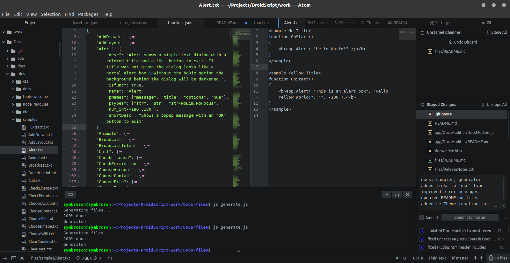

# Editing Docs using raw JSON files

- [Table of contents](#Table-of-contents)
    - [Setup](#Setup)
    - [Additional Views](#Additional-Views)
        - [Git](#Git)
        - [Terminal](#Terminal)
    - [Resulting view](#Resulting-view)
    - [JSON format](#JSON-format)
        - [Format](#Format)
            - [Type](#Type)
            - [Type Popups](#Type-Popups)
            - [Cross- Doc References](#Cross-Doc-References)
            - [Inline Code Areas](#Inline-Code-Areas)
            - [Custom Constructor positions](#Custom-Constructor-positions)
            - [Custom Sample positions](#Custom-Sample-positions)
            - [Examples](#Examples)
            - [HTML Tags](#HTML-Tags)
            - [Markdown](#Markdown)
    - [Generating](#Generating)
    - [Update Github Pages](#Update-Github-Pages)


## Setup

Open a plain text editor of your choice on your desktop PC.<br>
Personally I use the [Atom editor](https://atom.io) available for Linux, Windows or OS X, because it has any feature you'll need to comfortably edit the docs. This guide will focus on Atom as well.

- Open the 'Docs' Project folder
- Open all **files/*.json** files by double-clicking on them in the file tree view
    - for functions.json click **Edit/Folding/Fold Level 2** in the toolbar to get a comfortable overview over all functions
    - Optionally split your view vertically - on the right side you can open temporary needed files like **files/samples/***
- Enable _'Soft Wrap'_ in the Settings/Editor tab


## Additional Views

### Git
press **Ctrl-Shift-9** to open the **git tab** in a new pane on the right.<br>
There you can easily add, commit and even push changes to your repository

### Terminal
- download '**platformio-ide-terminal**' from Settings/Packages
- press **Alt-Shift-T** to open the terminal pane on the bottom


## Resulting view




## JSON format

Each function in the functions.json file has following format

```JSON
"<funcname>" : {
    "desc": "function description",
    "isfunc": true,
    "name": "funcname",
    "pNames": ["arg name 1", "arg name 2", "..."],
    "pTypes": ["arg type 1", "arg type 2", "..."],
    "retval": "retval type",
    "shortDesc": "short description",
    "subfuncs": {
        "subfunc name 1": { "<another function object>" },
        "subfunc name 2": { "<another function object>" }
    }
}
```

### Format

You can use following methods to format the documentation

#### Type
types have following format:

first specify of which type the variable is. This is a 3-character long string of
- `ukn`: unknown
- `all`: all types
- `bin`: boolean
- `num`: number
- `str`: string
- `lst`: list
- `obj`: object
- `fnc`: function
- `dso`: app object

optionally you can specify a subtype of your type separated with an underscore. These are predefined values in the [generate.js](generate.js) script. Currently only '`Number`' and '`String`' have subtypes available. Examples are
- `num_int`: integer
- `num_mls`: milliseconds
- `str_lst`: comma separated
- `str_url`: url

if the subtype you need isn't specified here you can add a 'basetype:description' to display a custom description. Example:
- `num:top left x coordinate`

if there is a fixed set of argument vales available you can add them separated with pipes '`|`' for alternatives or commas '`,`', with a leading '`-`' to begin the list. Example:
- `str_com-Linear|Frame|Absolute`

To describe a possible argument value more you can add a description text separated with '`:`'. Example:
- `str_com-Linear:linear ordered objects|Frame|Absolute`

#### Type Popups
If you want to use popups in a description text or in return values you can add the type separated with a '`:`', specifically `name:type`. Example:
- `"retval": "lst-[ values:num_int ]"`
- `"retval": "obj-{ width:num_orw, height:num_orh }"`

#### Cross-Doc References
You can easily referenciate other docs using the `@funcname` format. This is mostly used for 'See Also: 's
- See Also: [@WriteFile](WriteFile.htm)

#### Inline Code Areas
If you have a short command or code example you want to include without making it a Sample block, you can use the <js> tag. Example:
- `<js>img.DrawLine( 0, 0, 1, 1 );</js>`

#### Custom Constructor positions
By Default the constructor line of a DroidScript object will be inserted after the first sentence (marked with a dor '`.`'). But you can customize that position with the `%c` flag:
- `This is a description. Followed by more description. %c`

#### Custom Sample positions
If you want to put a sample of a sample.txt file to a specified position in your description, you can use the <sample> tag, where sample is followed by the sample name. Example:
- `<sample Sample Name>`

#### Examples
A good documentation should provide examples of the described method. The samples here can be copied and executed directly from the docs.<br>
Each sample should have a highlighted area which shows the snipped where the method was used. Use the &lt;b&gt; tag for that.<br>
The codes are located in the [samples](samples) folder, where each app function has its own <functionname>.txt file. It has following format:
```Html
<sample MyExample>
function OnStart()
{
    <b>app.Alert( "Hello World" );</b>
}
</sample>
```
You can disable an example using standard html comments like
```Html
<!--sample MyExample>
    // ...
</sample-->
```

<br>

Besides these special formats you also have following standard text formatting features available:

#### HTML Tags

#### Markdown
- \*\***bold**\*\*
- \__italic_\_
- \_\_<u>underlined</u>\_\_
- \**italic*\*
- \~\~~~strikethrouh~~\~\~
- \``code line`\`
- \`\`\````code block```\`\`\`
- \[[link](#)\]\(url\)


## Generating

- in a terminal navigate to _'files'_ by executing `$ cd files`
- execute `$ node generate.js` to generate all docs
- execute `$ node generate.js [function ...]` to generate specific docs
    - ie. `$ node generate.js Alert CreateLayout` will generate docs for _app.Alert_ and _app.CreateLayout_


## Update Github Pages

Execute following commands to update the GitHub Pages Docs preview:
```shell
# remove old docs from pages
rm -rdf ../docs/docs/

# copy new docs to pages
cp -r docs/ ../docs/
```
Alternatively update them manually with the atom tree view or a filebrowser of your choice
